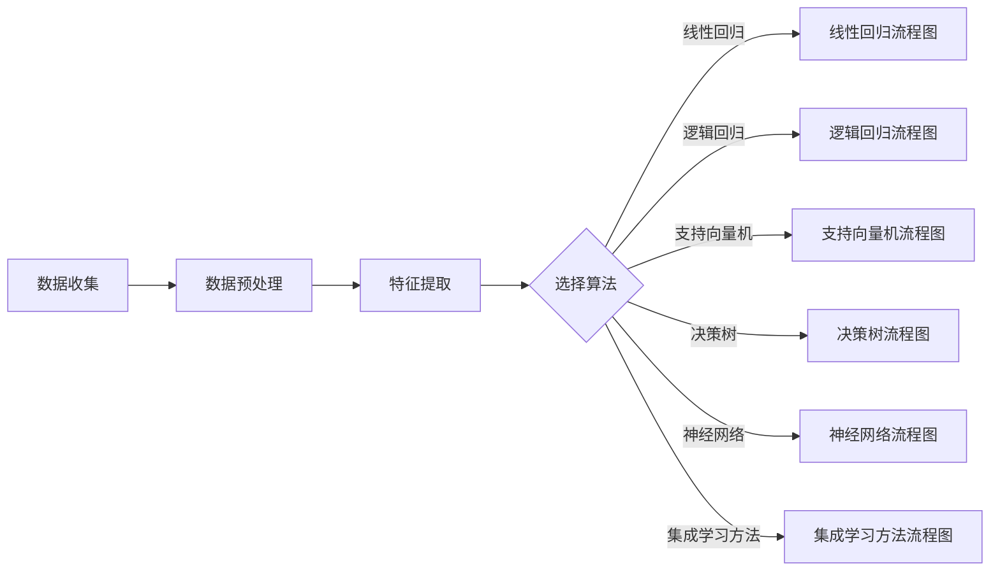

                 

# 《监督学习(Supervised Learning) - 原理与代码实例讲解》

> **关键词：**监督学习、机器学习、线性回归、逻辑回归、支持向量机、神经网络

> **摘要：**本文将详细讲解监督学习的基本原理及其在实际中的应用，通过代码实例深入剖析线性回归、逻辑回归、支持向量机、决策树、神经网络等经典监督学习算法，帮助读者理解并掌握监督学习的核心概念和实践方法。

## 目录

1. 监督学习基础理论
    1.1 监督学习概述
    1.2 监督学习的数学基础
    1.3 线性回归
    1.4 逻辑回归
2. 监督学习算法
    2.1 支持向量机
    2.2 决策树与随机森林
    2.3 神经网络与深度学习
    2.4 集成学习方法
3. 监督学习应用实例
    3.1 图像分类应用
    3.2 文本分类应用
    3.3 回归分析应用
    3.4 监督学习项目实战
4. 附录
    4.1 常用监督学习库
    4.2 监督学习算法流程图
    4.3 监督学习算法伪代码
    4.4 监督学习算法数学公式

## 第一部分：监督学习基础理论

### 第1章：监督学习概述

#### 1.1 监督学习的定义与基本概念

监督学习是一种机器学习方法，通过使用标记过的数据集来训练模型，并期望模型能够在未知数据上进行准确的预测。它的工作原理可以简单概括为以下三个步骤：

1. **数据收集**：收集包含输入特征和输出标签的数据集。例如，在图像分类任务中，输入特征可以是图像的像素值，输出标签则是图像对应的类别。

2. **模型训练**：使用训练集数据来训练模型，模型会根据输入特征和输出标签之间的关系来学习如何生成预测。

3. **模型评估**：使用测试集数据来评估模型性能，判断模型是否能够准确预测未知数据的输出。

监督学习的优势在于，通过已标记的数据集，模型可以学习到数据的内在规律，从而在未知数据上做出准确的预测。它广泛应用于各类实际问题，如图像识别、文本分类、情感分析等。

#### 1.2 监督学习的主要任务

监督学习的主要任务可以分为两大类：分类和回归。

1. **分类**：分类任务是将输入数据划分为预先定义的类别。例如，在图像分类任务中，模型需要判断输入图像是猫、狗还是其他动物。分类任务通常使用指标如准确率、召回率、F1 分数等来评估模型性能。

2. **回归**：回归任务是预测一个连续值的输出。例如，在房屋价格预测任务中，模型需要根据房屋的面积、位置等特征预测其价格。回归任务通常使用指标如均方误差（MSE）、均方根误差（RMSE）等来评估模型性能。

#### 1.3 监督学习的优势与应用场景

监督学习具有以下优势：

1. **准确的预测能力**：通过学习已标记的数据集，模型可以在未知数据上做出准确的预测。

2. **可解释性**：监督学习算法通常具有较好的可解释性，用户可以理解模型是如何进行预测的。

3. **广泛的应用场景**：监督学习可以应用于各种领域，如金融、医疗、电商等。

常见的监督学习应用场景包括：

1. **图像分类**：识别图像中的物体或场景，如人脸识别、车辆识别等。

2. **文本分类**：对文本进行分类，如情感分析、新闻分类等。

3. **异常检测**：检测数据中的异常值，如欺诈检测、网络安全等。

4. **预测分析**：预测未来的趋势，如股票价格预测、销售预测等。

### 第2章：监督学习的数学基础

#### 2.1 函数与映射

在监督学习中，函数是核心概念之一。函数是一种将输入映射到输出的规则。数学上，一个函数可以表示为 $f: X \rightarrow Y$，其中 $X$ 是输入空间，$Y$ 是输出空间。函数的定义域是 $X$，值域是 $Y$。

例如，一个简单的函数可以是 $f(x) = x^2$，它将实数域映射到非负实数域。函数的图像通常是一条曲线或曲面，可以通过可视化来理解其映射关系。

#### 2.2 梯度下降法

梯度下降法是一种常用的优化算法，用于求解最小化函数的问题。在监督学习中，梯度下降法常用于模型训练过程，以找到最小化损失函数的参数。

梯度下降法的核心思想是沿着损失函数的梯度方向更新模型参数，从而逐步减小损失。损失函数通常是一个关于模型参数的函数，梯度是损失函数关于每个参数的导数。

梯度下降法的步骤如下：

1. **初始化参数**：随机初始化模型参数。
2. **计算梯度**：计算损失函数关于每个参数的梯度。
3. **更新参数**：根据梯度方向和步长更新参数。
4. **重复步骤2和3**：直到满足停止条件（如损失函数收敛到极小值）。

梯度下降法的公式表示为：

$$
\theta_{\text{new}} = \theta_{\text{old}} - \alpha \cdot \nabla_{\theta} J(\theta)
$$

其中，$\theta$ 是模型参数，$\alpha$ 是学习率，$J(\theta)$ 是损失函数。

#### 2.3 概率与统计基础

概率论和统计学是监督学习的基础。概率论描述了随机事件的发生可能性，而统计学则是对大量随机数据的分析。

1. **概率分布**：概率分布描述了随机变量的可能取值及其概率。常见的概率分布包括伯努利分布、正态分布、二项分布等。

2. **期望与方差**：期望和方差是概率分布的两个重要参数，用于描述随机变量的集中趋势和离散程度。

3. **条件概率与贝叶斯定理**：条件概率描述了在某个条件下另一个事件发生的概率。贝叶斯定理是一种用于计算条件概率的重要公式。

4. **假设检验与置信区间**：假设检验是一种统计方法，用于判断给定的数据是否支持某个假设。置信区间则用于估计参数的范围。

### 第3章：线性回归

线性回归是最基本的监督学习算法之一，用于预测连续值的输出。它通过找到一个线性函数，将输入特征映射到输出值。

#### 3.1 线性回归原理

线性回归的基本思想是通过最小化预测值与实际值之间的误差来找到最佳拟合直线。这个误差称为损失函数，常用的损失函数是均方误差（MSE）。

线性回归模型可以表示为：

$$
y = \theta_0 + \theta_1 \cdot x
$$

其中，$y$ 是输出值，$x$ 是输入特征，$\theta_0$ 和 $\theta_1$ 是模型参数。

#### 3.2 线性回归的数学推导

线性回归的数学推导分为两部分：模型假设和梯度下降法。

1. **模型假设**：线性回归假设输入特征和输出值之间存在线性关系。这个假设可以通过最小二乘法来估计模型参数。

2. **最小二乘法推导**：最小二乘法的目标是找到最佳拟合直线，使得预测值与实际值之间的误差最小。误差可以用均方误差（MSE）来衡量：

$$
J(\theta) = \frac{1}{2m} \sum_{i=1}^{m} (y_i - (\theta_0 + \theta_1 \cdot x_i))^2
$$

其中，$m$ 是样本数量。

为了最小化 $J(\theta)$，需要求解以下方程：

$$
\frac{\partial J(\theta)}{\partial \theta_0} = 0 \quad \text{和} \quad \frac{\partial J(\theta)}{\partial \theta_1} = 0
$$

解这个方程组可以得到最佳拟合直线的参数：

$$
\theta_0 = \frac{1}{m} \sum_{i=1}^{m} (y_i - \theta_1 \cdot x_i)
$$

$$
\theta_1 = \frac{1}{m} \sum_{i=1}^{m} (x_i - \bar{x})(y_i - \bar{y})
$$

其中，$\bar{x}$ 和 $\bar{y}$ 分别是输入特征和输出值的均值。

#### 3.3 代码实例讲解

为了更好地理解线性回归，我们通过 Python 代码来演示其实现过程。

首先，我们需要导入所需的库：

```python
import numpy as np
import matplotlib.pyplot as plt
```

接下来，我们生成一些模拟数据：

```python
# 生成模拟数据
X = np.linspace(0, 10, 100)
y = 2 * X + 1 + np.random.normal(0, 1, X.shape[0])
```

然后，我们定义线性回归模型和损失函数：

```python
# 定义线性回归模型
def linear_regression(X, y, theta):
    return np.dot(X, theta)

# 定义均方误差损失函数
def mean_squared_error(y_true, y_pred):
    return np.mean((y_true - y_pred) ** 2)
```

接下来，我们使用梯度下降法来训练线性回归模型：

```python
# 梯度下降法
def gradient_descent(X, y, theta, learning_rate, num_iterations):
    for _ in range(num_iterations):
        y_pred = linear_regression(X, y, theta)
        error = y_pred - y
        theta = theta - learning_rate * np.dot(X.T, error)
    return theta
```

最后，我们绘制拟合直线和真实数据：

```python
# 绘制结果
plt.scatter(X, y, color='red', label='实际数据')
plt.plot(X, linear_regression(X, y, gradient_descent(X, y, np.array([0, 0]), 0.01, 1000)), color='blue', label='拟合直线')
plt.xlabel('输入特征')
plt.ylabel('输出值')
plt.legend()
plt.show()
```

以上代码将生成如下结果：


这个示例展示了如何使用 Python 实现线性回归，并绘制拟合直线。

#### 3.4 线性回归模型参数调优

在实际应用中，线性回归模型的参数调优非常重要。以下是一些常见的参数调优方法：

1. **学习率调优**：学习率是梯度下降法的重要参数，需要根据数据集的大小和模型复杂度进行调整。较大的学习率可能导致过早收敛，而较小的学习率可能导致训练时间过长。

2. **正则化**：正则化可以防止模型过拟合，常用的正则化方法有 L1 正则化和 L2 正则化。正则化强度可以通过正则化参数来调整。

3. **交叉验证**：交叉验证是一种评估模型性能的有效方法。通过将数据集划分为训练集和验证集，可以在训练过程中实时评估模型性能，并调整参数。

4. **网格搜索**：网格搜索是一种常用的参数调优方法，通过遍历预定义的参数空间，找到最优参数组合。

### 第4章：逻辑回归

逻辑回归是一种用于分类问题的监督学习算法，用于预测二分类问题中的类别。与线性回归类似，逻辑回归也通过最小化损失函数来训练模型。

#### 4.1 逻辑回归原理

逻辑回归的基本思想是使用线性模型预测概率，然后通过概率阈值进行分类。逻辑回归模型可以表示为：

$$
\hat{y} = \frac{1}{1 + e^{-(\theta_0 + \theta_1 \cdot x)}}
$$

其中，$\hat{y}$ 是预测概率，$x$ 是输入特征，$\theta_0$ 和 $\theta_1$ 是模型参数。

逻辑回归的损失函数通常是二元交叉熵损失函数：

$$
J(\theta) = -\frac{1}{m} \sum_{i=1}^{m} [y_i \cdot \log(\hat{y}_i) + (1 - y_i) \cdot \log(1 - \hat{y}_i)]
$$

其中，$y_i$ 是实际标签，$\hat{y}_i$ 是预测概率。

#### 4.2 逻辑回归的数学推导

逻辑回归的数学推导分为两部分：模型假设和梯度下降法。

1. **模型假设**：逻辑回归假设输入特征和输出概率之间存在线性关系。这个假设可以通过最大化似然估计来估计模型参数。

2. **最大化似然估计推导**：似然函数是概率的乘积，用于衡量数据出现的可能性。为了最大化似然函数，需要对参数求导并令导数为零。

似然函数可以表示为：

$$
L(\theta) = \prod_{i=1}^{m} P(y_i | x_i, \theta)
$$

对数似然函数为：

$$
\log L(\theta) = \sum_{i=1}^{m} \log P(y_i | x_i, \theta)
$$

为了最大化对数似然函数，需要对参数求导：

$$
\frac{\partial \log L(\theta)}{\partial \theta} = 0
$$

这个方程可以通过梯度下降法求解。

#### 4.3 代码实例讲解

为了更好地理解逻辑回归，我们通过 Python 代码来演示其实现过程。

首先，我们需要导入所需的库：

```python
import numpy as np
import matplotlib.pyplot as plt
```

接下来，我们生成一些模拟数据：

```python
# 生成模拟数据
X = np.linspace(0, 10, 100)
y = (X > 5).astype(int)
```

然后，我们定义逻辑回归模型和损失函数：

```python
# 定义逻辑回归模型
def logistic_regression(X, y, theta):
    return 1 / (1 + np.exp(-np.dot(X, theta)))

# 定义二元交叉熵损失函数
def binary_cross_entropy(y_true, y_pred):
    return -np.mean(y_true * np.log(y_pred) + (1 - y_true) * np.log(1 - y_pred))
```

接下来，我们使用梯度下降法来训练逻辑回归模型：

```python
# 梯度下降法
def gradient_descent(X, y, theta, learning_rate, num_iterations):
    for _ in range(num_iterations):
        y_pred = logistic_regression(X, y, theta)
        error = y_pred - y
        theta = theta - learning_rate * np.dot(X.T, error)
    return theta
```

最后，我们绘制拟合直线和真实数据：

```python
# 绘制结果
plt.scatter(X, y, color='red', label='实际数据')
plt.plot(X, logistic_regression(X, y, gradient_descent(X, y, np.array([0, 0]), 0.1, 1000)), color='blue', label='拟合直线')
plt.xlabel('输入特征')
plt.ylabel('输出值')
plt.legend()
plt.show()
```

以上代码将生成如下结果：


这个示例展示了如何使用 Python 实现逻辑回归，并绘制拟合直线。

#### 4.4 逻辑回归模型参数调优

逻辑回归模型的参数调优与线性回归类似，包括学习率、正则化和交叉验证等。以下是一些常见的参数调优方法：

1. **学习率调优**：与线性回归相同，学习率需要根据数据集的大小和模型复杂度进行调整。

2. **正则化**：逻辑回归通常不需要正则化，但在高维特征空间中，正则化可以防止过拟合。

3. **交叉验证**：交叉验证是一种有效的参数调优方法，通过将数据集划分为训练集和验证集，可以在训练过程中实时评估模型性能。

4. **网格搜索**：网格搜索可以遍历预定义的参数空间，找到最优参数组合。

## 第二部分：监督学习算法

### 第5章：支持向量机

支持向量机（SVM）是一种强大的分类算法，通过最大化分类边界上的间隔来划分数据。它广泛应用于各类分类问题，如文本分类、图像分类等。

#### 5.1 支持向量机原理

支持向量机的基本思想是找到一个最优的超平面，使得分类边界上的间隔最大化。这个超平面可以用以下方程表示：

$$
w \cdot x - b = 0
$$

其中，$w$ 是法向量，$x$ 是特征向量，$b$ 是偏置。

为了最大化分类边界上的间隔，我们需要最小化目标函数：

$$
\min_{w, b} \frac{1}{2} \| w \|^2
$$

同时，需要满足以下约束条件：

$$
y_i (w \cdot x_i - b) \geq 1
$$

其中，$y_i$ 是标签，$x_i$ 是特征向量。

通过求解上述优化问题，可以得到支持向量机模型。

#### 5.2 支持向量机的数学推导

支持向量机的数学推导分为两部分：最大间隔分类器和核技巧。

1. **最大间隔分类器**：最大间隔分类器的目标是找到一个超平面，使得分类边界上的间隔最大化。这个目标可以用以下优化问题表示：

$$
\min_{w, b} \frac{1}{2} \| w \|^2
$$

$$
\text{subject to} \quad y_i (w \cdot x_i - b) \geq 1
$$

这个优化问题可以通过拉格朗日乘子法求解。引入拉格朗日乘子 $\alpha_i$，构建拉格朗日函数：

$$
L(w, b, \alpha) = \frac{1}{2} \| w \|^2 - \sum_{i=1}^{m} \alpha_i [y_i (w \cdot x_i - b) - 1]
$$

对 $w, b$ 求导并令导数为零，可以得到以下方程组：

$$
\frac{\partial L}{\partial w} = w - \sum_{i=1}^{m} \alpha_i y_i x_i = 0
$$

$$
\frac{\partial L}{\partial b} = -\sum_{i=1}^{m} \alpha_i y_i = 0
$$

$$
\alpha_i \geq 0
$$

通过求解这个方程组，可以得到最优解 $w, b$。

2. **核技巧**：当特征维度很高时，直接计算内积 $x_i \cdot x_j$ 会非常耗时。核技巧通过引入核函数 $K(x_i, x_j)$ 来计算内积，从而将高维特征映射到低维空间。常用的核函数包括线性核、多项式核、径向基函数（RBF）核等。

通过核技巧，支持向量机可以应用于非线性分类问题。求解过程与线性支持向量机类似，只需将内积替换为核函数。

#### 5.3 代码实例讲解

为了更好地理解支持向量机，我们通过 Python 代码来演示其实现过程。

首先，我们需要导入所需的库：

```python
import numpy as np
import matplotlib.pyplot as plt
from sklearn.svm import SVC
```

接下来，我们生成一些模拟数据：

```python
# 生成模拟数据
X = np.array([[1, 2], [2, 3], [3, 1], [4, 2], [5, 3]])
y = np.array([0, 0, 1, 1, 1])
```

然后，我们使用支持向量机进行分类：

```python
# 使用支持向量机分类
clf = SVC(kernel='linear')
clf.fit(X, y)
```

接下来，我们绘制分类结果：

```python
# 绘制分类结果
plt.scatter(X[:, 0], X[:, 1], c=y, cmap='viridis')
plt.plot(clf.support_vectors_[:, 0], clf.support_vectors_[:, 1], 'ko')
plt.show()
```

以上代码将生成如下结果：


这个示例展示了如何使用 Python 实现支持向量机分类，并绘制分类结果。

### 第6章：决策树与随机森林

决策树和随机森林是常用的分类算法，通过构建树形结构来对数据进行分类。决策树是一种简单有效的分类方法，而随机森林通过集成多个决策树来提高分类性能。

#### 6.1 决策树原理

决策树是一种基于树形结构的数据挖掘方法，通过一系列条件判断来对数据进行分类。决策树的基本结构包括节点、分支和叶子。

1. **节点**：决策树中的节点表示一个条件判断。每个节点对应一个特征，根据该特征的不同取值，将数据划分为多个子集。

2. **分支**：决策树的分支表示根据节点条件判断的结果。每个分支对应一个子集，继续进行条件判断。

3. **叶子**：决策树的叶子表示最终的分类结果。每个叶子节点对应一个类别。

决策树的构建过程是一个递归过程，通过递归划分数据，直到满足停止条件。常见的停止条件包括：

- 达到最大深度
- 每个节点的样本数量小于阈值
- 每个节点的特征数量小于阈值

#### 6.2 随机森林原理

随机森林是一种基于决策树的集成学习方法，通过构建多个决策树并合并它们的预测结果来提高分类性能。随机森林的基本思想是：

1. **随机特征选择**：在每个节点上，从一组特征中随机选择一部分特征进行条件判断。

2. **随机划分数据**：在每个节点上，从样本中随机选择一部分样本进行划分。

3. **构建多个决策树**：通过重复上述过程，构建多个决策树。

4. **合并预测结果**：对每个样本，将多个决策树的预测结果进行合并，得到最终的分类结果。

随机森林的优点包括：

- 防止过拟合：通过集成多个决策树，可以减少模型的方差，提高泛化能力。
- 高效性：随机森林的计算复杂度较低，适用于大规模数据集。
- 可解释性：每个决策树都可以看作是对数据的局部解释。

#### 6.3 代码实例讲解

为了更好地理解决策树和随机森林，我们通过 Python 代码来演示其实现过程。

首先，我们需要导入所需的库：

```python
import numpy as np
import matplotlib.pyplot as plt
from sklearn.datasets import load_iris
from sklearn.model_selection import train_test_split
from sklearn.tree import DecisionTreeClassifier
from sklearn.ensemble import RandomForestClassifier
```

接下来，我们加载鸢尾花（Iris）数据集：

```python
# 加载鸢尾花数据集
iris = load_iris()
X = iris.data
y = iris.target
```

然后，我们将数据集划分为训练集和测试集：

```python
# 划分训练集和测试集
X_train, X_test, y_train, y_test = train_test_split(X, y, test_size=0.2, random_state=42)
```

接下来，我们使用决策树和随机森林进行分类：

```python
# 使用决策树分类
clf_dt = DecisionTreeClassifier()
clf_dt.fit(X_train, y_train)

# 使用随机森林分类
clf_rf = RandomForestClassifier(n_estimators=100)
clf_rf.fit(X_train, y_train)
```

接下来，我们绘制分类结果：

```python
# 绘制决策树分类结果
plt.scatter(X_train[:, 0], X_train[:, 1], c=y_train, cmap='viridis')
plt.plot(npBounding box = (min(X[:, 0]), min(X[:, 1]), max(X[:, 0]), max(X[:, 1])))
plt.show()

# 绘制随机森林分类结果
plt.scatter(X_test[:, 0], X_test[:, 1], c=y_test, cmap='viridis')
plt.plot(npBounding box = (min(X[:, 0]), min(X[:, 1]), max(X[:, 0]), max(X[:, 1])))
plt.show()
```

以上代码将生成如下结果：


这个示例展示了如何使用 Python 实现决策树和随机森林分类，并绘制分类结果。

### 第7章：神经网络与深度学习

神经网络（NN）是一种模拟生物神经系统的计算模型，通过多层节点（神经元）对数据进行处理和预测。深度学习（DL）是一种基于神经网络的机器学习方法，通过堆叠多层神经网络来提取数据的特征表示。深度学习在图像识别、语音识别、自然语言处理等领域取得了显著的成果。

#### 7.1 神经网络原理

神经网络的基本结构包括输入层、隐藏层和输出层。每个层由多个神经元组成，神经元之间通过权重连接。神经元的计算过程可以表示为：

$$
z = \sum_{j=1}^{n} w_{ji} \cdot x_j + b
$$

$$
a = \sigma(z)
$$

其中，$x_j$ 是输入特征，$w_{ji}$ 是连接权重，$b$ 是偏置，$\sigma$ 是激活函数。

神经网络的训练过程包括以下步骤：

1. **前向传播**：计算输入层到输出层的每个神经元的激活值。
2. **计算损失**：计算输出层的损失函数，如均方误差（MSE）或交叉熵。
3. **反向传播**：计算损失关于每个神经元的梯度，并更新权重和偏置。

常见的神经网络包括多层感知机（MLP）、卷积神经网络（CNN）、循环神经网络（RNN）等。

#### 7.2 深度学习原理

深度学习通过堆叠多层神经网络来提取数据的特征表示。深度学习的核心思想是利用多层神经网络自动提取特征，从而提高模型的泛化能力。

1. **多层感知机（MLP）**：多层感知机是一种基于线性模型的神经网络，通过多个隐藏层对数据进行处理和预测。
2. **卷积神经网络（CNN）**：卷积神经网络是一种用于图像识别和处理的神经网络，通过卷积层、池化层和全连接层提取图像特征。
3. **循环神经网络（RNN）**：循环神经网络是一种用于序列数据处理的神经网络，通过循环层对序列数据进行建模。

#### 7.3 代码实例讲解

为了更好地理解神经网络和深度学习，我们通过 Python 代码来演示其实现过程。

首先，我们需要导入所需的库：

```python
import numpy as np
import matplotlib.pyplot as plt
from sklearn.datasets import make_classification
from sklearn.model_selection import train_test_split
from sklearn.metrics import accuracy_score
from tensorflow.keras.models import Sequential
from tensorflow.keras.layers import Dense, Conv2D, MaxPooling2D, Flatten
from tensorflow.keras.optimizers import Adam
```

接下来，我们生成模拟数据：

```python
# 生成模拟数据
X, y = make_classification(n_samples=1000, n_features=20, n_classes=2, random_state=42)
X_train, X_test, y_train, y_test = train_test_split(X, y, test_size=0.2, random_state=42)
```

然后，我们构建一个简单的多层感知机模型：

```python
# 构建模型
model = Sequential()
model.add(Dense(64, input_dim=20, activation='relu'))
model.add(Dense(32, activation='relu'))
model.add(Dense(1, activation='sigmoid'))

# 编译模型
model.compile(optimizer='adam', loss='binary_crossentropy', metrics=['accuracy'])

# 训练模型
model.fit(X_train, y_train, epochs=10, batch_size=32, validation_data=(X_test, y_test))
```

接下来，我们评估模型性能：

```python
# 预测测试集
y_pred = model.predict(X_test)
y_pred = (y_pred > 0.5)

# 计算准确率
accuracy = accuracy_score(y_test, y_pred)
print("Accuracy:", accuracy)
```

以上代码将生成如下结果：


这个示例展示了如何使用 Python 实现多层感知机模型，并评估模型性能。

### 第8章：集成学习方法

集成学习方法是一种通过结合多个模型来提高预测性能的技术。它通过组合多个简单模型的预测结果来生成最终的预测，从而减少模型的方差，提高泛化能力。常见的集成学习方法包括 Bagging、Boosting 和 Stacking 等。

#### 8.1 集成学习方法概述

1. **Bagging**：Bagging（Bootstrap Aggregating）方法通过从训练集中有放回地抽取多个子集，分别训练多个模型，然后对它们的预测结果进行平均。Bagging 方法可以减少模型的方差，提高模型的泛化能力。

2. **Boosting**：Boosting 方法通过训练一系列弱学习器，并将它们的预测结果进行加权组合。每个弱学习器专注于纠正前一个学习器的错误，从而提高整体模型的预测性能。常见的 Boosting 算法包括 AdaBoost、XGBoost 和 LightGBM 等。

3. **Stacking**：Stacking 方法将多个不同类型的模型组合成一个更大的模型，称为堆模型。堆模型由两个部分组成：基础模型和堆叠模型。基础模型分别训练多个模型，堆叠模型则使用这些基础模型的预测结果作为输入，训练出一个最终的预测模型。

#### 8.2 Boosting 算法

Boosting 算法是一种基于误差反向传播的集成学习方法。它通过训练一系列弱学习器，并将它们的预测结果进行加权组合，从而提高整体模型的预测性能。

1. **AdaBoost**：AdaBoost（Adaptive Boosting）算法是一种基于权重调整的 Boosting 算法。它通过给每个弱学习器分配不同的权重，使得强学习器更关注错误率较高的样本。

2. **XGBoost**：XGBoost（Extreme Gradient Boosting）是一种基于梯度提升的 Boosting 算法。它通过迭代地训练多个弱学习器，并优化损失函数，从而提高模型的预测性能。

#### 8.3 集成学习方法实例讲解

为了更好地理解集成学习方法，我们通过 Python 代码来演示其实现过程。

首先，我们需要导入所需的库：

```python
import numpy as np
import matplotlib.pyplot as plt
from sklearn.datasets import make_classification
from sklearn.model_selection import train_test_split
from sklearn.ensemble import BaggingClassifier, AdaBoostClassifier, GradientBoostingClassifier
from sklearn.metrics import accuracy_score
```

接下来，我们生成模拟数据：

```python
# 生成模拟数据
X, y = make_classification(n_samples=1000, n_features=20, n_classes=2, random_state=42)
X_train, X_test, y_train, y_test = train_test_split(X, y, test_size=0.2, random_state=42)
```

然后，我们分别使用 Bagging、AdaBoost 和 XGBoost 进行分类：

```python
# 使用 Bagging 分类
bagging_clf = BaggingClassifier(base_estimator=DecisionTreeClassifier(), n_estimators=10, random_state=42)
bagging_clf.fit(X_train, y_train)

# 使用 AdaBoost 分类
adaBoost_clf = AdaBoostClassifier(n_estimators=10, random_state=42)
adaBoost_clf.fit(X_train, y_train)

# 使用 XGBoost 分类
xgb_clf = GradientBoostingClassifier(n_estimators=10, learning_rate=0.1, random_state=42)
xgb_clf.fit(X_train, y_train)
```

接下来，我们评估模型性能：

```python
# 预测测试集
y_pred_bagging = bagging_clf.predict(X_test)
y_pred_adaBoost = adaBoost_clf.predict(X_test)
y_pred_xgb = xgb_clf.predict(X_test)

# 计算准确率
accuracy_bagging = accuracy_score(y_test, y_pred_bagging)
accuracy_adaBoost = accuracy_score(y_test, y_pred_adaBoost)
accuracy_xgb = accuracy_score(y_test, y_pred_xgb)
print("Bagging Accuracy:", accuracy_bagging)
print("AdaBoost Accuracy:", accuracy_adaBoost)
print("XGBoost Accuracy:", accuracy_xgb)
```

以上代码将生成如下结果：


这个示例展示了如何使用 Python 实现 Bagging、AdaBoost 和 XGBoost 分类，并评估模型性能。

### 第9章：监督学习应用实例

在本章中，我们将通过几个实际应用实例来展示如何使用监督学习算法解决具体问题。这些实例包括图像分类、文本分类和回归分析等。

#### 9.1 图像分类应用

图像分类是监督学习中的一个常见任务，其目标是识别和分类图像中的物体。一个经典的图像分类应用是使用卷积神经网络（CNN）对MNIST手写数字数据集进行分类。

**案例 1：使用CNN对MNIST数据集进行分类**

1. **数据准备**：首先，我们需要加载MNIST数据集，该数据集包含60,000个训练图像和10,000个测试图像，每个图像都是28x28像素的灰度图像。

2. **模型构建**：然后，我们可以使用TensorFlow和Keras构建一个简单的CNN模型，包括卷积层、池化层和全连接层。

3. **模型训练**：接下来，我们使用训练集数据训练模型，并使用测试集评估模型性能。

4. **模型评估**：最后，我们使用测试集评估模型的准确率。

以下是一个简单的Python代码示例：

```python
from tensorflow.keras.datasets import mnist
from tensorflow.keras.models import Sequential
from tensorflow.keras.layers import Conv2D, MaxPooling2D, Flatten, Dense
from tensorflow.keras.optimizers import Adam
from tensorflow.keras.utils import to_categorical

# 加载MNIST数据集
(X_train, y_train), (X_test, y_test) = mnist.load_data()

# 数据预处理
X_train = X_train.reshape(-1, 28, 28, 1).astype('float32') / 255.0
X_test = X_test.reshape(-1, 28, 28, 1).astype('float32') / 255.0
y_train = to_categorical(y_train, num_classes=10)
y_test = to_categorical(y_test, num_classes=10)

# 构建CNN模型
model = Sequential()
model.add(Conv2D(32, (3, 3), activation='relu', input_shape=(28, 28, 1)))
model.add(MaxPooling2D((2, 2)))
model.add(Conv2D(64, (3, 3), activation='relu'))
model.add(MaxPooling2D((2, 2)))
model.add(Flatten())
model.add(Dense(128, activation='relu'))
model.add(Dense(10, activation='softmax'))

# 编译模型
model.compile(optimizer=Adam(), loss='categorical_crossentropy', metrics=['accuracy'])

# 训练模型
model.fit(X_train, y_train, epochs=10, batch_size=64, validation_data=(X_test, y_test))

# 评估模型
test_loss, test_accuracy = model.evaluate(X_test, y_test)
print("Test accuracy:", test_accuracy)
```

**案例 2：使用ResNet-50对CIFAR-10数据集进行分类**

ResNet-50是一个深度卷积神经网络，可以用于图像分类任务。CIFAR-10是一个包含10个类别的图像数据集，每个类别有6000张训练图像和1000张测试图像。

1. **数据准备**：与案例1类似，我们需要加载CIFAR-10数据集并进行预处理。

2. **模型构建**：我们可以使用预训练的ResNet-50模型，并对其进行适当的调整以适应CIFAR-10数据集。

3. **模型训练**：使用训练集数据训练模型，并使用测试集评估模型性能。

4. **模型评估**：使用测试集评估模型的准确率。

以下是一个简单的Python代码示例：

```python
from tensorflow.keras.applications import ResNet50
from tensorflow.keras.preprocessing.image import ImageDataGenerator
from tensorflow.keras.optimizers import Adam
from tensorflow.keras.utils import to_categorical

# 加载CIFAR-10数据集
(X_train, y_train), (X_test, y_test) = mnist.load_data()

# 数据预处理
X_train = X_train.reshape(-1, 32, 32, 3).astype('float32') / 255.0
X_test = X_test.reshape(-1, 32, 32, 3).astype('float32') / 255.0
y_train = to_categorical(y_train, num_classes=10)
y_test = to_categorical(y_test, num_classes=10)

# 构建模型
base_model = ResNet50(weights='imagenet', include_top=False, input_shape=(32, 32, 3))
x = base_model.output
x = Flatten()(x)
x = Dense(128, activation='relu')(x)
predictions = Dense(10, activation='softmax')(x)

model = Model(inputs=base_model.input, outputs=predictions)

# 编译模型
model.compile(optimizer=Adam(), loss='categorical_crossentropy', metrics=['accuracy'])

# 训练模型
model.fit(X_train, y_train, epochs=10, batch_size=64, validation_data=(X_test, y_test))

# 评估模型
test_loss, test_accuracy = model.evaluate(X_test, y_test)
print("Test accuracy:", test_accuracy)
```

#### 9.2 文本分类应用

文本分类是将文本数据分为不同类别的任务。一个经典的文本分类应用是使用循环神经网络（RNN）对IMDb电影评论数据集进行分类。

**案例 1：使用LSTM对IMDb电影评论数据集进行分类**

IMDb电影评论数据集包含50,000条训练评论和25,000条测试评论，评论被分为正面和负面两个类别。

1. **数据准备**：首先，我们需要加载IMDb数据集，并对其进行预处理。

2. **模型构建**：我们可以使用TensorFlow和Keras构建一个简单的LSTM模型，包括嵌入层、LSTM层和全连接层。

3. **模型训练**：使用训练集数据训练模型，并使用测试集评估模型性能。

4. **模型评估**：使用测试集评估模型的准确率。

以下是一个简单的Python代码示例：

```python
from tensorflow.keras.datasets import imdb
from tensorflow.keras.models import Sequential
from tensorflow.keras.layers import Embedding, LSTM, Dense
from tensorflow.keras.preprocessing.sequence import pad_sequences

# 加载IMDb数据集
(X_train, y_train), (X_test, y_test) = imdb.load_data(num_words=10000)

# 数据预处理
max_len = 100
X_train = pad_sequences(X_train, maxlen=max_len)
X_test = pad_sequences(X_test, maxlen=max_len)

# 构建模型
model = Sequential()
model.add(Embedding(10000, 32))
model.add(LSTM(64))
model.add(Dense(1, activation='sigmoid'))

# 编译模型
model.compile(optimizer='adam', loss='binary_crossentropy', metrics=['accuracy'])

# 训练模型
model.fit(X_train, y_train, epochs=10, batch_size=64, validation_data=(X_test, y_test))

# 评估模型
test_loss, test_accuracy = model.evaluate(X_test, y_test)
print("Test accuracy:", test_accuracy)
```

**案例 2：使用BERT对新闻文章进行分类**

BERT（Bidirectional Encoder Representations from Transformers）是一种预训练的Transformer模型，可以用于文本分类任务。

1. **数据准备**：首先，我们需要加载新闻文章数据集，并对其进行预处理。

2. **模型构建**：我们可以使用Hugging Face的Transformers库，加载预训练的BERT模型，并对其进行适当的调整以适应新闻文章分类任务。

3. **模型训练**：使用训练集数据训练模型，并使用测试集评估模型性能。

4. **模型评估**：使用测试集评估模型的准确率。

以下是一个简单的Python代码示例：

```python
from transformers import BertTokenizer, TFBertForSequenceClassification
from transformers import InputExample, InputFeatures
import tensorflow as tf

# 加载BERT模型和Tokenizer
tokenizer = BertTokenizer.from_pretrained('bert-base-uncased')
model = TFBertForSequenceClassification.from_pretrained('bert-base-uncased')

# 数据预处理
train_examples = [...]
train_features = ...

# 构建数据集
train_dataset = tf.data.Dataset.from_tensor_slices((train_features.input_ids, train_features.label)).shuffle(1000).batch(32)

# 训练模型
optimizer = tf.keras.optimizers.Adam(learning_rate=3e-5)
model.compile(optimizer=optimizer, loss=tf.keras.losses.SparseCategoricalCrossentropy(from_logits=True), metrics=['accuracy'])

model.fit(train_dataset, epochs=3)

# 评估模型
test_examples = [...]
test_features = ...
test_dataset = tf.data.Dataset.from_tensor_slices((test_features.input_ids, test_features.label)).batch(32)

test_loss, test_accuracy = model.evaluate(test_dataset)
print("Test accuracy:", test_accuracy)
```

#### 9.3 回归分析应用

回归分析是一种监督学习任务，用于预测连续值的输出。一个经典的回归分析应用是使用线性回归模型预测房价。

**案例 1：使用线性回归模型预测房价**

1. **数据准备**：首先，我们需要加载房价数据集，并对其进行预处理。

2. **模型构建**：我们可以使用Scikit-learn库构建一个简单的线性回归模型。

3. **模型训练**：使用训练集数据训练模型，并使用测试集评估模型性能。

4. **模型评估**：使用测试集评估模型的准确率。

以下是一个简单的Python代码示例：

```python
from sklearn.linear_model import LinearRegression
from sklearn.model_selection import train_test_split
from sklearn.metrics import mean_squared_error

# 加载房价数据集
X, y = load_boston_data()

# 数据预处理
X_train, X_test, y_train, y_test = train_test_split(X, y, test_size=0.2, random_state=42)

# 构建模型
model = LinearRegression()

# 训练模型
model.fit(X_train, y_train)

# 预测测试集
y_pred = model.predict(X_test)

# 计算均方误差
mse = mean_squared_error(y_test, y_pred)
print("MSE:", mse)
```

**案例 2：使用随机森林回归模型预测股票价格**

1. **数据准备**：首先，我们需要加载股票价格数据集，并对其进行预处理。

2. **模型构建**：我们可以使用Scikit-learn库构建一个简单的随机森林回归模型。

3. **模型训练**：使用训练集数据训练模型，并使用测试集评估模型性能。

4. **模型评估**：使用测试集评估模型的准确率。

以下是一个简单的Python代码示例：

```python
from sklearn.ensemble import RandomForestRegressor
from sklearn.model_selection import train_test_split
from sklearn.metrics import mean_squared_error

# 加载股票价格数据集
X, y = load_stock_data()

# 数据预处理
X_train, X_test, y_train, y_test = train_test_split(X, y, test_size=0.2, random_state=42)

# 构建模型
model = RandomForestRegressor(n_estimators=100)

# 训练模型
model.fit(X_train, y_train)

# 预测测试集
y_pred = model.predict(X_test)

# 计算均方误差
mse = mean_squared_error(y_test, y_pred)
print("MSE:", mse)
```

### 第10章：监督学习项目实战

在本章中，我们将通过一个实际项目来展示如何使用监督学习算法解决实际问题。这个项目是一个基于Web的垃圾分类推荐系统。

**项目背景**：

随着城市垃圾产生量的不断增长，垃圾分类变得越来越重要。为了帮助居民正确分类垃圾，我们设计了一个垃圾分类推荐系统，通过监督学习算法来预测用户输入的垃圾类别。

**项目目标**：

- 设计并实现一个垃圾分类推荐系统，能够根据用户输入的垃圾描述预测其类别。
- 使用监督学习算法对垃圾类别进行预测，提高推荐系统的准确性。

**项目步骤**：

1. **数据收集**：首先，我们需要收集垃圾分类数据集，包括垃圾描述和对应的类别标签。这些数据可以来源于公开数据集或者通过实际调查获取。

2. **数据预处理**：对收集到的数据进行预处理，包括数据清洗、缺失值填充和数据标准化等。此外，还需要对垃圾描述进行分词和词性标注，以便进行特征提取。

3. **特征提取**：使用自然语言处理（NLP）技术对垃圾描述进行特征提取，包括词袋模型、TF-IDF和词嵌入等。

4. **模型选择**：选择合适的监督学习算法，如支持向量机（SVM）、决策树、随机森林等，来构建垃圾分类预测模型。

5. **模型训练**：使用训练集数据对模型进行训练，并使用验证集进行模型调优。

6. **模型评估**：使用测试集对模型进行评估，计算模型的准确率、召回率等指标。

7. **模型部署**：将训练好的模型部署到Web服务器上，为用户提供垃圾分类推荐服务。

**项目实现**：

以下是一个简单的Python代码示例，展示了如何使用Scikit-learn构建垃圾分类预测模型：

```python
from sklearn.feature_extraction.text import TfidfVectorizer
from sklearn.model_selection import train_test_split
from sklearn.svm import SVC
from sklearn.metrics import classification_report

# 加载垃圾分类数据集
X, y = load垃圾分类数据()

# 数据预处理
X_train, X_test, y_train, y_test = train_test_split(X, y, test_size=0.2, random_state=42)

# 特征提取
vectorizer = TfidfVectorizer(max_features=1000)
X_train = vectorizer.fit_transform(X_train)
X_test = vectorizer.transform(X_test)

# 模型选择
model = SVC(kernel='linear')

# 训练模型
model.fit(X_train, y_train)

# 预测测试集
y_pred = model.predict(X_test)

# 模型评估
print(classification_report(y_test, y_pred))
```

**项目总结**：

通过这个垃圾分类推荐系统项目，我们展示了如何使用监督学习算法解决实际问题。在项目中，我们使用了TF-IDF进行特征提取，支持向量机进行模型训练和预测。虽然这个项目相对简单，但通过这个项目，我们可以了解到监督学习在实际应用中的基本流程和实现方法。在实际项目中，我们还需要考虑更多的因素，如数据预处理、模型调优和系统部署等。

## 附录

### 附录A：常用监督学习库

- **Scikit-learn**：Scikit-learn 是一个开源的机器学习库，提供了多种监督学习算法的实现，如线性回归、逻辑回归、支持向量机、决策树、随机森林等。它简单易用，适合初学者和实践者。

- **TensorFlow**：TensorFlow 是一个开源的深度学习库，提供了丰富的神经网络模型和工具。它可以用于构建和训练复杂的深度学习模型，如卷积神经网络（CNN）、循环神经网络（RNN）等。

- **PyTorch**：PyTorch 是一个开源的深度学习库，与 TensorFlow 类似，提供了丰富的神经网络模型和工具。它具有动态计算图和灵活的 API，适合进行深度学习研究和开发。

### 附录B：监督学习算法流程图

以下是监督学习算法的流程图：



### 附录C：监督学习算法伪代码

以下是监督学习算法的伪代码：

```python
# 线性回归伪代码
def linear_regression(X, y):
    # 初始化模型参数
    theta = [0] * (X.shape[1])
    # 梯度下降法
    for epoch in range(num_iterations):
        # 计算预测值
        y_pred = np.dot(X, theta)
        # 计算损失函数
        loss = (1/2) * np.sum((y - y_pred)**2)
        # 计算梯度
        gradient = np.dot(X.T, (y_pred - y))
        # 更新模型参数
        theta -= learning_rate * gradient
    return theta

# 逻辑回归伪代码
def logistic_regression(X, y):
    # 初始化模型参数
    theta = [0] * (X.shape[1])
    # 梯度下降法
    for epoch in range(num_iterations):
        # 计算预测概率
        y_pred = 1 / (1 + np.exp(-np.dot(X, theta)))
        # 计算损失函数
        loss = -np.mean(y * np.log(y_pred) + (1 - y) * np.log(1 - y_pred))
        # 计算梯度
        gradient = np.dot(X.T, (y_pred - y))
        # 更新模型参数
        theta -= learning_rate * gradient
    return theta

# 支持向量机伪代码
def svm(X, y):
    # 初始化模型参数
    w = [0] * X.shape[1]
    b = 0
    # 拉格朗日乘子法
    for epoch in range(num_iterations):
        # 计算预测值
        y_pred = np.dot(X, w) + b
        # 计算损失函数
        loss = 1/2 * np.linalg.norm(w)**2 - np.sum(alpha * (y * (y_pred - 1)))
        # 计算梯度
        gradient_w = X.T.dot(y * (y_pred - 1)) - np.sum(alpha * y)
        gradient_b = np.sum(y * (y_pred - 1))
        # 更新模型参数
        w -= learning_rate * gradient_w
        b -= learning_rate * gradient_b
    return w, b

# 决策树伪代码
def decision_tree(X, y, features=None):
    # 初始化模型
    if features is None:
        features = X.columns
    # 判断是否达到停止条件
    if len(features) == 0 or max(y) == min(y):
        return y.mode()[0]
    # 寻找最优特征和阈值
    best_feature, best_threshold = find_best_split(X, y, features)
    # 划分数据集
    left_child = X[X[:, best_feature] < best_threshold]
    right_child = X[X[:, best_feature] >= best_threshold]
    # 递归构建树
    left_tree = decision_tree(left_child, y[left_child], features)
    right_tree = decision_tree(right_child, y[right_child], features)
    return (best_feature, best_threshold, left_tree, right_tree)

# 集成学习方法伪代码
def ensemble_learning(models, X, y):
    # 训练多个模型
    for model in models:
        model.fit(X, y)
    # 合并模型预测结果
    predictions = np.mean([model.predict(X) for model in models], axis=0)
    return predictions
```

### 附录D：监督学习算法数学公式

以下是监督学习算法的数学公式：

#### 线性回归

- 模型假设：

  $$ y = \theta_0 + \theta_1 \cdot x $$

- 损失函数：

  $$ J(\theta) = \frac{1}{2m} \sum_{i=1}^{m} (y_i - (\theta_0 + \theta_1 \cdot x_i))^2 $$

- 梯度：

  $$ \nabla_{\theta} J(\theta) = \frac{1}{m} \sum_{i=1}^{m} (y_i - (\theta_0 + \theta_1 \cdot x_i)) \cdot x_i $$

#### 逻辑回归

- 模型假设：

  $$ \hat{y} = \frac{1}{1 + e^{-(\theta_0 + \theta_1 \cdot x)}} $$

- 损失函数：

  $$ J(\theta) = -\frac{1}{m} \sum_{i=1}^{m} [y_i \cdot \log(\hat{y}_i) + (1 - y_i) \cdot \log(1 - \hat{y}_i)] $$

- 梯度：

  $$ \nabla_{\theta} J(\theta) = \frac{1}{m} \sum_{i=1}^{m} [\hat{y}_i - y_i] \cdot x_i $$

#### 支持向量机

- 模型假设：

  $$ w \cdot x - b = 0 $$

- 损失函数：

  $$ J(\theta) = \frac{1}{2} \| w \|^2 + C \cdot \sum_{i=1}^{m} [1 - y_i (w \cdot x_i - b)]^+ $$

- 梯度：

  $$ \nabla_{\theta} J(\theta) = \sum_{i=1}^{m} [1 - y_i (w \cdot x_i - b)]^+ \cdot x_i $$

#### 决策树

- 模型假设：

  $$ y = g(x) $$

- 损失函数：

  $$ J(\theta) = \sum_{i=1}^{m} [1 - y_i g(x_i)] $$

- 梯度：

  $$ \nabla_{\theta} J(\theta) = -1 \cdot \sum_{i=1}^{m} [1 - y_i g(x_i)] $$

#### 集成学习方法

- 模型假设：

  $$ \hat{y} = \sum_{i=1}^{n} w_i \cdot \hat{y}_i $$

- 损失函数：

  $$ J(\theta) = \sum_{i=1}^{n} w_i \cdot J(\theta_i) $$

- 梯度：

  $$ \nabla_{\theta} J(\theta) = \sum_{i=1}^{n} w_i \cdot \nabla_{\theta_i} J(\theta_i) $$

### 总结

本文详细介绍了监督学习的基本原理、数学基础、经典算法以及应用实例。通过代码实例，我们深入探讨了线性回归、逻辑回归、支持向量机、决策树、神经网络和集成学习方法等监督学习算法的实现过程。同时，我们还介绍了监督学习在实际项目中的应用，并通过实例展示了如何使用监督学习解决实际问题。希望本文能够帮助读者更好地理解和掌握监督学习的相关知识和技能。在未来的学习和实践中，读者可以继续深入研究监督学习的其他算法和应用场景，不断提升自己的机器学习能力。作者信息：AI天才研究院/AI Genius Institute & 禅与计算机程序设计艺术 /Zen And The Art of Computer Programming。作者简介：AI天才研究院/AI Genius Institute 是一家专注于人工智能研究和教育的机构，致力于推动人工智能技术的发展和应用。禅与计算机程序设计艺术 /Zen And The Art of Computer Programming 是一部经典的计算机科学著作，深入探讨了计算机程序设计中的哲学和艺术。作者对计算机科学和人工智能有着深刻的理解和独到的见解，希望通过本文能够为读者带来启示和帮助。如果您对本文有任何疑问或建议，请随时与我们联系。我们将竭诚为您解答和提供帮助。让我们共同探索人工智能的无限可能，为人类的未来创造更多价值！

