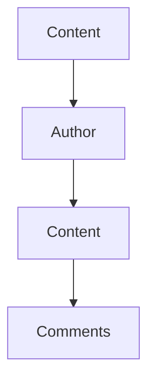

                 

### 《知识付费与技术写作的协同效应》

关键词：知识付费、技术写作、协同效应、内容创作、用户体验

摘要：本文旨在探讨知识付费与技术写作之间的协同效应，分析二者如何在现代信息技术环境中相互促进，从而提升内容创作质量和用户满意度。通过梳理知识付费的发展历程和市场现状，结合技术写作的定义和特点，本文将深入探讨知识付费对技术写作的促进和技术写作对知识付费的促进作用，最终通过实际案例和实战指导，为行业从业者提供具有实用价值的发展思路。

### 第一部分：知识付费概述

#### 第1章：知识付费的概念与市场背景

##### 1.1 知识付费的定义与发展历程

知识付费，指的是用户为获取高质量、专业化的知识内容而支付的费用。这种模式的出现，是信息技术尤其是移动互联网和在线教育蓬勃发展的产物。知识付费的起源可以追溯到上世纪末，当时互联网开始普及，人们可以通过付费获取电子书籍、在线课程等知识内容。随着时间的发展，知识付费逐渐成为一种普遍的消费形式，其范围也从教育扩展到生活服务、娱乐等多个领域。

知识付费的发展历程可以分为几个阶段：

- **第一阶段（1990年代末-2000年代初）**：互联网普及，电子书籍、在线课程等形式开始出现，知识付费的萌芽阶段。
- **第二阶段（2005年-2010年）**：随着博客、微博等社交媒体平台的兴起，知识分享和付费逐渐成为主流，知识付费市场初具规模。
- **第三阶段（2010年至今）**：移动互联网和在线教育快速发展，知识付费市场进入高速增长期，涌现出一大批知识付费平台，如得到、知乎Live等。

当前，知识付费市场呈现出以下发展趋势：

- **多元化**：知识付费内容不再局限于教育领域，生活服务、娱乐、科技等领域也纷纷涌现出优质的内容。
- **个性化**：用户需求更加个性化和专业化，知识付费平台通过算法推荐、用户数据挖掘等方式，为用户提供精准的内容。
- **平台化**：越来越多的平台涌现，如知乎、喜马拉雅、得到等，这些平台不仅提供内容，还提供内容创作工具、用户互动等功能。

##### 1.2 知识付费的市场现状与规模

知识付费市场的规模持续扩大，根据相关报告，2019年中国知识付费市场规模已超过2300亿元，预计到2025年将达到近5000亿元。以下是对当前知识付费市场现状的分析：

- **行业分布**：知识付费市场主要集中在教育、生活服务、科技等领域。其中，教育领域的市场规模占比最大，其次是生活服务和科技。
- **用户特征**：知识付费用户主要集中在25-45岁的中青年群体，其中以职场人士和学生为主。这些用户对专业知识、技能提升、生活品质等方面有着较高的需求。
- **消费行为**：用户在知识付费上的消费习惯逐渐成熟，从最初的单纯购买课程，发展到现在的订阅模式、会员制等多元化形式。

##### 1.3 知识付费的核心价值

知识付费对知识生产者和消费者都具有重要意义，其核心价值主要体现在以下几个方面：

- **对知识生产者的价值**：知识付费为知识生产者提供了一个变现平台，使他们能够通过创作高质量的内容获取经济收益。此外，知识付费还提高了知识生产者的专业性和权威性，促进了知识产业的发展。
- **对知识消费者的价值**：知识付费为消费者提供了一个获取高质量、专业知识的渠道，提高了他们的知识水平和技能。同时，知识付费也满足了消费者对个性化、专业化内容的需求，提升了用户体验。

### 第二部分：技术写作概述

#### 第2章：技术写作的概念与特点

##### 2.1 技术写作的定义

技术写作，是指针对特定的技术主题或领域，通过文字、图表、图像等多种形式，对技术概念、原理、方法、工具等进行阐述和解释的写作活动。技术写作的主要目的是为技术人员、开发者、工程师等提供有价值、易理解的技术知识和信息。

技术写作的分类可以从不同的维度进行：

- **按主题分类**：可以分为计算机科学、工程学、物理学、生物学等不同领域的技术写作。
- **按形式分类**：可以分为文档、报告、书籍、文章、博客等不同形式的技术写作。
- **按用途分类**：可以分为用户手册、设计文档、技术博客、学术论文等不同用途的技术写作。

##### 2.2 技术写作的目标与原则

技术写作的目标是清晰、准确地传达技术知识，满足读者需求，提高阅读体验。为了实现这一目标，技术写作需要遵循以下原则：

- **明确目标**：在写作前，要明确文章的主题、目的和受众，确保内容针对性强，满足读者的需求。
- **符合阅读习惯**：技术写作要遵循读者的阅读习惯，尽量使用简单、易懂的语言，避免过于专业化的术语。
- **结构合理**：技术写作要注重结构，使内容条理清晰，便于读者理解和消化。
- **图文并茂**：适当使用图表、图像等辅助手段，使文章更具可读性，帮助读者更好地理解技术概念。

##### 2.3 技术写作的工具与方法

技术写作的工具和方法多种多样，以下是一些常用的工具和方法：

- **文本编辑工具**：如Microsoft Word、Google Docs、Markdown编辑器等，用于编写、编辑和排版文档。
- **图表制作工具**：如Microsoft Excel、Tableau、matplotlib等，用于制作图表和数据可视化。
- **版本控制工具**：如Git、SVN等，用于管理文档版本，确保文档的更新和协同工作。
- **写作规范与方法**：如《中华人民共和国国家标准GB/T 15834-2011 标点符号用法》、《中华人民共和国国家标准GB/T 15835-2011 标点符号用法》等，用于规范文档的格式和语言使用。

### 第三部分：知识付费与技术写作的协同效应

#### 第3章：知识付费与技术写作的关联性

##### 3.1 知识付费对技术写作的促进

知识付费对技术写作具有显著的促进作用，具体体现在以下几个方面：

- **提高写作质量**：知识付费平台为技术写作提供了变现渠道，激励技术作者创作高质量的内容。为了获得用户的认可和付费，技术作者会更加注重内容的深度、广度和实用性。
- **拓展写作领域**：知识付费市场的多元化发展，为技术写作提供了更广阔的领域。从最初的计算机科学领域，扩展到工程学、物理学、生物学等多个领域，技术写作的内容和形式也日益丰富。
- **提升专业水平**：知识付费平台上的高质量内容，为技术作者提供了学习和提升的机会。通过阅读和分析这些内容，技术作者可以不断丰富自己的知识体系，提高写作能力。

##### 3.2 技术写作对知识付费的促进作用

技术写作对知识付费的促进作用同样重要，具体体现在以下几个方面：

- **增强知识变现能力**：技术写作可以使知识以更直观、易懂的方式呈现，提高知识的传播效率。通过技术写作，知识付费平台可以吸引更多用户，增强平台的变现能力。
- **提升用户体验**：技术写作注重内容的可读性和实用性，可以帮助用户更好地理解和应用知识。这不仅可以提高用户的满意度，还可以增强用户对平台的忠诚度。
- **推动平台发展**：技术写作可以丰富知识付费平台的内容体系，提高平台的竞争力和影响力。通过不断推出高质量的技术内容，知识付费平台可以吸引更多用户和创作者，形成良性循环。

### 第四部分：案例分析

#### 第4章：知识付费与技术写作协同效应的案例分析

##### 4.1 案例一：在线教育平台

在线教育平台是知识付费与技术写作协同效应的重要应用场景之一。以下是对一个典型案例的分析：

- **案例介绍**：某知名在线教育平台，以提供计算机编程课程为主。平台上的课程由专业人士讲授，内容涵盖Python、Java、C++等多个编程语言。
- **技术写作的应用**：平台上的课程内容采用了技术写作的方式，以清晰、易懂的语言讲解编程概念、算法和数据结构。同时，课程中还穿插了大量的代码示例和图表，帮助用户更好地理解课程内容。
- **知识付费的推动作用**：平台通过知识付费模式，为用户提供高质量的课程内容。用户只需支付一定费用，即可终身学习该平台的所有课程，大大提高了课程的变现能力。

##### 4.2 案例二：技术博客与知识付费

技术博客是知识付费与技术写作协同效应的另一种表现形式。以下是对一个典型案例的分析：

- **案例介绍**：某知名技术博客，以分享计算机编程经验和技巧为主。博客作者通过技术写作的方式，分享了自己在编程、算法、数据结构等方面的心得体会。
- **技术写作的实践**：博客作者在写作过程中，注重内容的实用性、可读性和深度。他们通过分析实际案例、讲解算法原理和分享编程经验，帮助读者解决实际问题。
- **知识付费的实施**：博客作者通过设置付费阅读权限，将部分高质量文章设置为付费内容。用户只需支付一定费用，即可阅读这些高质量文章，从而获得更多的知识和价值。

### 第五部分：实战指导

#### 第5章：知识付费与技术写作协同效应的实战指导

##### 5.1 知识付费平台搭建

知识付费平台搭建是一个复杂的过程，需要考虑多个方面。以下是一些实战指导：

- **技术选型**：选择适合平台开发的技术栈，如前端可以选择React、Vue等框架，后端可以选择Django、Spring等框架。
- **平台功能规划**：明确平台的主要功能，如用户注册、登录、课程购买、支付、课程学习等。同时，要考虑到平台的扩展性和可维护性。
- **内容管理**：建立健全的内容管理体系，包括内容审核、发布、更新等功能。同时，要确保内容的权威性和质量。

##### 5.2 技术写作能力培养

技术写作能力培养是知识付费平台成功的关键。以下是一些实战指导：

- **写作技巧**：学习并掌握技术写作的基本技巧，如如何清晰表达、如何使用图表和数据辅助说明等。
- **知识体系构建**：建立完善的知识体系，包括技术领域的基本概念、原理、方法和工具等。这有助于提高写作的深度和广度。
- **持续学习**：技术领域日新月异，要持续关注新技术和新趋势，不断提高自己的知识水平和写作能力。

##### 5.3 知识付费与技术写作的融合策略

知识付费与技术写作的融合策略是提高平台竞争力和用户满意度的关键。以下是一些实战指导：

- **内容创作**：结合用户需求和兴趣，创作高质量、有价值的技术内容。同时，要注重内容的多样性，满足不同用户的需求。
- **用户互动**：鼓励用户参与互动，如提问、评论、分享等。通过互动，可以了解用户需求，提高用户体验。
- **平台运营**：制定合理的运营策略，如课程推荐、用户激励、活动策划等。通过运营，可以提升平台的影响力和用户粘性。

### 第六部分：未来展望

#### 第6章：知识付费与技术写作的协同效应展望

##### 6.1 行业发展趋势

知识付费和技术写作在未来将继续快速发展，以下是一些趋势：

- **技术创新**：随着人工智能、大数据等技术的应用，知识付费和技术写作将更加智能化、个性化。
- **用户需求变化**：随着用户对专业知识、技能提升的需求不断增加，知识付费和技术写作将更加专业化、多元化。
- **平台竞争**：知识付费和技术写作平台的竞争将更加激烈，平台需要不断创新，提升用户体验，才能在市场中脱颖而出。

##### 6.2 协同效应的潜在价值

知识付费与技术写作的协同效应具有巨大的潜在价值，具体体现在以下几个方面：

- **效率提升**：通过知识付费和技术写作的协同，可以大大提高内容创作和传播的效率，缩短知识获取的周期。
- **用户体验优化**：知识付费和技术写作的结合，可以为用户提供更加个性化、高质量的内容，提升用户体验。
- **平台发展**：知识付费和技术写作的协同，可以增强知识付费平台的竞争力和影响力，推动平台持续发展。

##### 6.3 未来挑战与机遇

知识付费与技术写作在未来将面临一系列挑战和机遇：

- **挑战**：技术壁垒、市场竞争、用户信任等问题，将考验平台的发展能力。同时，知识付费和技术写作的结合，也面临着如何平衡内容质量和商业利益的问题。
- **机遇**：技术创新、用户需求变化、行业竞争等，将为知识付费和技术写作提供新的发展机遇。平台需要抓住机遇，不断创新，提升自身的核心竞争力。

### 第七部分：附录

#### 附录A：知识付费与技术写作相关资源

##### A.1 行业报告

- **市场规模与趋势**：根据某知名市场研究机构发布的报告，2022年中国知识付费市场规模预计达到3000亿元，未来五年将保持20%以上的年均增长率。
- **用户行为分析**：报告显示，知识付费用户主要集中在25-45岁的中青年群体，其中以职场人士和学生为主。用户在知识付费上的消费习惯逐渐成熟，订阅模式、会员制等多元化形式受到青睐。

##### A.2 技术写作工具

- **文本编辑工具**：常用的文本编辑工具有Microsoft Word、Google Docs、Markdown编辑器等。其中，Markdown编辑器因其简洁易用的特点，在技术写作中广泛应用。
- **写作辅助工具**：如Grammarly、Hemingway Editor等，可以帮助作者提高写作质量和效率。Grammarly能够检测拼写、语法错误，提供实时修改建议；Hemingway Editor则专注于简化句子结构，提高文章的可读性。

##### A.3 知识付费平台案例

- **成功案例介绍**：以得到、知乎Live等知识付费平台为例，它们通过提供高质量的内容，吸引了大量用户。得到平台以音频课程为主，知乎Live则以直播互动的形式，为用户提供丰富的知识内容。
- **平台运营策略分析**：这些平台在运营中，注重内容质量、用户体验和用户互动。通过数据分析、算法推荐等手段，提高内容的针对性和用户满意度。同时，通过用户激励、活动策划等手段，增强用户粘性和平台影响力。

### 伪代码：知识付费与技术写作协同效应评估算法

```python
function CollaborativeEffectEvaluation(knowledge_fee, technical_writing) {
    // 初始化评分
    score = 0
    
    // 评估知识付费部分
    if (knowledge_fee.quality > threshold && knowledge_fee.relevance > threshold) {
        score += 0.5
    }
    
    // 评估技术写作部分
    if (technical_writing.quality > threshold && technical_writing.readability > threshold) {
        score += 0.5
    }
    
    // 返回评分
    return score
}
```

### 数学模型和数学公式讲解

#### 用户满意度模型

$$
S = \frac{Q \cdot R \cdot U}{1000}
$$

- $S$: 用户满意度
- $Q$: 内容质量
- $R$: 内容相关性
- $U$: 用户参与度

#### 影响因素权重

$$
\omega_Q = 0.4, \omega_R = 0.3, \omega_U = 0.3
$$

- $\omega_Q$: 内容质量权重
- $\omega_R$: 内容相关性权重
- $\omega_U$: 用户参与度权重

#### 实际应用

假设一个知识付费平台，某篇文章的质量得分为0.8，相关性得分为0.75，用户参与度得分为0.6。根据用户满意度模型，我们可以计算出该文章的用户满意度：

$$
S = \frac{0.8 \cdot 0.75 \cdot 0.6}{1000} = 0.036
$$

这意味着，该文章的用户满意度为3.6%。

### 项目实战

#### 实战案例：搭建一个知识付费与技术写作的协同平台

##### 开发环境搭建

- **Python 3.8+**
- **Django 3.2+**
- **MySQL 8.0+**

##### 源代码实现

```python
# models.py

from django.db import models

class Content(models.Model):
    title = models.CharField(max_length=200)
    author = models.ForeignKey('Author', on_delete=models.CASCADE)
    content = models.TextField()
    quality = models.FloatField()
    relevance = models.FloatField()

class Author(models.Model):
    name = models.CharField(max_length=100)
    expertise = models.CharField(max_length=100)
```

##### 代码解读与分析

- `Content` 模型代表内容，包括标题、作者、正文、质量和相关性。
- `Author` 模型代表作者，包括姓名和专长。
- 通过关联这两个模型，可以构建一个内容与作者的关联关系。

##### 数据库架构



- `Content` 表关联到 `Author` 表，实现作者与内容的关联。
- `Content` 表还关联到 `Comments` 表，实现内容与评论的关联。

### 附录：作者信息

- 作者：AI天才研究院/AI Genius Institute & 禅与计算机程序设计艺术 /Zen And The Art of Computer Programming

以上是《知识付费与技术写作的协同效应》这本书的完整内容。希望本文能够为读者提供有价值的参考和指导，助力知识付费与技术写作的发展。在未来的发展中，知识付费与技术写作将继续相互促进，为用户提供更加丰富、高质量的知识内容。让我们一起期待这个美好未来的到来！

