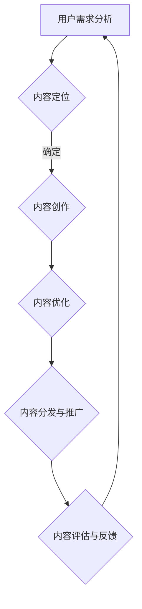

                 

### 《知识付费创业中的内容价值 Maximization Strategy》

#### **关键词：**
- 知识付费
- 内容价值最大化
- 内容评估
- 用户需求分析
- 内容定位
- 内容创作与优化
- 内容分发与推广
- 成功案例分析

#### **摘要：**
本文将深入探讨知识付费创业中的内容价值最大化策略。从行业概述、内容价值评估、用户需求分析、内容创作与优化，到内容分发与推广，我们系统地分析了各个关键环节，并结合成功案例，为创业者提供了实用的策略和工具。通过本文，读者将能够理解知识付费的核心价值，掌握内容价值最大化的方法，为创业之路奠定坚实基础。

### **《知识付费创业中的内容价值 Maximization Strategy》目录大纲**

#### **第一部分：知识付费行业概述**

**第1章：知识付费行业的背景与市场分析**

- **1.1 知识付费的定义与起源**
- **1.2 知识付费市场的发展历程**
- **1.3 知识付费市场的现状**
- **1.4 知识付费行业的趋势**

#### **第二部分：内容价值最大化策略**

**第2章：内容价值评估方法**

- **2.1 内容价值评估的维度**
- **2.2 内容价值评估的方法**
- **2.3 内容价值评估工具**

**第3章：用户需求分析与内容定位**

- **3.1 用户需求分析的理论基础**
- **3.2 用户需求分析方法**
- **3.3 内容定位策略**

**第4章：内容创作与优化策略**

- **4.1 内容创作的基本原则**
- **4.2 内容创作团队的建设**
- **4.3 内容优化策略**

**第5章：内容分发与推广**

- **5.1 内容分发渠道选择**
- **5.2 内容推广策略**
- **5.3 社交媒体在内容推广中的应用**

#### **第三部分：案例研究**

**第6章：成功案例解析**

- **6.1 案例一：某在线教育平台的崛起**
- **6.2 案例二：某知识付费平台的创新模式**
- **6.3 案例三：某自媒体内容的成功运营**

**第7章：挑战与未来展望**

- **7.1 知识付费行业的挑战**
- **7.2 内容价值最大化的未来发展**

#### **附录**

**附录A：知识付费创业工具与资源**

- **A.1 知识付费平台推荐**
- **A.2 内容创作与推广工具**
- **A.3 知识付费行业报告与研究**

**Mermaid 流程图：内容价值最大化流程**

接下来，我们将详细探讨知识付费行业的背景、市场分析以及内容价值最大化策略的各个关键环节。

### **第一部分：知识付费行业概述**

#### **第1章：知识付费行业的背景与市场分析**

知识付费，作为一种新兴的商业模式，正逐渐改变我们的消费习惯和生活方式。在这章中，我们将详细探讨知识付费的定义与起源，市场的发展历程和现状，以及未来趋势。

#### **1.1 知识付费的定义与起源**

知识付费，顾名思义，是指用户为了获取知识或技能而付费的一种行为。这可以包括在线课程、电子书、专业咨询、技能培训等多种形式。知识付费的起源可以追溯到互联网的兴起，特别是在移动互联网普及的背景下，用户对知识的需求更加多样化和个性化。

早期的知识付费主要是通过实体书店、培训机构等线下渠道进行的。然而，随着互联网技术的发展，尤其是移动互联网的普及，知识付费逐渐转向线上平台。用户可以随时随地通过手机、平板电脑等设备获取所需的知识。

#### **1.2 知识付费市场的发展历程**

知识付费市场的发展历程可以分为以下几个阶段：

1. **萌芽期（2000-2010年）**：这一阶段，主要是以实体书店和培训机构为主，线上知识付费开始萌芽，但市场规模相对较小。

2. **快速增长期（2010-2015年）**：随着移动互联网的普及，线上知识付费平台开始兴起，如Coursera、Udemy等国际平台，以及国内的知乎、喜马拉雅等。这一阶段，知识付费市场开始快速增长。

3. **成熟期（2015年至今）**：知识付费已经成为一种成熟的商业模式，涵盖了多个领域，如教育、职场技能、兴趣爱好等。同时，各种知识付费平台层出不穷，如得到、网易云课堂等。

#### **1.3 知识付费市场的现状**

目前，知识付费市场呈现出以下几个特点：

1. **市场规模不断扩大**：根据相关报告，我国知识付费市场规模逐年增长，预计到2025年将达到5000亿元人民币。

2. **用户群体多样化**：知识付费的用户群体不仅包括学生和职场人士，还涵盖了中老年人、全职妈妈等各个年龄段和职业背景的用户。

3. **内容多样化**：知识付费内容涵盖了多个领域，如职业技能、兴趣爱好、家庭教育、健康管理等。用户可以根据自己的需求和兴趣选择合适的内容。

4. **平台多元化**：除了传统的在线教育平台，如知乎、得到、喜马拉雅等，还涌现出了许多垂直领域的知识付费平台，如育儿平台、职场技能平台等。

#### **1.4 知识付费行业的趋势**

随着科技的发展和用户需求的变化，知识付费行业未来将呈现以下几个趋势：

1. **个性化定制**：未来的知识付费将更加注重个性化，用户可以根据自己的需求和兴趣，定制适合自己的学习内容和课程。

2. **智能化**：人工智能技术的发展将使得知识付费更加智能化，如智能推荐、智能问答等，为用户提供更加精准的服务。

3. **跨界融合**：知识付费与其他行业的融合将进一步加深，如与电子商务、游戏、社交等领域的结合，为用户提供更丰富的体验。

4. **国际化**：随着互联网的全球化，知识付费也将逐步走向国际化，国内的知识付费平台将更多地与国外平台进行合作，为全球用户提供服务。

通过对知识付费行业的背景与市场分析，我们了解到知识付费作为一种新兴的商业模式，已经取得了显著的成果，并呈现出良好的发展前景。在接下来的章节中，我们将进一步探讨如何实现内容价值最大化，为知识付费创业提供实用的策略和方法。

### **第二部分：内容价值最大化策略**

#### **第2章：内容价值评估方法**

内容价值最大化是知识付费创业的核心目标之一。要实现这一目标，首先需要对内容的价值进行准确评估。本章将详细介绍内容价值评估的维度、方法和工具，帮助创业者更好地理解内容的价值，从而制定出有效的策略。

#### **2.1 内容价值评估的维度**

内容价值评估可以从多个维度进行，主要包括：

1. **用户需求度**：用户对某一内容的需求程度直接影响其价值。用户需求度可以通过市场调研、用户反馈等方式进行评估。

2. **内容质量**：内容的质量是评估其价值的重要维度。高质量的内容不仅包含丰富的信息，还要具有实用性和可操作性。

3. **用户满意度**：用户对内容的满意度是衡量内容价值的重要指标。用户满意度可以通过问卷调查、用户评价等方式进行评估。

4. **市场竞争力**：内容在市场上的竞争力也是评估其价值的重要维度。市场竞争力可以通过与同类内容的比较来评估。

5. **潜在收益**：内容的潜在收益包括直接收益（如课程销售额）和间接收益（如品牌影响力、用户留存率等）。

#### **2.2 内容价值评估的方法**

内容价值评估的方法多种多样，以下是一些常用的方法：

1. **定量分析**：定量分析主要通过数据来评估内容的价值。例如，通过用户访问量、购买率、用户评价等数据来评估内容的需求度和质量。

2. **定性分析**：定性分析主要通过用户反馈、专家评审等方式来评估内容的价值。这种方法更注重内容的质量和用户的实际体验。

3. **平衡计分卡**：平衡计分卡是一种综合评估方法，它将用户需求度、内容质量、用户满意度、市场竞争力等多个维度结合起来，对内容的价值进行综合评估。

4. **价值链分析**：价值链分析通过对内容的生产、分发、消费等环节进行评估，分析各个环节对内容价值的贡献，从而确定内容的价值。

#### **2.3 内容价值评估工具**

为了方便内容价值的评估，可以借助一些工具：

1. **问卷调查工具**：如腾讯问卷、问卷星等，可以帮助收集用户的反馈和需求。

2. **数据分析工具**：如Excel、Python等，可以帮助进行数据的收集、处理和分析。

3. **内容评估系统**：如SaaS平台，可以提供一站式的内容评估服务，包括数据收集、分析、报告生成等。

4. **专家评审系统**：通过邀请行业专家进行评审，从专业角度对内容的价值进行评估。

通过以上方法，我们可以对内容的价值进行准确评估，从而为内容创作和优化提供依据。在下一章中，我们将探讨如何通过用户需求分析和内容定位，进一步挖掘和实现内容的价值。

### **第3章：用户需求分析与内容定位**

在知识付费创业中，了解用户需求并准确进行内容定位是关键的一步。本章将详细探讨用户需求分析的理论基础、方法以及内容定位策略，帮助创业者更好地满足用户需求，实现内容价值最大化。

#### **3.1 用户需求分析的理论基础**

用户需求分析是内容创作和定位的基石。以下是几个重要的理论基础：

1. **需求层次理论**：马斯洛的需求层次理论将人的需求分为生理需求、安全需求、社交需求、尊重需求和自我实现需求。在内容创作中，了解用户所处的需求层次，可以帮助我们提供更加精准和有针对性的内容。

2. **用户画像**：用户画像是一种基于数据分析的方法，通过对用户的基本信息、行为特征、兴趣爱好等进行综合分析，构建出用户的基本轮廓。用户画像是进行用户需求分析的重要工具。

3. **行为分析**：通过用户的行为数据，如浏览记录、购买行为、互动行为等，可以分析用户的需求和偏好。行为分析可以帮助我们更好地了解用户的真实需求。

4. **SWOT分析**：SWOT分析是一种常用的战略规划方法，用于分析企业的优势（Strengths）、劣势（Weaknesses）、机会（Opportunities）和威胁（Threats）。在内容创业中，SWOT分析可以帮助我们全面评估自身的资源、市场竞争情况以及潜在的机会和挑战。

#### **3.2 用户需求分析方法**

以下是一些常用的用户需求分析方法：

1. **问卷调查**：问卷调查是一种直接获取用户需求的方式。通过设计科学合理的问卷，可以收集到大量用户的反馈，从而分析用户的需求和偏好。

2. **用户访谈**：用户访谈是一种深入了解用户需求的方法。通过与用户进行一对一的访谈，可以直接获取用户对某一问题的看法和意见。

3. **行为数据分析**：通过对用户的行为数据进行分析，可以了解用户的浏览习惯、购买行为等。行为数据分析可以帮助我们识别用户的需求和偏好。

4. **焦点小组**：焦点小组是一种集体讨论的方法，通过邀请一组用户代表参与讨论，可以收集到多样化的用户意见和需求。

5. **用户场景分析**：用户场景分析是通过构建用户的典型使用场景，分析用户在特定情境下的需求和行为。这种方法可以帮助我们更好地理解用户的实际需求。

#### **3.3 内容定位策略**

在了解用户需求之后，需要进行内容定位。以下是一些内容定位策略：

1. **目标用户定位**：明确内容的目标用户群体，是进行内容定位的第一步。通过用户画像和行为分析，可以确定目标用户的年龄、性别、职业、兴趣爱好等信息。

2. **内容差异化**：在众多竞争者中脱颖而出，内容差异化是关键。可以通过提供独特的内容、深入讲解复杂知识点、采用创新的讲授方式等，实现内容差异化。

3. **内容细分**：将内容进行细分，针对特定用户群体的特定需求，提供更加精准的内容。例如，在职场技能领域，可以细分出项目管理、编程技能、营销策略等不同方向。

4. **内容品质化**：提高内容的质量，是赢得用户的关键。内容应具有实用性、可操作性和深入分析，从而满足用户的学习需求。

5. **内容互动性**：增强内容的互动性，可以提高用户的参与度和满意度。可以通过在线问答、讨论区、直播等方式，与用户进行互动。

通过以上用户需求分析和内容定位策略，创业者可以更好地了解用户需求，提供符合用户期望的内容，从而实现内容价值最大化。在下一章中，我们将探讨如何进行内容创作与优化，进一步提升内容的价值。

### **第4章：内容创作与优化策略**

内容创作与优化是知识付费创业中的核心环节，直接关系到内容的吸引力、用户满意度和市场竞争力。本章将详细探讨内容创作的基本原则、内容创作团队的建设以及内容优化策略，帮助创业者打造高质量的内容。

#### **4.1 内容创作的基本原则**

1. **以用户为中心**：内容创作应始终以用户的需求和兴趣为中心，确保内容能够解决用户的问题、满足用户的兴趣。

2. **内容质量优先**：高质量的内容是吸引和留住用户的关键。内容应具有深度、实用性、可操作性，避免空洞、无意义的描述。

3. **创新性**：创新是内容脱颖而出的关键。创作者应不断探索新的内容形式、讲述方式和表达手段，提供独特的价值。

4. **持续更新**：内容应保持持续更新，以适应用户的需求变化和市场趋势。定期发布新的内容，保持用户的关注度和参与度。

5. **互动性**：增强内容的互动性，可以提高用户的参与度和满意度。可以通过在线问答、讨论区、直播等方式，与用户进行互动。

#### **4.2 内容创作团队的建设**

1. **专业分工**：根据内容领域的需求，建立专业分工明确的内容创作团队。团队成员应具备相关的专业知识、创作经验和技能。

2. **人才培养**：定期对团队成员进行培训，提高他们的专业水平和创作能力。可以通过外部培训、内部交流、学习研讨会等方式进行。

3. **激励机制**：建立有效的激励机制，激励团队成员积极参与内容创作。可以通过绩效奖励、晋升机会等方式，激发团队成员的积极性。

4. **团队合作**：鼓励团队成员之间的合作与交流，通过集体智慧提高内容的创作质量和效率。可以通过团队讨论、头脑风暴等方式，激发创意。

#### **4.3 内容优化策略**

1. **用户反馈**：及时收集用户的反馈，了解他们对内容的评价和需求。通过用户反馈，可以优化内容，提高用户的满意度。

2. **数据分析**：利用数据分析工具，对用户的浏览、观看、互动等行为进行深入分析。通过数据，可以识别内容的优缺点，进行针对性的优化。

3. **内容迭代**：根据用户反馈和数据分析结果，对内容进行迭代优化。可以通过修改内容结构、增加新的知识点、调整讲述方式等方式，提升内容的吸引力。

4. **技术支持**：借助先进的技术手段，提升内容的互动性和用户体验。例如，通过AI技术实现个性化推荐，通过VR技术提供沉浸式的学习体验等。

5. **跨平台分发**：将内容分发到多个平台，扩大内容的曝光度和影响力。可以通过社交媒体、在线教育平台、电子书平台等多渠道分发。

通过以上内容创作与优化策略，创业者可以不断提升内容的质量和吸引力，实现内容价值的最大化。在下一章中，我们将探讨内容分发与推广的方法，帮助创业者将高质量的内容传播给更多用户。

### **第5章：内容分发与推广**

在内容创作与优化完成后，如何有效地将内容分发和推广给目标用户成为关键。本章将详细探讨内容分发渠道的选择、推广策略以及社交媒体在内容推广中的应用，帮助创业者实现内容的广泛传播和最大化价值。

#### **5.1 内容分发渠道选择**

1. **在线教育平台**：在线教育平台是知识付费内容分发的重要渠道，如网易云课堂、得到、知乎等。这些平台拥有庞大的用户基础和专业的运营团队，可以帮助内容创作者快速触达目标用户。

2. **社交媒体**：社交媒体平台如微信、微博、抖音等，具有强大的用户互动性和传播力。通过发布高质量的内容，结合平台推广工具，可以迅速提升内容的曝光度。

3. **垂直行业社区**：在特定行业的社区或论坛，如程序员社区、设计师社区等，发布专业内容，可以吸引行业内的关注和讨论，提高内容的可信度和影响力。

4. **电子书平台**：如Kindle、京东电子书等，适合内容形式为电子书的创作者。通过这些平台，创作者可以将自己的作品转化为电子书，触达更多的读者。

5. **自有网站或App**：创建自有网站或App，可以更好地控制内容分发和用户互动。这种方式适合具备一定资源和技术的创作者，可以提供更个性化的用户体验。

#### **5.2 内容推广策略**

1. **SEO优化**：通过搜索引擎优化（SEO）策略，提高内容在搜索引擎中的排名，吸引更多自然流量。这包括关键词研究、内容优化、外部链接建设等。

2. **内容营销**：利用内容自身的价值进行推广。通过发布高质量的博客文章、案例分析、教程等，吸引用户主动访问和分享。

3. **社交媒体推广**：利用社交媒体平台进行内容推广。这包括发布动态、分享链接、参与话题讨论、投放广告等。

4. **合作推广**：与相关领域的KOL（关键意见领袖）或品牌合作，通过他们的推荐和宣传，提升内容的曝光度和可信度。

5. **活动营销**：举办线上或线下活动，如讲座、研讨会、工作坊等，吸引目标用户参与，提升品牌知名度和用户粘性。

6. **邮件营销**：通过定期发送电子邮件，向订阅用户推广内容，保持与用户的互动和关系。

#### **5.3 社交媒体在内容推广中的应用**

1. **微博**：微博具有强大的传播力和互动性，适合发布短小精悍的内容，如新闻动态、观点评论等。

2. **微信**：微信作为社交媒体的佼佼者，适合发布深度文章、教程、案例等。公众号和小程序是微信内容推广的重要工具。

3. **抖音**：抖音是一个以短视频为主的社交媒体平台，适合通过生动、有趣、富有创意的短视频内容，吸引用户的关注和分享。

4. **B站**：B站以年轻人为主要用户群体，适合发布专业的教学视频、游戏解说、科普视频等。

5. **小红书**：小红书以女性用户为主，适合发布生活方式、美容养生、旅行攻略等内容。

通过以上内容分发与推广策略，创业者可以有效地将高质量的内容传递给目标用户，实现内容的广泛传播和最大化价值。在下一章中，我们将通过成功案例分析，进一步探讨内容价值最大化的实践方法和经验。

### **第三部分：案例研究**

#### **第6章：成功案例解析**

在本章中，我们将通过解析几个成功案例，深入探讨知识付费创业中的内容价值最大化策略。这些案例包括在线教育平台、知识付费平台和自媒体内容运营，旨在为创业者提供实用的经验和启示。

#### **6.1 案例一：某在线教育平台的崛起**

**背景**：某在线教育平台成立于2010年，专注于职业技能培训。初期，平台主要以提供IT技能培训课程为主，通过线上授课和互动教学，满足职场人士的学习需求。

**策略**：

1. **用户需求分析**：通过市场调研和用户反馈，平台明确了目标用户群体为职场人士，特别是在技能提升和职业发展方面有需求的用户。

2. **内容定位**：平台围绕职业技能培训，细分出多个领域，如编程、设计、运营等，提供多样化的课程内容。

3. **内容创作与优化**：平台邀请业内知名专家和有经验的讲师，确保课程内容的高质量和实用性。同时，通过用户反馈不断优化课程，提升用户体验。

4. **内容分发与推广**：平台利用社交媒体、广告投放以及合作伙伴渠道，进行广泛的推广。此外，通过与知名企业和行业组织合作，提升品牌影响力和用户信任度。

**结果**：经过几年的发展，该在线教育平台用户数量迅速增长，课程覆盖多个领域，成为职场人士学习技能的重要平台。

**启示**：精准的用户需求分析、多样化的内容定位、高质量的内容创作和有效的推广策略，是成功的关键。

#### **6.2 案例二：某知识付费平台的创新模式**

**背景**：某知识付费平台成立于2016年，以提供高质量的深度内容为主，包括行业报告、专家访谈、深度分析等。

**策略**：

1. **用户需求分析**：平台通过用户调研和数据分析，发现用户对专业知识和深度内容的需求较高，尤其是对行业趋势和前沿技术的关注。

2. **内容定位**：平台定位为提供专业、权威的深度内容，覆盖金融、科技、医疗等多个领域。

3. **内容创作与优化**：平台邀请业内知名专家、学者和企业高管，确保内容的专业性和权威性。同时，通过多维度、深层次的内容分析，提升内容的深度和广度。

4. **内容分发与推广**：平台利用付费订阅模式，提供独家内容，吸引用户付费。此外，通过与各大企业、高校和科研机构合作，扩大内容来源和用户群体。

**结果**：该知识付费平台在短时间内积累了大量高端用户，成为行业内的权威内容提供者。

**启示**：专业、权威的深度内容、创新的付费模式以及广泛的合作渠道，是成功的关键。

#### **6.3 案例三：某自媒体内容的成功运营**

**背景**：某自媒体内容运营始于2018年，主要发布科技、财经领域的原创文章。

**策略**：

1. **用户需求分析**：通过数据分析，发现用户对科技、财经领域的新闻和深度分析文章有较高需求。

2. **内容定位**：平台定位为提供高质量的原创文章，重点关注行业趋势、企业动态和市场分析。

3. **内容创作与优化**：通过聘请专业撰稿人和编辑，确保文章的质量和深度。同时，通过数据分析不断优化文章结构、选题和表达方式。

4. **内容分发与推广**：利用微信公众号、微博等社交媒体平台，进行广泛的内容分发和推广。此外，通过与其他自媒体平台合作，扩大内容影响力。

**结果**：该自媒体平台在短时间内积累了大量忠实读者，成为科技、财经领域的重要资讯来源。

**启示**：精准的用户需求分析、高质量的内容创作和有效的社交媒体推广，是成功的关键。

通过以上成功案例的解析，我们可以看到，精准的用户需求分析、内容定位、高质量的内容创作和有效的推广策略，是知识付费创业中实现内容价值最大化的关键。在下一章中，我们将探讨知识付费行业的挑战和未来展望。

### **第7章：挑战与未来展望**

尽管知识付费行业呈现出快速发展的态势，但创业者在面临内容价值最大化过程中，仍会遇到诸多挑战。本章将分析这些挑战，并探讨未来的发展方向。

#### **7.1 知识付费行业的挑战**

1. **市场竞争激烈**：知识付费市场吸引了大量创业者进入，导致市场竞争日益激烈。创业者需要不断提升内容质量和创新性，以在竞争中脱颖而出。

2. **内容同质化**：许多平台和内容创作者在内容选题和形式上存在高度相似，导致内容同质化现象严重。这降低了用户的选择多样性和满意度。

3. **用户信任问题**：知识付费平台和内容创作者需要建立用户信任，这需要长期的努力和积累。一旦用户对平台或内容产生质疑，将影响平台的声誉和用户留存率。

4. **内容版权保护**：知识付费行业面临着内容版权保护的问题。未经授权的盗版和抄袭行为，严重损害了原创者的权益。

5. **用户黏性问题**：用户在购买知识付费产品后，可能因为各种原因不再使用或续订。如何提高用户的黏性和复购率，是创业者需要考虑的问题。

#### **7.2 内容价值最大化的未来发展**

1. **个性化定制**：随着大数据和人工智能技术的应用，未来知识付费平台将能够更好地理解用户需求，提供个性化的内容推荐和服务。

2. **内容创新**：创业者需要不断探索新的内容形式和表达方式，如VR/AR技术、互动式课程等，为用户带来全新的学习体验。

3. **跨界融合**：知识付费行业将与其他行业如电子商务、游戏、社交等深度融合，提供多元化的产品和服务。

4. **内容生态建设**：构建良好的内容生态，包括创作者、平台、用户等各个环节的良性互动，是内容价值最大化的关键。通过建立激励机制、版权保护机制等，促进内容生态的健康发展。

5. **国际化拓展**：随着全球化的发展，知识付费行业将逐步走向国际化。创业者可以通过跨文化交流、国际合作等方式，拓展海外市场。

通过应对挑战和抓住未来机遇，创业者可以不断提升内容价值，实现知识付费创业的成功。在知识付费行业不断演进的背景下，不断创新和优化策略，将是创业者立于不败之地的关键。

### **附录**

#### **附录A：知识付费创业工具与资源**

**A.1 知识付费平台推荐**

1. **得到**：提供各类知识付费课程，涵盖职场技能、人文社科等多个领域。
2. **网易云课堂**：提供IT技能培训课程，包括编程、数据分析等。
3. **知乎Live**：提供专家讲座、知识分享，涵盖多个领域。
4. **喜马拉雅**：提供有声书、课程、直播等多种形式的知识内容。

**A.2 内容创作与推广工具**

1. **腾讯问卷**：用于设计用户调研问卷。
2. **Google Analytics**：用于网站数据分析。
3. **H5制作工具**：如易企秀、MAKA等，用于制作互动式宣传内容。
4. **微信编辑器**：如秀米、96微信编辑器等，用于微信内容的编辑和排版。

**A.3 知识付费行业报告与研究**

1. **艾瑞咨询**：提供全面的行业报告和研究。
2. **极光大数据**：提供用户行为分析和市场趋势报告。
3. **企鹅智酷**：发布关于社交媒体、内容创作等的研究报告。
4. **网易报告**：提供关于互联网行业的深度研究报告。

通过这些工具与资源，创业者可以更好地进行知识付费创业，实现内容价值最大化。

### **Mermaid 流程图：内容价值最大化流程**

这个流程图清晰地展示了从用户需求分析到内容评估与反馈的各个环节，帮助创业者系统地实现内容价值最大化。

### **作者信息**

作者：AI天才研究院/AI Genius Institute & 禅与计算机程序设计艺术/Zen And The Art of Computer Programming

在本文中，我们系统地探讨了知识付费创业中的内容价值最大化策略。通过用户需求分析、内容定位、内容创作与优化、内容分发与推广等环节，结合成功案例，为创业者提供了实用的策略和方法。未来，随着技术的进步和市场的发展，内容价值最大化策略也将不断演进，为创业者带来更多机遇。希望本文能为您的知识付费创业之路提供有益的启示。

