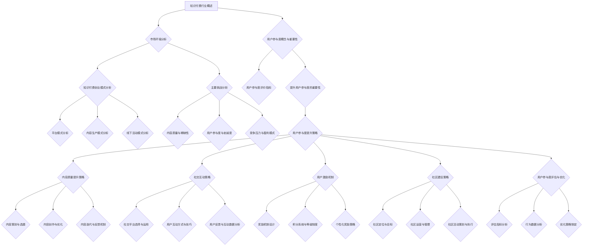

                 

# 《知识付费创业中的用户参与度提升策略》

## 摘要

本文将深入探讨知识付费创业领域中的用户参与度提升策略。随着知识经济的崛起，知识付费行业迅速扩张，但如何在激烈的市场竞争中脱颖而出，提升用户参与度成为创业者们面临的重要课题。本文首先对知识付费行业进行概述，分析其市场环境、创业模式以及主要挑战。接着，本文详细阐述了用户参与度的概念与重要性，并从内容质量、社交互动、用户激励机制和社区建设四个方面，提出了一系列具体的提升用户参与度的策略。此外，通过成功案例分析和实战指导，本文为创业者提供了切实可行的操作指南，以帮助他们在知识付费创业中实现用户参与度的持续提升。最后，本文还列出了相关工具与资源，为读者提供了进一步学习和实践的支持。

## 第一部分：知识付费行业概述

### 1.1 知识付费的起源与市场环境

#### 1.1.1 知识付费的定义

知识付费是指用户通过支付一定费用来获取高质量、专业化的知识和信息。这种模式最早源于传统教育领域，随着互联网技术的发展，知识付费逐渐从线下转移到线上，形成了独特的商业模式。知识付费不仅包括传统的在线教育课程，还涵盖了专业咨询、知识分享、技能培训等多种形式。

#### 1.1.2 知识付费的发展历程

知识付费的发展历程可以分为以下几个阶段：

1. **萌芽阶段（2010-2013年）**：这一阶段以公开课为代表，如Coursera、edX等国际平台在中国市场的初步引入，引发了国内的知识付费热潮。

2. **快速发展阶段（2014-2016年）**：随着移动互联网的普及，知识付费行业迎来了爆发式增长。知乎、得到、喜马拉雅等平台相继崛起，用户数量和市场规模迅速扩大。

3. **洗牌调整阶段（2017-2019年）**：知识付费市场进入洗牌期，部分平台因内容质量、商业模式等问题逐渐退出市场，而优质的内容提供商和平台则得到了进一步的发展。

4. **精细化运营阶段（2020年至今）**：随着市场竞争的加剧，知识付费平台开始注重精细化运营，通过提升用户体验、优化内容质量、加强用户互动等方式，提升用户参与度和忠诚度。

#### 1.1.3 知识付费的市场规模与趋势

根据艾瑞咨询的报告，中国知识付费市场自2016年以来一直保持高速增长，预计2020年市场规模将突破2000亿元。随着5G技术的普及和人工智能技术的发展，知识付费行业将继续保持良好的发展态势。

1. **市场规模持续扩大**：知识付费市场仍处于快速发展阶段，预计未来几年将继续保持高速增长。

2. **用户群体逐渐多元化**：知识付费的用户群体不再局限于特定的年龄段和职业，而是逐渐向更广泛的用户群体扩展。

3. **内容形式多样化**：知识付费内容形式将更加多样化，除了文字、音频、视频外，还将出现更多创新的内容形式，如虚拟现实（VR）、增强现实（AR）等。

4. **个性化需求日益突出**：随着用户需求的不断提升，知识付费平台将更加注重满足用户的个性化需求，提供定制化的内容和服务。

### 1.2 知识付费创业模式分析

#### 1.2.1 平台模式

平台模式是指知识付费平台通过搭建一个开放、共享的平台，吸引内容提供商入驻，为用户提供多样化的知识和信息服务。平台模式的核心在于提供优质的内容和良好的用户体验。

1. **盈利模式**：平台模式的主要盈利模式包括内容收费、广告收入、平台服务费等。

2. **优势**：平台模式能够聚集大量的内容提供商和用户，形成规模效应，提高平台的竞争力。

3. **挑战**：平台模式需要解决内容质量、用户体验、平台安全等问题，以避免因内容质量不佳或用户体验差导致用户流失。

#### 1.2.2 内容生产模式

内容生产模式是指知识付费平台通过自主创作或与第三方合作，生产高质量的知识内容，提供给用户。内容生产模式的核心在于内容的质量和创新。

1. **盈利模式**：内容生产模式的主要盈利模式包括内容收费、广告收入、品牌合作等。

2. **优势**：内容生产模式能够保证内容的原创性和专业性，提高用户满意度。

3. **挑战**：内容生产模式需要投入大量的人力、物力和财力，且内容创作周期较长。

#### 1.2.3 线下活动模式

线下活动模式是指知识付费平台通过举办线下讲座、研讨会、工作坊等活动，为用户提供面对面的知识和交流机会。线下活动模式的核心在于用户的参与和互动。

1. **盈利模式**：线下活动模式的主要盈利模式包括门票收入、赞助收入、培训服务等。

2. **优势**：线下活动模式能够增强用户与平台之间的互动，提高用户黏性。

3. **挑战**：线下活动模式需要解决场地安排、活动策划、安全保障等问题，且受时间和地域限制较大。

### 1.3 知识付费创业中的主要挑战

#### 1.3.1 内容质量与稀缺性

内容质量是知识付费创业的核心竞争力。高质量的内容能够吸引更多用户，提高用户满意度，从而提升用户参与度。然而，内容质量往往取决于内容创作者的专业能力和经验，这对于创业者来说是一个巨大的挑战。此外，稀缺性也是内容质量的重要体现，稀缺的内容往往具有更高的价值。

#### 1.3.2 用户参与度与忠诚度

用户参与度是知识付费创业成功的关键。高参与度的用户不仅能够提高内容消费量，还能通过口碑传播为平台带来更多新用户。然而，如何激发用户的参与热情，提高用户忠诚度，是创业者们需要面对的难题。

#### 1.3.3 竞争压力与盈利模式

知识付费市场竞争激烈，创业者需要不断调整和优化自己的商业模式，以提高竞争力。同时，盈利模式的设计也是知识付费创业中的重要问题。如何在保证内容质量的前提下，实现可持续的盈利，是创业者们需要深入思考的问题。

### 1.4 用户参与度的概念与重要性

#### 1.4.1 用户参与度的定义

用户参与度是指用户在知识付费平台上的活跃程度和参与程度。它包括用户在平台上的消费行为、互动行为、分享行为等。用户参与度越高，意味着用户对平台的依赖度越高，平台的用户黏性也越强。

#### 1.4.2 用户参与度的评价指标

用户参与度的评价指标包括以下几个方面：

1. **消费行为**：用户在平台上的消费金额、消费频率、消费时长等。
2. **互动行为**：用户在平台上的评论、点赞、分享、关注等行为。
3. **分享行为**：用户将平台内容分享到其他社交平台或推荐给其他用户的行为。
4. **留存率**：用户在平台上的留存时间、留存次数等。

#### 1.4.3 提升用户参与度的重要性

提升用户参与度对于知识付费创业具有重要意义：

1. **提高用户满意度**：高参与度的用户对平台的满意度更高，更容易形成忠诚用户群体。
2. **促进内容消费**：高参与度的用户更愿意消费平台内容，从而提高平台的收入。
3. **口碑传播**：高参与度的用户更容易通过口碑传播，为平台带来更多新用户。
4. **降低用户流失率**：高参与度的用户流失率较低，有助于保持平台的稳定用户基础。

### 1.5 总结

知识付费行业具有广阔的市场前景和发展潜力，但创业者需要面对诸多挑战。在激烈的市场竞争中，提升用户参与度是创业成功的关键。本文从知识付费的起源与市场环境、创业模式分析、主要挑战和用户参与度的重要性四个方面进行了详细阐述，为创业者提供了有益的参考和借鉴。在接下来的部分，本文将深入探讨提升用户参与度的具体策略。

## 第二部分：用户参与度提升策略

### 2.1 用户参与度提升的核心因素

提升用户参与度是一个复杂而系统的工程，涉及多个核心因素。以下将重点探讨内容质量、社交互动、用户激励机制和社区建设这四个核心因素，并分析它们对用户参与度的影响。

#### 2.1.1 内容质量

内容质量是用户参与度的基石。高质量的内容能够吸引用户，提高用户的满意度和忠诚度。以下是一些提升内容质量的策略：

1. **专业化内容**：邀请领域专家或知名讲师进行内容创作，确保内容的权威性和专业性。
2. **个性化内容**：根据用户兴趣和需求，提供定制化的内容，满足用户的个性化需求。
3. **互动性内容**：通过互动式教学、案例分析、实战演练等方式，提高内容的互动性和实用性。

#### 2.1.2 社交互动

社交互动是提高用户参与度的关键。通过搭建一个良好的社交互动平台，用户可以更方便地交流、分享和互动，从而增强用户黏性。以下是一些提升社交互动的策略：

1. **社区论坛**：搭建一个开放、互动的社区论坛，鼓励用户在论坛中发表观点、讨论问题。
2. **直播互动**：通过直播形式，实时与用户互动，解答用户疑问，提高用户的参与感。
3. **社交插件**：在平台上嵌入社交插件，如点赞、评论、分享等，方便用户表达观点和分享内容。

#### 2.1.3 用户激励机制

用户激励机制是提升用户参与度的有效手段。通过提供奖励、积分、等级等机制，激励用户积极参与平台活动。以下是一些用户激励机制：

1. **积分系统**：用户在平台上进行各种活动，如消费、互动、分享等，都可以获得积分，积分可以兑换礼品或优惠。
2. **等级制度**：根据用户的活跃度、消费额等因素，设立等级制度，激励用户不断提升等级。
3. **个性化奖励**：根据用户的行为和偏好，提供个性化的奖励，如优惠券、专享课程等。

#### 2.1.4 社区建设

社区建设是提升用户参与度的重要环节。一个良好的社区能够为用户提供一个交流、学习和成长的平台，增强用户的归属感和参与感。以下是一些社区建设的策略：

1. **明确社区定位**：根据平台特点和用户需求，明确社区的目标和定位，确保社区运营的针对性和有效性。
2. **专业运营团队**：组建一支专业的社区运营团队，负责社区的内容建设、用户管理和活动策划等。
3. **多元化活动**：定期举办各种线上线下活动，如讲座、沙龙、比赛等，激发用户的参与热情。

### 2.2 内容质量提升策略

#### 2.2.1 内容策划与选题

内容策划与选题是内容质量提升的第一步。以下是一些内容策划与选题的策略：

1. **用户需求分析**：通过用户调研、数据分析等方式，了解用户的需求和兴趣点，为选题提供依据。
2. **热点话题追踪**：关注行业热点话题，及时策划相关内容，提高内容的时效性和吸引力。
3. **多样化内容形式**：结合文字、图片、视频、音频等多种形式，丰富内容形式，满足不同用户的需求。

#### 2.2.2 内容创作与优化

内容创作与优化是内容质量提升的关键环节。以下是一些内容创作与优化的策略：

1. **专业培训**：为内容创作者提供专业培训，提高其创作能力和水平。
2. **内容审核**：建立严格的内容审核机制，确保内容的准确性、规范性和合规性。
3. **用户反馈**：收集用户的反馈意见，及时对内容进行调整和优化，提高用户的满意度。

#### 2.2.3 内容迭代与反馈机制

内容迭代与反馈机制是内容质量提升的重要保障。以下是一些内容迭代与反馈机制的策略：

1. **定期更新**：定期更新内容，确保内容的时效性和新鲜感。
2. **用户反馈**：建立用户反馈机制，鼓励用户提出意见和建议，及时对内容进行调整和优化。
3. **数据分析**：通过数据分析，了解用户对内容的偏好和需求，为后续内容创作提供参考。

### 2.3 社交互动策略

#### 2.3.1 社交平台的选择与运用

社交平台的选择与运用是社交互动策略的关键。以下是一些社交平台的选择与运用的策略：

1. **多平台布局**：根据用户群体的特点和需求，选择合适的社交平台进行布局，实现多渠道覆盖。
2. **平台特色利用**：结合不同社交平台的特点，发挥其优势，提高互动效果。
3. **内容整合**：将不同平台的内容进行整合，形成统一的品牌形象和信息传递渠道。

#### 2.3.2 用户互动方式与技巧

用户互动方式与技巧是社交互动策略的核心。以下是一些用户互动方式与技巧：

1. **实时互动**：通过直播、线上问答等方式，实现实时与用户互动，提高用户的参与感和满意度。
2. **个性化互动**：根据用户的行为和偏好，提供个性化的互动服务，增强用户黏性。
3. **互动激励**：通过奖励、积分等方式，激励用户积极参与互动，提高互动频率和深度。

#### 2.3.3 用户反馈与互动数据分析

用户反馈与互动数据分析是社交互动策略的重要环节。以下是一些用户反馈与互动数据分析的策略：

1. **反馈渠道**：建立多渠道的反馈机制，方便用户提出意见和建议。
2. **数据分析**：通过数据分析，了解用户的反馈和互动行为，为后续互动策略提供依据。
3. **优化调整**：根据数据分析结果，对互动策略进行优化和调整，提高互动效果。

### 2.4 用户激励机制

#### 2.4.1 奖励机制设计

奖励机制设计是用户激励机制的核心。以下是一些奖励机制设计的策略：

1. **多样性奖励**：设计多种形式的奖励，如物质奖励、虚拟奖励、特权服务等，满足不同用户的需求。
2. **公平性原则**：确保奖励机制的公平性，避免因奖励分配不公导致用户不满。
3. **时效性**：设置奖励的有效期，鼓励用户及时参与互动，提高互动频率。

#### 2.4.2 积分系统与等级制度

积分系统与等级制度是用户激励机制的重要手段。以下是一些积分系统与等级制度的策略：

1. **积分获取**：通过用户消费、互动、分享等行为，设置积分获取规则，激励用户积极参与。
2. **积分兑换**：提供丰富的积分兑换选项，满足用户的个性化需求。
3. **等级晋升**：根据用户的积分和活跃度，设置等级晋升规则，激励用户不断提升等级。

#### 2.4.3 个性化奖励策略

个性化奖励策略是提升用户参与度的重要手段。以下是一些个性化奖励策略：

1. **用户偏好分析**：通过数据分析，了解用户的偏好和需求，提供个性化的奖励。
2. **定制化服务**：根据用户的偏好和需求，提供定制化的服务，提高用户的满意度。
3. **专属优惠**：为高价值用户设置专属优惠，提高用户的忠诚度和参与度。

### 2.5 社区建设策略

#### 2.5.1 社区定位与目标

社区定位与目标是社区建设的前提。以下是一些社区定位与目标的策略：

1. **明确定位**：根据平台特点和用户需求，明确社区的定位，确保社区运营的针对性和有效性。
2. **设定目标**：设定明确的社区目标，如用户增长、用户活跃度提升等，为社区运营提供方向。
3. **持续迭代**：根据社区运营情况，不断调整和优化社区定位与目标，确保社区的发展方向。

#### 2.5.2 社区运营与管理

社区运营与管理是社区建设的关键。以下是一些社区运营与管理的策略：

1. **专业团队**：组建一支专业的社区运营团队，负责社区的内容建设、用户管理和活动策划等。
2. **规范制度**：建立完善的社区规范制度，确保社区的秩序和氛围。
3. **用户管理**：通过用户画像、行为分析等手段，对用户进行精细化管理，提高用户满意度。

#### 2.5.3 社区活动策划与执行

社区活动策划与执行是社区建设的重要环节。以下是一些社区活动策划与执行的策略：

1. **活动主题**：根据社区定位和用户需求，设定有吸引力的活动主题，提高用户的参与兴趣。
2. **活动形式**：结合线上和线下形式，设计多样化的活动形式，满足不同用户的参与需求。
3. **活动推广**：通过多渠道推广，提高活动的知名度和参与度。

### 2.6 用户参与度评估与优化

#### 2.6.1 用户参与度评估指标

用户参与度评估指标是衡量用户参与度的重要工具。以下是一些用户参与度评估指标：

1. **用户活跃度**：用户在平台上的活跃程度，如登录次数、互动次数、消费次数等。
2. **用户满意度**：用户对平台内容和服务质量的满意度，如用户评价、用户投诉等。
3. **用户留存率**：用户在平台上的留存时间，如用户注册后连续登录的天数等。

#### 2.6.2 用户行为数据分析

用户行为数据分析是评估用户参与度的重要手段。以下是一些用户行为数据分析的策略：

1. **数据分析工具**：使用数据分析工具，如Google Analytics、百度统计等，对用户行为进行详细分析。
2. **数据可视化**：通过数据可视化工具，将用户行为数据以图表形式呈现，便于分析和解读。
3. **用户画像**：通过数据分析，构建用户画像，了解用户的兴趣、需求和行为特点。

#### 2.6.3 用户参与度优化策略

用户参与度优化策略是根据用户行为数据分析结果，对平台运营策略进行调整和优化的过程。以下是一些用户参与度优化策略：

1. **内容优化**：根据用户行为数据，优化内容形式和内容质量，提高用户的满意度。
2. **互动优化**：根据用户互动数据，优化互动方式和服务质量，提高用户的参与度。
3. **活动优化**：根据用户活动数据，优化活动策划和执行，提高活动的效果和用户参与度。

### 2.7 总结

用户参与度提升是知识付费创业成功的关键。通过内容质量提升、社交互动策略、用户激励机制和社区建设等核心因素的优化，可以有效地提高用户参与度。在接下来的部分，本文将结合实际案例，进一步探讨如何实施这些策略，为创业者提供实战指导。

## 第三部分：案例分析与实战指导

### 3.1 成功案例分析

在知识付费创业领域，有许多成功的案例值得借鉴。以下将分析几个典型的成功案例，探讨其用户参与度提升的策略。

#### 3.1.1 案例一：得到APP

得到APP是中国知名的知识付费平台，其成功的重要原因之一就是成功的用户参与度提升策略。

**成功策略：**

1. **专业化内容**：得到APP邀请了许多领域专家进行内容创作，确保内容的权威性和专业性。

2. **个性化推荐**：通过大数据分析，得到APP能够为用户提供个性化的内容推荐，提高用户的满意度。

3. **社交互动**：得到APP内置了社区功能，用户可以在社区中发表观点、讨论问题，增强了用户的互动体验。

4. **积分系统**：得到APP设置了积分系统，用户通过参与互动、消费等行为可以积累积分，积分可以兑换礼品或优惠券。

**案例分析：**

得到APP通过专业化内容、个性化推荐、社交互动和积分系统等多方面的策略，成功地提升了用户参与度。这些策略不仅提高了用户的满意度和忠诚度，还通过口碑传播吸引了更多新用户。

#### 3.1.2 案例二：知乎Live

知乎Live是知乎推出的知识付费产品，通过线上讲座和问答的形式，为用户提供高质量的知识服务。

**成功策略：**

1. **权威专家**：知乎Live邀请了众多领域专家进行讲座，确保内容的权威性和专业性。

2. **互动性**：知乎Live的讲座结束后，用户可以在评论区进行提问和讨论，增加了用户的参与感。

3. **实时互动**：知乎Live的讲师会实时回答用户的问题，提高了用户的互动体验。

4. **优惠活动**：知乎Live定期举办优惠活动，如限时折扣、团购等，吸引了更多用户参与。

**案例分析：**

知乎Live通过邀请权威专家、增强互动性、实时互动和优惠活动等多方面的策略，成功地提升了用户参与度。这些策略不仅提高了用户的满意度，还通过用户的口碑传播，吸引了更多新用户。

#### 3.1.3 案例三：混沌大学

混沌大学是一家专注于科技创新和创业教育的知识付费平台，其用户参与度也较高。

**成功策略：**

1. **多样化内容**：混沌大学提供了多种形式的内容，如直播讲座、视频课程、书籍推荐等，满足了不同用户的需求。

2. **社群建设**：混沌大学注重社群建设，通过线上和线下活动，增强了用户的归属感和参与感。

3. **个性化服务**：混沌大学通过大数据分析，为用户提供个性化的服务和建议，提高了用户的满意度。

4. **激励机制**：混沌大学设置了积分系统，用户通过参与互动、消费等行为可以积累积分，积分可以兑换课程或礼品。

**案例分析：**

混沌大学通过多样化内容、社群建设、个性化服务和激励机制等多方面的策略，成功地提升了用户参与度。这些策略不仅提高了用户的满意度，还通过用户的口碑传播，吸引了更多新用户。

### 3.2 实战指导

根据上述成功案例，以下为知识付费创业者在实际操作中可以采取的一些实战指导策略：

#### 3.2.1 创业初期用户参与度策略制定

1. **明确目标用户**：在创业初期，首先要明确目标用户群体，了解他们的需求和兴趣点，为内容创作和用户互动提供依据。

2. **专业化内容**：邀请领域专家进行内容创作，确保内容的权威性和专业性，提高用户满意度。

3. **社交互动**：搭建一个互动性强的社区平台，鼓励用户发表观点、讨论问题，增强用户的参与感。

4. **激励机制**：设计积分系统或奖励机制，激励用户积极参与平台活动，提高用户参与度。

#### 3.2.2 中期用户参与度提升策略调整

1. **数据分析**：定期进行用户行为数据分析，了解用户的活跃度、满意度等指标，为策略调整提供依据。

2. **内容优化**：根据用户反馈和数据分析结果，对内容进行优化和调整，提高用户满意度。

3. **互动升级**：引入新的互动方式，如直播、线上问答等，提高用户的互动体验。

4. **活动策划**：定期举办线上和线下活动，提高用户的参与度和活跃度。

#### 3.2.3 晚期用户参与度维护与优化

1. **用户关怀**：定期与用户进行沟通，了解他们的需求和意见，提供个性化的服务和建议。

2. **内容更新**：持续更新高质量的内容，保持平台的活跃度和新鲜感。

3. **社区管理**：加强对社区的管理，营造良好的社区氛围，提高用户的归属感和参与感。

4. **激励机制**：持续优化激励机制，确保用户参与度保持在高水平。

### 3.3 常见问题与解决方案

在知识付费创业过程中，创业者可能会遇到以下一些常见问题：

#### 3.3.1 用户流失问题

**原因分析**：用户流失的原因可能包括内容质量不高、用户体验差、互动不足等。

**解决方案**：提高内容质量，确保内容的权威性和专业性；优化用户体验，提高平台的易用性和响应速度；加强社交互动，增加用户的参与感和归属感。

#### 3.3.2 用户活跃度低问题

**原因分析**：用户活跃度低可能是因为内容更新不及时、互动方式单一、激励机制不足等。

**解决方案**：定期更新高质量的内容，保持平台的活跃度；引入多样化的互动方式，如直播、线上问答等，提高用户的参与度；优化激励机制，提供丰富的奖励和福利，鼓励用户积极参与。

#### 3.3.3 用户参与度不均问题

**原因分析**：用户参与度不均可能是因为用户群体多样化、内容个性化不足等。

**解决方案**：根据用户需求和兴趣，提供个性化的内容和服务；设计多样化的互动方式，满足不同用户的需求；加强社区管理，营造公平、和谐的社区氛围，提高用户的参与度。

### 3.4 总结

通过案例分析和实战指导，本文为知识付费创业者提供了具体的用户参与度提升策略。在实际操作中，创业者应根据自身情况，灵活运用这些策略，持续提升用户参与度，从而实现知识付费创业的成功。

## 附录

### 附录 A：相关工具与资源

在提升用户参与度的过程中，创业者可以借助一些工具和资源，以提高效率和质量。以下是一些推荐的工具和资源：

#### A.1 用户参与度分析工具

1. **Google Analytics**：一款功能强大的网站分析工具，可以实时监控用户行为，提供详细的数据报告。
2. **百度统计**：百度提供的免费数据分析工具，适用于网站和移动应用的监控和分析。
3. **Mixpanel**：一款用户行为分析工具，可以帮助创业者深入了解用户行为，优化产品策略。

#### A.2 社交互动平台推荐

1. **知乎**：拥有大量专业用户和高质量内容，适合进行知识分享和互动。
2. **微信**：国内最大的社交平台，提供丰富的互动方式，如公众号、小程序等。
3. **微博**：以实时信息流为主，适合进行新闻热点和实时话题的讨论。

#### A.3 内容创作与优化工具

1. **Scrivener**：一款专业的写作软件，适合进行长篇内容的创作和编辑。
2. **Grammarly**：一款语法检查工具，可以帮助提高内容的准确性和流畅性。
3. **Canva**：一款设计工具，适用于制作海报、名片、PPT等设计素材。

### 附录 B：参考资料

为了更深入地了解知识付费创业和用户参与度提升的相关知识，以下是推荐的一些参考资料：

1. **《知识付费：互联网时代的商业模式》**：李明杰 著，详细介绍了知识付费的发展历程、商业模式和案例分析。
2. **《用户参与度提升策略》**：张三丰 著，探讨了如何通过多种策略提升用户的参与度和忠诚度。
3. **《互联网知识付费行业研究报告》**：艾瑞咨询，提供了最新的行业数据和趋势分析。

通过这些工具、资源和参考资料，创业者可以更好地理解知识付费创业和用户参与度提升的策略，从而在竞争激烈的市场中取得成功。

## Mermaid 流程图：知识付费创业中用户参与度提升策略流程图

通过上述流程图，我们可以清晰地看到知识付费创业中用户参与度提升的策略是如何从行业概述、核心因素分析、具体策略制定到最终评估与优化的全过程。这不仅有助于创业者系统性地理解用户参与度提升的整体思路，也为实际操作提供了明确的指导。在创业实践中，创业者可以根据自身情况灵活调整和优化策略，以实现用户参与度的持续提升。

