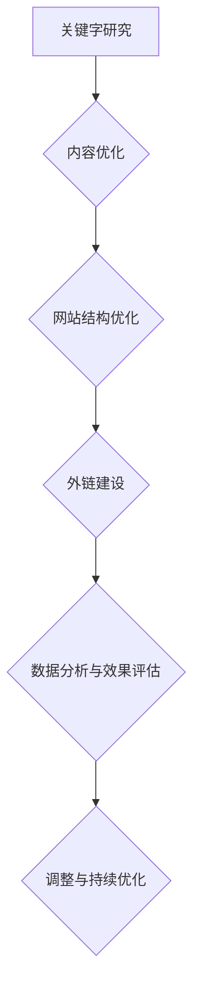

                 

### 《知识付费平台的SEO优化策略》

关键词：搜索引擎优化（SEO）、知识付费平台、关键词研究、内容优化、用户体验、网站结构、外链策略、数据分析

摘要：随着互联网的快速发展，知识付费平台成为知识传播和获取的重要渠道。为了提高平台的可见度和用户转化率，SEO优化策略变得至关重要。本文将详细探讨知识付费平台在搜索引擎优化方面的策略和实践，帮助平台运营者实现有效的SEO优化，提高网站排名和用户满意度。

### 目录大纲

1. **SEO基础知识与付费平台概述**
    1.1 SEO的定义与重要性
    1.2 SEO与搜索引擎工作原理
    1.3 SEO与搜索引擎营销（SEM）的关系
    1.4 SEO的历史发展与未来趋势
    2.1 知识付费平台的概念与特点
    2.2 知识付费平台的市场现状
    2.3 知识付费平台的发展趋势
    3.1 关键字研究
    3.2 内容优化
    3.3 网站结构优化
    4.1 用户体验与SEO的关系
    4.2 提高网站速度与性能
    4.3 移动端优化
    4.4 网站导航与内部链接结构
2. **SEO优化策略实施**
    5.1 网站结构优化
    5.2 搜索引擎外链策略
    5.3 数据分析与SEO效果评估
    6.1 外链获取渠道与策略
    6.2 社交媒体与外链推广
    6.3 内容营销与外链建设
    7.1 SEO数据分析工具介绍
    7.2 关键指标监控与优化
    7.3 SEO效果评估与调整策略
3. **案例研究与实践技巧**
    8.1 知识付费平台SEO案例分析
    8.2 SEO优化实战技巧与策略
    8.3 SEO优化常见问题与解决方法
    8.4 SEO优化过程中的陷阱与误区
    4. **未来SEO优化趋势与展望**
    9.1 SEO优化趋势分析
    9.2 SEO优化新技术与工具
    9.3 SEO与知识付费平台发展的未来展望
5. **附录**
    A.1 SEO工具介绍
    A.2 SEO资源推荐
    A.3 SEO学习资源与社区
    B.1 SEO优化流程图
    B.2 关键词研究算法伪代码
    B.3 内容优化算法伪代码
    B.4 数据分析算法伪代码

### 第一部分：SEO基础知识与付费平台概述

#### 第1章：搜索引擎优化（SEO）入门

##### 1.1 SEO的定义与重要性

搜索引擎优化（SEO，Search Engine Optimization）是一种通过改进网站结构、内容和外部链接来提高网站在搜索引擎中自然排名的策略。其核心目的是提高网站的可见性，从而吸引更多有针对性的流量。

SEO的重要性在于：

1. **提高网站流量**：有效的SEO策略可以提升网站在搜索引擎结果页（SERP）中的排名，从而吸引更多用户访问。
2. **提升品牌知名度**：排名提升意味着网站在用户心中的地位提高，有助于品牌知名度的提升。
3. **降低营销成本**：与付费广告相比，SEO是一种成本更低的获取流量的方式，特别是在长期内。
4. **提高用户转化率**：通过优化网站内容和用户体验，可以提升用户在网站上的互动和转化。

##### 1.2 SEO与搜索引擎工作原理

搜索引擎的核心工作是通过爬虫收集互联网上的信息，然后根据算法对网页进行排序，将最相关的结果展示给用户。

1. **爬虫（Crawler）**：搜索引擎使用爬虫在互联网上搜索网页，并抓取这些网页的内容。
2. **索引（Indexing）**：爬虫抓取的网页内容会被存储在索引数据库中，以便用户搜索时快速检索。
3. **排序算法（Ranking Algorithm）**：搜索引擎使用复杂的算法来确定每个搜索结果的排序。这些算法通常考虑关键词匹配度、网站质量、用户互动等多种因素。
4. **搜索结果展示（Search Results）**：最终，搜索引擎将根据排序算法的结果，向用户展示最相关的搜索结果。

##### 1.3 SEO与搜索引擎营销（SEM）的关系

SEO和搜索引擎营销（SEM）是两种不同的策略，但它们有着紧密的联系。

1. **SEO**：主要关注提高网站在搜索引擎中的自然排名，是一种长期且成本较低的获取流量的方式。
2. **SEM**：则主要涉及付费广告，如谷歌广告和百度推广，通过竞价排名的方式快速提升网站在搜索结果中的位置。

两者的关系在于：

- **相互补充**：SEO和SEM可以同时使用，以实现最佳的搜索引擎营销效果。
- **SEO优化**：可以为SEM提供更好的广告效果，因为优化后的网站质量更高，用户转化率也更高。

##### 1.4 SEO的历史发展与未来趋势

SEO的历史可以追溯到1990年代末期，随着搜索引擎的普及，网站开始重视SEO策略。以下是SEO发展的几个关键阶段：

1. **早期SEO（1998-2002）**：主要关注关键词堆砌和链接农场，试图通过欺骗搜索引擎来提高排名。
2. **算法更新（2003-2010）**：搜索引擎开始对垃圾内容和过度优化进行惩罚，SEO开始转向更注重用户体验和质量。
3. **内容为王（2011-2018）**：高质量内容和用户互动成为SEO的关键因素，搜索引擎对用户体验的重视程度不断提高。
4. **移动优先（2019至今）**：随着移动设备的普及，搜索引擎开始优先展示移动端优化的网站。

未来SEO的趋势包括：

1. **语义搜索**：搜索引擎将更注重理解用户意图，而不仅仅是关键词匹配。
2. **人工智能与机器学习**：SEO工具和策略将更加智能化，算法将更加复杂和精确。
3. **用户体验**：提供优质的内容和用户体验将成为SEO的核心，搜索引擎将更重视用户的停留时间、互动等指标。
4. **多渠道整合**：SEO将不再局限于搜索引擎，而是整合社交媒体、视频等多种渠道。

#### 第2章：知识付费平台概述

##### 2.1 知识付费平台的概念与特点

知识付费平台是一种在线教育平台，通过提供付费的知识课程、培训课程或咨询服务，为用户提供专业知识和技能的学习机会。其核心特点包括：

1. **付费内容**：用户需要支付一定费用才能访问或学习平台上的知识内容。
2. **专业讲师**：知识付费平台通常拥有专业的讲师团队，提供高质量的课程内容。
3. **灵活学习**：用户可以根据自己的时间安排，自由选择学习内容和学习进度。
4. **互动性强**：知识付费平台通常提供在线讨论区、问答功能等，增强用户之间的互动。

##### 2.2 知识付费平台的市场现状

知识付费平台在全球范围内都呈现出快速增长的趋势。根据市场研究报告，知识付费市场规模逐年扩大，用户数量不断增加。以下是知识付费平台市场现状的几个方面：

1. **用户增长**：随着在线学习的普及，知识付费平台吸引了大量用户，尤其是职业人士和专业人士。
2. **内容多样化**：知识付费平台涵盖了各个领域，包括编程、设计、语言学习、商业管理等。
3. **商业模式创新**：知识付费平台不断探索新的商业模式，如会员制、课程包月等，以吸引用户和增加收入。
4. **竞争加剧**：随着市场的扩大，知识付费平台之间的竞争也日益激烈，平台需要不断提高自身质量和用户体验，以吸引和留住用户。

##### 2.3 知识付费平台的发展趋势

未来，知识付费平台将面临以下发展趋势：

1. **个性化学习**：随着人工智能和大数据技术的发展，知识付费平台将提供更加个性化的学习体验，根据用户的学习习惯和需求推荐课程。
2. **跨平台融合**：知识付费平台将更加注重与社交媒体、视频平台等的整合，提供多样化的学习渠道。
3. **虚拟与现实结合**：知识付费平台将结合虚拟现实（VR）和增强现实（AR）技术，提供沉浸式的学习体验。
4. **教育监管加强**：随着教育监管的加强，知识付费平台需要更加注重教学内容的质量和合规性，以避免法律风险。

#### 第3章：知识付费平台的SEO核心概念

##### 3.1 关键字研究

关键字研究是SEO的第一步，也是至关重要的一步。它涉及确定哪些关键词对于知识付费平台来说最具价值和可行性，以便在搜索引擎结果页（SERP）上获得更好的排名。

###### 3.1.1 关键字搜索量分析

首先，需要进行关键字搜索量分析。这通常通过使用各种工具（如Google关键词规划师、Ahrefs、SEMrush等）来了解每个关键字在特定时间段内的搜索量。

- **高搜索量关键字**：这些关键字在特定时间段内搜索量很高，通常意味着有大量潜在用户在寻找这些内容。
- **低搜索量关键字**：这些关键字搜索量较低，但可能针对特定用户群体，更适合中小型知识付费平台。
- **长尾关键字**：这些关键字通常是更具体、更精准的，可能搜索量较低，但转化率较高。

###### 3.1.2 关键词定位与选择

在分析搜索量后，需要进行关键词定位与选择。这包括：

- **确定目标关键字**：选择与平台内容最相关、搜索量较高的关键字作为目标关键字。
- **关键字分组**：将关键字根据内容、用户需求等因素进行分组，以便更有针对性地进行内容优化。

关键字定位与选择的关键在于：

- **相关性**：关键字需要与平台内容高度相关，以便吸引真正感兴趣的潜在用户。
- **可行性**：关键字需要具有可行性，即平台的排名有机会提升到前几名。

###### 3.1.3 关键词优化策略

在确定了目标关键字后，需要制定关键词优化策略。以下是一些关键步骤：

- **内容优化**：在网站内容中合理使用目标关键字，确保内容的质量和相关性。
- **标题和摘要优化**：优化网页标题和摘要，使其包含目标关键字，同时保持吸引力和可读性。
- **内部链接**：在网站内部建立合理的链接结构，使用目标关键字作为链接锚文本。
- **外部链接**：通过建立高质量的外部链接，提高网站的权威性和相关性。

##### 3.2 内容优化

内容优化是SEO的核心，对于知识付费平台来说尤为重要。优质的内容不仅能够提升用户满意度，还能提高网站的搜索引擎排名。

###### 3.2.1 内容质量评估

首先，需要对现有内容进行质量评估。以下是一些关键指标：

- **原创性**：内容需要具有原创性，避免抄袭和重复。
- **准确性**：内容需要准确无误，确保信息的真实性。
- **可读性**：内容需要具有可读性，语言简洁明了，便于用户理解。
- **相关性**：内容需要与平台主题和目标关键字相关。

###### 3.2.2 内容更新策略

内容更新策略包括以下方面：

- **定期更新**：定期发布新的内容，保持网站活跃度和新鲜感。
- **内容多样化**：通过多种形式的内容（如文章、视频、音频、案例研究等）吸引不同类型的用户。
- **用户反馈**：积极收集用户反馈，并根据反馈调整和优化内容。

###### 3.2.3 标题与摘要优化

标题和摘要是用户决定是否访问网站的重要因素。以下是一些优化策略：

- **吸引力**：使用引人入胜的标题和摘要，激发用户的兴趣。
- **关键词包含**：确保标题和摘要中包含目标关键字，以提高搜索引擎排名。
- **简洁明了**：标题和摘要需要简洁明了，避免冗长和复杂。
- **描述性**：标题和摘要需要准确描述内容，帮助用户快速了解文章或视频的核心内容。

### 第二部分：SEO优化策略实施

#### 第4章：SEO与用户体验

用户体验（UX）是SEO中不可忽视的一部分。一个良好的用户体验不仅能够提高用户满意度，还能对SEO产生积极影响。

##### 4.1 用户体验与SEO的关系

用户体验与SEO之间的关系非常密切。以下是一些关键点：

1. **用户停留时间**：搜索引擎会通过用户的停留时间来评估网站的质量。如果一个网站的用户停留时间较长，搜索引擎可能会认为这是一个高质量的网站，从而提高其排名。
2. **跳出率**：高跳出率通常表明用户对网站不满意，搜索引擎可能会降低该网站的排名。
3. **页面速度**：页面速度对用户体验至关重要。一个快速的网站可以提高用户满意度，同时也有助于SEO。
4. **移动端优化**：随着移动设备的普及，移动端优化已经成为SEO的一部分。搜索引擎会优先展示对移动端优化较好的网站。

##### 4.2 提高网站速度与性能

提高网站速度与性能是优化用户体验的关键。以下是一些策略：

1. **压缩图片和文件**：压缩图片和文件可以减少加载时间。
2. **使用CDN**：内容分发网络（CDN）可以将网站内容缓存到全球多个节点，提高加载速度。
3. **减少HTTP请求**：减少HTTP请求可以减少页面加载时间。这可以通过合并文件、使用CSS和JavaScript文件缓存等方式实现。
4. **优化数据库查询**：优化数据库查询可以提高网站性能，从而提高用户体验。

##### 4.3 移动端优化

移动端优化已经成为SEO的重要组成部分。以下是一些关键策略：

1. **响应式设计**：确保网站在不同设备上都能良好显示。
2. **页面速度优化**：移动设备的网络速度通常较慢，因此需要特别关注页面速度的优化。
3. **简洁的导航**：移动端导航需要简洁直观，确保用户可以轻松找到所需内容。
4. **适配不同屏幕尺寸**：确保网站在不同屏幕尺寸上都能良好显示。

##### 4.4 网站导航与内部链接结构

网站导航和内部链接结构对用户体验和SEO都非常重要。以下是一些策略：

1. **清晰的导航结构**：确保网站的导航结构清晰，用户可以轻松找到所需内容。
2. **逻辑的内部链接**：建立逻辑的内部链接结构，帮助用户和搜索引擎理解网站内容。
3. **关键词丰富的链接锚文本**：使用关键词丰富的链接锚文本，提高网站的搜索引擎排名。
4. **保持内部链接的多样性**：避免过度使用相同的链接锚文本，保持内部链接的多样性。

### 第三部分：SEO优化策略实施

#### 第5章：网站结构优化

网站结构优化是SEO的核心组成部分，直接影响搜索引擎对网站的抓取、索引和排名。以下是一些关键策略：

##### 5.1 网站地图与机器人协议

网站地图（Sitemap）和机器人协议（Robots.txt）是优化网站结构的重要工具。

- **网站地图**：网站地图是一个XML文件，列出了网站的所有页面和链接。它有助于搜索引擎快速抓取和索引网站内容。以下是一个简单的网站地图示例：

  ```xml
  <?xml version="1.0" encoding="UTF-8"?>
  <urlset xmlns="http://www.sitemaps.org/schemas/sitemap/0.9">
    <url>
      <loc>https://www.example.com/home</loc>
      <lastmod>2023-03-01</lastmod>
      <priority>1.0</priority>
    </url>
    <url>
      <loc>https://www.example.com/about</loc>
      <lastmod>2023-03-01</lastmod>
      <priority>0.8</priority>
    </url>
    <!-- More URLs -->
  </urlset>
  ```

- **机器人协议**：机器人协议（Robots.txt）是一个文本文件，用于指示搜索引擎爬虫哪些页面可以抓取，哪些页面需要忽略。以下是一个简单的机器人协议示例：

  ```
  User-Agent: *
  Allow: /
  Disallow: /admin
  ```

##### 5.2 网站内部链接优化

内部链接优化是改善网站结构的关键步骤。以下是一些策略：

- **逻辑的链接结构**：确保网站的内部链接结构合理，有助于用户和搜索引擎理解网站的内容和结构。
- **关键词丰富的链接锚文本**：使用关键词丰富的链接锚文本，提高网站的搜索引擎排名。以下是一个示例：

  ```
  <a href="https://www.example.com/course/programming">学习编程</a>
  ```

- **交叉链接**：在相关页面之间建立交叉链接，有助于提高页面的权重和相关性。
- **链接密度**：保持合理的链接密度，避免过度链接。

##### 5.3 网站安全与信任度提升

网站安全性和信任度对SEO至关重要。以下是一些策略：

- **HTTPS**：使用HTTPS协议（安全套接字层）来保护用户数据和网站内容。
- **SSL证书**：安装SSL证书，确保网站的安全和信任度。
- **网站安全工具**：使用网站安全工具（如Wordfence、Sucuri等）来监测和防止恶意攻击。
- **隐私政策**：明确网站的隐私政策，确保用户的个人信息安全。

#### 第6章：搜索引擎外链策略

外链策略是SEO的重要组成部分，通过获取高质量的外部链接，可以提高网站的权威性和排名。以下是一些关键策略：

##### 6.1 外链获取渠道与策略

- **内容营销**：创建高质量的内容，吸引其他网站链接到您的网站。以下是一个内容营销的示例：

  ```
  Title: 知识付费平台SEO优化策略
  Description: 本文详细介绍了知识付费平台在搜索引擎优化方面的策略和实践，帮助平台运营者实现有效的SEO优化。
  ```

- **社交媒体推广**：通过社交媒体平台（如微博、微信公众号、Twitter、LinkedIn等）推广内容，吸引其他网站链接。
- **合作伙伴关系**：与其他相关网站建立合作伙伴关系，共同推广内容，互惠互利。
- **外部博客投稿**：在其他相关领域的博客或网站上投稿，获得外部链接。

##### 6.2 社交媒体与外链推广

- **社交媒体平台**：利用社交媒体平台（如微博、微信公众号、Twitter、LinkedIn等）推广内容，增加网站的曝光度和访问量。
- **互动与参与**：积极参与社交媒体平台的讨论，与其他用户互动，提高网站知名度。
- **营销活动**：举办营销活动（如抽奖、优惠券等），吸引更多用户参与和分享。

##### 6.3 内容营销与外链建设

- **高质量内容**：创建高质量的内容，包括文章、视频、图片、案例分析等，吸引其他网站链接。
- **白皮书与报告**：发布行业白皮书、市场报告等，提供有价值的信息，吸引其他网站引用。
- **新闻稿**：发布新闻稿，将内容传播到更广泛的受众，提高网站的权威性和知名度。

#### 第7章：数据分析与SEO效果评估

SEO优化需要持续的数据分析和效果评估，以确保策略的有效性和可持续性。以下是一些关键步骤：

##### 7.1 SEO数据分析工具介绍

- **Google Analytics**：Google Analytics 是一款免费的分析工具，可以提供网站流量、用户行为、转化率等关键数据。
- **Google Search Console**：Google Search Console 是一款免费的搜索引擎优化工具，可以提供网站在Google上的搜索表现、关键字排名、错误报告等数据。
- **Ahrefs**：Ahrefs 是一款综合性的SEO工具，可以提供关键字研究、网站分析、竞争对手分析等数据。
- **SEMrush**：SEMrush 是一款功能强大的SEO工具，可以提供关键字研究、网站分析、竞争对手分析等数据。

##### 7.2 关键指标监控与优化

- **关键字排名**：定期监控目标关键字的排名，分析排名变化的原因，并进行相应调整。
- **流量来源**：分析网站流量来源，了解哪些渠道带来更多用户，优化这些渠道。
- **用户行为**：分析用户行为数据（如页面停留时间、跳出率、转化率等），优化用户体验。
- **转化率**：监控网站的转化率，分析转化率低的原因，并优化相关页面。

##### 7.3 SEO效果评估与调整策略

- **定期评估**：定期对SEO效果进行评估，分析策略的有效性。
- **数据驱动**：根据数据分析结果，制定相应的调整策略。
- **持续优化**：SEO是一个持续的过程，需要不断优化和调整，以适应搜索引擎的变化和用户需求。

### 第四部分：案例研究与实践技巧

#### 第8章：知识付费平台SEO案例分析

在本章节中，我们将通过一个具体的知识付费平台SEO案例，详细分析其SEO策略的制定、实施和效果评估。这个案例将涵盖以下方面：

- **案例背景**：介绍知识付费平台的基本信息，包括其定位、目标用户和市场环境。
- **SEO目标设定**：明确平台在SEO方面的具体目标，如提高特定关键字的排名、增加网站流量和转化率等。
- **策略实施**：详细描述平台在关键字研究、内容优化、网站结构优化、外链建设等方面的具体策略和实施步骤。
- **效果评估**：分析SEO策略的实施效果，包括关键指标的变化、用户反馈和业务增长等。
- **总结与反思**：总结案例中的成功经验和不足之处，提出改进建议。

通过这个案例，我们将深入理解知识付费平台的SEO策略，并为其他平台提供借鉴和参考。

#### 第9章：SEO优化实战技巧与策略

在SEO优化的实际操作中，平台运营者需要掌握一系列实战技巧和策略，以确保SEO活动的有效性。以下是一些关键的技巧和策略：

##### 9.1 SEO优化常见问题与解决方法

在SEO优化过程中，平台运营者可能会遇到各种问题。以下是一些常见问题及其解决方法：

1. **关键字选择不当**：解决方法：重新进行关键字研究，选择更精准、更相关的关键字。
2. **内容质量不高**：解决方法：提升内容质量，确保内容具有原创性、准确性和可读性。
3. **网站速度慢**：解决方法：优化网站性能，如压缩图片、使用CDN、减少HTTP请求等。
4. **链接结构不合理**：解决方法：优化内部链接结构，确保链接逻辑清晰，使用关键词丰富的链接锚文本。
5. **外链质量低**：解决方法：提高外链质量，通过内容营销、社交媒体推广和合作伙伴关系等方式获取高质量的外部链接。

##### 9.2 SEO优化过程中的陷阱与误区

在SEO优化过程中，平台运营者需要避免一些常见的陷阱和误区，以确保SEO策略的有效性。以下是一些常见的陷阱和误区：

1. **过度优化**：避免过度优化，如过度使用关键字、堆砌关键词等，这可能导致搜索引擎惩罚。
2. **忽视用户体验**：SEO优化不应仅关注搜索引擎，还应关注用户体验，确保网站内容丰富、结构清晰、加载速度快。
3. **依赖付费广告**：尽管付费广告可以快速提升网站排名，但长期来看，SEO优化更具成本效益和可持续性。
4. **忽视移动端优化**：随着移动设备的普及，移动端优化已成为SEO的重要组成部分，平台运营者应确保网站在移动端上的良好表现。

##### 9.3 SEO优化策略的持续更新与适应

SEO优化是一个持续的过程，需要不断更新和适应。以下是一些关键策略：

1. **定期监测**：定期监测关键字排名、网站流量、用户行为等关键指标，了解SEO策略的效果。
2. **数据分析**：利用数据分析工具，分析SEO活动的效果，发现问题和机会。
3. **用户反馈**：积极收集用户反馈，了解用户需求和满意度，及时调整SEO策略。
4. **适应变化**：搜索引擎算法和用户行为不断变化，平台运营者需要及时适应这些变化，调整SEO策略。

通过掌握这些实战技巧和策略，平台运营者可以更有效地实施SEO优化，提高网站在搜索引擎中的排名和用户满意度。

#### 第10章：未来SEO优化趋势与展望

随着技术的不断进步和用户需求的变化，未来的SEO优化趋势也在不断演变。以下是一些重要的趋势和展望：

##### 10.1 SEO优化趋势分析

1. **语义搜索**：随着自然语言处理技术的发展，搜索引擎将更加注重理解用户意图，而不仅仅是关键词匹配。
2. **人工智能与机器学习**：SEO工具和策略将更加智能化，算法将更加复杂和精确，以适应不断变化的市场和用户需求。
3. **移动端优化**：随着移动设备的普及，移动端优化将成为SEO的重要组成部分，平台运营者需要确保网站在移动端上的良好表现。
4. **用户体验**：提供优质的内容和用户体验将成为SEO的核心，搜索引擎将更重视用户的停留时间、互动等指标。
5. **多渠道整合**：SEO将不再局限于搜索引擎，而是整合社交媒体、视频等多种渠道，以实现最佳的效果。

##### 10.2 SEO优化新技术与工具

未来，SEO优化将受益于一系列新技术和工具的发展。以下是一些重要的新技术和工具：

1. **人工智能助手**：人工智能助手将帮助平台运营者更高效地进行关键字研究、内容优化和数据分析。
2. **自动化工具**：自动化工具将帮助平台运营者自动化SEO任务，如关键词监控、外链建设、内容发布等。
3. **大数据分析**：大数据分析将帮助平台运营者更深入地了解用户行为和市场趋势，从而制定更有效的SEO策略。
4. **可视化工具**：可视化工具将帮助平台运营者更直观地了解SEO活动的效果和趋势，以便及时调整策略。

##### 10.3 SEO与知识付费平台发展的未来展望

随着知识付费平台的快速发展，SEO优化将成为平台运营的重要策略。以下是对未来SEO与知识付费平台发展的展望：

1. **个性化学习**：未来的SEO优化将更加注重个性化学习体验，平台将利用大数据和人工智能技术，为用户提供定制化的学习内容和推荐。
2. **多渠道整合**：知识付费平台将更加注重与社交媒体、视频平台等多渠道的整合，以吸引更多用户和提升品牌知名度。
3. **内容质量**：高质量的内容将仍然是SEO的核心，平台需要不断优化内容，提供有价值、有深度、有吸引力的学习资源。
4. **用户体验**：提供优质的内容和用户体验将成为平台发展的关键，平台需要注重用户体验，提高用户满意度和忠诚度。

通过紧跟未来SEO优化趋势，知识付费平台可以更好地应对市场变化，提升自身的竞争力和市场份额。

#### 附录

##### 附录A：SEO工具介绍

SEO工具是优化搜索引擎排名的重要辅助工具，以下是一些常用的SEO工具及其功能：

1. **Google Analytics**：一款免费的网站分析工具，用于监测网站流量、用户行为和转化率等关键指标。
2. **Google Search Console**：一款免费的搜索引擎优化工具，提供网站在Google上的搜索表现、关键字排名和错误报告等数据。
3. **Ahrefs**：一款综合性的SEO工具，提供关键字研究、网站分析、竞争对手分析等功能。
4. **SEMrush**：一款功能强大的SEO工具，提供关键字研究、网站分析、竞争对手分析、内容优化建议等。
5. **Moz**：一款全面的SEO工具，提供关键字研究、网站分析、链接建设、竞争对手分析等功能。
6. **Yoast SEO**：一款WordPress插件，用于优化网站SEO，提供关键字优化建议、内部链接建议等。

##### 附录B：SEO资源推荐

以下是一些SEO相关的资源，包括书籍、网站和社区，供读者参考：

1. **书籍**：
   - 《SEO秘籍：搜索引擎优化实战手册》（SEO Secrets: The Ultimate Guide to Search Engine Optimization）
   - 《SEO实战密码：搜索引擎营销与推广策略》（Search Engine Optimization: The Art of SEO）
   - 《谷歌搜索算法揭秘：搜索引擎优化与营销实战》（Search Engine Optimization: The Complete Guide to Google’s Algorithm）

2. **网站**：
   - **Search Engine Land**：提供最新的SEO和搜索引擎营销新闻、分析和技术文章。
   - **Moz Blog**：Moz的官方博客，提供关于SEO、内容营销和链接建设的深度文章。
   - **Search Engine Watch**：提供搜索引擎优化、营销和数据分析的相关文章和案例研究。

3. **社区**：
   - **SEO Chat**：一个SEO问答社区，用户可以提问和回答SEO相关的问题。
   - **Black Hat World**：一个讨论SEO和搜索引擎营销策略的社区。
   - **SEO Book**：一个提供SEO资源和在线课程的网站。

通过利用这些工具和资源，读者可以更好地了解SEO的最新动态和最佳实践，从而更有效地优化网站。

##### 附录C：SEO优化流程图与算法伪代码

以下是SEO优化流程图和关键算法的伪代码，以帮助读者理解SEO优化的技术细节。

###### SEO优化流程图



###### 关键词研究算法伪代码

```plaintext
function 关键字研究(关键字库，搜索量数据) {
    筛选关键字 = []
    for 关键字 in 关键字库 {
        if 搜索量数据(关键字) > 5000 {
            筛选关键字.append(关键字)
        }
    }
    return 筛选关键字
}
```

###### 内容优化算法伪代码

```plaintext
function 内容优化(网页内容，关键字) {
    for 段落 in 网页内容 {
        if 包含关键字(段落) {
            更新段落 = 替换关键字(段落，关键字，关键词密度阈值)
            网页内容.replace(段落，更新段落)
        }
    }
    return 网页内容
}
```

###### 数据分析算法伪代码

```plaintext
function 数据分析(搜索引擎数据，用户行为数据) {
    关键字排名变化 = []
    转化率变化 = []
    for 关键字 in 搜索引擎数据 {
        关键字排名变化.append(关键字排名变化率(关键字，时间周期))
    }
    for 用户行为数据 in 用户行为数据 {
        转化率变化.append(转化率变化率(用户行为数据，时间周期))
    }
    return 关键字排名变化，转化率变化
}
```

通过这些流程图和伪代码，读者可以更深入地了解SEO优化的技术实现过程，为实际操作提供指导。

### 作者信息

作者：AI天才研究院/AI Genius Institute & 禅与计算机程序设计艺术 /Zen And The Art of Computer Programming

本文由AI天才研究院和禅与计算机程序设计艺术共同撰写，旨在为知识付费平台提供全面的SEO优化策略和实践指导。AI天才研究院致力于探索人工智能领域的前沿技术，而禅与计算机程序设计艺术则专注于计算机编程和软件工程的最佳实践。通过结合两者的专业知识，本文为读者提供了一个权威且实用的SEO指南。如有任何疑问或建议，欢迎联系作者，我们将竭诚为您解答。

