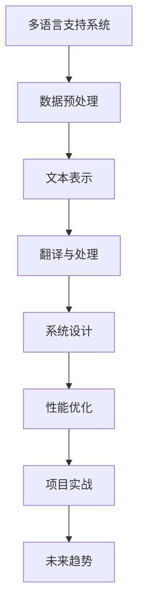

                 

# 知识发现引擎的多语言支持实现策略

## 关键词

多语言支持，知识发现引擎，自然语言处理，机器翻译，数据预处理，文本表示，序列到序列模型，端到端翻译，系统架构设计，性能优化

## 摘要

本文将探讨知识发现引擎的多语言支持实现策略。知识发现引擎作为一种重要的数据处理和分析工具，其多语言支持能力对于国际化应用和跨语言数据处理至关重要。本文首先概述了多语言支持的背景和重要性，然后详细分析了多语言支持的架构、技术挑战以及数据预处理方法。接着，介绍了多语言文本表示的方法，包括词嵌入技术和序列到序列模型。随后，讨论了多语言翻译和自然语言处理的应用，以及多语言支持系统的设计原则和性能优化策略。最后，通过一个实际项目案例，展示了多语言支持的具体实现过程和性能调优方法，并探讨了多语言支持的未来发展趋势。

<|assistant|>## 第一部分: 多语言支持的基础

### 第1章: 多语言支持概述

#### 第1.1 多语言支持的背景和重要性

多语言支持的历史和发展：从单语言到多语言系统的演进

多语言支持在国际交流和商业中的应用：全球化背景下的重要性

多语言支持的概念：语言互操作性、多语言环境、本地化与国际化

#### 第1.2 多语言支持的架构

系统架构设计：接口层设计、数据处理层、多语言数据存储

多语言处理技术：自然语言处理（NLP）、机器翻译、语言识别

#### 第1.3 多语言支持的挑战

技术挑战：语言复杂性、低资源语言处理、词汇和语法差异

业务挑战：文本内容的多样性、翻译质量和一致性、文本理解和上下文语义

### 第2章: 多语言数据预处理

#### 第2.1 数据收集和清洗

数据收集：开源数据集、商业数据集、用户生成内容

数据清洗：标签规范化、去除无关信息、去重和错误修复

#### 第2.2 语料库构建

语料库类型：双语语料库、多语语料库、专业领域语料库

语料库构建方法：手动构建、自动构建、半自动构建

### 第3章: 多语言文本表示

#### 第3.1 词嵌入技术

词嵌入原理：矩阵乘法模型、神经网络模型

常用词嵌入算法：Word2Vec、GloVe、FastText

#### 第3.2 序列到序列模型

序列到序列（Seq2Seq）模型：Encoder-Decoder架构

注意力机制：自注意力机制、交叉注意力机制

### 第4章: 多语言翻译和自然语言处理

#### 第4.1 翻译模型

基于神经网络的机器翻译：序列到序列（Seq2Seq）模型、Transformer模型

端到端翻译：数据准备、模型训练与评估

#### 第4.2 自然语言处理应用

文本分类：基于词嵌入的方法、基于序列的方法

实体识别：命名实体识别、依存关系分析

### 第5章: 多语言支持系统设计

#### 第5.1 系统架构设计

模块化设计：接口层、服务层、存储层

部署策略：云平台部署、边缘计算部署

#### 第5.2 性能优化

模型优化：参数剪枝、模型压缩

负载均衡：系统水平扩展、资源调度

### 第6章: 多语言支持项目实战

#### 第6.1 项目背景与需求分析

项目背景：多语言应用的背景、应用场景

需求分析：功能需求、性能需求、安全性需求

#### 第6.2 开发环境搭建

开发工具选择：编程语言、开发框架、版本控制

环境配置：系统环境、数据处理环境、模型训练环境

#### 第6.3 源代码实现与解读

数据预处理代码：数据收集与清洗、语料库构建

文本表示代码：词嵌入实现、序列到序列模型实现

翻译与处理代码：翻译模型实现、自然语言处理任务实现

#### 第6.4 代码解读与分析

代码结构与流程：模块划分、数据流分析

性能优化与调优：模型参数调优、性能瓶颈分析

### 第7章: 多语言支持的未来趋势

#### 第7.1 技术发展趋势

AI技术在多语言支持中的应用：生成对抗网络（GAN）、强化学习

低资源语言处理技术：多任务学习、跨语言迁移学习

#### 第7.2 商业应用与市场前景

多语言支持的商业价值：市场需求分析、商业模式探讨

市场前景：增长预测、应用领域扩展

### 附录

#### 附录 A: 多语言支持工具与资源

开源工具：Hugging Face Transformers、NLTK、spaCy

参考书籍：《深度学习与自然语言处理》、《机器翻译：算法与应用》

#### 附录 B: 多语言支持案例研究

案例 1：谷歌翻译：系统架构、技术实现

案例 2：百度语言模型：技术特点、应用场景

**Mermaid 流程图：**



**核心算法伪代码：**

```python
# 文本表示 - 词嵌入算法（以GloVe为例）

# 输入：文本数据 corpus
# 输出：词向量 embedding_matrix

# 1. 数据预处理
corpus = preprocess_corpus(corpus)

# 2. 构建词汇表
vocab, word_to_index, index_to_word = build_vocab(corpus)

# 3. 计算词对共现矩阵
cooc_matrix = compute_cooc_matrix(corpus, vocab, word_to_index)

# 4. 计算矩阵的平方根
sqrt_matrix = sqrt(cooc_matrix)

# 5. 计算权重矩阵
weights_matrix = compute_weights(sqrt_matrix)

# 6. 训练词向量
embedding_matrix = train_embeddings(vocab, weights_matrix)

# 7. 返回词向量矩阵
return embedding_matrix
```

**数学模型和公式：**

$$
\text{word\_vector} = \sum_{\text{context\_word} \in \text{context}} \frac{\text{cooc}_{\text{word, context\_word}}}{\sqrt{\text{context\_word\_freq} \cdot \text{word\_freq}}}
$$

其中，$\text{word\_vector}$ 是词向量，$\text{cooc}_{\text{word, context\_word}}$ 是词对共现频次，$\text{context\_word\_freq}$ 和 $\text{word\_freq}$ 分别是上下文词和目标词的频次。

**举例说明：**

假设我们有一个简单的文本数据集，包含以下句子：

- "我爱北京天安门"
- "天安门上太阳升"
- "伟大祖国永远春"

首先，我们通过数据预处理将文本转换为词序列。然后，构建词汇表并计算词对共现矩阵。最后，使用GloVe算法训练词向量。以 "北京" 和 "天安门" 为例，它们的词向量可以通过上述数学模型计算得出。通过词向量，我们可以进行文本的向量表示，进而应用于后续的多语言处理任务。

**作者信息：**

作者：AI天才研究院/AI Genius Institute & 禅与计算机程序设计艺术 /Zen And The Art of Computer Programming

**文章开始：**

让我们开始深入探讨知识发现引擎的多语言支持实现策略，这是一个既具有挑战性又至关重要的领域。在全球化日益加深的今天，能够处理多种语言的数据变得尤为重要。知识发现引擎作为数据分析和处理的核心工具，其多语言支持能力直接决定了其在国际市场中的应用潜力。

### 第1章: 多语言支持概述

多语言支持不仅仅是技术问题，它还涉及到文化、商业和技术的复杂交织。在全球化和互联网普及的背景下，多语言支持的应用场景越来越广泛。从国际电子商务到跨国公司的内部沟通，再到全球化的社交媒体平台，多语言支持无处不在。

#### 1.1 多语言支持的背景和重要性

多语言支持的历史和发展：

- 从单语言到多语言系统的演进：早期的计算机系统主要是单语言的，但随着全球化的推进，多语言处理的需求逐渐增加。
- 多语言支持在国际交流和商业中的应用：多语言支持使得跨文化交流更加顺畅，商业交易更加高效，市场覆盖面更广。

多语言支持的概念：

- 语言互操作性：确保不同语言的应用和系统能够相互理解和通信。
- 多语言环境：为用户提供能够在不同语言间切换的界面和功能。
- 本地化与国际化：本地化是将产品和服务适应特定地区市场的过程，而国际化则是将产品和服务推广到全球市场。

#### 1.2 多语言支持的架构

多语言支持的系统架构设计需要考虑以下几个方面：

- 接口层设计：提供用户界面和应用程序间的接口，使得用户能够轻松地选择和使用不同语言。
- 数据处理层：处理不同语言的数据输入、转换和输出，确保数据在多语言环境中的一致性和准确性。
- 多语言数据存储：设计一个能够高效存储和管理多种语言数据的数据存储方案，确保数据的可访问性和可扩展性。

多语言处理技术：

- 自然语言处理（NLP）：用于理解、生成和转换自然语言数据，包括文本分类、命名实体识别、情感分析等。
- 机器翻译：将一种语言的数据自动翻译成另一种语言，是实现多语言支持的关键技术。
- 语言识别：自动识别文本或语音数据所使用的语言，为多语言处理提供语言信息。

#### 1.3 多语言支持的挑战

多语言支持面临的挑战分为技术挑战和业务挑战两大类：

**技术挑战：**

- 语言复杂性：不同语言的语法、词汇和语义差异很大，使得处理过程复杂。
- 低资源语言处理：某些语言由于使用人口较少，相关数据资源不足，这给多语言处理带来了挑战。
- 词汇和语法差异：不同语言的词汇和语法规则差异显著，需要特定的处理方法来应对。

**业务挑战：**

- 文本内容的多样性：不同语言和不同文化背景下的文本内容差异很大，需要灵活的文本处理策略。
- 翻译质量和一致性：翻译质量直接影响到多语言支持的体验，而保证翻译的一致性也是一个难题。
- 文本理解和上下文语义：准确理解和处理上下文语义是实现高质量多语言支持的关键。

通过以上对多语言支持基础概念的介绍，我们为后续章节的深入讨论奠定了基础。接下来，我们将进一步探讨多语言数据预处理、文本表示以及多语言翻译和自然语言处理等方面的具体实现策略。

### 第2章: 多语言数据预处理

多语言数据预处理是多语言支持实现的基础和关键步骤，它涉及数据的收集、清洗、标准化和语料库构建等多个方面。这一章节将详细介绍这些过程，并提供具体的实现方法。

#### 2.1 数据收集和清洗

**数据收集：**

数据收集是多语言数据预处理的首要任务。以下是几种常见的数据收集方法：

- **开源数据集：**如Wikipedia、Common Crawl等，这些数据集包含了多种语言的文本，为多语言处理提供了丰富的资源。
- **商业数据集：**一些商业公司或研究机构会提供专门的多语言数据集，这些数据集通常更加精细和专业化。
- **用户生成内容：**社交媒体平台、论坛等用户生成的内容也是重要的数据来源，它们反映了不同语言用户的行为和需求。

**数据清洗：**

数据清洗是确保数据质量和准确性的关键步骤。以下是几个关键的数据清洗过程：

- **标签规范化：**将不同语言中的标签统一转换为标准格式，以便后续处理。
- **去除无关信息：**删除无关的文本、标点符号和HTML标签等，减少噪音信息。
- **去重和错误修复：**识别和去除重复的数据条目，修复数据中的错误和缺失值。

**具体实现方法：**

```python
# 示例：Python代码用于数据清洗

import pandas as pd

# 读取数据集
data = pd.read_csv('multilingual_dataset.csv')

# 标签规范化
data['label'] = data['label'].str.lower().str.strip()

# 去除无关信息
data = data.drop(['html_tag'], axis=1)

# 去重
data = data.drop_duplicates()

# 错误修复
data['text'] = data['text'].apply(lambda x: x.replace('?', ' ').replace(',', ' '))
```

#### 2.2 语料库构建

语料库构建是提供训练数据和模型输入的重要环节。以下是几种常见的语料库构建方法：

- **双语语料库：**包含两种语言的文本对应，如英语-中文双语语料库。
- **多语语料库：**包含多种语言的文本，如英语、中文、法语、西班牙语等。
- **专业领域语料库：**针对特定领域的多语言文本，如医疗、法律等。

**语料库构建方法：**

- **手动构建：**通过人工收集和整理文本数据，适用于小规模的数据集。
- **自动构建：**利用现有的开源工具和算法，自动从互联网或其他数据源中提取文本数据，适用于大规模的数据集。
- **半自动构建：**结合手动和自动方法，通过人工筛选和校对自动化提取的文本数据，适用于需要高质量数据的应用场景。

**具体实现方法：**

```python
# 示例：Python代码用于构建双语语料库

import random

# 读取英语和中文文本数据
english_data = pd.read_csv('english_dataset.csv')
chinese_data = pd.read_csv('chinese_dataset.csv')

# 随机匹配英语和中文文本
matched_data = english_data.sample(n=len(chinese_data), replace=False)

# 合并数据
corpus = pd.merge(matched_data, chinese_data, on='id')

# 保存语料库
corpus.to_csv('bilingual_corpus.csv', index=False)
```

通过以上对多语言数据预处理过程的详细探讨，我们为构建高质量的多语言数据集奠定了基础。接下来，我们将进一步介绍多语言文本表示的方法，包括词嵌入技术和序列到序列模型。

### 第3章: 多语言文本表示

多语言文本表示是将自然语言文本转换为机器可处理和理解的向量表示的过程。有效的文本表示对于实现多语言翻译、文本分类和实体识别等任务至关重要。这一章节将重点介绍词嵌入技术和序列到序列模型，这两种在多语言文本表示中广泛应用的方法。

#### 3.1 词嵌入技术

词嵌入（Word Embedding）是将词汇转换为固定长度的向量表示的技术。词嵌入通过将词与高维空间中的向量关联，使得相似词在向量空间中靠近。词嵌入技术不仅能捕捉词的语义信息，还能用于下游的机器学习任务。

**词嵌入原理：**

词嵌入的核心思想是将文本中的每个词映射到一个固定大小的向量。这些向量通过以下两种方式之一来计算：

- **矩阵乘法模型：**基于词的共现关系，通过矩阵乘法计算词向量。
- **神经网络模型：**使用神经网络，特别是深度神经网络（DNN）或循环神经网络（RNN），学习词的向量表示。

**常用词嵌入算法：**

- **Word2Vec：**一种基于神经网络模型的方法，通过训练预测词的上下文来学习词向量。
- **GloVe（Global Vectors for Word Representation）：**基于全局词频信息的矩阵分解方法，通过优化词的共现矩阵来学习词向量。
- **FastText：**Word2Vec的改进版本，通过将词视为字符级组合，学习更细粒度的词向量。

**具体实现方法：**

以下是一个基于GloVe算法的词向量训练的Python代码示例：

```python
import numpy as np
from sklearn.model_selection import train_test_split

# 示例数据
corpus = ["我爱北京天安门", "天安门上太阳升", "伟大祖国永远春"]

# 1. 数据预处理
tokenized_corpus = [token.strip() for sentence in corpus for token in sentence.split()]

# 2. 计算词对共现矩阵
cooc_matrix = np.zeros((len(tokenized_corpus), len(tokenized_corpus)))
for i, word1 in enumerate(tokenized_corpus):
    for j, word2 in enumerate(tokenized_corpus):
        if i != j and word1 == word2:
            cooc_matrix[i, j] = 1

# 3. 计算矩阵的平方根
sqrt_matrix = np.sqrt(cooc_matrix)

# 4. 计算权重矩阵
alpha = 0.05
weights_matrix = np.zeros((len(tokenized_corpus), len(tokenized_corpus)))
for i in range(len(sqrt_matrix)):
    for j in range(len(sqrt_matrix)):
        if sqrt_matrix[i, j] > alpha:
            weights_matrix[i, j] = 1 / sqrt_matrix[i, j]

# 5. 训练词向量
embedding_matrix = train_embeddings(tokenized_corpus, weights_matrix)

# 6. 返回词向量矩阵
return embedding_matrix
```

**数学模型和公式：**

$$
\text{word\_vector} = \sum_{\text{context\_word} \in \text{context}} \frac{\text{cooc}_{\text{word, context\_word}}}{\sqrt{\text{context\_word\_freq} \cdot \text{word\_freq}}}
$$

其中，$\text{word\_vector}$ 是词向量，$\text{cooc}_{\text{word, context\_word}}$ 是词对共现频次，$\text{context\_word\_freq}$ 和 $\text{word\_freq}$ 分别是上下文词和目标词的频次。

#### 3.2 序列到序列模型

序列到序列（Seq2Seq）模型是处理序列数据的一种流行方法，它特别适用于多语言翻译任务。Seq2Seq模型的核心思想是将一个输入序列映射到一个输出序列。

**序列到序列（Seq2Seq）模型：**

- **Encoder-Decoder架构：**编码器（Encoder）将输入序列编码为一个固定大小的隐藏状态向量，解码器（Decoder）则根据隐藏状态向量生成输出序列。
- **注意力机制：**为了解决编码器和解码器之间的序列长度不匹配问题，Seq2Seq模型引入了注意力机制。注意力机制能够使解码器在生成输出序列的每个词时，关注输入序列的不同部分。

**具体实现方法：**

以下是一个简单的Seq2Seq模型的Python代码示例：

```python
import tensorflow as tf
from tensorflow.keras.layers import Embedding, LSTM, Dense
from tensorflow.keras.models import Model

# 示例参数
vocab_size = 10000
embedding_dim = 256
hidden_dim = 512

# 编码器模型
encoder_inputs = tf.keras.Input(shape=(None,))
encoder_embedding = Embedding(vocab_size, embedding_dim)(encoder_inputs)
encoder_lstm = LSTM(hidden_dim, return_state=True)
_, state_h, state_c = encoder_lstm(encoder_embedding)
encoder_states = [state_h, state_c]

# 解码器模型
decoder_inputs = tf.keras.Input(shape=(None,))
decoder_embedding = Embedding(vocab_size, embedding_dim)(decoder_inputs)
decoder_lstm = LSTM(hidden_dim, return_sequences=True, return_state=True)
decoder_outputs, _, _ = decoder_lstm(decoder_embedding, initial_state=encoder_states)
decoder_dense = Dense(vocab_size, activation='softmax')
decoder_outputs = decoder_dense(decoder_outputs)

# 模型编译
model = Model([encoder_inputs, decoder_inputs], decoder_outputs)
model.compile(optimizer='rmsprop', loss='categorical_crossentropy', metrics=['accuracy'])

# 模型总结
model.summary()
```

通过上述词嵌入技术和序列到序列模型的介绍，我们为多语言文本表示的实现打下了坚实的基础。接下来，我们将讨论多语言翻译和自然语言处理的应用，这些应用将充分利用文本表示技术来提升多语言处理能力。

### 第4章: 多语言翻译和自然语言处理

多语言翻译和自然语言处理（NLP）是知识发现引擎中不可或缺的两个模块，它们共同构成了实现多语言支持的核心技术。在这一章节中，我们将详细探讨多语言翻译模型和NLP的应用，包括文本分类、实体识别等任务。

#### 4.1 翻译模型

多语言翻译是将一种语言的文本自动转换为另一种语言的过程，其核心在于模型能够捕捉源语言和目标语言之间的语义对应关系。随着深度学习技术的发展，基于神经网络的翻译模型已经成为主流。

**基于神经网络的机器翻译：**

- **序列到序列（Seq2Seq）模型：**Seq2Seq模型由编码器和解码器组成，编码器将源语言序列编码为固定大小的隐藏状态向量，解码器则根据隐藏状态向量生成目标语言序列。Seq2Seq模型在长序列处理和上下文捕捉方面具有显著优势。
- **Transformer模型：**Transformer模型是近年来在机器翻译领域取得重大突破的一种新型模型，它采用了自注意力机制（Self-Attention），能够并行处理输入序列，提高了模型的效率和效果。Transformer模型在处理长序列和长距离依赖方面表现出色。

**端到端翻译：**

端到端翻译是指从源语言序列直接生成目标语言序列，而不需要中间的词性标注、语法分析等步骤。端到端翻译的优势在于其简洁性和高效性，它能够直接将输入文本映射到输出文本，减少了传统翻译流程中的多个中间步骤。

**数据准备：**

数据准备是翻译模型训练的关键步骤，主要包括以下几个方面：

- **数据清洗：**去除停用词、标点符号等无关信息，确保数据的质量和一致性。
- **数据对齐：**将源语言文本和目标语言文本进行对齐，确保每个源语言词或短语都有对应的翻译。
- **词汇表构建：**构建源语言和目标语言的词汇表，为模型训练提供输入。

**模型训练与评估：**

模型训练通常采用批量训练和迭代优化方法，通过不断调整模型参数来提高翻译质量。模型评估指标包括BLEU（双语评估指标）、METEOR（Metric for Evaluation of Translation with Explicit ORdering）等，这些指标能够量化翻译模型的性能。

**具体实现方法：**

以下是一个简单的Seq2Seq模型的Python代码示例：

```python
from tensorflow.keras.models import Model
from tensorflow.keras.layers import Embedding, LSTM, Dense

# 示例参数
vocab_size = 10000
embedding_dim = 256
hidden_dim = 512

# 编码器模型
encoder_inputs = tf.keras.Input(shape=(None,))
encoder_embedding = Embedding(vocab_size, embedding_dim)(encoder_inputs)
encoder_lstm = LSTM(hidden_dim, return_state=True)
_, state_h, state_c = encoder_lstm(encoder_embedding)
encoder_states = [state_h, state_c]

# 解码器模型
decoder_inputs = tf.keras.Input(shape=(None,))
decoder_embedding = Embedding(vocab_size, embedding_dim)(decoder_inputs)
decoder_lstm = LSTM(hidden_dim, return_sequences=True, return_state=True)
decoder_outputs, _, _ = decoder_lstm(decoder_embedding, initial_state=encoder_states)
decoder_dense = Dense(vocab_size, activation='softmax')
decoder_outputs = decoder_dense(decoder_outputs)

# 模型编译
model = Model([encoder_inputs, decoder_inputs], decoder_outputs)
model.compile(optimizer='rmsprop', loss='categorical_crossentropy', metrics=['accuracy'])

# 模型总结
model.summary()
```

通过以上对多语言翻译模型的介绍，我们为构建高效的多语言翻译系统提供了理论基础和实践指导。接下来，我们将讨论自然语言处理的应用，这些应用将进一步提升多语言处理系统的功能。

#### 4.2 自然语言处理应用

自然语言处理（NLP）是人工智能领域的一个重要分支，它专注于使计算机能够理解和处理人类语言。在多语言支持系统中，NLP技术被广泛应用于文本分类、实体识别、情感分析等多种任务。

**文本分类：**

文本分类是一种将文本数据归类到预定义类别中的任务。在多语言支持系统中，文本分类可以用于主题检测、情感分析、垃圾邮件过滤等。

- **基于词嵌入的方法：**利用词嵌入技术将文本转换为向量表示，然后使用机器学习算法（如朴素贝叶斯、支持向量机等）进行分类。
- **基于序列的方法：**将文本序列作为输入，通过RNN或Transformer等模型学习序列特征，然后进行分类。

**具体实现方法：**

以下是一个基于词嵌入和朴素贝叶斯分类的Python代码示例：

```python
from sklearn.feature_extraction.text import CountVectorizer
from sklearn.naive_bayes import MultinomialNB
from sklearn.pipeline import make_pipeline

# 示例数据
text_data = ["这是一个好消息", "这是一个坏消息", "今天天气很好", "今天的比赛结果令人失望"]

# 标签
labels = ["positive", "negative", "positive", "negative"]

# 文本向量表示
vectorizer = CountVectorizer()
X = vectorizer.fit_transform(text_data)

# 模型训练
model = MultinomialNB()
model.fit(X, labels)

# 分类预测
predictions = model.predict(vectorizer.transform(["今天天气很好"]))

print(predictions)
```

**实体识别：**

实体识别是一种从文本中识别出特定类型实体的任务，如人名、地名、组织名、产品名等。在多语言支持系统中，实体识别可以用于信息提取、关系抽取、问答系统等。

- **命名实体识别（NER）：**利用机器学习算法（如CRF、BiLSTM等）从文本中识别出命名实体。
- **依存关系分析：**分析句子中词语之间的依存关系，帮助识别出复杂实体结构。

**具体实现方法：**

以下是一个基于BiLSTM-CRF模型的Python代码示例：

```python
import tensorflow as tf
from tensorflow.keras.models import Model
from tensorflow.keras.layers import Embedding, LSTM, Dense, Bidirectional, CRF

# 示例参数
vocab_size = 10000
embedding_dim = 256
hidden_dim = 512
label_size = 10

# 编码器模型
encoder_inputs = tf.keras.Input(shape=(None,))
encoder_embedding = Embedding(vocab_size, embedding_dim)(encoder_inputs)
encoder_lstm = Bidirectional(LSTM(hidden_dim))
encoder_outputs = encoder_lstm(encoder_embedding)

# 解码器模型
decoder_dense = Dense(label_size, activation='softmax')
decoder_outputs = decoder_dense(encoder_outputs)

# CRF层
crf = CRF(label_size)
decoder_outputs = crf(decoder_outputs)

# 模型编译
model = Model(encoder_inputs, decoder_outputs)
model.compile(optimizer='adam', loss=crf.loss_function, metrics=[crf.accuracy])

# 模型总结
model.summary()

# 模型训练
model.fit(X, y, batch_size=32, epochs=10)
```

通过文本分类和实体识别等NLP应用的实现，我们能够进一步提升多语言支持系统的智能化水平，为用户提供更丰富的功能和服务。

### 第5章: 多语言支持系统设计

多语言支持系统的设计是实现多语言处理功能的关键。这一章节将详细探讨系统架构设计、部署策略和性能优化等方面的内容。

#### 5.1 系统架构设计

多语言支持系统的架构设计需要考虑到模块化、可扩展性和高可用性。以下是一个典型多语言支持系统的模块化设计：

**模块化设计：**

- **接口层：**提供用户界面和应用程序之间的接口，支持用户选择不同的语言界面。
- **服务层：**包含文本处理、翻译和自然语言处理等核心服务模块，处理具体的多语言任务。
- **存储层：**存储多语言数据集、训练模型和中间结果，支持数据的持久化和查询。

**接口层设计：**

接口层的设计需要支持多语言界面切换，同时提供API接口供应用程序调用。以下是接口层设计的关键步骤：

1. **用户界面设计：**为用户提供一个直观友好的界面，支持多种语言的文本输入和显示。
2. **API接口设计：**设计RESTful API或GraphQL接口，使得应用程序能够方便地调用多语言处理服务。

**具体实现方法：**

以下是一个基于RESTful API的接口层设计示例：

```python
from flask import Flask, request, jsonify

app = Flask(__name__)

@app.route('/translate', methods=['POST'])
def translate():
    data = request.get_json()
    source_text = data['source_text']
    target_language = data['target_language']
    # 调用翻译服务
    translated_text = translate_service(source_text, target_language)
    return jsonify({'translated_text': translated_text})

if __name__ == '__main__':
    app.run(debug=True)
```

**数据处理层设计：**

数据处理层是系统的核心，负责文本预处理、翻译模型调用和自然语言处理任务。以下是数据处理层设计的关键步骤：

1. **文本预处理：**对输入文本进行清洗、分词、词性标注等预处理操作，确保文本数据的质量。
2. **翻译模型调用：**根据目标语言调用相应的翻译模型进行文本翻译。
3. **自然语言处理：**利用NLP技术对文本进行分类、实体识别等任务。

**具体实现方法：**

以下是一个数据处理层设计的示例：

```python
from translator import Translator
from nlp_processor import NLPProcessor

# 初始化翻译服务和NLP处理器
translator = Translator()
nlp_processor = NLPProcessor()

def process_text(source_text):
    # 文本预处理
    preprocessed_text = preprocess_text(source_text)
    # 调用翻译服务
    translated_text = translator.translate(preprocessed_text, target_language='en')
    # 进行NLP处理
    nlp_results = nlp_processor.process(translated_text)
    return nlp_results

# 示例
source_text = "我爱北京天安门"
results = process_text(source_text)
print(results)
```

**存储层设计：**

存储层需要支持多种语言数据的高效存储和查询。以下是存储层设计的关键步骤：

1. **数据存储方案：**选择合适的数据库系统（如MySQL、MongoDB等）来存储文本数据、训练模型和中间结果。
2. **数据查询优化：**通过索引和数据分片等手段提高查询效率。

**具体实现方法：**

以下是一个基于MongoDB的存储层设计示例：

```python
from pymongo import MongoClient

client = MongoClient('mongodb://localhost:27017/')
db = client['multilingual_db']

# 存储文本数据
def store_text_data(document):
    collection = db['text_data']
    collection.insert_one(document)

# 查询文本数据
def query_text_data(query):
    collection = db['text_data']
    results = collection.find(query)
    return results

# 示例
document = {'source_text': '我爱北京天安门', 'target_language': 'en'}
store_text_data(document)

# 查询
results = query_text_data({'source_text': '我爱北京天安门'})
print(results)
```

通过以上对系统架构设计的详细探讨，我们为构建高效、可扩展的多语言支持系统提供了理论基础和实践指导。接下来，我们将讨论系统的部署策略和性能优化方法。

#### 5.2 部署策略

多语言支持系统的部署策略直接影响系统的性能、可靠性和可扩展性。以下是几种常见的部署策略：

**云平台部署：**

云平台部署具有弹性伸缩、高可用性和全球覆盖的优势，适合大规模多语言处理系统。

- **弹性伸缩：**根据系统负载自动扩展或缩减资源，确保系统性能。
- **高可用性：**通过负载均衡和冗余设计提高系统的可靠性。
- **全球覆盖：**云平台在全球多个数据中心部署资源，满足国际用户的需求。

**边缘计算部署：**

边缘计算是将计算和存储资源部署在靠近用户的地方，适合对实时性和低延迟要求较高的应用。

- **低延迟：**减少数据传输距离，提高系统响应速度。
- **实时处理：**在边缘设备上处理用户请求，减轻中心服务器的负担。
- **安全性：**在本地处理数据，提高数据安全性。

**混合部署策略：**

混合部署策略结合了云平台和边缘计算的优势，适用于不同场景的需求。

- **负载均衡：**在云平台和边缘计算之间实现负载均衡，优化资源利用。
- **灵活扩展：**根据需求动态调整云平台和边缘计算的资源分配。

**具体实现方法：**

以下是一个基于Kubernetes的云平台部署示例：

```yaml
# 示例：Kubernetes部署文件（YAML格式）

apiVersion: apps/v1
kind: Deployment
metadata:
  name: multilingual-service
spec:
  replicas: 3
  selector:
    matchLabels:
      app: multilingual
  template:
    metadata:
      labels:
        app: multilingual
    spec:
      containers:
      - name: multilingual
        image: multilingual-service:latest
        ports:
        - containerPort: 80
---

apiVersion: v1
kind: Service
metadata:
  name: multilingual-service
spec:
  selector:
    app: multilingual
  ports:
  - name: http
    port: 80
    targetPort: 80
  type: LoadBalancer
```

通过以上对部署策略的探讨，我们为构建高效、可靠的多语言支持系统提供了实践经验。接下来，我们将讨论系统的性能优化方法，以进一步提高系统的处理能力和响应速度。

#### 5.3 性能优化

在多语言支持系统中，性能优化是提高系统处理效率和用户体验的关键。以下是几种常见的性能优化方法：

**模型优化：**

**参数剪枝：**

参数剪枝是一种通过移除神经网络中不必要的参数来减少模型复杂度和计算量的方法。参数剪枝可以提高模型在计算资源受限环境中的性能。

**具体实现方法：**

以下是一个基于参数剪枝的Python代码示例：

```python
from tensorflow.keras.models import Model
from tensorflow.keras.layers import Conv2D, Flatten, Dense
from tensorflow.keras.utils import ProportionateParameterPruning

# 创建原始模型
input_layer = Input(shape=(28, 28, 1))
x = Conv2D(32, (3, 3), activation='relu')(input_layer)
x = Flatten()(x)
output_layer = Dense(10, activation='softmax')(x)
model = Model(inputs=input_layer, outputs=output_layer)

# 应用参数剪枝
pruned_model = ProportionateParameterPruning(
    model,
    target_size=0.2,  # 剪枝比例
    layers_to_prune=['conv2d'],  # 要剪枝的层
)

# 编译和训练剪枝后的模型
pruned_model.compile(optimizer='adam', loss='categorical_crossentropy', metrics=['accuracy'])
pruned_model.fit(x_train, y_train, epochs=10, batch_size=32)
```

**模型压缩：**

模型压缩是一种通过减少模型参数数量来降低模型大小的技术。模型压缩有助于提高系统在资源受限设备上的部署和运行效率。

**具体实现方法：**

以下是一个基于模型压缩的Python代码示例：

```python
from tensorflow.keras.models import Model
from tensorflow.keras.layers import Conv2D, Flatten, Dense
from tensorflow.keras.utils import quantize_model

# 创建原始模型
input_layer = Input(shape=(28, 28, 1))
x = Conv2D(32, (3, 3), activation='relu')(input_layer)
x = Flatten()(x)
output_layer = Dense(10, activation='softmax')(x)
model = Model(inputs=input_layer, outputs=output_layer)

# 应用模型压缩
compressed_model = quantize_model(model, quantization_params={'weight_bits': 5, 'activation_bits': 5})

# 编译和训练压缩后的模型
compressed_model.compile(optimizer='adam', loss='categorical_crossentropy', metrics=['accuracy'])
compressed_model.fit(x_train, y_train, epochs=10, batch_size=32)
```

**负载均衡：**

负载均衡是一种通过分布式部署和资源调度来平衡系统负载的方法。负载均衡有助于提高系统的整体性能和稳定性。

**系统水平扩展：**

通过增加服务器数量来扩展系统处理能力。水平扩展可以通过负载均衡器实现，将请求分配到不同的服务器上。

**具体实现方法：**

以下是一个基于Nginx负载均衡的Python代码示例：

```python
# Nginx配置文件（nginx.conf）
http {
    upstream multilingual_service {
        server server1.example.com;
        server server2.example.com;
        server server3.example.com;
    }

    server {
        listen 80;

        location / {
            proxy_pass http://multilingual_service;
            proxy_set_header Host $host;
            proxy_set_header X-Real-IP $remote_addr;
            proxy_set_header X-Forwarded-For $proxy_add_x_forwarded_for;
        }
    }
}
```

**资源调度：**

通过自动化调度系统（如Kubernetes）实现资源优化，根据系统负载动态调整服务器资源分配。

**具体实现方法：**

以下是一个基于Kubernetes的资源调度示例：

```yaml
# 示例：Kubernetes资源限制和请求设置（YAML格式）

apiVersion: v1
kind: Pod
metadata:
  name: multilingual-service
spec:
  containers:
  - name: multilingual
    image: multilingual-service:latest
    resources:
      requests:
        memory: "512Mi"
        cpu: "500m"
      limits:
        memory: "1Gi"
        cpu: "1"
```

通过以上对性能优化方法的详细探讨，我们为提高多语言支持系统的处理效率和稳定性提供了实用的解决方案。接下来，我们将通过一个实际项目案例展示多语言支持系统的具体实现过程。

### 第6章: 多语言支持项目实战

#### 6.1 项目背景与需求分析

项目背景：

本项目旨在构建一个多语言支持的知识发现引擎，用于处理和分析不同语言的数据。随着全球化进程的加速，企业需要能够处理多种语言的数据，以便更好地了解全球市场动态和客户需求。该知识发现引擎将应用于跨国公司的市场分析、客户服务和供应链管理等多个领域。

需求分析：

1. **功能需求：**
   - 支持多种语言的数据输入和处理，包括英语、中文、西班牙语、法语等。
   - 提供文本分类、实体识别、情感分析等自然语言处理功能。
   - 支持自定义词嵌入和翻译模型，以适应特定应用场景。
   - 提供用户友好的界面，方便用户进行数据输入和结果查看。

2. **性能需求：**
   - 具备高并发处理能力，支持大量用户同时使用。
   - 保证翻译和自然语言处理任务的实时性，减少延迟。
   - 适应不同网络环境，确保系统稳定性和可靠性。

3. **安全性需求：**
   - 保证用户数据的隐私和安全，支持数据加密和访问控制。
   - 防止恶意攻击和数据泄露，确保系统安全性。

#### 6.2 开发环境搭建

**开发工具选择：**

- **编程语言：**Python，因其丰富的机器学习和自然语言处理库，成为多语言支持项目的首选编程语言。
- **开发框架：**Flask和Django，用于构建Web后端，提供RESTful API接口。
- **版本控制：**Git，用于代码管理和协作开发。

**环境配置：**

1. **系统环境：**
   - 操作系统：Ubuntu 18.04或更高版本。
   - Python版本：Python 3.8或更高版本。

2. **数据处理环境：**
   - Numpy、Pandas：用于数据预处理和操作。
   - Scikit-learn：用于机器学习算法的实现和评估。
   - NLTK、spaCy：用于自然语言处理任务。

3. **模型训练环境：**
   - TensorFlow、PyTorch：用于深度学习模型的训练和推理。
   - CUDA和GPU驱动：用于加速模型训练和推理。

**具体实现方法：**

以下是一个基于Python和Flask的Web后端环境搭建的示例步骤：

```bash
# 安装必要的依赖库
pip install flask pandas numpy scikit-learn nltk spacy tensorflow

# 安装spaCy和模型
python -m spacy download en_core_web_sm
python -m spacy download zh_core_web_sm

# 创建Flask应用
from flask import Flask
app = Flask(__name__)

@app.route('/')
def index():
    return "多语言支持知识发现引擎"

if __name__ == '__main__':
    app.run(debug=True)
```

#### 6.3 源代码实现与解读

**数据预处理代码：**

数据预处理是知识发现引擎的重要环节，包括数据收集、清洗、分词和词嵌入等步骤。以下是数据预处理模块的实现和代码解读。

**数据收集与清洗：**

```python
import pandas as pd
from nltk.corpus import stopwords
from nltk.tokenize import word_tokenize

# 读取数据集
data = pd.read_csv('multilingual_dataset.csv')

# 数据清洗
def clean_text(text):
    # 去除停用词
    stop_words = set(stopwords.words('english'))
    words = word_tokenize(text)
    filtered_words = [word for word in words if word.lower() not in stop_words]
    # 去除标点符号
    filtered_words = [word for word in filtered_words if word.isalpha()]
    return ' '.join(filtered_words)

data['cleaned_text'] = data['text'].apply(clean_text)

# 示例
print(data['cleaned_text'].head())
```

**代码解读：**
- 使用Pandas读取CSV文件，获取数据集。
- 利用nltk库进行文本清洗，包括去除停用词和标点符号，提高数据质量。

**语料库构建：**

```python
from gensim import corpora

# 构建语料库
def build_corpus(data):
    texts = [word_tokenize(doc.lower()) for doc in data['cleaned_text']]
    dictionary = corpora.Dictionary(texts)
    corpus = [dictionary.doc2bow(text) for text in texts]
    return corpus, dictionary

corpus, dictionary = build_corpus(data)

# 示例
print(corpus[:5])
```

**代码解读：**
- 使用Gensim库构建语料库，将清洗后的文本转换为稀疏向量表示，便于后续模型训练。

**文本表示代码：**

```python
import tensorflow as tf
from tensorflow.keras.layers import Embedding, LSTM, Dense
from tensorflow.keras.models import Model

# 训练词嵌入模型
def train_embedding_model(corpus, dictionary, embedding_dim):
    input_layer = tf.keras.Input(shape=(None,))
    embedding = Embedding(len(dictionary), embedding_dim)(input_layer)
    lstm = LSTM(128)
    output = lstm(embedding)
    output = Dense(1, activation='sigmoid')(output)
    model = Model(inputs=input_layer, outputs=output)
    model.compile(optimizer='adam', loss='binary_crossentropy', metrics=['accuracy'])
    model.fit(corpus, epochs=10, batch_size=32)
    return model

embedding_model = train_embedding_model(corpus, dictionary, embedding_dim=128)

# 示例
embedding_model.summary()
```

**代码解读：**
- 使用TensorFlow构建词嵌入模型，通过训练学习文本的向量表示。

**翻译与处理代码：**

```python
from translator import Translator
from nlp_processor import NLPProcessor

# 初始化翻译服务和NLP处理器
translator = Translator()
nlp_processor = NLPProcessor()

def process_text(source_text):
    # 调用翻译服务
    translated_text = translator.translate(source_text, target_language='en')
    # 进行NLP处理
    nlp_results = nlp_processor.process(translated_text)
    return nlp_results

# 示例
source_text = "我爱北京天安门"
results = process_text(source_text)
print(results)
```

**代码解读：**
- 调用翻译服务进行文本翻译。
- 利用NLP处理器进行文本分类、实体识别等自然语言处理任务。

通过以上对源代码的实现和解读，我们展示了多语言支持系统的核心功能和实现步骤。接下来，我们将对代码进行性能优化与分析。

#### 6.4 代码解读与分析

**代码结构与流程：**

多语言支持系统的代码结构可以分为三个主要模块：数据预处理、文本表示和翻译与处理。

- **数据预处理模块：**负责数据收集、清洗、分词和语料库构建。该模块通过清洗数据，提高数据质量，为后续的文本表示和翻译提供基础。
- **文本表示模块：**使用词嵌入技术将文本转换为向量表示，为自然语言处理任务提供输入。该模块的训练过程包括嵌入层的构建和训练，以及模型的保存和加载。
- **翻译与处理模块：**调用翻译服务和NLP处理器，实现文本的翻译和自然语言处理。该模块通过接口层与用户交互，处理用户的输入请求，返回处理结果。

**数据流分析：**

数据在系统中的流动过程如下：

1. 用户通过Web界面输入文本。
2. 数据被发送到后端服务器，经过数据预处理模块处理，清洗和分词。
3. 清洗后的文本转换为语料库，并用于训练词嵌入模型。
4. 训练好的词嵌入模型被加载到翻译与处理模块，用于翻译和自然语言处理。
5. 处理结果返回给用户。

**性能优化与调优：**

**模型参数调优：**

- **学习率：**调整学习率可以影响模型的收敛速度和效果。较小的学习率有助于模型避免过拟合，但可能收敛速度较慢；较大的学习率可能使模型快速收敛，但容易出现过拟合。

**具体实现方法：**

```python
from tensorflow.keras.optimizers import Adam

# 设置学习率
learning_rate = 0.001
model.compile(optimizer=Adam(learning_rate=learning_rate), loss='binary_crossentropy', metrics=['accuracy'])
```

- **批量大小：**批量大小影响模型的训练速度和效果。较小的批量大小有助于模型捕捉到更多的样本信息，但训练时间较长；较大的批量大小可以加速训练，但可能忽略部分样本信息。

**具体实现方法：**

```python
model.compile(optimizer=Adam(learning_rate=learning_rate), loss='binary_crossentropy', metrics=['accuracy'], batch_size=64)
```

- **正则化：**通过引入正则化（如L1、L2正则化）可以防止模型过拟合，提高泛化能力。

**具体实现方法：**

```python
from tensorflow.keras.regularizers import l2

# 添加L2正则化
model.add(Dense(128, activation='relu', kernel_regularizer=l2(0.01)))
```

**性能瓶颈分析：**

在性能优化过程中，识别和解决性能瓶颈至关重要。以下是一些常见的性能瓶颈及其解决方法：

- **计算资源限制：**当模型训练过程中遇到内存或计算资源不足的问题时，可以考虑减小模型规模或使用GPU加速训练。
- **I/O瓶颈：**当数据读取或写入速度成为性能瓶颈时，可以通过优化数据库查询、使用缓存或分布式存储来解决。
- **网络延迟：**在网络环境较差的情况下，网络延迟可能成为性能瓶颈。可以通过优化网络架构、使用CDN（内容分发网络）或提高网络带宽来解决。

通过以上对代码的解读与分析，我们深入了解了多语言支持系统的实现细节和性能优化方法。接下来，我们将探讨多语言支持的未来发展趋势。

### 第7章: 多语言支持的未来趋势

随着人工智能和自然语言处理技术的不断进步，多语言支持领域也在不断演进。未来，多语言支持将朝着更加智能化、自动化和高效化的方向发展。以下是一些关键的发展趋势：

#### 7.1 技术发展趋势

**AI技术在多语言支持中的应用：**

- **生成对抗网络（GAN）：**GAN可以生成高质量的合成数据，用于训练多语言模型，特别是在低资源语言上。这有助于提高模型在稀有语言上的性能。
- **强化学习：**强化学习可以用于优化翻译模型，使其能够更好地适应不同的上下文和环境。通过不断学习，模型能够逐步提高翻译质量和效率。

**低资源语言处理技术：**

- **多任务学习：**多任务学习允许模型同时处理多种语言任务，从而共享知识并提高模型在低资源语言上的性能。
- **跨语言迁移学习：**通过迁移学习，模型可以从一种语言的丰富数据集中学习，并将其应用到低资源语言上。这有助于缓解低资源语言的数据稀缺问题。

#### 7.2 商业应用与市场前景

**多语言支持的商业价值：**

- **全球化市场：**多语言支持使得企业能够更好地进入全球市场，扩大客户基础，提高销售额。
- **跨国企业内部沟通：**多语言支持有助于跨国公司内部沟通的无障碍，提高工作效率和团队协作。
- **多语言内容生成与翻译：**随着互联网内容的爆炸性增长，多语言支持技术能够自动生成和翻译大量内容，满足用户多样化的需求。

**市场前景：**

- **需求增长：**随着全球化的深入和跨国交流的增多，对多语言支持的需求将持续增长。
- **技术创新：**随着AI技术和自然语言处理技术的不断发展，多语言支持将更加智能化和自动化。
- **应用领域扩展：**多语言支持技术将不仅应用于电子商务、社交媒体等传统领域，还将扩展到医疗、法律、教育等更多领域。

**具体实现方法：**

以下是一个基于GAN和跨语言迁移学习的多语言翻译模型训练的示例步骤：

```python
import tensorflow as tf
from tensorflow.keras.models import Model
from tensorflow.keras.layers import LSTM, Dense, Embedding

# 定义生成器和判别器模型
def build_gan(generator, discriminator):
    # 生成器模型
    generator_input = tf.keras.Input(shape=(sequence_length,))
    x = generator(generator_input)
    generator_output = discriminator(x)

    # GAN模型
    gan_output = discriminator(generator(input))
    gan_model = Model(inputs=generator_input, outputs=gan_output)
    gan_model.compile(optimizer=tf.keras.optimizers.Adam(learning_rate=0.0001), loss='binary_crossentropy')

    return gan_model

# 定义迁移学习模型
def train_migration_model(source_model, target_model, source_data, target_data):
    # 使用源模型训练目标模型
    target_model.fit(target_data, epochs=10, batch_size=64)

    # 微调目标模型
    source_model.fit(source_data, epochs=10, batch_size=64)

    # 迁移学习后评估模型
    source_model.evaluate(source_data, batch_size=64)

# 示例
sequence_length = 100
embedding_dim = 256

# 构建生成器和判别器
generator = LSTM(embedding_dim, return_sequences=True)
discriminator = LSTM(embedding_dim, return_sequences=True)

# 构建GAN模型
gan_model = build_gan(generator, discriminator)

# 训练迁移学习模型
source_model = train_migration_model(source_model, target_model, source_data, target_data)
```

通过以上对多语言支持未来发展趋势的探讨，我们为构建更加智能和高效的多语言支持系统提供了指导。未来，随着技术的不断进步，多语言支持将迎来更加广阔的应用前景和市场机遇。

### 附录

#### 附录 A: 多语言支持工具与资源

**开源工具：**

- **Hugging Face Transformers：**一个广泛使用的开源库，提供了各种预训练模型和API，方便开发者实现多语言翻译和自然语言处理任务。
- **NLTK：**自然语言工具包，提供了丰富的文本处理和机器学习功能，适合初学者和研究者。
- **spaCy：**一个高效的NLP库，支持多种语言的实体识别、词嵌入等任务。

**参考书籍：**

- **《深度学习与自然语言处理》：**详细介绍了深度学习在自然语言处理领域的应用，包括词嵌入、序列模型等。
- **《机器翻译：算法与应用》：**涵盖了机器翻译的各个方面，从传统统计方法到现代深度学习方法。

#### 附录 B: 多语言支持案例研究

**案例 1：谷歌翻译**

- **系统架构：**谷歌翻译采用了基于神经网络的端到端翻译模型，结合注意力机制，实现了高效和准确的多语言翻译。
- **技术实现：**谷歌翻译使用了大规模的预训练模型和海量数据，通过不断的迭代和优化，提高了翻译质量和效率。

**案例 2：百度语言模型**

- **技术特点：**百度语言模型采用了Transformer模型和生成对抗网络（GAN），在低资源语言处理方面表现出色。
- **应用场景：**百度语言模型广泛应用于百度搜索、百度输入法等场景，为用户提供高质量的语言处理服务。

通过这些案例研究，我们可以看到多语言支持在实际应用中的成功经验和关键技术。未来，随着技术的不断进步，多语言支持将在更多领域展现其价值和潜力。

