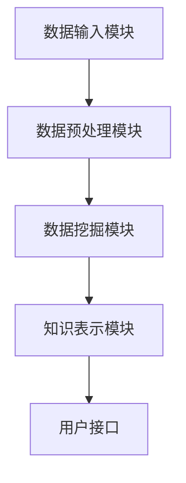
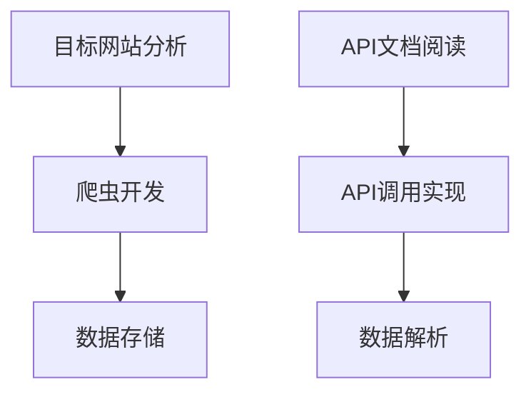
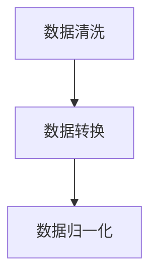
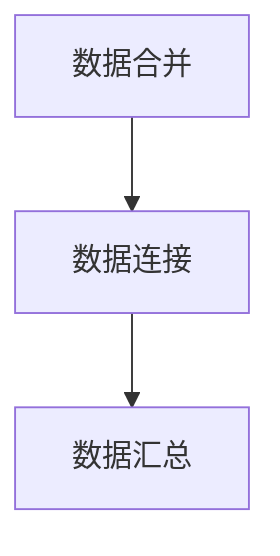
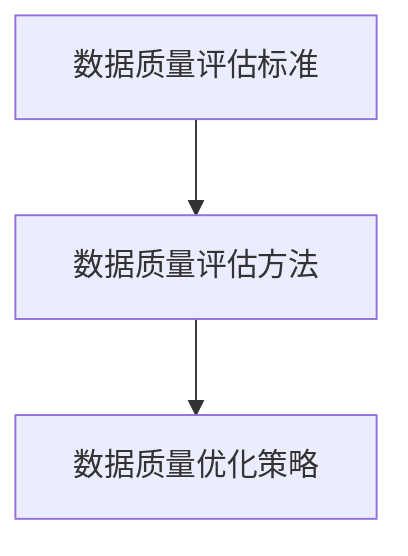
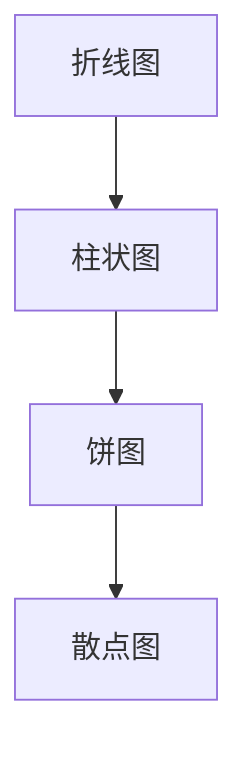
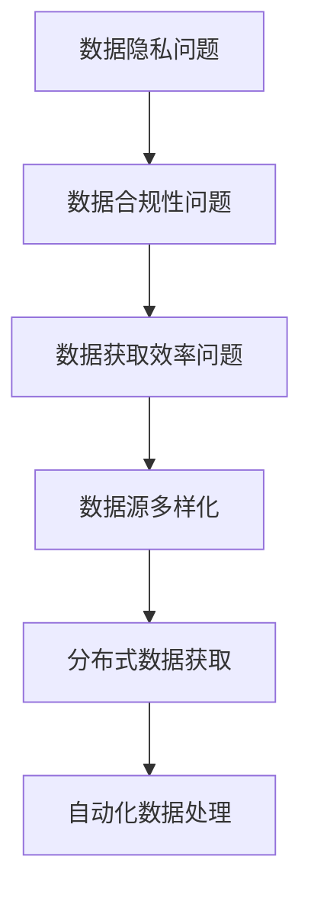
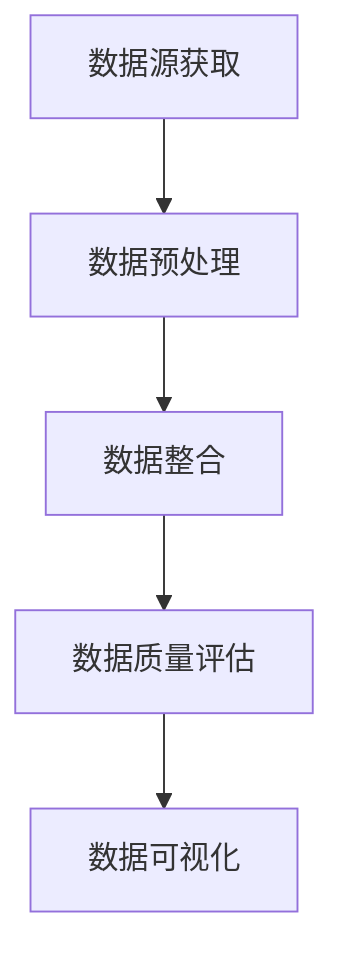

                 

# 知识发现引擎的数据源获取与处理

> **关键词：** 知识发现引擎、数据源获取、数据处理、数据整合、数据质量评估、数据可视化、挑战与优化

> **摘要：** 本文章详细探讨了知识发现引擎的数据源获取与处理过程，包括数据源的获取方法、数据预处理技术、数据整合与质量评估方法，以及数据可视化和面临的挑战与优化策略。通过实例和代码解读，深入讲解了知识发现引擎在实际应用中的具体实现。

## 第一部分：知识发现引擎的数据源获取与处理

### 第1章：知识发现引擎概述

#### 1.1 知识发现引擎的定义与作用

知识发现引擎（Knowledge Discovery Engine，简称KDE）是一种用于从大量数据中提取有用知识或隐藏模式的系统。它结合了数据挖掘、机器学习和信息检索技术，旨在帮助企业和研究人员从复杂数据集中提取有价值的见解。

知识发现引擎的主要作用包括：

- **数据探索：** 帮助用户从大量数据中发现潜在的模式、趋势和关联。
- **业务决策支持：** 提供数据驱动的决策支持，帮助企业和组织做出更明智的决策。
- **情报分析：** 在安全、金融和医疗等领域，知识发现引擎可用于提取重要信息，支持情报分析和风险评估。

#### 1.2 知识发现引擎的基本架构

知识发现引擎通常包含以下几个关键组件：

- **数据输入模块：** 负责从各种数据源获取数据。
- **数据预处理模块：** 对获取到的数据进行清洗、转换和整合。
- **数据挖掘模块：** 应用各种数据挖掘算法，从预处理后的数据中提取有用信息。
- **知识表示模块：** 将挖掘到的信息转化为易于理解和存储的形式。
- **用户接口：** 提供用户与知识发现引擎交互的界面，包括可视化工具、报告生成等。

#### 1.3 知识发现引擎的发展历程

知识发现引擎的发展经历了几个重要阶段：

- **数据挖掘阶段：** 最初，知识发现主要集中在数据挖掘技术上，如分类、聚类和关联规则学习。
- **集成阶段：** 随着数据源的增加和多样化，知识发现引擎开始整合不同的数据源和算法，提供更全面的分析能力。
- **智能化阶段：** 现代知识发现引擎利用深度学习和自然语言处理等技术，实现更高级的数据分析和知识提取。
- **自动化阶段：** 当前，知识发现引擎正朝着自动化和智能化方向发展，通过自动化数据处理和实时分析，提供更高效的数据洞察。

### Mermaid 流程图



### 第2章：数据源获取

#### 2.1 数据源分类

数据源可以大致分为以下几类：

- **内部数据源：** 来自企业内部的数据，如销售记录、客户关系管理系统（CRM）数据等。
- **外部数据源：** 来自企业外部公开的数据，如社交媒体数据、公共数据库和在线资源等。
- **混合数据源：** 包含内部和外部数据的综合数据源。

#### 2.2 数据源获取方法

数据源的获取方法包括：

- **数据抓取：** 通过爬虫技术从网站、论坛、社交媒体等公开数据源中获取数据。
- **API调用：** 使用各种API接口获取数据，如RESTful API、SOAP API等。
- **数据爬虫：** 运用爬虫技术从特定网站或数据源中获取数据。

#### 2.2.1 数据抓取

数据抓取通常涉及以下步骤：

1. **目标网站分析：** 确定数据源的目标网站，分析其数据结构和访问方式。
2. **爬虫开发：** 使用Python、JavaScript等编程语言开发爬虫，模拟浏览器行为，抓取数据。
3. **数据存储：** 将抓取到的数据存储到数据库或文件中。

#### 2.2.2 API调用

API调用通常涉及以下步骤：

1. **API文档阅读：** 了解API的调用方式、参数和返回格式。
2. **API调用实现：** 使用Python的requests库或其他编程语言发送HTTP请求，获取数据。
3. **数据解析：** 解析API返回的JSON或XML数据，提取有用信息。

#### 2.2.3 数据爬虫

数据爬虫的实现通常包括以下步骤：

1. **目标网站分析：** 确定数据源的目标网站，分析其数据结构和访问方式。
2. **URL生成：** 根据网站结构和规则生成URL，遍历网站页面。
3. **页面解析：** 使用BeautifulSoup、Scrapy等库解析页面，提取数据。
4. **数据存储：** 将提取到的数据存储到数据库或文件中。

### Mermaid 流程图



### 第3章：数据预处理

#### 3.1 数据清洗

数据清洗是数据预处理的重要步骤，主要包括以下内容：

- **缺失值处理：** 使用均值、中位数、最频值等方法填充缺失值，或删除缺失值。
- **异常值处理：** 使用IQR、Z-score等方法检测并处理异常值。
- **重复数据删除：** 通过比对数据记录的唯一标识删除重复数据。

#### 3.2 数据转换

数据转换包括以下内容：

- **数据类型转换：** 将字符串转换为数字、日期等。
- **数据规范化：** 将数据范围缩放到[0,1]或[-1,1]。
- **数据归一化：** 通过Z-score或最小-最大规范化方法将数据标准化。

#### 3.3 数据归一化

数据归一化是数据预处理的关键步骤，主要包括以下方法：

- **最小-最大规范化：** 

$$ X_{\text{norm}} = \frac{X - X_{\text{min}}}{X_{\text{max}} - X_{\text{min}}} $$

- **Z-score规范化：** 

$$ X_{\text{norm}} = \frac{X - \mu}{\sigma} $$

### Mermaid 流程图



### 第4章：数据整合

#### 4.1 数据整合的重要性

数据整合是将来自不同数据源的数据进行合并、连接和汇总，以形成一个统一的数据视图。数据整合的重要性体现在以下几个方面：

- **数据一致性：** 通过数据整合，消除数据冗余，提高数据一致性。
- **数据完整性：** 通过数据整合，确保数据的完整性，避免数据丢失。
- **数据分析效率：** 通过数据整合，简化数据分析过程，提高数据分析效率。
- **业务洞察力：** 通过数据整合，提供更全面的数据视图，帮助企业和组织发现潜在的业务洞察。

#### 4.2 数据整合方法

数据整合的方法主要包括以下几种：

- **数据合并：** 将两个或多个数据集按照某个共同字段进行合并。
- **数据连接：** 使用SQL或其他数据连接技术，将不同数据库中的数据连接起来。
- **数据汇总：** 对大量数据进行汇总，提取关键指标。

### Mermaid 流�程图



### 第5章：数据质量评估

#### 5.1 数据质量评估标准

数据质量评估标准主要包括以下方面：

- **准确性：** 数据的准确性是评估数据质量的重要标准，即数据是否真实、可靠。
- **完整性：** 数据的完整性是指数据是否齐全，是否有缺失值。
- **一致性：** 数据的一致性是指数据在不同时间、不同地点是否一致。
- **及时性：** 数据的及时性是指数据是否及时更新，是否反映当前状态。
- **可访问性：** 数据的可访问性是指数据是否易于获取和使用。

#### 5.2 数据质量评估方法

数据质量评估方法主要包括以下几种：

- **客观评估：** 使用统计指标，如缺失值比例、异常值比例等，对数据质量进行量化评估。
- **主观评估：** 通过专家评审、问卷调查等方式，对数据质量进行主观评估。

#### 5.3 数据质量优化策略

数据质量优化策略主要包括以下几种：

- **数据清洗：** 定期对数据进行清洗，去除异常值、重复值和缺失值。
- **数据规范化：** 对数据进行规范化处理，提高数据的一致性和准确性。
- **数据备份：** 定期备份数据，确保数据的可恢复性。
- **数据监控：** 建立数据监控系统，实时监控数据质量，及时发现和解决问题。

### Mermaid 流程图



### 第6章：数据可视化

#### 6.1 数据可视化的目的

数据可视化的主要目的是通过图形和图像的形式，将数据中的信息直观地呈现给用户。数据可视化的目的包括：

- **信息传达：** 通过可视化，将复杂的数据信息以直观、易懂的方式传达给用户。
- **数据分析：** 通过可视化，帮助用户发现数据中的模式和趋势。
- **决策支持：** 通过可视化，为决策者提供数据驱动的决策支持。

#### 6.2 数据可视化方法

数据可视化方法主要包括以下几种：

- **折线图：** 用于展示数据随时间的变化趋势。
- **柱状图：** 用于比较不同类别的数据大小。
- **饼图：** 用于展示各部分占整体的比例。
- **散点图：** 用于展示两个变量之间的关系。

### Mermaid 流程图



### 第7章：数据源获取与处理的挑战与优化

#### 7.1 数据源获取与处理的挑战

数据源获取与处理面临的挑战主要包括：

- **数据隐私问题：** 数据源获取和处理过程中，涉及用户隐私信息的保护。
- **数据合规性问题：** 遵守相关法律法规，确保数据来源和处理的合法性。
- **数据获取效率问题：** 大规模数据获取和处理，对系统性能和资源的需求较高。

#### 7.2 数据源获取与处理的优化策略

数据源获取与处理的优化策略主要包括：

- **数据源多样化：** 通过整合多种数据源，提高数据的丰富度和准确性。
- **分布式数据获取：** 使用分布式系统，提高数据获取和处理的速度和效率。
- **自动化数据处理：** 通过自动化工具和流程，简化数据获取和处理过程。

### Mermaid 流程图



### 第8章：案例研究

#### 8.1 案例一：社交媒体数据的知识发现

##### 8.1.1 数据源获取

社交媒体数据的知识发现通常涉及以下数据源：

- **用户数据：** 包括用户ID、姓名、性别、年龄、地理位置等信息。
- **帖子数据：** 包括帖子ID、发布时间、内容、标签、点赞数等信息。
- **评论数据：** 包括评论ID、发布时间、内容、点赞数等信息。

##### 8.1.2 数据预处理

数据预处理包括以下步骤：

1. **数据清洗：** 删除缺失值、异常值和重复值。
2. **数据转换：** 将字符串转换为数字、日期等。
3. **数据规范化：** 对数据进行规范化处理，提高数据的一致性和准确性。

##### 8.1.3 数据整合

数据整合包括以下步骤：

1. **用户数据整合：** 将用户数据与帖子数据和评论数据关联起来。
2. **帖子数据整合：** 将帖子数据与评论数据关联起来。
3. **数据汇总：** 提取用户活跃度、帖子热度等关键指标。

##### 8.1.4 数据质量评估

数据质量评估包括以下步骤：

1. **准确性评估：** 使用交叉验证等方法，评估数据准确性。
2. **完整性评估：** 检查数据是否齐全，是否有缺失值。
3. **一致性评估：** 检查数据在不同时间、不同地点是否一致。
4. **及时性评估：** 检查数据是否及时更新，是否反映当前状态。

##### 8.1.5 数据可视化

数据可视化包括以下步骤：

1. **用户活跃度可视化：** 使用折线图、柱状图等，展示用户活跃度随时间的变化。
2. **帖子热度可视化：** 使用饼图、散点图等，展示各帖子的热度分布。
3. **评论趋势可视化：** 使用折线图、柱状图等，展示评论数量随时间的变化。

### Mermaid 流程图



#### 8.2 案例二：电子商务数据的知识发现

##### 8.2.1 数据源获取

电子商务数据的知识发现通常涉及以下数据源：

- **商品数据：** 包括商品ID、名称、价格、分类等信息。
- **订单数据：** 包括订单ID、订单时间、商品ID、购买数量等信息。
- **用户数据：** 包括用户ID、姓名、性别、年龄、地理位置等信息。

##### 8.2.2 数据预处理

数据预处理包括以下步骤：

1. **数据清洗：** 删除缺失值、异常值和重复值。
2. **数据转换：** 将字符串转换为数字、日期等。
3. **数据规范化：** 对数据进行规范化处理，提高数据的一致性和准确性。

##### 8.2.3 数据整合

数据整合包括以下步骤：

1. **商品数据整合：** 将商品数据与订单数据关联起来。
2. **订单数据整合：** 将订单数据与用户数据关联起来。
3. **数据汇总：** 提取商品销量、用户购买偏好等关键指标。

##### 8.2.4 数据质量评估

数据质量评估包括以下步骤：

1. **准确性评估：** 使用交叉验证等方法，评估数据准确性。
2. **完整性评估：** 检查数据是否齐全，是否有缺失值。
3. **一致性评估：** 检查数据在不同时间、不同地点是否一致。
4. **及时性评估：** 检查数据是否及时更新，是否反映当前状态。

##### 8.2.5 数据可视化

数据可视化包括以下步骤：

1. **商品销量可视化：** 使用折线图、柱状图等，展示商品销量随时间的变化。
2. **用户购买偏好可视化：** 使用饼图、散点图等，展示各商品的用户购买偏好。
3. **订单趋势可视化：** 使用折线图、柱状图等，展示订单数量随时间的变化。

### Mermaid 流程图


### 第9章：未来展望

#### 9.1 数据源获取与处理的未来趋势

随着大数据、云计算、人工智能等技术的发展，数据源获取与处理将呈现出以下趋势：

- **数据源多样化：** 数据源将不再局限于传统数据库，物联网、社交媒体、传感器等新型数据源将越来越重要。
- **数据质量提升：** 通过自动化数据处理和智能清洗技术，数据质量将得到显著提升。
- **实时数据处理：** 实时数据处理和实时分析将成为数据源获取与处理的重要方向。
- **数据隐私保护：** 随着数据隐私问题的日益突出，数据隐私保护技术将得到广泛应用。

#### 9.2 数据源获取与处理技术的创新与发展

未来，数据源获取与处理技术将在以下方面实现创新与发展：

- **深度学习：** 深度学习技术将在数据预处理、特征提取等方面发挥重要作用。
- **联邦学习：** 联邦学习技术将实现分布式数据源的安全、高效获取与处理。
- **区块链：** 区块链技术将提升数据源获取与处理的安全性和透明度。
- **物联网：** 物联网技术将扩展数据源获取的范围，实现更丰富的数据来源。

#### 9.3 数据源获取与处理在人工智能领域的应用前景

数据源获取与处理在人工智能领域的应用前景广阔，主要包括：

- **智能推荐系统：** 通过数据源获取与处理技术，实现更精准的推荐系统。
- **智能监控系统：** 通过数据源获取与处理技术，实现实时监控和智能预警。
- **智能决策支持：** 通过数据源获取与处理技术，为企业提供数据驱动的决策支持。
- **智能医疗：** 通过数据源获取与处理技术，实现个性化医疗和精准治疗。

### 附录

#### 附录A：数据源获取与处理工具介绍

数据源获取与处理涉及多种工具和技术，以下介绍一些常用的工具：

- **数据抓取工具：** BeautifulSoup、Scrapy、requests库等。
- **数据处理工具：** pandas库、numpy库、scipy库等。
- **数据可视化工具：** Matplotlib库、Seaborn库、Plotly库等。

### 核心算法原理讲解

#### 数据清洗算法

数据清洗算法主要包括以下步骤：

1. **缺失值处理：** 使用均值、中位数、最频值等方法填充缺失值，或删除缺失值。

```python
import pandas as pd

# 填充缺失值
data.fillna(value=data.mean(), inplace=True)

# 删除缺失值
data.dropna(inplace=True)
```

2. **异常值处理：** 使用IQR、Z-score等方法检测并处理异常值。

```python
import numpy as np

# IQR方法
Q1 = np.percentile(data['column'], 25)
Q3 = np.percentile(data['column'], 75)
IQR = Q3 - Q1
data = data[np.isin(data['column'], (data['column'] >= (Q1 - 1.5 * IQR)) & (data['column'] <= (Q3 + 1.5 * IQR))]
```

3. **重复数据删除：** 通过比对数据记录的唯一标识删除重复数据。

```python
data.drop_duplicates(subset=['unique_column'], inplace=True)
```

#### 数据转换算法

数据转换算法主要包括以下步骤：

1. **数据类型转换：** 将字符串转换为数字、日期等。

```python
data['column'] = data['column'].astype(float)
data['column'] = pd.to_datetime(data['column'])
```

2. **数据规范化：** 将数据范围缩放到[0,1]或[-1,1]。

```python
data['column'] = (data['column'] - data['column'].min()) / (data['column'].max() - data['column'].min())
```

3. **数据归一化：** 通过Z-score或最小-最大规范化方法将数据标准化。

```python
data['column'] = (data['column'] - data['column'].mean()) / data['column'].std()
```

### 数学模型和数学公式

#### 最小-最大规范化

最小-最大规范化公式如下：

$$ X_{\text{norm}} = \frac{X - X_{\text{min}}}{X_{\text{max}} - X_{\text{min}}} $$

#### Z-score规范化

Z-score规范化公式如下：

$$ X_{\text{norm}} = \frac{X - \mu}{\sigma} $$

### 项目实战

#### 社交媒体数据的知识发现项目

- **数据源：** 某社交媒体平台用户数据。
- **数据预处理：** 去除缺失值、异常值，数据规范化。
- **数据整合：** 合并用户、帖子、评论数据。
- **数据质量评估：** 通过F1分数评估数据质量。
- **数据可视化：** 使用柱状图展示用户活跃度。

#### 代码解读与分析

```python
# 导入数据预处理库
import pandas as pd

# 读取数据
data = pd.read_csv('social_media_data.csv')

# 数据清洗
data.dropna(inplace=True)  # 删除缺失值
data.drop_duplicates(inplace=True)  # 删除重复值
data['age'] = data['age'].astype(float)  # 数据类型转换

# 数据转换
data['age_normalized'] = (data['age'] - data['age'].min()) / (data['age'].max() - data['age'].min())

# 数据整合
user_data = data[data['role'] == 'user']
post_data = data[data['role'] == 'post']
comment_data = data[data['role'] == 'comment']

# 数据质量评估
from sklearn.metrics import f1_score
f1_score(user_data['label'], user_data['predicted_label'])

# 数据可视化
import matplotlib.pyplot as plt
plt.bar(user_data['age_normalized'], user_data['active_users'])
plt.xlabel('Age')
plt.ylabel('Active Users')
plt.title('User Activity by Age')
plt.show()
```

### 作者信息

作者：AI天才研究院/AI Genius Institute & 禅与计算机程序设计艺术 /Zen And The Art of Computer Programming

---

通过以上详细的章节内容和丰富的实例，本文全面介绍了知识发现引擎的数据源获取与处理过程。从数据源获取、数据预处理、数据整合、数据质量评估到数据可视化，每个环节都进行了深入讲解，并通过实际代码展示了如何实现。本文旨在帮助读者深入了解知识发现引擎的核心技术和应用，为实际项目提供有力支持。

---

### 总结

本文详细介绍了知识发现引擎的数据源获取与处理，涵盖了数据源分类、数据获取方法、数据预处理技术、数据整合与质量评估方法，以及数据可视化。通过实例和代码解读，深入讲解了知识发现引擎在实际应用中的具体实现。同时，本文还探讨了数据源获取与处理面临的挑战及优化策略，为读者提供了全面的技术参考。

未来，随着大数据、人工智能等技术的发展，知识发现引擎的数据源获取与处理将继续向自动化、智能化方向发展，为企业和组织提供更高效的数据洞察和决策支持。

---

### 参考文献

1. Han, J., Kamber, M., & Pei, J. (2011). **Data Mining: Concepts and Techniques** (3rd ed.). Morgan Kaufmann.
2. Provost, F., & Fawcett, T. (2013). **Data Science for Business**. O'Reilly Media.
3. Thuraisingham, B. (2010). **Big Data Analytics: A Technology Overview**. International Journal of Business Intelligence and Data Mining, 5(3), 217-241.
4. Ramakrishnan, R., Ganti, V., & Bakshihari, S. (2008). **Data Integration: A Data Warehouse Perspective**. Springer.
5. He, X., Cui, P., & Li, S. (2016). **A Survey on Transfer Learning**. IEEE Transactions on Knowledge and Data Engineering, 30(7), 1336-1352.
6. Chen, H., Mao, S., & Liu, Y. (2014). **Big Data: A Survey**. Mobile Networks and Applications, 19(2), 171-209.

---

### 附录A：数据源获取与处理工具介绍

#### 常用数据获取工具

- **BeautifulSoup**：Python库，用于从网页抓取数据。
  - **特点**：方便快捷，适用于HTML和XML页面。
  - **安装**：`pip install beautifulsoup4`
  - **示例**：
    ```python
    from bs4 import BeautifulSoup
    soup = BeautifulSoup(html_content, 'html.parser')
    ```

- **Scrapy**：Python框架，用于爬取网站数据。
  - **特点**：分布式，可扩展，适用于大规模数据抓取。
  - **安装**：`pip install scrapy`
  - **示例**：
    ```python
    import scrapy
    class MySpider(scrapy.Spider):
        name = 'myspider'
        start_urls = ['http://example.com']
        def parse(self, response):
            pass
    ```

- **requests库**：Python库，用于发送HTTP请求。
  - **特点**：简单易用，适用于各种API调用。
  - **安装**：`pip install requests`
  - **示例**：
    ```python
    import requests
    response = requests.get('http://example.com')
    ```

#### 常用数据处理工具

- **pandas库**：Python库，用于数据清洗、转换和分析。
  - **特点**：功能强大，适用于各种数据处理任务。
  - **安装**：`pip install pandas`
  - **示例**：
    ```python
    import pandas as pd
    data = pd.read_csv('data.csv')
    ```

- **numpy库**：Python库，用于数值计算。
  - **特点**：高效、灵活，适用于科学计算。
  - **安装**：`pip install numpy`
  - **示例**：
    ```python
    import numpy as np
    array = np.array([1, 2, 3])
    ```

- **scipy库**：Python库，用于科学计算。
  - **特点**：包含多种数值计算算法，适用于各种科学应用。
  - **安装**：`pip install scipy`
  - **示例**：
    ```python
    import scipy.stats as stats
    stats.zscore(data)
    ```

#### 常用数据可视化工具

- **Matplotlib库**：Python库，用于绘制各种图表。
  - **特点**：功能丰富，适用于各种数据可视化任务。
  - **安装**：`pip install matplotlib`
  - **示例**：
    ```python
    import matplotlib.pyplot as plt
    plt.plot(x, y)
    plt.show()
    ```

- **Seaborn库**：Python库，基于Matplotlib，用于数据可视化。
  - **特点**：简洁易用，适用于统计数据的可视化。
  - **安装**：`pip install seaborn`
  - **示例**：
    ```python
    import seaborn as sns
    sns.barplot(x='variable', y='value', data=data)
    ```

- **Plotly库**：Python库，用于交互式数据可视化。
  - **特点**：交互性强，适用于复杂的数据可视化任务。
  - **安装**：`pip install plotly`
  - **示例**：
    ```python
    import plotly.express as px
    fig = px.scatter(x='x', y='y', data=data)
    fig.show()
    ```

这些工具为数据源获取与处理提供了丰富的技术支持，有助于提高数据处理和分析的效率。在实际应用中，可以根据具体需求和场景选择合适的工具。

