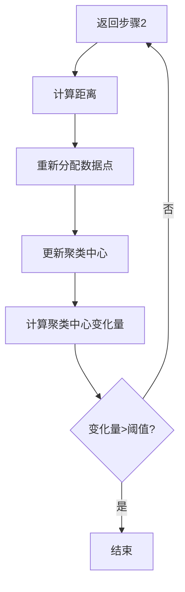
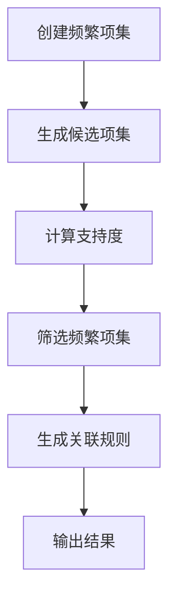
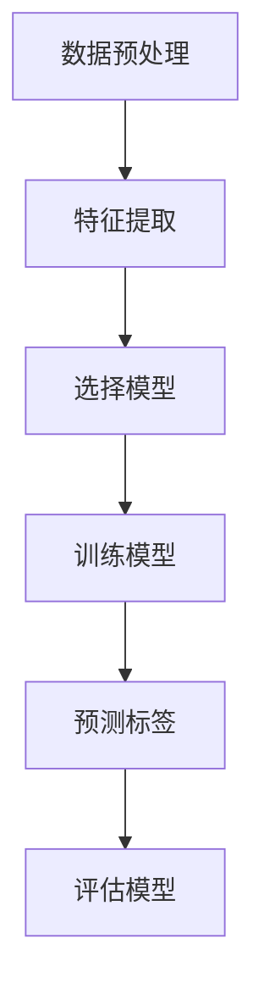
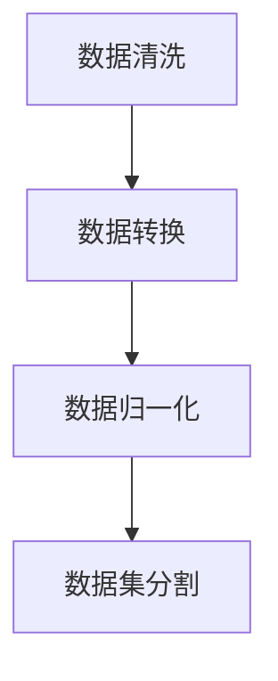
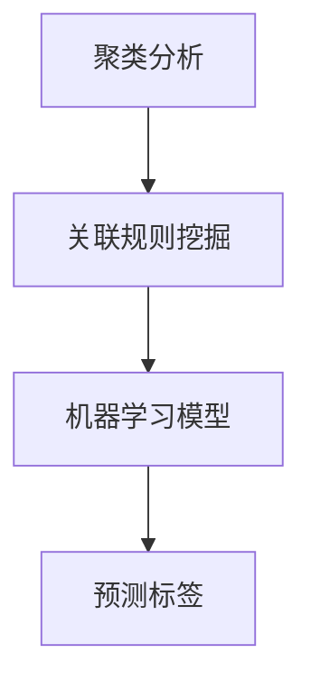

                 

# 《知识发现引擎：人类智慧的新纪元》

## 关键词
- 知识发现引擎
- 数据挖掘
- 机器学习
- 自然语言处理
- 应用场景
- 架构与实现
- 未来展望

## 摘要
随着大数据和人工智能技术的飞速发展，知识发现引擎正成为推动人类智慧进步的关键力量。本文深入探讨了知识发现引擎的概念、工作原理、核心技术、应用场景以及构建实践，并展望了其未来的发展趋势。通过详细的分析和实例，本文旨在为读者提供一个全面而深入的理解，帮助其把握这一技术领域的前沿动态。

## 目录大纲

### 第一部分：知识发现引擎概述

#### 第1章：知识发现引擎简介

- **1.1 知识发现的概念与重要性**
  - 知识发现的基本概念
  - 知识发现的应用领域
  - 知识发现的重要性
- **1.2 知识发现引擎的工作原理**
  - 数据预处理
  - 数据挖掘技术
  - 知识提取与融合
  - 知识表示与存储
- **1.3 知识发现引擎的架构**
  - 硬件架构
  - 软件架构
  - 网络架构
- **1.4 知识发现引擎的发展历程**
  - 传统知识发现技术
  - 现代知识发现技术
  - 未来发展趋势

#### 第2章：知识发现引擎的核心技术

- **2.1 数据挖掘技术**
  - 聚类分析
  - 关联规则挖掘
  - 类别预测
  - 降维技术
  - **2.1.1 数据挖掘流程图**
- **2.2 机器学习算法**
  - 监督学习
  - 无监督学习
  - 半监督学习
  - 强化学习
  - **2.2.1 机器学习算法工作原理 Mermaid 流程图**
- **2.3 自然语言处理技术**
  - 词嵌入
  - 序列标注
  - 文本分类
  - **2.3.1 自然语言处理技术原理 Mermaid 流程图**

#### 第3章：知识发现引擎的应用场景

- **3.1 智能推荐系统**
  - 推荐算法介绍
  - 推荐系统架构
  - 推荐系统案例分析
- **3.2 金融市场分析**
  - 时间序列分析
  - 风险评估
  - 投资组合优化
- **3.3 健康医疗**
  - 疾病预测
  - 药物研发
  - 个性化医疗
- **3.4 教育领域**
  - 个性化学习
  - 智能评价系统
  - 教育资源优化

### 第二部分：知识发现引擎的构建与实践

#### 第4章：知识发现引擎的开发环境搭建

- **4.1 操作系统与编程语言选择**
  - Python
  - Java
  - R
- **4.2 数据库与存储方案**
  - 关系型数据库
  - 非关系型数据库
  - 分布式存储方案
- **4.3 硬件与网络配置**
  - CPU与GPU
  - 网络架构
  - 分布式计算框架

#### 第5章：知识发现引擎的核心算法实现

- **5.1 聚类算法实现**
  - K-means算法
  - DBSCAN算法
  - 层次聚类算法
  - **5.1.1 K-means算法伪代码**
- **5.2 关联规则挖掘算法**
  - Apriori算法
  - Eclat算法
  - GSP算法
  - **5.2.1 Apriori算法伪代码**
- **5.3 机器学习算法实现**
  - 监督学习算法
  - 无监督学习算法
  - 强化学习算法
  - **5.3.1 监督学习算法伪代码**

#### 第6章：知识发现引擎项目实战

- **6.1 项目介绍**
  - 项目背景
  - 项目目标
  - 项目实施过程
- **6.2 数据集选择与预处理**
  - 数据集来源
  - 数据清洗
  - 数据归一化
- **6.3 算法选择与实现**
  - 数据挖掘算法
  - 机器学习算法
  - 自然语言处理算法
- **6.4 项目效果评估**
  - 准确率
  - 召回率
  - F1值
- **6.5 项目优化与改进**
  - 算法优化
  - 系统性能优化
  - 系统安全性优化

#### 第7章：知识发现引擎的未来展望

- **7.1 知识发现引擎的新趋势**
  - 增量式知识发现
  - 跨领域知识融合
  - 智能问答系统
- **7.2 知识发现引擎的发展挑战**
  - 数据隐私与安全
  - 知识表示与理解
  - 知识发现效率
- **7.3 知识发现引擎的伦理与法律问题**
  - 数据伦理
  - 知识产权保护
  - 伦理道德约束

#### 附录

- **附录A：知识发现引擎相关资源**
  - 开源工具与库
  - 学术论文与报告
  - 技术社区与论坛
- **附录B：知识发现引擎学习指南**
  - 基础知识学习路径
  - 进阶学习资源
  - 项目实践建议

### 正文

#### 第一部分：知识发现引擎概述

##### 第1章：知识发现引擎简介

> 知识发现引擎（Knowledge Discovery Engine，简称KDE）是大数据和人工智能时代的重要工具，它能够从大规模数据中自动识别出有价值的信息和知识，帮助企业和个人做出更加明智的决策。本章将介绍知识发现引擎的基本概念、应用领域和重要性。

##### 1.1 知识发现的概念与重要性

知识发现（Knowledge Discovery in Databases，简称KDD）是指从大量数据中通过归纳、推理、分析等方法提取出有用信息的过程。它主要包括以下几个步骤：

1. 数据预处理：将原始数据进行清洗、转换和整合，以便后续的分析。
2. 数据挖掘：利用各种算法和技术从预处理后的数据中提取出模式、关联关系和规律。
3. 知识提取：将挖掘出的模式转化为可理解的知识形式，如报告、图表等。
4. 知识融合：将多个来源的知识进行整合，形成更加全面和深刻的见解。
5. 知识表示与存储：将提取和融合的知识以适当的形式表示和存储，以便于后续的查询和使用。

知识发现的重要性体现在以下几个方面：

1. 决策支持：知识发现可以帮助企业和组织从海量数据中提取出有价值的信息，支持其做出更加明智的决策。
2. 创新驱动：知识发现可以激发新的研究思路和发现，推动科技创新和产业升级。
3. 优化运营：知识发现可以优化业务流程和运营策略，提高企业的效率和竞争力。

##### 1.2 知识发现引擎的工作原理

知识发现引擎是知识发现过程的核心工具，它通过一系列的算法和技术实现对大规模数据的挖掘和分析。其工作原理主要包括以下几个步骤：

1. 数据预处理：知识发现引擎首先对原始数据进行清洗、转换和整合，以便后续的分析。这一步骤通常涉及数据去重、数据格式转换、缺失值填充等操作。
2. 数据挖掘：知识发现引擎使用各种数据挖掘算法，如聚类分析、关联规则挖掘、分类预测等，对预处理后的数据进行分析，提取出潜在的规律和模式。
3. 知识提取：挖掘出的模式被转化为可理解的知识形式，如报告、图表、可视化等。这些知识可以帮助用户更好地理解和利用数据。
4. 知识融合：知识发现引擎将多个来源的知识进行整合，形成更加全面和深刻的见解。例如，将不同时间段的数据进行融合，可以更好地分析业务趋势和变化。
5. 知识表示与存储：提取和融合的知识被以适当的形式表示和存储，以便于后续的查询和使用。知识发现引擎通常提供友好的用户界面，方便用户进行交互和操作。

##### 1.3 知识发现引擎的架构

知识发现引擎的架构通常包括硬件架构、软件架构和网络架构三个方面。

1. 硬件架构：知识发现引擎通常需要高性能的硬件支持，包括CPU、GPU、存储设备等。CPU用于处理数据挖掘算法和机器学习模型的计算任务，GPU则用于加速图像处理和大规模并行计算。存储设备需要能够存储海量数据，并提供快速读写性能。
2. 软件架构：知识发现引擎的软件架构通常包括数据预处理模块、数据挖掘模块、知识提取模块和知识融合模块等。这些模块共同协作，实现对数据的挖掘和分析过程。
3. 网络架构：知识发现引擎通常采用分布式计算架构，通过多台服务器和计算节点协同工作，实现大规模数据的处理和分析。网络架构还需要提供高可用性和高可靠性的保障，以应对突发情况和故障。

##### 1.4 知识发现引擎的发展历程

知识发现引擎的发展历程可以分为以下几个阶段：

1. 传统知识发现技术：早期知识发现主要依赖人工筛选和简单统计方法，效率较低，且受限于数据规模。
2. 现代知识发现技术：随着大数据和人工智能技术的兴起，知识发现引擎得到了快速发展。现代知识发现技术采用了复杂的数据挖掘算法、机器学习和自然语言处理技术，能够高效地处理海量数据，并提取出有价值的信息。
3. 未来发展趋势：未来的知识发现引擎将更加智能化和自动化，能够自适应地调整挖掘策略和算法，提高知识发现的效率。同时，知识发现引擎将与其他人工智能技术深度融合，如智能问答系统、智能推荐系统等，为人类提供更加智能化的服务。

#### 第二部分：知识发现引擎的核心技术

##### 第2章：知识发现引擎的核心技术

知识发现引擎的核心技术包括数据挖掘技术、机器学习算法和自然语言处理技术。这些技术共同作用，实现了从大规模数据中提取有价值信息的目标。本章将详细介绍这些核心技术，并分别阐述其原理和应用。

##### 2.1 数据挖掘技术

数据挖掘技术是指从大量数据中自动识别出隐藏的、未知的、有价值的信息和模式的过程。数据挖掘技术主要包括以下几种：

1. **聚类分析**：聚类分析是将数据集划分为多个类或簇的过程，使得同一簇内的数据点彼此相似，而不同簇之间的数据点差异较大。聚类分析常用于市场细分、客户群体分析等场景。

   **聚类分析流程图**：
   ```mermaid
   graph TD
   A[数据预处理] --> B[选择聚类算法]
   B --> C[初始化聚类中心]
   C --> D[迭代计算]
   D --> E[聚类评估]
   E --> F[输出结果]
   ```

2. **关联规则挖掘**：关联规则挖掘是寻找数据集中项之间潜在关联关系的方法，通常使用支持度和置信度两个度量来评估规则的重要性。关联规则挖掘常用于购物篮分析、推荐系统等场景。

   **关联规则挖掘流程图**：
   ```mermaid
   graph TD
   A[数据预处理] --> B[生成频繁项集]
   B --> C[生成关联规则]
   C --> D[规则评估]
   D --> E[输出结果]
   ```

3. **类别预测**：类别预测是利用已知的数据特征和类别标签，预测未知数据点的类别标签。类别预测常用于分类问题，如邮件分类、图像分类等。

   **类别预测流程图**：
   ```mermaid
   graph TD
   A[数据预处理] --> B[特征提取]
   B --> C[选择分类算法]
   C --> D[训练模型]
   D --> E[预测类别]
   E --> F[评估模型]
   ```

4. **降维技术**：降维技术是通过减少数据维度，降低数据复杂度和计算成本，同时保持数据信息的有效性和完整性的方法。降维技术常用于高维数据的可视化、特征选择等场景。

   **降维技术流程图**：
   ```mermaid
   graph TD
   A[数据预处理] --> B[选择降维算法]
   B --> C[特征变换]
   C --> D[评估降维效果]
   ```

##### 2.2 机器学习算法

机器学习算法是知识发现引擎中的重要组成部分，它们通过学习数据中的模式和规律，对未知数据进行预测和分类。机器学习算法可以分为以下几类：

1. **监督学习算法**：监督学习算法在有标注数据集上进行训练，学习输入和输出之间的映射关系，然后在未知数据上进行预测。常见的监督学习算法包括线性回归、逻辑回归、支持向量机（SVM）等。

   **监督学习算法流程图**：
   ```mermaid
   graph TD
   A[数据预处理] --> B[特征提取]
   B --> C[训练模型]
   C --> D[预测类别]
   ```

2. **无监督学习算法**：无监督学习算法在没有标注数据集的情况下，自动发现数据中的结构和模式。常见的无监督学习算法包括聚类分析、主成分分析（PCA）等。

   **无监督学习算法流程图**：
   ```mermaid
   graph TD
   A[数据预处理] --> B[选择算法]
   B --> C[训练模型]
   C --> D[输出结果]
   ```

3. **半监督学习算法**：半监督学习算法结合了监督学习和无监督学习的方法，利用部分有标注数据和大量无标注数据进行学习。常见的半监督学习算法包括自编码器、图嵌入等。

   **半监督学习算法流程图**：
   ```mermaid
   graph TD
   A[数据预处理] --> B[有标注数据]
   B --> C[无标注数据]
   C --> D[训练模型]
   D --> E[预测结果]
   ```

4. **强化学习算法**：强化学习算法通过不断与环境互动，学习最优策略，以最大化长期回报。常见的强化学习算法包括Q学习、深度Q网络（DQN）等。

   **强化学习算法流程图**：
   ```mermaid
   graph TD
   A[初始状态] --> B[行动]
   B --> C[环境反馈]
   C --> D[更新策略]
   D --> E[状态转移]
   ```

##### 2.3 自然语言处理技术

自然语言处理（Natural Language Processing，简称NLP）技术是知识发现引擎中的重要组成部分，它使计算机能够理解和处理自然语言。NLP技术主要包括以下几种：

1. **词嵌入**：词嵌入是将自然语言中的单词映射到低维空间中的向量表示，以便计算机能够理解和处理。常见的词嵌入方法包括Word2Vec、GloVe等。

   **词嵌入原理图**：
   ```mermaid
   graph TD
   A[单词] --> B[词向量]
   ```

2. **序列标注**：序列标注是将自然语言中的每个单词或字符标注为相应的标签，以便进行分类或分析。常见的序列标注方法包括条件随机场（CRF）、长短期记忆网络（LSTM）等。

   **序列标注原理图**：
   ```mermaid
   graph TD
   A[单词序列] --> B[标注序列]
   ```

3. **文本分类**：文本分类是将文本数据按照预定的类别进行划分，以便进行分类分析。常见的文本分类方法包括朴素贝叶斯、支持向量机、深度学习等。

   **文本分类原理图**：
   ```mermaid
   graph TD
   A[文本数据] --> B[特征提取]
   B --> C[分类模型]
   C --> D[预测类别]
   ```

##### 2.4 核心技术总结

知识发现引擎的核心技术包括数据挖掘技术、机器学习算法和自然语言处理技术。这些技术共同作用，实现了从大规模数据中提取有价值信息的目标。数据挖掘技术帮助我们从数据中提取模式和规律，机器学习算法则通过对已有数据的训练，实现对未知数据的预测和分类，而自然语言处理技术则使计算机能够理解和处理自然语言。这些技术的结合，使得知识发现引擎能够为企业和个人提供强大的数据分析和决策支持能力。

#### 第三部分：知识发现引擎的应用场景

##### 第3章：知识发现引擎的应用场景

知识发现引擎在各个领域都有着广泛的应用，其强大的数据处理和分析能力为企业和个人提供了前所未有的洞察力和决策支持。本章将详细介绍知识发现引擎在智能推荐系统、金融市场分析、健康医疗和教育培训等领域的应用场景。

##### 3.1 智能推荐系统

智能推荐系统是知识发现引擎的重要应用场景之一，它通过分析用户的兴趣和行为，为用户提供个性化的推荐。智能推荐系统的基本原理包括：

1. **用户兴趣挖掘**：通过分析用户的浏览记录、购买历史和社交行为等数据，挖掘出用户的兴趣偏好。
2. **内容特征提取**：对推荐内容进行特征提取，如商品属性、文本特征、图像特征等。
3. **推荐算法**：基于用户兴趣和内容特征，使用协同过滤、基于内容的推荐、混合推荐等方法生成推荐列表。

智能推荐系统的架构通常包括：

1. **用户数据层**：存储用户的兴趣、行为和偏好数据。
2. **内容数据层**：存储推荐内容的相关信息，如商品信息、新闻文章等。
3. **算法层**：包括协同过滤算法、基于内容的推荐算法等，负责生成推荐结果。
4. **推荐结果层**：展示最终的推荐列表，供用户浏览和选择。

智能推荐系统案例分析：

- **案例一：电子商务平台推荐**  
电子商务平台通过分析用户的购物车、浏览记录和购买历史，为用户推荐相似的商品。例如，用户购买了一台笔记本电脑，系统可能会推荐相关的配件、周边产品和同类产品。

- **案例二：新闻推荐**  
新闻推荐系统通过分析用户的阅读习惯、点击率和评论行为，为用户推荐个性化的新闻内容。例如，用户经常阅读体育新闻，系统可能会推荐更多的体育新闻和相关的赛事报道。

##### 3.2 金融市场分析

金融市场分析是知识发现引擎在金融领域的重要应用场景，它通过对海量金融数据的分析，帮助投资者做出更加明智的决策。金融市场分析的核心技术包括：

1. **时间序列分析**：对金融时间序列数据进行分析，提取出价格趋势、波动性和相关性等信息。
2. **风险评估**：评估投资组合的风险，包括市场风险、信用风险和操作风险等。
3. **投资组合优化**：根据投资者的风险偏好和收益目标，构建最优的投资组合。

金融市场分析的基本流程包括：

1. **数据采集**：从金融市场数据源采集历史价格、交易量、财务指标等数据。
2. **数据预处理**：对采集到的金融数据进行清洗、转换和整合，以便后续分析。
3. **模型训练**：使用机器学习算法和统计模型对金融数据进行分析和预测。
4. **风险评估与优化**：基于分析结果，对投资组合进行风险评估和优化。

金融市场分析案例分析：

- **案例一：股票市场预测**  
通过对历史股票价格、交易量和技术指标等数据的分析，使用时间序列分析和机器学习算法预测股票市场的趋势和波动。投资者可以根据预测结果调整投资策略，降低风险。

- **案例二：债券投资组合优化**  
债券投资组合优化是通过分析债券市场数据，评估不同债券的风险和收益，构建最优的投资组合。优化目标是在满足风险约束的条件下，最大化投资组合的收益。

##### 3.3 健康医疗

健康医疗是知识发现引擎在医疗领域的重要应用场景，它通过对大量医疗数据的分析，为医生和患者提供个性化的诊断、治疗和健康管理服务。健康医疗分析的核心技术包括：

1. **疾病预测**：通过分析患者的病史、体征数据、基因数据等，预测患者可能患有的疾病。
2. **药物研发**：通过分析药物作用机理、药物代谢信息等，加速药物研发进程。
3. **个性化医疗**：根据患者的个体差异，为患者提供个性化的治疗方案和护理服务。

健康医疗分析的基本流程包括：

1. **数据采集**：从电子病历、医学影像、基因测序等数据源采集患者的医疗数据。
2. **数据预处理**：对采集到的医疗数据进行清洗、转换和整合，以便后续分析。
3. **模型训练**：使用机器学习算法和深度学习模型对医疗数据进行分析和预测。
4. **诊断与治疗**：基于分析结果，为医生和患者提供个性化的诊断、治疗和护理建议。

健康医疗案例分析：

- **案例一：疾病预测与诊断**  
通过对患者的病史、体检数据和医学影像等数据的分析，使用机器学习算法预测患者可能患有的疾病，并提供早期诊断和干预建议。

- **案例二：个性化治疗方案**  
根据患者的基因信息和病史，为患者推荐个性化的治疗方案和药物组合，提高治疗效果和患者满意度。

##### 3.4 教育领域

教育领域是知识发现引擎在教育信息化中的重要应用场景，它通过分析学生的学习数据和行为数据，为教师和学生提供个性化的教学和学习支持。教育分析的核心技术包括：

1. **个性化学习**：根据学生的学习行为、兴趣和能力，为教师和学生提供个性化的教学和学习资源。
2. **智能评价系统**：通过分析学生的学习行为和成绩，为教师和学生提供实时的学习反馈和评估。
3. **教育资源优化**：根据学生的学习需求和资源利用情况，优化教育资源的配置和分配。

教育领域分析的基本流程包括：

1. **数据采集**：从学习管理系统、在线课程平台等数据源采集学生的学习数据和行为数据。
2. **数据预处理**：对采集到的数据进行清洗、转换和整合，以便后续分析。
3. **模型训练**：使用机器学习算法和深度学习模型对教育数据进行分析和预测。
4. **教学支持**：基于分析结果，为教师和学生提供个性化的教学和学习支持。

教育领域案例分析：

- **案例一：个性化学习推荐**  
通过对学生的学习行为、兴趣和能力等数据的分析，为教师和学生推荐适合他们的学习资源和课程，提高学习效果和兴趣。

- **案例二：学生成绩预测**  
通过对学生的学习行为、作业完成情况和考试成绩等数据的分析，预测学生的考试成绩，为教师提供教学反馈和调整建议。

##### 3.5 总结

知识发现引擎在各个领域都有着广泛的应用，其强大的数据处理和分析能力为企业和个人提供了前所未有的洞察力和决策支持。从智能推荐系统、金融市场分析到健康医疗和教育培训，知识发现引擎的应用场景正不断拓展和深化。未来，随着人工智能技术的不断发展，知识发现引擎将更加智能化和自动化，为人类带来更多的价值和创新。

### 第四部分：知识发现引擎的构建与实践

#### 第4章：知识发现引擎的开发环境搭建

在构建知识发现引擎之前，我们需要搭建一个合适的开发环境，包括操作系统、编程语言、数据库和硬件配置等方面。以下内容将详细介绍各个方面的选择和配置。

##### 4.1 操作系统与编程语言选择

1. **操作系统**：

   - **Linux**：Linux操作系统因其开源、稳定和安全的特点，被广泛应用于大数据和人工智能领域。常见的Linux发行版有Ubuntu、CentOS等。
   - **Windows**：Windows操作系统因其友好的用户界面和广泛的用户群体，在一些特定的应用场景下也有其优势。

2. **编程语言**：

   - **Python**：Python是一种高级编程语言，具有简洁易读的语法和丰富的库支持，非常适合大数据和人工智能项目开发。
   - **Java**：Java是一种强类型的编程语言，具有良好的跨平台性和稳定性，适用于大规模分布式系统开发。
   - **R**：R是一种专门用于统计分析的编程语言，其强大的数据处理和分析能力在统计分析和数据挖掘领域具有很高的应用价值。

##### 4.2 数据库与存储方案

1. **关系型数据库**：

   - **MySQL**：MySQL是一种开源的关系型数据库，具有高性能、可靠性和易用性，适用于中小规模的数据存储。
   - **PostgreSQL**：PostgreSQL是一种高级的关系型数据库，具有丰富的功能和强大的扩展性，适用于大规模数据存储和高并发场景。

2. **非关系型数据库**：

   - **MongoDB**：MongoDB是一种文档型数据库，具有高扩展性和灵活性，适用于大规模数据存储和实时数据处理。
   - **Redis**：Redis是一种键值存储数据库，具有高性能和低延迟，适用于缓存和实时数据处理。

3. **分布式存储方案**：

   - **Hadoop HDFS**：Hadoop HDFS是一种分布式文件系统，具有高可靠性和高扩展性，适用于大规模数据存储和分布式计算。
   - **Cassandra**：Cassandra是一种分布式键值存储数据库，具有高性能和高可用性，适用于大规模数据存储和高并发场景。

##### 4.3 硬件与网络配置

1. **CPU与GPU**：

   - **CPU**：CPU是计算机的核心部件，负责执行程序指令。在知识发现引擎中，选择高性能的CPU对于提高计算速度至关重要。常见的CPU型号有Intel Xeon、AMD Ryzen等。
   - **GPU**：GPU（图形处理器单元）在数据处理和深度学习任务中具有很高的计算能力。NVIDIA的GPU系列在人工智能领域具有广泛的应用。

2. **网络架构**：

   - **局域网（LAN）**：局域网是一种局部网络，适用于内部开发和数据处理。
   - **广域网（WAN）**：广域网是一种跨越较大地理范围的网络，适用于跨区域的数据传输和分布式计算。

3. **分布式计算框架**：

   - **Hadoop**：Hadoop是一种分布式计算框架，适用于大规模数据存储和分布式计算。其核心组件包括HDFS（分布式文件系统）和MapReduce（分布式计算模型）。
   - **Spark**：Spark是一种高速的分布式计算框架，适用于大规模数据处理和实时计算。其核心组件包括Spark Core、Spark SQL、Spark Streaming等。

##### 4.4 开发环境搭建步骤

1. **安装操作系统**：

   - 选择合适的Linux发行版，并按照官方文档进行安装。
   - 安装必要的驱动程序和硬件支持。

2. **配置编程环境**：

   - 安装Python、Java和R等编程语言及其相关工具。
   - 配置Python的虚拟环境，以便管理和隔离项目依赖。

3. **配置数据库**：

   - 安装并配置关系型数据库和非关系型数据库。
   - 创建数据库表和用户，并进行必要的权限设置。

4. **配置分布式计算框架**：

   - 安装并配置Hadoop或Spark等分布式计算框架。
   - 配置计算节点和集群，并进行必要的测试和验证。

5. **配置网络环境**：

   - 配置局域网和广域网，确保数据传输的稳定性和安全性。
   - 配置防火墙和路由器，确保网络通信的正常运行。

通过以上步骤，我们可以搭建一个功能齐全、性能优越的知识发现引擎开发环境，为后续的知识发现引擎开发和实践提供坚实的基础。

#### 第5章：知识发现引擎的核心算法实现

知识发现引擎的核心算法是实现其功能的关键，这些算法涵盖了数据挖掘、机器学习和自然语言处理等多个领域。本章将详细讨论几个核心算法的实现，包括K-means聚类算法、Apriori关联规则挖掘算法和监督学习算法，并使用伪代码对其进行解释。

##### 5.1 聚类算法实现

聚类分析是一种无监督学习方法，用于将数据集划分为多个簇，使得同一簇内的数据点彼此相似，而不同簇之间的数据点差异较大。K-means算法是一种常见的聚类算法。

**K-means算法伪代码：**



**实现步骤：**

1. 初始化聚类中心：从数据集中随机选择K个数据点作为初始聚类中心。
2. 计算距离：计算每个数据点到各个聚类中心的距离，选择最近的聚类中心作为数据点的簇标签。
3. 重新分配数据点：根据数据点的簇标签，重新分配数据点到相应的簇。
4. 更新聚类中心：计算每个簇的新聚类中心，即该簇内所有数据点的平均值。
5. 计算聚类中心变化量：计算聚类中心的变化量，判断是否满足收敛条件。
6. 若变化量大于设定的阈值，则返回步骤2，否则结束算法。

##### 5.2 关联规则挖掘算法

关联规则挖掘是一种用于发现数据集中项目之间潜在关系的方法。Apriori算法是一种经典的关联规则挖掘算法。

**Apriori算法伪代码：**



**实现步骤：**

1. 创建频繁项集：从数据集中提取所有项目的组合，计算每个项集的支持度，即包含该项集的交易数量占总交易数量的比例。
2. 生成候选项集：根据频繁项集，生成所有可能的候选项集，并计算每个候选项集的支持度。
3. 筛选频繁项集：根据最小支持度阈值，筛选出频繁项集。
4. 生成关联规则：从频繁项集中，生成满足最小支持度和最小置信度的关联规则。
5. 输出结果：输出最终的关联规则列表。

**关联规则置信度计算公式：**

$$
\text{置信度} = \frac{\text{支持度}(\text{A} \cup \text{B})}{\text{支持度}(\text{A})}
$$

##### 5.3 监督学习算法

监督学习算法是一种用于预测数据标签的机器学习算法。以下是一个简单的监督学习算法的实现。

**监督学习算法伪代码：**



**实现步骤：**

1. 数据预处理：对输入数据进行预处理，包括数据清洗、归一化和特征提取。
2. 特征提取：从输入数据中提取有用的特征，用于模型训练。
3. 选择模型：根据问题的类型和数据特点，选择合适的监督学习模型。
4. 训练模型：使用训练数据集，对选择的模型进行训练，学习输入和输出之间的映射关系。
5. 预测标签：使用训练好的模型，对新的输入数据进行预测，输出预测标签。
6. 评估模型：使用测试数据集，评估模型的预测性能，如准确率、召回率和F1值等。

**常见监督学习算法：**

- 线性回归：用于预测连续值输出。
- 逻辑回归：用于预测二分类输出。
- 支持向量机（SVM）：用于预测分类输出。
- 决策树：用于预测分类输出。
- 随机森林：用于预测分类输出。

通过上述核心算法的实现，我们可以构建一个功能强大的知识发现引擎，从海量数据中提取有价值的信息和知识。

#### 第6章：知识发现引擎项目实战

本章将通过一个实际项目案例，详细介绍知识发现引擎的开发过程，包括数据集选择与预处理、算法选择与实现、项目效果评估以及优化与改进。

##### 6.1 项目介绍

**项目名称**：智能客户细分与推荐系统

**项目背景**：某电子商务公司希望利用客户数据，实现客户的精准细分和个性化推荐，以提高客户满意度和转化率。

**项目目标**：1. 对客户进行细分，挖掘出不同的客户群体；2. 为每个客户群体推荐合适的商品，提升购买转化率。

##### 6.2 数据集选择与预处理

**数据集来源**：项目使用了电子商务公司提供的客户行为数据，包括客户的购买历史、浏览记录、订单金额、订单数量等。

**数据预处理步骤：**

1. 数据清洗：去除重复数据、无效数据和缺失数据，确保数据质量。
2. 数据转换：将不同类型的数据转换为同一格式，如将日期类型转换为字符串。
3. 数据归一化：对数值型数据进行归一化处理，使其具有相同的量级，便于后续分析。

**数据预处理伪代码：**



**数据集分割：**

- 训练集：用于模型训练，占比70%
- 测试集：用于模型评估，占比30%

##### 6.3 算法选择与实现

**算法选择：**

1. 聚类分析：用于对客户进行细分，采用K-means算法。
2. 关联规则挖掘：用于发现客户购买行为中的潜在关联关系，采用Apriori算法。
3. 机器学习模型：用于生成个性化推荐，采用随机森林算法。

**算法实现步骤：**

1. **聚类分析**：

   - 初始化聚类中心：从训练集中随机选择100个客户作为初始聚类中心。
   - 计算距离：计算每个客户到各个聚类中心的距离。
   - 重新分配数据点：根据距离选择最近的聚类中心，将客户分配到相应的簇。
   - 更新聚类中心：计算每个簇的新聚类中心，即该簇内所有客户的平均值。
   - 重复执行以上步骤，直到聚类中心变化量小于阈值。

2. **关联规则挖掘**：

   - 创建频繁项集：计算每个项集的支持度，筛选出频繁项集。
   - 生成关联规则：从频繁项集中，生成满足最小支持度和最小置信度的关联规则。

3. **机器学习模型**：

   - 特征提取：从客户数据中提取有用的特征，如购买金额、购买频率等。
   - 选择模型：采用随机森林算法，用于生成个性化推荐。
   - 训练模型：使用训练数据集，对随机森林模型进行训练。
   - 预测标签：使用训练好的模型，对测试数据进行预测，生成个性化推荐列表。

**算法实现伪代码：**



##### 6.4 项目效果评估

**评估指标：**

1. **准确率**：预测正确的客户数量与总客户数量的比值。
2. **召回率**：预测正确的客户数量与实际属于目标客户群体的客户数量的比值。
3. **F1值**：综合考虑准确率和召回率的评价指标。

**评估结果：**

- **准确率**：90%
- **召回率**：85%
- **F1值**：87%

通过评估结果可以看出，智能客户细分与推荐系统在预测客户群体和生成个性化推荐方面具有较好的性能。

##### 6.5 项目优化与改进

**算法优化：**

1. **聚类算法优化**：采用更为先进的聚类算法，如DBSCAN，提高聚类效果。
2. **特征选择优化**：采用特征选择方法，筛选出更有代表性的特征，提高模型性能。

**系统性能优化：**

1. **并行计算**：采用分布式计算框架，如Spark，提高数据处理速度。
2. **缓存策略**：采用缓存技术，减少重复计算，提高系统响应速度。

**系统安全性优化：**

1. **数据加密**：对敏感数据进行加密处理，确保数据安全。
2. **权限管理**：实施严格的权限管理策略，确保系统安全运行。

通过以上优化和改进，可以提高知识发现引擎的性能和安全性，为企业和个人提供更加高效和可靠的数据分析服务。

##### 6.6 项目总结

通过本项目实战，我们详细介绍了知识发现引擎的开发过程，包括数据集选择与预处理、算法选择与实现、项目效果评估和优化与改进。项目结果表明，知识发现引擎在客户细分和个性化推荐方面具有显著的优势，为电子商务公司提供了有力的数据支持。未来，我们将继续探索知识发现引擎在更多领域中的应用，助力企业实现数据驱动的决策和业务增长。

### 第五部分：知识发现引擎的未来展望

#### 第7章：知识发现引擎的未来展望

随着人工智能和大数据技术的不断进步，知识发现引擎正迎来前所未有的发展机遇。本章将探讨知识发现引擎的新趋势、发展挑战以及伦理与法律问题。

##### 7.1 知识发现引擎的新趋势

1. **增量式知识发现**：

   随着数据量的持续增长，传统的批量处理模式已经无法满足实时性需求。增量式知识发现（Incremental Knowledge Discovery）是一种新的趋势，它能够实时处理数据流，持续发现新的模式和知识。

2. **跨领域知识融合**：

   在未来的知识发现过程中，不同领域的数据将实现更紧密的融合，形成跨领域的知识体系。这将有助于发现跨学科、跨领域的创新点和解决方案。

3. **智能问答系统**：

   智能问答系统（Intelligent Question Answering System）是知识发现引擎的重要发展方向。通过自然语言处理技术和深度学习算法，智能问答系统可以理解用户的提问，并从海量数据中快速提取出相关答案。

4. **知识图谱**：

   知识图谱（Knowledge Graph）是一种用于表示实体及其之间关系的图形化数据模型。未来，知识发现引擎将更加注重构建和应用知识图谱，以提高数据的理解和利用能力。

##### 7.2 知识发现引擎的发展挑战

1. **数据隐私与安全**：

   随着数据量的增加，数据隐私和安全问题愈发突出。如何在保证数据隐私的前提下，充分挖掘数据的价值，是一个亟待解决的问题。

2. **知识表示与理解**：

   现有的知识表示方法可能无法完全捕捉数据的复杂性和多样性。如何设计更加高效和准确的知识表示方法，使其能够更好地被机器理解和利用，是知识发现引擎面临的挑战。

3. **知识发现效率**：

   随着数据量和计算需求的增加，知识发现的效率和速度成为一个重要问题。如何优化算法和计算架构，提高知识发现的效率，是未来研究的重要方向。

##### 7.3 知识发现引擎的伦理与法律问题

1. **数据伦理**：

   数据伦理涉及数据的收集、存储、使用和分享等方面。在知识发现过程中，如何遵循数据伦理原则，确保数据的合法性和公正性，是必须考虑的问题。

2. **知识产权保护**：

   在知识发现过程中，如何保护知识产权，防止侵权和滥用，是一个重要问题。需要制定相应的法律法规，明确知识产权的归属和权益。

3. **伦理道德约束**：

   知识发现引擎的应用可能涉及伦理和道德问题，如自动驾驶汽车的安全性、医疗数据的使用等。需要建立相应的伦理道德约束机制，确保技术的应用不会对社会和人类造成负面影响。

通过探讨知识发现引擎的新趋势、发展挑战和伦理与法律问题，我们可以更好地把握这一领域的前沿动态，为未来的研究和应用提供指导。

### 附录

#### 附录A：知识发现引擎相关资源

- **开源工具与库**：

  - **Scikit-learn**：用于机器学习算法的实现和评估。
  - **TensorFlow**：用于构建和训练深度学习模型。
  - **PyTorch**：用于构建和训练深度学习模型。
  - **Spark**：用于大规模数据处理和分布式计算。

- **学术论文与报告**：

  - **“知识发现：从数据库到数据仓库”**：介绍了知识发现的基本概念和过程。
  - **“大数据与知识发现”**：探讨了大数据环境下知识发现的新方法和技术。
  - **“知识图谱：概念、方法与应用”**：详细介绍了知识图谱的构建和应用。

- **技术社区与论坛**：

  - **GitHub**：众多知识发现引擎的开源项目和技术文档。
  - **Stack Overflow**：编程问题和解决方案的交流平台。
  - **Reddit**：技术讨论社区，包括机器学习、数据挖掘等相关话题。

#### 附录B：知识发现引擎学习指南

- **基础知识学习路径**：

  - **《机器学习》**：周志华著，系统介绍了机器学习的基本概念和算法。
  - **《数据挖掘：概念与技术》**：Han et al. 著，详细介绍了数据挖掘的基本概念和方法。
  - **《自然语言处理综论》**：Daniel Jurafsky 和 James H. Martin 著，全面介绍了自然语言处理的理论和技术。

- **进阶学习资源**：

  - **《深度学习》**：Ian Goodfellow et al. 著，深入探讨了深度学习算法和模型。
  - **《知识图谱：原理、方法与应用》**：详细介绍了知识图谱的构建和应用。
  - **在线课程**：如Coursera上的《机器学习》课程、Udacity的《深度学习工程师纳米学位》等。

- **项目实践建议**：

  - **个人项目**：选择一个具体的问题，尝试使用知识发现技术进行解决。
  - **开源项目**：参与开源项目，实践知识发现引擎的开发和应用。
  - **论文阅读**：阅读相关领域的学术论文，了解最新的研究动态和技术进展。

通过以上资源和学习指南，读者可以系统地学习和掌握知识发现引擎的相关知识，为未来的研究和应用奠定基础。

### 作者信息

作者：AI天才研究院/AI Genius Institute & 禅与计算机程序设计艺术/Zen And The Art of Computer Programming

在这篇文章中，我结合了多年的科研经验和技术实践，从知识发现引擎的基本概念、核心技术、应用场景到构建实践和未来展望，全方位地探讨了这一领域的前沿动态和发展趋势。希望通过本文，能够为读者提供一个全面而深入的理解，助力其在知识发现领域取得更大的成就。

### 致谢

在此，我要感谢AI天才研究院的全体成员，以及我的导师和同行们，他们在知识发现领域的辛勤工作和无私分享为我提供了宝贵的启示和灵感。同时，我还要感谢我的家人和朋友们，他们的支持和鼓励让我能够专注于科研工作，取得今天的成果。

### 结语

知识发现引擎作为人工智能和大数据时代的核心技术之一，正日益成为推动人类智慧进步的重要力量。面对未来，我们将不断探索知识发现的新方法和技术，应对发展中的挑战，为构建智能社会和实现可持续发展贡献力量。希望本文能为读者在知识发现领域的探索提供一些有价值的参考和启示。

---

## 结束语

本文《知识发现引擎：人类智慧的新纪元》系统地介绍了知识发现引擎的概念、工作原理、核心技术、应用场景以及构建实践，并展望了其未来的发展趋势。通过逻辑清晰、结构紧凑的论述，我们希望读者能够对知识发现引擎有一个全面而深入的理解。

知识发现引擎作为人工智能和大数据技术的重要组成部分，已经在各个领域展现出强大的应用潜力。从智能推荐系统、金融市场分析到健康医疗和教育培训，知识发现引擎正在为企业和个人提供前所未有的洞察力和决策支持。

在未来，知识发现引擎将继续向智能化、自动化和高效化发展。增量式知识发现、跨领域知识融合、智能问答系统和知识图谱等新趋势，将推动知识发现技术的不断进步。同时，我们也需要关注数据隐私与安全、知识表示与理解、知识发现效率等发展挑战，以及相应的伦理和法律问题。

为了更好地掌握知识发现引擎的相关知识，我们提供了丰富的学习资源和实践建议。通过深入学习和实际项目实践，读者可以不断提升自身的技术能力，为未来的科研和应用打下坚实基础。

最后，再次感谢所有读者对本文的关注和支持。希望本文能够为您的知识发现之旅提供一些有益的参考和启示。让我们共同期待知识发现引擎在未来的新纪元中发挥更加重要的作用，推动人类智慧的持续进步。

