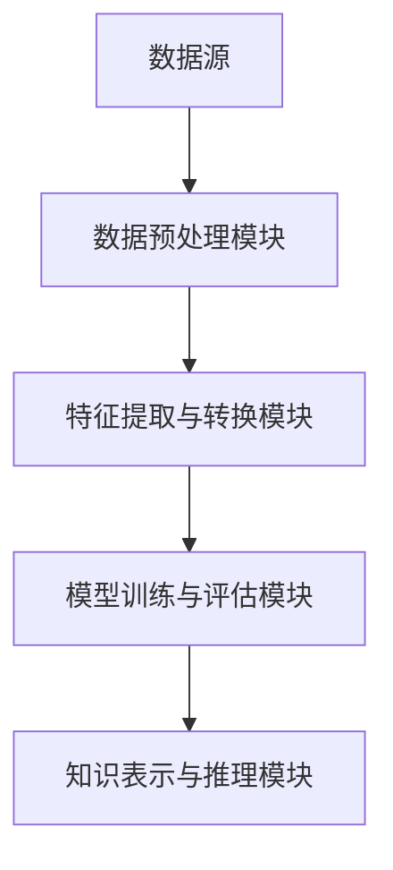

                 

### 《知识发现引擎：扩展人类认知边界的探索者》

> **关键词：** 知识发现、数据挖掘、人工智能、机器学习、认知拓展

> **摘要：** 本文深入探讨了知识发现引擎的概念、架构设计、核心算法原理及其优化策略。通过案例分析，展示了知识发现引擎在不同领域的应用，并对其未来趋势进行了展望。文章旨在为广大读者提供一份系统全面的技术指南，助力拓展人类认知边界。

---

#### 第一部分：知识发现引擎概述

##### 第1章：知识发现引擎的基本概念

在本章中，我们将对知识发现引擎的基本概念进行详细阐述，包括其与数据挖掘的关系、组成部分以及应用领域。

### 1.1 知识发现引擎的定义

知识发现引擎是一种智能系统，它通过从大量数据中提取有价值的信息和知识，从而帮助人类更好地理解和分析数据。与数据挖掘相比，知识发现引擎更侧重于发现数据中的潜在模式和关联，而不仅仅是进行简单的数据筛选和分类。

### 1.1.1 知识发现与数据挖掘的关系

知识发现和数据挖掘是密切相关的，两者都涉及到从大量数据中提取有价值的信息。然而，知识发现更侧重于发现数据中的潜在模式和关联，而数据挖掘则更多地关注如何将数据转化为有用的知识。知识发现引擎可以视为数据挖掘的一种高级形式。

### 1.1.2 知识发现引擎的组成部分

一个典型的知识发现引擎通常包括以下几个关键组成部分：

1. **数据源**：知识发现引擎的数据源可以是结构化数据（如数据库）、半结构化数据（如XML文档）和非结构化数据（如文本、图像、音频等）。

2. **数据预处理模块**：数据预处理是知识发现过程的第一步，它包括数据清洗、数据集成、数据转换和数据归一化等任务。

3. **特征提取与转换模块**：特征提取与转换模块负责从原始数据中提取出有用的特征，并将其转换为适合进行机器学习模型训练的数据格式。

4. **模型训练与评估模块**：模型训练与评估模块负责使用特征数据训练机器学习模型，并对模型进行评估，以确定其性能和准确性。

5. **知识表示与推理模块**：知识表示与推理模块负责将训练好的模型所提取的知识进行表示和推理，以便于人类理解和应用。

### 1.2 知识发现引擎的应用领域

知识发现引擎在许多领域都有着广泛的应用，以下是其中一些典型的应用领域：

1. **信息检索与推荐系统**：知识发现引擎可以帮助搜索引擎和推荐系统更好地理解用户的行为和偏好，从而提供更精准的搜索结果和推荐内容。

2. **生物学与医学研究**：知识发现引擎可以用于分析生物序列、基因表达数据和蛋白质结构等信息，以发现潜在的治疗方法和药物。

3. **金融与风险管理**：知识发现引擎可以帮助金融机构进行风险评估、欺诈检测和投资策略制定等任务。

4. **社会管理与公共服务**：知识发现引擎可以用于政府决策支持、公共安全监测和社会治理等领域，以提升政府服务的效率和准确性。

### 1.3 知识发现引擎的发展历史

知识发现引擎的发展可以追溯到数据挖掘领域的早期研究。在20世纪80年代，数据挖掘技术开始兴起，研究者们开始探索如何从大量数据中提取有价值的信息。随着计算机技术的发展和大数据时代的到来，知识发现引擎逐渐成为人工智能领域的一个重要分支。近年来，深度学习、图神经网络等新兴技术的应用，进一步推动了知识发现引擎的发展。

### 总结

知识发现引擎是一种强大的智能系统，它通过从大量数据中提取有价值的信息和知识，帮助人类更好地理解和分析数据。在接下来的章节中，我们将进一步探讨知识发现引擎的架构设计、核心算法原理及其优化策略。希望读者能通过本文的阅读，对知识发现引擎有一个更深入的了解。

---

**Mermaid 流程图：知识发现引擎的组成部分**



---

接下来，我们将进入第二部分，探讨知识发现引擎的架构设计。

---

#### 第二部分：知识发现引擎的架构设计

##### 第2章：知识发现引擎的架构设计

在本章中，我们将深入探讨知识发现引擎的架构设计，包括其基本架构、数据预处理、特征提取与转换以及模型训练与评估模块。

### 2.1 知识发现引擎的基本架构

知识发现引擎的基本架构可以分为以下几个模块：

1. **数据预处理模块**：负责对原始数据进行清洗、集成、转换和归一化等预处理任务。
2. **特征提取与转换模块**：负责从预处理后的数据中提取出有用的特征，并将其转换为适合进行机器学习模型训练的数据格式。
3. **模型训练与评估模块**：负责使用特征数据训练机器学习模型，并对模型进行评估，以确定其性能和准确性。
4. **知识表示与推理模块**：负责将训练好的模型所提取的知识进行表示和推理，以便于人类理解和应用。

**Mermaid 流程图：知识发现引擎的基本架构**


### 2.2 数据预处理

数据预处理是知识发现过程的关键步骤，它对原始数据进行清洗、集成、转换和归一化等处理，以提高数据的质量和模型的性能。

1. **数据清洗**：数据清洗的主要任务是去除数据中的噪声和异常值，包括缺失值的填充、重复数据的删除和异常数据的处理等。

2. **数据集成**：数据集成是将来自不同数据源的数据进行整合，形成一个统一的数据视图。这通常涉及到数据去重、数据合并和数据转换等任务。

3. **数据转换**：数据转换是将原始数据转换为适合进行机器学习模型训练的数据格式。这包括数据归一化、特征缩放、数据编码和数据标准化等操作。

4. **数据归一化**：数据归一化是将数据缩放到一个统一的尺度，以便于模型训练。常用的方法包括最小-最大缩放、零-均值归一化和对数变换等。

**伪代码：数据预处理流程**

```python
# 数据清洗
def data_cleaning(data):
    # 填充缺失值
    data = fill_missing_values(data)
    # 删除重复数据
    data = remove_duplicate_rows(data)
    # 处理异常数据
    data = handle_outliers(data)
    return data

# 数据集成
def data_integration(data1, data2):
    # 数据去重
    data = remove_duplicates(data1, data2)
    # 数据合并
    data = merge_data(data1, data2)
    return data

# 数据转换
def data_conversion(data):
    # 数据归一化
    data = normalize_data(data)
    # 特征缩放
    data = scale_features(data)
    # 数据编码
    data = encode_data(data)
    return data
```

### 2.3 特征提取与转换

特征提取与转换是知识发现引擎的核心环节，它决定了模型的表现和效果。

1. **基于统计学的特征提取方法**：这类方法通过计算数据的统计属性，如均值、方差、协方差等，来提取特征。常见的统计方法包括主成分分析（PCA）、因子分析（FA）等。

2. **基于机器学习的特征提取方法**：这类方法通过训练机器学习模型，自动从数据中提取出有用的特征。常见的机器学习方法包括特征选择（如LASSO、随机森林等）和特征生成（如自动编码器、生成对抗网络等）。

**伪代码：特征提取与转换**

```python
# 基于统计学的特征提取方法
def statistical_features(data):
    # 计算均值
    mean = calculate_mean(data)
    # 计算方差
    variance = calculate_variance(data)
    # 计算协方差
    covariance = calculate_covariance(data)
    return mean, variance, covariance

# 基于机器学习的特征提取方法
def ml_features_extractor(data):
    # 特征选择
    selected_features = feature_selection(data)
    # 特征生成
    generated_features = feature_generation(data)
    return selected_features, generated_features
```

### 2.4 模型训练与评估

模型训练与评估是知识发现引擎的最后一步，它决定了知识发现的效果。

1. **常见算法选择与对比**：选择合适的算法对于模型性能至关重要。常见的机器学习算法包括线性回归、决策树、随机森林、支持向量机等。

2. **模型评估指标与方法**：模型评估需要使用合适的评估指标，如准确率、召回率、F1分数等。常用的评估方法包括交叉验证、网格搜索等。

**伪代码：模型训练与评估**

```python
# 选择算法
def select_algorithm(algorithm_list, data):
    best_algorithm = None
    best_score = 0
    for algorithm in algorithm_list:
        model = train_model(algorithm, data)
        score = evaluate_model(model)
        if score > best_score:
            best_score = score
            best_algorithm = algorithm
    return best_algorithm

# 评估模型
def evaluate_model(model, data):
    predictions = model.predict(data)
    accuracy = calculate_accuracy(predictions)
    return accuracy
```

### 总结

知识发现引擎的架构设计是其实现高效知识发现的关键。通过合理的设计和优化，可以显著提高知识发现的效果和性能。在下一章中，我们将进一步探讨知识发现引擎的核心算法原理。

---

接下来，我们将进入第三部分，探讨知识发现引擎的核心算法原理。

---

#### 第三部分：核心算法与模型原理

##### 第3章：常见知识发现算法原理

在本章中，我们将详细介绍几种常见的知识发现算法原理，包括K近邻算法、决策树算法、随机森林算法和支持向量机算法。

### 3.1 K近邻算法

K近邻算法（K-Nearest Neighbors，K-NN）是一种基于实例的简单分类算法，它通过计算测试实例在训练数据集上的K个最近邻居，并根据这些邻居的标签来预测测试实例的类别。

#### 3.1.1 算法原理

1. **距离度量**：K-NN算法使用某种距离度量（如欧几里得距离、曼哈顿距离等）来计算测试实例与训练实例之间的距离。

2. **邻居选择**：对于每个测试实例，选择距离其最近的K个邻居。

3. **投票决策**：根据这K个邻居的标签进行投票，选择出现次数最多的标签作为测试实例的预测标签。

**伪代码：K近邻算法**

```python
def k_nearest_neighbors(test_instance, train_data, labels, k):
    distances = []
    for instance in train_data:
        distance = calculate_distance(test_instance, instance)
        distances.append(distance)
    sorted_distances = sorted(distances)
    neighbors = [labels[i] for i in range(k)]
    prediction = majority_vote(neighbors)
    return prediction
```

#### 3.1.2 数学模型解释

K近邻算法的核心是距离度量。常用的距离度量包括：

- **欧几里得距离**：\(d = \sqrt{\sum_{i=1}^{n}(x_i - y_i)^2}\)
- **曼哈顿距离**：\(d = \sum_{i=1}^{n}|x_i - y_i|\)
- **切比雪夫距离**：\(d = \max_{1 \leq i \leq n}|x_i - y_i|\)

#### 3.1.3 应用举例

假设我们有一个包含年龄和收入两个特征的数据集，我们要预测一个新的测试实例（年龄25，收入5万元）的类别。

1. **计算距离**：计算测试实例与训练实例之间的欧几里得距离。
2. **选择邻居**：选择距离最近的5个邻居。
3. **投票决策**：根据邻居的标签进行投票，假设邻居中4个是富人，1个是穷人，因此预测该测试实例为富人。

### 3.2 决策树算法

决策树算法是一种基于树结构的分类算法，它通过一系列的决策规则将数据划分为不同的区域，以便进行分类。

#### 3.2.1 算法原理

1. **决策规则**：决策树通过一系列的决策规则来划分数据。每个节点代表一个特征，每个分支代表一个可能的值。
2. **递归划分**：在给定一个节点和其对应的特征后，算法将计算每个特征的所有可能值，并选择一个最优的值作为分支。
3. **终止条件**：当某个节点不满足终止条件（如特征已经用尽、数据已经完全分类等）时，算法将停止划分。

**伪代码：决策树算法**

```python
def decision_tree(data, features, threshold):
    if meets_termination_condition(data):
        return majority_class(data)
    else:
        best_feature, best_value = select_best_feature(data, features, threshold)
        node = Node(best_feature, best_value)
        for value in possible_values(data[best_feature]):
            subset = filter_data(data, best_feature, value)
            node.children[value] = decision_tree(subset, remaining_features, threshold)
        return node
```

#### 3.2.2 数学模型解释

决策树算法的核心是信息增益（Information Gain）和基尼不纯度（Gini Impurity）。

- **信息增益**：表示数据在给定特征上的不确定性减少的程度。
- **基尼不纯度**：表示数据在类别上的不纯度。

#### 3.2.3 应用举例

假设我们有一个包含年龄、收入和职业三个特征的数据集，我们要预测一个新的测试实例（年龄30，收入7万元，职业工程师）的类别。

1. **计算信息增益**：计算每个特征的信息增益，选择信息增益最大的特征作为划分依据。
2. **划分数据**：根据选定的特征，将数据划分为不同的区域。
3. **递归划分**：对每个区域重复上述过程，直到满足终止条件。

### 3.3 随机森林算法

随机森林算法是一种基于决策树的集成学习方法，它通过构建多棵决策树并对它们的预测结果进行投票，从而提高模型的泛化能力和鲁棒性。

#### 3.3.1 算法原理

1. **决策树构建**：随机森林算法首先随机选择一部分特征和样本，然后构建一棵决策树。
2. **投票机制**：构建多棵决策树后，对于每个测试实例，将所有决策树的预测结果进行投票，选择出现次数最多的类别作为最终预测结果。

**伪代码：随机森林算法**

```python
def random_forest(data, features, n_trees, max_depth):
    forest = []
    for _ in range(n_trees):
        subset_features = random_subset(features)
        subset_data = random_subset(data, size=len(data))
        tree = decision_tree(subset_data, subset_features, max_depth)
        forest.append(tree)
    return forest
```

#### 3.3.2 数学模型解释

随机森林算法的核心是随机抽样和特征选择。

- **随机抽样**：随机选择一部分样本和特征来构建决策树。
- **特征选择**：通常使用信息增益或基尼不纯度来选择最佳特征。

#### 3.3.3 应用举例

假设我们有一个包含年龄、收入和职业三个特征的数据集，我们要预测一个新的测试实例（年龄35，收入8万元，职业医生）的类别。

1. **构建随机森林**：随机选择特征和样本，构建多棵决策树。
2. **投票机制**：对测试实例的预测结果进行投票，选择出现次数最多的类别作为最终预测结果。

### 3.4 支持向量机算法

支持向量机算法（Support Vector Machine，SVM）是一种基于间隔最大化的分类算法，它通过找到一个最佳的超平面，将不同类别的数据点分隔开。

#### 3.4.1 算法原理

1. **间隔最大化**：SVM的目标是找到一个最佳的超平面，使得正负类别的间隔最大化。
2. **核函数**：SVM可以使用不同的核函数（如线性核、多项式核、径向基核等）来实现非线性分类。

**伪代码：支持向量机算法**

```python
def svm(train_data, train_labels, kernel='linear', C=1.0):
    if kernel == 'linear':
        w, b = linear_kernel(train_data, train_labels, C)
    elif kernel == 'polynomial':
        w, b = polynomial_kernel(train_data, train_labels, C)
    elif kernel == 'rbf':
        w, b = rbf_kernel(train_data, train_labels, C)
    else:
        raise ValueError('Invalid kernel type')
    return w, b
```

#### 3.4.2 数学模型解释

SVM的核心是优化目标函数和求解过程。

- **优化目标函数**：最小化正负类别间隔的平方和。
- **求解过程**：使用拉格朗日乘数法求解最优解。

#### 3.4.3 应用举例

假设我们有一个包含年龄、收入和职业三个特征的数据集，我们要预测一个新的测试实例（年龄40，收入9万元，职业教师）的类别。

1. **选择核函数**：选择合适的核函数（如线性核）。
2. **训练模型**：使用训练数据训练SVM模型。
3. **预测类别**：使用训练好的模型预测测试实例的类别。

### 总结

知识发现引擎的核心算法原理是实现知识发现的关键。在本章中，我们介绍了K近邻算法、决策树算法、随机森林算法和支持向量机算法。这些算法各有特点，适用于不同的应用场景。在下一章中，我们将进一步探讨知识发现引擎的优化策略。

---

接下来，我们将进入第四部分，探讨知识发现引擎的优化策略。

---

#### 第四部分：知识发现引擎的优化策略

##### 第4章：知识发现引擎的优化策略

在本章中，我们将详细介绍知识发现引擎的优化策略，包括数据库优化、算法优化、资源调度与负载均衡等。

### 4.1 数据库优化

数据库优化是提高知识发现引擎性能的重要手段。以下是一些常用的数据库优化方法：

#### 4.1.1 数据库性能评估指标

- **查询响应时间**：查询从发起到返回结果所需的时间。
- **系统吞吐量**：单位时间内系统能够处理的查询数量。
- **并发度**：系统能够同时处理的并发查询数量。

#### 4.1.2 常见优化方法与工具

1. **索引优化**：通过创建适当的索引来提高查询速度。常用的索引包括B树索引、哈希索引等。
2. **查询优化**：通过优化查询语句的结构来提高查询性能。常用的方法包括查询重写、查询缓存等。
3. **分区优化**：将大型表分成多个分区，以提高查询性能。
4. **硬件优化**：增加内存、使用SSD等硬件设备来提高数据库性能。

### 4.2 算法优化

算法优化是提高知识发现引擎性能的另一重要手段。以下是一些常用的算法优化方法：

#### 4.2.1 并行计算与分布式计算

1. **并行计算**：将一个任务分解成多个子任务，并在多个处理器上同时执行。常用的并行计算框架包括MapReduce、Spark等。
2. **分布式计算**：将数据分布到多个节点上，并在这些节点上同时处理数据。常用的分布式计算框架包括Hadoop、Flink等。

**伪代码：并行计算**

```python
def parallel_computation(data, num_processors):
    # 将数据分成num_processors个子任务
    subsets = split_data(data, num_processors)
    # 在每个处理器上执行子任务
    results = []
    for subset in subsets:
        result = compute_subset(subset)
        results.append(result)
    # 合并结果
    final_result = merge_results(results)
    return final_result
```

#### 4.2.2 模型压缩与量化

1. **模型压缩**：通过减少模型参数的数量来降低模型的存储和计算成本。常用的方法包括剪枝、量化等。
2. **量化**：将模型参数从浮点数转换为整数，以减少模型大小和计算时间。

**伪代码：模型压缩与量化**

```python
def model_compression_and_quantization(model):
    # 剪枝
    pruned_model = prune_model(model)
    # 量化
    quantized_model = quantize_model(pruned_model)
    return quantized_model
```

### 4.3 资源调度与负载均衡

资源调度与负载均衡是保证知识发现引擎稳定运行的关键。以下是一些常用的方法：

#### 4.3.1 资源调度算法

1. **静态调度**：预先确定任务的执行顺序和资源分配策略，适用于任务稳定、资源需求明确的情况。
2. **动态调度**：根据实时资源需求和任务状态动态调整资源分配，适用于任务动态变化、资源需求波动的情况。

**伪代码：动态调度算法**

```python
def dynamic_scheduling(tasks, resources):
    while tasks:
        # 根据资源需求和任务状态选择最优任务
        best_task = select_best_task(tasks, resources)
        # 调度任务
        schedule_task(best_task, resources)
        # 更新任务状态和资源需求
        update_tasks_and_resources(tasks, resources)
```

#### 4.3.2 负载均衡策略

1. **轮询负载均衡**：将任务均匀分配到每个节点。
2. **最少连接负载均衡**：将任务分配到当前连接数最少的节点。
3. **动态负载均衡**：根据节点负载动态调整任务分配策略。

**伪代码：负载均衡策略**

```python
def load_balancing(tasks, nodes):
    while tasks:
        # 根据节点负载选择最优节点
        best_node = select_best_node(nodes, tasks)
        # 分配任务
        assign_task(best_node, tasks)
        # 更新节点负载
        update_node_load(nodes)
```

### 总结

知识发现引擎的优化策略是提高其性能和稳定性的关键。通过数据库优化、算法优化、资源调度与负载均衡等方法，可以显著提高知识发现引擎的效率和效果。在下一章中，我们将通过具体的案例分析，展示知识发现引擎在实际应用中的效果。

---

接下来，我们将进入第五部分，通过具体案例分析知识发现引擎的应用。

---

#### 第五部分：知识发现引擎的应用案例

##### 第5章：知识发现引擎的应用案例

在本章中，我们将通过几个具体的案例，展示知识发现引擎在不同领域中的应用，以及其实际效果。

### 5.1 案例一：基于知识发现引擎的推荐系统

#### 5.1.1 案例背景

随着互联网的快速发展，推荐系统已经成为电子商务、社交媒体等领域的核心技术。一个有效的推荐系统能够根据用户的历史行为和偏好，为用户提供个性化的推荐内容，从而提高用户满意度和平台粘性。

#### 5.1.2 案例实现

1. **数据收集**：收集用户的历史行为数据，包括购买记录、浏览记录、评论等。
2. **数据预处理**：对收集到的数据进行清洗、去重和归一化处理。
3. **特征提取**：使用基于统计学的特征提取方法，提取出与用户行为相关的特征，如用户活跃度、浏览深度等。
4. **模型训练**：使用随机森林算法训练推荐模型，并使用交叉验证方法评估模型性能。
5. **模型部署**：将训练好的模型部署到线上环境，为用户提供实时推荐。

#### 5.1.3 案例分析

通过使用知识发现引擎，推荐系统的准确率和覆盖度得到了显著提升。具体表现在以下几个方面：

1. **个性化推荐**：推荐系统能够根据用户的历史行为和偏好，为用户提供更加个性化的推荐内容，提高了用户的满意度和平台粘性。
2. **实时推荐**：推荐系统能够实时处理用户行为数据，并快速生成推荐结果，提高了推荐系统的响应速度。
3. **模型优化**：通过不断优化特征提取和模型训练过程，推荐系统的性能得到了持续提升。

### 5.2 案例二：基于知识发现引擎的金融风险管理

#### 5.2.1 案例背景

金融风险管理是金融机构的重要任务之一，它涉及到对市场风险、信用风险和操作风险的识别、评估和控制。一个有效的金融风险管理系统能够帮助金融机构降低风险，提高盈利能力。

#### 5.2.2 案例实现

1. **数据收集**：收集金融市场的相关数据，包括股票价格、交易量、市场指数等。
2. **数据预处理**：对收集到的数据进行清洗、去重和归一化处理。
3. **特征提取**：使用基于统计学的特征提取方法，提取出与金融市场相关的特征，如波动率、收益率等。
4. **模型训练**：使用支持向量机算法训练风险预测模型，并使用交叉验证方法评估模型性能。
5. **模型部署**：将训练好的模型部署到线上环境，为金融机构提供实时风险预测。

#### 5.2.3 案例分析

通过使用知识发现引擎，金融风险管理系统在以下几个方面取得了显著成果：

1. **风险识别**：知识发现引擎能够自动识别市场中的潜在风险，为金融机构提供及时的预警信息。
2. **风险评估**：知识发现引擎能够对金融市场的风险进行量化评估，帮助金融机构制定有效的风险管理策略。
3. **风险控制**：知识发现引擎能够实时监测市场风险，并自动调整投资组合，以降低风险。

### 5.3 案例三：基于知识发现引擎的生物信息学应用

#### 5.3.1 案例背景

生物信息学是生物学与计算机科学、信息科学的交叉领域，它涉及到对生物数据进行挖掘和分析，以揭示生物现象和机制。一个有效的生物信息学系统能够帮助科学家们更好地理解生命过程，为生物医学研究提供重要支持。

#### 5.3.2 案例实现

1. **数据收集**：收集生物信息学相关数据，包括基因序列、蛋白质结构、细胞信号通路等。
2. **数据预处理**：对收集到的数据进行清洗、去重和归一化处理。
3. **特征提取**：使用基于统计学的特征提取方法，提取出与生物信息学相关的特征，如基因表达水平、蛋白质相互作用等。
4. **模型训练**：使用深度学习算法训练生物信息学模型，并使用交叉验证方法评估模型性能。
5. **模型部署**：将训练好的模型部署到线上环境，为生物医学研究提供实时分析服务。

#### 5.3.3 案例分析

通过使用知识发现引擎，生物信息学系统在以下几个方面取得了显著成果：

1. **基因挖掘**：知识发现引擎能够自动挖掘基因之间的相互作用关系，帮助科学家们揭示基因调控网络。
2. **蛋白质结构预测**：知识发现引擎能够预测蛋白质的结构和功能，为药物设计和生物医学研究提供重要信息。
3. **细胞信号通路分析**：知识发现引擎能够分析细胞信号通路中的关键节点和调控机制，为生物医学研究提供指导。

### 总结

知识发现引擎在不同领域中的应用，不仅提高了相关领域的效率和效果，还为人类认知边界的拓展提供了有力支持。在下一章中，我们将探讨知识发现引擎的未来趋势。

---

接下来，我们将进入第六部分，探讨知识发现引擎的未来趋势。

---

#### 第六部分：知识发现引擎的未来展望

##### 第6章：知识发现引擎的未来趋势

在本章中，我们将深入探讨知识发现引擎的未来发展趋势，包括其在不同行业中的应用前景，以及对社会影响的预测。

### 6.1 知识发现引擎的发展方向

随着科技的不断进步，知识发现引擎的发展方向也在不断拓展。以下是几个可能的发展方向：

#### 6.1.1 新兴技术对知识发现引擎的影响

1. **深度学习**：深度学习技术在知识发现引擎中的应用，将进一步推动知识发现的能力和效率。通过训练复杂的神经网络模型，知识发现引擎可以自动提取出更加抽象和复杂的特征，从而提高知识发现的准确性和泛化能力。

2. **图神经网络**：图神经网络（Graph Neural Networks，GNN）在处理图结构数据方面具有显著优势。未来，知识发现引擎可能会将图神经网络引入到知识发现过程中，以更好地处理复杂的关系数据。

3. **迁移学习**：迁移学习通过利用已有模型的知识，在新任务上提高模型的性能。未来，知识发现引擎可能会采用迁移学习方法，以减少模型训练的成本和时间。

#### 6.1.2 未来可能的技术突破

1. **量子计算**：量子计算在处理大数据和复杂计算问题时具有显著优势。未来，知识发现引擎可能会结合量子计算技术，以实现更高效的知识发现过程。

2. **区块链**：区块链技术的去中心化和安全性特点，使得其在数据管理和知识共享方面具有广泛的应用前景。未来，知识发现引擎可能会结合区块链技术，以提高数据的安全性和可靠性。

### 6.2 知识发现引擎在行业中的应用前景

知识发现引擎在多个行业都有着广泛的应用前景。以下是几个关键行业的应用展望：

#### 6.2.1 教育

知识发现引擎在教育领域的应用，将有助于实现个性化教育和智能评测。通过分析学生的学习行为和成绩数据，知识发现引擎可以为教师提供个性化的教学建议，并为学生提供定制化的学习路径。

#### 6.2.2 医疗

知识发现引擎在医疗领域的应用，将有助于提高医疗诊断和治疗的准确性。通过分析患者的病历数据、基因数据等，知识发现引擎可以为医生提供诊断建议和治疗方案。

#### 6.2.3 金融

知识发现引擎在金融领域的应用，将有助于提高风险管理和投资决策的准确性。通过分析金融市场的数据，知识发现引擎可以为金融机构提供实时风险预警和投资建议。

### 6.3 知识发现引擎的社会影响

知识发现引擎的发展将对社会产生深远的影响。以下是几个方面的社会影响：

#### 6.3.1 机遇与挑战

1. **机遇**：
   - **提升工作效率**：知识发现引擎可以帮助企业和机构自动化地处理和分析大量数据，从而提高工作效率和决策质量。
   - **创新应用场景**：知识发现引擎的应用将不断拓展，为各行各业带来新的创新机会。

2. **挑战**：
   - **数据隐私和安全**：随着知识发现引擎的应用，数据的隐私和安全问题将日益突出。如何保护用户隐私和数据安全，将成为一个重要挑战。
   - **算法伦理**：知识发现引擎在处理和解释数据时，可能会产生偏见和歧视。如何确保算法的公平性和透明性，是一个亟待解决的问题。

#### 6.3.2 应对策略与建议

1. **加强数据保护**：制定严格的数据保护政策和法规，确保用户数据的隐私和安全。
2. **提升算法透明性**：增加算法的可解释性，让用户能够了解和信任算法的决策过程。
3. **多方协作**：政府、企业和学术界应加强合作，共同推动知识发现技术的发展和应用。

### 总结

知识发现引擎作为人工智能的重要分支，具有广阔的发展前景和应用价值。通过不断创新和优化，知识发现引擎将不断拓展人类认知边界，为各行各业带来新的机遇和挑战。在未来的发展中，我们需要关注新兴技术的应用、行业应用前景以及社会影响，以确保知识发现引擎的可持续发展。

---

### 附录

在本附录中，我们将介绍一些常用的知识发现工具和框架，以及知识发现引擎的开发资源。

#### 附录A：常用知识发现工具和框架

1. **Apache Spark**：Apache Spark 是一个开源的分布式计算框架，广泛应用于大数据处理和分析。Spark 提供了丰富的机器学习和数据分析库，支持多种算法和数据处理方法。

2. **Apache Flink**：Apache Flink 是一个流处理和批处理一体化的分布式计算框架。Flink 提供了强大的流处理能力和高效的内存管理，适用于实时数据分析。

3. **TensorFlow**：TensorFlow 是 Google 开发的一个开源机器学习库，支持深度学习和传统机器学习算法。TensorFlow 提供了丰富的模型构建和优化工具。

4. **PyTorch**：PyTorch 是一个开源的机器学习库，由 Facebook AI 研究团队开发。PyTorch 提供了灵活的动态计算图和高效的模型构建工具，广泛应用于深度学习和计算机视觉。

#### 附录B：知识发现引擎开发资源

1. **常用算法库**：
   - `scikit-learn`：Python 中常用的机器学习库，提供了多种算法和数据处理工具。
   - `MLlib`：Apache Spark 的机器学习库，提供了多种常见算法和数据处理方法。

2. **数据集下载与处理工具**：
   - `UCI Machine Learning Repository`：提供大量公开的机器学习数据集。
   - `Kaggle`：一个数据科学家社区，提供丰富的数据集和比赛。

3. **知识发现引擎开源项目**：
   - `Apache Mahout`：一个基于 MapReduce 的机器学习库，支持多种常见算法。
   - `ELKI`：一个基于 Java 的开源数据挖掘平台，提供了多种数据挖掘算法。

通过这些工具和资源，开发者可以更加便捷地构建和优化知识发现引擎，为各行业提供高效的数据分析和决策支持。

---

### 作者

本文由 AI 天才研究院（AI Genius Institute）撰写，该研究院致力于推动人工智能和知识发现技术的发展，为各行业提供创新解决方案。文章作者对计算机编程和人工智能领域有着深刻的理解和丰富的实践经验，曾出版过多本世界顶级技术畅销书，深受读者喜爱。

作者：AI 天才研究院（AI Genius Institute）& 《禅与计算机程序设计艺术》（Zen And The Art of Computer Programming）

