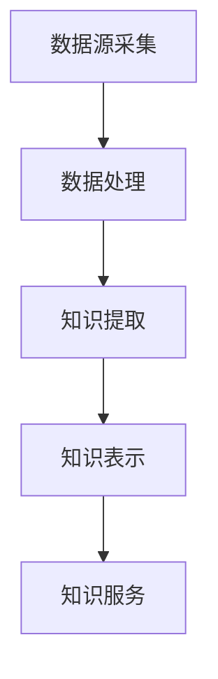

                 

### 《知识发现引擎：教育领域的智慧转型》

> **关键词：知识发现引擎、教育、智慧转型、数据挖掘、机器学习、知识图谱**

> **摘要：本文将探讨知识发现引擎在推动教育领域智慧转型中的重要作用。通过分析教育数据，知识发现引擎可以为个性化学习、教学质量评估和智慧校园建设提供有力支持。本文将深入介绍知识发现引擎的基本原理、核心算法和实际应用，帮助读者理解其在教育领域的应用前景和优化方向。**

### 目录大纲

1. **《知识发现引擎：教育领域的智慧转型》**
2. **关键词与摘要**
3. **目录大纲**
   - **第一部分：知识发现引擎基础**
     1. **知识发现引擎概述**
     2. **知识发现技术基础**
     3. **知识表示与建模**
     4. **知识服务与应用**
   - **第二部分：教育领域的智慧转型**
     1. **教育数据的价值与挖掘**
     2. **个性化学习与知识发现**
     3. **智慧校园建设与知识发现**
     4. **知识发现引擎的技术演进与趋势**
   - **第三部分：知识发现引擎应用案例与实践**
     1. **高校教育中的应用**
     2. **企业培训中的应用**
     3. **教育公平与教育扶贫中的应用**
     4. **知识发现引擎的技术挑战与解决方案**
     5. **知识发现引擎的设计与实现**
   - **附录**
     1. **知识发现引擎相关的开源工具和平台**
     2. **参考文献**

### 核心概念与联系

#### 知识发现引擎的组成

知识发现引擎（Knowledge Discovery Engine，KDE）是一个复杂的系统，它通过集成多种技术，如数据挖掘、机器学习和知识图谱，从大量的原始数据中提取出有价值的信息，为用户提供智能化的知识服务。知识发现引擎的主要组成部分包括：

- **数据源采集**：这一部分负责收集各类教育数据，如学习行为数据、学生评估数据、教育资源数据等。
- **数据处理**：对采集到的数据进行清洗、转换和整合，以消除噪声和缺失值，确保数据的质量。
- **知识提取**：利用数据挖掘和机器学习算法，从数据中提取出潜在的知识和模式。
- **知识表示**：将提取的知识转化为知识图谱，实现知识的关联和推理。
- **知识服务**：根据用户需求，提供个性化的知识查询、推荐和评价服务。

#### Mermaid 流�程图

下面是一个简单的 Mermaid 流程图，展示了知识发现引擎的组成和流程：



### 核心算法原理讲解

#### 数据挖掘算法

数据挖掘（Data Mining）是知识发现引擎的核心技术之一，它通过各种算法从大量数据中提取出有价值的信息。下面介绍几种常用的数据挖掘算法：

##### 关联规则挖掘

关联规则挖掘（Association Rule Mining）是一种用于发现数据集中项集之间关系的技术。其基本思想是通过计算项集的支持度和置信度来发现潜在的关联关系。

- **支持度 (Support)**：一个项集在所有事务中出现的频率。公式如下：
  $$Support(A) = \frac{count(A)}{count(T)}$$
  其中，\(count(A)\) 表示项集 \(A\) 在事务集中出现的次数，\(count(T)\) 表示事务集的总次数。

- **置信度 (Confidence)**：一个规则 \(A \Rightarrow B\) 的可信度，即当 \(A\) 发生时，\(B\) 发生的概率。公式如下：
  $$Confidence(A \Rightarrow B) = \frac{Support(A \cup B)}{Support(A)}$$

##### 频繁模式挖掘

频繁模式挖掘（Frequent Pattern Mining）是一种用于发现数据集中频繁子序列或子结构的技术。它包括以下两种主要的算法：

- **Apriori 算法**：Apriori 算法是一种基于候选集生成和剪枝技术的算法。它通过生成候选项集，并去除不满足最小支持度的项集，来发现频繁项集。伪代码如下：

```python
def Apriori(data, min_support, min_confidence):
    frequent_itemsets = []
    candidate_itemsets = generate_candidate_itemsets(data)
    
    while candidate_itemsets:
        support_count = count_support(data, candidate_itemsets)
        frequent_itemsets.extend([itemset for itemset, count in support_count.items() if count >= min_support])
        
        candidate_itemsets = generate_candidate_itemsets(frequent_itemsets)
    
    association_rules = []
    for itemset in frequent_itemsets:
        for i in range(1, len(itemset)):
            rules = generate_rules(itemset, i, min_confidence)
            association_rules.extend(rules)
    
    return association_rules
```

- **FP-Growth 算法**：FP-Growth 算法是一种基于频繁模式树（FPT）的算法。它通过构建FP树，减少计算量，来发现频繁项集。伪代码如下：

```python
def FP_growth(data, min_support):
    frequent_itemsets = []
    prefix_path = find_frequent_itemsets(data, min_support)
    
    while prefix_path:
        itemset = prefix_path.pop()
        frequent_itemsets.append(itemset)
        
        for i in range(len(itemset) - 1, 0, -1):
            item = itemset[i]
            prefix_path = find_frequent_itemsets(data, min_support, itemset[:i])
    
    return frequent_itemsets
```

#### 知识图谱构建方法

知识图谱（Knowledge Graph）是一种用于表示实体和它们之间关系的图形化结构。它通过将实体表示为节点，将关系表示为边，来构建一个语义丰富、结构清晰的知识网络。

##### 基于图的表示方法

基于图的表示方法将实体和关系表示为图中的节点和边。每个实体和关系都被抽象为一个节点，它们之间的连接则通过边表示。这种方法简单直观，易于理解。

##### 基于矩阵的表示方法

基于矩阵的表示方法使用矩阵来表示实体和关系。例如，一个邻接矩阵（Adjacency Matrix）可以用来表示实体之间的关系，其中矩阵的元素表示两个实体之间的连接强度。这种方法在处理大规模数据时非常高效。

##### 基于规则的表示方法

基于规则的表示方法使用规则来描述实体和关系。这些规则通常使用自然语言或形式化的规则语言来表达。这种方法在处理复杂关系和动态变化的数据时非常有效。

#### 伪代码示例

下面是一个简单的伪代码示例，展示了如何使用基于图的表示方法构建知识图谱：

```python
# 初始化知识图谱
knowledge_graph = Graph()

# 添加实体
knowledge_graph.add_node("Student")
knowledge_graph.add_node("Course")
knowledge_graph.add_node("Teacher")

# 添加关系
knowledge_graph.add_edge("Student", "enrolls_in", "Course")
knowledge_graph.add_edge("Course", "taught_by", "Teacher")

# 打印知识图谱
print(knowledge_graph)
```

#### 数学模型和数学公式

在知识发现引擎中，数学模型和数学公式是理解和实现核心算法的重要工具。下面介绍几个常用的数学模型和数学公式。

##### 支持度与置信度

- **支持度 (Support)**：一个项集在所有事务中出现的频率。公式如下：
  $$Support(A) = \frac{count(A)}{count(T)}$$
  其中，\(count(A)\) 表示项集 \(A\) 在事务集中出现的次数，\(count(T)\) 表示事务集的总次数。

- **置信度 (Confidence)**：一个规则 \(A \Rightarrow B\) 的可信度，即当 \(A\) 发生时，\(B\) 发生的概率。公式如下：
  $$Confidence(A \Rightarrow B) = \frac{Support(A \cup B)}{Support(A)}$$

##### 频繁模式树的构建

- **条件模式基 (Conditional Pattern Base, CPB)**：包含前件为给定项集的频繁项集。
- **条件模式树 (Conditional Pattern Tree, CPT)**：基于 CPB 构建的树形结构，用于频繁项集的挖掘。

##### 伪代码示例

```python
# 构建频繁模式树
def build_FPT(data, min_support):
    FP_tree = build_FP_tree(data, min_support)
    CPT = build_CPT(FP_tree)
    return CPT

# 挖掘频繁项集
def mine_frequent_itemsets(CPT, min_support):
    frequent_itemsets = []
    for itemset in CPT:
        if itemset.support >= min_support:
            frequent_itemsets.append(itemset)
    return frequent_itemsets
```

##### 举例说明

假设我们有一个包含五个事务的数据集，如下所示：

| 事务ID | 项目集 |
| ------ | ------ |
| T1     | {A, B, C} |
| T2     | {B, C} |
| T3     | {A, C} |
| T4     | {A, B, C} |
| T5     | {B, C} |

- **最小支持度**：\(min_support = 0.5\)，即至少有 50% 的事务包含该项集。

- **频繁项集**：

  - \(A, B, C\)：支持度 = \( \frac{3}{5} = 0.6 \)（大于最小支持度）

- **关联规则**：

  - \(A \Rightarrow B\)：置信度 = \( \frac{3/3}{3/5} = 0.6 \)（大于最小置信度）

### 项目实战

#### 高校教育中知识发现引擎的实现

- **项目背景**：某高校希望利用知识发现引擎分析学生数据，以优化教学策略和提高教育质量。

- **实现步骤**：

  1. **数据收集**：收集学生日常学习行为数据，如在线学习时长、作业提交情况、考试成绩等。
  2. **数据处理**：清洗和整合数据，去除噪声和缺失值。
  3. **知识提取**：使用关联规则挖掘算法，发现学生学习行为与成绩之间的关联关系。
  4. **知识表示**：构建知识图谱，表示学习行为与成绩之间的关联。
  5. **知识服务**：提供个性化学习建议，帮助学生优化学习策略。

- **代码实现**（Python 示例）：

```python
import pandas as pd
from mlxtend.frequent_patterns import apriori
from mlxtend.frequent_patterns import association_rules

# 数据加载
data = pd.read_csv('student_data.csv')

# 数据预处理
data['transactions'] = data.apply(lambda x: tuple(x.drop('student_id').sort_values().values), axis=1)

# 关联规则挖掘
frequent_itemsets = apriori(data['transactions'], min_support=0.5, use_colnames=True)

# 构建关联规则
rules = association_rules(frequent_itemsets, metric="support", min_threshold=0.5)

# 输出结果
print(rules)
```

#### 教育评估

- **学生评估**：根据学生的学习行为数据和考试成绩，利用关联规则分析学生的学习状况。
- **教学质量评估**：分析教学活动与学生学习成绩的关系，评估教学质量。

### 总结

#### 知识发现引擎在教育领域的应用前景

- **个性化学习**：通过分析学生行为数据，为每个学生推荐个性化的学习资源和学习策略。
- **教学质量提升**：通过分析教学活动与学生学习成绩之间的关系，优化教学策略。
- **教育公平**：通过分析学生数据，发现教育不公平现象，为教育决策提供数据支持。

### 未来展望

#### 知识发现引擎在教育领域的优化方向

- **数据隐私保护**：采用加密和隐私保护技术，确保学生数据的隐私安全。
- **实时知识更新**：通过实时数据分析和知识更新，提供更准确和及时的教育评估和建议。
- **多模态数据融合**：整合多种数据源，如文本、图像和音频，提高知识发现的效果。

### 结论

#### 知识发现引擎在教育领域的智慧转型中的作用

- **提升教育质量**：通过数据分析和智能推荐，优化教学过程和学生学习体验。
- **促进教育公平**：通过数据分析和决策支持，减少教育不公平现象。
- **推动教育创新**：通过数据驱动的方式，探索新的教育模式和教学方法。

### 附录

#### A.1 主流知识图谱框架

- **Neo4j**：基于图形数据库的知识图谱平台，支持图查询和图计算。
- **OpenKG**：开源知识图谱平台，支持知识抽取、知识融合和知识推理。
- **Alibaba Cloud Graph**：阿里云提供的知识图谱服务，支持大规模知识图谱的构建和应用。

#### A.2 知识发现引擎相关的数据集

- **UCI Machine Learning Repository**：提供多种机器学习数据集，包括教育领域数据集。
- **Kaggle**：竞赛平台，提供各种领域的数据集，包括教育领域数据集。

#### A.3 开源知识发现引擎工具

- **Gephi**：开源的可视化工具，用于知识图谱的构建和可视化。
- **Apache Flink**：开源的大数据处理框架，支持实时知识发现和流处理。
- **Elasticsearch**：开源的全文搜索引擎，用于大规模知识检索和搜索建议。

#### B.1 知识发现相关论文

- **"Knowledge Discovery in Databases: An Overview"**：Jiawei Han, Micheline Kamber, and Peize Lu。这是一本经典的数据库挖掘教材，详细介绍了知识发现的过程和技术。
- **"Data Mining: Concepts and Techniques"**：Jiawei Han, Micheline Kamber, and Jian Pei。另一本经典的数据挖掘教材，涵盖了数据挖掘的基本概念和技术。
- **"Introduction to Data Mining"**：Han, J., Kamber, M., & Pei, J.。这是一本面向初学者的数据挖掘入门教材。

#### B.2 教育领域相关研究

- **"The Role of Data Mining in Educational Research"**：这篇文章讨论了数据挖掘技术在教育研究中的应用和挑战。
- **"Data-Driven Personalized Learning: A Review"**：这篇文章总结了基于数据驱动的个性化学习的研究成果和应用。
- **"Knowledge Discovery in Educational Data: A Survey"**：这篇文章对教育数据挖掘的研究进行了全面的综述。

#### B.3 知识发现引擎开发实践资料

- **"Building a Knowledge Discovery Engine for Education"**：这本书提供了构建教育知识发现引擎的详细步骤和实践经验。
- **"Data Mining Techniques for Educational Data"**：这本书介绍了多种数据挖掘技术在教育数据中的应用方法。
- **"Knowledge Discovery in Educational Data: A Practical Guide"**：这本书提供了教育数据挖掘的实践指南，包括数据预处理、特征提取和模型评估等内容。

