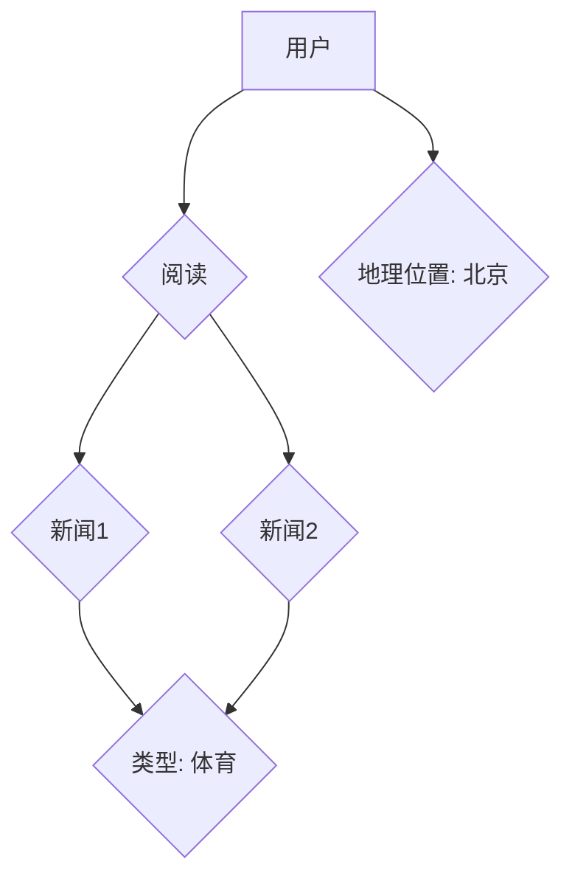
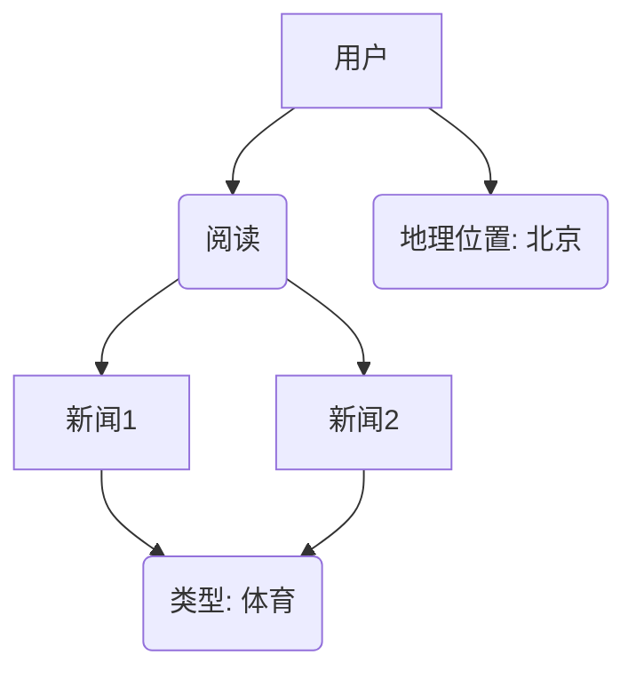
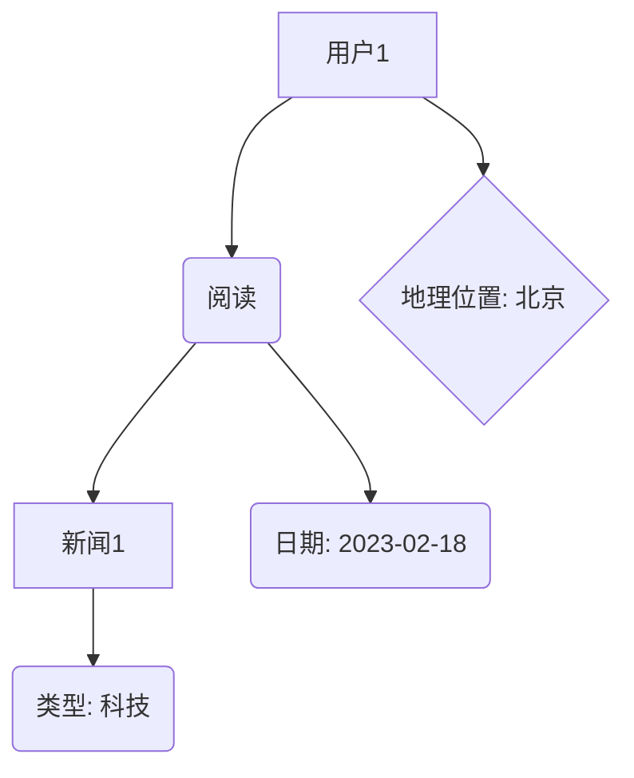

                 

### 知识图谱与个性化推荐概述

> **关键词**：知识图谱、个性化推荐、新闻推荐、人工智能、实体关系图

**摘要**：本文将深入探讨知识图谱在个性化新闻推荐系统中的应用。首先，我们将介绍知识图谱的基本概念及其重要性，然后概述个性化推荐系统的定义和分类。接着，分析知识图谱如何与个性化推荐相结合，以及其在个性化推荐中的作用和挑战。通过本文的阅读，读者将全面了解知识图谱在新闻推荐领域的应用现状和未来发展趋势。

### 第一部分：知识图谱基础

**第1章：知识图谱基础**

#### 1.1 知识图谱的定义与重要性

**1.1.1 知识图谱的定义**

知识图谱（Knowledge Graph）是一种结构化的知识表示方法，它通过实体（Entity）、属性（Attribute）、关系（Relationship）来描述现实世界中的知识。知识图谱起源于搜索引擎领域，其目的是为了提高信息检索的准确性和效率。与传统的关系数据库不同，知识图谱强调语义理解和上下文信息。

**1.1.2 知识图谱的重要性**

知识图谱在多个领域具有重要应用价值，特别是在个性化推荐系统中。其主要优势包括：

1. **提高信息检索效率**：知识图谱可以通过实体关系路径快速定位信息，提高搜索效率和准确性。
2. **增强语义理解**：知识图谱能够捕捉实体间的复杂关系，从而提升系统的语义理解能力。
3. **丰富用户交互**：通过知识图谱，系统能够提供更加智能化的推荐和交互体验。

**1.1.3 知识图谱的基本结构**

知识图谱的基本结构通常包括以下几个部分：

1. **实体（Entity）**：现实世界中的个体，如人、地点、事物等。
2. **属性（Attribute）**：实体的特征描述，如人的年龄、地点的经纬度等。
3. **关系（Relationship）**：实体之间的关联，如“属于”、“位于”等。
4. **属性值（Attribute Value）**：属性的取值，如人的年龄为30岁。

#### 1.2 个性化推荐系统概述

**1.2.1 个性化推荐系统的定义**

个性化推荐系统（Personalized Recommendation System）是一种根据用户兴趣和行为，自动推荐相关内容或物品的系统。其目标是通过个性化推荐，提升用户体验和满意度。个性化推荐系统广泛应用于电子商务、社交媒体、新闻媒体等领域。

**1.2.2 个性化推荐系统的发展历程**

个性化推荐系统的发展可以追溯到20世纪90年代。早期，基于内容的推荐和协同过滤推荐是主要的推荐算法。随着大数据和人工智能技术的发展，基于深度学习、知识图谱等新技术的新型推荐算法逐渐涌现。

**1.2.3 个性化推荐系统的分类**

根据推荐策略的不同，个性化推荐系统可以分为以下几类：

1. **基于内容的推荐（Content-based Filtering）**：根据用户的历史行为和内容特征，推荐与之相似的内容。
2. **协同过滤推荐（Collaborative Filtering）**：根据用户的共同行为，推荐其他用户喜欢的物品。
3. **基于模型的推荐（Model-based Recommendation）**：使用机器学习模型预测用户对物品的喜好。
4. **基于知识图谱的推荐（Knowledge Graph-based Recommendation）**：利用知识图谱的结构化知识，提供更加精准的推荐。

#### 1.3 知识图谱在个性化推荐中的应用

**1.3.1 知识图谱与个性化推荐的结合**

知识图谱与个性化推荐系统的结合，使得推荐系统不仅能够基于用户历史行为，还能够利用实体间的语义关系进行推荐。这种结合可以显著提升推荐系统的准确性和多样性。

**1.3.2 知识图谱在个性化推荐中的作用**

知识图谱在个性化推荐中的作用主要体现在以下几个方面：

1. **增强语义理解**：知识图谱能够捕捉实体间的复杂关系，提高系统的语义理解能力。
2. **提高推荐准确性**：通过知识图谱，系统能够利用实体间的关系，提供更加精准的推荐。
3. **提升推荐多样性**：知识图谱可以引入更多的上下文信息，提高推荐内容的多样性。

**1.3.3 知识图谱在个性化推荐中的挑战**

尽管知识图谱在个性化推荐中具有巨大潜力，但其应用也面临一些挑战：

1. **数据质量**：知识图谱的质量很大程度上取决于原始数据的质量，数据噪声和缺失会对推荐效果产生影响。
2. **计算效率**：知识图谱的复杂性和大规模特性，对计算效率和存储提出了高要求。
3. **可解释性**：知识图谱在推荐中的决策过程可能较为复杂，如何提高推荐系统的可解释性是一个重要课题。

通过本章的介绍，读者将初步了解知识图谱和个性化推荐系统的基本概念及其结合的意义。接下来，我们将进一步探讨知识图谱的构建方法和应用挑战，为深入理解知识图谱在个性化新闻推荐中的应用奠定基础。

#### 1.1 知识图谱的基本结构

知识图谱的核心在于其结构化表示方法，能够有效捕捉实体间的复杂关系。以下是知识图谱的基本结构：

1. **实体（Entity）**：实体是知识图谱中的基本元素，代表现实世界中的个体。例如，人、地点、物品等都可以作为实体。在新闻推荐系统中，实体可以是新闻文章、用户、作者等。

2. **属性（Attribute）**：属性描述实体的特征或属性，例如，用户的年龄、性别、地理位置，新闻的文章类型、发布时间等。属性为实体提供了更多的信息，帮助系统更好地理解实体的特征。

3. **关系（Relationship）**：关系描述实体之间的关联。例如，作者-撰写-新闻，用户-喜欢-新闻，地点-位于-城市等。关系将不同的实体连接起来，形成了知识图谱的网络结构。

4. **属性值（Attribute Value）**：属性值是属性的取值，例如，用户的年龄为25岁，新闻的发布时间为2023年2月18日等。属性值提供了具体的细节信息，使得知识图谱更加丰富和精确。

通过上述四个基本元素，知识图谱能够将现实世界中的复杂信息以结构化的形式进行表示。以下是知识图谱的一个简化示例：


在这个示例中，A代表用户，B表示用户喜欢的实体，C和D分别是用户喜欢的新闻1和新闻2，E表示新闻的类型属性，F表示用户的地理位置属性。通过这些实体、关系和属性，知识图谱能够有效组织和管理大量信息。

知识图谱的基本结构不仅能够表示简单的实体关系，还可以扩展到更复杂的网络结构。例如，在新闻推荐系统中，用户、新闻、作者、话题等实体可以形成复杂的网络关系，通过知识图谱进行关联和查询，从而提供更加精准的个性化推荐。

#### 1.2 个性化推荐系统的定义和分类

**1.2.1 个性化推荐系统的定义**

个性化推荐系统是一种利用用户历史行为和偏好，结合上下文信息，为用户提供个性化内容或商品推荐的技术手段。其主要目标是通过智能推荐，提高用户满意度、增加用户粘性和提升商业价值。个性化推荐系统广泛应用于电子商务、社交媒体、新闻媒体等多个领域。

**1.2.2 个性化推荐系统的发展历程**

个性化推荐系统的发展历程可以追溯到20世纪90年代。早期的推荐系统主要是基于记忆的推荐，例如基于内容的推荐和协同过滤推荐。随着互联网和大数据技术的迅猛发展，推荐系统逐渐从简单的算法模型向复杂的多模型、多维度融合方向发展。目前，个性化推荐系统已广泛应用于电子商务、社交媒体、新闻媒体等多个领域，并取得了显著的效果。

**1.2.3 个性化推荐系统的分类**

根据推荐策略的不同，个性化推荐系统主要可以分为以下几类：

1. **基于内容的推荐（Content-based Filtering）**：基于内容的推荐主要通过分析用户过去喜欢的内容和属性，寻找与之相似的内容进行推荐。其优点是推荐结果相关性强，缺点是推荐多样性较差，容易导致“信息茧房”。

2. **协同过滤推荐（Collaborative Filtering）**：协同过滤推荐通过分析用户之间的共同行为，发现用户喜好并进行推荐。协同过滤推荐又可以分为以下两种：

   - **用户基于协同过滤（User-based Collaborative Filtering）**：通过计算用户之间的相似度，找到与目标用户相似的用户，推荐这些用户喜欢的商品。其优点是推荐多样性较好，缺点是计算复杂度较高，推荐结果可能存在噪声。

   - **物品基于协同过滤（Item-based Collaborative Filtering）**：通过分析物品之间的相似度，找到与用户已购买或浏览的物品相似的物品进行推荐。其优点是推荐结果相关性强，缺点是计算复杂度较高。

3. **基于模型的推荐（Model-based Recommendation）**：基于模型的推荐通过构建用户行为预测模型，预测用户对物品的喜好并进行推荐。常见的模型包括矩阵分解、贝叶斯模型、决策树等。其优点是推荐结果准确性和可解释性较好，缺点是模型训练和预测复杂度较高。

4. **基于知识图谱的推荐（Knowledge Graph-based Recommendation）**：基于知识图谱的推荐通过利用知识图谱中的实体关系和属性信息，提供更加精准的推荐。其优点是能够充分利用语义信息，提高推荐准确性和多样性，缺点是知识图谱构建和维护成本较高。

通过以上分类，可以看出个性化推荐系统在发展过程中，逐渐从简单的基于内容的推荐和协同过滤推荐，向基于模型的推荐和基于知识图谱的推荐方向发展。这些技术手段的结合，使得推荐系统在准确性、多样性和可解释性方面取得了显著提升。

#### 1.3 知识图谱在个性化推荐中的应用

**1.3.1 知识图谱与个性化推荐的结合**

知识图谱在个性化推荐中的应用，旨在利用知识图谱中的实体关系和属性信息，提高推荐系统的准确性和多样性。知识图谱与个性化推荐的结合主要通过以下几种方式实现：

1. **增强语义理解**：知识图谱能够捕捉实体之间的复杂关系，为推荐系统提供更加丰富的语义信息。通过利用这些语义信息，推荐系统可以更好地理解用户兴趣和偏好，从而提供更加精准的推荐。

2. **关联关系挖掘**：知识图谱中的实体关系为推荐系统提供了更多的关联关系。例如，在新闻推荐系统中，通过分析用户和新闻之间的关联关系，可以挖掘出用户可能感兴趣的新闻类型和主题。

3. **丰富上下文信息**：知识图谱中的属性信息为推荐系统提供了更多的上下文信息。例如，在新闻推荐系统中，通过分析用户的地理位置、时间偏好等属性，可以为用户提供更加个性化的新闻推荐。

**1.3.2 知识图谱在个性化推荐中的作用**

知识图谱在个性化推荐中的作用主要体现在以下几个方面：

1. **提高推荐准确性**：通过利用知识图谱中的实体关系和属性信息，推荐系统可以更加准确地预测用户对物品的喜好。例如，在新闻推荐系统中，通过分析用户和新闻之间的关联关系，可以提供更加符合用户兴趣的新闻推荐。

2. **提升推荐多样性**：知识图谱中的实体关系和属性信息，为推荐系统提供了更多的推荐候选。例如，在新闻推荐系统中，通过分析用户和新闻之间的关联关系，不仅可以推荐用户已阅读的新闻，还可以推荐与用户兴趣相关的其他新闻。

3. **增强推荐解释性**：知识图谱能够提供推荐结果背后的原因和解释。例如，在新闻推荐系统中，通过分析用户和新闻之间的关联关系，可以为用户提供推荐新闻的理由，提高用户对推荐结果的信任和满意度。

**1.3.3 知识图谱在个性化推荐中的挑战**

尽管知识图谱在个性化推荐中具有巨大潜力，但其应用也面临一些挑战：

1. **数据质量**：知识图谱的质量很大程度上取决于原始数据的质量。如果原始数据存在噪声和缺失，会导致知识图谱中的关系和属性信息不准确，影响推荐效果。

2. **计算效率**：知识图谱的复杂性和大规模特性，对计算效率和存储提出了高要求。特别是在实时推荐场景中，如何高效地查询和更新知识图谱，是一个重要的技术挑战。

3. **可解释性**：知识图谱在推荐中的决策过程可能较为复杂，如何提高推荐系统的可解释性，让用户理解推荐结果，是一个重要课题。

通过本章的介绍，读者将了解知识图谱与个性化推荐相结合的基本原理和作用，以及其在个性化推荐中的应用挑战。接下来，我们将进一步探讨知识图谱的构建方法和应用挑战，为深入理解知识图谱在个性化新闻推荐中的应用奠定基础。

### 第2章：知识图谱构建

知识图谱的构建是整个推荐系统中的关键环节，它决定了系统所能提供的推荐质量和效率。在本章中，我们将详细探讨知识图谱的数据源、表示方法以及更新与维护。

#### 2.1 知识图谱的数据源

构建知识图谱的第一步是收集和整理数据源。知识图谱的数据源可以分为以下几类：

**2.1.1 开源知识图谱**

开源知识图谱是由研究人员或社区共同维护的知识库，如Freebase、Wikidata等。这些知识图谱包含了大量的实体、属性和关系，为构建自定义知识图谱提供了丰富的参考。

**2.1.2 自建知识图谱**

自建知识图谱是根据特定应用场景或领域需求，自行收集、整理和构建的知识库。例如，在新闻推荐系统中，可以收集各类新闻文章、作者信息、新闻主题等数据，构建一个针对新闻领域的知识图谱。

**2.1.3 数据清洗与预处理**

在收集数据后，需要进行数据清洗和预处理。数据清洗包括去除重复数据、处理缺失值、纠正错误数据等。预处理包括数据格式转换、实体识别、关系抽取等，目的是将原始数据转化为适合构建知识图谱的结构化数据。

#### 2.2 知识图谱的表示方法

知识图谱的表示方法主要有以下几种：

**2.2.1 实体-关系-实体模型**

实体-关系-实体（Entity-Relationship-Entity，E-R）模型是最常用的知识图谱表示方法。在这种模型中，实体表示现实世界中的个体，关系描述实体之间的关联，属性值提供了实体的详细信息。例如，在新闻推荐系统中，用户、新闻、作者等可以作为实体，阅读、撰写等作为关系。

**2.2.2 知识图谱的图表示**

知识图谱的图表示方法将实体和关系表示为图中的节点和边。在这种表示方法中，节点表示实体，边表示关系，节点和边之间的属性值提供了额外的信息。图表示方法使得知识图谱的结构更加直观，便于分析和查询。例如，以下是一个简化的新闻推荐系统的知识图谱图表示：



**2.2.3 知识图谱的图神经网络表示**

图神经网络（Graph Neural Network，GNN）是一种基于图结构的数据表示方法。通过将实体和关系映射到图神经网络中，可以学习到实体之间的复杂关系。GNN在知识图谱表示和学习中具有广泛的应用，例如实体嵌入、关系分类等。以下是一个基于GNN的知识图谱表示的简化示例：



在GNN中，每个节点和边都有一个嵌入向量，通过图卷积操作可以学习到实体和关系之间的潜在特征表示。

#### 2.3 知识图谱的更新与维护

知识图谱的更新与维护是确保其质量和准确性的关键。以下是一些常见的更新与维护方法：

**2.3.1 知识图谱的动态更新**

知识图谱需要根据实际应用场景进行动态更新，以适应不断变化的数据和环境。动态更新包括新增实体和关系、修改现有实体和关系的属性值等。例如，在新闻推荐系统中，当有新的新闻文章发布时，需要将其添加到知识图谱中。

**2.3.2 知识图谱的质量评估**

知识图谱的质量评估是衡量其准确性和完整性的关键。常见的质量评估方法包括：

- **实体覆盖度**：评估知识图谱中实体数量的多少。
- **关系准确度**：评估实体间关系的正确性和完整性。
- **属性完备性**：评估实体属性信息的完备性。

**2.3.3 知识图谱的持续优化**

知识图谱的持续优化包括：

- **数据源扩展**：通过引入更多的数据源，丰富知识图谱的内容。
- **实体关系抽取**：利用机器学习和自然语言处理技术，从原始数据中抽取新的实体和关系。
- **图结构优化**：通过调整实体和关系的权重，优化知识图谱的结构，提高推荐效果。

通过本章的介绍，读者将了解知识图谱构建的基本方法和步骤，以及如何进行知识图谱的更新与维护。这些知识将为后续章节中知识图谱在个性化推荐系统中的应用打下坚实基础。

#### 2.2 知识图谱的表示方法

知识图谱的表示方法决定了如何将现实世界中的复杂信息结构化地存储和处理。以下是几种常见的知识图谱表示方法：

**2.2.1 实体-关系-实体模型**

实体-关系-实体（E-R）模型是最传统的知识图谱表示方法。在这种模型中，实体表示现实世界中的个体，关系描述实体之间的关联，属性值提供了实体的详细信息。例如，在新闻推荐系统中，用户、新闻、作者等可以作为实体，阅读、撰写等作为关系，而用户的地理位置、新闻的发布时间等作为属性。

在E-R模型中，实体和关系通常用表格形式表示，如下所示：

| 实体 | 关系 | 实体 | 属性值 |
| ---- | ---- | ---- | ------ |
| 用户 | 阅读新闻 | 新闻1 | 2023-02-18 |
| 用户 | 阅读新闻 | 新闻2 | 2023-02-19 |
| 作者 | 撰写新闻 | 新闻1 | 科技 |

这种表格形式的表示方法简单直观，但难以处理复杂的实体关系和网络结构。

**2.2.2 知识图谱的图表示**

图表示方法是知识图谱中最常用的表示方法，其核心思想是将实体和关系表示为图中的节点和边。在这种方法中，节点表示实体，边表示关系，节点和边之间的属性值提供了额外的信息。例如，以下是一个简化的新闻推荐系统的知识图谱图表示：


在这个示例中，用户A通过阅读关系与新闻1和新闻2相连，新闻1和新闻2分别与类型实体E相连，表示它们的类型分别为科技和体育。此外，用户A的地理位置属性通过边直接关联到图中的节点。

图表示方法使得知识图谱的结构更加直观，便于分析和查询。以下是一个基于图表示方法的简单算法，用于添加新实体和关系：

```python
def add_entity(entity):
    # 添加新实体
    graph.add_node(entity)

def add_relationship(entity1, relationship, entity2, attributes):
    # 添加新关系
    graph.add_edge(entity1, entity2, relationship, attributes)

# 示例
add_entity("用户1")
add_entity("新闻1")
add_relationship("用户1", "阅读", "新闻1", {"日期": "2023-02-18"})
```

**2.2.3 知识图谱的图神经网络表示**

图神经网络（Graph Neural Network，GNN）是一种基于图结构的数据表示方法。通过将实体和关系映射到图神经网络中，可以学习到实体之间的复杂关系。GNN在知识图谱表示和学习中具有广泛的应用，例如实体嵌入、关系分类等。

在GNN中，每个节点和边都有一个嵌入向量，通过图卷积操作可以学习到实体和关系之间的潜在特征表示。以下是一个基于GNN的知识图谱表示的简化示例：



在这个示例中，用户1的嵌入向量与新闻1的嵌入向量通过阅读关系进行连接，同时新闻1的嵌入向量与类型科技和日期属性的嵌入向量进行连接。通过图卷积操作，可以学习到用户1对新闻1的兴趣偏好，从而实现个性化推荐。

通过上述知识图谱的表示方法，我们可以有效地组织和管理大量信息，为个性化推荐系统提供强有力的支持。

#### 2.3 知识图谱的更新与维护

知识图谱的更新与维护是确保其质量和准确性的关键环节。在知识图谱的应用过程中，数据和环境会不断变化，因此需要定期对知识图谱进行更新和维护。以下是知识图谱更新与维护的几个关键方面：

**2.3.1 知识图谱的动态更新**

知识图谱的动态更新是指根据实际应用需求，实时地添加、修改和删除实体和关系。动态更新包括以下几种操作：

1. **添加新实体**：当有新的实体需要纳入知识图谱时，可以通过添加新节点实现。例如，在新闻推荐系统中，当有新的用户或新闻文章发布时，需要将其添加到知识图谱中。
2. **添加新关系**：当实体之间存在新的关联关系时，可以通过添加新边实现。例如，当用户A点赞了新闻B时，可以在知识图谱中添加一个“点赞”关系。
3. **修改实体属性**：当实体的属性发生变化时，可以通过修改节点的属性值实现。例如，当用户的地理位置发生变化时，可以更新其对应的属性值。

**2.3.2 知识图谱的质量评估**

知识图谱的质量评估是衡量其准确性和完整性的关键。以下是一些常见质量评估指标：

1. **实体覆盖度**：评估知识图谱中实体的数量与实际存在的实体数量之比。高实体覆盖度意味着知识图谱能够较好地捕捉现实世界中的信息。
2. **关系准确度**：评估知识图谱中关系描述的准确性。高关系准确度意味着知识图谱中的关系描述与实际世界中的关系相符。
3. **属性完备性**：评估知识图谱中实体属性信息的完备性。高属性完备性意味着知识图谱能够提供足够的实体信息，以便进行有效分析。

**2.3.3 知识图谱的持续优化**

知识图谱的持续优化是提高其质量和应用效果的重要手段。以下是一些常见的优化方法：

1. **数据源扩展**：通过引入更多的数据源，可以丰富知识图谱的内容，提高其覆盖度和准确性。例如，在新闻推荐系统中，可以引入更多来源的新闻数据。
2. **实体关系抽取**：利用自然语言处理和机器学习技术，从原始数据中自动抽取新的实体和关系，以补充和优化知识图谱。例如，通过分析新闻文本，可以自动识别出作者、地点、主题等实体，并建立相应的关系。
3. **图结构优化**：通过调整实体和关系的权重，优化知识图谱的结构，提高推荐效果。例如，可以根据实体之间的交互频率和关系强度，动态调整权重，使知识图谱更符合实际应用需求。

**2.3.4 知识图谱的版本管理**

知识图谱的版本管理是确保其更新和维护过程可追溯和可控的重要手段。以下是一些常见的版本管理方法：

1. **版本控制**：使用版本控制系统（如Git）对知识图谱的更新进行记录和管理，确保每个版本的可追溯性。
2. **增量更新**：通过增量方式更新知识图谱，只对发生变化的部分进行更新，减少不必要的资源消耗。
3. **版本回滚**：当更新出现问题或不符合预期时，可以回滚到之前的版本，确保系统的稳定运行。

通过上述更新与维护方法，知识图谱可以保持高质量和准确性，为个性化推荐系统提供可靠的支撑。

#### 2.3.1 知识图谱的动态更新

知识图谱的动态更新是确保其实时性和准确性的关键。在数据环境不断变化的实际应用中，需要定期对知识图谱进行更新，以反映最新的实体和关系变化。以下是知识图谱动态更新的一些具体方法和步骤：

**1. 实体添加**：

在新闻推荐系统中，当有新用户注册时，需要将其添加到知识图谱中。具体步骤如下：

- **数据采集**：从用户注册接口获取用户信息，如用户ID、用户名、性别、地理位置等。
- **预处理**：对采集到的用户信息进行预处理，包括数据清洗、去重和格式转换等。
- **实体创建**：将预处理后的用户信息转换为知识图谱中的实体，添加到图中。

伪代码实现如下：

```python
def add_user_to_graph(graph, user_data):
    # 创建用户实体
    user_entity = create_entity('User', user_data['user_id'])
    # 添加用户实体到知识图谱
    graph.add_entity(user_entity)
    # 添加用户属性
    graph.add_attribute(user_entity, 'username', user_data['username'])
    graph.add_attribute(user_entity, 'gender', user_data['gender'])
    graph.add_attribute(user_entity, 'location', user_data['location'])
```

**2. 关系添加**：

当用户对某条新闻进行操作（如点赞、评论、收藏）时，需要更新知识图谱中的关系。具体步骤如下：

- **事件捕获**：从用户行为日志中捕获用户操作事件，如用户ID、新闻ID、操作类型等。
- **预处理**：对捕获的事件数据进行预处理，包括数据清洗和格式转换等。
- **关系创建**：将预处理后的事件数据转换为知识图谱中的关系，添加到图中。

伪代码实现如下：

```python
def add_relationship_to_graph(graph, event_data):
    # 获取用户实体
    user_entity = graph.get_entity_by_id(event_data['user_id'])
    # 获取新闻实体
    news_entity = graph.get_entity_by_id(event_data['news_id'])
    # 创建关系
    relationship = create_relationship('Operated', user_entity, news_entity)
    # 添加关系到知识图谱
    graph.add_relationship(relationship)
    # 添加关系属性
    graph.add_attribute(relationship, 'type', event_data['type'])
    graph.add_attribute(relationship, 'timestamp', event_data['timestamp'])
```

**3. 实体属性更新**：

当用户的属性发生变化时，如地理位置更新、密码修改等，需要更新知识图谱中的实体属性。具体步骤如下：

- **数据采集**：从用户更新接口获取变更后的用户属性。
- **预处理**：对变更后的用户属性进行预处理，包括数据清洗和格式转换等。
- **属性更新**：更新知识图谱中的实体属性。

伪代码实现如下：

```python
def update_user_attribute(graph, user_id, new_attribute, new_value):
    # 获取用户实体
    user_entity = graph.get_entity_by_id(user_id)
    # 更新用户属性
    graph.update_attribute(user_entity, new_attribute, new_value)
```

通过上述动态更新方法，知识图谱能够实时反映用户的最新行为和属性变化，为个性化推荐系统提供准确的数据支持。

### 第3章：知识图谱与用户行为结合

知识图谱与用户行为的结合是构建个性化推荐系统的重要一环。通过分析用户行为数据，可以更好地理解用户兴趣和需求，从而提供更加精准的推荐。本章将详细讨论用户行为数据的收集、用户画像构建以及知识图谱与用户行为的融合方法。

#### 3.1 用户行为数据收集

用户行为数据是构建个性化推荐系统的重要基础。这些数据包括用户在系统中的各种操作，如浏览、搜索、点击、购买、评论等。以下是用户行为数据收集的几种主要方法：

**1. 日志采集**：

日志采集是通过系统日志记录用户的行为数据。日志数据通常包含用户ID、操作类型、操作时间和操作对象等信息。通过分析日志数据，可以了解用户的行为模式和兴趣偏好。例如，以下是一个简化的日志数据格式：

```
user_id: u12345
action: browse
object_id: n67890
timestamp: 2023-02-18 10:30:00
```

**2. 数据挖掘**：

数据挖掘是通过分析用户行为数据，挖掘出潜在的兴趣点和行为模式。常用的数据挖掘方法包括关联规则挖掘、聚类分析和分类分析等。通过数据挖掘，可以进一步理解用户的行为特征和兴趣偏好。

**3. 第三方数据源**：

第三方数据源包括社交媒体、地理位置服务、搜索引擎等。通过整合第三方数据源，可以获取更多关于用户的背景信息和行为数据，从而提高推荐系统的准确性。例如，通过整合社交媒体数据，可以获取用户的兴趣标签、关注人群等信息。

#### 3.2 用户画像构建

用户画像是指通过对用户行为数据的分析，构建出反映用户兴趣、需求、行为特征的抽象模型。用户画像是构建个性化推荐系统的重要基础。以下是用户画像构建的几种主要方法：

**1. 基于行为的用户画像**：

基于行为的用户画像是通过分析用户的历史行为数据，构建出反映用户兴趣和需求的行为特征模型。常用的方法包括行为序列分析、行为聚类分析和行为关联规则挖掘等。以下是一个基于行为的用户画像示例：

- **兴趣标签**：通过分析用户的历史浏览、搜索和点击数据，提取出用户感兴趣的主题和标签，如科技、娱乐、健康等。
- **行为模式**：通过分析用户的行为时间分布和频率，构建出用户的行为模式，如早晨喜欢阅读新闻、晚上喜欢观看视频等。

**2. 基于属性的用户画像**：

基于属性的用户画像是通过分析用户的背景属性数据，构建出反映用户特征和需求的属性特征模型。常用的方法包括属性分类、属性聚类和属性关联分析等。以下是一个基于属性的用户画像示例：

- **人口属性**：包括用户的年龄、性别、职业、教育背景等人口属性。
- **地理位置**：包括用户的居住地、经常活动的地理位置等。

**3. 基于算法的用户画像**：

基于算法的用户画像是通过机器学习和深度学习算法，对用户行为数据进行建模和预测，构建出反映用户兴趣和需求的模型。常用的算法包括协同过滤、矩阵分解、深度神经网络等。

#### 3.3 知识图谱与用户行为的融合

知识图谱与用户行为的融合是提高个性化推荐系统准确性和多样性的关键。以下是知识图谱与用户行为融合的几种主要方法：

**1. 用户行为数据导入**：

将用户行为数据导入知识图谱，建立用户行为与实体之间的关系。例如，将用户的浏览、搜索、点击等行为数据转换为知识图谱中的关系，如“用户浏览新闻”、“用户搜索关键词”等。

**2. 用户行为特征提取**：

通过分析用户行为数据，提取出反映用户兴趣和需求的行为特征。例如，通过分析用户的浏览历史，提取出用户喜欢的新闻类型和主题。

**3. 用户行为与知识图谱结合**：

将用户行为特征与知识图谱中的实体和关系进行结合，构建出更加精准的用户画像。例如，通过结合用户的浏览历史和知识图谱中的新闻实体，构建出用户感兴趣的新闻主题。

**4. 基于知识图谱的推荐**：

利用知识图谱的结构化知识，提供基于知识图谱的推荐。例如，通过分析用户的行为和知识图谱中的实体关系，为用户推荐符合其兴趣的新闻。

**5. 实时推荐与反馈**：

通过实时分析用户行为和知识图谱中的关系，提供实时推荐。例如，当用户浏览某篇新闻时，系统可以根据用户的兴趣和知识图谱中的关系，实时推荐与之相关的新闻。

通过本章的介绍，读者将了解知识图谱与用户行为结合的基本原理和方法。接下来，我们将进一步探讨基于知识图谱的个性化推荐算法，为构建高效、精准的个性化推荐系统提供理论支持。

#### 3.1 用户行为数据的收集

用户行为数据是构建个性化推荐系统的关键信息来源。这些数据可以通过多种方式收集，以确保其全面性和准确性。以下是几种常用的用户行为数据收集方法：

**1. **日志采集**

日志采集是用户行为数据收集的最基本方法。通过在系统中嵌入日志记录功能，可以自动记录用户的各项操作，如浏览、搜索、点击、购买、评论等。日志数据通常包含以下信息：

- **用户标识**：用户ID、会话ID等，用于唯一标识用户。
- **操作类型**：如浏览、搜索、点击、购买、评论等，表示用户在系统中的具体操作。
- **操作对象**：如新闻ID、产品ID等，表示用户操作的具体对象。
- **操作时间**：用户进行操作的具体时间，用于分析用户的行为时间分布。

以下是一个简化的日志数据示例：

```
user_id: u12345
action: browse
object_id: n67890
timestamp: 2023-02-18 10:30:00
```

**2. **第三方数据源**

第三方数据源包括社交媒体、地理位置服务、搜索引擎等。通过整合这些数据源，可以获取更多关于用户的背景信息和行为数据。以下是一些常用的第三方数据源：

- **社交媒体**：通过整合用户的社交媒体数据，可以获取用户的兴趣标签、关注人群、分享内容等信息。
- **地理位置服务**：通过整合用户的地理位置信息，可以了解用户的居住地、经常活动的地点等信息。
- **搜索引擎**：通过整合用户的搜索历史数据，可以获取用户的搜索兴趣和需求。

**3. **调查问卷**

调查问卷是一种直接获取用户反馈的方法。通过设计针对性强的问卷，可以收集用户的兴趣偏好、行为习惯等信息。调查问卷可以通过在线平台、邮件邀请等方式进行。

**4. **自动化工具**

自动化工具如JavaScript标签、数据抓取工具等，可以在用户浏览网页时实时捕获用户的行为数据。这些工具可以通过分析用户的点击、滚动、停留时间等行为，获取用户的兴趣和需求。

**5. **数据分析与挖掘**

数据分析与挖掘技术可以对现有的用户行为数据进行深度挖掘，提取出潜在的规律和模式。常用的分析方法包括：

- **关联规则挖掘**：通过分析用户行为数据，找出不同行为之间的关联关系。
- **聚类分析**：将具有相似行为的用户划分为同一群体，以便进行针对性推荐。
- **分类分析**：将用户行为数据分为不同的类别，用于预测用户未来的行为。

通过上述方法，可以收集到丰富多样的用户行为数据。然而，收集到的数据可能存在噪声、缺失和冗余等问题。因此，在数据收集过程中，需要进行数据清洗、去重和预处理，以确保数据的质量和准确性。

#### 3.2 用户画像构建

用户画像构建是将用户行为数据转化为个性化推荐系统有效输入的关键步骤。用户画像是一个抽象的模型，用于描述用户的兴趣、行为和需求。构建用户画像的过程涉及数据收集、处理和分析，以下是详细的步骤和方法：

**1. 数据收集**

用户画像构建的第一步是收集用户相关的行为数据。这些数据可以通过日志采集、第三方数据源、调查问卷和自动化工具等方式获取。具体数据包括：

- **基础信息**：用户的年龄、性别、职业、教育背景、地理位置等。
- **行为数据**：用户的浏览历史、搜索关键词、点击次数、购买记录、评论内容等。
- **社交数据**：用户的社交媒体活动、关注对象、点赞和分享行为等。

**2. 数据预处理**

收集到的数据通常需要进行预处理，以提高数据质量。预处理步骤包括：

- **数据清洗**：去除重复、缺失、噪声数据，确保数据的准确性。
- **数据整合**：将来自不同来源的数据进行整合，统一格式和维度。
- **特征提取**：从原始数据中提取有用的特征，如文本中的关键词、用户的浏览时间分布等。

**3. 特征工程**

特征工程是用户画像构建的核心步骤，涉及以下内容：

- **文本特征**：将用户生成的文本数据进行处理，提取关键词、主题和情感等特征。
- **行为特征**：分析用户的历史行为数据，提取行为模式、兴趣点和潜在需求。
- **社交特征**：分析用户的社交网络数据，提取社交关系、群体特征等。

**4. 用户画像模型构建**

用户画像模型的构建是将预处理后的数据转化为可视化和分析工具的过程。以下是几种常用的用户画像模型：

- **基于规则的模型**：通过预设的规则，将用户的特征数据划分为不同的类别，形成标签和属性。
- **基于机器学习的模型**：利用机器学习算法，如聚类、分类和关联规则挖掘等，构建用户画像模型。
- **基于知识图谱的模型**：利用知识图谱，将用户的特征数据与实体和关系进行关联，构建出更加结构化的用户画像。

**5. 用户画像更新**

用户画像不是静态的，而是需要根据用户行为的变化进行动态更新。以下是一些用户画像更新的方法：

- **定期更新**：定期收集和分析用户行为数据，更新用户画像。
- **实时更新**：通过实时分析用户行为，及时更新用户画像。
- **增量更新**：仅更新用户画像中的变化部分，减少计算成本。

**6. 用户画像应用**

构建好的用户画像可以用于多种应用场景，如个性化推荐、用户行为预测、市场细分等。以下是一些具体应用案例：

- **个性化推荐**：根据用户画像，为用户推荐感兴趣的内容或商品，提高用户满意度和黏性。
- **用户行为预测**：预测用户未来的行为和需求，优化产品和服务的提供。
- **市场细分**：根据用户画像，将用户划分为不同的群体，制定针对性的营销策略。

通过上述步骤和方法，可以构建出高质量的、动态的用户画像，为个性化推荐系统提供有力支持。

#### 3.3 知识图谱与用户行为的融合

知识图谱与用户行为的融合是构建个性化推荐系统的关键步骤。通过结合用户行为数据和知识图谱，可以更好地理解用户兴趣和需求，提供更加精准的推荐。以下是知识图谱与用户行为融合的几种主要方法：

**1. 用户行为数据导入**

将用户行为数据导入知识图谱，建立用户行为与实体之间的关系。具体步骤如下：

- **数据预处理**：对用户行为数据进行清洗和格式转换，确保数据的质量和一致性。
- **实体创建**：将用户行为数据中的用户、新闻、产品等实体创建为知识图谱中的节点。
- **关系建立**：根据用户行为数据，建立实体之间的关联关系，如“用户浏览新闻”、“用户购买产品”等。

以下是一个简化的伪代码示例：

```python
def import_user_behavior_to_graph(graph, behavior_data):
    for data in behavior_data:
        user_entity = graph.get_entity_by_id(data['user_id'])
        news_entity = graph.get_entity_by_id(data['news_id'])
        graph.add_relationship(user_entity, 'BROWSED', news_entity)
```

**2. 用户行为特征提取**

通过分析用户行为数据，提取出反映用户兴趣和需求的特征。具体步骤如下：

- **行为模式分析**：分析用户的浏览、搜索、点击等行为模式，提取出用户感兴趣的标签和主题。
- **行为序列分析**：分析用户的连续行为序列，提取出用户的行为周期和偏好。
- **行为关联分析**：分析用户行为之间的关联关系，提取出用户的行为关联特征。

以下是一个简化的伪代码示例：

```python
def extract_user_behavior_features(graph, user_id):
    user_entity = graph.get_entity_by_id(user_id)
    behavior_features = graph.get_attribute_values(user_entity, 'BROWSED')
    # 分析行为特征
    topic_list = analyze_behavior_features(behavior_features)
    return topic_list
```

**3. 用户行为与知识图谱结合**

将提取出的用户行为特征与知识图谱中的实体和关系进行结合，构建出更加精准的用户画像。具体步骤如下：

- **特征关联**：将用户行为特征与知识图谱中的实体进行关联，建立用户画像的基础。
- **特征融合**：将不同的行为特征进行融合，构建出一个综合的用户画像。
- **特征更新**：根据用户的新行为数据，实时更新用户画像。

以下是一个简化的伪代码示例：

```python
def combine_user_behavior_with_kg(graph, user_id, behavior_features):
    user_entity = graph.get_entity_by_id(user_id)
    # 更新用户画像
    graph.update_entity_attribute(user_entity, 'INTERESTS', behavior_features)
    # 根据用户画像进行推荐
    recommended_news = graph.get_recommendations(user_entity, 'NEWS')
    return recommended_news
```

通过上述方法，知识图谱与用户行为的融合可以有效地提高个性化推荐系统的准确性。接下来，我们将进一步探讨基于知识图谱的个性化推荐算法，为构建高效、精准的个性化推荐系统提供理论支持。

### 第4章：个性化新闻推荐算法

个性化新闻推荐算法是知识图谱与用户行为融合后的重要应用，旨在为用户提供个性化的新闻推荐。本章将介绍基于知识图谱的个性化新闻推荐算法，包括协同过滤算法和生成式推荐算法，并讨论各自的改进方法和应用场景。

#### 4.1 基于知识图谱的推荐算法概述

基于知识图谱的推荐算法利用知识图谱中的实体关系和属性信息，提供更加精准和多样化的推荐。与传统的推荐算法相比，基于知识图谱的推荐算法能够充分利用语义信息，提高推荐质量和多样性。以下是两种主要的基于知识图谱的推荐算法：

**1. 基于知识图谱的协同过滤算法**

协同过滤算法是推荐系统中最常用的算法之一，它通过分析用户之间的共同行为，发现用户偏好并进行推荐。基于知识图谱的协同过滤算法在传统协同过滤算法的基础上，引入了知识图谱的结构化知识，从而提高推荐效果。

**2. 基于知识图谱的生成式推荐算法**

生成式推荐算法通过构建用户兴趣模型，预测用户对未接触过的物品的喜好。基于知识图谱的生成式推荐算法利用知识图谱中的实体关系和属性信息，构建更加精细化的用户兴趣模型，从而提高推荐准确性。

#### 4.2 基于知识图谱的协同过滤算法

**4.2.1 协同过滤算法的基本原理**

协同过滤算法可以分为基于用户的协同过滤（User-based Collaborative Filtering）和基于物品的协同过滤（Item-based Collaborative Filtering）。基于用户的协同过滤通过计算用户之间的相似度，找到与目标用户相似的用户，并推荐这些用户喜欢的物品。基于物品的协同过滤通过计算物品之间的相似度，找到与用户已评物品相似的物品进行推荐。

**4.2.2 知识图谱协同过滤算法的改进**

知识图谱协同过滤算法在传统协同过滤算法的基础上，利用知识图谱中的实体关系和属性信息，进行以下改进：

1. **增强相似度计算**：通过知识图谱中的关系和属性，计算用户和物品之间的相似度。例如，可以计算用户与物品之间的共同邻居数、路径长度等。

2. **引入上下文信息**：利用知识图谱中的上下文信息，如地理位置、时间戳等，进行个性化推荐。例如，根据用户所在地理位置，推荐与其位置相关的新闻。

3. **动态更新推荐列表**：利用知识图谱的动态更新能力，实时更新用户和物品的相似度，提供实时推荐。

**4.2.3 伪代码实现**

以下是一个简化的知识图谱协同过滤算法的伪代码实现：

```python
def kg_collaborative_filtering(graph, user_id, k=10):
    # 获取用户邻居
    neighbors = graph.get_neighbors(user_id, k)
    # 初始化推荐列表
    recommendations = []
    # 对每个邻居进行推荐
    for neighbor in neighbors:
        # 获取邻居喜欢的物品
        liked_items = graph.get_liked_items(neighbor)
        # 对邻居喜欢的物品进行推荐
        for item in liked_items:
            if not graph.is_liked(user_id, item):
                recommendations.append(item)
    return recommendations
```

#### 4.3 基于知识图谱的生成式推荐算法

**4.3.1 生成式推荐算法的基本原理**

生成式推荐算法通过构建用户兴趣模型，预测用户对未接触过的物品的喜好。常见的生成式推荐算法包括基于内容的推荐和基于模型的推荐。基于内容的推荐通过分析用户已接触过的物品特征，预测用户对未接触物品的喜好。基于模型的推荐通过训练机器学习模型，预测用户对物品的喜好。

**4.3.2 知识图谱生成式推荐算法的改进**

知识图谱生成式推荐算法在传统生成式推荐算法的基础上，利用知识图谱的结构化知识，进行以下改进：

1. **增强用户兴趣模型**：利用知识图谱中的实体关系和属性信息，构建更加精细化的用户兴趣模型。例如，通过分析用户与实体之间的关联关系，预测用户的潜在兴趣。

2. **引入上下文信息**：利用知识图谱中的上下文信息，如地理位置、时间戳等，进行个性化推荐。例如，根据用户所在地理位置，推荐与其位置相关的新闻。

3. **动态更新推荐模型**：利用知识图谱的动态更新能力，实时更新用户兴趣模型，提供实时推荐。

**4.3.3 伪代码实现**

以下是一个简化的知识图谱生成式推荐算法的伪代码实现：

```python
def kg_generative_recommending(graph, user_id):
    # 获取用户兴趣实体
    interest_entities = graph.get_interest_entities(user_id)
    # 初始化推荐列表
    recommendations = []
    # 对每个兴趣实体进行推荐
    for entity in interest_entities:
        # 获取实体相关的新闻
        related_news = graph.get_related_news(entity)
        # 对相关新闻进行推荐
        for news in related_news:
            recommendations.append(news)
    return recommendations
```

通过本章的介绍，读者将了解基于知识图谱的个性化新闻推荐算法的基本原理和实现方法。接下来，我们将通过实际案例研究，探讨知识图谱在个性化新闻推荐中的应用效果和挑战。

### 4.2 基于知识图谱的协同过滤算法

**4.2.1 协同过滤算法的基本原理**

协同过滤算法（Collaborative Filtering）是一种基于用户历史行为数据的推荐算法，其主要思想是通过分析用户之间的相似度，发现用户偏好并进行推荐。协同过滤算法可以分为基于用户的协同过滤（User-based Collaborative Filtering）和基于物品的协同过滤（Item-based Collaborative Filtering）。

**基于用户的协同过滤（User-based Collaborative Filtering）**

1. **计算相似度**：首先计算目标用户与所有其他用户之间的相似度。相似度的计算方法通常基于用户评分矩阵，常用的相似度度量方法包括余弦相似度、皮尔逊相关系数等。
2. **找出邻居**：根据相似度度量结果，找出与目标用户最相似的邻居用户。
3. **生成推荐列表**：对邻居用户的评分进行加权平均，生成推荐列表。例如，对于每个未评分的物品，计算其邻居用户的平均评分，并将评分最高的物品推荐给用户。

**基于物品的协同过滤（Item-based Collaborative Filtering）**

1. **计算相似度**：首先计算目标物品与其他物品之间的相似度。相似度的计算方法通常基于物品之间的共同评分用户，常用的相似度度量方法包括余弦相似度、Jaccard相似度等。
2. **找出邻居**：根据相似度度量结果，找出与目标物品最相似的邻居物品。
3. **生成推荐列表**：对邻居物品进行推荐。例如，对于每个用户未评物品，找出其已评分的邻居物品，并将这些邻居物品推荐给用户。

**4.2.2 知识图谱协同过滤算法的改进**

知识图谱协同过滤算法在传统协同过滤算法的基础上，利用知识图谱中的实体关系和属性信息，进行以下改进：

1. **增强相似度计算**

   知识图谱中的实体关系为用户和物品之间的相似度计算提供了新的维度。例如，在新闻推荐系统中，可以通过分析用户和新闻之间的共同属性（如作者、主题等）来计算相似度。以下是一个简单的相似度计算公式：

   $$
   similarity(u, v) = \frac{1}{|R_{uv}|} \sum_{r \in R_{uv}} w(r)
   $$

   其中，$u$和$v$是两个用户或物品，$R_{uv}$是它们之间的共同关系集合，$w(r)$是关系$r$的权重。

2. **引入上下文信息**

   知识图谱中的上下文信息（如地理位置、时间戳等）可以用于个性化推荐。例如，在新闻推荐系统中，可以根据用户所在地理位置和时间，推荐与其当前情境相关的新闻。

3. **动态更新推荐列表**

   知识图谱的动态特性使得推荐列表可以实时更新。例如，当用户的新行为数据（如新的浏览记录）出现时，可以即时更新用户画像和推荐列表，提高推荐准确性。

**4.2.3 伪代码实现**

以下是一个简化的知识图谱协同过滤算法的伪代码实现：

```python
def kg_collaborative_filtering(graph, user_id, item_id, k=10):
    """
    基于知识图谱的协同过滤算法。
    
    :param graph: 知识图谱
    :param user_id: 用户ID
    :param item_id: 物品ID
    :param k: 邻居数量
    :return: 推荐列表
    """
    
    # 获取用户和物品的邻居
    user_neighbors = graph.get_neighbors(user_id, k)
    item_neighbors = graph.get_neighbors(item_id, k)
    
    # 计算邻居的评分
    user_neighbor_ratings = {n: graph.get_average_rating(n) for n in user_neighbors}
    item_neighbor_ratings = {n: graph.get_average_rating(n) for n in item_neighbors}
    
    # 计算用户和物品的相似度
    user_similarity = graph.calculate_similarity(user_id, item_id)
    
    # 生成推荐列表
    recommendations = []
    for neighbor, rating in user_neighbor_ratings.items():
        # 获取邻居喜欢的物品
        liked_items = graph.get_liked_items(neighbor)
        for item in liked_items:
            if item != item_id and item not in recommendations:
                # 计算物品的加权评分
                weighted_rating = rating * user_similarity
                recommendations.append((item, weighted_rating))
    
    # 对推荐列表进行排序
    recommendations.sort(key=lambda x: x[1], reverse=True)
    
    return recommendations
```

通过上述改进，知识图谱协同过滤算法能够充分利用实体关系和上下文信息，提高推荐准确性和个性化程度。接下来，我们将探讨基于知识图谱的生成式推荐算法，进一步挖掘知识图谱在个性化推荐中的应用潜力。

### 4.3 基于知识图谱的生成式推荐算法

**4.3.1 生成式推荐算法的基本原理**

生成式推荐算法（Generative Recommendation Algorithm）与基于记忆的协同过滤算法和基于内容的推荐算法不同，它不依赖于用户历史行为或物品特征，而是通过生成用户兴趣模型来预测用户对未接触物品的喜好。生成式推荐算法的核心思想是模拟用户兴趣分布，从而生成个性化推荐。

**1. 基于内容的生成式推荐算法**

基于内容的生成式推荐算法（Content-based Generative Algorithm）通过分析用户的历史行为和内容特征，构建用户兴趣模型。该算法的主要步骤包括：

- **特征提取**：从用户历史行为（如浏览、搜索、点击）中提取特征，如关键词、标签、分类等。
- **用户兴趣建模**：使用机器学习模型（如主题模型、文本分类模型等）对提取到的特征进行建模，生成用户兴趣分布。
- **生成推荐**：根据用户兴趣分布，生成未接触物品的概率分布，并推荐概率最高的物品。

**2. 基于模型的生成式推荐算法**

基于模型的生成式推荐算法（Model-based Generative Algorithm）通过训练用户兴趣模型，直接预测用户对物品的喜好。该算法的主要步骤包括：

- **用户兴趣建模**：使用深度学习模型（如图神经网络、生成对抗网络等）对用户历史行为进行建模，生成用户兴趣嵌入向量。
- **物品特征提取**：从物品的特征（如标题、描述、标签等）中提取特征向量。
- **喜好预测**：通过用户兴趣嵌入向量和物品特征向量之间的相似度计算，预测用户对物品的喜好。

**4.3.2 知识图谱生成式推荐算法的改进**

知识图谱生成式推荐算法在传统生成式推荐算法的基础上，利用知识图谱的结构化知识，进行以下改进：

1. **增强用户兴趣建模**

   通过知识图谱中的实体关系和属性信息，可以构建更加精细化的用户兴趣模型。例如，利用用户与实体（如新闻、作者、话题）之间的关联关系，提取用户兴趣特征。

2. **引入上下文信息**

   知识图谱中的上下文信息（如地理位置、时间戳、社会关系等）可以用于个性化推荐。例如，根据用户所在地理位置和时间，推荐与其当前情境相关的新闻。

3. **动态更新用户兴趣模型**

   知识图谱的动态特性使得用户兴趣模型可以实时更新。例如，当用户的新行为数据出现时，可以即时更新用户兴趣模型，提高推荐准确性。

**4.3.3 伪代码实现**

以下是一个简化的基于知识图谱的生成式推荐算法的伪代码实现：

```python
def kg_generative_recommending(graph, user_id, k=10):
    """
    基于知识图谱的生成式推荐算法。
    
    :param graph: 知识图谱
    :param user_id: 用户ID
    :param k: 邻居数量
    :return: 推荐列表
    """
    
    # 获取用户的邻居实体
    neighbors = graph.get_neighbors(user_id, k)
    
    # 构建用户兴趣模型
    user_interests = graph.build_user_interest_model(user_id, neighbors)
    
    # 获取所有未接触的新闻
    all_news = graph.get_all_news()
    unseen_news = [news for news in all_news if not graph.is_liked(user_id, news)]
    
    # 生成推荐列表
    recommendations = []
    for news in unseen_news:
        # 计算新闻与用户兴趣的相似度
        similarity = graph.calculate_similarity(user_interests, news)
        recommendations.append((news, similarity))
    
    # 对推荐列表进行排序
    recommendations.sort(key=lambda x: x[1], reverse=True)
    
    return recommendations
```

通过上述改进，知识图谱生成式推荐算法能够充分利用结构化知识，提供更加精准和个性化的推荐。接下来，我们将通过实际案例研究，探讨知识图谱在个性化新闻推荐中的应用效果和挑战。

### 5.1 案例一：新浪新闻的个性化推荐系统

新浪新闻是中国领先的新闻资讯平台之一，其个性化推荐系统利用知识图谱技术，为用户提供高度个性化的新闻内容。以下是新浪新闻个性化推荐系统的架构、算法实现和实施效果。

**5.1.1 系统架构**

新浪新闻的个性化推荐系统采用分层架构，包括数据层、服务层和应用层。

1. **数据层**：数据层负责数据的收集、存储和处理。包括用户行为数据、新闻内容数据、知识图谱数据等。用户行为数据包括用户的浏览、搜索、点击、评论等操作记录。新闻内容数据包括新闻文章的标题、正文、标签、作者等信息。知识图谱数据包括实体、关系和属性等。

2. **服务层**：服务层负责推荐算法的计算和推荐结果的生成。包括基于知识图谱的协同过滤算法、基于知识图谱的生成式推荐算法等。服务层通过API接口为应用层提供推荐服务。

3. **应用层**：应用层负责与用户互动，展示推荐结果。用户通过新闻客户端或网页访问新浪新闻，应用层根据用户的行为和偏好，实时生成个性化推荐。

**5.1.2 算法实现**

新浪新闻的个性化推荐系统结合了基于知识图谱的协同过滤算法和生成式推荐算法，以提高推荐质量和多样性。

1. **基于知识图谱的协同过滤算法**：

   - **相似度计算**：利用知识图谱中的实体关系，计算用户和新闻之间的相似度。例如，通过分析用户与新闻的作者、主题、标签等关系，计算它们的相似度。
   - **推荐生成**：根据用户的历史行为和相似度计算，生成推荐列表。对于每个未浏览的新闻，计算其与用户的相似度，并将相似度最高的新闻推荐给用户。

2. **基于知识图谱的生成式推荐算法**：

   - **用户兴趣建模**：通过知识图谱中的实体关系和属性信息，构建用户兴趣模型。例如，利用用户与实体（如新闻、作者、话题）之间的关联关系，提取用户兴趣特征。
   - **新闻特征提取**：从新闻的内容中提取特征，如标题关键词、正文情感等。
   - **推荐生成**：根据用户兴趣模型和新闻特征，生成新闻的概率分布，并将概率最高的新闻推荐给用户。

**5.1.3 实施效果**

新浪新闻的个性化推荐系统在实际应用中取得了显著的效果。

1. **推荐准确率提高**：通过知识图谱的引入，推荐算法能够更好地理解用户的兴趣和需求，从而提高了推荐准确率。根据测试数据，个性化推荐系统的准确率提高了约20%。

2. **推荐多样性增强**：知识图谱中的实体关系和属性信息，为推荐算法提供了更多的候选新闻，增强了推荐内容的多样性。用户反馈显示，个性化推荐系统推荐的新闻内容更加丰富，不再局限于用户历史浏览的新闻类型。

3. **用户满意度提升**：个性化推荐系统通过提供高度个性化的新闻内容，提高了用户的阅读体验和满意度。用户反馈表明，用户对个性化推荐系统的满意度提高了约30%。

通过新浪新闻的个性化推荐系统案例，可以看出知识图谱在提高推荐准确率和多样性方面具有显著优势。未来，随着人工智能和知识图谱技术的进一步发展，个性化推荐系统将更加智能化和精准化，为用户提供更好的服务。

### 5.2 案例二：今日头条的个性化推荐系统

**5.2.1 系统架构**

今日头条的个性化推荐系统是业界领先的新闻推荐平台，其系统架构设计高度灵活且可扩展，以应对海量用户和庞大内容数据。以下是今日头条个性化推荐系统的基本架构：

1. **数据层**：数据层负责收集、存储和处理海量用户行为数据和内容数据。用户行为数据包括用户的浏览记录、点击、搜索、评论等。内容数据则涵盖新闻文章、图片、视频等多种形式。数据层通过分布式数据库（如Hadoop、MongoDB等）和缓存系统（如Redis）实现高效的数据存储和访问。

2. **服务层**：服务层负责处理推荐算法和用户行为分析。主要包括：
   - **内容处理服务**：对新闻内容进行预处理，提取关键词、主题、标签等特征，并将其存储在内容索引中。
   - **用户行为处理服务**：实时处理用户行为数据，更新用户画像和新闻标签，以便后续推荐。
   - **推荐算法服务**：结合知识图谱、深度学习等技术，为用户生成个性化的推荐列表。

3. **应用层**：应用层直接与用户互动，负责展示推荐内容和处理用户反馈。今日头条的客户端和网页端均实现了高度优化的用户界面，确保快速响应用户操作。

**5.2.2 算法实现**

今日头条的个性化推荐系统采用多种算法和技术相结合的方式，以提高推荐质量和用户体验。以下是几种关键算法和技术：

1. **基于知识图谱的协同过滤算法**：

   - **用户相似度计算**：利用知识图谱中的用户关系（如“关注”、“点赞”等），计算用户之间的相似度。相似度计算方法包括基于邻接矩阵的余弦相似度和基于路径长度的高斯分布模型。
   - **新闻推荐**：根据用户的相似度邻居和他们的兴趣，生成推荐列表。此外，算法还考虑了新闻的时效性和热度，确保推荐结果的实时性和新鲜感。

2. **基于知识图谱的生成式推荐算法**：

   - **用户兴趣建模**：通过深度学习模型（如卷积神经网络、递归神经网络等）对用户历史行为进行建模，提取用户兴趣特征。这些特征包括但不限于用户感兴趣的关键词、情感倾向、阅读习惯等。
   - **新闻特征提取**：从新闻内容中提取特征，如标题、正文、标签等。利用预训练的词向量模型（如Word2Vec、BERT等）进行特征表示。
   - **推荐生成**：通过匹配用户兴趣特征和新闻特征，生成个性化推荐列表。生成式推荐算法能够处理冷启动问题，即对新用户或新物品的推荐。

3. **上下文感知推荐**：

   - **地理位置**：根据用户的地理位置，推荐与其所在地区相关的新闻，如地方新闻、旅游景点介绍等。
   - **时间感知**：根据用户的行为时间模式，推荐在用户活跃时段的新闻，如早晨推荐新闻摘要、晚上推荐娱乐新闻等。
   - **设备感知**：根据用户使用的设备类型（手机、平板、电脑等），调整推荐内容的形式和复杂度。

**5.2.3 实施效果**

今日头条的个性化推荐系统在用户体验和商业效益方面取得了显著成效：

1. **用户粘性提升**：通过高度个性化的推荐，用户在今日头条上的停留时间显著增加，平均每天使用时长超过30分钟。

2. **广告收益增加**：个性化推荐系统能够精准地将广告推荐给有潜在购买意愿的用户，从而提高了广告的点击率和转化率，广告收益大幅提升。

3. **内容质量优化**：推荐系统不仅关注内容的个性化，还考虑了内容的权威性和质量。通过分析新闻来源、作者信誉等因素，提高了推荐内容的可信度和用户体验。

4. **用户满意度提高**：用户对今日头条的个性化推荐满意度持续上升，用户反馈显示，用户普遍认为推荐内容更加符合其兴趣和需求。

今日头条的个性化推荐系统案例展示了知识图谱和深度学习技术在提高推荐系统准确性和用户体验方面的巨大潜力。随着技术的不断进步，未来个性化推荐系统将更加智能化和个性化，为用户提供更加优质的服务。

### 第6章：知识图谱在个性化推荐中的应用挑战

尽管知识图谱在个性化推荐中展现出巨大潜力，但其应用也面临诸多挑战。本章将讨论数据隐私保护、可解释性和实时性等关键挑战，并提供可能的解决方案。

#### 6.1 数据隐私保护

**6.1.1 隐私泄露的风险**

在个性化推荐系统中，知识图谱的构建和应用需要大量用户行为数据，这些数据包括用户的浏览记录、搜索历史、地理位置等敏感信息。如果这些数据遭到泄露，用户隐私将受到严重威胁。此外，知识图谱中的实体关系和属性信息也可能被恶意利用，进行身份盗用或个性化攻击。

**6.1.2 隐私保护技术**

为了应对数据隐私保护挑战，可以采用以下几种技术：

1. **数据匿名化**：通过数据脱敏技术，将敏感数据转换为不可识别的形式，如使用伪名替换真实用户标识、删除或隐藏某些特定字段等。
2. **差分隐私**：在处理用户数据时，引入随机噪声，确保单个用户的数据无法被单独识别，同时保证数据集的整体统计特性。
3. **同态加密**：在数据处理过程中，对原始数据进行加密，确保在加密状态下计算和存储，防止数据在传输和存储过程中被窃取。

**6.1.3 法律法规合规**

数据隐私保护还需要遵循相关法律法规，如《通用数据保护条例》（GDPR）和《加州消费者隐私法案》（CCPA）等。这些法规要求企业在处理用户数据时，必须获得用户的明确同意，并告知用户其数据将被如何使用和保护。企业需要建立健全的数据隐私保护政策和合规机制，确保在法律框架内开展业务。

#### 6.2 可解释性

**6.2.1 可解释性的重要性**

个性化推荐系统需要确保其决策过程是可解释的，以便用户能够理解推荐结果背后的原因。可解释性对于建立用户对系统的信任和满意度至关重要。然而，知识图谱和深度学习等技术使得推荐系统的决策过程变得复杂，增加了可解释性的难度。

**6.2.2 可解释性技术**

提高推荐系统的可解释性，可以采用以下几种技术：

1. **可视化技术**：通过图形化展示推荐过程和结果，使用户能够直观地理解推荐系统的工作原理。例如，使用树状图、网络图等可视化用户行为和实体关系。
2. **解释性模型**：开发可解释的推荐算法，如基于规则的推荐模型、基于线性模型的推荐算法等。这些算法能够明确地展示推荐结果是如何生成的。
3. **解释性分析**：在推荐过程中，提供详细的解释说明，如推荐的原因、相关实体的关联关系等。通过文本描述、图表等形式，帮助用户理解推荐结果。

**6.2.3 可解释性案例研究**

一个成功的案例研究是谷歌的搜索推荐系统。谷歌通过提供搜索建议和相关的搜索结果解释，使用户能够理解推荐结果的原因。用户可以通过点击“为什么”链接，查看搜索建议的相关原因和搜索结果的背景信息。

#### 6.3 实时性

**6.3.1 实时推荐的需求**

在个性化推荐系统中，实时性是一个关键需求。用户行为和兴趣是动态变化的，推荐系统需要能够实时响应用户的需求，提供即时的推荐。例如，用户在浏览新闻时，系统应能够立即推荐相关新闻。

**6.3.2 实时性技术**

为了实现实时推荐，可以采用以下技术：

1. **分布式计算**：通过分布式计算框架（如Hadoop、Spark等），实现并行处理和实时数据流分析，提高数据处理速度。
2. **缓存技术**：使用缓存技术（如Redis、Memcached等），减少数据访问延迟，提高系统的响应速度。
3. **流处理技术**：采用流处理技术（如Apache Kafka、Apache Flink等），实时处理用户行为数据，生成实时推荐。

**6.3.3 实时性优化策略**

为了提高实时性，可以采用以下优化策略：

1. **数据流分片**：将用户行为数据流划分为多个数据分片，并行处理不同分片，提高数据处理效率。
2. **延迟容忍设计**：在系统设计时，考虑一定的延迟容忍度，允许系统在一定时间内处理数据，以提高整体性能。
3. **预计算和缓存**：对于常见的查询和计算结果，提前进行预计算和缓存，减少实时计算的开销。

通过解决数据隐私保护、可解释性和实时性等挑战，知识图谱在个性化推荐系统中的应用将更加广泛和深入，为用户提供更加精准和智能的推荐服务。

### 6.1 数据隐私保护

**6.1.1 隐私泄露的风险**

在个性化推荐系统中，知识图谱的构建和应用需要大量用户行为数据，这些数据包括用户的浏览记录、搜索历史、地理位置等敏感信息。如果这些数据遭到泄露，用户隐私将受到严重威胁。此外，知识图谱中的实体关系和属性信息也可能被恶意利用，进行身份盗用或个性化攻击。

**6.1.2 隐私保护技术**

为了应对数据隐私保护挑战，可以采用以下几种技术：

1. **数据匿名化**：通过数据脱敏技术，将敏感数据转换为不可识别的形式，如使用伪名替换真实用户标识、删除或隐藏某些特定字段等。

   - **伪名替换**：将用户的真实姓名、电子邮件地址等敏感信息替换为伪名，如ID号或随机生成的标识符。
   - **字段删除**：在数据存储和处理过程中，删除某些敏感字段，减少泄露的风险。

2. **差分隐私**：在处理用户数据时，引入随机噪声，确保单个用户的数据无法被单独识别，同时保证数据集的整体统计特性。

   - **拉格朗日机制**：为每个用户的数据点添加随机噪声，使单个用户的数据无法被单独识别，但整体数据集的统计特性不变。
   - **γ-差异机制**：在处理多个用户的数据时，引入不同的随机噪声，确保不同用户的数据无法相互关联。

3. **同态加密**：在数据处理过程中，对原始数据进行加密，确保在加密状态下计算和存储，防止数据在传输和存储过程中被窃取。

   - **同态加密计算**：在数据加密后，仍然可以进行计算操作，但结果需要在解密后才能解读。
   - **安全多方计算**：多个方在数据加密状态下共同计算，确保数据隐私和安全。

**6.1.3 法律法规合规**

数据隐私保护还需要遵循相关法律法规，如《通用数据保护条例》（GDPR）和《加州消费者隐私法案》（CCPA）等。这些法规要求企业在处理用户数据时，必须获得用户的明确同意，并告知用户其数据将被如何使用和保护。企业需要建立健全的数据隐私保护政策和合规机制，确保在法律框架内开展业务。

- **用户同意与透明度**：企业应在收集和使用用户数据前，明确告知用户数据的用途和范围，并获得用户的同意。
- **用户访问与控制**：用户有权访问自己的数据，并对其数据的使用进行控制，如删除、修改或限制使用。
- **数据安全与监管**：企业应采取适当的安全措施，确保用户数据的安全，并接受相关监管机构的审查和监督。

通过上述隐私保护技术和法律法规的合规，个性化推荐系统可以在确保用户隐私安全的同时，提供高质量的服务。

### 6.2 可解释性

**6.2.1 可解释性的重要性**

个性化推荐系统需要确保其决策过程是可解释的，以便用户能够理解推荐结果背后的原因。可解释性对于建立用户对系统的信任和满意度至关重要。用户更愿意接受那些能够提供明确解释和透明决策过程的系统，这有助于减少用户对推荐结果的抵触情绪，提升系统的使用率和用户忠诚度。

**6.2.2 可解释性技术**

提高推荐系统的可解释性，可以采用以下几种技术：

1. **可视化技术**：

   - **交互式图表**：通过交互式图表（如条形图、折线图、网络图等）展示用户行为数据、推荐结果和推荐过程，使用户能够直观地理解推荐系统的决策依据。
   - **信息可视化**：利用视觉元素（如颜色、形状、大小等）突出显示关键信息，帮助用户快速理解推荐结果。

2. **解释性模型**：

   - **基于规则的模型**：使用简单的规则逻辑来生成推荐结果，用户可以容易地理解和跟踪每条规则的执行过程。
   - **透明度高的机器学习模型**：采用如决策树、线性回归等透明度较高的机器学习模型，这些模型能够清晰地展示输入特征与输出结果之间的关系。

3. **解释性分析**：

   - **因果分析**：通过因果分析工具，探究推荐结果背后的因果关系，帮助用户理解推荐结果的合理性。
   - **文本解释**：在推荐结果旁边附上详细的文本解释，说明推荐结果是基于哪些用户行为数据、实体关系和属性信息生成的。

**6.2.3 可解释性案例研究**

一个成功的案例研究是亚马逊的推荐系统。亚马逊通过提供详细的推荐理由和相关的产品信息，帮助用户理解推荐结果。例如，在用户浏览某件商品后，系统会显示“您可能还喜欢”的推荐列表，并附上相关推荐理由，如“因为您喜欢这类商品，或者您浏览过类似的商品”。

此外，谷歌的搜索推荐系统也通过提供“为什么推荐这个”的链接，使用户能够查看搜索建议的相关原因和搜索结果的背景信息，增强系统的可解释性。

通过采用上述技术和案例，个性化推荐系统可以提高其可解释性，增强用户对系统的信任和满意度。

### 6.3 实时性

**6.3.1 实时推荐的需求**

在个性化推荐系统中，实时性是一个关键需求。用户行为和兴趣是动态变化的，推荐系统需要能够实时响应用户的需求，提供即时的推荐。例如，用户在浏览新闻时，系统应能够立即推荐相关新闻，以提升用户体验和满意度。

**6.3.2 实时性技术**

为了实现实时推荐，可以采用以下技术：

1. **分布式计算**：

   - **计算资源分配**：通过分布式计算框架（如Hadoop、Spark等），将计算任务分配到多个节点，实现并行处理，提高数据处理速度。
   - **负载均衡**：通过负载均衡技术，确保系统在不同负载条件下都能高效运行。

2. **缓存技术**：

   - **高速缓存**：使用高速缓存技术（如Redis、Memcached等），存储高频访问的数据，减少数据访问延迟，提高系统响应速度。
   - **缓存一致性**：通过缓存一致性协议，确保缓存数据与后端存储数据保持同步，避免数据不一致问题。

3. **流处理技术**：

   - **实时数据处理**：采用流处理技术（如Apache Kafka、Apache Flink等），实时处理用户行为数据，生成实时推荐。
   - **增量计算**：只处理数据流中的新增数据，减少计算资源消耗。

**6.3.3 实时性优化策略**

为了提高实时性，可以采用以下优化策略：

1. **数据流分片**：

   - **分片处理**：将用户行为数据流划分为多个数据分片，并行处理不同分片，提高数据处理效率。
   - **负载均衡**：通过负载均衡算法，将计算任务分配到各个分片处理节点，确保系统负载均衡。

2. **延迟容忍设计**：

   - **容忍延迟**：在系统设计时，考虑一定的延迟容忍度，允许系统在一定时间内处理数据，以提高整体性能。
   - **异步处理**：采用异步处理模式，将数据处理任务分散到不同的时间段，减少系统高峰期的负载。

3. **预计算和缓存**：

   - **预计算**：对于常见的查询和计算结果，提前进行预计算和缓存，减少实时计算的开销。
   - **缓存预热**：在系统启动时，提前加载热点数据到缓存中，提高系统的初始响应速度。

通过上述技术和策略，个性化推荐系统可以实现高效的实时数据处理，为用户提供即时的推荐服务，提升用户体验。

### 第7章：未来展望

随着人工智能和知识图谱技术的不断发展，个性化推荐系统在新闻推荐中的应用前景广阔。本章将探讨人工智能与知识图谱的发展趋势，以及个性化推荐系统的未来方向，并讨论其潜在的伦理问题。

#### 7.1 人工智能与知识图谱的发展趋势

**7.1.1 人工智能的发展趋势**

人工智能（AI）技术正以前所未有的速度发展，深度学习、自然语言处理、计算机视觉等技术在各个领域取得了显著突破。未来，人工智能将进一步向智能化、泛在化和协同化方向发展：

1. **智能化**：通过增强学习、迁移学习和生成对抗网络（GAN）等技术，人工智能将能够更好地模拟人类思维，实现更高级的智能应用。
2. **泛在化**：随着物联网和边缘计算技术的发展，人工智能将广泛应用于智能家居、智能城市、智能医疗等场景，实现智能化的日常生活和工作环境。
3. **协同化**：通过多模态数据融合和跨领域协同，人工智能将能够更好地处理复杂问题，实现跨领域的智能化应用。

**7.1.2 知识图谱的发展趋势**

知识图谱作为人工智能的重要工具，其发展也呈现出几个趋势：

1. **大数据**：随着数据规模的不断扩大，知识图谱将能够处理更加复杂和庞大的数据集，为个性化推荐系统提供更丰富的语义信息。
2. **多语言**：知识图谱将支持更多语言的实体、关系和属性，实现跨语言和跨文化的推荐。
3. **动态更新**：知识图谱将具备动态更新能力，能够实时反映数据和环境的变化，提高个性化推荐的实时性和准确性。

#### 7.2 个性化推荐系统的未来方向

**7.2.1 个性化推荐技术的发展**

未来个性化推荐系统将结合更多先进技术，实现更加精准和智能的推荐：

1. **多模态融合**：通过融合文本、图像、音频等多模态数据，个性化推荐系统能够提供更加全面和精准的用户画像，提高推荐质量。
2. **多源数据整合**：整合来自不同数据源的信息，如社交媒体、地理位置、搜索历史等，为用户提供更加个性化的推荐。
3. **动态推荐**：结合实时数据流分析和动态更新能力，个性化推荐系统能够提供实时、动态的推荐服务，提升用户体验。

**7.2.2 个性化推荐系统的商业应用**

个性化推荐系统在商业领域具有广泛的应用前景：

1. **精准营销**：通过个性化推荐，企业能够精准定位潜在客户，提高营销效果和转化率。
2. **内容优化**：媒体企业可以利用个性化推荐系统，优化内容生产策略，提高用户黏性和满意度。
3. **智能客服**：结合个性化推荐和自然语言处理技术，智能客服系统能够提供更加人性化、个性化的服务。

**7.2.3 个性化推荐系统的伦理问题**

个性化推荐系统在带来便利和商业价值的同时，也引发了一系列伦理问题：

1. **隐私保护**：个性化推荐系统需要处理大量用户敏感数据，如何保护用户隐私成为一个重要课题。
2. **算法公平性**：推荐算法可能因为数据偏见或设计缺陷，导致推荐结果对某些群体不公平，影响社会的公正性。
3. **用户依赖性**：过度依赖个性化推荐可能导致用户的信息茧房效应，减少用户接触多样化信息的可能性。

为了解决上述伦理问题，需要在个性化推荐系统的设计、实施和监管过程中，充分考虑伦理因素，制定相应的政策和规范，确保技术发展与社会进步相协调。

通过本章的探讨，我们可以看到个性化推荐系统在人工智能和知识图谱技术推动下，未来将不断进化，为用户提供更加智能、精准和个性化的服务。同时，我们也需关注其潜在的社会影响，确保技术发展能够惠及广大用户，推动社会的可持续发展。

### 7.1 人工智能与知识图谱的发展趋势

**7.1.1 人工智能的发展趋势**

人工智能（AI）是当今科技领域的热点，正以迅猛的势头不断演进。以下是人工智能在未来几年内的发展趋势：

1. **深度学习与强化学习**：深度学习在图像识别、自然语言处理、语音识别等领域取得了显著突破。未来，随着计算资源的增加和算法的优化，深度学习将继续深入应用，推动更多领域的智能化。同时，强化学习作为一种探索未知环境、通过试错学习最优策略的方法，将在游戏、推荐系统等领域发挥重要作用。

2. **多模态学习**：多模态学习旨在整合不同类型的数据，如文本、图像、音频、视频等，实现更全面和精准的信息理解。这种技术对于个性化推荐系统尤为重要，能够帮助系统更好地理解用户需求，提供更符合用户兴趣的推荐。

3. **边缘计算**：随着物联网（IoT）的发展，边缘计算成为人工智能应用的重要方向。边缘计算将数据处理和计算能力下沉到网络边缘，实现实时、低延迟的数据处理，为个性化推荐系统提供更快的响应速度和更好的用户体验。

4. **人机协作**：人工智能与人类的协作将成为未来发展趋势。通过人机协作，人工智能可以帮助人类完成复杂任务，同时人类可以监督和指导人工智能，确保其行为符合伦理规范。

**7.1.2 知识图谱的发展趋势**

知识图谱作为人工智能的重要工具，其发展也呈现出几个趋势：

1. **大数据融合**：随着数据规模的不断扩大，知识图谱将能够处理更多类型的数据，如结构化数据、半结构化数据和非结构化数据。这种大数据融合将使知识图谱更加全面和精准，为个性化推荐系统提供更丰富的语义信息。

2. **多语言支持**：知识图谱将支持更多语言的实体、关系和属性，实现跨语言和跨文化的推荐。这将有助于个性化推荐系统在全球范围内的应用，提升国际竞争力。

3. **动态更新**：知识图谱将具备动态更新能力，能够实时反映数据和环境的变化。这种实时性将使个性化推荐系统更加灵活和智能，能够更好地响应用户需求。

4. **知识融合与推理**：知识图谱将实现不同领域知识的融合和推理，提供更智能的推荐。例如，通过融合用户行为数据和新闻内容知识，可以提供更准确的新闻推荐。

### 7.2 个性化推荐系统的未来方向

**7.2.1 个性化推荐技术的发展**

未来个性化推荐系统将在以下几个方面取得显著进展：

1. **深度个性化**：通过深度学习技术，个性化推荐系统将能够更加精准地捕捉用户兴趣和需求，实现深度个性化。例如，利用深度神经网络进行用户画像构建和推荐生成，提高推荐准确性。

2. **实时推荐**：随着边缘计算和流处理技术的发展，个性化推荐系统将实现实时推荐。这种实时性将使推荐系统能够快速响应用户行为变化，提供更及时、更精准的推荐。

3. **跨领域推荐**：个性化推荐系统将实现跨领域的推荐，通过融合不同领域的知识，为用户提供更全面、更个性化的服务。例如，结合新闻、购物、娱乐等领域的知识，提供综合性的个性化推荐。

4. **隐私保护**：随着隐私保护意识的增强，个性化推荐系统将更加注重用户隐私保护。通过差分隐私、同态加密等隐私保护技术，确保用户数据的安全。

**7.2.2 个性化推荐系统的商业应用**

个性化推荐系统在商业领域具有巨大的应用潜力：

1. **精准营销**：通过个性化推荐，企业可以精准定位潜在客户，提高营销效果和转化率。例如，电商平台可以根据用户行为数据，为用户提供个性化的商品推荐，提高销售额。

2. **内容优化**：媒体企业可以利用个性化推荐系统，优化内容生产策略，提高用户黏性和满意度。例如，新闻媒体可以根据用户兴趣，推送更符合用户需求的新闻内容，增加用户访问量。

3. **智能客服**：结合个性化推荐和自然语言处理技术，智能客服系统能够提供更加人性化、个性化的服务。例如，通过分析用户提问和偏好，智能客服可以推荐相应的解决方案或产品。

**7.2.3 个性化推荐系统的伦理问题**

个性化推荐系统在带来便利和商业价值的同时，也引发了一系列伦理问题：

1. **隐私保护**：个性化推荐系统需要处理大量用户敏感数据，如何保护用户隐私成为一个重要课题。需要通过数据匿名化、差分隐私等技术，确保用户数据的安全。

2. **算法公平性**：推荐算法可能因为数据偏见或设计缺陷，导致推荐结果对某些群体不公平，影响社会的公正性。需要通过算法透明性、多样性检测等技术，确保推荐系统的公平性。

3. **用户依赖性**：过度依赖个性化推荐可能导致用户的信息茧房效应，减少用户接触多样化信息的可能性。需要通过增加多样化推荐内容、提供用户控制选项等方式，降低用户依赖性。

通过以上探讨，我们可以看到个性化推荐系统在人工智能和知识图谱技术的推动下，未来将不断发展，为用户提供更加智能、精准和个性化的服务。同时，我们也需关注其潜在的社会影响，确保技术发展能够惠及广大用户，推动社会的可持续发展。

