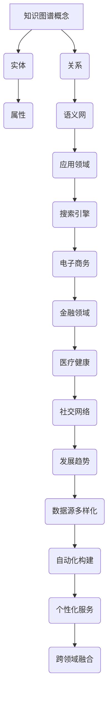

                 

### 文章标题

# 《知识图谱的可视化设计：交互式可视化和可视分析》

### 文章关键词

知识图谱，可视化设计，交互式可视化，可视分析，数据科学，商业分析，教育领域，健康医疗领域。

### 文章摘要

本文系统地探讨了知识图谱的可视化设计，涵盖了从基础知识到高级应用的全景视图。文章首先介绍了知识图谱的概念、作用和重要性，随后详细阐述了知识图谱的构建方法，包括数据源的获取与清洗、实体识别与关系抽取、知识融合与质量评估。接着，文章深入讨论了知识图谱可视化技术的基础，包括可视化技术的原理、挑战和常见类型，以及交互式可视化和可视化分析的方法。在此基础上，文章展示了知识图谱可视化在多个领域的应用，如数据科学、商业分析、教育领域和健康医疗领域。最后，文章介绍了主流知识图谱可视化工具和平台的构建，包括需求分析、架构设计、开发与实现等关键步骤。通过本文，读者可以全面了解知识图谱可视化设计的理论与实践，为实际应用提供指导。

----------------------------------------------------------------

### 第一部分：知识图谱概述

## 第1章：知识图谱的概念与重要性

### 1.1 知识图谱的定义

#### 1.1.1 知识图谱的定义

知识图谱（Knowledge Graph）是一种用于表示实体及其相互关系的图形结构。它是通过将现实世界中的事物和它们之间的关系建模成图，从而构建出一个全面、准确、可扩展的知识表示系统。

在数学上，知识图谱可以用以下形式表示：

$$
G = (V, E)
$$

其中，$V$ 表示实体集（Vertices），即知识图谱中的节点，代表现实世界中的对象，如人、地点、事物等；$E$ 表示边集（Edges），代表实体之间的某种关系，如朋友、属于、位于等。

#### 1.1.2 知识图谱的组成元素

知识图谱由三个主要的组成元素构成：实体、属性和关系。

- **实体（Entity）**：是知识图谱中的核心元素，代表现实世界中的对象，如人、地点、事物等。实体通常具有唯一的标识符（ID）。
- **属性（Attribute）**：描述实体的特征，如姓名、年龄、身高、颜色等。属性通常与实体之间存在关联关系。
- **关系（Relationship）**：表示实体之间的相互关系，如朋友、工作于、位于等。关系通常具有方向性和权重。

#### 1.1.3 知识图谱与语义网的区别

知识图谱和语义网（Semantic Web）是两个相关但不同的概念。

- **语义网**：是一种基于 Web 的知识表示框架，旨在通过将数据标记为具有明确意义的语义，使得 Web 数据更加结构化和可解释。语义网的核心是 RDF（Resource Description Framework）。
- **知识图谱**：是一种具体的实现技术，它通过将现实世界中的对象和它们之间的关系建模为图，为语义网提供了更加直观和高效的表示方式。

### 1.2 知识图谱的作用和优势

#### 1.2.1 知识图谱的作用

知识图谱在许多领域具有广泛的应用，其主要作用包括：

- **智能搜索与推荐**：通过知识图谱，搜索引擎可以提供更加精准和个性化的搜索结果，通过实体和关系的关联，实现语义搜索。
- **数据整合与融合**：知识图谱可以帮助整合来自不同来源的数据，实现数据的关联和融合，从而提供更加全面和一致的数据视图。
- **决策支持**：知识图谱可以作为决策支持系统的基础，提供更加全面和准确的数据分析，从而帮助做出更好的决策。

#### 1.2.2 知识图谱的优势

知识图谱相较于传统的数据表示方法，具有以下几个显著的优势：

- **语义丰富**：知识图谱通过实体、属性和关系的组合，可以表达复杂的语义信息，使得数据具有更高的语义理解和应用价值。
- **结构化数据**：知识图谱将数据组织成图结构，使得数据更加结构化，便于计算机处理和分析。
- **可扩展性**：知识图谱可以根据需要添加新的实体和关系，从而实现知识库的动态扩展。

### 1.3 知识图谱的分类

知识图谱可以根据不同的分类标准进行分类，以下是几种常见的分类方法：

#### 1.3.1 按照应用领域分类

- **通用知识图谱**：这类知识图谱覆盖广泛领域，如 Freebase、DBpedia 等。
- **领域知识图谱**：这类知识图谱针对特定领域，如医学术语图谱、地理知识图谱等。

#### 1.3.2 按照知识来源分类

- **手动构建**：通过专业人员的知识积累和人工标注构建。
- **自动生成**：通过机器学习算法从大量数据中自动抽取知识。

#### 1.3.3 按照知识表示方法分类

- **基于规则的图谱**：通过定义一系列规则来描述实体和关系。
- **基于本体的图谱**：采用本体论方法，通过定义概念、属性和关系来组织知识。

### 1.4 知识图谱的应用领域

知识图谱在多个领域都有广泛的应用，以下是其中几个主要的应用领域：

#### 1.4.1 搜索引擎

通过知识图谱，搜索引擎可以提供更加精准和个性化的搜索结果。例如，当用户搜索某个实体时，搜索引擎可以利用知识图谱提供的实体和关系信息，返回与该实体相关的更多详细信息。

#### 1.4.2 电子商务

知识图谱可以帮助电子商务平台更好地理解用户需求，提供个性化推荐和服务。例如，通过分析用户的历史购买行为和知识图谱中的实体关系，电子商务平台可以推荐相关的商品。

#### 1.4.3 金融领域

知识图谱在金融领域有广泛的应用，如风险评估、信用评估等。通过知识图谱，金融机构可以更好地理解客户的信用历史、财务状况等信息，从而做出更准确的评估。

#### 1.4.4 医疗健康

知识图谱可以帮助医疗健康领域实现精准医疗。例如，通过知识图谱，医生可以更好地理解患者的病史、药物反应等信息，从而提供更精确的诊断和治疗方案。

#### 1.4.5 社交网络

知识图谱可以用于社交网络平台，分析社交网络中的结构和关系。例如，通过分析用户之间的朋友关系，社交网络平台可以推荐潜在的朋友或活动。

### 1.5 知识图谱的发展趋势

知识图谱技术的发展趋势包括以下几个方面：

#### 1.5.1 数据源多样化

随着物联网、大数据等技术的发展，知识图谱的数据源将越来越多样化，涵盖更多领域的知识。

#### 1.5.2 自动化构建

未来知识图谱的构建将更加自动化，通过机器学习和数据挖掘技术，从大量数据中自动抽取知识。

#### 1.5.3 个性化服务

知识图谱将更多地应用于个性化服务领域，通过精准的知识表示和关联，提供个性化的信息和服务。

#### 1.5.4 跨领域融合

知识图谱将在不同领域之间实现融合，通过跨领域的知识关联，提供更加全面和深入的智能服务。

### 1.6 小结

知识图谱是一种重要的知识表示方法，具有丰富的语义表达和强大的数据挖掘能力。它将在各个领域得到广泛应用，推动人工智能和大数据技术的发展。

### Mermaid 流程图

### 第2章：知识图谱的构建方法

## 第2章：知识图谱的构建方法

### 2.1 数据源的获取与清洗

#### 2.1.1 数据源类型

构建知识图谱的第一步是获取数据源。数据源可以是结构化数据（如关系数据库、数据仓库）、半结构化数据（如 XML、JSON）或非结构化数据（如文本、图片、音频、视频）。以下是几种常见的数据源类型：

- **结构化数据**：通常存储在关系数据库中，如 MySQL、PostgreSQL 等。结构化数据具有明确的表结构，便于查询和分析。
- **非结构化数据**：包括文本、图片、音频、视频等。非结构化数据通常需要经过预处理和转换才能被有效利用。
- **半结构化数据**：如 XML、JSON 等，具有部分结构化的特点，但不像结构化数据那样严格。

#### 2.1.2 数据获取方法

- **网络爬虫**：通过网络爬虫从互联网上获取数据。常见的爬虫工具有 BeautifulSoup、Scrapy 等。
- **API 接口**：通过第三方数据提供商的 API 接口获取数据。例如，使用 Google Maps API 获取地理数据，使用 OpenWeatherMap API 获取天气数据等。
- **数据采购**：购买商业数据集或公开的数据集。例如，使用 Kaggle 网站购买数据集。

#### 2.1.3 数据清洗

数据清洗是构建知识图谱的重要步骤，目的是去除数据中的噪声和错误，提高数据质量。以下是几种常见的数据清洗方法：

- **缺失值处理**：对于缺失的数据，可以选择填充、删除或忽略。
- **重复数据删除**：去除重复的记录，以避免数据冗余。
- **数据格式化**：统一数据格式，如将日期格式转换为 YYYY-MM-DD。
- **数据去重**：对于具有多个属性的数据集，通过比较关键属性（如 ID）来删除重复的记录。

### 2.2 实体识别与关系抽取

#### 2.2.1 实体识别

实体识别（Entity Recognition）是从文本数据中识别出实体（如人名、地点、组织等）的过程。以下是几种常见的实体识别方法：

- **基于词典的方法**：通过预定义的词典来识别实体。例如，使用地名词典来识别地点实体。
- **基于规则的方法**：利用预定义的规则来识别实体。例如，根据特定语法结构来识别人名实体。
- **基于机器学习的方法**：使用机器学习算法（如决策树、支持向量机、朴素贝叶斯等）来识别实体。

#### 2.2.2 关系抽取

关系抽取（Relationship Extraction）是从文本数据中识别出实体之间的关系的

