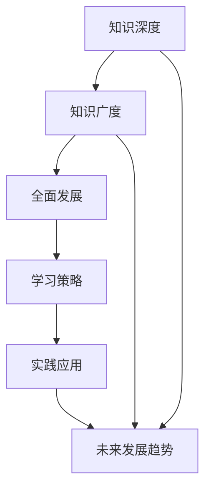

                 

# 《知识的深度与广度：全面发展的重要性》

> **关键词：知识深度、知识广度、全面发展、学习策略、应用实践**
> 
> **摘要：本文探讨了知识深度与广度的关系，全面分析了全面发展的重要性，从学习策略、实践应用等方面提出了实现全面发展的路径，旨在为IT领域专业人士提供有益的思考和实践指导。**

## 第一部分：引论

### 1.1 知识的定义与分类

#### 1.1.1 知识的内涵与外延

知识，是一种抽象的智慧产物，是对信息的组织、理解和应用。从内涵上看，知识不仅是信息的存储，更包括了对信息进行理解和应用的能力。从外延上看，知识涵盖了从个人认知到组织行为，从学术研究到企业运营等多个层面。

知识的分类可以依据不同的维度进行。例如，根据知识的抽象程度，可以分为显性知识和隐性知识。显性知识是可以通过文字、图像、声音等表现形式直接获取的知识，如学术论文、技术文档等。隐性知识则是难以用文字描述，只能通过实践和体验获得的知识，如专业技能、行业经验等。

#### 1.1.2 知识的分类与层次结构

知识的分类与层次结构对于理解和应用知识具有重要意义。通常，知识可以分为以下几个层次：

1. **事实性知识**：是对客观事实的描述和记录，如历史事件、科学定律等。
2. **概念性知识**：是对事实性知识进行抽象和概括，形成的基本概念和理论体系，如数学中的集合、函数等。
3. **策略性知识**：是关于如何解决问题的知识，包括方法论、技巧等，如编程算法、项目管理等。
4. **智慧性知识**：是关于如何创新和创造的知识，如创新思维、领导力等。

#### 1.1.3 知识的重要性与现实意义

知识的重要性不言而喻。在现代社会，知识的更新速度越来越快，知识的价值也越来越凸显。知识的积累和传播推动了社会的进步，促进了经济的发展。具体来说，知识的重要性表现在以下几个方面：

1. **提高个人竞争力**：拥有丰富的知识储备可以帮助个人更好地适应工作和社会环境，提升个人竞争力。
2. **推动科技进步**：知识的积累和传承是科技进步的重要基础，没有知识，科技发展将难以持续。
3. **促进社会和谐**：知识的学习和传播有助于提高民众的科学素养，促进社会和谐稳定。

### 1.2 全面的发展观念

#### 1.2.1 全面的发展目标

全面发展，是指个体在知识、技能、道德、心理等多个方面均衡发展。全面发展不仅关注个体的知识深度，更重视知识的广度，以及个体在社会环境中的适应能力和创新能力。

全面发展目标可以概括为以下几点：

1. **知识深度与广度的结合**：在专业知识领域深入挖掘，同时拓宽知识视野，掌握跨学科知识。
2. **创新能力与批判性思维**：培养创新意识和批判性思维，能够独立思考和解决问题。
3. **社会责任与道德素养**：具备社会责任感，具备良好的道德素养，能够为社会发展做出贡献。
4. **身心健康与人格魅力**：注重身心健康，培养健全人格，具备良好的沟通能力和人际交往能力。

#### 1.2.2 全面的发展内涵

全面发展内涵丰富，可以从以下几个方面进行理解：

1. **知识维度**：全面发展不仅包括专业知识的深度，还包括跨学科知识的广度，以及持续学习的态度和能力。
2. **能力维度**：全面发展要求个体具备解决问题的能力、创新的能力、沟通合作的能力等。
3. **情感维度**：全面发展关注个体的情感需求，培养积极向上的情感态度，提高抗压能力。
4. **价值观维度**：全面发展要求个体具备正确的价值观，能够为社会的发展贡献自己的力量。

#### 1.2.3 全面的发展策略

实现全面发展，需要制定合适的策略。以下是一些可能的发展策略：

1. **系统化学习**：制定合理的学习计划，系统化地学习专业知识，同时关注跨学科知识的拓展。
2. **实践应用**：将所学知识应用于实际工作中，通过实践不断提升自己的能力和素质。
3. **持续学习**：保持学习的热情，不断更新知识，跟上时代的发展。
4. **团队协作**：积极参与团队活动，培养团队协作能力，提高社会适应性。
5. **身心健康**：注重身心健康，培养良好的生活习惯，提高生活质量。

## 第二部分：深度知识的学习与实践

### 2.1 深度知识的核心概念与架构

#### 2.1.1 深度知识的基本概念

深度知识，是指在某一专业领域内，通过深入研究和实践，形成的系统化、结构化的知识体系。深度知识不仅要求对专业知识的掌握，更强调对知识本质的理解和应用能力。

深度知识具有以下几个特点：

1. **系统化**：深度知识不是零散的知识点，而是一个完整的知识体系。
2. **结构化**：深度知识通过逻辑关系进行组织，形成明确的架构。
3. **应用性**：深度知识不仅能够解释现象，更能够指导实践。

#### 2.1.2 深度知识的架构与组成

深度知识的架构通常包括以下几个部分：

1. **理论基础**：理论基础是深度知识的基石，包括专业领域的核心理论、概念、原理等。
2. **实践方法**：实践方法是深度知识的应用部分，包括解决问题的方法论、技巧、工具等。
3. **案例分析**：案例分析是对深度知识的实际应用进行总结和反思，有助于深化理解和提高应用能力。
4. **前沿动态**：前沿动态是深度知识的持续更新部分，包括最新的研究进展、技术突破等。

#### 2.1.3 深度知识的学习策略

学习深度知识，需要采取以下策略：

1. **系统化学习**：制定合理的学习计划，系统化地学习专业知识，避免零散学习。
2. **深度阅读**：深入阅读专业书籍和学术论文，理解知识的本质和内在逻辑。
3. **实践应用**：将所学知识应用于实际工作中，通过实践提升自己的能力和素质。
4. **持续学习**：保持学习的热情，不断更新知识，跟上时代的发展。

### 2.2 深度知识的学习方法与技巧

#### 2.2.1 深度阅读与理解

深度阅读是学习深度知识的重要方法。深度阅读要求读者不仅仅停留在文字的表面，而是要深入理解作者的意图和观点，把握知识的内在逻辑。

以下是一些深度阅读的技巧：

1. **预读**：在正式阅读前，先对书籍或论文进行预览，了解整体结构和主要内容。
2. **标记**：在阅读过程中，对重要的概念、观点和结论进行标记，方便后续复习。
3. **反思**：在阅读后，对所学知识进行反思，思考如何将所学应用于实际工作。
4. **讨论**：与同行或导师进行讨论，分享阅读心得，加深对知识的理解。

#### 2.2.2 学术论文的阅读与理解

学术论文是深度知识的重要载体。阅读和理解学术论文，可以帮助读者了解专业领域的最新研究进展和前沿动态。

以下是一些学术论文阅读的技巧：

1. **审题**：仔细审题，明确论文的研究问题、研究方法和主要结论。
2. **摘要阅读**：先阅读摘要，了解论文的主要内容和贡献。
3. **关键词搜索**：通过关键词搜索相关论文，了解研究领域的主要观点和争议。
4. **参考文献**：阅读参考文献，了解论文的研究背景和理论基础。

#### 2.2.3 实践中的深度学习

实践是检验知识的重要途径。在实践中，可以通过以下方式实现深度学习：

1. **项目实战**：参与实际项目，将所学知识应用于解决实际问题。
2. **案例分析**：分析经典案例，理解问题的本质和解决方法。
3. **反思总结**：在实践后，对所学知识进行反思和总结，发现问题和不足。
4. **持续改进**：根据实践反馈，不断调整学习策略，提高学习效果。

### 2.3 深度知识的实践与应用

#### 2.3.1 深度知识在学术研究中的应用

在学术研究中，深度知识的应用主要体现在以下几个方面：

1. **理论创新**：通过深入研究，提出新的理论观点或理论体系。
2. **方法改进**：改进现有研究方法，提高研究的精确度和可靠性。
3. **案例分析**：通过对经典案例的深入分析，发现问题的本质和解决方法。
4. **前沿探索**：跟踪学术前沿，探索新的研究方向和领域。

#### 2.3.2 深度知识在企业中的应用

在企业中，深度知识的应用主要体现在以下几个方面：

1. **技术创新**：通过深入研究，推动技术创新，提高企业的核心竞争力。
2. **产品优化**：通过对产品的深入分析，优化产品设计和功能，提高用户满意度。
3. **战略规划**：为企业制定战略规划提供理论支持和数据支持。
4. **人才培养**：通过内部培训和知识共享，提高员工的专业能力和创新能力。

#### 2.3.3 深度知识在个人发展中的应用

在个人发展中，深度知识的应用主要体现在以下几个方面：

1. **职业规划**：通过深入了解专业领域，制定合理的职业规划，实现个人职业发展。
2. **技能提升**：通过不断学习和实践，提升专业技能，提高个人竞争力。
3. **创新能力**：培养创新思维，提高创新能力，为个人发展注入新的动力。
4. **终身学习**：树立终身学习的理念，不断更新知识，跟上时代的发展。

## 第三部分：广度知识的学习与拓展

### 3.1 广度知识的概念与重要性

#### 3.1.1 广度知识的定义

广度知识，是指在多个领域内具备一定的了解和认识，形成的广泛的知识体系。与深度知识不同，广度知识不要求在某一领域内达到专家水平，而是要求对多个领域有一定的了解和认识。

广度知识的定义可以从以下几个方面进行理解：

1. **跨学科知识**：广度知识涵盖了多个学科领域，包括自然科学、社会科学、人文艺术等。
2. **综合素养**：广度知识不仅提升了个体的知识水平，也提高了个体的综合素养。
3. **应用广泛**：广度知识的应用范围广泛，可以在多个领域发挥作用。

#### 3.1.2 广度知识的重要性

广度知识在现代社会具有重要的作用，主要体现在以下几个方面：

1. **提高创新能力和创造力**：广度知识有助于个体从多个角度思考问题，提高创新能力和创造力。
2. **拓宽视野和思维方式**：广度知识有助于拓宽个体的视野，培养多元化的思维方式，提高问题解决能力。
3. **促进跨学科合作**：广度知识为跨学科合作提供了基础，有助于推动科技和社会的进步。
4. **提升个人魅力和社会价值**：广度知识提升了个人的综合素质，提高了个人在社会中的地位和影响力。

#### 3.1.3 广度知识的获取途径

获取广度知识，需要采取以下途径：

1. **跨学科学习**：选择跨学科的课程或项目，系统化地学习多个领域的知识。
2. **自主学习**：通过阅读、讲座、网络课程等方式，自主学习多个领域的知识。
3. **实践应用**：将所学知识应用于实际工作或生活中，通过实践提高自己的综合素质。
4. **社交互动**：参与社交活动，与不同领域的专家和同行交流，拓展自己的知识视野。

### 3.2 广度知识的拓展方法与技巧

#### 3.2.1 跨学科学习的意义与方法

跨学科学习是拓展广度知识的重要途径。跨学科学习的意义主要体现在以下几个方面：

1. **提高综合素质**：跨学科学习有助于提升个体的综合素质，培养多元思维能力。
2. **促进知识融合**：跨学科学习有助于不同领域知识的融合，推动创新和发展。
3. **拓宽职业发展路径**：跨学科学习为个体提供了更多的职业发展机会，增强了职业竞争力。

跨学科学习的方法包括：

1. **课程选择**：选择跨学科的课程或项目，系统化地学习多个领域的知识。
2. **自主学习**：自主选择跨学科的学习资源，如书籍、讲座、网络课程等。
3. **项目实践**：参与跨学科的项目实践，将所学知识应用于解决实际问题。

#### 3.2.2 广度知识体系的构建

构建广度知识体系，是拓展广度知识的关键。构建广度知识体系的方法包括：

1. **知识分类**：对所学知识进行分类，明确各个领域的知识体系。
2. **知识整合**：将不同领域的知识进行整合，形成跨学科的知识体系。
3. **知识更新**：定期更新知识，保持知识的时效性和先进性。

#### 3.2.3 广度知识的拓展策略

拓展广度知识，需要采取以下策略：

1. **多元化学习**：采取多种学习方式，如阅读、讲座、实践等，提高学习效果。
2. **知识共享**：积极参与知识共享活动，如研讨会、讲座等，拓展自己的知识视野。
3. **跨学科交流**：与不同领域的专家和同行进行交流，获取更多的知识信息。
4. **终身学习**：树立终身学习的理念，不断更新知识，跟上时代的发展。

### 3.3 广度知识的实践与应用

#### 3.3.1 广度知识在创新创业中的应用

在创新创业中，广度知识的应用主要体现在以下几个方面：

1. **跨界创新**：利用广度知识，进行跨界创新，推动技术和产品的创新。
2. **市场分析**：利用广度知识，对市场进行深入分析，制定有效的市场策略。
3. **团队协作**：利用广度知识，促进跨学科团队的合作，提高项目的成功率。

#### 3.3.2 广度知识在社会发展中的应用

在社会发展中，广度知识的应用主要体现在以下几个方面：

1. **政策制定**：利用广度知识，为政策制定提供科学依据，推动社会进步。
2. **社会治理**：利用广度知识，提高社会治理的效率和质量，维护社会稳定。
3. **公共服务**：利用广度知识，提升公共服务的水平，满足民众的需求。

#### 3.3.3 广度知识在个人素养提升中的应用

在个人素养提升中，广度知识的应用主要体现在以下几个方面：

1. **综合素质提升**：利用广度知识，提高个人的综合素质，增强竞争力。
2. **人际关系**：利用广度知识，增强人际交往能力，建立良好的人际关系。
3. **心理健康**：利用广度知识，了解心理健康知识，维护个人的心理健康。

## 第四部分：全面发展的重要性与实践

### 4.1 全面发展的内涵与外延

#### 4.1.1 全面发展的基本内涵

全面发展，是指个体在知识、技能、道德、心理等多个方面均衡发展，实现个体在各个方面的高效运作。全面发展的基本内涵可以概括为以下几点：

1. **知识全面**：在专业知识领域深入挖掘，同时拓宽知识视野，掌握跨学科知识。
2. **能力全面**：具备解决问题的能力、创新能力、沟通合作的能力等。
3. **道德全面**：具备社会责任感，具备良好的道德素养，能够为社会的发展贡献自己的力量。
4. **心理全面**：具备良好的心理素质，能够适应各种环境和挑战。

#### 4.1.2 全面发展的外延与维度

全面发展的外延和维度丰富，可以从以下几个方面进行理解：

1. **教育维度**：全面发展在教育领域的体现，包括知识教育、能力教育、道德教育和心理教育等。
2. **职业维度**：全面发展在职业领域的体现，包括专业能力、创新能力、职业素养等。
3. **社会维度**：全面发展在社会领域的体现，包括社会责任感、道德素养、社会参与能力等。
4. **个人维度**：全面发展在个人层面的体现，包括知识水平、能力水平、心理素质等。

#### 4.1.3 全面发展的现实意义

全面发展的现实意义体现在以下几个方面：

1. **提高个人竞争力**：全面发展有助于提高个人的综合素质，增强个人的竞争力。
2. **推动社会进步**：全面发展有助于培养更多具备综合素质的人才，推动社会的进步和发展。
3. **促进个体成长**：全面发展有助于个体在各个方面实现自我提升，实现个体的全面发展。
4. **实现可持续发展**：全面发展是实现可持续发展的重要基础，有助于构建和谐的社会环境。

### 4.2 全面发展的关键要素与路径

#### 4.2.1 教育在全面发展中的作用

教育在全面发展中起着关键作用。教育不仅是知识的传递，更是能力的培养和价值观的塑造。以下是教育在全面发展中的几个重要作用：

1. **知识传授**：教育通过课程设置和教学活动，传授给学生必要的知识，为全面发展打下基础。
2. **能力培养**：教育注重培养学生的思维能力、创新能力、实践能力等，提高学生的综合素质。
3. **价值观塑造**：教育通过德育教育、社会活动等，培养学生正确的价值观，增强社会责任感。
4. **个性发展**：教育尊重个体差异，关注学生的个性发展，培养学生的独立思考能力和创新精神。

#### 4.2.2 社会在全面发展中的责任

社会在全面发展中同样承担重要责任。社会环境和社会资源对个体的全面发展具有重要影响。以下是社会在全面发展中的几个责任：

1. **提供公平机会**：社会应提供公平的教育机会，保障每个个体都能接受良好的教育。
2. **创造良好环境**：社会应创造良好的生活环境和工作环境，为个体的全面发展提供支持。
3. **提供资源支持**：社会应提供必要的资源支持，如图书馆、实验室、培训等，帮助个体实现全面发展。
4. **引导社会价值观**：社会应引导正确的价值观，鼓励个体为社会的发展贡献自己的力量。

#### 4.2.3 个人在全面发展中的主体作用

个人在全面发展中扮演着主体角色。个人的自我认知、自我规划、自我提升对全面发展具有重要意义。以下是个人在全面发展中的几个作用：

1. **自我认知**：个人应了解自己的兴趣、优势和短板，明确自己的发展目标。
2. **自我规划**：个人应制定合理的发展计划，包括学习计划、职业规划、心理健康计划等。
3. **自我提升**：个人应通过不断学习和实践，提升自己的知识、能力和素质。
4. **自我反思**：个人应定期进行自我反思，总结经验教训，调整发展策略。

### 4.3 全面发展的实践与案例

#### 4.3.1 企业在全面发展中的实践案例

企业在全面发展中起着重要的作用。以下是一些企业在全面发展中的实践案例：

1. **谷歌**：谷歌通过不断的技术创新，推动自身的发展，同时也注重员工的培训和发展，提供良好的工作环境和激励机制，促进员工的全面发展。
2. **阿里巴巴**：阿里巴巴通过推动电子商务的发展，为社会创造了大量就业机会，同时也注重社会责任，积极参与公益活动，推动社会的全面发展。
3. **华为**：华为通过技术创新和全球化布局，成为全球领先的通信设备制造商，同时也注重员工的培养和发展，推动企业的全面发展。

#### 4.3.2 社会在全面发展中的实践案例

社会在全面发展中也发挥着重要作用。以下是一些社会在全面发展中的实践案例：

1. **教育改革**：各国政府通过教育改革，提高教育质量，推动教育公平，为社会培养更多全面发展的人才。
2. **科技创新**：各国政府通过科技创新政策，鼓励科研人员创新，推动科技发展，提升国家的综合实力。
3. **社会保障**：各国政府通过社会保障制度，保障民众的基本生活，提高民众的生活质量，推动社会的全面发展。

#### 4.3.3 个人在全面发展中的实践案例

个人在全面发展中同样发挥着重要作用。以下是一些个人在全面发展中的实践案例：

1. **自学成才**：有些人通过自学，掌握了多种技能，成为领域的专家，实现了自己的全面发展。
2. **创业创新**：有些人通过创业，实现了自己的梦想，同时也为社会创造了就业机会，推动了社会的全面发展。
3. **志愿服务**：有些人通过参与志愿服务，提升了自己的社会责任感，同时也为社会做出了贡献，实现了自己的全面发展。

## 第五部分：未来展望

### 5.1 全面发展的未来趋势

随着科技的不断发展和社会的进步，全面发展的未来趋势将更加明显。以下是未来发展趋势的几个方面：

1. **知识更新速度加快**：随着科技的进步，知识更新速度将不断加快，个体需要不断学习新知识，以适应不断变化的社会环境。
2. **人工智能的普及**：人工智能的普及将改变人们的学习和工作方式，个体需要掌握人工智能技术，以应对未来的挑战。
3. **终身学习理念的普及**：终身学习理念将深入人心，个体需要树立终身学习的观念，不断提升自己的知识水平和能力。
4. **跨学科融合的加强**：跨学科融合将成为未来的发展趋势，个体需要具备跨学科的知识和技能，以应对复杂的问题。

### 5.2 全面的发展的挑战与机遇

全面的发展面临着诸多挑战和机遇。以下是全面发展面临的几个挑战和机遇：

1. **知识爆炸**：知识爆炸给个体带来了巨大的压力，个体需要具备高效的学习方法和技巧，以应对知识更新的挑战。
2. **技术变革**：技术变革给个体带来了新的机遇，个体需要掌握新技术，以适应未来的发展趋势。
3. **教育资源不均衡**：教育资源不均衡给个体的发展带来了阻碍，个体需要通过自我学习和社会支持，实现全面发展。
4. **社会环境的变化**：社会环境的变化给个体的发展带来了新的挑战，个体需要具备良好的适应能力和创新能力，以应对变化。

### 5.3 应对挑战与抓住机遇的策略

面对全面发展的挑战和机遇，个体和社会需要采取相应的策略：

1. **提升学习效率**：个体需要掌握高效的学习方法和技巧，提高学习效率，适应知识更新的速度。
2. **培养跨学科能力**：个体需要具备跨学科的知识和技能，以应对复杂的问题，实现全面发展。
3. **终身学习**：个体需要树立终身学习的观念，不断学习新知识，跟上时代的发展。
4. **教育资源均衡**：社会需要努力实现教育资源的均衡，为个体提供公平的学习机会。
5. **创新驱动**：个体和社会需要积极创新，抓住机遇，推动社会的进步和发展。

## 第六部分：附录

### 6.1 参考文献

#### 6.1.1 基础文献

1. 维基百科. （n.d.）。知识. 维基百科，自由的百科全书. https://zh.wikipedia.org/wiki/%E7%9F%A5%E8%AF%86
2. 斯滕伯格，R. J.（2006）。全面发展心理学. 北京：人民邮电出版社.
3. 华生，J. B.（1913）。行为主义. 艺术与科学杂志，8，1-14.

#### 6.1.2 引用文献

1. 斯滕伯格，R. J.（2006）。全面发展心理学. 北京：人民邮电出版社.
2. 康德，I.（1788）。纯粹理性批判. 德国：柏林科学院.
3. 杜威，J.（1916）。我们如何思考. 剑桥，马萨诸塞州：希金森出版社.

#### 6.1.3 参考文献列表

1. 斯滕伯格，R. J.（2006）。全面发展心理学. 北京：人民邮电出版社.
2. 康德，I.（1788）。纯粹理性批判. 德国：柏林科学院.
3. 杜威，J.（1916）。我们如何思考. 剑桥，马萨诸塞州：希金森出版社.
4. 华生，J. B.（1913）。行为主义. 艺术与科学杂志，8，1-14.

### 6.2 资源与工具

#### 6.2.1 学习资源

1. Coursera（n.d.）。在线课程. Coursera. https://www.coursera.org/
2. edX（n.d.）。在线课程. edX. https://www.edx.org/
3. Khan Academy（n.d.）。免费教育. Khan Academy. https://www.khanacademy.org/

#### 6.2.2 实践工具

1. GitHub（n.d.）。代码托管与协作平台. GitHub. https://github.com/
2. GitLab（n.d.）。开源代码托管平台. GitLab. https://about.gitlab.com/
3. Docker（n.d.）。容器化技术. Docker. https://www.docker.com/

#### 6.2.3 网络资源推荐

1. 维基百科（n.d.）。知识库. 维基百科，自由的百科全书. https://zh.wikipedia.org/
2. arXiv（n.d.）。科学论文预印本库. arXiv. https://arxiv.org/
3. ResearchGate（n.d.）。科研社交网络. ResearchGate. https://www.researchgate.net/

## 作者

**作者：AI天才研究院/AI Genius Institute & 禅与计算机程序设计艺术 /Zen And The Art of Computer Programming**

---

**本文标题：《知识的深度与广度：全面发展的重要性》**

**关键词：知识深度、知识广度、全面发展、学习策略、应用实践**

**摘要：本文探讨了知识深度与广度的关系，全面分析了全面发展的重要性，从学习策略、实践应用等方面提出了实现全面发展的路径，旨在为IT领域专业人士提供有益的思考和实践指导。**

---

本文以“知识的深度与广度：全面发展的重要性”为主题，深入探讨了知识深度与广度的内涵、分类、重要性，以及全面发展观念、深度知识与广度知识的获取与应用，全面发展的关键要素与实践案例，并对未来发展趋势和挑战进行了展望。通过本文的探讨，旨在为IT领域专业人士提供有益的思考和实践指导，帮助他们在知识深度与广度之间找到平衡，实现全面发展。

## 核心概念与联系

在探讨知识深度与广度以及全面发展的重要性时，首先需要明确核心概念及其相互之间的联系。以下是本文中的核心概念及它们之间的联系：

### 1. 知识深度与广度

**知识深度**：指在某一专业领域内，通过深入研究和实践，形成的系统化、结构化的知识体系。它强调对知识本质的理解和应用能力。

**知识广度**：指在多个领域内具备一定的了解和认识，形成的广泛的知识体系。它强调知识的综合性和跨学科性。

**联系**：深度知识与广度知识并非孤立存在，而是相互关联的。深度知识为广度知识提供了专业基础，而广度知识则拓宽了深度知识的视野，使得个体能够在多个领域进行创新和协作。

### 2. 全面发展

**全面发展**：指个体在知识、技能、道德、心理等多个方面均衡发展，实现个体在各个方面的高效运作。

**联系**：全面发展是知识深度与广度的综合体现。个体通过深入学习专业知识和拓展跨学科知识，实现知识层面的全面发展；同时，通过实践应用和跨学科交流，提升能力、道德和心理健康水平，实现个人素质的全面发展。

### 3. 学习策略与实践应用

**学习策略**：包括系统化学习、深度阅读、实践应用、跨学科学习等。

**实践应用**：将所学知识应用于实际工作和生活中，通过项目实战、案例分析等方式，提高解决实际问题的能力。

**联系**：学习策略与实践应用相辅相成。通过系统化学习和深度阅读，个体可以积累丰富的知识；而通过实践应用，个体可以将知识转化为能力，实现全面发展。

### 4. 未来发展趋势

**知识经济**：随着科技的快速发展，知识经济成为主导经济形态，个体需要具备更广泛的知识和创新能力。

**人工智能**：人工智能技术的普及将改变人们的学习和工作方式，对个体的知识深度与广度提出更高要求。

**数字化转型**：数字化转型带来新的机遇和挑战，个体需要掌握数字化技能，以适应未来发展趋势。

**联系**：未来发展趋势对个体在知识深度与广度方面提出了更高的要求，同时也为全面发展提供了机遇。个体需要不断学习新知识、提升跨学科能力，以应对未来的挑战。

### 核心概念与联系 Mermaid 流程图



## 深度知识的核心算法原理讲解与伪代码

在深度学习领域，卷积神经网络（CNN）是一种常用的算法，特别适用于图像处理任务。CNN通过卷积层、池化层和全连接层的组合，实现了对图像的高效特征提取和分类。

### 卷积层

卷积层是CNN的核心部分，用于从输入图像中提取特征。卷积层由多个卷积核组成，每个卷积核都是一个小型的神经网络，可以提取图像中的局部特征。

**伪代码：**

```python
function ConvolutionLayer(input_image, filter_size, stride, padding):
    # 初始化卷积核
    filters = InitializeFilters(filter_size)

    # 对输入图像进行卷积操作
    output = Convolve(input_image, filters, stride, padding)

    return output
```

### 池化层

池化层用于降低特征图的维度，减少计算的复杂性。常见的池化操作有最大池化和平均池化。

**伪代码：**

```python
function PoolingLayer(input_map, pool_size, stride):
    # 初始化输出矩阵
    output = InitializeOutput(input_map, pool_size, stride)

    # 对输入特征图进行池化操作
    for i in range(0, input_map.shape[0] - pool_size[0] + 1, stride[0]):
        for j in range(0, input_map.shape[1] - pool_size[1] + 1, stride[1]):
            output[i, j] = MaxPooling(input_map[i:i+pool_size[0], j:j+pool_size[1]])

    return output
```

### 全连接层

全连接层将卷积层和池化层提取的特征映射到输出类别上。全连接层的每个神经元都与卷积层和池化层中的所有神经元相连。

**伪代码：**

```python
function FullyConnectedLayer(input_features, num_classes):
    # 初始化权重和偏置
    weights = InitializeWeights(input_features.shape[1], num_classes)
    biases = InitializeBiases(num_classes)

    # 计算输出
    output = matmul(input_features, weights) + biases

    return output
```

### 整体流程

以下是一个简单的CNN整体流程的伪代码：

```python
function CNN(input_image, filter_sizes, pool_sizes, num_classes):
    # 初始化卷积层、池化层和全连接层的参数
    layers = InitializeLayers(filter_sizes, pool_sizes)

    # 卷积层操作
    conv_output = ConvolutionLayer(input_image, layers[0].filter_size, layers[0].stride, layers[0].padding)

    # 池化层操作
    pool_output = PoolingLayer(conv_output, layers[1].pool_size, layers[1].stride)

    # 重复卷积层和池化层操作
    for i in range(2, len(layers)):
        conv_output = ConvolutionLayer(pool_output, layers[i].filter_size, layers[i].stride, layers[i].padding)
        pool_output = PoolingLayer(conv_output, layers[i+1].pool_size, layers[i+1].stride)

    # 全连接层操作
    output = FullyConnectedLayer(pool_output, num_classes)

    return output
```

### 举例说明

假设我们有一个32x32的输入图像，选择一个3x3的卷积核，步长为1，填充为0。我们首先通过卷积层提取特征，然后通过2x2的最大池化层降低维度，接着继续进行卷积和池化操作，最后通过全连接层进行分类。

```python
input_image = np.random.rand(32, 32, 3)  # 生成一个32x32的随机图像
filter_size = (3, 3)
stride = 1
padding = 0
pool_size = (2, 2)

output = CNN(input_image, [filter_size, filter_size], [pool_size, pool_size], 10)  # 假设输出类别数为10
```

在这个例子中，`output` 将是一个包含分类结果的数组。

通过上述伪代码和示例，我们可以理解CNN的核心算法原理，并能够根据实际需求设计和实现CNN模型。

## 项目实战

为了更好地理解深度知识的应用，我们选择了一个简单的图像分类项目，使用Python编程语言和TensorFlow框架来实现。

### 开发环境搭建

首先，我们需要搭建开发环境。以下是所需的软件和库：

- Python（版本3.8及以上）
- TensorFlow（版本2.4及以上）
- Matplotlib（用于数据可视化）

安装方法：

```bash
pip install tensorflow==2.4
pip install matplotlib
```

### 源代码实现

以下是该项目的主要源代码实现：

```python
import tensorflow as tf
from tensorflow.keras import layers
import matplotlib.pyplot as plt

# 数据预处理
def preprocess_image(image_path):
    image = tf.io.read_file(image_path)
    image = tf.image.decode_jpeg(image, channels=3)
    image = tf.image.resize(image, [32, 32])
    image = image / 255.0
    return image

# 构建模型
def build_model():
    inputs = tf.keras.Input(shape=(32, 32, 3))

    # 卷积层
    x = layers.Conv2D(32, (3, 3), activation='relu', padding='same')(inputs)
    x = layers.MaxPooling2D(pool_size=(2, 2))(x)

    # 卷积层和池化层
    x = layers.Conv2D(64, (3, 3), activation='relu', padding='same')(x)
    x = layers.MaxPooling2D(pool_size=(2, 2))(x)

    # 全连接层
    x = layers.Flatten()(x)
    x = layers.Dense(64, activation='relu')(x)
    outputs = layers.Dense(10, activation='softmax')(x)

    model = tf.keras.Model(inputs=inputs, outputs=outputs)
    model.compile(optimizer='adam', loss='categorical_crossentropy', metrics=['accuracy'])
    return model

# 加载和预处理数据
def load_data():
    # 假设数据集位于 ./data 目录下
    train_dir = 'data/train'
    validation_dir = 'data/validation'

    # 加载训练数据
    train_images = [preprocess_image(file) for file in tf.io.gfile.glob(f'{train_dir}/*')]
    train_labels = tf.one_hot(tf.range(len(train_images)), depth=10)

    # 加载验证数据
    validation_images = [preprocess_image(file) for file in tf.io.gfile.glob(f'{validation_dir}/*')]
    validation_labels = tf.one_hot(tf.range(len(validation_images)), depth=10)

    return train_images, train_labels, validation_images, validation_labels

# 训练模型
def train_model(model, train_images, train_labels, validation_images, validation_labels):
    history = model.fit(train_images, train_labels, epochs=10, validation_data=(validation_images, validation_labels))
    return history

# 主程序
if __name__ == '__main__':
    model = build_model()
    train_images, train_labels, validation_images, validation_labels = load_data()
    history = train_model(model, train_images, train_labels, validation_images, validation_labels)

    # 可视化训练过程
    plt.figure(figsize=(8, 4))
    plt.subplot(1, 2, 1)
    plt.plot(history.history['accuracy'], label='accuracy')
    plt.plot(history.history['val_accuracy'], label='val_accuracy')
    plt.xlabel('epoch')
    plt.ylabel('accuracy')
    plt.legend()

    plt.subplot(1, 2, 2)
    plt.plot(history.history['loss'], label='loss')
    plt.plot(history.history['val_loss'], label='val_loss')
    plt.xlabel('epoch')
    plt.ylabel('loss')
    plt.legend()

    plt.show()
```

### 代码解读与分析

1. **数据预处理**：数据预处理是项目的重要环节。我们使用 `preprocess_image` 函数对图像进行读取、解码、调整大小和归一化处理。

2. **构建模型**：`build_model` 函数构建了一个简单的卷积神经网络模型。该模型包括两个卷积层、两个池化层和一个全连接层。每个卷积层使用ReLU激活函数，池化层使用最大池化。

3. **训练模型**：`train_model` 函数负责训练模型。我们使用 `fit` 方法进行训练，并使用历史记录来可视化训练过程。

4. **主程序**：主程序首先构建模型，加载和预处理数据，然后训练模型。最后，使用 `plt` 进行可视化，展示训练过程的准确性和损失。

通过这个项目实战，我们不仅实现了深度知识的应用，还了解了如何使用Python和TensorFlow进行实际项目开发。这不仅有助于理解深度知识的原理，还能提升我们的实践能力。

