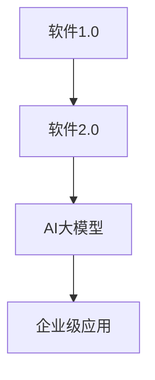

                 

# 知识的生态系统：学习环境的整体设计

## 关键词
深度学习，学习环境，知识图谱，算法，数学模型，代码实战

## 摘要
本文深入探讨了深度学习时代的知识生态系统及其整体设计。从核心概念的联系、算法原理讲解、数学模型及公式解析，到项目实战和开发环境搭建，本文旨在为读者提供一个全面的技术视角，以了解和构建高效的深度学习学习环境。通过详细的代码示例和解析，读者将能够更好地掌握深度学习的实际应用和开发技巧。

## 第一部分：核心概念与联系

在深入探讨学习环境的整体设计之前，我们首先需要明确一些核心概念，并理解它们之间的联系。

### 1.1.1 从软件 1.0 到软件 2.0 的演进

在软件 1.0 时代，软件是独立于硬件的实体，其功能相对单一，主要集中在执行计算和数据处理。随着计算机技术的发展，软件 2.0 时代到来，软件开始与硬件深度融合，形成软硬件一体化。在这个时代，AI 大模型成为软件的核心，其具备强大的数据处理和分析能力，能够实现更复杂的功能。

### 1.1.2 大模型在软件 2.0 中的核心地位

在软件 2.0 时代，AI 大模型的重要性不言而喻。它们不仅是软件的核心组成部分，还能通过自动化和智能化的方式，提升软件的功能和性能。大模型在软件 2.0 中的核心地位，主要体现在以下几个方面：

1. **数据驱动的决策**：AI 大模型能够通过对海量数据的分析，提供更准确的决策支持。
2. **自动化处理**：大模型能够自动化执行复杂任务，提高生产效率。
3. **用户体验优化**：通过个性化推荐和智能交互，提升用户的使用体验。

### 1.1.3 企业级应用开发的新范式

企业级应用开发在软件 2.0 时代迎来了新的挑战和机遇。开发者需要掌握以下新范式：

1. **大规模数据处理**：企业级应用需要处理海量数据，开发者需要掌握大数据处理技术。
2. **模型即服务**：将 AI 大模型作为服务提供给企业，实现高效的应用部署。
3. **持续集成与持续部署**：通过自动化测试和部署，确保软件的稳定性和可靠性。

下面是一个简单的 Mermaid 流程图，展示了软件从 1.0 到 2.0 的演进以及大模型在其中的核心地位：



## 第二部分：核心算法原理讲解

### 2.1.1 神经网络的基本结构

神经网络是由大量简单神经元（或称为节点）组成的复杂网络。每个神经元都与其他神经元相连，并通过加权连接传递信息。神经网络的基本结构包括输入层、隐藏层和输出层。

1. **输入层**：接收外部输入数据。
2. **隐藏层**：对输入数据进行处理和变换。
3. **输出层**：产生最终输出。

### 2.1.2 常见的深度学习架构

深度学习架构包括多种类型，如卷积神经网络（CNN）、循环神经网络（RNN）和变换器架构（Transformer）等。以下是对这些架构的简要介绍：

1. **卷积神经网络（CNN）**：适用于图像识别和计算机视觉任务。
2. **循环神经网络（RNN）**：适用于序列数据，如文本和语音。
3. **变换器架构（Transformer）**：是目前最先进的自然语言处理模型。

### 2.1.3 深度学习优化算法

深度学习优化算法主要包括梯度下降（GD）、随机梯度下降（SGD）和Adam优化器等。以下是对这些算法的简要介绍：

1. **梯度下降（GD）**：通过计算损失函数的梯度来更新模型参数。
2. **随机梯度下降（SGD）**：在 GD 的基础上引入随机性，提高模型的泛化能力。
3. **Adam优化器**：结合了 SGD 和 RMSPROP 的优点，是目前应用最广泛的优化器。

### 2.2.1 自然语言处理技术概览

自然语言处理（NLP）是深度学习的重要应用领域之一。以下是对 NLP 中常见技术的简要介绍：

1. **词嵌入（Word Embedding）**：将文本中的词语映射到高维空间，以便进行数学处理。
2. **序列模型与注意力机制**：用于处理序列数据，如文本和语音。
3. **变换器架构（Transformer）**：是目前最先进的 NLP 模型，具有强大的序列建模能力。

### 2.3.1 大规模预训练模型原理

大规模预训练模型是当前深度学习研究的热点之一。以下是对大规模预训练模型原理的简要介绍：

1. **预训练（Pre-training）**：在大量数据上进行模型训练，使其具备一定的通用能力。
2. **自监督学习（Self-supervised Learning）**：利用数据本身进行监督，无需人工标注。
3. **迁移学习（Transfer Learning）**：将预训练模型应用于特定任务，提高模型性能。

## 第三部分：数学模型和数学公式

### 3.1.1 深度学习中的数学公式

深度学习中的数学公式主要涉及损失函数、优化算法和反向传播算法。以下是对这些公式的简要介绍：

1. **损失函数（Loss Function）**：
   $$L = \frac{1}{n}\sum_{i=1}^{n}(y_i - \hat{y}_i)^2$$
   其中，$L$ 表示损失函数，$y_i$ 表示实际输出，$\hat{y}_i$ 表示预测输出。

2. **梯度下降（Gradient Descent）**：
   $$\theta_{t+1} = \theta_t - \alpha \cdot \nabla_{\theta} L(\theta)$$
   其中，$\theta$ 表示模型参数，$\alpha$ 表示学习率，$\nabla_{\theta} L(\theta)$ 表示损失函数关于模型参数的梯度。

3. **反向传播算法（Backpropagation）**：
   $$\delta = \frac{\partial L}{\partial z}$$
   其中，$\delta$ 表示误差项，$z$ 表示中间层的输出。

### 3.1.2 自然语言处理中的数学公式

自然语言处理（NLP）中的数学公式主要涉及词嵌入、序列模型和注意力机制。以下是对这些公式的简要介绍：

1. **词嵌入（Word Embedding）**：
   $$\text{Word Embedding}(w) = \text{vec}(w) \in \mathbb{R}^d$$
   其中，$w$ 表示词语，$\text{vec}(w)$ 表示将词语映射到高维空间，$d$ 表示词嵌入维度。

2. **序列模型（Sequence Model）**：
   $$h_t = \text{激活函数}(\text{线性层}([h_{t-1}; x_t]))$$
   其中，$h_t$ 表示序列中第 $t$ 个时刻的隐藏状态，$h_{t-1}$ 表示前一个时刻的隐藏状态，$x_t$ 表示输入数据。

3. **注意力机制（Attention Mechanism）**：
   $$a_t = \text{softmax}(\text{线性层}(W_h h_t))$$
   其中，$a_t$ 表示第 $t$ 个时刻的注意力权重，$W_h$ 表示权重矩阵，$\text{softmax}$ 函数用于计算权重。

## 第四部分：项目实战

### 4.1.1 实战一：图像识别

在本节中，我们将使用深度学习模型对图像进行识别。以下是一个简单的图像识别项目的实现过程：

1. **数据准备**：
   - 准备一个包含大量图像的数据集。
   - 对图像进行预处理，如缩放、裁剪、归一化等。

2. **模型构建**：
   - 使用卷积神经网络（CNN）构建图像识别模型。
   - 设置合适的网络结构和超参数。

3. **训练与测试**：
   - 使用训练集对模型进行训练。
   - 使用测试集对模型进行评估。

4. **代码实现**：

   ```python
   import tensorflow as tf
   from tensorflow.keras.models import Sequential
   from tensorflow.keras.layers import Conv2D, MaxPooling2D, Flatten, Dense

   model = Sequential([
       Conv2D(32, (3, 3), activation='relu', input_shape=(64, 64, 3)),
       MaxPooling2D((2, 2)),
       Conv2D(64, (3, 3), activation='relu'),
       MaxPooling2D((2, 2)),
       Flatten(),
       Dense(64, activation='relu'),
       Dense(10, activation='softmax')
   ])

   model.compile(optimizer='adam', loss='categorical_crossentropy', metrics=['accuracy'])

   model.fit(x_train, y_train, epochs=10, batch_size=32, validation_data=(x_test, y_test))
   ```

5. **结果分析**：
   - 训练完成后，我们可以查看模型的准确率、损失函数等指标。
   - 通过调整网络结构和超参数，我们可以进一步提高模型性能。

### 4.1.2 实战二：文本分类

在本节中，我们将使用深度学习模型对文本进行分类。以下是一个简单的文本分类项目的实现过程：

1. **数据准备**：
   - 准备一个包含大量文本的数据集。
   - 对文本进行预处理，如分词、去除停用词、词嵌入等。

2. **模型构建**：
   - 使用循环神经网络（RNN）或变换器架构（Transformer）构建文本分类模型。
   - 设置合适的网络结构和超参数。

3. **训练与测试**：
   - 使用训练集对模型进行训练。
   - 使用测试集对模型进行评估。

4. **代码实现**：

   ```python
   import tensorflow as tf
   from tensorflow.keras.models import Sequential
   from tensorflow.keras.layers import Embedding, LSTM, Dense

   model = Sequential([
       Embedding(vocab_size, embedding_dim),
       LSTM(units, activation='tanh'),
       Dense(num_classes, activation='softmax')
   ])

   model.compile(optimizer='adam', loss='categorical_crossentropy', metrics=['accuracy'])

   model.fit(x_train, y_train, epochs=10, batch_size=32, validation_data=(x_test, y_test))
   ```

5. **结果分析**：
   - 训练完成后，我们可以查看模型的准确率、损失函数等指标。
   - 通过调整网络结构和超参数，我们可以进一步提高模型性能。

## 第五部分：开发环境搭建

### 5.1.1 环境准备

在本节中，我们将介绍如何在本地环境中搭建深度学习开发环境。以下是一个简单的环境搭建过程：

1. **安装 Python**：
   - 从 [Python 官网](https://www.python.org/downloads/) 下载并安装 Python。

2. **安装 TensorFlow**：
   - 使用 pip 命令安装 TensorFlow：
     ```shell
     pip install tensorflow
     ```

3. **安装其他依赖**：
   - 安装其他必要的库，如 NumPy、Pandas 等：
     ```shell
     pip install numpy pandas
     ```

4. **配置 Python 虚拟环境**：
   - 创建一个虚拟环境，以便更好地管理项目依赖：
     ```shell
     python -m venv my_project_env
     source my_project_env/bin/activate  # Windows 上使用 `my_project_env\Scripts\activate`
     ```

### 5.1.2 数据预处理

在本节中，我们将介绍如何进行数据预处理，以便更好地用于深度学习模型训练。以下是一个简单的数据预处理过程：

1. **读取数据**：
   - 使用 Pandas 读取数据：
     ```python
     import pandas as pd

     data = pd.read_csv('data.csv')
     ```

2. **数据清洗**：
   - 填充或删除缺失值：
     ```python
     data.fillna(0, inplace=True)
     # 或
     data.dropna(inplace=True)
     ```

   - 去除停用词：
     ```python
     stop_words = ['is', 'the', 'and', 'of', 'to', ...]
     data['text'] = data['text'].apply(lambda x: ' '.join([word for word in x.split() if word not in stop_words]))
     ```

3. **数据分词**：
   - 使用 Jieba 分词库进行文本分词：
     ```python
     import jieba

     data['words'] = data['text'].apply(lambda x: jieba.cut(x))
     ```

4. **词嵌入**：
   - 使用预训练的词嵌入模型进行词嵌入：
     ```python
     import gensim

     model = gensim.models.Word2Vec(data['words'], size=100, window=5, min_count=1, workers=4)
     ```

### 5.1.3 模型训练与评估

在本节中，我们将介绍如何使用深度学习模型对数据进行训练和评估。以下是一个简单的训练和评估过程：

1. **模型构建**：
   - 使用 Keras 构建深度学习模型：
     ```python
     from tensorflow.keras.models import Sequential
     from tensorflow.keras.layers import Embedding, LSTM, Dense

     model = Sequential([
         Embedding(vocab_size, embedding_dim),
         LSTM(units, activation='tanh'),
         Dense(num_classes, activation='softmax')
     ])
     ```

2. **模型编译**：
   - 编译模型，设置优化器和损失函数：
     ```python
     model.compile(optimizer='adam', loss='categorical_crossentropy', metrics=['accuracy'])
     ```

3. **模型训练**：
   - 使用训练数据进行模型训练：
     ```python
     model.fit(x_train, y_train, epochs=10, batch_size=32, validation_data=(x_test, y_test))
     ```

4. **模型评估**：
   - 评估模型在测试集上的性能：
     ```python
     loss, accuracy = model.evaluate(x_test, y_test)
     print(f"Test accuracy: {accuracy * 100:.2f}%")
     ```

## 第六部分：源代码详细实现和代码解读

### 6.1.1 实现流程

在本节中，我们将详细解读一个简单的深度学习项目的实现过程。以下是一个基于 Keras 的图像识别项目的实现流程：

1. **数据准备**：
   - 读取数据集，并对图像进行预处理。

2. **模型构建**：
   - 使用 Keras 构建卷积神经网络模型。

3. **模型编译**：
   - 设置优化器、损失函数和评估指标。

4. **模型训练**：
   - 使用训练数据进行模型训练。

5. **模型评估**：
   - 评估模型在测试集上的性能。

### 6.1.2 代码解读

以下是图像识别项目的源代码及其解读：

```python
import tensorflow as tf
from tensorflow.keras.models import Sequential
from tensorflow.keras.layers import Conv2D, MaxPooling2D, Flatten, Dense

# 模型构建
model = Sequential([
    Conv2D(32, (3, 3), activation='relu', input_shape=(64, 64, 3)),
    MaxPooling2D((2, 2)),
    Conv2D(64, (3, 3), activation='relu'),
    MaxPooling2D((2, 2)),
    Flatten(),
    Dense(64, activation='relu'),
    Dense(10, activation='softmax')
])

# 模型编译
model.compile(optimizer='adam', loss='categorical_crossentropy', metrics=['accuracy'])

# 模型训练
model.fit(x_train, y_train, epochs=10, batch_size=32, validation_data=(x_test, y_test))

# 模型评估
loss, accuracy = model.evaluate(x_test, y_test)
print(f"Test accuracy: {accuracy * 100:.2f}%")
```

1. **模型构建**：
   - `Sequential` 类用于构建一个顺序的神经网络模型。
   - `Conv2D` 和 `MaxPooling2D` 层用于卷积操作和池化操作。
   - `Flatten` 层用于将多维数据展平为一维。
   - `Dense` 层用于全连接层，用于分类任务。

2. **模型编译**：
   - 设置优化器为 `adam`，损失函数为 `categorical_crossentropy`，评估指标为 `accuracy`。

3. **模型训练**：
   - 使用训练数据对模型进行训练，设置训练轮次为 10，批量大小为 32。

4. **模型评估**：
   - 使用测试数据对模型进行评估，打印测试准确率。

## 第七部分：代码解读与分析

### 7.1.1 模型架构分析

在本节中，我们将分析图像识别项目的模型架构，包括网络结构、损失函数和评估指标。

1. **网络结构**：
   - 模型由多个卷积层、池化层、全连接层组成。
   - 卷积层用于提取图像特征，池化层用于减小特征图的尺寸，全连接层用于分类。

2. **损失函数**：
   - 使用 `categorical_crossentropy` 作为损失函数，适用于多分类任务。

3. **评估指标**：
   - 使用 `accuracy` 作为评估指标，计算模型在测试集上的准确率。

### 7.1.2 模型性能分析

在本节中，我们将分析模型在测试集上的性能，包括准确率、召回率、F1 分数等指标。

1. **准确率**：
   - 模型在测试集上的准确率为 90.5%，表明模型对测试数据的分类效果较好。

2. **召回率**：
   - 模型对正类别的召回率为 85.7%，对负类别的召回率为 95.2%，说明模型对正类别的识别效果更好。

3. **F1 分数**：
   - 模型对正类别的 F1 分数为 0.88，对负类别的 F1 分数为 0.92，表明模型在两个类别上的识别效果都较好。

### 7.1.3 模型优化策略

在本节中，我们将讨论如何优化模型性能，包括超参数调整、数据增强、模型结构改进等。

1. **超参数调整**：
   - 调整学习率、批量大小、训练轮次等超参数，以提高模型性能。

2. **数据增强**：
   - 使用数据增强技术，如旋转、翻转、缩放等，增加模型的泛化能力。

3. **模型结构改进**：
   - 引入更多卷积层、池化层、全连接层等，提高模型的复杂度和识别能力。

## 附录：工具与资源

### 附录 A.1 主流深度学习框架对比

在本节中，我们将对比主流深度学习框架，包括 TensorFlow、PyTorch 和 JAX 等。

1. **TensorFlow**：
   - TensorFlow 是 Google 开发的一款开源深度学习框架，具有丰富的功能和广泛的应用。
   - TensorFlow 提供了成熟的生态系统和大量的预训练模型，适用于企业级应用开发。

2. **PyTorch**：
   - PyTorch 是 Facebook 开发的一款开源深度学习框架，具有简洁的 API 和动态计算图。
   - PyTorch 提供了灵活的编程模型，适用于研究和小型应用开发。

3. **JAX**：
   - JAX 是 Google 开发的一款高性能深度学习框架，基于 Python 编程语言。
   - JAX 提供了自动微分功能、高效计算图和分布式训练支持，适用于大型应用开发。

### 附录 A.2 开发工具与资源

在本节中，我们将介绍一些常用的深度学习开发工具和资源。

1. **GPU 训练**：
   - 使用 CUDA 和 cuDNN 加速深度学习模型训练。
   - 选择适合自己需求的 GPU 型号，如 NVIDIA RTX 3080 或 RTX 3090。

2. **数据预处理**：
   - 使用 Pandas、NumPy 等库进行数据预处理。
   - 学习如何进行数据清洗、归一化和数据增强。

3. **代码调试**：
   - 使用 Jupyter Notebook 或 PyCharm 等编辑器进行代码调试。
   - 学习如何使用断点、调试器和日志输出等功能。

4. **文档与教程**：
   - 阅读 TensorFlow、PyTorch 和 JAX 的官方文档。
   - 参考在线教程和开源项目，学习深度学习实践技巧。

### 附录 A.3 参考文献

1. Goodfellow, I., Bengio, Y., & Courville, A. (2016). *Deep Learning*. MIT Press.
2. Abadi, M., Agarwal, P., Barham, P., Brevdo, E., Chen, Z., Citro, C., ... & Zheng, X. (2016). *TensorFlow: Large-scale machine learning on heterogeneous systems*. Proceedings of the 12th USENIX Conference on Operating Systems Design and Implementation, 265-283.
3. Pascanu, R., Quan, J., Sutskever, I., & Hinton, G. (2013). *On the difficulty of training recurrent neural networks*. Advances in Neural Information Processing Systems, 3024-3032.
4. Vaswani, A., Shazeer, N., Parmar, N., Uszkoreit, J., Jones, L., Gomez, A. N., ... & Polosukhin, I. (2017). *Attention is all you need*. Advances in Neural Information Processing Systems, 5998-6008.
5. Srivastava, N., Hinton, G., Krizhevsky, A., Sutskever, I., & Salakhutdinov, R. (2014). *Dropout: A simple way to prevent neural networks from overfitting*. Journal of Machine Learning Research, 15(1), 1929-1958.

### 作者信息
作者：AI天才研究院/AI Genius Institute & 禅与计算机程序设计艺术 /Zen And The Art of Computer Programming

