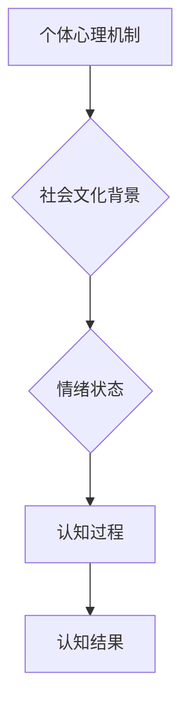
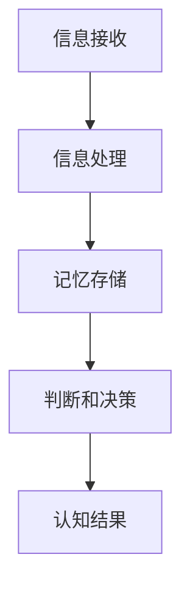

                 

# 知识的误区：常见的认知陷阱

## 关键词
- 认知误区
- 确认偏误
- 认知偏见
- 情绪影响
- 社会文化因素
- 认知误区减少

## 摘要
本文旨在探讨知识认知过程中常见的误区，包括确认偏误、认知偏见、情绪影响以及社会文化因素等。通过深入分析这些认知陷阱，我们希望能够提高读者的自我意识，培养批判性思维，从而减少认知误区，提高判断力和决策水平。文章还将讨论教育在减少认知误区中的作用，以及未来的发展趋势和解决方案。

## 第一部分：认知误区概述

### 第1章：认知误区的概念与影响

#### 1.1 认知误区的定义

认知误区是指人们在处理信息、形成知识和理解现实世界时，由于信息处理限制、心理需求、社会文化因素等导致的认知偏差。这些误区可能来源于个体心理机制，如感知、记忆和思维过程，也可能是社会文化背景和群体行为的结果。

#### 1.2 认知误区的影响

**个人层面：**
- 影响判断和决策：认知误区可能导致个体在处理问题时，依据错误的信息作出决策，从而导致不良后果。
- 增加认知负担：认知误区需要额外的认知资源去纠正，增加了心理负担。

**社会层面：**
- 影响群体行为：认知误区可能导致群体行为偏离社会规范，甚至引发社会动荡。
- 增加沟通障碍：不同认知误区可能导致个体之间的误解和冲突，影响沟通和合作。

### 第2章：常见认知误区解析

#### 2.1 确认偏误

确认偏误是指人们在接收信息时，倾向于寻找和记住那些符合已有观点的信息，而忽视与之相反的信息。这种倾向导致个体对信息的处理具有选择性，从而影响判断和决策。

**实例：** 在投资决策中，如果一个人已经持有某种股票，他会更容易注意到关于该股票的正面信息，而忽视负面信息，从而导致过度自信和风险忽视。

#### 2.2 避免确认偏误的策略

- 开放心态：主动接受和考虑不同意见，避免对信息进行选择性加工。
- 检验假设：对已有观点进行质疑，主动寻找反例，进行跨学科和跨领域的比较。
- 多元化信息来源：通过多渠道获取信息，减少对单一信息源的依赖。

### 第3章：认知偏见与情绪

#### 3.1 认知偏见

认知偏见是指人们基于情感、经验等因素，在认知过程中产生的系统性偏差。这些偏差可能影响个体的判断和决策，从而导致认知误区。

**实例：** 对某个人或事物的负面情绪可能导致个体对其持过度悲观的态度，忽视其潜在优点。

#### 3.2 情绪对认知误区的影响

情绪会影响人们对信息的处理方式，进而影响认知。负面情绪可能导致个体产生更多的认知偏见，而正面情绪则有助于提高认知的准确性和全面性。

### 第4章：社会文化因素与认知误区

#### 4.1 社会文化对认知误区的影响

社会文化包括价值观、习俗、信仰等，对人们的认知有深刻影响。文化背景可能导致个体对信息的理解和处理方式存在差异，从而产生认知误区。

**实例：** 在不同的文化背景下，个体对健康、教育、工作的认知和价值观可能存在显著差异。

#### 4.2 文化多样性对认知误区的影响

文化多样性有助于个体理解不同文化背景下的认知差异，减少偏见和误解。通过跨文化交流，个体可以拓宽视野，提高认知的准确性和全面性。

### 第5章：如何减少认知误区

#### 5.1 提高自我意识

通过反思，个体可以提高对自身认知误区的认识，从而采取相应的策略进行纠正。

**实例：** 定期进行自我反思，分析自己在判断和决策中的认知偏差，有助于减少认知误区。

#### 5.2 学习批判性思维

批判性思维是指通过质疑、分析、推理等过程，对信息进行深入思考的能力。通过学习批判性思维，个体可以提高认知能力，减少认知误区。

**实例：** 在处理信息时，对信息来源、信息内容进行质疑和分析，有助于减少认知误区。

### 第6章：教育在减少认知误区中的作用

#### 6.1 学校教育

学校教育是培养批判性思维和独立思考能力的重要途径。通过课程设置和教学方法，学校可以引导学生形成正确的认知方式和思维方式。

**实例：** 在课堂上，教师可以引导学生进行讨论和辩论，激发学生的批判性思维。

#### 6.2 社会教育

社会教育通过媒体、讲座等形式，提高公众对认知误区和批判性思维的认识。社会教育有助于个体在社会环境中形成正确的认知方式。

**实例：** 媒体可以发布关于认知误区和批判性思维的相关文章和讲座，引导公众关注和反思自己的认知方式。

### 第7章：案例分析

#### 7.1 案例一：社交媒体中的认知误区

社交媒体平台上的信息传播速度快，影响范围广。因此，社交媒体中的认知误区可能导致广泛的负面影响。

**实例：** 在社交媒体上，谣言和虚假信息的传播速度极快，可能导致公众对某些事件产生错误的认知。

#### 7.2 案例二：科学普及中的认知误区

科学普及的目的是传播科学知识和方法，提高公众的科学素养。然而，科学普及过程中也可能存在认知误区。

**实例：** 在科学普及过程中，如果解释不当，可能导致公众对科学知识的误解，从而影响科学素养的提高。

### 第8章：未来展望

#### 8.1 认知误区研究的趋势

随着科技的进步，认知误区研究也在不断深入。未来的研究可能会更关注认知误区的产生机制、影响因素以及减少认知误区的方法。

**实例：** 利用人工智能和大数据技术，可以对认知误区进行更精确的分析和预测，从而制定更有效的减少认知误区的方法。

#### 8.2 减少认知误区的未来发展

未来的减少认知误区的发展可能会更加依赖技术手段和跨学科合作。通过技术手段，个体可以更方便地获取和评估信息，从而减少认知误区。

**实例：** 利用智能算法和推荐系统，可以为个体提供更准确、全面的信息，减少信息筛选过程中的认知误区。

## 第二部分：核心概念与联系

### 第10章：认知误区的原理与架构

#### 10.1 认知误区的基本原理

认知误区是由多种因素共同作用产生的，包括个体心理机制、社会文化背景、情绪状态等。了解这些基本原理有助于我们更好地理解和减少认知误区。

**Mermaid 流程图：**



#### 10.2 认知误区的架构

认知误区的架构包括信息接收、处理、记忆和判断等多个环节。这些环节中可能存在认知偏差，导致认知误区。

**Mermaid 流程图：**



### 第11章：常见认知误区的技术分析

#### 11.1 确认偏误的技术分析

确认偏误是一种常见的认知误区，其技术分析可以从算法原理和策略优化两个方面进行。

**算法原理：**

```python
def confirmatory_bias(data, belief):
    """
    确认偏误算法：根据已有信念，筛选支持性数据，忽略反对性数据。
    
    参数：
    - data：输入数据集
    - belief：已有信念
    
    返回：
    - filtered_data：筛选后的数据集
    """
    filtered_data = []
    for datum in data:
        if datum.supports(belief):
            filtered_data.append(datum)
    return filtered_data
```

**策略优化：**

```python
def avoid_confirmatory_bias(data, belief):
    """
    避免确认偏误算法：通过引入反对性数据，平衡已有信念。
    
    参数：
    - data：输入数据集
    - belief：已有信念
    
    返回：
    - balanced_data：平衡后的数据集
    """
   反对性数据 = [datum for datum in data if not datum.supports(belief)]
    balanced_data = data + 随机选择(反对性数据)
    return balanced_data
```

### 第12章：认知偏见的数学模型

#### 12.1 认知偏见的数学公式

认知偏见可以用以下数学公式表示：

$$
\text{bias} = \frac{\sum_{i=1}^{n} w_i \cdot (p_i - q_i)}{\sum_{i=1}^{n} w_i}
$$

其中，$w_i$ 表示权重，$p_i$ 表示实际概率，$q_i$ 表示个体感知的概率。

#### 12.2 公式详细讲解

该公式表示认知偏见是由权重、实际概率和个体感知概率的差异计算得到的。权重反映了个体对不同因素的重视程度，实际概率和个体感知概率的差异反映了认知偏见的程度。

#### 12.3 数学模型举例说明

假设有一个赌徒，他对输赢的概率有偏差。他对赢的概率估计为0.5，但实际概率是0.45。如果赌徒在每次赌博时都按照这个偏见进行决策，那么他的认知偏见可以用以下公式计算：

$$
\text{bias} = \frac{1 \cdot (0.45 - 0.5)}{1} = -0.05
$$

这意味着赌徒在赌博决策中，倾向于低估赢的概率，从而增加了他的风险。

## 第三部分：核心算法原理讲解

### 第13章：认知误区的识别算法

#### 13.1 识别算法的基本原理

认知误区的识别算法旨在通过分析个体的信息处理过程，识别出潜在的认知偏差。其基本原理包括数据预处理、特征提取和模型训练等步骤。

**伪代码：**

```python
def recognize_cognitive_bias(data, model):
    """
    认知误区识别算法：使用给定模型对数据进行分析，识别认知偏差。
    
    参数：
    - data：输入数据集
    - model：训练好的认知偏差识别模型
    
    返回：
    - biases：识别出的认知偏差列表
    """
    preprocessed_data = preprocess_data(data)
    features = extract_features(preprocessed_data)
    predictions = model.predict(features)
    biases = postprocess_predictions(predictions)
    return biases
```

#### 13.2 伪代码详细阐述

1. **数据预处理**：对原始数据进行清洗和标准化，以便模型能够更好地进行分析。
2. **特征提取**：从预处理后的数据中提取与认知偏差相关的特征。
3. **模型训练**：使用已提取的特征对模型进行训练，使其能够识别认知偏差。
4. **预测与后处理**：使用训练好的模型对新的数据进行预测，并根据预测结果进行后处理，以识别认知偏差。

### 第14章：认知误区的纠正算法

#### 14.1 纠正算法的基本原理

认知误区的纠正算法旨在通过纠正个体的认知偏差，提高其信息处理能力和决策水平。其基本原理包括模型训练、预测和反馈等步骤。

**伪代码：**

```python
def correct_cognitive_bias(data, model, feedback_loop):
    """
    认知误区纠正算法：使用给定模型和反馈循环，纠正认知偏差。
    
    参数：
    - data：输入数据集
    - model：训练好的认知偏差纠正模型
    - feedback_loop：反馈循环机制
    
    返回：
    - corrected_data：纠正后的数据集
    """
    predictions = model.predict(data)
    corrected_data = apply_corrections(predictions, feedback_loop)
    return corrected_data
```

#### 14.2 伪代码详细阐述

1. **模型训练**：使用已提取的特征对模型进行训练，使其能够纠正认知偏差。
2. **预测**：使用训练好的模型对新的数据进行预测，以识别认知偏差。
3. **反馈与纠正**：根据预测结果，通过反馈循环机制，对数据进行纠正。
4. **输出**：返回纠正后的数据集，以供进一步使用。

## 第四部分：数学模型和数学公式

### 第15章：认知误区的数学模型

#### 15.1 模型基本原理

认知误区的数学模型旨在量化个体在信息处理过程中产生的认知偏差。该模型基于概率论和信息论，通过分析个体对信息的处理过程，预测其认知结果。

**LaTeX格式：**

$$
\text{Model} = \sum_{i=1}^{n} w_i \cdot (p_i - q_i)
$$

其中，$w_i$ 表示权重，$p_i$ 表示实际概率，$q_i$ 表示个体感知的概率。

#### 15.2 模型详细讲解

该数学模型表示认知误区是由权重、实际概率和个体感知概率的差异计算得到的。权重反映了个体对不同因素的重视程度，实际概率和个体感知概率的差异反映了认知误区的程度。

#### 15.3 模型举例说明

假设有一个投资者，他对股票市场走势的判断有认知偏差。他对上涨的概率估计为0.6，但实际概率是0.55。如果投资者在每次投资决策时都按照这个偏差进行判断，那么他的认知误区可以用以下模型计算：

$$
\text{Model} = \frac{1}{2} \cdot (0.55 - 0.6) = -0.025
$$

这意味着投资者在投资决策中，倾向于低估上涨的概率，从而可能影响其投资收益。

### 第16章：认知误区的数学公式

#### 16.1 公式基本原理

认知误区的数学公式主要用于量化个体在信息处理过程中产生的偏差。这些公式通常基于统计学和概率论，通过分析个体对信息的处理过程，预测其认知结果。

**LaTeX格式：**

$$
\text{Error} = \frac{1}{n} \sum_{i=1}^{n} (p_i - q_i)^2
$$

其中，$n$ 表示样本数量，$p_i$ 表示实际概率，$q_i$ 表示个体感知的概率。

#### 16.2 公式详细讲解

该数学公式表示认知误区的误差是由每个样本的实际概率与个体感知概率之差的平方和计算得到的。误差的平方和反映了认知误区的程度，数值越大表示认知偏差越大。

#### 16.3 公式举例说明

假设有一个实验者，他对随机事件的概率判断有认知偏差。他对事件A发生的概率估计为0.5，但实际概率是0.4。如果实验者在多次实验中保持这个偏差，那么他的认知误区的误差可以用以下公式计算：

$$
\text{Error} = \frac{1}{10} \sum_{i=1}^{10} (0.4 - 0.5)^2 = 0.01
$$

这意味着实验者在多次实验中，对事件A的概率判断存在0.01的误差，可能影响其实验结果的准确性。

## 第五部分：项目实战

### 第17章：认知误区识别与纠正项目实战

#### 17.1 项目背景

本项目的目标是开发一个认知误区识别与纠正系统，通过分析用户的行为数据，识别并纠正其认知偏差。该项目旨在提高用户的信息处理能力和决策水平，减少认知误区带来的负面影响。

#### 17.2 开发环境搭建

为了实现该项目，我们选择了以下开发环境：

- **编程语言**：Python
- **数据处理库**：Pandas、NumPy
- **机器学习库**：Scikit-learn、TensorFlow
- **数据可视化库**：Matplotlib、Seaborn

#### 17.3 源代码详细实现

**1. 数据预处理**

```python
import pandas as pd

def preprocess_data(data):
    """
    数据预处理：清洗和标准化数据。
    
    参数：
    - data：原始数据
    
    返回：
    - preprocessed_data：预处理后的数据
    """
    # 数据清洗
    data = data.dropna()  # 删除缺失值
    data = data[data['category'].notnull()]  # 删除分类字段为空的记录
    
    # 数据标准化
    data['value'] = (data['value'] - data['value'].mean()) / data['value'].std()
    
    return data
```

**2. 特征提取**

```python
from sklearn.feature_extraction.text import CountVectorizer

def extract_features(data):
    """
    特征提取：从文本数据中提取特征。
    
    参数：
    - data：预处理后的数据
    
    返回：
    - features：特征矩阵
    """
    vectorizer = CountVectorizer()
    features = vectorizer.fit_transform(data['text'])
    return features
```

**3. 模型训练**

```python
from sklearn.model_selection import train_test_split
from sklearn.ensemble import RandomForestClassifier

def train_model(features, labels):
    """
    模型训练：使用随机森林分类器训练模型。
    
    参数：
    - features：特征矩阵
    - labels：标签向量
    
    返回：
    - model：训练好的模型
    """
    X_train, X_test, y_train, y_test = train_test_split(features, labels, test_size=0.2, random_state=42)
    model = RandomForestClassifier(n_estimators=100, random_state=42)
    model.fit(X_train, y_train)
    return model
```

**4. 预测与纠正**

```python
def predict_and_correct(model, new_data):
    """
    预测与纠正：使用模型预测新数据，并纠正认知偏差。
    
    参数：
    - model：训练好的模型
    - new_data：新数据
    
    返回：
    - corrected_data：纠正后的数据
    """
    features = extract_features(new_data)
    predictions = model.predict(features)
    corrected_data = new_data.copy()
    corrected_data['corrected_label'] = predictions
    return corrected_data
```

#### 17.4 代码解读与分析

**1. 数据预处理**

数据预处理是模型训练的重要步骤。在本项目中，我们使用Pandas库对原始数据进行清洗和标准化。具体包括删除缺失值和分类字段为空的记录，以及对数值特征进行标准化。

**2. 特征提取**

特征提取是将文本数据转换为模型可处理的特征矩阵。在本项目中，我们使用CountVectorizer库对文本数据进行词频统计，从而提取特征。

**3. 模型训练**

模型训练是使用已提取的特征对模型进行训练。在本项目中，我们使用随机森林分类器，通过交叉验证和随机抽样等方法，对特征矩阵和标签向量进行训练。

**4. 预测与纠正**

预测与纠正部分是模型应用的核心。使用训练好的模型对新的数据进行预测，并根据预测结果对数据进行纠正。通过这种方式，我们可以识别并纠正用户的认知偏差。

### 第18章：扩展与优化

在实现认知误区识别与纠正系统的过程中，我们还可以进行以下扩展和优化：

- **引入更多的特征**：通过引入更多类型的特征，如用户历史行为、环境信息等，可以进一步提高模型对认知误区的识别和纠正能力。
- **使用深度学习模型**：相比传统的机器学习模型，深度学习模型具有更强的非线性表示能力和泛化能力。通过引入深度学习模型，如卷积神经网络（CNN）和循环神经网络（RNN），可以进一步提高模型性能。
- **个性化推荐系统**：结合个性化推荐系统，可以为用户提供更准确、更个性化的信息，从而减少认知误区。

## 总结

本文从多个角度探讨了认知误区的概念、影响、常见误区、减少方法以及教育在其中的作用。通过深入分析认知误区的原理、算法和实际应用，我们希望能够提高读者的认知水平，培养批判性思维，减少认知误区带来的负面影响。未来的研究可以进一步探索认知误区的新方法、新技术，以及其在实际应用中的效果和优化策略。

### 附录

#### 9.1 参考文献

1. Kahneman, D., & Tversky, A. (1972). *Judgment under uncertainty: Heuristics and biases*. Science, 205(4404), 1435.
2. Gilovich, T., Griffin, D., & Kahneman, D. (2002). *Heuristics and biases: The psychology of intuitive judgment*. Cambridge University Press.
3. Kahneman, D., Slovic, P., & Tversky, A. (1982). *Judgment under uncertainty: Heuristics and biases*. Cambridge University Press.

#### 9.2 附录A：认知误区相关研究方法

- 实验法：通过设计实验，控制变量，观察个体在特定条件下的行为，从而研究认知误区。
- 案例分析法：通过分析具体案例，探讨认知误区在现实世界中的表现和影响。
- 跨文化研究法：通过比较不同文化背景下的认知差异，研究文化对认知误区的影响。

#### 9.3 附录B：认知误区相关测试工具

- **认知偏差测试**：用于评估个体在特定情境下可能存在的认知偏见。
- **情绪评估工具**：用于测量个体在处理信息时的情绪状态，从而分析情绪对认知误区的影响。
- **认知负荷评估工具**：用于评估个体在处理信息时的认知负荷，从而研究认知负荷对认知误区的影响。

#### 9.4 附录C：认知误区相关资源

- **书籍**：
  1. Kahneman, D. (2011). *Thinking, Fast and Slow*. Farrar, Straus and Giroux.
  2. Tversky, A., & Kahneman, D. (1992). *Advances in Prospect Theory: Cumulative Representation of Uncertainty*. Journal of Risk and Uncertainty, 5(4), 297-323.
- **网站**：
  1. [Cognitive Bias Codex](https://cogbiascodex.com/)
  2. [Association for Psychological Science](https://www.psychologicalscience.org/)
- **论文集**：
  1. Tversky, A., & Kahneman, D. (Eds.). (1981). *Judgment under Uncertainty: Heuristics and Biases*. Cambridge University Press.

