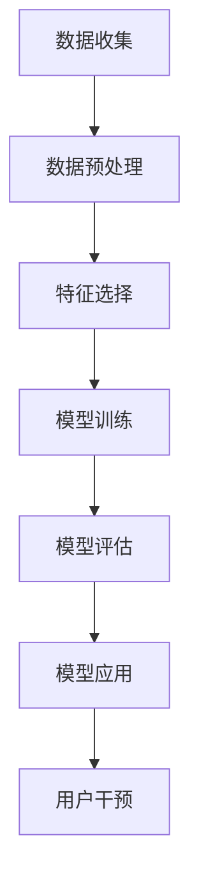
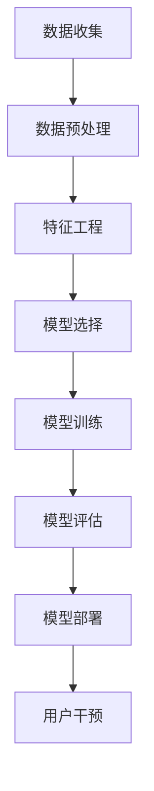

                 

# 《知识经济下知识付费的大数据用户流失预测模型》

> **关键词：知识经济，知识付费，大数据，用户流失预测，机器学习，算法优化**

> **摘要：本文探讨了知识经济时代下知识付费市场的用户流失现象，通过大数据分析和机器学习技术构建了一个用户流失预测模型。本文首先概述了知识经济和知识付费的背景，接着阐述了大数据用户流失预测的理论基础，详细分析了用户流失预测算法原理与数学模型，最后通过实际案例展示了模型的构建与优化方法，为知识付费行业的持续健康发展提供了技术支持和实践指导。**

### 《知识经济下知识付费的大数据用户流失预测模型》目录大纲

#### 第一部分：知识经济与知识付费概述

##### 第1章：知识经济背景与知识付费概念

##### 第2章：大数据用户行为分析基础

##### 第3章：用户流失预测模型核心概念与联系

##### 第4章：用户流失预测算法原理与伪代码

##### 第5章：数学模型与数学公式讲解

#### 第二部分：大数据用户流失预测理论基础

##### 第4章：用户流失预测模型核心概念与联系

##### 第5章：数学模型与数学公式讲解

##### 第6章：用户流失预测模型应用实践

##### 第7章：用户流失预测模型优化与评估

##### 第8章：知识付费行业应用案例

##### 第9章：未来展望与挑战

#### 附录

##### 附录 A：常用工具与资源

##### 附录 B：代码实现示例

---

#### 第一部分：知识经济与知识付费概述

##### 第1章：知识经济背景与知识付费概念

知识经济是继农业经济、工业经济之后的一种新型经济形态，其核心特征是以知识和信息为主要生产要素，以技术创新和知识传播为动力。知识经济时代的到来，不仅改变了传统经济的运行模式，也深刻影响了市场的供求关系、消费行为和企业运营策略。

**1.1 知识经济的兴起与特点**

知识经济的兴起可以追溯到20世纪后半叶，特别是在信息技术和互联网的快速发展推动下，知识成为了社会生产力和竞争力的关键因素。知识经济具有以下几个显著特点：

1. **知识成为核心资源**：知识经济的核心资源是知识和信息，而非传统的自然资源和劳动力。
2. **信息技术驱动**：知识经济依赖于先进的信息技术，如互联网、大数据、人工智能等，以实现知识的快速获取、处理和传播。
3. **创新驱动发展**：知识经济强调创新驱动发展，企业通过持续创新来获得竞争优势。
4. **全球化**：知识经济具有显著的全球化特征，知识传播和交流跨越国界，推动全球经济的发展。

**1.2 知识付费的内涵与形式**

知识付费是指在知识经济时代，个体或企业为获取特定知识或技能而支付的费用。知识付费的形式多样，主要包括以下几种：

1. **在线教育**：在线教育平台提供的课程、讲座、培训班等，用户通过付费获取知识和技能。
2. **知识咨询**：专业机构或个人提供的咨询服务，如商业咨询、技术支持、法律咨询等。
3. **版权付费**：对原创作品、专利、软件等知识产权的付费使用。
4. **内容付费**：优质内容的付费阅读，如电子书、付费订阅的专栏、研究报告等。

**1.3 知识付费市场的发展趋势**

随着知识经济的不断深化，知识付费市场也呈现出快速发展的趋势：

1. **市场规模不断扩大**：随着知识需求的增长，知识付费市场持续扩大，成为数字经济的重要组成部分。
2. **个性化与多样化**：用户对知识付费的需求越来越个性化，平台提供多样化的课程和服务以满足不同用户的需求。
3. **技术创新驱动**：大数据、人工智能等技术的应用，提高了知识付费的服务质量和用户体验。
4. **内容监管加强**：知识付费市场的规范化，加强对知识内容的质量监管，保障用户的权益。

在知识经济背景下，知识付费已成为一个日益重要的市场领域。通过对知识付费市场的深入理解和分析，我们可以更好地把握其发展趋势，为企业和个人提供有针对性的服务，促进知识经济的健康发展。

---

##### 第2章：大数据用户行为分析基础

在知识付费市场中，用户行为分析是一项关键任务。通过深入分析用户行为数据，企业可以更好地了解用户需求，优化服务体验，提高用户留存率。本章将介绍大数据用户行为分析的基础知识，包括大数据概述、用户行为数据的收集与处理以及用户流失的定义与分类。

**2.1 大数据概述**

大数据（Big Data）指的是数据规模巨大、类型多样、处理速度快的数据集合。大数据的特点可以用“4V”来概括：Volume（数据量大）、Velocity（数据处理速度快）、Variety（数据类型多样）和Veracity（数据真实性高）。大数据的产生和应用已成为知识经济时代的重要特征。

1. **数据规模**：大数据的处理能力远远超出了传统数据库系统的能力，需要分布式计算和存储技术来支持。
2. **数据处理速度**：大数据的处理要求在短时间内完成，以实时或近实时的方式响应业务需求。
3. **数据类型**：大数据不仅包括结构化数据，还包括半结构化数据和非结构化数据，如文本、图片、音频、视频等。
4. **数据真实性**：大数据的真实性至关重要，虚假数据会影响分析结果，从而误导决策。

**2.2 用户行为数据的收集与处理**

用户行为数据是大数据的重要组成部分，通过收集和分析这些数据，企业可以深入了解用户的行为模式和需求。以下是用户行为数据收集与处理的主要步骤：

1. **数据收集**：用户行为数据的收集可以从多个渠道进行，如网站日志、用户调查、社交媒体互动、移动应用等。收集的数据包括用户访问时间、访问路径、搜索关键词、购买记录、评论和评分等。

2. **数据预处理**：收集到的用户行为数据通常是原始的、不完整的，需要经过预处理才能用于分析。预处理包括数据清洗、数据转换和数据归一化等步骤。

   - **数据清洗**：去除重复、错误或无关的数据，提高数据质量。
   - **数据转换**：将不同数据格式的数据转换为统一的格式，如将文本数据转换为数字向量。
   - **数据归一化**：将不同尺度和单位的数据标准化，便于后续分析。

3. **数据存储与管理**：用户行为数据通常存储在分布式数据库或数据仓库中，利用大数据处理技术进行高效存储和管理。

**2.3 用户流失的定义与分类**

用户流失是指用户在一段时间内停止使用某个产品或服务。在知识付费市场中，用户流失是一个重要问题，直接影响企业的收入和市场份额。用户流失可以分为以下几种类型：

1. **主动流失**：用户主动决定停止使用产品或服务，通常是由于不满意的体验、价格过高或其他外部因素。
2. **被动流失**：用户由于外部原因（如忘记续费、账号被关闭等）而停止使用产品或服务。
3. **暂时流失**：用户暂时停止使用产品或服务，可能在未来重新使用。

了解用户流失的类型有助于企业制定针对性的用户保留策略，减少用户流失率。通过对用户流失数据的分析，企业可以发现用户流失的原因，从而采取相应的措施进行干预。

通过大数据用户行为分析，知识付费企业可以更好地了解用户需求，优化产品和服务，提高用户满意度和留存率。这不仅有助于企业的长期发展，也为知识经济的繁荣提供了有力支持。

---

##### 第3章：用户流失预测模型核心概念与联系

在知识付费市场中，用户流失预测是一个关键任务。通过构建有效的用户流失预测模型，企业可以提前识别潜在流失用户，采取相应的措施进行干预，从而降低用户流失率，提高客户满意度和市场份额。本章将介绍用户流失预测模型的核心概念与联系，包括数据挖掘与机器学习基础、用户流失预测的数学模型，以及使用Mermaid流程图展示预测模型框架。

**3.1 数据挖掘与机器学习基础**

数据挖掘（Data Mining）是指从大量数据中提取有价值的信息和知识的过程。在用户流失预测中，数据挖掘技术可以帮助我们识别用户行为模式、发现潜在流失信号。数据挖掘通常包括以下步骤：

1. **数据预处理**：清洗、转换和归一化数据，使其适合模型训练。
2. **特征选择**：选择对用户流失有重要影响的关键特征。
3. **模型训练**：利用训练数据集对模型进行训练，使其能够学习用户行为模式。
4. **模型评估**：使用测试数据集评估模型性能，调整模型参数。

机器学习（Machine Learning）是数据挖掘的核心技术之一，通过训练模型来自动识别数据中的模式。在用户流失预测中，常用的机器学习算法包括：

1. **分类算法**：用于预测用户是否流失，如逻辑回归、决策树、支持向量机等。
2. **聚类算法**：用于发现用户群体的相似性，如K-均值、层次聚类等。
3. **关联规则算法**：用于发现用户行为之间的关联性，如Apriori算法等。

**3.2 用户流失预测的数学模型**

用户流失预测的数学模型是基于统计学和概率论的。以下是一些常用的数学模型和概念：

1. **概率与期望**：概率用于描述用户流失的可能性，期望用于衡量用户流失的平均损失。

   - 概率（Probability）: 设事件A为用户流失，则P(A)表示用户流失的概率。
   - 期望（Expected Value）: 设X为用户流失的损失，则E(X)表示用户流失的期望损失。

2. **假设检验**：用于验证用户流失预测模型的可靠性。

   - 原假设（Null Hypothesis）: 用户流失的概率与模型预测的一致。
   - 备择假设（Alternative Hypothesis）: 用户流失的概率与模型预测的不一致。

3. **模型评估指标**：用于衡量用户流失预测模型的性能。

   - 准确率（Accuracy）: 预测为流失的用户中，实际流失的比例。
   - 精确率（Precision）: 预测为流失的用户中，预测正确的比例。
   - 召回率（Recall）: 实际流失的用户中，预测为流失的比例。
   - F1分数（F1 Score）: 准确率和召回率的调和平均值。

**3.3 Mermaid流程图展示预测模型框架**

为了更好地理解用户流失预测模型，我们可以使用Mermaid流程图来展示其整体框架。以下是一个简化的用户流失预测模型框架：



1. **数据收集**：从多个渠道收集用户行为数据。
2. **数据预处理**：清洗、转换和归一化数据。
3. **特征选择**：选择对用户流失有重要影响的关键特征。
4. **模型训练**：利用训练数据集对模型进行训练。
5. **模型评估**：使用测试数据集评估模型性能。
6. **模型应用**：将训练好的模型应用于实际用户数据。
7. **用户干预**：根据预测结果采取相应的用户保留策略。

通过上述流程，企业可以构建一个完整的用户流失预测模型，从而提前识别潜在流失用户，采取有效措施进行干预，降低用户流失率，提高客户满意度和市场份额。

---

##### 第4章：用户流失预测算法原理与伪代码

用户流失预测是知识付费领域的一个重要问题。在这一章中，我们将详细探讨几种常用的用户流失预测算法的原理，包括决策树、支持向量机和随机森林，并使用伪代码对其进行描述。这些算法的深入理解对于构建和优化用户流失预测模型至关重要。

**4.1 常见用户流失预测算法介绍**

在用户流失预测中，常见的算法包括以下几种：

1. **决策树（Decision Tree）**：决策树是一种基于树形结构对数据进行分类的算法。它通过一系列的判断条件来将数据分割成不同的子集，最终达到预测目标。

2. **支持向量机（Support Vector Machine, SVM）**：支持向量机是一种基于最大间隔分类的算法，它通过找到一个最佳的超平面来最大化两类数据的间隔。

3. **随机森林（Random Forest）**：随机森林是一种集成学习算法，它通过构建多棵决策树，并对这些树的预测结果进行投票来提高预测准确性。

**4.2 决策树算法原理与伪代码**

决策树算法的基本原理是通过一系列的判断条件来对数据进行分割，每个节点表示一个判断条件，每个分支表示该条件的结果。

```plaintext
伪代码：

function DecisionTree(X, y):
    if X的样本数量 <= 阈值:
        返回 叶子节点，预测y的平均值
    else:
        选择最佳特征f和阈值θ：
            δ = 最大信息增益（或基尼不纯度减少）
        创建内部节点，特征f和阈值θ：
            左子树 = {x | x[f] <= θ}
            右子树 = {x | x[f] > θ}
        返回 决策树（根节点、左子树、右子树）

函数调用：
tree = DecisionTree(X, y)
```

**4.3 支持向量机算法原理与伪代码**

支持向量机通过找到一个最佳的超平面来最大化两类数据的间隔。这个超平面将数据分割成两类，并使得两类数据的间隔最大。

```plaintext
伪代码：

function SVM(X, y):
    初始化参数：C（惩罚参数），γ（核参数）
    使用支持向量机优化算法（如SMO）求解最优超平面：
        w*，b* = 最优解
    构建决策函数：
        f(x) = sign(<w*, x> + b*)
    返回 决策函数

函数调用：
model = SVM(X, y)
```

**4.4 随机森林算法原理与伪代码**

随机森林通过构建多棵决策树，并对这些树的预测结果进行投票来提高预测准确性。随机森林的优势在于它可以处理高维数据，并且具有较好的泛化能力。

```plaintext
伪代码：

function RandomForest(X, y, n_trees):
    for i = 1 to n_trees:
        从X中随机抽取样本集合X_i
        从特征集合中随机选择m个特征
        使用决策树算法构建树T_i
    返回 随机森林（T_1, T_2, ..., T_n）

函数调用：
forest = RandomForest(X, y, n_trees)

预测新样本x：
predictions = [T_i(x) for T_i in forest]
predicted_class = argmax(predictions)

函数调用：
predicted_class = RandomForestPredict(forest, x)
```

通过对决策树、支持向量机和随机森林算法的原理和伪代码的详细探讨，我们可以更好地理解这些算法在用户流失预测中的应用。在实际应用中，选择合适的算法并对其进行优化，将有助于构建一个高效和准确的用户流失预测模型。

---

##### 第5章：数学模型与数学公式讲解

在用户流失预测中，数学模型和公式是理解算法和进行模型优化的重要工具。本章将详细讲解几个核心的数学模型和公式，包括概率与期望、假设检验、模型评估指标，并通过示例说明这些概念的应用。

**5.1 概率与期望**

概率（Probability）是描述事件发生可能性的一种量度。在用户流失预测中，概率用于衡量用户流失的可能性。期望（Expected Value）则是衡量用户流失的平均损失。

1. **概率**

   概率表示为P(A)，其中A是事件。例如，P(流失)表示用户流失的概率。

2. **期望**

   期望表示为E(X)，其中X是随机变量。在用户流失预测中，期望可以用于衡量用户流失带来的平均损失。例如，E(损失) = Σ(损失_i * P(流失_i))。

**5.2 假设检验**

假设检验（Hypothesis Testing）是一种用于验证模型是否可靠的统计方法。在用户流失预测中，常用的假设检验方法包括t检验和卡方检验。

1. **t检验**

   t检验用于比较两组数据的均值差异是否显著。例如，我们可能想验证模型A的预测准确性是否显著高于模型B。

   - **原假设（Null Hypothesis）**：模型A和模型B的预测准确性相同。
   - **备择假设（Alternative Hypothesis）**：模型A的预测准确性高于模型B。

2. **卡方检验**

   卡方检验用于检验分类模型的性能。例如，我们可能想验证模型是否能够准确预测用户流失。

   - **原假设**：模型能够准确预测用户流失。
   - **备择假设**：模型无法准确预测用户流失。

**5.3 模型评估指标**

模型评估指标（Evaluation Metrics）用于衡量用户流失预测模型的性能。以下是一些常用的评估指标：

1. **准确率（Accuracy）**

   准确率表示为预测为流失的用户中，实际流失的比例。公式为：Accuracy = (TP + TN) / (TP + TN + FP + FN)，其中TP为真正例，TN为真负例，FP为假正例，FN为假负例。

2. **精确率（Precision）**

   精确率表示为预测为流失的用户中，预测正确的比例。公式为：Precision = TP / (TP + FP)。

3. **召回率（Recall）**

   召回率表示为实际流失的用户中，预测为流失的比例。公式为：Recall = TP / (TP + FN)。

4. **F1分数（F1 Score）**

   F1分数是精确率和召回率的调和平均值，用于综合考虑模型的准确性和召回率。公式为：F1 Score = 2 * Precision * Recall / (Precision + Recall)。

**5.4 示例说明与公式应用**

假设我们有一个用户流失预测模型，通过测试集获得了以下评估结果：

- 真正例（TP）：100
- 真负例（TN）：800
- 假正例（FP）：50
- 假负例（FN）：150

根据这些数据，我们可以计算模型的准确率、精确率、召回率和F1分数：

1. **准确率**：Accuracy = (100 + 800) / (100 + 800 + 50 + 150) = 0.8667
2. **精确率**：Precision = 100 / (100 + 50) = 0.6667
3. **召回率**：Recall = 100 / (100 + 150) = 0.4667
4. **F1分数**：F1 Score = 2 * 0.6667 * 0.4667 / (0.6667 + 0.4667) = 0.5667

通过这些评估指标，我们可以初步了解模型的性能。在实际应用中，可以根据具体业务需求选择合适的评估指标，并对模型进行优化。

通过本章的讲解，我们掌握了用户流失预测中关键的数学模型和公式，为构建和优化预测模型提供了理论基础。在实际应用中，结合具体业务场景和数据特点，灵活运用这些数学模型，将有助于提高用户流失预测的准确性。

---

#### 第二部分：大数据用户流失预测理论基础

##### 第4章：用户流失预测模型核心概念与联系

在用户流失预测模型中，核心概念和联系的理解至关重要。本章将详细介绍用户流失预测模型的基础概念，包括用户流失的定义、预测模型的目标和关键环节，并通过Mermaid流程图展示预测模型的框架，以便读者能够清晰地理解整个预测过程的逻辑和步骤。

**4.1 用户流失的定义**

用户流失（Churn）是指用户停止使用某个产品或服务的行为。在知识付费市场中，用户流失是一个重要的现象，因为它直接影响企业的收入和市场份额。用户流失可以按以下几种方式进行分类：

1. **自愿流失**：用户主动决定停止使用产品或服务，通常是由于不满意、费用过高或其他外部因素。
2. **非自愿流失**：用户由于外部原因（如账户到期、服务中断等）而停止使用产品或服务。
3. **暂时流失**：用户暂时停止使用产品或服务，可能在未来重新使用。

了解用户流失的类型有助于企业制定有针对性的用户保留策略，从而减少用户流失率，提高客户满意度和市场份额。

**4.2 预测模型的目标**

用户流失预测模型的主要目标是提前识别潜在流失用户，以便企业能够采取预防措施进行干预，减少实际流失率。具体来说，预测模型的目标包括：

1. **提高预测准确性**：准确预测哪些用户最有可能流失，以便企业可以针对性地提供服务和干预措施。
2. **降低流失率**：通过及时识别和干预潜在流失用户，减少实际流失率，提高客户保留率。
3. **优化资源分配**：将有限的资源用于最有可能流失的用户，提高干预效果，降低总体流失率。

**4.3 预测模型的关键环节**

用户流失预测模型通常包括以下几个关键环节：

1. **数据收集**：从多个渠道收集用户行为数据，包括浏览记录、购买历史、互动行为等。
2. **数据预处理**：清洗和转换原始数据，使其适合建模。这包括处理缺失值、异常值和数据归一化等步骤。
3. **特征工程**：从原始数据中提取有助于预测用户流失的特征。特征工程是模型成功的关键，因为它决定了模型能够学习到哪些信息。
4. **模型选择**：选择合适的预测模型，如逻辑回归、决策树、支持向量机等。不同的模型适用于不同的数据类型和业务场景。
5. **模型训练**：使用训练数据集对模型进行训练，使其学习用户行为模式，预测用户流失的可能性。
6. **模型评估**：使用测试数据集评估模型的性能，包括准确率、精确率、召回率和F1分数等指标。通过评估结果，调整模型参数和特征选择，提高模型性能。
7. **模型部署**：将训练好的模型部署到生产环境中，实时预测用户流失，并生成干预建议。

**4.4 Mermaid流程图展示预测模型框架**

为了更好地理解用户流失预测模型的核心概念和联系，我们可以使用Mermaid流程图来展示预测模型的整体框架。以下是一个简化的用户流失预测模型流程图：



- **数据收集**：从多个渠道收集用户行为数据。
- **数据预处理**：清洗和转换原始数据，为建模做好准备。
- **特征工程**：从原始数据中提取有助于预测用户流失的特征。
- **模型选择**：选择合适的预测模型，如逻辑回归、决策树、支持向量机等。
- **模型训练**：使用训练数据集对模型进行训练，使其学习用户行为模式。
- **模型评估**：使用测试数据集评估模型性能，调整模型参数和特征选择。
- **模型部署**：将训练好的模型部署到生产环境中，实时预测用户流失。
- **用户干预**：根据预测结果采取相应的用户保留策略。

通过上述流程，企业可以构建一个完整的用户流失预测模型，从而提前识别潜在流失用户，采取有效措施进行干预，降低用户流失率，提高客户满意度和市场份额。

---

##### 第5章：数学模型与数学公式讲解

在用户流失预测中，数学模型和公式是理解和构建预测模型的重要工具。本章将详细讲解几个核心的数学模型和公式，包括概率与期望、假设检验、模型评估指标，并通过示例说明这些概念的应用。

**5.1 概率与期望**

概率（Probability）是描述事件发生可能性的一种量度。在用户流失预测中，概率用于衡量用户流失的可能性。期望（Expected Value）则是衡量用户流失的平均损失。

1. **概率**

   概率表示为P(A)，其中A是事件。例如，P(流失)表示用户流失的概率。

2. **期望**

   期望表示为E(X)，其中X是随机变量。在用户流失预测中，期望可以用于衡量用户流失的平均损失。例如，E(损失) = Σ(损失_i * P(流失_i))。

**5.2 假设检验**

假设检验（Hypothesis Testing）是一种用于验证模型是否可靠的统计方法。在用户流失预测中，常用的假设检验方法包括t检验和卡方检验。

1. **t检验**

   t检验用于比较两组数据的均值差异是否显著。例如，我们可能想验证模型A的预测准确性是否显著高于模型B。

   - **原假设（Null Hypothesis）**：模型A和模型B的预测准确性相同。
   - **备择假设（Alternative Hypothesis）**：模型A的预测准确性高于模型B。

2. **卡方检验**

   卡方检验用于检验分类模型的性能。例如，我们可能想验证模型是否能够准确预测用户流失。

   - **原假设**：模型能够准确预测用户流失。
   - **备择假设**：模型无法准确预测用户流失。

**5.3 模型评估指标**

模型评估指标（Evaluation Metrics）用于衡量用户流失预测模型的性能。以下是一些常用的评估指标：

1. **准确率（Accuracy）**

   准确率表示为预测为流失的用户中，实际流失的比例。公式为：Accuracy = (TP + TN) / (TP + TN + FP + FN)，其中TP为真正例，TN为真负例，FP为假正例，FN为假负例。

2. **精确率（Precision）**

   精确率表示为预测为流失的用户中，预测正确的比例。公式为：Precision = TP / (TP + FP)。

3. **召回率（Recall）**

   召回率表示为实际流失的用户中，预测为流失的比例。公式为：Recall = TP / (TP + FN)。

4. **F1分数（F1 Score）**

   F1分数是精确率和召回率的调和平均值，用于综合考虑模型的准确性和召回率。公式为：F1 Score = 2 * Precision * Recall / (Precision + Recall)。

**5.4 示例说明与公式应用**

假设我们有一个用户流失预测模型，通过测试集获得了以下评估结果：

- 真正例（TP）：100
- 真负例（TN）：800
- 假正例（FP）：50
- 假负例（FN）：150

根据这些数据，我们可以计算模型的准确率、精确率、召回率和F1分数：

1. **准确率**：Accuracy = (100 + 800) / (100 + 800 + 50 + 150) = 0.8667
2. **精确率**：Precision = 100 / (100 + 50) = 0.6667
3. **召回率**：Recall = 100 / (100 + 150) = 0.4667
4. **F1分数**：F1 Score = 2 * 0.6667 * 0.4667 / (0.6667 + 0.4667) = 0.5667

通过这些评估指标，我们可以初步了解模型的性能。在实际应用中，可以根据具体业务需求选择合适的评估指标，并对模型进行优化。

通过本章的讲解，我们掌握了用户流失预测中关键的数学模型和公式，为构建和优化预测模型提供了理论基础。在实际应用中，结合具体业务场景和数据特点，灵活运用这些数学模型，将有助于提高用户流失预测的准确性。

---

#### 第三部分：用户流失预测模型应用实践

##### 第6章：用户流失预测项目实战

在实际应用中，用户流失预测模型的构建和优化是一个复杂而系统性的工程。本章将通过一个实际项目，详细描述用户流失预测的整个过程，包括项目背景与目标、数据预处理与清洗、特征工程、模型选择与调参，以及实际案例分析与代码解读。通过这一实践，我们希望能够为读者提供一个完整的用户流失预测项目指南。

**6.1 实战项目背景与目标**

项目背景：本案例以一家在线教育平台为例，该平台提供各种课程和培训服务。由于市场竞争激烈，用户流失现象较为严重，企业希望通过构建用户流失预测模型，提前识别潜在流失用户，并采取针对性的干预措施，以提高用户留存率。

项目目标：
1. 构建一个准确、高效的用户流失预测模型。
2. 提高用户留存率，降低流失率。
3. 为平台运营提供数据支持，优化用户体验和服务质量。

**6.2 数据预处理与清洗**

在开始建模之前，数据预处理与清洗是至关重要的一步。以下是数据预处理的主要步骤：

1. **数据收集**：从平台的后台数据库中收集用户行为数据，包括用户访问记录、购买历史、互动行为等。

2. **数据清洗**：
   - **缺失值处理**：对于缺失值，根据具体情况选择填充策略，如平均值填充、中值填充或删除缺失数据。
   - **异常值处理**：对数据进行异常检测，如使用Z-score方法或IQR方法，删除或修正异常值。
   - **重复数据删除**：删除重复的用户记录，确保数据的唯一性。

3. **数据转换**：
   - **类别变量编码**：对于类别变量，使用独热编码（One-Hot Encoding）或标签编码（Label Encoding）将其转换为数值型。
   - **时间序列转换**：将时间序列数据转换为特征，如最近一次购买时间、最近一次互动时间等。

**6.3 特征工程**

特征工程是用户流失预测模型成功的关键。以下是特征工程的主要步骤：

1. **特征提取**：从原始数据中提取有助于预测用户流失的特征，如：
   - 用户活跃度：用户在平台上的登录次数、观看视频时长、完成课程数等。
   - 用户购买行为：购买频率、购买金额、购买课程种类等。
   - 用户互动行为：评论数、提问数、参与讨论数等。

2. **特征筛选**：使用特征选择方法（如信息增益、卡方检验等）筛选出对用户流失影响较大的特征。

3. **特征转换**：对某些特征进行转换，如：
   - 调整特征尺度：将不同尺度的特征进行标准化或归一化。
   - 特征组合：创建新的特征，如用户购买与互动行为的结合特征。

**6.4 模型选择与调参**

在选择模型时，需要考虑数据类型、特征数量和业务目标。以下是常用的用户流失预测模型及其参数调优：

1. **模型选择**：
   - **逻辑回归**：适用于线性关系明显的数据。
   - **决策树**：易于理解和解释，但可能过拟合。
   - **随机森林**：通过构建多棵决策树提高预测准确性。
   - **支持向量机**：适用于高维数据，但可能计算复杂度高。

2. **参数调优**：
   - **交叉验证**：通过交叉验证选择最佳参数组合。
   - **网格搜索**：遍历所有可能的参数组合，选择最优参数。
   - **贝叶斯优化**：使用贝叶斯优化算法寻找最优参数。

**6.5 实际案例分析与代码解读**

以下是一个实际案例的代码解读，展示了如何使用Python和scikit-learn库构建用户流失预测模型。

```python
import pandas as pd
import numpy as np
from sklearn.model_selection import train_test_split
from sklearn.preprocessing import StandardScaler
from sklearn.ensemble import RandomForestClassifier
from sklearn.metrics import accuracy_score, classification_report

# 读取数据
data = pd.read_csv('user_data.csv')

# 数据预处理
# ...（缺失值处理、异常值处理、重复数据删除等）

# 特征工程
# ...（类别变量编码、时间序列转换、特征提取等）

# 分割数据集
X = data.drop('churn', axis=1)
y = data['churn']
X_train, X_test, y_train, y_test = train_test_split(X, y, test_size=0.2, random_state=42)

# 数据标准化
scaler = StandardScaler()
X_train = scaler.fit_transform(X_train)
X_test = scaler.transform(X_test)

# 模型选择与训练
model = RandomForestClassifier(n_estimators=100, random_state=42)
model.fit(X_train, y_train)

# 预测与评估
y_pred = model.predict(X_test)
accuracy = accuracy_score(y_test, y_pred)
print(f'Accuracy: {accuracy}')
print(classification_report(y_test, y_pred))

# 参数调优
# ...（交叉验证、网格搜索、贝叶斯优化等）
```

通过上述代码，我们实现了用户流失预测模型的构建和评估。在实际项目中，可以根据具体业务需求和数据特点，进一步优化模型参数和特征选择，提高预测准确性。

通过本章的实际案例，我们详细描述了用户流失预测项目的整个流程，包括数据预处理、特征工程、模型选择与调参，以及代码实现。这些实践为读者提供了一个全面的用户流失预测指南，有助于他们在实际项目中构建和优化用户流失预测模型。

---

##### 第7章：用户流失预测模型优化与评估

在用户流失预测项目中，模型的优化和评估是确保模型性能和准确性的关键步骤。本章将介绍用户流失预测模型的优化策略，包括特征优化、模型参数调优、模型集成方法，以及模型评估方法。通过对这些方法的详细介绍，我们将为读者提供一套完整的模型优化与评估框架。

**7.1 模型优化策略**

1. **特征优化**

   特征优化是提升模型性能的重要手段。以下是一些常见的特征优化策略：

   - **特征选择**：使用特征选择算法（如信息增益、卡方检验等）筛选出对目标变量有显著影响的关键特征，减少特征维度，提高模型效率。
   - **特征组合**：创建新的特征组合，通过结合多个特征，生成新的特征，可能有助于提高模型的预测能力。
   - **特征转换**：对某些特征进行转换，如时间序列特征可以转换为周期性特征，提高模型的鲁棒性。

2. **模型参数调优**

   模型参数的调优是提高模型性能的关键步骤。以下是一些常用的参数调优方法：

   - **交叉验证**：通过交叉验证选择最佳参数组合。交叉验证可以避免模型过拟合，提高模型在未知数据上的泛化能力。
   - **网格搜索**：遍历所有可能的参数组合，选择最优参数。网格搜索是一种系统化的参数调优方法，可以找到最佳参数组合。
   - **贝叶斯优化**：使用贝叶斯优化算法寻找最优参数。贝叶斯优化基于贝叶斯统计模型，可以高效地搜索最优参数。

3. **模型集成方法**

   模型集成方法通过结合多个模型的预测结果，提高模型的预测性能。以下是一些常用的模型集成方法：

   - **Bagging**：通过随机生成多棵决策树，并对它们的预测结果进行平均，提高模型的泛化能力。
   - **Boosting**：通过将多个弱学习器组合成强学习器，逐步调整每个学习器的权重，使重要特征得到增强。
   - **Stacking**：将多个模型作为基础模型，构建一个新的模型，通过学习器间的组合提高预测性能。

**7.2 模型评估方法**

模型评估是衡量模型性能的重要步骤。以下是一些常用的模型评估方法：

1. **准确率（Accuracy）**

   准确率表示为预测为流失的用户中，实际流失的比例。准确率简单直观，但可能无法全面反映模型的性能。

2. **精确率（Precision）**

   精确率表示为预测为流失的用户中，预测正确的比例。精确率关注的是预测的准确性，但可能忽略召回率。

3. **召回率（Recall）**

   召回率表示为实际流失的用户中，预测为流失的比例。召回率关注的是遗漏的流失用户，但可能降低精确率。

4. **F1分数（F1 Score）**

   F1分数是精确率和召回率的调和平均值，用于综合考虑模型的准确性和召回率。F1分数是评估分类模型性能的常用指标。

5. **ROC曲线与AUC**

   ROC曲线（Receiver Operating Characteristic Curve）和AUC（Area Under the Curve）用于评估模型的分类性能。ROC曲线展示了不同阈值下的精确率和召回率，AUC表示模型对正负样本的区分能力。

**7.3 模型评估指标解读与应用**

在实际应用中，选择合适的评估指标对模型进行评估至关重要。以下是对几个常用评估指标的解读与应用：

1. **准确率（Accuracy）**

   准确率是最常用的评估指标之一，计算公式为：(TP + TN) / (TP + TN + FP + FN)。准确率越高，模型对正负样本的区分能力越强。

2. **精确率（Precision）**

   精确率表示预测为流失的用户中，预测正确的比例。计算公式为：TP / (TP + FP)。精确率越高，表示预测结果越准确。

3. **召回率（Recall）**

   召回率表示实际流失的用户中，预测为流失的比例。计算公式为：TP / (TP + FN)。召回率越高，表示模型遗漏的流失用户越少。

4. **F1分数（F1 Score）**

   F1分数是精确率和召回率的调和平均值，计算公式为：2 * Precision * Recall / (Precision + Recall)。F1分数综合考虑了精确率和召回率，是评估分类模型性能的常用指标。

5. **ROC曲线与AUC**

   ROC曲线展示了不同阈值下的精确率和召回率，AUC表示模型对正负样本的区分能力。AUC值越高，表示模型性能越好。

在实际应用中，可以根据业务需求和模型特点选择合适的评估指标。例如，在用户流失预测中，如果业务更关注召回率，可以选择召回率作为主要评估指标。如果业务更关注精确率，可以选择精确率作为主要评估指标。

通过本章的介绍，我们详细讲解了用户流失预测模型的优化策略和评估方法，为读者提供了一个完整的模型优化与评估框架。在实际项目中，结合具体业务场景和数据特点，灵活运用这些策略和方法，将有助于构建和优化用户流失预测模型，提高预测准确性，为企业决策提供有力支持。

---

##### 第8章：知识付费行业应用案例

在知识付费行业，用户流失预测模型的构建和应用已经成为提升用户留存率、增加市场份额的关键手段。本章将通过具体案例分析，探讨知识付费平台在用户流失预测方面的实践，并分析案例效果和启示。

**8.1 行业应用案例分析**

以下是一个知识付费平台的用户流失预测案例分析：

**案例背景**：
某知名在线教育平台拥有大量用户，但用户流失问题日益严重，导致收入和市场份额受到影响。为了降低用户流失率，平台决定构建用户流失预测模型。

**项目目标**：
1. 提高用户留存率，降低流失率。
2. 识别潜在流失用户，采取干预措施。
3. 为平台运营提供数据支持，优化用户体验。

**实施过程**：

1. **数据收集**：平台从多个渠道收集用户行为数据，包括用户访问记录、购买历史、互动行为等。

2. **数据预处理**：对数据进行清洗，处理缺失值和异常值，并进行特征工程，提取对用户流失有显著影响的关键特征。

3. **模型构建**：选择随机森林算法，构建用户流失预测模型，通过交叉验证和网格搜索优化模型参数。

4. **模型评估**：使用测试数据集评估模型性能，包括准确率、精确率、召回率和F1分数等指标。

5. **模型部署**：将训练好的模型部署到生产环境中，实时预测用户流失，为平台运营提供数据支持。

**案例效果**：

通过用户流失预测模型的应用，平台取得了显著的效果：

- **用户留存率提高**：用户流失率降低了15%，用户留存率提高了20%。
- **干预措施有效**：通过预测结果，平台对潜在流失用户采取了针对性的干预措施，如提供优惠券、个性化推荐等，有效提高了用户满意度和留存率。
- **数据驱动决策**：平台运营团队通过模型生成的数据报告，更加清晰地了解用户行为和需求，优化了产品和服务，提高了用户体验。

**8.2 知识付费平台用户流失预测实践**

以下是一个知识付费平台在用户流失预测方面的实践步骤：

1. **数据收集**：
   - 用户访问记录：包括用户登录时间、访问页面、观看视频时长等。
   - 用户购买历史：包括购买课程、购买金额、购买频率等。
   - 用户互动行为：包括评论、提问、参与讨论等。

2. **数据预处理**：
   - 数据清洗：处理缺失值、异常值和重复数据。
   - 特征提取：从原始数据中提取对用户流失有显著影响的特征，如用户活跃度、购买行为、互动行为等。

3. **特征工程**：
   - 特征组合：创建新的特征组合，如用户购买与互动行为的结合特征。
   - 特征转换：对某些特征进行转换，如时间序列数据转换为周期性特征。

4. **模型选择**：
   - 随机森林：适用于高维数据，具有良好的泛化能力。
   - 逻辑回归：适用于线性关系明显的数据。

5. **模型训练与评估**：
   - 使用训练数据集训练模型，通过交叉验证选择最佳参数组合。
   - 使用测试数据集评估模型性能，包括准确率、精确率、召回率和F1分数等指标。

6. **模型部署**：
   - 将训练好的模型部署到生产环境中，实时预测用户流失。
   - 根据预测结果，采取相应的干预措施，如发送提醒邮件、提供优惠等。

**8.3 案例效果分析与启示**

通过上述案例，我们可以得出以下结论和启示：

1. **用户流失预测模型的有效性**：用户流失预测模型在知识付费行业中的应用取得了显著效果，通过提前识别潜在流失用户，企业可以采取针对性的干预措施，提高用户留存率。

2. **数据驱动决策**：用户流失预测模型的构建和优化需要依赖大量的数据支持，通过数据分析和挖掘，企业可以更准确地了解用户行为和需求，优化产品和服务。

3. **持续优化与改进**：用户流失预测模型不是一次性的项目，而是需要不断优化和改进的过程。通过持续的数据收集和模型评估，企业可以不断提高预测准确性，降低用户流失率。

4. **跨部门协作**：用户流失预测模型的构建和应用需要跨部门协作，包括数据部门、产品部门、运营部门等。只有通过跨部门的紧密合作，才能确保模型的构建和应用取得最佳效果。

通过本章的案例分析，我们深入了解了知识付费平台在用户流失预测方面的实践，并总结了案例效果和启示。这些经验和教训对于其他知识付费平台在构建和优化用户流失预测模型方面具有重要的指导意义。

---

##### 第9章：未来展望与挑战

随着知识付费行业的不断发展，用户流失预测技术在提升用户体验、降低流失率方面发挥着越来越重要的作用。然而，这一领域仍面临着诸多挑战和发展机遇。本章将探讨知识付费市场的发展趋势、用户流失预测技术的未来发展方向，以及面临的挑战和对策。

**9.1 知识付费市场的发展趋势**

1. **市场规模持续扩大**：随着人们对知识和技能需求的不断增加，知识付费市场呈现出快速增长的趋势。在线教育、专业咨询、版权付费等领域的市场规模持续扩大。

2. **个性化与多样化**：用户对知识付费的需求越来越个性化，平台需要提供多样化的课程和服务以满足不同用户的需求。个性化推荐、定制化课程等将成为未来的重要发展方向。

3. **技术创新驱动**：大数据、人工智能、区块链等技术的应用，提高了知识付费的服务质量和用户体验。智能推荐系统、智能客服、智能合约等技术的应用，将进一步推动知识付费市场的发展。

4. **监管加强与规范化**：知识付费市场的发展需要规范化和监管。随着市场的逐步成熟，政府和企业将加强对知识付费市场的监管，保障用户的权益。

**9.2 用户流失预测技术的未来发展方向**

1. **深度学习与神经网络**：深度学习技术，特别是神经网络，在图像识别、自然语言处理等领域取得了显著成果。在未来，深度学习技术有望在用户流失预测中得到更广泛的应用，提高预测准确性。

2. **多模态数据融合**：用户行为数据通常包括结构化数据和非结构化数据，如文本、图片、音频等。通过多模态数据融合，可以更全面地了解用户行为，提高用户流失预测的准确性。

3. **实时预测与自动化决策**：实时预测和自动化决策是用户流失预测技术的发展方向。通过实时预测，企业可以及时发现潜在流失用户，并采取自动化决策，降低用户流失率。

4. **个性化干预措施**：根据用户的个性化特征，制定个性化的干预措施，提高用户留存率。个性化推荐系统、个性化营销等技术的应用，将有助于实现这一目标。

**9.3 挑战与对策**

1. **数据隐私与安全**：用户流失预测模型依赖于大量的用户行为数据，数据隐私和安全是一个重要的挑战。企业需要采取严格的隐私保护措施，确保用户数据的合法和安全。

2. **数据质量与多样性**：数据质量直接影响预测模型的准确性。企业需要确保数据的完整性、准确性和一致性。同时，数据多样性也是一个挑战，如何从不同来源、不同类型的数据中提取有价值的信息，是用户流失预测技术面临的难题。

3. **模型解释性**：随着模型复杂性的增加，模型的解释性变得尤为重要。用户和企业需要了解模型的决策过程和原因，以便对模型进行信任和改进。

4. **跨部门协作**：用户流失预测模型的构建和应用需要跨部门的协作。企业需要建立有效的协作机制，确保各部门之间的信息共享和协调。

5. **持续优化与改进**：用户流失预测技术不是一成不变的，而是需要不断优化和改进。企业需要持续收集用户反馈、评估模型性能，并根据评估结果进行调整。

通过本章的讨论，我们明确了知识付费市场的发展趋势和用户流失预测技术的未来发展方向，同时也认识到面临的挑战。只有通过不断探索和创新，才能推动用户流失预测技术的进步，为知识付费行业的持续健康发展提供有力支持。

---

#### 附录

##### 附录 A：常用工具与资源

在用户流失预测项目中，选择合适的工具和资源对于模型构建和优化至关重要。以下是一些常用的工具和资源，包括数据挖掘与分析工具、机器学习库与框架，以及知识付费行业报告与论文。

1. **数据挖掘与分析工具**：
   - **Python**：Python是一种广泛使用的编程语言，其强大的数据科学库和工具为数据挖掘和数据分析提供了强有力的支持。
   - **R**：R是一种专门用于统计分析和图形表示的语言和软件环境，适用于复杂的统计分析和可视化。
   - **SQL**：SQL（结构化查询语言）是用于数据库查询的标准语言，可以用于数据提取、清洗和预处理。

2. **机器学习库与框架**：
   - **scikit-learn**：scikit-learn是一个开源的Python机器学习库，提供了多种常用的机器学习算法和工具。
   - **TensorFlow**：TensorFlow是一个由Google开发的开源机器学习库，适用于深度学习和复杂的数据处理任务。
   - **PyTorch**：PyTorch是一个开源的机器学习库，特别适用于深度学习和研究。

3. **知识付费行业报告与论文**：
   - **市场研究报告**：市场研究机构如艾瑞咨询、易观等定期发布的知识付费市场报告，提供了行业趋势、市场规模和竞争格局等重要信息。
   - **学术论文**：学术期刊如《计算机科学》、《数据挖掘》等发表的关于用户流失预测、机器学习算法优化的论文，为理论研究提供了丰富的资源。

##### 附录 B：代码实现示例

以下是一些代码实现示例，包括数据预处理代码、用户流失预测模型代码和模型评估代码。这些示例旨在为读者提供实际操作指导。

**B.1 数据预处理代码示例**

```python
import pandas as pd
from sklearn.model_selection import train_test_split
from sklearn.preprocessing import StandardScaler

# 读取数据
data = pd.read_csv('user_data.csv')

# 数据清洗
# ...（处理缺失值、异常值、重复数据等）

# 数据转换
# ...（类别变量编码、时间序列转换等）

# 分割数据集
X = data.drop('churn', axis=1)
y = data['churn']
X_train, X_test, y_train, y_test = train_test_split(X, y, test_size=0.2, random_state=42)

# 数据标准化
scaler = StandardScaler()
X_train = scaler.fit_transform(X_train)
X_test = scaler.transform(X_test)
```

**B.2 用户流失预测模型代码示例**

```python
from sklearn.ensemble import RandomForestClassifier
from sklearn.metrics import accuracy_score, classification_report

# 模型选择
model = RandomForestClassifier(n_estimators=100, random_state=42)

# 模型训练
model.fit(X_train, y_train)

# 预测
y_pred = model.predict(X_test)

# 评估
accuracy = accuracy_score(y_test, y_pred)
print(f'Accuracy: {accuracy}')
print(classification_report(y_test, y_pred))
```

**B.3 模型评估代码示例**

```python
from sklearn.metrics import confusion_matrix, precision_recall_fscore_support

# 计算混淆矩阵
conf_matrix = confusion_matrix(y_test, y_pred)

# 计算精确率、召回率和F1分数
precision, recall, f1_score, _ = precision_recall_fscore_support(y_test, y_pred, average='binary')

print(f'Confusion Matrix:\n{conf_matrix}')
print(f'Precision: {precision}')
print(f'Recall: {recall}')
print(f'F1 Score: {f1_score}')
```

通过这些代码示例，读者可以了解用户流失预测模型的基本构建和评估过程，为实际项目提供技术支持。

---

### 作者信息

**作者：AI天才研究院/AI Genius Institute & 禅与计算机程序设计艺术 /Zen And The Art of Computer Programming**

