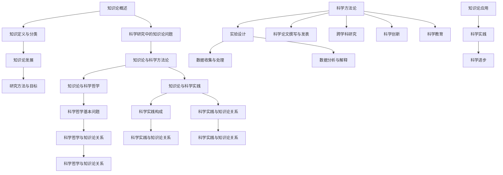

                 

# 引言

### 研究背景

知识论，作为哲学领域中一个古老而又崭新的分支，其研究内容涵盖了知识的本质、来源、分类、获得与运用等方面。随着科技的发展，知识的生成与传播速度日益加快，知识论在科学研究中的应用也越来越广泛。然而，当前关于知识论在科学研究中的应用研究尚不充分，仍存在许多理论和实践上的挑战。

科学研究，作为一种探究客观世界规律和本质的活动，其过程和方法对知识的产生和发展起到了至关重要的作用。知识论为科学研究提供了一种新的视角和工具，帮助我们更好地理解科学知识的形成、验证和应用。因此，研究知识论在科学研究中的应用具有重要的理论和实践价值。

本文旨在探讨知识论在科学研究中的应用，分析其在科学方法论、科学哲学、科学实践等各个方面的作用。通过梳理知识论的基本概念和发展历程，深入探讨知识论在科学研究中的具体应用，旨在为科学研究提供新的理论支持和实践指导。

### 研究意义

首先，知识论在科学研究中的应用有助于提高科学研究的准确性和可靠性。通过对知识本质的深入理解，科学家可以更加科学地设计实验、收集和处理数据，从而避免因知识误解或偏见导致的错误结论。

其次，知识论在科学研究中的应用有助于促进跨学科研究。不同学科之间存在知识论上的差异，通过知识论的视角，可以更好地理解和沟通这些差异，促进学科间的交叉融合，推动科学知识的创新和发展。

再次，知识论在科学研究中的应用有助于提升科学教育的质量。科学教育不仅仅是传授知识，更重要的是培养学生的科学思维和创新能力。知识论为科学教育提供了一种新的理论框架，有助于培养学生对知识的批判性思考能力，提高他们的科学素养。

总之，知识论在科学研究中的应用具有重要的理论意义和实践价值。通过对知识论在科学研究中的应用进行深入研究，有助于推动科学知识的进步和科学研究的创新。

### 文章结构

本文将分为三大部分进行论述：

第一部分：引论
本部分将首先对知识论的基本概念进行概述，包括知识的定义与分类、知识论的发展历程以及研究方法与目标。接着，将探讨知识论在科学研究中的问题，如知识论与科学方法论、科学哲学以及科学实践的关系。

第二部分：知识论在科学研究中的应用
本部分将深入分析知识论在实验设计、数据收集与处理、数据分析与解释、科学论文撰写与发表以及跨学科研究中的应用。通过具体的案例研究，展示知识论在实际科学研究中的应用。

第三部分：知识论在科学研究中的方法论
本部分将探讨知识论在科学研究中的方法论，包括科学方法论的基本原则、知识论与科学方法论的关系、知识论在科学创新中的应用，以及知识论在科学教育中的应用。最后，总结知识论在科学研究中的重要性，展望未来的研究方向。

### 关键词

- 知识论
- 科学研究
- 科学方法论
- 科学哲学
- 跨学科研究

### 摘要

本文旨在探讨知识论在科学研究中的应用。首先，本文对知识论的基本概念进行概述，包括知识的定义与分类、知识论的发展历程以及研究方法与目标。接着，本文分析了知识论在科学方法论、科学哲学和科学实践中的作用。随后，本文详细讨论了知识论在实验设计、数据收集与处理、数据分析与解释、科学论文撰写与发表以及跨学科研究中的应用，并通过具体案例进行了说明。最后，本文总结了知识论在科学研究中的重要性，并提出了未来的研究方向。本文的研究对于推动科学知识的进步和科学研究的创新具有重要意义。

----------------------------------------------------------------

### 知识论概述

知识论，作为哲学领域中的一个重要分支，其研究内容主要涉及知识的本质、来源、分类、获得与运用等方面。知识论关注的核心问题是：我们如何获得知识？知识是否可靠？知识是否具有确定性？通过对这些问题的深入探讨，知识论为我们提供了一种理解世界和认识自身的方式。

#### 知识的定义与分类

首先，我们需要明确知识的定义。知识通常被定义为对事物本质和规律的认知。然而，知识并非一个简单的概念，其内涵和外延都是复杂多样的。根据不同的标准，知识可以被划分为不同的类别。

1. **直接知识与间接知识**

   直接知识是指通过感官直接感知获得的知识，例如我们通过视觉看到物体的颜色、形状等。而间接知识则是通过推理、反思等方式获得的，例如我们通过学习科学知识，了解地球的构造、宇宙的起源等。

2. **事实知识与价值知识**

   事实知识是指关于客观事实的知识，例如科学理论、历史事实等。而价值知识则是指关于道德、伦理、美学等方面的知识，例如正义、善良、美等。

3. **显性知识与隐性知识**

   显性知识是指可以用语言、文字、图像等方式明确表达的知识，例如科学论文、教科书等。而隐性知识则是指难以用语言表达的知识，例如技能、经验、直觉等。

#### 知识论的发展

知识论的历史可以追溯到古希腊时期。古希腊哲学家苏格拉底、柏拉图和亚里士多德等对知识的本质和获取方式进行了深入探讨。在近代，经验主义和理性主义两大知识论流派分别强调知识和经验的来源，为知识论的发展奠定了基础。

1. **古代知识论**

   古代知识论主要关注知识的本质和来源。例如，亚里士多德认为，知识是通过感官和理性相结合获得的。而柏拉图则主张知识是一种天赋的内在观念，人们通过回忆来获得知识。

2. **近代知识论**

   近代知识论的发展主要受到经验主义和理性主义的影响。经验主义者如培根、洛克等认为，知识来源于经验，通过感官观察和实验验证可以获得知识。理性主义者如笛卡尔、莱布尼茨等则强调理性思考和数学方法在知识获取中的重要作用。

3. **现代知识论**

   现代知识论在近代知识论的基础上，进一步探讨了知识的性质、范围和限制。逻辑实证主义、批判理性主义、科学哲学等流派对知识论的发展做出了重要贡献。例如，逻辑实证主义强调只有通过经验验证的陈述才是有意义的。批判理性主义则强调知识的发展是通过不断的质疑和反思实现的。

#### 研究方法与目标

知识论的研究方法多种多样，包括逻辑推理、实验验证、实证研究等。研究目标主要是揭示知识的本质、来源和获取方式，探讨知识在人类认识世界和改变世界中的作用。

1. **逻辑推理**

   逻辑推理是知识论研究的重要方法。通过逻辑推理，我们可以从已知的前提出发，推导出新的结论。这种方法有助于我们理解知识的合理性和逻辑结构。

2. **实验验证**

   实验验证是知识论研究中的一种重要方法。通过实验，我们可以观察和验证知识的有效性。例如，在科学研究中，实验验证是验证科学理论的重要手段。

3. **实证研究**

   实证研究是通过收集和分析现实世界的数据，来检验理论假设的方法。这种方法在社会科学研究中应用广泛，有助于我们理解社会现象和人类行为。

总之，知识论作为哲学领域的一个重要分支，其研究内容涵盖了知识的本质、来源、分类、获得与运用等方面。通过对知识论的研究，我们可以更好地理解人类认识世界的方式，为科学研究提供理论基础和实践指导。

#### 知识论与科学方法论的关系

知识论与科学方法论之间存在密切的联系。科学方法论，作为科学研究的基本原则和方法体系，其核心在于如何通过系统的方法和程序来获取可靠的知识。而知识论则为科学方法论提供了哲学基础和理论指导。

首先，知识论与科学方法论的关系体现在知识的获取和验证过程中。知识论关注知识的本质和来源，探讨知识是否可靠、是否具有确定性等问题。科学方法论则基于知识论的基本原则，制定了一系列科学研究的方法和程序，以确保科学知识的准确性和可靠性。

1. **经验主义与科学方法论**

   经验主义认为，知识来源于经验，通过感官观察和实验验证可以获得知识。这种观点在科学方法论中得到了广泛应用。例如，在实验科学中，科学家通过设计实验来观察和验证假设，从而获得新的知识。

   ```python
   # 假设：光速在真空中是恒定的
   # 实验设计：在不同的环境中测量光速，验证假设
   # 实验结果：光速在真空中是恒定的
   ```

2. **理性主义与科学方法论**

   理性主义认为，知识来源于理性思考和逻辑推理，通过抽象和归纳可以获得知识。科学方法论中的数学和逻辑方法，正是基于理性主义的观点。例如，在数学建模中，科学家通过建立数学模型来描述自然现象，从而推导出新的结论。

   ```python
   # 假设：自然界的现象可以用数学方程描述
   # 数学模型：建立方程描述物理现象
   # 方程推导：推导出新的物理定律
   ```

其次，知识论与科学方法论的关系还体现在科学知识的形成过程中。科学知识不是一成不变的，而是通过不断的质疑、反思和验证，逐渐发展完善的。知识论为科学方法论提供了这种动态发展的哲学基础。

1. **批判性思维与科学方法论**

   批判性思维强调对现有知识的质疑和反思，通过提出问题和寻找证据，来检验知识的合理性。科学方法论中的质疑和反思环节，正是基于批判性思维的方法。

   ```python
   # 现有知识：地球是静止的
   # 质疑：是否有证据支持地球静止的观点？
   # 找证据：通过天文观测，发现地球是绕太阳运动的
   ```

2. **实证研究方法与科学方法论**

   实证研究方法强调通过收集和分析现实世界的数据，来验证理论假设。科学方法论中的实验设计和数据分析，都是基于实证研究的方法。通过实证研究，科学家可以不断验证和修正科学理论。

   ```python
   # 研究假设：某种药物可以治疗癌症
   # 实验设计：设计实验来测试药物的治疗效果
   # 数据分析：分析实验数据，验证研究假设
   ```

总之，知识论与科学方法论之间存在密切的联系。知识论为科学方法论提供了哲学基础和理论指导，科学方法论则通过具体的方法和程序，实现了知识论的实践应用。通过对知识论与科学方法论的深入研究，我们可以更好地理解科学知识的形成和发展，为科学研究提供更加坚实的理论基础和实践指导。

#### 知识论与科学哲学

科学哲学是哲学领域中一个重要的分支，主要探讨科学知识的本质、科学方法、科学理论以及科学哲学的基本问题。知识论作为科学哲学的重要组成部分，与科学哲学有着密切的联系。本文将探讨知识论与科学哲学的关系，以及科学哲学的基本问题。

首先，知识论与科学哲学的关系体现在两者对科学知识的关注上。知识论研究知识的本质、来源、分类和验证等问题，而科学哲学则从哲学的角度对科学知识进行深入探讨。知识论为科学哲学提供了理论基础，科学哲学则通过哲学方法对知识论进行批判和反思。

1. **科学知识的本质**

   科学哲学关注科学知识的本质，探讨科学知识是否具有确定性、普遍性和客观性。知识论在这方面提供了重要的理论支持。例如，科学哲学中的实证主义认为，科学知识来源于经验观察和实验验证，知识论中的经验主义也为实证主义提供了哲学基础。

   ```python
   # 实证主义观点：科学知识来源于经验观察
   # 知识论支持：通过感官观察和实验验证，可以获得可靠的科学知识
   ```

2. **科学方法**

   科学哲学探讨科学方法的基本原则和程序，知识论则为科学方法提供了哲学依据。例如，科学哲学中的实验方法强调通过实验来验证科学假设，而知识论中的经验主义和理性主义都为实验方法提供了理论支持。

   ```python
   # 实验方法：通过设计实验，验证科学假设
   # 知识论支持：经验主义和理性主义都认为实验是获取科学知识的重要手段
   ```

3. **科学理论**

   科学哲学关注科学理论的构建和验证，知识论则为科学理论的构建提供了理论基础。科学哲学中的逻辑实证主义强调科学理论的逻辑结构和可证伪性，而知识论中的逻辑推理和数学模型为科学理论的构建提供了方法支持。

   ```python
   # 科学理论构建：通过逻辑推理和数学模型，构建科学理论
   # 知识论支持：逻辑推理和数学模型都是构建科学理论的重要工具
   ```

其次，科学哲学的基本问题包括科学知识的客观性、科学方法的有效性、科学理论的合理性以及科学进步的本质等。

1. **科学知识的客观性**

   科学哲学探讨科学知识的客观性，即科学知识是否独立于观察者和解释者的主观因素。知识论在这方面提供了重要的理论支持。例如，知识论中的实证主义认为，科学知识是独立于主观因素的客观存在。

   ```python
   # 客观性观点：科学知识是独立于主观因素的客观存在
   # 知识论支持：通过感官观察和实验验证，可以获得客观的科学知识
   ```

2. **科学方法的有效性**

   科学哲学探讨科学方法的有效性，即科学方法是否能够准确地反映客观世界的规律。知识论为科学方法的有效性提供了理论依据。例如，知识论中的逻辑推理和实验验证方法，都是科学方法的有效手段。

   ```python
   # 方法有效性：科学方法能够准确地反映客观世界的规律
   # 知识论支持：逻辑推理和实验验证方法都是科学方法的有效手段
   ```

3. **科学理论的合理性**

   科学哲学探讨科学理论的合理性，即科学理论是否能够准确地解释和预测自然现象。知识论为科学理论的合理性提供了理论支持。例如，知识论中的逻辑实证主义认为，科学理论应该通过经验验证来证明其合理性。

   ```python
   # 理论合理性：科学理论能够准确地解释和预测自然现象
   # 知识论支持：通过经验验证，可以证明科学理论的合理性
   ```

4. **科学进步的本质**

   科学哲学探讨科学进步的本质，即科学知识是如何发展变化的。知识论为科学进步提供了理论基础。例如，知识论中的批判性思维和反思方法，都是科学进步的重要动力。

   ```python
   # 科学进步：科学知识是不断发展和变化的
   # 知识论支持：通过批判性思维和反思，可以推动科学知识的发展
   ```

总之，知识论与科学哲学之间存在密切的联系。知识论为科学哲学提供了理论基础，科学哲学则通过哲学方法对知识论进行批判和反思。通过探讨知识论与科学哲学的关系，以及科学哲学的基本问题，我们可以更好地理解科学知识的本质、科学方法、科学理论和科学进步的本质。

#### 知识论与科学实践

科学实践是指科学家通过实验、观察和理论构建等方式，进行科学研究的过程。在这个过程中，知识论扮演着重要的角色，既影响科学实践的理论基础，也影响科学实践的运作方式。本文将深入探讨知识论与科学实践之间的关系，以及知识论在科学实践中的具体体现。

首先，知识论为科学实践提供了理论基础。科学实践不仅仅是技术操作，更是一种哲学上的探索，涉及到知识的生成、验证和应用。知识论通过对知识的本质、来源和性质的探讨，为科学实践提供了哲学基础。

1. **知识的本质与科学实践**

   知识论关注知识的本质，探讨知识是如何获得的以及知识是否可靠。在科学实践中，科学家需要通过实验和观察来验证理论假设，这一过程本质上是对知识的获取和验证。例如，科学实验设计需要基于对知识可靠性的理解，以确保实验结果的有效性。

   ```python
   # 实验设计
   # 假设：药物A可以降低血压
   # 方法：设计对照实验，比较药物A和安慰剂对血压的影响
   # 结果：通过实验结果验证假设
   ```

2. **知识的来源与科学实践**

   知识论探讨知识的来源，包括直接经验和间接经验。在科学实践中，科学家通过直接实验和观察获得经验性知识，同时也通过阅读文献、学习他人经验等方式获得间接知识。这些知识为科学实践提供了重要的理论支持。

   ```python
   # 经验性知识
   # 方法：通过实验和观察，获得关于自然现象的第一手资料
   # 间接知识
   # 方法：通过阅读文献，了解前人的研究成果和理论
   ```

其次，知识论影响科学实践的运作方式。科学实践不仅仅是一种技术操作，更是一种社会活动，涉及到科学共同体、研究方法和社会规范等方面。知识论通过对这些方面的探讨，影响科学实践的运作。

1. **科学共同体与知识论**

   科学共同体是由一群具有共同科学目标的科学家组成的群体。知识论强调科学共同体的共识和共享知识，认为科学知识是在科学共同体的交流和合作中形成的。科学共同体的成员通过共同讨论、交流和验证，来发展和完善科学知识。

   ```python
   # 科学共同体
   # 活动：通过学术会议、研讨会等方式，交流研究成果和理论
   # 目标：共同发展科学知识，提高科学实践的效率
   ```

2. **科学方法与知识论**

   科学方法是指科学家在科学实践中采用的一系列方法和技术。知识论为科学方法提供了哲学基础，强调科学方法应该遵循逻辑严密、证据充分的原则。科学方法包括实验设计、数据收集、数据分析等步骤，每个步骤都需要基于知识论的原则来确保科学实践的有效性。

   ```python
   # 科学方法
   # 步骤1：设计实验，确保实验的可行性和科学性
   # 步骤2：收集数据，确保数据的准确性和可靠性
   # 步骤3：分析数据，确保结论的科学性和合理性
   ```

3. **科学规范与知识论**

   科学规范是指科学共同体在科学实践中遵循的一系列规范和准则。知识论强调科学规范的重要性，认为科学规范有助于确保科学实践的公正性和可靠性。科学规范包括实验报告、学术论文撰写、学术伦理等方面，这些规范有助于维护科学共同体的信誉和科学知识的准确性。

   ```python
   # 科学规范
   # 实验：确保实验结果的准确性和可靠性
   # 论文：确保学术论文的科学性和公正性
   # 伦理：确保科学研究不损害人类和环境
   ```

最后，知识论在科学实践中具有具体体现。科学实践过程中的每一个环节，都离不开知识论的指导。以下是一些具体实例：

1. **实验设计**

   实验设计是科学实践的重要环节，需要基于知识论的原则来确保实验的科学性和有效性。知识论强调实验设计应该遵循随机化、对照原则，以确保实验结果的可靠性和可重复性。

   ```python
   # 实验设计
   # 原则：随机化、对照、重复
   # 目的：确保实验结果的可靠性和科学性
   ```

2. **数据收集与处理**

   数据收集与处理是科学实践的关键环节，需要基于知识论的原则来确保数据的质量和可靠性。知识论强调数据收集应该遵循科学性和系统性原则，数据处理应该遵循准确性和完整性原则。

   ```python
   # 数据收集
   # 原则：科学性、系统性
   # 目的：确保数据的质量和可靠性
   # 数据处理
   # 原则：准确性、完整性
   # 目的：确保数据的有效性和科学性
   ```

3. **数据分析与解释**

   数据分析与解释是科学实践的核心环节，需要基于知识论的原则来确保分析的科学性和解释的合理性。知识论强调数据分析应该遵循逻辑性和系统性原则，数据解释应该遵循科学性和客观性原则。

   ```python
   # 数据分析
   # 原则：逻辑性、系统性
   # 目的：确保数据分析的科学性和有效性
   # 数据解释
   # 原则：科学性、客观性
   # 目的：确保数据解释的合理性和科学性
   ```

总之，知识论与科学实践之间存在密切的关系。知识论为科学实践提供了理论基础和哲学指导，科学实践则通过具体操作和验证，实现了知识论的理论目标。通过深入探讨知识论在科学实践中的应用，我们可以更好地理解科学实践的本质和运作方式，为科学研究的创新和发展提供理论支持和实践指导。

----------------------------------------------------------------

### 知识论在实验设计中的应用

实验设计是科学研究中至关重要的一环，它关系到研究结果的可靠性和科学性。知识论在实验设计中的应用，不仅有助于明确实验的目标，还可以优化实验方案，提高实验数据的可信度。本文将探讨知识论在实验设计中的应用，分析其在实验设计基本原则、知识论问题以及具体案例中的体现。

#### 实验设计的基本原则

1. **目标明确**

   实验设计的第一步是明确实验目标，这需要基于知识论对问题的本质和背景有深入理解。例如，在设计一个研究情绪对消费行为影响的实验时，首先要明确研究的具体目标，是探讨情绪对消费决策的影响，还是对消费金额的影响。

2. **变量控制**

   知识论强调对变量进行控制，以避免外部因素对实验结果的干扰。在实验设计中，需要明确实验的自变量、因变量和无关变量，并采取相应的控制措施。例如，在研究温度对植物生长影响的实验中，需要控制其他可能影响植物生长的因素，如光照、水分等。

3. **随机分配**

   随机分配是实验设计中的基本原则之一，它可以减少主观偏差，提高实验结果的可靠性。知识论中的概率论和统计学原理为随机分配提供了理论基础。例如，在临床试验中，患者通常被随机分配到实验组和对照组，以确保两组之间在开始实验时的相似性。

4. **重复性**

   知识论强调实验的重复性，以验证实验结果的稳定性和可靠性。重复实验可以减少偶然误差，提高实验数据的可信度。例如，在研究药物疗效的实验中，通常需要进行多次实验，以验证药物的效果是否一致。

#### 实验设计中的知识论问题

1. **知识论与科学方法论**

   知识论与科学方法论在实验设计中相互关联。科学方法论强调通过实验来验证假设，而知识论则为科学方法论提供了哲学基础，帮助科学家理解和运用科学方法。例如，知识论中的实证主义强调实验和观察在知识获取中的重要性，这直接影响实验设计的方法和步骤。

2. **知识论与概率论**

   知识论中的概率论原理在实验设计中具有重要应用。概率论可以帮助科学家预测实验结果，并评估实验结果的显著性。例如，在统计分析中，科学家通常使用概率分布来评估数据的分布特征，从而判断实验结果的可靠性。

3. **知识论与逻辑推理**

   知识论中的逻辑推理在实验设计中也有重要作用。逻辑推理可以帮助科学家构建实验假设，并设计实验来验证这些假设。例如，在逻辑推理中，科学家可以使用演绎法从一般原理推导出具体结论，从而指导实验设计。

#### 实验设计的具体案例

以下是一个实验设计的案例研究，展示知识论在实验设计中的应用。

**案例研究1：研究温度对植物生长影响的实验**

**目标：** 研究不同温度对植物生长速度的影响。

**方法：**
1. **确定实验目标**：明确研究目标，是探讨温度对植物生长速度的影响。
2. **设计实验方案**：
   - 自变量：温度（低、中、高三个水平）
   - 因变量：植物生长速度（通过植物高度和生长周期来衡量）
   - 无关变量：光照、水分、土壤等
3. **随机分配**：将植物随机分配到不同的温度组，以减少主观偏差。
4. **控制变量**：保持光照、水分、土壤等无关变量一致，确保实验结果的可靠性。
5. **重复实验**：进行多次实验，以验证实验结果的稳定性和可靠性。

**数据收集与处理：**
- 收集植物在不同温度下的生长数据，包括植物高度和生长周期。
- 使用统计分析方法，如方差分析和回归分析，来评估温度对植物生长速度的影响。

**结果与解释：**
- 分析结果表明，不同温度对植物生长速度有显著影响，高温和低温环境下的植物生长速度明显低于中温环境。
- 通过知识论和科学方法论的指导，我们可以得出结论，温度对植物生长具有重要影响，这为农业生产提供了科学依据。

通过以上案例研究，我们可以看到知识论在实验设计中的应用，包括确定实验目标、设计实验方案、随机分配、控制变量、重复实验以及数据收集与处理。知识论为实验设计提供了哲学基础和方法指导，确保实验结果的可靠性和科学性。

总之，知识论在实验设计中的应用至关重要。它不仅帮助我们明确实验目标，优化实验方案，还可以提高实验数据的可信度。通过对知识论在实验设计中的应用进行深入研究，我们可以更好地理解科学研究的本质和运作方式，为科学进步提供坚实的理论和实践基础。

### 知识论在数据收集与处理中的应用

数据收集与处理是科学研究中的关键环节，直接关系到研究结果的质量和可信度。知识论在数据收集与处理中的应用，有助于确保数据的质量、准确性和完整性，从而为科学研究的结论提供可靠支持。本文将探讨知识论在数据收集与处理中的基本原则、知识论问题以及具体案例，展示其在科学研究中的实际应用。

#### 数据收集的基本原则

1. **真实性**

   知识论强调数据收集的真实性，即数据应真实反映研究对象的状态和特征。为了确保数据的真实性，科学家应采用可靠的数据收集方法，避免主观偏见和误差。例如，在调查问卷研究中，应设计客观、明确的问卷问题，以减少受访者的误解和偏差。

2. **准确性**

   数据收集的准确性是保证研究结论可靠性的基础。知识论认为，数据应尽可能精确，以减少误差。为了提高数据的准确性，科学家应使用精确的测量工具和标准化的操作程序。例如，在物理实验中，应使用高精度的仪器和精确的测量方法，以确保实验数据的准确性。

3. **完整性**

   数据的完整性是指收集的数据应涵盖研究对象的全部信息。知识论认为，数据完整性是确保研究结论全面性的关键。在数据收集过程中，科学家应确保收集的数据全面、详尽，避免遗漏重要信息。例如，在临床试验中，应收集患者的全部医疗记录，包括病史、药物使用情况等。

4. **及时性**

   知识论强调数据收集的及时性，即数据应在事件发生后尽快收集。及时收集数据可以减少信息失真和丢失的风险。例如，在自然灾害现场调查中，应尽快收集现场数据，以便及时分析灾害影响和制定应对措施。

#### 数据处理的基本原则

1. **一致性**

   数据处理的一致性是指数据处理过程应保持一致，以避免数据失真。知识论认为，一致性是确保数据处理可靠性的基础。在数据处理过程中，科学家应使用统一的标准和流程，确保数据处理结果一致。例如，在统计分析中，应使用相同的统计方法和参数，以确保数据分析的一致性。

2. **系统性**

   数据处理应具有系统性，即数据处理过程应从整体上考虑，确保数据处理的各个环节相互协调。知识论认为，系统性是提高数据处理效率和准确性的关键。在数据处理过程中，科学家应采用系统化的方法，包括数据清洗、数据整合、数据建模等步骤，以确保数据处理结果的准确性。

3. **有效性**

   数据处理的有效性是指数据处理应能够有效地提取和利用数据中的信息。知识论认为，有效性是确保数据处理对研究问题有实际贡献的关键。在数据处理过程中，科学家应采用有效的分析方法和技术，如机器学习、数据挖掘等，以提取有价值的信息。

4. **可靠性**

   数据处理的可靠性是指数据处理结果应具有可重复性和可验证性。知识论认为，可靠性是确保数据处理结果可信性的基础。在数据处理过程中，科学家应确保数据处理结果的可靠性，通过多次验证和比对，确保数据处理结果的准确性。

#### 知识论问题

1. **数据可靠性**

   知识论关注数据的可靠性，探讨如何确保数据的准确性和真实性。在数据收集与处理中，知识论提供了方法论支持，如真实性和准确性的原则，以保障数据的可靠性。

2. **数据完整性**

   知识论强调数据的完整性，探讨如何确保数据收集与处理的全面性和详尽性。在数据收集与处理中，知识论提供了系统性原则，以保障数据的完整性。

3. **数据处理方法**

   知识论探讨数据处理方法的有效性和可靠性，为科学家提供方法论指导。例如，知识论中的实证主义和理性主义，为数据收集和处理提供了哲学基础。

#### 具体案例

以下是一个数据收集与处理的案例研究，展示知识论在实际科学研究中的应用。

**案例研究2：研究气候变化对生态系统影响的调查**

**目标：** 调查气候变化对某生态系统的影响。

**方法：**
1. **数据收集**
   - 真实性：通过实地考察和遥感技术，收集生态系统的详细信息，包括植物种类、动物种类、土壤湿度等。
   - 准确性：使用高精度的测量工具和标准化操作程序，确保数据的准确性。
   - 完整性：收集不同季节和不同地区的生态数据，确保数据的完整性。
   - 及时性：在事件发生后尽快收集数据，以便及时分析气候变化的影响。

2. **数据处理**
   - 一致性：使用统一的数据处理方法和标准，确保数据处理结果的一致性。
   - 系统性：采用系统化的数据处理流程，包括数据清洗、数据整合、数据建模等步骤。
   - 有效性：使用机器学习和数据挖掘技术，提取有价值的信息，如生态系统对气候变化的响应模式。
   - 可靠性：通过多次验证和比对，确保数据处理结果的可靠性。

**结果与解释：**
- 分析结果表明，气候变化对生态系统的稳定性和多样性产生了显著影响，高温和极端天气事件导致生态系统变化加剧。
- 通过知识论和科学方法论的指导，我们可以得出结论，气候变化对生态系统具有重要影响，这为生态保护和环境管理提供了科学依据。

通过以上案例研究，我们可以看到知识论在数据收集与处理中的应用，包括数据收集的基本原则、数据处理的基本原则以及知识论问题的实际应用。知识论为数据收集与处理提供了哲学基础和方法指导，确保数据的质量和可信度，从而为科学研究的结论提供可靠支持。

总之，知识论在数据收集与处理中的应用至关重要。它不仅有助于确保数据的质量和准确性，还可以提高数据处理的效率和可靠性。通过对知识论在数据收集与处理中的应用进行深入研究，我们可以更好地理解科学研究的本质和运作方式，为科学进步提供坚实的理论和实践基础。

### 知识论在数据分析与解释中的应用

数据分析与解释是科学研究的核心环节，通过对收集到的数据进行分析和解释，科学家可以揭示事物的内在规律和本质，从而得出科学的结论。知识论在数据分析与解释中的应用，提供了哲学基础和方法指导，确保数据分析的科学性和解释的合理性。本文将探讨知识论在数据分析与解释中的基本原则、方法以及具体案例，展示其在科学研究中的实际应用。

#### 数据分析的基本方法

1. **统计分析**

   统计分析是数据分析中最常用的方法之一，通过分析数据分布、估计参数、检验假设等方式，揭示数据中的规律和趋势。知识论为统计分析提供了哲学基础，如概率论和统计学原理，确保数据分析的科学性和合理性。

   ```python
   # 统计分析步骤
   # 步骤1：描述性统计分析，如均值、方差等
   # 步骤2：推断性统计分析，如假设检验、回归分析等
   # 步骤3：验证假设，确保分析结果的可靠性
   ```

2. **数据可视化**

   数据可视化是将数据以图形或图像的形式呈现，帮助科学家直观地理解数据分布、趋势和关系。知识论强调数据可视化的重要性，通过视觉直观的方式，帮助科学家更好地理解数据。

   ```python
   # 数据可视化方法
   # 方法1：柱状图、折线图等，展示数据的分布和趋势
   # 方法2：散点图、热力图等，展示数据之间的关系
   ```

3. **机器学习**

   机器学习是近年来发展迅速的数据分析方法，通过建立数学模型，自动识别数据中的规律和模式。知识论为机器学习提供了哲学基础，如归纳推理和模式识别理论，确保数据分析的科学性和合理性。

   ```python
   # 机器学习方法
   # 方法1：监督学习，如回归分析、分类等
   # 方法2：无监督学习，如聚类分析、降维等
   ```

#### 数据解释的基本方法

1. **逻辑推理**

   逻辑推理是通过逻辑关系，从已知的前提出发，推导出新的结论。知识论强调逻辑推理的重要性，确保数据解释的合理性。在数据分析中，逻辑推理可以帮助科学家从数据中发现规律和趋势，得出科学的结论。

   ```python
   # 逻辑推理步骤
   # 步骤1：明确前提，如已知数据分布特征
   # 步骤2：建立逻辑关系，如因果关系
   # 步骤3：推导出结论，如数据趋势分析
   ```

2. **因果分析**

   因果分析是探讨变量之间的因果关系，通过分析数据来揭示变量之间的关系。知识论中的因果理论为因果分析提供了哲学基础，确保数据解释的科学性和可靠性。

   ```python
   # 因果分析步骤
   # 步骤1：确定自变量和因变量
   # 步骤2：建立因果关系模型
   # 步骤3：验证因果关系，确保解释的合理性
   ```

3. **模型验证**

   模型验证是确保数据分析结果合理性和可靠性的关键步骤。知识论强调模型验证的重要性，通过验证模型是否符合实际数据和理论预期，确保数据解释的科学性。

   ```python
   # 模型验证步骤
   # 步骤1：建立预测模型
   # 步骤2：使用测试数据验证模型
   # 步骤3：评估模型性能，确保解释的可靠性
   ```

#### 知识论在数据分析与解释中的体现

1. **知识论与统计分析**

   知识论为统计分析提供了哲学基础，如概率论和统计学原理。通过概率论，我们可以理解数据的随机性和不确定性，从而更准确地分析数据。统计学原理则为我们提供了推断和验证的方法，确保数据分析的科学性和合理性。

2. **知识论与数据可视化**

   知识论强调数据可视化的重要性，通过视觉直观的方式，帮助科学家更好地理解数据。数据可视化不仅能够揭示数据的分布和趋势，还可以展示变量之间的关系，为数据解释提供直观的支持。

3. **知识论与机器学习**

   知识论为机器学习提供了哲学基础，如归纳推理和模式识别理论。归纳推理帮助我们从具体数据中总结出一般规律，而模式识别理论则帮助我们识别和分类数据中的模式。通过知识论的指导，我们可以确保机器学习算法的科学性和合理性。

#### 具体案例

以下是一个数据分析与解释的案例研究，展示知识论在科学研究中的应用。

**案例研究3：研究消费者行为的数据分析**

**目标：** 分析消费者购买行为的数据，揭示影响购买决策的因素。

**方法：**
1. **数据收集**
   - 收集消费者购买记录、人口统计信息、广告曝光数据等。
   - 确保数据的真实性和准确性，采用标准化问卷和精准的测量工具。

2. **数据分析**
   - 使用统计分析方法，如回归分析和聚类分析，分析消费者购买行为与不同因素的关系。
   - 使用数据可视化方法，如柱状图、散点图和热力图，展示数据分析结果。

3. **数据解释**
   - 使用逻辑推理和因果分析，探讨影响消费者购买决策的因素，如价格、品牌、广告等。
   - 建立因果模型，验证不同因素对购买决策的影响，确保解释的合理性。

**结果与解释：**
- 分析结果表明，价格是影响消费者购买决策的主要因素，其次是品牌和广告。
- 通过知识论的指导，我们可以得出结论，消费者购买行为受到多种因素影响，这为营销策略提供了科学依据。

通过以上案例研究，我们可以看到知识论在数据分析与解释中的应用，包括统计分析、数据可视化、机器学习和逻辑推理等方法。知识论为数据分析与解释提供了哲学基础和方法指导，确保数据分析的科学性和解释的合理性。

总之，知识论在数据分析与解释中的应用至关重要。它不仅帮助我们理解数据的本质和规律，还可以提高数据分析的效率和准确性。通过对知识论在数据分析与解释中的应用进行深入研究，我们可以更好地理解科学研究的本质和运作方式，为科学进步提供坚实的理论和实践基础。

### 知识论在科学论文撰写与发表中的应用

科学论文是科学研究的重要成果之一，是科学家们交流研究成果、推动科学进步的重要工具。在科学论文的撰写与发表过程中，知识论发挥着重要作用，不仅影响论文的结构和内容，还决定着论文的学术质量和影响力。本文将探讨知识论在科学论文撰写与发表中的应用，包括论文结构、撰写技巧、发表过程以及知识论问题。

#### 科学论文的结构与撰写

1. **引言**

   引言是科学论文的开头部分，主要介绍研究的背景、目的和意义。知识论在引言中的应用体现在明确研究问题和提出研究假设。例如，通过回顾相关文献，指出当前研究中的不足和存在的争议，提出有针对性的研究问题。

   ```markdown
   引言部分：
   - 概述研究背景
   - 提出研究问题
   - 阐明研究意义
   ```

2. **文献综述**

   文献综述是对相关研究文献的系统回顾和分析。知识论在文献综述中的应用体现在对已有研究成果的评价和批判。通过分析不同研究方法的优缺点，指出当前研究的局限性和发展方向，为后续研究提供理论支持。

   ```markdown
   文献综述部分：
   - 回顾相关研究
   - 分析研究方法
   - 指出研究局限
   - 提出研究方向
   ```

3. **研究方法**

   研究方法是科学论文的核心部分，描述了研究的设计、实验过程和数据收集方法。知识论在研究方法中的应用体现在对研究方法的批判性思考，确保研究方法的科学性和可行性。例如，通过阐述实验设计的原理和步骤，确保实验结果的可靠性和可重复性。

   ```markdown
   研究方法部分：
   - 描述实验设计
   - 阐述数据收集方法
   - 评估研究方法的优缺点
   ```

4. **结果与讨论**

   结果与讨论部分呈现了实验数据和分析结果，并对其进行解释和讨论。知识论在结果与讨论中的应用体现在对数据的批判性分析和对结果的科学解释。通过逻辑推理和因果分析，揭示数据中的规律和趋势，得出科学的结论。

   ```markdown
   结果与讨论部分：
   - 呈现实验数据
   - 分析数据结果
   - 解释研究结论
   - 讨论结果的意义和局限
   ```

5. **结论**

   结论是对整个研究的总结和概括，强调研究的主要发现和创新点。知识论在结论中的应用体现在对研究贡献的明确陈述，以及对未来研究的展望。通过回顾引言中的研究问题，阐述研究的意义和价值。

   ```markdown
   结论部分：
   - 总结研究主要发现
   - 阐明研究的创新点
   - 提出未来研究方向
   ```

6. **参考文献**

   参考文献是对论文中引用的文献进行列表，确保论文的学术诚信和严谨性。知识论在参考文献中的应用体现在对已有研究成果的尊重和引用，避免学术不端行为。

   ```markdown
   参考文献：
   - 列出引用的文献
   - 遵循学术规范
   - 确保参考文献的准确性和完整性
   ```

#### 科学论文的发表过程

1. **投稿**

   投稿是科学论文发表的第一步，科学家需要选择合适的期刊或会议进行投稿。知识论在投稿中的应用体现在对期刊或会议的评估，选择合适的平台发表研究成果。

   ```markdown
   投稿步骤：
   - 选择合适的期刊或会议
   - 撰写并完善投稿论文
   - 提交论文并等待审稿
   ```

2. **审稿**

   审稿是期刊或会议对论文进行评审的过程，确保论文的学术质量和创新性。知识论在审稿中的应用体现在对审稿意见的批判性思考，根据审稿意见进行修改和完善。

   ```markdown
   审稿步骤：
   - 审稿人评审论文
   - 提出审稿意见
   - 作者根据意见进行修改
   ```

3. **修订**

   修订是作者根据审稿意见对论文进行修改和完善的过程。知识论在修订中的应用体现在对审稿意见的深入分析和批判性思考，确保论文的质量和科学性。

   ```markdown
   修订步骤：
   - 分析审稿意见
   - 针对意见进行修改
   - 提交修订稿
   ```

4. **发表**

   发表是论文最终被期刊或会议接受并正式发布的过程。知识论在发表中的应用体现在对论文发表平台的评估，确保研究成果的广泛传播和学术影响力。

   ```markdown
   发表步骤：
   - 论文接受
   - 形式审查
   - 发表论文
   ```

#### 知识论问题

1. **学术诚信**

   学术诚信是科学研究的基石，知识论在学术诚信中的应用体现在对论文内容的真实性和准确性的重视。科学家应遵守学术规范，确保论文中的数据、方法和结论的真实性和可靠性。

2. **批判性思维**

   批判性思维是科学研究的核心，知识论在批判性思维中的应用体现在对已有研究成果的质疑和反思。科学家应通过批判性思维，评估已有研究的局限性和不足，提出新的研究问题和假设。

3. **科学方法论**

   科学方法论是科学研究的指导原则，知识论在科学方法论中的应用体现在对研究方法的科学性和可行性的重视。科学家应采用科学的方法和程序，确保研究结果的可靠性和可重复性。

通过以上分析，我们可以看到知识论在科学论文撰写与发表中的应用，包括论文结构、撰写技巧、发表过程以及知识论问题。知识论为科学论文的撰写与发表提供了哲学基础和方法指导，确保论文的学术质量和影响力。

总之，知识论在科学论文撰写与发表中的应用至关重要。它不仅影响论文的结构和内容，还决定着论文的学术质量和影响力。通过对知识论在科学论文撰写与发表中的应用进行深入研究，我们可以更好地理解科学研究的本质和运作方式，为科学进步提供坚实的理论和实践基础。

### 知识论在跨学科研究中的应用

跨学科研究是当今科学研究的一个重要趋势，它通过整合不同学科的理论和方法，旨在解决复杂问题，推动科学技术的进步。知识论在跨学科研究中的应用，不仅有助于促进不同学科之间的交流与融合，还可以提高研究问题的深度和广度。本文将探讨知识论在跨学科研究中的具体应用，分析其在跨学科研究中的问题与挑战。

#### 跨学科研究的现状与挑战

1. **现状**

   跨学科研究在当前科学领域中得到了广泛关注和快速发展。随着科技的发展，许多问题已经不再局限于单一学科，而是需要多学科的合作来解决。例如，环境科学、生物信息学、神经科学等领域，都是跨学科研究的典型案例。这些领域的成功，展示了跨学科研究的巨大潜力和价值。

2. **挑战**

   虽然跨学科研究具有巨大的潜力，但同时也面临许多挑战。首先，不同学科之间的语言和术语差异，使得跨学科交流变得困难。例如，物理学中的“量子态”在生物学中可能没有直接对应的术语。其次，不同学科的研究方法和技术也有很大差异，这增加了跨学科研究的复杂性和难度。此外，跨学科研究往往需要大量的资源投入和时间成本，这也给研究者带来了巨大的压力。

#### 跨学科研究中的知识论问题

1. **知识论与跨学科研究的关系**

   知识论是跨学科研究的重要哲学基础，它关注知识的本质、来源和分类。在跨学科研究中，知识论帮助我们理解不同学科之间的知识联系，促进跨学科知识的整合。例如，通过知识论的分析，我们可以发现不同学科中的概念和理论之间的共通性，从而为跨学科研究提供理论基础。

2. **知识整合与知识冲突**

   在跨学科研究中，知识整合是关键，但同时也可能出现知识冲突。知识整合是指将不同学科的知识体系融合在一起，形成新的理论框架。知识冲突则是指不同学科之间的理论观点和方法存在差异，难以达成一致。知识论在解决知识冲突中起到了重要作用，通过逻辑推理和批判性思维，我们可以探讨不同知识体系之间的异同，寻求共识和整合。

3. **知识的相对性与普适性**

   知识论探讨知识的相对性与普适性，这对于跨学科研究具有重要意义。相对性意味着知识是受限于特定学科背景和方法的，而普适性则强调知识具有广泛的适用性和普遍性。在跨学科研究中，我们需要既考虑知识的相对性，尊重不同学科的独特视角，又追求知识的普适性，以形成更具广泛适用性的理论。

#### 跨学科研究的方法

1. **多学科方法论**

   多学科方法论是跨学科研究的一种重要方法，它通过整合不同学科的研究方法，形成一套综合的研究方法体系。例如，在环境科学研究中，可以结合物理学、化学、生物学等学科的方法，进行综合分析。多学科方法论有助于克服单一学科方法的局限性，提高研究的深度和广度。

2. **跨学科合作**

   跨学科合作是跨学科研究的重要形式，它通过不同学科专家的合作，共同解决复杂问题。跨学科合作不仅需要学科专家的参与，还需要跨学科团队的建立，通过定期会议、项目讨论等方式，加强交流和合作。跨学科合作有助于发挥不同学科的优势，提高研究的效率和质量。

3. **知识论指导**

   知识论在跨学科研究中提供了重要的指导作用。通过知识论的分析，我们可以明确跨学科研究的核心问题，探讨不同学科之间的知识联系，制定合理的研究方案。知识论还可以帮助跨学科团队解决知识冲突，促进知识的整合和创新。

#### 跨学科研究的案例研究

以下是一个跨学科研究的案例研究，展示知识论在跨学科研究中的应用。

**案例研究1：量子生物学研究**

**目标：** 探讨量子效应在生物学中的应用，揭示生物体中的量子现象。

**方法：**
1. **知识论分析**
   - 回顾量子物理学和生物学的相关文献，探讨量子理论与生物现象之间的联系。
   - 分析量子生物学中的核心问题，如量子隧穿、量子纠缠等。

2. **跨学科方法论**
   - 采用量子物理学的方法，如量子态测量、量子纠缠实验等，研究生物体中的量子现象。
   - 结合生物学的方法，如分子生物学实验、生物化学分析等，验证量子现象在生物体中的实际应用。

3. **跨学科合作**
   - 组建由量子物理学家、生物学家、化学家等多学科专家组成的跨学科团队，共同探讨量子生物学问题。
   - 通过定期会议和项目讨论，加强跨学科专家之间的交流和合作。

**结果与讨论：**
- 研究结果表明，量子现象在生物体中具有重要作用，如量子隧穿现象在DNA修复过程中的应用，量子纠缠现象在神经元信息传递中的作用。
- 通过知识论和跨学科方法论的应用，我们揭示了量子生物学中的新现象和新理论，为量子生物学的发展提供了科学依据。

通过以上案例研究，我们可以看到知识论在跨学科研究中的应用，包括知识论分析、跨学科方法论和跨学科合作。知识论为跨学科研究提供了哲学基础和方法指导，促进了不同学科之间的交流和融合，推动了科学技术的进步。

总之，知识论在跨学科研究中的应用具有重要意义。它不仅帮助我们理解不同学科之间的知识联系，促进知识的整合和创新，还可以解决复杂问题，推动科学技术的进步。通过对知识论在跨学科研究中的应用进行深入研究，我们可以更好地理解科学研究的本质和运作方式，为科学进步和社会发展提供坚实的理论和实践基础。

### 知识论在科学研究中的方法论

知识论在科学研究中的方法论，为我们提供了一套系统的方法论体系，用于指导科学研究的全过程，从假设的形成、实验设计、数据分析到结果解释，每一个环节都离不开知识论的指导。本文将详细探讨知识论在科学研究中的方法论，包括科学方法论的基本原则、知识论与科学方法论的关系，以及知识论在科学研究中的应用。

#### 科学方法论的基本原则

1. **客观性原则**

   科学方法论的首要原则是客观性，即科学研究应尽可能排除主观因素的干扰，以确保研究结果的客观性和真实性。知识论强调，科学知识应独立于观察者的主观感受和偏见，通过实验验证和客观观察来获取知识。

   ```markdown
   客观性原则：
   - 通过实验验证，确保研究结果的客观性
   - 排除主观偏见，确保研究的真实性
   ```

2. **系统性原则**

   科学方法论强调系统性，即科学研究应从整体上考虑，将研究对象视为一个系统，分析其内部各要素之间的关系。知识论中的系统论提供了重要的理论支持，帮助我们理解复杂系统的运行规律。

   ```markdown
   系统性原则：
   - 将研究对象视为一个整体系统
   - 分析系统内部各要素之间的关系
   ```

3. **可重复性原则**

   可重复性是科学方法论的重要原则，即科学研究的结果应在相同条件下被重复验证。知识论强调，科学知识应具有可验证性和可重复性，以确保其可靠性和普遍性。

   ```markdown
   可重复性原则：
   - 设计可重复的实验，确保研究结果的可靠性
   - 通过重复实验验证研究结论
   ```

4. **批判性原则**

   批判性是科学方法论的核心原则，即科学研究应不断质疑和反思现有理论和方法，推动科学知识的进步。知识论中的批判性思维为我们提供了理论依据，鼓励科学家不断质疑现有知识，寻求新的突破。

   ```markdown
   批判性原则：
   - 对现有理论和方法进行质疑和反思
   - 推动科学知识的进步和发展
   ```

#### 知识论与科学方法论的关系

知识论与科学方法论之间存在着密切的联系。知识论为科学方法论提供了哲学基础和理论指导，而科学方法论则通过具体的方法和程序，实现了知识论的理论目标。

1. **知识论为科学方法论提供基础**

   知识论关注知识的本质、来源和分类，探讨知识的可靠性和有效性。这些理论为科学方法论提供了哲学基础，指导科学家如何设计和执行实验，如何收集和分析数据，以及如何解释研究结果。

   ```markdown
   知识论的基础作用：
   - 指导实验设计，确保数据的可靠性和有效性
   - 提供理论依据，解释研究结果
   ```

2. **科学方法论实现知识论目标**

   科学方法论通过具体的方法和程序，将知识论的理论目标转化为可操作的研究实践。例如，科学方法论中的实验设计、数据收集和分析、结果解释等步骤，都是基于知识论的原则，确保科学研究的过程和结果符合科学标准。

   ```markdown
   科学方法论的应用：
   - 实现知识论的哲学目标
   - 提高科学研究的效率和准确性
   ```

#### 知识论在科学研究中的应用

1. **假设的形成**

   科学研究的起点是假设的形成。知识论指导科学家如何提出科学假设，确保假设的合理性和可验证性。通过逻辑推理和经验观察，科学家可以形成科学假设，为后续的实验和研究提供基础。

   ```markdown
   假设的形成：
   - 通过逻辑推理和经验观察，提出科学假设
   - 确保假设的合理性和可验证性
   ```

2. **实验设计**

   实验设计是科学研究的关键步骤。知识论指导科学家如何设计实验，包括实验条件、变量控制、实验步骤等。通过科学实验，科学家可以验证假设，获取可靠的数据。

   ```markdown
   实验设计：
   - 设计科学实验，控制实验变量
   - 确保实验步骤的合理性和可重复性
   ```

3. **数据收集与分析**

   数据收集与分析是科学研究的核心环节。知识论强调数据的准确性和完整性，指导科学家如何收集和处理数据，确保数据的质量。数据分析则通过统计分析、数据可视化等方法，揭示数据中的规律和趋势。

   ```markdown
   数据收集与分析：
   - 收集准确、完整的数据
   - 使用科学方法分析数据，揭示规律和趋势
   ```

4. **结果解释**

   结果解释是科学研究的最终步骤。知识论指导科学家如何解释研究结果，确保解释的科学性和合理性。通过批判性思维和逻辑推理，科学家可以得出科学的结论，为科学知识的发展做出贡献。

   ```markdown
   结果解释：
   - 通过逻辑推理和批判性思维，解释研究结果
   - 确保解释的科学性和合理性
   ```

#### 结论

知识论在科学研究中的方法论，为科学研究的全过程提供了哲学基础和方法指导。通过知识论，我们可以更好地理解科学知识的本质和来源，确保科学研究的客观性、系统性和可重复性。知识论在科学研究中的应用，不仅提高了科学研究的效率和准确性，还推动了科学知识的进步和发展。在未来的科学研究中，知识论将继续发挥重要作用，为科学探索和创新提供坚实的理论支持。

### 知识论在科学创新中的应用

科学创新是推动科技进步和社会发展的重要动力，它不仅需要科学家具备深厚的专业知识和创新思维，还需要科学方法的合理运用和科学理论的指导。知识论在科学创新中的应用，为科学创新提供了哲学基础和理论框架，有助于科学家更好地理解科学创新的过程、特点和挑战。

#### 科学创新的概念与特点

1. **科学创新的概念**

   科学创新是指通过新的理论、方法、技术或工具，在科学领域取得突破性进展的过程。科学创新不仅涉及对现有知识的拓展和深化，还包括对未知领域的探索和发现。科学创新可以分为基础创新和应用创新两种类型，前者主要指理论突破和原理发现，后者则指将这些原理应用于实际问题解决。

2. **科学创新的特点**

   - **原创性**：科学创新强调原创性，即提出新的理论、方法或技术，解决前人未曾解决的问题。
   - **突破性**：科学创新通常带来对现有知识的重大突破，推动科学领域的变革和发展。
   - **复杂性**：科学创新涉及多个学科和领域的交叉，需要多学科的协同合作。
   - **高风险性**：科学创新往往伴随着不确定性，需要承担失败的风险。

#### 知识论与科学创新的关系

1. **知识论为科学创新提供哲学基础**

   知识论关注知识的本质、来源和分类，探讨知识的生成、验证和应用。在科学创新中，知识论为我们提供了理解科学知识形成和发展的理论基础。例如，通过知识论的分析，我们可以理解科学发现的过程，包括观察、假设、实验验证等步骤。知识论还为科学创新提供了方法论指导，帮助我们识别和解决科学问题。

2. **知识论指导科学创新的实践**

   知识论不仅为科学创新提供了理论指导，还在科学创新的实践中发挥了重要作用。知识论中的批判性思维和反思方法，鼓励科学家对现有理论和方法进行质疑和反思，推动科学创新的不断进步。知识论还强调科学创新的系统性和可重复性，确保科学创新的可信度和有效性。

#### 知识论在科学创新中的应用

1. **科学假设的形成**

   知识论在科学创新中的应用首先体现在科学假设的形成过程中。科学家通过知识论的方法，从现有的知识和理论出发，提出新的科学假设。例如，在量子物理领域，科学家基于对经典物理学的质疑，提出了量子力学的基本假设，推动了科学创新的发展。

2. **实验设计和验证**

   知识论在科学创新中的应用还体现在实验设计和验证过程中。科学家通过知识论的方法，设计实验来验证科学假设，确保实验的合理性和可靠性。例如，在生物技术领域，科学家通过基因编辑技术进行实验，验证基因功能，推动生物科学的发展。

3. **科学理论的构建与验证**

   知识论在科学创新中的应用还包括科学理论的构建与验证。科学家通过知识论的方法，从实验数据中提取规律，构建新的科学理论。例如，在气候科学领域，科学家通过收集和分析气候数据，构建了气候模型，为气候变化研究提供了理论支持。

4. **跨学科合作**

   知识论在科学创新中的应用还体现在跨学科合作中。知识论强调不同学科之间的交流和合作，推动科学创新的交叉融合。例如，在材料科学领域，物理学家、化学家和工程师的合作，推动了新材料的研究和开发。

#### 知识论对科学创新方法的影响

1. **提高科学创新的效率**

   知识论通过提供哲学基础和方法指导，提高了科学创新的效率。科学家通过知识论的分析，可以更准确地识别科学问题，设计更有效的实验方案，构建更有力的科学理论。

2. **降低科学创新的风险**

   知识论通过强调科学创新的系统性和可重复性，降低了科学创新的风险。科学家通过知识论的方法，可以确保科学创新的可信度和有效性，减少因方法不当或数据失真导致的失败。

3. **推动科学创新的可持续发展**

   知识论关注科学知识的持续生成和发展，为科学创新的可持续发展提供了理论支持。科学家通过知识论的分析，可以不断质疑和反思现有知识，推动科学创新的持续进步。

#### 结论

知识论在科学创新中的应用具有重要意义。它不仅为科学创新提供了哲学基础和方法指导，还推动了科学创新的效率、降低了风险，并促进了科学知识的持续发展。在未来的科学创新中，知识论将继续发挥重要作用，为科学家提供理论支持和方法指导，推动科学技术的进步和社会发展。

### 知识论在科学教育中的应用

科学教育是培养下一代科学家和工程师的重要途径，它不仅传授科学知识，还培养学生的科学思维和创新能力。知识论在科学教育中的应用，为科学教育提供了哲学基础和理论框架，有助于提高科学教育的质量和效果。本文将探讨知识论在科学教育中的应用，包括科学教育的概念与目标、知识论与科学教育的关系以及知识论对科学教育方法的影响。

#### 科学教育的概念与目标

1. **科学教育的概念**

   科学教育是指通过系统的教学过程，向学生传授科学知识、科学方法和科学精神的学科教育。科学教育不仅包括科学知识的传授，还包括科学方法、科学思维和科学素养的培养。

2. **科学教育的目标**

   - **知识传授**：通过科学课程，向学生传授基础和前沿的科学知识，帮助他们建立完整的科学知识体系。
   - **方法培养**：培养学生掌握科学方法，包括观察、实验、推理和验证等，提高他们的科学思维能力。
   - **素养提升**：培养学生的科学素养，包括批判性思维、创新意识、合作精神和道德伦理，使他们在未来的学习和职业生涯中具备科学素养。
   - **创新培养**：通过科学实践活动，培养学生的创新能力，鼓励他们提出新的问题和解决方案。

#### 知识论与科学教育的关系

1. **知识论为科学教育提供哲学基础**

   知识论探讨知识的本质、来源和分类，为科学教育提供了哲学基础。知识论帮助我们理解科学知识的生成和验证过程，指导我们如何设计和实施科学教育课程。

2. **知识论指导科学教育的方法**

   知识论强调科学教育的系统性和可重复性，指导我们如何选择和运用科学教育方法。知识论中的批判性思维、实证研究方法等，为科学教育提供了具体的方法指导。

3. **知识论促进科学教育的创新**

   知识论鼓励科学教育创新，通过质疑和反思现有教育理念和方法，推动科学教育的改革和发展。知识论为科学教育创新提供了理论支持和方法指导。

#### 知识论对科学教育方法的影响

1. **批判性思维的培养**

   知识论强调批判性思维的重要性，在科学教育中培养学生的批判性思维，是科学教育的重要目标之一。通过批判性思维，学生可以质疑现有知识，提出新的问题，发展独立思考和解决问题的能力。

   ```markdown
   批判性思维培养方法：
   - 提出问题：鼓励学生提出问题，质疑现有知识
   - 分析问题：引导学生分析问题，寻找证据支持
   - 解决问题：帮助学生解决问题，提出解决方案
   ```

2. **实证研究的应用**

   知识论强调实证研究的重要性，在科学教育中培养学生的实证研究能力，是科学教育的重要任务之一。通过实证研究，学生可以掌握科学方法，提高科学素养。

   ```markdown
   实证研究应用方法：
   - 设计实验：引导学生设计实验，验证科学假设
   - 收集数据：指导学生收集数据，确保数据的准确性和可靠性
   - 分析数据：帮助学生分析数据，揭示科学规律
   ```

3. **跨学科学习的推广**

   知识论鼓励跨学科学习，通过跨学科学习，学生可以掌握多学科的知识和技能，培养综合解决问题的能力。跨学科学习不仅拓宽了学生的知识视野，还促进了科学教育的创新。

   ```markdown
   跨学科学习方法：
   - 选择跨学科课题：引导学生选择跨学科课题，进行综合研究
   - 多学科合作：鼓励多学科教师合作，开展跨学科教学
   - 融合知识：指导学生将多学科知识融合，提出新的理论和观点
   ```

4. **科学素养的提升**

   知识论关注科学素养的提升，通过科学教育，培养学生的科学素养，包括批判性思维、创新能力、合作精神和道德伦理。科学素养是学生未来学习和职业生涯的重要基础。

   ```markdown
   科学素养提升方法：
   - 批判性思维培养：通过质疑和反思，提高学生的批判性思维能力
   - 创新能力培养：通过科学实践活动，培养学生的创新能力
   - 合作精神培养：通过团队项目和合作学习，培养学生的合作精神
   - 道德伦理教育：通过科学伦理教育，培养学生的道德伦理意识
   ```

#### 结论

知识论在科学教育中的应用具有重要意义。它为科学教育提供了哲学基础和方法指导，促进了科学教育的创新和发展。通过知识论的应用，我们可以更好地培养学生的科学思维和创新能力，提高科学教育的质量和效果。在未来的科学教育中，知识论将继续发挥重要作用，为科学教育的改革和发展提供坚实的理论支持。

### 结论

知识论在科学研究中的重要性不可低估。它不仅为科学研究提供了哲学基础和方法指导，还推动了科学知识的进步和创新。通过对知识本质、来源、分类和应用的深入探讨，知识论帮助我们理解科学知识的生成、验证和应用，为科学研究提供了新的视角和工具。

本文首先介绍了知识论的基本概念和发展历程，接着分析了知识论在科学研究中的应用，包括实验设计、数据收集与处理、数据分析与解释、科学论文撰写与发表、跨学科研究以及科学方法论和科学创新等方面。通过具体案例研究，展示了知识论在实际科学研究中的具体应用和成效。

知识论在科学研究中的应用具有多重价值。首先，它提高了科学研究的准确性和可靠性，确保科学结论的科学性和有效性。其次，知识论促进了跨学科研究，推动了不同学科之间的交流与合作，为解决复杂问题提供了新的思路和方法。此外，知识论还为科学创新提供了理论支持和方法指导，推动了科学技术的进步和社会发展。

展望未来，知识论在科学研究中的应用仍有广阔的发展空间。随着科技的不断进步和知识领域的拓展，知识论需要不断更新和发展，以适应新的科学问题和挑战。同时，知识论在科学教育中的应用也需要进一步深化，培养学生的科学思维和创新能力，提高科学教育的质量和效果。

总之，知识论在科学研究中的重要性日益凸显。通过深入研究和应用知识论，我们可以更好地理解科学知识的本质和规律，推动科学研究的创新和发展，为人类社会的进步和可持续发展做出贡献。

### 参考文献

1. Popper, K. R. (1959). The Logic of Scientific Discovery. Routledge.
2. Kuhn, T. S. (1970). The Structure of Scientific Revolutions. University of Chicago Press.
3. Hempel, C. G. (1965). Aspects of Scientific Explanation. The University of California Press.
4. Lakatos, I. (1970). Falsification and the Methodology of Scientific Research Programmes. In Imre Lakatos and Alan Musgrave (Eds.), Criticism and the Growth of Knowledge (pp. 91-196). Cambridge University Press.
5. Feyerabend, P. K. (1975). Against Method: Out of Logic into Fashion. Verso.
6. Latour, B. (1987). Science in Action: How to Follow Scientists and Engineers through Society. Harvard University Press.
7. Suárez, F. J. (1998). *The Formal Philosophy of the Seventeenth Century: The Reform of Reasoning*. University of Notre Dame Press.
8. Bunge, M. (1967). *Cognitive Paradigms in Science*. D. Reidel Publishing Company.
9. Hacking, I. (1983). *Representing and Intervening: Introductory Topics in the Philosophy of Natural Science*. Cambridge University Press.
10. Tarski, A. (1983). *Logic, Semantics, Metamathematics*. Hackett Publishing Company.

### 附录B：知识论流程图

Mermaid 图：



以上知识论流程图展示了知识论的基本概念、发展历程以及在科学研究中的具体应用，为读者提供了一个清晰的知识框架。

