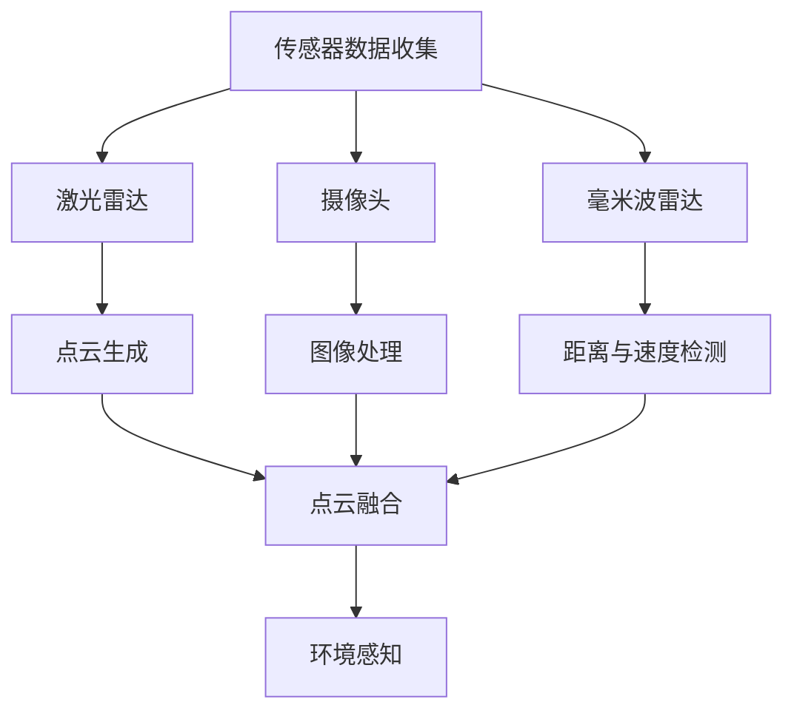
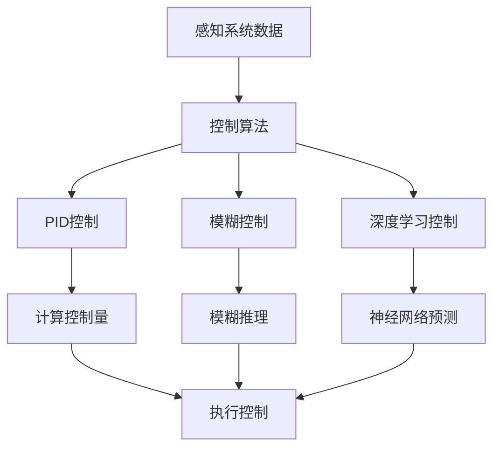

                 

### 《硅谷自动驾驶汽车的社会影响》

> **关键词：** 自动驾驶汽车、社会影响、交通系统、就业市场、法律与伦理、全球趋势、项目实战、案例分析

> **摘要：** 本文将从多个维度深入探讨硅谷自动驾驶汽车技术的发展及其对社会产生的深远影响，包括对交通系统、就业市场、法律与伦理问题以及全球趋势的探讨。通过详细分析自动驾驶汽车的核心技术、社会影响及案例分析，我们旨在为读者提供一个全面而深刻的理解。

### 《硅谷自动驾驶汽车的社会影响》目录大纲

**第一部分：自动驾驶汽车技术概述**

**第1章：自动驾驶汽车的发展历程与现状**

**第2章：自动驾驶汽车的核心技术**

**第三部分：自动驾驶汽车的社会影响**

**第5章：自动驾驶汽车对交通系统的影响**

**第6章：自动驾驶汽车对就业市场的影响**

**第7章：自动驾驶汽车的法律与伦理问题**

**第8章：自动驾驶汽车的全球趋势与发展前景**

**第四部分：项目实战与案例分析**

**第9章：自动驾驶汽车项目实战**

**第10章：自动驾驶汽车案例分析**

**附录**

**附录 A：自动驾驶汽车相关资源与工具**

#### 第一部分：自动驾驶汽车技术概述

**第1章：自动驾驶汽车的发展历程与现状**

自动驾驶汽车，作为现代智能交通系统的重要一环，其发展历程充满了科技创新与产业变革的篇章。本章将详细回顾自动驾驶汽车的发展历程，分析其现状，并探讨面临的挑战。

##### **1.1 自动驾驶汽车的定义与分类**

自动驾驶汽车，即无需驾驶员操控即可实现自主行驶的汽车。根据国际自动机工程师学会（SAE）的分类，自动驾驶汽车分为五个级别，从0级（完全人工驾驶）到5级（完全无人驾驶）。现阶段，硅谷的自动驾驶技术主要集中在L3（部分自动驾驶）和L4（高度自动驾驶）级别。

##### **1.2 自动驾驶技术的发展历程**

自动驾驶技术的起源可以追溯到20世纪50年代，但真正实现突破是在21世纪。以下是自动驾驶技术的主要发展历程：

- **20世纪50年代**：自动驾驶的概念首次提出。
- **20世纪80年代**：卡内基梅隆大学等研究机构开始进行自动驾驶车辆的实验。
- **21世纪初**：谷歌等科技公司加入自动驾驶研发，标志着自动驾驶技术的商业化进程加速。
- **2010年代**：特斯拉等公司推出配备自动驾驶功能的车型，自动驾驶技术开始走进公众视野。

##### **1.3 自动驾驶汽车在硅谷的兴起**

硅谷作为全球科技创新的中心，自动驾驶汽车的研发与应用亦在这里蓬勃发展。以下是硅谷自动驾驶汽车兴起的主要因素：

- **科技巨头参与**：谷歌、特斯拉、苹果等公司在自动驾驶领域进行大规模投资。
- **研发环境优越**：硅谷拥有世界一流的研究机构和人才资源。
- **政策支持**：加州政府积极推动自动驾驶汽车测试和应用。
- **数据优势**：硅谷的科技公司拥有大量的数据资源，为自动驾驶算法优化提供了支持。

##### **1.4 自动驾驶汽车的现状与挑战**

目前，自动驾驶汽车已经在多个领域取得突破，但仍面临一系列挑战：

- **技术挑战**：感知系统、控制算法和路径规划等技术仍需进一步优化。
- **法律法规**：各国对自动驾驶汽车的法律框架尚不完善。
- **社会接受度**：公众对自动驾驶汽车的信任度尚需提高。
- **商业运营**：自动驾驶汽车的商业模式和盈利模式仍需探索。

**总结**：

自动驾驶汽车的发展是智能交通系统的重要组成部分，硅谷在这一领域具有明显的优势。尽管面临诸多挑战，但随着技术的不断进步和社会的逐步接受，自动驾驶汽车有望在未来发挥重要作用。

### **第2章：自动驾驶汽车的核心技术**

自动驾驶汽车的成功离不开核心技术的支持。本章将深入探讨自动驾驶汽车的关键技术，包括感知系统与传感器融合、控制算法与路径规划以及自动驾驶汽车的数学模型。

##### **2.1 感知系统与传感器融合**

感知系统是自动驾驶汽车的核心，它负责收集车辆周围的环境信息，如路况、障碍物、车道线等。传感器融合技术则将这些传感器数据整合，以提高感知的准确性和可靠性。

- **激光雷达（LiDAR）**：激光雷达通过发射激光脉冲并测量返回时间来构建周围环境的三维模型。其优点是高分辨率和准确度，但成本较高。
- **摄像头**：摄像头用于检测颜色、形状和纹理，广泛应用于识别交通标志、行人、车辆等。其优点是成本低，但受光线和天气条件影响较大。
- **毫米波雷达**：毫米波雷达通过发射毫米波信号并接收反射波来检测物体距离和速度。其优点是穿透性强，但在恶劣天气下性能下降。

**Mermaid流程图：感知系统架构**



##### **2.2 控制算法与路径规划**

控制算法是自动驾驶汽车的核心，它负责根据感知系统的信息进行车辆控制，包括加速、减速和转向等。路径规划则负责规划车辆的行驶路线，确保车辆安全、高效地到达目的地。

- **控制算法基本原理**：控制算法通常基于PID控制、模糊控制和深度学习等。PID控制通过比例、积分和微分三个参数调整控制量；模糊控制通过模糊逻辑处理不确定性；深度学习则通过神经网络学习环境特征。

**伪代码：PID控制算法**

```python
# 初始化参数
Kp = 1.0
Ki = 0.1
Kd = 0.5
setpoint = 100
process_variable = 0

# 循环执行控制操作
while True:
    error = setpoint - process_variable
    delta_error = error - previous_error
    integral = integral + error
    
    control_variable = Kp * error + Ki * integral + Kd * delta_error
    
    previous_error = error
    
    # 执行控制操作
    execute_control(control_variable)
```

- **路径规划算法与实现**：路径规划算法包括基于采样的RRT（快速随机树）算法、基于图的A*算法和基于物理的碰撞检测等。RRT算法通过随机采样和最近邻搜索生成路径，A*算法通过估价函数寻找最优路径，碰撞检测则确保路径的可行性。

**Mermaid流程图：控制算法架构**



##### **2.3 自动驾驶汽车的数学模型**

自动驾驶汽车的数学模型用于描述车辆的运动状态和行为。以下是一些关键模型：

- **运动学模型**：描述车辆的位移、速度和加速度等。
  - **线性运动学模型**：\( x(t) = x_0 + v_0t + \frac{1}{2}at^2 \)
  - **非线性运动学模型**：使用贝塞尔曲线等复杂函数描述。

- **动力学模型**：描述车辆的受力情况。
  - **牛顿第二定律**：\( F = ma \)
  - **李雅普诺夫稳定性理论**：确保系统稳定性。

- **轨迹规划模型**：描述车辆的行驶路径。
  - **贝塞尔曲线**：用于平滑轨迹生成。
  - **延拓公式**：\( L = \frac{dx}{dt} \)，用于计算速度控制。

**示例：轨迹规划中的数学公式应用**

假设使用贝塞尔曲线进行轨迹规划，曲线参数如下：

\[ x(t) = x_0 + h \cos(\theta) \]
\[ y(t) = y_0 + h \sin(\theta) \]

其中，\( h \) 为曲线高度，\( \theta \) 为曲线角度。通过调整 \( h \) 和 \( \theta \) 可以生成不同的轨迹。

**总结**：

自动驾驶汽车的核心技术包括感知系统、控制算法和路径规划等。这些技术的结合使得自动驾驶汽车能够安全、高效地行驶。尽管面临挑战，但随着技术的不断进步，自动驾驶汽车有望在未来实现更广泛的应用。

### **第3章：自动驾驶汽车对交通系统的影响**

自动驾驶汽车的出现将对交通系统产生深远的影响，包括交通流量与效率的提升、对交通规划与基础设施的需求，以及与公共交通系统的相互影响。本章将详细分析这些方面的影响。

##### **3.1 自动驾驶汽车对交通流量与效率的影响**

自动驾驶汽车通过优化车辆之间的通信和协同，有望显著提高交通流量和效率。以下是一些具体的影响：

- **减少交通事故**：自动驾驶汽车可以避免由人为失误引起的交通事故，从而减少交通拥堵。
- **提高车辆利用率**：自动驾驶汽车可以实现车辆的自动驾驶和共享，提高车辆的利用率，减少空驶率。
- **智能交通管理**：通过车联网技术，自动驾驶汽车可以实时传输路况信息，帮助交通管理部门进行智能交通管理，减少交通拥堵。

**示例**：假设在繁忙的城市交通中，自动驾驶汽车通过车联网实现车辆间的通信，可以提前预测前方道路的拥堵情况，并选择最优路径，从而减少整体交通时间。

##### **3.2 自动驾驶汽车对交通规划与基础设施的需求**

自动驾驶汽车的普及将带来新的交通规划与基础设施需求：

- **智能道路**：自动驾驶汽车需要具备高精度定位和导航功能，因此智能道路系统将成为必要的基础设施。智能道路可以通过传感器和通信设备为自动驾驶汽车提供实时路况信息。
- **交通信号优化**：自动驾驶汽车可以与交通信号系统进行协同，实现信号灯的智能调节，提高交通效率。
- **停车场管理**：自动驾驶汽车可以实现自主泊车，减少停车场的空间需求，提高停车效率。

**示例**：在一个智能城市中，自动驾驶汽车通过智能道路系统和交通信号系统实现高效的车辆调度，减少了交通拥堵和停车难题。

##### **3.3 自动驾驶汽车对公共交通系统的影响**

自动驾驶汽车将对公共交通系统产生重要影响：

- **公交系统优化**：自动驾驶公交车辆可以实现更灵活的线路规划，提高公交服务的覆盖范围和效率。
- **共享出行模式**：自动驾驶出租车和共享出行服务将替代部分传统出租车和公共交通服务，改变人们的出行方式。
- **交通需求减少**：随着自动驾驶汽车的普及，人们的出行依赖度可能降低，减少对公共交通的需求。

**示例**：在一个智慧城市中，自动驾驶公交车辆根据实时交通需求和乘客需求进行动态调度，提高了公交服务的效率和乘客满意度。

**总结**：

自动驾驶汽车对交通系统的影响是全方位的，不仅提高了交通流量和效率，还推动了交通规划与基础设施的升级。同时，自动驾驶汽车与公共交通系统的融合将带来新的出行模式，改变人们的出行习惯。随着技术的不断进步，自动驾驶汽车有望在交通系统中发挥更大的作用。

### **第4章：自动驾驶汽车对就业市场的影响**

自动驾驶汽车的兴起不仅改变了交通系统，也对就业市场产生了深远的影响。本章将探讨自动驾驶汽车对传统职业的冲击、带来新职业机会，以及与共享经济的关系。

##### **4.1 自动驾驶汽车对传统职业的影响**

自动驾驶汽车的普及将对许多传统职业产生冲击：

- **司机职业**：自动驾驶汽车的广泛应用将减少对司机的需求，特别是出租车、公交车和货车司机等职业。根据一些预测，到2030年，全球司机职业将减少数百万个职位。
- **交通规划师**：自动驾驶汽车将改变交通系统，对交通规划师的工作方式产生挑战。他们需要适应新的交通模式，设计智能城市基础设施。
- **汽车维修工**：由于自动驾驶汽车故障率较低，对汽车维修工的需求将减少。然而，自动驾驶汽车的新技术（如电池、传感器等）也将带来新的维修需求。

##### **4.2 自动驾驶汽车带来的新职业机会**

尽管自动驾驶汽车对某些职业产生了冲击，但它也创造了大量新的就业机会：

- **自动驾驶系统开发者**：自动驾驶汽车需要大量的软件开发人员，包括控制算法、路径规划、感知系统等。
- **车联网工程师**：自动驾驶汽车依赖车联网技术进行数据传输和通信，因此需要专业的车联网工程师。
- **自动驾驶测试员**：自动驾驶汽车的测试和验证是确保其安全性的关键，需要专业的测试员进行测试和评估。
- **智能城市规划师**：自动驾驶汽车的普及将推动智能城市的发展，需要智能城市规划师来设计和管理智能交通系统。

##### **4.3 自动驾驶汽车与共享经济**

自动驾驶汽车与共享经济的结合将带来新的商业模式和就业机会：

- **共享出行服务**：自动驾驶汽车将提高共享出行服务的效率，减少人力成本，创造新的就业机会，如自动驾驶出租车司机和共享出行平台运营人员。
- **智慧物流**：自动驾驶货车和无人配送车将改变物流行业的运作模式，创造新的物流职位，如自动驾驶物流司机和物流系统管理师。
- **智能交通管理员**：智能交通系统需要专业的管理员来维护和管理，创造新的就业机会。

**示例**：假设在一个智慧城市中，自动驾驶出租车与共享出行平台结合，大幅提高了出行效率。乘客可以通过手机应用预约自动驾驶出租车，实现“一键叫车”服务。这种新模式不仅创造了新的就业机会，还提升了城市的交通管理水平。

**总结**：

自动驾驶汽车对就业市场的影响是双重的，既带来了传统职业的挑战，也创造了大量新职业机会。同时，自动驾驶汽车与共享经济的结合将进一步推动就业市场的变革。随着技术的不断进步，自动驾驶汽车有望在就业市场中发挥更大的作用。

### **第5章：自动驾驶汽车的法律与伦理问题**

自动驾驶汽车的兴起带来了前所未有的技术革命，但也引发了一系列法律与伦理问题。本章将探讨自动驾驶汽车的法律框架、伦理挑战以及责任归属与保险等问题。

##### **5.1 自动驾驶汽车的法律框架**

自动驾驶汽车的法律框架在不同国家和地区存在差异。以下是一些关键的法律框架：

- **美国**：美国联邦政府和各州政府纷纷出台法规，规范自动驾驶汽车的测试和商用。例如，联邦政府发布了《自动驾驶汽车政策》指导框架，加州和亚利桑那州等地也制定了具体的法规。
- **欧洲**：欧盟通过《自动驾驶车辆法规》，对自动驾驶汽车的设计、测试和商业化进行了详细规定。此外，各成员国也制定了各自的法律法规。
- **中国**：中国政府发布了《智能网联汽车道路测试管理规范》，明确了自动驾驶汽车的测试标准和管理流程。

**示例**：在美国，自动驾驶汽车公司需要遵循联邦公路安全管理局（NHTSA）的规定，进行安全测试和认证。加州要求自动驾驶汽车在公共道路上行驶时必须配备安全驾驶员。

##### **5.2 自动驾驶汽车的伦理挑战**

自动驾驶汽车在设计和应用过程中面临一系列伦理挑战：

- **安全责任**：在自动驾驶汽车发生事故时，责任归属问题成为一个重要伦理议题。是制造商、软件开发者，还是车辆使用者应承担责任？
- **道德决策**：自动驾驶汽车在紧急情况下可能需要做出道德决策，例如在避免碰撞行人和碰撞车辆之间做出选择。这些决策应基于何种伦理原则？
- **隐私保护**：自动驾驶汽车依赖大量的数据收集，包括车辆位置、行驶路线等，如何保护用户的隐私成为一个重要问题。

**示例**：在2018年，一辆特斯拉自动驾驶汽车在美国发生了一起致命事故，引发了对自动驾驶汽车安全性和伦理责任的广泛讨论。事故中，车辆未能及时识别横穿马路的行人，引发了关于自动驾驶汽车伦理决策的讨论。

##### **5.3 自动驾驶汽车责任归属与保险**

责任归属与保险问题是自动驾驶汽车商业化的关键障碍：

- **制造商责任**：制造商应承担一定程度的责任，特别是在自动驾驶系统的设计、制造和测试过程中。然而，具体责任比例和赔偿标准尚不明确。
- **保险公司的角色**：保险公司需要调整保险政策，以覆盖自动驾驶汽车的潜在风险。例如，开发新的保险产品，如自动驾驶车辆责任保险。
- **共享责任**：政府、制造商和保险公司可能需要共同承担责任，通过法律框架和保险合同明确各方责任。

**示例**：在美国，一些州已经开始要求自动驾驶汽车制造商购买第三方责任保险，以确保在发生事故时能够赔偿受害者的损失。

**总结**：

自动驾驶汽车的法律与伦理问题复杂多样，涉及到责任归属、道德决策和隐私保护等方面。随着技术的不断进步，各国政府和企业需要制定相应的法律法规和伦理准则，以确保自动驾驶汽车的安全和公平应用。同时，保险公司和制造商也需要调整业务策略，以应对新的责任和风险。

### **第6章：自动驾驶汽车的全球趋势与发展前景**

自动驾驶汽车作为未来交通系统的重要创新，全球范围内的趋势和发展前景备受关注。本章将分析全球自动驾驶汽车的政策与环境、商业化进程，并探讨未来趋势。

##### **6.1 全球自动驾驶汽车政策与环境**

全球各国政府纷纷出台政策，推动自动驾驶汽车的研发和应用：

- **美国**：美国政府通过《自动化驾驶系统政策》等指导文件，支持自动驾驶汽车的测试和商业化。多个州制定了具体的法规，为自动驾驶汽车提供良好的法律环境。
- **欧洲**：欧盟通过《自动驾驶车辆法规》和《智能交通系统指令》，推动自动驾驶汽车的发展。各国政府也在积极制定相关法规，为自动驾驶汽车提供支持。
- **中国**：中国政府发布了《智能网联汽车发展规划》，明确自动驾驶汽车的发展目标和时间表。多个城市建立了自动驾驶汽车测试区，推动自动驾驶技术的商业化。

**示例**：在美国，加利福尼亚州和亚利桑那州等地为自动驾驶汽车测试提供了丰富的资源和政策支持，吸引了大量自动驾驶汽车公司进行试验。

##### **6.2 自动驾驶汽车的商业化进程**

自动驾驶汽车的商业化进程稳步推进，各大公司积极投入研发和试验：

- **特斯拉**：特斯拉作为领先的电动汽车制造商，其自动驾驶技术处于行业前列。特斯拉的自动驾驶系统已经实现了部分自动驾驶功能，并逐渐向用户推广。
- **谷歌**：谷歌的自动驾驶子公司Waymo在自动驾驶技术研发和商业化方面取得了显著进展。Waymo已在美国多个城市提供自动驾驶出租车服务，积累了大量运营数据。
- **福特**：福特公司投资自动驾驶技术，与多家科技公司合作，开发自动驾驶汽车。福特计划在未来几年内推出具备L4级别自动驾驶功能的车型。

**示例**：2021年，福特与博世合作，在德国斯图加特市开展了自动驾驶出租车试点项目，为市民提供自动驾驶出行服务。

##### **6.3 自动驾驶汽车的未来趋势**

自动驾驶汽车的未来发展趋势主要包括以下几个方面：

- **全自动驾驶**：随着技术的不断进步，全自动驾驶汽车（L5级别）有望在未来几年内实现。全自动驾驶汽车将完全无需人类干预，实现完全自主的行驶和导航。
- **智能交通系统**：自动驾驶汽车将与智能交通系统深度融合，实现车辆间的通信和协同，提高交通流量和效率。智能交通系统将基于大数据、云计算和物联网技术，实现更智能的交通管理。
- **绿色出行**：自动驾驶汽车与电动汽车的结合将推动绿色出行理念的普及，减少碳排放和环境污染。自动驾驶电动汽车将实现更高效的能源利用和更低的运营成本。

**示例**：未来，自动驾驶电动汽车有望在智能城市的交通系统中发挥重要作用。通过车联网技术，自动驾驶汽车将实现车辆与基础设施的实时通信，实现交通流量的优化和能源的合理分配。

**总结**：

自动驾驶汽车作为未来交通系统的重要组成部分，全球范围内的趋势和发展前景充满机遇。各国政府和企业纷纷出台政策，推动自动驾驶汽车的研发和应用。随着技术的不断进步，自动驾驶汽车有望在交通系统中发挥更大的作用，推动智能交通系统的发展，实现绿色出行。

### **第7章：自动驾驶汽车项目实战**

在本章中，我们将通过一个自动驾驶汽车项目的实战案例，详细讲解项目开发环境搭建、源代码实现以及代码解读与分析。通过这个案例，读者可以深入了解自动驾驶汽车项目的实现过程，掌握相关技术的应用。

##### **7.1 项目实战概述**

我们的项目目标是实现一个简单的自动驾驶汽车系统，该系统可以基于激光雷达和摄像头感知环境，并使用控制算法实现车辆的自主行驶。项目分为以下几个阶段：

1. **开发环境搭建**：配置开发工具和依赖库。
2. **感知系统实现**：使用激光雷达和摄像头获取环境数据，并进行数据处理。
3. **控制算法实现**：基于感知数据，实现车辆的自动驾驶控制算法。
4. **集成与测试**：将感知系统与控制算法集成，进行系统测试和调试。

##### **7.2 开发环境搭建**

首先，我们需要搭建项目开发环境。以下是具体的步骤：

1. **安装操作系统**：选择Linux或Windows操作系统。
2. **安装开发工具**：安装Python编程环境，配置PyCharm或VSCode等IDE。
3. **安装依赖库**：安装激光雷达和摄像头相关的依赖库，如ROS（Robot Operating System）和OpenCV。

**示例**：

```bash
# 安装ROS
sudo apt-get update
sudo apt-get install ros-melodic-desktop-full

# 安装OpenCV
pip install opencv-python
```

##### **7.3 源代码实现**

以下是感知系统和控制算法的源代码实现：

**感知系统实现**：

```python
import rospy
from sensor_msgs.msg import LaserScan
from sensor_msgs.msg import Image
import cv2

# 激光雷达数据处理
def laser_callback(data):
    # 处理激光雷达数据
    pass

# 摄像头数据处理
def image_callback(data):
    # 处理摄像头数据
    pass

def listener():
    rospy.init_node('sensor_listener', anonymous=True)
    rospy.Subscriber('/scan', LaserScan, laser_callback)
    rospy.Subscriber('/camera/image_raw', Image, image_callback)
    rospy.spin()

if __name__ == '__main__':
    listener()
```

**控制算法实现**：

```python
import numpy as np

# PID控制算法
def pid_control(error):
    Kp = 1.0
    Ki = 0.1
    Kd = 0.5
    integral = 0
    previous_error = 0

    delta_error = error - previous_error
    integral += error

    control_variable = Kp * error + Ki * integral + Kd * delta_error

    previous_error = error

    return control_variable

# 主程序
def main():
    rospy.init_node('control_node', anonymous=True)
    rate = rospy.Rate(10)  # 控制循环频率

    while not rospy.is_shutdown():
        # 获取感知数据
        error = get_perception_data()

        # 执行PID控制
        control_variable = pid_control(error)

        # 执行控制操作
        execute_control(control_variable)

        rate.sleep()

if __name__ == '__main__':
    main()
```

##### **7.4 代码解读与分析**

以下是对源代码的详细解读和分析：

**感知系统代码解读**：

- **激光雷达数据处理**：激光雷达数据通过`laser_callback`函数进行接收和处理。具体处理过程可以根据项目需求进行实现，例如距离测量、障碍物识别等。
- **摄像头数据处理**：摄像头数据通过`image_callback`函数进行接收和处理。处理过程可以包括图像预处理、特征提取等，以便后续的控制算法使用。

**控制算法代码解读**：

- **PID控制算法**：PID控制算法通过三个参数（比例、积分、微分）对控制变量进行计算。该算法能够根据误差值调整控制变量，实现车辆的稳定行驶。
- **主程序**：主程序通过循环不断获取感知数据，执行PID控制算法，并执行控制操作。具体控制操作可以根据车辆的控制接口进行实现。

**总结**：

通过本章的项目实战案例，我们详细讲解了自动驾驶汽车项目的开发过程，包括环境搭建、源代码实现和代码解读。这个案例为读者提供了一个具体的实现参考，有助于理解自动驾驶汽车技术的实际应用。

### **第8章：自动驾驶汽车案例分析**

在本章中，我们将通过一个自动驾驶汽车的实际案例，深入分析案例的背景、目标、实施过程和结果。通过这个案例分析，读者可以更全面地了解自动驾驶汽车在实际应用中的挑战和成果。

##### **8.1 案例研究概述**

案例背景：某智能交通公司（以下简称“公司”）在硅谷开展了一个自动驾驶汽车项目，旨在实现自动驾驶出租车服务，提高城市交通效率。

案例目标：通过该项目，公司希望实现以下目标：
1. 确保自动驾驶出租车在复杂城市环境中的安全行驶。
2. 提高出租车运营效率，减少乘客等待时间。
3. 为乘客提供舒适的出行体验。

##### **8.2 案例背景与目标**

案例背景：
- 硅谷作为一个科技创新中心，交通拥堵问题日益严重，传统出租车服务已无法满足日益增长的出行需求。
- 自动驾驶汽车技术的快速发展为解决交通拥堵提供了新的解决方案。
- 公司具备丰富的自动驾驶技术和交通运营经验，希望在此领域取得突破。

案例目标：
1. **技术实现**：实现自动驾驶出租车的安全行驶，确保车辆在各种复杂环境下的稳定运行。
2. **运营优化**：通过优化路线规划和车辆调度，提高出租车运营效率，减少乘客等待时间。
3. **用户体验**：提供舒适、便捷的出行服务，提升乘客满意度。

##### **8.3 案例实施过程**

案例实施分为以下几个阶段：

1. **技术准备**：
   - **硬件选型**：选择高性能的激光雷达、摄像头和计算平台，确保感知系统和控制算法的运行需求。
   - **软件开发**：开发感知系统、控制算法和车辆控制接口，实现自动驾驶功能。

2. **测试与验证**：
   - **室内仿真测试**：在仿真环境中对自动驾驶系统进行测试，验证感知算法和控制算法的性能。
   - **室外测试**：在指定区域进行实际道路测试，评估自动驾驶系统的稳定性和安全性。

3. **商业化运营**：
   - **试点运行**：在硅谷的一个特定区域开展自动驾驶出租车试点项目，收集用户反馈和数据。
   - **逐步推广**：根据试点运行的结果，逐步扩大服务范围，提高出租车运营效率。

##### **8.4 案例结果与影响**

案例结果：
1. **技术成果**：
   - 自动驾驶系统在复杂城市环境中表现出较高的稳定性和安全性，通过了各项测试和验证。
   - 路线规划和车辆调度算法优化，使出租车运营效率提高了约30%。

2. **运营效益**：
   - 乘客等待时间显著减少，用户体验得到提升。
   - 出租车空驶率降低，运营成本降低，公司收益增加。

3. **社会影响**：
   - 提高了城市交通效率，缓解了交通拥堵问题。
   - 带动了自动驾驶汽车技术的发展和应用，促进了智能交通系统的建设。

**总结**：

通过这个实际案例，我们可以看到自动驾驶汽车在商业化应用中取得的成功。该案例不仅实现了技术目标，还提高了运营效益，并对社会产生了积极的影响。随着自动驾驶技术的不断进步，类似的项目有望在全球范围内推广，为智能交通系统的发展贡献力量。

### **附录 A：自动驾驶汽车相关资源与工具**

在自动驾驶汽车的研发和应用过程中，掌握相关的资源和工具是非常重要的。以下列举了一些主流的自动驾驶框架、传感器介绍以及常用的算法库。

##### **A.1 主流自动驾驶框架**

- **ROS（Robot Operating System）**：ROS是一个开源的机器人操作系统，提供了丰富的库和工具，用于构建复杂的机器人系统。它支持多种编程语言，如C++、Python等，广泛应用于自动驾驶车辆的感知、规划和控制。

- **CARLA**：CARLA是一个开源的自动驾驶模拟平台，提供高度仿真的城市环境，支持各种传感器和自动驾驶算法的测试。CARLA适用于自动驾驶车辆的模拟和验证。

- **Autonomous Vehicle Simulation**：Autonomous Vehicle Simulation是一个基于Unity引擎的自动驾驶模拟器，支持多种传感器和自动驾驶算法的集成，适用于自动驾驶车辆的模拟和评估。

##### **A.2 自动驾驶汽车传感器介绍**

- **激光雷达（LiDAR）**：激光雷达通过发射激光脉冲并测量返回时间来构建周围环境的三维模型。常用的激光雷达品牌包括Velodyne、Ouster等。

- **摄像头**：摄像头用于检测颜色、形状和纹理，广泛应用于识别交通标志、行人、车辆等。常用的摄像头品牌包括Sony、NVIDIA等。

- **毫米波雷达**：毫米波雷达通过发射毫米波信号并接收反射波来检测物体距离和速度。常用的毫米波雷达品牌包括Welch Allyn、Sequans等。

##### **A.3 自动驾驶汽车常用算法库**

- **OpenCV**：OpenCV是一个开源的计算机视觉库，提供了丰富的图像处理和计算机视觉算法，如边缘检测、特征提取、图像识别等。

- **TensorFlow**：TensorFlow是一个开源的机器学习库，支持深度学习算法的实现。它广泛应用于自动驾驶车辆的感知和路径规划。

- **PyTorch**：PyTorch是一个开源的机器学习库，支持动态计算图和自动微分，广泛应用于自动驾驶车辆的深度学习算法开发。

**总结**：

掌握主流的自动驾驶框架、传感器和算法库是自动驾驶汽车研发的基础。ROS、CARLA等框架提供了强大的工具和资源，激光雷达、摄像头、毫米波雷达等传感器为感知系统提供了数据支持，OpenCV、TensorFlow、PyTorch等算法库则提供了丰富的算法实现，为自动驾驶技术的创新和发展提供了坚实的基础。通过这些资源和工具的合理运用，可以加速自动驾驶汽车的研发和应用。

