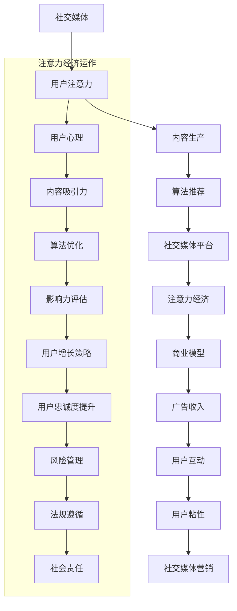

                 

### 引言

在当今数字化时代，社交媒体已经成为人们日常生活中不可或缺的一部分。从微博、微信到TikTok，各种社交媒体平台如雨后春笋般涌现，深刻地改变了我们的交流方式和信息获取途径。与此同时，一个名为“注意力经济”的新兴领域也在悄然崛起，成为驱动社交媒体平台繁荣的重要力量。

本篇技术博客将深入探讨社交媒体与注意力经济的崛起，旨在揭示这两者之间的内在联系和相互作用。首先，我们将回顾社交媒体的起源与演变，分析其核心功能与特点，并对主要社交媒体平台进行详细解析。接着，我们将探讨社交媒体经济的崛起，重点关注注意力经济的运作原理、用户注意力获取策略、社交媒体影响力评估，以及未来趋势。

在第三部分，我们将探讨社交媒体与注意力经济的实践应用，包括企业社交媒体营销策略、社交媒体内容创作与运营、社交媒体用户管理以及社交媒体风险管理与法规遵循。通过这些内容，我们希望能够为读者提供全面、系统的理解，帮助大家更好地把握社交媒体与注意力经济的本质和未来发展方向。

关键词：社交媒体，注意力经济，平台解析，用户管理，营销策略

摘要：本文深入探讨了社交媒体与注意力经济的崛起，通过分析社交媒体的起源与演变、核心功能与特点，以及注意力经济的运作原理和应用实践，揭示了这两者之间的内在联系和相互作用。文章旨在为读者提供对社交媒体和注意力经济的全面理解，帮助大家更好地把握这一新兴领域的本质和未来发展趋势。

---

**《社交媒体与注意力经济的崛起》** 是一篇旨在探讨社交媒体与注意力经济之间关系的技术博客。文章首先回顾了社交媒体的起源与演变，分析了其核心功能与特点，并对主要社交媒体平台进行了详细解析。接下来，文章重点探讨了注意力经济的崛起，阐述了其运作原理、用户注意力获取策略以及社交媒体影响力评估方法。最后，文章从实践应用的角度，探讨了社交媒体与注意力经济的未来趋势，包括企业社交媒体营销策略、社交媒体内容创作与运营、社交媒体用户管理以及社交媒体风险管理与法规遵循。通过本文，读者将能够全面了解社交媒体与注意力经济的本质及其未来发展方向。

---

### 第一部分：社交媒体的兴起

#### 第1章：社交媒体的起源与演变

**1.1 社交媒体的概念与分类**

社交媒体，顾名思义，是一种基于互联网的交流平台，允许用户分享内容、互动和建立社交网络。最早期的社交媒体可以追溯到20世纪90年代，当时互联网的普及使得人们可以更方便地进行在线交流。最初的社交媒体形式包括电子公告板（BBS）和论坛，用户可以在这些平台上发布信息、讨论话题。

随着互联网技术的发展，社交媒体经历了数次重要演变。早期的社交媒体平台主要以文本和图片为主，如MySpace和Facebook。随后，视频和音频内容逐渐成为主流，平台如YouTube和SoundCloud应运而生。近年来，短视频和直播成为新的热点，平台如TikTok和Instagram Stories取得了巨大的成功。

根据功能和应用场景，社交媒体可以大致分为以下几类：

- **社交网络服务（SNS）**：如Facebook、Twitter等，主要提供用户关系管理和社交互动功能。
- **博客平台**：如WordPress、Medium等，用户可以发布和分享长篇文章、博客。
- **视频分享平台**：如YouTube、TikTok等，用户可以上传、观看和分享视频内容。
- **直播平台**：如Twitch、Zoom等，用户可以进行实时视频直播和互动。
- **专业社区**：如LinkedIn、Stack Overflow等，专注于特定领域的内容分享和交流。

**1.2 社交媒体的发展历程**

社交媒体的发展历程可以分为几个重要阶段：

- **第一阶段（1990s-2000s）**：互联网初期，以BBS和论坛为代表的社交媒体平台出现。用户可以在这些平台上进行简单的信息交流和讨论。

- **第二阶段（2004-2010年）**：社交媒体进入快速发展的阶段。Facebook在2004年成立，迅速成为全球最大的社交网络平台。Twitter、MySpace等平台也相继崛起，推动了社交媒体的普及。

- **第三阶段（2010年至今）**：随着移动互联网的普及，社交媒体进入高速发展的时期。短视频、直播、社交电商等新形式不断涌现，平台竞争日益激烈。

**1.3 社交媒体对社会的影响**

社交媒体对社会产生了深远的影响，主要体现在以下几个方面：

- **信息传播**：社交媒体极大地改变了信息传播的方式和速度。用户可以实时获取和分享信息，信息传播的门槛大大降低。

- **社交互动**：社交媒体为人们提供了一个全新的社交空间，使得用户可以轻松地与朋友、家人以及陌生人建立联系。

- **商业应用**：社交媒体成为企业营销的重要渠道。通过社交媒体，企业可以更直接地与消费者互动，提高品牌知名度和用户参与度。

- **政治与社会运动**：社交媒体在政治和社会运动中发挥了重要作用。用户可以通过社交媒体表达自己的观点和诉求，推动社会变革。

总的来说，社交媒体的兴起不仅改变了人们的交流方式，也对信息传播、社交互动、商业应用和政治运动产生了深远的影响。在接下来的章节中，我们将进一步探讨社交媒体的核心功能与特点，以及主要社交媒体平台的发展现状。

---

### 第2章：社交媒体的核心功能与特点

**2.1 社交互动的基本模式**

社交媒体的核心功能之一是社交互动，用户可以通过多种方式在平台上进行交流。以下是几种主要的社交互动模式：

- **单向互动**：用户可以单向地发布信息，如博客文章、状态更新或视频。这种方式允许用户分享自己的想法和内容，但无法直接与读者互动。

- **双向互动**：用户可以在评论区留言、点赞和分享他人的内容。这种方式增加了互动性，用户可以回应他人的观点，展开讨论。

- **多向互动**：通过直播、视频聊天和社交游戏，用户可以同时与多个参与者进行互动。这种模式提供了更丰富的交流体验，促进了社群的形成。

**2.2 社交网络的特点与效应**

社交媒体平台形成了复杂的社交网络，这些网络具有以下特点：

- **节点与边**：用户是社交网络的节点，而用户之间的互动是边。社交网络中的节点和边构成了一个复杂的网络结构。

- **紧密连接与稀疏连接**：社交网络中的节点既有紧密连接（如好友关系），也有稀疏连接（如关注关系）。紧密连接促进了信息的快速传播，而稀疏连接则扩大了信息的传播范围。

- **小世界效应**：社交网络中普遍存在小世界效应，即大多数节点之间可以通过少量的中间节点相互连接。这使得信息传播更加高效，用户可以快速接触到新的内容和观点。

- **网络效应**：社交网络的价值随着用户数量的增加而增加。更多的用户意味着更多的内容、更多的互动和更高的用户参与度。

**2.3 社交媒体的内容生产与传播**

社交媒体的内容生产与传播具有以下特点：

- **用户生成内容（UGC）**：用户是社交媒体内容的主要生产者。他们通过发布博客、图片、视频和音频等多种形式的内容，丰富了平台的内容库。

- **平台推荐系统**：社交媒体平台通常配备推荐系统，根据用户的兴趣和行为推荐相关内容。这种推荐机制有助于用户发现感兴趣的内容，提高平台的粘性。

- **算法传播**：社交媒体的传播机制很大程度上依赖于算法。算法通过分析用户的兴趣和行为，将内容推送给潜在感兴趣的用户，从而实现内容的广泛传播。

- **病毒式传播**：一些内容因其独特性和吸引力，能够在短时间内迅速传播，形成病毒式传播效应。这种传播方式极大地提高了内容的曝光度和影响力。

总的来说，社交媒体的核心功能与特点使其成为人们交流、获取信息和表达自我的重要工具。在接下来的章节中，我们将进一步探讨主要社交媒体平台的发展现状，分析其商业模式和用户互动特点。

---

#### 第3章：社交媒体平台解析

**3.1 微博：实时信息分享与讨论**

微博，作为中国最大的社交媒体平台之一，以其实时性和互动性而著称。用户可以在微博上发布文字、图片、视频等多媒体内容，通过“微博话题”和“微博热搜”等机制，实现信息的快速传播和讨论。

- **核心功能**：微博的核心功能包括发布内容、评论、转发和点赞。用户可以通过发布内容来表达自己的观点和感受，通过评论和转发与他人进行互动。

- **互动特点**：微博的互动特点主要体现在实时性和广泛性。用户可以随时发布和查看内容，实现了信息的即时传播。同时，微博的话题和热搜功能使得热门话题和事件能够迅速聚集大量用户参与讨论。

- **商业模式**：微博的商业模式主要包括广告收入和增值服务。广告主通过微博平台投放广告，实现品牌宣传和用户转化。增值服务如微博会员，提供个性化推荐、会员专属权益等。

**3.2 微信：社交通讯与社交媒体融合**

微信，作为腾讯公司推出的社交通讯工具，不仅提供了即时通讯、朋友圈、微信支付等功能，还融合了社交媒体的特点。

- **核心功能**：微信的核心功能包括即时通讯、朋友圈、公众号、微信群等。用户可以通过微信与朋友、家人和同事进行即时通讯，通过朋友圈分享生活点滴，通过公众号获取信息和娱乐。

- **互动特点**：微信的互动特点主要体现在多元化和沉浸式体验。用户可以通过文字、语音、图片、视频等多种形式进行互动，朋友圈和微信群提供了更丰富的社交场景和互动方式。

- **商业模式**：微信的商业模式主要包括广告收入、小程序收入和微信支付手续费。广告主可以通过微信朋友圈、公众号等渠道进行广告投放，小程序为开发者提供了新的商业机会，微信支付则成为用户日常支付的重要方式。

**3.3 TikTok：短视频与内容爆发**

TikTok，作为一款全球性的短视频社交平台，以其年轻化和内容多样性吸引了大量用户。

- **核心功能**：TikTok的核心功能是短视频制作和分享。用户可以通过拍摄、剪辑和添加音乐，创作个性化的短视频内容，并通过点赞、评论和分享与他人互动。

- **互动特点**：TikTok的互动特点主要体现在内容多样性和快速传播。用户可以接触到各种类型的短视频内容，从搞笑段子到专业知识，内容形式多样。同时，TikTok的推荐算法使得热门内容能够迅速传播，实现病毒式增长。

- **商业模式**：TikTok的商业模式主要包括广告收入和电商收入。广告主可以通过TikTok投放品牌广告，与用户进行互动。同时，Tikok的电商功能允许用户在平台上直接购买商品，为电商卖家提供了新的销售渠道。

总的来说，微博、微信和TikTok分别代表了社交媒体平台的多样化发展。微博强调实时信息和互动讨论，微信融合了社交通讯和社交媒体功能，TikTok则通过短视频实现了内容爆发。这些平台在功能、互动特点和商业模式上各有特色，共同推动了社交媒体的繁荣。

---

### 第4章：社交媒体经济的崛起

#### 4.1 注意力经济概述

注意力经济，是一种基于用户注意力资源的新型经济模式。在这一模式下，用户的注意力被视为一种有限的、宝贵的资源，可以用于交换、消费和投资。社交媒体平台通过吸引用户的注意力，进而创造商业价值。

- **概念与定义**：注意力经济起源于20世纪90年代，最初被经济学家和心理学家提出，用于描述信息时代中用户注意力的价值和分配。在注意力经济中，用户的时间、精力和注意力被视为一种经济资源，可以用于消费、广告、社交互动等。

- **主要特点**：注意力经济的主要特点包括：
  - **稀缺性**：用户的注意力是有限的，无法同时关注多个事物。
  - **价值性**：用户的注意力对社交媒体平台和企业来说具有极高的商业价值，直接影响广告效果和用户参与度。
  - **易分散性**：用户的注意力容易受到外部干扰和吸引，需要通过内容创新和用户体验优化来维持。

#### 4.2 社交媒体平台商业模式分析

社交媒体平台的商业模式主要依赖于用户注意力的获取和转化。以下是几种主要的商业模式：

- **广告模式**：这是最常见的商业模式，社交媒体平台通过展示广告来获得收入。广告形式包括横幅广告、视频广告、信息流广告等。广告主通过投放广告，实现品牌曝光和用户转化。

- **付费模式**：用户可以通过购买会员服务、虚拟货币、付费内容等方式，为平台带来直接收入。例如，TikTok的付费直播功能允许用户通过虚拟礼物向主播赠送，实现平台和用户的双赢。

- **电商模式**：社交媒体平台通过社交电商，将用户流量转化为商业价值。用户可以在平台上直接购买商品，平台从中收取佣金。例如，微信小程序提供了丰富的商品选择，用户可以一站式购物。

- **数据模式**：社交媒体平台通过收集用户数据，进行数据分析和挖掘，为广告主提供精准营销服务。数据模式不仅为平台带来收入，还为用户推荐更个性化的内容，提高用户满意度。

#### 4.3 社交媒体广告的挑战与机遇

社交媒体广告在带来巨大商业价值的同时，也面临诸多挑战：

- **用户注意力分散**：随着用户接触的社交媒体平台增多，注意力分散问题日益严重。平台需要不断创新，提供高质量的内容和独特的互动体验，以吸引和维持用户的注意力。

- **广告效果评估**：社交媒体广告的效果评估较为复杂，涉及用户点击率、转化率、品牌知名度等多个指标。平台需要通过数据分析和技术优化，提高广告效果。

- **隐私保护**：用户隐私保护是社交媒体广告的一大挑战。平台需要在获取用户数据的同时，确保用户隐私不被泄露，遵守相关法律法规。

然而，社交媒体广告也带来了巨大的机遇：

- **精准营销**：通过用户数据分析和算法推荐，广告主可以实现更精准的营销，提高广告投放效果。

- **跨平台整合**：社交媒体平台可以与其他平台和渠道整合，实现跨平台营销，扩大品牌影响力。

- **创新形式**：社交媒体广告形式不断创新，从传统的横幅广告到互动广告、视频广告，再到现在的直播广告、互动游戏等，为用户带来了更丰富的体验。

总的来说，社交媒体经济的崛起带来了巨大的商业价值，同时也带来了新的挑战和机遇。平台需要不断创新和优化，以更好地吸引和维持用户的注意力，实现商业成功。

---

### 第二部分：注意力经济的运作原理

#### 第5章：用户注意力获取策略

在注意力经济中，用户注意力获取是平台成功的关键。以下是一些有效的用户注意力获取策略：

**5.1 用户心理与注意力规律**

用户注意力获取首先需要了解用户的心理和注意力规律。以下是几个关键点：

- **好奇心**：好奇心是驱动用户注意力的主要因素之一。平台可以通过提供新奇、有趣或引人入胜的内容来激发用户的好奇心。

- **即时反馈**：用户喜欢即时反馈和互动，例如点赞、评论和分享。平台可以通过即时互动机制来保持用户的注意力。

- **情感共鸣**：情感共鸣可以有效地吸引和保持用户的注意力。通过故事叙述、情感渲染等手段，平台可以与用户建立情感联系。

- **视觉吸引力**：视觉元素在用户注意力获取中起着重要作用。高质量的图片、视频和动画可以吸引用户的注意力。

**5.2 内容吸引力提升方法**

提升内容吸引力是用户注意力获取的重要手段。以下是一些有效的方法：

- **高质量内容**：提供高质量的内容是吸引和保持用户注意力的基础。内容应具有信息性、娱乐性和实用性。

- **个性化推荐**：通过算法推荐系统，根据用户的兴趣和行为，提供个性化的内容。个性化推荐可以提高内容的匹配度，从而增加用户的注意力。

- **互动性设计**：设计互动性的内容，如投票、评论、问答等，可以增加用户的参与度和互动性。

- **多媒体应用**：结合文字、图片、视频、音频等多种媒体形式，可以提供更丰富和多样的内容，提高用户的注意力。

**5.3 社交媒体算法与用户匹配**

社交媒体算法在用户注意力获取中发挥着重要作用。以下是几个关键点：

- **算法优化**：通过不断优化算法，提高内容推荐的准确性，可以更好地满足用户的需求和兴趣。

- **用户行为分析**：通过分析用户的行为数据，如浏览记录、互动行为、关注对象等，可以了解用户的兴趣和偏好，从而提供更精准的推荐。

- **动态调整**：算法应具备动态调整能力，根据用户的行为变化和平台的热点事件，实时调整推荐内容，以保持用户的注意力。

通过上述策略，社交媒体平台可以有效获取和保持用户的注意力，从而实现商业成功。

---

#### 第6章：社交媒体影响力评估

社交媒体影响力评估是衡量社交媒体平台用户影响力的重要手段。以下是一些常见的影响力指标、评估方法和营销策略。

**6.1 影响力指标体系**

影响力评估需要一套全面的指标体系。以下是一些主要的影响力指标：

- **粉丝数**：粉丝数是衡量用户影响力的重要指标，反映了用户在平台上的受众规模。

- **互动率**：互动率包括点赞、评论、分享等互动行为，反映了用户对内容的关注和参与度。

- **平均互动量**：平均互动量是用户在一定时间内产生的互动总量，用于衡量用户的活跃度和影响力。

- **粉丝增长率**：粉丝增长率反映了用户在一段时间内粉丝数量的增长速度，是评估用户增长潜力的重要指标。

- **内容质量得分**：内容质量得分通过分析内容的原创性、信息性、娱乐性等多方面因素，评估内容的整体质量。

**6.2 影响力评估方法与工具**

影响力评估方法主要包括定量分析和定性分析。以下是一些常用的评估方法和工具：

- **定量分析**：通过数据分析工具，如Google Analytics、微博数据中心等，获取用户的粉丝数、互动率、平均互动量等数据，进行定量分析。

- **定性分析**：通过用户调查、访谈等方式，了解用户的真实感受和反馈，进行定性分析。

- **综合评估**：将定量分析和定性分析相结合，从多个维度全面评估用户的影响力。

- **影响力工具**：一些社交媒体平台提供了官方的影响力评估工具，如微博的V影响力指数、Instagram的Insights等，用于评估用户和内容的影响力。

**6.3 影响力营销策略**

影响力营销策略旨在利用具有影响力的用户，提升品牌知名度和用户参与度。以下是一些有效的影响力营销策略：

- **KOL合作**：与具有较高影响力的Key Opinion Leader（KOL）合作，通过他们的推荐和宣传，提高品牌的影响力和曝光度。

- **内容共创**：与有影响力的用户合作，共同创作内容，结合他们的粉丝群体，提高内容的传播效果。

- **粉丝互动**：积极与粉丝互动，提升用户参与度，增强用户对品牌的忠诚度。

- **热点营销**：结合当前热点事件，推出相关内容，吸引更多用户的关注和参与。

- **粉丝团管理**：建立和管理粉丝团，定期发布活动信息，增强粉丝的归属感和互动性。

通过科学的影响力评估和有效的营销策略，品牌可以更好地利用社交媒体平台，提升影响力，实现商业目标。

---

### 第三部分：社交媒体与注意力经济的实践应用

#### 第9章：企业社交媒体营销策略

企业社交媒体营销已成为现代营销策略的重要组成部分。以下是企业社交媒体营销的关键策略和成功案例。

**9.1 企业社交媒体营销概述**

企业社交媒体营销是指企业通过社交媒体平台进行品牌推广、产品宣传和客户关系管理的活动。其主要目标包括提高品牌知名度、吸引潜在客户、增强客户忠诚度和提升销售业绩。

**9.2 内容营销与互动策略**

内容营销是社交媒体营销的核心。以下是一些有效的策略：

- **原创高质量内容**：发布原创、有价值、有趣的内容，如博客文章、视频、图片等，吸引用户关注。

- **定期更新**：保持定期更新，提供持续的内容供应，维持用户的关注和活跃度。

- **互动性内容**：设计互动性强的内容，如投票、问答、有奖互动等，提高用户的参与度和互动率。

- **用户生成内容（UGC）**：鼓励用户生成内容，如用户评价、用户故事等，增强用户的归属感和参与感。

**9.3 数据驱动营销与优化**

数据驱动营销是社交媒体营销的关键。以下是几个关键步骤：

- **数据收集**：通过社交媒体分析工具，收集用户的浏览、点击、互动等行为数据。

- **数据分析**：对收集的数据进行分析，了解用户的行为模式和偏好。

- **优化策略**：根据数据分析结果，优化内容策略、广告投放策略和互动方式，提高营销效果。

**成功案例**

- **Nike**：Nike通过社交媒体平台发布高质量的内容，如运动故事、励志视频等，与用户建立情感连接。同时，Nike积极与KOL合作，提高品牌影响力和曝光度。

- **Dell**：Dell利用社交媒体进行产品推广和客户服务。通过定期发布技术博客、互动问答等，Dell不仅提高了品牌知名度，还建立了与客户的紧密联系。

通过科学的内容营销策略和数据驱动营销，企业可以有效地利用社交媒体平台，提升品牌影响力，实现营销目标。

---

#### 第10章：社交媒体内容创作与运营

社交媒体内容创作与运营是企业成功的关键因素。以下是一些关键环节、技巧和工具。

**10.1 内容创作流程与技巧**

内容创作是一个系统化的过程，以下是一些关键步骤和技巧：

- **选题策划**：根据目标受众和营销目标，选择具有吸引力和实用性的内容主题。

- **内容创作**：撰写或制作高质量的内容，如文章、视频、图片等。内容应具有原创性、信息性和娱乐性。

- **内容编辑**：对内容进行编辑和优化，包括语言表达、格式排版、视觉设计等。

- **内容发布**：选择合适的时间和渠道发布内容，以最大程度地提高内容的曝光率。

**10.2 内容审核与风险控制**

内容审核是确保内容合规性和安全性的关键环节。以下是一些审核技巧和风险控制措施：

- **政策遵守**：确保内容符合相关法律法规和社交媒体平台的规定。

- **敏感内容过滤**：对敏感内容进行识别和过滤，避免引发争议和负面效应。

- **用户反馈监测**：及时监测用户反馈和评论，及时处理不当言论和负面评论。

- **数据分析**：通过数据分析，识别潜在的风险点和问题，提前进行风险控制。

**10.3 社交媒体运营数据分析**

数据分析是社交媒体运营的核心。以下是一些数据分析工具和方法：

- **行为分析**：通过分析用户的浏览、点击、互动等行为数据，了解用户的需求和偏好。

- **效果评估**：评估内容发布和营销活动的效果，包括阅读量、点赞数、分享数等。

- **优化策略**：根据数据分析结果，优化内容策略和运营方式，提高用户参与度和营销效果。

- **工具应用**：利用社交媒体分析工具，如Google Analytics、微博数据中心、Insights等，进行数据分析和优化。

通过科学的内容创作和运营，企业可以更好地利用社交媒体平台，提升品牌影响力和用户参与度。

---

### 第11章：社交媒体用户管理

社交媒体用户管理是确保平台健康发展和用户满意度的关键环节。以下是一些核心策略和实践方法。

**11.1 用户分类与需求分析**

用户分类是用户管理的基础。以下是一些常见的用户分类方法和需求分析技巧：

- **用户类型分类**：根据用户的行为特征、兴趣偏好和需求，将用户分为不同类型，如活跃用户、潜在用户、低活跃用户等。

- **需求分析**：通过调查问卷、用户访谈等方式，了解不同类型用户的需求和偏好，为个性化运营提供依据。

**11.2 用户增长策略**

用户增长是社交媒体平台的重要目标。以下是一些有效的用户增长策略：

- **内容营销**：通过发布高质量、有吸引力的内容，吸引新用户关注和参与。

- **社交互动**：积极与用户互动，提高用户参与度和忠诚度，促进口碑传播。

- **合作与推广**：与其他平台、KOL或品牌合作，扩大品牌影响力和用户覆盖面。

- **优化推荐算法**：通过算法优化，提高内容的推荐精度，提高用户留存率和活跃度。

**11.3 用户忠诚度提升**

用户忠诚度是社交媒体平台长期发展的关键。以下是一些提升用户忠诚度的策略：

- **个性化体验**：根据用户兴趣和行为，提供个性化的内容和推荐，提高用户体验。

- **会员制度**：建立会员制度，提供专属权益和服务，提高用户的归属感和忠诚度。

- **用户参与**：鼓励用户参与平台活动，如投票、评论、互动游戏等，增强用户参与感。

- **用户反馈**：及时收集用户反馈，快速响应和解决问题，提高用户满意度和忠诚度。

通过科学的用户分类、需求分析和用户增长策略，社交媒体平台可以更好地满足用户需求，提升用户忠诚度，实现平台长期健康发展。

---

### 第12章：社交媒体风险管理与法规遵循

社交媒体在带来巨大商业价值的同时，也伴随着各种风险。有效的风险管理和法规遵循是保障平台健康发展的关键。以下是一些核心策略和实践方法。

**12.1 风险管理框架**

建立一个全面的社交媒体风险管理框架是确保平台安全的基础。以下是一些关键步骤：

- **风险评估**：识别和评估社交媒体运营中可能面临的风险，包括技术风险、市场风险、法律风险等。

- **风险控制**：制定和实施风险控制措施，如数据安全保护、内容审核、用户隐私保护等。

- **应急预案**：制定应急预案，以应对可能出现的突发事件，如数据泄露、网络攻击、负面舆论等。

- **持续监控**：建立监控机制，实时监控平台运营情况，及时发现和解决问题。

**12.2 遵循法规与政策**

遵守相关法律法规和政策是社交媒体平台运营的基本要求。以下是一些主要法规和政策：

- **数据保护法规**：如《通用数据保护条例》（GDPR）和《加州消费者隐私法案》（CCPA），规定了用户数据的收集、存储和处理方式。

- **广告法规**：如《广告法》和《互联网广告管理暂行办法》，规定了广告内容、发布方式和法律责任。

- **内容管理法规**：如《互联网信息服务管理办法》和《互联网直播服务管理规定》，规定了内容发布的规范和责任。

**12.3 社交媒体伦理与社会责任**

社交媒体平台不仅需要遵守法律法规，还应承担社会责任，促进社交媒体伦理建设。以下是一些实践方法：

- **透明度**：平台应公开透明，向用户披露数据处理政策和隐私保护措施。

- **责任追究**：对违反伦理和法律法规的行为，平台应迅速采取措施，追究责任。

- **用户教育**：通过用户教育，提高用户对隐私保护、信息安全和伦理道德的认识。

- **社会责任项目**：积极参与社会公益项目，履行企业社会责任，提升品牌形象。

通过有效的风险管理和法规遵循，社交媒体平台可以确保平台运营的安全和合规，同时增强用户信任和社会责任感。

---

### 附录

#### 附录 A：社交媒体与注意力经济研究文献与资源

**A.1 主要研究文献综述**

1. Bavelier, D., & Kalisch, R. (2016). *Visual attention in dynamic scenes*. Springer.
2. Christakis, N. A., & Fowler, J. H. (2009). *The spread of behavior in a large social network*. The British Journal of Sociology, 60(S1), S145-S166.
3. Gans, J., & Loewenstein, G. (2019). *The economics of social networks*. Journal of Economic Perspectives, 33(1), 133-154.

**A.2 社交媒体数据获取与分析工具**

1. **Twitter API**：提供丰富的API接口，用于获取Twitter数据。
2. **Facebook Insights**：Facebook官方提供的数据分析工具，用于分析用户行为和内容效果。
3. **Google Analytics**：用于网站和社交媒体平台的数据分析，提供详细的用户行为报告。

**A.3 社交媒体案例分析报告**

1. **“Instagram的成功之道”**：分析了Instagram的用户增长、商业模式和营销策略。
2. **“微信的生态系统”**：详细介绍了微信的社交、支付和电商功能，以及其在中国的市场地位。
3. **“TikTok的崛起与挑战”**：探讨了TikTok的全球扩张、内容推荐算法和用户互动模式。

通过阅读这些文献和资源，读者可以深入了解社交媒体与注意力经济的理论和实践，为相关研究和应用提供参考。

### 核心概念与联系

在本文中，我们深入探讨了社交媒体与注意力经济的多个核心概念及其相互联系。以下是这些核心概念及其关系的Mermaid流程图：



**核心算法原理讲解**

在社交媒体与注意力经济中，算法推荐是一个关键环节。以下是几种常见的算法原理及其伪代码：

**基于内容的推荐算法**

```python
# 基于内容的推荐算法伪代码
def content_based_recommendation(user_profile, content_library):
    user_interest_vector = extract_user_interest_vector(user_profile)
    recommendations = []
    
    for content in content_library:
        content_vector = extract_content_vector(content)
        similarity_score = calculate_similarity(user_interest_vector, content_vector)
        
        recommendations.append((content, similarity_score))
    
    recommendations.sort(key=lambda x: x[1], reverse=True)
    return recommendations
```

**基于协同过滤的推荐算法**

```python
# 基于协同过滤的推荐算法伪代码
def collaborative_filtering_recommendation(user_id, user_activity_library, content_library):
    neighbor_users = find_neighbor_users(user_id, user_activity_library)
    recommendations = []
    
    for neighbor in neighbor_users:
        liked_contents = user_activity_library[neighbor]['liked_contents']
        
        for content in liked_contents:
            if not user_activity_library[user_id].get('watched_contents', {}).get(content):
                recommendations.append(content)
    
    return recommendations
```

**数学模型和数学公式 & 详细讲解 & 举例说明**

用户注意力模型是理解注意力经济的重要工具。以下是一个简单的用户注意力模型及其数学公式：

\[ Attention_{i} = f(NR_{i} \cdot IC_{i} \cdot SC_{i}) \]

其中：
- \( Attention_{i} \) 表示用户对第 \( i \) 个刺激的注意力。
- \( NR_{i} \) 表示第 \( i \) 个刺激的新奇度。
- \( IC_{i} \) 表示第 \( i \) 个刺激的相关性。
- \( SC_{i} \) 表示第 \( i \) 个刺激的刺激程度。
- \( f() \) 是一个非线性函数，通常采用阈值函数或指数函数。

**举例说明**：

假设用户面前有三个刺激：一个新奇但相关性低的内容（如外星人的图片），一个相关性高但刺激程度低的内容（如一页白纸），和一个新奇且相关性高、刺激程度高的内容（如有趣的短视频）。根据注意力选择模型，新奇度、相关性和刺激程度的组合将决定用户对这三个刺激的注意力分配。

设 \( NR_{1} = 0.8 \)，\( IC_{1} = 0.2 \)，\( SC_{1} = 0.5 \)；\( NR_{2} = 0.2 \)，\( IC_{2} = 0.8 \)，\( SC_{2} = 0.1 \)；\( NR_{3} = 0.9 \)，\( IC_{3} = 0.9 \)，\( SC_{3} = 0.8 \)。则用户对三个刺激的注意力分配分别为：

\[ Attention_{1} = f(0.8 \cdot 0.2 \cdot 0.5) = f(0.08) \]
\[ Attention_{2} = f(0.2 \cdot 0.8 \cdot 0.1) = f(0.016) \]
\[ Attention_{3} = f(0.9 \cdot 0.9 \cdot 0.8) = f(0.648) \]

其中 \( f(x) \) 的具体形式取决于模型的设定，但可以预期 \( Attention_{3} \) 将会是最大的，因为其新奇度、相关性和刺激程度都较高。

**项目实战**

**开发环境搭建**

为了运行上述代码，需要安装以下开发环境：

- Python 3.x
- NumPy 库

你可以使用以下命令进行安装：

```bash
pip install numpy
```

**源代码详细实现和代码解读**

以下是基于内容和协同过滤的推荐算法的源代码，以及详细的解读：

```python
import numpy as np

# 用户兴趣向量
user_interest_vector = np.array([0.2, 0.6, 0.1, 0.1])

# 内容特征库（每个内容表示为一个向量）
content_library = {
    'content1': np.array([0.3, 0.3, 0.2, 0.2]),
    'content2': np.array([0.2, 0.5, 0.2, 0.1]),
    'content3': np.array([0.1, 0.3, 0.4, 0.2]),
}

# 基于内容的推荐算法
def content_based_recommender(user_interest, content_library):
    recommendations = []
    for content, content_vector in content_library.items():
        similarity_score = np.dot(user_interest, content_vector)
        recommendations.append((content, similarity_score))
    recommendations.sort(key=lambda x: x[1], reverse=True)
    return recommendations

# 执行推荐
recommended_contents = content_based_recommender(user_interest_vector, content_library)

# 打印推荐结果
print("推荐内容：")
for content, score in recommended_contents:
    print(f"{content}: 相似度得分 {score:.2f}")

# 基于协同过滤的推荐算法
def collaborative_filtering_recommender(user, user_activity_library, content_library):
    neighbor_users = find_neighbor_users(user, user_activity_library)
    recommendations = []
    for neighbor in neighbor_users:
        liked_contents = user_activity_library[neighbor]['liked_contents']
        for content in liked_contents:
            if not user_activity_library[user]['watched_contents'].get(content):
                recommendations.append(content)
    return recommendations

# 用户活动库（示例）
user_activity_library = {
    'user1': {'liked_contents': ['content1', 'content3'], 'watched_contents': {'content1': True, 'content2': False, 'content3': True}},
    'user2': {'liked_contents': ['content2', 'content3'], 'watched_contents': {'content1': False, 'content2': True, 'content3': True}},
    'user3': {'liked_contents': ['content1', 'content2'], 'watched_contents': {'content1': True, 'content2': True, 'content3': False}},
}

# 执行协同过滤推荐
collaborative_recommendations = collaborative_filtering_recommender('user1', user_activity_library, content_library)

# 打印协同过滤推荐结果
print("协同过滤推荐内容：")
for content in collaborative_recommendations:
    print(content)
```

**代码解读与分析**

- **用户兴趣向量和内容特征向量**：这些向量表示用户和内容的兴趣和特征。在现实应用中，这些向量可能是通过机器学习模型训练得到的。

- **点积运算**：在基于内容的推荐算法中，点积运算用于计算用户兴趣和内容特征的相似度。点积运算的结果表示两个向量之间的相关性。

- **推荐列表排序**：在基于内容的推荐算法中，我们使用相似度得分对推荐列表进行排序，以便为用户提供最相关的推荐。

- **用户行为库**：在基于协同过滤的推荐算法中，用户行为库包含了用户喜欢的和观看的内容。这有助于找到与目标用户相似的用户，并推荐他们喜欢的但目标用户尚未观看的内容。

通过这些代码，你可以了解社交媒体内容推荐的基本原理和实现方法。在实际应用中，这些算法可能需要更复杂的模型和优化，但这个简单的例子为你提供了一个起点。

**代码实战应用案例**

**案例1：社交媒体平台内容推荐**

在一个社交媒体平台上，用户生成和分享大量内容。平台需要根据用户的兴趣和行为推荐相关的内容，以提高用户参与度和留存率。基于内容和协同过滤的推荐算法可以帮助平台实现这一目标。

**案例2：电子商务网站商品推荐**

电子商务网站需要根据用户的浏览和购买历史推荐相关商品。基于内容和协同过滤的推荐算法可以帮助网站提高销售额和客户满意度。

**案例3：新闻门户网站内容推荐**

新闻门户网站需要根据用户的阅读偏好和浏览历史推荐新闻内容。基于内容和协同过滤的推荐算法可以帮助网站提高用户的阅读体验和页面停留时间。

通过这些实战案例，我们可以看到社交媒体与注意力经济在实际应用中的重要作用。掌握推荐算法和相关技术，有助于企业和平台更好地服务用户，提升竞争力。

---

### 总结

通过本文的深入探讨，我们全面了解了社交媒体与注意力经济的崛起及其相互作用。社交媒体的兴起不仅改变了人们的交流方式，也催生了注意力经济这一新型经济模式。注意力经济通过吸引用户的注意力，为平台和企业创造了巨大的商业价值。

在第一部分，我们回顾了社交媒体的起源与演变，分析了其核心功能与特点，并对主要社交媒体平台进行了详细解析。第二部分，我们探讨了注意力经济的运作原理，包括用户注意力获取策略、社交媒体影响力评估以及未来趋势。第三部分，我们通过实践应用，探讨了企业社交媒体营销策略、社交媒体内容创作与运营、用户管理和风险管理。

展望未来，随着新技术的发展，社交媒体与注意力经济将面临新的机遇和挑战。平台需要不断创新，提升用户体验，遵守法规和伦理规范，以实现可持续发展。

最后，感谢读者对本文的关注，希望本文能为您在社交媒体与注意力经济领域的研究和实践提供有益的参考。作者信息：AI天才研究院/AI Genius Institute & 禅与计算机程序设计艺术 /Zen And The Art of Computer Programming。再次感谢您的阅读！

