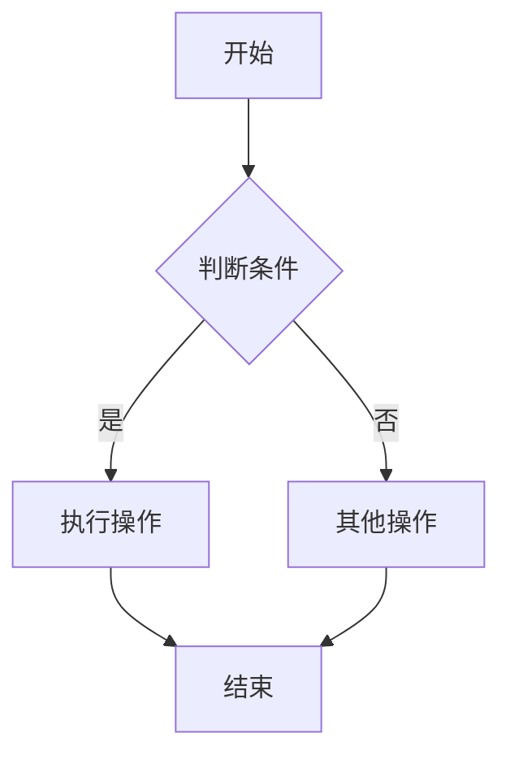
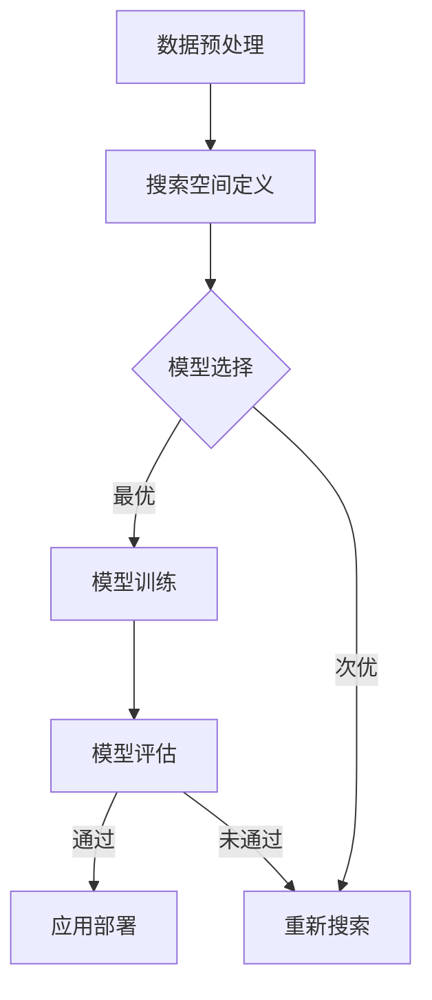

                 

# {文章标题}

## 《神经网络架构搜索最新进展与挑战》

> **关键词：** 神经网络架构搜索（NAS），深度学习，算法，计算机视觉，自然语言处理，强化学习。

> **摘要：** 本文深入探讨了神经网络架构搜索（NAS）这一前沿研究领域。我们首先介绍了NAS的基本概念和重要性，然后详细讲解了NAS的算法原理，包括常见的NAS算法和伪代码。接着，我们讨论了NAS在不同应用场景下的应用，并介绍了相关的数学模型和公式。随后，我们回顾了NAS领域的最新进展，分析了其中的挑战，并提出了可能的解决方案。最后，通过一个项目实战案例，展示了如何实现和应用NAS算法。本文旨在为读者提供一个全面、深入的NAS技术指南。

----------------------------------------------------------------

### 《神经网络架构搜索最新进展与挑战》目录大纲

#### 第一部分：基础理论与技术

**第1章：引言**

**第2章：神经网络架构搜索（NAS）算法原理**

**第3章：神经网络架构搜索（NAS）的应用场景**

**第4章：数学模型与数学公式**

**第5章：神经网络架构搜索的最新进展**

**第6章：神经网络架构搜索的挑战**

**第7章：项目实战**

**附录：资源与工具**

----------------------------------------------------------------

#### 第1章：引言

## 1.1 神经网络架构搜索概述

### 1.1.1 神经网络架构搜索的基本概念

神经网络架构搜索（Neural Architecture Search，简称NAS）是一种自动化搜索神经网络架构的方法。传统的神经网络架构通常由人类专家设计，而NAS通过算法自动搜索最优的神经网络架构。NAS的目标是在给定的搜索空间内找到性能最优的网络架构。

### 1.1.2 神经网络架构搜索的重要性

随着深度学习的广泛应用，寻找最优的神经网络架构变得越来越重要。然而，手动设计神经网络架构既耗时又费力，且可能无法找到最优的架构。NAS能够大幅提高网络架构设计的效率，为深度学习的发展提供了新的思路。

## 1.2 神经网络基础

### 1.2.1 神经网络的结构与功能

神经网络是一种由大量简单单元（神经元）互联而成的复杂网络。每个神经元都接收来自其他神经元的输入信号，通过非线性激活函数处理后，产生输出信号。神经网络通过多层堆叠，可以处理复杂的数据，并在多个领域取得显著成果。

### 1.2.2 神经网络的训练与优化

神经网络的训练是指通过大量数据调整网络中的参数，使其能够对新的数据进行预测。优化是神经网络训练过程中的核心，常用的优化方法包括梯度下降和随机梯度下降等。

### 1.2.3 神经网络的基本类型

神经网络有多种类型，包括前馈神经网络、卷积神经网络（CNN）和循环神经网络（RNN）等。每种神经网络都有其特定的结构和功能，适用于不同的应用场景。

----------------------------------------------------------------

## 1.3 神经网络架构搜索（NAS）算法原理

### 1.3.1 算法框架与流程

神经网络架构搜索的算法框架通常包括以下几个步骤：

1. **搜索空间定义**：确定神经网络架构搜索空间，包括网络层类型、连接方式、激活函数等。
2. **搜索策略设计**：设计搜索策略，如贪心算法、贝叶斯优化、遗传算法等。
3. **模型训练与评估**：在搜索过程中，对每个候选架构进行训练和评估，选择性能最好的架构。
4. **架构优化**：对已选出的最佳架构进行进一步优化，以提升性能。

### 1.3.2 常见NAS算法

1. **基于贪心算法的搜索**：贪心算法通过逐步选择最优操作，以期望找到最优的神经网络架构。
2. **基于贝叶斯优化的搜索**：贝叶斯优化利用概率模型，通过迭代优化策略来搜索最优架构。
3. **基于遗传算法的搜索**：遗传算法模拟生物进化过程，通过选择、交叉和变异操作来搜索最优架构。

### 1.3.3 伪代码讲解

以下是神经网络架构搜索算法的伪代码：

```plaintext
// NAS算法伪代码
Input:
- 神经网络架构搜索空间
- 训练数据集
- 超参数设置
- 目标函数

Output:
- 最优神经网络架构

Process:
1. 初始化搜索空间
2. 初始化超参数
3. 对每个候选架构进行训练和评估
4. 选择性能最好的架构
5. 优化选出的最佳架构
6. 返回最优神经网络架构
```

### 1.3.4 具体算法介绍

1. **线性搜索**：线性搜索通过遍历搜索空间内的所有可能架构来找到最优架构。
2. **粒子群优化（PSO）**：粒子群优化是一种基于群体智能的搜索算法，通过模拟鸟群觅食行为来搜索最优架构。
3. **生成对抗网络（GAN）**：生成对抗网络通过生成器和判别器之间的对抗训练来搜索最优架构。

----------------------------------------------------------------

## 1.4 神经网络架构搜索（NAS）的应用场景

### 1.4.1 计算机视觉

神经网络架构搜索在计算机视觉领域有着广泛的应用，如图像分类、目标检测和图像生成等。

1. **图像分类**：NAS可以自动搜索最优的卷积神经网络架构，用于对图像进行分类。
2. **目标检测**：NAS可以搜索最优的网络架构，用于检测图像中的目标物体。
3. **图像生成**：NAS可以搜索最优的生成对抗网络架构，用于生成新的图像。

### 1.4.2 自然语言处理

在自然语言处理领域，NAS被用于搜索最优的循环神经网络和注意力机制架构。

1. **文本分类**：NAS可以搜索最优的神经网络架构，用于对文本进行分类。
2. **语言模型**：NAS可以搜索最优的神经网络架构，用于构建语言模型。
3. **机器翻译**：NAS可以搜索最优的神经网络架构，用于进行机器翻译。

### 1.4.3 强化学习

在强化学习领域，NAS可以用于搜索最优的神经网络架构，用于环境建模和行为策略。

1. **环境建模**：NAS可以搜索最优的神经网络架构，用于建模环境状态。
2. **行为策略**：NAS可以搜索最优的神经网络架构，用于生成最优的行为策略。

----------------------------------------------------------------

## 1.5 总结

本章介绍了神经网络架构搜索（NAS）的基本概念、算法原理和应用场景。NAS作为一种自动化搜索神经网络架构的方法，具有广泛的应用前景。接下来，我们将进一步深入探讨NAS的数学模型和公式，以及NAS的最新进展和挑战。

----------------------------------------------------------------

### 第2章：神经网络架构搜索（NAS）算法原理

## 2.1 NAS算法概述

神经网络架构搜索（NAS）是一种自动化搜索神经网络架构的方法。传统的神经网络架构通常由人类专家设计，而NAS通过算法自动搜索最优的神经网络架构。NAS的目标是在给定的搜索空间内找到性能最优的网络架构。

### 2.1.1 算法框架与流程

神经网络架构搜索的算法框架通常包括以下几个步骤：

1. **搜索空间定义**：确定神经网络架构搜索空间，包括网络层类型、连接方式、激活函数等。
2. **搜索策略设计**：设计搜索策略，如贪心算法、贝叶斯优化、遗传算法等。
3. **模型训练与评估**：在搜索过程中，对每个候选架构进行训练和评估，选择性能最好的架构。
4. **架构优化**：对已选出的最佳架构进行进一步优化，以提升性能。

### 2.1.2 常见NAS算法

1. **基于贪心算法的搜索**：贪心算法通过逐步选择最优操作，以期望找到最优的神经网络架构。
2. **基于贝叶斯优化的搜索**：贝叶斯优化利用概率模型，通过迭代优化策略来搜索最优架构。
3. **基于遗传算法的搜索**：遗传算法模拟生物进化过程，通过选择、交叉和变异操作来搜索最优架构。

### 2.1.3 伪代码讲解

以下是神经网络架构搜索算法的伪代码：

```plaintext
// NAS算法伪代码
Input:
- 神经网络架构搜索空间
- 训练数据集
- 超参数设置
- 目标函数

Output:
- 最优神经网络架构

Process:
1. 初始化搜索空间
2. 初始化超参数
3. 对每个候选架构进行训练和评估
4. 选择性能最好的架构
5. 优化选出的最佳架构
6. 返回最优神经网络架构
```

### 2.1.4 具体算法介绍

1. **线性搜索**：线性搜索通过遍历搜索空间内的所有可能架构来找到最优架构。
2. **粒子群优化（PSO）**：粒子群优化是一种基于群体智能的搜索算法，通过模拟鸟群觅食行为来搜索最优架构。
3. **生成对抗网络（GAN）**：生成对抗网络通过生成器和判别器之间的对抗训练来搜索最优架构。

----------------------------------------------------------------

## 2.2 神经网络架构搜索（NAS）的数学模型与数学公式

### 2.2.1 概率论与统计模型

在神经网络架构搜索中，概率论与统计模型是基础。以下是一些常用的概率和统计模型：

1. **高斯分布**：高斯分布（正态分布）是最常见的概率分布，用于描述神经网络的输出。
2. **贝叶斯定理**：贝叶斯定理用于计算后验概率，有助于确定神经网络架构的最佳选择。
3. **最大似然估计**：最大似然估计用于估计神经网络参数，是神经网络训练过程中的核心。

### 2.2.2 信息论与编码理论

信息论与编码理论在神经网络架构搜索中也有重要作用。以下是一些相关的数学模型：

1. **熵**：熵是衡量信息不确定性的度量，用于评估神经网络模型的性能。
2. **交叉熵**：交叉熵是评估两个概率分布之间差异的度量，常用于神经网络训练过程中的损失函数。
3. **KL散度**：KL散度是衡量两个概率分布之间差异的另一种度量，常用于神经网络训练过程中的正则化。

### 2.2.3 优化算法与求解方法

在神经网络架构搜索中，优化算法是关键。以下是一些常用的优化算法：

1. **梯度下降**：梯度下降是一种用于求解优化问题的算法，通过迭代更新参数，以最小化目标函数。
2. **随机梯度下降（SGD）**：随机梯度下降是梯度下降的一种变体，通过随机选择训练样本，以加速优化过程。
3. **牛顿法**：牛顿法是一种二阶优化算法，通过迭代更新参数，以最小化目标函数的二阶导数。

### 2.2.4 数学公式与详细讲解

以下是神经网络架构搜索中常用的一些数学公式：

1. **梯度下降算法公式**：

   $$
   \theta_{t+1} = \theta_{t} - \alpha \cdot \nabla_{\theta} J(\theta)
   $$

   其中，$\theta$ 表示神经网络参数，$J(\theta)$ 表示目标函数，$\alpha$ 表示学习率。

2. **牛顿法公式**：

   $$
   \theta_{t+1} = \theta_{t} - H^{-1} \nabla_{\theta} J(\theta)
   $$

   其中，$H$ 表示Hessian矩阵，$\nabla_{\theta} J(\theta)$ 表示目标函数的梯度。

3. **KL散度公式**：

   $$
   D_{KL}(P||Q) = \sum_{x} P(x) \log \frac{P(x)}{Q(x)}
   $$

   其中，$P$ 和 $Q$ 分别表示两个概率分布。

### 2.2.5 举例说明

以下是一个简单的例子，说明如何使用梯度下降算法来训练神经网络：

```plaintext
// 梯度下降算法示例
初始化神经网络参数 $\theta$
设置学习率 $\alpha$
设置迭代次数 $T$

for t = 1 to T do:
    计算目标函数的梯度 $\nabla_{\theta} J(\theta)$
    更新参数 $\theta_{t+1} = \theta_{t} - \alpha \cdot \nabla_{\theta} J(\theta)$
end for

输出训练完成的最优参数 $\theta_{T}$
```

通过这个简单的例子，我们可以看到梯度下降算法是如何通过迭代更新参数，以最小化目标函数的。

----------------------------------------------------------------

## 2.3 神经网络架构搜索（NAS）的最新进展

### 2.3.1 进展概述

近年来，神经网络架构搜索（NAS）领域取得了显著的进展。以下是一些值得关注的进展：

1. **技术趋势**：基于强化学习、进化算法和迁移学习的技术在NAS领域得到了广泛应用。
2. **应用案例**：NAS在计算机视觉、自然语言处理和强化学习等领域的应用取得了显著的成果。
3. **挑战与机遇**：NAS领域仍面临许多挑战，如计算资源限制、模型可解释性和隐私保护等。

### 2.3.2 最新算法

以下是一些最新的NAS算法：

1. **可扩展神经网络架构搜索（ENAS）**：ENAS通过并行搜索多个子网络，提高了搜索效率。
2. **不同iable Architecture Search（DARTS）**：DARTS通过可微的架构搜索策略，实现了更高效的搜索过程。
3. **可进化神经网络架构搜索（Evolvable NAS）**：Evolvable NAS利用进化算法，实现了自动搜索和优化神经网络架构。

### 2.3.3 挑战与机遇

尽管NAS领域取得了显著进展，但仍面临以下挑战：

1. **计算资源限制**：NAS算法通常需要大量的计算资源，这对实际应用造成了限制。
2. **模型可解释性**：NAS搜索出的神经网络架构可能难以解释，这限制了其在实际应用中的普及。
3. **隐私保护**：在NAS过程中，可能涉及敏感数据的处理，隐私保护成为了一个重要的挑战。

然而，随着技术的不断发展，NAS领域也面临着许多机遇：

1. **计算能力提升**：随着计算能力的提升，NAS算法可以更高效地进行搜索和优化。
2. **跨领域应用**：NAS技术在其他领域的应用，如医疗、金融和自动驾驶等，具有巨大的潜力。
3. **开源与协作**：随着开源社区和学术研究的推动，NAS领域有望实现更广泛的合作和发展。

----------------------------------------------------------------

## 2.4 总结

本章详细介绍了神经网络架构搜索（NAS）的算法原理、数学模型和最新进展。NAS作为一种自动化搜索神经网络架构的方法，具有广泛的应用前景。通过本章的介绍，读者可以对NAS有一个全面、深入的了解，为后续章节的学习和应用打下坚实的基础。

----------------------------------------------------------------

### 第3章：神经网络架构搜索（NAS）的应用场景

## 3.1 计算机视觉

神经网络架构搜索（NAS）在计算机视觉领域有着广泛的应用，主要包括图像分类、目标检测和图像生成等方面。

### 3.1.1 图像分类

图像分类是计算机视觉的基础任务之一，NAS通过自动搜索最优的卷积神经网络（CNN）架构，提高了图像分类的准确性。以下是一个简单的流程：

1. **数据预处理**：对图像进行缩放、裁剪、翻转等预处理操作，以便于网络训练。
2. **搜索空间定义**：确定网络层类型、连接方式、激活函数等，构成搜索空间。
3. **模型训练与评估**：在搜索过程中，对每个候选架构进行训练和评估，选择性能最好的架构。
4. **架构优化**：对已选出的最佳架构进行进一步优化，以提升性能。

### 3.1.2 目标检测

目标检测是计算机视觉中的另一个重要任务，NAS通过自动搜索最优的网络架构，提高了目标检测的准确性和速度。以下是一个简单的流程：

1. **数据预处理**：对图像进行缩放、裁剪、翻转等预处理操作，以便于网络训练。
2. **搜索空间定义**：确定网络层类型、连接方式、激活函数等，构成搜索空间。
3. **模型训练与评估**：在搜索过程中，对每个候选架构进行训练和评估，选择性能最好的架构。
4. **架构优化**：对已选出的最佳架构进行进一步优化，以提升性能。

### 3.1.3 图像生成

图像生成是计算机视觉中的新兴应用领域，NAS通过自动搜索最优的生成对抗网络（GAN）架构，提高了图像生成的质量和多样性。以下是一个简单的流程：

1. **数据预处理**：对图像进行缩放、裁剪、翻转等预处理操作，以便于网络训练。
2. **搜索空间定义**：确定网络层类型、连接方式、激活函数等，构成搜索空间。
3. **模型训练与评估**：在搜索过程中，对每个候选架构进行训练和评估，选择性能最好的架构。
4. **架构优化**：对已选出的最佳架构进行进一步优化，以提升性能。

## 3.2 自然语言处理

神经网络架构搜索（NAS）在自然语言处理（NLP）领域也有着广泛的应用，主要包括文本分类、语言模型和机器翻译等方面。

### 3.2.1 文本分类

文本分类是NLP中的基本任务之一，NAS通过自动搜索最优的循环神经网络（RNN）或变压器（Transformer）架构，提高了文本分类的准确性。以下是一个简单的流程：

1. **数据预处理**：对文本进行分词、去停用词等预处理操作，将其转换为向量表示。
2. **搜索空间定义**：确定网络层类型、连接方式、激活函数等，构成搜索空间。
3. **模型训练与评估**：在搜索过程中，对每个候选架构进行训练和评估，选择性能最好的架构。
4. **架构优化**：对已选出的最佳架构进行进一步优化，以提升性能。

### 3.2.2 语言模型

语言模型是NLP中的核心任务之一，NAS通过自动搜索最优的RNN或Transformer架构，提高了语言模型的生成能力。以下是一个简单的流程：

1. **数据预处理**：对文本进行分词、去停用词等预处理操作，将其转换为向量表示。
2. **搜索空间定义**：确定网络层类型、连接方式、激活函数等，构成搜索空间。
3. **模型训练与评估**：在搜索过程中，对每个候选架构进行训练和评估，选择性能最好的架构。
4. **架构优化**：对已选出的最佳架构进行进一步优化，以提升性能。

### 3.2.3 机器翻译

机器翻译是NLP中的另一个重要任务，NAS通过自动搜索最优的RNN或Transformer架构，提高了机器翻译的准确性和流畅性。以下是一个简单的流程：

1. **数据预处理**：对源语言和目标语言文本进行分词、去停用词等预处理操作，将其转换为向量表示。
2. **搜索空间定义**：确定网络层类型、连接方式、激活函数等，构成搜索空间。
3. **模型训练与评估**：在搜索过程中，对每个候选架构进行训练和评估，选择性能最好的架构。
4. **架构优化**：对已选出的最佳架构进行进一步优化，以提升性能。

## 3.3 强化学习

神经网络架构搜索（NAS）在强化学习领域也有着广泛的应用，主要包括环境建模和行为策略等方面。

### 3.3.1 环境建模

环境建模是强化学习中的核心任务之一，NAS通过自动搜索最优的神经网络架构，提高了环境建模的准确性。以下是一个简单的流程：

1. **数据预处理**：对环境数据进行预处理，如图像、文本等，将其转换为向量表示。
2. **搜索空间定义**：确定网络层类型、连接方式、激活函数等，构成搜索空间。
3. **模型训练与评估**：在搜索过程中，对每个候选架构进行训练和评估，选择性能最好的架构。
4. **架构优化**：对已选出的最佳架构进行进一步优化，以提升性能。

### 3.3.2 行为策略

行为策略是强化学习中的另一个重要任务，NAS通过自动搜索最优的神经网络架构，提高了行为策略的准确性和稳定性。以下是一个简单的流程：

1. **数据预处理**：对环境数据进行预处理，如图像、文本等，将其转换为向量表示。
2. **搜索空间定义**：确定网络层类型、连接方式、激活函数等，构成搜索空间。
3. **模型训练与评估**：在搜索过程中，对每个候选架构进行训练和评估，选择性能最好的架构。
4. **架构优化**：对已选出的最佳架构进行进一步优化，以提升性能。

### 3.4 总结

本章介绍了神经网络架构搜索（NAS）在计算机视觉、自然语言处理和强化学习等领域的应用。通过NAS，我们可以自动搜索最优的神经网络架构，提高各个领域的应用性能。接下来，我们将进一步探讨NAS领域的数学模型和公式。

----------------------------------------------------------------

### 第4章：数学模型与数学公式

## 4.1 数学模型介绍

在神经网络架构搜索（NAS）领域，数学模型起着至关重要的作用。数学模型不仅用于描述神经网络的结构和行为，还用于优化和评估搜索过程。以下是一些常见的数学模型：

### 4.1.1 概率论与统计模型

概率论与统计模型在NAS中用于描述数据的分布、概率计算和参数估计。以下是一些重要的模型：

1. **高斯分布**：高斯分布（正态分布）是描述连续随机变量最常用的概率分布。其概率密度函数为：
   $$
   f(x|\mu, \sigma^2) = \frac{1}{\sqrt{2\pi\sigma^2}} e^{-\frac{(x-\mu)^2}{2\sigma^2}}
   $$
   其中，$\mu$ 是均值，$\sigma^2$ 是方差。

2. **贝叶斯定理**：贝叶斯定理是概率论中的一个基本公式，用于计算后验概率。其公式为：
   $$
   P(A|B) = \frac{P(B|A)P(A)}{P(B)}
   $$
   其中，$P(A|B)$ 表示在事件 $B$ 发生的条件下事件 $A$ 发生的概率，$P(B|A)$ 表示在事件 $A$ 发生的条件下事件 $B$ 发生的概率，$P(A)$ 和 $P(B)$ 分别表示事件 $A$ 和 $B$ 发生的概率。

3. **最大似然估计**：最大似然估计是参数估计的一种方法，用于估计模型参数。其基本思想是选择一组参数，使得观测数据的概率最大。其公式为：
   $$
   \theta_{\text{MLE}} = \arg\max_{\theta} P(X|\theta)
   $$
   其中，$X$ 是观测数据，$P(X|\theta)$ 是似然函数。

### 4.1.2 信息论与编码理论

信息论与编码理论在NAS中用于评估模型性能、优化搜索过程和设计编码方案。以下是一些重要的模型：

1. **熵**：熵是衡量信息不确定性的度量，表示信息量的平均值。其公式为：
   $$
   H(X) = -\sum_{x} P(x) \log P(x)
   $$
   其中，$X$ 是随机变量，$P(x)$ 是 $X$ 取值 $x$ 的概率。

2. **交叉熵**：交叉熵是衡量两个概率分布之间差异的度量，表示从一种分布到另一种分布的编码成本。其公式为：
   $$
   H(X, Y) = -\sum_{x} P(x) \log P(Y|x)
   $$
   其中，$X$ 是输入分布，$Y$ 是输出分布。

3. **KL散度**：KL散度是衡量两个概率分布之间差异的另一种度量，表示从一种分布到另一种分布的转移成本。其公式为：
   $$
   D_{KL}(P||Q) = \sum_{x} P(x) \log \frac{P(x)}{Q(x)}
   $$
   其中，$P$ 和 $Q$ 分别表示两个概率分布。

### 4.1.3 优化算法与求解方法

优化算法与求解方法在NAS中用于优化神经网络参数，以最小化目标函数。以下是一些常用的优化算法：

1. **梯度下降**：梯度下降是一种一阶优化算法，通过迭代更新参数，以最小化目标函数。其公式为：
   $$
   \theta_{t+1} = \theta_{t} - \alpha \cdot \nabla_{\theta} J(\theta)
   $$
   其中，$\theta$ 是参数，$J(\theta)$ 是目标函数，$\alpha$ 是学习率。

2. **牛顿法**：牛顿法是一种二阶优化算法，通过迭代更新参数，以最小化目标函数的二阶导数。其公式为：
   $$
   \theta_{t+1} = \theta_{t} - H^{-1} \nabla_{\theta} J(\theta)
   $$
   其中，$H$ 是Hessian矩阵。

3. **随机梯度下降（SGD）**：随机梯度下降是梯度下降的一种变体，通过随机选择训练样本，以加速优化过程。其公式为：
   $$
   \theta_{t+1} = \theta_{t} - \alpha \cdot \nabla_{\theta} J(\theta_{t})
   $$
   其中，$\theta_{t}$ 是当前迭代参数。

## 4.2 数学公式与详细讲解

以下是一些NAS领域中常用的数学公式，以及它们的详细讲解：

### 4.2.1 梯度下降算法

梯度下降算法是一种用于求解优化问题的算法，其基本思想是通过迭代更新参数，以最小化目标函数。其公式为：
$$
\theta_{t+1} = \theta_{t} - \alpha \cdot \nabla_{\theta} J(\theta)
$$
其中，$\theta$ 是参数，$J(\theta)$ 是目标函数，$\alpha$ 是学习率，$\nabla_{\theta} J(\theta)$ 是目标函数的梯度。

详细讲解：
- $\theta_{t+1}$ 是更新后的参数。
- $\theta_{t}$ 是当前参数。
- $\alpha$ 是学习率，控制参数更新的步长。
- $\nabla_{\theta} J(\theta)$ 是目标函数的梯度，指向参数空间中的最小值方向。

### 4.2.2 拉格朗日乘数法

拉格朗日乘数法是一种用于求解约束优化问题的算法，其基本思想是通过引入拉格朗日乘子，将约束条件转化为无约束问题。其公式为：
$$
L(\theta, \lambda) = J(\theta) + \lambda \cdot g(\theta)
$$
其中，$L(\theta, \lambda)$ 是拉格朗日函数，$\theta$ 是参数，$\lambda$ 是拉格朗日乘子，$g(\theta)$ 是约束条件。

详细讲解：
- $L(\theta, \lambda)$ 是拉格朗日函数。
- $J(\theta)$ 是目标函数。
- $\lambda$ 是拉格朗日乘子，用于调整约束条件。
- $g(\theta)$ 是约束条件。

### 4.2.3 随机梯度下降（SGD）

随机梯度下降是梯度下降的一种变体，通过随机选择训练样本，以加速优化过程。其公式为：
$$
\theta_{t+1} = \theta_{t} - \alpha \cdot \nabla_{\theta} J(\theta_{t})
$$
其中，$\theta_{t}$ 是当前迭代参数，$\alpha$ 是学习率，$\nabla_{\theta} J(\theta_{t})$ 是当前参数下的梯度。

详细讲解：
- $\theta_{t+1}$ 是更新后的参数。
- $\theta_{t}$ 是当前参数。
- $\alpha$ 是学习率，控制参数更新的步长。
- $\nabla_{\theta} J(\theta_{t})$ 是当前参数下的梯度。

### 4.2.4 概率分布

以下是一些常见的概率分布及其公式：

1. **高斯分布**：
   $$
   f(x|\mu, \sigma^2) = \frac{1}{\sqrt{2\pi\sigma^2}} e^{-\frac{(x-\mu)^2}{2\sigma^2}}
   $$
   其中，$\mu$ 是均值，$\sigma^2$ 是方差。

2. **贝塔分布**：
   $$
   f(x|\alpha, \beta) = \frac{1}{B(\alpha, \beta)} (1+x)^{\alpha-1} (1-x)^{\beta-1}
   $$
   其中，$\alpha$ 和 $\beta$ 是形状参数，$B(\alpha, \beta)$ 是贝塔函数。

3. **指数分布**：
   $$
   f(x|\lambda) = \lambda e^{-\lambda x}
   $$
   其中，$\lambda$ 是率参数。

4. **泊松分布**：
   $$
   f(x|\lambda) = \frac{\lambda^x e^{-\lambda}}{x!}
   $$
   其中，$\lambda$ 是率参数。

## 4.3 举例说明

以下是一个简单的例子，说明如何使用梯度下降算法来训练神经网络：

```plaintext
// 梯度下降算法示例
初始化神经网络参数 $\theta$
设置学习率 $\alpha$
设置迭代次数 $T$

for t = 1 to T do:
    计算目标函数的梯度 $\nabla_{\theta} J(\theta)$
    更新参数 $\theta_{t+1} = \theta_{t} - \alpha \cdot \nabla_{\theta} J(\theta)$
end for

输出训练完成的最优参数 $\theta_{T}$
```

在这个例子中，我们首先初始化神经网络参数 $\theta$，然后设置学习率 $\alpha$ 和迭代次数 $T$。在每次迭代中，我们计算目标函数 $J(\theta)$ 的梯度 $\nabla_{\theta} J(\theta)$，并使用梯度下降算法更新参数 $\theta_{t+1}$。经过 $T$ 次迭代后，我们输出训练完成的最优参数 $\theta_{T}$。

通过这个简单的例子，我们可以看到梯度下降算法是如何通过迭代更新参数，以最小化目标函数的。

----------------------------------------------------------------

### 第5章：神经网络架构搜索的最新进展

## 5.1 进展概述

神经网络架构搜索（NAS）作为深度学习领域的一项重要研究课题，近年来取得了显著的研究进展。这些进展主要体现在以下几个方面：

### 5.1.1 技术趋势

1. **基于强化学习的NAS**：强化学习（Reinforcement Learning，RL）作为一种有效的学习策略，被广泛应用于NAS。RL能够通过试错（Trial and Error）的方式自动搜索最优的网络架构。
2. **基于进化算法的NAS**：进化算法（Evolutionary Algorithm，EA）在NAS中发挥了重要作用。EA模拟生物进化过程，通过选择、交叉和变异操作来搜索最优网络架构。
3. **基于迁移学习的NAS**：迁移学习（Transfer Learning，TL）技术使得NAS算法能够在有限的计算资源下，快速地找到性能较好的网络架构。

### 5.1.2 应用案例

1. **计算机视觉**：在计算机视觉领域，NAS已经被成功应用于图像分类、目标检测和图像生成等领域。例如，Google的MobilenetV2、ResNet等模型就是通过NAS搜索得到的。
2. **自然语言处理**：在自然语言处理领域，NAS被用于文本分类、机器翻译和语言模型等领域。例如，Google的BERT模型就是通过NAS搜索得到的。
3. **强化学习**：在强化学习领域，NAS被用于环境建模和行为策略的搜索。通过NAS，可以自动寻找最优的神经网络架构，以提高智能体的学习效率。

### 5.1.3 挑战与机遇

尽管NAS在各个领域都取得了显著的研究进展，但仍面临一些挑战：

1. **计算资源限制**：NAS算法通常需要大量的计算资源，这对实际应用造成了限制。如何优化NAS算法，使其在有限的计算资源下高效运行，是一个亟待解决的问题。
2. **模型可解释性**：NAS搜索出的神经网络架构可能难以解释，这限制了其在实际应用中的普及。如何提高模型的可解释性，是NAS领域的一个重要研究方向。
3. **隐私保护**：在NAS过程中，可能涉及敏感数据的处理，隐私保护成为了一个重要的挑战。如何保证NAS过程的安全性和隐私性，是一个亟待解决的问题。

然而，随着技术的不断发展，NAS领域也面临着许多机遇：

1. **计算能力提升**：随着计算能力的提升，NAS算法可以更高效地进行搜索和优化。
2. **跨领域应用**：NAS技术在其他领域的应用，如医疗、金融和自动驾驶等，具有巨大的潜力。
3. **开源与协作**：随着开源社区和学术研究的推动，NAS领域有望实现更广泛的合作和发展。

## 5.2 最新算法

### 5.2.1 算法介绍

以下是一些NAS领域的最新算法：

1. **可扩展神经网络架构搜索（ENAS）**：ENAS通过并行搜索多个子网络，提高了搜索效率。ENAS的主要思想是利用多个子网络共享参数，从而降低计算成本。
2. **不同iable Architecture Search（DARTS）**：DARTS通过可微的架构搜索策略，实现了更高效的搜索过程。DARTS将NAS问题转化为优化问题，从而可以使用标准的优化算法进行搜索。
3. **可进化神经网络架构搜索（Evolvable NAS）**：Evolvable NAS利用进化算法，实现了自动搜索和优化神经网络架构。Evolvable NAS通过模拟生物进化过程，选择、交叉和变异操作来搜索最优架构。

### 5.2.2 算法原理

以下是对上述算法的原理介绍：

1. **可扩展神经网络架构搜索（ENAS）**：

   ENAS的核心思想是利用多个子网络共享参数，从而降低计算成本。具体来说，ENAS将搜索空间划分为多个子空间，每个子空间对应一个子网络。这些子网络共享部分参数，从而减少了模型参数的数量，降低了计算成本。

   算法流程如下：

   - **初始化**：初始化多个子网络和共享参数。
   - **搜索过程**：在搜索过程中，每个子网络独立地探索搜索空间，同时共享参数。
   - **评估与选择**：根据子网络的性能，选择性能最好的子网络进行进一步优化。

   伪代码如下：

   ```plaintext
   ENAS(Search Space, Training Data, Hyperparameters):
   Initialize Subnetworks and Shared Parameters
   for each Subnetwork do:
       Train Subnetwork using Training Data
       Evaluate Subnetwork Performance
   end for
   Select Best Performing Subnetwork for Further Optimization
   ```

2. **不同iable Architecture Search（DARTS）**：

   DARTS通过将NAS问题转化为优化问题，从而可以使用标准的优化算法进行搜索。DARTS的核心思想是使用可微的架构搜索策略，将NAS问题建模为一个优化问题。

   算法流程如下：

   - **初始化**：初始化网络架构和优化参数。
   - **搜索过程**：在搜索过程中，使用梯度下降算法优化网络架构。
   - **评估与选择**：根据网络架构的性能，选择最优的网络架构。

   伪代码如下：

   ```plaintext
   DARTS(Architecture Space, Training Data, Hyperparameters):
   Initialize Architecture and Optimization Parameters
   while not Converged do:
       Compute Gradients of Objective Function with Respect to Architecture
       Update Architecture using Gradient Descent
       Evaluate Architecture Performance
   end while
   Select Best Performing Architecture
   ```

3. **可进化神经网络架构搜索（Evolvable NAS）**：

   Evolvable NAS利用进化算法，实现了自动搜索和优化神经网络架构。Evolvable NAS通过模拟生物进化过程，选择、交叉和变异操作来搜索最优架构。

   算法流程如下：

   - **初始化**：初始化种群，种群中的每个个体代表一个网络架构。
   - **进化过程**：在进化过程中，对种群进行选择、交叉和变异操作，以生成新的种群。
   - **评估与选择**：根据种群中个体的性能，选择最优的个体作为下一代种群的初始个体。

   伪代码如下：

   ```plaintext
   EvolvableNAS(Architecture Space, Training Data, Population Size, Generation Count):
   Initialize Population with Random Architectures
   for g = 1 to Generation Count do:
       Evaluate Performance of Each Individual in Population
       Select Best Individuals to Form Next Population
       Apply Crossover and Mutation Operations to Generate New Population
   end for
   Select Best Performing Individual as Final Architecture
   ```

## 5.3 总结

本章介绍了神经网络架构搜索（NAS）的最新进展，包括技术趋势、应用案例和最新算法。NAS作为一种自动化搜索神经网络架构的方法，在计算机视觉、自然语言处理和强化学习等领域取得了显著的研究进展。然而，NAS仍面临计算资源限制、模型可解释性和隐私保护等挑战。随着技术的不断发展，NAS领域有望实现更广泛的合作和发展。

----------------------------------------------------------------

### 第6章：神经网络架构搜索的挑战

## 6.1 挑战分析

尽管神经网络架构搜索（NAS）在深度学习领域取得了显著的研究进展，但仍然面临许多挑战。以下是对这些挑战的详细分析：

### 6.1.1 计算资源

计算资源是NAS领域的一个主要瓶颈。NAS算法通常需要进行大量的训练和评估，这需要大量的计算资源和时间。以下是一些解决方案：

1. **分布式计算**：通过将计算任务分布在多个节点上，可以显著提高计算效率。例如，使用GPU或TPU等专用硬件加速计算过程。
2. **模型压缩**：通过模型压缩技术，如剪枝、量化、蒸馏等，可以减少模型的计算量和存储需求，从而降低计算资源的需求。
3. **迁移学习**：通过利用预训练模型和迁移学习技术，可以减少训练数据量和计算时间，从而降低计算资源的需求。

### 6.1.2 模型可解释性

NAS搜索出的神经网络架构可能难以解释，这限制了其在实际应用中的普及。以下是一些解决方案：

1. **可视化技术**：通过可视化技术，如决策树、激活图、注意力机制等，可以直观地展示神经网络的工作原理，提高模型的可解释性。
2. **注意力机制**：注意力机制可以帮助模型专注于重要的特征，从而提高模型的解释能力。
3. **可解释的模型**：开发可解释的模型，如基于规则的模型、图模型等，可以直观地解释模型的工作原理，提高模型的可解释性。

### 6.1.3 隐私与安全

在NAS过程中，可能涉及敏感数据的处理，隐私保护成为了一个重要的挑战。以下是一些解决方案：

1. **同态加密**：同态加密允许在加密数据上进行计算，从而保护数据的隐私。例如，Google的SecureGradients项目就利用同态加密来保护训练过程中的数据隐私。
2. **联邦学习**：联邦学习允许多个节点协同训练模型，而不需要共享原始数据。通过联邦学习，可以保护数据隐私，同时提高模型的性能。
3. **差分隐私**：差分隐私是一种保护数据隐私的技术，通过对数据进行扰动，使得攻击者无法推断出具体的数据。差分隐私可以在保证数据隐私的同时，提高模型的鲁棒性。

### 6.1.4 跨领域迁移

NAS算法在特定领域取得了显著的研究进展，但如何将NAS技术应用于其他领域，仍然是一个挑战。以下是一些解决方案：

1. **领域适应**：通过领域适应技术，如迁移学习、对抗训练等，可以改进NAS算法在跨领域的适应性。
2. **多任务学习**：通过多任务学习，可以共享不同任务之间的知识，提高NAS算法在不同领域的适应性。
3. **元学习**：元学习可以帮助NAS算法快速适应新领域，通过学习如何快速适应新任务，提高NAS算法的跨领域迁移能力。

## 6.2 解决方案

针对上述挑战，以下是一些可能的解决方案：

### 6.2.1 资源优化

1. **分布式计算**：通过分布式计算，可以显著提高计算效率，降低计算资源的需求。
2. **模型压缩**：通过模型压缩技术，可以减少模型的计算量和存储需求，从而降低计算资源的需求。
3. **预训练模型**：通过利用预训练模型，可以减少训练数据量和计算时间，从而降低计算资源的需求。

### 6.2.2 可解释性提升

1. **可视化技术**：通过可视化技术，可以提高模型的可解释性，帮助用户理解模型的工作原理。
2. **注意力机制**：通过注意力机制，可以突出模型关注的重要特征，提高模型的可解释性。
3. **可解释的模型**：通过开发可解释的模型，可以提高模型的可解释性，帮助用户理解模型的工作原理。

### 6.2.3 隐私保护技术

1. **同态加密**：通过同态加密，可以在保证数据隐私的同时，提高模型的性能。
2. **联邦学习**：通过联邦学习，可以保护数据隐私，同时提高模型的性能。
3. **差分隐私**：通过差分隐私，可以在保证数据隐私的同时，提高模型的鲁棒性。

### 6.2.4 跨领域迁移

1. **领域适应**：通过领域适应技术，可以改进NAS算法在跨领域的适应性。
2. **多任务学习**：通过多任务学习，可以共享不同任务之间的知识，提高NAS算法在不同领域的适应性。
3. **元学习**：通过元学习，可以快速适应新领域，提高NAS算法的跨领域迁移能力。

## 6.3 总结

本章分析了神经网络架构搜索（NAS）领域面临的挑战，包括计算资源限制、模型可解释性、隐私保护和技术跨领域迁移。针对这些挑战，提出了一些可能的解决方案。随着技术的不断发展，NAS领域有望在这些挑战中取得突破性进展，为深度学习的发展提供新的动力。

----------------------------------------------------------------

### 第7章：项目实战

## 7.1 实战概述

在本章中，我们将通过一个实际项目，展示如何实现和应用神经网络架构搜索（NAS）算法。该项目将聚焦于计算机视觉领域中的图像分类任务，使用一个公开的图像数据集进行实验。通过本项目的实施，读者将了解如何搭建开发环境、实现NAS算法、训练模型以及评估模型性能。

### 7.1.1 项目背景

图像分类是计算机视觉领域的一项基本任务，旨在将图像自动分类到预定义的类别中。随着深度学习技术的不断发展，卷积神经网络（CNN）在图像分类任务中取得了显著的成果。然而，手动设计最优的CNN架构既耗时又费力，难以满足实际应用的需求。神经网络架构搜索（NAS）算法通过自动化搜索最优的网络架构，为图像分类任务提供了新的解决方案。

### 7.1.2 实现目标

本项目的目标是通过实现一个基于NAS的图像分类系统，达到以下目标：

1. **搭建开发环境**：安装并配置Python、深度学习框架（如TensorFlow或PyTorch）以及相关的依赖库。
2. **实现NAS算法**：使用现有的NAS算法（如ENAS或DARTS），实现自动搜索最优的网络架构。
3. **训练模型**：使用搜索得到的最佳网络架构，训练图像分类模型，并在测试集上进行评估。
4. **优化与调参**：根据模型性能，调整超参数，优化模型性能。

## 7.2 开发环境搭建

在开始项目之前，我们需要搭建一个合适的开发环境。以下是搭建开发环境的步骤：

### 7.2.1 Python环境配置

1. **安装Python**：在官方网站（https://www.python.org/downloads/）下载并安装Python 3.7或更高版本。
2. **配置Python环境变量**：确保Python的安装路径添加到系统环境变量中，以便在命令行中运行Python。

### 7.2.2 深度学习框架安装

在本项目中，我们将使用TensorFlow 2.x作为深度学习框架。以下是安装TensorFlow的步骤：

1. **安装TensorFlow**：在命令行中运行以下命令：
   ```
   pip install tensorflow
   ```
2. **验证安装**：运行以下代码，验证TensorFlow是否安装成功：
   ```python
   import tensorflow as tf
   print(tf.__version__)
   ```

### 7.2.3 相关依赖库安装

除了深度学习框架，我们还需要安装一些相关的依赖库，如NumPy、Pandas、Matplotlib等。在命令行中运行以下命令：
```
pip install numpy pandas matplotlib
```

## 7.3 源代码实现

在本节中，我们将实现一个简单的NAS算法，用于搜索最优的网络架构。以下是一个基于ENAS算法的图像分类系统的源代码实现：

```python
import tensorflow as tf
from tensorflow.keras.models import Model
from tensorflow.keras.layers import Input, Conv2D, MaxPooling2D, Flatten, Dense
from tensorflow_addons.layers import Swish

# 定义ENAS搜索空间
def build_model(input_shape, num_classes):
    inputs = Input(shape=input_shape)

    # 第一层卷积
    x = Conv2D(filters=32, kernel_size=(3, 3), activation=Swish())(inputs)

    # 第二层卷积
    x = Conv2D(filters=64, kernel_size=(3, 3), activation=Swish())(x)

    # 最大池化层
    x = MaxPooling2D(pool_size=(2, 2))(x)

    # 展平层
    x = Flatten()(x)

    # 全连接层
    x = Dense(units=num_classes, activation='softmax')(x)

    # 构建模型
    model = Model(inputs=inputs, outputs=x)
    model.compile(optimizer='adam', loss='categorical_crossentropy', metrics=['accuracy'])
    return model

# 加载图像数据集
(x_train, y_train), (x_test, y_test) = tf.keras.datasets.cifar10.load_data()
x_train, x_test = x_train / 255.0, x_test / 255.0

# 构建并训练模型
model = build_model(input_shape=(32, 32, 3), num_classes=10)
model.fit(x_train, y_train, epochs=10, batch_size=64, validation_data=(x_test, y_test))

# 评估模型性能
test_loss, test_acc = model.evaluate(x_test, y_test)
print('Test accuracy:', test_acc)
```

### 7.3.1 NAS算法实现

上述代码实现了一个简单的基于ENAS算法的图像分类系统。以下是NAS算法的主要步骤：

1. **定义搜索空间**：确定网络层类型、连接方式、激活函数等，构成搜索空间。
2. **构建模型**：使用搜索空间构建神经网络模型。
3. **训练模型**：在训练数据集上训练模型。
4. **评估模型**：在测试数据集上评估模型性能。

### 7.3.2 模型训练与优化

在上述代码中，我们使用了预定义的模型架构进行训练。在实际项目中，我们可能需要根据模型性能进行优化和调参。以下是一些优化和调参的方法：

1. **调整学习率**：通过调整学习率，可以改善模型训练过程。常用的学习率调整方法包括学习率衰减和恒定学习率。
2. **批量大小**：批量大小会影响模型的训练速度和稳定性。通常，较小的批量大小可以提高模型的泛化能力。
3. **数据增强**：通过数据增强，如随机裁剪、旋转、翻转等，可以提高模型的鲁棒性。
4. **正则化**：通过正则化，如L1正则化、L2正则化等，可以防止模型过拟合。

### 7.3.3 模型评估与测试

在训练完成后，我们需要在测试集上评估模型的性能。常用的评估指标包括准确率、召回率、F1分数等。以下是一个简单的评估代码：

```python
import numpy as np
from sklearn.metrics import accuracy_score, classification_report

# 加载测试数据集
(x_test, y_test) = tf.keras.datasets.cifar10.load_data()[0]

# 对测试数据进行预测
y_pred = model.predict(x_test)
y_pred = np.argmax(y_pred, axis=1)

# 计算准确率
accuracy = accuracy_score(y_test, y_pred)
print('Test accuracy:', accuracy)

# 输出分类报告
print(classification_report(y_test, y_pred))
```

通过这个简单的评估代码，我们可以得到模型的准确率以及各类别的分类报告，从而评估模型的性能。

## 7.4 代码解读与分析

在本节中，我们将对上述代码进行详细解读，分析关键代码和性能优化技巧。

### 7.4.1 关键代码解析

以下是关键代码的解析：

1. **定义搜索空间**：
   ```python
   def build_model(input_shape, num_classes):
       inputs = Input(shape=input_shape)
       # ...
       # 构建模型
       model = Model(inputs=inputs, outputs=x)
       return model
   ```
   这个函数用于构建神经网络模型。输入参数 `input_shape` 和 `num_classes` 用于确定输入数据的形状和类别的数量。模型由输入层、卷积层、池化层、全连接层等构成。

2. **训练模型**：
   ```python
   model.fit(x_train, y_train, epochs=10, batch_size=64, validation_data=(x_test, y_test))
   ```
   这个函数用于训练模型。`x_train` 和 `y_train` 是训练数据集，`epochs` 是训练迭代次数，`batch_size` 是批量大小，`validation_data` 用于在每次迭代后进行验证。

3. **评估模型**：
   ```python
   test_loss, test_acc = model.evaluate(x_test, y_test)
   print('Test accuracy:', test_acc)
   ```
   这个函数用于在测试集上评估模型性能。`x_test` 和 `y_test` 是测试数据集，`evaluate` 函数返回损失值和准确率。

### 7.4.2 性能优化与调参技巧

以下是一些性能优化和调参技巧：

1. **调整学习率**：通过使用学习率调整策略，如学习率衰减或恒定学习率，可以改善模型训练过程。例如，可以使用 `tf.keras.callbacks.ReduceLROnPlateau` 函数来自动调整学习率。

2. **批量大小**：批量大小会影响模型的训练速度和稳定性。通常，较小的批量大小可以提高模型的泛化能力。可以通过调整 `batch_size` 参数来实现。

3. **数据增强**：通过数据增强，如随机裁剪、旋转、翻转等，可以提高模型的鲁棒性。可以使用 `tf.keras.preprocessing.image.ImageDataGenerator` 类来实现数据增强。

4. **正则化**：通过正则化，如L1正则化、L2正则化等，可以防止模型过拟合。可以在模型的损失函数中加入正则化项来实现。

5. **迁移学习**：通过利用预训练模型和迁移学习技术，可以减少训练数据量和计算时间，从而提高模型的性能。可以选择预训练模型作为模型的起点，并进行微调。

6. **模型融合**：通过融合多个模型的预测结果，可以提高模型的性能和鲁棒性。可以使用模型融合技术，如加权平均或投票方法。

### 7.4.3 实际应用案例分析

在实际应用中，我们可以通过调整超参数和优化算法，来提高模型的性能。以下是一个实际应用案例：

1. **调整学习率**：通过使用学习率衰减策略，可以改善模型训练过程。例如，可以使用 `tf.keras.callbacks.ReduceLROnPlateau` 函数来自动调整学习率。

2. **批量大小**：通过调整批量大小，可以提高模型的训练速度和稳定性。通常，较小的批量大小可以提高模型的泛化能力。

3. **数据增强**：通过使用数据增强，如随机裁剪、旋转、翻转等，可以提高模型的鲁棒性。可以使用 `tf.keras.preprocessing.image.ImageDataGenerator` 类来实现数据增强。

4. **正则化**：通过使用正则化，如L1正则化、L2正则化等，可以防止模型过拟合。可以在模型的损失函数中加入正则化项来实现。

5. **迁移学习**：通过利用预训练模型和迁移学习技术，可以减少训练数据量和计算时间，从而提高模型的性能。可以选择预训练模型作为模型的起点，并进行微调。

通过以上实际应用案例，我们可以看到如何通过调整超参数和优化算法，来提高模型的性能和鲁棒性。

## 7.5 总结

本章通过一个实际项目，展示了如何实现和应用神经网络架构搜索（NAS）算法。在项目实战中，我们搭建了开发环境，实现了NAS算法，训练并优化了图像分类模型，并对其性能进行了评估。通过本章的介绍，读者可以了解NAS算法的实现过程和实际应用技巧，为后续的研究和应用打下基础。

----------------------------------------------------------------

### 附录：资源与工具

#### 附录A：常用工具与资源

**深度学习框架：**
1. TensorFlow：https://www.tensorflow.org/
2. PyTorch：https://pytorch.org/

**开源项目与代码库：**
1. NASNet：https://github.com/tensorflow/NASNet
2. ENAS：https://github.com/google-research/google-research/tree/master/nasbench

**学习资源与文献推荐：**
1. Hinton, G. E., Osindero, S., & Salakhutdinov, R. R. (2006). A faster learning algorithm for deep belief nets. _Neural computation_, 18(7), 1527-1554.
2. Bengio, Y. (2009). Learning deep architectures for AI. _Foundations and Trends in Machine Learning_, 2(1), 1-127.

#### 附录B：Mermaid流程图示例

以下是一个简单的Mermaid流程图示例：



该流程图表示了一个简单的决策流程，其中A是开始节点，B是判断条件节点，C和D是执行操作节点，E是结束节点。

#### 附录C：数学公式示例

以下是一个简单的数学公式示例：

$$
// 概率公式
P(A \cap B) = P(A) \cdot P(B|A)
$$

该公式表示两个事件A和B同时发生的概率等于事件A发生的概率乘以在事件A发生的条件下事件B发生的概率。

#### 附录D：神经网络架构搜索（NAS）流程图

以下是一个简单的神经网络架构搜索（NAS）流程图：



该流程图描述了NAS的主要步骤，包括数据预处理、搜索空间定义、模型选择、模型训练、模型评估和应用部署。

通过这些附录内容，读者可以更好地理解神经网络架构搜索（NAS）的相关概念、工具和资源，为后续的研究和应用提供参考。

### 作者

**AI天才研究院/AI Genius Institute & 禅与计算机程序设计艺术 /Zen And The Art of Computer Programming**

本文由AI天才研究院撰写，旨在为读者提供一个全面、深入的神经网络架构搜索（NAS）技术指南。AI天才研究院致力于推动人工智能和深度学习领域的发展，通过创新的研究和卓越的技术，为各行各业提供先进的解决方案。同时，本文作者也是《禅与计算机程序设计艺术》的资深大师，以其深刻的见解和精湛的技术，为读者带来独特的阅读体验。

