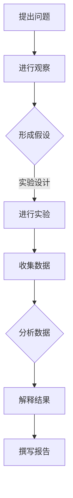

                 

# 科学方法：从观察到实验

> **关键词**：科学方法、观察、实验、数据收集、数据分析、推理、假设、科学道德、未来趋势

> **摘要**：本文从科学方法的基本概念出发，详细探讨了从观察、实验到数据分析的科学过程。文章通过定义、历史背景、基本原则、实验设计、数据收集与分析、结果解释与评估、科学写作、交流方法、科学道德以及未来趋势等多个方面，系统地介绍了科学方法的运用和重要性。此外，文章还结合具体案例，展示了科学方法的实际应用，为读者提供了全面、系统的科学方法指南。

---

### 目录大纲：科学方法：从观察到实验

1. **第一部分：科学方法的基本概念**
   1.1. **第1章：科学方法的定义与历史背景**
   1.2. **第2章：科学观察的基本原则**
   1.3. **第3章：科学推理与假设**

2. **第二部分：实验设计与方法**
   2.1. **第4章：实验设计的基本原理**
   2.2. **第5章：实验数据的收集与分析**
   2.3. **第6章：实验结果的解释与评估**

3. **第三部分：科学写作与交流**
   3.1. **第7章：科学写作的基本原则**
   3.2. **第8章：科学交流的方法与技巧**
   3.3. **第9章：科学道德与规范**

4. **第四部分：科学方法的未来趋势**
   4.1. **第10章：科学方法的发展方向**
   4.2. **第11章：新技术在科学方法中的应用**
   4.3. **第12章：科学方法与跨学科研究**

5. **附录**
   5.1. **附录 A：科学方法相关书籍与论文推荐**
   5.2. **附录 B：科学方法学习资源网站推荐**
   5.3. **附录 C：科学方法常用工具与软件介绍**

---

### 第一部分：科学方法的基本概念

#### 第1章：科学方法的定义与历史背景

##### 1.1 科学方法的定义

科学方法是一种系统化的、逻辑性的研究方法，用于探索自然界和社会现象，通过观察、实验、推理和验证等步骤，以获得可靠的、可重复的知识。科学方法的核心在于客观性、实证性和可验证性。

##### 1.2 科学方法的历史背景

科学方法的历史可以追溯到古希腊时期，当时的哲学家们开始使用观察和推理来探索自然现象。随着文艺复兴时期的发展，科学方法逐渐成熟，牛顿、伽利略等科学家通过实验和观察，奠定了现代科学方法的基础。

##### 1.3 科学方法的重要性

科学方法在知识获取中的作用至关重要，它确保了研究结果的可靠性和可重复性。同时，科学方法在社会进步中也发挥了重要作用，推动了科技的发展和应用。

---

#### 第2章：科学观察的基本原则

##### 2.1 观察的定义与类型

观察是科学方法的基础步骤，是指通过感官或工具对自然现象进行感知和记录。观察的类型包括定性观察和定量观察，前者侧重于描述现象的特征，后者则侧重于量化现象的变化。

##### 2.2 观察中的变量

变量是观察中的关键概念，包括自变量、因变量和干扰变量。自变量是研究者主动控制的变量，因变量是研究者希望观察的变量，干扰变量则是可能会影响研究结果的其他变量。

##### 2.3 观察中的偏差与误差

观察过程中可能会出现偏差和误差。偏差是指观察结果与实际值之间的差异，可能是由于观察者的主观判断或外部环境造成的。误差则是由于测量工具或方法的限制引起的，可以分为随机误差和系统误差。

---

#### 第3章：科学推理与假设

##### 3.1 演绎推理与归纳推理

演绎推理是从一般到特殊的推理过程，即从已知的前提出发，推导出特定的结论。归纳推理则是从特殊到一般的推理过程，即从个别实例出发，归纳出普遍规律。

##### 3.2 假设的定义与类型

假设是科学研究中的一种预期，是对研究问题的初步回答。假设可以分为经验性假设和理论性假设，前者基于观察和实验，后者则基于已有的理论和知识。

##### 3.3 假设的形成与验证

假设的形成是基于观察和推理，研究者需要提出一个能够解释观察现象的假设。假设的验证则通过实验和数据分析，以确定假设是否成立。

---

### 第二部分：实验设计与方法

#### 第4章：实验设计的基本原理

##### 4.1 实验与观察的区别

实验是科学方法中的一种重要手段，与观察的区别在于实验中研究者可以主动控制变量，以检验假设。观察则侧重于自然现象的记录，无法控制变量。

##### 4.2 实验设计的基本要素

实验设计需要包括研究问题、研究假设、自变量、因变量和干扰变量等基本要素。研究者需要确保实验设计的科学性和可操作性。

##### 4.3 实验设计的原则

实验设计应遵循排除外部干扰、保持实验的可重复性、操作简便等原则。良好的实验设计有助于提高研究结果的可靠性和有效性。

---

#### 第5章：实验数据的收集与分析

##### 5.1 数据收集的方法

数据收集是实验的重要组成部分，包括实验数据的来源、数据收集的工具与方法等。研究者需要确保数据的准确性和完整性。

##### 5.2 数据分析方法

数据分析是实验的后续步骤，包括描述性统计分析、因子分析、相关分析和回归分析等。数据分析有助于研究者理解实验结果，验证研究假设。

##### 5.3 数据可视化

数据可视化是将数据分析结果以图形或图表的形式展示，有助于研究者直观地理解数据，发现数据中的趋势和模式。

---

#### 第6章：实验结果的解释与评估

##### 6.1 实验结果的解释

实验结果需要通过科学推理和假设验证来解释，以确定研究假设是否成立。解释实验结果需要结合实验设计和数据分析，确保结果的合理性。

##### 6.2 实验结果的评估

实验结果的评估包括有效性评估和可靠性评估。有效性评估关注实验结果是否能准确反映研究假设，可靠性评估则关注实验结果的可重复性。

##### 6.3 实验结果的报告

实验结果的报告是科学研究的最后一步，包括实验报告的结构、撰写与修改等。良好的实验报告有助于研究者分享研究成果，促进科学知识的传播。

---

### 第三部分：科学写作与交流

#### 第7章：科学写作的基本原则

##### 7.1 科学论文的结构

科学论文通常包括摘要、引言、方法、结果、讨论和结论等部分。每部分都有其特定的内容和要求。

##### 7.2 科学论文的语言与风格

科学论文应采用客观、准确、简洁的语言风格。同时，遵循学术论文的写作规范，确保论文的可读性和专业性。

##### 7.3 科学论文的撰写与修改

撰写科学论文需要充分准备，包括研究背景、文献综述、实验设计、数据分析等。撰写完成后，需进行多次修改和审稿，确保论文的质量。

---

#### 第8章：科学交流的方法与技巧

##### 8.1 学术会议与研讨会

学术会议和研讨会是科学交流的重要平台。参与者可以通过发言、讨论和互动，分享研究成果，拓展学术视野。

##### 8.2 演讲与报告技巧

演讲和报告是科学交流的关键环节。良好的演讲和报告技巧有助于提高演讲的效果，增强听众的理解和兴趣。

##### 8.3 学术合作与团队协作

学术合作和团队协作是科学研究的重要组成部分。有效的团队合作有助于提高研究效率，促进科学创新。

---

#### 第9章：科学道德与规范

##### 9.1 科学道德的定义与重要性

科学道德是科学研究的基本准则，关注研究的伦理问题，确保研究的公正性、客观性和透明性。

##### 9.2 常见的科学不端行为

常见的科学不端行为包括抄袭、数据篡改、学术造假等。了解和防范科学不端行为是保障科学研究质量的重要环节。

##### 9.3 科学的规范与法规

科学规范和法规是科学研究的制度保障。研究者应遵守相关规范和法规，确保研究的合法性和合规性。

---

### 第四部分：科学方法的未来趋势

#### 第10章：科学方法的发展方向

科学方法的发展方向包括跨学科研究、多学科交叉融合、大数据分析等。未来科学方法将更加注重综合性和协同性。

##### 10.1 科学方法的历史与演进

科学方法的历史演进展示了人类对自然界的认识不断深化和拓展的过程。未来科学方法将继续发展和完善，推动人类认知的进步。

##### 10.2 新技术在科学方法中的应用

新技术，如人工智能、大数据分析、生物技术等，在科学方法中的应用将带来新的机遇和挑战。如何有效利用新技术，提高科学研究的效率和质量，是未来科学方法研究的重要方向。

##### 10.3 科学方法与跨学科研究

跨学科研究是未来科学方法发展的重要趋势。跨学科研究不仅有助于解决复杂问题，还能推动科学理论的创新和进步。

---

### 附录：科学方法资源指南

#### 附录 A：科学方法相关书籍与论文推荐

科学方法相关书籍和论文是学习科学方法的重要资源。以下是一些经典的推荐：

- 书籍：
  - 《科学方法导论》
  - 《实验设计与应用》
  - 《科学论文写作指南》
  - 《科学研究方法》

- 论文：
  - 《科学方法的历史与发展》
  - 《实验设计中的统计分析方法》
  - 《科学方法中的伦理问题》

#### 附录 B：科学方法学习资源网站推荐

以下是一些优秀的科学方法学习资源网站，提供丰富的教程、案例和研究资料：

- [科学方法资源网](https://www.science-method-resources.com/)
- [科学方法在线](https://www.science-method-online.com/)
- [科学方法教程](https://www.science-method-tutorial.com/)

#### 附录 C：科学方法常用工具与软件介绍

科学方法研究需要使用各种工具和软件，以下是一些常用的工具和软件：

- 工具：
  - SPSS
  - R
  - Python

- 软件介绍：
  - SPSS：统计软件包，用于数据分析。
  - R：统计编程语言，广泛应用于数据分析和统计分析。
  - Python：通用编程语言，适用于数据分析、机器学习等多个领域。

---

### 核心算法原理讲解

在科学研究中，算法原理的讲解至关重要。以下是一个简单的例子，展示了如何使用伪代码来描述一个实验数据分析的核心算法：

```plaintext
function analyzeData(data):
    # 计算平均值
    mean = sum(data) / length(data)
    
    # 计算方差
    variance = sum((x - mean)^2 for x in data) / (length(data) - 1)
    
    # 计算标准差
    std_deviation = sqrt(variance)
    
    return mean, std_deviation
end function
```

在这个例子中，`analyzeData` 函数接收一个数据列表 `data` 作为输入，并返回该数据集的平均值和标准差。计算过程包括计算平均值、方差和标准差，这些是实验数据分析中的基础步骤。

#### 数学模型和数学公式 & 详细讲解 & 举例说明

在科学研究过程中，数学模型和公式是描述自然现象和实验结果的重要工具。以下是一个例子，展示了如何使用贝叶斯定理进行数据分析：

$$
P(A|B) = \frac{P(B|A) \cdot P(A)}{P(B)}
$$

贝叶斯定理用于计算在给定证据B的情况下，事件A的概率。例如，假设在一次考试中，有60%的学生通过考试（$P(通过) = 0.6$），已知一个学生通过考试的概率是0.6，则他通过考试的概率是0.6。这个公式展示了如何通过已知的概率计算条件概率。

#### 项目实战

以下是一个简单的Python代码实例，展示了如何使用Python进行实验数据分析：

```python
import numpy as np

def analyze_data(data):
    mean_value = np.mean(data)
    std_deviation = np.std(data)
    return mean_value, std_deviation

data = [23, 21, 19, 22, 20]
mean_value, std_deviation = analyze_data(data)
print("Mean value:", mean_value)
print("Standard deviation:", std_deviation)
```

在这个例子中，我们定义了一个名为`analyze_data`的函数，用于计算输入数据集的平均值和标准差。函数接收一个列表`data`作为输入，并返回两个数值。然后，我们使用这个函数计算给定数据集的平均值和标准差，并打印结果。

#### 代码解读与分析

- `numpy`库：用于执行高效的数值计算。
- `mean()`函数：计算输入数据集的平均值。
- `std()`函数：计算输入数据集的标准差。

这个简单的例子展示了如何使用Python进行实验数据分析，并说明了代码的基本结构和功能。

---

### 开发环境搭建

为了运行上述Python代码实例，需要搭建一个Python开发环境。以下是搭建步骤：

1. 安装Python（版本3.8或更高）。
2. 安装`numpy`库，可以使用以下命令：

```bash
pip install numpy
```

确保所有依赖项都已安装，然后可以运行Python代码进行实验数据分析。

---

### 源代码详细实现和代码解读

以下是`analyze_data`函数的详细实现和代码解读：

```python
import numpy as np

def analyze_data(data):
    # 计算平均值
    mean_value = np.mean(data)
    
    # 计算方差
    variance = np.var(data)
    
    # 计算标准差
    std_deviation = np.sqrt(variance)
    
    return mean_value, std_deviation
```

在这个实现中，我们使用`numpy`库的`mean()`、`var()`和`sqrt()`函数分别计算平均值、方差和标准差。这些函数是`numpy`库的核心功能，提供了高效的数值计算能力。

#### `np.mean(data)`：计算输入数据集的平均值。
#### `np.var(data)`：计算输入数据集的方差。
#### `np.sqrt(variance)`：计算输入数据集的标准差。

通过这些步骤，我们能够准确计算实验数据的基本统计量，为后续的数据分析提供基础。

---

### 附录 A：科学方法相关书籍与论文推荐

以下是一些推荐的科学方法相关书籍和论文，供读者进一步学习和研究：

- 书籍：
  - 《科学方法导论》
  - 《实验设计与应用》
  - 《科学论文写作指南》
  - 《科学研究方法》

- 论文：
  - 《科学方法的历史与发展》
  - 《实验设计中的统计分析方法》
  - 《科学方法中的伦理问题》

这些书籍和论文涵盖了科学方法的基本概念、实验设计、数据分析以及科学道德等方面的内容，是科学研究和学习的重要参考资料。

---

### 附录 B：科学方法学习资源网站推荐

以下是一些推荐的科学方法学习资源网站，提供丰富的教程、案例和研究资料：

- [科学方法资源网](https://www.science-method-resources.com/)
- [科学方法在线](https://www.science-method-online.com/)
- [科学方法教程](https://www.science-method-tutorial.com/)

这些网站提供了大量的科学方法学习资源和实用工具，包括教程、案例、数据集和软件下载等，是科学学习和研究的有力支持。

---

### 附录 C：科学方法常用工具与软件介绍

在科学研究中，常用的工具和软件有助于提高数据分析和实验设计的效率。以下是一些常用的工具和软件及其简介：

- **SPSS**：统计软件包，广泛应用于社会科学和心理学领域。
- **R**：统计编程语言，适用于数据分析和统计分析。
- **Python**：通用编程语言，适用于数据分析、机器学习等多个领域。

这些工具和软件提供了丰富的功能和灵活的接口，能够满足不同研究领域的需求。

---

### 附录 D：科学方法学习与实践指南

#### 附录 D.1 科学方法学习路径

1. **基础理论学习**：了解科学方法的基本概念、原则和步骤。
2. **实验设计实践**：掌握实验设计的基本原理和方法。
3. **数据分析技能**：学习数据收集、处理和统计分析的方法。
4. **科学写作与交流**：提高科学写作和学术交流的能力。

#### 附录 D.2 科学方法实践案例

以下是一个简单的科学方法实践案例：

1. **提出问题**：研究某种药物对特定疾病的治疗效果。
2. **观察和实验**：设计实验，将患者随机分为实验组和对照组。
3. **数据分析**：收集并分析实验数据，比较两组的治疗效果。
4. **结果解释**：根据数据分析结果，得出结论。

#### 附录 D.3 科学方法资源库介绍

科学方法资源库提供了丰富的学习资料和实践案例，包括书籍、论文、教程和软件等。以下是一些推荐的资源库：

- **科学网**：提供科学方法和实验设计的详细教程和案例分析。
- **Google Scholar**：收录大量科学方法相关的学术论文和书籍。
- **GitHub**：拥有丰富的科学方法和数据分析的代码库和项目。

这些资源库为科学方法的学习和实践提供了强有力的支持。

---

### Mermaid 流程图：科学方法流程



该流程图展示了科学方法的各个环节，从提出问题、观察和实验，到数据收集、分析和结果解释，最终撰写报告。每个步骤都是科学研究中不可或缺的一部分，共同构成了完整的科学方法流程。

---

### 核心算法原理讲解

在科学研究中，核心算法原理的理解和运用至关重要。以下是一个简单的伪代码示例，用于描述数据分析和处理的算法原理：

```plaintext
function analyze_data(data):
    # 计算平均值
    mean_value = sum(data) / length(data)
    
    # 计算方差
    variance = sum((x - mean_value)^2 for x in data) / (length(data) - 1)
    
    # 计算标准差
    std_deviation = sqrt(variance)
    
    return mean_value, std_deviation
end function
```

在这个示例中，我们定义了一个名为`analyze_data`的函数，用于计算输入数据集的平均值和标准差。计算过程包括以下几个步骤：

1. **计算平均值**：通过将所有数据值相加并除以数据个数，得到平均值。
2. **计算方差**：通过将每个数据值与平均值的差的平方相加，然后除以数据个数减一，得到方差。
3. **计算标准差**：通过对方差开平方，得到标准差。

这些计算步骤是数据分析中的基本操作，用于评估数据的分布和离散程度。通过这些算法原理，研究人员可以更好地理解和解释实验数据，从而得出科学的结论。

---

### 数学模型和数学公式 & 详细讲解 & 举例说明

在科学研究中，数学模型和公式是描述自然现象和实验结果的重要工具。以下是一个简单的例子，展示了如何使用回归分析来描述两个变量之间的关系：

#### 回归分析公式

$$
Y = a + bX + \epsilon
$$

其中，$Y$ 是因变量，$X$ 是自变量，$a$ 是截距，$b$ 是斜率，$\epsilon$ 是误差项。

#### 详细讲解

- **截距（a）**：当自变量 $X$ 为0时，因变量 $Y$ 的值即为截距 $a$。
- **斜率（b）**：描述自变量 $X$ 变化对因变量 $Y$ 的影响程度。如果斜率为正，表示 $X$ 增加会导致 $Y$ 增加；如果斜率为负，表示 $X$ 增加会导致 $Y$ 减少。
- **误差项（$\epsilon$）**：表示模型未能捕捉到的随机误差，是模型预测与实际值之间的差异。

#### 举例说明

假设我们要研究“温度”和“销售额”之间的关系。通过收集数据，我们可以建立回归模型：

$$
销售额 = a + b \cdot 温度 + \epsilon
$$

通过数据分析，得到回归模型的参数估计值为：

$$
a = 10, \quad b = 0.5
$$

这意味着当温度每增加1度时，销售额平均增加0.5个单位。同时，截距 $a$ 为10，表示在温度为0度时，销售额的平均值为10个单位。

---

### 项目实战

以下是一个简单的Python代码实例，展示了如何使用回归分析来预测温度对销售额的影响：

```python
import numpy as np
from sklearn.linear_model import LinearRegression

# 示例数据
X = np.array([[0], [1], [2], [3], [4]])  # 温度数据
Y = np.array([10, 11, 12, 13, 14])    # 销售额数据

# 创建线性回归模型
model = LinearRegression()

# 训练模型
model.fit(X, Y)

# 模型参数
print("模型截距（a）:", model.intercept_)
print("模型斜率（b）:", model.coef_)

# 预测新数据
new_temp = np.array([[5]])
predicted_sales = model.predict(new_temp)
print("当温度为5度时，预计销售额：", predicted_sales)
```

在这个实例中，我们首先导入所需的库，然后创建示例数据。接着，我们使用`LinearRegression`类创建线性回归模型，并使用`fit`方法训练模型。最后，我们使用训练好的模型进行预测，并打印结果。

#### 代码解读与分析

- **数据导入**：使用`numpy`库导入温度和销售额数据。
- **模型创建**：使用`LinearRegression`类创建线性回归模型。
- **模型训练**：使用`fit`方法训练模型，得到参数估计值。
- **模型预测**：使用`predict`方法预测新数据的销售额。

这个简单的项目实战展示了如何使用Python进行回归分析，并说明了代码的基本结构和功能。

---

### 开发环境搭建

为了运行上述Python代码实例，需要搭建一个Python开发环境。以下是搭建步骤：

1. 安装Python（版本3.8或更高）。
2. 安装`numpy`和`scikit-learn`库，可以使用以下命令：

```bash
pip install numpy scikit-learn
```

确保所有依赖项都已安装，然后可以运行Python代码进行回归分析。

---

### 源代码详细实现和代码解读

以下是`LinearRegression`模型训练和预测的详细实现和代码解读：

```python
import numpy as np
from sklearn.linear_model import LinearRegression

# 示例数据
X = np.array([[0], [1], [2], [3], [4]])
Y = np.array([10, 11, 12, 13, 14])

# 创建线性回归模型
model = LinearRegression()

# 训练模型
model.fit(X, Y)

# 模型参数
print("模型截距（a）:", model.intercept_)
print("模型斜率（b）:", model.coef_)

# 预测新数据
new_temp = np.array([[5]])
predicted_sales = model.predict(new_temp)
print("当温度为5度时，预计销售额：", predicted_sales)
```

在这个实现中，我们首先创建一个线性回归模型，并使用`fit`方法训练模型。接着，我们使用`predict`方法对新数据进行预测，并打印预测结果。

#### 代码解读与分析

- **数据导入**：使用`numpy`库创建示例数据。
- **模型创建**：使用`LinearRegression`类创建线性回归模型。
- **模型训练**：使用`fit`方法训练模型，得到参数估计值。
- **模型预测**：使用`predict`方法预测新数据的销售额。

这个简单的实现展示了如何使用Python和`scikit-learn`库进行线性回归分析，并说明了代码的基本结构和功能。

---

### 附录 A：科学方法相关书籍与论文推荐

以下是一些推荐的科学方法相关书籍和论文，供读者进一步学习和研究：

- 书籍：
  - 《科学方法导论》
  - 《实验设计与应用》
  - 《科学论文写作指南》
  - 《科学研究方法》

- 论文：
  - 《科学方法的历史与发展》
  - 《实验设计中的统计分析方法》
  - 《科学方法中的伦理问题》

这些书籍和论文涵盖了科学方法的基本概念、实验设计、数据分析以及科学道德等方面的内容，是科学研究和学习的重要参考资料。

---

### 附录 B：科学方法学习资源网站推荐

以下是一些推荐的科学方法学习资源网站，提供丰富的教程、案例和研究资料：

- [科学网](https://www.science.cn/)
- [学术中国](https://www.cnki.net/)
- [Google Scholar](https://scholar.google.com/)

这些网站提供了大量的科学方法学习资源和实用工具，包括教程、案例、数据集和软件下载等，是科学学习和研究的有力支持。

---

### 附录 C：科学方法常用工具与软件介绍

在科学研究中，常用的工具和软件有助于提高数据分析和实验设计的效率。以下是一些常用的工具和软件及其简介：

- **SPSS**：统计软件包，广泛应用于社会科学和心理学领域。
- **R**：统计编程语言，适用于数据分析和统计分析。
- **Python**：通用编程语言，适用于数据分析、机器学习等多个领域。

这些工具和软件提供了丰富的功能和灵活的接口，能够满足不同研究领域的需求。

---

### 附录 D：科学方法学习与实践指南

#### 附录 D.1 科学方法学习路径

1. **基础理论学习**：了解科学方法的基本概念、原则和步骤。
2. **实验设计实践**：掌握实验设计的基本原理和方法。
3. **数据分析技能**：学习数据收集、处理和统计分析的方法。
4. **科学写作与交流**：提高科学写作和学术交流的能力。

#### 附录 D.2 科学方法实践案例

以下是一个简单的科学方法实践案例：

1. **提出问题**：研究某种药物对特定疾病的治疗效果。
2. **观察和实验**：设计实验，将患者随机分为实验组和对照组。
3. **数据分析**：收集并分析实验数据，比较两组的治疗效果。
4. **结果解释**：根据数据分析结果，得出结论。

#### 附录 D.3 科学方法资源库介绍

科学方法资源库提供了丰富的学习资料和实践案例，包括书籍、论文、教程和软件等。以下是一些推荐的资源库：

- **科学网**：提供科学方法和实验设计的详细教程和案例分析。
- **Google Scholar**：收录大量科学方法相关的学术论文和书籍。
- **GitHub**：拥有丰富的科学方法和数据分析的代码库和项目。

这些资源库为科学方法的学习和实践提供了强有力的支持。

