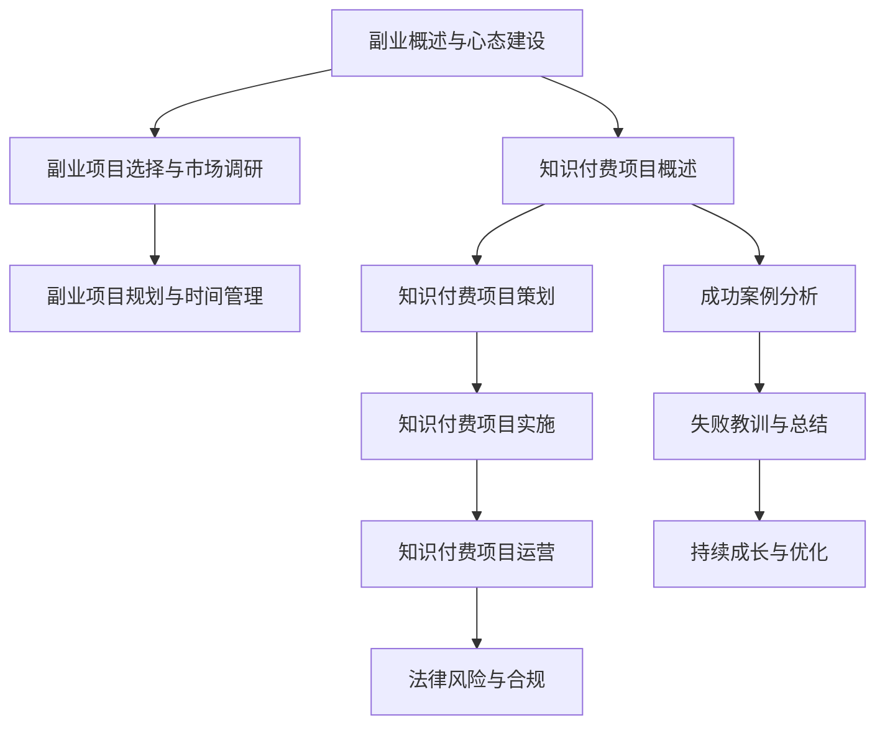

                 

## 《程序员副业指南：知识付费项目启动攻略》

### 关键词：程序员、副业、知识付费、项目策划、运营、案例

> 本文章将为您详细解析程序员如何利用自身的专业知识和技能，开展知识付费项目，实现副业收入。我们将从副业的意义、项目选择与规划、知识付费项目实施与运营等多个方面，一步一步进行分析，帮助您打造一个成功的知识付费项目。

---

#### 第一部分：副业概述与心态建设

在当前竞争激烈的就业市场中，许多程序员都在寻找额外的收入来源。副业，作为一种灵活的工作方式，逐渐成为程序员们关注的焦点。本部分将探讨副业的意义、程序员为何选择副业、副业带来的机会与挑战，以及如何建立正确的心态迎接副业。

#### 第1章：副业的意义与心态建设

> **1.1 程序员为何选择副业？**

程序员选择副业的原因多种多样。一方面，程序员的技能和知识在市场上具有较高的价值，通过副业可以进一步发挥自己的才能，获得额外的收入。另一方面，副业可以帮助程序员扩展职业视野，积累更多的经验和资源，从而为未来的职业发展打下坚实的基础。

> **1.2 副业带来的机会与挑战**

副业为程序员带来了诸多机会，如增加收入、扩展技能、提升职业竞争力等。然而，副业也伴随着一定的挑战，如时间管理、项目规划、风险控制等。因此，程序员在开展副业时，需要充分认识到这些机会与挑战，做好充分的准备。

> **1.3 建立正确的心态迎接副业**

正确的态度对于成功开展副业至关重要。程序员应该保持积极的心态，勇于面对挑战，善于从失败中吸取教训。同时，要合理安排时间和精力，确保副业与主业之间的平衡，避免影响正常的工作和生活。

---

#### 第二部分：副业项目选择与市场调研

选择一个适合自己的副业项目是成功开展副业的关键。本部分将介绍如何选择适合自己的副业项目，市场调研的方法与技巧，以及如何进行竞争分析。

#### 第2章：副业项目选择与市场调研

> **2.1 如何选择适合自己的副业项目？**

选择适合自己的副业项目需要考虑多个因素，如个人兴趣、专业技能、市场需求等。程序员可以根据自己的实际情况，选择开发软件、编写教程、提供咨询服务等类型的副业项目。

> **2.2 市场调研的方法与技巧**

市场调研是了解市场需求、竞争对手和潜在客户的重要手段。程序员可以通过网络搜索、问卷调查、访谈等方式进行市场调研，获取有价值的信息。

> **2.3 竞争分析**

竞争分析有助于了解市场竞争状况，为副业项目的制定提供依据。程序员可以通过分析竞争对手的产品、定价、市场策略等，找到自己的优势与不足，制定合适的竞争策略。

---

#### 第三部分：副业项目规划与时间管理

在成功选择了副业项目并进行了市场调研后，接下来需要对项目进行规划，并合理分配时间和精力，以确保副业的顺利进行。

#### 第3章：副业项目规划与时间管理

> **3.1 副业项目的规划步骤**

副业项目的规划步骤包括确定项目目标、制定项目计划、评估项目风险等。通过规划，可以确保副业项目有条不紊地进行。

> **3.2 副业与主业的时间协调**

副业与主业的时间协调是确保副业成功的关键。程序员需要合理安排时间，确保副业不影响到主业的工作质量和效率。

> **3.3 高效的时间管理技巧**

高效的时间管理技巧可以帮助程序员更好地平衡副业与主业，提高工作效率。例如，使用时间管理工具、制定工作计划、避免拖延等。

---

#### 第四部分：知识付费项目启动

知识付费项目是程序员开展副业的一种重要形式。本部分将介绍知识付费项目的概述、策划、实施与运营。

#### 第4章：知识付费项目概述

> **4.1 知识付费的市场趋势**

知识付费作为一种新兴的商业模式，在近年来得到了快速发展。本文将分析知识付费市场的趋势，为程序员提供有益的参考。

> **4.2 知识付费项目的类型**

知识付费项目包括在线课程、电子书、编程教程等多种形式。程序员可以根据自己的特长和市场需求，选择合适的知识付费项目类型。

> **4.3 知识付费项目的重要性**

知识付费项目不仅可以帮助程序员实现收入增长，还可以提升个人品牌价值，扩大影响力。因此，知识付费项目在程序员副业中具有重要地位。

---

#### 第五部分：知识付费项目策划

知识付费项目的策划是成功实施项目的基础。本部分将介绍如何确定目标受众、策划内容以及制定营销策略。

#### 第5章：知识付费项目策划

> **5.1 确定目标受众**

确定目标受众是知识付费项目策划的第一步。程序员需要了解目标受众的需求、兴趣和痛点，为他们提供有价值的内容。

> **5.2 内容策划与设计**

内容策划与设计是知识付费项目的核心。程序员需要根据目标受众的需求，设计符合他们期望的内容，并通过多种形式（如视频、图文、音频等）进行呈现。

> **5.3 营销策略与推广**

营销策略与推广是知识付费项目成功的关键。程序员需要制定有效的营销策略，选择合适的推广渠道，吸引更多的潜在客户。

---

#### 第六部分：知识付费项目实施

知识付费项目的实施是将策划转化为实际成果的过程。本部分将介绍如何进行项目准备、内容制作与质量控制，以及项目上线与用户反馈。

#### 第6章：知识付费项目实施

> **6.1 项目准备与资源整合**

项目准备与资源整合是知识付费项目实施的前提。程序员需要准备项目所需的资源，如教材、课件、工具等，并进行合理的整合。

> **6.2 内容制作与质量控制**

内容制作与质量控制是知识付费项目的核心。程序员需要精心制作内容，确保内容的质量，以提高用户满意度。

> **6.3 项目上线与用户反馈**

项目上线与用户反馈是知识付费项目实施的重要环节。程序员需要将项目上线，并提供优质的用户服务，收集用户反馈，不断优化项目。

---

#### 第七部分：知识付费项目运营

知识付费项目的运营是确保项目长期稳定发展的重要保障。本部分将介绍如何进行用户服务与支持、数据分析和优化，以及收益模式与商业模式。

#### 第7章：知识付费项目运营

> **7.1 用户服务与支持**

用户服务与支持是知识付费项目运营的核心。程序员需要提供优质的用户服务，解答用户疑问，解决用户问题，提高用户满意度。

> **7.2 数据分析与优化**

数据分析与优化是知识付费项目运营的关键。程序员需要通过数据分析，了解用户需求和市场动态，不断优化项目内容和运营策略。

> **7.3 收益模式与商业模式**

收益模式与商业模式是知识付费项目运营的基础。程序员需要选择合适的收益模式，如订阅制、一次性购买等，并设计合理的商业模式，确保项目的可持续发展。

---

#### 第八部分：法律风险与合规

在开展知识付费项目时，程序员需要重视法律风险与合规问题。本部分将介绍如何保护知识产权、防范合同法律风险，以及遵守知识付费项目的合规要求。

#### 第8章：法律风险与合规

> **8.1 知识产权保护**

知识产权保护是知识付费项目的重要一环。程序员需要了解知识产权的相关法律法规，确保自己的项目不受侵犯，并保护自己的知识产权。

> **8.2 合同法律风险**

合同法律风险是知识付费项目中常见的风险之一。程序员需要谨慎签订合同，明确双方的权利和义务，避免合同纠纷。

> **8.3 知识付费项目的合规要求**

知识付费项目需要遵守相关的法律法规和行业规范。程序员需要了解合规要求，确保项目合法合规，降低法律风险。

---

#### 第九部分：实战案例与经验分享

通过成功案例的分析和失败教训的总结，程序员可以更好地理解知识付费项目的运作，少走弯路。

#### 第9章：成功案例分析

在本章中，我们将分析三个知识付费项目的成功案例，包括编程教程制作、编程交流社区运营、在线课程开发。通过这些案例，程序员可以学习到项目策划、实施和运营的关键技巧。

#### 第10章：失败教训与总结

在本章中，我们将总结常见的失败原因，如市场调研不足、内容质量不高、营销策略不当等。同时，我们将探讨如何从失败中学习，避免再次犯同样的错误。

#### 第11章：持续成长与优化

在知识付费项目中，持续成长和优化是项目成功的关键。程序员需要不断提升自己的技能和知识，适应市场变化，优化项目内容和运营策略。

#### 第11章：持续成长与优化

在本章中，我们将探讨程序员如何在知识付费项目中持续成长和优化，包括技能提升、知识拓展、市场适应等方面。同时，我们将探讨如何平衡副业与职业发展，实现个人和职业的全面发展。

### 附录

#### 附录A：知识付费项目工具推荐

在本附录中，我们将推荐一些适用于知识付费项目的工具，包括教学视频制作工具、在线教育平台和数据分析与用户反馈工具。

#### 附录B：相关资源与推荐阅读

在本附录中，我们将推荐一些与知识付费项目相关的书籍、行业报告、开源项目和学习资源，以供程序员参考和学习。

---

本文《程序员副业指南：知识付费项目启动攻略》旨在帮助程序员充分利用自身的专业技能和知识，开展知识付费项目，实现副业收入。通过本文的详细解析和实战案例分享，相信程序员可以找到适合自己的副业项目，并在知识付费领域取得成功。

### 作者

**作者：AI天才研究院/AI Genius Institute & 禅与计算机程序设计艺术 /Zen And The Art of Computer Programming**

### 核心概念与联系流程图（Mermaid）



### 核心算法原理讲解（伪代码）

```python
// 伪代码：知识付费项目策划
function 知识付费项目策划(目标受众，内容策划，营销策略) {
    // 确定目标受众
    确定受众群体 = 分析市场调研结果

    // 内容策划
    策划内容 = 结合受众需求和兴趣，设计课程内容

    // 营销策略
    营销策略 = 制定推广计划，选择合适的宣传渠道

    // 项目实施
    项目实施 = 根据策划内容，制作教学视频或文档
    项目上线 = 在线发布课程，收集用户反馈

    // 运营优化
    数据分析 = 分析用户行为，优化课程内容和营销策略
    用户服务 = 提供优质的用户服务，提高用户满意度

    return 知识付费项目
}
```

### 数学模型和数学公式（LaTeX）

```latex
// 数学模型：用户满意度预测
S = f(U, C, S')
```

其中，$S$ 为用户满意度，$U$ 为用户需求，$C$ 为课程质量，$S'$ 为用户服务满意度。

```latex
// 用户行为分析
B = \sum_{i=1}^{n} b_i \cdot t_i
```

其中，$B$ 为用户行为评分，$b_i$ 为行为权重，$t_i$ 为行为时间。

### 项目实战（代码实际案例和详细解释说明）

```python
// Python 代码：在线课程发布示例
class OnlineCourse:
    def __init__(self, title, content, price):
        self.title = title
        self.content = content
        self.price = price
        self.published = False

    def publish_course(self):
        if not self.published:
            print(f"{self.title} 已发布！")
            self.published = True
        else:
            print(f"{self.title} 已发布过，无需重复发布。")

    def display_course_info(self):
        print(f"课程名称：{self.title}")
        print(f"课程内容：{self.content}")
        print(f"课程价格：{self.price}")

# 创建课程实例
course = OnlineCourse("Python编程基础", "本课程涵盖Python编程的基础知识，包括语法、数据类型、流程控制等", 99)

# 发布课程
course.publish_course()

# 显示课程信息
course.display_course_info()
```

### 代码解读与分析

```plaintext
// 代码解读
- 类 `OnlineCourse` 代表一个在线课程，包含课程标题、内容和价格等属性。
- 方法 `publish_course` 用于发布课程，如果课程未被发布，则发布并设置 `published` 为 `True`；如果课程已发布，则提示已发布。
- 方法 `display_course_info` 用于显示课程信息。

// 分析
- 发布课程时，需要确保课程未被发布，这样可以避免重复发布。
- 课程信息显示是为了让用户了解课程的具体内容，以便做出购买决策。
- 在实际开发中，可能会添加更多的功能，如用户评论、课程进度追踪等。
```

### 附录A：知识付费项目工具推荐

#### A.1 教学视频制作工具

- **Camtasia**：一款功能强大的视频编辑软件，适合制作教学视频。
- **Adobe Premiere**：专业视频编辑软件，适用于制作高质量的教学视频。

#### A.2 在线教育平台

- **Teachable**：一款易于使用的在线教育平台，适合创建和销售在线课程。
- **Udemy**：全球领先的在线学习平台，适合发布和销售自己的知识产品。

#### A.3 数据分析与用户反馈工具

- **Google Analytics**：一款强大的数据分析工具，可以帮助了解用户行为和网站流量。
- **UserVoice**：一款用户反馈收集工具，可以帮助了解用户需求和满意度。

### 附录B：相关资源与推荐阅读

#### B.1 知识付费项目相关书籍推荐

- **《知识变现》**：探讨知识付费的商业模式和应用方法。
- **《在线课程设计与营销》**：详细介绍在线课程的设计和营销策略。

#### B.2 行业报告与市场研究资源

- **艾瑞咨询**：提供互联网行业的研究报告和市场分析。
- **Statista**：提供全球市场的数据和分析报告。

#### B.3 开源项目与学习资源链接

- **GitHub**：全球最大的开源代码托管平台，可以找到许多相关的开源项目。
- **Stack Overflow**：编程问答社区，提供丰富的编程学习资源。

