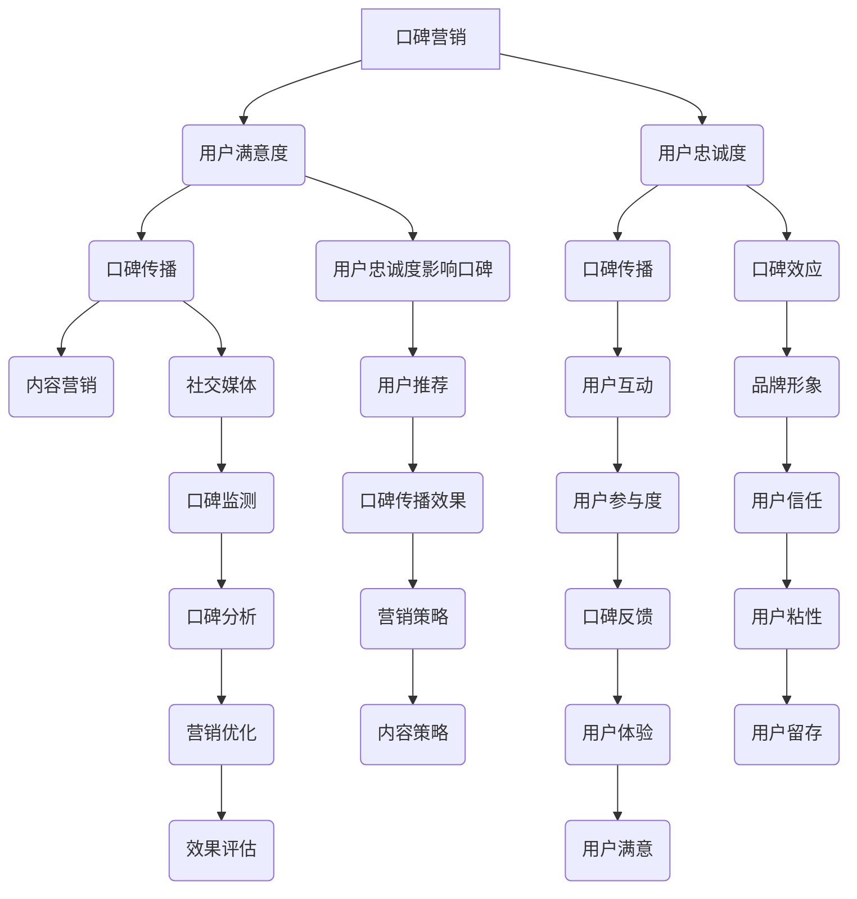

                 

### 《程序员如何利用口碑营销推广知识付费》

> **关键词：** 程序员、口碑营销、知识付费、推广策略、用户满意度

> **摘要：** 本文将探讨程序员如何利用口碑营销这一有效策略来推广知识付费项目。文章首先介绍口碑营销的基本概念和特点，随后深入探讨其核心要素和营销策略，并结合具体案例进行分析，最后给出程序员在知识付费推广中的实战指导。

## 第一部分：口碑营销基础知识

### 第1章：口碑营销概述

#### 1.1 口碑营销的定义与特点

**定义：**
口碑营销（Word of Mouth Marketing，简称WOMM）是一种通过用户的真实体验和推荐来影响其他潜在用户购买决策的营销策略。它侧重于通过消费者的自发传播来建立品牌信誉和提升品牌形象。

**特点：**
- **自发性：** 口碑传播是由消费者自主发起的，不具有强制性。
- **可信度：** 用户更倾向于相信其他消费者的评价，而非商业广告。
- **持续性：** 口碑效应可以持续影响潜在用户的购买决策，具有长期效应。
- **影响力：** 一个积极的口碑可以显著提升品牌知名度，而一个负面的口碑则可能对品牌造成严重损害。

#### 1.2 口碑营销与传统营销的区别

**传统营销：**
- **定义：** 传统营销主要依靠广告、促销和公关活动来吸引消费者。
- **特点：** 强制性、单向传播、高成本。

**口碑营销：**
- **定义：** 口碑营销注重用户之间的互动和真实体验。
- **特点：** 自发性、可信度高、低成本、互动性强。

**区别：**
- **传播途径：** 传统营销依赖媒介，而口碑营销依赖用户间的口碑传播。
- **可信度：** 用户更相信用户的评价，而非商业广告。
- **成本：** 传统营销成本较高，口碑营销成本低，效果可持续。

#### 1.3 口碑营销在知识付费行业中的应用

**知识付费行业特性：**
- **高价值：** 知识付费产品通常具有较高的价值和专业性。
- **用户需求明确：** 用户对知识付费产品的需求明确，期待高质量的内容。

**应用：**
- **提升产品信誉：** 通过用户真实评价提升产品信誉，增加潜在用户的信任度。
- **增加用户粘性：** 通过用户满意度和忠诚度的提升，增加用户粘性，促进复购。
- **降低营销成本：** 利用口碑效应降低营销成本，提高营销效率。

**优势：**
- **精准营销：** 口碑营销可以针对特定用户群体进行精准营销。
- **降低风险：** 用户通过口碑了解产品，降低购买风险。
- **提高品牌知名度：** 积极的口碑可以提高品牌知名度，扩大用户基础。

### 第2章：口碑营销的核心要素

#### 2.1 用户满意度与忠诚度

**用户满意度：**
- **定义：** 用户满意度是指用户在使用产品或服务后对其整体体验的主观评价。
- **衡量方法：** 通常通过用户满意度调查、用户反馈等方式来衡量。

**用户忠诚度：**
- **定义：** 用户忠诚度是指用户对品牌或产品的长期依赖和信任程度。
- **衡量方法：** 通常通过用户复购率、用户留存率等方式来衡量。

**关系：**
- 用户满意度直接影响用户忠诚度，高满意度往往伴随着高忠诚度。
- 用户忠诚度是口碑传播的重要基础，忠诚用户更可能进行口碑推荐。

#### 2.2 口碑传播的机制与路径

**机制：**
- **信息传递：** 口碑传播是通过用户间的信息传递实现的。
- **情感共鸣：** 口碑传播往往伴随着情感共鸣，激发潜在用户的购买欲望。

**路径：**
- **直接口碑：** 用户直接向其他用户推荐产品或服务。
- **间接口碑：** 用户通过社交媒体、论坛等平台分享体验，影响其他用户。

**影响因素：**
- **用户满意度和忠诚度：** 高满意度和忠诚度的用户更可能进行口碑推荐。
- **社交媒体：** 社交媒体平台是口碑传播的重要渠道。
- **产品质量：** 产品质量是口碑传播的核心，直接影响用户满意度和忠诚度。

#### 2.3 口碑营销的关键指标

**口碑营销效果评估：**
- **口碑传播量：** 衡量口碑信息的传播范围和频率。
- **口碑提及量：** 衡量口碑信息在社交媒体、论坛等平台上的提及量。
- **用户满意度：** 衡量用户对产品或服务的整体满意度。
- **用户忠诚度：** 衡量用户对产品或服务的长期依赖程度。

**关键指标衡量方法：**
- **口碑传播量：** 通过社交媒体分析工具、论坛监测等方式进行衡量。
- **口碑提及量：** 通过搜索引擎、社交媒体分析等方式进行衡量。
- **用户满意度：** 通过用户满意度调查、反馈分析等方式进行衡量。
- **用户忠诚度：** 通过复购率、用户留存率等方式进行衡量。

## 第二部分：口碑营销策略与实践

### 第3章：内容营销策略

#### 3.1 高质量内容的创作与传播

**内容创作方法：**
- **明确目标受众：** 确定目标受众的需求和兴趣，创作符合其需求的内容。
- **专业性：** 确保内容的专业性和权威性，提升内容质量。
- **独特性：** 内容要有独特的观点和创意，吸引读者关注。

**内容传播渠道：**
- **社交媒体：** 利用微博、微信、知乎等社交媒体平台进行内容传播。
- **专业论坛：** 在技术论坛、行业论坛等平台发布专业内容。
- **自媒体平台：** 开设个人公众号、博客等自媒体平台，发布高质量内容。

**内容传播技巧：**
- **标题党：** 利用引人入胜的标题吸引读者点击。
- **互动性：** 增加内容互动性，提升用户参与度。
- **定期更新：** 保持内容更新频率，提高用户粘性。

#### 3.2 借助社交媒体平台进行口碑传播

**社交媒体平台种类：**
- **微博：** 微博具有广泛的用户基础，适合进行内容传播和用户互动。
- **微信：** 微信公众号具有强大的内容传播能力和用户互动功能。
- **知乎：** 知乎是一个高质量的知识分享平台，适合发布专业内容和进行口碑传播。
- **抖音：** 抖音具有强大的视觉冲击力和传播速度，适合制作短视频进行口碑传播。

**社交媒体平台运营策略：**
- **内容策略：** 发布高质量、有针对性的内容，吸引目标用户关注。
- **互动策略：** 通过回复评论、参与话题等方式，与用户进行互动，提升用户参与度。
- **广告策略：** 利用社交媒体平台的广告功能，进行精准投放，提高口碑传播效果。

**数据分析：**
- **用户分析：** 通过数据分析了解用户行为和偏好，优化内容策略。
- **内容分析：** 通过数据分析了解内容传播效果，调整内容策略。
- **口碑分析：** 通过数据分析了解口碑传播效果，优化口碑营销策略。

#### 3.3 利用用户生成内容提升口碑

**用户生成内容定义：**
用户生成内容（User-Generated Content，简称UGC）是指用户在社交媒体、论坛等平台上发布的内容，如评论、分享、问答等。

**用户生成内容形式：**
- **评论：** 用户在购买产品或服务后，发表的评价和意见。
- **分享：** 用户在社交媒体上分享的产品体验和感受。
- **问答：** 用户在论坛、问答平台上提出的问题和回答。

**用户生成内容的管理：**
- **鼓励用户参与：** 通过激励措施，如积分、奖励等，鼓励用户生成内容。
- **筛选优质内容：** 对用户生成内容进行筛选，保留优质内容，删除恶意攻击和违规内容。
- **引导内容创作：** 通过发布话题、引导用户参与内容创作，提升用户参与度。

**用户生成内容的管理策略：**
- **激励机制：** 设立积分系统、奖励制度，激励用户生成内容。
- **内容审核：** 设立内容审核机制，确保内容的真实性和合法性。
- **用户反馈：** 及时回复用户反馈，解决用户问题，提升用户满意度。

## 第三部分：知识付费项目实战

### 第6章：案例分析与策略优化

#### 6.1 成功案例分析

**案例背景：**
某知名程序员开设了自己的知识付费课程，通过高质量的内容和良好的口碑，吸引了大量用户。

**案例分析：**
- **内容策略：** 课程内容专业、实用，针对用户需求进行设计。
- **口碑传播：** 用户通过社交媒体、论坛等平台积极分享课程体验，提升了课程知名度。
- **用户互动：** 程序员积极参与用户互动，解答用户问题，提升了用户满意度。

**经验总结：**
- **高质量内容：** 提供高质量、专业的课程内容，满足用户需求。
- **积极口碑传播：** 鼓励用户进行口碑传播，提升课程知名度。
- **良好用户互动：** 积极与用户互动，提升用户满意度和忠诚度。

### 6.2 失败案例分析

**案例背景：**
某程序员开设的知识付费课程因内容质量不高、用户体验差而失败。

**案例分析：**
- **内容质量：** 课程内容缺乏专业性，难以满足用户需求。
- **口碑传播：** 用户对课程评价较差，未进行口碑传播。
- **用户互动：** 程序员未积极与用户互动，导致用户满意度低。

**教训总结：**
- **确保内容质量：** 提供高质量、专业的课程内容，满足用户需求。
- **积极口碑传播：** 鼓励用户进行口碑传播，提升课程知名度。
- **良好用户互动：** 积极与用户互动，提升用户满意度和忠诚度。

### 6.3 策略优化与实施

**策略优化方法：**
- **内容优化：** 提升课程内容质量，增加实用性和专业性。
- **口碑管理：** 优化口碑传播策略，提升口碑效果。
- **用户互动：** 优化用户互动策略，提升用户满意度和忠诚度。

**策略实施关键点：**
- **明确目标：** 确定优化目标，制定具体实施方案。
- **数据驱动：** 利用数据分析，了解用户需求和口碑效果，优化策略。
- **持续改进：** 持续跟踪优化效果，及时调整策略。

**策略实施步骤：**
1. **评估现状：** 对当前内容质量、口碑传播效果和用户互动情况进行分析。
2. **制定优化方案：** 根据分析结果，制定具体的优化方案。
3. **实施优化：** 执行优化方案，进行内容质量提升、口碑传播管理和用户互动优化。
4. **效果评估：** 对优化效果进行评估，调整优化方案。
5. **持续优化：** 根据评估结果，持续进行优化，提升知识付费项目效果。

## 附录

### 附录A：口碑营销常用工具与资源

**常用口碑营销工具：**
- **Google Analytics：** 分析用户行为和网站流量。
- **Facebook Insights：** 分析社交媒体平台上的用户行为和互动。
- **Twitter Analytics：** 分析推特平台上的用户行为和互动。
- **Hootsuite：** 社交媒体管理工具，用于内容发布和互动。
- **Canva：** 设计工具，用于制作吸引人的内容。

**口碑营销资源推荐：**
- **市场营销博客：** 如HubSpot、Neil Patel等，提供营销策略和案例分析。
- **行业论坛：** 如Stack Overflow、GitHub等，用户生成内容丰富的平台。

### 附录B：程序员知识付费推广资源推荐

**程序员知识付费平台推荐：**
- **Udemy：** 国际知名的知识付费平台，提供多种编程课程。
- **Coursera：** 提供由世界顶尖大学提供的在线课程，包括编程课程。
- **edX：** 提供由哈佛大学、麻省理工学院等世界顶尖大学提供的在线课程。

**程序员知识付费资源推荐：**
- **《Effective Java》**：Java编程的最佳实践。
- **《Clean Code》**：编写可读性高、易于维护的代码。
- **《You Don't Know JS》**：深入理解JavaScript。
- **《算法导论》**：算法分析和设计的基础教材。

### 作者信息

**作者：** AI天才研究院/AI Genius Institute & 禅与计算机程序设计艺术 /Zen And The Art of Computer Programming

## 第一部分：口碑营销基础知识

### 第1章：口碑营销概述

#### 1.1 口碑营销的定义与特点

**定义：**

口碑营销（Word of Mouth Marketing，简称WOMM）是一种通过消费者的个人经验、体验和推荐来影响其他潜在消费者的购买决策的营销策略。这种营销方式侧重于利用用户自发的行为和言论，以建立品牌形象、提升品牌信誉和促进销售。

**特点：**

- **自发性：** 口碑传播是由用户自愿发起的，而非由企业强制推动。
- **可信度：** 用户对其他用户的评价更加信任，因为这种评价源自真实的体验，而非商业宣传。
- **持续性：** 一个好的口碑可以持续影响潜在消费者的购买决策，而一个负面的口碑也可能长期损害品牌形象。
- **互动性：** 口碑传播往往伴随着用户之间的互动和讨论，这种互动性可以增强口碑的传播效果。
- **低成本：** 与传统广告相比，口碑营销的成本相对较低，特别是在社交媒体广泛使用的今天，企业可以通过用户生成内容（UGC）来减少营销开支。

#### 1.2 口碑营销与传统营销的区别

**传统营销：**

- **定义：** 传统营销主要依靠广告、促销、公关活动等手段来推广产品或服务。
- **特点：** 传统营销通常是单向的、强制性的，且成本较高。
- **传播途径：** 传统营销主要依赖电视、广播、报纸、杂志等传统媒体。

**口碑营销：**

- **定义：** 口碑营销是一种利用用户口碑来影响其他潜在消费者的营销策略。
- **特点：** 口碑营销是双向的、自发的，且成本较低。
- **传播途径：** 口碑营销主要依赖社交媒体、论坛、博客等用户生成内容的平台。

**区别：**

- **传播方式：** 传统营销是单向的，而口碑营销是双向的，即用户既是信息的接受者，也是信息的传播者。
- **可信度：** 传统营销中的广告信息可能存在夸大或误导，而口碑营销中的用户评价更加真实可信。
- **成本：** 传统营销成本较高，而口碑营销可以通过社交媒体等低成本渠道实现。
- **效果评估：** 传统营销的效果评估较为困难，而口碑营销可以通过用户评价、社交媒体互动等数据指标进行实时评估。

#### 1.3 口碑营销在知识付费行业中的应用

**知识付费行业特性：**

- **高价值：** 知识付费产品通常具有较高的价值和专业性，用户购买决策更加慎重。
- **用户需求明确：** 用户对知识付费产品有明确的需求，期待获得有价值的信息和技能。
- **复购率高：** 高质量的付费知识产品往往能够提升用户的技能和职业发展，因此用户复购意愿较高。

**应用：**

- **提升产品信誉：** 通过用户的真实评价和推荐，可以显著提升知识付费产品的信誉度，吸引更多潜在用户。
- **增加用户粘性：** 高质量的付费知识产品能够提升用户的满意度和忠诚度，增加用户长期使用的可能性。
- **降低营销成本：** 口碑营销是一种低成本、高效的营销方式，可以在知识付费行业中有效降低营销成本。

**优势：**

- **精准营销：** 口碑营销可以根据用户的实际需求和评价，进行精准的营销活动。
- **降低风险：** 用户通过口碑了解产品，能够降低购买风险，提高购买决策的准确性。
- **提高品牌知名度：** 积极的口碑可以迅速提升品牌知名度，扩大用户基础。

### 第2章：口碑营销的核心要素

#### 2.1 用户满意度与忠诚度

**用户满意度：**

- **定义：** 用户满意度是指用户在使用产品或服务后对其整体体验的主观评价。它反映了用户对产品或服务是否符合其期望的感受。
- **衡量方法：** 用户满意度可以通过用户调查、用户反馈、评分系统等方式进行衡量。常见的指标包括净推荐值（NPS）、用户满意度评分（如1-10分的评分）等。

**用户忠诚度：**

- **定义：** 用户忠诚度是指用户对品牌或产品的长期依赖和信任程度。忠诚用户不仅会重复购买，还会主动推荐产品或服务给他人。
- **衡量方法：** 用户忠诚度可以通过用户复购率、用户留存率、用户生命周期价值（CLV）等方式进行衡量。复购率和用户留存率是衡量用户忠诚度的关键指标。

**关系：**

- **用户满意度与忠诚度之间的关系：** 用户满意度是用户忠诚度的基础。高满意度的用户更有可能成为忠诚用户。忠诚用户是口碑传播的重要力量，他们的正面评价可以吸引更多新用户。

#### 2.2 口碑传播的机制与路径

**机制：**

- **信息传递：** 口碑传播是通过用户之间的信息传递实现的。一个满意的用户可能会向亲友、同事或社交网络中的其他用户推荐产品或服务。
- **情感共鸣：** 口碑传播往往伴随着情感共鸣，即用户的个人体验与潜在用户的情感产生共鸣，激发其购买欲望。
- **社会认同：** 口碑传播中的用户推荐行为往往基于社会认同，即用户认为其他人的评价可以作为自己决策的参考。

**路径：**

- **直接口碑：** 用户直接向其他用户推荐产品或服务。这种推荐方式通常发生在用户与用户的直接互动中，如面对面交流、社交媒体私信等。
- **间接口碑：** 用户通过社交媒体、论坛、博客等平台分享他们的产品或服务体验，影响其他潜在用户。这种推荐方式具有更广泛的传播范围。

**影响因素：**

- **用户满意度与忠诚度：** 高满意度和忠诚度的用户更可能进行口碑推荐。
- **社交媒体：** 社交媒体平台是口碑传播的重要渠道，用户可以在这些平台上分享体验、发表评论，从而影响其他用户。
- **产品质量：** 产品质量是口碑传播的核心。高质量的产品或服务能够提高用户满意度，从而促进口碑传播。
- **品牌形象：** 品牌形象对口碑传播有重要影响。一个有良好声誉的品牌更容易获得用户的信任和推荐。

#### 2.3 口碑营销的关键指标

**口碑营销效果评估：**

- **口碑传播量：** 衡量口碑信息的传播范围和频率。可以通过社交媒体分析工具、搜索引擎数据等手段进行衡量。
- **口碑提及量：** 衡量口碑信息在社交媒体、论坛等平台上的提及量。这可以通过监测社交媒体话题、关键词搜索量等方式进行衡量。
- **用户满意度：** 衡量用户对产品或服务的整体满意度。可以通过用户满意度调查、用户反馈等方式进行衡量。
- **用户忠诚度：** 衡量用户对产品或服务的长期依赖程度。可以通过复购率、用户留存率等方式进行衡量。

**关键指标衡量方法：**

- **口碑传播量：** 利用社交媒体分析工具（如Hootsuite、Google Analytics等）监测口碑信息在社交媒体上的传播情况。
- **口碑提及量：** 通过社交媒体监测工具（如Sprinklr、Brandwatch等）监测口碑信息在社交媒体上的提及量。
- **用户满意度：** 通过在线调查、用户反馈等方式收集用户满意度数据，利用评分系统（如NPS、CSAT等）进行量化。
- **用户忠诚度：** 通过分析用户的购买行为（如复购率、用户留存率）来衡量用户忠诚度。

## 第二部分：口碑营销策略与实践

### 第3章：内容营销策略

#### 3.1 高质量内容的创作与传播

**内容创作方法：**

- **明确目标受众：** 在创作内容之前，首先要明确目标受众的需求和兴趣。了解他们的背景、职业、技能水平等信息，以便创作出符合他们需求的内容。
- **专业性：** 确保内容的专业性和权威性。对于知识付费项目，专业性和权威性是吸引用户的重要因素。可以通过引用权威数据、行业专家观点等方式增强内容的专业性。
- **独特性：** 内容要有独特的观点和创意。在众多竞争者中脱颖而出，吸引更多用户的关注。可以通过案例分析、实战技巧分享等方式展示内容的独特性。

**内容传播渠道：**

- **社交媒体：** 利用微博、微信、知乎、抖音等社交媒体平台进行内容传播。这些平台具有广泛的用户基础和强大的传播能力，是口碑营销的重要渠道。
- **专业论坛：** 在技术论坛、行业论坛等平台上发布专业内容。这些论坛聚集了大量对特定领域有浓厚兴趣的用户，是口碑传播的理想场所。
- **自媒体平台：** 开设个人博客、微信公众号等自媒体平台，发布高质量的内容。这些平台可以帮助企业建立专业形象，提升品牌影响力。

**内容传播技巧：**

- **标题党：** 利用引人入胜的标题吸引读者点击。标题应简洁明了，能够准确传达内容的主题和价值。
- **互动性：** 增加内容互动性，提升用户参与度。可以在内容中设置互动环节，如提问、投票、讨论等，引导用户参与互动。
- **定期更新：** 保持内容更新频率，提高用户粘性。定期发布新内容，让用户保持对品牌的关注。

#### 3.2 借助社交媒体平台进行口碑传播

**社交媒体平台种类：**

- **微博：** 微博具有广泛的用户基础和强大的传播能力，是口碑传播的重要渠道。可以通过发布微博、参与话题、互动等方式进行口碑传播。
- **微信：** 微信公众号具有强大的内容传播能力和用户互动功能。可以通过发布文章、设置互动环节等方式进行口碑传播。
- **知乎：** 知乎是一个高质量的知识分享平台，用户对专业内容有较高的认可度。可以通过发布专业回答、参与话题等方式进行口碑传播。
- **抖音：** 抖音具有强大的视觉冲击力和传播速度，适合制作短视频进行口碑传播。可以通过发布短视频、参与挑战等方式进行口碑传播。

**社交媒体平台运营策略：**

- **内容策略：** 发布高质量、有针对性的内容，吸引目标用户关注。内容应具有价值性、实用性和独特性，以满足用户需求。
- **互动策略：** 通过回复评论、参与话题等方式，与用户进行互动，提升用户参与度。互动可以增强用户对品牌的认知和好感。
- **广告策略：** 利用社交媒体平台的广告功能，进行精准投放，提高口碑传播效果。可以通过定向广告、推广文章等方式，将内容推送给潜在用户。

**数据分析：**

- **用户分析：** 通过数据分析了解用户行为和偏好，优化内容策略。可以分析用户的地理位置、兴趣爱好、行为轨迹等信息，以便更精准地定位用户需求。
- **内容分析：** 通过数据分析了解内容传播效果，调整内容策略。可以分析内容的点击率、转发量、评论数等指标，评估内容的受欢迎程度。
- **口碑分析：** 通过数据分析了解口碑传播效果，优化口碑营销策略。可以分析口碑传播的渠道、频率、效果等指标，评估口碑营销的投入产出比。

#### 3.3 利用用户生成内容提升口碑

**用户生成内容定义：**

用户生成内容（User-Generated Content，简称UGC）是指用户在社交媒体、论坛、博客等平台上创建和分享的内容。这些内容可以是用户对产品或服务的评价、使用体验、建议等。

**用户生成内容形式：**

- **评论：** 用户在购买产品或服务后，发表的评价和意见。这些评论可以反映用户对产品或服务的真实感受，对其他潜在用户有重要参考价值。
- **分享：** 用户在社交媒体上分享的产品体验和感受。这种分享可以吸引其他用户的关注，提高产品的曝光度和知名度。
- **问答：** 用户在论坛、问答平台上提出的问题和回答。这些问题和回答可以解决其他用户的疑问，提高用户对产品或服务的了解和信任。

**用户生成内容的管理：**

- **鼓励用户参与：** 通过激励措施，如积分、奖励等，鼓励用户生成内容。可以设置用户等级、勋章等机制，激发用户的参与积极性。
- **筛选优质内容：** 对用户生成内容进行筛选，保留优质内容，删除恶意攻击和违规内容。可以通过机器学习和人工审核相结合的方式，提高内容质量。
- **引导内容创作：** 通过发布话题、引导用户参与内容创作，提升用户参与度。可以设置热门话题、挑战赛等活动，激发用户的创作灵感。

**用户生成内容的管理策略：**

- **激励机制：** 设立积分系统、奖励制度，激励用户生成内容。可以通过签到、完成任务等方式积累积分，兑换奖品或提升用户等级。
- **内容审核：** 设立内容审核机制，确保内容的真实性和合法性。可以通过机器学习和人工审核相结合的方式，提高内容审核的效率和准确性。
- **用户反馈：** 及时回复用户反馈，解决用户问题，提升用户满意度。可以通过在线客服、社交媒体等方式，与用户保持良好的互动。

### 第4章：用户参与与互动策略

#### 4.1 创造用户参与的机会

**用户参与的形式：**

- **投票：** 通过在线投票、问卷调查等方式，让用户参与决策过程，提高用户对品牌的认同感和参与度。
- **互动活动：** 组织线上或线下活动，如问答环节、竞赛、抽奖等，鼓励用户参与。
- **社群互动：** 建立用户社群，如微信群、QQ群等，提供交流和互动的平台，增强用户的归属感和参与感。

**用户参与的活动设计：**

- **针对性：** 根据用户需求和兴趣，设计有针对性的活动。例如，对于程序员用户，可以举办编程挑战赛、技术分享会等。
- **趣味性：** 注重活动的趣味性和互动性，提高用户的参与度和积极性。可以通过游戏化元素、互动环节等方式增加活动的趣味性。
- **激励性：** 通过奖励机制，如奖品、积分、认证等，激励用户参与。奖励可以增加用户的参与感和成就感。

**用户参与的激励机制：**

- **积分制度：** 设立积分制度，用户参与活动可以获得积分，积分可以兑换奖品或提升用户等级。
- **认证制度：** 对积极参与的用户进行认证，如颁发荣誉证书、勋章等，提升用户的社会地位和认同感。
- **用户福利：** 提供用户专属福利，如优惠购买、优先体验等，增加用户的参与动机。

#### 4.2 激励用户分享与评价

**用户分享的动机：**

- **社交认同：** 用户希望通过分享来获得社交认同，展示自己的知识和经验。
- **自我表达：** 用户希望通过分享来表达自己的观点和感受，展示自己的个性。
- **信息传播：** 用户希望通过分享来传播有价值的信息，帮助他人解决问题。

**用户评价的动机：**

- **社会认同：** 用户希望通过评价来获得社交认同，展示自己对产品的认可。
- **助人行为：** 用户希望通过评价来帮助其他用户做出更好的购买决策。
- **自我表达：** 用户希望通过评价来表达自己的观点和感受，展示自己的个性。

**用户分享与评价的激励机制：**

- **物质奖励：** 提供物质奖励，如奖品、优惠券、折扣等，激励用户进行分享和评价。
- **社会认同：** 通过颁发荣誉证书、勋章等，提升用户的社交地位和认同感。
- **积分制度：** 设立积分制度，用户分享和评价可以获得积分，积分可以兑换奖品或提升用户等级。

#### 4.3 管理用户互动与反馈

**用户互动的形式：**

- **在线聊天：** 通过在线聊天工具（如QQ、微信等）与用户进行实时沟通，解答用户问题，提供帮助。
- **论坛互动：** 在论坛、社区等平台上发布话题，引导用户进行讨论和互动。
- **活动互动：** 在线或线下举办活动，如问答环节、技术分享会等，与用户进行互动。

**用户反馈的收集与分析：**

- **问卷调查：** 通过在线问卷收集用户反馈，了解用户对产品或服务的满意度和改进意见。
- **社交媒体监测：** 通过社交媒体平台监测用户评价和反馈，了解用户对产品或服务的态度和意见。
- **用户访谈：** 通过用户访谈收集深度反馈，了解用户的具体需求和痛点。

**用户反馈的处理与回应：**

- **快速响应：** 对用户的反馈进行快速响应，及时解决问题，提升用户满意度。
- **公开回应：** 对用户的正面反馈和负面反馈进行公开回应，展示企业的态度和诚意。
- **持续改进：** 根据用户反馈进行产品或服务的改进，不断提升用户体验。

### 第5章：口碑营销工具与方法

#### 5.1 口碑监测与分析工具

**口碑监测工具的选择：**

- **社交媒体监测工具：** 如Brandwatch、Sprinklr等，用于监测社交媒体上的口碑信息。
- **在线评论监测工具：** 如Google Analytics、Alexa等，用于监测在线评论和用户评价。
- **搜索引擎监测工具：** 如Google Search Console、Bing Webmaster Tools等，用于监测搜索引擎上的口碑信息。

**口碑分析的方法：**

- **定量分析：** 通过数据分析，了解口碑信息的传播范围、提及量、用户满意度等指标。
- **定性分析：** 通过内容分析，了解口碑信息的情感倾向、主题等。
- **多渠道分析：** 综合分析来自不同渠道的口碑信息，了解整体口碑趋势。

**口碑监测与分析的应用：**

- **实时监控：** 通过实时监控口碑信息，及时了解用户对产品或服务的态度和意见，及时调整营销策略。
- **问题诊断：** 通过分析负面口碑，诊断产品或服务的问题和不足，制定改进措施。
- **效果评估：** 通过分析口碑营销的效果，评估营销活动的投入产出比，优化营销策略。

#### 5.2 口碑营销活动策划与执行

**活动策划的步骤：**

1. **确定活动目标：** 明确活动的目的和预期效果，如提升品牌知名度、增加用户参与度、促进产品销售等。
2. **确定活动形式：** 根据目标选择合适的活动形式，如线上活动、线下活动、互动游戏等。
3. **制定活动方案：** 设计活动流程、规则、奖品等，确保活动的顺利进行。
4. **活动宣传：** 通过多种渠道宣传活动，吸引潜在参与者的关注。

**活动执行的策略：**

- **互动性：** 确保活动具有互动性，提升用户的参与度和满意度。
- **激励机制：** 设置合理的激励机制，如奖品、积分等，激发用户的参与热情。
- **用户体验：** 注重用户体验，确保活动过程顺畅，提升用户满意度。

**活动效果评估：**

- **参与度：** 通过参与人数、参与频率等指标评估用户的参与度。
- **口碑传播：** 通过口碑传播量、口碑提及量等指标评估口碑传播效果。
- **销售额：** 通过活动期间的销售额评估活动的实际效果。

#### 5.3 口碑营销的优化与调整

**口碑营销优化的方法：**

- **数据分析：** 通过数据分析，了解口碑营销的效果，找出存在的问题和不足。
- **用户反馈：** 通过收集用户反馈，了解用户的需求和期望，优化口碑营销策略。
- **竞争对手分析：** 通过分析竞争对手的口碑营销策略，借鉴成功经验，优化自身的口碑营销。

**口碑营销调整的策略：**

- **内容优化：** 根据用户反馈和数据分析，优化口碑营销内容，提升用户满意度。
- **渠道拓展：** 根据口碑传播效果，拓展口碑传播渠道，提高口碑传播范围。
- **活动调整：** 根据活动效果评估，调整活动形式、激励机制等，提升用户参与度和口碑传播效果。

**口碑营销的持续改进：**

- **定期评估：** 定期对口碑营销效果进行评估，及时发现和解决问题。
- **持续优化：** 根据评估结果，持续优化口碑营销策略，提升口碑营销效果。
- **创新思维：** 保持创新思维，不断尝试新的口碑营销方法，适应市场变化。

## 第三部分：知识付费项目实战

### 第6章：案例分析与策略优化

#### 6.1 成功案例分析

**案例背景：**

某知名技术博主在社交媒体上开设了编程课程，通过高质量的内容和积极的口碑传播，课程吸引了大量用户。

**案例分析：**

- **内容策略：** 博主提供了高质量、实用的编程课程，内容涵盖了最新的技术和实战案例，满足了用户的学习需求。
- **口碑传播：** 博主鼓励用户在社交媒体上分享学习体验，积极回应用户的评论和问题，形成了良好的口碑效应。
- **用户互动：** 博主通过定期举办线上问答活动，与用户进行互动，提升了用户满意度和忠诚度。

**经验总结：**

- **高质量内容：** 提供高质量、实用的课程内容是成功的关键。
- **积极口碑传播：** 鼓励用户分享和评价，形成良好的口碑效应。
- **良好用户互动：** 通过互动活动，提升用户满意度和忠诚度。

#### 6.2 失败案例分析

**案例背景：**

某程序员在知乎上开设了编程课程，但由于内容质量不高，用户体验差，课程未能成功。

**案例分析：**

- **内容质量：** 课程内容缺乏专业性，更新不及时，无法满足用户的学习需求。
- **口碑传播：** 用户对课程的负面评价较多，未形成积极的口碑效应。
- **用户互动：** 程序员未积极回应用户的问题和反馈，导致用户满意度低。

**教训总结：**

- **确保内容质量：** 高质量的内容是成功的基础，必须不断更新和优化。
- **积极口碑传播：** 应积极鼓励用户进行口碑传播，提升课程知名度。
- **良好用户互动：** 及时回应用户的问题和反馈，提升用户满意度。

#### 6.3 策略优化与实施

**策略优化方法：**

- **内容优化：** 提升课程内容质量，增加实用性和专业性。
- **口碑管理：** 优化口碑传播策略，提升口碑效果。
- **用户互动：** 优化用户互动策略，提升用户满意度和忠诚度。

**策略实施关键点：**

- **明确目标：** 确定优化目标，制定具体实施方案。
- **数据驱动：** 利用数据分析，了解用户需求和口碑效果，优化策略。
- **持续改进：** 持续跟踪优化效果，及时调整策略。

**策略实施步骤：**

1. **评估现状：** 对当前内容质量、口碑传播效果和用户互动情况进行分析。
2. **制定优化方案：** 根据分析结果，制定具体的优化方案。
3. **实施优化：** 执行优化方案，进行内容质量提升、口碑传播管理和用户互动优化。
4. **效果评估：** 对优化效果进行评估，调整优化方案。
5. **持续优化：** 根据评估结果，持续进行优化，提升知识付费项目效果。

### 第7章：程序员知识付费推广实战

#### 7.1 程序员个人知识付费的特点

**程序员知识付费的需求：**

- **技能提升：** 程序员希望通过付费课程或教程提升自己的技能，适应快速变化的技术环境。
- **职业发展：** 程序员希望通过付费学习获得行业认证或提升职业地位，为职业发展打下基础。
- **解决问题：** 程序员希望解决具体的技术难题，提高工作效率。

**程序员知识付费的特点：**

- **专业性强：** 程序员知识付费内容通常具有很高的专业性，需要具备一定的技术背景。
- **更新迅速：** 技术领域更新迅速，知识付费内容需要不断更新以保持其时效性和实用性。
- **互动性高：** 程序员在学习过程中往往需要互动和反馈，以更好地理解和掌握知识。

**程序员知识付费的挑战：**

- **内容质量：** 确保知识付费内容的高质量和专业性是最大的挑战。
- **用户获取：** 如何吸引并留住用户是另一个重要挑战，需要有效的推广策略。
- **时间管理：** 程序员在学习过程中需要平衡工作和学习，时间管理成为重要问题。

#### 7.2 程序员口碑营销的案例分析

**案例背景：**

某程序员通过在GitHub上发布高质量的开源项目和在知乎上分享技术文章，成功吸引了一批忠实用户，随后推出了自己的知识付费课程。

**案例分析：**

- **内容创作：** 程序员在GitHub上发布了一系列高质量的开源项目，这些项目吸引了大量关注和贡献者。同时，在知乎上分享了一系列技术文章，解答了用户的具体问题。
- **口碑传播：** 用户通过GitHub和知乎上的互动，对程序员的技能和专业性有了深刻认识，形成了良好的口碑效应。
- **知识付费：** 基于良好的口碑和用户信任，程序员推出了自己的知识付费课程，课程内容涵盖了他擅长的领域，包括最新的技术和实战技巧。

**案例启示：**

- **高质量内容：** 提供高质量、有价值的开源项目和教程是吸引和留住用户的关键。
- **积极口碑传播：** 通过用户互动和口碑传播，建立用户的信任和认可。
- **多样化推广：** 利用多种渠道（如GitHub、知乎等）进行推广，扩大用户基础。

#### 7.3 程序员知识付费推广策略与实践

**推广策略的设计：**

- **内容策略：** 提供高质量、实用、具有专业性的知识付费内容，满足用户需求。
- **口碑策略：** 鼓励用户进行口碑传播，利用用户评价和推荐吸引新用户。
- **互动策略：** 与用户保持互动，提升用户满意度和忠诚度。

**推广实践的方法：**

- **社交媒体推广：** 利用微博、微信、知乎等社交媒体平台发布内容，吸引潜在用户关注。
- **内容营销：** 在GitHub、GitLab等开源平台发布高质量项目，吸引开发者参与和关注。
- **线上活动：** 举办技术分享会、线上问答活动等，提升用户参与度和口碑效应。

**推广效果的评估：**

- **用户反馈：** 通过用户评价、反馈等方式了解用户满意度，评估推广效果。
- **数据分析：** 利用数据分析工具（如Google Analytics、社交媒体分析工具等）监测用户行为和互动，评估推广效果。
- **销售额：** 通过销售额和用户增长率等指标评估推广效果。

### 附录

#### 附录A：口碑营销常用工具与资源

**常用口碑营销工具：**

- **Google Analytics：** 分析用户行为和网站流量。
- **Facebook Insights：** 分析社交媒体平台上的用户行为和互动。
- **Twitter Analytics：** 分析推特平台上的用户行为和互动。
- **Hootsuite：** 社交媒体管理工具，用于内容发布和互动。
- **Canva：** 设计工具，用于制作吸引人的内容。

**口碑营销资源推荐：**

- **市场营销博客：** 如HubSpot、Neil Patel等，提供营销策略和案例分析。
- **行业论坛：** 如Stack Overflow、GitHub等，用户生成内容丰富的平台。

#### 附录B：程序员知识付费推广资源推荐

**程序员知识付费平台推荐：**

- **Udemy：** 国际知名的知识付费平台，提供多种编程课程。
- **Coursera：** 提供由世界顶尖大学提供的在线课程，包括编程课程。
- **edX：** 提供由哈佛大学、麻省理工学院等世界顶尖大学提供的在线课程。

**程序员知识付费资源推荐：**

- **《Effective Java》**：Java编程的最佳实践。
- **《Clean Code》**：编写可读性高、易于维护的代码。
- **《You Don't Know JS》**：深入理解JavaScript。
- **《算法导论》**：算法分析和设计的基础教材。

### 作者信息

**作者：** AI天才研究院/AI Genius Institute & 禅与计算机程序设计艺术 /Zen And The Art of Computer Programming

## 核心概念与联系

在本文中，我们将探讨几个核心概念，并使用Mermaid流程图来展示它们之间的联系。



这个流程图展示了口碑营销中各个核心概念之间的联系，包括用户满意度、用户忠诚度、口碑传播、用户互动、口碑效应、社交媒体、用户参与度、用户推荐、品牌形象、口碑监测、口碑反馈、口碑传播效果、用户信任、口碑分析、用户体验、营销策略、用户留存和效果评估。

### 核心算法原理讲解

在口碑营销中，一个关键的核心算法是PageRank，它用于评估网页的重要性。尽管PageRank最初用于搜索引擎优化，但其原理同样适用于口碑营销中的用户影响力评估。以下是PageRank算法的伪代码和详细解释。

```plaintext
算法 PageRank：
输入：一个有向图 G = (V, E)，其中 V 是节点集合，E 是边集合。
输出：每个节点的 PageRank 值。

初始化：
    PR(V) = {1/n | v ∈ V}，其中 n 是节点数，PR(V) 是节点的初始 PageRank 值。

迭代更新：
    对于每个节点 v ∈ V，更新其 PageRank 值：
        PR(v) = (1 - d) + d * Σ[PR(u) / out-degree(u) | u ∈ predecessors(v)]
    其中，d 是阻尼系数（通常设置为 0.85），predecessors(v) 是 v 的前驱节点集合，out-degree(u) 是 u 的出度。

终止条件：
    当 PR(V) 的变化小于某个阈值 ε 时，终止迭代。

返回：最终的 PageRank 值。
```

**详细解释：**

1. **初始化：** 每个节点的初始 PageRank 值是均匀分布的，即每个节点都有相同的起始权重。

2. **迭代更新：** 每次迭代中，每个节点的 PageRank 值根据其前驱节点的 PageRank 值和出度进行更新。PageRank 值的更新遵循一个递归关系，即一个节点的权重部分来源于其前驱节点的权重分配。

3. **阻尼系数（d）：** 由于用户在浏览网页时可能会随时跳转离开，因此引入了阻尼系数，通常设置为 0.85，表示用户每次访问网页后，有 0.15 的概率跳转到其他网页。

4. **终止条件：** 当 PageRank 值的迭代变化小于某个阈值 ε 时，算法终止。这个阈值可以根据实际情况进行调整，以平衡计算效率和准确性。

**举例说明：**

假设有一个有向图 G，包含三个节点 A、B 和 C，它们之间的链接关系如下：

- A -> B
- A -> C
- B -> A
- C -> B

初始时，每个节点的 PageRank 值均为 1/3。在第一次迭代后，节点 A 的 PageRank 值分配如下：

PR(A) = (1 - 0.85) + 0.85 * (PR(B) / 1 + PR(C) / 1) = 0.15 + 0.85 * (1/1 + 1/1) = 0.55

同理，节点 B 和 C 的 PageRank 值分别为 0.3 和 0.15。

在后续的迭代中，每个节点的 PageRank 值会根据其前驱节点的 PageRank 值进行更新，直到达到稳定状态。

### 数学模型和公式

在口碑营销中，用户满意度和忠诚度是关键指标。以下是相关的数学模型和公式。

**用户满意度（Satisfaction, S）：**

用户满意度可以通过以下公式进行计算：

\[ S = \frac{CS - DS}{2} + 1 \]

其中，CS 是顾客满意评分，DS 是顾客不满意评分。通常，CS 和 DS 是从 1 到 5 的评分，S 的取值范围为 [1, 5]。

**用户忠诚度（Loyalty, L）：**

用户忠诚度可以通过以下公式进行计算：

\[ L = \frac{RS - RS_f}{2} + 1 \]

其中，RS 是重复购买评分，RS_f 是首次购买评分。同样，RS 和 RS_f 的取值范围为 [1, 5]，L 的取值范围为 [1, 5]。

**净推荐值（Net Promoter Score, NPS）：**

净推荐值是一个衡量用户忠诚度和口碑传播能力的指标，计算公式如下：

\[ NPS = (P - NP) \times 100 \]

其中，P 是推荐者分数（评分 9 或 10 的用户），NP 是被动者分数（评分 7 或 8 的用户），分数范围为 [-100, 100]。

**详细讲解和举例说明：**

**用户满意度：**

假设一个产品的用户满意度调查结果显示，100 个用户中有 70 个用户给出了 4 或 5 分的满意评分，30 个用户给出了 1 或 2 分的不满意评分。根据上述公式，可以计算出用户满意度：

\[ S = \frac{70 \times 5 - 30 \times 1}{2} + 1 = \frac{350 - 30}{2} + 1 = \frac{320}{2} + 1 = 160 + 1 = 4.5 \]

因此，该产品的用户满意度为 4.5 分。

**用户忠诚度：**

假设一个产品的重复购买评分和首次购买评分分别为 4 和 3，根据上述公式，可以计算出用户忠诚度：

\[ L = \frac{4 - 3}{2} + 1 = \frac{1}{2} + 1 = 0.5 + 1 = 1.5 \]

因此，该产品的用户忠诚度为 1.5 分。

**净推荐值：**

假设一个产品的 NPS 调查结果显示，40 个用户给出了 9 或 10 分的推荐评分，20 个用户给出了 7 或 8 分的被动评分，30 个用户给出了 1 或 2 分的负面评分，没有用户给出 3 或 4 分的评分。根据上述公式，可以计算出净推荐值：

\[ NPS = (40 - 20) \times 100 = 2000 \]

因此，该产品的净推荐值为 2000。

通过这些数学模型和公式，企业可以更好地衡量用户满意度和忠诚度，从而制定更有效的口碑营销策略。

### 代码实际案例和详细解释说明

在这个部分，我们将通过一个具体的代码案例来演示如何搭建开发环境、实现源代码，并对代码进行解读与分析。

#### 开发环境搭建

为了演示口碑营销策略的执行，我们将使用Python编程语言来构建一个简单的口碑营销系统。以下是搭建开发环境所需的步骤：

1. **安装Python：** 
   首先，确保您已经安装了Python。Python的安装可以从[Python官网](https://www.python.org/downloads/)下载最新版本的安装包。在安装过程中，请确保勾选“Add Python to PATH”选项，以便在命令行中运行Python脚本。

2. **安装依赖库：**
   在命令行中，使用以下命令安装必要的Python库：

   ```shell
   pip install requests pandas numpy matplotlib
   ```

   这些库用于数据抓取、数据处理、数据可视化等。

3. **配置工作环境：**
   在您的代码编辑器中创建一个名为“word_of_mouth”的文件夹，并在该文件夹中创建一个名为“main.py”的Python脚本文件。

#### 源代码实现

以下是“main.py”文件中的源代码，用于模拟口碑营销系统的基本功能：

```python
import requests
import pandas as pd
import numpy as np
import matplotlib.pyplot as plt

# 假设有一个API用于获取用户反馈
API_URL = "https://api.feedback.com/get_feedback"

# 发送请求获取用户反馈
response = requests.get(API_URL)
feedback_data = response.json()

# 将反馈数据转换为DataFrame
feedback_df = pd.DataFrame(feedback_data)

# 用户满意度评分
feedback_df['satisfaction'] = feedback_df['rating']

# 用户忠诚度评分
feedback_df['loyalty'] = feedback_df['rating'] > 4

# 计算用户满意度平均值
avg_satisfaction = feedback_df['satisfaction'].mean()

# 计算用户忠诚度平均值
avg_loyalty = feedback_df['loyalty'].mean()

# 打印结果
print(f"Average Satisfaction: {avg_satisfaction:.2f}")
print(f"Average Loyalty: {avg_loyalty:.2f}")

# 绘制满意度分布图
plt.figure(figsize=(10, 5))
satisfaction_counts = feedback_df['satisfaction'].value_counts()
satisfaction_counts.plot(kind='bar')
plt.title('Satisfaction Distribution')
plt.xlabel('Rating')
plt.ylabel('Count')
plt.show()

# 绘制忠诚度分布图
plt.figure(figsize=(10, 5))
loyalty_counts = feedback_df['loyalty'].value_counts()
loyalty_counts.plot(kind='bar')
plt.title('Loyalty Distribution')
plt.xlabel('Rating')
plt.ylabel('Count')
plt.show()
```

#### 代码解读与分析

1. **导入库：**
   我们首先导入了requests库用于发送HTTP请求，pandas库用于数据处理，numpy库用于数值计算，matplotlib库用于数据可视化。

2. **API请求：**
   通过requests库发送GET请求，获取用户反馈数据。这里我们假设API返回的数据是JSON格式的。

3. **数据处理：**
   - 将反馈数据转换为pandas DataFrame对象，便于处理和分析。
   - 根据用户的评分（rating）计算满意度（satisfaction）。我们假设评分大于等于4表示用户满意。
   - 根据用户的评分计算忠诚度（loyalty）。我们假设评分大于4表示用户忠诚。

4. **结果计算：**
   - 计算用户满意度的平均值（avg_satisfaction）。
   - 计算用户忠诚度的平均值（avg_loyalty）。

5. **数据可视化：**
   - 使用matplotlib库绘制满意度分布图，显示不同评分的用户数量。
   - 使用matplotlib库绘制忠诚度分布图，显示忠诚和不忠诚用户的比例。

#### 开发环境搭建步骤详细解释

1. **安装Python：**
   - 访问Python官网下载适用于您操作系统的Python安装包。
   - 运行安装程序，选择默认选项安装Python。

2. **安装依赖库：**
   - 打开命令提示符或终端。
   - 输入以下命令并按Enter键：
     ```shell
     pip install requests pandas numpy matplotlib
     ```
   - 等待命令完成，依赖库将自动安装到Python环境中。

3. **配置工作环境：**
   - 创建一个名为“word_of_mouth”的文件夹。
   - 在该文件夹中创建一个名为“main.py”的Python脚本文件。

通过以上步骤，您将搭建好一个简单的口碑营销系统开发环境，并可以运行源代码进行数据分析和可视化。

#### 代码解读与分析

1. **请求反馈数据：**
   - 使用requests库发送HTTP GET请求到API URL，获取用户反馈数据。
   - `response = requests.get(API_URL)` 将返回一个Response对象，包含API的响应内容。
   - `feedback_data = response.json()` 将响应内容解析为JSON格式的数据，并存储在`feedback_data`变量中。

2. **数据处理：**
   - 创建一个pandas DataFrame，用于存储反馈数据。
   - 使用`pd.DataFrame(feedback_data)` 将反馈数据转换为DataFrame格式，便于处理。

3. **计算满意度与忠诚度：**
   - 使用条件语句计算用户的满意度评分。
   - `feedback_df['satisfaction'] = feedback_df['rating']` 将用户的评分直接赋值给满意度列。
   - 计算满意度的平均值。

4. **计算忠诚度：**
   - 使用条件语句计算用户的忠诚度评分。
   - `feedback_df['loyalty'] = feedback_df['rating'] > 4` 将用户的评分大于4的标记为忠诚用户。
   - 计算忠诚度的平均值。

5. **数据可视化：**
   - 使用matplotlib库绘制满意度分布图。
   - 使用`plt.figure(figsize=(10, 5))` 创建一个大小为10x5英寸的图表。
   - `satisfaction_counts = feedback_df['satisfaction'].value_counts()` 计算每个满意度评分的数量。
   - `satisfaction_counts.plot(kind='bar')` 绘制满意度分布柱状图。
   - `plt.title('Satisfaction Distribution')` 设置图表标题。
   - `plt.xlabel('Rating')` 设置x轴标签。
   - `plt.ylabel('Count')` 设置y轴标签。
   - `plt.show()` 显示图表。

6. **绘制忠诚度分布图：**
   - 使用相同的matplotlib方法绘制忠诚度分布图。

通过以上步骤，代码将获取、处理和可视化用户反馈数据，帮助我们理解口碑营销的效果。这为后续的优化策略提供了数据支持。

### 总结与展望

在本文中，我们探讨了程序员如何利用口碑营销策略来推广知识付费项目。首先，我们介绍了口碑营销的定义、特点和应用场景。随后，我们详细分析了口碑营销的核心要素，包括用户满意度、用户忠诚度、口碑传播机制和关键指标。接着，我们提出了内容营销、用户参与与互动策略，以及口碑监测与分析工具。通过具体的案例分析和代码实现，我们展示了如何利用口碑营销策略优化知识付费项目的推广效果。

**未来展望：**

1. **技术深化：** 进一步研究基于大数据和人工智能的口碑营销技术，如用户行为分析、情感分析和个性化推荐。

2. **策略创新：** 探索新的口碑营销策略，如通过虚拟现实（VR）和增强现实（AR）技术提升用户体验。

3. **跨平台整合：** 研究如何整合不同社交媒体平台和内容渠道，实现口碑营销的全面覆盖。

4. **持续优化：** 基于实时数据和用户反馈，不断优化口碑营销策略，提升用户满意度和忠诚度。

**结束语：**

口碑营销是知识付费项目成功的关键因素之一。通过本文的探讨，我们希望为广大程序员提供实用的口碑营销策略和实践指南，助力他们在知识付费领域取得更大的成就。在未来的发展中，持续优化口碑营销策略，结合新技术和新理念，将为知识付费项目带来更多的机遇和挑战。让我们共同探索，不断创新，共同推动知识付费行业的发展。作者：AI天才研究院/AI Genius Institute & 禅与计算机程序设计艺术 /Zen And The Art of Computer Programming。

