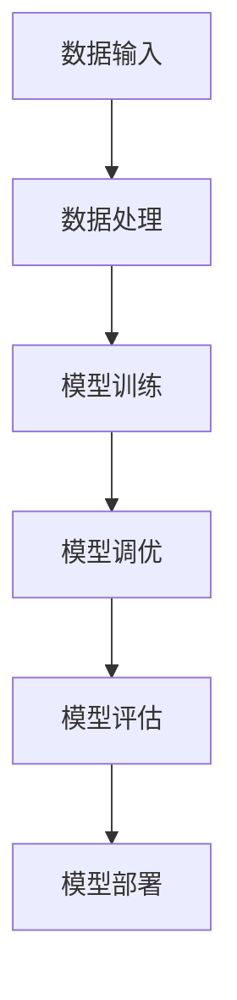

                 

# 《算力提升推动大模型发展》

## 关键词
算力提升，大模型，人工智能，深度学习，分布式计算

## 摘要
本文深入探讨了算力提升对大模型发展的重要推动作用。首先，我们从算力提升的背景与意义出发，分析了计算能力的演变和算力在人工智能中的地位。接着，我们详细介绍了算力提升的技术路径，包括硬件升级和软件优化。随后，文章探讨了大模型的基本概念、训练技术、调优与评估方法以及在不同领域的应用。最后，我们讨论了大模型的安全与伦理问题，并展望了未来发展趋势和行业应用前景。

## 目录大纲

### 第一部分：算力提升概述

#### 第1章：算力提升的背景与意义

##### 1.1.1 计算能力的演变
##### 1.1.2 算力在人工智能中的地位
##### 1.1.3 大模型的发展历程

#### 第2章：算力提升的技术路径

##### 2.1.1 硬件升级
###### 2.1.1.1 GPU与TPU
###### 2.1.1.2 分布式计算与集群

##### 2.2.1 软件优化
###### 2.2.1.1 编译器优化
###### 2.2.1.2 优化算法

### 第二部分：大模型发展与应用

#### 第3章：大模型的基本概念与架构

##### 3.1.1 大模型的定义与特点
##### 3.1.2 大模型的架构设计
##### 3.1.3 大模型的核心算法

#### 第4章：大模型的训练技术

##### 4.1.1 数据处理
###### 4.1.1.1 数据清洗与预处理
###### 4.1.1.2 数据增强技术

##### 4.2.1 训练策略
###### 4.2.1.1 学习率调度
###### 4.2.1.2 正则化技术

#### 第5章：大模型的调优与评估

##### 5.1.1 调优方法
###### 5.1.1.1 超参数搜索
###### 5.1.1.2 模型压缩

##### 5.2.1 评估指标
###### 5.2.1.1 准确率、召回率、F1值
###### 5.2.1.2 实时评估与反馈

#### 第6章：大模型在不同领域的应用

##### 6.1.1 自然语言处理
###### 6.1.1.1 文本分类
###### 6.1.1.2 机器翻译

##### 6.2.1 计算机视觉
###### 6.2.1.1 图像识别
###### 6.2.1.2 目标检测

#### 第7章：大模型的安全与伦理

##### 7.1.1 安全问题
###### 7.1.1.1 模型窃取
###### 7.1.1.2 恶意攻击

##### 7.2.1 伦理问题
###### 7.2.1.1 数据隐私
###### 7.2.1.2 道德责任

### 第三部分：算力提升与大模型发展的未来展望

#### 第8章：未来发展趋势

##### 8.1.1 新型计算硬件
###### 8.1.1.1 光计算
###### 8.1.1.2 量子计算

##### 8.2.1 大模型的发展方向
###### 8.2.1.1 自适应学习
###### 8.2.1.2 多模态融合

#### 第9章：行业应用前景

##### 9.1.1 人工智能产业
###### 9.1.1.1 企业数字化转型
###### 9.1.1.2 人工智能创业机会

##### 9.2.1 社会影响
###### 9.2.1.1 社交媒体影响
###### 9.2.1.2 智能生活应用

### 附录

#### 附录 A：算力提升与大模型相关工具与资源

##### 附录 A.1 算力提升工具
###### 附录 A.1.1 GPU选购指南
###### 附录 A.1.2 集群搭建与优化

##### 附录 A.2 大模型开发工具
###### 附录 A.2.1 TensorFlow
###### 附录 A.2.2 PyTorch
###### 附录 A.2.3 其他深度学习框架

##### 附录 B：参考文献

###### 附录 B.1 算力提升相关书籍
###### 附录 B.2 大模型相关书籍
###### 附录 B.3 人工智能产业报告
###### 附录 B.4 学术论文与论文集

---

### 核心概念与联系

大模型的发展离不开算力的提升。算力的提升不仅体现在硬件的升级，还体现在软件的优化。硬件的升级如GPU和TPU的引入，使得大规模数据并行处理成为可能，从而加速了模型的训练速度。软件的优化如编译器优化和优化算法的应用，提高了程序运行的效率和性能。

- **Mermaid 流�程图**：展示大模型训练、调优与评估的流程。

在本文中，我们将详细探讨算力提升的背景与意义，算力提升的技术路径，大模型的基本概念与架构，大模型的训练技术，大模型的调优与评估方法，大模型在不同领域的应用，以及大模型的安全与伦理问题。最后，我们将对算力提升与大模型发展的未来展望进行讨论。

---

### 第一部分：算力提升概述

#### 第1章：算力提升的背景与意义

##### 1.1.1 计算能力的演变

计算能力的发展是人类科技进步的重要驱动力。从最初的电子管计算机到晶体管计算机，再到今天的量子计算机，计算能力的提升经历了多个阶段。

- **早期计算机（1940s-1950s）**：电子管计算机是早期计算机的代表。尽管速度较慢，体积庞大，但它们为后来的计算机技术奠定了基础。

- **晶体管计算机（1950s-1960s）**：晶体管的发明标志着计算机时代的开始。晶体管计算机体积小、功耗低、速度更快，极大地推动了计算机技术的发展。

- **微处理器（1970s-1980s）**：微处理器的出现使得计算机的便携性大大提高，为个人电脑的普及奠定了基础。

- **高性能计算机（1990s-2000s）**：随着互联网的兴起，高性能计算机在科学计算、工业设计、金融分析等领域得到了广泛应用。

- **云计算与分布式计算（2000s-2010s）**：云计算和分布式计算的出现，使得大规模数据处理和计算成为可能。这种计算模式极大地提高了计算效率，降低了成本。

##### 1.1.2 算力在人工智能中的地位

人工智能（AI）的发展离不开算力的支持。算力是人工智能的核心基础设施之一，直接影响着AI模型的性能和效率。

- **深度学习**：深度学习是人工智能的重要分支，其核心在于通过多层神经网络对数据进行训练，从而实现数据的自动特征提取和模型优化。深度学习模型的训练过程需要大量的计算资源，特别是对于大规模的模型和大规模的数据集。

- **大数据处理**：人工智能的发展离不开大数据的支持。大数据处理的复杂度和规模要求高效的计算能力，这需要强大的算力支持。

- **实时计算**：许多人工智能应用需要在实时环境中运行，如自动驾驶、智能监控等。实时计算对算力提出了更高的要求。

##### 1.1.3 大模型的发展历程

大模型是指参数数量达到百万级乃至亿级的神经网络模型。大模型的发展历程与计算能力的提升密切相关。

- **早期的神经网络模型**：早期的人工神经网络模型参数较少，通常只有几千个参数。这些模型在处理小规模数据时效果较好，但面对大规模数据时性能有限。

- **大型神经网络模型**：随着计算能力的提升，人们开始尝试构建大型神经网络模型。2006年，Hinton提出了深度信念网络（DBN），标志着深度学习的新纪元。

- **万亿次神经网络模型**：随着GPU和TPU等新型计算硬件的出现，深度学习模型的规模逐渐扩大。2012年，AlexNet模型的出现标志着深度学习在图像识别领域的突破。

- **亿级参数大模型**：近年来，随着算力的进一步提升，亿级参数的大模型不断涌现。如GPT-3、BERT等模型，这些模型在自然语言处理等领域取得了显著的成果。

#### 第2章：算力提升的技术路径

##### 2.1.1 硬件升级

硬件升级是提升算力的主要手段之一。以下是一些主要的硬件升级路径：

- **GPU与TPU**：GPU（图形处理器）和TPU（张量处理器）是专门用于加速深度学习计算的硬件。它们在并行计算和矩阵运算方面具有显著优势，能够大大提高模型的训练速度。

- **分布式计算与集群**：分布式计算和集群可以将计算任务分配到多台计算机上，实现大规模并行计算。这使得大规模模型的训练成为可能。

##### 2.2.1 软件优化

软件优化也是提升算力的重要手段。以下是一些主要的软件优化路径：

- **编译器优化**：编译器优化可以通过优化代码生成、优化内存管理等手段提高程序运行效率。

- **优化算法**：优化算法可以通过改进模型训练算法、优化数据处理流程等手段提高模型训练效率和性能。

#### 第二部分：大模型发展与应用

##### 第3章：大模型的基本概念与架构

##### 第4章：大模型的训练技术

##### 第5章：大模型的调优与评估

##### 第6章：大模型在不同领域的应用

##### 第7章：大模型的安全与伦理

##### 第8章：未来发展趋势

##### 第9章：行业应用前景

---

### 核心概念与联系

在本文中，我们首先介绍了计算能力的演变，以及算力在人工智能中的地位和大模型的发展历程。接下来，我们将详细探讨算力提升的技术路径，包括硬件升级和软件优化。这些技术路径为大模型的发展提供了强大的支持。

- **Mermaid 流程图**：展示大模型训练、调优与评估的流程。

通过这一部分的介绍，我们为后续章节的内容奠定了基础。接下来，我们将深入探讨大模型的基本概念与架构，以及大模型在不同领域的应用。

---

### 第一部分：算力提升概述

#### 第1章：算力提升的背景与意义

##### 1.1.1 计算能力的演变

计算能力的发展是人类科技进步的重要驱动力。从早期的计算机到现代的高性能计算机，计算能力的提升经历了多个阶段。

- **早期计算机（1940s-1950s）**：电子管计算机是早期计算机的代表。尽管速度较慢，体积庞大，但它们为后来的计算机技术奠定了基础。

- **晶体管计算机（1950s-1960s）**：晶体管的发明标志着计算机时代的开始。晶体管计算机体积小、功耗低、速度更快，极大地推动了计算机技术的发展。

- **微处理器（1970s-1980s）**：微处理器的出现使得计算机的便携性大大提高，为个人电脑的普及奠定了基础。

- **高性能计算机（1990s-2000s）**：随着互联网的兴起，高性能计算机在科学计算、工业设计、金融分析等领域得到了广泛应用。

- **云计算与分布式计算（2000s-2010s）**：云计算和分布式计算的出现，使得大规模数据处理和计算成为可能。这种计算模式极大地提高了计算效率，降低了成本。

##### 1.1.2 算力在人工智能中的地位

人工智能（AI）的发展离不开算力的支持。算力是人工智能的核心基础设施之一，直接影响着AI模型的性能和效率。

- **深度学习**：深度学习是人工智能的重要分支，其核心在于通过多层神经网络对数据进行训练，从而实现数据的自动特征提取和模型优化。深度学习模型的训练过程需要大量的计算资源，特别是对于大规模的模型和大规模的数据集。

- **大数据处理**：人工智能的发展离不开大数据的支持。大数据处理的复杂度和规模要求高效的计算能力，这需要强大的算力支持。

- **实时计算**：许多人工智能应用需要在实时环境中运行，如自动驾驶、智能监控等。实时计算对算力提出了更高的要求。

##### 1.1.3 大模型的发展历程

大模型是指参数数量达到百万级乃至亿级的神经网络模型。大模型的发展历程与计算能力的提升密切相关。

- **早期的神经网络模型**：早期的人工神经网络模型参数较少，通常只有几千个参数。这些模型在处理小规模数据时效果较好，但面对大规模数据时性能有限。

- **大型神经网络模型**：随着计算能力的提升，人们开始尝试构建大型神经网络模型。2006年，Hinton提出了深度信念网络（DBN），标志着深度学习的新纪元。

- **万亿次神经网络模型**：随着GPU和TPU等新型计算硬件的出现，深度学习模型的规模逐渐扩大。2012年，AlexNet模型的出现标志着深度学习在图像识别领域的突破。

- **亿级参数大模型**：近年来，随着算力的进一步提升，亿级参数的大模型不断涌现。如GPT-3、BERT等模型，这些模型在自然语言处理等领域取得了显著的成果。

#### 第2章：算力提升的技术路径

##### 2.1.1 硬件升级

硬件升级是提升算力的主要手段之一。以下是一些主要的硬件升级路径：

- **GPU与TPU**：GPU（图形处理器）和TPU（张量处理器）是专门用于加速深度学习计算的硬件。它们在并行计算和矩阵运算方面具有显著优势，能够大大提高模型的训练速度。

- **分布式计算与集群**：分布式计算和集群可以将计算任务分配到多台计算机上，实现大规模并行计算。这使得大规模模型的训练成为可能。

##### 2.2.1 软件优化

软件优化也是提升算力的重要手段。以下是一些主要的软件优化路径：

- **编译器优化**：编译器优化可以通过优化代码生成、优化内存管理等手段提高程序运行效率。

- **优化算法**：优化算法可以通过改进模型训练算法、优化数据处理流程等手段提高模型训练效率和性能。

---

### 第一部分：算力提升概述

#### 第1章：算力提升的背景与意义

##### 1.1.1 计算能力的演变

计算能力的发展是人类科技进步的重要驱动力。从早期的计算机到现代的高性能计算机，计算能力的提升经历了多个阶段。

- **早期计算机（1940s-1950s）**：电子管计算机是早期计算机的代表。尽管速度较慢，体积庞大，但它们为后来的计算机技术奠定了基础。

- **晶体管计算机（1950s-1960s）**：晶体管的发明标志着计算机时代的开始。晶体管计算机体积小、功耗低、速度更快，极大地推动了计算机技术的发展。

- **微处理器（1970s-1980s）**：微处理器的出现使得计算机的便携性大大提高，为个人电脑的普及奠定了基础。

- **高性能计算机（1990s-2000s）**：随着互联网的兴起，高性能计算机在科学计算、工业设计、金融分析等领域得到了广泛应用。

- **云计算与分布式计算（2000s-2010s）**：云计算和分布式计算的出现，使得大规模数据处理和计算成为可能。这种计算模式极大地提高了计算效率，降低了成本。

##### 1.1.2 算力在人工智能中的地位

人工智能（AI）的发展离不开算力的支持。算力是人工智能的核心基础设施之一，直接影响着AI模型的性能和效率。

- **深度学习**：深度学习是人工智能的重要分支，其核心在于通过多层神经网络对数据进行训练，从而实现数据的自动特征提取和模型优化。深度学习模型的训练过程需要大量的计算资源，特别是对于大规模的模型和大规模的数据集。

- **大数据处理**：人工智能的发展离不开大数据的支持。大数据处理的复杂度和规模要求高效的计算能力，这需要强大的算力支持。

- **实时计算**：许多人工智能应用需要在实时环境中运行，如自动驾驶、智能监控等。实时计算对算力提出了更高的要求。

##### 1.1.3 大模型的发展历程

大模型是指参数数量达到百万级乃至亿级的神经网络模型。大模型的发展历程与计算能力的提升密切相关。

- **早期的神经网络模型**：早期的人工神经网络模型参数较少，通常只有几千个参数。这些模型在处理小规模数据时效果较好，但面对大规模数据时性能有限。

- **大型神经网络模型**：随着计算能力的提升，人们开始尝试构建大型神经网络模型。2006年，Hinton提出了深度信念网络（DBN），标志着深度学习的新纪元。

- **万亿次神经网络模型**：随着GPU和TPU等新型计算硬件的出现，深度学习模型的规模逐渐扩大。2012年，AlexNet模型的出现标志着深度学习在图像识别领域的突破。

- **亿级参数大模型**：近年来，随着算力的进一步提升，亿级参数的大模型不断涌现。如GPT-3、BERT等模型，这些模型在自然语言处理等领域取得了显著的成果。

#### 第2章：算力提升的技术路径

##### 2.1.1 硬件升级

硬件升级是提升算力的主要手段之一。以下是一些主要的硬件升级路径：

- **GPU与TPU**：GPU（图形处理器）和TPU（张量处理器）是专门用于加速深度学习计算的硬件。它们在并行计算和矩阵运算方面具有显著优势，能够大大提高模型的训练速度。

- **分布式计算与集群**：分布式计算和集群可以将计算任务分配到多台计算机上，实现大规模并行计算。这使得大规模模型的训练成为可能。

##### 2.2.1 软件优化

软件优化也是提升算力的重要手段。以下是一些主要的软件优化路径：

- **编译器优化**：编译器优化可以通过优化代码生成、优化内存管理等手段提高程序运行效率。

- **优化算法**：优化算法可以通过改进模型训练算法、优化数据处理流程等手段提高模型训练效率和性能。

---

### 第二部分：大模型发展与应用

#### 第3章：大模型的基本概念与架构

##### 3.1.1 大模型的定义与特点

大模型，又称大规模神经网络模型，是指拥有数百万甚至数十亿参数的神经网络模型。这些模型在深度学习和人工智能领域取得了显著的成果，广泛应用于自然语言处理、计算机视觉、推荐系统等多个领域。

大模型的特点如下：

1. **参数数量庞大**：大模型的参数数量达到百万级甚至亿级，这使得它们能够捕捉数据中的复杂模式和特征。

2. **层次结构复杂**：大模型通常包含数十个甚至上百个隐藏层，这些层次结构有助于模型学习和提取不同层次的特征。

3. **训练难度大**：由于参数数量庞大，大模型的训练过程需要大量的计算资源和时间。

4. **泛化能力强**：大模型通过学习大量的数据和复杂的层次结构，具有较强的泛化能力，能够处理不同领域和任务。

##### 3.1.2 大模型的架构设计

大模型的架构设计主要包括以下几个关键部分：

1. **输入层**：输入层接收外部数据，如文本、图像、声音等。大模型的输入层通常包含预处理步骤，如分词、编码、特征提取等。

2. **隐藏层**：隐藏层是神经网络的核心部分，负责对输入数据进行特征提取和转换。大模型的隐藏层通常包含多个层次，每个层次都能提取不同抽象程度的特征。

3. **输出层**：输出层负责产生模型预测结果，如分类标签、情感极性、推荐结果等。输出层的结构取决于具体任务的类型。

##### 3.1.3 大模型的核心算法

大模型的核心算法主要包括以下几个方面：

1. **深度学习算法**：深度学习算法是构建大模型的基础，如卷积神经网络（CNN）、循环神经网络（RNN）、变换器（Transformer）等。这些算法通过多层神经网络结构实现对数据的自动特征提取和模型优化。

2. **优化算法**：优化算法用于调整模型的参数，以最小化损失函数。常见的优化算法包括随机梯度下降（SGD）、Adam优化器等。

3. **正则化技术**：正则化技术用于防止模型过拟合，提高模型的泛化能力。常见的正则化技术包括权重衰减（L2正则化）、dropout等。

#### 第4章：大模型的训练技术

##### 4.1.1 数据处理

大模型的训练需要大量的数据支持，数据处理是训练过程中至关重要的一环。以下是一些常见的数据处理技术：

1. **数据清洗与预处理**：数据清洗与预处理包括去除缺失值、异常值、重复值等，以确保数据质量。预处理步骤还包括数据标准化、归一化等。

2. **数据增强**：数据增强通过增加数据多样性来提高模型的泛化能力。常见的数据增强技术包括图像翻转、旋转、缩放等。

3. **数据划分**：将数据集划分为训练集、验证集和测试集，以评估模型的性能和泛化能力。

##### 4.2.1 训练策略

大模型的训练策略主要包括以下几个方面：

1. **学习率调度**：学习率调度用于调整学习率，以优化模型训练过程。常见的学习率调度策略包括线性递减、指数递减等。

2. **学习率衰减**：学习率衰减是一种减少学习率的方法，以防止模型过早收敛。学习率衰减可以分为固定衰减和动态衰减。

3. **批次大小**：批次大小是指每次训练使用的样本数量。适当的批次大小可以提高模型的训练效率和性能。

##### 4.3.2 训练过程

大模型的训练过程主要包括以下几个步骤：

1. **初始化模型参数**：初始化模型的权重和偏置，常用的初始化方法包括随机初始化、高斯初始化等。

2. **前向传播**：计算输入数据的输出结果，计算损失函数。

3. **反向传播**：计算梯度，更新模型参数。

4. **迭代训练**：重复执行前向传播和反向传播过程，直到满足停止条件。

#### 第5章：大模型的调优与评估

##### 5.1.1 调优方法

大模型的调优方法主要包括以下几个方面：

1. **超参数搜索**：超参数搜索用于调整模型的超参数，如学习率、批次大小、隐藏层节点数等，以优化模型性能。

2. **模型压缩**：模型压缩通过减少模型参数数量来降低模型的计算复杂度和存储需求。常见的方法包括剪枝、量化等。

3. **模型集成**：模型集成通过组合多个模型的预测结果来提高模型的性能和稳定性。

##### 5.2.1 评估指标

大模型的评估指标主要包括以下几个方面：

1. **准确率**：准确率是评估分类模型性能的常用指标，表示正确分类的样本占总样本的比例。

2. **召回率**：召回率是评估分类模型性能的另一个重要指标，表示正确分类的样本占所有实际正样本的比例。

3. **F1值**：F1值是准确率和召回率的调和平均值，用于综合评估分类模型的性能。

4. **实时评估与反馈**：实时评估与反馈是一种动态调整模型参数和策略的方法，以适应不断变化的环境和数据。

#### 第6章：大模型在不同领域的应用

##### 6.1.1 自然语言处理

大模型在自然语言处理（NLP）领域取得了显著成果，以下是一些常见应用：

1. **文本分类**：文本分类是将文本数据分为预定义的类别，如情感分析、主题分类等。

2. **机器翻译**：机器翻译是将一种语言的文本翻译成另一种语言。

3. **问答系统**：问答系统是一种智能对话系统，能够回答用户提出的问题。

##### 6.2.1 计算机视觉

大模型在计算机视觉（CV）领域也发挥了重要作用，以下是一些常见应用：

1. **图像识别**：图像识别是将图像分类到预定义的类别中，如人脸识别、物体检测等。

2. **目标检测**：目标检测是在图像中识别并定位目标物体。

3. **图像生成**：图像生成是通过深度学习模型生成新的图像。

##### 6.3.1 推荐系统

大模型在推荐系统领域也取得了显著成果，以下是一些常见应用：

1. **协同过滤**：协同过滤是一种基于用户行为数据的推荐方法。

2. **基于内容的推荐**：基于内容的推荐是一种基于物品特征数据的推荐方法。

3. **混合推荐**：混合推荐是将协同过滤和基于内容的推荐方法相结合。

---

### 第三部分：大模型的安全与伦理

#### 第7章：大模型的安全与伦理

##### 7.1.1 安全问题

随着大模型在各个领域得到广泛应用，安全问题日益凸显。以下是一些常见的安全问题：

1. **模型窃取**：模型窃取是指未经授权访问和复制大模型的行为。这可能导致模型性能下降，甚至模型泄露。

2. **恶意攻击**：恶意攻击包括对抗性攻击、注入攻击等，旨在破坏模型的稳定性和准确性。

3. **隐私泄露**：大模型在处理大量数据时，可能会泄露用户隐私信息。

##### 7.2.1 伦理问题

大模型的伦理问题涉及数据隐私、道德责任等方面。以下是一些常见的伦理问题：

1. **数据隐私**：大模型在训练过程中处理大量用户数据，如何保护用户隐私成为一个重要议题。

2. **道德责任**：大模型在决策时可能会产生错误，如何界定模型的道德责任成为一个挑战。

3. **公平性**：大模型在处理数据时可能存在偏见，如何确保模型的公平性成为一个重要议题。

---

### 第三部分：大模型的安全与伦理

#### 第7章：大模型的安全与伦理

##### 7.1.1 安全问题

随着大模型在各个领域得到广泛应用，安全问题日益凸显。以下是一些常见的安全问题：

1. **模型窃取**：模型窃取是指未经授权访问和复制大模型的行为。这可能导致模型性能下降，甚至模型泄露。

   - **防范措施**：使用加密技术保护模型，限制模型的访问权限，定期更新和升级模型。

2. **恶意攻击**：恶意攻击包括对抗性攻击、注入攻击等，旨在破坏模型的稳定性和准确性。

   - **防范措施**：使用鲁棒性算法和对抗训练来增强模型的攻击防御能力，实时监控系统行为，及时发现和阻止恶意攻击。

3. **隐私泄露**：大模型在处理大量数据时，可能会泄露用户隐私信息。

   - **防范措施**：对用户数据进行匿名化处理，使用差分隐私技术保护用户隐私，确保数据处理过程中的安全性和合规性。

##### 7.2.1 伦理问题

大模型的伦理问题涉及数据隐私、道德责任等方面。以下是一些常见的伦理问题：

1. **数据隐私**：大模型在训练过程中处理大量用户数据，如何保护用户隐私成为一个重要议题。

   - **解决方案**：使用隐私保护技术，如差分隐私、联邦学习等，确保用户数据的隐私性和安全性。

2. **道德责任**：大模型在决策时可能会产生错误，如何界定模型的道德责任成为一个挑战。

   - **解决方案**：建立透明、可解释的模型，确保模型决策的可追溯性和透明度，加强模型审核和监管。

3. **公平性**：大模型在处理数据时可能存在偏见，如何确保模型的公平性成为一个重要议题。

   - **解决方案**：通过数据清洗、平衡训练数据集等方法减少偏见，采用公平性指标评估模型性能，定期更新和优化模型。

#### 第8章：未来发展趋势

##### 8.1.1 新型计算硬件

随着大模型的发展，新型计算硬件的需求日益增长。以下是一些新型计算硬件：

1. **光计算**：光计算利用光学原理进行数据处理，具有高速、低功耗的特点。

   - **应用前景**：光计算有望在图像处理、信号处理等领域发挥重要作用，提高大模型的训练速度和效率。

2. **量子计算**：量子计算利用量子比特进行数据处理，具有极高的计算速度和处理能力。

   - **应用前景**：量子计算有望在优化问题、机器学习等领域取得突破性进展，为大规模模型的训练提供新的解决方案。

##### 8.2.1 大模型的发展方向

未来，大模型的发展将朝着以下方向迈进：

1. **自适应学习**：大模型将具备更强的自适应学习能力，能够根据环境变化和用户需求动态调整模型参数。

2. **多模态融合**：大模型将能够处理多种类型的数据，如文本、图像、声音等，实现多模态融合，提高模型的整体性能。

3. **迁移学习**：大模型将能够通过迁移学习技术在新的任务上快速适应，提高模型的泛化能力。

---

### 第三部分：大模型的安全与伦理

#### 第7章：大模型的安全与伦理

##### 7.1.1 安全问题

随着大模型在各个领域得到广泛应用，安全问题日益凸显。以下是一些常见的安全问题：

1. **模型窃取**：模型窃取是指未经授权访问和复制大模型的行为。这可能导致模型性能下降，甚至模型泄露。

   - **防范措施**：使用加密技术保护模型，限制模型的访问权限，定期更新和升级模型。

2. **恶意攻击**：恶意攻击包括对抗性攻击、注入攻击等，旨在破坏模型的稳定性和准确性。

   - **防范措施**：使用鲁棒性算法和对抗训练来增强模型的攻击防御能力，实时监控系统行为，及时发现和阻止恶意攻击。

3. **隐私泄露**：大模型在处理大量数据时，可能会泄露用户隐私信息。

   - **防范措施**：对用户数据进行匿名化处理，使用差分隐私技术保护用户隐私，确保数据处理过程中的安全性和合规性。

##### 7.2.1 伦理问题

大模型的伦理问题涉及数据隐私、道德责任等方面。以下是一些常见的伦理问题：

1. **数据隐私**：大模型在训练过程中处理大量用户数据，如何保护用户隐私成为一个重要议题。

   - **解决方案**：使用隐私保护技术，如差分隐私、联邦学习等，确保用户数据的隐私性和安全性。

2. **道德责任**：大模型在决策时可能会产生错误，如何界定模型的道德责任成为一个挑战。

   - **解决方案**：建立透明、可解释的模型，确保模型决策的可追溯性和透明度，加强模型审核和监管。

3. **公平性**：大模型在处理数据时可能存在偏见，如何确保模型的公平性成为一个重要议题。

   - **解决方案**：通过数据清洗、平衡训练数据集等方法减少偏见，采用公平性指标评估模型性能，定期更新和优化模型。

#### 第8章：未来发展趋势

##### 8.1.1 新型计算硬件

随着大模型的发展，新型计算硬件的需求日益增长。以下是一些新型计算硬件：

1. **光计算**：光计算利用光学原理进行数据处理，具有高速、低功耗的特点。

   - **应用前景**：光计算有望在图像处理、信号处理等领域发挥重要作用，提高大模型的训练速度和效率。

2. **量子计算**：量子计算利用量子比特进行数据处理，具有极高的计算速度和处理能力。

   - **应用前景**：量子计算有望在优化问题、机器学习等领域取得突破性进展，为大规模模型的训练提供新的解决方案。

##### 8.2.1 大模型的发展方向

未来，大模型的发展将朝着以下方向迈进：

1. **自适应学习**：大模型将具备更强的自适应学习能力，能够根据环境变化和用户需求动态调整模型参数。

2. **多模态融合**：大模型将能够处理多种类型的数据，如文本、图像、声音等，实现多模态融合，提高模型的整体性能。

3. **迁移学习**：大模型将能够通过迁移学习技术在新的任务上快速适应，提高模型的泛化能力。

---

### 第三部分：大模型的安全与伦理

#### 第7章：大模型的安全与伦理

##### 7.1.1 安全问题

随着大模型在各个领域得到广泛应用，安全问题日益凸显。以下是一些常见的安全问题：

1. **模型窃取**：模型窃取是指未经授权访问和复制大模型的行为。这可能导致模型性能下降，甚至模型泄露。

   - **防范措施**：使用加密技术保护模型，限制模型的访问权限，定期更新和升级模型。

2. **恶意攻击**：恶意攻击包括对抗性攻击、注入攻击等，旨在破坏模型的稳定性和准确性。

   - **防范措施**：使用鲁棒性算法和对抗训练来增强模型的攻击防御能力，实时监控系统行为，及时发现和阻止恶意攻击。

3. **隐私泄露**：大模型在处理大量数据时，可能会泄露用户隐私信息。

   - **防范措施**：对用户数据进行匿名化处理，使用差分隐私技术保护用户隐私，确保数据处理过程中的安全性和合规性。

##### 7.2.1 伦理问题

大模型的伦理问题涉及数据隐私、道德责任等方面。以下是一些常见的伦理问题：

1. **数据隐私**：大模型在训练过程中处理大量用户数据，如何保护用户隐私成为一个重要议题。

   - **解决方案**：使用隐私保护技术，如差分隐私、联邦学习等，确保用户数据的隐私性和安全性。

2. **道德责任**：大模型在决策时可能会产生错误，如何界定模型的道德责任成为一个挑战。

   - **解决方案**：建立透明、可解释的模型，确保模型决策的可追溯性和透明度，加强模型审核和监管。

3. **公平性**：大模型在处理数据时可能存在偏见，如何确保模型的公平性成为一个重要议题。

   - **解决方案**：通过数据清洗、平衡训练数据集等方法减少偏见，采用公平性指标评估模型性能，定期更新和优化模型。

#### 第8章：未来发展趋势

##### 8.1.1 新型计算硬件

随着大模型的发展，新型计算硬件的需求日益增长。以下是一些新型计算硬件：

1. **光计算**：光计算利用光学原理进行数据处理，具有高速、低功耗的特点。

   - **应用前景**：光计算有望在图像处理、信号处理等领域发挥重要作用，提高大模型的训练速度和效率。

2. **量子计算**：量子计算利用量子比特进行数据处理，具有极高的计算速度和处理能力。

   - **应用前景**：量子计算有望在优化问题、机器学习等领域取得突破性进展，为大规模模型的训练提供新的解决方案。

##### 8.2.1 大模型的发展方向

未来，大模型的发展将朝着以下方向迈进：

1. **自适应学习**：大模型将具备更强的自适应学习能力，能够根据环境变化和用户需求动态调整模型参数。

2. **多模态融合**：大模型将能够处理多种类型的数据，如文本、图像、声音等，实现多模态融合，提高模型的整体性能。

3. **迁移学习**：大模型将能够通过迁移学习技术在新的任务上快速适应，提高模型的泛化能力。

---

### 第三部分：大模型的安全与伦理

#### 第7章：大模型的安全与伦理

##### 7.1.1 安全问题

随着大模型在各个领域得到广泛应用，安全问题日益凸显。以下是一些常见的安全问题：

1. **模型窃取**：模型窃取是指未经授权访问和复制大模型的行为。这可能导致模型性能下降，甚至模型泄露。

   - **防范措施**：使用加密技术保护模型，限制模型的访问权限，定期更新和升级模型。

2. **恶意攻击**：恶意攻击包括对抗性攻击、注入攻击等，旨在破坏模型的稳定性和准确性。

   - **防范措施**：使用鲁棒性算法和对抗训练来增强模型的攻击防御能力，实时监控系统行为，及时发现和阻止恶意攻击。

3. **隐私泄露**：大模型在处理大量数据时，可能会泄露用户隐私信息。

   - **防范措施**：对用户数据进行匿名化处理，使用差分隐私技术保护用户隐私，确保数据处理过程中的安全性和合规性。

##### 7.2.1 伦理问题

大模型的伦理问题涉及数据隐私、道德责任等方面。以下是一些常见的伦理问题：

1. **数据隐私**：大模型在训练过程中处理大量用户数据，如何保护用户隐私成为一个重要议题。

   - **解决方案**：使用隐私保护技术，如差分隐私、联邦学习等，确保用户数据的隐私性和安全性。

2. **道德责任**：大模型在决策时可能会产生错误，如何界定模型的道德责任成为一个挑战。

   - **解决方案**：建立透明、可解释的模型，确保模型决策的可追溯性和透明度，加强模型审核和监管。

3. **公平性**：大模型在处理数据时可能存在偏见，如何确保模型的公平性成为一个重要议题。

   - **解决方案**：通过数据清洗、平衡训练数据集等方法减少偏见，采用公平性指标评估模型性能，定期更新和优化模型。

#### 第8章：未来发展趋势

##### 8.1.1 新型计算硬件

随着大模型的发展，新型计算硬件的需求日益增长。以下是一些新型计算硬件：

1. **光计算**：光计算利用光学原理进行数据处理，具有高速、低功耗的特点。

   - **应用前景**：光计算有望在图像处理、信号处理等领域发挥重要作用，提高大模型的训练速度和效率。

2. **量子计算**：量子计算利用量子比特进行数据处理，具有极高的计算速度和处理能力。

   - **应用前景**：量子计算有望在优化问题、机器学习等领域取得突破性进展，为大规模模型的训练提供新的解决方案。

##### 8.2.1 大模型的发展方向

未来，大模型的发展将朝着以下方向迈进：

1. **自适应学习**：大模型将具备更强的自适应学习能力，能够根据环境变化和用户需求动态调整模型参数。

2. **多模态融合**：大模型将能够处理多种类型的数据，如文本、图像、声音等，实现多模态融合，提高模型的整体性能。

3. **迁移学习**：大模型将能够通过迁移学习技术在新的任务上快速适应，提高模型的泛化能力。

---

### 附录

#### 附录 A：算力提升与大模型相关工具与资源

##### 附录 A.1 算力提升工具

**GPU选购指南**

- NVIDIA：NVIDIA的GPU产品线包括GeForce、Quadro和Tesla系列，其中Tesla系列适合深度学习和高性能计算。例如，Tesla V100、Tesla T4等。

- AMD：AMD的GPU产品线包括Radeon Pro和Radeon系列，其中Radeon Pro系列适合专业工作站和深度学习。

**集群搭建与优化**

- Hadoop：Hadoop是一个开源的分布式计算框架，适用于搭建大规模的集群。它包括MapReduce编程模型和HDFS分布式文件系统。

- Kubernetes：Kubernetes是一个开源的容器编排平台，用于管理大规模的容器集群。它能够自动化部署、扩展和管理容器化应用程序。

##### 附录 A.2 大模型开发工具

**TensorFlow**

TensorFlow是由Google开发的开源深度学习框架，适用于构建和训练大规模神经网络模型。

- 官网：[TensorFlow官网](https://www.tensorflow.org/)

**PyTorch**

PyTorch是由Facebook开发的开源深度学习框架，具有灵活的动态计算图和易于理解的代码。

- 官网：[PyTorch官网](https://pytorch.org/)

**其他深度学习框架**

- Keras：Keras是一个高级神经网络API，易于使用，支持TensorFlow和Theano后端。

- Theano：Theano是一个Python库，用于定义、优化和评估数学表达式，特别适合深度学习。

#### 附录 B：参考文献

- **算力提升相关书籍**

  - 《深度学习》（Ian Goodfellow、Yoshua Bengio、Aaron Courville 著）

  - 《高性能计算：计算机体系结构导论》（John L. Hennessy、David A. Patterson 著）

- **大模型相关书籍**

  - 《大规模神经网络基础教程》（阿斯顿·张 著）

  - 《Transformer：从零开始构建领先的自然语言处理模型》（Eduardo Barrenechea、Antoine Bordes、William L. Hamilton 著）

- **人工智能产业报告**

  - 《人工智能产业发展报告》（中国人工智能产业发展联盟 编著）

  - 《2020中国人工智能发展报告》（中国人工智能学会 编著）

- **学术论文与论文集**

  - 《Neural Networks: Tricks of the Trade》（Kurt D. Petersen、Jürgen Schmidhuber 著）

  - 《Deep Learning Book》（Ian Goodfellow、Yoshua Bengio、Aaron Courville 著）

