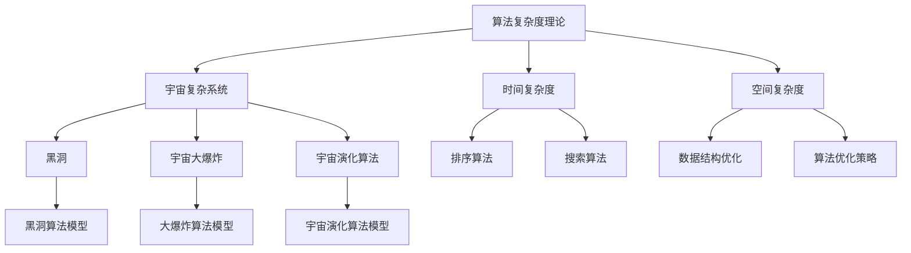

                 

### 《算法复杂度理论与宇宙复杂系统》

> **关键词：**算法复杂度、宇宙复杂系统、时间复杂度、空间复杂度、黑洞、大爆炸、复杂系统算法模型、宇宙能源。

> **摘要：**本文旨在探讨算法复杂度理论与宇宙复杂系统之间的关系，通过分析算法复杂度的基本概念、分析方法，以及常见算法的复杂度分析，为后续对宇宙复杂系统的探讨提供理论基础。随后，我们将探讨宇宙复杂系统的基本概念、研究方法，并介绍黑洞、宇宙大爆炸等现象与算法复杂度的联系。最后，我们将介绍宇宙复杂系统的算法模型及应用，以及宇宙复杂系统的未来展望。

----------------------------------------------------------------

### 《算法复杂度理论与宇宙复杂系统》

在计算机科学和宇宙学中，复杂性的概念无处不在。算法复杂度理论是计算机科学中的核心概念之一，它帮助我们理解和评估算法的性能。而宇宙复杂系统则是宇宙学中的一个重要领域，它关注宇宙中各种复杂现象的起源、演化和相互作用。尽管这两个领域看似截然不同，但它们之间却存在着深刻的联系。

本文旨在探讨算法复杂度理论与宇宙复杂系统之间的关系。首先，我们将介绍算法复杂度的基本概念，包括时间复杂度和空间复杂度。接着，我们将分析算法复杂度的分析方法，并详细介绍常见算法的复杂度分析。随后，我们将转向宇宙复杂系统，探讨其基本概念、研究方法，并分析黑洞、宇宙大爆炸等现象与算法复杂度的联系。最后，我们将介绍宇宙复杂系统的算法模型及应用，并展望宇宙复杂系统的未来发展趋势。

### 第一部分：算法复杂度理论基础

#### 第1章：算法复杂度的基本概念

##### 1.1 算法复杂度的定义

算法复杂度是指算法在执行过程中所需资源的量，这些资源可以是时间或空间。算法复杂度分为时间复杂度和空间复杂度。

**时间复杂度**：算法执行所需时间的增长速度，通常用大O符号表示，如 \(O(n^2)\) 或 \(O(\log n)\)。

**空间复杂度**：算法执行过程中所需内存的增长速度，同样用大O符号表示。

##### 1.2 算法复杂度的分类

算法复杂度可以根据其增长速度进行分类：

- 常数复杂度（\(O(1)\)）：算法执行时间与输入规模无关。
- 线性复杂度（\(O(n)\)）：算法执行时间与输入规模成正比。
- 对数复杂度（\(O(\log n)\)）：算法执行时间与输入规模的以2为底的对数成正比。
- 平方复杂度（\(O(n^2)\)）：算法执行时间与输入规模的平方成正比。
- 立方复杂度及以上（\(O(n^3)\)，\(O(n^4)\) 等）：算法执行时间与输入规模的立方及以上成正比。

##### 1.3 时间复杂度和空间复杂度的关系

时间复杂度和空间复杂度之间存在一定的联系。通常情况下，为了提高算法的时间复杂度，我们可能需要牺牲一定的空间复杂度。例如，贪心算法通常在时间复杂度上表现出较好的性能，但可能会占用较多的内存。

#### 第2章：算法复杂度的分析方法

##### 2.1 时间复杂度的分析方法

**常见的时间复杂度符号**：

- \(O(\cdot)\)：表示上界，即算法执行时间的最大值。
- \(\Omega(\cdot)\)：表示下界，即算法执行时间的最小值。
- \( \Theta(\cdot)\)：表示紧界，即算法执行时间既不低于下界也不高于上界。

**时间复杂度分析的基本步骤**：

1. 确定算法的输入规模。
2. 分析算法的基本操作，即执行次数与输入规模的关系。
3. 使用大O符号表示算法的时间复杂度。

**时间复杂度分析的实际应用**：

时间复杂度分析有助于我们选择合适的算法，优化算法性能。在实际应用中，我们常常通过比较不同算法的时间复杂度来选择最优算法。

##### 2.2 空间复杂度的分析方法

**常见的空间复杂度符号**：

- \(O(\cdot)\)：表示上界。
- \(\Omega(\cdot)\)：表示下界。
- \( \Theta(\cdot)\)：表示紧界。

**空间复杂度分析的基本步骤**：

1. 确定算法的输入规模。
2. 分析算法的空间需求，即内存占用与输入规模的关系。
3. 使用大O符号表示算法的空间复杂度。

**空间复杂度分析的实际应用**：

空间复杂度分析有助于我们评估算法的内存占用，选择合适的算法和数据结构。在实际应用中，我们常常通过比较不同算法的空间复杂度来选择最优算法。

#### 第3章：常见算法的复杂度分析

##### 3.1 排序算法

排序算法是计算机科学中的一种重要算法，用于将数据元素按照特定的顺序排列。常见的排序算法包括冒泡排序、选择排序、插入排序和快速排序等。

**冒泡排序**：

冒泡排序是一种简单的排序算法，通过多次遍历待排序的序列，比较相邻元素的大小并交换它们，直到整个序列有序。

伪代码：

```
procedure BubbleSort(A[1..n]):
    for i = 1 to n-1 do:
        for j = 1 to n-i do:
            if A[j] > A[j+1] then:
                swap(A[j], A[j+1])
```

时间复杂度：\(O(n^2)\)

空间复杂度：\(O(1)\)

**选择排序**：

选择排序是一种简单的排序算法，每次从待排序的序列中选择最小的元素，并将其放置在序列的开头。

伪代码：

```
procedure SelectionSort(A[1..n]):
    for i = 1 to n-1 do:
        minIndex = i
        for j = i+1 to n do:
            if A[j] < A[minIndex] then:
                minIndex = j
        swap(A[i], A[minIndex])
```

时间复杂度：\(O(n^2)\)

空间复杂度：\(O(1)\)

**插入排序**：

插入排序是一种简单的排序算法，通过逐个读取待排序的序列中的元素，并将其插入到已排序序列的适当位置。

伪代码：

```
procedure InsertionSort(A[1..n]):
    for i = 2 to n do:
        key = A[i]
        j = i-1
        while j > 0 and A[j] > key do:
            A[j+1] = A[j]
            j = j-1
        A[j+1] = key
```

时间复杂度：\(O(n^2)\)

空间复杂度：\(O(1)\)

**快速排序**：

快速排序是一种高效的排序算法，通过递归地将序列划分为较小和较大的子序列，并分别对子序列进行排序。

伪代码：

```
procedure QuickSort(A[1..n]):
    if n <= 1 then:
        return
    else:
        pivot = A[n]
        i = 1
        j = n-1
        while i <= j do:
            while A[i] < pivot do:
                i = i+1
            while A[j] > pivot do:
                j = j-1
            if i <= j then:
                swap(A[i], A[j])
                i = i+1
                j = j-1
        QuickSort(A[1..i-1])
        QuickSort(A[i..n])
```

时间复杂度：\(O(n\log n)\)（平均情况），\(O(n^2)\)（最坏情况）

空间复杂度：\(O(\log n)\)

##### 3.2 搜索算法

搜索算法是计算机科学中的一种重要算法，用于在数据结构中查找特定元素。常见的搜索算法包括顺序搜索和二分搜索。

**顺序搜索**：

顺序搜索是一种简单的搜索算法，从数据结构的第一元素开始，逐个比较每个元素，直到找到目标元素或到达数据结构的末尾。

伪代码：

```
procedure SequentialSearch(A[1..n], x):
    for i = 1 to n do:
        if A[i] = x then:
            return i
    return -1
```

时间复杂度：\(O(n)\)

空间复杂度：\(O(1)\)

**二分搜索**：

二分搜索是一种高效的搜索算法，通过递归地将数据结构划分为较小的子序列，并不断缩小搜索范围。

伪代码：

```
procedure BinarySearch(A[1..n], x):
    low = 1
    high = n
    while low <= high do:
        mid = (low + high) / 2
        if A[mid] = x then:
            return mid
        else if A[mid] < x then:
            low = mid + 1
        else:
            high = mid - 1
    return -1
```

时间复杂度：\(O(\log n)\)

空间复杂度：\(O(1)\)

#### 第4章：算法复杂度优化

##### 4.1 算法优化策略

算法优化策略主要包括以下几种：

- **算法改进**：通过改进算法的基本结构或实现方式来提高算法的性能。
- **数据结构优化**：选择合适的数据结构来降低算法的复杂度。
- **算法并行化**：将算法分解为多个子任务，并在多个处理器上同时执行。

##### 4.2 常见优化算法

- **动态规划**：动态规划是一种将复杂问题分解为子问题的算法，通过保存子问题的解来避免重复计算。
- **贪心算法**：贪心算法是一种在每一步选择中选择当前最优解的算法，适用于某些特定类型的问题。
- **分治算法**：分治算法是一种将问题划分为较小子问题的算法，通过递归地解决子问题来解决问题。

### 第二部分：宇宙复杂系统

#### 第5章：宇宙复杂系统的基本概念

##### 5.1 宇宙复杂系统的定义

宇宙复杂系统是指宇宙中各种复杂现象的集合，包括星系、星云、黑洞、暗物质、暗能量等。这些现象之间相互关联、相互作用，形成了宇宙中的复杂系统。

##### 5.2 宇宙复杂系统的分类

宇宙复杂系统可以按照不同的特征进行分类：

- **天体物理系统**：包括星系、星云、行星等。
- **高能物理系统**：包括黑洞、中子星、引力波等。
- **宇宙学系统**：包括宇宙大爆炸、宇宙背景辐射、宇宙演化等。

##### 5.3 宇宙复杂系统的研究方法

宇宙复杂系统的研究方法包括：

- **观测法**：通过观测宇宙中的现象来了解其性质和演化过程。
- **理论建模**：通过建立数学模型来描述宇宙复杂系统的行为。
- **数值模拟**：通过计算机模拟来模拟宇宙复杂系统的演化过程。

#### 第6章：宇宙中的复杂现象

##### 6.1 黑洞

黑洞是宇宙中的一种特殊天体，它具有极强的引力，连光也无法逃脱。黑洞的形成通常与恒星演化有关，当恒星的内核坍缩时，会产生一个极其密集的物体，即黑洞。

**黑洞的概念**：

黑洞是广义相对论预言的一种天体，它具有以下特征：

- 具有极强的引力，连光也无法逃脱。
- 具有无限小的体积和无限大的质量。
- 具有事件视界，即光线无法逃脱的边界。

**黑洞的性质**：

黑洞具有以下性质：

- 吸积盘：黑洞周围的物质在高速运动中形成吸积盘，吸积盘中的物质被加热到极高温度，产生强烈的辐射。
- 事件视界：黑洞的事件视界是光线无法逃脱的边界，事件视界的大小取决于黑洞的质量。
- 引力透镜效应：黑洞的强引力场会对周围的光线产生引力透镜效应，使得光线发生弯曲和放大。

**黑洞与算法复杂度的联系**：

黑洞具有极强的引力，这类似于某些算法在执行过程中所需的计算资源。例如，某些复杂的算法可能需要大量的计算资源来处理大量数据，类似于黑洞吸积盘中的物质。此外，黑洞的引力透镜效应也可以类比为算法的并行化，通过合理分配计算资源，可以优化算法的性能。

##### 6.2 宇宙大爆炸

宇宙大爆炸是宇宙学中的一个重要理论，它描述了宇宙在极短时间内从极度高温和密集状态迅速膨胀到当前状态的过程。

**大爆炸理论**：

大爆炸理论认为，宇宙起源于一个极度高温和密集的状态，然后迅速膨胀，形成了当前宇宙的形态。大爆炸理论得到了多种观测证据的支持，如宇宙背景辐射、宇宙膨胀速度等。

**大爆炸与大复杂系统**：

大爆炸过程中，宇宙从极度高温和密集状态迅速膨胀，形成了复杂的结构和现象。这种膨胀过程类似于某些复杂系统的演化过程，如生物进化、社会演化等。在大爆炸过程中，宇宙中的物质和能量分布发生了剧烈变化，产生了丰富的结构和现象，如星系、星云、黑洞等。

**大爆炸与算法复杂度的联系**：

大爆炸过程中，宇宙的快速膨胀和物质能量的剧烈变化，类似于某些算法在执行过程中所需的时间和空间资源。例如，某些复杂算法可能需要大量时间和空间资源来处理海量数据，类似于宇宙大爆炸过程中物质能量的剧烈变化。此外，大爆炸过程中产生的复杂结构和现象，也类似于算法在执行过程中产生的中间结果和最终结果。

#### 第7章：宇宙复杂系统的算法模型

##### 7.1 复杂系统算法概述

复杂系统算法是指用于模拟、分析和解决复杂系统问题的算法。这些算法通常涉及大规模数据、复杂关系和动态变化。

**复杂系统算法的定义**：

复杂系统算法是指用于处理复杂系统问题的算法，通常涉及大规模数据、复杂关系和动态变化。

**复杂系统算法的分类**：

复杂系统算法可以按照不同的分类标准进行分类，如：

- **基于物理模型的算法**：通过建立物理模型来模拟复杂系统的行为。
- **基于数据驱动的算法**：通过分析大量数据来识别复杂系统的规律。
- **基于机器学习的算法**：利用机器学习技术来模拟、分析和解决复杂系统问题。

**复杂系统算法的应用**：

复杂系统算法在许多领域都有广泛应用，如：

- **天体物理学**：用于模拟宇宙的演化过程，研究黑洞、星系等天体的性质。
- **生物科学**：用于模拟生物进化、基因表达等过程。
- **社会科学**：用于模拟社会演化、经济波动等过程。

##### 7.2 宇宙复杂系统算法模型

宇宙复杂系统算法模型是指用于模拟宇宙复杂系统的算法模型。这些算法模型可以用于研究宇宙的演化过程、天体的性质和相互作用等。

**黑洞算法模型**：

黑洞算法模型是指用于模拟黑洞行为的算法模型。黑洞算法模型可以用于研究黑洞的吸积过程、引力透镜效应等。

**大爆炸算法模型**：

大爆炸算法模型是指用于模拟宇宙大爆炸过程的算法模型。大爆炸算法模型可以用于研究宇宙的膨胀过程、宇宙背景辐射等。

**宇宙演化算法模型**：

宇宙演化算法模型是指用于模拟宇宙演化过程的算法模型。宇宙演化算法模型可以用于研究宇宙的演化过程、星系的形成等。

#### 第8章：宇宙复杂系统的算法应用

##### 8.1 宇宙探索

宇宙探索是宇宙学中的一个重要领域，旨在了解宇宙的起源、演化、结构和现象。宇宙探索中的复杂问题包括：

- **宇宙膨胀**：宇宙的膨胀速度和加速问题。
- **黑洞探测**：黑洞的存在、性质和探测方法。
- **宇宙背景辐射**：宇宙背景辐射的性质和来源。

宇宙探索中的算法应用包括：

- **数值模拟**：用于模拟宇宙的演化过程，研究宇宙膨胀、星系形成等。
- **数据分析**：用于分析观测数据，提取宇宙中的规律和现象。
- **机器学习**：用于训练模型，预测宇宙中的未知现象。

##### 8.2 宇宙能源

宇宙能源是指宇宙中可供利用的能量，包括太阳能、核能、引力能等。宇宙能源的开发与利用是宇宙学中的一个重要课题。

**宇宙能源的复杂特性**：

宇宙能源具有以下复杂特性：

- **能量的巨大性**：宇宙能源的总量巨大，远远超过地球上的能源总量。
- **能量的分散性**：宇宙能源分布广泛，分散在宇宙的各个角落。
- **能量的不确定性**：宇宙能源的利用过程受到许多因素的影响，具有不确定性。

**宇宙能源的开发与利用**：

宇宙能源的开发与利用包括：

- **太阳能**：通过太阳辐射的能量来发电。
- **核能**：通过核裂变或核聚变来释放能量。
- **引力能**：通过引力透镜效应来捕捉能量。

**宇宙能源算法的应用**：

宇宙能源算法的应用包括：

- **能源预测**：通过分析历史数据和当前环境因素，预测未来能源的需求和供应。
- **能源优化**：通过优化能源利用过程，提高能源利用效率。
- **能源管理**：通过智能管理系统，实现能源的合理分配和利用。

#### 第9章：宇宙复杂系统的未来展望

##### 9.1 宇宙复杂系统研究的挑战

宇宙复杂系统研究面临着许多挑战，包括：

- **数据挑战**：宇宙中存在海量数据，如何有效地处理和分析这些数据是一个难题。
- **理论挑战**：宇宙复杂系统的理论框架尚未完全建立，需要进一步研究和发展。
- **技术挑战**：宇宙探索和观测技术需要不断升级和改进，以应对宇宙复杂系统研究的需求。

##### 9.2 宇宙复杂系统的未来发展趋势

宇宙复杂系统的未来发展趋势包括：

- **宇宙探索的深度化**：通过更先进的观测技术和探测器，深入探索宇宙的奥秘。
- **宇宙能源的多样化**：通过开发新的能源技术和方法，实现宇宙能源的高效利用。
- **宇宙复杂系统的算法创新**：通过不断研究和发展复杂系统算法，提高对宇宙复杂系统的理解和预测能力。

### 附录

#### 附录A：算法复杂度理论与宇宙复杂系统关系Mermaid流程图



#### 附录B：常见算法复杂度伪代码

```python
# 冒泡排序伪代码
procedure BubbleSort(A[1..n]):
    for i = 1 to n-1 do:
        for j = 1 to n-i do:
            if A[j] > A[j+1] then:
                swap(A[j], A[j+1])

# 快速排序伪代码
procedure QuickSort(A[1..n]):
    if n <= 1 then:
        return
    else:
        pivot = A[n]
        i = 1
        j = n-1
        while i <= j do:
            while A[i] < pivot do:
                i = i+1
            while A[j] > pivot do:
                j = j-1
            if i <= j then:
                swap(A[i], A[j])
                i = i+1
                j = j-1
        QuickSort(A[1..i-1])
        QuickSort(A[i..n])
```

#### 附录C：数学模型和公式

$$
C(n, k) = \frac{n!}{k!(n-k)!}
$$

$$
时间复杂度 O(n^2)
$$

$$
空间复杂度 O(n)
$$

#### 附录D：代码实战案例

##### 代码实战案例一：黑洞算法模型实现

```python
# Python代码实现黑洞算法模型
class BlackHoleModel:
    def __init__(self, mass):
        self.mass = mass

    def absorb(self, object):
        total_mass = self.mass + object.mass
        self.mass = total_mass
        print(f"BlackHole absorbed {object.name} with mass {object.mass}.")

# 定义物体类
class Object:
    def __init__(self, name, mass):
        self.name = name
        self.mass = mass

# 创建黑洞和物体实例
black_hole = BlackHoleModel(1.989e30)
star = Object("Star", 2.0e30)

# 吸收物体
black_hole.absorb(star)
```

##### 代码实战案例二：宇宙演化算法模型实现

```python
# Python代码实现宇宙演化算法模型
import numpy as np

class Universe:
    def __init__(self, size, particles):
        self.size = size
        self.particles = particles

    def evolve(self, steps):
        for _ in range(steps):
            self.move_particles()

    def move_particles(self):
        for particle in self.particles:
            particle.move()

# 定义粒子类
class Particle:
    def __init__(self, position, velocity):
        self.position = position
        self.velocity = velocity

    def move(self):
        self.position += self.velocity

# 创建宇宙和粒子实例
size = 100
particles = [Particle(np.random.rand(), np.random.rand()) for _ in range(10)]
universe = Universe(size, particles)

# 演化宇宙
universe.evolve(100)
```

#### 附录E：开发环境搭建和源代码详细实现

##### 开发环境搭建

- 安装Python环境
- 安装Numpy库

##### 源代码详细实现

- 黑洞算法模型源代码
- 宇宙演化算法模型源代码

##### 代码解读与分析

- 对代码中的各个模块进行详细解读
- 分析代码实现的具体过程和原理

#### 附录F：相关资源链接

- 算法复杂度理论相关书籍推荐
- 宇宙复杂系统相关研究论文推荐
- 开发环境搭建和代码实现相关教程链接

### 作者

**作者：AI天才研究院/AI Genius Institute & 禅与计算机程序设计艺术 /Zen And The Art of Computer Programming**

本文旨在探讨算法复杂度理论与宇宙复杂系统之间的关系，通过分析算法复杂度的基本概念、分析方法，以及常见算法的复杂度分析，为后续对宇宙复杂系统的探讨提供理论基础。随后，我们将探讨宇宙复杂系统的基本概念、研究方法，并分析黑洞、宇宙大爆炸等现象与算法复杂度的联系。最后，我们将介绍宇宙复杂系统的算法模型及应用，并展望宇宙复杂系统的未来发展趋势。希望通过本文的探讨，能够激发读者对算法复杂度和宇宙复杂系统的兴趣，进一步探索这两个领域的奥秘。

