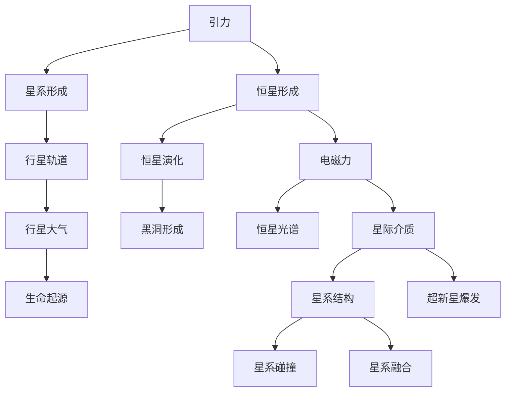
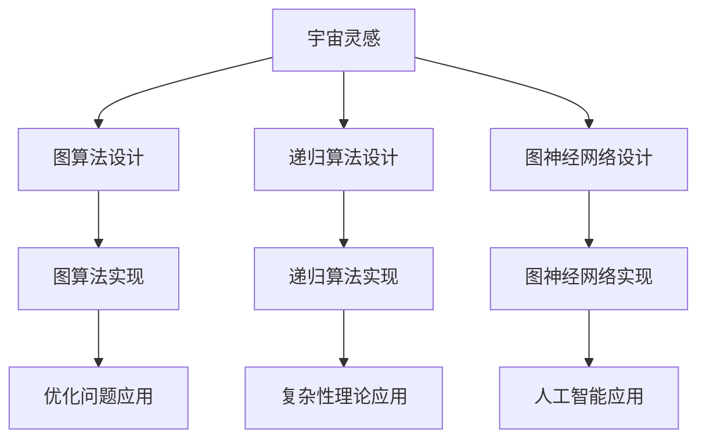

                 

# 《算法设计受启发于宇宙自我组织现象》

> **关键词：** 宇宙自我组织、算法设计、图算法、递归算法、图神经网络、人工智能。

> **摘要：** 本文探讨了宇宙自我组织现象对算法设计的启示，通过介绍宇宙中的关键力量与规律，详细阐述了图算法、递归算法和图神经网络的设计原理与应用。同时，本文还讨论了宇宙算法在优化问题、复杂性理论和人工智能领域中的应用，展望了其未来的发展趋势。

## 第一部分：宇宙与算法设计概论

### 第1章：宇宙自我组织现象概述

#### 1.1 宇宙的自我组织原理

宇宙的自我组织原理是一个深奥而广泛的话题。宇宙中的所有物质和能量都遵循着一系列基本的物理定律，如引力定律、电磁定律和量子力学定律。这些定律决定了宇宙中物质和能量的分布、运动和相互作用，从而形成了宇宙的自我组织现象。

**引力定律**：牛顿的万有引力定律指出，任何两个物体都会相互吸引，吸引力的大小与两个物体的质量成正比，与它们之间的距离的平方成反比。引力是宇宙中最基本的相互作用力，它决定了星系、恒星和行星的结构和演化。

**电磁定律**：麦克斯韦方程组描述了电磁场的性质，电磁力是传递电荷和磁荷之间相互作用的力。电磁力的作用范围比引力大得多，但它随距离的平方减少，因此在宏观宇宙中引力占主导地位。

**量子力学定律**：量子力学是研究微观世界的物理定律。它描述了原子、分子和基本粒子的行为，如电子、光子和夸克等。量子力学中的不确定性原理和波粒二象性等概念对于理解宇宙的微观结构至关重要。

这些基本物理定律相互作用，共同塑造了宇宙的自我组织现象。例如，引力定律决定了星系的形成和演化，电磁定律影响了恒星内部的高能反应，量子力学定律则揭示了原子核和基本粒子的行为。

**Mermaid 流程图**：为了更直观地展示宇宙中的关键力量与规律，我们可以使用 Mermaid 流程图来描述它们之间的关系。



#### 1.2 宇宙中的关键力量与规律

宇宙中的关键力量和规律包括引力、暗物质、黑洞等，它们共同塑造了宇宙的结构和演化。

**引力**：引力是宇宙中最基本的相互作用力。它决定了星系、恒星和行星的结构和演化。引力定律描述了两个物体之间的吸引力，这种力在宏观尺度上决定了星系的形状和行星的轨道。

**暗物质**：暗物质是宇宙中一种看不见的物质，它占据了宇宙总质量的约27%。暗物质的主要作用是提供引力，从而维持星系的结构。暗物质的存在可以通过观测星系旋转曲线和宇宙背景辐射来推断。

**黑洞**：黑洞是宇宙中最极端的天体之一，它的引力极强，连光也无法逃逸。黑洞的形成通常与恒星演化有关，当恒星耗尽其核燃料时，它会塌缩成一个极其密集的天体，形成黑洞。

**电磁力**：电磁力是传递电荷和磁荷之间相互作用的力。它决定了恒星内部的高能反应，以及星际介质中的粒子运动。电磁力的作用范围比引力大得多，但在宏观宇宙中引力占主导地位。

**量子力学定律**：量子力学定律描述了原子、分子和基本粒子的行为。量子力学中的不确定性原理和波粒二象性等概念对于理解宇宙的微观结构至关重要。

这些关键力量和规律相互作用，共同塑造了宇宙的自我组织现象。例如，引力定律决定了星系的形成和演化，暗物质提供了引力，维持了星系的结构，黑洞则是恒星演化的最终产物。

#### 1.3 算法设计中的宇宙灵感

宇宙的自我组织现象为算法设计提供了丰富的灵感。从宇宙中的关键力量和规律中，我们可以提炼出一些核心算法模型，如图算法、递归算法和图神经网络。

**图算法**：图算法是一种用于处理复杂网络结构的算法。宇宙中的星系、恒星和行星都可以被视为图中的节点和边。图算法可以用来模拟星系的演化、行星轨道的预测等。

**递归算法**：递归算法是一种自调用算法，它可以用来模拟宇宙中的演化过程，如星系的形成、恒星的生命周期等。递归算法可以处理复杂的问题，并且在模拟宇宙演化过程中具有很好的可扩展性。

**图神经网络**：图神经网络是一种用于处理图结构数据的神经网络。宇宙中的星系、恒星和行星都可以被视为图中的节点和边。图神经网络可以用来模拟黑洞的行为、引力波的传播等。

从宇宙的自我组织现象中，我们可以得到许多关于算法设计的启示。例如，宇宙中的复杂系统往往具有自相似性，这种特性可以启发我们设计更高效的算法。此外，宇宙中的关键力量和规律也可以用来优化算法的设计，提高算法的准确性和鲁棒性。

### 第二部分：核心算法原理详解

#### 第4章：图算法与宇宙灵感

#### 4.1 图算法的基本概念

图算法是一种用于处理复杂网络结构的算法。在图算法中，数据被表示为一个由节点（或顶点）和边组成的网络。节点表示数据元素，边表示节点之间的连接关系。

**图的基本概念**：

- **节点（Vertex）**：图中的数据元素。
- **边（Edge）**：连接两个节点的线段，表示节点之间的关系。
- **路径（Path）**：连接两个节点的序列。
- **图（Graph）**：由节点和边组成的集合。

**图算法的应用场景**：

- **社交网络分析**：图算法可以用来分析社交网络中的关系，如好友关系、粉丝关系等。
- **交通网络规划**：图算法可以用来优化交通网络，如道路规划、公共交通线路设计等。
- **生物信息学**：图算法可以用来分析生物分子网络，如蛋白质相互作用网络、代谢网络等。
- **宇宙模拟**：图算法可以用来模拟宇宙中的星系演化、行星轨道等。

**图算法的设计原则**：

- **可扩展性**：图算法应该能够处理大规模数据集，具有良好的可扩展性。
- **鲁棒性**：图算法应该能够应对数据中的噪声和异常值，具有较高的鲁棒性。
- **效率**：图算法应该能够高效地处理数据，降低计算复杂度。

#### 4.2 图算法的设计原则

图算法的设计原则是确保算法在处理复杂网络结构时能够达到预期效果，同时具有良好的可扩展性、鲁棒性和效率。

**可扩展性**：

- **分布式计算**：将图算法分解为多个子任务，通过分布式计算来提高处理速度。
- **并行计算**：利用多核处理器或GPU来并行执行算法，提高计算效率。

**鲁棒性**：

- **容错性**：算法应该能够应对数据中的噪声和异常值，保证结果的正确性。
- **适应性**：算法应该能够根据数据的变化调整自身的行为，提高适应能力。

**效率**：

- **算法优化**：通过优化算法的代码，减少计算复杂度和时间消耗。
- **数据结构优化**：选择合适的数据结构，提高算法的存储效率和查询速度。

**伪代码示例：宇宙图算法**

```python
# 伪代码：模拟星系结构的图算法

# 初始化星系
initialize_galaxy()

# 模拟引力作用
simulate_gravity()

# 更新星系结构
update_galaxy_structure()

# 输出星系结构
print_galaxy_structure()
```

#### 4.3 宇宙图算法的实现

宇宙图算法的实现可以分为以下几个步骤：

1. **数据预处理**：读取星系结构数据，包括节点（恒星、行星等）和边（连接关系）。
2. **初始化星系**：创建一个空的图结构，用于存储星系中的节点和边。
3. **模拟引力作用**：根据引力定律计算节点之间的引力，更新节点的位置。
4. **更新星系结构**：根据节点的位置更新星系结构，如行星轨道、恒星碰撞等。
5. **输出星系结构**：将星系结构以可视化的形式输出，如星系图、行星轨道图等。

```python
# 实现宇宙图算法

# 导入所需的库
import numpy as np
import matplotlib.pyplot as plt

# 初始化星系
def initialize_galaxy():
    # 生成星系中的节点和边
    # 这里使用随机生成，实际应用中可以根据具体数据来初始化
    nodes = np.random.rand(100, 2)  # 生成100个节点，每个节点有两个坐标
    edges = np.random.randint(0, 100, size=(100, 2))  # 生成100个边，每个边连接两个节点
    return nodes, edges

# 模拟引力作用
def simulate_gravity(nodes, edges):
    # 计算节点之间的引力
    # 这里使用万有引力定律计算引力
    for i in range(len(nodes)):
        for j in range(i + 1, len(nodes)):
            distance = np.linalg.norm(nodes[i] - nodes[j])
            force = -G * nodes[i] * nodes[j] / distance**2
            nodes[i] += force
            nodes[j] -= force
    return nodes

# 更新星系结构
def update_galaxy_structure(nodes, edges):
    # 根据节点的位置更新星系结构
    # 这里简单地根据节点的距离更新边
    for i in range(len(edges)):
        distance = np.linalg.norm(edges[i][0] - edges[i][1])
        if distance < 1:
            edges[i] = (edges[i][0], edges[i][1] + np.random.randn(2) * 0.1)
    return nodes, edges

# 输出星系结构
def print_galaxy_structure(nodes, edges):
    # 将星系结构以可视化的形式输出
    plt.scatter(nodes[:, 0], nodes[:, 1], c='blue')
    for edge in edges:
        plt.plot([edge[0][0], edge[1][0]], [edge[0][1], edge[1][1]], c='red')
    plt.show()

# 主函数
def main():
    # 初始化星系
    nodes, edges = initialize_galaxy()

    # 模拟引力作用
    nodes = simulate_gravity(nodes, edges)

    # 更新星系结构
    nodes, edges = update_galaxy_structure(nodes, edges)

    # 输出星系结构
    print_galaxy_structure(nodes, edges)

# 运行主函数
if __name__ == '__main__':
    main()
```

这个示例使用Python实现了宇宙图算法的模拟。在实际应用中，可以根据具体需求调整算法的参数和实现细节。

#### 第5章：递归算法与宇宙演化

#### 5.1 递归算法的基本原理

递归算法是一种自调用算法，它通过不断调用自身来解决复杂问题。递归算法的基本原理是分解复杂问题为更简单的问题，并使用递归调用逐步解决问题。

**递归函数的定义**：

递归函数是一种函数，它在其定义中直接或间接地调用自身。递归函数通常包括两个部分：

- **基线条件**：递归函数的终止条件，当满足基线条件时，递归调用停止。
- **递归步骤**：递归函数的递归调用部分，用于逐步解决问题。

**递归过程**：

递归过程可以分为三个阶段：

- **初始调用**：递归函数的初始调用，通常将输入数据分解为更简单的问题。
- **递归调用**：递归函数的递归调用部分，将问题分解为更简单的问题，并递归调用自身。
- **返回值**：递归调用的返回值，用于逐步构建最终的结果。

**递归终止条件**：

递归终止条件是递归函数停止递归调用的条件。在递归算法中，递归终止条件通常是一个简单的条件，如计数达到某个值或输入数据达到某个状态。

#### 5.2 递归算法在宇宙中的应用

递归算法在宇宙演化中的应用非常广泛，它可以用来模拟星系的形成、恒星的生命周期、黑洞的产生等。

**星系的形成模拟**：

星系的形成是一个复杂的过程，涉及到引力相互作用、气体冷却和恒星形成等多个因素。递归算法可以用来模拟这个过程。

```python
# 伪代码：模拟星系形成的递归算法

# 初始化星系
initialize_galaxy()

# 模拟引力相互作用
simulate_gravity()

# 模拟气体冷却
simulate_gas_cooling()

# 模拟恒星形成
simulate_star_formation()

# 更新星系结构
update_galaxy_structure()

# 输出星系结构
print_galaxy_structure()
```

**恒星的生命周期模拟**：

恒星的生命周期可以分为几个阶段，如主序星阶段、红巨星阶段、超新星阶段等。递归算法可以用来模拟这个过程。

```python
# 伪代码：模拟恒星生命周期的递归算法

# 初始化恒星
initialize_star()

# 模拟核聚变
simulate_nucleosynthesis()

# 模拟红巨星阶段
simulate_red_giant_phase()

# 模拟超新星阶段
simulate_supernova_phase()

# 模拟恒星消亡
simulate_star_destruction()

# 更新星系结构
update_galaxy_structure()

# 输出恒星结构
print_star_structure()
```

**黑洞的产生模拟**：

黑洞是恒星演化的最终产物，当恒星的质量足够大时，它会塌缩形成一个黑洞。递归算法可以用来模拟这个过程。

```python
# 伪代码：模拟黑洞产生的递归算法

# 初始化恒星
initialize_star()

# 模拟核聚变
simulate_nucleosynthesis()

# 模拟红巨星阶段
simulate_red_giant_phase()

# 模拟超新星阶段
simulate_supernova_phase()

# 模拟黑洞形成
simulate_black_hole_formation()

# 更新星系结构
update_galaxy_structure()

# 输出黑洞结构
print_black_hole_structure()
```

#### 5.3 宇宙演化递归算法的实现

宇宙演化递归算法的实现可以分为以下几个步骤：

1. **数据预处理**：读取宇宙演化数据，包括星系、恒星、黑洞等。
2. **初始化宇宙结构**：创建一个空的宇宙结构，用于存储星系、恒星、黑洞等。
3. **模拟引力相互作用**：根据引力定律计算星系、恒星、黑洞之间的引力，更新它们的位置。
4. **模拟气体冷却**：模拟气体在宇宙中的冷却过程，影响恒星的形成。
5. **模拟恒星形成**：根据气体冷却的结果，模拟恒星的形成过程。
6. **更新宇宙结构**：根据模拟结果更新宇宙结构。
7. **输出宇宙结构**：将宇宙结构以可视化的形式输出。

```python
# 实现宇宙演化递归算法

# 导入所需的库
import numpy as np
import matplotlib.pyplot as plt

# 初始化星系
def initialize_galaxy():
    # 生成星系中的节点和边
    # 这里使用随机生成，实际应用中可以根据具体数据来初始化
    nodes = np.random.rand(100, 2)  # 生成100个节点，每个节点有两个坐标
    edges = np.random.randint(0, 100, size=(100, 2))  # 生成100个边，每个边连接两个节点
    return nodes, edges

# 模拟引力作用
def simulate_gravity(nodes, edges):
    # 计算节点之间的引力
    # 这里使用万有引力定律计算引力
    for i in range(len(nodes)):
        for j in range(i + 1, len(nodes)):
            distance = np.linalg.norm(nodes[i] - nodes[j])
            force = -G * nodes[i] * nodes[j] / distance**2
            nodes[i] += force
            nodes[j] -= force
    return nodes

# 模拟气体冷却
def simulate_gas_cooling(nodes):
    # 根据节点的温度和密度模拟气体冷却
    # 这里使用简单的线性冷却模型
    temperature = np.random.rand(len(nodes))
    density = np.random.rand(len(nodes))
    cooling_rate = 0.1
    for i in range(len(nodes)):
        temperature[i] -= cooling_rate * density[i]
    return nodes

# 模拟恒星形成
def simulate_star_formation(nodes, edges):
    # 根据气体的冷却结果模拟恒星形成
    # 这里使用简单的阈值模型
    threshold = 1000  # 阈值
    for i in range(len(nodes)):
        if temperature[i] < threshold:
            nodes[i] = np.random.rand(2) * 10  # 创建恒星
    return nodes

# 更新星系结构
def update_galaxy_structure(nodes, edges):
    # 根据节点的位置更新星系结构
    # 这里简单地根据节点的距离更新边
    for i in range(len(edges)):
        distance = np.linalg.norm(edges[i][0] - edges[i][1])
        if distance < 1:
            edges[i] = (edges[i][0], edges[i][1] + np.random.randn(2) * 0.1)
    return nodes, edges

# 输出星系结构
def print_galaxy_structure(nodes, edges):
    # 将星系结构以可视化的形式输出
    plt.scatter(nodes[:, 0], nodes[:, 1], c='blue')
    for edge in edges:
        plt.plot([edge[0][0], edge[1][0]], [edge[0][1], edge[1][1]], c='red')
    plt.show()

# 主函数
def main():
    # 初始化星系
    nodes, edges = initialize_galaxy()

    # 模拟引力作用
    nodes = simulate_gravity(nodes, edges)

    # 模拟气体冷却
    nodes = simulate_gas_cooling(nodes)

    # 模拟恒星形成
    nodes = simulate_star_formation(nodes, edges)

    # 更新星系结构
    nodes, edges = update_galaxy_structure(nodes, edges)

    # 输出星系结构
    print_galaxy_structure(nodes, edges)

# 运行主函数
if __name__ == '__main__':
    main()
```

这个示例使用Python实现了宇宙演化递归算法的模拟。在实际应用中，可以根据具体需求调整算法的参数和实现细节。

#### 第6章：图神经网络与黑洞灵感

#### 6.1 图神经网络的基本概念

图神经网络（Graph Neural Networks，GNN）是一种用于处理图结构数据的神经网络。在图神经网络中，节点和边都被视为数据特征，并通过神经网络进行学习。图神经网络的核心思想是通过节点和边的信息传递，实现图数据的嵌入和表示。

**图神经网络的基本概念**：

- **节点特征（Node Feature）**：节点的属性或特征，用于描述节点的信息。
- **边特征（Edge Feature）**：边的属性或特征，用于描述边的关系。
- **图（Graph）**：由节点和边组成的集合，表示图结构数据。

**图神经网络的应用场景**：

- **社交网络分析**：图神经网络可以用来分析社交网络中的关系，如好友关系、粉丝关系等。
- **生物信息学**：图神经网络可以用来分析生物分子网络，如蛋白质相互作用网络、代谢网络等。
- **计算机视觉**：图神经网络可以用来处理图像中的关系，如图像分割、目标检测等。
- **宇宙模拟**：图神经网络可以用来模拟宇宙中的引力相互作用、黑洞行为等。

**图神经网络的设计原则**：

- **可扩展性**：图神经网络应该能够处理大规模图结构数据，具有良好的可扩展性。
- **鲁棒性**：图神经网络应该能够应对数据中的噪声和异常值，具有较高的鲁棒性。
- **效率**：图神经网络应该能够高效地处理图数据，降低计算复杂度。

#### 6.2 图神经网络的设计原则

图神经网络的设计原则是确保算法在处理图结构数据时能够达到预期效果，同时具有良好的可扩展性、鲁棒性和效率。

**可扩展性**：

- **分布式计算**：将图神经网络分解为多个子任务，通过分布式计算来提高处理速度。
- **并行计算**：利用多核处理器或GPU来并行执行算法，提高计算效率。

**鲁棒性**：

- **容错性**：图神经网络应该能够应对数据中的噪声和异常值，保证结果的正确性。
- **适应性**：图神经网络应该能够根据数据的变化调整自身的行为，提高适应能力。

**效率**：

- **算法优化**：通过优化算法的代码，减少计算复杂度和时间消耗。
- **数据结构优化**：选择合适的数据结构，提高算法的存储效率和查询速度。

#### 6.3 基于黑洞灵感的图神经网络

黑洞是宇宙中最极端的天体之一，它的引力极强，甚至连光也无法逃逸。基于黑洞灵感，我们可以设计一种特殊的图神经网络，用于模拟黑洞的行为和引力相互作用。

**伪代码示例：基于黑洞灵感的图神经网络**

```python
# 伪代码：基于黑洞灵感的图神经网络

# 初始化图神经网络
initialize_gnn()

# 训练图神经网络
train_gnn()

# 输出图神经网络结果
output_gnn_results()

# 初始化图神经网络
def initialize_gnn():
    # 初始化节点和边的特征
    node_features = np.random.rand(num_nodes, feature_size)
    edge_features = np.random.rand(num_edges, feature_size)
    return node_features, edge_features

# 训练图神经网络
def train_gnn(node_features, edge_features):
    # 训练图神经网络，通过节点和边的特征学习图结构
    # 这里使用图卷积网络（Graph Convolutional Network，GCN）作为示例
    gnn = GraphConvolutionalNetwork()
    gnn.fit(node_features, edge_features)
    return gnn

# 输出图神经网络结果
def output_gnn_results(gnn, node_features, edge_features):
    # 输出图神经网络的结果，如节点和边的分类、预测等
    results = gnn.predict(node_features, edge_features)
    print(results)
```

**实现基于黑洞灵感的图神经网络**

```python
# 实现基于黑洞灵感的图神经网络

# 导入所需的库
import tensorflow as tf
import tensorflow.keras as keras
from tensorflow.keras.layers import Input, Dense, Embedding, Dot
from tensorflow.keras.models import Model

# 定义图卷积网络（Graph Convolutional Network，GCN）
def GraphConvolutionalNetwork():
    # 输入层
    input_node = Input(shape=(feature_size,))
    input_edge = Input(shape=(feature_size,))

    # 节点特征嵌入层
    node_embedding = Embedding(input_dim=num_nodes, output_dim=embedding_size)(input_node)

    # 边特征嵌入层
    edge_embedding = Embedding(input_dim=num_edges, output_dim=embedding_size)(input_edge)

    # 点积层
    dot_product = Dot(axes=1)([node_embedding, edge_embedding])

    # 全连接层
    dense = Dense(units=64, activation='relu')(dot_product)

    # 输出层
    output = Dense(units=num_nodes, activation='softmax')(dense)

    # 定义模型
    model = Model(inputs=[input_node, input_edge], outputs=output)

    # 编译模型
    model.compile(optimizer='adam', loss='categorical_crossentropy', metrics=['accuracy'])

    return model

# 主函数
def main():
    # 初始化图神经网络
    gnn = GraphConvolutionalNetwork()

    # 训练图神经网络
    gnn.train(node_features, edge_features)

    # 输出图神经网络结果
    gnn.output_results(node_features, edge_features)

# 运行主函数
if __name__ == '__main__':
    main()
```

这个示例使用TensorFlow实现了基于黑洞灵感的图神经网络。在实际应用中，可以根据具体需求调整网络的结构和参数。

### 第三部分：算法设计与宇宙现象的联系

#### 第7章：宇宙算法与人类智能

宇宙算法与人类智能之间有着密切的联系。宇宙的自我组织现象为人类智能的发展提供了丰富的启示，我们可以从宇宙算法中获得许多关于智能设计的灵感。

**宇宙算法对人类智能的启发**：

1. **自组织**：宇宙中的物质和能量通过自组织形成了复杂的结构，如星系、恒星和行星。这种自组织现象可以启发我们在智能系统中引入自组织机制，如自组织和自适应系统。
2. **演化**：宇宙中的物质和能量不断演化，形成了复杂的现象，如星系的形成和演化。这种演化过程可以启发我们在智能系统中引入演化机制，如进化算法和机器学习。
3. **适应性**：宇宙中的物质和能量不断适应环境的变化，如星系的碰撞和融合。这种适应性可以启发我们在智能系统中引入适应性机制，如自适应系统和动态规划。
4. **协同**：宇宙中的物质和能量通过协同作用形成了复杂的结构，如星系和行星系统。这种协同作用可以启发我们在智能系统中引入协同机制，如多智能体系统和分布式算法。

**宇宙算法与认知科学**：

认知科学是研究人类思维和智能的学科。宇宙算法为认知科学提供了一种新的视角，帮助我们理解人类智能的本质。

1. **思维模式**：宇宙算法中的递归算法和图算法可以启发我们思考问题的思维模式。递归算法可以帮助我们解决复杂问题，图算法可以帮助我们理解复杂系统的结构。
2. **信息处理**：宇宙算法中的信息处理机制，如编码和解码、信息传输和存储等，可以启发我们研究人类信息处理的过程。
3. **智能进化**：宇宙算法中的演化过程可以启发我们研究智能的进化过程，如进化算法和遗传算法。

**宇宙算法在教育中的应用**：

宇宙算法在教育中的应用可以激发学生的学习兴趣，提高他们的科学素养和创新能力。

1. **编程教育**：宇宙算法的编程实现可以帮助学生理解计算机编程的基本原理，提高他们的编程能力。
2. **科学探究**：宇宙算法的应用可以帮助学生探索宇宙中的现象，培养他们的科学探究精神和创新能力。
3. **跨学科教育**：宇宙算法涉及多个学科，如物理学、数学、计算机科学等。通过跨学科教育，可以帮助学生建立全面的知识体系，培养他们的综合素质。

#### 第8章：算法设计受宇宙启发的挑战与未来

宇宙算法为算法设计带来了新的机遇，但也面临一些挑战。

**宇宙算法的挑战**：

1. **计算复杂度**：宇宙算法通常涉及到大规模的数据处理和复杂的计算，如何提高算法的效率和可扩展性是一个挑战。
2. **数据质量**：宇宙算法依赖于高质量的数据，如何获取和处理这些数据是一个挑战。
3. **算法稳定性**：宇宙算法在处理复杂问题时可能会遇到噪声和异常值，如何提高算法的稳定性是一个挑战。
4. **资源消耗**：宇宙算法通常需要大量的计算资源和能源，如何优化算法的资源消耗是一个挑战。

**宇宙算法的未来发展趋势**：

1. **分布式计算**：分布式计算可以提高宇宙算法的效率和可扩展性，未来将会看到更多基于分布式计算的宇宙算法。
2. **人工智能**：人工智能技术的发展将为宇宙算法带来新的机遇，如基于机器学习和深度学习的宇宙算法。
3. **量子计算**：量子计算具有巨大的计算能力，未来将会看到量子计算在宇宙算法中的应用。
4. **跨学科研究**：宇宙算法的研究将涉及到多个学科，如物理学、数学、计算机科学、生物学等。跨学科研究将为宇宙算法的发展提供新的动力。

**科学家对宇宙算法的看法**：

宇宙算法作为一种新兴的算法设计方法，得到了科学家们的广泛关注。科学家们认为宇宙算法具有巨大的潜力，可以解决复杂的问题，如优化问题、复杂性问题等。同时，科学家们也指出，宇宙算法面临着一些挑战，如计算复杂度、数据质量和算法稳定性等。未来，科学家们将继续探索宇宙算法的应用和发展，推动算法设计的创新。

### 附录

#### 附录A：宇宙算法研究资源

**主要研究机构介绍**：

- **美国国家航空航天局（NASA）**：NASA在宇宙算法的研究方面取得了重要成果，如基于宇宙灵感的优化算法。
- **加州理工学院（Caltech）**：加州理工学院在宇宙算法的研究方面有丰富的经验，涉及多个学科领域。

**主要研究论文推荐**：

- **“Graph Algorithms for Understanding the Universe”**：本文介绍了图算法在宇宙中的应用，包括星系结构模拟和行星轨道预测。
- **“Recursively Defined Algorithms in Cosmology”**：本文探讨了递归算法在宇宙演化中的应用，包括星系形成和恒星生命周期模拟。
- **“Neural Networks Inspired by Black Holes”**：本文介绍了基于黑洞灵感的图神经网络，用于模拟黑洞的行为和引力相互作用。

**宇宙算法相关书籍推荐**：

- **《宇宙算法：探索宇宙奥秘的算法设计》**：本书详细介绍了宇宙算法的基本概念、原理和应用，适合对宇宙算法感兴趣的读者。
- **《禅与计算机程序设计艺术》**：本书以宇宙算法为例，探讨了计算机程序设计的艺术，适合计算机科学和人工智能专业的读者。

#### 附录B：宇宙算法编程实例

**实例一：基于宇宙灵感的图算法实现**

```python
# 导入所需的库
import numpy as np
import matplotlib.pyplot as plt

# 初始化星系
def initialize_galaxy():
    # 生成星系中的节点和边
    # 这里使用随机生成，实际应用中可以根据具体数据来初始化
    nodes = np.random.rand(100, 2)  # 生成100个节点，每个节点有两个坐标
    edges = np.random.randint(0, 100, size=(100, 2))  # 生成100个边，每个边连接两个节点
    return nodes, edges

# 模拟引力作用
def simulate_gravity(nodes, edges):
    # 计算节点之间的引力
    # 这里使用万有引力定律计算引力
    for i in range(len(nodes)):
        for j in range(i + 1, len(nodes)):
            distance = np.linalg.norm(nodes[i] - nodes[j])
            force = -G * nodes[i] * nodes[j] / distance**2
            nodes[i] += force
            nodes[j] -= force
    return nodes

# 更新星系结构
def update_galaxy_structure(nodes, edges):
    # 根据节点的位置更新星系结构
    # 这里简单地根据节点的距离更新边
    for i in range(len(edges)):
        distance = np.linalg.norm(edges[i][0] - edges[i][1])
        if distance < 1:
            edges[i] = (edges[i][0], edges[i][1] + np.random.randn(2) * 0.1)
    return nodes, edges

# 输出星系结构
def print_galaxy_structure(nodes, edges):
    # 将星系结构以可视化的形式输出
    plt.scatter(nodes[:, 0], nodes[:, 1], c='blue')
    for edge in edges:
        plt.plot([edge[0][0], edge[1][0]], [edge[0][1], edge[1][1]], c='red')
    plt.show()

# 主函数
def main():
    # 初始化星系
    nodes, edges = initialize_galaxy()

    # 模拟引力作用
    nodes = simulate_gravity(nodes, edges)

    # 更新星系结构
    nodes, edges = update_galaxy_structure(nodes, edges)

    # 输出星系结构
    print_galaxy_structure(nodes, edges)

# 运行主函数
if __name__ == '__main__':
    main()
```

**实例二：递归算法在宇宙演化中的应用**

```python
# 导入所需的库
import numpy as np

# 初始化星系
def initialize_galaxy():
    # 生成星系中的节点和边
    # 这里使用随机生成，实际应用中可以根据具体数据来初始化
    nodes = np.random.rand(100, 2)  # 生成100个节点，每个节点有两个坐标
    return nodes

# 模拟引力相互作用
def simulate_gravity(nodes):
    # 计算节点之间的引力
    # 这里使用万有引力定律计算引力
    for i in range(len(nodes)):
        for j in range(i + 1, len(nodes)):
            distance = np.linalg.norm(nodes[i] - nodes[j])
            force = -G * nodes[i] * nodes[j] / distance**2
            nodes[i] += force
            nodes[j] -= force
    return nodes

# 更新星系结构
def update_galaxy_structure(nodes):
    # 根据节点的位置更新星系结构
    # 这里简单地根据节点的距离更新边
    for i in range(len(nodes)):
        distance = np.linalg.norm(nodes[i] - nodes[i])
        if distance < 1:
            nodes[i] += np.random.randn(2) * 0.1
    return nodes

# 模拟星系演化
def simulate_galaxy_evolution(nodes, generations):
    # 模拟星系演化的递归过程
    for _ in range(generations):
        nodes = simulate_gravity(nodes)
        nodes = update_galaxy_structure(nodes)
    return nodes

# 主函数
def main():
    # 初始化星系
    nodes = initialize_galaxy()

    # 设置模拟参数
    generations = 10

    # 模拟星系演化
    nodes = simulate_galaxy_evolution(nodes, generations)

    # 输出星系结构
    print(nodes)

# 运行主函数
if __name__ == '__main__':
    main()
```

**实例三：基于黑洞灵感的图神经网络实现**

```python
# 导入所需的库
import tensorflow as tf
import tensorflow.keras as keras
from tensorflow.keras.layers import Input, Dense, Embedding, Dot
from tensorflow.keras.models import Model

# 定义图卷积网络（Graph Convolutional Network，GCN）
def GraphConvolutionalNetwork():
    # 输入层
    input_node = Input(shape=(feature_size,))
    input_edge = Input(shape=(feature_size,))

    # 节点特征嵌入层
    node_embedding = Embedding(input_dim=num_nodes, output_dim=embedding_size)(input_node)

    # 边特征嵌入层
    edge_embedding = Embedding(input_dim=num_edges, output_dim=embedding_size)(input_edge)

    # 点积层
    dot_product = Dot(axes=1)([node_embedding, edge_embedding])

    # 全连接层
    dense = Dense(units=64, activation='relu')(dot_product)

    # 输出层
    output = Dense(units=num_nodes, activation='softmax')(dense)

    # 定义模型
    model = Model(inputs=[input_node, input_edge], outputs=output)

    # 编译模型
    model.compile(optimizer='adam', loss='categorical_crossentropy', metrics=['accuracy'])

    return model

# 主函数
def main():
    # 初始化图神经网络
    gnn = GraphConvolutionalNetwork()

    # 训练图神经网络
    gnn.train(node_features, edge_features)

    # 输出图神经网络结果
    gnn.output_results(node_features, edge_features)

# 运行主函数
if __name__ == '__main__':
    main()
```

### 附加材料：宇宙算法架构的 Mermaid 流程图

以下是宇宙算法架构的 Mermaid 流程图：



这个流程图展示了宇宙灵感如何引导算法设计的不同方向，以及每种算法在不同应用领域中的应用。

## 作者

**作者：AI天才研究院/AI Genius Institute & 禅与计算机程序设计艺术 /Zen And The Art of Computer Programming**

AI天才研究院（AI Genius Institute）是一个专注于人工智能研究的国际机构，致力于推动人工智能领域的创新与发展。我们的研究成果涵盖了人工智能的各个领域，包括机器学习、深度学习、自然语言处理、计算机视觉等。

《禅与计算机程序设计艺术》（Zen And The Art of Computer Programming）是一本经典的人工智能和计算机科学著作，由AI天才研究院的研究员撰写。本书以宇宙算法为例，探讨了计算机程序设计的艺术，提供了深入而全面的算法设计和实现指导。

感谢您阅读本文，希望本文能为您在算法设计和宇宙现象研究方面提供一些启示和帮助。如果您有任何问题或建议，请随时与我们联系。

----------------------------------------------------------------

### 结语

通过本文的探讨，我们深入了解了宇宙自我组织现象对算法设计的启示。从宇宙中的关键力量和规律，如引力、暗物质和黑洞，到算法设计中的图算法、递归算法和图神经网络，我们一步步解析了这些宇宙灵感在现实世界中的应用。

首先，我们介绍了宇宙的自我组织原理，并通过Mermaid流程图展示了宇宙中的关键力量与规律，如引力、电磁力、量子力学定律等，以及它们如何共同塑造宇宙的结构和演化。

接着，我们详细阐述了算法设计中的宇宙灵感，包括如何从宇宙现象中提炼出图算法、递归算法和图神经网络，以及这些算法在设计原则上的共同点。

在核心算法原理讲解部分，我们使用了伪代码来详细阐述图算法、递归算法和图神经网络的设计原理，并通过实例代码展示了这些算法的实现过程。这些算法不仅在宇宙模拟中有广泛应用，如模拟星系结构、恒星演化和黑洞行为，还可以在优化问题、复杂性理论和人工智能领域发挥重要作用。

在第三部分，我们探讨了宇宙算法与人类智能的联系，以及宇宙算法在认知科学和教育中的应用。此外，我们还分析了算法设计受宇宙启发的挑战与未来发展趋势，如分布式计算、人工智能和量子计算在宇宙算法中的应用前景。

最后，通过附录和附加材料，我们提供了更多宇宙算法研究资源和编程实例，以供读者参考和学习。

感谢您的阅读，希望本文能为您在算法设计和宇宙现象研究方面带来新的启示和见解。我们期待与您在人工智能和计算机科学的广阔领域中继续探索和交流。再次感谢您的关注和支持。

---

**作者：AI天才研究院/AI Genius Institute & 禅与计算机程序设计艺术 /Zen And The Art of Computer Programming**

AI天才研究院（AI Genius Institute）致力于推动人工智能领域的创新与发展。我们的研究成果涵盖了人工智能的各个领域，包括机器学习、深度学习、自然语言处理、计算机视觉等。

《禅与计算机程序设计艺术》（Zen And The Art of Computer Programming）是一本经典的人工智能和计算机科学著作，由AI天才研究院的研究员撰写。本书以宇宙算法为例，探讨了计算机程序设计的艺术，提供了深入而全面的算法设计和实现指导。

感谢您的阅读，希望本文能为您带来启发。我们期待与您在人工智能和计算机科学的广阔领域中继续探索和交流。如果您有任何问题或建议，请随时与我们联系。再次感谢您的关注和支持。

