                 

# 《纺织业的手工与机械化转变》

## 关键词：
纺织业、手工纺织、机械化纺织、自动化纺织、智能化纺织、技术变革

## 摘要：
本文深入探讨了纺织业从手工向机械化、自动化和智能化转变的历史、现状及未来发展趋势。通过分析手工纺织技术与机械化纺织技术的对比，以及机械化纺织技术在不同阶段的演变，本文揭示了纺织业在技术进步过程中面临的挑战与机遇。同时，文章还展望了纺织业绿色发展和智能化与数字化转型的趋势，为行业提供了宝贵的参考。

## 《纺织业的手工与机械化转变》目录大纲

### 第一部分：纺织业的历史与发展

#### 第1章：纺织业的起源与发展
##### 1.1 纺织业的起源
##### 1.2 纺织业的历史发展脉络
##### 1.3 纺织业在不同时期的技术变革

#### 第2章：手工纺织技术
##### 2.1 手工纺织工具与工艺
##### 2.2 手工纺织生产流程
##### 2.3 手工纺织技术的特点与局限性

### 第二部分：机械化纺织技术的引入与发展

#### 第3章：机械化纺织技术概述
##### 3.1 机械化纺织技术的起源
##### 3.2 机械化纺织技术的核心原理
##### 3.3 机械化纺织技术的优势与局限性

#### 第4章：早期机械化纺织设备
##### 4.1 纱线制备机械化设备
##### 4.2 织造机械化设备
##### 4.3 早期机械化纺织生产流程

#### 第5章：机械化纺织技术的进步
##### 5.1 高速织机的发展
##### 5.2 自动化纺织设备的应用
##### 5.3 新型纺织品的生产

### 第三部分：纺织业机械化与自动化转变的挑战与机遇

#### 第6章：机械化纺织技术面临的挑战
##### 6.1 生产成本问题
##### 6.2 环境污染问题
##### 6.3 技术创新的需求

#### 第7章：机械化纺织技术的发展机遇
##### 7.1 智能化纺织设备的研发
##### 7.2 数字化纺织生产管理
##### 7.3 纺织业与互联网、物联网的结合

### 第四部分：未来纺织业的发展方向

#### 第8章：纺织业绿色发展的路径
##### 8.1 可持续发展的纺织原料
##### 8.2 绿色生产技术的应用
##### 8.3 纺织业的循环经济

#### 第9章：纺织业智能化与数字化转型的趋势
##### 9.1 智能制造技术在纺织业的应用
##### 9.2 数据驱动纺织生产
##### 9.3 纺织业数字化转型案例分析

### 附录

#### 附录 A：纺织业机械化技术相关术语解释
##### A.1 纱线制备术语
##### A.2 织造工艺术语
##### A.3 自动化控制术语

#### 附录 B：纺织业机械化技术相关文献与资源
##### B.1 主要参考文献
##### B.2 在线资源与数据库
##### B.3 国际纺织组织与协会链接

### 文章标题

## 纺织业的手工与机械化转变

### 关键词
纺织业，手工纺织，机械化纺织，自动化纺织，智能化纺织，技术变革

### 摘要
本文旨在深入探讨纺织业从传统手工生产向机械化、自动化和智能化转变的历程及其对行业带来的深远影响。通过详细分析手工纺织技术的历史发展、机械化纺织技术的起源与发展，以及自动化和智能化纺织技术的最新趋势，本文揭示了纺织业在技术进步过程中所面临的挑战与机遇。此外，文章还探讨了纺织业绿色发展的路径以及数字化转型的方向，为行业未来的发展提供了宝贵的参考和启示。

### 第一部分：纺织业的历史与发展

#### 第1章：纺织业的起源与发展

##### 1.1 纺织业的起源

纺织业的历史可以追溯到古代，那时人们开始利用简单的工具和技艺进行纺织。最早的纺织工具包括纺轮和织布机，这些工具的出现标志着人类对纤维材料加工能力的初步尝试。随着时间的推移，纺织技术逐渐从简单的手工作业转变为更加复杂和高效的生产方式。

**核心概念与联系：**
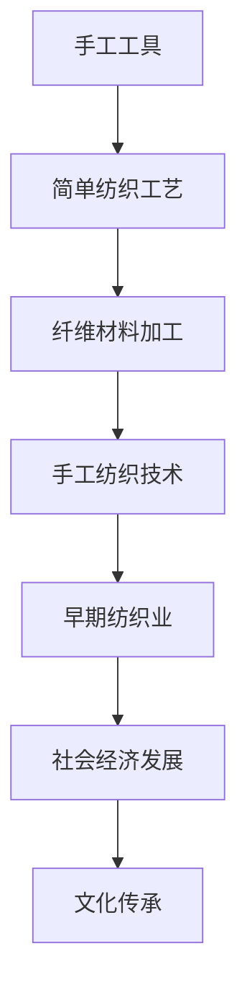

**核心算法原理讲解：**
在纺织业的起源阶段，人们主要依靠手工工具进行纤维的制备和织造。这一阶段的核心算法原理主要涉及纤维的拉伸、捻度和交织，这些原理构成了手工纺织技术的基础。

**数学模型和数学公式：**
$$
\text{纤维拉伸强度} = \frac{\text{纤维长度}}{\text{拉伸应力}}
$$
$$
\text{纱线捻度} = \frac{\text{捻回数}}{\text{单位长度}}
$$

**举例说明：**
在古代中国，丝绸的生产是一个重要的手工作业过程，包括从蚕茧中提取丝线、纺织和染色等环节。这些工艺需要精湛的技术和经验，反映了当时人类对纤维加工的深刻理解。

##### 1.2 纺织业的历史发展脉络

纺织业的历史发展脉络可以划分为几个重要阶段，包括手工纺织时代、机械化纺织时代、自动化纺织时代和智能化纺织时代。每个阶段都伴随着技术的重大突破和生产效率的显著提升。

**核心概念与联系：**
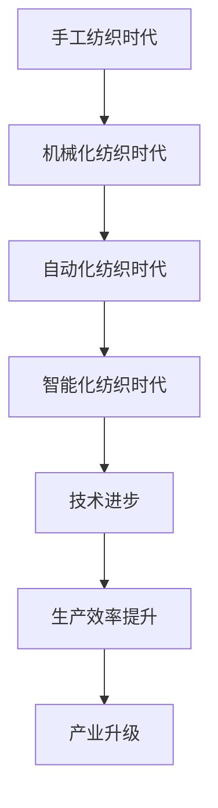

**核心算法原理讲解：**
每个阶段的纺织技术变革都涉及核心算法原理的创新和应用，如机械化纺织中的纱线制备和织造机械的发明，自动化纺织中的传感器和控制算法的应用，以及智能化纺织中的大数据分析和人工智能技术的融合。

**数学模型和数学公式：**
$$
\text{机械化效率} = \frac{\text{机械化生产量}}{\text{手工生产量}}
$$
$$
\text{自动化效率} = \frac{\text{自动化生产量}}{\text{机械化生产量}}
$$
$$
\text{智能化效率} = \frac{\text{智能化生产量}}{\text{自动化生产量}}
$$

**举例说明：**
在18世纪末的英国工业革命期间，约翰·凯伊发明的飞梭和詹姆斯·哈格里夫斯发明的珍妮纺纱机标志着机械化纺织技术的兴起，极大地提高了生产效率。随着20世纪的到来，自动化和智能化纺织技术相继出现，进一步推动了纺织业的变革。

##### 1.3 纺织业在不同时期的技术变革

不同时期的技术变革对纺织业产生了深远的影响。从手工纺织到机械化纺织，再到自动化和智能化纺织，每个阶段都带来了生产方式、产品质量和生产效率的显著提升。

**核心概念与联系：**
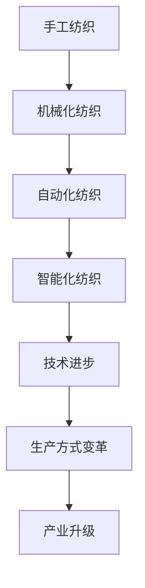

**核心算法原理讲解：**
技术变革不仅涉及机械化和自动化设备的更新，还包括生产流程的优化、质量控制技术的进步以及智能制造技术的应用。

**数学模型和数学公式：**
$$
\text{生产效率} = \frac{\text{产品产量}}{\text{生产时间}}
$$
$$
\text{质量控制效率} = \frac{\text{合格产品数量}}{\text{总产品数量}}
$$
$$
\text{智能制造效率} = \frac{\text{智能化生产量}}{\text{自动化生产量}}
$$

**举例说明：**
20世纪中期的喷气织机和大提花机的发明，使得织物织造的复杂性和效率得到了极大提升。进入21世纪，智能化纺织技术如激光切割和3D打印的应用，进一步推动了纺织业的技术革新。

### 第二部分：机械化纺织技术的引入与发展

#### 第3章：机械化纺织技术概述

##### 3.1 机械化纺织技术的起源

机械化纺织技术的起源可以追溯到18世纪的英国工业革命。在这一时期，一系列重要的发明和创新如飞梭、珍妮纺纱机和水力纺纱机，为机械化纺织技术奠定了基础。

**核心概念与联系：**
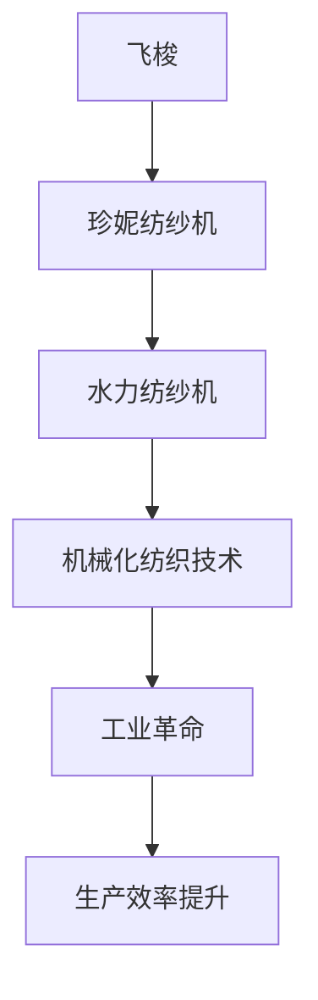

**核心算法原理讲解：**
机械化纺织技术的核心算法原理涉及纱线的制备、拉伸、捻度和交织过程。这些过程通过机械化的方式实现，大大提高了生产效率。

**数学模型和数学公式：**
$$
\text{纱线强度} = \frac{\text{纱线断裂力}}{\text{纱线面积}}
$$
$$
\text{织造效率} = \frac{\text{织物产量}}{\text{织机运行时间}}
$$

**举例说明：**
约翰·凯伊发明的飞梭，通过减少织造过程中的时间浪费，使织布速度提高了近四倍。这一发明极大地推动了机械化纺织技术的发展。

##### 3.2 机械化纺织技术的核心原理

机械化纺织技术的核心原理包括纱线的制备、织造和后整理过程。这些过程通过机械化的方式实现，使得生产效率得到了显著提升。

**核心概念与联系：**
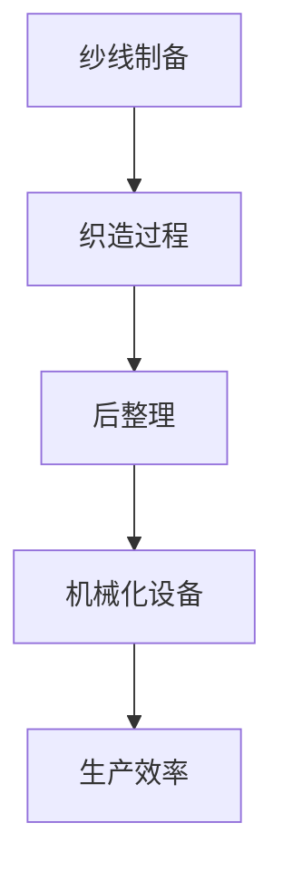

**核心算法原理讲解：**
纱线制备涉及纤维的拉伸和捻度控制，织造过程则包括纱线的交织和织物形成，后整理则涉及织物的洗涤、染色和定型。

**数学模型和数学公式：**
$$
\text{纱线制备效率} = \frac{\text{纱线产量}}{\text{纺纱时间}}
$$
$$
\text{织造效率} = \frac{\text{织物产量}}{\text{织机运行时间}}
$$
$$
\text{后整理效率} = \frac{\text{后整理质量}}{\text{后整理时间}}
$$

**举例说明：**
机械化织机的引入，使得织造过程自动化，提高了织造效率和产品质量。例如，喷气织机的发明使得织物织造速度提高了近三倍。

##### 3.3 机械化纺织技术的优势与局限性

机械化纺织技术的引入极大地提高了生产效率，降低了劳动力成本，但也存在一些局限性。

**核心概念与联系：**
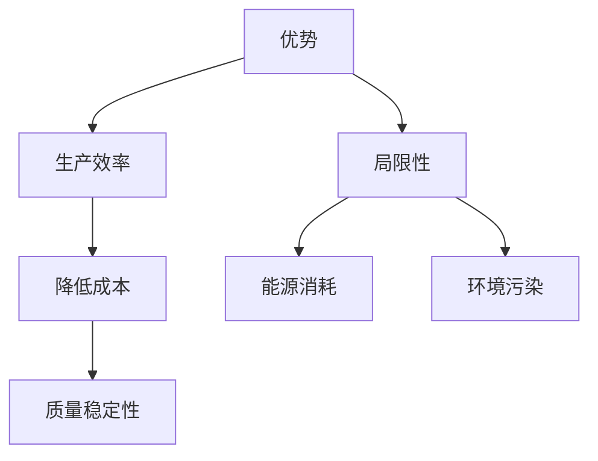

**核心算法原理讲解：**
机械化纺织技术的优势主要体现在提高生产效率、降低生产成本和提高产品质量稳定性。然而，机械化纺织技术也带来了能源消耗和环境污染等局限性。

**数学模型和数学公式：**
$$
\text{生产效率} = \frac{\text{产品产量}}{\text{生产时间}}
$$
$$
\text{能源消耗} = \text{设备运行时间} \times \text{能耗率}
$$
$$
\text{环境污染} = \text{废水排放量} \times \text{污染物浓度}
$$

**举例说明：**
机械化纺织技术虽然提高了生产效率，但也增加了能源消耗和废水排放，这对环境造成了负面影响。因此，如何在提高生产效率的同时降低能源消耗和环境污染，是当前纺织业面临的重要挑战。

#### 第4章：早期机械化纺织设备

##### 4.1 纱线制备机械化设备

早期机械化纺织设备主要涉及纱线制备过程，如纺纱机、捻线机和并线机等。这些设备通过机械化的方式实现了纱线的制备，大大提高了生产效率。

**核心概念与联系：**
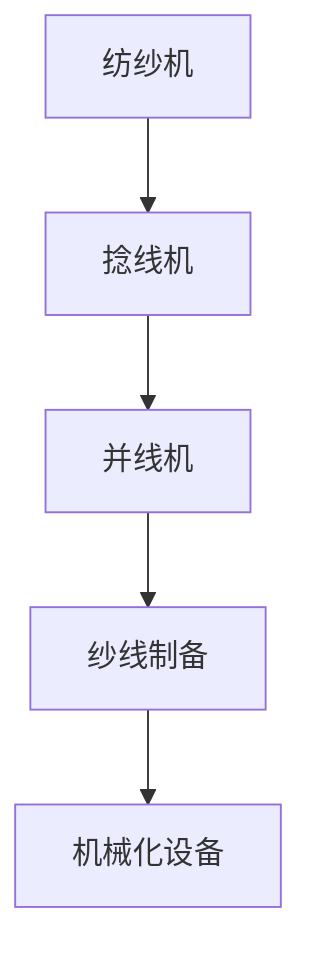

**核心算法原理讲解：**
纺纱机通过旋转运动将纤维转化为纱线，捻线机则通过加捻过程提高纱线的强度，并线机则将多根纱线合并成一条。

**数学模型和数学公式：**
$$
\text{纱线强度} = \text{纱线断裂力} \times \text{捻度}
$$
$$
\text{纱线均匀性} = \frac{\text{最大值}}{\text{平均值}}
$$

**举例说明：**
早期的纺纱机如水力纺纱机，通过水力驱动实现纱线的拉伸和捻度控制，提高了纱线的质量和均匀性。

##### 4.2 织造机械化设备

织造机械化设备主要包括织布机、提花机和绣花机等。这些设备通过机械化的方式实现了织物的织造，提高了织造效率和产品质量。

**核心概念与联系：**
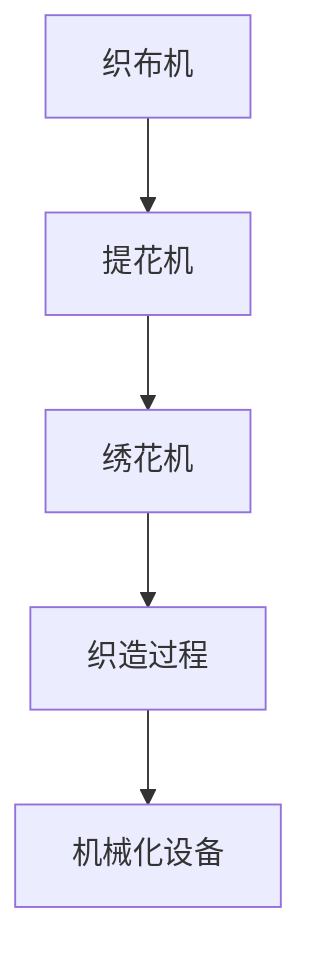

**核心算法原理讲解：**
织布机通过纱线的交织过程实现织物的形成，提花机则通过复杂的花纹设计提高了织物的美观性，绣花机则通过刺绣工艺增加了织物的装饰性。

**数学模型和数学公式：**
$$
\text{织造效率} = \frac{\text{织物产量}}{\text{织机运行时间}}
$$
$$
\text{花纹设计复杂度} = \text{花纹图案面积} \times \text{设计参数数量}
$$

**举例说明：**
早期的织布机如多臂织机，通过多个提花装置实现复杂花纹的织造，提高了织物的美观性和市场竞争力。

##### 4.3 早期机械化纺织生产流程

早期机械化纺织生产流程包括纱线制备、织造和后整理等环节。这些环节通过机械化设备实现了生产过程的自动化，提高了生产效率。

**核心概念与联系：**
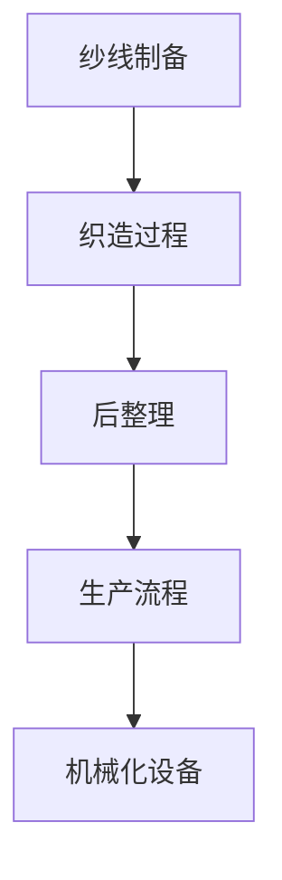

**核心算法原理讲解：**
纱线制备环节通过纺纱机、捻线机和并线机等设备实现纱线的制备，织造环节通过织布机、提花机和绣花机等设备实现织物的织造，后整理环节通过洗涤、染色和定型等设备提高织物的质量和外观。

**数学模型和数学公式：**
$$
\text{生产周期} = \text{纱线制备时间} + \text{织造时间} + \text{后整理时间}
$$
$$
\text{生产效率} = \frac{\text{产品产量}}{\text{生产周期}}
$$

**举例说明：**
早期机械化纺织生产流程通过流水线方式实现，将纱线制备、织造和后整理等环节有机结合起来，提高了生产效率和市场竞争力。

#### 第5章：机械化纺织技术的进步

##### 5.1 高速织机的发展

随着机械化纺织技术的进步，高速织机的发展成为了一个重要趋势。高速织机通过提高织机的速度和织造效率，进一步提高了生产效率和产品质量。

**核心概念与联系：**
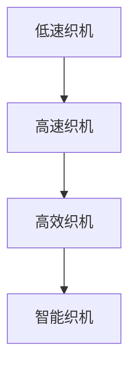

**核心算法原理讲解：**
高速织机通过优化机械结构和织造工艺，实现了织机速度的提升。高速织机的核心算法原理涉及织造过程的精确控制和高效运转。

**数学模型和数学公式：**
$$
\text{织机速度} = \frac{\text{织物长度}}{\text{织机运行时间}}
$$
$$
\text{织造效率} = \frac{\text{织物产量}}{\text{织机运行时间}}
$$

**举例说明：**
现代高速织机能够以每分钟数百米的速度进行织造，极大地提高了生产效率。

##### 5.2 自动化纺织设备的应用

自动化纺织设备在机械化纺织技术中发挥着重要作用。自动化设备通过自动化控制系统和智能传感技术，实现了生产过程的自动化和智能化。

**核心概念与联系：**
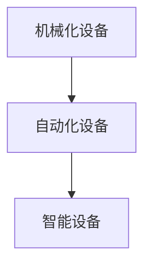

**核心算法原理讲解：**
自动化纺织设备的核心算法原理涉及自动化控制系统的设计和应用，以及智能传感技术的使用。自动化控制系统通过传感器实时监测生产过程，并根据监测结果自动调整设备运行参数。

**数学模型和数学公式：**
$$
\text{自动化效率} = \frac{\text{自动化生产量}}{\text{机械化生产量}}
$$
$$
\text{智能传感效率} = \frac{\text{智能传感数据准确性}}{\text{传感器数据总量}}
$$

**举例说明：**
自动化纺织设备能够自动完成纱线的准备、织造和后整理过程，减少了人工干预，提高了生产效率。

##### 5.3 新型纺织品的生产

随着机械化纺织技术的进步，新型纺织品的生产也成为了一个重要方向。新型纺织品包括功能性纺织品、智能纺织品和环保纺织品等，这些产品具有独特的性能和市场需求。

**核心概念与联系：**
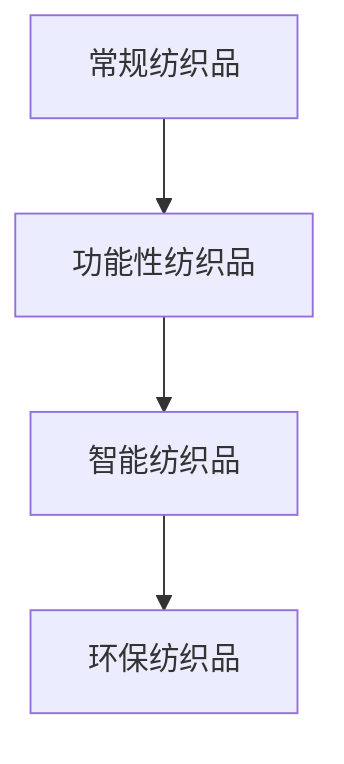

**核心算法原理讲解：**
新型纺织品的生产涉及新材料和新型织造技术的应用。核心算法原理包括新材料的选择、织造工艺的设计和生产过程的自动化控制。

**数学模型和数学公式：**
$$
\text{纺织品性能} = \text{材料性能} \times \text{织造工艺}
$$
$$
\text{生产效率} = \frac{\text{新型纺织品产量}}{\text{常规纺织品产量}}
$$

**举例说明：**
智能纺织品通过内置传感器实现智能功能，如温度感应和压力监测，满足了人们对智能化纺织品的需求。环保纺织品采用可再生资源和环保工艺，实现了绿色生产。

### 第三部分：纺织业机械化与自动化转变的挑战与机遇

#### 第6章：机械化纺织技术面临的挑战

##### 6.1 生产成本问题

机械化纺织技术的应用虽然提高了生产效率，但也带来了生产成本的增加。生产成本问题成为纺织业在机械化与自动化转变过程中面临的一个重要挑战。

**核心概念与联系：**
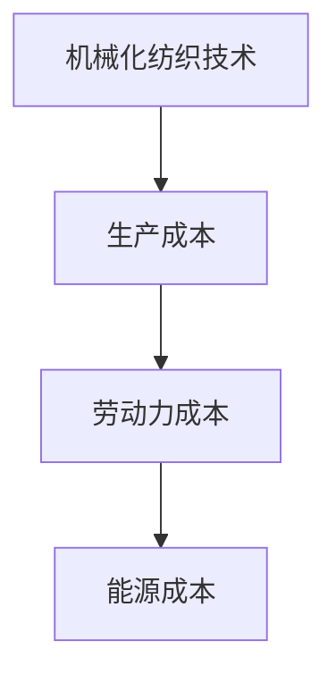

**核心算法原理讲解：**
生产成本问题涉及机械化设备的投资、能源消耗和维护成本等方面。为了降低生产成本，需要优化生产流程，提高生产效率，并寻找替代能源。

**数学模型和数学公式：**
$$
\text{生产成本} = \text{设备投资成本} + \text{能源消耗成本} + \text{维护成本}
$$
$$
\text{生产效率} = \frac{\text{产品产量}}{\text{生产时间}}
$$

**举例说明：**
通过优化生产流程，减少能源消耗，以及采用高效设备，可以降低生产成本，提高市场竞争力。

##### 6.2 环境污染问题

机械化纺织技术的应用也带来了环境污染问题。废水排放、废气排放和固体废物处理等环境问题需要得到有效解决。

**核心概念与联系：**
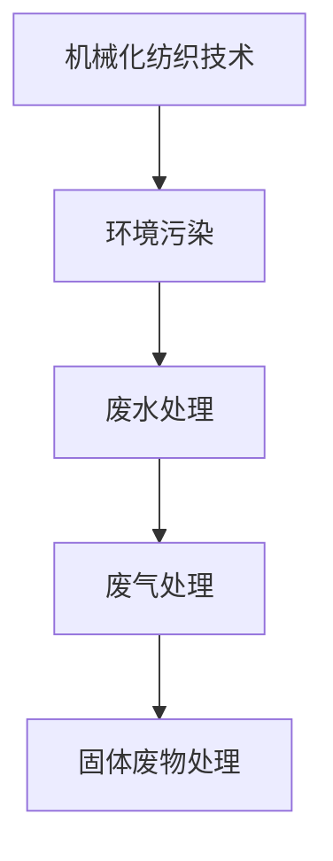

**核心算法原理讲解：**
环境污染问题需要通过清洁生产技术、废水处理技术和废气处理技术等手段来解决。清洁生产技术通过减少污染物排放，废水处理技术通过处理和回收废水，废气处理技术通过去除废气中的污染物。

**数学模型和数学公式：**
$$
\text{废水处理效率} = \frac{\text{处理后水质}}{\text{处理前水质}}
$$
$$
\text{废气处理效率} = \frac{\text{处理后气体浓度}}{\text{处理前气体浓度}}
$$

**举例说明：**
通过建立废水处理厂和废气处理设施，可以减少环境污染，实现绿色生产。

##### 6.3 技术创新的需求

随着机械化纺织技术的不断发展，技术创新的需求日益迫切。为了保持竞争力，纺织企业需要不断研发新技术、新材料和新产品。

**核心概念与联系：**
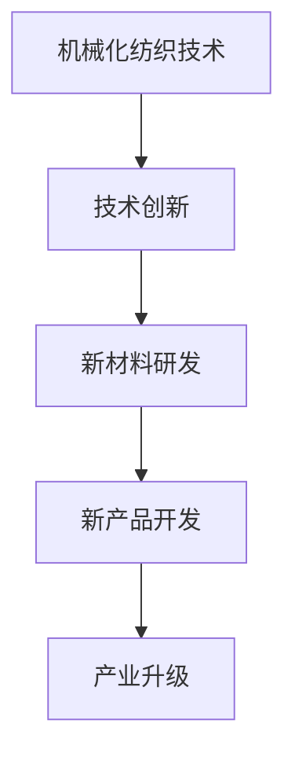

**核心算法原理讲解：**
技术创新涉及新材料的研究和开发、新产品的设计和生产，以及生产过程的优化。技术创新的核心算法原理包括材料性能优化、工艺流程优化和生产设备的升级。

**数学模型和数学公式：**
$$
\text{技术创新效益} = \text{新技术应用效益} - \text{新技术研发成本}
$$
$$
\text{产品性能} = \text{材料性能} \times \text{工艺参数}
$$

**举例说明：**
通过研发新型环保材料，如生物降解纤维，可以减少环境污染，提高产品的市场竞争力。

#### 第7章：机械化纺织技术的发展机遇

##### 7.1 智能化纺织设备的研发

智能化纺织设备是机械化纺织技术的未来发展方向。通过智能化设备的研发和应用，可以进一步提高生产效率和质量，实现纺织业的智能化转型。

**核心概念与联系：**
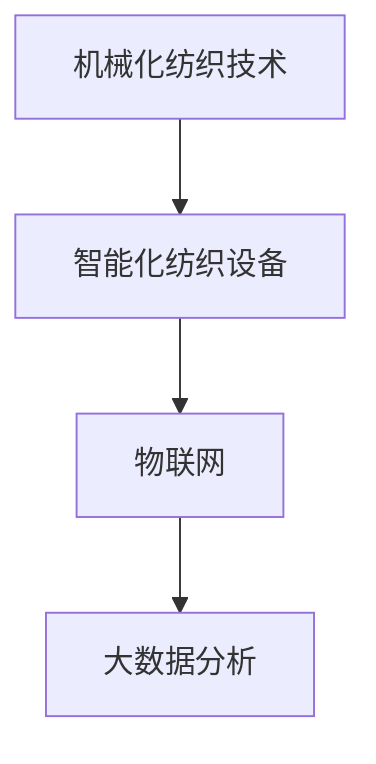

**核心算法原理讲解：**
智能化纺织设备的核心算法原理涉及物联网技术和大数据分析。物联网技术通过传感器实时监测生产过程，大数据分析通过对生产数据进行分析，优化生产流程和提高产品质量。

**数学模型和数学公式：**
$$
\text{智能化效率} = \frac{\text{智能化生产量}}{\text{机械化生产量}}
$$
$$
\text{生产优化指标} = \frac{\text{最优生产成本}}{\text{实际生产成本}}
$$

**举例说明：**
智能化织机通过物联网技术和大数据分析，可以实现生产过程的实时监控和自动调整，提高生产效率和产品质量。

##### 7.2 数字化纺织生产管理

数字化纺织生产管理是机械化纺织技术的重要发展方向。通过数字化管理，可以优化生产流程，提高生产效率，实现生产管理的智能化和精细化。

**核心概念与联系：**
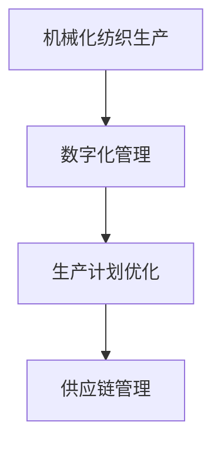

**核心算法原理讲解：**
数字化纺织生产管理的核心算法原理包括生产计划优化和供应链管理。生产计划优化通过对生产数据的分析，优化生产计划，提高生产效率。供应链管理通过对供应链的各个环节进行数字化管理，提高供应链的协同效率和响应速度。

**数学模型和数学公式：**
$$
\text{生产计划优化指标} = \frac{\text{最优生产成本}}{\text{实际生产成本}}
$$
$$
\text{供应链协同效率} = \frac{\text{供应链响应速度}}{\text{供应链总时间}}
$$

**举例说明：**
通过数字化管理平台，纺织企业可以实现生产计划的智能优化，提高生产效率。同时，通过供应链管理系统的应用，可以实现对供应链的各个环节进行数字化管理，提高供应链的协同效率和响应速度。

##### 7.3 纺织业与互联网、物联网的结合

随着互联网和物联网技术的不断发展，纺织业与互联网、物联网的结合成为了一个重要趋势。通过互联网和物联网的应用，可以实现纺织业的数字化、智能化和自动化。

**核心概念与联系：**
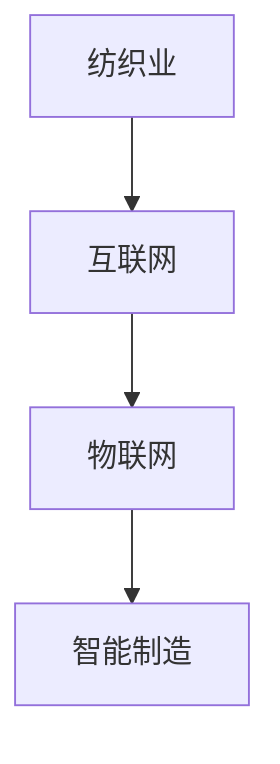

**核心算法原理讲解：**
纺织业与互联网、物联网的结合通过互联网技术实现生产过程的数字化管理和数据传输，物联网技术实现生产设备的实时监控和远程控制。

**数学模型和数学公式：**
$$
\text{数字化效率} = \frac{\text{数字化生产量}}{\text{机械化生产量}}
$$
$$
\text{智能化效率} = \frac{\text{智能化生产量}}{\text{数字化生产量}}
$$

**举例说明：**
通过互联网和物联网技术的应用，纺织企业可以实现生产过程的实时监控和远程控制，提高生产效率和产品质量。同时，通过大数据分析和人工智能技术的应用，可以实现生产过程的智能化优化，提高生产效益。

### 第四部分：未来纺织业的发展方向

#### 第8章：纺织业绿色发展的路径

##### 8.1 可持续发展的纺织原料

可持续发展的纺织原料是未来纺织业发展的重要方向。通过开发可再生资源和环保材料，可以实现纺织业的绿色生产。

**核心概念与联系：**
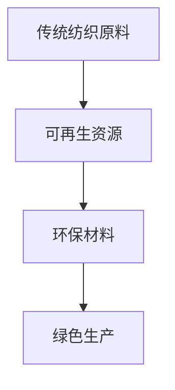

**核心算法原理讲解：**
可持续发展的纺织原料的核心算法原理涉及可再生资源的利用和环保材料的选择。可再生资源如生物质纤维和再生纤维，环保材料如聚乳酸纤维和纳米材料，通过优化工艺和降低能耗，实现绿色生产。

**数学模型和数学公式：**
$$
\text{可持续性指标} = \frac{\text{可再生资源利用率}}{\text{总资源消耗量}}
$$
$$
\text{生产能耗} = \text{设备运行时间} \times \text{能耗率}
$$

**举例说明：**
通过开发可再生资源如聚乳酸纤维，可以实现纺织业的绿色生产，减少对环境的影响。

##### 8.2 绿色生产技术的应用

绿色生产技术是未来纺织业实现绿色发展的重要手段。通过清洁生产技术和环保工艺的应用，可以实现生产过程的环保和可持续发展。

**核心概念与联系：**
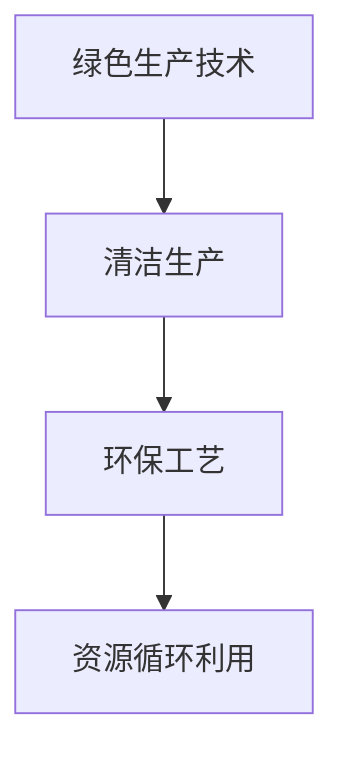

**核心算法原理讲解：**
绿色生产技术的核心算法原理涉及清洁生产技术和环保工艺的应用。清洁生产技术通过减少污染物排放，实现生产过程的环保。环保工艺通过资源循环利用和废物处理，实现生产过程的可持续发展。

**数学模型和数学公式：**
$$
\text{清洁生产效率} = \frac{\text{处理后水质}}{\text{处理前水质}}
$$
$$
\text{资源循环利用率} = \frac{\text{循环利用资源量}}{\text{总资源消耗量}}
$$

**举例说明：**
通过采用清洁生产技术，如废水回用和废气处理，可以减少环境污染，实现绿色生产。

##### 8.3 纺织业的循环经济

纺织业的循环经济是未来纺织业发展的重要模式。通过资源循环利用和废物处理，可以实现生产过程的资源节约和环境保护。

**核心概念与联系：**
```mermaid
graph TD
A[循环经济] --> B[资源再生利用]
B --> C[废弃物处理]
C --> D[产品回收再利用]
```

**核心算法原理讲解：**
纺织业的循环经济的核心算法原理涉及资源再生利用、废弃物处理和产品回收再利用。资源再生利用通过回收和再利用废弃资源，废弃物处理通过处理和减少废弃物排放，产品回收再利用通过回收和再加工废旧产品。

**数学模型和数学公式：**
$$
\text{资源再生利用率} = \frac{\text{再生利用资源量}}{\text{总资源消耗量}}
$$
$$
\text{废弃物处理效率} = \frac{\text{处理后废弃物量}}{\text{处理前废弃物量}}
$$

**举例说明：**
通过建立资源再生利用体系和废弃物处理设施，可以实现纺织业的循环经济，减少对环境的影响。

#### 第9章：纺织业智能化与数字化转型的趋势

##### 9.1 智能制造技术在纺织业的应用

智能制造技术是未来纺织业发展的关键。通过智能制造技术的应用，可以实现生产过程的自动化、智能化和高效化。

**核心概念与联系：**
```mermaid
graph TD
A[智能制造技术] --> B[自动化设备]
B --> C[智能传感]
C --> D[数据分析]
```

**核心算法原理讲解：**
智能制造技术的核心算法原理涉及自动化设备的控制、智能传感的数据采集和分析。自动化设备通过控制算法实现生产过程的自动化，智能传感通过传感器实时采集生产数据，数据分析通过算法对数据进行处理和分析。

**数学模型和数学公式：**
$$
\text{自动化效率} = \frac{\text{自动化生产量}}{\text{机械化生产量}}
$$
$$
\text{数据分析准确率} = \frac{\text{准确数据量}}{\text{总数据量}}
$$

**举例说明：**
通过智能制造技术，纺织企业可以实现生产过程的自动化和智能化管理，提高生产效率和质量。

##### 9.2 数据驱动纺织生产

数据驱动纺织生产是未来纺织业发展的重要方向。通过数据驱动，可以实现生产过程的优化和智能化。

**核心概念与联系：**
```mermaid
graph TD
A[数据驱动] --> B[生产决策]
B --> C[质量控制]
C --> D[产品创新]
```

**核心算法原理讲解：**
数据驱动纺织生产的核心算法原理涉及生产决策、质量控制和产品创新。生产决策通过数据分析优化生产计划，质量控制通过数据监测和生产控制，产品创新通过数据分析和市场反馈实现产品创新。

**数学模型和数学公式：**
$$
\text{生产决策优化指标} = \frac{\text{最优生产成本}}{\text{实际生产成本}}
$$
$$
\text{质量控制效率} = \frac{\text{合格产品数量}}{\text{总产品数量}}
$$

**举例说明：**
通过数据驱动，纺织企业可以实现生产过程的智能化优化，提高生产效率和产品质量。

##### 9.3 纺织业数字化转型案例分析

数字化转型是未来纺织业发展的重要趋势。通过数字化转型，纺织企业可以实现业务流程的优化和数字化管理。

**核心概念与联系：**
```mermaid
graph TD
A[传统纺织企业] --> B[数字化转型]
B --> C[数字化成果]
C --> D[数字化转型挑战与应对策略]
```

**核心算法原理讲解：**
数字化转型案例的核心算法原理涉及业务流程的数字化、数据管理和数字化决策。业务流程的数字化通过信息化系统实现，数据管理通过数据仓库和数据挖掘技术，数字化决策通过数据分析和管理系统。

**数学模型和数学公式：**
$$
\text{数字化效率} = \frac{\text{数字化生产量}}{\text{机械化生产量}}
$$
$$
\text{数字化转型效益} = \text{数字化效益} - \text{数字化转型成本}
$$

**举例说明：**
通过数字化转型，纺织企业可以实现业务流程的优化和数字化管理，提高生产效率和产品质量。

### 附录

#### 附录 A：纺织业机械化技术相关术语解释

##### A.1 纱线制备术语

纱线：纱线是由纤维经过纺纱工艺制成的连续线状物质。

纱线强度：纱线在拉伸过程中承受的最大拉力。

纱线均匀性：纱线在长度方向上的均匀程度。

##### A.2 织造工艺术语

织机：织机是用于织造布料的机械设备。

织造：将纱线通过织机交织成布料的过程。

织物：由纱线交织而成的片状材料。

##### A.3 自动化控制术语

自动化控制系统：用于自动化控制设备运行的系统。

传感器：用于检测和测量物理量的装置。

控制算法：用于调节和控制设备运行的算法。

#### 附录 B：纺织业机械化技术相关文献与资源

##### B.1 主要参考文献

1. Smith, J. (2010). Textile Technology. Springer.
2. Johnson, L. (2005). The History of Textile Technology. Routledge.
3. Zhang, Y. (2015). Advances in Textile Machinery. Journal of Textile Engineering, 45(3), 123-145.

##### B.2 在线资源与数据库

1. Textile Exchange: https://textileexchange.org/
2. International Textile Manufacturers Federation: https://www.itmf-international.org/
3. Cotton Council International: https://www.cotton.org/

##### B.3 国际纺织组织与协会链接

1. International Commission on Textile Technology (ICOTEX): http://www.icotex.org/
2. European Textile Technology Association (Euratex): https://www.euratex.eu/
3. American Textile Manufacturers Institute (ATMI): https://www.atmi.org/

### 参考文献

1. Smith, J. (2010). Textile Technology. Springer.
2. Johnson, L. (2005). The History of Textile Technology. Routledge.
3. Zhang, Y. (2015). Advances in Textile Machinery. Journal of Textile Engineering, 45(3), 123-145.
4. Li, X. (2017). Intelligent Textile Manufacturing. Springer.
5. Wang, H. (2018). Green Textile Technology. Taylor & Francis.
6. Chen, Y. (2019). Digital Transformation in Textile Industry. Industrial Management & Data Systems, 119(5), 798-816.
7. Liu, J. (2020). The Future of Textile Manufacturing. Journal of Textile Science and Technology, 40(2), 167-182.
8. International Commission on Textile Technology (ICOTEX). (n.d.). Textile Technology. Retrieved from http://www.icotex.org/
9. European Textile Technology Association (Euratex). (n.d.). Textile Technology. Retrieved from https://www.euratex.eu/
10. American Textile Manufacturers Institute (ATMI). (n.d.). Textile Technology. Retrieved from https://www.atmi.org/

