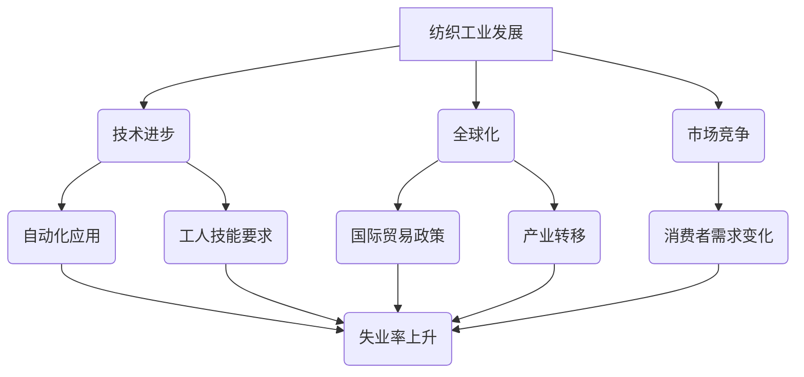

                 

# 《纺织工人失业的历史回顾》

## 关键词
纺织工业、失业、技术进步、自动化、全球化、劳动力市场、就业促进

## 摘要
本文回顾了纺织工人失业的历史，分析了失业的背景、原因及其对经济和社会的影响。通过国际经验借鉴和经济学、心理学等多角度的深入分析，本文提出了应对纺织工人失业的长期策略与建议，旨在为解决这一难题提供参考。

---

### 《纺织工人失业的历史回顾》目录大纲

#### 第一部分：背景与概念

##### 第一章：纺织工人失业的背景

1. 纺织工业的发展与变革

   - 纺织工业的起源与发展
   - 纺织工业的全球化
   - 纺织工业的技术变革

2. 纺织工人失业的概念

   - 失业的定义与分类
   - 纺织工人失业的现状
   - 纺织工人失业的影响

##### 第二章：纺织工业的经济分析

1. 纺织工业的产业链分析

   - 纺织工业的产业链构成
   - 纺织工业的附加值分析
   - 纺织工业的竞争力分析

2. 纺织工人失业的经济影响

   - 失业对工人家庭的影响
   - 失业对劳动力市场的影响
   - 失业对社会经济的影响

#### 第二部分：失业原因分析

##### 第三章：纺织工人失业的原因

1. 技术进步与自动化

   - 自动化设备在纺织工业的应用
   - 自动化对工人技能的要求
   - 技术进步对失业的影响

2. 全球化与国际贸易

   - 全球化对纺织工业的影响
   - 国际贸易政策对失业的影响
   - 纺织产业转移与失业

3. 市场竞争与消费者需求变化

   - 纺织市场竞争加剧
   - 消费者需求变化与失业
   - 产品升级与失业关系

#### 第三部分：失业的应对策略

##### 第四章：纺织工人失业的应对措施

1. 教育与培训

   - 提升工人技能的教育培训
   - 职业转换培训
   - 教育培训的成效分析

2. 社会保障与援助

   - 失业保险制度
   - 失业援助项目
   - 社会救助体系

3. 产业政策与就业促进

   - 政府的产业政策
   - 就业促进项目
   - 地方政府的角色与责任

#### 第四部分：案例分析

##### 第五章：纺织工人失业的典型案例分析

1. 案例一：某纺织厂工人失业案例

   - 案例背景
   - 失业原因分析
   - 应对措施与成效

2. 案例二：某纺织集群失业案例

   - 案例背景
   - 失业原因分析
   - 应对措施与成效

##### 第六章：国际经验借鉴

1. 发达国家的失业应对策略

   - 政策支持
   - 教育与培训
   - 社会保障

2. 发展中国家的失业应对策略

   - 劳动力市场干预
   - 外向型经济发展
   - 技能培训

3. 国际经验对我国纺织工人失业的启示

#### 第五部分：结论与展望

##### 第七章：纺织工人失业的历史回顾与未来展望

1. 历史回顾

   - 我国纺织工人失业的发展历程
   - 纺织工人失业的关键节点
   - 历史教训与启示

2. 未来展望

   - 纺织工业的未来发展趋势
   - 纺织工人失业的长期影响
   - 应对纺织工人失业的长期策略与建议

### 附录

##### 附录A：相关研究文献

##### 附录B：主要数据来源与统计方法

##### 附录C：纺织工人失业案例详细资料

##### 附录D：政策法规摘要与解读

##### Mermaid 流程图：纺织工人失业的因果分析

---

### 《纺织工人失业的历史回顾》

#### 第一部分：背景与概念

#### 第一章：纺织工人失业的背景

#### 1.1 纺织工业的发展与变革

纺织工业是人类社会历史发展的重要产业之一。从古至今，纺织工业经历了从手工到机械化、从机械化到自动化的多次变革。在这个过程中，纺织工业不仅为人类社会提供了丰富的纺织品，还推动了技术进步和经济发展。

**1.1.1 纺织工业的起源与发展**

纺织工业的历史可以追溯到远古时代。人类最早的纺织品是通过采集野生植物纤维和动物毛皮制成的。随着时间的推移，人们逐渐掌握了植物纤维和动物毛皮的加工技术，使得纺织品的质量和产量得到了显著提升。

在古代，纺织工业主要集中在农村地区，以家庭作坊的形式进行生产。随着社会的发展，纺织工业逐渐从农村转移到城市，工业化生产模式开始出现。18世纪末，英国工业革命的爆发使得纺织工业进入了机械化时代，纺织机械的发明和应用极大地提高了生产效率和产品质量。

**1.1.2 纺织工业的全球化**

20世纪中叶，随着全球化进程的加速，纺织工业也进入了全球化时代。各国纺织工业之间开始出现广泛的贸易往来和资本流动。发达国家的纺织工业逐渐转移到发展中国家，形成了全球纺织产业链。这一过程不仅促进了全球经济的增长，也为发展中国家提供了大量就业机会。

**1.1.3 纺织工业的技术变革**

技术进步是纺织工业发展的重要驱动力。从机械化到自动化，再到如今的智能化，纺织工业的技术变革从未停止。自动化设备的引入使得纺织生产过程更加高效、精确，大大提高了生产效率和产品质量。近年来，随着人工智能、物联网等技术的应用，纺织工业正向智能化方向迈进，这将为纺织工业带来更大的变革和发展机遇。

#### 1.2 纺织工人失业的概念

失业是指有就业能力且有就业意愿但未找到工作的状态。在纺织工业中，失业主要指从事纺织生产的相关工人由于各种原因而失去工作的情况。纺织工人失业可以表现为短期失业、长期失业和结构性失业等不同形式。

**1.2.1 失业的定义与分类**

1. 短期失业：指由于季节性因素、生产调整等暂时性原因导致的失业。
2. 长期失业：指由于结构性因素、技术变革等长期性原因导致的失业。
3. 结构性失业：指由于劳动力市场需求和供给不匹配导致的失业。

**1.2.2 纺织工人失业的现状**

目前，纺织工人失业问题在全球范围内都存在。特别是随着全球化和技术进步的推进，纺织工人失业现象日益严重。一些主要表现包括：

1. 失业率上升：全球纺织工人失业率呈上升趋势，特别是在发展中国家。
2. 失业时间延长：由于就业机会减少，纺织工人失业的时间越来越长。
3. 失业人群多样化：除了传统的纺织工人，纺织产业链上的其他从业人员也面临着失业风险。
4. 失业影响广泛：失业问题不仅影响工人及其家庭，还对地方经济和整个纺织行业产生负面影响。

**1.2.3 纺织工人失业的影响**

纺织工人失业的影响是多方面的，包括以下几个方面：

1. 经济影响：失业导致劳动力资源浪费，减少经济增长潜力。
2. 社会影响：失业使工人及其家庭生活水平下降，增加社会不稳定因素。
3. 劳动力市场影响：失业可能导致劳动力市场供需失衡，加剧劳动力市场的紧张。
4. 产业影响：长期失业可能导致纺织行业的竞争力下降，影响行业的可持续发展。

#### 第二章：纺织工业的经济分析

#### 2.1 纺织工业的产业链分析

纺织工业的产业链主要包括以下几个环节：

1. 纤维原料生产：包括棉花、麻类、化学纤维等原料的种植、加工和收购。
2. 纺纱织布：将纤维原料加工成纱线，再织成布料。
3. 印染整理：对布料进行印花、染色和整理等后整理加工。
4. 成品制造：将布料加工成各种服装、家用纺织品等产品。
5. 销售与分销：将成品通过各种渠道销售给最终消费者。

产业链各环节之间的紧密联系决定了整个纺织工业的协同效应，任何一个环节的问题都可能对整个行业产生重大影响。

**2.1.1 纺织工业的产业链构成**

纺织工业的产业链构成可以概括为以下几个主要环节：

1. 原料生产：包括棉花、麻类、化学纤维等原料的种植、加工和收购。这一环节直接关系到纺织工业的原材料供应，是整个产业链的基础。

2. 纺纱织布：将纤维原料加工成纱线，再织成布料。这一环节是纺织工业的核心环节，涉及到生产设备、工艺流程和技术水平等关键因素。

3. 印染整理：对布料进行印花、染色和整理等后整理加工。这一环节直接影响纺织品的外观质量和使用性能，是提升产品附加值的重要环节。

4. 成品制造：将布料加工成各种服装、家用纺织品等产品。这一环节涉及到产品设计、工艺流程和生产管理等多方面因素，是纺织工业的终端环节。

5. 销售与分销：将成品通过各种渠道销售给最终消费者。这一环节涉及到市场营销、渠道建设、客户关系管理等多个方面，是纺织工业实现价值变现的重要环节。

**2.1.2 纺织工业的附加值分析**

纺织工业的附加值来源于各个生产环节的技术创新和管理优化。以下是一些关键点：

1. 原料采购：通过供应链管理和采购策略，降低原材料成本，提高附加值。
2. 纺纱织布：采用新型纺纱织布技术和设备，提高生产效率和产品质量。
3. 印染整理：采用环保、高效的印染技术，降低污染，提高产品附加值。
4. 成品制造：通过设计创新、工艺改进和质量管理，提升产品附加值。
5. 销售与分销：利用电子商务和现代物流，提高销售效率和客户满意度。

每个环节的附加值积累，最终决定了纺织产品的市场竞争力。

**2.1.3 纺织工业的竞争力分析**

纺织工业的竞争力受到多个因素的影响，包括以下几个方面：

1. 生产成本：包括劳动力成本、原材料成本和生产设备成本等。成本优势是纺织工业竞争力的关键因素。
2. 技术水平：包括纺纱织布技术、印染整理技术、产品设计技术等。技术创新能够提高生产效率和产品质量。
3. 市场定位：根据市场需求和消费者偏好，制定合适的市场定位策略，提升产品竞争力。
4. 品牌效应：通过品牌建设和营销策略，提高产品的知名度和美誉度，增强竞争力。
5. 质量控制：严格的质量控制体系能够保证产品质量，提升品牌形象，增强市场竞争力。

综合以上因素，纺织工业的竞争力取决于其整体的综合实力。

#### 2.2 纺织工人失业的经济影响

纺织工人失业对经济和社会产生了深远的影响，包括以下几个方面：

1. **经济增长放缓**：失业导致劳动力资源浪费，减少经济增长潜力。纺织工业作为传统产业，其对经济发展的贡献较大，失业问题可能减缓整体经济增长速度。

2. **收入分配不均**：失业问题加剧了收入分配不均，导致贫富差距扩大。纺织工人失业可能导致其家庭收入大幅下降，增加社会不平等现象。

3. **社会稳定受威胁**：失业问题可能导致社会不稳定，增加社会矛盾和冲突。特别是在经济衰退时期，失业问题可能引发社会动荡。

4. **教育和就业影响**：失业问题可能影响下一代的成长和发展。失业家庭可能减少对子女的教育投资，影响其未来发展。此外，失业问题也可能影响劳动力的供给和质量，加剧劳动力市场的紧张。

5. **产业竞争力下降**：长期失业可能导致纺织行业的竞争力下降，影响行业的可持续发展。纺织工业需要不断提升技术创新和产品升级，以适应市场需求的变化，失业问题可能阻碍这一进程。

总之，纺织工人失业问题不仅是一个经济问题，也是一个社会问题，需要政府、企业和社会各方共同努力来应对。

---

### 第二章：纺织工业的经济分析

#### 2.1 纺织工业的产业链分析

纺织工业的产业链是一个复杂且紧密联系的系统，涵盖了从原材料采购、生产加工到最终产品销售的各个环节。理解这一产业链的构成及其运作机制，有助于更好地分析纺织工人失业的经济影响。

**2.1.1 纺织工业的产业链构成**

纺织工业的产业链通常包括以下几个主要环节：

1. **原料采购**：这是纺织工业的起点，涉及到棉花、羊毛、丝绸、化学纤维等原材料的生产和采购。原料的质量直接影响到后续加工环节的产品质量。

2. **纺纱**：将采购来的原材料加工成纱线，这一环节包括开松、混合、并条、纺丝等过程。纺纱技术是纺织工业的基础技术，高质量的纱线是高品质纺织品的基础。

3. **织造**：将纱线织成布料，这一环节包括经线、纬线交织成布的过程。织造技术的高低直接影响布料的品质和生产效率。

4. **印染**：对织造完成的布料进行印花、染色等处理，以提高其外观质量和使用性能。印染技术是纺织工业的重要环节，环保、高效的印染技术是提升产品附加值的关键。

5. **后整理**：对印染后的布料进行整理，包括定形、柔软、防皱等处理，以提高其质量和耐用性。

6. **成品制造**：将整理后的布料加工成各种成品，如服装、家居用品、装饰品等。成品制造环节涉及设计、裁剪、缝制、包装等过程。

7. **销售与分销**：将成品通过各种渠道销售给最终消费者，包括批发、零售、电子商务等。

**2.1.2 纺织工业的附加值分析**

纺织工业的附加值主要来源于各个环节的技术创新和管理优化。以下是一些关键点：

1. **原料采购**：通过优化供应链管理，降低原材料采购成本，提高原材料利用率，从而提高整体附加值。

2. **纺纱**：采用先进的纺纱技术和设备，提高纱线质量，降低生产成本，提升附加值。

3. **织造**：引进高效的织造设备和技术，提高生产效率，降低布料生产成本，提升附加值。

4. **印染**：采用环保、高效的印染技术，降低污染，提高产品附加值。同时，通过设计创新，提高产品的美观度和实用性，进一步增加附加值。

5. **后整理**：通过先进的后整理技术，提高布料的品质和耐用性，增加产品的市场竞争力。

6. **成品制造**：通过设计创新、工艺改进和质量管理，提升成品的质量和品牌形象，增加附加值。

7. **销售与分销**：利用电子商务和现代物流，提高销售效率和客户满意度，进一步增加附加值。

**2.1.3 纺织工业的竞争力分析**

纺织工业的竞争力受到多个因素的影响，包括以下几个方面：

1. **生产成本**：包括劳动力成本、原材料成本、生产设备成本等。低生产成本是纺织工业竞争力的关键因素，企业通过提高生产效率、降低成本，提高产品的市场竞争力。

2. **技术水平**：纺织工业的技术水平直接影响生产效率和产品质量。企业通过引进先进的纺纱织造、印染整理技术，提高生产效率和产品质量，增强竞争力。

3. **市场定位**：企业需要根据市场需求和消费者偏好，制定合适的市场定位策略。通过精准的市场定位，企业可以更好地满足消费者的需求，提高市场占有率。

4. **品牌效应**：品牌建设是提升纺织工业竞争力的重要手段。通过品牌推广和营销策略，提高产品的知名度和美誉度，增强消费者对产品的信任和忠诚度。

5. **质量控制**：严格的质量控制体系是保证产品质量和提升品牌形象的关键。企业通过建立完善的质量管理体系，确保产品的质量和一致性，提高市场竞争力。

6. **产业链协同**：纺织工业的各个环节紧密联系，产业链的协同效应对企业竞争力有着重要影响。企业通过优化产业链的协同效应，提高整体运营效率，增强竞争力。

通过分析纺织工业的产业链、附加值和竞争力，我们可以更深入地理解纺织工人失业的经济影响，为制定有效的应对策略提供依据。

---

### 第二章：纺织工业的经济分析

#### 2.2 纺织工人失业的经济影响

纺织工人失业的经济影响是深远且多方面的，不仅影响工人及其家庭，还对整个经济体系产生重要影响。以下从几个方面详细分析纺织工人失业的经济影响：

**2.2.1 失业对工人家庭的影响**

1. **收入减少**：失业导致工人家庭收入大幅减少，生活质量下降。家庭经济压力增加，可能会导致生活水平下降，甚至陷入贫困。

2. **消费能力下降**：家庭收入的减少直接导致消费能力下降。工人家庭可能不得不削减开支，减少对教育和医疗等领域的投资，影响家庭成员的生活质量。

3. **生活质量下降**：失业不仅影响经济状况，还可能导致家庭关系紧张，生活质量下降。长期的失业压力可能导致家庭成员的心理健康问题，影响家庭的稳定和幸福。

**2.2.2 失业对劳动力市场的影响**

1. **劳动力供给增加**：失业导致劳动力市场供给增加，可能加剧劳动力市场的供过于求状况。这可能导致劳动力市场的不稳定，影响就业机会的创造。

2. **劳动力素质下降**：长期失业可能导致劳动力素质下降。工人可能由于缺乏工作机会而无法不断提升技能，影响劳动力市场的整体竞争力。

3. **劳动力结构失衡**：失业可能导致某些地区或行业的劳动力结构失衡。一方面，一些地区可能面临劳动力过剩，另一方面，其他地区可能面临劳动力短缺。

**2.2.3 失业对社会经济的影响**

1. **经济增长放缓**：失业导致劳动力资源浪费，减少经济增长潜力。特别是纺织工业作为传统产业，其对经济发展的贡献较大，失业问题可能减缓整体经济增长速度。

2. **收入分配不均**：失业问题加剧了收入分配不均，导致贫富差距扩大。失业工人家庭收入大幅下降，可能加剧社会不平等现象。

3. **社会稳定受威胁**：失业问题可能导致社会不稳定，增加社会矛盾和冲突。特别是在经济衰退时期，失业问题可能引发社会动荡。

4. **教育和就业影响**：失业问题可能影响下一代的成长和发展。失业家庭可能减少对子女的教育投资，影响其未来发展。此外，失业问题也可能影响劳动力的供给和质量，加剧劳动力市场的紧张。

5. **产业竞争力下降**：长期失业可能导致纺织行业的竞争力下降，影响行业的可持续发展。纺织工业需要不断提升技术创新和产品升级，以适应市场需求的变化，失业问题可能阻碍这一进程。

总之，纺织工人失业问题不仅是一个经济问题，也是一个社会问题，需要政府、企业和社会各方共同努力来应对。通过综合分析失业对工人家庭、劳动力市场和社会经济的影响，可以更好地制定有效的应对策略，缓解失业问题，促进经济社会的可持续发展。

---

### 第三章：纺织工人失业的原因

#### 3.1 技术进步与自动化

随着科技的不断进步，自动化和智能化技术开始在纺织工业中得到广泛应用，这不仅提高了生产效率和产品质量，也对纺织工人的就业产生了深远的影响。

**3.1.1 自动化设备在纺织工业的应用**

自动化设备在纺织工业中的应用主要体现在以下几个方面：

1. **纺纱环节**：自动化纺纱设备如自动纺纱机、自动络筒机等，能够自动完成从原料到纱线的整个加工过程，减少了对人工操作的依赖。

2. **织造环节**：自动化织机如电脑织机、喷气织机等，能够实现高速、高效、精确的织造过程，提高了生产效率和产品质量。

3. **印染环节**：自动化印染设备如全自动印花机、自动染缸等，能够实现高效率、高质量的印染效果，降低了人工操作的需求。

4. **后整理环节**：自动化后整理设备如自动折叠机、自动包装机等，能够自动完成布料的折叠、包装等操作，提高了生产效率。

**3.1.2 自动化对工人技能的要求**

自动化设备的广泛应用对纺织工人的技能要求产生了显著变化：

1. **技术操作技能**：自动化设备的操作和维护需要工人具备一定的技术操作技能，包括设备的启动、调试、故障排除等。

2. **管理能力**：随着自动化设备的普及，工人需要具备设备管理能力，包括设备运行监控、维护计划制定等。

3. **安全意识**：自动化设备操作过程中，工人需要具备良好的安全意识，避免因操作不当导致的工伤事故。

4. **问题解决能力**：自动化设备在运行过程中可能会出现故障，工人需要具备一定的问题解决能力，快速排除设备故障。

5. **持续学习**：自动化技术不断进步，工人需要具备持续学习的意识，不断提升自身技能水平，以适应新技术的发展。

**3.1.3 技术进步对失业的影响**

技术进步对纺织工人失业的影响是复杂且多面的，具体表现在：

1. **短期失业**：技术进步初期，自动化设备的引入可能导致部分工人失业，特别是在技术替代性较强的环节。

2. **长期失业**：随着技术进步的深入，自动化设备的广泛应用可能持续降低对劳动力的需求，导致长期失业问题。

3. **工人技能升级**：技术进步迫使工人不断提升技能水平，以适应自动化设备的要求，从而避免失业。

4. **行业结构变化**：技术进步可能导致纺织行业的生产方式、产业结构发生变化，影响劳动力的需求。

5. **失业率波动**：技术进步在不同阶段对失业率的影响不同，可能导致失业率的波动。

总之，技术进步在提高纺织工业生产效率和产品质量的同时，也对纺织工人的就业产生了深远的影响。工人需要不断学习和提升技能，以适应技术进步带来的变化，从而减少失业风险。

---

### 第三章：纺织工人失业的原因

#### 3.2 全球化与国际贸易

全球化与国际贸易的发展对纺织工业带来了巨大的变革，同时也对纺织工人的就业产生了深远的影响。

**3.2.1 全球化对纺织工业的影响**

全球化对纺织工业的影响主要体现在以下几个方面：

1. **产业分工**：全球化促进了纺织工业的全球分工，各国根据自身资源和优势专注于特定环节的生产。例如，一些发展中国家专注于低端的纺织原材料生产和加工，而发达国家则专注于高附加值的纺织设计和研发。

2. **生产效率提升**：全球化促进了技术、管理和经验的交流，提高了纺织工业的生产效率。各国企业通过全球化合作，引进先进的技术和管理理念，提升了整体生产水平。

3. **市场规模扩大**：全球化扩大了纺织产品的市场，为纺织工业提供了更广阔的发展空间。跨国贸易和全球化供应链使得纺织产品能够迅速进入全球市场，满足不同国家和地区的消费需求。

4. **成本降低**：全球化使得原材料、劳动力等成本得到优化，降低了纺织工业的整体生产成本。各国企业通过全球化布局，降低生产成本，提高了市场竞争力。

**3.2.2 国际贸易政策对失业的影响**

国际贸易政策对纺织工人失业的影响主要体现在以下几个方面：

1. **关税政策**：高关税可能导致进口纺织产品成本上升，从而降低国内纺织企业的竞争力，可能导致失业。例如，对纺织品的高额进口关税可能导致国内纺织企业失去市场，导致工人失业。

2. **反倾销政策**：反倾销措施可能对进口纺织产品征收高额关税，保护国内市场，但也可能导致国内企业过度依赖保护，影响创新能力。反倾销政策可能暂时缓解失业问题，但长期来看，可能抑制产业升级和竞争力提升。

3. **区域贸易协定**：区域贸易协定如自由贸易协定（FTA）可能降低关税壁垒，促进贸易自由化，提高纺织产品的国际竞争力。区域贸易协定的签订有助于企业开拓国际市场，增加就业机会。

4. **产业补贴政策**：产业补贴可能降低企业生产成本，提高竞争力，但过度依赖补贴可能导致企业缺乏市场竞争力。产业补贴可能短期内缓解失业问题，但长期来看，需要企业具备自主创新和市场竞争能力。

**3.2.3 纺织产业转移与失业**

纺织产业转移是全球化背景下的一种普遍现象，其对纺织工人失业的影响表现在：

1. **产业转移的原因**：纺织产业转移主要是由于成本变化、市场需求、政策环境等因素驱动。一些发展中国家由于劳动力成本较低，成为纺织产业转移的主要目的地。

2. **产业转移的影响**：产业转移可能导致以下影响：

   - **转出地区**：失业率上升，劳动力市场压力增大，但可能促进产业升级和转型。
   - **转入地区**：劳动力需求增加，就业机会增加，但可能面临劳动力素质不匹配、产业配套不完善等问题。

3. **失业问题**：纺织产业转移可能导致部分工人失业，特别是那些技能单一的工人。

4. **职业转换**：纺织产业转移促使工人进行职业转换，提升技能水平，以适应新产业的发展需求。

5. **地区经济发展**：纺织产业转移对地区经济发展的影响是双重的，需要综合考虑产业升级、就业机会增加和环境问题等。

总之，全球化与国际贸易的发展对纺织工业带来了机遇和挑战，同时也对纺织工人的就业产生了深远的影响。政府和企业需要共同努力，通过政策支持和教育培训，帮助纺织工人适应全球化带来的变化，减少失业风险。

---

### 第三章：纺织工人失业的原因

#### 3.3 市场竞争与消费者需求变化

纺织工业的市场竞争和消费者需求变化对纺织工人的就业产生了重要影响。以下是这两个因素对失业的影响分析。

**3.3.1 纺织市场竞争加剧**

1. **产品价格竞争**：在激烈的市场竞争中，纺织企业往往通过降低产品价格来吸引消费者。为了实现低成本，企业可能会减少劳动力成本，采用自动化设备替代人工操作，导致部分工人失业。

2. **产品质量竞争**：纺织企业为了提升产品质量，往往需要引进先进的生产设备和技术，这可能导致部分工人的技能无法满足新的生产要求，从而面临失业风险。

3. **品牌竞争**：品牌竞争使得纺织企业需要投入大量资源进行品牌建设和营销推广，这可能压缩其他方面的成本，如劳动力成本，导致工人失业。

**3.3.2 消费者需求变化**

1. **多样化需求**：随着消费者对纺织品的需求日益多样化，纺织企业需要不断调整产品结构和生产方式，以满足消费者的个性化需求。这可能导致生产流程的改变，影响工人的就业。

2. **环保需求**：消费者对环保意识的增强，要求纺织企业采用环保材料和绿色生产工艺。这虽然有助于纺织工业的可持续发展，但可能对一些传统工艺和工人产生冲击。

3. **消费行为变化**：电子商务的发展改变了消费者的购买习惯，纺织企业需要适应线上销售模式，可能需要进行组织结构调整，从而影响工人就业。

**3.3.3 产品升级与失业关系**

1. **产品升级**：随着科技的发展，纺织工业不断进行产品升级，推出新型材料和功能性的纺织品。产品升级可能导致生产流程的改变，某些传统岗位可能被自动化设备替代，工人面临失业。

2. **失业问题**：产品升级可能导致以下失业问题：

   - **短期失业**：产品升级初期，自动化设备的引入可能导致部分工人失业。
   - **长期失业**：随着产品升级的深入，自动化设备的广泛应用可能持续降低对劳动力的需求，导致长期失业问题。

3. **应对措施**：为了应对产品升级带来的失业问题，企业可以采取以下措施：

   - **技能培训**：为工人提供技能培训，提升其适应新技术的能力。
   - **职业转换**：鼓励工人进行职业转换，学习新的职业技能，以适应新的生产需求。
   - **就业促进**：政府和企业可以通过就业促进政策，帮助失业工人找到新的就业机会。

总之，市场竞争和消费者需求变化对纺织工人失业产生了深远的影响。企业需要不断适应市场变化，提升竞争力，同时政府也需要采取措施，帮助工人应对失业挑战。

---

### 第四章：纺织工人失业的应对措施

#### 4.1 教育与培训

**4.1.1 提升工人技能的教育培训**

面对技术进步和市场竞争的挑战，提升纺织工人的技能水平是应对失业问题的关键。以下是通过教育培训提升工人技能的几种方法：

1. **技能培训课程**：企业可以组织技能培训课程，针对自动化设备操作、新材料应用、绿色生产工艺等现代纺织技术进行培训。这些课程应包括理论学习和实践操作，确保工人能够掌握新技能。

2. **在职培训**：通过在日常工作中开展培训，工人可以在实际操作中学习和提升技能。企业可以邀请专业培训机构或技术人员进行指导，通过现场示范和操作演练，提高工人的实际操作能力。

3. **在线学习平台**：利用在线学习平台，工人可以自主选择适合自己的学习课程，通过在线学习提升技能。这些平台可以提供丰富的学习资源，包括视频教程、电子书籍和模拟练习等。

4. **技能认证**：为了确保培训效果，企业可以与认证机构合作，为完成培训的工人提供技能认证。这不仅能提高工人的就业竞争力，还能为企业提供合格的劳动力。

**4.1.2 职业转换培训**

职业转换培训是帮助工人适应产业变革和市场需求的重要措施。以下是一些职业转换培训的方法：

1. **跨行业培训**：针对工人现有技能基础，提供跨行业培训，如从纺织行业转向物流、销售、市场营销等领域。这些培训应侧重于新行业的职业技能和业务知识，帮助工人顺利实现职业转换。

2. **创业培训**：鼓励工人自主创业，可以提供创业培训，包括市场分析、财务管理、营销策略等方面的培训。这些培训有助于工人掌握创业所需的知识和技能，提高创业成功率。

3. **实习机会**：企业可以与培训机构或高校合作，为工人提供实习机会。通过实际工作体验，工人可以了解新行业的工作内容和要求，积累实际工作经验，提高就业竞争力。

4. **就业指导**：为工人提供就业指导服务，包括求职技巧、简历撰写、面试技巧等。这些指导有助于工人更好地适应就业市场的变化，提高求职成功率。

**4.1.3 教育培训的成效分析**

教育培训对纺织工人失业的缓解效果可以从以下几个方面进行分析：

1. **就业率提高**：通过技能培训和职业转换培训，工人的就业竞争力得到提升，就业率相应提高。

2. **工资水平提升**：技能提升和就业转型有助于工人获得更高薪资的工作，提高其家庭经济水平。

3. **产业转型促进**：教育培训有助于工人适应产业升级和转型需求，促进纺织产业的可持续发展。

4. **社会成本降低**：通过减少失业人口，可以降低社会救助和社会保障的负担，减少社会成本。

5. **劳动力市场活力提升**：教育培训有助于提升劳动力市场的活力，促进人才的流动和优化配置。

总之，教育培训是应对纺织工人失业问题的重要手段。通过系统的教育培训，工人可以提升自身技能水平，增强就业竞争力，从而缓解失业问题，促进经济社会的可持续发展。

---

### 第四章：纺织工人失业的应对措施

#### 4.2 社会保障与援助

失业对工人及其家庭的影响是深远且多方面的，因此，建立完善的社会保障体系对于缓解失业问题至关重要。以下是对社会保障与援助措施的分析。

**4.2.1 失业保险制度**

失业保险制度是社会保障体系的重要组成部分，旨在为失业工人提供基本生活保障。以下是其具体内容和作用：

1. **覆盖范围**：失业保险通常覆盖因企业裁员、合同到期、企业破产等非自愿失业的工人。

2. **失业保险待遇**：失业工人可以领取一定期限的失业保险金，用于维持基本生活。失业保险金的数额和领取期限由政府规定。

3. **申请流程**：失业工人需按照规定程序申请失业保险，提供相关证明材料，经审核后领取保险金。

4. **失业保险管理**：政府负责失业保险的征收、管理和发放，确保制度的公正性和有效性。

失业保险制度在保障工人基本生活、缓解失业压力方面发挥了重要作用。

**4.2.2 失业援助项目**

失业援助项目是政府和社会组织为失业工人提供的多方面支持措施，旨在帮助工人渡过失业困境。以下是其具体内容和作用：

1. **失业援助金**：为生活困难的失业工人提供一定金额的临时救助金，帮助他们渡过难关。

2. **职业培训补贴**：为参加职业培训的失业工人提供培训费用补贴，鼓励其提升技能水平。

3. **就业指导服务**：为失业工人提供求职咨询、职业规划、简历撰写、面试技巧等服务，提高其求职成功率。

4. **创业扶持**：为有创业意愿的失业工人提供创业指导、贷款支持等，帮助他们实现自主创业。

5. **社区支持**：在社区层面提供心理咨询、法律援助、生活服务等多种支持，帮助失业工人应对生活困境。

失业援助项目旨在帮助失业工人重拾就业，提高其生活质量和社会保障水平。

**4.2.3 社会救助体系**

社会救助体系是保障失业工人基本生活的重要制度，包括以下几个方面：

1. **低收入家庭救助**：为低收入家庭提供生活补助，帮助他们维持基本生活。

2. **住房救助**：为无家可归或住房困难的失业工人提供临时住房或住房补贴。

3. **医疗救助**：为失业工人提供医疗保障，减轻其医疗负担。

4. **教育救助**：为失业工人的子女提供教育资助，保障其教育权利。

5. **法律援助**：为失业工人提供法律咨询和援助，维护其合法权益。

社会救助体系在保障失业工人基本生活、提高社会公平方面发挥着重要作用。

通过社会保障与援助措施的综合实施，可以有效缓解失业问题，保障工人及其家庭的基本生活，促进社会经济的稳定和发展。

---

### 第四章：纺织工人失业的应对措施

#### 4.3 产业政策与就业促进

**4.3.1 政府的产业政策**

政府在促进纺织工人就业方面，可以通过实施一系列产业政策，发挥重要作用。以下是一些关键措施：

1. **产业扶持政策**：政府可以通过财政补贴、税收优惠等手段，扶持纺织企业的发展，提高企业吸纳就业的能力。

2. **技术创新政策**：鼓励企业加大技术研发投入，推动产业升级，创造更多就业机会。政府可以提供资金支持、技术指导等，帮助企业引进先进技术。

3. **绿色发展政策**：推动纺织企业采用环保技术和生产方式，实现可持续发展，为工人提供更多就业机会。政府可以提供环保设备补贴、绿色认证支持等。

4. **产业园区建设**：政府支持建设纺织产业园区，提供基础设施和服务，促进产业集群发展，带动就业增长。产业园区可以提供良好的生产环境和政策支持，吸引企业聚集。

5. **政策引导和规划**：政府通过制定产业规划和政策引导，优化产业结构，促进就业机会的均衡分布。政府可以出台相关政策，鼓励企业扩大生产规模，增加就业岗位。

通过产业政策的有效实施，政府可以促进纺织工人就业，提高整体就业水平。

**4.3.2 就业促进项目**

政府和社会组织可以通过实施一系列就业促进项目，帮助纺织工人提升就业能力，实现再就业。以下是一些具体措施：

1. **公共就业服务**：建立公共就业服务平台，提供职业咨询、求职指导、招聘会等服务，为失业工人提供求职支持。

2. **职业培训项目**：组织职业技能培训，提高工人的技能水平，增强其就业竞争力。政府可以提供培训补贴，鼓励工人参加培训。

3. **创业扶持计划**：为有创业意愿的失业工人提供创业指导、贷款支持等，帮助他们实现自主创业。政府可以提供创业培训、创业孵化基地等支持。

4. **就业见习基地**：建设就业见习基地，为失业工人提供实习机会，积累工作经验。见习基地可以提供带薪实习岗位，提高工人的就业能力。

5. **就业援助计划**：针对特定困难群体，如长期失业人员、残疾人等，实施专项就业援助计划，帮助他们实现就业。

通过就业促进项目的实施，政府和社会可以共同努力，缓解纺织工人失业问题，促进社会稳定和经济发展。

**4.3.3 地方政府的角色与责任**

地方政府在促进纺织工人就业方面承担着重要角色和责任，具体体现在以下几个方面：

1. **落实政策**：地方政府要贯彻落实国家和省级的就业政策，结合本地实际情况，制定具体实施措施。

2. **监管与服务**：地方政府要加强对企业用工情况的监管，保障工人合法权益，同时提供便捷的就业服务。

3. **资源整合**：地方政府要整合各类就业资源，包括教育培训资源、就业信息资源等，为工人提供全方位的支持。

4. **产业规划**：地方政府要根据本地产业特点，制定合理的产业发展规划，引导企业健康发展，创造更多就业机会。

5. **社会合作**：地方政府要积极与社会组织、企业等合作，共同推进就业促进工作，形成政府、企业、社会组织多方协同的就业促进机制。

通过充分发挥地方政府的作用，可以更好地促进纺织工人就业，实现社会稳定和经济发展。

---

### 第四部分：案例分析

#### 第五章：纺织工人失业的典型案例分析

**5.1 案例一：某纺织厂工人失业案例**

**5.1.1 案例背景**

某纺织厂位于我国中部地区，拥有近2000名工人。近年来，随着自动化设备的广泛应用和市场竞争的加剧，纺织厂的生产方式和经营模式发生了巨大变化。

**5.1.2 失业原因分析**

1. **技术进步**：纺织厂引入了先进的全自动纺纱和织布设备，大幅提高了生产效率和产品质量。自动化设备的引入导致生产流程简化，部分重复性劳动岗位被机器取代，导致工人失业。

2. **市场竞争**：纺织市场竞争激烈，低价竞争导致企业利润下降，迫使企业减少用工数量，导致部分工人失业。

3. **政策影响**：地方政府鼓励企业技术改造，提高了对自动化设备的需求，但同时要求企业提高自动化程度，导致工人技能需求发生变化，部分工人因技能不足而失业。

**5.1.3 应对措施与成效**

为了应对失业问题，纺织厂采取了以下措施：

1. **技能提升**：纺织厂组织了多次技能提升培训，帮助工人掌握自动化设备操作技能，提高其就业竞争力。

2. **转岗安置**：针对因技术进步而失业的工人，纺织厂提供了转岗安置机会，将其安置在需要手工操作的岗位上。

3. **职业转换**：鼓励工人参加职业转换培训，学习新的职业技能，为其提供跨行业就业机会。

4. **政策支持**：地方政府提供了失业保险和就业援助金，帮助失业工人渡过难关。

5. **创业扶持**：地方政府和社会组织为有创业意愿的工人提供了创业指导、贷款支持等，帮助其实现自主创业。

通过这些措施，纺织厂工人失业问题得到了一定程度的缓解，部分工人成功实现了再就业。

**5.2 案例二：某纺织集群失业案例**

**5.2.1 案例背景**

某纺织集群位于我国东部地区，聚集了数十家纺织企业，拥有大量工人。近年来，随着国际市场的变化和国内产业的转型升级，纺织集群面临前所未有的挑战。

**5.2.2 失业原因分析**

1. **国际市场变化**：国际市场需求的减少和贸易摩擦的加剧，导致纺织集群企业订单减少，企业不得不减少用工数量，导致工人失业。

2. **产业转型升级**：为了适应市场需求，纺织集群企业加大了技术改造和自动化设备投入，提高了生产效率。自动化设备的广泛应用导致部分工人失业。

3. **劳动力市场供需失衡**：劳动力市场供过于求，企业用工成本上升，导致部分企业减少用工数量，导致工人失业。

**5.2.3 应对措施与成效**

为了应对失业问题，纺织集群采取了以下措施：

1. **政策支持**：地方政府提供了失业保险和就业援助金，帮助失业工人渡过难关。

2. **职业转换培训**：政府和社会组织为失业工人提供了职业转换培训，帮助他们学习新的职业技能，提高就业竞争力。

3. **创业扶持**：地方政府和社会组织为有创业意愿的工人提供了创业指导、贷款支持等，帮助他们实现自主创业。

4. **企业合作**：纺织集群内的企业通过合作，共同开拓市场，降低经营风险，为工人提供更多就业机会。

5. **技能提升**：纺织集群内的企业为工人提供了技能提升培训，帮助工人掌握新的技能，适应产业发展需求。

通过这些措施，纺织集群工人失业问题得到了一定程度的缓解，部分工人成功实现了再就业。

**5.3 案例三：某新兴纺织企业失业案例**

**5.3.1 案例背景**

某新兴纺织企业位于我国西部科技园区，专注于智能制造和绿色纺织技术的研发和应用。企业采用了大量自动化设备和环保材料，生产效率和产品质量较高。

**5.3.2 失业原因分析**

1. **技术进步**：新兴纺织企业引入了大量自动化设备，降低了人工操作的需求，导致部分工人失业。

2. **市场需求变化**：新兴纺织企业生产的产品主要是高端纺织品，市场需求相对稳定，但普通工人难以适应新技术的操作，导致失业。

**5.3.3 应对措施与成效**

为了应对失业问题，新兴纺织企业采取了以下措施：

1. **技能提升**：企业为工人提供了系统性的技能提升培训

