```mermaid
graph TD
    A[结构化思维] --> B[思维导图]
    B --> C[项目管理]
    B --> D[团队协作]
    B --> E[决策制定]
    A --> F[整体优先]
    A --> G[分类原则]
    A --> H[演绎原则]
    A --> I[分析原则]
    A --> J[创新原则]
    F --> K[系统思考]
    G --> L[信息分类]
    H --> M[逻辑推理]
    I --> N[问题分解]
    J --> O[创造性思维]
    K --> P[层次结构]
    L --> Q[数据可视化]
    M --> R[假设检验]
    N --> S[迭代改进]
    O --> T[创新思维]
    P --> U[信息整合]
    Q --> V[决策树]
    R --> W[概率分析]
    S --> X[反馈机制]
    T --> Y[思维实验]
    U --> Z[综合评估]
    V --> AA[成本效益分析]
    W --> BB[风险分析]
    X --> CC[动态调整]
    Y --> DD[情境模拟]
    Z --> EE[平衡分析]
    AA --> FF[投资评估]
    BB --> GG[风险规避]
    CC --> HH[过程监控]
    DD --> II[方案选择]
    EE --> JJ[资源优化]
    FF --> GG[效益评估]
    GG --> HH[风险管理]
    HH --> II[决策落实]
    II --> JJ[效果评估]
```
                 

# 《结构化思维的力量：从思维到行动》

> **关键词**：结构化思维，思维导图，项目管理，团队协作，决策制定

> **摘要**：本文将深入探讨结构化思维的概念、原理和应用，通过思维导图的辅助，详细阐述其在项目管理、团队协作和决策制定中的重要作用。文章将通过核心概念与联系、核心算法原理、数学模型和公式、项目实战等多个维度，全面剖析结构化思维的实践价值和提升策略。

### 《结构化思维的力量：从思维到行动》目录大纲

#### 第一部分：思维导图与结构化思维基础

- **第1章：思维导图概述**
  - **1.1 思维导图的基本概念**
    - **1.1.1 什么是思维导图**
    - **1.1.2 思维导图的特点和优势**
  - **1.2 思维导图的历史与发展**
    - **1.2.1 思维导图的起源**
    - **1.2.2 思维导图的发展历程**
  - **1.3 思维导图的制作方法**
    - **1.3.1 制作思维导图的基本步骤**
    - **1.3.2 制作思维导图的小技巧**

- **第2章：结构化思维原理与运用**
  - **2.1 结构化思维的概念**
    - **2.1.1 什么是结构化思维**
    - **2.1.2 结构化思维的重要性**
  - **2.2 结构化思维的核心原则**
    - **2.2.1 整体优先原则**
    - **2.2.2 分类原则**
    - **2.2.3 演绎原则**
    - **2.2.4 分析原则**
    - **2.2.5 创新原则**
  - **2.3 结构化思维的具体运用**
    - **2.3.1 在项目管理中的应用**
    - **2.3.2 在团队协作中的应用**
    - **2.3.3 在决策制定中的应用**

- **第3章：思维导图与结构化思维结合应用**
  - **3.1 思维导图在结构化思维中的应用**
    - **3.1.1 思维导图如何支持结构化思维**
    - **3.1.2 思维导图在知识管理中的应用**
  - **3.2 结构化思维与思维导图的结合**
    - **3.2.1 思维导图在结构化思维训练中的应用**
    - **3.2.2 思维导图在问题解决中的应用**

#### 第二部分：结构化思维的实战应用

- **第4章：结构化思维在项目管理中的应用**
  - **4.1 项目管理中的思维障碍**
    - **4.1.1 常见思维误区**
    - **4.1.2 思维障碍对项目的影响**
  - **4.2 结构化思维在项目计划中的应用**
    - **4.2.1 项目目标的设定**
    - **4.2.2 项目计划的制定**
  - **4.3 结构化思维在项目执行与监控中的应用**
    - **4.3.1 项目进度的监控**
    - **4.3.2 项目风险的评估与管理**

- **第5章：结构化思维在团队协作中的应用**
  - **5.1 团队协作中的沟通障碍**
    - **5.1.1 常见沟通误区**
    - **5.1.2 沟通障碍对团队协作的影响**
  - **5.2 结构化思维在团队沟通中的应用**
    - **5.2.1 有效沟通的方法**
    - **5.2.2 沟通中的思维技巧**
  - **5.3 结构化思维在团队协作中的实战应用**
    - **5.3.1 团队目标设定与分工**
    - **5.3.2 团队会议管理**

- **第6章：结构化思维在决策制定中的应用**
  - **6.1 决策制定中的思维偏差**
    - **6.1.1 常见决策误区**
    - **6.1.2 思维偏差对决策的影响**
  - **6.2 结构化思维在决策制定中的应用**
    - **6.2.1 决策制定的方法**
    - **6.2.2 决策分析工具的使用**
  - **6.3 结构化思维在复杂决策中的应用**
    - **6.3.1 复杂决策的框架**
    - **6.3.2 复杂决策的实战案例分析**

#### 第三部分：结构化思维的提升与实践

- **第7章：结构化思维的提升策略**
  - **7.1 提升结构化思维的方法**
    - **7.1.1 日常训练的方法**
    - **7.1.2 读书与思考的习惯**
  - **7.2 结构化思维的心理因素**
    - **7.2.1 知觉与认知心理学**
    - **7.2.2 情绪与行为心理学**
  - **7.3 提升结构化思维的环境因素**
    - **7.3.1 组织文化**
    - **7.3.2 团队协作氛围**

- **第8章：结构化思维的实践与反思**
  - **8.1 结构化思维的实践**
    - **8.1.1 实践的重要性**
    - **8.1.2 实践的步骤**
  - **8.2 结构化思维的反思**
    - **8.2.1 反思的方法**
    - **8.2.2 反思的重要性**
  - **8.3 结构化思维的持续改进**
    - **8.3.1 改进的方法**
    - **8.3.2 改进与成长**

#### 附录

- **附录A：思维导图软件与资源推荐**
  - **8.4.1 主流思维导图软件介绍**
  - **8.4.2 思维导图相关网站与资源推荐**
  - **8.4.3 其他实用的辅助工具**

### 《结构化思维的力量：从思维到行动》

#### 第一部分：思维导图与结构化思维基础

### 第1章：思维导图概述

## 1.1 思维导图的基本概念

### 1.1.1 什么是思维导图

思维导图（Mind Map）是一种图形化的工具，通过图像、颜色、关键词和连接线等方式，将人类思维过程中的信息以直观、结构化的形式呈现出来。它由英国心理学家东尼·布赞（Tony Buzan）于20世纪60年代发明，旨在帮助人们更好地理解、记忆和创造知识。

### 1.1.2 思维导图的特点和优势

思维导图具有以下特点和优势：

1. **结构化**：思维导图通过节点和分支的形式，将信息进行有序排列，有助于理清思路，增强记忆。

2. **可视化**：使用图像、颜色和图形元素，使抽象的概念和复杂的逻辑关系更加直观，便于理解和传达。

3. **灵活性**：思维导图可以根据需求随时调整和扩展，适用于不同类型和复杂程度的任务。

4. **促进创意**：通过联想和发散思维，思维导图有助于激发创意和灵感，提高创新力。

5. **记忆辅助**：思维导图利用图像记忆的原理，有助于提高记忆效率和持久性。

### 1.2 思维导图的历史与发展

### 1.2.1 思维导图的起源

思维导图的起源可以追溯到古代的图解和地图绘制，以及现代的心理学和认知科学。东尼·布赞在研究大脑功能和记忆技巧的过程中，受到日本传统思维工具“脑图”（Kami）的启发，发明了思维导图。

### 1.2.2 思维导图的发展历程

自20世纪60年代以来，思维导图经历了以下几个发展阶段：

1. **初步阶段**：思维导图作为一种辅助记忆的工具，开始应用于教育和个人学习。

2. **应用拓展**：20世纪80年代，思维导图逐渐应用于企业管理、团队协作和项目管理等领域。

3. **技术发展**：随着计算机技术的发展，电子思维导图软件逐渐普及，使思维导图的制作和应用更加便捷。

4. **全球化推广**：21世纪初，思维导图作为一种有效的思维工具，在全球范围内得到广泛认可和应用。

### 1.3 思维导图的制作方法

### 1.3.1 制作思维导图的基本步骤

制作思维导图可以分为以下几个基本步骤：

1. **确定主题**：选择一个中心主题，作为思维导图的中心节点。

2. **收集信息**：围绕中心主题，收集相关信息和关键词。

3. **绘制分支**：将收集到的信息以分支的形式连接到中心主题，每个分支代表一个主题或概念。

4. **添加细节**：在每个分支上，添加更多相关的细节和子分支，使信息更加丰富和完整。

5. **使用颜色和图像**：使用不同的颜色和图像，使思维导图更加生动和易于理解。

### 1.3.2 制作思维导图的小技巧

1. **保持简洁**：避免过多的细节和冗长的文字，保持思维导图的简洁和清晰。

2. **使用图像和符号**：图像和符号可以增强记忆效果，使思维导图更具吸引力。

3. **使用连接线**：连接线有助于表达不同节点之间的关系，增强思维导图的逻辑性。

4. **定期更新**：思维导图不是一次性完成的，应根据实际情况和需求进行定期更新和调整。

### 第2章：结构化思维原理与运用

## 2.1 结构化思维的概念

### 2.1.1 什么是结构化思维

结构化思维（Structured Thinking）是一种系统化、有序化的思维方式，通过明确的结构和逻辑关系，对复杂问题进行分析、解决和创新。它强调整体性、层次性和连贯性，有助于提高思维的清晰度和逻辑性。

### 2.1.2 结构化思维的重要性

结构化思维在个人和团队中具有重要的应用价值，主要包括以下几个方面：

1. **提升工作效率**：通过结构化的思维方式，可以更快地理解和解决问题，提高工作效率。

2. **增强逻辑能力**：结构化思维有助于培养逻辑思维和分析能力，提高判断和决策的准确性。

3. **促进创新**：通过结构化思维，可以激发创造力和创新能力，提出更有创意的解决方案。

4. **改善沟通**：结构化思维有助于清晰、准确地表达思想，提高沟通效果。

5. **优化项目管理**：结构化思维在项目管理和团队协作中发挥着关键作用，有助于确保项目的顺利进行。

### 2.2 结构化思维的核心原则

### 2.2.1 整体优先原则

整体优先原则是指在进行思考和解决问题时，首先要关注整体结构，理解各个部分之间的相互关系。通过整体性思考，可以更好地把握问题的本质和关键点，为后续的分析和决策奠定基础。

### 2.2.2 分类原则

分类原则是指将复杂的信息和问题进行归类和分组，以便更好地理解和处理。通过分类，可以简化问题，明确各个部分的特点和关系，提高思维的条理性和清晰度。

### 2.2.3 演绎原则

演绎原则是指从一般原理出发，逐步推导出具体结论。通过演绎，可以从整体到部分，从抽象到具体，深入分析问题和提出解决方案。

### 2.2.4 分析原则

分析原则是指将复杂问题分解成更小、更简单的部分，以便更好地理解和解决。通过分析，可以明确问题的组成部分和相互关系，找到关键点和解决方案。

### 2.2.5 创新原则

创新原则是指通过打破传统思维模式，寻求新颖、独特和创新的解决方案。通过创新，可以突破思维定势，提出更有创意的思路和方案。

### 2.3 结构化思维的具体运用

### 2.3.1 在项目管理中的应用

在项目管理中，结构化思维可以帮助项目团队更好地规划、执行和监控项目。具体应用包括：

1. **项目规划**：通过结构化思维，明确项目目标、范围和任务，制定详细的项目计划。

2. **任务分配**：根据项目需求和团队成员的能力，合理分配任务，确保项目高效推进。

3. **风险管理**：通过结构化思维，识别项目风险，制定风险应对策略，降低项目风险。

4. **进度监控**：通过结构化思维，监控项目进度，及时发现和解决问题，确保项目按时完成。

### 2.3.2 在团队协作中的应用

在团队协作中，结构化思维有助于提高团队沟通效率和工作质量。具体应用包括：

1. **目标设定**：通过结构化思维，明确团队目标，确保团队成员共同朝着同一方向努力。

2. **任务分工**：根据团队成员的能力和特长，合理分配任务，提高工作效率。

3. **沟通协作**：通过结构化思维，清晰、准确地传达信息，提高沟通效果。

4. **问题解决**：通过结构化思维，分析问题，找到解决方案，确保问题得到有效解决。

### 2.3.3 在决策制定中的应用

在决策制定中，结构化思维有助于提高决策质量和准确性。具体应用包括：

1. **问题识别**：通过结构化思维，明确决策问题，找出问题的核心和关键点。

2. **信息收集**：通过结构化思维，收集和分析相关信息，为决策提供依据。

3. **方案评估**：通过结构化思维，评估不同方案的优缺点，选择最佳方案。

4. **决策执行**：通过结构化思维，制定详细的执行计划，确保决策得到有效实施。

### 第3章：思维导图与结构化思维结合应用

## 3.1 思维导图在结构化思维中的应用

### 3.1.1 思维导图如何支持结构化思维

思维导图作为一种图形化的工具，能够很好地支持结构化思维的运用。通过思维导图，可以将结构化思维的过程和结果直观地呈现出来，帮助人们更好地理解和应用结构化思维。

### 3.1.2 思维导图在知识管理中的应用

思维导图在知识管理中具有重要作用，可以帮助企业和团队有效地管理和利用知识。具体应用包括：

1. **知识梳理**：通过思维导图，对现有知识进行梳理和分类，形成系统化的知识体系。

2. **知识共享**：通过思维导图，将知识以图形化的形式共享给团队成员，提高知识传播效率。

3. **知识创新**：通过思维导图，激发团队成员的创新思维，提出新的观点和解决方案。

### 3.2 结构化思维与思维导图的结合

### 3.2.1 思维导图在结构化思维训练中的应用

思维导图可以作为结构化思维训练的工具，帮助人们提高思维能力和逻辑水平。具体应用包括：

1. **思维训练**：通过绘制思维导图，锻炼人们的思维能力，提高逻辑分析和解决问题的能力。

2. **案例研究**：通过分析实际案例，运用思维导图进行结构化思维训练，提高实战能力。

3. **知识分享**：通过思维导图，分享结构化思维的经验和方法，帮助团队成员共同提高。

### 3.2.2 思维导图在问题解决中的应用

思维导图在问题解决中具有重要作用，可以帮助人们快速找到问题的核心和解决方案。具体应用包括：

1. **问题分析**：通过思维导图，对问题进行深入分析，明确问题的本质和关键点。

2. **解决方案**：通过思维导图，提出各种可能的解决方案，并进行评估和选择。

3. **实施监控**：通过思维导图，监控解决方案的实施过程，确保问题得到有效解决。

### 《结构化思维的力量：从思维到行动》

#### 第二部分：结构化思维的实战应用

### 第4章：结构化思维在项目管理中的应用

## 4.1 项目管理中的思维障碍

### 4.1.1 常见思维误区

在项目管理过程中，常见的思维误区会影响项目的顺利进行。以下是几个常见的思维误区：

1. **过度自信**：项目经理过度自信可能导致对项目风险估计不足，忽视潜在问题。

2. **线性思维**：项目管理中的问题往往具有复杂性，线性思维可能导致对问题的全面性理解不足。

3. **决策依赖**：过度依赖个别决策者，可能导致团队其他成员的参与度不高，影响项目进展。

4. **缺乏灵活性**：项目管理过程中，需求和环境可能会发生变化，缺乏灵活性可能导致项目无法适应变化。

### 4.1.2 思维障碍对项目的影响

思维障碍会导致项目出现以下问题：

1. **项目延期**：由于过度自信和线性思维，项目可能无法按时完成。

2. **成本超支**：决策依赖和缺乏灵活性可能导致项目成本增加，甚至出现成本超支。

3. **质量问题**：思维障碍可能导致项目团队忽视质量要求，影响项目的最终交付效果。

4. **团队协作受阻**：过度自信和决策依赖可能影响团队协作，降低团队凝聚力。

### 4.2 结构化思维在项目计划中的应用

### 4.2.1 项目目标的设定

项目目标设定是项目计划的关键步骤。以下方法有助于设定清晰、具体、可行的项目目标：

1. **SMART原则**：确保项目目标是具体的（Specific）、可衡量的（Measurable）、可实现的（Achievable）、相关的（Relevant）和有时限的（Time-bound）。

2. **目标分解**：将项目目标分解为更小、更具体的子目标，确保每个子目标都能清晰、明确地实现。

3. **优先级排序**：根据项目目标和资源分配，确定各子目标的优先级，确保项目资源得到最有效的利用。

### 4.2.2 项目计划的制定

项目计划制定是确保项目顺利进行的重要环节。以下方法有助于制定有效的项目计划：

1. **工作分解结构（WBS）**：将项目目标分解为具体的任务和工作包，形成工作分解结构，明确项目任务和责任。

2. **任务分配**：根据项目需求和团队成员的能力，合理分配任务，确保每个任务都有明确的责任人和完成时限。

3. **时间安排**：制定项目时间表，明确各任务和阶段的开始和结束时间，确保项目按时完成。

4. **资源规划**：根据项目需求和资源情况，合理分配人力资源、物资资源和财务资源，确保项目资源得到充分利用。

### 4.3 结构化思维在项目执行与监控中的应用

### 4.3.1 项目进度的监控

项目进度监控是确保项目按时完成的重要手段。以下方法有助于项目进度的监控：

1. **关键路径分析**：确定项目中的关键路径，关注关键任务的进展情况，确保项目关键节点按时完成。

2. **定期检查**：定期检查项目进度，及时发现和解决问题，确保项目按计划推进。

3. **报告机制**：建立项目报告机制，定期向项目利益相关者报告项目进展情况，确保信息的透明和及时。

### 4.3.2 项目风险的评估与管理

项目风险是项目管理中不可避免的因素。以下方法有助于项目风险的评估与管理：

1. **风险评估**：识别项目风险，评估风险的可能性和影响，制定相应的应对措施。

2. **风险监控**：建立风险监控机制，定期检查项目风险的变化情况，及时调整风险应对策略。

3. **风险转移**：通过合同、保险等方式，将部分风险转移给其他相关方，降低项目风险。

4. **风险沟通**：加强与项目利益相关者的沟通，确保项目风险得到有效管理和控制。

### 第5章：结构化思维在团队协作中的应用

## 5.1 团队协作中的沟通障碍

### 5.1.1 常见沟通误区

在团队协作中，沟通障碍会影响团队效率和项目进展。以下是一些常见的沟通误区：

1. **信息不对称**：团队成员之间信息不透明，可能导致误解和冲突。

2. **过度依赖文字**：仅通过文字沟通，可能无法准确传达意图，导致沟通效率低下。

3. **缺乏反馈机制**：沟通过程中缺乏及时反馈，可能导致信息传达不准确。

4. **单点依赖**：过于依赖某个团队成员，可能导致其他成员的参与度不高。

### 5.1.2 沟通障碍对团队协作的影响

沟通障碍会对团队协作产生以下负面影响：

1. **降低工作效率**：沟通不畅导致任务无法顺利推进，降低工作效率。

2. **增加误解和冲突**：沟通障碍可能导致团队成员之间的误解和冲突，影响团队凝聚力。

3. **延误项目进度**：沟通不畅可能导致项目关键节点无法按时完成，延误项目进度。

4. **降低团队士气**：沟通障碍可能导致团队士气低落，影响团队的积极性和创造力。

### 5.2 结构化思维在团队沟通中的应用

### 5.2.1 有效沟通的方法

以下方法有助于提高团队沟通的有效性：

1. **明确沟通目标**：在沟通前明确沟通目标，确保沟通内容有针对性。

2. **使用多种沟通渠道**：结合文字、语音、视频等多种沟通方式，提高沟通的效率和效果。

3. **积极倾听**：倾听对方意见，理解对方意图，确保信息传达准确。

4. **及时反馈**：在沟通过程中，及时给予反馈，确保信息准确传达。

### 5.2.2 沟通中的思维技巧

以下思维技巧有助于提高沟通效果：

1. **结构化表达**：使用结构化的方式表达观点，使沟通内容更具逻辑性和条理性。

2. **关键信息突出**：在沟通中，突出关键信息，确保对方关注到重点。

3. **避免假设**：在沟通中，避免基于假设进行讨论，确保信息真实可靠。

4. **换位思考**：站在对方角度思考问题，提高沟通的理解和接受度。

### 5.3 结构化思维在团队协作中的实战应用

### 5.3.1 团队目标设定与分工

在团队协作中，明确团队目标和合理分工是确保项目顺利进行的重要环节。以下方法有助于团队目标设定与分工：

1. **共同制定目标**：团队成员共同讨论和制定项目目标，确保目标具有可行性和可度量性。

2. **分工明确**：根据项目需求和团队成员的能力，合理分配任务，确保每个团队成员都有明确的职责和任务。

3. **定期评估**：定期评估团队目标和分工的执行情况，及时调整目标和分工，确保项目顺利进行。

### 5.3.2 团队会议管理

团队会议是团队协作的重要环节，有效的团队会议管理有助于提高团队协作效率和项目进度。以下方法有助于团队会议管理：

1. **明确会议目标**：在会议前明确会议目标，确保会议内容有针对性。

2. **制定会议议程**：制定会议议程，明确会议内容和流程，确保会议高效进行。

3. **积极发言与讨论**：鼓励团队成员积极参与会议讨论，充分表达意见和建议。

4. **会议纪要**：记录会议内容和决定事项，确保会议结果得到有效执行。

5. **会后跟踪**：对会议决定事项进行跟踪和反馈，确保会议决策得到落实。

### 第6章：结构化思维在决策制定中的应用

## 6.1 决策制定中的思维偏差

### 6.1.1 常见决策误区

在决策制定过程中，常见的思维偏差会影响决策的质量。以下是一些常见的决策误区：

1. **确认偏误**：过度关注和支持已有观点和方案，忽视其他可能性。

2. **代表性偏误**：根据个别例子或印象做出决策，忽视数据和分析。

3. **锚定效应**：初始信息对后续决策产生过度影响，忽视变化和更新。

4. **过度自信**：高估自身知识和能力，忽视外部意见和建议。

### 6.1.2 思维偏差对决策的影响

思维偏差对决策产生以下负面影响：

1. **决策偏差**：导致决策偏离最优方案，降低决策的准确性和有效性。

2. **风险增加**：过度自信和代表性偏误可能导致风险增加，影响项目的顺利进行。

3. **资源浪费**：确认偏误和锚定效应可能导致资源浪费，影响项目的成本效益。

4. **团队分裂**：思维偏差可能导致团队内部分歧和冲突，降低团队凝聚力。

### 6.2 结构化思维在决策制定中的应用

### 6.2.1 决策制定的方法

以下方法有助于提高决策的质量和准确性：

1. **明确决策目标**：在决策前明确决策目标和预期结果，确保决策有针对性。

2. **收集和分析信息**：收集与决策相关的信息，通过数据分析和逻辑推理，找出关键信息和问题。

3. **评估备选方案**：分析备选方案，评估各方案的优缺点和可行性，确保选择最优方案。

4. **制定决策计划**：根据评估结果，制定详细的决策计划和执行步骤，确保决策得到有效实施。

### 6.2.2 决策分析工具的使用

以下决策分析工具有助于提高决策的准确性和效率：

1. **成本效益分析**：评估各方案的收益和成本，选择成本效益最高的方案。

2. **风险分析**：识别项目风险，评估风险的可能性和影响，制定风险应对策略。

3. **决策树**：通过决策树分析，明确各决策分支的可能结果和概率，选择最佳决策路径。

4. **头脑风暴**：通过头脑风暴，收集团队成员的意见和建议，激发创新思维，提高决策质量。

### 6.3 结构化思维在复杂决策中的应用

### 6.3.1 复杂决策的框架

在复杂决策中，以下框架有助于分析和制定决策：

1. **问题定义**：明确决策问题，找出关键问题和约束条件。

2. **信息收集**：收集与决策相关的信息，确保信息的全面性和准确性。

3. **方案评估**：分析备选方案，评估各方案的优缺点和可行性，选择最优方案。

4. **决策制定**：根据评估结果，制定详细的决策计划和执行步骤。

5. **实施监控**：监控决策执行过程，确保决策得到有效实施。

### 6.3.2 复杂决策的实战案例分析

以下是一个复杂决策的实战案例分析：

**案例背景**：某企业需要决定是否扩大生产线，以应对市场需求增长。

**问题定义**：确定是否扩大生产线，评估扩建方案的风险和成本效益。

**信息收集**：收集市场调研数据、生产成本、扩大生产线的资金需求和市场需求变化等信息。

**方案评估**：

1. **扩建方案**：分析扩建生产线所需的投资、运营成本和预期收益。

2. **不扩建方案**：分析维持现状的市场竞争力、市场份额和收益。

**决策制定**：根据评估结果，选择成本效益最高的扩建方案。

**实施监控**：监控扩建方案的执行进度和成本，确保项目顺利进行。

### 《结构化思维的力量：从思维到行动》

#### 第三部分：结构化思维的提升与实践

### 第7章：结构化思维的提升策略

## 7.1 提升结构化思维的方法

### 7.1.1 日常训练的方法

提升结构化思维可以通过以下日常训练方法：

1. **逻辑推理训练**：通过阅读逻辑推理书籍、参与逻辑推理游戏等方式，提高逻辑分析和推理能力。

2. **思维导图练习**：经常绘制思维导图，锻炼思维组织和结构化表达能力。

3. **问题解决训练**：通过解决实际问题，锻炼结构化思维的运用能力。

4. **案例学习**：学习经典案例，了解不同领域的结构化思维应用，借鉴成功经验。

### 7.1.2 读书与思考的习惯

培养良好的读书和思考习惯，有助于提升结构化思维：

1. **广泛阅读**：阅读各种类型的书籍，拓宽知识面，提高对问题的整体性理解。

2. **深度思考**：对阅读内容进行深度思考，分析作者的观点、论据和论证过程。

3. **笔记整理**：整理阅读笔记，将知识进行结构化整理，便于后续复习和应用。

4. **反思总结**：定期进行反思和总结，回顾自己的思维过程，发现和改进不足。

### 7.2 结构化思维的心理因素

### 7.2.1 知觉与认知心理学

知觉与认知心理学对结构化思维有着重要影响。以下概念有助于理解这一影响：

1. **知觉选择性**：人类在处理大量信息时，会根据兴趣和需求选择关注某些信息，忽略其他信息。

2. **认知框架**：人们基于已有知识和经验，对信息进行分类和理解，形成认知框架。

3. **注意力分配**：注意力分配对思维过程具有重要影响，合理分配注意力有助于提高思维效率。

### 7.2.2 情绪与行为心理学

情绪与行为心理学对结构化思维也有重要影响。以下概念有助于理解这一影响：

1. **情绪调节**：情绪对思维过程和决策制定具有重要影响，有效的情绪调节有助于提高思维质量和决策效果。

2. **行为习惯**：行为习惯对思维模式有着深远影响，培养良好的行为习惯有助于提升结构化思维。

3. **自我监控**：自我监控有助于人们在思考和决策过程中保持清醒和理性，提高思维的质量和效率。

### 7.3 提升结构化思维的环境因素

### 7.3.1 组织文化

组织文化对结构化思维的培养和发展具有重要影响。以下方面有助于提升组织文化中的结构化思维：

1. **开放沟通**：鼓励团队成员之间的开放沟通，促进信息共享和思维碰撞。

2. **知识共享**：建立知识共享平台，促进团队成员之间的学习和知识传递。

3. **鼓励创新**：营造鼓励创新和尝试的组织氛围，激发团队成员的创造力和创新能力。

4. **持续学习**：提倡持续学习和个人发展，提高团队成员的专业素养和思维能力。

### 7.3.2 团队协作氛围

团队协作氛围对结构化思维的运用和发展具有重要影响。以下方面有助于提升团队协作氛围：

1. **信任建设**：建立团队成员之间的信任关系，促进团队协作和合作。

2. **共同目标**：确保团队成员明确共同目标，提高团队凝聚力和协作效率。

3. **积极反馈**：鼓励团队成员之间的积极反馈，促进思维碰撞和问题解决。

4. **角色分工**：明确团队成员的角色和责任，确保团队协作高效有序。

### 第8章：结构化思维的实践与反思

## 8.1 结构化思维的实践

### 8.1.1 实践的重要性

结构化思维的实践对于提升个人和团队的能力具有重要意义。以下方面有助于结构化思维的实践：

1. **项目应用**：在项目管理中，运用结构化思维进行项目规划、执行和监控。

2. **团队协作**：在团队协作中，运用结构化思维进行目标设定、任务分配和沟通协作。

3. **决策制定**：在决策制定中，运用结构化思维进行信息收集、方案评估和决策执行。

### 8.1.2 实践的步骤

以下步骤有助于结构化思维的实践：

1. **明确目标和问题**：在实践前，明确目标和问题，确保实践具有明确的方向。

2. **收集和分析信息**：收集与目标和问题相关的信息，通过数据分析，找出关键信息和问题。

3. **制定方案和计划**：根据分析结果，制定详细的方案和计划，确保方案具有可行性和可执行性。

4. **实施和监控**：根据计划和方案，实施具体行动，并监控实施过程，确保实践顺利进行。

### 8.2 结构化思维的反思

### 8.2.1 反思的方法

反思是提升结构化思维的重要环节。以下方法有助于进行有效的反思：

1. **定期回顾**：定期回顾实践过程和结果，总结经验教训，发现问题和不足。

2. **自我提问**：通过自我提问，反思自己的思维过程和决策制定，找出思维盲点和改进方向。

3. **他人反馈**：征求他人的意见和建议，了解自己的思维盲点和改进方向。

4. **持续改进**：根据反思结果，调整思维方式和实践方法，持续改进和提升结构化思维。

### 8.2.2 反思的重要性

反思在结构化思维提升中具有重要地位。以下方面体现了反思的重要性：

1. **发现不足**：通过反思，发现自己在结构化思维方面的不足和盲点，为改进提供依据。

2. **提升能力**：通过反思，总结经验和教训，提高自己的思维能力和决策质量。

3. **持续成长**：反思是持续成长和提升的关键，通过反思，不断提升自己的结构化思维水平。

### 8.3 结构化思维的持续改进

### 8.3.1 改进的方法

以下方法有助于持续改进结构化思维：

1. **定期训练**：定期进行结构化思维训练，提高思维能力。

2. **学习新知识**：不断学习新知识和技能，拓宽思维视野，提升思维质量。

3. **实践应用**：将结构化思维应用于实际工作和生活中，提高思维实践能力。

4. **持续反思**：定期进行反思，总结经验和教训，不断改进思维方式和实践方法。

### 8.3.2 改进与成长

持续改进是结构化思维成长的关键。以下方面体现了改进与成长的关系：

1. **能力提升**：通过持续改进，不断提升结构化思维能力，提高个人和团队的能力。

2. **问题解决**：通过持续改进，提高问题解决能力，应对各种复杂问题。

3. **决策质量**：通过持续改进，提高决策质量，确保决策的科学性和准确性。

4. **创新思维**：通过持续改进，激发创新思维，提出新的观点和解决方案。

### 《结构化思维的力量：从思维到行动》

#### 附录

## 附录A：思维导图软件与资源推荐

### 8.4.1 主流思维导图软件介绍

以下是目前市场上主流的几种思维导图软件：

1. **MindManager**：一款功能强大的思维导图软件，支持多种平台，包括Windows、Mac和iOS。

2. **XMind**：一款免费且功能丰富的思维导图软件，支持Windows、Mac和Linux平台。

3. **MindMeister**：一款在线思维导图软件，支持多人协作，适合团队共同制作思维导图。

4. **Lucidchart**：一款专业的在线图表和流程图工具，支持多种文件格式导入和导出。

### 8.4.2 思维导图相关网站与资源推荐

以下是一些与思维导图相关的网站和资源推荐：

1. **MindMap.com**：提供丰富的思维导图模板和教程，适合初学者入门。

2. **TonyBuzan.com**：东尼·布赞的官方网站，介绍思维导图的历史、原理和应用。

3. **MindMeister Blog**：MindMeister的官方博客，分享思维导图的使用技巧和应用案例。

4. **MindMapping.org**：一个专注于思维导图的教育资源网站，提供大量的教程和案例。

### 8.4.3 其他实用的辅助工具

以下是一些其他实用的辅助工具，有助于提升结构化思维：

1. **Evernote**：一款笔记应用软件，支持多种平台，可以记录和整理笔记，有助于思维导图的制作。

2. **Trello**：一款任务管理工具，通过卡片和列表的形式，帮助团队高效协作和管理任务。

3. **Asana**：一款项目管理工具，支持团队协作和任务分配，有助于结构化思维的实践。

4. **Miro**：一款在线协作工具，支持多人实时协作，适合团队进行思维导图的制作和讨论。

### 《结构化思维的力量：从思维到行动》

#### 核心概念与联系 - Mermaid 流程图示例


### 核心算法原理讲解 - 伪代码示例

```python
# 伪代码：结构化思维分析过程

function 结构化思维分析(数据集):
    初始化：数据预处理，提取关键信息
    
    对于每个数据点：
        将其归类到相应的类别中
        如果类别不存在，创建新类别
        
    计算类别之间的关联性
    更新类别权重
        
    输出：分类结果和关联关系图
```

### 数学模型和数学公式 - LaTeX 格式示例

#### 数学模型讲解

$$
f(x) = \sum_{i=1}^{n} w_i \cdot x_i
$$

其中，$w_i$ 为权重，$x_i$ 为特征值，$n$ 为特征数量。

#### 举例说明

$$
f(5) = \sum_{i=1}^{3} w_i \cdot x_i = w_1 \cdot 1 + w_2 \cdot 2 + w_3 \cdot 3
$$

假设 $w_1 = 0.2$, $w_2 = 0.5$, $w_3 = 0.3$，则：

$$
f(5) = 0.2 \cdot 1 + 0.5 \cdot 2 + 0.3 \cdot 3 = 0.2 + 1 + 0.9 = 2.1
$$

### 项目实战 - 代码实例与解释

#### 核心算法原理讲解 - 伪代码示例

```python
# 伪代码：结构化思维分析过程

function 结构化思维分析(数据集):
    初始化：数据预处理，提取关键信息
    
    对于每个数据点：
        将其归类到相应的类别中
        如果类别不存在，创建新类别
        
    计算类别之间的关联性
    更新类别权重
        
    输出：分类结果和关联关系图
```

### 项目实战 - 代码实例与解释

#### 项目实战 - 代码实例与解释

```python
# 代码实例：结构化思维在项目计划中的应用

class 项目计划：
    def __init__(self, 目标，任务列表，责任人，截止日期):
        self.目标 = 目标
        self.任务列表 = 任务列表
        self.责任人 =责任人
        self.截止日期 = 截止日期
        
    def 计划执行(self):
        for 任务 in self.任务列表：
            任务执行(self.责任人, 任务)
            
    def 检查进度(self):
        当前日期 = 获取当前日期()
        对于每个任务：
            如果 任务.截止日期 < 当前日期：
                提醒责任人加快进度
            否则：
                检查任务完成情况

# 实例化项目计划对象
项目1 = 项目计划("完成产品A开发", ["需求分析", "设计", "编码", "测试"], ["张三", "李四", "王五"], "2023-12-31")

# 执行项目计划
项目1.计划执行()

# 检查项目进度
项目1.检查进度()

# 代码解读与分析

- 类：项目计划定义了项目的基本属性和方法
- 构造函数：初始化项目计划对象，包括目标、任务列表、责任人和截止日期
- 计划执行方法：遍历任务列表，执行每个任务的执行方法
- 检查进度方法：获取当前日期，检查每个任务的截止日期和完成情况，并做出相应提醒

注意：实际的代码实例和解释将根据具体章节的内容和需求进行调整。此示例仅为框架性质的展示。

---

### 总结

《结构化思维的力量：从思维到行动》通过深入探讨结构化思维的概念、原理和应用，展示了其在项目管理、团队协作和决策制定中的重要作用。文章通过思维导图这一工具，结合实战案例和代码实例，详细阐述了结构化思维的运用方法和实践策略。读者可以从中了解到如何提升结构化思维，如何在日常工作和生活中运用结构化思维，以及如何通过反思和持续改进，不断提高自己的思维能力和决策质量。

### 致谢

在此，我要感谢所有参与和支持本书编写的同仁。特别感谢AI天才研究院/AI Genius Institute的同事们，他们在技术研究和内容创作方面给予了无私的帮助。同时，感谢禅与计算机程序设计艺术/Zen And The Art of Computer Programming的作者，他们的智慧和无尽探索精神为我提供了灵感和动力。最后，感谢每一位读者的关注和支持，你们的鼓励是我们前进的最大动力。

### 作者信息

作者：AI天才研究院/AI Genius Institute & 禅与计算机程序设计艺术/Zen And The Art of Computer Programming

联系邮箱：[info@ai-genius-institute.com](mailto:info@ai-genius-institute.com)

官方网站：[www.ai-genius-institute.com](http://www.ai-genius-institute.com)

---

### 附录

## 附录A：思维导图软件与资源推荐

### 8.4.1 主流思维导图软件介绍

以下是目前市场上主流的几种思维导图软件：

1. **MindManager**：一款功能强大的思维导图软件，支持多种平台，包括Windows、Mac和iOS。

2. **XMind**：一款免费且功能丰富的思维导图软件，支持Windows、Mac和Linux平台。

3. **MindMeister**：一款在线思维导图软件，支持多人协作，适合团队共同制作思维导图。

4. **Lucidchart**：一款专业的在线图表和流程图工具，支持多种文件格式导入和导出。

### 8.4.2 思维导图相关网站与资源推荐

以下是一些与思维导图相关的网站和资源推荐：

1. **MindMap.com**：提供丰富的思维导图模板和教程，适合初学者入门。

2. **TonyBuzan.com**：东尼·布赞的官方网站，介绍思维导图的历史、原理和应用。

3. **MindMeister Blog**：MindMeister的官方博客，分享思维导图的使用技巧和应用案例。

4. **MindMapping.org**：一个专注于思维导图的教育资源网站，提供大量的教程和案例。

### 8.4.3 其他实用的辅助工具

以下是一些其他实用的辅助工具，有助于提升结构化思维：

1. **Evernote**：一款笔记应用软件，支持多种平台，可以记录和整理笔记，有助于思维导图的制作。

2. **Trello**：一款任务管理工具，通过卡片和列表的形式，帮助团队高效协作和管理任务。

3. **Asana**：一款项目管理工具，支持团队协作和任务分配，有助于结构化思维的实践。

4. **Miro**：一款在线协作工具，支持多人实时协作，适合团队进行思维导图的制作和讨论。

### 《结构化思维的力量：从思维到行动》

#### 核心概念与联系 - Mermaid 流程图示例



### 核心算法原理讲解 - 伪代码示例

```python
# 伪代码：结构化思维分析过程

function 结构化思维分析(数据集):
    初始化：数据预处理，提取关键信息
    
    对于每个数据点：
        将其归类到相应的类别中
        如果类别不存在，创建新类别
        
    计算类别之间的关联性
    更新类别权重
        
    输出：分类结果和关联关系图
```

### 数学模型和数学公式 - LaTeX 格式示例

#### 数学模型讲解

$$
f(x) = \sum_{i=1}^{n} w_i \cdot x_i
$$

其中，$w_i$ 为权重，$x_i$ 为特征值，$n$ 为特征数量。

#### 举例说明

$$
f(5) = \sum_{i=1}^{3} w_i \cdot x_i = w_1 \cdot 1 + w_2 \cdot 2 + w_3 \cdot 3
$$

假设 $w_1 = 0.2$, $w_2 = 0.5$, $w_3 = 0.3$，则：

$$
f(5) = 0.2 \cdot 1 + 0.5 \cdot 2 + 0.3 \cdot 3 = 0.2 + 1 + 0.9 = 2.1
$$

### 项目实战 - 代码实例与解释

#### 项目实战 - 代码实例与解释

```python
# 代码实例：结构化思维在项目计划中的应用

class 项目计划：
    def __init__(self, 目标，任务列表，责任人，截止日期):
        self.目标 = 目标
        self.任务列表 = 任务列表
        self.责任人 =责任人
        self.截止日期 = 截止日期
        
    def 计划执行(self):
        for 任务 in self.任务列表：
            任务执行(self.责任人, 任务)
            
    def 检查进度(self):
        当前日期 = 获取当前日期()
        对于每个任务：
            如果 任务.截止日期 < 当前日期：
                提醒责任人加快进度
            否则：
                检查任务完成情况

# 实例化项目计划对象
项目1 = 项目计划("完成产品A开发", ["需求分析", "设计", "编码", "测试"], ["张三", "李四", "王五"], "2023-12-31")

# 执行项目计划
项目1.计划执行()

# 检查项目进度
项目1.检查进度()

# 代码解读与分析

- 类：项目计划定义了项目的基本属性和方法
- 构造函数：初始化项目计划对象，包括目标、任务列表、责任人和截止日期
- 计划执行方法：遍历任务列表，执行每个任务的执行方法
- 检查进度方法：获取当前日期，检查每个任务的截止日期和完成情况，并做出相应提醒

注意：实际的代码实例和解释将根据具体章节的内容和需求进行调整。此示例仅为框架性质的展示。
```

---

### 文章标题

《结构化思维的力量：从思维到行动》

### 文章关键词

结构化思维，思维导图，项目管理，团队协作，决策制定

### 文章摘要

本文深入探讨了结构化思维的概念、原理和应用，通过思维导图的辅助，详细阐述了其在项目管理、团队协作和决策制定中的重要作用。文章从核心概念与联系、核心算法原理、数学模型和公式、项目实战等多个维度，全面剖析了结构化思维的实践价值和提升策略。通过思维导图这一工具，读者可以了解到如何运用结构化思维进行项目规划、团队协作和决策制定，以及如何通过反思和持续改进，不断提升自己的思维能力和决策质量。文章旨在为读者提供一套系统、实用的结构化思维方法和实践指南。

