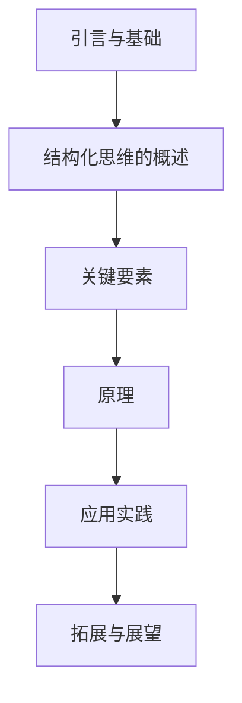

                 

# 《结构化思维：从混沌到清晰》

## 关键词：结构化思维、逻辑框架、信息整理、逻辑推理、项目实战

### 摘要：
在当今复杂多变的IT领域中，结构化思维作为一种高效的思考方式，正越来越受到重视。本文将系统地介绍结构化思维的概念、原理和应用实践，帮助读者从混沌的思维状态中提炼出清晰的逻辑框架，从而提高工作效率和解决问题的能力。

## 第一部分：引言与基础

### 1. 引言

#### 1.1 书籍背景与目标
本文旨在为IT从业者和爱好者提供一份关于结构化思维的系统指南，通过详细的理论讲解和实践案例，帮助读者理解并掌握结构化思维的核心方法和应用。

#### 1.2 结构化思维的重要性
结构化思维是提高问题解决能力和创新思维的重要工具，它能够帮助我们从繁杂的信息中提取关键点，形成逻辑清晰的解决方案。

#### 1.3 本书结构
本书分为四个部分，分别从基础理论、核心原理、应用实践和未来展望四个角度对结构化思维进行全面剖析。

### 2. 结构化思维的概述

#### 2.1 结构化思维的定义
结构化思维是一种通过逻辑框架、信息整理和逻辑推理来组织思维和解决问题的方法。

#### 2.2 结构化思维与传统思维的比较
结构化思维相较于传统思维，具有更强的系统性和逻辑性，能够更好地应对复杂问题。

#### 2.3 结构化思维的基本原则
结构化思维遵循确定目标、建立框架、信息整理和逻辑推理等基本原则。

### 3. 结构化思维的关键要素

#### 3.1 核心概念与联系
核心概念包括逻辑框架、信息整理和逻辑推理等，它们相互联系，共同构成了结构化思维的基础。

#### 3.2 架构与框架
架构与框架是结构化思维的核心，它能够帮助我们系统地分析问题和设计解决方案。

#### 3.3 技巧与工具
掌握一定的技巧和工具，如思维导图、流程图和伪代码等，可以大大提高结构化思维的应用效果。

## 第二部分：结构化思维的原理

### 4. 结构化思维的理论基础
#### 4.1 人类认知规律
人类的认知过程有其固有的规律，理解这些规律有助于我们更好地应用结构化思维。

#### 4.2 信息处理理论
信息处理理论为我们提供了分析问题和设计解决方案的理论基础。

#### 4.3 情感与思维的关系
情感对思维过程有重要影响，如何管理情感是结构化思维的一个重要方面。

### 5. 核心算法原理讲解
#### 5.1 逻辑推理算法
逻辑推理算法是结构化思维的核心，本文将使用伪代码详细阐述其原理。

#### 5.2 决策算法
决策算法在结构化思维中扮演重要角色，本文将介绍其基本原理。

#### 5.3 模糊推理算法
模糊推理算法在处理不确定性和模糊信息时具有优势，本文将简要介绍其原理。

### 6. 数学模型与数学公式
#### 6.1 结构化思维中的数学模型
数学模型在结构化思维中具有重要的应用价值，本文将介绍几种常用的数学模型。

#### 6.2 数学公式的应用
本文将通过具体案例说明数学公式在结构化思维中的应用。

#### 6.3 案例分析
本文将结合实际案例，分析如何运用结构化思维解决问题。

### 7. 情感与结构化思维
#### 7.1 情感在思维中的作用
情感在思维过程中起着重要作用，本文将探讨情感如何影响思维过程。

#### 7.2 情感管理
情感管理是结构化思维的一个重要方面，本文将介绍几种情感管理的方法。

#### 7.3 情感与结构化思维的平衡
如何平衡情感和结构化思维，本文将给出一些实用的建议。

## 第三部分：结构化思维的应用实践

### 8. 项目实战
#### 8.1 实践背景与目标
本文将结合一个具体的项目案例，介绍如何应用结构化思维进行项目实施。

#### 8.2 项目实施步骤
本文将详细阐述项目实施的具体步骤。

#### 8.3 代码实现与解读
本文将给出项目的源代码实现，并进行详细解读。

### 9. 环境搭建与工具配置
#### 9.1 开发环境搭建
本文将介绍如何搭建开发环境。

#### 9.2 常用工具与软件
本文将介绍一些常用的工具和软件。

#### 9.3 代码管理与版本控制
本文将介绍代码管理和版本控制的方法。

### 10. 源代码详细实现与代码解读
#### 10.1 代码结构与模块划分
本文将详细阐述代码结构和模块划分。

#### 10.2 关键函数与类的设计
本文将介绍关键函数和类的设计。

#### 10.3 代码实现细节分析
本文将分析代码实现的细节。

### 11. 代码解读与分析
#### 11.1 代码性能分析
本文将分析代码的性能。

#### 11.2 优化策略与改进
本文将介绍优化策略和改进方法。

#### 11.3 实际应用案例
本文将结合实际案例，分析代码的应用效果。

## 第四部分：拓展与展望

### 12. 结构化思维的未来发展趋势
#### 12.1 技术演进方向
本文将探讨结构化思维技术的未来发展趋势。

#### 12.2 行业应用展望
本文将分析结构化思维在各个行业的应用前景。

#### 12.3 面临的挑战与机遇
本文将探讨结构化思维面临的挑战和机遇。

### 13. 结论与启示
#### 13.1 书籍总结
本文将总结本书的核心内容和关键观点。

#### 13.2 对读者的建议
本文将给出对读者的建议。

#### 13.3 未来的研究方向
本文将探讨未来的研究方向。

## 附录

### 附录 A：参考文献
本文将列出参考文献，供读者进一步阅读。

### 附录 B：常用工具与技术介绍
本文将介绍一些常用的工具和技术，供读者参考。

### Mermaid 流程图

