                 

# 编程语言的发展脉络与趋势

## 关键词
- 编程语言历史
- 现代编程语言特性
- 编程语言发展趋势
- 开发工具与生态系统
- 学习与进阶
- 国际化与标准化

## 摘要
编程语言是计算机科学与技术领域的重要组成部分，它们的发展和演进推动了整个计算机行业的进步。本文将详细探讨编程语言的发展脉络，从历史回顾到现代语言的特性，再到未来趋势，旨在帮助读者全面了解编程语言的现状与发展方向。此外，本文还将探讨编程语言的学习方法、生态系统以及国际化与标准化问题，为编程学习者提供实用的指导和参考。

## 第1章 引言

### 1.1 编程语言的重要性

编程语言是人与计算机之间沟通的桥梁，是计算机科学的基础。通过编程语言，程序员可以编写指令，让计算机执行各种任务，从而实现自动化、智能化和复杂计算。从早期的机器语言到现代的高级编程语言，编程语言的演变不仅提升了开发效率，也拓展了计算机应用的领域。

编程语言的重要性体现在以下几个方面：

1. **提升开发效率**：编程语言提供了抽象层，让程序员能够以更高效的方式编写代码。高级编程语言通常具有丰富的库和框架，可以快速实现复杂的业务逻辑。
2. **降低开发门槛**：编程语言的普及使得更多非专业技术人员能够入门编程，推动了技术的普及和创新。
3. **扩展计算机应用**：编程语言的发展促进了计算机在不同领域的应用，从科学计算到商业数据处理，从操作系统到人工智能。

### 1.2 编程语言的分类

根据不同的分类标准，编程语言可以有不同的分类方式。以下是一些常见的分类方法：

1. **按用途分类**：系统编程语言、应用程序编程语言、脚本语言、专用编程语言等。
2. **按范式分类**：过程式编程语言、面向对象编程语言、函数式编程语言、逻辑编程语言等。
3. **按数据模型分类**：面向过程编程语言、面向对象编程语言、函数式编程语言、逻辑编程语言等。
4. **按执行方式分类**：编译型语言、解释型语言、即时编译语言等。

### 1.3 本书的目标与结构

本书旨在系统性地介绍编程语言的发展脉络，分析现代编程语言的特性，探讨编程语言的发展趋势，并提供学习与进阶的方法。具体章节安排如下：

- **第2章**：回顾编程语言的历史，从第一代编程语言到现代语言的演变。
- **第3章**：介绍现代编程语言的核心特性，包括面向对象、函数式、脚本和逻辑编程。
- **第4章**：分析编程语言的发展趋势，探讨自动化、智能化、云原生编程等方向。
- **第5章**：讨论编程语言的选择与适用场景，包括前端、后端、移动开发、数据科学等领域。
- **第6章**：介绍开发工具和生态系统，包括IDE、VCS、包管理器等。
- **第7章**：探讨编程语言的学习与进阶方法，包括基础知识、实践项目、跨语言学习和跟进最新趋势。
- **第8章**：展望编程语言的未来，探讨新编程语言的出现、编程范式的融合、编程语言与人工智能的结合等。
- **第9章**：讨论编程语言的标准化与国际化问题，介绍相关标准和解决方案。

## 第2章 编程语言的历史回顾

### 2.1 第一代编程语言

第一代编程语言，也称为机器语言（Machine Language）和汇编语言（Assembly Language），是直接用计算机硬件指令编写的语言。这些语言与计算机的硬件紧密相关，效率高但可读性差，且依赖于具体的计算机型号。

#### 2.1.1 机器语言

机器语言由二进制指令组成，每条指令对应计算机硬件的一组操作。例如，加法指令 `0100 0101` 表示将寄存器A和B中的值相加，并将结果存储在寄存器C中。机器语言具有执行效率高、占用内存小等优点，但编写和阅读难度大。

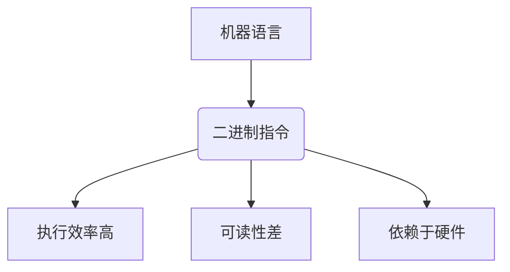

#### 2.1.2 汇编语言

汇编语言是对机器语言的符号表示，使用助记符（mnemonics）代替二进制指令。例如，加法指令 `ADD AB` 表示将寄存器A和B中的值相加。汇编语言的可读性有所提高，但仍然需要了解底层硬件操作。

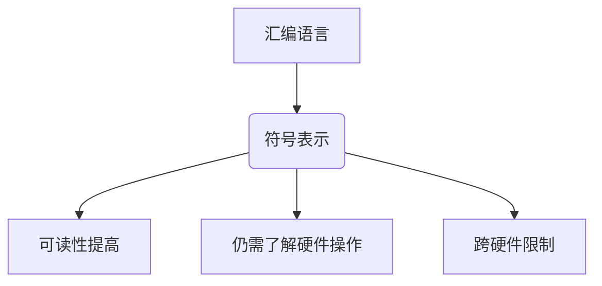

### 2.2 第二代编程语言

第二代编程语言，如FORTRAN和COBOL，是早期的通用高级编程语言，旨在提高编程效率和可维护性。

#### 2.2.1 高级符号语言的引入

FORTRAN（1957年）是由IBM开发的第一个用于科学计算的高级编程语言。它引入了数据类型、变量、控制结构等概念，大大提高了编程效率。

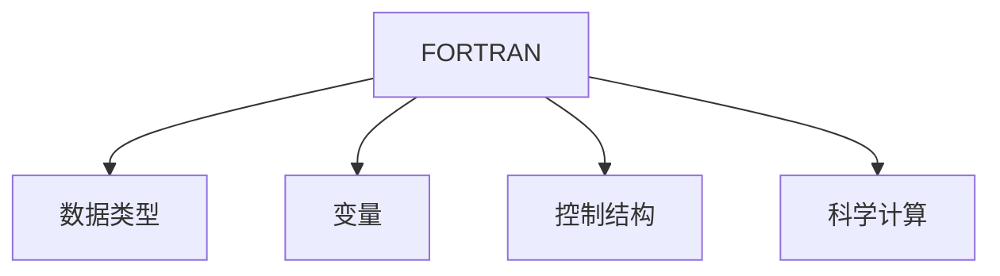

COBOL（1959年）是用于商业数据处理的高级编程语言。它强调数据的处理和报告，具有丰富的数据类型和语句，非常适合企业级应用。

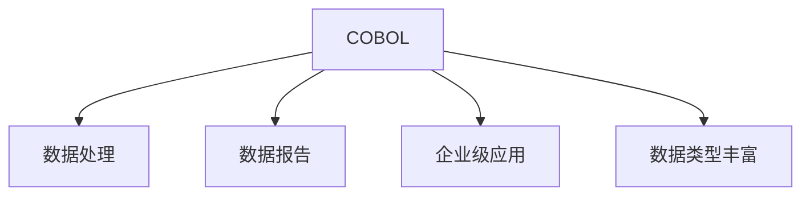

### 2.2.2 FORTRAN的发展

FORTRAN的发展历程是计算机科学的一个重要里程碑。从最初的FORTRAN I到后来的FORTRAN IV，语言不断演进，增加了数组、子程序等特性，成为科学计算领域的标准语言。

#### 2.2.3 COBOL的影响

COBOL的普及标志着高级编程语言在企业应用中的重要性。它的语法和结构使得程序员能够更高效地处理商业逻辑和数据，推动了企业信息化的发展。

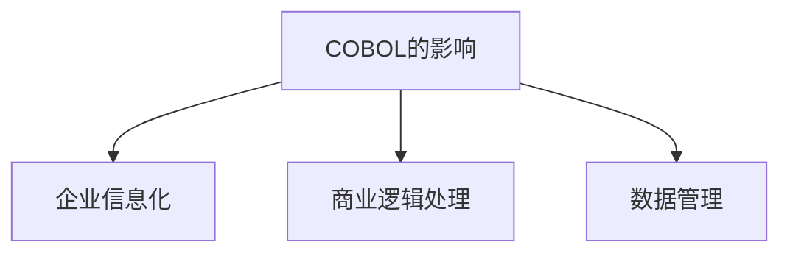

### 2.3 第三代编程语言

第三代编程语言，如C和Pascal，是结构化编程的代表，注重程序的可读性和可维护性。

#### 2.3.1 结构化编程的概念

结构化编程提倡使用顺序、选择和循环等控制结构来组织程序，避免使用goto语句，提高程序的可读性和可维护性。

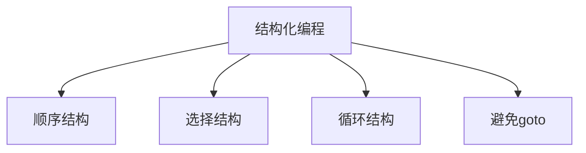

#### 2.3.2 C语言的基础

C语言（1972年）是第三代编程语言的代表，广泛应用于操作系统、嵌入式系统和高性能计算。它具有高效的执行效率和丰富的库函数，是学习编程语言的重要基础。

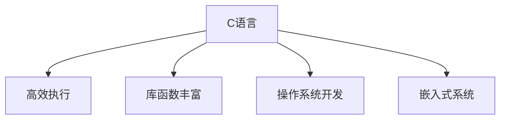

#### 2.3.3 Pascal的兴起

Pascal（1970年）是由瑞士计算机科学家尼克尔·沃斯（Niklaus Wirth）开发的编程语言，旨在教学和算法研究。它以其简洁的语法和强大的类型系统而著称，对后来的编程语言产生了深远的影响。

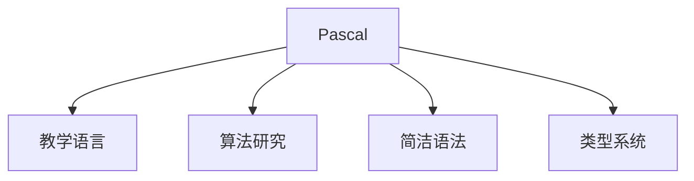

### 2.4 第四代编程语言

第四代编程语言，如SQL和Prolog，是面向问题的编程语言，主要用于数据库管理和人工智能领域。

#### 2.4.1 面向对象编程的崛起

面向对象编程（Object-Oriented Programming，OOP）是第四代编程语言的核心特点。它通过类和对象的概念，实现了数据的封装、继承和多态，提高了程序的可复用性和可维护性。

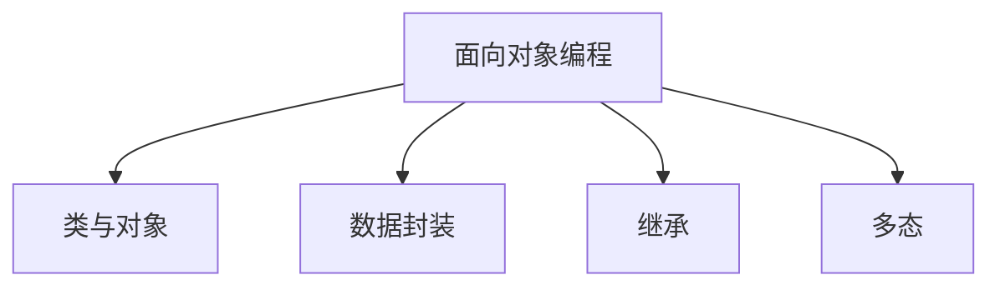

#### 2.4.1.1 C++和Java

C++（1983年）和Java（1995年）是代表性的面向对象编程语言。C++具有高性能和灵活性，广泛应用于系统编程和嵌入式系统。Java则强调安全性、跨平台和中间代码执行，是互联网时代的重要编程语言。

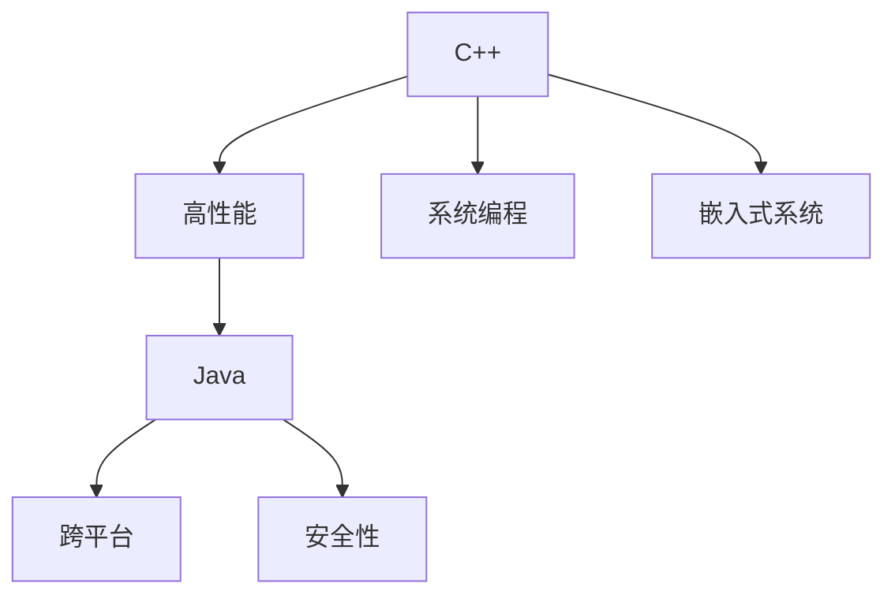

## 第3章 现代编程语言的核心特性

### 3.1 面向对象编程

面向对象编程（OOP）是一种编程范式，通过类和对象的概念来组织代码。它的核心概念包括：

#### 3.1.1 类与对象

类是一种抽象的数据类型，定义了一组具有相同属性和行为的对象。对象是类的实例，通过构造函数创建。

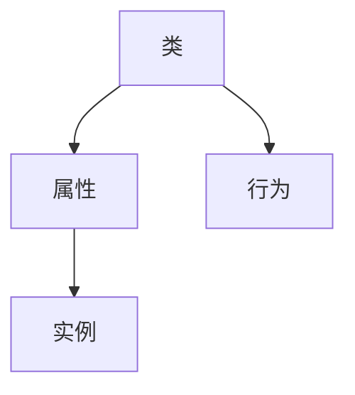

#### 3.1.2 继承与多态

继承是一种通过创建新类（子类）来扩展现有类（父类）的能力。多态允许对象以不同的方式响应相同的消息。

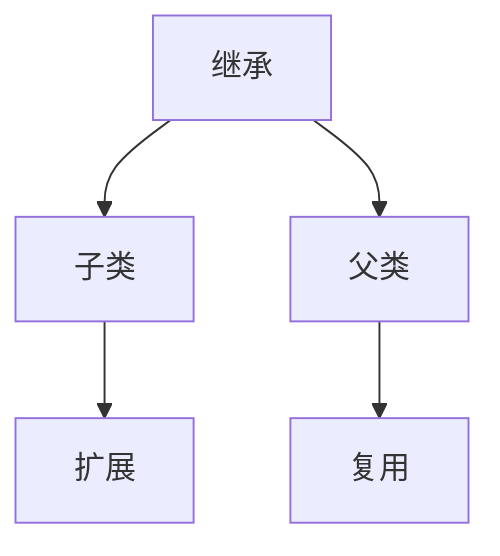

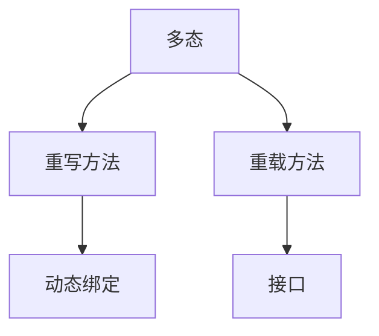

### 3.2 函数式编程

函数式编程（Functional Programming）是一种基于数学函数的编程范式，强调表达式的值，而非状态的变化。

#### 3.2.1 函数作为第一类公民

函数在函数式编程中具有核心地位，可以作为参数传递、返回值和存储在变量中。

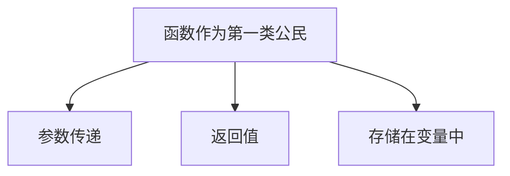

#### 3.2.2 高阶函数

高阶函数是接受函数作为参数或返回函数的函数。它们是函数式编程的重要工具。

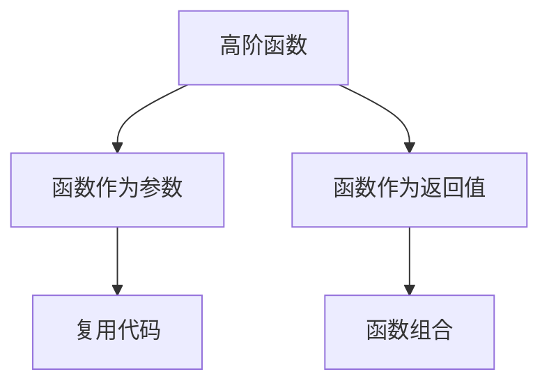

### 3.3 脚本化编程

脚本化编程是一种使用脚本语言编写的编程方式，通常用于自动化任务和快速原型设计。

#### 3.3.1 脚本语言的特点

脚本语言通常具有简洁的语法、丰富的库和工具，易于学习和使用。

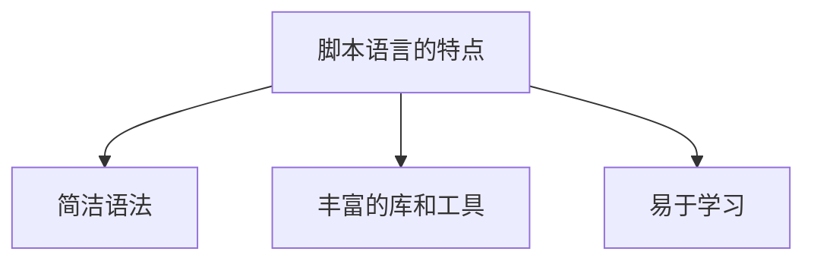

#### 3.3.1.1 Python脚本编程

Python是一种广泛使用的脚本语言，具有简洁的语法和丰富的库，适用于各种应用场景。

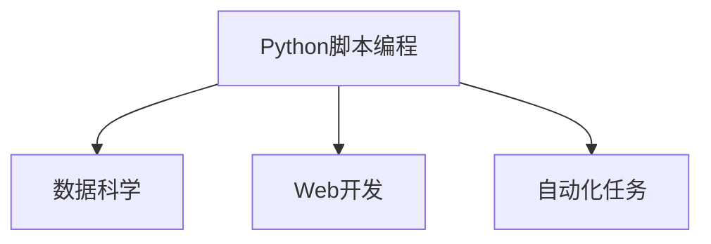

#### 3.3.1.2 JavaScript的脚本应用

JavaScript是一种用于Web开发的脚本语言，具有强大的DOM操作和事件处理能力。

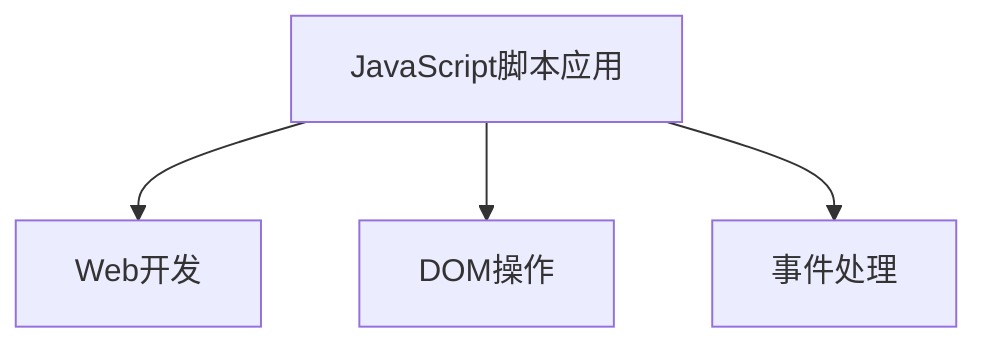

### 3.4 逻辑编程

逻辑编程是一种基于逻辑推理的编程范式，适用于问题求解和知识表示。

#### 3.4.1 逻辑编程的基本原理

逻辑编程使用逻辑公式表示问题和解决方案，通过逻辑推理来求解问题。

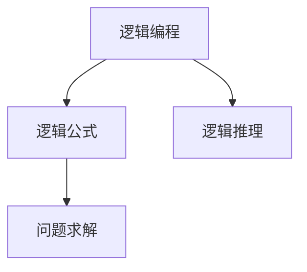

#### 3.4.1.1 基本逻辑运算符

逻辑编程中使用的基本逻辑运算符包括与（AND）、或（OR）、非（NOT）等。

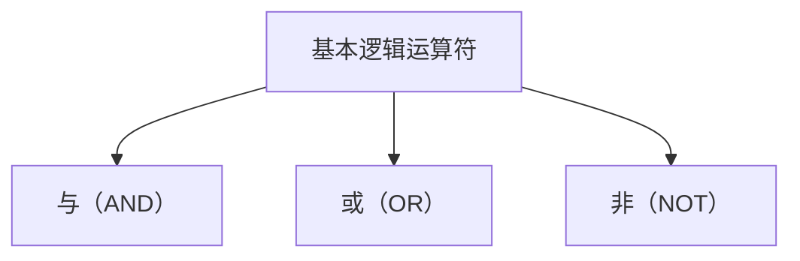

#### 3.4.1.2 逻辑推理与证明

逻辑编程通过逻辑推理来解决问题，包括推理规则、证明方法等。

```mermaid
graph TD
A[逻辑推理与证明] --> B[推理规则]
A --> C[证明方法]
B --> D[问题求解]
```

## 第4章 编程语言的发展趋势

### 4.1 自动化与智能化

自动化与智能化是编程语言发展的重要趋势，旨在提高开发效率和代码质量。

#### 4.1.1 编程语言的自动化工具

自动化工具如自动化测试、自动化部署等，可以大大提高开发效率。

```mermaid
graph TD
A[编程语言的自动化工具] --> B[自动化测试]
A --> C[自动化部署]
B --> D[提高开发效率]
C --> E[代码质量]
```

#### 4.1.1.1 自动化测试

自动化测试使用工具自动执行测试用例，检测代码的缺陷和错误。

```mermaid
graph TD
A[自动化测试] --> B[测试用例自动化]
A --> C[缺陷检测]
B --> D[提高测试覆盖率]
C --> E[降低测试成本]
```

#### 4.1.1.2 自动化部署

自动化部署使用工具自动部署应用程序，提高部署效率和可靠性。

```mermaid
graph TD
A[自动化部署] --> B[自动构建]
A --> C[自动化部署]
B --> D[提高部署效率]
C --> E[降低部署风险]
```

### 4.2 原生云支持

原生云支持是指编程语言和工具能够充分利用云平台的优势，提供高效、可靠的云计算服务。

#### 4.2.1 云原生架构

云原生架构是一种利用云计算平台的特性，构建灵活、可扩展、高可用性的应用程序架构。

```mermaid
graph TD
A[云原生架构] --> B[容器化]
A --> C[微服务]
B --> D[自动化运维]
C --> E[高可用性]
```

#### 4.2.1.1 Kubernetes

Kubernetes是一种开源的容器编排平台，用于自动化容器的部署、扩展和管理。

```mermaid
graph TD
A[Kubernetes] --> B[容器编排]
A --> C[自动化部署]
B --> D[容器管理]
C --> E[服务发现]
```

#### 4.2.1.2 容器化与虚拟化

容器化和虚拟化技术可以提供轻量级、高效的应用程序部署和运行环境。

```mermaid
graph TD
A[容器化] --> B[轻量级]
A --> C[高效性]
B --> D[隔离性]
C --> E[可移植性]
```

```mermaid
graph TD
A[虚拟化] --> B[硬件虚拟化]
A --> C[操作系统虚拟化]
B --> D[资源隔离]
C --> E[高性能]
```

### 4.3 多范式集成

多范式集成是指将不同的编程范式集成到同一编程语言中，提供更丰富的编程能力和灵活性。

#### 4.3.1 多范式编程的优势

多范式编程可以充分利用不同范式的优势，提高编程效率和代码质量。

```mermaid
graph TD
A[多范式编程的优势] --> B[面向对象]
A --> C[函数式编程]
B --> D[代码复用]
C --> E[可维护性]
```

#### 4.3.1.1 混合编程模型

混合编程模型是指在同一编程语言中结合不同的编程范式，提供灵活的编程风格。

```mermaid
graph TD
A[混合编程模型] --> B[面向对象与函数式编程]
A --> C[过程式与逻辑编程]
B --> D[代码复用]
C --> E[可维护性]
```

#### 4.3.1.2 范式间的互补性

不同的编程范式具有互补性，可以相互补充，提高编程能力和效率。

```mermaid
graph TD
A[范式间的互补性] --> B[过程式编程]
A --> C[面向对象编程]
B --> D[函数式编程]
C --> E[逻辑编程]
```

### 4.4 开发体验优化

开发体验优化是指通过改进开发工具、语言特性和生态系统，提高开发效率和代码质量。

#### 4.4.1 编译优化

编译优化是指通过改进编译器的算法，提高编译速度和代码性能。

```mermaid
graph TD
A[编译优化] --> B[静态编译]
A --> C[动态编译]
B --> D[编译速度]
C --> E[代码性能]
```

#### 4.4.1.1 静态编译与动态编译

静态编译是指在编译时将代码转换为机器码，动态编译是指在运行时将代码转换为机器码。

```mermaid
graph TD
A[静态编译] --> B[编译时转换]
A --> C[执行效率高]
B --> D[编译时间长]
```

```mermaid
graph TD
A[动态编译] --> B[运行时转换]
A --> C[灵活性高]
B --> D[执行效率低]
```

#### 4.4.1.2 优化算法与应用

优化算法包括循环展开、指令调度、数据缓存等，可以提高代码性能。

```mermaid
graph TD
A[优化算法与应用] --> B[循环展开]
A --> C[指令调度]
A --> D[数据缓存]
B --> E[代码性能提升]
C --> F[执行效率]
D --> G[内存访问]
```

## 第5章 编程语言的选择与适用场景

### 5.1 前端开发

前端开发是指使用编程语言和工具构建Web应用的客户端部分，主要包括HTML、CSS和JavaScript。

#### 5.1.1 前端语言的选择

前端语言的选择取决于项目需求和个人技能。常见的语言包括HTML、CSS和JavaScript。

```mermaid
graph TD
A[前端语言的选择] --> B[HTML]
A --> C[CSS]
A --> D[JavaScript]
B --> E[结构定义]
C --> F[样式定义]
D --> G[行为定义]
```

#### 5.1.1.1 HTML与CSS

HTML用于定义Web页面的结构，CSS用于定义页面的样式。

```mermaid
graph TD
A[HTML与CSS] --> B[结构定义]
A --> C[样式定义]
B --> D[Web页面]
C --> E[样式表]
```

#### 5.1.1.2 JavaScript的框架与库

JavaScript框架和库可以提供高效、可靠的开发工具和组件，常见的有React、Vue和Angular。

```mermaid
graph TD
A[JavaScript框架与库] --> B[React]
A --> C[Vue]
A --> D[Angular]
B --> E[组件化]
C --> F[数据绑定]
D --> G[路由管理]
```

### 5.2 后端开发

后端开发是指使用编程语言和工具构建Web应用的

