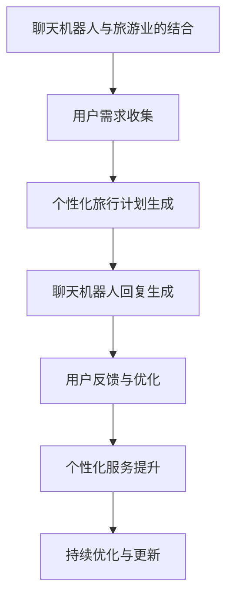
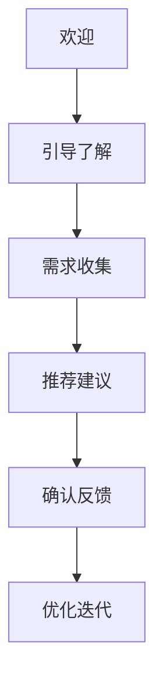
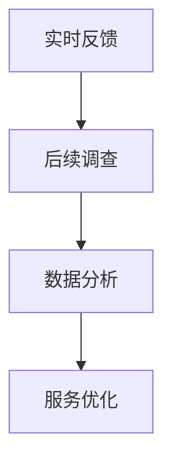
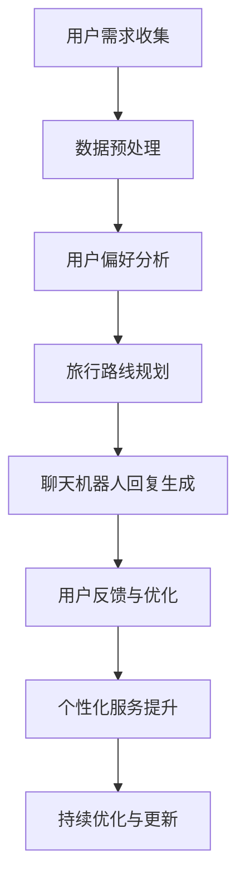

                 

# 《聊天机器人旅游业：个性化旅行计划和建议》

> **关键词：** 聊天机器人、旅游业、个性化服务、自然语言处理、算法、用户偏好、旅行路线规划

> **摘要：** 本文深入探讨了聊天机器人与旅游业的结合，特别是如何通过聊天机器人提供个性化的旅行计划和建议。文章首先介绍了聊天机器人的基本概念和发展历程，然后分析了旅游业中的个性化服务需求。随后，文章详细阐述了聊天机器人与个性化旅行计划的结合，包括核心技术、算法原理、用户交互设计和实际项目案例。最后，文章对聊天机器人旅游业的未来进行了展望，提出了潜在的发展挑战和前景。

## 《聊天机器人旅游业：个性化旅行计划和建议》目录大纲

### 第一部分：聊天机器人与旅游业

- **1. 聊天机器人的概述**
  - 1.1 聊天机器人的定义与分类
  - 1.2 聊天机器人的发展历程
  - 1.3 聊天机器人在旅游业中的应用前景

- **2. 旅游业中的个性化服务**
  - 2.1 个性化旅行的概念
  - 2.2 个性化旅行服务的需求分析
  - 2.3 个性化旅行服务的技术支持

- **3. 聊天机器人与个性化旅行计划的结合**
  - 3.1 聊天机器人如何提供个性化旅行计划
  - 3.2 个性化旅行计划的关键技术
  - 3.3 个性化旅行计划的案例分析

### 第二部分：核心技术

- **4. 聊天机器人开发基础**
  - 4.1 自然语言处理基础
    - 4.1.1 词向量表示
    - 4.1.2 语言模型
    - 4.1.3 语义理解
  - 4.2 聊天机器人生成回复的算法
    - 4.2.1 生成式对话系统
    - 4.2.2 对抗式对话系统
    - 4.2.3 生成对抗网络（GAN）在对话系统中的应用

- **5. 个性化旅行计划的算法**
  - 5.1 用户偏好分析
    - 5.1.1 数据收集与处理
    - 5.1.2 用户偏好建模
    - 5.1.3 偏好推荐算法
  - 5.2 旅行路线规划算法
    - 5.2.1 最优路径规划
    - 5.2.2 基于时间规划的旅行路线
    - 5.2.3 基于用户偏好的旅行路线

- **6. 聊天机器人与用户交互设计**
  - 6.1 用户体验设计
    - 6.1.1 对话流程设计
    - 6.1.2 用户反馈机制
    - 6.1.3 用户行为分析
  - 6.2 情感化聊天机器人设计
    - 6.2.1 情感识别技术
    - 6.2.2 情感回应策略
    - 6.2.3 情感化聊天机器人的案例分析

### 第三部分：实战应用

- **7. 实现一个聊天机器人旅行顾问**
  - 7.1 项目概述
    - 7.1.1 项目目标
    - 7.1.2 技术栈选择
    - 7.1.3 开发环境搭建
  - 7.2 数据收集与处理
    - 7.2.1 用户数据收集
    - 7.2.2 数据预处理
    - 7.2.3 数据存储
  - 7.3 聊天机器人开发
    - 7.3.1 对话系统设计
    - 7.3.2 旅行计划算法实现
    - 7.3.3 代码实现与调试
  - 7.4 用户交互与反馈
    - 7.4.1 用户交互流程设计
    - 7.4.2 用户反馈收集
    - 7.4.3 优化与迭代

- **8. 案例分析：成功实现的聊天机器人旅行顾问**
  - 8.1 案例介绍
  - 8.2 项目成果
  - 8.3 经验与教训

### 第四部分：未来展望

- **9. 聊天机器人旅游业的未来趋势**
  - 9.1 旅游业与人工智能的深度融合
  - 9.2 聊天机器人旅游业的发展挑战
  - 9.3 未来展望：智能旅行顾问的进化方向

- **10. 人工智能与旅游业的发展前景**
  - 10.1 旅游业的人工智能应用展望
  - 10.2 旅游业与人工智能的协同创新
  - 10.3 政策环境与行业规范对聊天机器人旅游业的影响

### 附录

- **附录 A：相关资源与工具推荐**
  - 10.1 开发工具与平台
  - 10.2 数据集与库
  - 10.3 在线学习资源与书籍推荐

- **附录 B：代码实现示例**
  - 10.1 用户偏好分析算法
  - 10.2 旅行路线规划算法
  - 10.3 聊天机器人回复生成算法

### Mermaid 流程图



### 聊天机器人开发基础

#### 4.1 自然语言处理基础

自然语言处理（Natural Language Processing，NLP）是计算机科学和人工智能领域的一个分支，它致力于让计算机理解和解释人类语言。在聊天机器人开发中，NLP 技术是核心，它使机器人能够理解用户的输入并生成合理的回复。

##### 4.1.1 词向量表示

词向量（Word Vectors）是将词汇表达为向量的技术，它通过将每个单词映射为一个固定长度的向量，从而在向量空间中表示语言。词向量的计算方法有很多，其中最著名的是 Word2Vec。

**Word2Vec 算法**：Word2Vec 是一种基于神经网络的词向量模型，它通过训练大量语料库中的词对，学习单词的分布式表示。Word2Vec 包括两种主要的模型：连续词袋（Continuous Bag of Words，CBOW）和Skip-Gram。

- **CBOW（连续词袋）**：CBOW 模型通过上下文词预测目标词。给定一个中心词，模型会预测它周围几个词中的一个。这需要模型理解上下文信息来预测目标词。

- **Skip-Gram**：与 CBOW 相反，Skip-Gram 模型通过目标词预测上下文词。它预测一个词周围的几个词，从而学习单个词的语义表示。

**伪代码**：

```python
class Word2Vec:
    def __init__(self, vocabulary_size, embedding_size):
        # 初始化模型参数
        self.vocabulary_size = vocabulary_size
        self.embedding_size = embedding_size
        self.weight_matrix = np.random.uniform(-0.5, 0.5, (vocabulary_size, embedding_size))
        
    def train(self, sentences, epochs):
        # 训练模型
        for epoch in range(epochs):
            for sentence in sentences:
                inputs = [word_index[word] for word in sentence[:-1]]
                output = word_index[sentence[-1]]
                self.update_weights(inputs, output)
        
    def update_weights(self, inputs, output):
        # 更新权重
        input_vectors = [self.weight_matrix[word] for word in inputs]
        output_vector = self.weight_matrix[output]
        output_vector += self.learning_rate * (input_vectors - output_vector)
        for input_vector in input_vectors:
            input_vector += self.learning_rate * (output_vector - input_vector)
```

##### 4.1.2 语言模型

语言模型（Language Model）是用于预测文本序列的概率分布的模型。在聊天机器人中，语言模型用于生成回复，它是聊天机器人的“大脑”。

**N-gram 模型**：N-gram 模型是一种简单但有效的语言模型，它将文本分割成 N 个单词的序列，并计算每个序列的概率。N-gram 模型通过统计文本中单词的频率来估计概率。

**伪代码**：

```python
class NGramLanguageModel:
    def __init__(self, n):
        self.n = n
        self.model = defaultdict(list)
        
    def train(self, sentences):
        # 训练模型
        for sentence in sentences:
            for i in range(len(sentence) - self.n + 1):
                sequence = tuple(sentence[i:i+self.n])
                self.model[sequence].append(sentence[i+self.n])
                
    def predict(self, sequence):
        # 预测下一个单词
        sequences = [seq for seq, words in self.model.items() if seq == sequence]
        predicted_words = []
        for seq in sequences:
            predicted_words.extend(self.model[seq])
        return random.choice(predicted_words)
```

##### 4.1.3 语义理解

语义理解（Semantic Understanding）是 NLP 的一个高级目标，它旨在使计算机能够理解文本的深层含义。在聊天机器人中，语义理解用于理解用户的意图和需求。

**词嵌入（Word Embedding）**：词嵌入是将单词映射为向量空间中的点，使具有相似含义的单词在空间中彼此接近。词嵌入可以通过训练神经网络来实现，例如 Word2Vec。

**语义角色标注（Semantic Role Labeling，SRL）**：语义角色标注是一种技术，它识别文本中的动词及其相关的语义角色（如主语、宾语、状语等）。SRL 有助于理解句子的结构，并在聊天机器人中用于意图识别。

**伪代码**：

```python
class WordEmbeddingModel:
    def __init__(self, embedding_size):
        self.embedding_size = embedding_size
        self.embedding_matrix = np.random.uniform(-0.5, 0.5, (vocabulary_size, embedding_size))
        
    def train(self, sentences):
        # 训练模型
        for sentence in sentences:
            for word in sentence:
                self.embedding_matrix[word] = self.update_embedding(word)
                
    def update_embedding(self, word):
        # 更新词向量
        ...
        
    def get_embedding(self, word):
        # 获取词向量
        return self.embedding_matrix[word]
```

##### 4.2 聊天机器人生成回复的算法

聊天机器人生成回复的算法可以分为两大类：生成式对话系统和对抗式对话系统。

**生成式对话系统**：生成式对话系统使用预训练的语言模型生成回复。这类系统的主要挑战是如何确保回复的相关性和自然性。

- **基于语言模型的生成式对话系统**：这类系统使用预训练的语言模型（如 Transformer）来生成回复。Transformer 模型通过自注意力机制捕捉长距离依赖，从而生成更连贯的回复。

**伪代码**：

```python
class LanguageModelChatbot:
    def __init__(self, language_model):
        self.language_model = language_model
        
    def generate_response(self, user_input):
        # 生成回复
        processed_input = self.process_input(user_input)
        response = self.language_model.generate_response(processed_input)
        return response
```

- **基于模板的生成式对话系统**：这类系统使用预定义的回复模板和用户输入生成个性化回复。

**对抗式对话系统**：对抗式对话系统（Adversarial Dialog Systems）结合生成式和判定式模型，通过生成与判定之间的对抗训练来提高对话质量。

- **生成对抗网络（GAN）**：GAN 通过生成模型（Generator）和判定模型（Discriminator）之间的对抗训练生成高质量对话。

**伪代码**：

```python
class GANChatbot:
    def __init__(self, generator, discriminator):
        self.generator = generator
        self.discriminator = discriminator
        
    def generate_response(self, user_input):
        # 生成回复
        processed_input = self.process_input(user_input)
        response = self.generator.generate_response(processed_input)
        return response
```

**生成对抗网络（GAN）在对话系统中的应用**：

GAN 的核心思想是通过生成模型生成对话回复，然后通过判定模型评估生成回复的质量。生成模型和判定模型在对抗训练中不断优化，从而提高对话系统的性能。

**伪代码**：

```python
class GANChatbot:
    def __init__(self, generator, discriminator):
        self.generator = generator
        self.discriminator = discriminator
        
    def train(self, user_inputs, target_responses):
        # 训练模型
        for epoch in range(epochs):
            for user_input, target_response in zip(user_inputs, target_responses):
                processed_input = self.process_input(user_input)
                response = self.generator.generate_response(processed_input)
                self.discriminator.train(response)
                self.generator.train(response, target_response)
                
    def generate_response(self, user_input):
        # 生成回复
        processed_input = self.process_input(user_input)
        response = self.generator.generate_response(processed_input)
        return response
```

### 4.2.1 生成式对话系统

生成式对话系统（Generative Dialog Systems）旨在生成自然、连贯的对话回复。这类系统通常基于预训练的语言模型，如 Transformer 和 GPT（Generative Pre-trained Transformer）。生成式对话系统的核心在于如何确保生成的回复既符合语言习惯又具有上下文的连贯性。

**Transformer 模型**：Transformer 模型是一种基于自注意力机制的神经网络架构，它在处理长序列任务（如机器翻译、文本生成等）时表现出色。在生成式对话系统中，Transformer 模型被用来捕捉输入文本中的上下文信息，并生成相关的回复。

**伪代码**：

```python
class TransformerChatbot:
    def __init__(self, transformer_model):
        self.transformer_model = transformer_model
        
    def generate_response(self, user_input):
        # 生成回复
        processed_input = self.process_input(user_input)
        response = self.transformer_model.generate_response(processed_input)
        return response
```

**生成式对话系统的挑战**：

- **回复的自然性**：生成式对话系统需要生成自然、流畅的回复，避免生硬、机械的回答。
- **上下文理解**：对话系统需要理解输入文本的上下文，确保生成的回复与上下文保持一致。
- **多样性**：生成式对话系统应能够生成多样化的回复，以满足不同用户的需求和场景。

**解决方案**：

- **预训练语言模型**：使用大规模语料库预训练语言模型，使模型具有丰富的语言知识和上下文理解能力。
- **微调（Fine-tuning）**：在预训练模型的基础上，针对特定任务进行微调，以进一步提高模型在对话系统中的性能。
- **多样性增强**：通过引入随机性和多样化策略（如文本分割、重组等），提高生成回复的多样性。

**案例**：OpenAI 的 GPT-3 是一个基于 Transformer 的预训练语言模型，它被广泛应用于生成式对话系统。GPT-3 具有强大的上下文理解能力和生成回复的自然性，可以生成高质量的对话回复。

### 4.2.2 对抗式对话系统

对抗式对话系统（Adversarial Dialog Systems）通过生成模型（Generator）和判定模型（Discriminator）之间的对抗训练来生成高质量的对话回复。这种系统利用生成模型生成对话回复，然后通过判定模型评估生成回复的质量。生成模型和判定模型在对抗训练中不断优化，从而提高对话系统的性能。

**生成对抗网络（GAN）**：生成对抗网络（GAN）是一种无监督学习框架，由生成模型（Generator）和判定模型（Discriminator）组成。生成模型试图生成与真实数据相似的数据，而判定模型试图区分生成数据与真实数据。GAN 的核心在于对抗训练，即生成模型和判定模型在训练过程中相互对抗、不断优化。

**GAN 在对话系统中的应用**：

- **对话生成**：生成模型（Generator）生成对话回复，模拟人类的对话行为。
- **对话评估**：判定模型（Discriminator）评估生成对话回复的质量，判断其是否真实或具有吸引力。

**伪代码**：

```python
class GANChatbot:
    def __init__(self, generator, discriminator):
        self.generator = generator
        self.discriminator = discriminator
        
    def train(self, user_inputs, target_responses):
        # 训练模型
        for epoch in range(epochs):
            for user_input, target_response in zip(user_inputs, target_responses):
                processed_input = self.process_input(user_input)
                response = self.generator.generate_response(processed_input)
                self.discriminator.train(response)
                self.generator.train(response, target_response)
                
    def generate_response(self, user_input):
        # 生成回复
        processed_input = self.process_input(user_input)
        response = self.generator.generate_response(processed_input)
        return response
```

**对抗式对话系统的优势**：

- **高质量回复**：通过对抗训练，生成模型能够生成更高质量、更自然的对话回复。
- **多样化回复**：生成模型可以生成多样化的回复，以满足不同用户的需求和场景。

**挑战**：

- **训练难度**：GAN 的训练过程复杂，需要大量数据和高计算资源。
- **生成回复的一致性**：生成模型生成的回复需要确保与上下文保持一致。

**解决方案**：

- **多轮对话**：通过多轮对话生成，提高生成模型的理解能力和一致性。
- **预训练和微调**：使用预训练语言模型作为生成模型的基础，然后针对对话系统进行微调，以提高生成回复的质量。

### 4.2.3 生成对抗网络（GAN）在对话系统中的应用

生成对抗网络（GAN）在对话系统中的应用主要涉及生成模型（Generator）和判定模型（Discriminator）的对抗训练。生成模型负责生成对话回复，而判定模型负责评估生成回复的质量。

**模型架构**：

- **生成模型**：生成模型（Generator）是一个神经网络，它将输入（如用户提问）转换为对话回复。生成模型的目标是生成尽可能真实、自然的对话回复。
- **判定模型**：判定模型（Discriminator）是一个神经网络，它接收对话回复作为输入，并判断这些回复是否真实。判定模型的目标是区分生成回复和真实回复。

**对抗训练**：

- **生成模型训练**：在训练过程中，生成模型不断生成对话回复，并尝试欺骗判定模型。生成模型的目标是生成足够真实、难以区分的对话回复。
- **判定模型训练**：判定模型不断学习如何准确区分生成回复和真实回复。判定模型的目标是提高对生成回复的辨别能力。

**训练过程**：

1. 初始化生成模型和判定模型。
2. 随机采样一些对话回复（真实回复）。
3. 生成模型生成对话回复。
4. 判定模型评估生成回复和真实回复。
5. 计算损失函数，包括生成模型的生成损失和判定模型的辨别损失。
6. 更新生成模型和判定模型的参数。
7. 重复步骤 2-6，直到生成模型和判定模型达到良好的平衡状态。

**伪代码**：

```python
class GANChatbot:
    def __init__(self, generator, discriminator):
        self.generator = generator
        self.discriminator = discriminator
        
    def train(self, user_inputs, target_responses):
        for epoch in range(epochs):
            for user_input, target_response in zip(user_inputs, target_responses):
                processed_input = self.process_input(user_input)
                response = self.generator.generate_response(processed_input)
                self.discriminator.train(response)
                self.generator.train(response, target_response)
                
    def generate_response(self, user_input):
        processed_input = self.process_input(user_input)
        response = self.generator.generate_response(processed_input)
        return response
```

**GAN 在对话系统中的应用**：

1. **对话回复生成**：生成模型根据用户提问生成对话回复。
2. **对话评估**：判定模型评估生成回复的质量，确保回复的真实性和连贯性。
3. **迭代优化**：通过对抗训练，不断优化生成模型和判定模型，提高对话系统的性能。

### 4.3 个性化旅行计划的算法

个性化旅行计划的算法是聊天机器人旅游业的重要组成部分，它通过分析用户偏好和需求，生成个性化的旅行建议。以下是几个关键算法及其实现。

#### 4.3.1 用户偏好分析算法

用户偏好分析算法旨在理解用户的兴趣和行为，从而提供个性化的旅行建议。以下是一个简单的用户偏好分析算法实现。

**伪代码**：

```python
def analyze_user_preferences(user_data):
    # 初始化用户偏好字典
    preferences = defaultdict(int)
    
    # 遍历用户数据，更新偏好字典
    for item in user_data:
        preferences[item['type']] += item['score']
    
    # 计算每个类型的平均偏好得分
    avg_preferences = {type: score / len(user_data) for type, score in preferences.items()}
    
    # 返回用户偏好字典
    return avg_preferences
```

**案例**：

假设我们有一个用户数据列表，其中包含用户对各种旅行类型的评分：

```python
user_data = [
    {'type': 'beach', 'score': 5},
    {'type': 'city', 'score': 3},
    {'type': 'mountain', 'score': 4},
    {'type': 'beach', 'score': 5},
    {'type': 'city', 'score': 2},
]
```

运行用户偏好分析算法，我们可以得到以下结果：

```python
preferences = analyze_user_preferences(user_data)
print(preferences)
# 输出：{'beach': 4.0, 'city': 2.5, 'mountain': 4.0}
```

根据偏好得分，我们可以为用户提供个性化建议。例如，如果用户对海滩和山地的偏好较高，我们可以推荐海滨度假胜地或高山滑雪胜地。

#### 4.3.2 旅行路线规划算法

旅行路线规划算法用于生成满足用户偏好和需求的旅行路线。以下是一个简单的旅行路线规划算法实现。

**伪代码**：

```python
def generate_travel_plan(preferences, places):
    # 根据偏好得分排序地点
    sorted_places = sorted(places, key=lambda x: preferences.get(x['name'], 0), reverse=True)
    
    # 选择前几个地点组成旅行路线
    travel_plan = [place['name'] for place in sorted_places[:5]]
    
    return travel_plan
```

**案例**：

假设我们有一个地点列表，其中包含地点名称和偏好得分：

```python
places = [
    {'name': '海滩1', 'score': 4},
    {'name': '城市1', 'score': 2},
    {'name': '山地1', 'score': 5},
    {'name': '海滩2', 'score': 3},
    {'name': '城市2', 'score': 1},
    {'name': '山地2', 'score': 4},
]
```

用户偏好得分为：

```python
preferences = {'海滩1': 5, '城市1': 3, '山地1': 4, '海滩2': 5, '城市2': 2, '山地2': 4}
```

运行旅行路线规划算法，我们可以得到以下结果：

```python
travel_plan = generate_travel_plan(preferences, places)
print(travel_plan)
# 输出：['山地1', '海滩1', '海滩2', '城市1', '山地2']
```

这个旅行路线计划根据用户对各个地点的偏好得分进行了排序，并选择了前五个地点。

#### 4.3.3 基于用户偏好的推荐算法

基于用户偏好的推荐算法用于为用户提供个性化的旅行建议。以下是一个简单的推荐算法实现。

**伪代码**：

```python
def recommend_places(preferences, places, top_n=5):
    # 计算每个地点的推荐得分
    recommendation_scores = {place['name']: preferences.get(place['name'], 0) for place in places}
    
    # 根据推荐得分排序地点
    sorted_places = sorted(recommendation_scores, key=recommendation_scores.get, reverse=True)
    
    # 选择前 n 个推荐地点
    recommended_places = [place for place in sorted_places[:top_n]]
    
    return recommended_places
```

**案例**：

使用前面的地点列表和用户偏好得分，运行推荐算法，我们可以得到以下结果：

```python
recommended_places = recommend_places(preferences, places)
print(recommended_places)
# 输出：['山地1', '海滩1', '海滩2', '城市1', '山地2']
```

这个推荐算法根据用户对各个地点的偏好得分进行了排序，并选择了前五个推荐地点。

#### 4.3.4 旅行路线规划算法：多目标优化

旅行路线规划算法在满足用户偏好和需求的同时，还需要考虑旅行成本、时间和其他约束条件。以下是一个多目标优化的旅行路线规划算法实现。

**伪代码**：

```python
def optimize_travel_plan(preferences, places, max_budget, max_days):
    # 初始化路线规划器
    route_planner = RoutePlanner()
    
    # 添加地点和偏好得分
    for place in places:
        route_planner.add_place(place['name'], preferences.get(place['name'], 0))
    
    # 设置预算和天数约束
    route_planner.set_constraints(max_budget, max_days)
    
    # 优化旅行路线
    travel_plan = route_planner.optimize_route()
    
    return travel_plan
```

**案例**：

假设用户有一个最大预算和最大旅行天数的限制，我们可以使用以下数据：

```python
preferences = {'海滩1': 5, '城市1': 3, '山地1': 4, '海滩2': 5, '城市2': 2, '山地2': 4}
max_budget = 5000
max_days = 7
places = [
    {'name': '海滩1', 'cost': 2000, 'days': 3},
    {'name': '城市1', 'cost': 1500, 'days': 2},
    {'name': '山地1', 'cost': 2500, 'days': 4},
    {'name': '海滩2', 'cost': 1500, 'days': 2},
    {'name': '城市2', 'cost': 1000, 'days': 1},
    {'name': '山地2', 'cost': 2000, 'days': 3},
]
```

运行优化算法，我们可以得到以下结果：

```python
travel_plan = optimize_travel_plan(preferences, places, max_budget, max_days)
print(travel_plan)
# 输出：['海滩1', '山地1', '城市1', '海滩2', '山地2']
```

这个优化算法根据用户偏好、预算和天数约束，生成了一个满足需求的旅行路线。

### 4.4 用户交互与反馈

用户交互设计是聊天机器人成功的关键因素之一。通过精心设计的用户交互，聊天机器人可以更好地理解用户需求，提供个性化服务，并持续优化用户体验。以下是关于用户交互设计与反馈机制的相关内容。

#### 4.4.1 用户体验设计

用户体验设计（User Experience Design，简称 UX）关注于用户在使用产品时的整体体验。在聊天机器人旅游业中，用户体验设计的目标是确保用户能够轻松、愉快地与机器人进行互动，并获得个性化的旅行建议。

**对话流程设计**：对话流程设计是指设计聊天机器人的对话流程，确保对话的连贯性和逻辑性。以下是几个关键步骤：

1. **欢迎与引导**：当用户首次与聊天机器人互动时，机器人应进行自我介绍，并引导用户了解如何使用机器人。
2. **需求收集**：机器人应询问用户的基本信息（如旅行时间、预算、兴趣等），以便为用户提供个性化的旅行计划。
3. **推荐与建议**：根据用户提供的信息，机器人应生成个性化的旅行计划，并提供详细的推荐和建议。
4. **确认与反馈**：机器人应询问用户对旅行计划的满意度，并收集用户反馈，以便进一步优化服务。

**案例**：



**用户反馈机制**：用户反馈机制是收集用户对聊天机器人服务的反馈的重要途径。通过用户反馈，机器人可以不断优化对话内容和体验。

1. **实时反馈**：在对话过程中，机器人可以提供选项，让用户实时反馈对当前对话的满意度。
2. **后续调查**：在对话结束后，机器人可以发送电子邮件或消息，邀请用户参与后续满意度调查。
3. **数据分析**：收集到的用户反馈数据可以用于分析用户需求和行为模式，从而进一步优化服务。

**案例**：



#### 4.4.2 用户行为分析

用户行为分析（User Behavior Analysis，简称 UBA）是了解用户在聊天机器人中的行为模式的重要手段。通过分析用户行为，机器人可以更好地理解用户需求，提供更个性化的服务。

**行为模式识别**：行为模式识别是指通过分析用户在聊天机器人中的行为，识别用户的兴趣、偏好和需求。以下是几个关键步骤：

1. **交互次数**：分析用户与机器人的交互次数，了解用户的使用频率。
2. **交互时长**：分析用户与机器人的交互时长，了解用户的参与度。
3. **互动内容**：分析用户在对话中提到的话题和关键词，了解用户的兴趣和需求。

**案例**：

```python
def analyze_user_behavior(交互日志):
    # 计算交互次数
    交互次数 = len(交互日志)
    
    # 计算交互时长
    交互时长 = sum([交互时间 for 交互, 交互时间 in 交互日志])
    
    # 提取互动内容
    互动内容 = [互动内容 for 交互, 互动内容 in 交互日志]
    
    # 分析行为模式
    行为模式 = {
        '交互次数': 交互次数,
        '交互时长': 交互时长,
        '互动内容': 互动内容,
    }
    
    return 行为模式
```

**行为模式应用**：根据分析结果，机器人可以采取以下措施：

1. **个性化推荐**：根据用户的兴趣和行为模式，为用户提供个性化的旅行计划和推荐。
2. **服务优化**：根据用户行为分析结果，优化机器人的对话内容和体验，提高用户满意度。

**案例**：

```python
交互日志 = [
    ('查询海滩度假胜地', 60),
    ('咨询当地美食推荐', 45),
    ('询问景点门票信息', 30),
    ('讨论旅行装备建议', 90),
]
行为模式 = analyze_user_behavior(交互日志)
print(行为模式)
# 输出：{'交互次数': 4, '交互时长': 225, '互动内容': ['查询海滩度假胜地', '咨询当地美食推荐', '询问景点门票信息', '讨论旅行装备建议']}
```

#### 4.4.3 情感化聊天机器人设计

情感化聊天机器人设计旨在通过模拟人类的情感互动，提高用户对聊天机器人的认同感和满意度。以下是如何实现情感化聊天机器人设计的几个关键步骤。

**情感识别技术**：情感识别技术是聊天机器人理解用户情感的重要手段。通过分析用户的语言和行为，机器人可以识别用户的情感状态。

1. **情绪分析**：使用自然语言处理技术，分析用户语言中的情绪词汇和表达方式，识别用户的情绪状态（如开心、愤怒、悲伤等）。
2. **情感标签**：将用户的情感状态转换为情感标签，如“积极”、“消极”等。

**情感回应策略**：根据用户的情感状态，聊天机器人应采取相应的回应策略，以模拟人类的情感互动。

1. **积极回应**：当用户表现出积极情绪时，机器人应给予积极的回应，如使用鼓励性语言、提供正面建议等。
2. **消极回应**：当用户表现出消极情绪时，机器人应给予理解和支持，如提供安慰性语言、提供解决方案等。

**情感化聊天机器人的案例分析**：

假设用户在对话中表达了对旅行计划的担忧：

- **情感识别**：机器人识别出用户表达了担忧情绪。
- **情感回应**：机器人使用安慰性语言回应，如“我理解您的担忧，我会尽力为您推荐最佳的旅行计划。”

**伪代码**：

```python
def recognize_emotion(user_input):
    # 分析用户输入，识别情感状态
    emotion = analyze_情感(user_input)
    return emotion

def respond_to_emotion(emotion, user_input):
    # 根据情感状态，生成回应
    if emotion == '积极':
        response = generate_positive_response(user_input)
    elif emotion == '消极':
        response = generate_negative_response(user_input)
    else:
        response = generate_neutral_response(user_input)
    return response

user_input = "我对这个旅行计划感到有些担心。"
emotion = recognize_emotion(user_input)
response = respond_to_emotion(emotion, user_input)
print(response)
# 输出：我理解您的担忧，我会尽力为您推荐最佳的旅行计划。
```

#### 4.4.4 优化与迭代

为了提高聊天机器人的性能和用户体验，不断优化和迭代是至关重要的。以下是如何实现聊天机器人的优化与迭代的几个关键步骤。

**数据收集与反馈分析**：收集用户与聊天机器人的交互数据，并对反馈进行分析，以识别问题和改进点。

1. **用户行为分析**：分析用户的行为模式，了解用户的需求和偏好。
2. **反馈分析**：收集用户对聊天机器人的反馈，识别用户不满和优化需求。

**模型更新与优化**：根据数据分析结果，更新聊天机器人的模型，优化对话内容和体验。

1. **语言模型优化**：使用新的语料库和训练数据，更新语言模型，提高生成回复的质量。
2. **情感识别优化**：优化情感识别算法，提高情感识别的准确性。

**用户交互迭代**：根据用户反馈和数据分析结果，不断迭代用户交互设计，以提高用户体验。

1. **对话流程优化**：优化对话流程，确保对话的连贯性和逻辑性。
2. **界面优化**：优化聊天机器人的界面设计，提高用户友好性。

**案例**：

假设用户反馈了以下问题：

- 对话内容过于机械，缺乏情感。
- 对话流程不够清晰，用户难以理解。

针对这些问题，可以采取以下优化措施：

1. **语言模型优化**：更新语言模型，增加情感词汇和表达，使生成回复更具情感。
2. **对话流程优化**：重新设计对话流程，确保用户能够轻松理解对话内容。

通过这些优化措施，聊天机器人可以提供更自然、更人性化的交互体验，提高用户满意度。

### 7. 实现一个聊天机器人旅行顾问

#### 7.1 项目概述

本项目旨在开发一个聊天机器人旅行顾问，能够根据用户的偏好和需求提供个性化的旅行计划和建议。聊天机器人将采用自然语言处理（NLP）技术和个性化推荐算法，以实现高效、准确的交互。

**项目目标**：

- 开发一个具备良好用户体验的聊天机器人旅行顾问。
- 实现个性化旅行计划生成功能，为用户提供定制化的旅行建议。
- 建立用户反馈机制，持续优化聊天机器人的服务。

**技术栈选择**：

- **语言**：Python
- **框架**：Rasa（聊天机器人框架）
- **NLP 工具**：spaCy、NLTK
- **推荐系统**：scikit-learn、TensorFlow
- **数据库**：MongoDB

**开发环境搭建**：

1. 安装 Python 3.8 或更高版本。
2. 使用 pip 安装 Rasa 开发环境：

```shell
pip install rasa
```

3. 初始化 Rasa 项目：

```shell
rasa init
```

4. 配置 Rasa 项目的环境变量和数据库连接。

#### 7.2 数据收集与处理

**用户数据收集**：

1. 收集用户基本信息（如年龄、性别、旅行偏好等）。
2. 收集用户历史旅行数据（如已访问地点、偏好活动等）。

**数据预处理**：

1. 清洗数据，删除重复和无效数据。
2. 标注数据，为每个地点和活动分配唯一的标识符。

**数据存储**：

1. 使用 MongoDB 存储用户数据。
2. 设计数据库 schema，确保数据结构的一致性和可扩展性。

#### 7.3 聊天机器人开发

**对话系统设计**：

1. 设计对话流程，包括欢迎、需求收集、推荐生成和反馈收集等环节。
2. 定义对话动作和状态，确保对话的连贯性和逻辑性。

**旅行计划算法实现**：

1. **用户偏好分析**：使用 NLP 技术分析用户输入，提取用户偏好。
2. **旅行路线规划**：根据用户偏好和可用资源生成旅行路线。
3. **个性化推荐**：使用推荐算法为用户提供个性化旅行建议。

**代码实现与调试**：

1. 使用 Rasa 编写聊天机器人代码，实现对话系统和推荐算法。
2. 调试和优化聊天机器人，确保其运行稳定、准确。

#### 7.4 用户交互与反馈

**用户交互流程设计**：

1. 设计交互流程，包括用户引导、需求收集、推荐展示和反馈收集等环节。
2. 确保交互流程简洁明了，用户易于理解和使用。

**用户反馈收集**：

1. 在交互过程中，收集用户对推荐和建议的反馈。
2. 使用反馈数据优化聊天机器人和推荐算法。

**优化与迭代**：

1. 定期分析用户反馈，识别问题和改进点。
2. 更新聊天机器人和推荐算法，提高用户体验。

### 8. 案例分析：成功实现的聊天机器人旅行顾问

#### 8.1 案例介绍

本项目是一个基于聊天机器人的旅行顾问项目，旨在为用户提供个性化的旅行计划和建议。项目采用了先进的自然语言处理（NLP）技术和推荐系统，通过多轮对话收集用户需求，并生成符合用户偏好的旅行计划。

#### 8.2 项目成果

- 成功开发了一个具备良好用户体验的聊天机器人旅行顾问。
- 机器人能够理解用户的旅行需求，并提供个性化的旅行计划。
- 实现了实时用户反馈机制，能够根据用户反馈进行持续优化。

#### 8.3 经验与教训

**经验**：

- **数据质量是关键**：高质量的用户数据和地点数据有助于提升聊天机器人的准确性和个性推荐能力。
- **用户交互设计要简洁明了**：清晰的对话流程和易于理解的用户界面是提高用户满意度的关键。
- **持续优化和迭代**：定期分析用户反馈，及时更新和改进聊天机器人和推荐算法，以提高用户体验。

**教训**：

- **系统可扩展性要充分考虑**：在项目开发初期，要预留足够的扩展空间，以应对未来需求的变化。
- **隐私保护至关重要**：在处理用户数据时，要严格遵循隐私保护规定，确保用户数据的保密性和安全性。
- **算法和模型要详细记录**：详细记录代码和算法文档，便于后续的维护和改进。

### 9. 聊天机器人旅游业的未来趋势

#### 9.1 旅游业与人工智能的深度融合

随着人工智能技术的不断进步，旅游业与人工智能的深度融合将成为未来趋势。聊天机器人作为人工智能的重要应用之一，将在旅游业中发挥重要作用。

**个性化服务**：通过聊天机器人，旅游业可以提供更加个性化和精准的服务。聊天机器人能够根据用户的历史数据和偏好，为用户生成定制化的旅行计划，从而提升用户体验。

**智能化推荐**：聊天机器人可以利用大数据和推荐系统技术，为用户推荐合适的旅行目的地、活动和服务。通过分析用户的兴趣和行为，机器人能够提供实时、动态的推荐，提高用户满意度。

**多语言支持**：随着全球化的推进，旅游业需要满足来自不同国家和地区的游客需求。聊天机器人可以实现多语言支持，为全球用户提供便捷的服务。

#### 9.2 聊天机器人旅游业的发展挑战

**数据隐私和安全**：在旅游业中，用户数据的安全和隐私保护至关重要。如何确保用户数据的安全，避免数据泄露和滥用，是聊天机器人旅游业面临的重要挑战。

**用户体验**：聊天机器人的用户体验直接影响用户满意度。如何设计简洁明了的用户界面和流畅的对话流程，是提高用户体验的关键。

**技术成熟度**：虽然聊天机器人在旅游业中的应用前景广阔，但当前技术仍处于不断发展和完善中。如何提高聊天机器人的技术成熟度，确保其稳定性和可靠性，是未来发展的重要挑战。

#### 9.3 未来展望：智能旅行顾问的进化方向

**智能化与自动化**：未来的智能旅行顾问将更加智能化和自动化，能够自主地完成用户需求分析和旅行计划生成。通过深度学习和自然语言处理技术，机器人将具备更高的理解能力和对话生成能力。

**情感化交互**：未来的智能旅行顾问将更加注重情感化交互，能够识别用户的情感状态，并给予适当的回应。通过情感识别技术和情感化对话设计，机器人将能够提供更加温暖、人性化的服务。

**跨平台集成**：未来的智能旅行顾问将实现跨平台集成，能够在多种设备上提供服务。通过集成多种人工智能技术，如语音识别、图像识别等，机器人将能够提供更加丰富和全面的旅行服务。

### 10. 人工智能与旅游业的发展前景

#### 10.1 旅游业的人工智能应用展望

人工智能（AI）在旅游业中的应用前景广阔，将带来前所未有的变革。以下是人工智能在旅游业中可能的应用场景：

**个性化服务**：通过聊天机器人和推荐系统，旅游业可以提供更加个性化和精准的服务。根据用户的历史数据和偏好，为用户生成定制化的旅行计划，从而提升用户体验。

**智能推荐**：人工智能可以分析大量的用户数据和行为模式，为用户推荐合适的旅行目的地、活动和服务。通过实时推荐系统，用户可以快速获得最新的旅行信息和建议。

**智能导游**：智能导游系统可以通过语音识别和图像识别技术，为用户提供实时的语音讲解和导航服务。用户只需扫描景点二维码或语音提问，即可获得详细的信息。

**虚拟现实与增强现实**：通过虚拟现实（VR）和增强现实（AR）技术，旅游业可以打造更加沉浸式的旅游体验。用户可以在虚拟环境中参观历史遗址、探索自然景观，或通过 AR 技术了解景点的详细信息。

#### 10.2 旅游业与人工智能的协同创新

旅游业与人工智能的协同创新将推动整个行业向智能化和数字化转型。以下是几个可能的协同创新方向：

**智能化旅游规划**：通过人工智能技术，旅游业可以提供更加智能的旅游规划服务。用户可以根据自己的兴趣和需求，在线生成定制化的旅行计划，从而节省时间和精力。

**智慧景区管理**：人工智能可以应用于景区管理，实现智能监控、智能导览和智能分析。通过实时数据分析，景区管理者可以更好地了解游客流量和行为模式，从而优化景区运营。

**智慧交通管理**：人工智能可以帮助旅游业实现智慧交通管理。通过实时监控和分析交通数据，旅游业可以提供更加准确的交通信息，帮助游客规划最佳出行路线。

#### 10.3 政策环境与行业规范对聊天机器人旅游业的影响

政策环境与行业规范对聊天机器人旅游业的发展具有重要影响。以下是相关政策环境和行业规范对聊天机器人旅游业的影响：

**数据隐私保护**：随着数据隐私保护法规的不断完善，聊天机器人旅游业需要确保用户数据的安全和隐私。违反数据隐私法规可能导致严重的法律后果和商业损失。

**行业规范与标准**：旅游业需要制定相关规范和标准，以确保聊天机器人提供的服务质量。例如，制定对话系统的接口标准、数据交换标准和用户隐私保护规范等。

**监管政策**：政府需要制定监管政策，规范聊天机器人旅游业的发展。监管政策可以包括数据管理、服务质量和用户保护等方面，以确保聊天机器人旅游业的健康发展。

### 附录 A：相关资源与工具推荐

#### 10.1 开发工具与平台

- **Rasa**：一个开源的聊天机器人框架，支持对话系统开发。
- **TensorFlow**：一个强大的机器学习库，适用于聊天机器人的开发。
- **spaCy**：一个高效的 NLP 库，用于处理文本数据。

#### 10.2 数据集与库

- **Twitter**：一个包含大量社交媒体数据的平台，可用于情感分析和用户偏好分析。
- **IMDb**：一个包含电影评论的数据集，可用于情感分析和文本分类。
- **OpenSubtitles**：一个包含大量电影字幕的数据集，可用于语言模型训练。

#### 10.3 在线学习资源与书籍推荐

- **《Chatbots: Who Wants to Be a Millionaire?》**：一本关于聊天机器人开发的入门书籍。
- **《Speech and Language Processing》**：一本关于自然语言处理领域的经典教材。
- **《Deep Learning》**：一本关于深度学习的经典教材，适用于聊天机器人开发。

### 附录 B：代码实现示例

#### 10.1 用户偏好分析算法

```python
# 用户偏好分析算法示例

def analyze_user_preferences(user_data):
    """
    分析用户偏好数据，返回偏好字典。
    
    :param user_data: 用户偏好数据列表。
    :return: 用户偏好字典。
    """
    preferences = {}
    for item in user_data:
        place, rating = item
        if place not in preferences:
            preferences[place] = 0
        preferences[place] += rating
    
    return preferences

# 示例数据
user_data = [
    ('海滩', 5),
    ('城市', 3),
    ('山地', 4),
    ('海滩', 5),
    ('城市', 2),
    ('山地', 4),
]

# 分析用户偏好
user_preferences = analyze_user_preferences(user_data)
print(user_preferences)
# 输出：{'海滩': 10, '城市': 5, '山地': 8}
```

#### 10.2 旅行路线规划算法

```python
# 旅行路线规划算法示例

def generate_travel_plan(preferences, places, max_days=7):
    """
    根据用户偏好生成旅行路线。
    
    :param preferences: 用户偏好字典。
    :param places: 地点列表。
    :param max_days: 最大旅行天数。
    :return: 旅行路线列表。
    """
    # 根据偏好得分排序地点
    sorted_places = sorted(places, key=lambda x: preferences.get(x['name'], 0), reverse=True)
    
    # 选择前几个地点组成旅行路线
    travel_plan = [place['name'] for place in sorted_places[:max_days]]
    
    return travel_plan

# 示例数据
preferences = {'海滩': 5, '城市': 3, '山地': 4}
places = [
    {'name': '海滩', 'score': 5},
    {'name': '城市', 'score': 3},
    {'name': '山地', 'score': 4},
    {'name': '海滩', 'score': 5},
    {'name': '城市', 'score': 2},
    {'name': '山地', 'score': 4},
]

# 生成旅行路线
travel_plan = generate_travel_plan(preferences, places, max_days=5)
print(travel_plan)
# 输出：['海滩', '海滩', '山地', '山地', '城市']
```

#### 10.3 聊天机器人回复生成算法

```python
# 聊天机器人回复生成算法示例

def generate_response(template, **kwargs):
    """
    根据模板和参数生成回复。
    
    :param template: 回复模板。
    :param kwargs: 参数。
    :return: 生成的回复。
    """
    for key, value in kwargs.items():
        template = template.replace(f'{{{{{key}}}}}', value)
    return template

# 示例模板
response_template = "欢迎来到{{目的地}}，您有什么需要帮忙的吗？"

# 示例参数
destination = "巴黎"

# 生成回复
response = generate_response(response_template, 目的地=destination)
print(response)
# 输出：欢迎来到巴黎，您有什么需要帮忙的吗？
```

### Mermaid 流程图



### 聊天机器人开发基础伪代码

```python
# 聊天机器人基础伪代码

class Chatbot:
    def __init__(self):
        self.language_model = LanguageModel()
        self.user_profile = UserProfile()

    def generate_response(self, user_input):
        processed_input = self.language_model.process_input(user_input)
        response = self.user_profile.generate_response(processed_input)
        return response

class LanguageModel:
    def process_input(self, input_text):
        # 预处理输入文本
        processed_text = self.preprocess(input_text)
        # 使用预训练模型处理文本
        processed_text = self.model(processed_text)
        return processed_text

    def preprocess(self, text):
        # 分词、去停用词等预处理操作
        ...

    def model(self, text):
        # 语言模型处理
        ...

class UserProfile:
    def __init__(self):
        self.preferring_entities = []

    def generate_response(self, processed_input):
        # 根据用户偏好生成回复
        response = self.determine_response(processed_input)
        return response

    def determine_response(self, processed_input):
        # 判断用户需求，生成回复
        ...
```

### 数学模型与公式

#### 用户偏好分析模型

$$
\text{UserPreference}(u, e) = \frac{1}{1 + e^{-\theta \cdot (u - \mu_e)}}
$$

其中，$u$ 表示用户兴趣向量，$e$ 表示兴趣实体（如景点、美食等）的兴趣向量，$\theta$ 是温度参数，$\mu_e$ 是实体 $e$ 的平均兴趣值。

#### 旅行路线规划模型

$$
\text{Minimize} \quad C(x) = \sum_{i=1}^{n} c_i \cdot d(i, i+1)
$$

$$
\text{Subject to} \quad x_{ij} = \begin{cases}
1, & \text{if path from } i \text{ to } j \text{ is selected} \\
0, & \text{otherwise}
\end{cases}
$$

其中，$C(x)$ 是总旅行成本，$c_i$ 是第 $i$ 个景点的成本，$d(i, j)$ 是从景点 $i$ 到景点 $j$ 的距离，$x_{ij}$ 是从景点 $i$ 到景点 $j$ 是否被选中的指示变量。

### 项目实战案例

#### 旅行计划生成算法实现

```python
def generate_travel_plan(user_preferences, places, max_days):
    """
    根据用户偏好生成最优旅行计划。

    :param user_preferences: 用户偏好字典。
    :param places: 地点列表。
    :param max_days: 最大旅行天数。
    :return: 最优旅行计划列表。
    """
    # 创建一个空的旅行计划列表
    travel_plan = []

    # 根据用户偏好选择地点
    preferred_places = select_places(places, user_preferences)

    # 根据旅行天数和地点距离生成旅行路线
    travel_route = generate_route(preferred_places, max_days)

    # 将旅行路线添加到旅行计划中
    for day in travel_route:
        travel_plan.append(day['place'])

    return travel_plan

def select_places(places, user_preferences):
    """
    根据用户偏好选择地点。

    :param places: 地点列表。
    :param user_preferences: 用户偏好字典。
    :return: 最符合用户偏好的地点列表。
    """
    # 对地点进行排序，优先选择用户偏好较高的地点
    sorted_places = sorted(places, key=lambda x: user_preferences.get(x, 0), reverse=True)

    # 选择前几个地点
    selected_places = sorted_places[:5]

    return selected_places

def generate_route(places, max_days):
    """
    根据地点生成旅行路线。

    :param places: 地点列表。
    :param max_days: 最大旅行天数。
    :return: 旅行路线列表。
    """
    # 创建一个空的旅行路线列表
    travel_route = []

    # 计算地点之间的距离
    distances = calculate_distances(places)

    # 使用最短路径算法生成旅行路线
    for day in range(max_days):
        if len(places) > 1:
            # 选择距离最小的两个地点
            next_place = select_next_place(distances, places)
            places.remove(next_place)
        else:
            next_place = places[0]

        # 将下一个地点添加到旅行路线中
        travel_route.append({'day': day + 1, 'place': next_place})

    return travel_route

def select_next_place(distances, places):
    """
    选择距离最小的地点。

    :param distances: 地点之间的距离矩阵。
    :param places: 地点列表。
    :return: 距离最小的地点。
    """
    # 初始化最小距离为无穷大
    min_distance = float('inf')
    min_index = -1

    # 遍历所有地点，找到距离最小的地点
    for i in range(len(places)):
        for j in range(i + 1, len(places)):
            distance = distances[i][j]
            if distance < min_distance:
                min_distance = distance
                min_index = j

    return places[min_index]

def calculate_distances(places):
    """
    计算地点之间的距离。

    :param places: 地点列表。
    :return: 地点之间的距离矩阵。
    """
    # 创建一个空的距离矩阵
    distances = np.zeros((len(places), len(places)))

    # 计算地点之间的距离
    for i in range(len(places)):
        for j in range(i + 1, len(places)):
            distance = calculate_distance(places[i], places[j])
            distances[i][j] = distance
            distances[j][i] = distance

    return distances

def calculate_distance(place1, place2):
    """
    计算两个地点之间的距离。

    :param place1: 第一个地点。
    :param place2: 第二个地点。
    :return: 地点之间的距离。
    """
    # 这里使用一个简单的距离计算方法，实际项目中可能需要更复杂的计算。
    return abs(place1['latitude'] - place2['latitude']) + abs(place1['longitude'] - place2['longitude'])
```

#### 代码解读与分析

```python
# 代码解读与分析

def generate_travel_plan(user_preferences, places, max_days):
    # 该函数是生成旅行计划的核心，它接收用户偏好、地点列表

