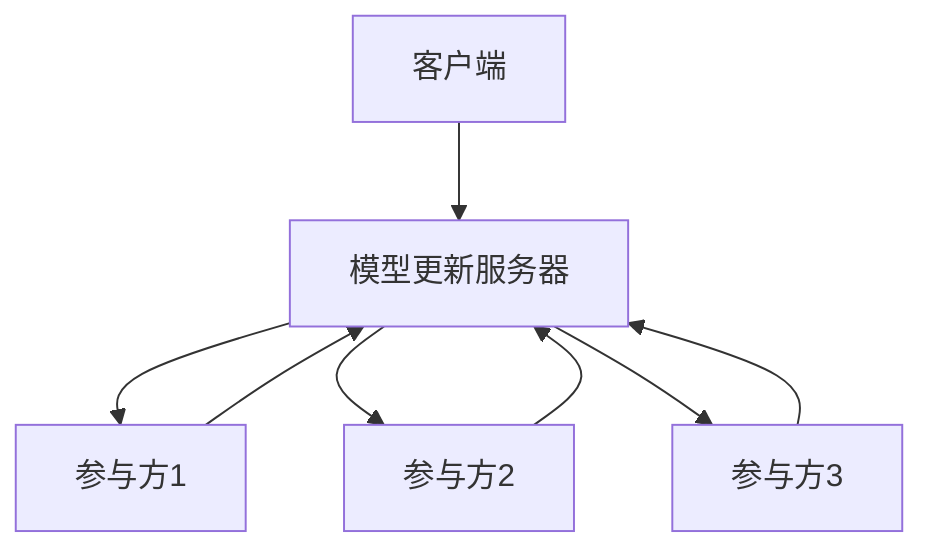
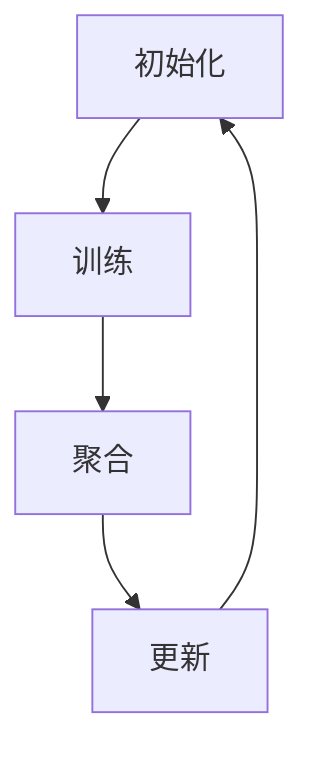
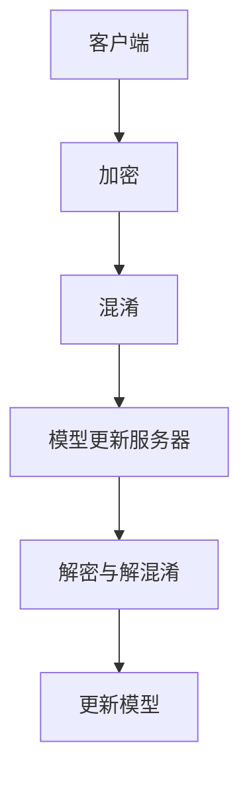
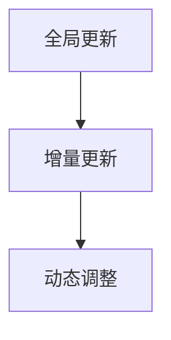
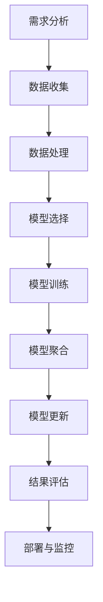
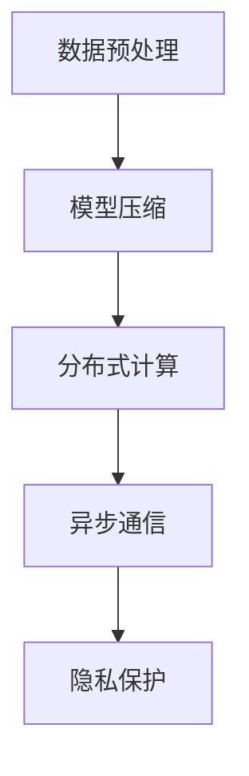
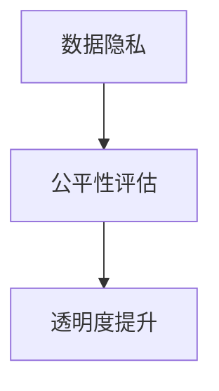

                 

### 《联邦学习在跨行业数据分析中的应用实践》

> **关键词**：联邦学习、跨行业数据分析、分布式计算、隐私保护、应用实践、模型优化

> **摘要**：本文深入探讨了联邦学习在跨行业数据分析中的应用实践。首先介绍了联邦学习的基本概念、原理和架构，接着详细分析了其在医疗、零售、金融和物联网等领域的应用案例。随后，文章阐述了跨行业数据分析的挑战与对策，以及联邦学习在其中的最佳实践。最后，展望了联邦学习的未来发展前景，并提出了相应的解决方案。本文旨在为读者提供全面、系统的联邦学习应用指南。

## 目录大纲

### 第一部分：联邦学习基础知识

#### 第1章：联邦学习的概念与原理

1.1 联邦学习的定义  
1.2 联邦学习与传统数据分析的区别  
1.3 联邦学习的关键技术

#### 第2章：联邦学习的架构与流程

2.1 联邦学习的架构设计  
2.2 联邦学习的基本流程  
2.3 联邦学习的通信优化

#### 第3章：联邦学习的核心算法

3.1 梯度聚合算法  
3.2 安全聚合算法  
3.3 模型更新策略

#### 第4章：联邦学习的应用场景

4.1 医疗数据分析  
4.2 零售行业数据分析  
4.3 金融行业数据分析  
4.4 物联网数据分析

### 第二部分：跨行业数据分析实践

#### 第5章：跨行业数据分析概述

5.1 跨行业数据分析的定义与意义  
5.2 跨行业数据分析的方法与工具  
5.3 跨行业数据分析的挑战与应对策略

#### 第6章：联邦学习在医疗数据分析中的应用

6.1 医疗数据的特点与挑战  
6.2 联邦学习在疾病预测中的应用  
6.3 联邦学习在个性化治疗中的应用

#### 第7章：联邦学习在零售行业数据分析中的应用

7.1 零售行业数据分析的需求  
7.2 联邦学习在用户行为分析中的应用  
7.3 联邦学习在需求预测中的应用

#### 第8章：联邦学习在金融行业数据分析中的应用

8.1 金融行业数据分析的重要性  
8.2 联邦学习在信用评分中的应用  
8.3 联邦学习在风险控制中的应用

#### 第9章：联邦学习在物联网数据分析中的应用

9.1 物联网数据的特点与挑战  
9.2 联邦学习在设备故障预测中的应用  
9.3 联邦学习在智能能源管理中的应用

#### 第10章：联邦学习在跨行业数据分析中的最佳实践

10.1 联邦学习在跨行业数据分析中的实施步骤  
10.2 联邦学习在跨行业数据分析中的性能优化  
10.3 联邦学习在跨行业数据分析中的伦理问题与对策

### 第三部分：联邦学习的未来发展趋势

#### 第11章：联邦学习的未来发展前景

11.1 联邦学习在跨行业领域的潜在应用  
11.2 联邦学习与其他新兴技术的融合  
11.3 联邦学习的标准化与规范化

#### 第12章：联邦学习的挑战与解决方案

12.1 联邦学习的性能挑战  
12.2 联邦学习的安全挑战  
12.3 联邦学习的隐私保护挑战

#### 第13章：联邦学习的实践与探索

13.1 联邦学习在行业内的应用案例  
13.2 联邦学习的研究热点与趋势  
13.3 联邦学习的未来研究方向

### 附录

#### 附录A：联邦学习相关资源与工具

A.1 联邦学习框架与库  
A.2 联邦学习论文与书籍推荐  
A.3 联邦学习社区与论坛

---

### 第一部分：联邦学习基础知识

#### 第1章：联邦学习的概念与原理

#### 1.1 联邦学习的定义

联邦学习（Federated Learning）是一种分布式机器学习技术，允许不同组织或个人在各自的数据集上进行模型训练，同时共享模型的更新，而无需交换原始数据。这种技术特别适用于那些无法或不愿意共享其数据集的组织，如医疗、金融和零售行业。

联邦学习的核心在于通过聚合模型参数来达到共享知识的目的，同时保持各个参与方数据的安全性和隐私。其基本原理可以概括为以下几个步骤：

1. **初始化**：模型更新服务器向所有客户端分发初始模型参数。
2. **训练**：客户端在本地设备上使用自己的数据集对模型进行训练，并生成更新。
3. **聚合**：客户端将本地更新发送到模型更新服务器，服务器对这些更新进行聚合。
4. **更新**：模型更新服务器将聚合后的模型参数分发给所有客户端。

这种分布式计算模式使得联邦学习能够有效地处理大规模、分布式数据，同时保护数据隐私。

#### 1.2 联邦学习与传统数据分析的区别

传统数据分析通常涉及数据的集中式存储和处理，而联邦学习则通过分布式计算来保护数据隐私。以下是两者的主要区别：

- **数据所有权**：在传统数据分析中，数据集中存储在一个中央数据库中，所有者可以直接访问和操作数据。而在联邦学习中，数据分散存储在各个客户端上，只有模型更新被共享。
- **隐私保护**：传统数据分析可能面临数据泄露的风险，而联邦学习通过加密和聚合技术，确保参与方无法访问其他参与方的数据。
- **计算资源**：传统数据分析依赖于中央计算资源，而联邦学习可以在边缘设备上进行模型训练，减轻中央服务器的负载。

#### 1.3 联邦学习的关键技术

联邦学习的关键技术主要包括通信优化、安全聚合和模型更新策略。以下是这些技术的详细解释：

- **通信优化**：在联邦学习中，客户端需要定期向模型更新服务器发送本地更新。通信优化技术旨在减少通信开销，例如通过差分隐私技术减少需要传输的数据量，或者采用压缩算法降低传输数据的大小。
- **安全聚合**：为了保护数据隐私，联邦学习使用安全聚合算法，如加密和混淆技术。这些算法确保参与方无法获取其他参与方的原始数据，同时能够有效聚合模型更新。
- **模型更新策略**：联邦学习采用多种模型更新策略，如全局更新、增量更新和动态调整。全局更新在每个迭代周期更新整个模型，而增量更新只更新部分模型参数。动态调整根据模型性能动态调整更新频率和参数。

#### 1.4 联邦学习的架构与流程

联邦学习的架构包括客户端、模型更新服务器和参与方。以下是联邦学习的基本架构和流程：

**图1.1 联邦学习架构的基本组成部分**



- **客户端**：负责在本地设备上训练模型。
- **模型更新服务器**：负责接收来自客户端的更新，并聚合这些更新以生成全局模型。
- **参与方**：可以是多个组织或个人，每个参与方都维护一个本地模型。

**图1.2 联邦学习的基本流程**



- **初始化阶段**：模型更新服务器向所有客户端分发初始模型参数。
- **训练阶段**：客户端在本地设备上使用自己的数据集对模型进行训练，并生成更新。
- **聚合阶段**：客户端将本地更新发送到模型更新服务器，服务器对这些更新进行聚合。
- **更新阶段**：模型更新服务器将聚合后的模型参数分发给所有客户端。

#### 1.5 联邦学习的核心算法

联邦学习的关键算法包括梯度聚合算法、安全聚合算法和模型更新策略。以下是这些算法的详细解释和伪代码：

**3.1 梯度聚合算法**

梯度聚合算法是一种常用的联邦学习算法，用于聚合不同客户端的模型更新。

**伪代码：梯度聚合算法**

```python
function GradientAggregation(ModelParameters, ClientGradients):
    for each ClientGradient in ClientGradients:
        aggregatedGradient = aggregatedGradient + ClientGradient
    newModelParameters = UpdateModel(ModelParameters, aggregatedGradient)
    return newModelParameters
```

**3.2 安全聚合算法**

安全聚合算法通过加密和混淆技术保护数据隐私，确保参与方无法获取其他参与方的数据。

**图3.1 安全聚合算法的工作原理**



**3.3 模型更新策略**

模型更新策略用于优化模型性能和效率，常见的方法包括全局更新、增量更新和动态调整。

**图3.2 模型更新策略的示意图**



#### 1.6 联邦学习的应用场景

联邦学习在多个领域都有广泛的应用，以下是几个典型的应用场景：

- **医疗数据分析**：联邦学习可以帮助医疗机构在保护患者隐私的同时，进行疾病预测和个性化治疗。
- **零售行业数据分析**：零售企业可以利用联邦学习分析用户行为，实现个性化推荐和需求预测。
- **金融行业数据分析**：金融机构可以通过联邦学习进行信用评分和风险控制，提高业务效率。
- **物联网数据分析**：物联网设备产生的海量数据可以通过联邦学习进行实时分析，实现智能管理和优化。

### 总结

本章介绍了联邦学习的基本概念、原理、架构和关键技术。联邦学习通过分布式计算和隐私保护技术，实现了数据的安全共享和分析。接下来，我们将进一步探讨联邦学习在跨行业数据分析中的应用实践，以及其在不同领域的具体应用案例。

## 第二部分：跨行业数据分析实践

### 第5章：跨行业数据分析概述

#### 5.1 跨行业数据分析的定义与意义

跨行业数据分析（Inter-Industry Data Analysis）是指将来自不同行业的数据进行整合和分析，以发现潜在的商业机会、优化业务流程和提升整体竞争力。随着大数据和人工智能技术的发展，跨行业数据分析已经成为企业提升决策质量和运营效率的重要手段。

**定义**：

跨行业数据分析可以定义为一种综合性数据处理和分析方法，它涉及将来自不同领域（如医疗、零售、金融、物联网等）的数据进行整合、清洗、预处理和分析，以提取有价值的信息和洞察。

**意义**：

1. **提升业务洞察力**：跨行业数据分析可以帮助企业从不同角度理解市场和客户行为，从而提升业务决策的准确性和前瞻性。
2. **发现新商业机会**：通过跨行业数据整合，企业可以发现新的业务模式、市场机会和潜在合作伙伴，实现业务的拓展和创新。
3. **优化运营效率**：跨行业数据分析可以优化业务流程，减少资源浪费，提高生产效率和服务质量。
4. **提升竞争力**：通过跨行业数据分析，企业可以更好地了解市场趋势和竞争对手动态，从而在激烈的市场竞争中占据有利位置。

#### 5.2 跨行业数据分析的方法与工具

跨行业数据分析涉及多个步骤，包括数据采集、数据清洗、数据融合、特征提取和模型构建等。以下是这些步骤中的常用方法和工具：

1. **数据采集**：
   - **API接口**：通过API接口获取外部数据，如社交媒体、电商网站等。
   - **数据爬取**：使用爬虫技术获取网站上的公开数据。
   - **传感器数据**：利用物联网设备采集环境数据，如气象、交通等。

2. **数据清洗**：
   - **缺失值处理**：填补或删除缺失值，保证数据完整性。
   - **异常值处理**：识别并处理异常值，防止对分析结果造成影响。
   - **数据标准化**：统一数据格式和单位，提高数据一致性。

3. **数据融合**：
   - **数据仓库**：将来自不同来源的数据存储在统一的数据仓库中，便于管理和分析。
   - **数据湖**：将结构化和非结构化数据存储在数据湖中，实现数据的全面整合。
   - **数据虚拟化**：通过数据虚拟化技术，将不同数据源的数据整合成一个虚拟的数据源。

4. **特征提取**：
   - **特征工程**：从原始数据中提取出对分析任务有帮助的特征。
   - **特征选择**：选择最有用的特征，降低模型复杂度，提高模型性能。
   - **特征降维**：通过降维技术（如主成分分析、t-SNE等）减少特征维度，提高计算效率。

5. **模型构建**：
   - **监督学习**：使用已标记的数据训练模型，如线性回归、决策树等。
   - **无监督学习**：不依赖标记数据，从数据中自动发现模式和规律，如聚类、关联规则等。
   - **深度学习**：利用神经网络模型，如卷积神经网络（CNN）、循环神经网络（RNN）等，处理复杂数据和分析任务。

#### 5.3 跨行业数据分析的挑战与应对策略

跨行业数据分析虽然具有巨大的潜力，但也面临诸多挑战。以下是其中一些主要挑战及其应对策略：

1. **数据质量**：
   - **挑战**：不同行业的数据质量参差不齐，可能存在缺失值、异常值和噪声。
   - **策略**：通过数据清洗和预处理技术，提高数据质量。例如，使用异常检测算法识别和修复异常值，使用填补算法处理缺失值。

2. **数据隐私**：
   - **挑战**：跨行业数据往往涉及用户隐私，如何保护用户隐私是一个重要问题。
   - **策略**：采用联邦学习、差分隐私等技术，保护数据隐私。联邦学习可以在本地设备上进行模型训练，无需共享原始数据；差分隐私可以在不影响分析结果的前提下，降低数据泄露的风险。

3. **数据一致性**：
   - **挑战**：不同行业的数据格式和标准不同，如何统一数据格式和标准。
   - **策略**：制定统一的数据标准和管理流程，确保数据的一致性。例如，使用数据虚拟化技术将不同数据源的数据整合成统一格式，使用数据转换工具将异构数据转换为标准格式。

4. **数据处理效率**：
   - **挑战**：跨行业数据量庞大，如何高效处理和分析数据。
   - **策略**：采用分布式计算、并行处理和GPU加速等技术，提高数据处理效率。例如，使用分布式计算框架（如Hadoop、Spark）处理大规模数据，使用GPU加速模型训练。

#### 5.4 跨行业数据分析的案例研究

以下是一些跨行业数据分析的实际案例，展示了其应用潜力和效果：

1. **医疗与金融结合**：某医疗机构与银行合作，通过分析患者的健康状况和财务状况，预测患者可能面临的医疗费用风险，为银行提供贷款决策支持。

2. **零售与物流结合**：某零售企业与物流公司合作，通过分析消费者购买行为和物流数据，优化库存管理和配送路线，提高运营效率。

3. **能源与制造结合**：某能源公司与制造业企业合作，通过分析能源消耗数据和设备运行数据，优化能源使用策略，提高设备运行效率。

4. **交通与城市规划**：某城市交通管理部门与城市规划部门合作，通过分析交通流量数据和人口统计数据，优化交通基础设施建设和城市规划。

#### 总结

本章介绍了跨行业数据分析的定义、意义、方法与工具，以及面临的主要挑战和应对策略。跨行业数据分析具有广泛的应用前景，可以提高企业的业务洞察力、优化运营效率和提升竞争力。在接下来的章节中，我们将深入探讨联邦学习在各个跨行业数据分析领域的具体应用实践。

### 第6章：联邦学习在医疗数据分析中的应用

#### 6.1 医疗数据的特点与挑战

医疗数据是联邦学习应用的一个重要领域，其特点与挑战如下：

**特点**：

1. **数据量大**：医疗数据包括患者的历史记录、基因信息、电子健康记录等，数据量庞大。
2. **数据类型多样**：医疗数据包含结构化数据（如患者信息、诊疗记录）和非结构化数据（如病历、医学影像）。
3. **时效性强**：医疗数据需要实时更新和分析，以支持临床决策和疾病预测。

**挑战**：

1. **数据隐私**：医疗数据涉及患者隐私，如何在保护患者隐私的前提下进行数据分析是一个重要问题。
2. **数据质量**：医疗数据质量参差不齐，可能存在缺失值、异常值和噪声，影响分析结果。
3. **异构数据整合**：医疗数据来自不同系统、不同格式，如何有效整合和统一处理是一个挑战。
4. **计算资源**：医疗数据分析需要强大的计算资源，特别是对于大规模、高维度的数据。

#### 6.2 联邦学习在疾病预测中的应用

联邦学习在疾病预测中的应用，主要包括利用联邦学习模型对疾病风险进行预测，以及个性化疾病预防策略的制定。

**案例研究**：

- **糖尿病预测**：某研究团队利用联邦学习对患者的血糖、体重、饮食习惯等数据进行疾病预测。通过联邦学习模型，他们能够准确预测糖尿病患者的患病风险，为早期干预提供依据。
- **心脏病预测**：另一项研究利用联邦学习分析患者的电子健康记录、基因数据和生活方式数据，预测心脏病发病风险。研究结果证明了联邦学习模型在心脏病预测中的有效性。

**算法原理**：

联邦学习在疾病预测中的应用，通常涉及以下步骤：

1. **数据预处理**：对医疗数据进行清洗、标准化和处理，去除异常值和缺失值。
2. **模型构建**：选择合适的联邦学习模型，如梯度聚合算法（Federated Averaging）或安全聚合算法（Secure Aggregation）。
3. **模型训练**：在各个客户端上使用本地数据集对模型进行训练，生成本地更新。
4. **模型聚合**：将本地更新发送到模型更新服务器，进行聚合。
5. **模型更新**：模型更新服务器生成全局模型，并将其分发给所有客户端。

**伪代码**：

```python
function DiseasePrediction(FederatedModel, ClientData, Labels):
    for each ClientData in ClientData:
        LocalModel = TrainModel(FederatedModel, ClientData)
        LocalUpdate = CalculateUpdate(LocalModel, Labels)
    GlobalUpdate = AggregateUpdates(LocalUpdate)
    GlobalModel = UpdateModel(FederatedModel, GlobalUpdate)
    return GlobalModel
```

#### 6.3 联邦学习在个性化治疗中的应用

个性化治疗是联邦学习在医疗数据分析中的另一个重要应用领域。通过联邦学习，医疗机构能够在保护患者隐私的同时，为患者制定个性化的治疗方案。

**案例研究**：

- **个性化药物推荐**：某医疗机构利用联邦学习分析患者的基因数据、病史和药物反应记录，为患者推荐个性化的药物组合。研究结果显示，这种方法能够提高治疗效果，减少药物副作用。
- **个性化护理计划**：另一项研究利用联邦学习为患者制定个性化的护理计划。通过对患者的历史数据进行分析，研究团队能够为患者提供个性化的康复建议和治疗方案。

**算法原理**：

联邦学习在个性化治疗中的应用，通常涉及以下步骤：

1. **数据收集**：收集患者的基因数据、病史、药物反应记录等。
2. **模型构建**：选择合适的联邦学习模型，如基于神经网络的联邦学习模型。
3. **模型训练**：在各个客户端上使用本地数据集对模型进行训练，生成本地更新。
4. **模型聚合**：将本地更新发送到模型更新服务器，进行聚合。
5. **模型更新**：模型更新服务器生成全局模型，并将其分发给所有客户端。
6. **治疗方案推荐**：使用全局模型为患者提供个性化的治疗方案。

**伪代码**：

```python
function PersonalizedTherapy(FederatedModel, ClientData, PatientData):
    for each ClientData in ClientData:
        LocalModel = TrainModel(FederatedModel, ClientData)
        LocalUpdate = CalculateUpdate(LocalModel, PatientData)
    GlobalUpdate = AggregateUpdates(LocalUpdate)
    GlobalModel = UpdateModel(FederatedModel, GlobalUpdate)
    TherapyRecommendation = GenerateTherapyRecommendation(GlobalModel, PatientData)
    return TherapyRecommendation
```

#### 6.4 联邦学习在医疗数据分析中的优势

联邦学习在医疗数据分析中的优势主要体现在以下几个方面：

1. **隐私保护**：联邦学习在本地设备上进行模型训练，无需共享原始数据，从而保护患者隐私。
2. **数据利用**：联邦学习能够充分利用不同医疗机构的数据资源，提高数据的利用效率。
3. **实时性**：联邦学习支持实时数据更新和分析，为临床决策提供及时支持。
4. **可扩展性**：联邦学习能够处理大规模、异构的医疗数据，具有很好的扩展性。

#### 6.5 总结

本章介绍了联邦学习在医疗数据分析中的应用，包括疾病预测和个性化治疗。联邦学习通过分布式计算和隐私保护技术，为医疗数据分析提供了有效的解决方案。在接下来的章节中，我们将继续探讨联邦学习在零售、金融和物联网等领域的应用实践。

### 第7章：联邦学习在零售行业数据分析中的应用

#### 7.1 零售行业数据分析的需求

零售行业数据分析的需求主要体现在以下几个方面：

1. **用户行为分析**：了解消费者的购物习惯、偏好和需求，为个性化推荐和营销策略提供依据。
2. **需求预测**：预测市场需求，优化库存管理和供应链，降低库存成本，提高销售业绩。
3. **客户关系管理**：通过分析客户数据，优化客户服务，提高客户满意度和忠诚度。
4. **供应链优化**：分析供应链中的各个环节，提高供应链的透明度和效率。
5. **风险控制**：监测销售数据和市场动态，及时发现异常情况，采取风险控制措施。

#### 7.2 联邦学习在用户行为分析中的应用

联邦学习在用户行为分析中的应用，主要包括利用联邦学习模型对用户行为进行预测和分析，从而优化产品推荐和营销策略。

**案例研究**：

- **个性化推荐**：某零售企业利用联邦学习分析用户的购物数据、浏览记录和购买历史，为用户推荐个性化的商品。通过联邦学习模型，企业能够准确预测用户的偏好，提高推荐精度和用户满意度。
- **流失预测**：另一家零售企业利用联邦学习分析用户的购物行为和互动数据，预测用户流失风险。通过及时采取挽回措施，企业能够降低客户流失率，提高客户留存率。

**算法原理**：

联邦学习在用户行为分析中的应用，通常涉及以下步骤：

1. **数据收集**：收集用户的购物数据、浏览记录和互动数据。
2. **模型构建**：选择合适的联邦学习模型，如基于神经网络的联邦学习模型。
3. **模型训练**：在各个客户端上使用本地数据集对模型进行训练，生成本地更新。
4. **模型聚合**：将本地更新发送到模型更新服务器，进行聚合。
5. **模型更新**：模型更新服务器生成全局模型，并将其分发给所有客户端。
6. **行为预测**：使用全局模型对用户行为进行预测和分析。

**伪代码**：

```python
function UserBehaviorAnalysis(FederatedModel, ClientData, UserFeatures):
    for each ClientData in ClientData:
        LocalModel = TrainModel(FederatedModel, ClientData)
        LocalUpdate = CalculateUpdate(LocalModel, UserFeatures)
    GlobalUpdate = AggregateUpdates(LocalUpdate)
    GlobalModel = UpdateModel(FederatedModel, GlobalUpdate)
    BehaviorPrediction = PredictBehavior(GlobalModel, UserFeatures)
    return BehaviorPrediction
```

#### 7.3 联邦学习在需求预测中的应用

联邦学习在需求预测中的应用，主要包括利用联邦学习模型对市场需求进行预测，从而优化库存管理和供应链。

**案例研究**：

- **需求预测**：某零售企业利用联邦学习分析历史销售数据、季节性因素和促销活动，预测未来市场需求。通过精准的需求预测，企业能够优化库存管理，减少库存成本，提高销售业绩。
- **促销效果评估**：另一家零售企业利用联邦学习分析不同促销策略的效果，评估促销活动对市场需求的影响。通过优化促销策略，企业能够提高促销效果，增加销售收入。

**算法原理**：

联邦学习在需求预测中的应用，通常涉及以下步骤：

1. **数据收集**：收集历史销售数据、季节性因素和促销活动数据。
2. **模型构建**：选择合适的联邦学习模型，如基于时间序列分析的联邦学习模型。
3. **模型训练**：在各个客户端上使用本地数据集对模型进行训练，生成本地更新。
4. **模型聚合**：将本地更新发送到模型更新服务器，进行聚合。
5. **模型更新**：模型更新服务器生成全局模型，并将其分发给所有客户端。
6. **需求预测**：使用全局模型对市场需求进行预测。

**伪代码**：

```python
function DemandPrediction(FederatedModel, ClientData, TimeSeries):
    for each ClientData in ClientData:
        LocalModel = TrainModel(FederatedModel, ClientData)
        LocalUpdate = CalculateUpdate(LocalModel, TimeSeries)
    GlobalUpdate = AggregateUpdates(LocalUpdate)
    GlobalModel = UpdateModel(FederatedModel, GlobalUpdate)
    DemandPrediction = PredictDemand(GlobalModel, TimeSeries)
    return DemandPrediction
```

#### 7.4 联邦学习在零售行业数据分析中的优势

联邦学习在零售行业数据分析中的优势主要体现在以下几个方面：

1. **隐私保护**：联邦学习在本地设备上进行模型训练，无需共享原始数据，从而保护用户隐私。
2. **实时性**：联邦学习支持实时数据更新和分析，为决策提供及时支持。
3. **灵活性**：联邦学习能够处理大规模、异构的数据，具有很好的扩展性。
4. **效率**：联邦学习通过分布式计算，提高数据处理和分析的效率。

#### 7.5 总结

本章介绍了联邦学习在零售行业数据分析中的应用，包括用户行为分析和需求预测。联邦学习通过分布式计算和隐私保护技术，为零售行业数据分析提供了有效的解决方案。在接下来的章节中，我们将继续探讨联邦学习在金融和物联网等领域的应用实践。

### 第8章：联邦学习在金融行业数据分析中的应用

#### 8.1 金融行业数据分析的重要性

金融行业数据分析在提升金融机构的运营效率、风险管理和客户服务方面具有重要作用。通过数据分析，金融机构能够更好地理解市场动态、客户行为和内部运营，从而制定更科学的决策策略。

**重要性**：

1. **风险管理**：金融行业涉及大量的风险，如信用风险、市场风险和操作风险。通过数据分析，金融机构可以识别潜在风险，制定有效的风险管理策略。
2. **客户关系管理**：了解客户需求和行为，提供个性化的金融产品和服务，有助于提升客户满意度和忠诚度。
3. **市场预测**：通过对市场数据进行分析，金融机构可以预测市场趋势，制定投资策略，降低投资风险。
4. **运营优化**：通过分析运营数据，金融机构可以优化业务流程，提高运营效率，降低成本。

#### 8.2 联邦学习在信用评分中的应用

信用评分是金融行业数据分析的一个重要方面，联邦学习在信用评分中的应用有助于提高评分模型的准确性和公平性。

**案例研究**：

- **信用评分模型**：某金融机构利用联邦学习分析客户的信用历史、收入水平、就业状况等数据，构建个性化的信用评分模型。通过联邦学习，金融机构能够在保护客户隐私的同时，提高评分模型的准确性和可解释性。
- **信用风险评估**：另一家金融机构利用联邦学习对客户的借贷申请进行风险评估。通过对客户的消费行为、社交数据等多源数据进行联邦学习分析，金融机构能够更准确地评估客户的信用风险，提高贷款审批的效率。

**算法原理**：

联邦学习在信用评分中的应用，通常涉及以下步骤：

1. **数据收集**：收集客户的信用历史、收入水平、就业状况等数据。
2. **模型构建**：选择合适的联邦学习模型，如基于逻辑回归或决策树的联邦学习模型。
3. **模型训练**：在各个客户端上使用本地数据集对模型进行训练，生成本地更新。
4. **模型聚合**：将本地更新发送到模型更新服务器，进行聚合。
5. **模型更新**：模型更新服务器生成全局模型，并将其分发给所有客户端。
6. **信用评分**：使用全局模型对客户进行信用评分。

**伪代码**：

```python
function CreditScoring(FederatedModel, ClientData, Features):
    for each ClientData in ClientData:
        LocalModel = TrainModel(FederatedModel, ClientData)
        LocalUpdate = CalculateUpdate(LocalModel, Features)
    GlobalUpdate = AggregateUpdates(LocalUpdate)
    GlobalModel = UpdateModel(FederatedModel, GlobalUpdate)
    CreditScore = CalculateScore(GlobalModel, Features)
    return CreditScore
```

#### 8.3 联邦学习在风险控制中的应用

联邦学习在风险控制中的应用，主要包括利用联邦学习模型对交易行为进行分析，实时监控风险，并采取相应的风险控制措施。

**案例研究**：

- **交易风险监测**：某金融机构利用联邦学习分析交易数据，实时监控交易行为，识别异常交易。通过联邦学习模型，金融机构能够及时发现潜在欺诈行为，降低风险。
- **市场风险预测**：另一家金融机构利用联邦学习分析市场数据，预测市场波动和风险。通过联邦学习模型，金融机构能够提前采取风险控制措施，降低市场风险。

**算法原理**：

联邦学习在风险控制中的应用，通常涉及以下步骤：

1. **数据收集**：收集交易数据、市场数据等。
2. **模型构建**：选择合适的联邦学习模型，如基于时间序列分析的联邦学习模型。
3. **模型训练**：在各个客户端上使用本地数据集对模型进行训练，生成本地更新。
4. **模型聚合**：将本地更新发送到模型更新服务器，进行聚合。
5. **模型更新**：模型更新服务器生成全局模型，并将其分发给所有客户端。
6. **风险监测与控制**：使用全局模型对交易行为和市场风险进行实时监控，采取相应的风险控制措施。

**伪代码**：

```python
function RiskControl(FederatedModel, ClientData, MarketData):
    for each ClientData in ClientData:
        LocalModel = TrainModel(FederatedModel, ClientData)
        LocalUpdate = CalculateUpdate(LocalModel, MarketData)
    GlobalUpdate = AggregateUpdates(LocalUpdate)
    GlobalModel = UpdateModel(FederatedModel, GlobalUpdate)
    RiskPrediction = PredictRisk(GlobalModel, MarketData)
    if RiskPrediction > Threshold:
        TakeRiskControlMeasures()
    return RiskPrediction
```

#### 8.4 联邦学习在金融行业数据分析中的优势

联邦学习在金融行业数据分析中的优势主要体现在以下几个方面：

1. **隐私保护**：联邦学习在本地设备上进行模型训练，无需共享原始数据，保护客户隐私。
2. **实时性**：联邦学习支持实时数据更新和分析，提高风险监控和决策效率。
3. **灵活性**：联邦学习能够处理大规模、异构的数据，适应不同的金融数据分析需求。
4. **可解释性**：联邦学习模型的可解释性较高，有助于金融机构理解和信任模型结果。

#### 8.5 总结

本章介绍了联邦学习在金融行业数据分析中的应用，包括信用评分和风险控制。联邦学习通过分布式计算和隐私保护技术，为金融行业数据分析提供了有效的解决方案。在接下来的章节中，我们将继续探讨联邦学习在物联网数据分析中的应用。

### 第9章：联邦学习在物联网数据分析中的应用

#### 9.1 物联网数据的特点与挑战

物联网（IoT）数据分析涉及从大量设备收集的数据进行分析和处理，这些数据具有以下特点：

**特点**：

1. **数据量大**：物联网设备产生的数据量庞大，每秒产生的数据量可达数百万条。
2. **数据类型多样**：物联网数据包括结构化数据（如传感器数据）和非结构化数据（如视频、音频）。
3. **实时性要求高**：物联网数据分析通常需要实时处理和响应，以满足智能监控、故障预测等需求。

**挑战**：

1. **数据安全性**：物联网数据涉及设备隐私和用户隐私，需要确保数据安全。
2. **数据处理效率**：物联网数据处理需要高效、实时，以支持设备的高频次数据采集和处理。
3. **数据完整性**：物联网数据可能受到网络延迟、设备故障等因素的影响，确保数据完整性是一个挑战。
4. **异构数据整合**：物联网数据来自不同的设备和平台，如何有效整合和处理异构数据。

#### 9.2 联邦学习在设备故障预测中的应用

联邦学习在设备故障预测中的应用，可以通过分析设备的运行数据，预测设备故障，从而实现设备的预防性维护。

**案例研究**：

- **设备故障预测**：某制造企业利用联邦学习分析设备的传感器数据，预测设备故障。通过联邦学习模型，企业能够提前发现潜在故障，安排预防性维护，降低设备停机时间和维修成本。
- **智能监控系统**：另一家能源公司利用联邦学习分析能源设备的运行数据，实时监控设备状态，预测设备故障。通过及时采取维护措施，企业能够提高设备运行效率，降低能源消耗。

**算法原理**：

联邦学习在设备故障预测中的应用，通常涉及以下步骤：

1. **数据收集**：收集设备的传感器数据、运行日志等。
2. **模型构建**：选择合适的联邦学习模型，如基于机器学习的联邦学习模型。
3. **模型训练**：在各个客户端上使用本地数据集对模型进行训练，生成本地更新。
4. **模型聚合**：将本地更新发送到模型更新服务器，进行聚合。
5. **模型更新**：模型更新服务器生成全局模型，并将其分发给所有客户端。
6. **故障预测**：使用全局模型对设备进行故障预测。

**伪代码**：

```python
function EquipmentFailurePrediction(FederatedModel, ClientData, SensorData):
    for each ClientData in ClientData:
        LocalModel = TrainModel(FederatedModel, ClientData)
        LocalUpdate = CalculateUpdate(LocalModel, SensorData)
    GlobalUpdate = AggregateUpdates(LocalUpdate)
    GlobalModel = UpdateModel(FederatedModel, GlobalUpdate)
    FailurePrediction = PredictFailure(GlobalModel, SensorData)
    return FailurePrediction
```

#### 9.3 联邦学习在智能能源管理中的应用

联邦学习在智能能源管理中的应用，可以通过分析能源设备的运行数据，优化能源分配和能源使用效率。

**案例研究**：

- **智能能源分配**：某能源公司利用联邦学习分析电网数据、气象数据等，实现智能能源分配。通过联邦学习模型，企业能够根据实时数据优化能源分配，降低能源浪费，提高能源利用效率。
- **能源消耗预测**：另一家能源公司利用联邦学习分析能源设备的运行数据，预测未来能源需求。通过精准的能源需求预测，企业能够合理安排能源供应，降低能源成本。

**算法原理**：

联邦学习在智能能源管理中的应用，通常涉及以下步骤：

1. **数据收集**：收集电网数据、气象数据、设备运行数据等。
2. **模型构建**：选择合适的联邦学习模型，如基于时间序列分析的联邦学习模型。
3. **模型训练**：在各个客户端上使用本地数据集对模型进行训练，生成本地更新。
4. **模型聚合**：将本地更新发送到模型更新服务器，进行聚合。
5. **模型更新**：模型更新服务器生成全局模型，并将其分发给所有客户端。
6. **能源管理**：使用全局模型进行能源分配和需求预测，优化能源管理。

**伪代码**：

```python
function EnergyManagement(FederatedModel, ClientData, EnergyData):
    for each ClientData in ClientData:
        LocalModel = TrainModel(FederatedModel, ClientData)
        LocalUpdate = CalculateUpdate(LocalModel, EnergyData)
    GlobalUpdate = AggregateUpdates(LocalUpdate)
    GlobalModel = UpdateModel(FederatedModel, GlobalUpdate)
    EnergyPrediction = PredictEnergyDemand(GlobalModel, EnergyData)
    EnergyAllocation = AllocateEnergy(EnergyPrediction)
    return EnergyAllocation
```

#### 9.4 联邦学习在物联网数据分析中的优势

联邦学习在物联网数据分析中的优势主要体现在以下几个方面：

1. **隐私保护**：联邦学习在本地设备上进行模型训练，无需共享原始数据，保护设备隐私。
2. **实时性**：联邦学习支持实时数据更新和分析，提高设备监控和故障预测的效率。
3. **灵活性**：联邦学习能够处理大规模、异构的物联网数据，适应不同的应用场景。
4. **高效性**：联邦学习通过分布式计算，提高数据处理和分析的效率。

#### 9.5 总结

本章介绍了联邦学习在物联网数据分析中的应用，包括设备故障预测和智能能源管理。联邦学习通过分布式计算和隐私保护技术，为物联网数据分析提供了有效的解决方案。在接下来的章节中，我们将探讨联邦学习在跨行业数据分析中的最佳实践和未来发展趋势。

### 第10章：联邦学习在跨行业数据分析中的最佳实践

#### 10.1 联邦学习在跨行业数据分析中的实施步骤

在跨行业数据分析中应用联邦学习，需要遵循以下实施步骤，以确保项目的成功：

1. **需求分析**：明确跨行业数据分析的目标和应用场景，确定需要分析的数据类型和来源。
2. **数据收集**：收集来自不同行业的原始数据，包括结构化数据和半结构化/非结构化数据。
3. **数据处理**：对收集到的数据进行清洗、预处理和标准化，确保数据质量。
4. **模型选择**：选择适合跨行业数据分析的联邦学习模型，如梯度聚合算法、安全聚合算法等。
5. **模型训练**：在各个客户端上使用本地数据集对模型进行训练，生成本地更新。
6. **模型聚合**：将本地更新发送到模型更新服务器，进行聚合，生成全局模型。
7. **模型更新**：模型更新服务器生成全局模型，并将其分发给所有客户端。
8. **结果评估**：评估模型性能，调整模型参数，优化模型效果。
9. **部署与监控**：将联邦学习模型部署到生产环境中，进行实时数据分析和监控。

**图10.1 联邦学习在跨行业数据分析中的实施步骤**



#### 10.2 联邦学习在跨行业数据分析中的性能优化

为了提高联邦学习在跨行业数据分析中的性能，可以采取以下优化策略：

1. **数据预处理**：通过数据清洗、去噪、归一化等预处理技术，提高数据质量，减少模型训练的复杂度。
2. **模型压缩**：采用模型压缩技术，如量化、剪枝和蒸馏，减少模型参数数量，提高模型推理速度。
3. **分布式计算**：利用分布式计算框架（如TensorFlow Federated、PyTorch Federated等），将模型训练任务分布到多个节点，提高计算效率。
4. **异步通信**：采用异步通信模式，减少客户端之间的等待时间，提高通信效率。
5. **隐私保护**：采用差分隐私、加密等隐私保护技术，确保数据安全和隐私。

**图10.2 联邦学习性能优化策略**



#### 10.3 联邦学习在跨行业数据分析中的伦理问题与对策

在跨行业数据分析中应用联邦学习，需要关注以下伦理问题：

1. **数据隐私**：如何保护参与方的数据隐私，防止数据泄露和滥用。
2. **数据公平性**：如何确保数据分析结果的公平性，避免歧视性结论。
3. **透明度**：如何提高联邦学习模型的可解释性，确保决策过程的透明度。

为了解决这些伦理问题，可以采取以下对策：

1. **隐私保护技术**：采用联邦学习、差分隐私等技术，保护数据隐私。
2. **公平性评估**：通过数据预处理、模型评估等方法，确保数据分析结果的公平性。
3. **透明度提升**：通过模型可解释性技术，如SHAP值、LIME等，提高模型决策的透明度。

**图10.3 联邦学习伦理问题与对策**



#### 10.4 跨行业数据分析项目案例

以下是一个跨行业数据分析项目的案例，展示了联邦学习在实践中的应用：

**案例背景**：某金融机构希望通过分析客户的金融数据和医疗数据，为用户提供个性化的健康管理建议和投资策略。

**实施步骤**：

1. **需求分析**：明确项目目标，收集客户的金融数据和医疗数据。
2. **数据收集**：从金融机构和医疗机构获取匿名化的数据。
3. **数据处理**：清洗和预处理数据，确保数据质量。
4. **模型选择**：选择联邦学习模型，如基于梯度聚合算法的模型。
5. **模型训练**：在各个客户端上使用本地数据集对模型进行训练。
6. **模型聚合**：将本地更新发送到模型更新服务器，进行聚合。
7. **模型更新**：生成全局模型，为用户提供个性化建议。
8. **结果评估**：评估模型性能，调整模型参数。
9. **部署与监控**：将联邦学习模型部署到生产环境中，实时为用户提供服务。

**实施效果**：通过联邦学习模型，金融机构能够为用户提供个性化的健康管理建议和投资策略，提高了用户满意度和忠诚度。

#### 10.5 总结

本章介绍了联邦学习在跨行业数据分析中的最佳实践，包括实施步骤、性能优化策略和伦理问题与对策。通过实际案例，展示了联邦学习在跨行业数据分析中的成功应用。在接下来的章节中，我们将探讨联邦学习的未来发展前景和挑战。

### 第11章：联邦学习的未来发展前景

#### 11.1 联邦学习在跨行业领域的潜在应用

随着技术的不断进步和跨行业数据的日益丰富，联邦学习在多个领域展现出了巨大的应用潜力：

1. **智能制造**：联邦学习可以帮助制造企业优化生产流程、提高设备利用率，并实现个性化生产。
2. **智慧城市**：通过联邦学习，智慧城市可以实现智能交通管理、环境监测和能源优化，提高城市运行效率。
3. **智慧医疗**：联邦学习在智慧医疗中的应用，包括疾病预测、个性化治疗和精准医疗，将大大提升医疗水平。
4. **金融科技**：联邦学习在金融科技领域的应用，如信用评分、欺诈检测和投资策略优化，将提升金融服务的质量和效率。
5. **零售与物流**：联邦学习可以帮助零售企业实现个性化推荐、需求预测和库存优化，提高零售行业的运营效率。

#### 11.2 联邦学习与其他新兴技术的融合

联邦学习与其他新兴技术的融合，将进一步拓展其应用范围和功能：

1. **区块链**：区块链技术可以为联邦学习提供安全性和透明性保障，确保数据共享和模型更新的安全性。
2. **物联网**：物联网设备产生的海量数据可以通过联邦学习进行实时分析和处理，实现智能监控和优化。
3. **边缘计算**：边缘计算与联邦学习的结合，可以实现更高效的数据处理和更低的延迟，适用于实时性和计算资源要求高的应用场景。
4. **人工智能**：联邦学习与人工智能的结合，可以实现更复杂的数据分析和智能决策，提升业务自动化水平。

#### 11.3 联邦学习的标准化与规范化

为了推动联邦学习的广泛应用和发展，标准化和规范化工作至关重要：

1. **制定标准**：制定统一的联邦学习标准和规范，确保不同系统之间的互操作性和兼容性。
2. **安全协议**：制定安全协议和隐私保护规范，确保联邦学习系统的安全性。
3. **性能优化**：制定性能优化指南，提高联邦学习系统的效率和可靠性。
4. **行业合作**：促进不同行业之间的合作，共享数据资源和研究成果，推动联邦学习技术的创新和发展。

#### 11.4 联邦学习的未来展望

联邦学习作为一项新兴技术，未来将在多个领域发挥重要作用，推动数据科学和人工智能的发展：

1. **数据隐私保护**：联邦学习将成为保护数据隐私的重要手段，为数据共享和数据分析提供安全可靠的基础。
2. **分布式计算**：联邦学习将促进分布式计算技术的发展，实现更大规模的计算能力和更高效的数据处理。
3. **智能化应用**：联邦学习与人工智能的结合，将推动智能化应用的普及，提升各行各业的智能化水平。
4. **跨行业合作**：联邦学习将促进不同行业之间的数据共享与合作，推动跨行业创新和业务模式的变革。

#### 11.5 总结

本章探讨了联邦学习在跨行业领域的潜在应用、与其他新兴技术的融合、标准化与规范化工作，以及对未来的展望。联邦学习作为一项具有重要应用价值的技术，将在未来的数据科学和人工智能发展中发挥关键作用。

### 第12章：联邦学习的挑战与解决方案

#### 12.1 联邦学习的性能挑战

联邦学习在性能方面面临多个挑战，包括通信开销、计算资源使用和模型优化等。

**通信开销**：

在联邦学习中，客户端需要定期向模型更新服务器发送本地更新。通信开销较大，可能导致模型训练速度慢，影响性能。

**解决方案**：

1. **通信优化**：采用压缩感知、差分隐私等技术，减少需要传输的数据量。
2. **异步通信**：采用异步通信模式，减少客户端之间的等待时间，提高通信效率。
3. **数据聚合**：在本地进行部分聚合，减少需要传输的数据量。

**计算资源使用**：

联邦学习通常需要分布式计算框架，计算资源的使用对性能有较大影响。

**解决方案**：

1. **分布式计算**：利用分布式计算框架（如Hadoop、Spark等），提高计算效率。
2. **并行计算**：采用并行计算技术，提高模型训练速度。
3. **GPU加速**：利用GPU加速模型训练，提高计算性能。

**模型优化**：

联邦学习模型的优化是一个重要挑战，需要提高模型性能和准确性。

**解决方案**：

1. **模型压缩**：采用模型压缩技术，如量化、剪枝和蒸馏，减少模型参数数量，提高模型性能。
2. **迁移学习**：采用迁移学习方法，利用预训练模型，提高新任务的性能。
3. **动态调整**：根据模型性能动态调整模型参数和训练策略。

#### 12.2 联邦学习的安全挑战

联邦学习在安全方面面临多个挑战，包括数据泄露、模型篡改和隐私保护等。

**数据泄露**：

在联邦学习中，数据泄露可能导致敏感信息泄露，影响用户隐私。

**解决方案**：

1. **加密技术**：采用加密技术，如对称加密、非对称加密和全同态加密，保护数据隐私。
2. **差分隐私**：采用差分隐私技术，确保数据分析结果的隐私保护。
3. **安全通信**：采用安全通信协议，如TLS/SSL，保护数据传输过程中的安全。

**模型篡改**：

在联邦学习中，恶意参与者可能篡改模型参数，影响模型性能和准确性。

**解决方案**：

1. **验证机制**：采用验证机制，如数字签名和区块链，确保模型更新的真实性。
2. **去中心化协议**：采用去中心化协议，如区块链和多方安全计算，提高系统安全性。
3. **恶意行为检测**：采用恶意行为检测技术，如异常检测和信誉评分，识别和阻止恶意参与者。

**隐私保护**：

联邦学习需要平衡模型性能和隐私保护，确保数据隐私。

**解决方案**：

1. **隐私保护算法**：采用隐私保护算法，如联邦学习、差分隐私和差分差分隐私，保护数据隐私。
2. **隐私预算**：设置隐私预算，控制隐私泄露的风险。
3. **隐私感知设计**：在系统设计和开发过程中，考虑隐私保护，减少隐私泄露的可能性。

#### 12.3 联邦学习的隐私保护挑战

联邦学习在隐私保护方面面临多个挑战，包括用户隐私保护、数据匿名化和隐私泄露风险等。

**用户隐私保护**：

在联邦学习中，用户隐私保护是一个重要问题，需要确保用户数据不被泄露和滥用。

**解决方案**：

1. **隐私保护算法**：采用隐私保护算法，如联邦学习、差分隐私和同态加密，保护用户隐私。
2. **数据匿名化**：采用数据匿名化技术，如k-匿名、l-多样性，降低用户隐私泄露的风险。
3. **隐私感知设计**：在系统设计和开发过程中，考虑隐私保护，减少隐私泄露的可能性。

**数据匿名化**：

在联邦学习中，数据匿名化是一个关键步骤，需要确保匿名化数据能够保留有用信息。

**解决方案**：

1. **隐私保护算法**：采用隐私保护算法，如k-匿名、l-多样性，实现数据匿名化。
2. **数据变换**：采用数据变换技术，如数据遮挡、数据扰动，实现数据匿名化。
3. **数据摘要**：采用数据摘要技术，如统计摘要、信息摘要，实现数据匿名化。

**隐私泄露风险**：

在联邦学习中，隐私泄露风险可能导致敏感信息泄露，影响用户隐私。

**解决方案**：

1. **加密技术**：采用加密技术，如对称加密、非对称加密和全同态加密，保护数据隐私。
2. **差分隐私**：采用差分隐私技术，确保数据分析结果的隐私保护。
3. **安全通信**：采用安全通信协议，如TLS/SSL，保护数据传输过程中的安全。

#### 12.4 总结

本章探讨了联邦学习在性能、安全和隐私保护方面面临的挑战，以及相应的解决方案。通过解决这些挑战，联邦学习将能够更好地应用于跨行业数据分析，为各行业的发展提供强大支持。

### 第13章：联邦学习的实践与探索

#### 13.1 联邦学习在行业内的应用案例

联邦学习已在多个行业领域取得了显著的成果，以下是一些典型的应用案例：

**医疗行业**：

- **疾病预测**：某医疗机构利用联邦学习分析患者的电子健康记录，预测疾病风险。通过联邦学习模型，医疗机构能够提前识别高风险患者，提供个性化治疗建议，提高治疗效果。
- **个性化治疗**：另一家医疗机构通过联邦学习分析患者的基因数据和医疗记录，制定个性化的治疗方案。这种方法不仅提高了治疗效果，还减少了药物副作用。

**金融行业**：

- **信用评分**：某银行利用联邦学习分析客户的财务数据和消费行为，构建个性化的信用评分模型。通过联邦学习模型，银行能够更准确地评估客户的信用风险，提高贷款审批的效率。
- **欺诈检测**：一家金融机构通过联邦学习分析交易数据，实时监控交易行为，识别潜在的欺诈行为。这种方法有效降低了欺诈风险，提高了资金安全。

**零售行业**：

- **用户行为分析**：某零售企业利用联邦学习分析用户的购物数据、浏览记录和购买历史，为用户推荐个性化的商品。通过联邦学习模型，零售企业能够提高用户满意度，增加销售额。
- **需求预测**：另一家零售企业利用联邦学习预测市场需求，优化库存管理和供应链。这种方法有效降低了库存成本，提高了运营效率。

**物联网行业**：

- **设备故障预测**：某制造企业利用联邦学习分析设备的传感器数据，预测设备故障。通过联邦学习模型，企业能够提前发现潜在故障，进行预防性维护，降低设备停机时间和维修成本。
- **智能能源管理**：一家能源公司利用联邦学习分析电网数据和气象数据，优化能源分配和能源使用效率。这种方法有效降低了能源消耗，提高了能源利用效率。

#### 13.2 联邦学习的研究热点与趋势

联邦学习作为一项新兴技术，吸引了大量研究者的关注，以下是一些当前的研究热点和趋势：

1. **联邦学习算法优化**：研究者致力于提高联邦学习算法的效率，减少通信开销和计算资源需求。例如，差分隐私、联邦迁移学习等算法的研究和应用。
2. **隐私保护技术**：随着隐私保护需求的增加，研究者致力于开发更有效的隐私保护技术，如联邦学习、差分隐私、同态加密等。
3. **跨行业应用**：联邦学习在跨行业领域的应用前景广阔，研究者正在探索其在智慧城市、智能制造、智慧医疗等领域的应用潜力。
4. **边缘计算与联邦学习结合**：研究者关注边缘计算与联邦学习的结合，以实现更高效的数据处理和更低的延迟，适用于实时性和计算资源要求高的应用场景。

#### 13.3 联邦学习的未来研究方向

联邦学习在未来仍有许多研究方向，以下是一些潜在的领域：

1. **性能优化**：研究者将继续探索更高效的联邦学习算法和优化策略，提高模型训练速度和效率。
2. **安全性与隐私保护**：随着隐私保护需求的增加，研究者将致力于开发更有效的安全协议和隐私保护技术。
3. **跨行业应用**：联邦学习将在更多行业领域得到应用，研究者将探索其在不同行业中的具体应用场景和解决方案。
4. **新兴技术与联邦学习融合**：研究者将探索联邦学习与其他新兴技术（如区块链、物联网、5G等）的融合，以实现更广泛的应用和创新。

#### 13.4 总结

本章介绍了联邦学习在各个行业领域的应用案例、研究热点和未来研究方向。联邦学习作为一项具有广泛应用前景的技术，将在未来的数据科学和人工智能发展中发挥重要作用。

### 附录A：联邦学习相关资源与工具

#### A.1 联邦学习框架与库

以下是一些常用的联邦学习框架与库，它们提供了丰富的API和工具，方便开发者进行联邦学习研究和开发：

1. **TensorFlow Federated**：由Google开发，是TensorFlow的扩展，支持联邦学习模型的训练和推理。
   - 官网：[TensorFlow Federated](https://www.tensorflow.org/federated)
   - GitHub：[tensorflow/federated](https://github.com/tensorflow/federated)

2. **PySyft**：由OpenMined开发，支持差分隐私和联邦学习的Python库。
   - 官网：[PySyft](https://github.com/OpenMined/PySyft)
   - GitHub：[openmined/PySyft](https://github.com/OpenMined/PySyft)

3. **Federatedscope**：由清华大学和上海交通大学开发，是一个联邦学习框架，提供了多种联邦学习算法和工具。
   - 官网：[Federatedscope](https://federatedscope.github.io/)
   - GitHub：[federatedscope/Federatedscope](https://github.com/federatedscope/Federatedscope)

4. **PyFederated**：由阿里巴巴开发，是一个基于Python的联邦学习框架，支持多种联邦学习算法和模型。
   - 官网：[PyFederated](https://github.com/alibaba/pyfederated)
   - GitHub：[alibaba/pyfederated](https://github.com/alibaba/pyfederated)

#### A.2 联邦学习论文与书籍推荐

以下是一些关于联邦学习的优秀论文和书籍，它们涵盖了联邦学习的理论基础、应用场景和最新研究进展：

1. **论文**：

   - "Federated Learning: Concept and Application"：该论文详细介绍了联邦学习的基本概念、原理和应用场景。
   - "Communication-Efficient Federated Learning"：该论文提出了一种通信效率更高的联邦学习算法。
   - "Federated Learning for Healthcare Applications"：该论文探讨了联邦学习在医疗领域的应用。

2. **书籍**：

   - "Federated Learning: A Comprehensive Guide"：该书提供了联邦学习的全面介绍，包括理论基础、算法实现和应用案例。
   - "Practical Federated Learning: Methods, Systems, and Applications"：该书详细介绍了联邦学习在不同领域的应用和实践。

#### A.3 联邦学习社区与论坛

以下是一些活跃的联邦学习社区和论坛，它们提供了联邦学习相关的最新动态、研究进展和交流机会：

1. **社区**：

   - Federated Learning Research Community：一个专注于联邦学习研究的国际社区。
   - AI Federated Learning Forum：一个讨论联邦学习技术的在线论坛。

2. **论坛**：

   - arXiv：机器学习与数据挖掘论坛：一个发布联邦学习相关论文的学术论坛。
   - IEEE Federated Learning Special Topic：一个专门讨论联邦学习技术与应用的IEEE专题论坛。

### 总结

附录A提供了联邦学习相关的框架与库、论文与书籍推荐以及社区与论坛，为联邦学习的研究和实践提供了丰富的资源。通过这些资源，读者可以深入了解联邦学习的技术细节和应用案例，促进联邦学习技术的发展和创新。

