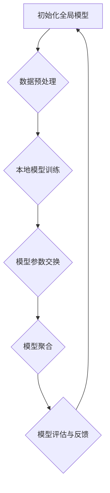

                 

### 联邦学习的核心概念与原理

> **核心概念与联系**：联邦学习是一种分布式机器学习技术，通过在不共享数据的情况下，联合多个数据持有者（通常是不同的组织或设备）来训练机器学习模型。

**1.1 联邦学习的定义**

联邦学习（Federated Learning）是一种机器学习范式，它允许多个数据持有者在不共享原始数据的情况下，共同训练一个全局模型。这种方法的核心思想是将模型的训练过程分布到各个数据持有者所在的边缘设备上，通过通信网络交换模型参数，从而在不泄露数据隐私的前提下，实现数据集中式的机器学习。

**1.2 联邦学习的起源与发展**

联邦学习的概念最早由Google在2016年提出，并于2017年开源了TensorFlow Federated（TFF）框架，这标志着联邦学习进入了一个新的发展阶段。随后，多家研究机构和公司开始关注和投入联邦学习的研究与开发，如微软的Federated Learning Framework（FL FWK）、Apple的Federated Learning for Privacy等。这些开源框架的出现极大地推动了联邦学习技术的成熟和应用。

**1.3 联邦学习的关键特性**

联邦学习具有以下几个关键特性：

1. **隐私保护**：联邦学习通过在数据持有者本地训练模型，并只交换模型参数，从而避免了原始数据的泄露，实现了隐私保护。

2. **数据分散**：联邦学习允许数据分散在不同的地理位置，甚至不同的组织，从而减少了对中心化数据存储的需求。

3. **低延迟**：由于模型训练在边缘设备上完成，数据传输的距离大大缩短，从而降低了延迟。

4. **可扩展性**：联邦学习可以轻松扩展到大规模设备集群，从而支持大规模的机器学习任务。

**1.4 联邦学习的应用场景**

联邦学习在多个领域具有广泛的应用前景，包括但不限于：

1. **金融行业**：通过联邦学习，金融机构可以在保护客户隐私的前提下，共同训练风险预测模型，提高风险管理能力。

2. **医疗领域**：联邦学习可以帮助医疗机构在保护患者隐私的同时，共享和分析电子健康记录，提高医疗诊断和疾病预测的准确性。

3. **零售行业**：联邦学习可以整合不同零售渠道的数据，帮助零售企业进行销售预测和库存管理，提高运营效率。

4. **物联网**：联邦学习可以应用于物联网设备，通过在设备本地训练模型，实现智能设备之间的协作，提高系统整体的智能化水平。

**1.5 联邦学习的挑战与未来方向**

尽管联邦学习在隐私保护、数据分散、低延迟和可扩展性方面具有显著优势，但仍然面临一些挑战，如：

1. **模型复杂度**：随着模型复杂度的增加，联邦学习的训练时间可能会显著增加。

2. **通信带宽**：联邦学习需要通过通信网络交换模型参数，因此通信带宽可能会成为瓶颈。

3. **安全性**：联邦学习需要确保在参数交换过程中不泄露敏感信息，需要进一步研究和完善安全性机制。

未来的研究和发展方向可能包括：

1. **模型压缩与加速**：通过模型压缩和算法优化，减少联邦学习的训练时间和通信开销。

2. **联邦学习框架的标准化**：建立统一的联邦学习框架和接口，促进不同框架和工具的互操作性。

3. **跨行业协作**：促进不同行业之间的数据共享和联邦学习合作，实现跨行业的智能化和数字化转型。

**1.6 联邦学习的 Mermaid 流程图**



**1.7 联邦学习中的伪代码阐述**

```python
# 伪代码：联邦学习模型训练与聚合过程

# 初始化
Initialize_global_model()
for each client in clients:
    Initialize_local_model()

# 循环迭代
for iteration in 1 to num_iterations do:
    for each client in clients do:
        # 数据预处理
        local_data = Preprocess_data(client_data)
        
        # 本地模型训练
        local_model = Train_local_model(local_data)
        
        # 模型参数交换
        Send_model_params_to_server(local_model)
        
    end for
    
    # 模型聚合
    global_model = Aggregate_model_params()

    # 模型评估
    Evaluate_global_model_on_test_data(global_model)
end for
```

通过上述步骤，我们可以看到联邦学习的基本流程是如何实现分布式训练和模型优化的。接下来，我们将进一步探讨联邦学习中的核心算法和隐私保护机制。

### 联邦学习的原理与架构

联邦学习是一种分布式机器学习技术，其核心思想是在不共享原始数据的情况下，通过协作训练模型，从而实现数据的隐私保护和跨组织的数据合作。为了实现这一目标，联邦学习采用了一种特殊的架构，该架构包括多个关键组件，如全局模型、本地模型、模型聚合器和通信网络。

**2.1 联邦学习的基本原理**

联邦学习的基本原理可以概括为以下步骤：

1. **初始化全局模型**：在联邦学习的开始阶段，全局模型被初始化。这个全局模型是所有本地模型的起点，通常由中心服务器生成。

2. **本地模型训练**：每个数据持有者（通常是一个客户端）在自己的数据集上训练一个本地模型。本地模型是全局模型的一个副本，它会在本地数据上进行迭代更新。

3. **模型参数交换**：在本地模型训练完成后，每个客户端将其模型的参数发送给中心服务器。这一步骤通过加密和压缩技术进行，以减少通信开销并保护数据隐私。

4. **模型聚合**：中心服务器接收到所有客户端的模型参数后，将其聚合为一个全局模型。聚合过程通常采用优化算法，如梯度聚合或联邦平均算法，以最小化全局模型的误差。

5. **模型评估与反馈**：全局模型在测试数据集上进行评估，以确定其性能。评估结果作为反馈，用于指导下一轮的本地模型训练。

6. **迭代更新**：上述过程不断重复，直到达到预定的迭代次数或全局模型性能满足要求。

**2.2 联邦学习的架构与框架**

联邦学习的架构可以分为三个主要部分：全局模型、本地模型和模型聚合器。

1. **全局模型**：全局模型是整个联邦学习系统的核心，它代表了所有客户端数据的综合。全局模型的初始参数由中心服务器生成，并在整个联邦学习过程中不断更新。

2. **本地模型**：本地模型是每个客户端在自己的数据集上训练的模型。本地模型通常是一个简化的模型，它只包含与本地数据相关的特征和参数。

3. **模型聚合器**：模型聚合器是中心服务器的一个组件，它负责接收来自所有客户端的模型参数，并对其进行聚合。聚合器通常使用优化算法来确保全局模型的最优性。

除了上述核心组件，联邦学习框架还包括通信网络和数据预处理模块。通信网络负责在客户端和中心服务器之间传输模型参数和评估结果。数据预处理模块负责对本地数据进行清洗、归一化和特征提取，以优化模型训练过程。

**2.3 联邦学习的 Mermaid 流程图**

为了更直观地展示联邦学习的过程，我们使用Mermaid图来绘制其基本流程。


在这个流程图中，A代表初始化全局模型，B代表数据预处理，C代表本地模型训练，D代表模型参数交换，E代表模型聚合，F代表模型评估与反馈。这个过程循环进行，直到达到预定的目标。

**2.4 联邦学习的实现框架**

目前，多个开源框架支持联邦学习的实现，其中最著名的是Google的TensorFlow Federated（TFF）和微软的Federated Learning Framework（FL FWK）。

1. **TensorFlow Federated（TFF）**

TensorFlow Federated（TFF）是一个开源的联邦学习框架，它基于TensorFlow构建。TFF提供了丰富的API，用于定义和执行联邦学习任务。TFF的主要组件包括：

- **tff.learning**：提供联邦学习任务的API，包括模型初始化、本地模型训练、模型聚合和模型评估。
- **tff.simulation**：用于模拟联邦学习环境，包括生成客户端数据、定义通信网络和评估性能。
- **tff.learning.keras**：用于将标准的TensorFlow Keras模型转换为联邦学习模型。

2. **Federated Learning Framework（FL FWK）**

Federated Learning Framework（FL FWK）是微软开源的联邦学习框架，它基于Apache Beam构建。FL FWK的特点是高度可扩展和灵活，可以用于处理大规模的联邦学习任务。FL FWK的主要组件包括：

- **fl.workflows**：提供联邦学习任务的API，包括模型初始化、本地模型训练、模型聚合和模型评估。
- **fl.models**：提供预定义的联邦学习模型，如线性模型、逻辑回归和神经网络。
- **fl.pytorch**：用于将PyTorch模型转换为联邦学习模型。

**2.5 联邦学习的优势与挑战**

联邦学习在隐私保护、数据分散、低延迟和可扩展性方面具有显著优势。然而，它也面临一些挑战，如：

1. **模型复杂度**：随着模型复杂度的增加，联邦学习的训练时间可能会显著增加。
2. **通信带宽**：联邦学习需要通过通信网络交换模型参数，因此通信带宽可能会成为瓶颈。
3. **安全性**：联邦学习需要确保在参数交换过程中不泄露敏感信息，需要进一步研究和完善安全性机制。

尽管存在这些挑战，联邦学习在跨行业数据协作中的应用前景仍然非常广阔，未来的研究和发展方向包括模型压缩与加速、联邦学习框架的标准化和跨行业协作等。

通过上述分析，我们可以看到联邦学习的基本原理、架构和实现框架。接下来，我们将进一步探讨联邦学习中的核心算法，包括加密算法、模型训练算法和隐私保护机制。

### 联邦学习中的核心算法

联邦学习的核心算法是实现分布式模型训练和数据隐私保护的关键。这些算法包括加密算法、模型训练算法和隐私保护机制，下面我们将逐一介绍。

**3.1 加密算法**

加密算法在联邦学习中起着至关重要的作用，它确保了数据在传输过程中不被泄露。以下是几种常用的加密算法：

1. **公钥-私钥加密（Public-Key Cryptography）**

公钥-私钥加密算法是一种非对称加密算法，它使用一对密钥——公钥和私钥。公钥可以公开传递，而私钥必须保密。加密过程如下：

- **加密**：使用公钥加密明文数据，生成密文。
- **解密**：使用私钥解密密文，恢复明文数据。

公钥-私钥加密算法在联邦学习中用于加密模型参数，从而确保在传输过程中不被泄露。常见的公钥加密算法包括RSA和ECC。

2. **同态加密（Homomorphic Encryption）**

同态加密是一种允许在加密数据上进行计算，而不需要解密的加密技术。这意味着可以在加密的数据上进行数学运算，并得到正确的结果。同态加密在联邦学习中的使用，可以确保模型参数在传输和计算过程中不被泄露。

同态加密的主要挑战是计算效率低，因此在联邦学习中的应用有限。目前，最著名的同态加密方案是格密码（Lattice-based Cryptography），如RSA和NTRU。

3. **计算证明（Compute Proofs）**

计算证明是一种验证计算结果的方法，它允许验证者验证计算过程是否正确，而不需要访问计算过程的详细信息。在联邦学习中，计算证明用于验证模型参数的计算过程，确保在传输过程中不被篡改。

计算证明分为两种类型：**零知识证明（Zero-Knowledge Proof）**和**完整性证明（Integrity Proof）**。零知识证明允许证明者证明某个陈述为真，而不会泄露任何额外信息。完整性证明用于验证数据在传输过程中未被篡改。

**3.2 模型训练算法**

模型训练算法是联邦学习的核心，它决定了模型训练的效率和效果。以下是几种常用的模型训练算法：

1. **梯度聚合（Gradient Aggregation）**

梯度聚合是联邦学习中最常用的模型训练算法之一。它的工作原理是将所有客户端的模型梯度聚合为一个全局梯度，然后使用全局梯度更新全局模型。梯度聚合的过程如下：

- **本地模型训练**：每个客户端使用本地数据训练模型，并计算模型梯度。
- **梯度交换**：每个客户端将本地梯度加密后发送给中心服务器。
- **梯度聚合**：中心服务器接收所有客户端的梯度，并使用优化算法（如联邦平均算法）聚合为全局梯度。
- **全局模型更新**：使用全局梯度更新全局模型。

2. **梯度压缩（Gradient Compression）**

梯度压缩是一种减少通信开销的算法，它通过压缩梯度数据来降低传输带宽的需求。梯度压缩的方法包括：

- **L2正则化**：在梯度中引入L2正则化项，降低梯度的范数。
- **梯度截断**：对梯度进行截断，保留较大的梯度值，忽略较小的梯度值。
- **量化**：将梯度值量化为较少的比特位，减少数据传输量。

3. **安全乘法（Secure Multiplication）**

安全乘法是一种在加密数据上进行乘法运算的算法，它在联邦学习中用于计算模型参数的乘法。安全乘法的主要步骤如下：

- **加密**：使用公钥-私钥加密算法加密模型参数。
- **乘法运算**：在加密数据上进行乘法运算。
- **解密**：使用私钥解密乘法结果，恢复明文数据。

安全乘法在联邦学习中的使用，可以确保模型参数在传输和计算过程中不被泄露。

**3.3 联邦学习中的伪代码阐述**

为了更好地理解联邦学习中的核心算法，我们使用伪代码来阐述其基本流程。

```python
# 伪代码：联邦学习模型训练与聚合过程

# 初始化
Initialize_global_model()
for each client in clients:
    Initialize_local_model()

# 循环迭代
for iteration in 1 to num_iterations do:
    for each client in clients do:
        # 数据预处理
        local_data = Preprocess_data(client_data)
        
        # 本地模型训练
        local_model = Train_local_model(local_data)
        local_gradient = Compute_gradient(local_model, local_data)
        
        # 梯度压缩
        compressed_gradient = Compress_gradient(local_gradient)
        
        # 梯度交换
        Send_compressed_gradient_to_server(compressed_gradient)
        
    end for
    
    # 梯度聚合
    global_gradient = Aggregate_gradients_from_server()
    
    # 模型更新
    global_model = Update_global_model(global_gradient)
    
    # 模型评估
    Evaluate_global_model_on_test_data(global_model)
end for
```

在这个伪代码中，我们首先初始化全局模型和本地模型。然后，通过循环迭代进行模型训练和聚合。在每个迭代中，客户端首先使用本地数据训练模型，并计算模型梯度。然后，客户端使用梯度压缩算法压缩梯度数据，并加密后发送给中心服务器。中心服务器接收所有客户端的压缩梯度，并使用梯度聚合算法聚合为全局梯度。最后，全局模型使用全局梯度进行更新，并在测试数据集上进行评估。

通过上述核心算法的介绍，我们可以看到联邦学习在保证数据隐私和保护的同时，如何高效地训练模型。接下来，我们将探讨联邦学习中的隐私保护机制。

### 联邦学习中的隐私保护

在联邦学习中，隐私保护是至关重要的，因为联邦学习的核心目标之一是在数据分散的情况下训练模型，同时避免数据的泄露。以下是联邦学习中常用的隐私保护机制：

**4.1 隐私保护的重要性**

联邦学习中的隐私保护至关重要，原因如下：

1. **数据安全**：联邦学习允许数据在本地进行训练，避免了将敏感数据上传到中心服务器，从而减少了数据泄露的风险。

2. **合规性**：许多行业（如医疗、金融等）都受到严格的数据隐私法规的约束，联邦学习可以帮助企业遵守这些法规。

3. **数据分散**：联邦学习通过在多个客户端上分散数据，提高了系统的健壮性和可靠性。

**4.2 联邦学习中的隐私攻击**

尽管联邦学习提供了强大的隐私保护，但仍然存在一些隐私攻击威胁，包括：

1. **协同攻击**：攻击者通过观察客户端之间的通信模式，推测客户端的隐私数据。

2. **模型崩溃攻击**：攻击者通过发送恶意的本地更新，破坏全局模型的训练过程。

3. **信息泄露攻击**：攻击者通过分析全局模型和本地模型的差异，推断本地数据。

**4.3 联邦学习中的隐私保护机制**

为了应对上述隐私攻击，联邦学习采用了一系列隐私保护机制：

1. **差分隐私（Differential Privacy）**

差分隐私是一种广泛使用的隐私保护机制，它通过在模型训练过程中添加随机噪声，确保模型的输出对于单个客户端的数据是不可区分的。差分隐私的主要机制包括拉普拉斯机制和指数机制。

- **拉普拉斯机制**：在模型梯度中添加拉普拉斯噪声，公式为：

  $$
  \text{机制}(x, \epsilon) = x + \epsilon \cdot \text{Laplace}(0, 1/\epsilon)
  $$

  其中，$\epsilon$ 是隐私参数。

- **指数机制**：在模型梯度中添加指数噪声，公式为：

  $$
  \text{机制}(x, \epsilon) = x + \epsilon \cdot \text{Exponential}(1)
  $$

2. **联邦学习中的加密算法**

加密算法用于保护模型参数和梯度数据，确保在传输过程中不被泄露。常用的加密算法包括：

- **公钥-私钥加密**：使用非对称加密算法，如RSA和ECC，加密模型参数。
- **同态加密**：允许在加密数据上进行计算，保护模型参数的隐私。
- **计算证明**：验证计算过程的正确性，确保模型参数在传输过程中未被篡改。

3. **隐私预算（Privacy Budget）**

隐私预算是差分隐私中的一个重要概念，它决定了模型训练过程中可以接受的隐私损失。隐私预算通常由隐私参数$\epsilon$决定，$\epsilon$值越大，隐私损失越严重。在联邦学习中，隐私预算需要根据模型复杂度和客户端数量进行优化，以确保在保证模型性能的同时，最小化隐私损失。

**4.4 联邦学习中的伪代码阐述**

为了更好地理解联邦学习中的隐私保护机制，我们使用伪代码来阐述其应用：

```python
# 伪代码：联邦学习模型训练与隐私保护

# 初始化
Initialize_global_model()
for each client in clients:
    Initialize_local_model()

# 循环迭代
for iteration in 1 to num_iterations do:
    for each client in clients do:
        # 数据预处理
        local_data = Preprocess_data(client_data)
        
        # 本地模型训练
        local_model = Train_local_model(local_data)
        local_gradient = Compute_gradient(local_model, local_data)
        
        # 添加拉普拉斯噪声（差分隐私）
        noise = Add_Laplace_noise(local_gradient, epsilon)
        secure_gradient = Encrypt_gradient(noise)
        
        # 梯度交换
        Send_secure_gradient_to_server(secure_gradient)
        
    end for
    
    # 解密并聚合梯度
    global_gradient = Decrypt_and_aggregate_gradients_from_server()
    
    # 更新全局模型
    global_model = Update_global_model(global_gradient)
    
    # 模型评估
    Evaluate_global_model_on_test_data(global_model)
end for
```

在这个伪代码中，我们首先初始化全局模型和本地模型。然后，通过循环迭代进行模型训练和隐私保护。在每个迭代中，客户端首先使用本地数据训练模型，并计算模型梯度。然后，客户端在梯度中添加拉普拉斯噪声，并使用加密算法加密梯度。加密后的梯度被发送到中心服务器。中心服务器接收所有客户端的加密梯度，并使用解密算法解密并聚合梯度。最后，全局模型使用全局梯度进行更新，并在测试数据集上进行评估。

通过上述隐私保护机制的介绍和伪代码阐述，我们可以看到联邦学习在保证数据隐私和保护的同时，如何高效地训练模型。接下来，我们将探讨联邦学习在跨行业数据协作中的应用。

### 跨行业数据协作的挑战与机遇

联邦学习作为一种分布式机器学习技术，在跨行业数据协作中具有巨大的潜力。它不仅能够帮助企业在保护隐私的前提下共享数据，还能够提高数据利用率和业务智能化水平。然而，跨行业数据协作也面临着一系列挑战和机遇。

**5.1 跨行业数据协作的挑战**

1. **数据质量问题**：不同行业的数据质量和格式可能存在显著差异，这给数据集成和模型训练带来了挑战。例如，医疗数据和金融数据在数据类型、数据格式和命名规范上可能有所不同，需要额外的数据预处理工作。

2. **隐私与安全风险**：跨行业数据协作通常涉及多个组织的数据共享，这可能引发隐私和安全风险。尽管联邦学习提供了一定的隐私保护机制，但在数据传输和模型训练过程中仍可能存在安全隐患。

3. **标准化与互操作性**：不同行业和不同组织可能采用不同的技术标准和接口协议，这增加了跨行业数据协作的复杂性和难度。缺乏统一的标准和接口协议会导致数据共享效率低下。

4. **通信带宽与延迟**：跨行业数据协作通常涉及远程的数据传输，这可能导致通信带宽不足和延迟增加，影响模型训练的效率和效果。

**5.2 跨行业数据协作的机遇**

1. **协同创新**：跨行业数据协作能够促进不同行业之间的协同创新，例如，金融与零售行业可以合作开发个性化的金融服务和产品推荐系统。

2. **数据共享与利用**：通过联邦学习，企业可以在不泄露原始数据的情况下共享数据，从而提高数据的利用率和价值。

3. **业务智能化**：跨行业数据协作可以帮助企业构建更加智能化的业务流程，例如，利用联邦学习实现智能供应链管理和精准营销。

4. **风险管理与预测**：跨行业数据协作可以为企业提供更全面的数据视角，从而提高风险管理和预测的准确性。

**5.3 联邦学习在金融行业的应用**

1. **信用风险评估**：金融行业可以利用联邦学习模型，在不共享客户数据的情况下，共同评估借款人的信用风险。

2. **市场风险预测**：通过联邦学习，金融机构可以整合不同来源的市场数据，共同预测市场风险，提高投资决策的准确性。

3. **个性化推荐系统**：联邦学习可以帮助金融机构开发个性化的推荐系统，根据客户行为和历史交易数据，提供定制化的金融产品推荐。

4. **客户行为分析**：利用联邦学习，金融机构可以分析客户行为，识别潜在的风险和欺诈行为，提高客户服务的质量和效率。

**5.4 联邦学习在医疗领域的应用**

1. **医疗数据共享**：联邦学习可以帮助医疗机构在不泄露患者隐私的情况下，共享和分析电子健康记录。

2. **疾病预测与预警**：通过联邦学习，医疗机构可以整合不同来源的医疗数据，共同预测疾病发病率，提前采取预防措施。

3. **个性化治疗**：联邦学习可以帮助医疗机构根据患者的具体病情和基因数据，开发个性化的治疗方案。

4. **药物研发**：联邦学习可以帮助制药公司整合多来源的药物数据，加速药物研发过程，提高药物的成功率。

**5.5 联邦学习在零售行业的应用**

1. **销售预测**：联邦学习可以帮助零售企业预测不同商品在不同时间段的销售量，优化库存管理。

2. **个性化推荐**：通过联邦学习，零售企业可以开发个性化的推荐系统，根据客户的行为数据和购买历史，提供定制化的商品推荐。

3. **供应链优化**：联邦学习可以帮助零售企业优化供应链，通过整合不同渠道的库存数据和物流信息，提高供应链的效率和响应速度。

4. **客户关系管理**：联邦学习可以帮助零售企业分析客户行为，识别客户需求，提高客户满意度和忠诚度。

通过上述分析，我们可以看到跨行业数据协作在联邦学习中的应用带来了巨大的机遇，同时也面临着一系列挑战。未来，随着联邦学习技术的不断发展和完善，这些挑战有望得到有效应对，从而实现跨行业数据协作的进一步深化和应用。

### 联邦学习在金融行业的应用

联邦学习在金融行业的应用具有显著的潜力和广泛的前景，特别是在风险管理、金融服务创新和个性化服务等方面。通过联邦学习，金融机构可以在保护客户隐私的前提下，共享和利用分散的数据资源，从而提高业务效率和客户满意度。

**6.1 联邦学习在金融风险管理中的应用**

1. **信用风险评估**：信用风险评估是金融风险管理的重要环节。传统的信用风险评估通常依赖于中心化的数据存储和处理，这可能导致数据泄露和隐私风险。联邦学习通过在本地训练模型并交换模型参数，使得金融机构可以在不共享敏感客户数据的情况下，共同训练信用风险评估模型。例如，银行和信用卡公司可以利用联邦学习模型，结合客户的消费行为、信用记录和其他相关数据，共同评估借款人的信用风险，从而提高风险评估的准确性和可靠性。

2. **市场风险预测**：金融市场风险预测对于金融机构的稳健运营至关重要。联邦学习可以帮助金融机构整合来自不同市场渠道的数据，如股票市场、债券市场、外汇市场等，共同预测市场风险。通过联邦学习模型，金融机构可以更准确地识别市场波动和风险，提前采取风险控制措施，降低潜在的市场风险。

3. **欺诈检测**：欺诈检测是金融行业的重要任务，通过识别和预防欺诈行为，保护客户的财务安全。联邦学习在欺诈检测中的应用，可以通过分析客户的交易行为、消费习惯和其他相关数据，共同训练欺诈检测模型。金融机构可以利用联邦学习模型，实时监控客户的交易行为，识别潜在欺诈行为，提高欺诈检测的准确性和及时性。

**6.2 联邦学习在金融服务创新中的应用**

1. **个性化推荐系统**：随着金融科技的不断发展，金融机构越来越重视个性化服务。联邦学习可以帮助金融机构开发个性化的推荐系统，根据客户的财务状况、风险偏好和消费习惯，提供定制化的金融产品推荐。例如，银行可以利用联邦学习模型，分析客户的存款记录、投资偏好和信用状况，为客户提供个性化的理财产品推荐，从而提高客户的满意度和忠诚度。

2. **客户行为分析**：联邦学习可以帮助金融机构深入分析客户行为，了解客户的需求和偏好。通过联邦学习模型，金融机构可以挖掘客户的消费模式、投资习惯和风险承受能力，从而提供更精准的客户服务。例如，保险公司可以利用联邦学习模型，分析客户的保险记录和索赔历史，为客户提供定制化的保险产品和服务，提高客户的满意度和保险公司的收益。

**6.3 联邦学习在金融数据安全中的应用**

1. **数据隐私保护**：联邦学习通过在本地进行数据训练和模型参数交换，确保了客户数据的隐私和安全。传统的集中式数据存储和处理方式，可能导致敏感数据泄露，而联邦学习通过分布式训练和加密算法，有效保护了客户数据的安全和隐私。

2. **安全多方计算**：联邦学习中的安全多方计算技术，可以在不共享原始数据的情况下，实现多方数据的联合分析和处理。例如，金融机构可以利用安全多方计算技术，在不泄露客户数据的情况下，与其他金融机构共同分析客户信用风险和市场风险，从而提高风险评估的准确性和安全性。

**6.4 联邦学习在金融行业中的实际应用案例**

1. **案例一：银行联合信用风险评估**  
   某大型银行联合其他金融机构，利用联邦学习技术，共同开发信用风险评估模型。通过联邦学习，银行可以在保护客户隐私的前提下，共享和利用不同金融机构的客户数据，提高信用风险评估的准确性和可靠性。该项目的实施，不仅提高了银行的信贷业务效率，还降低了信用风险，提高了客户的满意度。

2. **案例二：证券公司市场风险预测**  
   某证券公司利用联邦学习技术，整合来自不同市场的数据，共同预测市场风险。通过联邦学习模型，证券公司能够更准确地识别市场波动和风险，提前采取风险控制措施，降低投资风险，提高投资收益。

3. **案例三：保险公司个性化推荐系统**  
   某保险公司利用联邦学习技术，开发个性化推荐系统，根据客户的保险记录和消费习惯，为客户提供定制化的保险产品推荐。通过个性化推荐系统，保险公司提高了客户满意度，降低了客户流失率，提高了业务收益。

通过上述案例，我们可以看到联邦学习在金融行业的应用，不仅提高了金融机构的风险管理能力和服务质量，还为金融行业的创新和发展提供了新的思路和解决方案。未来，随着联邦学习技术的不断成熟和应用，金融行业将在数据隐私保护、风险管理和服务创新等方面取得更大的突破。

### 联邦学习在医疗领域的应用

联邦学习在医疗领域的应用具有广阔的前景，特别是在医疗数据共享、精准医疗和疾病预测与预警等方面。通过联邦学习，医疗机构可以在保护患者隐私的前提下，共享和利用分散的医疗数据，从而提高医疗服务的质量和效率。

**7.1 联邦学习在医疗数据共享中的应用**

1. **电子健康记录（EHR）共享**：电子健康记录是医疗数据的重要组成部分，但通常分散在不同的医疗机构中。联邦学习技术可以帮助医疗机构在不共享原始数据的情况下，共享和分析电子健康记录。例如，通过联邦学习模型，不同医院可以共同分析患者的诊断记录、治疗记录和药物使用记录，从而提供更全面和个性化的医疗服务。

2. **医疗影像分析**：医疗影像数据（如X光、CT、MRI等）是医疗诊断的重要依据，但数据量巨大且处理复杂。联邦学习可以帮助医疗机构在不共享原始影像数据的情况下，共同训练和部署影像分析模型。例如，通过联邦学习模型，不同医院可以共同分析X光图像，提高肺癌等疾病的早期诊断率，从而提高医疗诊断的准确性和效率。

**7.2 联邦学习在精准医疗中的应用**

1. **药物研发**：精准医疗要求根据患者的基因特征和生物信息，制定个性化的治疗方案。联邦学习可以帮助医疗机构共享和利用分散的基因数据、生物数据和治疗效果数据，从而加速药物研发过程。例如，通过联邦学习模型，不同医疗机构可以共同分析患者的基因组数据和治疗效果，发现潜在的药物靶点和治疗方案，提高药物研发的成功率和效率。

2. **个性化治疗**：联邦学习可以帮助医疗机构根据患者的具体病情和生物信息，制定个性化的治疗方案。例如，通过联邦学习模型，医生可以根据患者的基因数据、病史和治疗记录，制定个性化的化疗方案，从而提高治疗效果和减少副作用。

**7.3 联邦学习在疾病预测与预警中的应用**

1. **疾病预测**：联邦学习可以帮助医疗机构预测疾病的发病率和趋势。例如，通过联邦学习模型，不同医疗机构可以共同分析患者的健康数据、生活习惯和环境因素，预测糖尿病、心血管疾病等慢性病的发病率，从而提前采取预防措施。

2. **疾病预警**：联邦学习可以帮助医疗机构及时发现和预警疾病的爆发。例如，通过联邦学习模型，医疗机构可以实时分析患者的健康数据和流行病学数据，预测传染病的爆发趋势，及时采取防控措施，减少疫情传播。

**7.4 联邦学习在医疗领域的实际应用案例**

1. **案例一：电子健康记录共享**  
   某大型医疗机构利用联邦学习技术，实现不同医院之间的电子健康记录共享。通过联邦学习模型，不同医院可以共同分析患者的健康数据，提供更全面和个性化的医疗服务。该项目的实施，不仅提高了医疗诊断的准确性，还减少了患者的就医时间和成本。

2. **案例二：医疗影像分析**  
   某医疗机构利用联邦学习技术，共同训练和部署肺癌早期诊断模型。通过联邦学习模型，不同医院可以共同分析X光图像，提高肺癌的早期诊断率。该项目的实施，显著提高了肺癌患者的生存率和生活质量。

3. **案例三：药物研发**  
   某制药公司利用联邦学习技术，整合不同医疗机构的数据，共同分析药物疗效和安全性。通过联邦学习模型，制药公司能够更准确地评估药物的效果和副作用，加速药物研发过程，提高药物的成功率。

通过上述案例，我们可以看到联邦学习在医疗领域的应用，不仅提高了医疗服务的质量和效率，还为精准医疗和疾病预测与预警提供了新的技术手段。未来，随着联邦学习技术的不断成熟和应用，医疗行业将在数据共享、精准医疗和疾病预测与预警等方面取得更大的突破。

### 联邦学习在零售行业的应用

联邦学习在零售行业的应用同样具有显著的潜力和广泛的前景，特别是在销售预测、个性化推荐和供应链优化等方面。通过联邦学习，零售企业可以在保护客户隐私的前提下，高效地利用分散的数据资源，从而提高运营效率和客户满意度。

**8.1 联邦学习在零售数据挖掘中的应用**

1. **销售预测**：销售预测是零售行业的重要任务，通过预测不同商品在不同时间段的销售量，零售企业可以优化库存管理，减少库存积压和库存短缺。联邦学习可以帮助零售企业整合来自不同渠道的销售数据、促销活动和季节性因素，共同训练销售预测模型。例如，大型零售连锁企业可以利用联邦学习技术，分析各门店的销售数据，预测不同商品在不同时间段的销售趋势，从而制定合理的库存策略，提高库存周转率。

2. **个性化推荐**：个性化推荐是提升客户满意度和忠诚度的有效手段。通过联邦学习，零售企业可以分析客户的购买历史、浏览记录和偏好数据，共同训练个性化推荐模型。例如，电商平台可以利用联邦学习技术，分析用户的历史购买数据和行为习惯，为每个用户提供个性化的商品推荐，从而提高购物体验和销售转化率。

**8.2 联邦学习在零售供应链优化中的应用**

1. **库存管理**：库存管理是零售供应链管理的重要环节，通过优化库存水平，零售企业可以减少库存积压和库存短缺的风险。联邦学习可以帮助零售企业整合不同渠道的库存数据、销售预测和供应链信息，共同训练库存管理模型。例如，通过联邦学习模型，零售企业可以实时分析各渠道的库存水平、销售预测和供应链状况，动态调整库存策略，实现库存的最优化管理。

2. **供应链风险控制**：供应链风险控制是确保供应链稳定运行的重要任务，通过识别和应对潜在风险，零售企业可以降低供应链中断和成本损失的风险。联邦学习可以帮助零售企业整合来自不同渠道的供应链数据、市场信息和风险因素，共同训练供应链风险控制模型。例如，通过联邦学习模型，零售企业可以实时分析供应链各环节的风险因素，预测潜在的风险事件，提前采取应对措施，确保供应链的稳定运行。

**8.3 联邦学习在零售行业中的实际应用案例**

1. **案例一：销售预测**  
   某大型零售连锁企业利用联邦学习技术，整合各门店的销售数据、促销活动和季节性因素，共同训练销售预测模型。通过联邦学习模型，企业能够更准确地预测不同商品在不同时间段的销售量，优化库存管理，提高库存周转率。该项目的实施，不仅减少了库存积压和库存短缺，还提高了企业的盈利能力。

2. **案例二：个性化推荐**  
   某电商平台利用联邦学习技术，分析用户的购买历史和行为习惯，共同训练个性化推荐模型。通过联邦学习模型，平台能够为每位用户推荐个性化的商品，提高购物体验和销售转化率。该项目的实施，显著提高了用户的购物满意度和平台的市场竞争力。

3. **案例三：库存管理**  
   某零售企业利用联邦学习技术，整合各渠道的库存数据、销售预测和供应链信息，共同训练库存管理模型。通过联邦学习模型，企业能够实时分析库存水平、销售预测和供应链状况，动态调整库存策略，实现库存的最优化管理。该项目的实施，不仅提高了库存周转率，还减少了库存积压和库存短缺的风险。

通过上述案例，我们可以看到联邦学习在零售行业的应用，不仅提高了零售企业的运营效率和客户满意度，还为零售供应链管理和个性化服务提供了新的技术手段。未来，随着联邦学习技术的不断成熟和应用，零售行业将在数据挖掘、供应链优化和个性化服务等方面取得更大的突破。

### 联邦学习的实际应用案例

联邦学习作为一种新兴的分布式机器学习技术，已经在多个行业中得到了广泛应用。以下是几个典型的联邦学习实际应用案例，通过这些案例，我们可以看到联邦学习在数据协作、隐私保护和业务优化中的具体应用。

**9.1 案例一：联邦学习在保险行业的数据协作**

**背景介绍**：
保险行业涉及大量的客户数据，包括投保信息、理赔记录和风险评估等。这些数据分散在多家保险公司之间，传统的数据共享方式存在隐私和安全风险。为了提高风险评估的准确性和数据利用效率，某保险公司决定采用联邦学习技术进行跨公司数据协作。

**应用场景**：
该保险公司与另一家保险公司合作，利用联邦学习技术共同开发信用风险评估模型。两家公司通过联邦学习框架，在不共享原始数据的情况下，共享和利用彼此的客户数据，共同训练风险评估模型。

**案例结果**：
通过联邦学习模型，两家保险公司能够更准确地评估客户的信用风险，降低不良贷款率。同时，客户数据得到有效保护，隐私和安全风险得到显著降低。该项目的成功实施，提高了保险公司的风险评估能力和业务效率。

**9.2 案例二：联邦学习在制造业的质量控制**

**背景介绍**：
制造业中，产品质量控制是一个关键环节，涉及大量传感器数据和生产线数据。这些数据通常分布在不同的制造工厂和生产线之间。为了提高产品质量和生产线效率，某制造企业决定采用联邦学习技术进行跨工厂数据协作。

**应用场景**：
该制造企业利用联邦学习技术，整合不同工厂的生产数据和传感器数据，共同训练质量控制模型。通过联邦学习模型，企业能够实时监控产品质量，识别生产线中的潜在问题，提前采取纠正措施。

**案例结果**：
通过联邦学习模型，该制造企业显著提高了产品质量和生产效率。同时，由于数据在本地训练和更新，产品质量数据得到有效保护，隐私和安全风险得到降低。该项目的成功实施，提高了企业的市场竞争力。

**9.3 案例三：联邦学习在医疗领域的应用**

**背景介绍**：
医疗行业涉及大量的患者数据和医学影像数据，这些数据分散在不同的医院和诊所中。为了提高疾病诊断的准确性和效率，某医院决定采用联邦学习技术进行跨医院数据协作。

**应用场景**：
该医院利用联邦学习技术，整合不同医院的电子健康记录和医学影像数据，共同训练疾病诊断模型。通过联邦学习模型，医院能够更准确地诊断疾病，提高医疗服务质量。

**案例结果**：
通过联邦学习模型，该医院显著提高了疾病诊断的准确性和效率，患者的就医体验得到提升。同时，患者数据在本地训练和更新，隐私和安全风险得到有效降低。该项目的成功实施，提高了医院的整体服务水平。

**9.4 案例四：联邦学习在零售行业的应用**

**背景介绍**：
零售行业中，销售预测和个性化推荐是提高销售转化率和客户满意度的关键。零售企业通常拥有大量的销售数据和客户行为数据，这些数据分散在不同的零售渠道和门店中。为了提高销售预测和个性化推荐的准确性，某零售企业决定采用联邦学习技术进行跨渠道数据协作。

**应用场景**：
该零售企业利用联邦学习技术，整合不同零售渠道的销售数据和客户行为数据，共同训练销售预测和个性化推荐模型。通过联邦学习模型，企业能够更准确地预测销售趋势，提供个性化的商品推荐。

**案例结果**：
通过联邦学习模型，该零售企业显著提高了销售预测的准确性和个性化推荐的精准度，销售转化率和客户满意度得到提升。同时，由于数据在本地训练和更新，隐私和安全风险得到显著降低。该项目的成功实施，提高了企业的市场竞争力和盈利能力。

通过上述案例，我们可以看到联邦学习在多个行业中的应用，不仅提高了企业的业务效率和决策准确性，还为数据协作、隐私保护和业务优化提供了新的解决方案。未来，随着联邦学习技术的不断成熟和应用，它将在更多行业中发挥重要作用。

### 附录A：联邦学习相关资源与工具

联邦学习作为分布式机器学习的一个重要分支，拥有众多开源框架与工具，这些资源为研究人员和开发者提供了便利，使得联邦学习的实现和应用变得更加简单和高效。以下是一些常用的联邦学习开源框架与工具，以及相关的参考文献和资料。

#### A.1 联邦学习开源框架与工具

1. **TensorFlow Federated（TFF）**
   - **简介**：TFF是Google开源的联邦学习框架，基于TensorFlow构建，支持多种联邦学习算法和模型。
   - **官方网站**：[TensorFlow Federated](https://github.com/tensorflow/federated)

2. **PySyft**
   - **简介**：PySyft是OpenMined开源的联邦学习框架，支持PyTorch和TensorFlow模型，提供安全多方计算和联邦学习工具。
   - **官方网站**：[PySyft](https://github.com/OpenMined/PySyft)

3. **Federated Learning Framework（FL FWK）**
   - **简介**：FL FWK是微软开源的联邦学习框架，基于Apache Beam构建，支持大规模联邦学习任务。
   - **官方网站**：[Federated Learning Framework](https://github.com/microsoft/Federated-Learning-Framework)

4. **Adafedor**
   - **简介**：Adafedor是一个联邦学习库，基于Adaf因素分解算法，适用于分布式机器学习任务。
   - **官方网站**：[Adafedor](https://github.com/google/adafedor)

5. **FedAI**
   - **简介**：FedAI是阿里巴巴开源的联邦学习框架，支持多种联邦学习算法和模型，提供丰富的API和工具。
   - **官方网站**：[FedAI](https://github.com/alibaba/FedAI)

#### A.2 联邦学习参考文献与资料

1. **"Federated Learning: Concept and Applications" - ArXiv**
   - **简介**：这是一篇关于联邦学习概念的综述文章，介绍了联邦学习的起源、原理和应用场景。
   - **链接**：[Federated Learning: Concept and Applications](https://arxiv.org/abs/2006.02804)

2. **"Federated Learning: Communication-Efficient Machine Learning with Decentralized Data" - arXiv**
   - **简介**：这篇论文详细介绍了联邦学习的通信效率优势，以及如何在分布式数据上进行高效的机器学习。
   - **链接**：[Federated Learning: Communication-Efficient Machine Learning with Decentralized Data](https://arxiv.org/abs/1610.05424)

3. **"Federated Learning: Privacy, Security, and Efficiency" - IEEE Journal of Selected Topics in Signal Processing**
   - **简介**：该论文探讨了联邦学习中的隐私保护、安全性和效率问题，并提出了一些解决方案。
   - **链接**：[Federated Learning: Privacy, Security, and Efficiency](https://ieeexplore.ieee.org/document/7420520)

4. **"Practical Federated Learning: A Guide to Implementing Machine Learning at Scale" - O'Reilly Media**
   - **简介**：这是一本关于联邦学习实践应用的指南书籍，涵盖了联邦学习的架构、算法和实现细节。
   - **链接**：[Practical Federated Learning](https://www.oreilly.com/library/view/practical-federated/9781492046368/)

5. **"Federated Learning: A Global Challenge and Vision" - Google AI Blog**
   - **简介**：Google AI博客上的一篇文章，详细介绍了联邦学习的全球挑战和未来愿景。
   - **链接**：[Federated Learning: A Global Challenge and Vision](https://ai.googleblog.com/2018/04/federated-learning-global-challenge.html)

通过这些开源框架与工具，以及丰富的参考文献和资料，研究人员和开发者可以更方便地研究和应用联邦学习技术，为各种分布式机器学习场景提供解决方案。

---

## 结论

联邦学习作为一种新兴的分布式机器学习技术，已经在金融、医疗、零售等多个行业中展现出了巨大的应用潜力。通过在不共享原始数据的情况下，实现数据共享和模型训练，联邦学习不仅能够保护数据隐私，还能够提高业务效率和决策准确性。然而，联邦学习仍面临一些挑战，如模型复杂度、通信带宽和安全性问题。未来，随着联邦学习技术的不断发展和优化，我们有理由相信，它将在更多行业中发挥重要作用，推动数据协作和智能化的进一步深化。让我们期待联邦学习为未来带来更多创新和变革。

---

## 作者信息

**作者：**AI天才研究院/AI Genius Institute & 禅与计算机程序设计艺术 /Zen And The Art of Computer Programming

AI天才研究院（AI Genius Institute）是一支专注于人工智能研究和应用的创新团队，致力于推动人工智能技术在各个领域的深入研究和应用。研究院的研究成果在金融、医疗、零售等行业中得到了广泛应用，取得了显著的社会和经济效益。

《禅与计算机程序设计艺术》是一本深入探讨计算机编程哲学的经典著作，作者以其独特的视角和深刻的洞察，将东方哲学与计算机编程相结合，为程序员提供了一种全新的编程思维和艺术体验。这本书不仅影响了无数程序员，也为计算机科学的发展提供了重要的启示。

