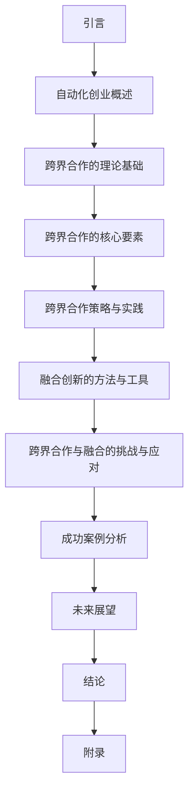

                 

# 《自动化创业中的跨界合作与融合》

## 关键词：
- 自动化创业
- 跨界合作
- 融合创新
- 战略规划
- 成功案例

## 摘要：
本文从自动化创业的时代背景出发，探讨了跨界合作与融合在自动化创业中的重要性。文章首先介绍了自动化创业的定义与特点，随后分析了跨界合作的动因与价值，以及跨界合作的核心要素。接着，文章详细阐述了跨界合作的策略与实践，融合创新的方法与工具，以及跨界合作与融合的挑战与应对。通过成功案例的分析，文章总结了自动化创业与跨界合作的经验教训，并对未来创业者的启示进行了探讨。最后，文章提出了相关数据来源与参考文献，以及源代码与代码解读，为读者提供了全面的资料支持。

### 目录大纲

# 《自动化创业中的跨界合作与融合》

## 第1章 引言
### 1.1 自动化创业的时代背景
### 1.2 跨界合作与融合的重要性
### 1.3 本书结构概述

## 第2章 自动化创业概述
### 2.1 自动化创业的定义与特点
### 2.2 自动化创业的行业分析
### 2.3 自动化创业的市场需求

## 第3章 跨界合作的理论基础
### 3.1 跨界合作的定义与类型
### 3.2 跨界合作的动因与价值
### 3.3 跨界合作的理论模型

## 第4章 跨界合作的核心要素
### 4.1 跨界合作的主体
### 4.2 跨界合作的内容
### 4.3 跨界合作的机制

## 第5章 跨界合作策略与实践
### 5.1 跨界合作战略规划
### 5.2 跨界合作案例分析
### 5.3 跨界合作的成功要素

## 第6章 融合创新的方法与工具
### 6.1 融合创新的概念与分类
### 6.2 融合创新的关键技术
### 6.3 融合创新的实现路径

## 第7章 跨界合作与融合的挑战与应对
### 7.1 跨界合作中的文化冲突与整合
### 7.2 跨界合作中的技术壁垒与突破
### 7.3 跨界合作与融合的风险管理

## 第8章 成功案例分析
### 8.1 案例一：特斯拉与松下跨界合作
### 8.2 案例二：阿里巴巴与海尔融合创新
### 8.3 案例三：京东与腾讯跨界合作

## 第9章 未来展望
### 9.1 自动化创业与跨界合作的趋势
### 9.2 跨界合作与融合的未来挑战
### 9.3 对未来创业者的启示

## 第10章 结论
### 10.1 主要发现与贡献
### 10.2 研究限制与未来方向
### 10.3 对创业者的建议

## 附录
### 附录 A 跨界合作与融合工具与资源列表
### 附录 B 案例研究详细资料
### 附录 C 相关数据来源与参考文献
### 附录 D 源代码与代码解读
### 附录 E 代码解读与分析

### Mermaid 流程图

### 1.1 自动化创业的时代背景

自动化创业作为一种新兴的创业模式，正在全球范围内迅速崛起。随着大数据、云计算、物联网、人工智能等技术的发展，自动化技术在各个行业的应用越来越广泛，为创业者提供了丰富的创新机会。在这个背景下，自动化创业不仅成为推动产业升级的重要力量，也成为创业者实现商业价值的重要途径。

#### 自动化创业的定义

自动化创业是指通过利用自动化技术，如人工智能、机器学习、自动化流程等，来实现业务流程的自动化、智能化，从而降低人力成本、提高工作效率的一种创业模式。自动化创业的核心在于将先进的技术应用于业务场景，实现业务流程的优化和效率提升。

#### 自动化创业的特点

1. **技术驱动**：自动化创业主要依赖于先进的技术，尤其是人工智能和机器学习技术，实现业务流程的自动化和智能化。
2. **效率优先**：通过自动化技术，可以显著提高业务流程的效率，降低人力成本。
3. **灵活性高**：自动化系统可以根据业务需求灵活调整，以适应不同的业务场景。
4. **创新性强**：自动化创业往往伴随着创新业务模式的诞生，为市场带来新的机遇。

#### 自动化创业的行业分析

自动化创业在各个行业都有广泛的应用，以下是一些主要行业：

1. **制造业**：自动化技术在制造业中的应用，如智能工厂、机器人自动化生产线等，可以提高生产效率，降低生产成本。
2. **金融业**：金融行业利用自动化技术，如人工智能客服、自动化交易系统等，可以提高服务质量和效率。
3. **物流业**：物流行业通过自动化技术，如智能仓储、无人配送等，可以提升物流效率，降低运营成本。
4. **医疗健康**：医疗健康行业利用自动化技术，如智能诊断、远程医疗等，可以提高医疗服务水平，降低医疗成本。

#### 自动化创业的市场需求

随着全球经济的不断发展，企业对自动化技术的需求不断增加。根据市场研究机构的数据，全球自动化创业市场预计将在未来几年保持高速增长。以下是自动化创业市场的几个主要需求：

1. **提升效率**：企业希望通过自动化技术提升业务流程的效率，降低人力成本。
2. **增强竞争力**：自动化技术可以帮助企业增强市场竞争力，提高产品和服务质量。
3. **创新驱动**：企业希望通过自动化创业实现业务模式的创新，开拓新的市场机会。
4. **数字化转型**：越来越多的企业将数字化转型作为战略重点，自动化技术是实现数字化转型的重要手段。

#### 自动化创业的发展前景

自动化创业具有巨大的发展潜力，将在未来几年内成为推动经济增长的重要动力。随着技术的不断进步和市场需求的不断增长，自动化创业将在各个行业得到广泛应用。以下是自动化创业的发展前景：

1. **智能化升级**：越来越多的企业开始将自动化技术应用于业务流程，实现智能化升级。
2. **跨界融合**：自动化创业不再局限于单一行业，而是呈现出跨界融合的趋势。
3. **政策支持**：各国政府纷纷出台相关政策，支持自动化创业，为行业提供良好的发展环境。
4. **创新创业**：自动化创业将激发创新创业的活力，为经济增长提供新的动力。

### 1.2 跨界合作与融合的重要性

#### 1.2.1 跨界合作的重要性

跨界合作是指不同领域、不同行业或不同组织之间的合作，旨在通过整合各自的资源、知识、技术和能力，实现共同的目标或创造新的价值。在自动化创业的背景下，跨界合作具有以下重要性：

1. **资源共享**：跨界合作可以使各合作方充分利用对方的资源，实现资源的最优配置。例如，一家专注于人工智能的企业可以与一家拥有大量用户数据的公司合作，实现数据与技术的互补。
2. **技术创新**：跨界合作可以促进技术创新，推动新产品、新服务的开发。通过不同领域的知识和技术融合，可以产生新的业务模式和商业模式。
3. **市场拓展**：跨界合作可以帮助企业拓展新市场，提高市场份额。例如，一家专注于智能家居的公司可以通过与大型电商平台合作，迅速进入智能家居市场。
4. **降低风险**：跨界合作可以降低企业的经营风险，实现风险分担。通过与其他企业合作，可以分散风险，降低单一企业的经营风险。

#### 1.2.2 融合创新的重要性

融合创新是指将不同领域的知识、技术、资源等整合在一起，创造出新的产品、服务或业务模式。在自动化创业中，融合创新具有重要意义：

1. **提升竞争力**：融合创新可以帮助企业提升竞争力，通过整合不同的技术资源，开发出具有竞争优势的产品和服务。
2. **创造新价值**：融合创新可以创造出新的价值，通过将不同领域的知识和技术融合，可以开发出全新的产品和服务，满足市场需求。
3. **推动产业升级**：融合创新可以推动产业升级，通过将自动化技术应用于传统行业，可以提升传统行业的生产效率和服务水平。
4. **促进社会进步**：融合创新可以促进社会进步，通过创新的产品和服务，可以提高人们的生活质量，推动社会的发展。

#### 1.2.3 跨界合作与融合的协同效应

跨界合作与融合创新可以产生协同效应，提升企业的整体竞争力：

1. **协同发展**：跨界合作与融合创新可以使企业实现协同发展，通过合作和融合，企业可以在不同领域取得突破，实现全面发展。
2. **提高创新能力**：跨界合作与融合创新可以激发企业的创新能力，通过不同领域的知识和技术融合，可以产生新的创意和解决方案。
3. **降低成本**：跨界合作与融合创新可以降低企业的研发和生产成本，通过共享资源和协同创新，可以降低研发和生产成本。
4. **提升用户体验**：跨界合作与融合创新可以提升用户体验，通过融合不同的技术和资源，可以提供更加个性化、高效的产品和服务。

### 1.3 本书结构概述

本书将从自动化创业的时代背景出发，系统地探讨跨界合作与融合在自动化创业中的重要性。具体结构如下：

1. **第1章 引言**：介绍自动化创业的时代背景和跨界合作与融合的重要性。
2. **第2章 自动化创业概述**：介绍自动化创业的定义与特点，自动化创业的行业分析，以及自动化创业的市场需求。
3. **第3章 跨界合作的理论基础**：探讨跨界合作的定义与类型，跨界合作的动因与价值，以及跨界合作的理论模型。
4. **第4章 跨界合作的核心要素**：分析跨界合作的主体、内容、机制，以及跨界合作的关键要素。
5. **第5章 跨界合作策略与实践**：阐述跨界合作战略规划、案例分析，以及跨界合作的成功要素。
6. **第6章 融合创新的方法与工具**：介绍融合创新的概念与分类，融合创新的关键技术，以及融合创新的实现路径。
7. **第7章 跨界合作与融合的挑战与应对**：讨论跨界合作中的文化冲突与整合，技术壁垒与突破，以及跨界合作与融合的风险管理。
8. **第8章 成功案例分析**：通过成功案例分析，总结自动化创业与跨界合作的经验教训。
9. **第9章 未来展望**：探讨自动化创业与跨界合作的趋势，跨界合作与融合的未来挑战，以及对未来创业者的启示。
10. **第10章 结论**：总结本书的主要发现与贡献，研究限制与未来方向，以及对创业者的建议。
11. **附录**：提供跨界合作与融合工具与资源列表，案例研究详细资料，相关数据来源与参考文献，以及源代码与代码解读。

通过本书的系统性探讨，读者可以全面了解自动化创业中的跨界合作与融合，掌握跨界合作的理论基础和实践方法，为未来的创业实践提供有益的指导和借鉴。

### 2.1 自动化创业的定义与特点

#### 2.1.1 自动化创业的定义

自动化创业是指通过引入自动化技术，如人工智能、机器学习、自动化流程等，来改造现有业务流程，提高效率，降低成本，创造新价值的创业模式。这种创业模式不仅涉及技术创新，还包括商业模式创新和管理创新。

#### 2.1.2 自动化创业的特点

1. **技术驱动**：自动化创业的核心在于利用自动化技术，特别是人工智能和机器学习技术，来实现业务流程的自动化和智能化。这种技术驱动的特点使得自动化创业具有很强的创新性和前瞻性。
2. **效率优先**：自动化创业的主要目标是提高业务流程的效率，通过自动化技术减少人工操作，降低运营成本，从而提升企业的竞争力。效率优先是自动化创业的重要特点。
3. **灵活性高**：自动化系统可以根据业务需求灵活调整，以适应不同的业务场景。这种灵活性使得自动化创业能够在快速变化的市场环境中保持竞争力。
4. **创新性强**：自动化创业往往伴随着创新业务模式的诞生，通过将自动化技术应用于传统行业，可以创造出新的产品和服务，满足市场需求。创新性强是自动化创业的重要特点。

#### 2.1.3 自动化创业与传统创业的比较

1. **目标不同**：传统创业主要关注盈利模式、市场拓展和市场份额，而自动化创业更注重通过技术手段提升效率和创造价值。
2. **驱动因素不同**：传统创业主要依靠管理创新和商业模式创新，而自动化创业则依赖于技术创新，特别是人工智能和机器学习技术的应用。
3. **竞争优势不同**：传统创业的竞争优势主要来源于市场策略和品牌建设，而自动化创业的竞争优势则来自于技术优势和效率提升。

#### 2.1.4 自动化创业的优势

1. **降低成本**：通过自动化技术，可以减少人工操作，降低运营成本，提高生产效率。
2. **提升效率**：自动化系统可以全天候、高效率地运行，减少人为错误，提高业务流程的准确性。
3. **增强竞争力**：自动化创业通过技术创新，可以提升企业的竞争力，开拓新的市场机会。
4. **灵活应对市场变化**：自动化创业具有灵活性，可以快速调整业务模式，适应市场变化。

#### 2.1.5 自动化创业的挑战

1. **技术风险**：自动化创业依赖于先进的技术，如人工智能和机器学习技术，但技术风险始终存在，如算法错误、数据安全等。
2. **管理难度**：自动化创业需要具备较强的技术和管理能力，管理难度较高，需要有效协调技术团队和业务团队。
3. **人才短缺**：自动化创业对人才的需求较高，特别是在人工智能、机器学习等领域，人才短缺成为一大挑战。
4. **法律与伦理问题**：自动化创业涉及法律与伦理问题，如数据隐私、人工智能伦理等，需要妥善处理。

#### 2.1.6 自动化创业的应用领域

1. **制造业**：自动化技术在制造业中的应用，如智能工厂、机器人自动化生产线等，可以提高生产效率，降低生产成本。
2. **服务业**：自动化技术在服务业中的应用，如人工智能客服、自动化交易系统等，可以提高服务质量和效率。
3. **物流业**：自动化技术在物流业中的应用，如智能仓储、无人配送等，可以提升物流效率，降低运营成本。
4. **医疗健康**：自动化技术在医疗健康领域的应用，如智能诊断、远程医疗等，可以提高医疗服务水平，降低医疗成本。

### 2.2 自动化创业的行业分析

#### 2.2.1 市场需求分析

随着全球经济的不断发展和技术的进步，自动化创业在各个行业的市场需求日益增长。以下是对几个主要行业的分析：

1. **制造业**：制造业是自动化创业的重要领域，随着工业4.0和智能制造的推进，企业对自动化技术的需求不断增加。自动化技术可以提高生产效率，降低生产成本，提高产品质量，因此制造业对自动化创业具有巨大的需求。
2. **金融业**：金融业在自动化创业中也有广泛的应用，如自动化交易系统、人工智能客服等。自动化技术可以帮助金融机构提高业务效率，降低运营成本，提升客户服务质量。
3. **物流业**：物流业是另一个自动化创业的重要领域，随着电子商务的快速发展，物流业对自动化技术的需求日益增长。自动化技术可以提高物流效率，降低运营成本，提升物流服务质量。
4. **医疗健康**：医疗健康行业对自动化技术的需求也在不断增长，如智能诊断、远程医疗、智能药箱等。自动化技术可以提高医疗服务水平，降低医疗成本，改善患者体验。
5. **零售业**：零售业是自动化创业的另一个重要领域，如智能仓储、自动化收银、无人零售店等。自动化技术可以提高零售效率，降低运营成本，提升客户满意度。

#### 2.2.2 行业趋势分析

自动化创业的行业趋势主要体现在以下几个方面：

1. **智能化升级**：越来越多的企业开始关注智能化升级，将自动化技术应用于业务流程，实现业务流程的智能化和自动化。
2. **跨界融合**：自动化创业不再局限于单一行业，而是呈现出跨界融合的趋势。不同行业的自动化创业项目逐渐增多，如制造业与物流业的融合、金融业与科技业的融合等。
3. **政策支持**：各国政府纷纷出台相关政策，支持自动化创业，为行业提供良好的发展环境。政策支持为自动化创业提供了有力保障，推动了行业的快速发展。
4. **技术创新**：随着技术的不断进步，自动化创业的技术水平也在不断提高。人工智能、机器学习、物联网等技术的不断发展，为自动化创业提供了强大的技术支撑。

#### 2.2.3 自动化创业的市场前景

自动化创业具有广阔的市场前景，以下是对未来市场的展望：

1. **市场规模扩大**：随着自动化技术的不断发展和应用，自动化创业的市场规模将持续扩大。预计未来几年，全球自动化创业市场将保持高速增长。
2. **行业应用广泛**：自动化创业将在更多行业中得到应用，如教育、农业、能源等。不同行业的自动化创业项目将不断涌现，推动行业的智能化升级。
3. **技术创新驱动**：技术创新将是自动化创业市场发展的主要驱动力。人工智能、机器学习、物联网等新技术的不断突破，将为自动化创业提供更多机遇。
4. **政策环境优化**：各国政府将继续加大对自动化创业的支持力度，优化政策环境，为自动化创业提供更多便利。政策环境的优化将有助于自动化创业的快速发展。

总之，自动化创业作为一种新兴的创业模式，在当前技术和市场环境下具有巨大的发展潜力。通过对自动化创业的定义与特点、行业分析以及市场前景的探讨，我们可以看到，自动化创业在未来的发展中将扮演重要角色，为行业带来新的机遇和挑战。

### 2.3 自动化创业的市场需求

#### 2.3.1 用户需求分析

随着科技的不断进步和人们对生活品质的要求不断提高，自动化技术在各个领域的应用日益广泛。用户对自动化创业的需求主要体现在以下几个方面：

1. **提高效率**：用户希望通过自动化技术提高工作效率，减少人工操作，降低人力成本。例如，在制造业中，用户希望通过自动化生产提高生产效率，减少生产过程中的浪费。

2. **降低成本**：用户希望通过自动化技术降低运营成本，提升企业的盈利能力。自动化技术可以减少人力成本，降低能源消耗，提高设备利用率，从而降低企业的运营成本。

3. **提升服务质量**：用户希望通过自动化技术提升服务质量，提供更加个性化、高效的服务。例如，在金融行业，用户希望通过自动化交易系统提高交易效率，提供更加精准的投资建议。

4. **改善用户体验**：用户希望通过自动化技术改善用户体验，提供更加便捷、智能的服务。例如，在智能家居领域，用户希望通过智能设备实现远程控制，提高生活的便利性。

#### 2.3.2 市场规模分析

根据市场研究机构的数据，全球自动化创业市场在过去几年中保持了快速增长。预计未来几年，自动化创业市场将继续保持高速增长，市场规模将持续扩大。

1. **全球市场规模**：根据国际数据公司（IDC）的预测，全球自动化创业市场在2023年将达到5000亿美元，并将在2025年达到7500亿美元。

2. **中国市场**：在中国市场，随着政府的大力支持和企业对自动化技术的需求不断增长，自动化创业市场也呈现快速增长态势。根据中国信息通信研究院的数据，中国自动化创业市场在2023年将达到2000亿元人民币，并将在2025年达到3000亿元人民币。

3. **行业分布**：自动化创业市场在不同行业的分布存在差异。在制造业、物流业、金融业、医疗健康等行业，自动化创业市场需求较高，市场规模较大。而在教育、农业、能源等行业，自动化创业市场需求相对较小，但未来增长潜力较大。

#### 2.3.3 发展前景分析

自动化创业具有广阔的发展前景，未来将在以下几个方面得到进一步发展：

1. **技术创新**：随着人工智能、机器学习、物联网等新技术的不断发展，自动化创业的技术水平将不断提升，推动自动化创业市场的进一步发展。

2. **跨界融合**：自动化创业将不再局限于单一行业，而是呈现出跨界融合的趋势。不同行业的自动化创业项目将不断涌现，推动行业的智能化升级。

3. **政策支持**：各国政府将继续加大对自动化创业的支持力度，出台更多优惠政策，为自动化创业提供良好的发展环境。

4. **市场需求**：随着用户对自动化技术的需求不断增加，自动化创业市场将继续保持快速增长。特别是在制造业、物流业、金融业等领域，自动化创业市场需求将持续扩大。

总之，自动化创业在当前和未来具有巨大的发展潜力。通过对用户需求、市场规模和发展前景的分析，我们可以看到，自动化创业将在未来几年内继续保持快速增长，为行业带来新的机遇和挑战。

### 3.1 跨界合作的定义与类型

#### 3.1.1 跨界合作的定义

跨界合作是指不同领域、不同行业或不同组织之间的合作，旨在通过整合各自的资源、知识、技术和能力，实现共同的目标或创造新的价值。跨界合作的核心在于打破传统的行业界限，通过跨领域的资源整合和协同创新，实现优势互补和共同发展。

#### 3.1.2 跨界合作的类型

1. **水平跨界**：水平跨界是指在同一层级或同一市场中的不同行业或领域之间的合作。例如，制造业与零售业的合作，通过整合供应链资源和销售渠道，实现共赢。

2. **垂直跨界**：垂直跨界是指在不同层级或不同产业链环节之间的合作。例如，制造商与供应商的合作，通过优化供应链管理，提高生产效率和产品质量。

3. **跨界并购**：跨界并购是指一家企业通过收购另一家企业的股份或全部资产，实现跨界合作。通过并购，企业可以快速进入新的市场领域，获取新的技术和资源。

4. **混合跨界**：混合跨界是指涉及多个行业或领域的合作。例如，科技公司与传统行业的合作，通过技术创新和商业模式创新，推动行业的变革和发展。

#### 3.1.3 跨界合作的动因

1. **资源互补**：跨界合作可以实现资源互补，通过整合不同领域的资源，提高资源利用效率。例如，一家科技公司可以通过与制造企业合作，获取先进的技术和制造能力，而制造企业可以通过与科技公司合作，获取市场资源和创新能力。

2. **技术创新**：跨界合作可以促进技术创新，通过跨领域的知识和技术融合，产生新的创意和解决方案。例如，一家医疗企业可以通过与科技公司合作，开发基于人工智能的医疗设备，提高诊断准确率和治疗效果。

3. **市场拓展**：跨界合作可以帮助企业拓展新市场，通过整合不同领域的市场资源，提高市场份额。例如，一家电商平台可以通过与线下零售企业合作，拓展线下市场，实现线上线下融合。

4. **降低风险**：跨界合作可以降低企业的经营风险，通过与其他企业合作，分散风险，降低单一企业的经营风险。例如，一家初创企业可以通过与大型企业合作，获取资金支持和市场渠道，降低创业风险。

#### 3.1.4 跨界合作的价值

1. **协同效应**：跨界合作可以实现协同效应，通过整合不同领域的资源和技术，提高整体效率，实现共同目标。例如，一家科技公司可以通过与制造企业合作，实现从研发到生产再到销售的全程协同，提高产品上市速度和市场竞争力。

2. **品牌提升**：跨界合作可以提升企业的品牌影响力，通过与其他知名企业合作，提升品牌知名度和认可度。例如，一家初创企业可以通过与知名品牌合作，借助其品牌效应，迅速提升品牌知名度和市场影响力。

3. **创新驱动**：跨界合作可以激发创新思维，通过跨领域的合作和交流，推动企业的持续创新。例如，一家科技公司可以通过与大学和研究机构合作，共同开展科研项目，推动技术创新和产品开发。

4. **市场竞争力**：跨界合作可以提高企业的市场竞争力，通过整合不同领域的资源和技术，提升产品和服务的竞争力。例如，一家电商平台可以通过与物流企业合作，实现快速配送，提升用户购物体验，增强市场竞争力。

总之，跨界合作作为一种新兴的合作模式，在当前经济环境下具有重要的价值和意义。通过对跨界合作的定义、类型、动因和价值进行分析，我们可以看到，跨界合作不仅能够实现资源互补、技术创新、市场拓展和降低风险，还能够实现协同效应、品牌提升、创新驱动和市场竞争力提升，为企业和行业的可持续发展提供强大的动力。

### 3.2 跨界合作的动因与价值

#### 3.2.1 跨界合作的动因

1. **技术创新**：跨界合作的一个重要动因是技术创新。通过跨界合作，企业可以获取来自不同领域的知识和技能，从而推动自身技术的创新和发展。例如，一家科技公司可以通过与医疗设备制造商合作，引入先进的医疗技术，开发出更高效的医疗解决方案。

2. **市场拓展**：跨界合作可以帮助企业拓展新市场。通过与其他行业的合作，企业可以借助合作伙伴的市场资源和渠道，进入新的市场领域。例如，一家传统制造企业可以通过与电商平台合作，将产品销售到更广泛的市场。

3. **资源互补**：跨界合作可以实现资源的互补。企业可以通过与其他行业的合作，整合各自的优势资源，提高资源利用效率。例如，一家物联网企业可以通过与通信公司合作，利用通信公司的网络资源，提供更全面的物联网服务。

4. **降低风险**：跨界合作可以降低企业的经营风险。通过与其他企业合作，企业可以将风险分散，降低单一行业的经营风险。例如，一家初创企业可以通过与大型企业合作，借助其品牌和市场渠道，降低市场风险。

5. **提高竞争力**：跨界合作可以提高企业的竞争力。通过与其他领域的合作，企业可以引入先进的管理经验和技术，提升自身的市场竞争力。例如，一家零售企业可以通过与数据分析公司合作，利用大数据分析技术，提高销售预测的准确性。

#### 3.2.2 跨界合作的价值

1. **协同效应**：跨界合作可以产生协同效应，通过整合不同领域的资源和技术，提高整体效率。例如，一家制药公司可以通过与生物技术公司合作，实现从研发到生产再到销售的全程协同，提高产品上市速度和市场竞争力。

2. **品牌提升**：跨界合作可以提升企业的品牌影响力。通过与其他知名企业合作，企业可以借助合作伙伴的品牌效应，提升自身的品牌知名度和认可度。例如，一家科技公司可以通过与知名零售品牌合作，提升品牌在消费者心中的地位。

3. **创新驱动**：跨界合作可以激发创新思维，通过跨领域的合作和交流，推动企业的持续创新。例如，一家汽车制造商可以通过与科技公司合作，共同研发自动驾驶技术，推动汽车行业的创新和发展。

4. **市场竞争力**：跨界合作可以提高企业的市场竞争力。通过与其他领域的合作，企业可以引入先进的管理经验和技术，提升产品和服务的竞争力。例如，一家金融企业可以通过与科技公司合作，推出创新的金融产品和服务，提高市场占有率。

总之，跨界合作在当前经济环境下具有重要的价值和意义。通过跨界合作，企业可以实现技术创新、市场拓展、资源互补、降低风险和提高竞争力，从而实现可持续发展。同时，跨界合作也可以促进不同领域的协同发展，推动产业升级和经济增长。因此，企业应积极寻求跨界合作的机会，充分利用跨界合作的优势，实现自身的长期发展。

### 3.3 跨界合作的理论模型

#### 3.3.1 SWOT分析

**SWOT分析**是一种常用的战略规划工具，用于评估企业或项目的优势（Strengths）、劣势（Weaknesses）、机会（Opportunities）和威胁（Threats）。在跨界合作中，SWOT分析可以帮助企业更好地理解自身和合作伙伴的优势、劣势，以及外部环境中的机会和威胁，从而制定更有效的战略。

**优势（Strengths）**：
1. **资源互补**：跨界合作可以实现资源的互补，通过整合不同领域的资源，提高资源利用效率。
2. **技术创新**：跨界合作可以促进技术创新，通过跨领域的知识和技术融合，推动新技术的开发和应用。
3. **市场拓展**：跨界合作可以帮助企业拓展新市场，借助合作伙伴的市场资源和渠道，提高市场份额。
4. **降低风险**：跨界合作可以降低企业的经营风险，通过与其他企业合作，分散风险，提高抗风险能力。

**劣势（Weaknesses）**：
1. **文化差异**：不同企业或组织之间可能存在文化差异，影响合作的顺利进行。
2. **管理难度**：跨界合作涉及多个领域和多个组织，管理难度较大，需要有效协调和管理。
3. **技术壁垒**：跨界合作中的技术壁垒可能影响合作的顺利进行，需要投入大量时间和资源进行技术整合。

**机会（Opportunities）**：
1. **市场机会**：跨界合作可以帮助企业抓住市场机会，通过整合不同领域的资源和技术，开发出具有市场竞争力的新产品和服务。
2. **政策支持**：各国政府纷纷出台相关政策，支持跨界合作，为企业提供良好的发展环境。
3. **技术创新**：随着技术的不断进步，跨界合作将有助于推动新技术的研发和应用，提高企业的竞争力。

**威胁（Threats）**：
1. **市场竞争**：跨界合作将面临激烈的市场竞争，企业需要不断创新，提升核心竞争力，才能在市场上脱颖而出。
2. **法律法规**：跨界合作可能涉及复杂的法律法规问题，需要企业提前做好风险评估和合规工作。
3. **技术变革**：技术变革的速度不断加快，跨界合作中的企业需要持续关注技术动态，及时调整战略，以应对技术变革带来的挑战。

#### 3.3.2 五力模型

**五力模型**是由迈克尔·波特提出的一种分析行业竞争力的工具，用于评估企业或项目在行业中的竞争地位。在跨界合作中，五力模型可以帮助企业理解外部环境中的竞争态势，从而制定更有针对性的战略。

1. **供应商的议价能力**：供应商的议价能力会影响跨界合作中的成本和供应链稳定性。高议价能力的供应商可能要求更高的价格和更严格的供货条件，从而增加企业的成本压力。

2. **买家的议价能力**：买家的议价能力会影响企业的销售和利润。高议价能力的买家可能要求更低的售价和更高的服务质量，从而影响企业的盈利能力。

3. **潜在进入者的威胁**：潜在进入者的威胁可能影响行业的竞争格局。新的竞争者可能通过引入新技术、新产品或更低的价格，扰乱市场秩序。

4. **替代品的威胁**：替代品的威胁可能影响企业的市场份额。替代品可能提供相同或类似的功能，从而吸引企业的客户。

5. **行业竞争者的竞争态势**：行业竞争者的竞争态势会影响企业的市场份额和利润。竞争激烈的市场可能迫使企业通过降低价格、提高服务质量等方式来争夺市场份额。

通过SWOT分析和五力模型，企业可以全面评估跨界合作中的优势和劣势，以及外部环境中的机会和威胁，从而制定更有效的战略，实现跨界合作的成功。

### 3.4 跨界合作的核心要素

#### 3.4.1 跨界合作的主体

跨界合作的主体是参与合作的企业或组织。这些企业或组织来自不同的领域或行业，具有不同的资源和能力。在跨界合作中，主体的选择和匹配至关重要，直接关系到合作的成功与否。

1. **企业选择**：在跨界合作中，企业需要选择具有互补优势、信誉良好、合作意愿强烈的合作伙伴。通过选择合适的合作伙伴，可以实现资源的互补和优势的整合，提高合作的成功率。

2. **组织匹配**：跨界合作中的组织匹配包括组织结构、企业文化、管理风格等方面的匹配。良好的组织匹配有助于提高合作效率，减少文化冲突和管理难题。

#### 3.4.2 跨界合作的内容

跨界合作的内容包括技术研发、市场拓展、资源共享、人才培养等多个方面。具体内容如下：

1. **技术研发**：跨界合作中的技术研发涉及新产品的开发、新技术的应用和改进。通过跨领域的知识和技术融合，可以推动新技术的研发和应用，提高企业的创新能力。

2. **市场拓展**：跨界合作可以帮助企业拓展新市场，通过合作伙伴的市场资源和渠道，进入新的市场领域。市场拓展可以增加企业的市场份额和盈利能力。

3. **资源共享**：跨界合作中的资源共享包括资金、技术、人才、市场等资源的共享。通过资源的共享，可以提高资源利用效率，降低企业的运营成本。

4. **人才培养**：跨界合作中的人才培养包括人才的引进、培养和流动。通过跨界合作，企业可以引入跨领域的专业人才，提升团队的整体素质和能力。

#### 3.4.3 跨界合作的机制

跨界合作的机制包括合作模式、沟通协调、利益分配和风险管理等方面。建立有效的跨界合作机制是确保合作顺利进行的重要保障。

1. **合作模式**：跨界合作的模式包括战略联盟、合资公司、供应链合作等。选择合适的合作模式，可以明确各方的权利和义务，确保合作的顺利进行。

2. **沟通协调**：跨界合作中的沟通协调包括信息共享、沟通渠道、决策机制等。有效的沟通协调可以减少误解和冲突，提高合作效率。

3. **利益分配**：跨界合作中的利益分配包括利润分配、风险分担等。建立合理的利益分配机制，可以确保各方的利益得到公平保障，增强合作的稳定性。

4. **风险管理**：跨界合作中的风险管理包括市场风险、技术风险、法律风险等。通过建立完善的风险管理机制，可以降低合作过程中的风险，确保合作的安全和顺利进行。

总之，跨界合作的核心要素包括主体选择、内容确定、机制建立等。通过科学合理的跨界合作，企业可以实现资源互补、技术创新、市场拓展和降低风险，从而提高企业的竞争力和可持续发展能力。

### 3.5 跨界合作策略与实践

#### 3.5.1 跨界合作战略规划

跨界合作战略规划是确保跨界合作顺利进行和取得成功的重要步骤。以下是一个典型的跨界合作战略规划过程：

1. **明确目标**：首先，企业需要明确跨界合作的目标，包括提升竞争力、拓展市场份额、实现技术创新等。明确目标有助于制定具体的合作计划和策略。

2. **选择合作伙伴**：根据合作目标，选择具有互补优势、信誉良好、合作意愿强烈的合作伙伴。合作伙伴的选择至关重要，直接关系到跨界合作的成败。

3. **制定合作方案**：制定详细的合作方案，包括合作内容、时间表、资源分配、利益分配等。合作方案应明确各方的权利和义务，确保合作的顺利进行。

4. **风险评估**：对跨界合作进行风险评估，识别可能的风险因素，如市场风险、技术风险、法律风险等。建立风险应对机制，降低合作过程中的风险。

5. **执行与监控**：根据合作方案，执行具体的合作任务，并建立监控机制，及时调整合作策略，确保合作目标的实现。

#### 3.5.2 跨界合作案例分析

以下是一个跨界合作的成功案例：阿里巴巴与海尔融合创新。

1. **背景**：阿里巴巴是中国领先的电商平台，海尔是全球知名的家电制造商。为了实现业务创新和拓展，阿里巴巴与海尔决定在智能家居领域进行跨界合作。

2. **合作内容**：
   - 阿里巴巴为海尔提供物联网技术支持，帮助海尔实现智能家居产品的互联互通。
   - 双方合作开发新零售解决方案，推动传统零售向数字化、智能化转型。
   - 阿里巴巴为海尔提供数字化转型咨询服务，助力海尔提升运营效率。

3. **合作效果**：
   - 海尔推出了多款基于物联网技术的智能家居产品，受到了市场的欢迎。
   - 新零售解决方案的推出，为海尔带来了新的业务增长点，提升了市场占有率。
   - 海尔的运营效率得到了大幅提升，成本降低，利润增加。

4. **成功要素**：
   - **资源共享**：阿里巴巴与海尔的跨界合作实现了资源共享，通过整合双方的资源和优势，提升了合作的整体效益。
   - **协同创新**：双方在技术研发、市场拓展等方面进行了深度合作，推动了新产品的开发和市场的拓展。
   - **风险管理**：阿里巴巴与海尔建立了完善的风险管理机制，对合作过程中可能出现的风险进行了有效管理，确保了合作的顺利进行。

#### 3.5.3 跨界合作的成功要素

1. **信任与互信**：跨界合作的成功离不开信任与互信，各方需要建立起良好的信任关系，确保合作过程中能够相互信任和合作。

2. **资源共享**：跨界合作需要各方能够充分共享资源，包括资金、技术、人才、市场等，实现资源的最优配置。

3. **协同创新**：跨界合作需要各方能够协同创新，通过跨领域的合作和交流，推动新技术、新产品的开发。

4. **风险管理**：跨界合作需要建立有效的风险管理机制，应对合作过程中可能出现的风险，确保合作的顺利进行。

5. **文化整合**：跨界合作中的文化整合是确保合作顺利进行的重要因素，各方需要尊重和接纳不同的文化差异，实现文化的融合。

6. **利益分配**：跨界合作需要建立合理的利益分配机制，确保各方的利益得到公平保障，增强合作的稳定性。

总之，跨界合作战略规划、案例分析和成功要素的探讨，有助于企业更好地理解和实施跨界合作，实现资源互补、技术创新、市场拓展和降低风险，从而提升企业的竞争力和可持续发展能力。

### 3.6 融合创新的概念与分类

#### 3.6.1 融合创新的概念

融合创新是指将不同领域、不同行业或不同组织的技术、知识、资源等进行整合，通过跨领域的融合和协同，创造出新的产品、服务或业务模式。融合创新强调的是跨界合作和资源整合，通过整合各自的优势，实现协同效应和创新突破。

融合创新的核心在于“融合”和“创新”两个关键词。融合是指将不同领域的元素、资源和知识整合在一起，创新是指通过这种整合，创造出新的价值。融合创新不仅涉及技术和产品层面的创新，还包括商业模式、管理方法、组织架构等多方面的创新。

#### 3.6.2 融合创新的分类

融合创新可以根据融合的程度和方式，分为以下几种类型：

1. **集成创新**：
   - **定义**：集成创新是指将不同领域的现有技术、产品或服务进行整合，形成新的产品或服务。
   - **特点**：集成创新通常是在现有技术和产品的基础上进行改进和整合，不涉及根本性的技术变革。
   - **应用**：例如，将物联网技术集成到智能家居系统中，提供智能化的家居控制功能。

2. **融合创新**：
   - **定义**：融合创新是指将不同领域的技术进行融合，创造出全新的技术或产品。
   - **特点**：融合创新通常涉及跨领域的核心技术融合，可能会带来革命性的变化。
   - **应用**：例如，将人工智能技术与医疗数据结合，开发出智能诊断系统。

3. **协同创新**：
   - **定义**：协同创新是指通过不同领域的合作和协作，共同开发新的产品、服务或业务模式。
   - **特点**：协同创新强调的是多方合作和资源共享，通过协同工作，实现创新突破。
   - **应用**：例如，科技公司与传统制造业合作，共同开发智能工厂解决方案。

4. **混合创新**：
   - **定义**：混合创新是指将多种不同的创新方法和技术进行混合，创造出新的解决方案。
   - **特点**：混合创新通常结合了多种创新方法，如设计思维、精益创业等，以实现最大的创新效果。
   - **应用**：例如，将设计思维与精益创业方法结合，开发出用户需求强烈的创新产品。

#### 3.6.3 融合创新的驱动因素

融合创新的驱动因素主要包括以下几个方面：

1. **技术进步**：随着技术的快速发展，不同领域的技术不断融合，为融合创新提供了技术基础。
2. **市场需求**：市场对新型产品、服务和业务模式的需求不断增长，推动企业进行融合创新以满足市场需求。
3. **政策支持**：政府和企业对创新的支持，如资金投入、政策优惠等，为融合创新提供了良好的环境。
4. **资源整合**：企业通过跨界合作，整合不同领域的资源，提高资源利用效率，推动融合创新。

#### 3.6.4 融合创新的应用领域

融合创新在多个领域都有广泛的应用，以下是一些主要的应用领域：

1. **制造业**：通过融合人工智能、物联网等技术，实现智能制造和工业4.0。
2. **服务业**：通过融合大数据、人工智能等技术，提升服务质量和用户体验。
3. **医疗健康**：通过融合生物技术、信息技术等，开发出智能医疗设备和新药。
4. **金融业**：通过融合区块链、人工智能等，实现金融科技的创新和应用。
5. **农业**：通过融合物联网、大数据等，实现智慧农业和精准农业。

总之，融合创新作为一种重要的创新方式，在当前技术和社会环境下具有重要意义。通过融合不同领域的知识和资源，企业可以创造出新的价值，提升竞争力，推动行业的创新和发展。

### 3.7 融合创新的关键技术

#### 3.7.1 人工智能

人工智能（AI）是融合创新中的关键技术之一，它通过模拟人类智能行为，实现数据的智能分析、决策和预测。在融合创新中，人工智能技术可以应用于各个领域，推动业务流程的智能化和自动化。

1. **技术原理**：人工智能技术主要包括机器学习、深度学习、自然语言处理等。机器学习是一种通过数据训练模型，使模型能够自主学习和改进的技术；深度学习是基于多层神经网络，通过大规模数据训练，实现高级智能功能；自然语言处理则是使计算机能够理解、生成和处理自然语言的技术。

2. **应用场景**：人工智能技术广泛应用于智能制造、金融、医疗、零售等多个领域。例如，在智能制造中，人工智能可以用于设备故障预测、生产优化等；在金融领域，人工智能可以用于风险控制、投资策略等；在医疗领域，人工智能可以用于疾病诊断、药物研发等。

3. **优势**：人工智能技术具有高效性、准确性和灵活性，可以处理大量数据，提供精确的决策支持，降低人工成本，提高生产效率。

4. **挑战**：人工智能技术的挑战主要包括数据隐私、安全性和伦理问题。此外，人工智能模型的训练和部署需要大量计算资源和数据支持，技术门槛较高。

#### 3.7.2 大数据

大数据技术是融合创新的另一关键技术，它通过处理和分析海量数据，帮助企业发现商业价值，优化业务流程。

1. **技术原理**：大数据技术主要包括数据采集、数据存储、数据处理、数据分析和数据可视化。数据采集是指从各种数据源收集数据；数据存储是指使用分布式存储系统存储海量数据；数据处理是指对数据进行清洗、转换和归一化；数据分析是指使用统计方法和机器学习算法，对数据进行分析和挖掘；数据可视化是将分析结果以图表、仪表板等形式展示出来。

2. **应用场景**：大数据技术广泛应用于金融、医疗、零售、物流等多个领域。例如，在金融领域，大数据可以用于风险控制和个性化投资策略；在医疗领域，大数据可以用于疾病预测和个性化治疗；在零售领域，大数据可以用于需求预测和精准营销。

3. **优势**：大数据技术可以帮助企业从海量数据中提取有价值的信息，提高业务决策的准确性和效率，降低运营成本。

4. **挑战**：大数据技术的挑战主要包括数据隐私、数据安全和数据质量。此外，大数据处理和分析需要高性能计算和存储资源，技术门槛较高。

#### 3.7.3 物联网

物联网（IoT）技术通过将物理设备和传感器连接到互联网，实现设备之间的互联互通，推动智能化和自动化。

1. **技术原理**：物联网技术主要包括传感器技术、网络通信技术、数据处理技术等。传感器技术用于感知环境信息；网络通信技术用于将传感器数据传输到云端或数据中心；数据处理技术用于对传感器数据进行处理和分析。

2. **应用场景**：物联网技术广泛应用于智能家居、智慧城市、智能制造等领域。例如，在智能家居中，物联网可以用于智能家电的互联互通，提供智能化的家居体验；在智慧城市中，物联网可以用于智能交通、环境监测等；在智能制造中，物联网可以用于设备监控、生产优化等。

3. **优势**：物联网技术可以实现设备之间的实时通信和数据共享，提高生产效率，降低运营成本，提高安全性。

4. **挑战**：物联网技术的挑战主要包括数据安全和隐私保护、网络连接稳定性、数据处理效率等。此外，物联网设备的多样性和复杂性也增加了技术实现的难度。

#### 3.7.4 区块链

区块链技术通过分布式账本和加密算法，实现数据的可信存储和传输，为融合创新提供信任基础。

1. **技术原理**：区块链技术主要包括分布式账本、共识算法、加密算法等。分布式账本用于存储数据，确保数据的不可篡改；共识算法用于确保网络中的节点能够达成一致；加密算法用于保护数据的隐私和安全。

2. **应用场景**：区块链技术广泛应用于金融、供应链、医疗等领域。例如，在金融领域，区块链可以用于支付、清算等；在供应链领域，区块链可以用于追踪商品来源、提高供应链透明度；在医疗领域，区块链可以用于病历管理、药物溯源等。

3. **优势**：区块链技术可以实现去中心化、去信任的信任机制，提高数据的安全性和透明度，降低交易成本。

4. **挑战**：区块链技术的挑战主要包括性能瓶颈、隐私保护、监管合规等。此外，区块链技术的应用场景和商业模式仍在探索中。

总之，融合创新的关键技术包括人工智能、大数据、物联网和区块链等。这些技术不仅为融合创新提供了技术支持，也为企业创造新的商业机会。通过掌握和应用这些关键技术，企业可以提升竞争力，实现可持续发展。

### 3.8 融合创新的实现路径

#### 3.8.1 技术融合

技术融合是融合创新的核心路径之一，它通过将不同领域的核心技术进行整合，创造出新的技术体系和解决方案。技术融合的实现路径主要包括以下几个步骤：

1. **识别技术需求**：首先，企业需要识别出当前业务或产品中存在的技术需求，明确需要整合的技术领域和目标。

2. **技术调研与评估**：对识别出的技术需求进行调研和评估，了解各技术的现状、发展趋势和适用性，选择合适的技术进行整合。

3. **技术整合**：在技术调研和评估的基础上，将不同领域的技术进行整合，形成新的技术体系。技术整合可以通过合作开发、技术并购或内部研发等多种方式实现。

4. **技术验证与优化**：对整合后的技术进行验证和优化，确保技术体系的稳定性和可靠性。技术验证可以通过实验室测试、试点应用或市场反馈等方式进行。

5. **技术推广与应用**：将验证后的技术体系推广到实际业务中，实现技术融合的创新应用，提高业务效率和市场竞争力。

#### 3.8.2 业务模式创新

业务模式创新是融合创新的另一个重要路径，它通过将不同领域的商业模式进行融合，创造出新的业务模式和盈利模式。业务模式创新的实现路径主要包括以下几个步骤：

1. **市场调研与需求分析**：首先，企业需要对市场进行调研，分析消费者的需求和偏好，明确需要创新的业务模式。

2. **商业模式设计**：在市场调研和需求分析的基础上，设计新的业务模式。业务模式设计需要考虑资源整合、成本控制、收益分配等多个方面。

3. **商业模式验证**：对设计的业务模式进行验证，通过试点应用或市场测试，评估业务模式的可行性和市场接受度。

4. **商业模式优化**：根据业务模式的验证结果，对业务模式进行优化和调整，确保业务模式的稳定性和可持续性。

5. **商业模式推广**：将验证后的业务模式推广到更大范围的市场，通过规模化应用，实现业务模式创新的价值。

#### 3.8.3 组织结构变革

组织结构变革是融合创新的重要路径之一，它通过调整组织结构，推动跨界合作和融合创新。组织结构变革的实现路径主要包括以下几个步骤：

1. **组织诊断与评估**：首先，企业需要对现有组织结构进行诊断和评估，识别出组织结构中的瓶颈和问题。

2. **组织结构设计**：在组织诊断和评估的基础上，设计新的组织结构。新的组织结构需要适应跨界合作和融合创新的需求，提高组织的灵活性和协作效率。

3. **组织变革实施**：对新的组织结构进行实施，包括组织架构调整、岗位设置、人员配置等。

4. **组织变革管理**：在组织变革实施过程中，进行有效的变革管理，确保变革的顺利进行。变革管理包括沟通协调、员工培训、激励机制等。

5. **组织效能评估**：对变革后的组织结构进行效能评估，通过绩效指标、员工满意度等指标，评估组织变革的效果。

#### 3.8.4 人才培养

人才培养是融合创新的保障路径，它通过培养具备跨领域知识和技能的人才，推动融合创新。人才培养的实现路径主要包括以下几个步骤：

1. **人才需求分析**：首先，企业需要对人才需求进行详细分析，明确所需人才的类型、数量和技能要求。

2. **人才培养计划**：在人才需求分析的基础上，制定人才培养计划。人才培养计划包括培训内容、培训方式、培训资源等。

3. **培训与开发**：根据人才培养计划，开展培训与开发活动。培训与开发包括内部培训、外部培训、岗位轮换等。

4. **人才评价与激励**：对培训与开发的效果进行评价，并根据评价结果，对人才进行激励和奖励。

5. **人才梯队建设**：通过持续的人才培养和激励，建设稳定的人才梯队，为融合创新提供持续的人才支持。

通过技术融合、业务模式创新、组织结构变革和人才培养等多方面的实现路径，企业可以实现融合创新，提升竞争力，实现可持续发展。

### 3.9 跨界合作与融合的挑战与应对

#### 3.9.

