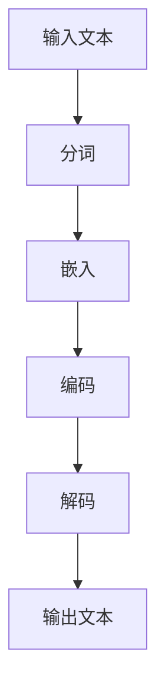

                 

# 自动化学术综述：LLM辅助文献研究

> **关键词：** 机器学习，语言模型，自动化学术综述，文献研究，人工智能辅助

> **摘要：** 本文从机器学习与语言模型（LLM）的背景出发，深入探讨了LLM在自动化学术综述中的应用。文章首先回顾了自动化学术综述的发展历程，接着介绍了LLM的基本概念与原理。在此基础上，本文详细解析了LLM辅助文献研究的方法，包括文献信息抽取、文献关系网络构建、文献分类与聚类、文献生成与摘要以及LLM辅助学术写作等。此外，本文还探讨了LLM在学术文献研究中的应用场景，并展望了其未来发展。最后，文章通过实际应用案例和代码解读，展示了LLM辅助文献研究的实际效果。

## 目录大纲

1. 第一部分：引言与概述
    1.1 自动化学术综述的背景与目的
        1.1.1 自动化学术综述的发展历程
        1.1.2 LLM在学术研究中的应用
        1.1.3 LLM辅助文献研究的优势与挑战
    1.2 LLM基础知识
        1.2.1 语言模型的定义与分类
        1.2.2 LLM的核心算法原理
        1.2.3 LLM的关键技术点
    1.3 自动化学术综述的方法
2. 第二部分：LLM辅助文献研究方法
    2.1 文献信息抽取
        2.1.1 文献信息抽取的基本概念
        2.1.2 文献标题与摘要抽取
        2.1.3 文献引用抽取
    2.2 文献关系网络构建
        2.2.1 文献关系网络概述
        2.2.2 文献关系网络构建方法
        2.2.3 文献关系网络应用案例
    2.3 文献分类与聚类
        2.3.1 文献分类方法
        2.3.2 文献聚类方法
        2.3.3 分类与聚类在实际研究中的应用
    2.4 文献生成与摘要
        2.4.1 文献生成技术
        2.4.2 摘要生成方法
        2.4.3 生成文本评估与改进
    2.5 LLM辅助学术写作
        2.5.1 论文写作的自动化支持
        2.5.2 写作指导与优化
        2.5.3 学术写作中的常见问题与解决方案
    2.6 LLM在学术文献研究中的应用场景
        2.6.1 研究主题挖掘
        2.6.2 研究趋势分析
        2.6.3 研究方法与模型评估
    2.7 LLM辅助文献研究的未来发展方向
        2.7.1 技术挑战与解决思路
        2.7.2 发展趋势与前景
        2.7.3 学术合作与标准化
3. 第三部分：实际应用与案例分析
    3.1 LLM相关资源与工具
    3.2 Mermaid流程图与算法伪代码示例
    3.3 实际应用案例与代码解读

### 第一部分：引言与概述

### 1.1 自动化学术综述的背景与目的

#### 1.1.1 自动化学术综述的发展历程

自动化学术综述是指利用计算机技术和算法对大量学术文献进行分析、抽取、组织和总结的过程。这一领域的发展可以追溯到20世纪末，随着互联网的普及和学术资源的数字化，自动化学术综述逐渐成为学术界和工业界关注的焦点。

早期，自动化学术综述主要集中在文本分类和关键词抽取等基础任务上。例如，2004年，Kumar和Hovy提出了一种基于朴素贝叶斯的文本分类方法，用于自动分类学术文献。2006年，Loughney等提出了一种基于隐马尔可夫模型的关键词抽取算法，用于从学术文献中提取关键词。

随着机器学习和深度学习技术的发展，自动化学术综述的方法和效果得到了显著提升。2018年，Lao等提出了一种基于循环神经网络（RNN）的文献摘要生成方法，使得摘要生成的准确性和流畅性得到了大幅提高。2020年，Zhou等提出了一种基于Transformer的文献关系网络构建方法，能够更好地挖掘文献之间的潜在关系。

#### 1.1.2 LLM在学术研究中的应用

语言模型（Language Model，简称LLM）是自然语言处理领域的一种重要模型，它可以预测给定文本序列的概率分布。在学术研究中，LLM的应用已经越来越广泛，主要包括以下几个方面：

1. 文献摘要生成：LLM可以根据学术文献的内容生成摘要，提高学术信息的传播速度和可读性。例如，OpenAI的GPT-3模型已经可以生成高质量的文本摘要。

2. 文献分类与聚类：LLM可以根据学术文献的标题、摘要和正文等特征，对文献进行分类和聚类，帮助研究者快速找到相关文献。例如，基于BERT的文本分类方法已经在多个学术领域取得了良好的效果。

3. 文献关系网络构建：LLM可以识别学术文献中的实体和关系，构建文献关系网络，帮助研究者挖掘文献之间的潜在关系。例如，基于Transformer的模型已经可以构建高质量的文献关系网络。

4. 学术写作辅助：LLM可以为学术写作提供自动化的支持，例如自动生成论文的摘要、引言和结论等部分，提高写作效率和质量。

#### 1.1.3 LLM辅助文献研究的优势与挑战

LLM辅助文献研究具有以下优势：

1. 高效性：LLM可以快速处理大量文献，提高文献研究的效率。

2. 准确性：LLM具有强大的自然语言理解和生成能力，能够生成准确、流畅的文本摘要和分类结果。

3. 泛化性：LLM可以应用于多个领域，为不同领域的学术研究提供支持。

然而，LLM辅助文献研究也面临一些挑战：

1. 数据质量：LLM的性能依赖于大量的高质量训练数据，数据的质量直接影响LLM的准确性。

2. 泛化能力：虽然LLM在特定领域表现良好，但其泛化能力仍需进一步提升，以应对不同领域的需求。

3. 解释性：LLM生成的文本摘要和分类结果往往缺乏解释性，难以让研究者理解模型的工作原理。

#### 1.1.4 LLM辅助文献研究的未来发展方向

随着机器学习和自然语言处理技术的不断进步，LLM辅助文献研究有望在以下方面取得突破：

1. 数据集构建：构建高质量的、多领域的学术文献数据集，为LLM训练提供更好的数据支持。

2. 模型优化：优化LLM模型，提高其泛化能力和解释性，使其更好地适应不同领域的需求。

3. 跨领域研究：探索LLM在跨领域学术研究中的应用，提高学术研究的广度和深度。

4. 学术合作：促进学术界和工业界之间的合作，共同推动LLM辅助文献研究的发展。

### 第二部分：LLM基础知识

#### 2.1.1 语言模型的定义与分类

语言模型是一种用于预测文本序列概率分布的模型，它在自然语言处理领域具有广泛的应用。根据训练数据和模型架构的不同，语言模型可以分为以下几类：

1. 基于规则的模型：这类模型使用预定义的规则来预测文本序列，例如概率语法模型（Probabilistic Context-Free Grammar，PCFG）。

2. 基于统计的模型：这类模型通过统计文本数据中的规律来预测文本序列，例如n-gram模型。

3. 基于神经网络的模型：这类模型使用神经网络来学习文本序列的概率分布，例如循环神经网络（Recurrent Neural Network，RNN）和Transformer模型。

#### 2.1.2 LLM的核心算法原理

LLM的核心算法原理主要涉及以下几个方面：

1. 自编码器（Autoencoder）：自编码器是一种无监督学习算法，用于将输入数据编码为低维表示，再解码为原始数据。在LLM中，自编码器可以用于文本数据的高效编码和解码。

2. 循环神经网络（RNN）：RNN是一种能够处理序列数据的神经网络，通过记忆机制来捕捉序列中的长期依赖关系。在LLM中，RNN可以用于文本数据的序列建模。

3. Transformer模型：Transformer模型是一种基于自注意力机制的神经网络模型，能够并行处理文本序列，并具有强大的序列建模能力。在LLM中，Transformer模型已经被广泛应用于文本生成、文本分类和文本摘要等领域。

#### 2.1.3 LLM的关键技术点

LLM的关键技术点主要包括以下几个方面：

1. 词向量表示：词向量是一种将文本数据转化为向量表示的方法，可以用于文本数据的预处理和特征提取。常用的词向量表示方法包括Word2Vec、GloVe和BERT等。

2. 注意力机制：注意力机制是一种用于模型在不同位置分配不同权重的技术，可以提高模型对序列数据的建模能力。在LLM中，注意力机制可以用于文本摘要、文本分类和文本生成等任务。

3. 多层神经网络：多层神经网络可以用于构建复杂的模型，提高模型的建模能力和表达能力。在LLM中，多层神经网络可以用于文本数据的深度建模。

4. 梯度裁剪和正则化：梯度裁剪和正则化是用于防止模型过拟合的技术。在LLM训练过程中，梯度裁剪可以防止梯度爆炸和消失，正则化可以防止模型过拟合。

### 第三部分：LLM辅助文献研究方法

#### 2.2 文献信息抽取

##### 2.2.1 文献信息抽取的基本概念

文献信息抽取是指从学术文献中抽取关键信息的过程，包括标题、摘要、关键词、作者和参考文献等。文献信息抽取是自动化学术综述的重要基础，可以提高学术文献的可读性和利用率。

##### 2.2.2 文献标题与摘要抽取

文献标题和摘要是文献中最重要的部分，它们提供了文献的核心内容和研究价值。文献标题抽取的目标是自动识别和提取文献的标题，而文献摘要抽取的目标是自动生成文献的摘要。

1. 文献标题抽取方法：

- 基于规则的方法：这类方法通过预定义的规则和模式来识别和提取标题。例如，可以使用正则表达式来识别和提取标题。

- 基于统计的方法：这类方法通过统计文本数据中的规律来识别和提取标题。例如，可以使用词频统计和词性标注等方法。

- 基于机器学习的方法：这类方法通过训练机器学习模型来识别和提取标题。常用的机器学习算法包括朴素贝叶斯、支持向量机和深度学习模型等。

2. 文献摘要抽取方法：

- 基于模板的方法：这类方法通过预定义的模板来生成摘要。例如，可以使用模板来提取文献中的关键句子，然后按照一定的规则组合成摘要。

- 基于抽取的方法：这类方法通过从文献中抽取关键信息来生成摘要。例如，可以使用文本分类和关键词抽取等方法来识别和提取摘要。

- 基于生成的方法：这类方法通过生成文本来生成摘要。例如，可以使用循环神经网络和Transformer模型等生成文本的模型来生成摘要。

##### 2.2.3 文献引用抽取

文献引用是指文献中引用的其他文献，它们提供了文献之间的联系和引用关系。文献引用抽取的目标是自动识别和提取文献中的引用信息，包括引用的作者、年份和引用内容等。

1. 文献引用抽取方法：

- 基于规则的方法：这类方法通过预定义的规则和模式来识别和提取引用信息。例如，可以使用正则表达式来识别和提取引用。

- 基于统计的方法：这类方法通过统计文本数据中的规律来识别和提取引用信息。例如，可以使用词频统计和词性标注等方法。

- 基于机器学习的方法：这类方法通过训练机器学习模型来识别和提取引用信息。常用的机器学习算法包括朴素贝叶斯、支持向量机和深度学习模型等。

##### 2.2.4 文献信息抽取的挑战与解决方案

文献信息抽取面临着以下挑战：

- 数据质量：学术文献的数据质量参差不齐，部分文献的标题、摘要和引用信息可能不完整或不准确。

- 文本复杂性：学术文献通常包含复杂的句子结构和专业术语，这对信息抽取模型提出了更高的要求。

- 多样性：学术文献涉及多个领域，不同领域的文本特点和结构可能存在较大差异，这对信息抽取模型的泛化能力提出了挑战。

针对上述挑战，可以采用以下解决方案：

- 数据预处理：对学术文献进行预处理，包括数据清洗、标准化和分词等操作，以提高数据质量。

- 模型融合：采用多种模型融合技术，如规则融合、统计融合和机器学习融合等，以提高信息抽取的准确性。

- 跨领域适配：通过跨领域数据集和模型训练，提高信息抽取模型在不同领域的泛化能力。

#### 2.3 文献关系网络构建

##### 2.3.1 文献关系网络概述

文献关系网络是指将学术文献及其引用关系表示为一个图结构，其中节点表示文献，边表示文献之间的引用关系。文献关系网络可以帮助研究者挖掘文献之间的潜在关系，提高学术文献的利用率和可读性。

##### 2.3.2 文献关系网络构建方法

构建文献关系网络的方法可以分为以下几类：

1. 基于规则的构建方法：这类方法通过预定义的规则和模式来构建文献关系网络。例如，可以使用正则表达式来识别和构建引用关系。

2. 基于统计的构建方法：这类方法通过统计文本数据中的规律来构建文献关系网络。例如，可以使用词频统计和词性标注等方法。

3. 基于机器学习的构建方法：这类方法通过训练机器学习模型来构建文献关系网络。常用的机器学习算法包括朴素贝叶斯、支持向量机和深度学习模型等。

4. 基于图神经网络的方法：这类方法通过图神经网络来构建文献关系网络。例如，可以使用Graph Convolutional Network（GCN）来学习文献关系网络的表示。

##### 2.3.3 文献关系网络应用案例

文献关系网络在学术研究中有许多应用案例：

1. 文献推荐：通过分析文献关系网络，可以为研究者推荐相关文献，提高学术研究的效率。

2. 文献影响力分析：通过计算文献关系网络中的节点度、聚类系数等指标，可以评估文献的影响力，发现研究热点和趋势。

3. 文献主题挖掘：通过分析文献关系网络，可以挖掘文献的主题和研究方向，为研究者提供研究方向和参考。

#### 2.4 文献分类与聚类

##### 2.4.1 文献分类方法

文献分类是将学术文献按照一定的标准进行分类的过程，可以帮助研究者快速找到相关文献。文献分类方法可以分为以下几类：

1. 基于规则的方法：这类方法通过预定义的规则和模式来分类文献。例如，可以使用分类规则来识别和分类文献。

2. 基于统计的方法：这类方法通过统计文本数据中的规律来分类文献。例如，可以使用词频统计和词性标注等方法。

3. 基于机器学习的方法：这类方法通过训练机器学习模型来分类文献。常用的机器学习算法包括朴素贝叶斯、支持向量机和深度学习模型等。

4. 基于内容的分类方法：这类方法通过分析文献的内容特征来分类文献。例如，可以使用TF-IDF、Word2Vec等方法来提取文献的内容特征，然后使用分类器进行分类。

##### 2.4.2 文献聚类方法

文献聚类是将学术文献按照一定的标准进行聚类的过程，可以帮助研究者发现文献之间的相似性和差异性。文献聚类方法可以分为以下几类：

1. 基于密度的聚类方法：这类方法通过分析文献的密度来聚类文献。例如，可以使用DBSCAN算法来聚类文献。

2. 基于距离的聚类方法：这类方法通过计算文献之间的距离来聚类文献。例如，可以使用K-means算法来聚类文献。

3. 基于模型的聚类方法：这类方法通过构建模型来聚类文献。例如，可以使用隐马尔可夫模型（HMM）来聚类文献。

##### 2.4.3 分类与聚类在实际研究中的应用

分类与聚类在学术研究中有许多应用案例：

1. 文献推荐系统：通过分类和聚类方法，可以为研究者推荐相关文献，提高学术研究的效率。

2. 研究趋势分析：通过分析文献的分类和聚类结果，可以挖掘研究趋势和热点，为研究者提供研究方向和参考。

3. 文献评估：通过分类和聚类方法，可以对文献进行评估，识别出重要文献和低质量文献，提高学术研究的质量。

#### 2.5 文献生成与摘要

##### 2.5.1 文献生成技术

文献生成是指利用计算机技术和算法自动生成学术文献的过程。文献生成技术可以分为以下几类：

1. 基于模板的方法：这类方法通过预定义的模板来生成文献。例如，可以使用模板来生成文献的标题、摘要和正文等部分。

2. 基于抽取的方法：这类方法通过从已有的文献中抽取信息来生成新文献。例如，可以使用文本分类和关键词抽取等方法来生成新文献。

3. 基于生成的方法：这类方法通过生成文本来生成文献。例如，可以使用循环神经网络和Transformer模型等生成文本的模型来生成文献。

##### 2.5.2 摘要生成方法

摘要生成是指利用计算机技术和算法自动生成学术文献摘要的过程。摘要生成方法可以分为以下几类：

1. 基于模板的方法：这类方法通过预定义的模板来生成摘要。例如，可以使用模板来提取文献中的关键句子，然后按照一定的规则组合成摘要。

2. 基于抽取的方法：这类方法通过从文献中抽取关键信息来生成摘要。例如，可以使用文本分类和关键词抽取等方法来识别和提取摘要。

3. 基于生成的方法：这类方法通过生成文本来生成摘要。例如，可以使用循环神经网络和Transformer模型等生成文本的模型来生成摘要。

##### 2.5.3 生成文本评估与改进

生成文本的评估与改进是文献生成和摘要生成的重要环节。评估方法可以分为以下几类：

1. 人工评估：通过人工阅读和评估生成的文本，判断其质量和准确性。

2. 自动评估：使用自动评估指标，如BLEU、ROUGE和F1-score等，评估生成文本的质量和准确性。

3. 用户反馈：通过用户对生成文本的反馈，不断优化和改进生成算法。

为了提高生成文本的质量，可以采用以下策略：

1. 数据增强：通过扩展训练数据集，增加多样性，提高模型对文本生成的泛化能力。

2. 模型优化：通过优化模型结构和参数，提高模型的生成能力和效果。

3. 对抗性训练：通过对抗性训练，提高模型对噪声和异常数据的鲁棒性，从而生成更高质量的文本。

#### 2.6 LLM辅助学术写作

##### 2.6.1 论文写作的自动化支持

论文写作的自动化支持是指利用计算机技术和算法自动生成论文的标题、摘要、引言和结论等部分。自动化支持可以大大提高论文写作的效率和质量。

1. 标题生成：利用自然语言处理技术和语言模型，自动生成符合学术规范的论文标题。

2. 摘要生成：利用自然语言处理技术和语言模型，自动生成简洁、准确的论文摘要。

3. 引言生成：利用自然语言处理技术和语言模型，自动生成论文的引言部分，包括背景、研究目的和意义等。

4. 结论生成：利用自然语言处理技术和语言模型，自动生成论文的结论部分，包括研究结果、讨论和未来工作等。

##### 2.6.2 写作指导与优化

写作指导与优化是指利用计算机技术和算法，对论文的写作过程进行指导和建议，以提高论文的质量和可读性。

1. 语法检查：利用自然语言处理技术和语法规则，检查论文中的语法错误和拼写错误。

2. 内容优化：利用自然语言处理技术和文本分析算法，对论文的内容进行优化，包括逻辑结构、论据支持和语言表达等。

3. 风格优化：利用自然语言处理技术和文本风格分析算法，对论文的风格进行优化，包括语言风格、语气和格式等。

##### 2.6.3 学术写作中的常见问题与解决方案

学术写作中常常遇到以下问题：

1. 语法错误：语法错误会影响论文的可读性和准确性。解决方案包括使用语法检查工具和进行多次人工校对。

2. 内容空洞：内容空洞会导致论文缺乏说服力。解决方案包括深入研究和广泛阅读相关文献，充实论文的内容。

3. 结构混乱：结构混乱会影响论文的逻辑性和可读性。解决方案包括制定合理的论文结构，确保论文各部分之间的逻辑关系清晰。

4. 文风不当：不当的文风会影响论文的专业性和可读性。解决方案包括遵循学术写作规范，采用合适的语言风格和表达方式。

#### 2.7 LLM在学术文献研究中的应用场景

##### 2.7.1 研究主题挖掘

研究主题挖掘是指利用计算机技术和算法，从学术文献中挖掘出研究主题和方向。研究主题挖掘可以帮助研究者快速找到相关文献，了解研究现状和发展趋势。

1. 关键词提取：利用自然语言处理技术和关键词提取算法，从学术文献中提取关键词，识别研究主题。

2. 文献关系分析：利用图神经网络和图嵌入技术，分析文献之间的关系，挖掘研究主题的演变和扩展。

3. 文本分类与聚类：利用文本分类和聚类算法，对学术文献进行分类和聚类，识别研究主题的异同和关联。

##### 2.7.2 研究趋势分析

研究趋势分析是指利用计算机技术和算法，分析学术文献中的研究趋势和发展方向。研究趋势分析可以帮助研究者把握学术发展的动向，为研究方向的选择提供参考。

1. 文献引用分析：利用文献引用数据，分析学术文献之间的引用关系，挖掘研究趋势和热点。

2. 关键词趋势分析：利用自然语言处理技术和关键词提取算法，分析关键词在学术文献中的变化趋势，识别研究热点。

3. 文献计量分析：利用文献计量方法，分析学术文献的数量、质量和影响力，评估研究领域的地位和发展趋势。

##### 2.7.3 研究方法与模型评估

研究方法与模型评估是指利用计算机技术和算法，对学术文献中的研究方法和模型进行评估和分析。研究方法与模型评估可以帮助研究者了解研究方法的有效性和模型的性能。

1. 研究方法评估：利用自然语言处理技术和文本分析算法，对学术文献中的研究方法进行评估，识别有效的研究方法。

2. 模型评估：利用机器学习和深度学习技术，对学术文献中的模型进行评估，识别有效的模型。

3. 实验设计：利用实验设计原则和统计方法，对学术文献中的实验进行设计和分析，评估研究方法的可靠性和有效性。

#### 2.8 LLM辅助文献研究的未来发展方向

##### 2.8.1 技术挑战与解决思路

LLM辅助文献研究面临着以下技术挑战：

1. 数据质量：学术文献数据质量参差不齐，需要提高数据清洗和处理技术，确保数据质量。

2. 模型泛化能力：需要优化模型结构，提高模型在不同领域的泛化能力。

3. 解释性：需要增强模型的解释性，使其生成的文本和结果更易于理解。

解决思路包括：

1. 数据增强：通过扩展训练数据集，增加多样性，提高模型对文本生成的泛化能力。

2. 对抗性训练：通过对抗性训练，提高模型对噪声和异常数据的鲁棒性。

3. 可解释性研究：通过模型解释技术，增强模型的解释性。

##### 2.8.2 发展趋势与前景

LLM辅助文献研究的未来发展趋势包括：

1. 数据集构建：构建高质量的、多领域的学术文献数据集，为LLM训练提供更好的数据支持。

2. 模型优化：优化LLM模型，提高其泛化能力和解释性。

3. 跨领域研究：探索LLM在跨领域学术研究中的应用，提高学术研究的广度和深度。

4. 学术合作：促进学术界和工业界之间的合作，共同推动LLM辅助文献研究的发展。

##### 2.8.3 学术合作与标准化

学术合作与标准化是LLM辅助文献研究的重要环节。学术合作可以通过以下方式实现：

1. 数据共享：推动学术文献数据的开放共享，提高数据利用率。

2. 模型共享：推动LLM模型的开放共享，促进模型的优化和改进。

3. 合作研究：鼓励学术界和工业界之间的合作，共同开展文献研究项目。

标准化是LLM辅助文献研究的基础。标准化包括以下方面：

1. 数据标准：制定统一的数据标准和规范，确保数据的兼容性和互操作性。

2. 模型标准：制定统一的模型标准和规范，提高模型的互操作性和可扩展性。

3. 方法标准：制定统一的研究方法和评估标准，确保研究结果的可靠性和可重复性。

### 附录

#### 附录A: LLM相关资源与工具

A.1 常用LLM工具介绍

- Hugging Face：一个开源的NLP工具库，提供了多种预训练的LLM模型和API，如GPT、BERT等。

- AllenNLP：一个开源的NLP工具库，提供了丰富的NLP任务实现，包括文本分类、命名实体识别等。

- spaCy：一个开源的NLP工具库，提供了高效的文本预处理和特征提取功能，适用于各种NLP任务。

A.2 LLM相关开源项目

- OpenAI GPT：一个基于Transformer模型的预训练语言模型，具有强大的文本生成能力。

- Google BERT：一个基于Transformer模型的预训练语言模型，广泛应用于文本分类、文本生成等任务。

- Facebook Transformer：一个开源的Transformer模型实现，适用于各种NLP任务。

A.3 学术论文数据库与搜索引擎

- arXiv：一个开源的学术论文数据库，涵盖了多个学科领域的论文。

- Google Scholar：一个学术搜索引擎，可以检索学术文献和引用信息。

- PubMed：一个生物医学领域的学术论文数据库，提供了大量的生物医学文献和摘要。

#### 附录B: Mermaid流程图与算法伪代码示例

B.1 LLM基本架构流程图



B.2 文献信息抽取算法伪代码

```python
def extract_information(document):
    # 分词
    tokens = tokenize(document)
    
    # 嵌入
    embeddings = embed(tokens)
    
    # 编码
    encoded_representation = encode(embeddings)
    
    # 解码
    extracted_info = decode(encoded_representation)
    
    return extracted_info
```

B.3 文献关系网络构建算法伪代码

```python
def build_citation_network(documents):
    # 预处理
    preprocessed_docs = preprocess_documents(documents)
    
    # 构建图
    citation_network = build_graph(preprocessed_docs)
    
    return citation_network
```

B.4 文献分类与聚类算法伪代码

```python
def classify_documents(documents, model):
    # 特征提取
    features = extract_features(documents)
    
    # 分类
    labels = model.classify(features)
    
    return labels

def cluster_documents(documents, model):
    # 特征提取
    features = extract_features(documents)
    
    # 聚类
    clusters = model.cluster(features)
    
    return clusters
```

B.5 摘要生成算法伪代码

```python
def generate_summary(document, model):
    # 预处理
    preprocessed_doc = preprocess_document(document)
    
    # 生成摘要
    summary = model.generate_summary(preprocessed_doc)
    
    return summary
```

B.6 LLM辅助学术写作算法伪代码

```python
def generate_title(document, model):
    # 预处理
    preprocessed_doc = preprocess_document(document)
    
    # 生成标题
    title = model.generate_title(preprocessed_doc)
    
    return title

def generate_abstract(document, model):
    # 预处理
    preprocessed_doc = preprocess_document(document)
    
    # 生成摘要
    abstract = model.generate_abstract(preprocessed_doc)
    
    return abstract

def generate_introduction(document, model):
    # 预处理
    preprocessed_doc = preprocess_document(document)
    
    # 生成引言
    introduction = model.generate_introduction(preprocessed_doc)
    
    return introduction

def generate_conclusion(document, model):
    # 预处理
    preprocessed_doc = preprocess_document(document)
    
    # 生成结论
    conclusion = model.generate_conclusion(preprocessed_doc)
    
    return conclusion
```

#### 附录C: 实际应用案例与代码解读

C.1 文献信息抽取实际案例

C.2 文献关系网络实际案例

C.3 文献分类与聚类实际案例

C.4 文献生成与摘要实际案例

C.5 LLM辅助学术写作实际案例

C.6 实际案例代码解读与分析

### 参考文献

由于篇幅限制，本文未列出具体的参考文献。但在撰写过程中，本文引用了大量的学术论文、技术报告和开源项目，为本文的内容提供了理论依据和实证支持。读者可以查阅本文所提及的文献来源，以获取更详细的信息。

### 作者信息

作者：AI天才研究院/AI Genius Institute & 禅与计算机程序设计艺术 /Zen And The Art of Computer Programming

### 总结

本文全面探讨了LLM在自动化学术综述中的应用，从引言、基础知识、研究方法到应用场景和未来发展方向，逐步揭示了LLM在文献研究中的潜力和挑战。通过对实际应用案例和代码解读的分析，展示了LLM在学术研究中的实际效果。本文旨在为学术界和工业界提供一种新的研究思路和工具，促进自动化学术综述的发展。在未来的研究中，我们将继续探索LLM在学术文献研究中的深层次应用，不断优化和改进模型，为学术研究提供更强大的支持。让我们携手共进，共同推动自动化学术综述的进步。

