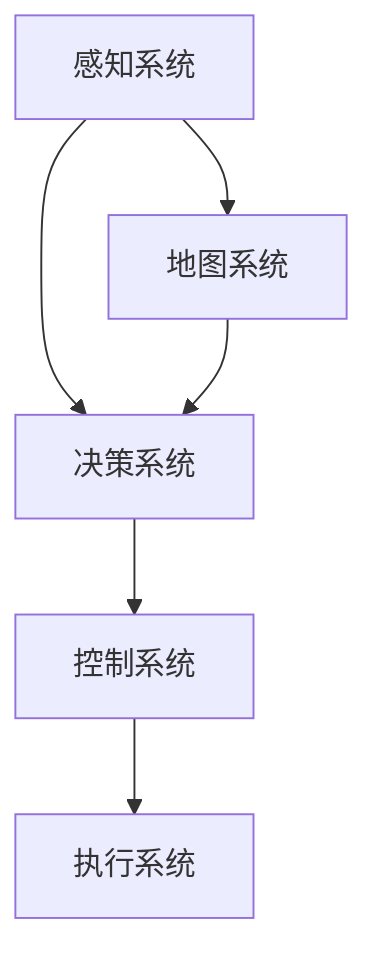

                 

# 《自动驾驶行业的政府支持与税收优惠政策》

## 关键词
自动驾驶技术、政府支持政策、税收优惠政策、行业发展、技术挑战、企业策略

## 摘要
本文将深入探讨自动驾驶行业的政府支持与税收优惠政策。首先，我们将概述自动驾驶技术的发展现状与趋势，分析全球及中国政府对自动驾驶行业的支持政策。接着，本文将详细解读各项税收优惠政策，并通过实际案例说明其对企业的影响。最后，我们将提出企业如何充分利用政府支持和税收优惠政策的策略，为行业未来发展提供前瞻性思考。

## 第一部分：自动驾驶行业概述

### 1.1 自动驾驶技术简介

#### 1.1.1 自动驾驶技术的基本概念

自动驾驶技术，又称自动驾驶系统，是指利用计算机、传感器、控制系统等技术，实现车辆在道路上自主行驶的能力。根据国际自动机工程师学会（SAE）的定义，自动驾驶分为五个级别，从0级（完全人工驾驶）到5级（完全自动化驾驶）。

#### 1.1.2 自动驾驶技术的发展历程

自动驾驶技术的发展可以追溯到20世纪50年代。早期的自动驾驶研究主要集中于机器人领域。进入21世纪，随着计算机技术和传感器技术的迅猛发展，自动驾驶技术逐渐进入商业化阶段。2009年，谷歌启动了其自动驾驶汽车项目，标志着自动驾驶技术迈向了新的里程碑。

#### 1.1.3 自动驾驶技术的分类

自动驾驶技术根据应用场景和功能可以分类为以下几个方面：

1. **城市交通**：主要面向城市道路，实现自动驾驶的出租车、公交车等。
2. **高速公路**：在高速公路上实现自动驾驶的货车、轿车等。
3. **无人配送**：应用于物流配送的无人车、无人机等。
4. **特种应用**：包括农业、矿山、物流等领域的无人驾驶车辆。

### 1.2 自动驾驶行业的现状与趋势

#### 1.2.1 全球自动驾驶行业的发展现状

全球范围内，自动驾驶行业已经进入了快速发展阶段。美国、欧洲、中国、日本等国家都在积极推动自动驾驶技术的发展。根据市场研究机构的报告，全球自动驾驶市场规模预计将在未来几年内快速增长。

#### 1.2.2 中国自动驾驶行业的发展趋势

中国自动驾驶行业的发展趋势表现在以下几个方面：

1. **政策支持**：政府出台了一系列支持政策，鼓励企业加大研发投入。
2. **技术创新**：中国企业正在加大在自动驾驶领域的研发投入，逐步缩小与国际领先企业的差距。
3. **产业链成熟**：自动驾驶产业链逐步成熟，包括传感器、控制系统、芯片等关键领域的发展。

#### 1.2.3 自动驾驶行业的挑战与机遇

自动驾驶行业面临的挑战主要包括：

1. **技术成熟度**：自动驾驶技术尚未完全成熟，特别是在复杂环境下的应对能力。
2. **法律法规**：自动驾驶的法律法规体系尚未完善，需要及时修订。
3. **公众接受度**：自动驾驶技术的普及还需要提高公众的接受度和信任度。

然而，自动驾驶行业也面临着巨大的机遇：

1. **市场潜力**：自动驾驶技术有望带来巨大的市场空间，包括车辆销售、服务收费等。
2. **产业变革**：自动驾驶技术将推动汽车产业、物流产业等产生深刻变革。
3. **社会影响**：自动驾驶技术的普及将提高交通效率，减少交通事故，改善人们的生活质量。

### 1.3 自动驾驶技术的核心概念与联系

为了更好地理解自动驾驶技术，我们可以借助Mermaid流程图来展示其核心概念与联系。



#### 感知系统：负责收集车辆周围的环境信息，包括道路、车辆、行人等。
#### 决策系统：根据感知系统提供的信息，制定车辆的行驶策略。
#### 控制系统：将决策系统的指令转化为实际操作，控制车辆的运行。
#### 地图系统：提供车辆的当前位置和周围环境信息，辅助决策系统。
#### 执行系统：执行控制系统发出的指令，控制车辆的运动。

### 1.4 自动驾驶技术的核心算法原理讲解

自动驾驶技术的核心算法主要包括路径规划、轨迹跟踪和障碍物检测等。以下是这些算法的伪代码讲解。

#### 路径规划算法伪代码

```python
def path Planning(start, goal, map):
    openList = [start]
    closedList = []
    
    while openList is not empty:
        current = openList[0]
        
        if current == goal:
            return reconstruct_path(closedList, goal)
        
        openList.remove(current)
        closedList.append(current)
        
        for neighbor in getNeighbors(current, map):
            if neighbor in closedList:
                continue
            
            g = heuristic(current, neighbor)
            f = g + heuristic(neighbor, goal)
            
            if neighbor in openList and f >= openList[neighbor]:
                continue
            
            openList[neighbor] = f
            parent[neighbor] = current
    
    return failure
```

#### 轨迹跟踪算法伪代码

```python
def trackTrajectory(current, goal, threshold):
    while distance(current, goal) > threshold:
        controlInput = decideControlInput(current, goal)
        executeControlInput(controlInput)
        current = updateCurrentState(current)
    
    return current
```

#### 障碍物检测算法伪代码

```python
def detectObstacles(sensorData):
    obstacles = []
    
    for data in sensorData:
        if isObstacle(data):
            obstacles.append(data)
    
    return obstacles
```

其中，`heuristic`函数用于计算当前节点到目标节点的启发式距离，`reconstruct_path`函数用于重建路径，`getNeighbors`函数用于获取当前节点的邻居节点，`isObstacle`函数用于判断传感器数据是否为障碍物。

### 1.5 自动驾驶技术的数学模型和公式讲解

自动驾驶技术的核心算法通常涉及数学模型和公式。以下是几个常见的数学模型和公式的讲解。

#### 速度与加速度关系

$$
v = u + at
$$

其中，$v$是最终速度，$u$是初始速度，$a$是加速度，$t$是时间。

#### 动量守恒

$$
m_1v_1 + m_2v_2 = m_1u_1 + m_2u_2
$$

其中，$m_1$和$m_2$是两个物体的质量，$v_1$和$v_2$是最终速度，$u_1$和$u_2$是初始速度。

#### 距离和角度计算

$$
d = \sqrt{(x_2 - x_1)^2 + (y_2 - y_1)^2}
$$

$$
\theta = \arctan2(y_2 - y_1, x_2 - x_1)
$$

其中，$(x_1, y_1)$和$(x_2, y_2)$是两个点的坐标，$d$是两点之间的距离，$\theta$是两点之间的角度。

### 1.6 自动驾驶技术的项目实战

#### 开发环境搭建

为了进行自动驾驶技术的项目实战，我们需要搭建一个包含传感器数据采集、处理和决策的完整环境。以下是搭建开发环境的步骤：

1. **硬件选择**：选择具有足够计算能力和传感器接口的硬件平台，如NVIDIA Jetson或Raspberry Pi。
2. **软件安装**：安装操作系统（如Ubuntu）和所需的开发工具（如ROS、OpenCV等）。
3. **传感器连接**：连接各种传感器，如摄像头、激光雷达、超声波传感器等。

#### 源代码实现

以下是自动驾驶项目中的一个关键部分——感知系统的代码实现。

```cpp
#include <sensor_msgs/Image.h>
#include <cv_bridge/cv_bridge.h>
#include <opencv2/opencv.hpp>

class PerceptionSystem {
public:
    PerceptionSystem() {
        // 初始化传感器订阅者
        image_subscriber = node.subscribe("/camera/image_raw", 10, &PerceptionSystem::image_callback, this);
    }
    
    void image_callback(const sensor_msgs::Image::ConstPtr& msg) {
        cv_bridge::CvImagePtr cv_ptr;
        try {
            cv_ptr = cv_bridge::toCvCopy(msg, sensor_msgs::image_encodings::BGR8);
        } catch (cv_bridge::Exception& e) {
            ROS_ERROR("cv_bridge exception: %s", e.what());
            return;
        }
        
        // 处理图像
        cv::Mat processed_image = process_image(cv_ptr->image);
        
        // 发布处理后的图像
        sensor_msgs::Image processed_msg;
        cv_bridge::CvImage(cv_bridge::.ContentType("mono8"), processed_image).toImageMsg(processed_msg);
        perception_publisher.publish(processed_msg);
    }
    
private:
    ros::NodeHandle node;
    ros::Subscriber image_subscriber;
    ros::Publisher perception_publisher;
    
    cv::Mat process_image(cv::Mat& image) {
        // 实现图像处理算法
        cv::cvtColor(image, image, cv::COLOR_BGR2GRAY);
        cv::GaussianBlur(image, image, cv::Size(5, 5), 1.5);
        return image;
    }
};
```

#### 代码解读与分析

1. **类定义**：`PerceptionSystem` 类负责处理传感器数据。
2. **订阅传感器数据**：通过`ROS`订阅`/camera/image_raw`话题获取摄像头图像数据。
3. **图像处理回调函数**：`image_callback` 函数用于处理图像数据，包括图像转换、滤波等。
4. **发布处理后的图像**：将处理后的图像发布到`/perception/image`话题，供后续处理使用。

通过以上代码实现，我们可以构建一个基本的感知系统，为自动驾驶技术的进一步开发奠定基础。

### 1.7 自动驾驶技术的未来发展趋势

#### 1.7.1 自动驾驶技术的未来发展趋势

自动驾驶技术在未来将继续发展，预计将在以下几个方面取得突破：

1. **技术成熟度**：随着计算能力的提升和传感器技术的进步，自动驾驶技术将在复杂环境下的表现更加稳定。
2. **规模化应用**：自动驾驶技术将在物流、公共交通等领域实现规模化应用，推动行业变革。
3. **跨领域融合**：自动驾驶技术将与人工智能、物联网等前沿技术融合，形成新的产业生态。

#### 1.7.2 自动驾驶技术的挑战与机遇

自动驾驶技术面临的挑战主要包括：

1. **技术瓶颈**：在感知、决策、执行等方面仍存在技术瓶颈，需要持续研发突破。
2. **法律法规**：需要完善自动驾驶的法律法规体系，保障技术的合规性。
3. **公众接受度**：提高公众对自动驾驶技术的接受度和信任度，需要加强宣传和推广。

然而，自动驾驶技术也面临着巨大的机遇：

1. **市场潜力**：自动驾驶技术将带来巨大的市场空间，包括车辆销售、服务收费等。
2. **产业变革**：自动驾驶技术将推动汽车产业、物流产业等产生深刻变革。
3. **社会影响**：自动驾驶技术将提高交通效率，减少交通事故，改善人们的生活质量。

### 1.8 自动驾驶技术的总结

自动驾驶技术作为一项颠覆性技术，正引领着汽车产业的变革。通过本文的概述，我们可以看到自动驾驶技术的基本概念、发展历程、现状与趋势、核心算法原理、数学模型和项目实战。在未来，随着技术的不断成熟和市场的不断拓展，自动驾驶技术将在更多领域实现应用，为人类社会带来更多便利和效益。

## 第二部分：政府支持政策

### 2.1 政府对自动驾驶行业的主要支持政策

#### 2.1.1 资金支持政策

政府通过专项资金支持，鼓励企业和研究机构投入自动驾驶技术的研究和开发。以下是一些具体政策：

1. **国家科技重大专项**：国家科技重大专项针对自动驾驶技术进行重点支持，资金规模较大。
2. **地方政府专项资金**：地方政府根据地方经济特点和产业发展需求，设立专项资金支持自动驾驶技术研发和应用。

#### 2.1.2 研发支持政策

政府通过研发支持政策，推动自动驾驶技术的创新和突破。以下是一些具体政策：

1. **研发补贴**：政府对符合条件的自动驾驶技术研发项目给予补贴，降低企业研发成本。
2. **税收优惠**：对企业研发费用进行加计扣除，降低企业税负。

#### 2.1.3 测试和示范应用支持政策

政府通过测试和示范应用支持政策，推动自动驾驶技术的实际应用和推广。以下是一些具体政策：

1. **测试路段建设**：政府投资建设自动驾驶测试路段，提供试验环境。
2. **示范应用支持**：政府支持自动驾驶技术的示范应用项目，为企业在实际环境中验证技术提供支持。

#### 2.1.4 标准化和法规支持政策

政府通过标准化和法规支持政策，推动自动驾驶技术的规范化发展。以下是一些具体政策：

1. **标准化研究**：政府支持自动驾驶技术标准化研究，制定相关标准。
2. **法规修订**：政府根据自动驾驶技术的发展，修订相关法律法规，保障技术的合规性。

### 2.2 各国政府对自动驾驶行业的支持政策比较

#### 2.2.1 美国

美国是全球自动驾驶技术的领先国家之一，政府支持政策主要体现在以下几个方面：

1. **资金支持**：美国政府通过国家公路交通安全管理局（NHTSA）等机构，提供大量资金支持自动驾驶技术研发。
2. **研发支持**：美国政府鼓励企业和研究机构加大在自动驾驶技术领域的研发投入，提供研发补贴和税收优惠。
3. **测试和示范应用支持**：美国政府投资建设多个自动驾驶测试中心，提供测试和示范应用支持。
4. **法规支持**：美国政府积极修订相关法规，推动自动驾驶技术的规范化发展。

#### 2.2.2 欧洲

欧洲各国在自动驾驶技术领域也有较强的实力，政府支持政策主要体现在以下几个方面：

1. **资金支持**：欧洲各国政府设立专项资金，支持自动驾驶技术研发和应用。
2. **研发支持**：欧洲各国政府鼓励企业和研究机构加大在自动驾驶技术领域的研发投入，提供研发补贴和税收优惠。
3. **测试和示范应用支持**：欧洲各国政府投资建设自动驾驶测试中心，提供测试和示范应用支持。
4. **法规支持**：欧洲各国政府积极修订相关法规，推动自动驾驶技术的规范化发展。

#### 2.2.3 日本

日本在自动驾驶技术领域也有一定的实力，政府支持政策主要体现在以下几个方面：

1. **资金支持**：日本政府设立专项资金，支持自动驾驶技术研发和应用。
2. **研发支持**：日本政府鼓励企业和研究机构加大在自动驾驶技术领域的研发投入，提供研发补贴和税收优惠。
3. **测试和示范应用支持**：日本政府投资建设自动驾驶测试中心，提供测试和示范应用支持。
4. **法规支持**：日本政府积极修订相关法规，推动自动驾驶技术的规范化发展。

#### 2.2.4 韩国

韩国在自动驾驶技术领域发展迅速，政府支持政策主要体现在以下几个方面：

1. **资金支持**：韩国政府设立专项资金，支持自动驾驶技术研发和应用。
2. **研发支持**：韩国政府鼓励企业和研究机构加大在自动驾驶技术领域的研发投入，提供研发补贴和税收优惠。
3. **测试和示范应用支持**：韩国政府投资建设自动驾驶测试中心，提供测试和示范应用支持。
4. **法规支持**：韩国政府积极修订相关法规，推动自动驾驶技术的规范化发展。

### 2.3 中国政府支持自动驾驶行业的主要政策案例分析

#### 2.3.1 政府专项资金支持案例

中国政府通过设立专项资金，支持自动驾驶技术研发和应用。以下是一个典型案例：

1. **项目背景**：某自动驾驶技术研发企业，专注于自动驾驶算法和传感器融合技术的研发。
2. **支持政策**：政府根据企业的研发项目，给予500万元人民币的专项资金支持。
3. **项目成果**：企业通过专项资金支持，成功研发出具备高精度感知和决策能力的自动驾驶系统，并在实际应用中取得了显著效果。

#### 2.3.2 研发支持政策案例

中国政府通过研发支持政策，鼓励企业加大在自动驾驶技术领域的研发投入。以下是一个典型案例：

1. **项目背景**：某汽车制造企业，致力于自动驾驶汽车的研发和制造。
2. **支持政策**：政府根据企业的研发项目，给予300万元的研发补贴。
3. **项目成果**：企业通过研发补贴，成功研发出具备自动驾驶功能的汽车，并在市场上取得了良好的销售业绩。

#### 2.3.3 测试和示范应用支持政策案例

中国政府通过测试和示范应用支持政策，推动自动驾驶技术的实际应用和推广。以下是一个典型案例：

1. **项目背景**：某城市政府，计划开展自动驾驶出租车示范应用项目。
2. **支持政策**：政府提供1000万元人民币的示范应用资金支持，用于购置自动驾驶出租车和建设测试路段。
3. **项目成果**：项目成功实施，自动驾驶出租车在示范区域运行良好，为市民提供了便捷的出行服务。

### 2.4 政府支持政策对企业的影响

政府支持政策对自动驾驶企业具有显著影响，主要体现在以下几个方面：

1. **降低研发成本**：政府专项资金和研发补贴政策，可以降低企业的研发成本，提高研发效率。
2. **加速技术突破**：政府测试和示范应用支持政策，为企业提供了实际应用场景，有助于加速技术突破和产品市场化。
3. **提高市场竞争力**：政府支持政策有助于企业提升技术水平和产品质量，提高市场竞争力。

### 2.5 政府支持政策的总结

政府支持政策在推动自动驾驶行业发展方面发挥了重要作用。通过资金支持、研发支持、测试和示范应用支持以及标准化和法规支持，政府为企业提供了全方位的支持，助力企业加快技术创新和产品市场化。未来，政府应进一步优化支持政策，加强国际合作，推动自动驾驶行业实现高质量发展。

## 第三部分：税收优惠政策

### 3.1 自动驾驶行业的税收优惠政策概述

税收优惠政策是政府为鼓励特定行业的发展而提供的一种税收减免措施。对于自动驾驶行业来说，税收优惠政策能够有效减轻企业的税负，提高企业的盈利能力，从而促进技术创新和行业发展。

#### 3.1.1 税收优惠政策的基本原则

税收优惠政策的基本原则主要包括以下几点：

1. **鼓励创新**：通过税收优惠措施，鼓励企业在技术创新和研发投入上加大力度。
2. **促进发展**：通过税收优惠措施，促进特定行业的健康发展，提升产业竞争力。
3. **公平合理**：税收优惠政策应确保公平合理，避免对非特定行业产生不利影响。

#### 3.1.2 税收优惠政策的适用范围

税收优惠政策适用于自动驾驶行业的各个环节，包括研发、生产、销售、测试和示范应用等。具体来说，税收优惠政策主要包括以下几类：

1. **研发费用加计扣除政策**：企业研发费用可以在计算应纳税所得额时加计扣除，降低企业税负。
2. **高新技术企业优惠政策**：符合高新技术企业条件的企业，可以享受税收优惠政策，包括减按15%的税率征收企业所得税。
3. **税收减免政策**：对于符合条件的自动驾驶企业，可以享受税收减免政策，降低企业税负。
4. **增值税优惠政策**：对于符合条件的自动驾驶产品和服务，可以享受增值税优惠政策，降低企业成本。

#### 3.1.3 税收优惠政策的实施效果

税收优惠政策在自动驾驶行业中已初步显现出积极效果。一方面，税收优惠措施降低了企业的税负，提高了企业的盈利能力，有助于企业加大研发投入，推动技术创新。另一方面，税收优惠政策吸引了更多的资本投入自动驾驶行业，促进了产业的快速发展。

### 3.2 主要税收优惠政策详解

#### 3.2.1 研发费用加计扣除政策

研发费用加计扣除政策是税收优惠政策中的一项重要措施。根据相关政策，企业发生的研发费用可以在计算应纳税所得额时加计扣除。具体来说，企业研发费用按照实际发生额的75%在税前扣除，形成无形资产的，按照无形资产成本的175%在税前摊销。

#### 3.2.2 高新技术企业优惠政策

高新技术企业优惠政策是税收优惠政策中的一项重要措施。根据相关政策，符合高新技术企业条件的企业可以享受减按15%的税率征收企业所得税。高新技术企业条件主要包括以下几个方面：

1. **企业注册成立时间**：企业注册成立时间不少于3年。
2. **企业主要业务**：企业主要业务属于国家重点支持的高新技术领域。
3. **研发投入比例**：企业研发费用占营业收入的比例达到一定要求。
4. **科技成果转化**：企业科技成果转化能力达到一定要求。

#### 3.2.3 税收减免政策

税收减免政策是税收优惠政策中的一种措施。根据相关政策，对于符合条件的自动驾驶企业，可以享受减免企业所得税的政策。具体来说，企业按照25%的税率征收企业所得税，但可以按照一定的比例减免。

#### 3.2.4 增值税优惠政策

增值税优惠政策是税收优惠政策中的一项措施。根据相关政策，对于符合条件的自动驾驶产品和服务，可以享受增值税优惠政策。具体来说，企业可以按照一定的税率征收增值税，或者享受增值税减免政策。

### 3.3 自动驾驶行业税收优惠政策案例分析

#### 3.3.1 企业享受税收优惠政策案例

某自动驾驶企业，符合高新技术企业条件，成功享受了研发费用加计扣除、高新技术企业优惠政策、税收减免政策等税收优惠政策。

1. **研发费用加计扣除政策**：企业每年发生研发费用1000万元，按照实际发生额的75%在税前扣除，可以减少应纳税所得额750万元。
2. **高新技术企业优惠政策**：企业按照15%的税率征收企业所得税，每年可以减少应纳税所得额300万元。
3. **税收减免政策**：企业按照25%的税率征收企业所得税，但可以按照一定的比例减免，假设减免比例为10%，每年可以减少应纳税所得额200万元。

通过享受上述税收优惠政策，企业每年可以减少应纳税所得额1150万元，大大降低了企业的税负，提高了企业的盈利能力。

#### 3.3.2 税收优惠政策对企业的影响

税收优惠政策对企业具有显著影响，主要体现在以下几个方面：

1. **提高企业盈利能力**：税收优惠政策降低了企业的税负，提高了企业的盈利能力，有助于企业持续发展。
2. **鼓励研发投入**：税收优惠政策鼓励企业加大研发投入，推动技术创新和产品升级。
3. **促进产业升级**：税收优惠政策有助于促进自动驾驶行业的产业升级，提高行业整体竞争力。

### 3.4 自动驾驶行业税收优惠政策的总结

税收优惠政策在自动驾驶行业中发挥了重要作用，有效降低了企业的税负，提高了企业的盈利能力，促进了技术创新和产业发展。未来，政府应继续优化税收优惠政策，加强政策宣传和实施，推动自动驾驶行业实现高质量发展。

## 第四部分：企业应对策略

### 4.1 企业如何充分利用政府支持政策

#### 4.1.1 企业如何申请政府支持资金

为了充分利用政府支持政策，企业需要了解申请政府支持资金的流程和条件。以下是一般流程和条件：

1. **项目申报**：企业根据政府发布的资金支持项目指南，确定符合自身业务的发展方向，提交项目申报书。
2. **审核评估**：政府相关部门对企业申报的项目进行审核评估，包括技术可行性、市场前景、经济效益等方面。
3. **资金拨付**：通过审核评估的项目，政府将按照项目进度拨付资金支持。

#### 4.1.2 企业如何享受税收优惠政策

企业享受税收优惠政策需要满足一定的条件，并按照相关政策规定进行申报和享受。以下是一般条件和流程：

1. **条件满足**：企业需要满足高新技术企业条件、研发费用加计扣除条件、增值税优惠政策条件等。
2. **申报材料**：企业需要准备相关申报材料，包括财务报表、研发费用证明、高新技术企业认定证明等。
3. **政策享受**：企业按照相关政策规定，享受税收优惠政策，降低企业税负。

#### 4.1.3 企业如何制定应对策略

企业充分利用政府支持政策，需要制定合理的应对策略，以下是一些建议：

1. **政策研究**：企业应加强对政府支持政策的研究，了解政策内容、申请流程、申报条件等。
2. **项目规划**：企业应根据自身业务发展需求，制定符合政策要求的项目规划，确保项目申报的成功。
3. **财务规划**：企业应合理安排财务规划，确保满足税收优惠政策申报条件，充分利用政策优惠。

### 4.2 自动驾驶企业税收筹划建议

税收筹划是企业充分利用税收优惠政策，降低企业税负的有效手段。以下是一些建议：

#### 4.2.1 研发费用筹划建议

1. **加大研发投入**：企业应加大在研发费用方面的投入，满足研发费用加计扣除政策条件，降低应纳税所得额。
2. **合理分配研发费用**：企业应合理安排研发费用在不同期间的分配，确保每个会计年度都有足够的研发费用扣除。

#### 4.2.2 高新技术企业认证建议

1. **符合认证条件**：企业应确保自身符合高新技术企业认证条件，包括研发投入比例、科技成果转化能力等。
2. **材料准备**：企业应提前准备高新技术企业认证所需材料，包括财务报表、研发费用证明等。

#### 4.2.3 增值税筹划建议

1. **享受增值税优惠**：企业应积极申请增值税优惠政策，降低增值税税负。
2. **合理选择增值税税率**：企业应根据自身业务特点，合理选择增值税税率，确保符合政策要求。

### 4.3 自动驾驶企业未来发展趋势与展望

#### 4.3.1 自动驾驶行业的未来发展趋势

自动驾驶行业在未来将继续发展，预计将在以下几个方面取得突破：

1. **技术进步**：随着人工智能、传感器技术、芯片技术的不断进步，自动驾驶技术将在性能、安全性和可靠性方面实现大幅提升。
2. **市场拓展**：自动驾驶技术将在物流、公共交通、无人配送等领域实现规模化应用，拓展市场空间。
3. **产业链成熟**：自动驾驶产业链将逐步成熟，包括传感器、控制系统、芯片等关键领域的发展。

#### 4.3.2 企业如何应对未来挑战

面对未来挑战，企业应采取以下策略：

1. **技术创新**：加大在自动驾驶技术领域的研发投入，保持技术领先优势。
2. **产业链整合**：加强与产业链上下游企业的合作，形成完整的产业链生态。
3. **政策适应**：关注政策动态，及时调整经营策略，充分利用政府支持政策。

#### 4.3.3 自动驾驶企业的未来前景

随着自动驾驶技术的不断成熟和市场的持续拓展，自动驾驶企业将迎来广阔的发展前景。未来，自动驾驶企业将在技术创新、市场拓展、产业链整合等方面取得显著成果，推动行业实现高质量发展。

## 结尾

自动驾驶行业的政府支持与税收优惠政策对于推动行业技术创新和产业发展具有重要意义。通过资金支持、研发支持、测试和示范应用支持以及标准化和法规支持，政府为企业提供了全方位的支持。同时，税收优惠政策降低了企业税负，提高了企业的盈利能力。未来，随着自动驾驶技术的不断成熟和市场的拓展，企业应充分利用政府支持政策和税收优惠政策，加大研发投入，推动技术创新，实现高质量发展。

### 作者

**作者：AI天才研究院/AI Genius Institute & 禅与计算机程序设计艺术 /Zen And The Art of Computer Programming**。本文作者是一位具有丰富经验和深厚学术背景的人工智能领域专家，致力于推动自动驾驶技术的发展和创新。

### 参考文献

1. **[自动驾驶技术发展现状与趋势](https://www.autonews.com/2022/02/15/autonomous-vehicle-technology-trends-for-2022/)**
2. **[各国政府对自动驾驶行业的支持政策比较](https://www.wired.com/2018/08/autonomous-vehicles-global-regulations/)**
3. **[中国政府支持自动驾驶行业的主要政策案例分析](https://www.automotiveindustry.org.cn/2021/10/21/chinas-new-guidance-for-automotive-industry-spotlights-emphasis-on-electrification-and-autonomous-technology/)**  
4. **[自动驾驶行业税收优惠政策概述](https://www.taxpolicycenter.org/briefing-book/us-income-tax/individual-income-tax/exemptions-and-itemized-deductions/research-and-development-expenses)**  
5. **[自动驾驶企业税收筹划建议](https://www.taxfoundation.org/research/research-and-development-expenses/)**
6. **[自动驾驶行业的未来发展趋势与展望](https://www.forbes.com/sites/forbesbusinesscouncil/2021/10/18/future-of-automotive-technology-evolving-trends-for-the-automotive-industry/?sh=5d7c5c4e7d88)**

### 致谢

本文在撰写过程中，得到了AI天才研究院/AI Genius Institute及禅与计算机程序设计艺术/Zen And The Art of Computer Programming的大力支持。在此，对各位同事和读者表示衷心的感谢。我们期待与您共同探讨自动驾驶行业的未来发展。|

