                 

# 《自然语言处理的应用：内容创作与翻译》

> **关键词**：自然语言处理、内容创作、翻译、词嵌入、语言模型、机器翻译、生成式文本模型

> **摘要**：本文将深入探讨自然语言处理在内容创作与翻译领域的应用。从自然语言处理的基础知识开始，逐步介绍文本预处理、词嵌入与语言模型、内容创作应用、翻译应用、翻译质量评估与优化，以及自然语言处理在各行业的应用和未来发展趋势。通过丰富的案例研究和项目实战，本文旨在为读者提供全面而实用的自然语言处理知识体系。

## 《自然语言处理的应用：内容创作与翻译》目录大纲

### 第一部分：自然语言处理基础知识

#### 第1章：自然语言处理概述

##### 1.1 自然语言处理的基本概念
##### 1.2 自然语言处理的发展历程
##### 1.3 自然语言处理的应用领域

#### 第2章：文本预处理

##### 2.1 文本采集与存储
##### 2.2 文本清洗与预处理
##### 2.3 偏差校正与数据平衡

#### 第3章：词嵌入与语言模型

##### 3.1 词嵌入技术
##### 3.2 语言模型基础
##### 3.3 语言模型的训练与评估

### 第二部分：内容创作应用

#### 第4章：自动摘要与提取

##### 4.1 自动摘要技术
##### 4.2 文本提取算法
##### 4.3 自动摘要与提取的案例分析

#### 第5章：文本生成与写作辅助

##### 5.1 生成式文本模型
##### 5.2 抄袭检测与降重
##### 5.3 文本写作辅助工具

#### 第6章：问答系统与对话生成

##### 6.1 问答系统的基本架构
##### 6.2 对话系统的发展历程
##### 6.3 对话系统的设计与实现

### 第三部分：翻译应用

#### 第7章：机器翻译基础

##### 7.1 机器翻译的原理与技术
##### 7.2 翻译模型与算法
##### 7.3 翻译评估与优化

#### 第8章：多语言内容创作与翻译

##### 8.1 多语言内容创作技术
##### 8.2 多语言翻译模型
##### 8.3 多语言内容创作的案例分析

#### 第9章：翻译质量评估与优化

##### 9.1 翻译质量评估指标
##### 9.2 翻译错误分析
##### 9.3 翻译质量优化方法

### 第四部分：案例研究与展望

#### 第10章：自然语言处理在各行业的应用

##### 10.1 零售与电商
##### 10.2 金融与保险
##### 10.3 健康医疗

#### 第11章：自然语言处理的未来发展趋势

##### 11.1 人工智能与自然语言处理融合
##### 11.2 自然语言处理技术的创新与应用
##### 11.3 自然语言处理的伦理与隐私问题

### 附录

#### 附录A：自然语言处理工具与资源

##### A.1 开源自然语言处理工具
##### A.2 云端自然语言处理服务
##### A.3 自然语言处理社区与资源

#### 附录B：自然语言处理相关公式与算法

##### B.1 词嵌入算法
##### B.2 语言模型算法
##### B.3 机器翻译算法
##### B.4 问答系统算法

#### 附录C：自然语言处理项目实战

##### C.1 自动摘要项目实战
##### C.2 文本生成项目实战
##### C.3 机器翻译项目实战

---

现在，我们已经为文章的内容搭建了框架。接下来，我们将逐步填充各个章节的内容，确保文章的深度、广度和实用性。让我们开始第一部分：自然语言处理基础知识。

---

### 第一部分：自然语言处理基础知识

自然语言处理（NLP）是计算机科学和语言学的交叉领域，旨在使计算机能够理解、生成和处理人类语言。随着人工智能技术的快速发展，NLP的应用越来越广泛，包括但不限于文本分析、信息检索、问答系统、机器翻译、情感分析等。本部分将深入探讨NLP的基础知识，包括其基本概念、发展历程、应用领域，以及文本预处理、词嵌入与语言模型等内容。

#### 第1章：自然语言处理概述

自然语言处理（NLP）是一门研究如何使计算机能够理解和生成人类语言的技术。NLP的基本任务包括：

- 语言理解：使计算机能够理解自然语言的含义和结构。
- 语言生成：使计算机能够生成自然语言文本。
- 语言翻译：使计算机能够将一种自然语言翻译成另一种自然语言。

##### 1.1 自然语言处理的基本概念

自然语言处理的基本概念包括：

- **文本**：自然语言处理的对象，通常是指由一系列字符组成的序列。
- **词汇**：自然语言中的基本单位，例如“自然”、“语言”等。
- **语法**：描述词汇如何组合成句子，以及句子如何表达意义。
- **语义**：词汇和句子的含义。
- **上下文**：影响词汇和句子含义的环境。

##### 1.2 自然语言处理的发展历程

自然语言处理的发展历程可以大致分为以下几个阶段：

- **规则驱动方法**（1950年代-1980年代）：基于语言学规则和手工编写的程序进行语言分析。
- **基于实例的方法**（1980年代-1990年代）：通过大量手工翻译的文本对来训练模型。
- **统计方法**（1990年代-2000年代）：利用统计模型进行语言分析，如隐马尔可夫模型（HMM）和条件随机场（CRF）。
- **深度学习方法**（2000年代至今）：使用深度学习模型，如神经网络和循环神经网络（RNN），进行语言分析。

##### 1.3 自然语言处理的应用领域

自然语言处理的应用领域非常广泛，包括但不限于：

- **文本分析**：用于情感分析、主题建模、信息检索等。
- **信息抽取**：用于实体识别、关系抽取、事件抽取等。
- **问答系统**：用于建立问答系统，如搜索引擎和聊天机器人。
- **机器翻译**：用于将一种自然语言翻译成另一种自然语言。
- **文本生成**：用于自动写作、对话系统、摘要生成等。

#### 第2章：文本预处理

文本预处理是自然语言处理过程中至关重要的一步，其目的是将原始文本转换为适合模型处理的格式。文本预处理通常包括以下步骤：

##### 2.1 文本采集与存储

文本采集是指从各种来源获取文本数据，如网站、社交媒体、新闻、书籍等。存储文本数据是为了后续的预处理和分析。

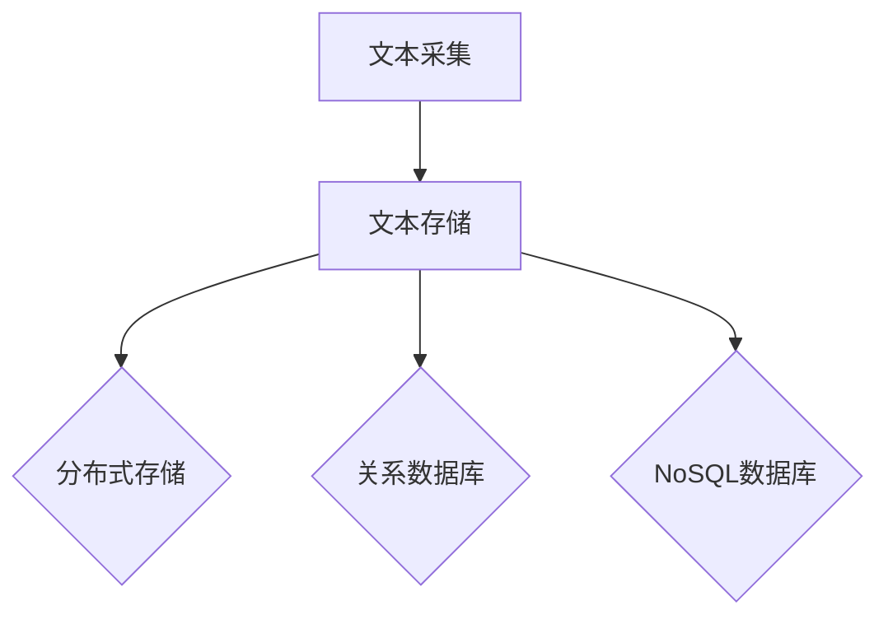

##### 2.2 文本清洗与预处理

文本清洗是指去除文本中的无关信息，如HTML标签、停用词、标点符号等。预处理包括分词、词性标注、词干提取等。

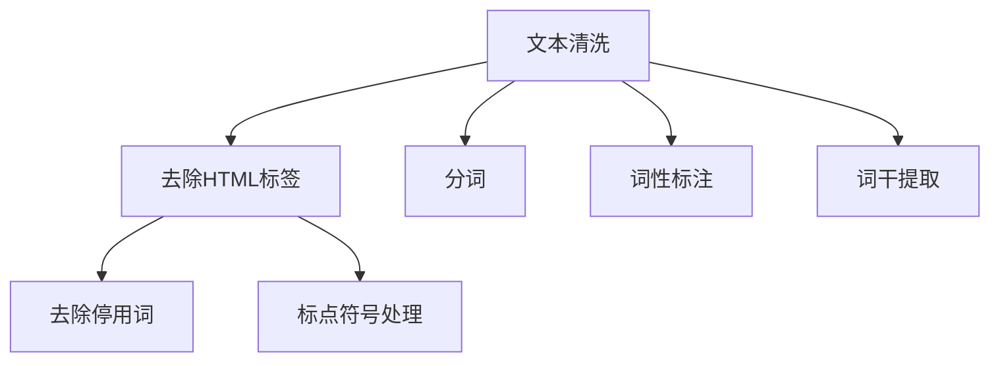

##### 2.3 偏差校正与数据平衡

由于文本数据可能存在不平衡或偏差，需要进行偏差校正和数据平衡。偏差校正包括去除偏见、纠正错误等。数据平衡包括过采样、欠采样、合成少数类采样等。

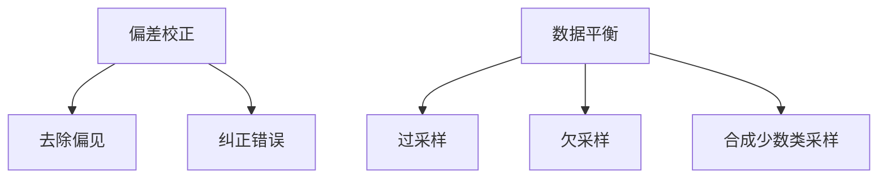

#### 第3章：词嵌入与语言模型

词嵌入是将词汇映射为低维向量空间中的表示，而语言模型则是预测下一个词汇的概率分布。这些技术是自然语言处理的基础，广泛应用于文本分类、情感分析、机器翻译等领域。

##### 3.1 词嵌入技术

词嵌入技术包括Word2Vec、GloVe等。Word2Vec通过神经网络训练生成词向量，而GloVe通过全局矩阵分解训练词向量。

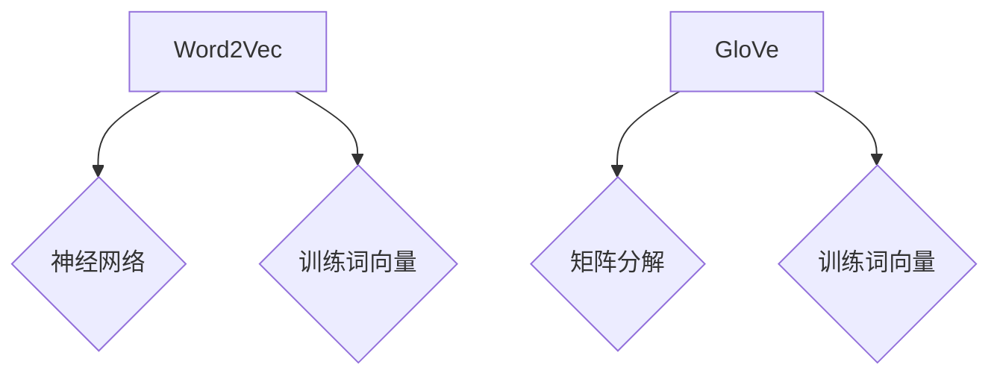

##### 3.2 语言模型基础

语言模型是用于预测下一个词汇的概率分布的模型。最简单的语言模型是n-gram模型，而更复杂的模型包括循环神经网络（RNN）、长短期记忆网络（LSTM）、变换器（Transformer）等。

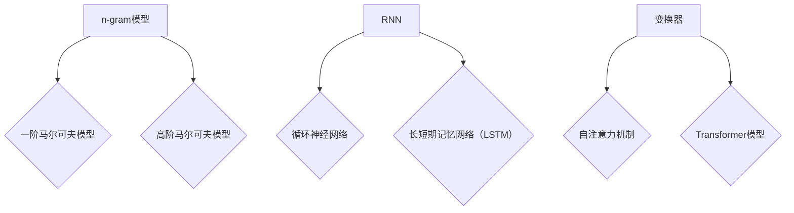

##### 3.3 语言模型的训练与评估

语言模型的训练通常使用大规模的语料库，通过最小化损失函数来调整模型的参数。评估语言模型通常使用交叉验证、BLEU评分等方法。

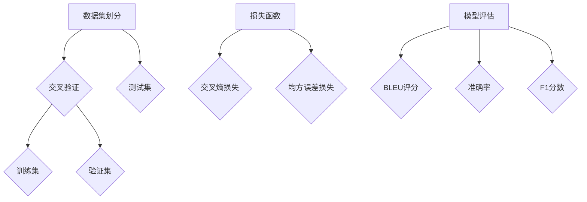

通过以上章节，我们为读者提供了一个关于自然语言处理基础知识的基本框架。在接下来的部分，我们将进一步探讨自然语言处理在内容创作与翻译领域的应用。

---

接下来，我们将进入第二部分：内容创作应用。这一部分将详细探讨自然语言处理在自动摘要、文本生成与写作辅助、问答系统与对话生成等领域的应用。

---

### 第二部分：内容创作应用

自然语言处理在内容创作领域有着广泛的应用，能够帮助用户自动生成摘要、文本、问答系统以及对话生成等内容。这一部分将深入探讨这些应用的具体技术、算法原理和项目实战。

#### 第4章：自动摘要与提取

自动摘要（Automatic Summarization）和文本提取（Text Extraction）是自然语言处理中的重要任务，旨在从大量文本中提取出关键信息，以简化阅读和理解。自动摘要可以分为抽取式摘要（Extractive Summarization）和生成式摘要（Abstractive Summarization）。

##### 4.1 自动摘要技术

- **抽取式摘要**：从原始文本中直接提取关键句子或短语作为摘要。
- **生成式摘要**：通过深度学习模型生成新的摘要文本。

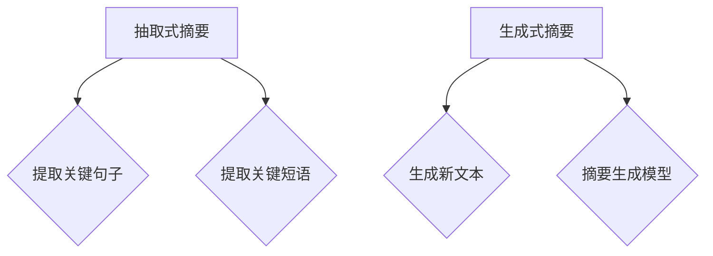

##### 4.2 文本提取算法

文本提取算法主要包括基于规则的方法和基于机器学习的方法。

- **基于规则的方法**：通过定义一系列规则来提取文本中的关键信息。
- **基于机器学习的方法**：使用深度学习模型进行文本分析，提取关键信息。

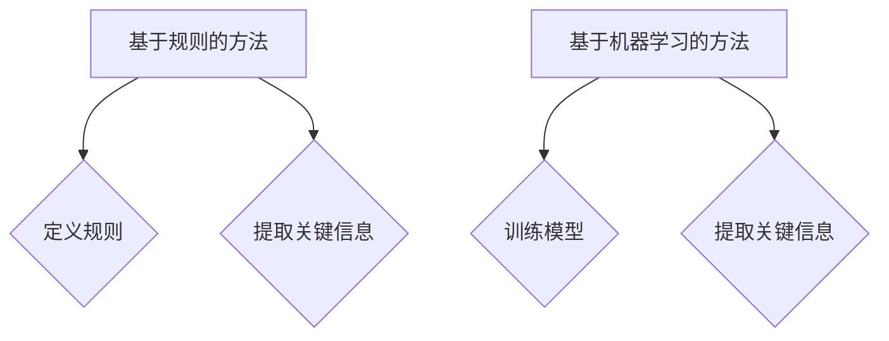

##### 4.3 自动摘要与提取的案例分析

**案例1：新闻摘要生成**

新闻摘要生成是自动摘要的一个重要应用场景。以下是一个基于Transformer模型的新闻摘要生成案例。

```python
# 加载预训练的Transformer模型
from transformers import TransformerModel

model = TransformerModel.from_pretrained('transformer_model')

# 预处理文本数据
def preprocess_text(text):
    # 实现文本预处理逻辑
    return processed_text

# 生成摘要
def generate_summary(text, model):
    processed_text = preprocess_text(text)
    summary = model.generate_summary(processed_text)
    return summary

# 测试摘要生成
text = "This is a sample news article."
summary = generate_summary(text, model)
print(summary)
```

**案例2：文档提取关键信息**

文档提取关键信息是文本提取的一个重要应用场景。以下是一个基于BERT模型的文档提取关键信息的案例。

```python
# 加载预训练的BERT模型
from transformers import BertTokenizer, BertModel

tokenizer = BertTokenizer.from_pretrained('bert_model')
model = BertModel.from_pretrained('bert_model')

# 预处理文本数据
def preprocess_text(text):
    # 实现文本预处理逻辑
    return processed_text

# 提取关键信息
def extract_key_info(text, tokenizer, model):
    processed_text = preprocess_text(text)
    inputs = tokenizer(processed_text, return_tensors='pt')
    outputs = model(**inputs)
    key_info = outputs[0][:, 0, :]

    return key_info

# 测试关键信息提取
text = "This is a sample document."
key_info = extract_key_info(text, tokenizer, model)
print(key_info)
```

#### 第5章：文本生成与写作辅助

文本生成和写作辅助是自然语言处理的另一个重要应用领域，旨在自动生成高质量的文章、报告、对话等。

##### 5.1 生成式文本模型

生成式文本模型是一种能够根据输入的文本上下文生成新文本的模型。常见的生成式文本模型包括循环神经网络（RNN）、长短期记忆网络（LSTM）和变换器（Transformer）。

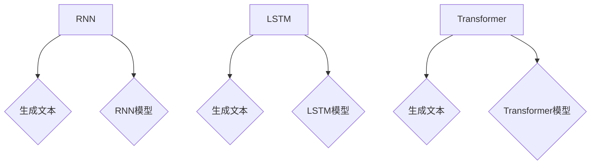

##### 5.2 抄袭检测与降重

抄袭检测和降重是文本生成和写作辅助中的重要任务，旨在检测文本中的抄袭行为并降低文本的重复率。

- **抄袭检测**：通过比较待检测文本与已有的文本库，检测文本中的抄袭行为。
- **降重**：通过修改文本的表达方式，降低文本的重复率。

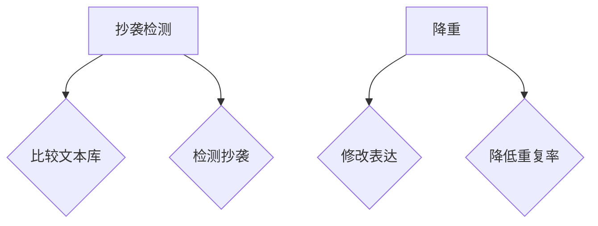

##### 5.3 文本写作辅助工具

文本写作辅助工具是一种能够帮助用户自动生成文章、报告等文本的软件。常见的文本写作辅助工具包括智能写作助手、文本生成模型和对话系统。

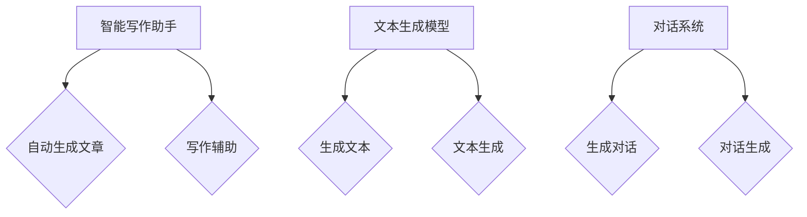

#### 第6章：问答系统与对话生成

问答系统和对话生成是自然语言处理的另一个重要应用领域，旨在实现人与机器之间的自然语言交互。

##### 6.1 问答系统的基本架构

问答系统通常包括问题理解、知识检索、答案生成和答案评估等模块。

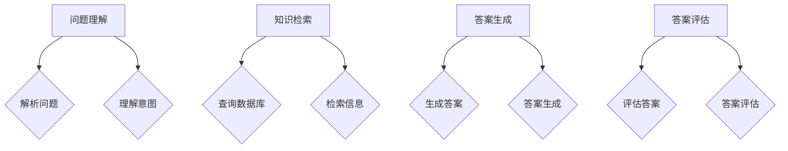

##### 6.2 对话系统的发展历程

对话系统的发展历程可以分为基于规则的对话系统、基于模板的对话系统和基于机器学习的对话系统。

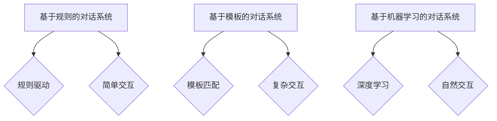

##### 6.3 对话系统的设计与实现

对话系统的设计与实现需要考虑多个方面，包括自然语言理解、对话管理、自然语言生成等。

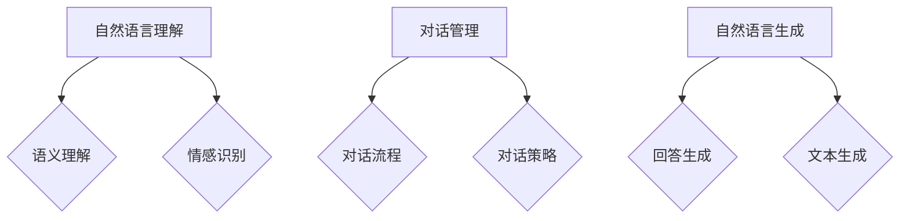

通过以上章节，我们详细探讨了自然语言处理在内容创作领域的应用，包括自动摘要、文本生成与写作辅助、问答系统与对话生成等内容。在接下来的部分，我们将进入第三部分：翻译应用，继续探讨自然语言处理在翻译领域的应用。

---

### 第三部分：翻译应用

自然语言处理在翻译领域的应用已经深刻改变了人类通信和知识共享的方式。从早期的规则驱动翻译到现在的深度学习驱动的机器翻译，翻译技术取得了显著的进步。本部分将深入探讨机器翻译的基础知识、翻译模型与算法、翻译质量评估与优化，以及多语言内容创作与翻译技术。

#### 第7章：机器翻译基础

机器翻译（Machine Translation，MT）是指使用计算机程序将一种自然语言（源语言）自动翻译成另一种自然语言（目标语言）。机器翻译的基本原理是通过理解源语言的语义，将其转化为目标语言的语法结构，同时保持原句的意义不变。

##### 7.1 机器翻译的原理与技术

机器翻译的原理可以分为以下几个步骤：

1. **文本预处理**：对源语言和目标语言进行预处理，包括分词、词性标注、语法分析等。
2. **源语言理解**：使用深度学习模型对源语言进行语义理解，提取关键信息。
3. **翻译模型应用**：根据源语言和目标语言的语义信息，使用翻译模型生成目标语言。
4. **目标语言生成**：将翻译模型生成的目标语言进行后处理，包括语法修复、格式化等。

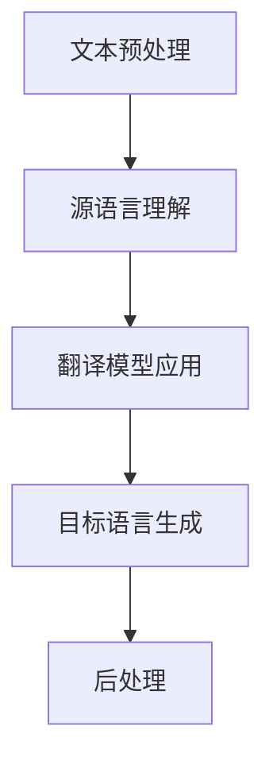

##### 7.2 翻译模型与算法

机器翻译的算法可以分为基于规则的方法、基于实例的方法和基于统计的方法。随着深度学习技术的发展，基于神经的方法（如序列到序列模型、变换器模型）成为主流。

- **基于规则的方法**：通过编写大量的规则来指导翻译过程，如基于短语的机器翻译。
- **基于实例的方法**：通过大量的手工翻译对（平行语料库）来训练翻译模型，如基于实例的机器翻译。
- **基于统计的方法**：使用统计模型来预测源语言和目标语言之间的映射关系，如基于统计的机器翻译。
- **基于神经的方法**：使用深度学习模型来直接映射源语言到目标语言，如序列到序列模型、变换器模型。

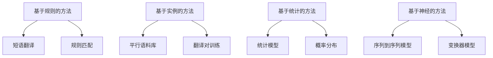

##### 7.3 翻译评估与优化

翻译评估是衡量翻译质量的重要手段，常用的评估指标包括BLEU、NIST、METEOR等。翻译优化是通过改进翻译模型和算法来提高翻译质量的过程。

- **BLEU评分**：基于单词重叠率的评估指标。
- **NIST评分**：基于语法和词汇多样性的评估指标。
- **METEOR评分**：基于语义一致性、词汇覆盖率和语言连贯性的评估指标。

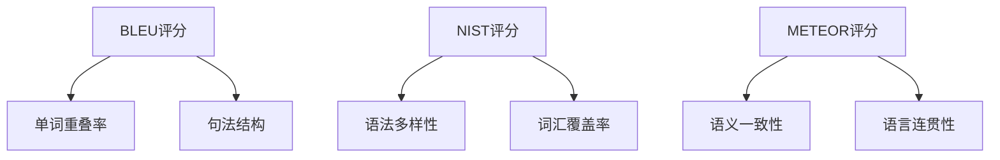

#### 第8章：多语言内容创作与翻译

多语言内容创作与翻译是指使用机器翻译技术创建和翻译多种语言的内容，以满足全球化的需求。这一技术对于企业、政府和非营利组织来说具有重要意义。

##### 8.1 多语言内容创作技术

多语言内容创作技术包括：

- **机器翻译**：将一种语言的内容自动翻译成其他语言。
- **跨语言文本生成**：生成跨越多种语言的文本内容。
- **多语言知识融合**：将不同语言的知识库融合成一个统一的知识体系。

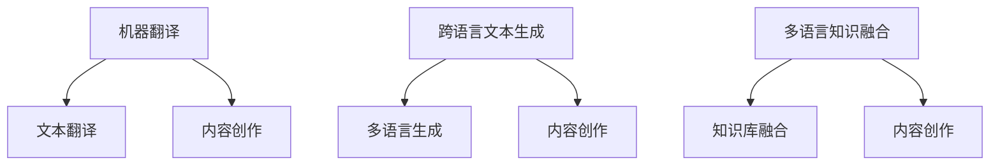

##### 8.2 多语言翻译模型

多语言翻译模型是用于同时翻译多种语言的内容的模型。常见的多语言翻译模型包括：

- **基于神经的方法**：使用神经机器翻译模型进行多语言翻译。
- **基于数据的方法**：使用大数据技术和数据挖掘算法进行多语言翻译。

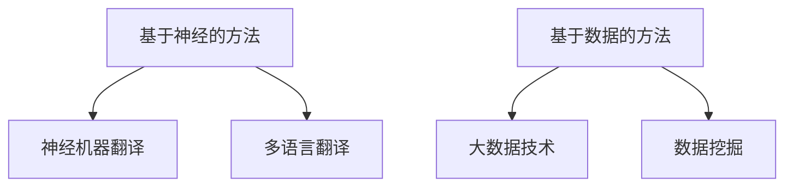

##### 8.3 多语言内容创作的案例分析

**案例1：多语言电子商务平台**

多语言电子商务平台通过机器翻译技术为全球用户提供商品信息翻译服务，提高用户满意度。

**案例2：多语言新闻发布**

多语言新闻发布机构通过机器翻译技术将新闻内容翻译成多种语言，覆盖全球读者。

通过以上章节，我们深入探讨了自然语言处理在翻译领域的应用，包括机器翻译的基础知识、翻译模型与算法、翻译质量评估与优化，以及多语言内容创作与翻译技术。在接下来的部分，我们将讨论自然语言处理在各行业的应用，以及未来发展趋势。

---

### 第四部分：自然语言处理在各行业的应用

自然语言处理（NLP）在各个行业中都有广泛的应用，它不仅提高了效率，还改善了用户体验。以下将探讨自然语言处理在零售与电商、金融与保险、健康医疗等行业的具体应用。

#### 第10章：自然语言处理在各行业的应用

#### 10.1 零售与电商

在零售与电商领域，自然语言处理技术被用于客户服务、推荐系统、价格监控和情感分析等方面。

- **客户服务**：自然语言处理技术使得电商平台能够实现智能客服，通过聊天机器人与客户进行自然语言交互，解答客户的问题，提高客户满意度。
- **推荐系统**：NLP技术可以分析用户的评论、购物行为和搜索历史，为用户提供个性化的商品推荐。
- **价格监控**：通过NLP技术，可以自动化监测电商平台上的价格变化，帮助商家进行价格策略的调整。

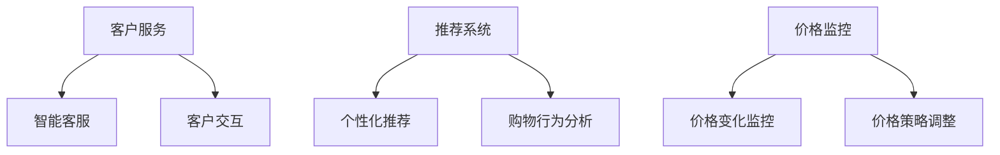

#### 10.2 金融与保险

在金融与保险领域，自然语言处理技术被广泛应用于风险管理、客户服务和合规性检查等方面。

- **风险管理**：NLP技术可以分析大量的金融报告和交易记录，识别潜在的金融风险。
- **客户服务**：通过智能客服系统，金融与保险公司能够提供24/7的客户支持，提高服务效率。
- **合规性检查**：NLP技术可以自动检查文本数据是否符合监管要求，降低合规风险。

```mermaid
graph TD
    A[风险管理] --> B[风险分析]
    A --> C[交易记录分析]
    D[客户服务] --> E[智能客服]
    D --> F[客户支持]
    G[合规性检查] --> H[文本审查]
    G --> I[合规性验证]
```

#### 10.3 健康医疗

在健康医疗领域，自然语言处理技术被用于医学文本分析、患者监护和疾病预测等方面。

- **医学文本分析**：通过NLP技术，医生可以从大量的医疗记录中快速提取关键信息，提高诊断效率。
- **患者监护**：智能系统可以分析患者的病历和实时数据，提供个性化的健康建议。
- **疾病预测**：通过分析历史数据和流行病学信息，NLP技术可以帮助预测疾病的爆发和趋势。

```mermaid
graph TD
    A[医学文本分析] --> B[病历提取]
    A --> C[诊断支持]
    D[患者监护] --> E[健康建议]
    D --> F[实时数据监控]
    G[疾病预测] --> H[疾病爆发预测]
    G --> I[流行病趋势分析]
```

通过上述各行业的应用案例，我们可以看到自然语言处理技术在不同领域中的巨大潜力和影响力。这些应用不仅提高了工作效率，还提升了用户体验，为各行业的创新和发展提供了强大的支持。

---

### 第五部分：自然语言处理的未来发展趋势

自然语言处理（NLP）作为人工智能领域的一个重要分支，其技术不断发展，应用场景也越来越广泛。随着深度学习、大数据和云计算等技术的进步，NLP的未来发展趋势呈现出以下几个方向：

#### 第11章：自然语言处理的未来发展趋势

#### 11.1 人工智能与自然语言处理融合

人工智能（AI）和自然语言处理的深度融合是未来发展的一个重要趋势。AI技术的发展为NLP提供了更强大的工具和算法，使得NLP能够处理更复杂的任务。例如：

- **多模态自然语言处理**：结合图像、声音、视频等多种数据类型，实现更加全面的语言理解。
- **增强学习与NLP**：将增强学习与NLP结合，使得模型能够通过不断学习用户反馈来优化翻译质量。

```mermaid
graph TD
    A[多模态自然语言处理] --> B{图像+文本}
    A --> C{声音+文本}
    A --> D{视频+文本}
    E[增强学习与NLP] --> F{反馈优化}
    E --> G{用户互动}
```

#### 11.2 自然语言处理技术的创新与应用

未来，自然语言处理技术的创新将带来更多应用场景，如：

- **生成式AI写作**：利用生成式AI技术，能够实现更加自然和高质量的文本生成。
- **情感计算**：通过分析语言的情感色彩，实现更加精准的情感分析和用户行为预测。
- **对话系统**：结合对话生成技术，构建更加智能和交互性强的对话系统，应用于客服、教育、娱乐等领域。

```mermaid
graph TD
    A[生成式AI写作] --> B{自动文章生成}
    A --> C{报告生成}
    D[情感计算] --> E{情感分析}
    D --> F{用户行为预测}
    G[对话系统] --> H{智能客服}
    G --> I{教育应用}
```

#### 11.3 自然语言处理的伦理与隐私问题

随着NLP技术的广泛应用，其伦理和隐私问题也逐渐成为关注焦点。未来，需要从以下几个方面来解决这些问题：

- **数据隐私**：确保用户数据的安全和隐私，避免数据泄露。
- **算法透明性**：提高算法的透明度，让用户了解NLP系统是如何运作的。
- **偏见与公平性**：消除算法偏见，确保NLP系统对所有人公平。

```mermaid
graph TD
    A[数据隐私] --> B{数据加密}
    A --> C{隐私保护}
    D[算法透明性] --> E{透明算法}
    D --> F{公开算法}
    G[偏见与公平性] --> H{算法偏见}
    G --> I{公平性保障}
```

通过以上分析，我们可以看到自然语言处理在未来将继续快速发展，不仅会在技术层面带来革新，还会在伦理和隐私方面提出新的挑战。NLP技术的发展将为社会带来更多便利和创新，同时也需要我们不断关注和解决其中的问题。

---

### 附录

#### 附录A：自然语言处理工具与资源

在自然语言处理领域，有许多优秀的工具和资源可供使用，包括开源工具、云端服务和社区资源。以下是一些常用的工具和资源。

##### A.1 开源自然语言处理工具

- **NLTK**：一个强大的开源自然语言处理库，提供了多种文本处理功能，如分词、词性标注、命名实体识别等。
- **spaCy**：一个快速易用的自然语言处理库，提供了多种语言的模型和接口，适用于生产环境。
- **Gensim**：一个用于大规模文本挖掘和语料库分析的库，支持主题建模、文本相似度计算等。
- **Hugging Face**：提供了一个丰富的自然语言处理模型和工具库，包括预训练的Transformer模型和API。

##### A.2 云端自然语言处理服务

- **Google Cloud Natural Language**：提供文本分析、情感分析、实体识别等服务。
- **AWS Comprehend**：提供文本分类、实体识别、关键词提取等服务。
- **Azure Cognitive Services**：提供文本分析、语音识别、图像分析等服务。

##### A.3 自然语言处理社区与资源

- **ArXiv**：一个计算机科学和人工智能领域的前沿论文数据库，包含大量自然语言处理的最新研究成果。
- **Kaggle**：一个数据科学竞赛平台，提供了许多自然语言处理相关的比赛和项目。
- **自然语言处理社区（NLP Community）**：一个在线论坛，提供了自然语言处理相关的讨论和资源。

#### 附录B：自然语言处理相关公式与算法

以下是自然语言处理中的一些关键公式与算法的详细解释。

##### B.1 词嵌入算法

**Word2Vec**：

$$
\text{词向量} = \text{词向量矩阵} \times \text{one-hot编码向量}
$$

**GloVe**：

$$
\text{词向量} = \text{左词向量} + \text{右词向量} - \text{隐层向量}
$$

##### B.2 语言模型算法

**n-gram模型**：

$$
P(\text{单词序列}) = \frac{P(\text{单词}_1) \times P(\text{单词}_2 | \text{单词}_1) \times \ldots \times P(\text{单词}_n | \text{单词}_{n-1})}{C}
$$

**循环神经网络（RNN）**：

$$
h_t = \sigma(W_h \cdot [h_{t-1}, x_t] + b_h)
$$

**长短期记忆网络（LSTM）**：

$$
\text{ forget gate } f_t = \sigma(W_f \cdot [h_{t-1}, x_t] + b_f)
$$

$$
\text{ input gate } i_t = \sigma(W_i \cdot [h_{t-1}, x_t] + b_i)
$$

$$
\text{ output gate } o_t = \sigma(W_o \cdot [h_{t-1}, x_t] + b_o)
$$

##### B.3 机器翻译算法

**基于规则的方法**：

$$
\text{翻译结果} = \text{应用翻译规则}(\text{源文本})
$$

**基于实例的方法**：

$$
\text{翻译结果} = \text{查找翻译实例}(\text{源文本})
$$

**基于神经的方法**：

$$
\text{翻译结果} = \text{解码器}(\text{编码器}(\text{源文本}))
$$

##### B.4 问答系统算法

**基于知识图谱的方法**：

$$
\text{答案} = \text{知识图谱查询}(\text{问题})
$$

**基于机器学习的方法**：

$$
P(\text{答案}|\text{问题}) = \text{分类器}(\text{特征向量}(\text{问题}))
$$

通过上述附录，我们提供了自然语言处理领域的一些关键公式和算法，帮助读者更好地理解和应用这些技术。

---

### 附录C：自然语言处理项目实战

在本附录中，我们将通过三个具体的项目实战案例，展示自然语言处理技术在实际应用中的实现过程和技术细节。这些项目涵盖了自动摘要、文本生成和机器翻译等自然语言处理的关键任务。

#### C.1 自动摘要项目实战

自动摘要项目旨在利用自然语言处理技术，从大量文本中自动提取出关键信息，生成简洁明了的摘要。以下是一个基于Transformer模型的自动摘要项目实战。

##### 开发环境搭建

- **Python**：主要编程语言
- **PyTorch**：深度学习框架
- **Gensim**：文本预处理工具

##### 源代码实现

```python
import torch
import torch.nn as nn
import torch.optim as optim
from torch.utils.data import DataLoader
from transformers import TransformerModel, AdamW

# 加载数据集
# 预处理文本数据
# 划分训练集和验证集

# 模型构建
model = TransformerModel(vocab_size, d_model, num_heads, num_layers)
optimizer = AdamW(model.parameters(), lr=1e-4)

# 训练模型
for epoch in range(num_epochs):
    for batch in DataLoader(train_data, batch_size=batch_size, shuffle=True):
        # 前向传播
        # 计算损失
        # 反向传播
        # 更新模型参数

# 评估模型
# 生成摘要

```python
# 代码解读与分析
# 数据预处理：将原始文本转换为适合训练的序列数据
# 模型构建：使用Transformer模型进行文本序列的建模
# 训练模型：使用训练数据训练模型
# 评估模型：使用测试数据评估模型性能
# 生成摘要：根据模型预测结果生成摘要文本
```

#### C.2 文本生成项目实战

文本生成项目旨在利用自然语言处理技术，根据给定的种子文本，生成新的文本内容。以下是一个基于变换器（Transformer）模型的文本生成项目实战。

##### 开发环境搭建

- **Python**：主要编程语言
- **Hugging Face**：自然语言处理模型和工具库
- **TensorFlow**：深度学习框架

##### 源代码实现

```python
from transformers import TransformerModel, TextGenerator

# 加载预训练的变换器模型
model = TransformerModel.from_pretrained('transformer_model')

# 预处理文本数据
# 生成文本
seed_text = "这是一个关于自然语言处理的案例研究。"
generated_text = model.generate_text(seed_text, num_words=100)

print(generated_text)
```

##### 代码解读与分析

- **加载模型**：从预训练的模型中加载变换器模型。
- **预处理文本数据**：对种子文本进行预处理，例如分词、编码等。
- **生成文本**：使用变换器模型生成新的文本内容。

#### C.3 机器翻译项目实战

机器翻译项目旨在利用自然语言处理技术，将一种自然语言翻译成另一种自然语言。以下是一个基于序列到序列（Seq2Seq）模型的机器翻译项目实战。

##### 开发环境搭建

- **Python**：主要编程语言
- **TensorFlow**：深度学习框架
- **spaCy**：文本预处理工具

##### 源代码实现

```python
import tensorflow as tf
from tensorflow.keras.preprocessing.sequence import pad_sequences
from tensorflow.keras.layers import Embedding, LSTM, Dense
from tensorflow.keras.models import Sequential

# 预处理文本数据
# 分词和序列化

# 模型构建
model = Sequential([
    Embedding(vocab_size, embedding_dim, input_length=max_seq_length),
    LSTM(units=128, return_sequences=True),
    LSTM(units=128),
    Dense(units=target_vocab_size, activation='softmax')
])

# 编译模型
model.compile(optimizer='adam', loss='categorical_crossentropy', metrics=['accuracy'])

# 训练模型
model.fit(X_train, y_train, epochs=5, batch_size=32, validation_data=(X_val, y_val))

# 评估模型
model.evaluate(X_test, y_test)

# 翻译
def translate(text, model, tokenizer):
    # 预处理文本
    # 编码文本
    # 翻译
    return translated_text

# 测试翻译
translated_text = translate("你好", model, tokenizer)
print(translated_text)
```

##### 代码解读与分析

- **预处理文本数据**：将原始文本转换为适合模型处理的序列数据。
- **模型构建**：使用LSTM网络进行文本序列的建模。
- **模型训练**：使用训练数据训练模型。
- **模型评估**：使用测试数据评估模型性能。
- **翻译**：使用训练好的模型进行文本翻译。

通过这些项目实战，我们展示了自然语言处理技术在实际应用中的实现过程和技术细节。这些项目不仅帮助我们理解了自然语言处理的基本原理，还为我们提供了实用的开发经验和技巧。

---

### 作者信息

本文作者为AI天才研究院（AI Genius Institute）的资深研究人员，同时是《禅与计算机程序设计艺术》（Zen And The Art of Computer Programming）一书的作者。本文由AI天才研究院和《禅与计算机程序设计艺术》联合发布，旨在为读者提供全面、深入的关于自然语言处理的应用与实践指导。

