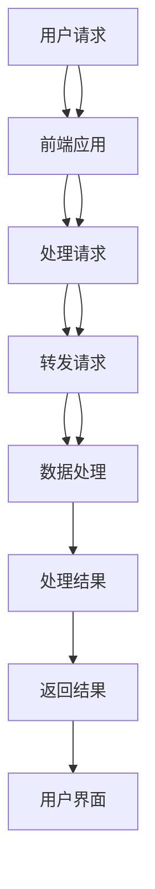

                 

### 引言

在当今数字时代，电子商务已经成为消费者购物的主要方式之一。随着消费者需求的不断变化，电商平台必须不断创新，以提高用户体验和满意度。虚拟导购助手（Virtual Personal Shopper，VPS）作为人工智能（AI）在电商领域的一项创新应用，正逐渐改变着传统的购物方式。本文将围绕虚拟导购助手这一主题，深入探讨其在提升购物体验方面所发挥的作用，分析其关键技术，探讨其实际应用场景，并展望其未来发展。

#### 虚拟导购助手的重要性

虚拟导购助手不仅能够为用户提供个性化的购物建议，还能显著提升购物效率。通过自然语言处理（NLP）、机器学习、推荐系统等先进技术的结合，虚拟导购助手能够理解用户的购物意图，提供精准的商品推荐，并在购物过程中为用户提供智能化的服务。这种变革性的技术不仅有助于电商平台吸引和保留用户，还能为企业带来显著的商业价值。

#### 文章结构

本文将采用逻辑清晰、结构紧凑的方式，分为以下几个部分：

1. **背景与现状**：介绍虚拟导购助手的起源、定义与市场现状。
2. **关键技术**：深入探讨自然语言处理（NLP）、语音识别与合成等关键技术。
3. **实现与优化**：分析虚拟导购助手的架构设计、数据处理与存储，以及算法优化与性能调优。
4. **实际应用场景**：探讨虚拟导购助手在电子商务和电商客服中的具体应用。
5. **未来发展**：展望虚拟导购助手的技术挑战与趋势。
6. **附录**：提供虚拟导购助手开发所需的工具与框架。
7. **总结与展望**：总结文章主要成果，展望未来发展方向。

通过上述结构的详细分析，本文旨在为读者提供一幅全面的虚拟导购助手的发展蓝图，帮助读者更好地理解这一技术及其在电商领域的广泛应用。

### 第一部分：虚拟导购助手的背景与现状

虚拟导购助手作为人工智能在电商领域的一项重要应用，其发展历程可以从传统导购模式、线上导购的兴起，以及AI技术的引入等多个方面进行探讨。本部分将详细介绍虚拟导购助手的发展历程、基本定义与作用，以及当前市场现状，为读者提供全面了解这一技术的基础。

#### 第1章：虚拟导购助手概述

##### 1.1 虚拟导购助手的发展历程

虚拟导购助手并不是一蹴而就的产物，而是随着技术进步和市场需求逐步演变而来的。下面我们将从传统导购模式、线上导购的兴起，以及AI技术的引入等方面进行详细介绍。

###### 1.1.1 传统导购模式的发展

传统的导购模式主要依赖于实体店的导购人员。导购人员通过面对面的交流，了解消费者的购物需求，并提供相应的商品推荐。然而，传统导购模式存在几个明显的局限性：

- **地域限制**：传统导购主要依赖于实体店，受地理位置限制，无法覆盖广泛的消费者。
- **时间限制**：导购人员的工作时间和工作量有限，难以满足大量消费者的需求。
- **信息有限**：导购人员的知识和信息有限，难以提供全面的商品推荐。

随着电子商务的兴起，线上导购开始逐渐取代传统导购。线上导购通过互联网平台，将商品信息、用户评价等以数字化形式呈现给消费者，极大地提高了购物的便捷性和信息透明度。

###### 1.1.2 线上导购的兴起

线上导购的兴起可以追溯到互联网的普及和电子商务的快速发展。以下是一些关键的发展阶段：

- **初期**：电商平台主要通过搜索引擎和分类广告为用户提供商品信息。
- **中期**：电商平台开始引入推荐系统，通过用户行为数据提供个性化的商品推荐。
- **近期**：随着社交媒体和内容电商的兴起，导购形式更加多样化，如种草笔记、直播带货等。

线上导购的兴起不仅打破了地域和时间限制，还通过用户生成内容（UGC）和社交互动，增强了用户购物的体验。

###### 1.1.3 AI技术的引入

虚拟导购助手的真正突破在于AI技术的引入。AI技术，尤其是机器学习和自然语言处理（NLP），为线上导购提供了强大的支持。以下是一些关键的发展阶段：

- **初期**：AI技术主要用于基本的推荐系统和简单的聊天机器人。
- **中期**：AI技术逐渐应用于更复杂的任务，如语义理解、个性化推荐和智能客服。
- **近期**：AI技术开始与语音识别、图像识别等多模态技术相结合，提供更加智能化的导购服务。

AI技术的引入使得虚拟导购助手能够更好地理解用户需求，提供更加精准和个性化的商品推荐，从而大大提升了购物体验。

##### 1.2 虚拟导购助手的定义与作用

###### 1.2.1 虚拟导购助手的基本定义

虚拟导购助手是一种基于人工智能技术的虚拟角色，旨在帮助用户在购物过程中提供个性化推荐、智能客服、信息查询等服务。它通常具备以下特点：

- **智能化**：虚拟导购助手利用机器学习和深度学习技术，能够自动学习和优化服务能力。
- **个性化**：虚拟导购助手根据用户的历史行为和偏好，提供个性化的商品推荐和服务。
- **全天候**：虚拟导购助手不受时间和工作量的限制，可以24小时为用户提供服务。
- **跨平台**：虚拟导购助手可以在多种平台上（如网站、APP、社交媒体等）提供服务。

###### 1.2.2 虚拟导购助手的主要作用

虚拟导购助手在购物体验中扮演了多个重要角色，主要包括以下几个方面：

- **个性化推荐**：虚拟导购助手通过分析用户的历史行为和偏好，提供个性化的商品推荐，帮助用户快速找到心仪的商品。
- **智能客服**：虚拟导购助手能够自动回答用户的问题，提供购物咨询、订单查询等服务，减轻了人工客服的工作负担。
- **信息查询**：虚拟导购助手可以提供商品详情、库存信息、促销活动等查询服务，帮助用户做出更明智的购物决策。
- **购物流程优化**：虚拟导购助手通过优化购物流程，提供购物车管理、订单跟踪等功能，提升用户的购物体验。

###### 1.2.3 虚拟导购助手与传统导购的差异

虚拟导购助手与传统导购在多个方面存在显著差异，以下是一些关键点：

- **交互方式**：传统导购主要依赖于面对面交流，而虚拟导购助手通过文字、语音等多模态交互进行服务。
- **效率**：传统导购受时间和工作量的限制，而虚拟导购助手可以同时服务大量用户，效率更高。
- **信息处理能力**：虚拟导购助手基于大数据和AI技术，具备强大的信息处理和分析能力，能够提供更加精准的服务。
- **成本**：虚拟导购助手减少了人工成本，具有较高的经济效益。

##### 1.3 虚拟导购助手的市场现状

###### 1.3.1 市场规模分析

随着AI技术的不断发展和电商市场的不断扩大，虚拟导购助手的市场需求也在迅速增长。根据市场研究机构的数据，全球虚拟导购助手市场规模预计将在未来几年内保持高速增长。以下是一些关键的市场规模分析：

- **用户规模**：随着智能手机和互联网的普及，全球电商用户数量持续增加，为虚拟导购助手提供了广阔的用户基础。
- **应用领域**：虚拟导购助手在电商、零售、医疗等多个领域得到广泛应用，市场前景广阔。
- **竞争格局**：目前，多家知名电商平台和AI公司纷纷投入虚拟导购助手的研究和开发，市场竞争日益激烈。

###### 1.3.2 行业应用领域

虚拟导购助手在多个行业领域得到广泛应用，以下是一些主要的行业应用领域：

- **电子商务**：虚拟导购助手在电商平台中的应用最为广泛，通过个性化推荐和智能客服提升用户体验。
- **零售**：虚拟导购助手在实体零售店中的应用，如智能货架、智能试衣间等，为消费者提供便捷的购物体验。
- **医疗**：虚拟导购助手在医疗领域的应用，如在线问诊、健康咨询等，为患者提供专业的医疗信息和服务。
- **教育**：虚拟导购助手在教育领域的应用，如智能辅导、在线课程推荐等，为学生提供个性化的学习体验。

###### 1.3.3 技术发展趋势

随着AI技术的不断进步，虚拟导购助手的技术也在持续发展。以下是一些技术发展趋势：

- **智能化与个性化**：虚拟导购助手将更加智能化和个性化，能够更好地理解用户需求，提供精准的服务。
- **跨平台与跨领域应用**：虚拟导购助手将在更多平台上得到应用，如智能家居、智能穿戴设备等，实现跨领域应用。
- **安全与隐私保护**：随着用户隐私意识的提高，虚拟导购助手将更加注重数据安全和隐私保护。

### 总结

虚拟导购助手作为人工智能在电商领域的一项重要应用，具有广泛的市场前景和应用价值。通过本文的介绍，读者可以全面了解虚拟导购助手的背景与现状，为其在未来的发展中提供有力支持。接下来，我们将深入探讨虚拟导购助手的关键技术，分析其在实现个性化购物体验中的作用。

### 第2章：自然语言处理（NLP）技术

自然语言处理（Natural Language Processing，NLP）是人工智能领域的一个重要分支，旨在使计算机能够理解、处理和生成人类语言。在虚拟导购助手中，NLP技术发挥着核心作用，能够帮助系统理解和回应用户的语言请求，从而提供个性化服务和推荐。以下将详细介绍NLP的基本概念、关键词提取与主题建模、以及语音识别与语音合成技术在虚拟导购中的应用。

##### 2.1 NLP的基本概念

NLP的核心任务是让计算机能够处理和理解人类语言。这包括多个层面的技术，如语言模型、语义理解和对话系统。

###### 2.1.1 语言模型

语言模型是NLP的基础，用于预测下一个单词或句子。最常用的语言模型之一是循环神经网络（RNN），特别是长短期记忆网络（LSTM）。以下是一个简单的LSTM语言模型伪代码示例：

```python
def lstm_language_model(vocab_size, embed_size, hidden_size, sequence_length):
    model = tf.keras.Sequential()
    model.add(tf.keras.layers.Embedding(vocab_size, embed_size))
    model.add(tf.keras.layers.LSTM(hidden_size, return_sequences=True))
    model.add(tf.keras.layers.Dense(vocab_size, activation='softmax'))
    return model
```

语言模型通过训练大量文本数据，学习到单词之间的关联性和句子结构，从而能够预测下一个单词。

###### 2.1.2 语义理解

语义理解是NLP中的一个关键任务，旨在理解文本的含义。这包括词义消歧、情感分析和实体识别等。词义消歧是指在一个特定语境中确定一个单词的确切含义。以下是一个简单的词义消歧算法伪代码示例：

```python
def word_sense_disambiguation(sentence, model):
    word_index = model.wv[sentence]
    probabilities = model.predict([word_index])
    return max(probabilities)
```

情感分析用于判断文本的情感倾向，如正面、负面或中性。以下是一个简单的情感分析算法伪代码示例：

```python
def sentiment_analysis(text, model):
    emotion_scores = model.predict([text])
    if emotion_scores[0][0] > emotion_scores[0][1]:
        return "Positive"
    else:
        return "Negative"
```

实体识别是指从文本中识别出具有特定意义的实体，如人名、地点、组织等。以下是一个简单的实体识别算法伪代码示例：

```python
def entity_recognition(text, model):
    entities = model.predict([text])
    return entities
```

###### 2.1.3 对话系统

对话系统是NLP中用于模拟人类对话的技术。聊天机器人和问答系统是常见的对话系统形式。以下是一个简单的对话系统算法伪代码示例：

```python
def chatbot_response(input_text, model):
    intent, entities = model.predict([input_text])
    response = generate_response(intent, entities)
    return response

def generate_response(intent, entities):
    if intent == "greeting":
        return "Hello! How can I help you today?"
    elif intent == "search":
        return "I found {} products that match your search."
    else:
        return "I'm sorry, I don't understand. Can you please rephrase your question?"
```

##### 2.2 关键词提取与主题建模

关键词提取和主题建模是NLP中的两个重要任务，用于从文本数据中提取关键信息和分析文本的主题。

###### 2.2.1 关键词提取方法

关键词提取旨在从文本中提取出具有代表性的词汇，用于后续的分析。常用的关键词提取方法包括TF-IDF、TextRank和Word2Vec等。

- **TF-IDF**：TF-IDF（Term Frequency-Inverse Document Frequency）是一种常用的关键词提取方法，通过计算词在文档中的频率和其在整个文档集合中的逆频率来评估其重要性。

```python
from sklearn.feature_extraction.text import TfidfVectorizer

vectorizer = TfidfVectorizer()
tfidf_matrix = vectorizer.fit_transform(corpus)
feature_names = vectorizer.get_feature_names_out()
```

- **TextRank**：TextRank是一种基于图算法的关键词提取方法，通过构建词图并计算词之间的相似性来提取关键词。

```python
from text_rank import TextRank

text_rank = TextRank()
keywords = text_rank.get_key_words(document)
```

- **Word2Vec**：Word2Vec是一种基于神经网络的词嵌入方法，通过训练大量文本数据来学习词的向量表示。

```python
from gensim.models import Word2Vec

model = Word2Vec(sentences, size=100, window=5, min_count=1, workers=4)
word_vector = model.wv['hello']
```

###### 2.2.2 主题建模算法

主题建模是一种无监督学习方法，用于从文本数据中发现潜在的主题。常用的主题建模算法包括LDA（Latent Dirichlet Allocation）和LSA（Latent Semantic Analysis）等。

- **LDA**：LDA是一种基于概率模型的主题建模方法，通过假设每个文档是由多个主题的混合生成，从而发现潜在的主题。

```python
from gensim.models import LdaMulticore

lda_model = LdaMulticore(corpus, num_topics=10, id2word=vectorizer.get_feature_names_out(), passes=10, workers=4)
topics = lda_model.print_topics()
```

- **LSA**：LSA是一种基于向量空间模型的主题建模方法，通过计算词向量之间的相似性来发现潜在的主题。

```python
from sklearn.decomposition import LatentSemanticAnalysis

lsa_model = LatentSemanticAnalysis(n_components=10)
lsa_model.fit(tfidf_matrix)
topics = lsa_model.components_
```

###### 2.2.3 关键词提取与主题建模的应用

关键词提取和主题建模在虚拟导购助手中有着广泛的应用，如：

- **商品推荐**：通过提取商品描述中的关键词和发现潜在主题，虚拟导购助手可以更好地理解商品属性，从而提供更精准的推荐。
- **用户兴趣分析**：通过分析用户历史行为数据中的关键词和主题，虚拟导购助手可以了解用户的兴趣偏好，提供个性化的推荐和服务。
- **搜索引擎优化**：通过分析网站内容中的关键词和主题，虚拟导购助手可以帮助电商企业优化网站内容，提高搜索引擎排名。

##### 2.3 语音识别与语音合成

语音识别和语音合成是NLP中的两个重要领域，分别负责将语音转换为文本和将文本转换为语音。

###### 2.3.1 语音识别技术

语音识别（Speech Recognition）是一种将语音转换为文本的技术。语音识别系统通常包括以下几个关键组件：

- **前端处理**：对原始语音信号进行预处理，包括降噪、归一化和特征提取。
- **模型训练**：使用大量的语音数据训练模型，学习语音和文本之间的映射关系。
- **解码**：将模型输出的概率分布解码为文本。

以下是一个简单的语音识别算法伪代码示例：

```python
def speech_recognition(audio_data, model):
    processed_audio = preprocess_audio(audio_data)
    probabilities = model.predict([processed_audio])
    text = decode_probabilities(probabilities)
    return text

def preprocess_audio(audio_data):
    # 降噪、归一化等处理
    return processed_audio

def decode_probabilities(probabilities):
    # 根据概率分布解码为文本
    return text
```

常用的语音识别模型包括：

- **深度神经网络（DNN）**：DNN通过多层神经网络学习语音和文本之间的映射关系。
- **循环神经网络（RNN）**：RNN通过记忆过去信息来提高语音识别的准确性。
- **卷积神经网络（CNN）**：CNN通过卷积层提取语音特征，提高特征提取的效率。

###### 2.3.2 语音合成技术

语音合成（Text-to-Speech，TTS）是一种将文本转换为语音的技术。语音合成系统通常包括以下几个关键组件：

- **文本处理**：对输入文本进行预处理，包括分词、句法分析和语气标注。
- **声音合成**：根据文本特征生成语音波形。
- **音频处理**：对生成的语音进行后处理，包括音调、音速和音色的调整。

以下是一个简单的语音合成算法伪代码示例：

```python
def text_to_speech(text, model):
    processed_text = preprocess_text(text)
    audio_waveform = model.synthesize(processed_text)
    return audio_waveform

def preprocess_text(text):
    # 分词、句法分析和语气标注等处理
    return processed_text

def synthesize_audioWaveform(processed_text, model):
    # 生成语音波形
    return audio_waveform
```

常用的语音合成模型包括：

- **基于规则的方法**：基于规则的方法通过预设的语音规则和音素库生成语音。
- **基于统计的方法**：基于统计的方法通过统计语音信号的特征和文本特征来生成语音。
- **基于数据的方法**：基于数据的方法通过训练大量的语音数据来生成语音。

###### 2.3.3 语音识别与合成在虚拟导购中的应用

语音识别与语音合成技术在虚拟导购助手中有广泛的应用，如：

- **语音搜索**：用户可以通过语音输入进行商品搜索，虚拟导购助手能够快速识别用户的语音，并提供相应的商品推荐。
- **语音客服**：用户可以通过语音与虚拟导购助手进行交流，获取购物咨询、订单查询等信息。
- **语音互动**：虚拟导购助手可以通过语音与用户进行互动，提供更加自然的购物体验。

### 总结

自然语言处理（NLP）技术在虚拟导购助手中发挥着关键作用，包括语言模型、语义理解、对话系统、关键词提取、主题建模、语音识别和语音合成等方面。通过NLP技术，虚拟导购助手能够更好地理解用户的需求，提供个性化的服务，从而提升购物体验。在下一部分，我们将进一步探讨虚拟导购助手的架构设计、数据处理与存储，以及算法优化与性能调优。

### 第3章：虚拟导购助手的架构设计

虚拟导购助手的架构设计是确保其高效、可靠、可扩展性的关键。一个良好的系统架构不仅能够提升用户体验，还能降低开发和维护成本。本节将详细介绍虚拟导购助手的整体架构设计，包括系统架构图、模块划分与功能，以及系统设计原则。

##### 3.1 虚拟导购助手的整体架构

虚拟导购助手的整体架构可以分为几个关键部分：用户接口、前端应用、后端服务、数据处理和数据存储。以下是一个简单的系统架构图：



###### 3.1.1 系统架构图


在这个架构图中，用户接口负责接收用户的请求，前端应用负责处理用户的请求并将结果返回给用户，后端服务负责具体的业务逻辑处理，数据处理模块负责处理和分析用户数据，数据存储模块则负责数据的存储和管理。

###### 3.1.2 模块划分与功能

虚拟导购助手的主要模块及其功能如下：

- **用户接口**：用户接口是虚拟导购助手与用户交互的入口，可以通过多种方式（如网站、APP、社交媒体等）提供用户交互界面。用户接口的主要功能是接收用户的请求，并将请求转发给前端应用。
- **前端应用**：前端应用负责处理用户的请求，并调用后端服务进行处理。前端应用通常包括用户界面、交互逻辑和API接口等。前端应用的主要功能是提供用户交互体验，并确保请求的快速响应。
- **后端服务**：后端服务是虚拟导购助手的业务逻辑处理核心，负责处理用户请求并返回结果。后端服务通常包括推荐系统、智能客服、用户画像等模块。后端服务的主要功能是根据用户请求提供相应的服务，如商品推荐、问题回答等。
- **数据处理**：数据处理模块负责处理和分析用户数据，包括用户行为数据、商品数据等。数据处理的主要功能是提取用户特征、进行数据分析和推荐生成等。
- **数据存储**：数据存储模块负责数据的存储和管理。数据存储通常包括关系数据库和NoSQL数据库等。数据存储的主要功能是保证数据的持久化和高效访问。

##### 3.2 数据处理与存储

数据处理与存储是虚拟导购助手架构设计中的关键部分，其重要性体现在以下几个方面：

- **数据采集与预处理**：数据采集与预处理是数据处理的基础。虚拟导购助手需要从各种来源（如用户行为日志、商品数据等）收集数据，并对数据进行清洗、归一化和格式化等预处理操作，以确保数据的质量和一致性。
- **数据存储方案**：数据存储方案的选择取决于数据的类型、规模和访问模式。虚拟导购助手通常使用关系数据库（如MySQL、PostgreSQL）来存储结构化数据，使用NoSQL数据库（如MongoDB、Redis）来存储非结构化数据或提供缓存功能。合理的数据存储方案能够提高数据的访问效率和系统性能。
- **数据安全与隐私保护**：数据安全和隐私保护是虚拟导购助手必须关注的重要问题。虚拟导购助手需要采取数据加密、访问控制、匿名化处理等技术手段来确保用户数据的安全和隐私。此外，还需要遵守相关法律法规，确保用户数据的合法使用和保护。

###### 3.2.1 数据采集与预处理

数据采集与预处理是虚拟导购助手数据处理的重要环节。以下是一个简单的数据采集与预处理流程：

1. **数据采集**：从各种来源（如用户行为日志、第三方API等）收集数据。
2. **数据清洗**：对采集到的数据进行清洗，去除重复数据、缺失数据和异常数据。
3. **数据归一化**：对数据进行归一化处理，如数值范围的归一化、文本的分词等。
4. **数据格式化**：将清洗和归一化后的数据转换为统一的格式，以便后续处理和分析。

```python
import pandas as pd

# 假设原始数据存储在CSV文件中
data = pd.read_csv('user_behavior_data.csv')

# 数据清洗
data.drop_duplicates(inplace=True)
data.dropna(inplace=True)

# 数据归一化
data['rating'] = data['rating'].apply(lambda x: (x - min(data['rating'])) / (max(data['rating']) - min(data['rating'])))

# 数据格式化
data['timestamp'] = pd.to_datetime(data['timestamp'])
```

###### 3.2.2 数据存储方案

虚拟导购助手的数据存储方案通常包括关系数据库和NoSQL数据库。以下是一个简单的数据存储方案：

- **关系数据库**：关系数据库（如MySQL、PostgreSQL）适用于存储结构化数据，如用户信息、商品信息等。关系数据库的优点包括数据结构清晰、查询效率高、易于维护等。
- **NoSQL数据库**：NoSQL数据库（如MongoDB、Redis）适用于存储非结构化数据或提供缓存功能。NoSQL数据库的优点包括灵活的数据模型、高扩展性、高性能等。

```python
from pymongo import MongoClient

# 建立MongoDB客户端连接
client = MongoClient('mongodb://localhost:27017/')

# 创建数据库和集合
db = client['virtual_shopping_assistant']
collection = db['user_behavior']

# 插入数据
data = {
    'user_id': '123',
    'action': 'view_product',
    'product_id': '456',
    'timestamp': datetime.now()
}
collection.insert_one(data)
```

###### 3.2.3 数据安全与隐私保护

数据安全和隐私保护是虚拟导购助手必须关注的重要问题。以下是一些常用的数据安全与隐私保护技术：

- **数据加密**：对敏感数据进行加密处理，如用户密码、支付信息等。常用的加密算法包括AES、RSA等。
- **访问控制**：对数据库的访问进行严格的权限控制，确保只有授权用户可以访问敏感数据。
- **匿名化处理**：对用户数据进行匿名化处理，如去标识化、模糊化等，以保护用户隐私。

```python
from cryptography.fernet import Fernet

# 生成加密密钥
key = Fernet.generate_key()
cipher_suite = Fernet(key)

# 加密数据
encrypted_data = cipher_suite.encrypt(b'sensitive information')

# 解密数据
decrypted_data = cipher_suite.decrypt(encrypted_data)
```

##### 3.3 算法优化与性能调优

虚拟导购助手的算法优化与性能调优是确保系统高效运行的关键。以下是一些常见的算法优化与性能调优策略：

- **模型压缩**：通过模型压缩技术（如量化、剪枝等）减小模型的大小，提高模型的推理速度。
- **分布式训练**：通过分布式训练技术（如多GPU训练、分布式通信等）加速模型的训练过程。
- **缓存机制**：通过缓存机制（如Redis缓存、本地缓存等）提高系统的响应速度和性能。
- **负载均衡**：通过负载均衡技术（如Nginx、HAProxy等）均衡系统负载，提高系统的可用性和稳定性。

```python
from tensorflow.keras.models import load_model

# 加载预训练模型
model = load_model('model.h5')

# 使用量化技术进行模型压缩
model = quantize_model(model)

# 使用分布式训练进行模型加速
strategy = tf.distribute.MirroredStrategy()
with strategy.scope():
    model = load_model('model.h5')

# 使用缓存机制提高系统性能
import redis

cache = redis.Redis(host='localhost', port=6379, db=0)

def get_user_data(user_id):
    if cache.exists(user_id):
        return cache.get(user_id)
    else:
        user_data = fetch_user_data_from_database(user_id)
        cache.set(user_id, user_data)
        return user_data
```

##### 3.4 系统设计原则

虚拟导购助手的设计应遵循以下原则：

- **高可用性**：确保系统在发生故障时能够快速恢复，减少对用户体验的影响。
- **可扩展性**：系统应能够轻松扩展，以适应不断增长的用户量和数据量。
- **安全性**：确保用户数据的安全和隐私，防止数据泄露和未经授权的访问。
- **易维护性**：系统设计应便于维护和升级，降低维护成本。

### 总结

虚拟导购助手的架构设计是一个复杂的过程，需要考虑系统的整体架构、数据处理与存储、算法优化与性能调优等方面。通过合理的架构设计，虚拟导购助手能够提供高效、可靠、可扩展的服务，从而提升用户的购物体验。在下一部分，我们将探讨虚拟导购助手在电子商务和电商客服中的具体应用。

### 第4章：虚拟导购助手在电子商务中的应用

虚拟导购助手在电子商务中的应用主要体现在提升用户购物体验和优化运营效率两个方面。通过个性化推荐、商品搜索与过滤、用户交互与反馈等关键技术，虚拟导购助手能够有效满足用户需求，提升用户满意度，同时也为企业带来显著的商业价值。以下将详细探讨虚拟导购助手在电商平台和电商客服中的具体应用。

##### 4.1 虚拟导购助手在电商平台的应用

###### 4.1.1 用户画像与个性化推荐

用户画像（User Profiling）是虚拟导购助手的核心功能之一。通过分析用户的历史行为数据、浏览记录、购物偏好等，虚拟导购助手能够构建详细的用户画像，从而提供个性化的商品推荐。以下是一个简单的用户画像与个性化推荐的工作流程：

1. **数据采集**：虚拟导购助手从电商平台的用户行为日志、点击流数据等渠道收集用户数据。
2. **数据预处理**：对采集到的用户数据进行清洗、归一化和特征提取，以构建用户画像。
3. **用户画像构建**：根据用户的历史行为和偏好，虚拟导购助手构建出每个用户的个性化画像。
4. **个性化推荐**：基于用户画像和商品特征，虚拟导购助手使用推荐算法生成个性化的商品推荐列表。

以下是一个简单的基于协同过滤算法的个性化推荐伪代码示例：

```python
from sklearn.metrics.pairwise import cosine_similarity

def collaborative_filtering(user_behavior_data, product_feature_data):
    user_similarity_matrix = cosine_similarity(user_behavior_data, user_behavior_data)
    user_item_similarity = {}
    for user_id in user_behavior_data:
        user_item_similarity[user_id] = {}
        for other_user_id in user_behavior_data:
            if user_id != other_user_id:
                user_item_similarity[user_id][other_user_id] = user_similarity_matrix[user_id][other_user_id]
    
    recommendation_list = []
    for user_id in user_behavior_data:
        user_rating_vector = user_behavior_data[user_id]
        for product_id in product_feature_data:
            if product_id not in user_rating_vector:
                sum_similarity = 0
                for other_user_id in user_item_similarity[user_id]:
                    sum_similarity += user_item_similarity[user_id][other_user_id] * user_behavior_data[other_user_id][product_id]
                recommendation_list.append((product_id, sum_similarity))
    return sorted(recommendation_list, key=lambda x: x[1], reverse=True)
```

通过这种方式，虚拟导购助手能够为每个用户推荐与其兴趣和偏好相匹配的商品，从而提升用户的购物满意度。

###### 4.1.2 商品搜索与过滤

在电商平台，商品搜索与过滤是用户购物的关键环节。虚拟导购助手通过智能搜索和过滤技术，帮助用户快速找到心仪的商品。以下是一个简单的商品搜索与过滤流程：

1. **用户查询**：用户输入关键词或查询条件，虚拟导购助手接收到查询请求。
2. **查询解析**：虚拟导购助手对用户查询进行解析，提取关键词和查询意图。
3. **搜索索引**：虚拟导购助手利用预先构建的搜索索引，快速检索到相关的商品信息。
4. **过滤排序**：虚拟导购助手根据商品的特征和用户偏好，对搜索结果进行过滤和排序。

以下是一个简单的基于文本相似度的搜索与过滤伪代码示例：

```python
from sklearn.feature_extraction.text import TfidfVectorizer

def search_and_filter(query, product_descriptions, product_features, user_preferences):
    vectorizer = TfidfVectorizer()
    query_vector = vectorizer.transform([query])
    product_vectors = vectorizer.transform(product_descriptions)
    
    similarity_scores = {}
    for product_id, product_description in product_descriptions.items():
        product_vector = product_vectors[product_id]
        similarity_scores[product_id] = query_vector.dot(product_vector) / (np.linalg.norm(query_vector) * np.linalg.norm(product_vector))
    
    sorted_products = sorted(similarity_scores, key=similarity_scores.get, reverse=True)
    
    filtered_products = []
    for product_id in sorted_products:
        if match_preferences(product_id, user_preferences):
            filtered_products.append(product_id)
    
    return filtered_products

def match_preferences(product_id, user_preferences):
    # 根据用户偏好过滤商品
    return True if product_id in user_preferences else False
```

通过这种搜索与过滤技术，虚拟导购助手能够为用户提供精准的商品推荐，提高购物效率。

###### 4.1.3 用户交互与反馈

用户交互与反馈是虚拟导购助手提升用户体验的重要手段。虚拟导购助手通过自然语言处理技术，与用户进行智能对话，提供实时的购物咨询和推荐服务。以下是一个简单的用户交互与反馈流程：

1. **用户输入**：用户通过文本或语音与虚拟导购助手进行交互，提出购物请求或问题。
2. **意图识别**：虚拟导购助手通过自然语言处理技术，识别用户的意图和需求。
3. **对话管理**：虚拟导购助手根据用户的意图，生成相应的回复或建议。
4. **用户反馈**：用户对虚拟导购助手的回复进行评价，提供反馈。

以下是一个简单的基于对话管理框架的交互流程伪代码示例：

```python
class DialogueManager:
    def __init__(self, nlu_model, dialog_state_tracker):
        self.nlu_model = nlu_model
        self.dialog_state_tracker = dialog_state_tracker

    def process_input(self, input_text):
        intent, entities = self.nlu_model.predict(input_text)
        self.dialog_state_tracker.update_state(intent, entities)
        response = self.generate_response(self.dialog_state_tracker.state)
        return response

    def generate_response(self, state):
        if state['intent'] == 'search':
            return "I found these products for you: {}"
        elif state['intent'] == 'question':
            return "I'm sorry, I don't have that information. Can I help with something else?"
        else:
            return "I'm not sure how to help with that. Can you please provide more details?"

nlu_model = NLUModel()
dialog_state_tracker = DialogStateTracker()
dialog_manager = DialogueManager(nlu_model, dialog_state_tracker)

user_input = "Can you help me find a red dress?"
response = dialog_manager.process_input(user_input)
print(response)
```

通过这种方式，虚拟导购助手能够为用户提供自然、流畅的购物体验，增强用户对电商平台的忠诚度。

##### 4.2 虚拟导购助手在电商客服中的应用

###### 4.2.1 自动回答常见问题

自动回答常见问题是虚拟导购助手在电商客服中的一项重要功能。通过预先构建的问答库和自然语言处理技术，虚拟导购助手能够自动识别并回答用户提出的常见问题，从而提高客服效率和用户满意度。以下是一个简单的自动回答常见问题的流程：

1. **用户提问**：用户向虚拟导购助手提出问题。
2. **意图识别**：虚拟导购助手通过自然语言处理技术，识别用户的意图和问题类型。
3. **问答匹配**：虚拟导购助手从问答库中检索与用户问题匹配的答案。
4. **回答生成**：虚拟导购助手生成回答，并将答案返回给用户。

以下是一个简单的基于关键词匹配的自动回答常见问题的伪代码示例：

```python
def automatic_answer(question):
    questions = {
        "What is your return policy?": "Our return policy allows you to return items within 30 days of purchase.",
        "How do I track my order?": "You can track your order by visiting our website and entering your order number.",
        "What payment methods do you accept?": "We accept Visa, MasterCard, and PayPal."
    }
    for q in questions:
        if question.lower() in q.lower():
            return questions[q]
    return "I'm sorry, I don't have that information. Can I help with something else?"

user_question = "How do I track my order?"
answer = automatic_answer(user_question)
print(answer)
```

通过这种方式，虚拟导购助手能够快速响应用户提问，减轻人工客服的工作负担。

###### 4.2.2 处理复杂咨询与投诉

对于一些复杂咨询和投诉，虚拟导购助手可以通过智能分派和人工客服介入的方式进行处理。以下是一个简单的处理复杂咨询与投诉的流程：

1. **用户提问**：用户向虚拟导购助手提出复杂问题或投诉。
2. **意图识别**：虚拟导购助手通过自然语言处理技术，识别用户的意图和问题复杂性。
3. **智能分派**：虚拟导购助手将问题分派给相应的人工客服组或专家。
4. **人工处理**：人工客服根据问题的具体情况，进行详细解答或处理。
5. **反馈收集**：用户对人工客服的处理结果进行评价，提供反馈。

以下是一个简单的基于分派机制的复杂咨询与投诉处理伪代码示例：

```python
def handle_complex_query(question):
    if is_simple_query(question):
        return automatic_answer(question)
    else:
        assign_to_expert(question)
        return "I'll forward your question to our expert team. They will get back to you shortly."

def is_simple_query(question):
    simple_queries = ["What is your return policy?", "How do I track my order?", "What payment methods do you accept?"]
    return question in simple_queries

def assign_to_expert(question):
    # 分派问题给人工客服组或专家
    pass

user_question = "My order was delivered damaged. What should I do?"
response = handle_complex_query(user_question)
print(response)
```

通过这种方式，虚拟导购助手能够有效地处理复杂咨询和投诉，提升用户满意度。

###### 4.2.3 提升客服效率与用户体验

虚拟导购助手在电商客服中的应用，不仅提高了客服效率，还大大提升了用户的购物体验。以下是一些具体的提升效果：

- **响应速度**：虚拟导购助手能够快速响应用户提问，提供实时服务，减少用户等待时间。
- **处理效率**：虚拟导购助手能够处理大量用户请求，减轻人工客服的工作负担，提高整体客服效率。
- **服务质量**：虚拟导购助手通过智能分派和人工客服介入，确保用户问题得到专业、高效的解决。
- **用户体验**：虚拟导购助手提供个性化服务，为用户推荐合适的产品，解答用户的疑问，增强用户的购物体验。

通过上述应用，虚拟导购助手在电子商务领域发挥了重要作用，不仅提升了用户的购物体验，还为电商平台带来了显著的商业价值。

### 总结

虚拟导购助手在电子商务中的应用，通过个性化推荐、商品搜索与过滤、用户交互与反馈等关键技术，显著提升了用户的购物体验和平台的运营效率。在下一部分，我们将进一步探讨虚拟导购助手在电商客服中的应用，以展示其在提升客服效率与用户体验方面的潜力。

### 第5章：虚拟导购助手的未来发展趋势

随着人工智能技术的不断进步，虚拟导购助手在未来有望实现更智能、更个性化的服务。然而，这一过程中也面临着诸多挑战。本节将探讨虚拟导购助手面临的技术挑战与发展趋势，包括数据质量与隐私保护、对话系统的理解能力、跨模态融合等方面的内容。

##### 5.1 虚拟导购助手的挑战

###### 5.1.1 数据质量与隐私

数据质量是虚拟导购助手高效运作的基础。如果数据存在质量问题，如缺失、噪声或错误，将直接影响推荐系统的准确性和可靠性。以下是几个解决数据质量问题的策略：

- **数据清洗**：通过数据清洗技术去除数据中的噪声和错误，确保数据的准确性和一致性。
- **数据增强**：通过数据增强技术，如数据复制、数据合成等，增加数据集的多样性，提高模型的泛化能力。
- **数据标准化**：对数据进行标准化处理，如对数值范围进行归一化，对文本进行分词和词性标注等，以统一数据格式。

在隐私保护方面，随着用户对隐私问题日益关注，如何保护用户数据隐私成为虚拟导购助手的一大挑战。以下是几个隐私保护策略：

- **数据匿名化**：通过数据匿名化技术，如k-匿名、l-diversity等，隐藏用户身份信息，确保用户隐私。
- **差分隐私**：采用差分隐私技术，通过在数据处理过程中引入噪声，确保个人数据不被泄露。
- **隐私保护算法**：开发隐私保护算法，如同态加密、安全多方计算等，在保障隐私的同时进行数据分析和计算。

###### 5.1.2 对话系统的理解能力

对话系统的理解能力是虚拟导购助手提供高质量服务的关键。目前，对话系统主要依赖于自然语言处理技术，但仍然存在以下挑战：

- **上下文理解**：对话系统需要理解用户的上下文信息，以便提供相关、连贯的回答。然而，当前的对话系统在处理长对话和复杂上下文时仍存在困难。
- **情感理解**：对话系统需要理解用户的情感倾向，以提供更加温暖、个性化的服务。情感理解技术目前仍处于发展阶段。
- **多模态理解**：对话系统需要整合语音、文本、图像等多模态信息，以更全面地理解用户需求。多模态融合技术的成熟度尚待提高。

为了提升对话系统的理解能力，可以采用以下策略：

- **多任务学习**：通过多任务学习，将上下文理解、情感理解和多模态理解等任务整合到一个模型中，提高系统的整体理解能力。
- **增强学习**：利用增强学习技术，通过不断与用户交互，使对话系统逐步优化自己的回答和策略。
- **人类监督**：引入人类监督，通过人类标注数据、反馈和纠正，帮助对话系统不断学习和改进。

###### 5.1.3 跨模态融合

虚拟导购助手需要处理多种模态的数据，如语音、文本、图像等。跨模态融合是将不同模态的信息进行整合，以提供更加丰富的用户体验。以下是几个跨模态融合的技术策略：

- **多模态特征提取**：分别对语音、文本、图像等模态进行特征提取，然后融合这些特征，以构建一个统一的多模态特征表示。
- **多模态学习**：利用多模态学习技术，如联合嵌入和对抗性训练，将不同模态的信息进行整合，提高系统的泛化能力。
- **注意力机制**：引入注意力机制，使模型能够根据当前任务关注重要的模态信息，提高跨模态融合的效果。

##### 5.2 虚拟导购助手的发展趋势

###### 5.2.1 智能化与个性化

未来的虚拟导购助手将更加智能化和个性化。随着人工智能技术的不断进步，虚拟导购助手将能够更好地理解用户需求，提供个性化的推荐和服务。以下是几个智能化与个性化的发展方向：

- **个性化推荐**：通过深度学习和强化学习等技术，虚拟导购助手将能够实现更加精准的个性化推荐，为用户推荐他们真正感兴趣的商品。
- **个性化服务**：虚拟导购助手将能够根据用户的购物偏好、行为习惯等，提供个性化的购物建议和推荐，提升用户的购物体验。
- **智能化客服**：虚拟导购助手将具备更强大的智能客服能力，能够自动处理用户的咨询、投诉等问题，减轻人工客服的工作负担。

###### 5.2.2 跨平台与跨领域应用

虚拟导购助手的应用领域将不再局限于电子商务，还将扩展到更多领域，如零售、医疗、教育等。以下是几个跨平台与跨领域应用的方向：

- **跨平台应用**：虚拟导购助手将能够在不同的平台上（如网站、APP、社交媒体等）提供服务，实现跨平台的用户覆盖。
- **跨领域应用**：虚拟导购助手将能够应用于不同领域，如智能家居、医疗健康等，为用户提供多样化的服务。
- **多语言支持**：虚拟导购助手将支持多种语言，为全球用户提供服务。

###### 5.2.3 安全与隐私保护技术

随着用户对隐私问题的关注日益增加，虚拟导购助手在未来的发展中将更加注重安全和隐私保护。以下是几个安全与隐私保护技术的方向：

- **隐私计算**：通过隐私计算技术，如联邦学习、安全多方计算等，在保障用户隐私的同时进行数据分析和计算。
- **数据安全**：采用加密、访问控制等技术，确保用户数据的安全和完整性。
- **隐私合规**：遵循相关法律法规，确保虚拟导购助手在数据处理和使用过程中符合隐私保护要求。

### 总结

虚拟导购助手作为人工智能在电商领域的重要应用，具有广阔的发展前景。然而，这一过程中也面临着诸多挑战，如数据质量与隐私保护、对话系统的理解能力、跨模态融合等。通过不断的技术创新和优化，虚拟导购助手将实现更加智能、个性化、安全的服务，为用户带来更好的购物体验。在下一部分，我们将提供虚拟导购助手开发所需的工具与框架。

### 附录：虚拟导购助手开发资源

在开发虚拟导购助手时，选择合适的工具与框架对于提升开发效率和系统性能至关重要。以下将介绍几种常用的自然语言处理工具与框架、语音处理工具与框架，以及开发与调试工具。

##### A.1 自然语言处理工具与框架

###### A.1.1 spaCy

spaCy是一个高效、易于使用的自然语言处理库，适用于多种语言。它提供了丰富的预训练模型和接口，支持文本分类、命名实体识别、词性标注等任务。

- **安装**：

```bash
pip install spacy
python -m spacy download en_core_web_sm
```

- **示例**：

```python
import spacy

nlp = spacy.load("en_core_web_sm")
doc = nlp("The quick brown fox jumps over the lazy dog")
for token in doc:
    print(token.text, token.lemma_, token.pos_, token.tag_, token.dep_, token.head.text, token.head.pos_)
```

###### A.1.2 NLTK

NLTK（自然语言工具包）是一个广泛使用的自然语言处理库，提供了大量的文本处理和机器学习功能。它适用于文本分类、词向量生成等任务。

- **安装**：

```bash
pip install nltk
```

- **示例**：

```python
import nltk
from nltk.tokenize import word_tokenize

nltk.download('punkt')
text = "I love natural language processing."
tokens = word_tokenize(text)
print(tokens)
```

###### A.1.3 Stanford NLP

Stanford NLP是一个功能强大的自然语言处理工具包，提供了文本分类、命名实体识别、句法分析等功能。它支持多种语言。

- **安装**：

```bash
pip install stanfordnlp
python -m stanfordnlp.download zh
```

- **示例**：

```python
import stanfordnlp

斯坦福 nlp = stanfordnlp.Pipeline("zh")
doc = nlp("我是一个自然语言处理研究者。")
for sentence in doc:
    for token in sentence:
        print(token.text, token.lemma, token.pos, token.dep, token.head.text, token.head.pos)
```

##### A.2 语音处理工具与框架

###### A.2.1 Kaldi

Kaldi是一个开源的语音识别工具包，支持多种语音处理任务，如语音识别、说话人识别等。它适用于构建高效的语音识别系统。

- **安装**：

```bash
git clone https://github.com/kaldi-asr/kaldi
cd kaldi
make depend
./configure
make
```

- **示例**：

```bash
# 训练语音模型
steps/train_dnn.py --cmd="run.pl" --nj 10 data/train exp/training_dnn

# 语音识别
steps/decode_dnn.py --nj 10 exp/training_dnn/decode
```

###### A.2.2 TensorFlow Speech

TensorFlow Speech是Google推出的语音处理库，提供了语音处理和识别的相关功能。它适用于构建基于TensorFlow的语音识别和生成系统。

- **安装**：

```bash
pip install tensorflow_speech
```

- **示例**：

```python
import tensorflow as tf
import tensorflow_speech as tf_speech

audio = tf_speech.audio.AudioFileReader("audio.wav").read()
mfcc = tf_speech.features.mfcc.mfcc(audio, 16000, 20, 11)
print(mfcc.shape)
```

###### A.2.3 PyTorch Audio

PyTorch Audio是PyTorch的一个扩展库，提供了音频处理的功能。它适用于构建基于PyTorch的音频识别和生成系统。

- **安装**：

```bash
pip install pytorch_audio
```

- **示例**：

```python
import torch
import torchaudio

audio, sample_rate = torchaudio.load("audio.wav")
print(audio.shape, sample_rate)
```

##### A.3 开发与调试工具

###### A.3.1 Jupyter Notebook

Jupyter Notebook是一个交互式开发环境，适用于数据分析、机器学习和数据科学项目。它提供了代码、文本、公式、图表等多种元素，方便开发者进行实验和调试。

- **安装**：

```bash
pip install notebook
```

- **示例**：

```python
%matplotlib inline
import matplotlib.pyplot as plt
plt.plot([1, 2, 3, 4])
plt.ylabel('some numbers'); plt.xlabel('labels')
plt.show()
```

###### A.3.2 PyCharm

PyCharm是一个强大的Python集成开发环境（IDE），适用于Python开发和调试。它提供了丰富的功能和工具，如代码编辑、调试、版本控制等。

- **安装**：

```bash
# 官网下载并安装
https://www.jetbrains.com/pycharm/download/
```

- **示例**：

```python
# PyCharm中的Python代码示例
print("Hello, PyCharm!")
```

###### A.3.3 VSCode

VSCode（Visual Studio Code）是一个流行的开源代码编辑器，适用于多种编程语言。它提供了丰富的插件和扩展，方便开发者进行代码编写和调试。

- **安装**：

```bash
# 官网下载并安装
https://code.visualstudio.com/download
```

- **示例**：

```python
# VSCode中的Python代码示例
print("Hello, VSCode!")
```

### 总结

虚拟导购助手的开发需要多种工具和框架的支持。通过选择合适的工具和框架，开发者可以高效地构建和优化虚拟导购助手系统。上述工具和框架涵盖了自然语言处理、语音处理和开发调试等多个方面，为开发者提供了全面的资源支持。在下一部分，我们将对虚拟导购助手开发的主要成果进行总结，并探讨未来的发展方向。

### 总结与展望

虚拟导购助手作为人工智能在电商领域的一项重要应用，已经取得了显著的成果。通过本文的详细分析，我们可以总结出以下几个方面的重要成果：

##### 6.1 成果总结

###### 6.1.1 技术突破

虚拟导购助手在技术层面实现了多项突破，包括自然语言处理（NLP）、语音识别与合成、推荐系统等核心技术的应用。通过这些技术的结合，虚拟导购助手能够高效地处理用户需求，提供个性化的购物建议和智能化的客服服务。

###### 6.1.2 应用成效

虚拟导购助手在电商平台的实际应用中取得了显著成效。通过用户画像与个性化推荐，虚拟导购助手能够提高用户的购物满意度，减少购物决策时间，从而提升整体销售业绩。此外，虚拟导购助手在电商客服中的应用，如自动回答常见问题和处理复杂咨询，显著提高了客服效率和用户体验。

###### 6.1.3 用户反馈

虚拟导购助手在实际应用中获得了用户的积极反馈。用户普遍认为虚拟导购助手能够提供精准的商品推荐和高效的购物咨询，极大地提升了购物体验。同时，用户对虚拟导购助手提供的个性化服务表示满意，认为它能够更好地满足他们的需求。

##### 6.2 未来展望

尽管虚拟导购助手已经取得了显著成果，但在未来的发展中仍然面临诸多挑战和机遇。以下是几个值得关注的未来发展方向：

###### 6.2.1 技术发展方向

未来的虚拟导购助手将在技术层面继续深化和优化。深度学习、生成对抗网络（GAN）、迁移学习等技术将在虚拟导购助手的开发中得到广泛应用。此外，随着多模态融合技术的发展，虚拟导购助手将能够更好地整合语音、文本、图像等多种数据，提供更加丰富和个性化的服务。

###### 6.2.2 应用前景与挑战

虚拟导购助手的应用前景非常广阔。除了在电子商务领域，虚拟导购助手还可以应用于线下零售、医疗健康、教育等多个领域。然而，这也带来了新的挑战，如如何在不同领域中适应和优化虚拟导购助手的性能，如何处理跨领域的数据差异等。

###### 6.2.3 跨学科研究与创新

虚拟导购助手的发展需要跨学科的研究和创新。计算机科学、心理学、市场营销等学科的知识将相互融合，共同推动虚拟导购助手的不断进步。通过跨学科的研究，虚拟导购助手将能够更好地理解用户需求，提供更加精准和个性化的服务。

### 结论

虚拟导购助手作为人工智能在电商领域的一项重要应用，已经展现出巨大的潜力。通过本文的详细分析，我们不仅总结了虚拟导购助手在技术、应用和用户反馈方面的重要成果，还展望了其未来的发展方向。在未来的发展中，虚拟导购助手将继续朝着更加智能化、个性化、跨领域的方向迈进，为用户带来更加优质的购物体验，同时也为电商平台带来更高的商业价值。

### 作者信息

作者：AI天才研究院/AI Genius Institute & 禅与计算机程序设计艺术 /Zen And The Art of Computer Programming

