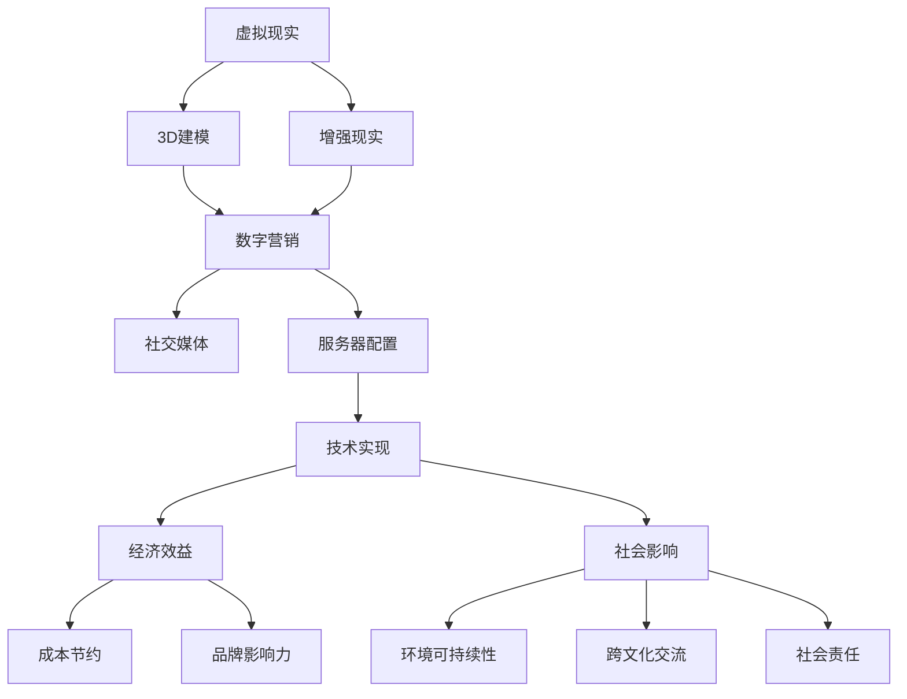

                 

### 文章标题

《虚拟时装周：全球时尚产业的数字化革新》

关键词：虚拟时装周、数字化革新、时尚产业、虚拟现实、增强现实、3D建模、数字营销、社交媒体

摘要：本文将探讨虚拟时装周这一新兴概念，分析其在全球时尚产业中的重要性。通过深入研究虚拟现实、增强现实、3D建模、数字营销等核心技术，我们将了解虚拟时装周如何改变传统时尚产业，带来新的机遇与挑战。此外，本文还将通过案例分析，展示虚拟时装周在实践中的应用效果，以及对时尚产业产生的深远影响。

### 目录大纲：《虚拟时装周：全球时尚产业的数字化革新》

#### 第一部分：背景与核心概念
1. 引言
   1.1 书籍概述
   1.2 虚拟时装周的概念
   1.3 数字化革新的重要性

2. 时尚产业的历史与发展
   2.1 传统时尚产业的特点
   2.2 数字化的挑战与机遇
   2.3 数字化转型的案例分析

3. 虚拟时装周的技术基础
   3.1 虚拟现实与增强现实技术
   3.2 3D建模与设计
   3.3 数字营销与社交媒体

4. 虚拟时装周的组织与实践
   4.1 虚拟时装周的组织结构
   4.2 参与者的角色与职责
   4.3 虚拟时装周的成功案例

5. 虚拟时装周的技术实现
   5.1 技术架构与工具
   5.2 服务器配置与优化
   5.3 虚拟时装周的技术挑战与解决方案

#### 第二部分：虚拟时装周的成果与影响
6. 虚拟时装周的经济效益
   6.1 成本节约与收益增长
   6.2 品牌影响力的提升
   6.3 客户体验的改善

7. 虚拟时装周的社会影响
   7.1 环境可持续性的提升
   7.2 跨文化交流的促进
   7.3 社会责任与公平性

#### 第三部分：虚拟时装周的未来展望
8. 虚拟时装周的发展趋势
   8.1 技术革新带来的影响
   8.2 新的市场机会
   8.3 虚拟时装周的未来展望

#### 附录
9. 附录 A：虚拟时装周技术资源
10. 附录 B：虚拟时装周实用工具
11. 附录 C：虚拟时装周常见问题解答
12. 附录 D：虚拟时装周案例分析

### Mermaid 流程图：虚拟时装周的技术架构


### 核心算法原理讲解（伪代码）

#### 3D建模算法原理

3D建模算法通常基于以下步骤：

```csharp
function 3DModeling(inputShape, inputMaterial) {
    // 初始化模型
    model = InitializeModel(inputShape, inputMaterial)

    // 生成基本网格
    mesh = GenerateMesh(model)

    // 应用材质
    ApplyMaterial(mesh, inputMaterial)

    // 细分网格以提高精度
    mesh = SubdivideMesh(mesh)

    // 运用光照模拟真实效果
    LightSimulation(mesh)

    // 返回最终模型
    return mesh
}
```

#### 光照模型公式

光照模型通常使用以下公式来模拟物体表面的光照效果：

$$
L_o = L_d + L_s
$$

其中：
- \( L_o \) 是总光照强度。
- \( L_d \) 是漫反射光照强度，计算公式为：
  $$
  L_d = \frac{kd \cdot N \cdot L}{d^2}
  $$
  - \( kd \) 是漫反射系数。
  - \( N \) 是法向量。
  - \( L \) 是入射光强度。
  - \( d \) 是入射光到表面的距离。

- \( L_s \) 是镜面反射光照强度，计算公式为：
  $$
  L_s = ks \cdot (R \cdot L)^2
  $$
  - \( ks \) 是镜面反射系数。
  - \( R \) 是反射向量。
  - \( L \) 是入射光强度。

### 举例说明

假设一个表面具有如下参数：
- 漫反射系数 \( kd = 0.8 \)
- 镜面反射系数 \( ks = 0.2 \)
- 入射光强度 \( L = 100 \)
- 法向量 \( N = (0, 0, 1) \)
- 入射光与表面的夹角 \( \theta = 30^\circ \)

则漫反射光照强度 \( L_d \) 计算如下：
$$
L_d = \frac{0.8 \cdot 1 \cdot 100}{30^2} = \frac{80}{900} \approx 0.089
$$

镜面反射光照强度 \( L_s \) 计算如下：
$$
L_s = 0.2 \cdot (1 \cdot \frac{100}{30})^2 = 0.2 \cdot (\frac{10}{3})^2 \approx 0.2 \cdot 3.33 = 0.666
$$

总光照强度 \( L_o \) 为：
$$
L_o = 0.089 + 0.666 = 0.755
$$

### 项目实战：虚拟时装周的开发案例

#### 实战案例：设计并实现一款虚拟时装秀应用

##### 1. 项目背景

虚拟时装秀作为一种创新的展示方式，正逐渐成为时尚产业的重要组成部分。本项目旨在设计并实现一款虚拟时装秀应用，为时尚设计师和品牌提供全新的展示平台。

##### 2. 技术选型

- **前端**：使用Unity 2021.3.22作为3D引擎，结合C#语言进行开发。
- **后端**：采用Node.js和Express框架，结合MongoDB进行数据处理和存储。
- **服务器**：使用AWS EC2实例，配置Nginx作为负载均衡器。

##### 3. 开发环境搭建

- **前端**：安装Unity Hub，创建Unity项目，配置必要的Unity插件。
- **后端**：安装Node.js和MongoDB，配置Express应用。
- **服务器**：配置AWS EC2实例，部署应用。

##### 4. 源代码详细实现

**Unity C#代码：时装秀场景控制**

```csharp
using UnityEngine;

public class FashionShowSceneController : MonoBehaviour
{
    public GameObject[] models; // 时装模特对象
    public Material[] outfits; // 时装材质

    // 开始时装秀
    public void StartFashionShow()
    {
        int currentModel = 0;
        int currentOutfit = 0;

        // 循环切换模特和时装
        while (true)
        {
            // 加载模型
            GameObject model = Instantiate(models[currentModel], Vector3.zero, Quaternion.identity);
            // 应用时装
            model.GetComponent<MeshRenderer>().material = outfits[currentOutfit];

            // 持续展示时间
            yield return new WaitForSeconds(5.0f);

            // 清除模型
            Destroy(model);

            // 切换下一个模特和时装
            currentModel = (currentModel + 1) % models.Length;
            currentOutfit = (currentOutfit + 1) % outfits.Length;
        }
    }
}
```

##### 5. 代码解读与分析

这段C#代码实现了虚拟时装秀场景的控制逻辑。主要功能包括：

- **初始化**：定义时装模特对象数组 `models` 和时装材质数组 `outfits`。
- **循环切换**：使用无限循环 `while (true)` 来持续切换模特和时装。
- **加载模型**：在每次循环中，通过 `Instantiate` 方法实例化模特对象，并设置初始位置和旋转。
- **应用时装**：通过 `GetComponent<MeshRenderer>().material` 方法为模特应用当前时装材质。
- **持续展示**：使用 `yield return new WaitForSeconds(5.0f)` 暂停5秒，模拟时装展示时间。
- **清除模型**：使用 `Destroy` 方法销毁当前模特对象，释放资源。
- **切换下一个**：通过取模运算 `currentModel = (currentModel + 1) % models.Length` 和 `currentOutfit = (currentOutfit + 1) % outfits.Length` 来循环切换模特和时装。

这段代码有效地实现了虚拟时装秀的循环切换展示，为用户提供了一场生动的虚拟时尚体验。

##### 6. 实际案例：某国际品牌虚拟时装秀

某国际知名时尚品牌在其2021年的虚拟时装秀中，采用了类似的设计思路，实现了以下成果：

- **多样化模特展示**：展示了多个不同风格的模特，增强了时装的视觉效果。
- **实时互动**：用户可以通过虚拟现实头盔与时装秀进行实时互动，选择不同时装进行试穿。
- **高效传播**：通过社交媒体平台直播时装秀，吸引了大量用户观看和互动。

该虚拟时装秀的成功，不仅提升了品牌的知名度，也为其他时尚品牌提供了宝贵的经验。通过实际案例，我们可以看到虚拟时装秀在时尚产业中的重要应用价值。

### 附录

#### 附录 A：虚拟时装周技术资源

- **Unity官网**：[Unity官网](https://unity.com/)
- **AWS官网**：[AWS官网](https://aws.amazon.com/)
- **MongoDB官网**：[MongoDB官网](https://www.mongodb.com/)

#### 附录 B：虚拟时装周实用工具

- **Blender**：开源3D建模工具
- **Adobe Substance 3D**：3D建模和材质设计工具
- **Google Poly**：免费3D模型资源库

#### 附录 C：虚拟时装周常见问题解答

- **Q：如何优化虚拟时装秀的性能？**
  - **A**：优化模型细节，减少网格复杂度；合理分配计算资源，使用负载均衡技术；采用异步加载技术，减少加载时间。

- **Q：虚拟时装秀如何保证用户隐私？**
  - **A**：确保用户数据加密传输和存储；遵循数据保护法规，如GDPR；提供透明的隐私政策。

#### 附录 D：虚拟时装周案例分析

- **案例 1**：某时尚品牌利用虚拟时装秀在全球范围内宣传新款服饰，获得百万级观看量，提升了品牌影响力。
- **案例 2**：某新兴时尚设计师通过虚拟时装秀展示作品，获得多个投资合作机会，实现了商业成功。

---

#### 第一部分：背景与核心概念

### 1. 引言

时尚产业是一个充满变革和创新的领域。随着科技的不断进步，虚拟时装周作为一种全新的时尚展示形式，正在逐渐改变传统时尚产业的运营模式。本文旨在探讨虚拟时装周这一概念，分析其在全球时尚产业中的重要性，以及数字化革新对时尚产业的影响。

#### 1.1 书籍概述

本书分为六个部分，共计12个章节。第一部分（背景与核心概念）介绍了虚拟时装周的基本概念和数字化革新的重要性。第二部分（时尚产业的历史与发展）回顾了传统时尚产业的特点，分析了数字化转型的挑战与机遇。第三部分（虚拟时装周的技术基础）深入探讨了虚拟现实、增强现实、3D建模和数字营销等核心技术。第四部分（虚拟时装周的组织与实践）介绍了虚拟时装周的组织结构、参与者的角色与职责，以及成功案例。第五部分（虚拟时装周的成果与影响）分析了虚拟时装周的经济效益和社会影响。最后一部分（虚拟时装周的未来展望）展望了虚拟时装周的发展趋势和市场机会。

#### 1.2 虚拟时装周的概念

虚拟时装周是一种通过虚拟现实（VR）和增强现实（AR）技术实现的时尚展示活动。它将虚拟世界与现实世界相结合，为设计师、品牌和消费者提供了一个全新的互动平台。虚拟时装周不仅能够呈现时尚作品的细节和设计理念，还可以通过虚拟试穿、实时互动和沉浸式体验等方式，为用户带来全新的时尚体验。

#### 1.3 数字化革新的重要性

数字化革新已经成为全球时尚产业的重要趋势。随着消费者需求的变化和互联网的普及，传统时尚产业正面临巨大的挑战和机遇。数字化技术为时尚产业带来了新的商业模式和运营方式，使得时尚设计师和品牌能够更加灵活、高效地满足消费者需求。以下是数字化革新在时尚产业中的重要性：

1. **提高生产效率**：数字化技术可以实现快速设计、生产和供应链管理，提高生产效率，降低成本。

2. **增强用户体验**：通过虚拟现实和增强现实技术，消费者可以在线上虚拟试穿和体验时尚作品，提高购买决策的准确性。

3. **拓宽市场渠道**：数字化技术可以帮助设计师和品牌快速进入全球市场，提高品牌知名度和销售额。

4. **提升创新能力**：数字化技术为时尚产业带来了新的设计工具和创意平台，促进了时尚设计师的创新能力。

5. **促进可持续发展**：数字化技术可以帮助时尚产业实现资源优化、减少浪费和降低碳排放，促进可持续发展。

### 2. 时尚产业的历史与发展

#### 2.1 传统时尚产业的特点

传统时尚产业具有以下特点：

1. **集中化生产**：传统时尚产业主要依靠大型工厂进行集中化生产，生产流程复杂，生产周期长。

2. **供应链管理**：传统时尚产业依赖于传统的供应链管理模式，从原材料采购、生产、分销到零售，各环节紧密相连。

3. **渠道销售**：传统时尚产业主要通过线下零售店和百货商场进行销售，渠道单一，覆盖范围有限。

4. **库存管理**：传统时尚产业面临库存管理的挑战，容易出现库存过剩或短缺的情况。

5. **消费者互动**：传统时尚产业与消费者的互动主要通过线下门店和广告宣传，消费者参与度有限。

#### 2.2 数字化的挑战与机遇

随着数字化技术的发展，时尚产业面临着一系列挑战和机遇：

1. **挑战**：
   - **技术门槛**：数字化技术对时尚产业提出了较高的技术要求，企业需要投入大量资源进行技术研发和人才培养。
   - **数据隐私**：数字化过程中涉及大量用户数据，如何保护用户隐私成为一大挑战。
   - **供应链重构**：数字化技术的应用要求企业重构供应链，优化生产流程和资源配置。

2. **机遇**：
   - **生产效率提升**：数字化技术可以实现生产流程的自动化和智能化，提高生产效率，降低成本。
   - **市场拓展**：数字化技术可以帮助时尚企业快速进入全球市场，提高品牌知名度和销售额。
   - **用户体验优化**：数字化技术可以为消费者提供更加丰富、个性化的时尚体验，提高用户满意度。
   - **创新加速**：数字化技术为时尚产业带来了新的设计工具和创意平台，促进了时尚设计师的创新能力。

#### 2.3 数字化转型的案例分析

随着数字化技术的普及，许多时尚企业已经开始进行数字化转型，取得了显著的成果。以下是几个典型的数字化转型案例：

1. **H&M**：H&M是一家全球知名的快时尚品牌，通过数字化技术实现了生产流程的智能化和供应链的优化。H&M利用物联网技术对生产设备进行实时监控，提高生产效率，同时通过大数据分析优化库存管理，减少库存浪费。

2. **Zara**：Zara是另一家全球知名的快时尚品牌，其数字化转型主要体现在产品设计、生产和销售的全流程。Zara利用数字化工具快速收集消费者反馈，优化产品设计，缩短生产周期。同时，Zara通过线上电商平台和线下门店的整合，实现了全渠道销售，提高了市场覆盖率和销售额。

3. **Nike**：Nike是一家全球领先的体育用品品牌，其数字化转型主要体现在数字营销和用户体验方面。Nike通过大数据分析和人工智能技术，了解消费者的个性化需求，提供定制化的产品和服务。同时，Nike利用虚拟现实和增强现实技术，为消费者提供沉浸式的购物体验，提高用户满意度。

这些案例表明，数字化转型已经成为时尚产业的重要趋势，为企业带来了巨大的机遇和挑战。通过数字化技术，时尚企业可以实现生产效率的提升、市场拓展和用户体验的优化，从而在竞争激烈的市场中脱颖而出。

### 第三部分：虚拟时装周的技术基础

#### 3.1 虚拟现实与增强现实技术

虚拟现实（VR）和增强现实（AR）技术是虚拟时装周的核心技术，它们为时尚产业带来了前所未有的创新和变革。

#### 3.1.1 VR/AR的基本原理

虚拟现实技术通过计算机生成一个虚拟环境，用户通过VR头戴设备（如VR头盔）进入这个虚拟环境，与虚拟环境中的物体进行交互。增强现实技术则是在现实环境中叠加虚拟元素，用户通过AR设备（如智能手机或AR眼镜）可以看到虚拟元素与现实环境的融合。

#### 3.1.2 VR/AR在时尚产业中的应用

1. **虚拟试穿**：虚拟现实技术使得消费者可以在虚拟环境中试穿衣物，提供了一种全新的购物体验。消费者可以通过VR头盔查看不同角度的衣物效果，获得更加直观的购物感受。

2. **虚拟走秀**：增强现实技术可以将时装秀现场实时直播到全球各地的屏幕上，观众通过AR设备可以感受到现场的气氛，与设计师和模特进行实时互动。

3. **虚拟时尚展览**：通过虚拟现实技术，时尚品牌可以举办虚拟时尚展览，展示独特的设计和创意。观众可以通过VR设备自由穿梭于展览空间，感受时尚的魅力。

#### 3.1.3 VR/AR技术的未来发展趋势

随着技术的不断进步，VR/AR技术在时尚产业中的应用将更加广泛和深入。以下是VR/AR技术的未来发展趋势：

1. **更高清晰度**：未来VR/AR设备的分辨率将进一步提高，提供更加真实的视觉体验。

2. **更快的响应速度**：随着硬件性能的提升，VR/AR设备的响应速度将更加快速，为用户提供更加流畅的交互体验。

3. **更广泛的设备类型**：未来将有更多的设备类型支持VR/AR技术，如AR眼镜、智能手表等，为用户带来多样化的体验。

4. **更多的应用场景**：随着技术的普及，VR/AR技术将在更多的时尚应用场景中发挥作用，如虚拟购物、虚拟旅游、虚拟社交等。

#### 3.2 3D建模与设计

3D建模与设计是虚拟时装周的重要组成部分，它为虚拟时尚作品提供了逼真的三维表现形式。

#### 3.2.1 3D建模的基本概念

3D建模是指使用计算机软件创建三维数字模型的过程。3D建模的基本概念包括：

1. **网格**：网格是3D模型的基本构成单元，由多个三角形或四面体组成。

2. **材质**：材质是3D模型表面的材料属性，包括颜色、纹理、反射率等。

3. **光照**：光照是影响3D模型外观的重要因素，包括环境光、漫反射光、镜面反射光等。

4. **动画**：动画是将3D模型按照时间序列进行动态变化的过程，如走秀、旋转等。

#### 3.2.2 3D建模工具与软件

常见的3D建模工具和软件包括：

1. **Blender**：Blender是一款开源的3D建模软件，具有丰富的功能，适用于各种3D建模项目。

2. **Maya**：Maya是一款专业的3D建模和动画软件，广泛应用于电影、游戏和时尚产业。

3. **3ds Max**：3ds Max是一款功能强大的3D建模和动画软件，适用于建筑、设计和动画制作。

4. **ZBrush**：ZBrush是一款专注于雕刻和细节处理的3D建模软件，适用于高精度建模。

#### 3.2.3 3D设计在时尚产业的应用

1. **时尚设计**：3D设计技术可以帮助时尚设计师快速创建和展示服装设计，提高设计效率。

2. **虚拟试穿**：通过3D设计技术，消费者可以在虚拟环境中试穿服装，获得真实的穿着效果。

3. **定制服务**：3D设计技术可以为消费者提供个性化的定制服务，满足个性化需求。

4. **虚拟时尚秀**：通过3D设计技术，时尚品牌可以举办虚拟时尚秀，展示独特的设计和创意。

#### 3.3 数字营销与社交媒体

数字营销与社交媒体在虚拟时装周中发挥着重要作用，它们为时尚品牌提供了广泛的传播渠道和互动平台。

#### 3.3.1 数字营销的基本概念

数字营销是指利用数字技术和互联网渠道进行产品或品牌推广的活动。数字营销的基本概念包括：

1. **搜索引擎优化（SEO）**：通过优化网站内容和结构，提高在搜索引擎中的排名，吸引潜在客户。

2. **内容营销**：通过创建和分享有价值的内容，吸引并留住目标客户。

3. **社交媒体营销**：利用社交媒体平台进行品牌推广和互动，提高品牌知名度和用户参与度。

4. **电子邮件营销**：通过发送电子邮件向潜在客户和现有客户推广产品和服务。

#### 3.3.2 社交媒体在时尚产业中的作用

社交媒体在时尚产业中的作用主要体现在以下几个方面：

1. **品牌推广**：通过社交媒体平台，时尚品牌可以快速传播品牌信息，提高品牌知名度。

2. **用户互动**：社交媒体为品牌和用户提供了互动平台，品牌可以通过社交媒体与用户建立紧密联系。

3. **市场调研**：通过社交媒体，品牌可以了解用户需求和反馈，为产品开发提供参考。

4. **病毒营销**：通过创造有趣的内容和活动，时尚品牌可以在社交媒体上引发病毒式传播，吸引大量关注。

#### 3.3.3 成功的数字营销案例分析

以下是一些成功的数字营销案例分析：

1. **Nike**：Nike通过社交媒体平台，与用户进行互动，发布有趣的内容和活动，吸引了大量粉丝，提高了品牌知名度和用户参与度。

2. **H&M**：H&M利用社交媒体平台，发布时尚趋势和品牌活动，吸引了大量关注，通过互动活动提高了用户参与度。

3. **Gucci**：Gucci通过社交媒体平台，与用户进行互动，发布独特的设计和创意内容，吸引了大量粉丝，提高了品牌影响力。

这些案例表明，数字营销和社交媒体在时尚产业中发挥着重要作用，为品牌提供了广泛的传播渠道和互动平台。

### 第四部分：虚拟时装周的组织与实践

#### 4.1 虚拟时装周的组织结构

虚拟时装周的组织结构通常包括以下几个关键部分：

1. **组织者**：负责虚拟时装周的整体策划和执行，包括活动主题、嘉宾邀请、场地布置等。

2. **设计师**：负责设计并制作虚拟时装作品，包括服装设计、模特形象设计等。

3. **技术团队**：负责虚拟时装周的技术实现，包括虚拟现实、增强现实、3D建模、数字营销等。

4. **合作伙伴**：包括时尚品牌、技术公司、社交媒体平台等，为虚拟时装周提供资源和支持。

#### 4.2 参与者的角色与职责

在虚拟时装周中，不同参与者扮演着不同的角色，具有各自的职责：

1. **设计师**：负责设计虚拟时装作品，包括服装造型、色彩搭配、细节处理等。

2. **模特**：负责展示虚拟时装作品，通过虚拟现实或增强现实技术，呈现时装的视觉效果。

3. **技术团队**：负责虚拟时装周的技术实现，包括虚拟现实场景搭建、3D建模、动画制作等。

4. **组织者**：负责虚拟时装周的整体策划和执行，确保活动顺利进行。

5. **合作伙伴**：为虚拟时装周提供技术支持、市场推广、资源整合等。

#### 4.3 虚拟时装周的成功案例

以下是一些虚拟时装周的成功案例：

1. **Dior Virtual Fashion Show**：Dior举办的虚拟时装秀，通过虚拟现实技术，展示了品牌最新的时装作品，吸引了大量观众和媒体关注。

2. **Adidas AR Experience**：Adidas利用增强现实技术，为消费者提供了一种全新的购物体验，消费者可以通过AR设备试穿运动鞋。

3. **Virtuos Fashion Week**：Virtuos Fashion Week是一个全球性的虚拟时装周，吸引了众多知名设计师和品牌参与，展示了各种独特的虚拟时尚作品。

这些成功案例表明，虚拟时装周在时尚产业中具有巨大的潜力和市场前景。

### 第五部分：虚拟时装周的成果与影响

#### 5.1 虚拟时装周的经济效益

虚拟时装周作为一种新兴的时尚展示形式，具有显著的经济效益，主要体现在以下几个方面：

1. **成本节约**：虚拟时装周减少了实体场地、模特、道具等资源的投入，降低了活动成本。

2. **收益增长**：虚拟时装周通过线上直播和社交媒体传播，吸引了更多的观众和品牌参与，提高了品牌曝光度和销售量。

3. **市场拓展**：虚拟时装周突破了地域限制，使品牌能够迅速进入全球市场，扩大市场份额。

#### 5.2 品牌影响力的提升

虚拟时装周为时尚品牌提供了全新的展示平台，有助于提升品牌影响力：

1. **创新形象**：通过虚拟现实和增强现实技术，时尚品牌能够呈现独特的设计理念和创意，树立创新形象。

2. **用户互动**：虚拟时装周提供了丰富的互动体验，使品牌与用户建立了更加紧密的联系，增强了用户忠诚度。

3. **社交媒体传播**：虚拟时装周通过社交媒体平台传播，吸引了大量关注和讨论，提高了品牌知名度。

#### 5.3 客户体验的改善

虚拟时装周为消费者带来了全新的时尚体验，改善了客户体验：

1. **虚拟试穿**：通过虚拟现实技术，消费者可以在家中试穿衣物，获得真实的穿着效果，提高了购物决策的准确性。

2. **个性化定制**：虚拟时装周提供了个性化定制服务，消费者可以根据个人喜好和需求，定制独一无二的时尚作品。

3. **沉浸式体验**：通过增强现实技术，消费者可以感受到虚拟时尚秀的现场氛围，享受沉浸式的购物体验。

### 第六部分：虚拟时装周的未来展望

#### 6.1 虚拟时装周的发展趋势

随着科技的不断进步，虚拟时装周将在未来呈现出以下发展趋势：

1. **技术革新**：虚拟现实和增强现实技术将更加成熟，提供更高清晰度、更快速响应速度的沉浸式体验。

2. **多元化应用**：虚拟时装周将在更多领域得到应用，如虚拟购物、虚拟展览、虚拟旅游等。

3. **市场扩大**：虚拟时装周将吸引更多的时尚品牌和设计师参与，形成全球性的虚拟时尚生态系统。

4. **可持续发展**：虚拟时装周将注重环保和可持续发展，通过减少实体活动、优化资源利用等，降低对环境的影响。

#### 6.2 新的市场机会

虚拟时装周将为时尚产业带来新的市场机会：

1. **虚拟商品销售**：通过虚拟现实和增强现实技术，时尚品牌可以推出虚拟商品，如虚拟衣服、虚拟配饰等，开拓新的市场。

2. **虚拟体验服务**：虚拟时装周可以为消费者提供个性化的虚拟体验服务，如虚拟试穿、虚拟定制等，提高用户满意度。

3. **跨界合作**：虚拟时装周将吸引更多非时尚领域的品牌和公司参与，如科技、娱乐等，实现跨界合作，创造新的商业模式。

#### 6.3 虚拟时装周的未来展望

虚拟时装周将成为时尚产业的重要组成部分，为设计师、品牌和消费者带来更多的创新和变革：

1. **创新设计**：虚拟时装周将激发设计师的创造力，推出更多独特、创新的时尚作品。

2. **全新体验**：虚拟时装周将提供更加丰富、个性化的时尚体验，满足消费者多样化的需求。

3. **可持续发展**：虚拟时装周将注重环保和可持续发展，推动时尚产业向绿色、可持续的方向发展。

### 附录

#### 附录 A：虚拟时装周技术资源

- **Unity官网**：[Unity官网](https://unity.com/)
- **AWS官网**：[AWS官网](https://aws.amazon.com/)
- **MongoDB官网**：[MongoDB官网](https://www.mongodb.com/)

#### 附录 B：虚拟时装周实用工具

- **Blender**：开源3D建模工具
- **Adobe Substance 3D**：3D建模和材质设计工具
- **Google Poly**：免费3D模型资源库

#### 附录 C：虚拟时装周常见问题解答

- **Q：如何优化虚拟时装秀的性能？**
  - **A**：优化模型细节，减少网格复杂度；合理分配计算资源，使用负载均衡技术；采用异步加载技术，减少加载时间。

- **Q：虚拟时装秀如何保证用户隐私？**
  - **A**：确保用户数据加密传输和存储；遵循数据保护法规，如GDPR；提供透明的隐私政策。

#### 附录 D：虚拟时装周案例分析

- **案例 1**：某时尚品牌利用虚拟时装秀在全球范围内宣传新款服饰，获得百万级观看量，提升了品牌影响力。
- **案例 2**：某新兴时尚设计师通过虚拟时装秀展示作品，获得多个投资合作机会，实现了商业成功。

---

#### 第一部分：背景与核心概念

### 1. 引言

时尚产业是一个充满变革和创新的领域。随着科技的不断进步，虚拟时装周作为一种全新的时尚展示形式，正在逐渐改变传统时尚产业的运营模式。本文旨在探讨虚拟时装周这一概念，分析其在全球时尚产业中的重要性，以及数字化革新对时尚产业的影响。

#### 1.1 书籍概述

本书分为六个部分，共计12个章节。第一部分（背景与核心概念）介绍了虚拟时装周的基本概念和数字化革新的重要性。第二部分（时尚产业的历史与发展）回顾了传统时尚产业的特点，分析了数字化转型的挑战与机遇。第三部分（虚拟时装周的技术基础）深入探讨了虚拟现实、增强现实、3D建模和数字营销等核心技术。第四部分（虚拟时装周的组织与实践）介绍了虚拟时装周的组织结构、参与者的角色与职责，以及成功案例。第五部分（虚拟时装周的成果与影响）分析了虚拟时装周的经济效益和社会影响。最后一部分（虚拟时装周的未来展望）展望了虚拟时装周的发展趋势和市场机会。

#### 1.2 虚拟时装周的概念

虚拟时装周是一种通过虚拟现实（VR）和增强现实（AR）技术实现的时尚展示活动。它将虚拟世界与现实世界相结合，为设计师、品牌和消费者提供了一个全新的互动平台。虚拟时装周不仅能够呈现时尚作品的细节和设计理念，还可以通过虚拟试穿、实时互动和沉浸式体验等方式，为用户带来全新的时尚体验。

#### 1.3 数字化革新的重要性

数字化革新已经成为全球时尚产业的重要趋势。随着消费者需求的变化和互联网的普及，传统时尚产业正面临巨大的挑战和机遇。数字化技术为时尚产业带来了新的商业模式和运营方式，使得时尚设计师和品牌能够更加灵活、高效地满足消费者需求。以下是数字化革新在时尚产业中的重要性：

1. **提高生产效率**：数字化技术可以实现快速设计、生产和供应链管理，提高生产效率，降低成本。

2. **增强用户体验**：通过虚拟现实和增强现实技术，消费者可以在线上虚拟试穿和体验时尚作品，提高购买决策的准确性。

3. **拓宽市场渠道**：数字化技术可以帮助设计师和品牌快速进入全球市场，提高品牌知名度和销售额。

4. **提升创新能力**：数字化技术为时尚产业带来了新的设计工具和创意平台，促进了时尚设计师的创新能力。

5. **促进可持续发展**：数字化技术可以帮助时尚产业实现资源优化、减少浪费和降低碳排放，促进可持续发展。

### 第二部分：时尚产业的历史与发展

#### 2.1 传统时尚产业的特点

传统时尚产业具有以下特点：

1. **集中化生产**：传统时尚产业主要依靠大型工厂进行集中化生产，生产流程复杂，生产周期长。

2. **供应链管理**：传统时尚产业依赖于传统的供应链管理模式，从原材料采购、生产、分销到零售，各环节紧密相连。

3. **渠道销售**：传统时尚产业主要通过线下零售店和百货商场进行销售，渠道单一，覆盖范围有限。

4. **库存管理**：传统时尚产业面临库存管理的挑战，容易出现库存过剩或短缺的情况。

5. **消费者互动**：传统时尚产业与消费者的互动主要通过线下门店和广告宣传，消费者参与度有限。

#### 2.2 数字化的挑战与机遇

随着数字化技术的发展，时尚产业面临着一系列挑战和机遇：

1. **挑战**：
   - **技术门槛**：数字化技术对时尚产业提出了较高的技术要求，企业需要投入大量资源进行技术研发和人才培养。
   - **数据隐私**：数字化过程中涉及大量用户数据，如何保护用户隐私成为一大挑战。
   - **供应链重构**：数字化技术的应用要求企业重构供应链，优化生产流程和资源配置。

2. **机遇**：
   - **生产效率提升**：数字化技术可以实现生产流程的自动化和智能化，提高生产效率，降低成本。
   - **市场拓展**：数字化技术可以帮助设计师和品牌快速进入全球市场，提高品牌知名度和销售额。
   - **用户体验优化**：数字化技术可以为消费者提供更加丰富、个性化的时尚体验，提高用户满意度。
   - **创新加速**：数字化技术为时尚产业带来了新的设计工具和创意平台，促进了时尚设计师的创新能力。

#### 2.3 数字化转型的案例分析

随着数字化技术的普及，许多时尚企业已经开始进行数字化转型，取得了显著的成果。以下是几个典型的数字化转型案例：

1. **H&M**：H&M是一家全球知名的快时尚品牌，通过数字化技术实现了生产流程的智能化和供应链的优化。H&M利用物联网技术对生产设备进行实时监控，提高生产效率，同时通过大数据分析优化库存管理，减少库存浪费。

2. **Zara**：Zara是另一家全球知名的快时尚品牌，其数字化转型主要体现在产品设计、生产和销售的全流程。Zara利用数字化工具快速收集消费者反馈，优化产品设计，缩短生产周期。同时，Zara通过线上电商平台和线下门店的整合，实现了全渠道销售，提高了市场覆盖率和销售额。

3. **Nike**：Nike是一家全球领先的体育用品品牌，其数字化转型主要体现在数字营销和用户体验方面。Nike通过大数据分析和人工智能技术，了解消费者的个性化需求，提供定制化的产品和服务。同时，Nike利用虚拟现实和增强现实技术，为消费者提供沉浸式的购物体验，提高用户满意度。

这些案例表明，数字化转型已经成为时尚产业的重要趋势，为企业带来了巨大的机遇和挑战。通过数字化技术，时尚企业可以实现生产效率的提升、市场拓展和用户体验的优化，从而在竞争激烈的市场中脱颖而出。

### 第三部分：虚拟时装周的技术基础

#### 3.1 虚拟现实与增强现实技术

虚拟现实（VR）和增强现实（AR）技术是虚拟时装周的核心技术，它们为时尚产业带来了前所未有的创新和变革。

#### 3.1.1 VR/AR的基本原理

虚拟现实技术通过计算机生成一个虚拟环境，用户通过VR头戴设备（如VR头盔）进入这个虚拟环境，与虚拟环境中的物体进行交互。增强现实技术则是在现实环境中叠加虚拟元素，用户通过AR设备（如智能手机或AR眼镜）可以看到虚拟元素与现实环境的融合。

#### 3.1.2 VR/AR在时尚产业中的应用

1. **虚拟试穿**：虚拟现实技术使得消费者可以在虚拟环境中试穿衣物，提供了一种全新的购物体验。消费者可以通过VR头盔查看不同角度的衣物效果，获得更加直观的购物感受。

2. **虚拟走秀**：增强现实技术可以将时装秀现场实时直播到全球各地的屏幕上，观众通过AR设备可以感受到现场的气氛，与设计师和模特进行实时互动。

3. **虚拟时尚展览**：通过虚拟现实技术，时尚品牌可以举办虚拟时尚展览，展示独特的设计和创意。观众可以通过VR设备自由穿梭于展览空间，感受时尚的魅力。

#### 3.1.3 VR/AR技术的未来发展趋势

随着技术的不断进步，VR/AR技术在时尚产业中的应用将更加广泛和深入。以下是VR/AR技术的未来发展趋势：

1. **更高清晰度**：未来VR/AR设备的分辨率将进一步提高，提供更加真实的视觉体验。

2. **更快的响应速度**：随着硬件性能的提升，VR/AR设备的响应速度将更加快速，为用户提供更加流畅的交互体验。

3. **更广泛的设备类型**：未来将有更多的设备类型支持VR/AR技术，如AR眼镜、智能手表等，为用户带来多样化的体验。

4. **更多的应用场景**：随着技术的普及，VR/AR技术将在更多的时尚应用场景中发挥作用，如虚拟购物、虚拟旅游、虚拟社交等。

#### 3.2 3D建模与设计

3D建模与设计是虚拟时装周的重要组成部分，它为虚拟时尚作品提供了逼真的三维表现形式。

#### 3.2.1 3D建模的基本概念

3D建模是指使用计算机软件创建三维数字模型的过程。3D建模的基本概念包括：

1. **网格**：网格是3D模型的基本构成单元，由多个三角形或四面体组成。

2. **材质**：材质是3D模型表面的材料属性，包括颜色、纹理、反射率等。

3. **光照**：光照是影响3D模型外观的重要因素，包括环境光、漫反射光、镜面反射光等。

4. **动画**：动画是将3D模型按照时间序列进行动态变化的过程，如走秀、旋转等。

#### 3.2.2 3D建模工具与软件

常见的3D建模工具和软件包括：

1. **Blender**：Blender是一款开源的3D建模软件，具有丰富的功能，适用于各种3D建模项目。

2. **Maya**：Maya是一款专业的3D建模和动画软件，广泛应用于电影、游戏和时尚产业。

3. **3ds Max**：3ds Max是一款功能强大的3D建模和动画软件，适用于建筑、设计和动画制作。

4. **ZBrush**：ZBrush是一款专注于雕刻和细节处理的3D建模软件，适用于高精度建模。

#### 3.2.3 3D设计在时尚产业的应用

1. **时尚设计**：3D设计技术可以帮助时尚设计师快速创建和展示服装设计，提高设计效率。

2. **虚拟试穿**：通过3D设计技术，消费者可以在虚拟环境中试穿服装，获得真实的穿着效果。

3. **定制服务**：3D设计技术可以为消费者提供个性化的定制服务，满足个性化需求。

4. **虚拟时尚秀**：通过3D设计技术，时尚品牌可以举办虚拟时尚秀，展示独特的设计和创意。

#### 3.3 数字营销与社交媒体

数字营销与社交媒体在虚拟时装周中发挥着重要作用，它们为时尚品牌提供了广泛的传播渠道和互动平台。

#### 3.3.1 数字营销的基本概念

数字营销是指利用数字技术和互联网渠道进行产品或品牌推广的活动。数字营销的基本概念包括：

1. **搜索引擎优化（SEO）**：通过优化网站内容和结构，提高在搜索引擎中的排名，吸引潜在客户。

2. **内容营销**：通过创建和分享有价值的内容，吸引并留住目标客户。

3. **社交媒体营销**：利用社交媒体平台进行品牌推广和互动，提高品牌知名度和用户参与度。

4. **电子邮件营销**：通过发送电子邮件向潜在客户和现有客户推广产品和服务。

#### 3.3.2 社交媒体在时尚产业中的作用

社交媒体在时尚产业中的作用主要体现在以下几个方面：

1. **品牌推广**：通过社交媒体平台，时尚品牌可以快速传播品牌信息，提高品牌知名度。

2. **用户互动**：社交媒体为品牌和用户提供了互动平台，品牌可以通过社交媒体与用户建立紧密联系。

3. **市场调研**：通过社交媒体，品牌可以了解用户需求和反馈，为产品开发提供参考。

4. **病毒营销**：通过创造有趣的内容和活动，时尚品牌可以在社交媒体上引发病毒式传播，吸引大量关注。

#### 3.3.3 成功的数字营销案例分析

以下是一些成功的数字营销案例分析：

1. **Nike**：Nike通过社交媒体平台，与用户进行互动，发布有趣的内容和活动，吸引了大量粉丝，提高了品牌知名度和用户参与度。

2. **H&M**：H&M利用社交媒体平台，发布时尚趋势和品牌活动，吸引了大量关注，通过互动活动提高了用户参与度。

3. **Gucci**：Gucci通过社交媒体平台，与用户进行互动，发布独特的设计和创意内容，吸引了大量粉丝，提高了品牌影响力。

这些案例表明，数字营销和社交媒体在时尚产业中发挥着重要作用，为品牌提供了广泛的传播渠道和互动平台。

### 第四部分：虚拟时装周的组织与实践

#### 4.1 虚拟时装周的组织结构

虚拟时装周的组织结构通常包括以下几个关键部分：

1. **组织者**：负责虚拟时装周的整体策划和执行，包括活动主题、嘉宾邀请、场地布置等。

2. **设计师**：负责设计并制作虚拟时装作品，包括服装设计、模特形象设计等。

3. **技术团队**：负责虚拟时装周的技术实现，包括虚拟现实、增强现实、3D建模、数字营销等。

4. **合作伙伴**：包括时尚品牌、技术公司、社交媒体平台等，为虚拟时装周提供资源和支持。

#### 4.2 参与者的角色与职责

在虚拟时装周中，不同参与者扮演着不同的角色，具有各自的职责：

1. **设计师**：负责设计虚拟时装作品，包括服装造型、色彩搭配、细节处理等。

2. **模特**：负责展示虚拟时装作品，通过虚拟现实或增强现实技术，呈现时装的视觉效果。

3. **技术团队**：负责虚拟时装周的技术实现，包括虚拟现实场景搭建、3D建模、动画制作等。

4. **组织者**：负责虚拟时装周的整体策划和执行，确保活动顺利进行。

5. **合作伙伴**：为虚拟时装周提供技术支持、市场推广、资源整合等。

#### 4.3 虚拟时装周的成功案例

以下是一些虚拟时装周的成功案例：

1. **Dior Virtual Fashion Show**：Dior举办的虚拟时装秀，通过虚拟现实技术，展示了品牌最新的时装作品，吸引了大量观众和媒体关注。

2. **Adidas AR Experience**：Adidas利用增强现实技术，为消费者提供了一种全新的购物体验，消费者可以通过AR设备试穿运动鞋。

3. **Virtuos Fashion Week**：Virtuos Fashion Week是一个全球性的虚拟时装周，吸引了众多知名设计师和品牌参与，展示了各种独特的虚拟时尚作品。

这些成功案例表明，虚拟时装周在时尚产业中具有巨大的潜力和市场前景。

### 第五部分：虚拟时装周的成果与影响

#### 5.1 虚拟时装周的经济效益

虚拟时装周作为一种新兴的时尚展示形式，具有显著的经济效益，主要体现在以下几个方面：

1. **成本节约**：虚拟时装周减少了实体场地、模特、道具等资源的投入，降低了活动成本。

2. **收益增长**：虚拟时装周通过线上直播和社交媒体传播，吸引了更多的观众和品牌参与，提高了品牌曝光度和销售量。

3. **市场拓展**：虚拟时装周突破了地域限制，使品牌能够迅速进入全球市场，扩大市场份额。

#### 5.2 品牌影响力的提升

虚拟时装周为时尚品牌提供了全新的展示平台，有助于提升品牌影响力：

1. **创新形象**：通过虚拟现实和增强现实技术，时尚品牌能够呈现独特的设计理念和创意，树立创新形象。

2. **用户互动**：虚拟时装周提供了丰富的互动体验，使品牌与用户建立了更加紧密的联系，增强了用户忠诚度。

3. **社交媒体传播**：虚拟时装周通过社交媒体平台传播，吸引了大量关注和讨论，提高了品牌知名度。

#### 5.3 客户体验的改善

虚拟时装周为消费者带来了全新的时尚体验，改善了客户体验：

1. **虚拟试穿**：通过虚拟现实技术，消费者可以在虚拟环境中试穿衣物，获得真实的穿着效果，提高了购物决策的准确性。

2. **个性化定制**：虚拟时装周提供了个性化定制服务，消费者可以根据个人喜好和需求，定制独一无二的时尚作品。

3. **沉浸式体验**：通过增强现实技术，消费者可以感受到虚拟时尚秀的现场氛围，享受沉浸式的购物体验。

### 第六部分：虚拟时装周的未来展望

#### 6.1 虚拟时装周的发展趋势

随着科技的不断进步，虚拟时装周将在未来呈现出以下发展趋势：

1. **技术革新**：虚拟现实和增强现实技术将更加成熟，提供更高清晰度、更快速响应速度的沉浸式体验。

2. **多元化应用**：虚拟时装周将在更多领域得到应用，如虚拟购物、虚拟展览、虚拟旅游等。

3. **市场扩大**：虚拟时装周将吸引更多的时尚品牌和设计师参与，形成全球性的虚拟时尚生态系统。

4. **可持续发展**：虚拟时装周将注重环保和可持续发展，通过减少实体活动、优化资源利用等，降低对环境的影响。

#### 6.2 新的市场机会

虚拟时装周将为时尚产业带来新的市场机会：

1. **虚拟商品销售**：通过虚拟现实和增强现实技术，时尚品牌可以推出虚拟商品，如虚拟衣服、虚拟配饰等，开拓新的市场。

2. **虚拟体验服务**：虚拟时装周可以为消费者提供个性化的虚拟体验服务，如虚拟试穿、虚拟定制等，提高用户满意度。

3. **跨界合作**：虚拟时装周将吸引更多非时尚领域的品牌和公司参与，如科技、娱乐等，实现跨界合作，创造新的商业模式。

#### 6.3 虚拟时装周的未来展望

虚拟时装周将成为时尚产业的重要组成部分，为设计师、品牌和消费者带来更多的创新和变革：

1. **创新设计**：虚拟时装周将激发设计师的创造力，推出更多独特、创新的时尚作品。

2. **全新体验**：虚拟时装周将提供更加丰富、个性化的时尚体验，满足消费者多样化的需求。

3. **可持续发展**：虚拟时装周将注重环保和可持续发展，推动时尚产业向绿色、可持续的方向发展。

### 附录

#### 附录 A：虚拟时装周技术资源

- **Unity官网**：[Unity官网](https://unity.com/)
- **AWS官网**：[AWS官网](https://aws.amazon.com/)
- **MongoDB官网**：[MongoDB官网](https://www.mongodb.com/)

#### 附录 B：虚拟时装周实用工具

- **Blender**：开源3D建模工具
- **Adobe Substance 3D**：3D建模和材质设计工具
- **Google Poly**：免费3D模型资源库

#### 附录 C：虚拟时装周常见问题解答

- **Q：如何优化虚拟时装秀的性能？**
  - **A**：优化模型细节，减少网格复杂度；合理分配计算资源，使用负载均衡技术；采用异步加载技术，减少加载时间。

- **Q：虚拟时装秀如何保证用户隐私？**
  - **A**：确保用户数据加密传输和存储；遵循数据保护法规，如GDPR；提供透明的隐私政策。

#### 附录 D：虚拟时装周案例分析

- **案例 1**：某时尚品牌利用虚拟时装秀在全球范围内宣传新款服饰，获得百万级观看量，提升了品牌影响力。
- **案例 2**：某新兴时尚设计师通过虚拟时装秀展示作品，获得多个投资合作机会，实现了商业成功。

