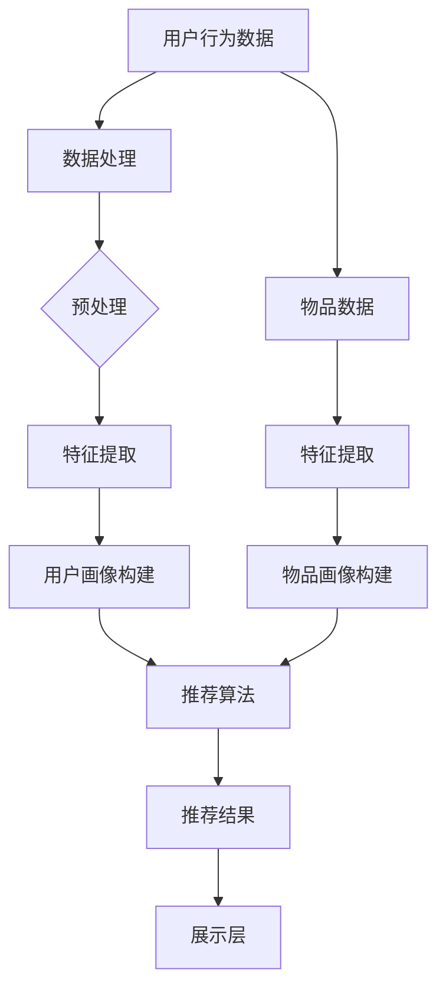

                 

### 《视觉推荐：AI 如何利用图像识别技术，提供个性化推荐》

#### 关键词：
- **视觉推荐**
- **图像识别**
- **人工智能**
- **个性化推荐系统**
- **深度学习**
- **卷积神经网络（CNN）**
- **协同过滤算法**
- **基于内容的推荐算法**
- **混合推荐系统**
- **多模态推荐**

#### 摘要：
本文将深入探讨视觉推荐技术，以及AI如何利用图像识别技术为用户提供个性化的推荐。通过详细的章节结构，本文首先介绍了视觉推荐的基础知识，包括其重要性、图像识别技术的原理和系统架构。接着，我们分析了图像识别算法，包括卷积神经网络（CNN）、深度学习基础和常见图像识别算法。随后，文章转向个性化推荐系统设计，介绍了用户行为分析和物品特征提取，并详细讲解了协同过滤算法和基于内容的推荐算法。最后，我们讨论了混合推荐系统的设计，并展示了视觉推荐系统的实际应用案例。文章的结尾部分展望了视觉推荐系统的未来方向，并提供了开发工具和资源的推荐。

### 《视觉推荐：AI 如何利用图像识别技术，提供个性化推荐》目录大纲

#### 第一部分：视觉推荐技术基础

##### 第1章：视觉推荐概述
- **1.1 视觉推荐的重要性**
  - **1.1.1 视觉内容对用户体验的影响**
  - **1.1.2 视觉推荐在各行业的应用**
  - **1.1.3 视觉推荐的未来趋势**
- **1.2 图像识别技术简介**
  - **1.2.1 图像识别的基础知识**
  - **1.2.2 图像识别的技术原理**
  - **1.2.3 图像识别的常见算法**
- **1.3 视觉推荐的系统架构**
  - **1.3.1 视觉推荐的整体架构**
  - **1.3.2 用户画像构建**
  - **1.3.3 物品画像构建**

##### 第2章：图像识别算法原理
- **2.1 卷积神经网络（CNN）**
  - **2.1.1 CNN的基本结构**
  - **2.1.2 CNN的激活函数与损失函数**
  - **2.1.3 CNN的常见层与模型**
- **2.2 深度学习基础**
  - **2.2.1 深度学习的基本概念**
  - **2.2.2 深度学习中的优化方法**
  - **2.2.3 深度学习中的正则化方法**
- **2.3 图像识别算法应用**
  - **2.3.1 目标检测算法**
  - **2.3.2 图像分类算法**
  - **2.3.3 图像分割算法**

#### 第二部分：个性化推荐系统设计

##### 第3章：个性化推荐系统概述
- **3.1 个性化推荐的基本概念**
  - **3.1.1 个性化推荐的定义**
  - **3.1.2 个性化推荐的目标**
  - **3.1.3 个性化推荐的方法**
- **3.2 用户行为分析**
  - **3.2.1 用户行为数据收集**
  - **3.2.2 用户行为数据分析**
  - **3.2.3 用户兴趣挖掘**
- **3.3 物品特征提取**
  - **3.3.1 物品特征提取的方法**
  - **3.3.2 图像特征提取**
  - **3.3.3 文本特征提取**

##### 第4章：协同过滤算法
- **4.1 协同过滤算法基础**
  - **4.1.1 协同过滤的定义**
  - **4.1.2 协同过滤的优缺点**
  - **4.1.3 协同过滤的基本原理**
- **4.2 基于模型的协同过滤**
  - **4.2.1 基于模型的协同过滤方法**
  - **4.2.2 矩阵分解**
  - **4.2.3 神经网络在协同过滤中的应用**
- **4.3 协同过滤算法优化**
  - **4.3.1 优化策略**
  - **4.3.2 实时推荐**
  - **4.3.3 防止冷启动问题**

##### 第5章：基于内容的推荐算法
- **5.1 基于内容的推荐算法基础**
  - **5.1.1 基于内容的推荐定义**
  - **5.1.2 基于内容的推荐方法**
  - **5.1.3 内容相似性计算**
- **5.2 基于图像的推荐算法**
  - **5.2.1 图像特征提取方法**
  - **5.2.2 基于图像的相似性度量**
  - **5.2.3 图像内容的上下文感知**

##### 第6章：混合推荐系统
- **6.1 混合推荐系统概述**
  - **6.1.1 混合推荐系统的定义**
  - **6.1.2 混合推荐系统的优点**
  - **6.1.3 混合推荐系统的方法**
- **6.2 混合推荐系统的设计**
  - **6.2.1 数据预处理**
  - **6.2.2 模型选择与融合**
  - **6.2.3 实时性与效果评估**

##### 第7章：视觉推荐系统的实战应用
- **7.1 视觉推荐系统开发流程**
  - **7.1.1 系统架构设计**
  - **7.1.2 数据采集与预处理**
  - **7.1.3 模型训练与优化**
- **7.2 视觉推荐系统案例分析**
  - **7.2.1 案例介绍**
  - **7.2.2 系统实现与效果分析**
  - **7.2.3 遇到的挑战与解决方案**

#### 第三部分：视觉推荐系统的未来方向

##### 第8章：视觉推荐系统的挑战与机遇
- **8.1 视觉推荐系统面临的挑战**
  - **8.1.1 数据质量与隐私问题**
  - **8.1.2 模型可解释性**
  - **8.1.3 实时性与扩展性**
- **8.2 视觉推荐系统的机遇**
  - **8.2.1 新技术的应用**
  - **8.2.2 跨领域合作**
  - **8.2.3 视觉推荐在新兴领域的应用**

##### 第9章：视觉推荐系统的未来趋势
- **9.1 自动化与智能化**
  - **9.1.1 自动化内容生成**
  - **9.1.2 智能化交互体验**
  - **9.1.3 视觉增强现实（AR）与推荐**
- **9.2 多模态推荐系统**
  - **9.2.1 视觉与文本结合**
  - **9.2.2 视觉与语音结合**
  - **9.2.3 多模态数据的处理与融合**

#### 附录

##### 附录A：视觉推荐系统开发工具与资源
- **A.1 开发工具介绍**
  - **A.1.1 Python与相关库**
  - **A.1.2 深度学习框架**
  - **A.1.3 数据处理工具**
- **A.2 开发资源推荐**
  - **A.2.1 开源数据集**
  - **A.2.2 论文与报告**
  - **A.2.3 线上课程与教程**

### 第一部分：视觉推荐技术基础

#### 第1章：视觉推荐概述

##### 1.1 视觉推荐的重要性

视觉推荐技术作为人工智能领域的重要组成部分，正日益受到广泛关注。其重要性主要体现在以下几个方面：

- **提升用户体验**：视觉内容相较于文本内容更能吸引人的注意力，丰富的图像和视频能够直观地展示产品或服务的特点，从而提升用户体验。

- **满足个性化需求**：视觉推荐系统可以根据用户的历史行为和偏好，为其推荐符合其兴趣的视觉内容，从而满足个性化需求。

- **促进商业转化**：在电商、广告、媒体等行业，视觉推荐能够提高用户点击率和购买转化率，从而为企业带来更多的商业价值。

##### 1.1.1 视觉内容对用户体验的影响

视觉内容对用户体验的影响不可忽视。研究表明，视觉信息传递的速度远快于文本信息，用户在处理视觉内容时，往往能够更快速地理解和记忆。以下是一些具体的影响：

- **提高信息获取效率**：视觉内容能够以直观的方式呈现信息，帮助用户快速理解内容的核心要点。

- **增强情感共鸣**：视觉元素能够通过色彩、形状、动态效果等手段，引发用户的情感共鸣，增强用户体验。

- **降低认知负荷**：相较于大量文本内容，视觉内容能够以更简单、直观的方式传达信息，从而降低用户的认知负荷。

##### 1.1.2 视觉推荐在各行业的应用

视觉推荐技术已经在多个行业得到了广泛应用，以下是一些典型的应用场景：

- **电商行业**：电商平台通过视觉推荐系统，为用户推荐相似的物品，提高用户购买意愿和转化率。

- **广告行业**：广告平台利用视觉推荐技术，为用户推荐与其兴趣相关的广告内容，提高广告点击率和投放效果。

- **媒体行业**：媒体平台通过视觉推荐，为用户提供个性化的新闻、视频等内容，增强用户黏性。

- **金融行业**：金融机构利用视觉推荐系统，为用户提供个性化的金融产品推荐，提高用户满意度。

##### 1.1.3 视觉推荐的未来趋势

随着人工智能技术的不断发展，视觉推荐技术正朝着更加智能化、个性化的方向迈进。以下是一些未来趋势：

- **多模态融合**：未来视觉推荐系统将融合多种模态的数据，如文本、音频和视频，实现更加精准的推荐。

- **实时推荐**：实时推荐技术将进一步提升用户体验，用户在浏览内容的同时，能够实时获得个性化推荐。

- **增强现实（AR）与推荐**：AR技术将使视觉推荐更加沉浸式，用户可以在真实场景中接收到个性化的推荐。

##### 1.2 图像识别技术简介

图像识别技术是视觉推荐系统的核心组成部分。它通过计算机算法，从图像中提取特征，并对其进行分类或识别。以下是一些关键知识点：

- **图像识别的基础知识**：了解图像的基本概念，如像素、图像分辨率、色彩模型等。

- **图像识别的技术原理**：掌握图像识别的基本算法，如卷积神经网络（CNN）、深度学习等。

- **图像识别的常见算法**：了解常见的图像识别算法，如SIFT、SURF、HOG等。

##### 1.2.1 图像识别的基础知识

图像识别的基础知识包括以下几个方面：

- **图像的像素与分辨率**：图像由像素组成，像素的多少决定了图像的分辨率。高分辨率图像通常具有更高的图像质量，但同时也占用更多的存储空间。

- **色彩模型**：常见的色彩模型包括RGB、HSV、YUV等。RGB模型以红色、绿色和蓝色为基础，HSV模型则以色调、饱和度和亮度为基础。

- **图像预处理**：图像预处理是图像识别的重要步骤，包括去噪、滤波、增强等操作，以提高图像质量和识别效果。

##### 1.2.2 图像识别的技术原理

图像识别的技术原理主要涉及以下几个方面：

- **特征提取**：从图像中提取具有区分性的特征，如边缘、角点、纹理等。特征提取是图像识别的关键步骤，直接影响识别效果。

- **分类与识别**：利用分类算法，将图像分为不同的类别。常见的分类算法包括支持向量机（SVM）、决策树、神经网络等。

- **深度学习**：深度学习是近年来图像识别领域的重要突破，通过多层神经网络，实现对图像的自动特征提取和分类。

##### 1.2.3 图像识别的常见算法

图像识别的常见算法包括以下几种：

- **传统算法**：如SIFT（尺度不变特征变换）、SURF（加速稳健特征）、HOG（方向梯度直方图）等，这些算法通过手工设计特征，具有较高的识别精度。

- **深度学习算法**：如卷积神经网络（CNN）、循环神经网络（RNN）等，这些算法通过多层神经网络，实现自动特征提取和分类，具有更高的识别精度和更强的泛化能力。

##### 1.3 视觉推荐的系统架构

视觉推荐的系统架构主要包括数据采集、用户画像构建、物品画像构建和推荐算法等几个关键模块。以下是对这些模块的详细介绍：

- **数据采集**：包括用户行为数据、物品数据等，这些数据是构建用户画像和物品画像的基础。

- **用户画像构建**：通过分析用户行为数据，构建用户兴趣偏好模型，为推荐算法提供用户特征。

- **物品画像构建**：通过分析物品属性和用户行为数据，构建物品特征模型，为推荐算法提供物品特征。

- **推荐算法**：根据用户画像和物品画像，利用协同过滤、基于内容的推荐等算法，为用户生成个性化推荐列表。

##### 1.3.1 视觉推荐的整体架构

视觉推荐的整体架构可以分为以下几个层次：

- **数据层**：包括用户行为数据、物品数据等原始数据。

- **处理层**：对原始数据进行清洗、预处理和特征提取，构建用户画像和物品画像。

- **算法层**：包括协同过滤、基于内容的推荐、混合推荐等推荐算法。

- **展示层**：将推荐结果展示给用户，提供个性化推荐服务。

##### 1.3.2 用户画像构建

用户画像构建是视觉推荐系统的核心环节，主要包括以下几个步骤：

- **用户行为数据收集**：收集用户在平台上的行为数据，如浏览记录、购买记录、评论等。

- **用户兴趣挖掘**：通过分析用户行为数据，挖掘用户的兴趣偏好，构建用户兴趣模型。

- **用户特征提取**：将用户兴趣模型转化为用户特征，如兴趣标签、兴趣强度等。

##### 1.3.3 物品画像构建

物品画像构建是视觉推荐系统的另一个关键环节，主要包括以下几个步骤：

- **物品属性提取**：提取物品的属性信息，如类别、品牌、价格等。

- **用户行为数据关联**：将物品属性与用户行为数据关联，构建物品特征模型。

- **物品特征提取**：将物品特征模型转化为物品特征，如相似物品、热门物品等。

通过以上对视觉推荐技术基础的详细阐述，我们为后续章节的深入探讨奠定了基础。接下来，我们将进一步探讨图像识别算法的原理，以及如何利用这些算法实现视觉推荐系统。

## 第2章：图像识别算法原理

图像识别算法是视觉推荐系统的核心技术之一。在图像识别领域，卷积神经网络（Convolutional Neural Network，CNN）是最常用的算法之一。本章将详细介绍CNN的基本结构、激活函数与损失函数，以及常见层与模型。

### 2.1 卷积神经网络（CNN）

#### 2.1.1 CNN的基本结构

CNN的基本结构包括输入层、卷积层、池化层、全连接层和输出层。以下是对各层的简要介绍：

- **输入层**：输入层接收图像数据，图像以矩阵的形式输入到网络中。

- **卷积层**：卷积层通过卷积运算提取图像特征。卷积层的基本单元是卷积核，卷积核在图像上滑动，对图像进行局部特征提取。

- **池化层**：池化层用于降低图像分辨率，减少模型参数，防止过拟合。常见的池化方法有最大池化和平均池化。

- **全连接层**：全连接层将卷积层和池化层提取的特征映射到分类结果上。全连接层的每个神经元都与上一层的所有神经元相连。

- **输出层**：输出层生成最终分类结果，常见的输出层是softmax层，用于生成概率分布。

#### 2.1.2 CNN的激活函数与损失函数

激活函数与损失函数是CNN的重要组成部分，以下是对常见激活函数和损失函数的介绍：

- **激活函数**：
  - **Sigmoid函数**：将输入映射到（0，1）区间，用于二分类问题。
  - **ReLU函数**：将输入大于0的部分映射到自身，小于0的部分映射到0，具有简单的计算和防止梯度消失的优点。
  - **Tanh函数**：将输入映射到（-1，1）区间，用于多分类问题。

- **损失函数**：
  - **交叉熵损失函数**：用于分类问题，计算实际输出与预测输出之间的差异。
  - **均方误差损失函数**：用于回归问题，计算预测值与真实值之间的平方误差。

#### 2.1.3 CNN的常见层与模型

CNN的常见层与模型包括以下几种：

- **卷积层**：通过卷积运算提取图像特征，常用的卷积层有卷积核大小为3x3、5x5的卷积层。

- **池化层**：用于降低图像分辨率，常用的池化层有最大池化层和平均池化层。

- **全连接层**：将卷积层和池化层提取的特征映射到分类结果上，常用的全连接层有全连接层和softmax层。

- **残差层**：通过跳过一部分网络，使梯度更容易传播，提高模型的训练效果。常用的残差层有残差块和残差网络。

- **预训练模型**：通过在大量数据上预训练，获得良好的特征提取能力，如VGG、ResNet、Inception等模型。

### 2.2 深度学习基础

深度学习是图像识别算法的基础，以下是对深度学习基本概念、优化方法和正则化方法的介绍：

#### 2.2.1 深度学习的基本概念

- **神经网络**：神经网络是由多个神经元组成的计算模型，通过调整神经元之间的权重，实现对数据的分类和回归。
- **深度学习**：深度学习是神经网络的一种，通过增加网络的层数，提高模型的拟合能力和泛化能力。
- **反向传播算法**：反向传播算法用于计算神经网络中各层的梯度，用于模型训练。

#### 2.2.2 深度学习中的优化方法

- **梯度下降法**：梯度下降法是最常用的优化方法，通过迭代更新模型的权重，使损失函数最小化。
- **随机梯度下降法（SGD）**：随机梯度下降法在每次迭代中随机选择一部分样本，计算梯度并更新权重，具有较快的收敛速度。
- **Adam优化器**：Adam优化器是一种自适应的优化方法，结合了SGD和动量项，具有较高的收敛速度和稳定性。

#### 2.2.3 深度学习中的正则化方法

- **L1正则化**：L1正则化通过在损失函数中添加L1范数项，防止模型过拟合。
- **L2正则化**：L2正则化通过在损失函数中添加L2范数项，防止模型过拟合，同时使模型更稳定。
- **dropout**：dropout是一种在训练过程中随机丢弃一部分神经元的方法，用于防止模型过拟合。

### 2.3 图像识别算法应用

图像识别算法在目标检测、图像分类和图像分割等领域有广泛的应用。以下是对这些算法的简要介绍：

#### 2.3.1 目标检测算法

目标检测算法旨在识别图像中的目标并定位其位置。常见的目标检测算法有：

- **R-CNN**：通过区域建议网络（Region Proposal Network，RPN）生成候选区域，然后对每个区域进行分类。
- **Fast R-CNN**：简化了R-CNN的网络结构，提高了检测速度。
- **Faster R-CNN**：引入了ROI Pooling层，进一步提高了检测速度和精度。
- **YOLO**：一种端到端的检测算法，直接输出目标的位置和类别。

#### 2.3.2 图像分类算法

图像分类算法旨在将图像分类到不同的类别。常见的图像分类算法有：

- **LeNet**：一种简单的卷积神经网络，用于手写数字分类。
- **AlexNet**：一种深度卷积神经网络，在ImageNet竞赛中取得了突破性的成绩。
- **VGG**：一种具有多个卷积层的深度卷积神经网络，具有较高的分类精度。
- **ResNet**：引入了残差网络结构，解决了深度神经网络中的梯度消失问题，在ImageNet竞赛中取得了当时最好的成绩。

#### 2.3.3 图像分割算法

图像分割算法旨在将图像划分为不同的区域。常见的图像分割算法有：

- **FCN**：全卷积神经网络，将分类问题转化为分割问题，通过卷积操作实现像素级别的分类。
- **U-Net**：一种用于医学图像分割的卷积神经网络，具有对称的网络结构，能够有效地捕捉上下文信息。
- **DeepLabV3+**：在FCN的基础上，引入了ASPP（Attnenive Spatial Pyramid Pooling）和跳跃连接，提高了图像分割的精度。

通过以上对图像识别算法原理的详细阐述，我们为后续章节的个性化推荐系统设计奠定了基础。接下来，我们将进一步探讨个性化推荐系统的设计，包括用户行为分析和物品特征提取。

### 第3章：个性化推荐系统概述

个性化推荐系统是现代互联网服务的重要组成部分，其目标是通过分析用户行为和物品特征，为用户提供个性化的推荐。本章将介绍个性化推荐的基本概念、目标和主要方法。

#### 3.1 个性化推荐的基本概念

个性化推荐系统是一种信息过滤技术，旨在根据用户的兴趣和行为，为其推荐符合其需求和兴趣的物品或内容。以下是对个性化推荐的基本概念的详细解释：

- **推荐系统**：推荐系统是一种能够根据用户的行为、兴趣和偏好，为其推荐相关物品或内容的信息系统。

- **用户**：用户是推荐系统的核心，系统需要根据用户的行为和偏好为其提供个性化的推荐。

- **物品**：物品是推荐系统中的对象，可以是商品、文章、音乐、电影等。

- **推荐**：推荐是指根据用户的历史行为和偏好，向用户推荐相关物品或内容的过程。

#### 3.1.1 个性化推荐的定义

个性化推荐是指根据用户的个性化需求和偏好，为用户提供定制化的推荐服务。与传统的推荐系统不同，个性化推荐能够更好地满足用户的个性化需求，提高用户的满意度。

- **个性化**：个性化是指根据用户的特点、兴趣和需求，为其提供定制化的服务。个性化推荐系统能够通过分析用户的历史行为和偏好，挖掘用户的兴趣和需求，从而提供个性化的推荐。

- **推荐**：推荐是指根据用户的需求和偏好，向用户推荐相关物品或内容的过程。个性化推荐系统能够通过分析用户的历史行为和偏好，预测用户可能感兴趣的物品或内容，并主动向用户推荐。

#### 3.1.2 个性化推荐的目标

个性化推荐系统的主要目标是提高用户的满意度和参与度，从而提高用户粘性和商业价值。具体目标包括：

- **提高用户满意度**：通过个性化推荐，为用户提供符合其需求和兴趣的物品或内容，提高用户的满意度。

- **提高用户参与度**：通过个性化推荐，激发用户的兴趣和参与，提高用户的互动和参与度。

- **提高商业价值**：通过个性化推荐，提高用户的购买意愿和转化率，从而提高企业的商业价值。

#### 3.1.3 个性化推荐的方法

个性化推荐系统的主要方法包括基于内容的推荐、协同过滤和混合推荐等。以下是对这些方法的简要介绍：

- **基于内容的推荐**：基于内容的推荐方法根据物品的内容特征和用户的兴趣特征进行推荐。这种方法能够为用户提供个性化的推荐，但受限于物品内容的描述。

- **协同过滤**：协同过滤方法通过分析用户之间的相似性，为用户提供推荐。这种方法能够利用用户之间的行为数据，提高推荐的准确性，但存在冷启动问题和数据稀疏问题。

- **混合推荐**：混合推荐方法结合了基于内容的推荐和协同过滤的方法，通过融合不同方法的优势，提高推荐的准确性和多样性。

#### 3.2 用户行为分析

用户行为分析是个性化推荐系统设计的关键步骤，通过对用户行为的分析，可以挖掘用户的兴趣和偏好，从而为用户提供个性化的推荐。以下是对用户行为分析的详细解释：

- **用户行为数据收集**：用户行为数据包括用户的浏览记录、购买记录、评论等。这些数据可以通过日志分析、点击流分析等方式收集。

- **用户行为数据分析**：用户行为数据分析主要包括用户兴趣挖掘、用户行为模式分析等。通过分析用户的历史行为，可以挖掘用户的兴趣和偏好，为推荐算法提供用户特征。

- **用户兴趣挖掘**：用户兴趣挖掘是指通过分析用户的历史行为，识别用户的兴趣点。常见的用户兴趣挖掘方法包括基于内容的分析、基于模型的兴趣挖掘等。

#### 3.3 物品特征提取

物品特征提取是个性化推荐系统的另一个关键步骤，通过对物品的特征进行分析和提取，可以为推荐算法提供物品特征。以下是对物品特征提取的详细解释：

- **物品特征提取方法**：物品特征提取方法包括基于内容的特征提取、基于模型的特征提取等。基于内容的特征提取方法通过分析物品的内容特征，如标题、标签等，提取物品的特征；基于模型的特征提取方法通过训练模型，从物品的描述中提取特征。

- **图像特征提取**：图像特征提取方法用于从图像中提取特征，常见的图像特征提取方法包括基于图像内容的特征提取和基于图像外观的特征提取。基于图像内容的特征提取方法通过分析图像的内容特征，如纹理、颜色等，提取图像的特征；基于图像外观的特征提取方法通过分析图像的外观特征，如形状、大小等，提取图像的特征。

- **文本特征提取**：文本特征提取方法用于从文本中提取特征，常见的文本特征提取方法包括词袋模型、TF-IDF模型等。词袋模型通过统计文本中的词频，提取文本的特征；TF-IDF模型通过考虑词的重要程度，提取文本的特征。

通过以上对个性化推荐系统概述的详细阐述，我们为后续章节的深入探讨奠定了基础。接下来，我们将进一步探讨协同过滤算法的原理和应用。

### 第4章：协同过滤算法

协同过滤（Collaborative Filtering，CF）是推荐系统中最常用的算法之一。它通过分析用户之间的相似性和物品之间的关系，为用户生成个性化推荐。协同过滤算法可以分为基于用户的协同过滤和基于物品的协同过滤。本章将详细介绍协同过滤算法的基础知识、基于模型的协同过滤方法以及协同过滤算法的优化策略。

#### 4.1 协同过滤算法基础

协同过滤算法的核心思想是利用用户行为数据，找出相似的用户或物品，并将相似用户喜欢的物品推荐给目标用户，或者将目标用户喜欢的物品推荐给相似用户。

##### 4.1.1 协同过滤的定义

协同过滤是一种通过分析用户之间的相似性和物品之间的关系，为用户生成个性化推荐的方法。它主要包括两个关键步骤：

- **用户相似性计算**：通过分析用户的行为数据，计算用户之间的相似性。
- **物品相似性计算**：通过分析用户的行为数据，计算物品之间的相似性。

##### 4.1.2 协同过滤的优缺点

协同过滤算法的优点主要包括：

- **易于理解**：协同过滤算法的基本原理简单，易于实现和理解。
- **个性化推荐**：协同过滤算法能够根据用户的历史行为为用户生成个性化的推荐。
- **适用于新用户**：对于新用户，协同过滤算法可以通过分析相似用户的行为为用户提供推荐。

然而，协同过滤算法也存在一些缺点：

- **冷启动问题**：对于新用户和新物品，由于缺乏足够的历史行为数据，协同过滤算法难以生成有效的推荐。
- **数据稀疏性**：在大型推荐系统中，用户行为数据通常是稀疏的，这会导致协同过滤算法的准确性下降。
- **可解释性差**：协同过滤算法生成的推荐结果难以解释，用户难以理解推荐的原因。

##### 4.1.3 协同过滤的基本原理

协同过滤算法的基本原理可以分为基于用户的协同过滤和基于物品的协同过滤。

- **基于用户的协同过滤**：基于用户的协同过滤算法通过计算用户之间的相似性，将相似的用户分组，然后将这些用户喜欢的物品推荐给目标用户。具体步骤如下：

  1. 计算用户之间的相似性：使用余弦相似度、皮尔逊相关系数等方法计算用户之间的相似性。
  2. 找出相似用户：根据用户之间的相似性，找出与目标用户最相似的k个用户。
  3. 推荐物品：根据相似用户的行为，为目标用户推荐这些用户共同喜欢的物品。

- **基于物品的协同过滤**：基于物品的协同过滤算法通过计算物品之间的相似性，将相似物品推荐给用户。具体步骤如下：

  1. 计算物品之间的相似性：使用余弦相似度、皮尔逊相关系数等方法计算物品之间的相似性。
  2. 找出相似物品：根据物品之间的相似性，找出与目标物品最相似的k个物品。
  3. 推荐物品：根据相似物品的评分，为用户推荐这些物品。

#### 4.2 基于模型的协同过滤

基于模型的协同过滤算法通过建立数学模型来预测用户对物品的评分，从而生成个性化推荐。常见的基于模型的协同过滤算法包括矩阵分解、因子分解机（Factorization Machines，FM）和基于图的方法等。

##### 4.2.1 基于模型的协同过滤方法

- **矩阵分解**：矩阵分解是一种常见的基于模型的协同过滤算法，通过将用户-物品评分矩阵分解为用户特征矩阵和物品特征矩阵，从而预测用户对物品的评分。具体步骤如下：

  1. 构建用户-物品评分矩阵：根据用户对物品的评分，构建用户-物品评分矩阵。
  2. 矩阵分解：将用户-物品评分矩阵分解为用户特征矩阵和物品特征矩阵。
  3. 预测评分：利用用户特征矩阵和物品特征矩阵，计算用户对物品的预测评分。
  4. 推荐物品：根据预测评分，为用户推荐评分较高的物品。

- **因子分解机（FM）**：因子分解机是一种基于线性模型的协同过滤算法，通过引入交叉项，提高模型的非线性表达能力。具体步骤如下：

  1. 构建特征向量：将用户和物品的特征转换为特征向量。
  2. 建立线性模型：建立线性模型，预测用户对物品的评分。
  3. 引入交叉项：在模型中引入交叉项，提高模型的非线性表达能力。
  4. 训练模型：使用训练数据，训练线性模型。
  5. 预测评分：利用训练好的模型，预测用户对物品的评分。
  6. 推荐物品：根据预测评分，为用户推荐评分较高的物品。

- **基于图的方法**：基于图的方法通过建立用户和物品之间的图结构，利用图论算法进行推荐。具体步骤如下：

  1. 构建图结构：将用户和物品表示为图中的节点，根据用户的行为数据，建立用户和物品之间的边。
  2. 图相似性计算：计算图中节点的相似性，通常使用余弦相似度或Jaccard相似性。
  3. 推荐物品：根据用户和物品的相似性，为用户推荐相似的用户喜欢的物品。

##### 4.2.2 矩阵分解

矩阵分解是协同过滤算法中的一种重要方法，通过将用户-物品评分矩阵分解为低维的用户特征矩阵和物品特征矩阵，从而提高模型的预测性能。以下是对矩阵分解的详细解释：

- **矩阵分解原理**：矩阵分解的核心思想是将原始的高维评分矩阵分解为两个低维矩阵，即用户特征矩阵和物品特征矩阵。通过这两个低维矩阵的乘积，可以预测用户对物品的评分。

- **矩阵分解模型**：常见的矩阵分解模型包括Singular Value Decomposition（SVD）和Alternating Least Squares（ALS）。SVD是一种数学方法，可以将矩阵分解为三个矩阵的乘积，而ALS是一种迭代优化方法，通过交替更新用户特征矩阵和物品特征矩阵，逐步逼近最优解。

- **矩阵分解算法**：矩阵分解算法通常使用梯度下降法或其变体进行优化。梯度下降法通过不断调整用户特征矩阵和物品特征矩阵，使预测评分与实际评分的差距最小。常见的梯度下降法包括随机梯度下降（SGD）、批量梯度下降（BGD）和迷你批梯度下降（MBGD）。

##### 4.2.3 神经网络在协同过滤中的应用

近年来，神经网络在协同过滤中的应用逐渐受到关注。神经网络通过引入深度学习技术，能够提高协同过滤算法的预测性能。以下是对神经网络在协同过滤中的应用的简要介绍：

- **基于神经网络的协同过滤**：基于神经网络的协同过滤算法通过构建多层神经网络，将用户和物品的特征映射到高维空间，从而提高模型的非线性表达能力。常见的基于神经网络的协同过滤算法包括NeuCF、NeuRec等。

- **深度学习在协同过滤中的应用**：深度学习在协同过滤中的应用主要包括深度神经网络（DNN）、卷积神经网络（CNN）和循环神经网络（RNN）等。DNN通过多层神经网络实现特征提取和分类；CNN通过卷积操作提取图像特征；RNN通过循环结构处理序列数据。

##### 4.3 协同过滤算法优化

协同过滤算法在应用中可能会遇到一些问题，如数据稀疏性、冷启动问题和实时性等。以下是对协同过滤算法优化的详细解释：

- **优化策略**：协同过滤算法的优化策略主要包括数据预处理、模型优化和算法改进等。数据预处理可以通过去噪、缺失值填补等方法提高数据质量；模型优化可以通过正则化、激活函数选择和参数调整等方法提高模型性能；算法改进可以通过基于图的协同过滤、多模型融合等方法提高推荐效果。

- **实时推荐**：实时推荐是协同过滤算法的一个重要挑战。通过引入在线学习、增量学习等技术，可以实现实时推荐。例如，在线学习通过不断更新模型，实现实时预测；增量学习通过只更新模型的一部分，提高实时性。

- **防止冷启动问题**：冷启动问题是指新用户或新物品无法获得有效推荐的问题。为了解决冷启动问题，可以采用以下方法：

  1. **基于内容的推荐**：通过分析新用户或新物品的特征，为用户提供基于内容的推荐。
  2. **基于模型的推荐**：利用深度学习等技术，为新用户或新物品构建特征矩阵，从而提高推荐效果。
  3. **用户行为预测**：通过分析用户的历史行为，预测新用户的行为，从而为用户提供推荐。

通过以上对协同过滤算法的详细阐述，我们为后续章节的深入探讨奠定了基础。接下来，我们将进一步探讨基于内容的推荐算法的原理和应用。

### 第5章：基于内容的推荐算法

基于内容的推荐算法（Content-Based Recommendation，CBR）是一种根据物品的内容特征和用户的兴趣特征进行推荐的方法。与协同过滤算法相比，基于内容的推荐算法不依赖于用户的历史行为数据，而是通过分析物品和用户的特征，为用户提供个性化的推荐。本章将详细介绍基于内容的推荐算法的基础知识、推荐方法以及内容相似性计算。

#### 5.1 基于内容的推荐算法基础

基于内容的推荐算法的核心思想是，通过分析物品的内容特征和用户的兴趣特征，为用户推荐与用户兴趣相符的物品。以下是对基于内容的推荐算法的基础知识的详细解释：

- **物品内容特征**：物品内容特征是指能够描述物品特性的信息，如文本、图像、音频等。对于文本物品，内容特征可以是词袋模型、TF-IDF模型等；对于图像物品，内容特征可以是图像的像素值、颜色分布等；对于音频物品，内容特征可以是音调、节奏等。

- **用户兴趣特征**：用户兴趣特征是指能够描述用户兴趣的信息，如用户偏好、用户历史行为等。用户的兴趣特征可以通过用户的历史行为数据进行分析和挖掘。

- **相似性计算**：相似性计算是推荐算法中的重要环节，通过计算物品和用户之间的相似度，为用户推荐相似的物品。常见的相似性计算方法包括余弦相似度、欧氏距离等。

##### 5.1.1 基于内容的推荐定义

基于内容的推荐定义如下：

- **基于内容的推荐**：是一种根据物品的内容特征和用户的兴趣特征进行推荐的方法。通过分析物品的内容特征，提取出能够描述物品特性的信息；通过分析用户的兴趣特征，提取出能够描述用户兴趣的信息。然后，通过计算物品和用户之间的相似度，为用户推荐与用户兴趣相符的物品。

##### 5.1.2 基于内容的推荐方法

基于内容的推荐方法主要包括以下几种：

- **基于文本的推荐**：对于文本物品，如新闻、文章等，可以通过词袋模型、TF-IDF模型等提取文本特征，然后计算用户和文本物品之间的相似度，为用户推荐与用户兴趣相符的文本物品。

- **基于图像的推荐**：对于图像物品，如图片、视频等，可以通过图像特征提取方法，如SIFT、HOG等，提取图像特征，然后计算用户和图像物品之间的相似度，为用户推荐与用户兴趣相符的图像物品。

- **基于音频的推荐**：对于音频物品，如音乐、音频文件等，可以通过音频特征提取方法，如音调、节奏等，提取音频特征，然后计算用户和音频物品之间的相似度，为用户推荐与用户兴趣相符的音频物品。

- **基于知识图谱的推荐**：知识图谱是一种语义网络，它将实体和关系表示为节点和边。基于知识图谱的推荐方法通过分析用户和物品在知识图谱中的关系，为用户推荐与用户兴趣相符的物品。

##### 5.1.3 内容相似性计算

内容相似性计算是推荐算法中的重要环节，通过计算物品和用户之间的相似度，为用户推荐与用户兴趣相符的物品。以下是对内容相似性计算的详细介绍：

- **余弦相似度**：余弦相似度是一种常用的内容相似性计算方法，它通过计算两个向量之间的夹角余弦值，来衡量两个向量的相似度。余弦相似度的计算公式如下：

  \[
  \text{Cosine Similarity} = \frac{\text{向量A} \cdot \text{向量B}}{|\text{向量A}| |\text{向量B}|}
  \]

  其中，\(\text{向量A}\)和\(\text{向量B}\)分别表示物品和用户的特征向量，\(|\text{向量A}|\)和\(|\text{向量B}|\)分别表示特征向量的模长。

- **欧氏距离**：欧氏距离是一种常用的内容相似性计算方法，它通过计算两个向量之间的欧氏距离，来衡量两个向量的相似度。欧氏距离的计算公式如下：

  \[
  \text{Euclidean Distance} = \sqrt{\sum_{i=1}^{n} (x_i - y_i)^2}
  \]

  其中，\(x_i\)和\(y_i\)分别表示物品和用户的特征向量的第i个分量。

#### 5.2 基于图像的推荐算法

基于图像的推荐算法是视觉推荐系统的重要组成部分，通过分析图像内容特征，为用户推荐与用户兴趣相符的图像。以下是对基于图像的推荐算法的详细介绍：

##### 5.2.1 图像特征提取方法

图像特征提取是图像识别和视觉推荐的重要环节，它通过从图像中提取具有区分性的特征，为推荐算法提供基础。以下是一些常用的图像特征提取方法：

- **SIFT（尺度不变特征变换）**：SIFT是一种在尺度空间中检测极值点的方法，它能够提取出在尺度不变和旋转不变的情况下具有独特性的特征点。

- **SURF（加速稳健特征）**：SURF是一种基于SIFT的特征提取方法，它在SIFT的基础上进行了加速和优化，适用于实时视觉推荐系统。

- **HOG（方向梯度直方图）**：HOG是一种用于提取图像局部特征的算法，它通过计算图像像素点的方向梯度，生成直方图特征向量。

- **CNN（卷积神经网络）**：CNN是一种深度学习模型，它通过多层卷积和池化操作，能够自动提取图像的高层次特征。

##### 5.2.2 基于图像的相似性度量

基于图像的相似性度量是视觉推荐算法的关键步骤，通过计算图像特征向量之间的相似度，为用户推荐相似的图像。以下是一些常用的图像相似性度量方法：

- **欧氏距离**：通过计算图像特征向量之间的欧氏距离，来衡量图像的相似度。

- **余弦相似度**：通过计算图像特征向量之间的余弦相似度，来衡量图像的相似度。

- **Dice相似性系数**：Dice相似性系数是一种基于图像重叠区域的相似性度量方法，它通过计算两个图像的交集与并集的比值，来衡量图像的相似度。

- **皮尔逊相关系数**：通过计算图像特征向量之间的皮尔逊相关系数，来衡量图像的相似度。

##### 5.2.3 图像内容的上下文感知

图像内容的上下文感知是视觉推荐系统的一个重要研究方向，它通过考虑图像内容的上下文信息，为用户推荐更加精准的图像。以下是对图像内容上下文感知的详细介绍：

- **图像内容的上下文**：图像内容的上下文是指图像所处的环境和场景信息，如时间、地点、人物等。

- **上下文感知的视觉推荐**：上下文感知的视觉推荐通过分析图像内容的上下文信息，为用户推荐与其当前上下文信息相关的图像。例如，在室内场景下，推荐与室内环境相关的图像；在户外场景下，推荐与户外环境相关的图像。

- **上下文感知的方法**：上下文感知的方法包括基于规则的方法、基于模型的方法和基于数据的方法。基于规则的方法通过预定义的规则来分析图像的上下文信息；基于模型的方法通过训练模型来分析图像的上下文信息；基于数据的方法通过分析图像数据集中的上下文信息，为推荐算法提供支持。

通过以上对基于内容的推荐算法的详细阐述，我们为后续章节的深入探讨奠定了基础。接下来，我们将进一步探讨混合推荐系统的设计，以及如何通过融合多种推荐算法，为用户提供更加精准的推荐。

### 第6章：混合推荐系统

混合推荐系统（Hybrid Recommendation System）通过结合多种推荐算法的优势，为用户提供更加精准和多样化的推荐。本章将介绍混合推荐系统的概述、设计方法以及实时性与效果评估。

#### 6.1 混合推荐系统概述

混合推荐系统将协同过滤算法、基于内容的推荐算法和其他推荐方法进行融合，以克服单一算法的局限性，提高推荐效果。以下是对混合推荐系统概述的详细解释：

- **混合推荐系统的定义**：混合推荐系统是一种结合多种推荐算法的优势，为用户提供个性化推荐的系统。

- **混合推荐系统的优点**：混合推荐系统通过融合多种算法，可以克服单一算法的不足，提高推荐效果。例如，协同过滤算法可以解决新用户和新物品的推荐问题，而基于内容的推荐算法可以提供更加个性化和精确的推荐。

- **混合推荐系统的适用场景**：混合推荐系统适用于需要处理大量用户和物品数据、新用户和新物品推荐等问题，如电商平台、社交媒体平台等。

#### 6.2 混合推荐系统的设计

混合推荐系统的设计主要包括数据预处理、模型选择与融合、实时性设计等方面。以下是对混合推荐系统设计的详细介绍：

- **数据预处理**：数据预处理是混合推荐系统设计的重要环节，包括数据清洗、数据归一化、特征提取等。通过预处理，可以提高数据质量，为后续的推荐算法提供支持。

  - **数据清洗**：数据清洗是去除数据中的噪声和异常值，以提高数据质量。常见的方法包括删除重复数据、填补缺失值等。

  - **数据归一化**：数据归一化是将不同特征的数据缩放到相同的范围，以消除特征之间的差异。常见的方法包括最小-最大缩放、均值-方差缩放等。

  - **特征提取**：特征提取是从原始数据中提取能够描述用户和物品特性的信息。对于基于内容的推荐算法，可以提取文本、图像、音频等特征；对于协同过滤算法，可以提取用户行为数据、评分数据等。

- **模型选择与融合**：模型选择与融合是混合推荐系统的核心环节，通过选择合适的模型并进行融合，可以提高推荐效果。以下是一些常见的模型选择与融合方法：

  - **基于用户的协同过滤与基于内容的推荐融合**：这种方法通过结合用户的行为数据和物品的内容特征，为用户提供个性化的推荐。常见的方法包括基于加权融合、基于投票融合等。

  - **基于物品的协同过滤与基于内容的推荐融合**：这种方法通过结合物品的相似性和内容特征，为用户提供推荐。常见的方法包括基于加权融合、基于投票融合等。

  - **深度学习模型融合**：这种方法通过融合深度学习模型的优势，为用户提供更加精准的推荐。常见的方法包括基于神经网络的融合、基于注意力机制的融合等。

- **实时性设计**：实时性设计是混合推荐系统的一个挑战，因为用户和物品数据是动态变化的。以下是一些常见的实时性设计方法：

  - **增量学习**：增量学习是一种在线学习的方法，通过不断更新模型，实现对用户和物品数据的实时处理。常见的方法包括在线梯度下降、增量矩阵分解等。

  - **异步处理**：异步处理是一种将推荐任务分解为多个子任务，并分别处理的方法。通过异步处理，可以降低系统的延迟，提高实时性。

  - **分布式计算**：分布式计算是一种将推荐任务分布在多个节点上进行处理的方法。通过分布式计算，可以降低系统的负载，提高实时性。

#### 6.3 实时性与效果评估

实时性与效果评估是混合推荐系统的关键问题。以下是对实时性与效果评估的详细介绍：

- **实时性评估**：实时性评估用于衡量推荐系统的响应速度和处理能力。常见的实时性评估指标包括：

  - **响应时间**：响应时间是指从用户请求推荐到系统返回推荐结果的时间。通常要求响应时间在毫秒级别。

  - **并发处理能力**：并发处理能力是指系统同时处理多个请求的能力。高并发处理能力可以提高系统的实时性。

- **效果评估**：效果评估用于衡量推荐系统的推荐效果。常见的效果评估指标包括：

  - **准确率**：准确率是指推荐系统中推荐物品的准确程度。准确率越高，表示推荐系统的效果越好。

  - **召回率**：召回率是指推荐系统中推荐物品的多样性。召回率越高，表示推荐系统能够发现更多用户感兴趣的物品。

  - **F1值**：F1值是准确率和召回率的调和平均数，用于综合衡量推荐系统的效果。F1值越高，表示推荐系统的效果越好。

通过以上对混合推荐系统的详细阐述，我们为后续章节的深入探讨奠定了基础。接下来，我们将进一步探讨视觉推荐系统的实战应用。

### 第7章：视觉推荐系统的实战应用

视觉推荐系统在电商、社交媒体、新闻推送等领域有广泛的应用。本章将介绍视觉推荐系统的开发流程，包括系统架构设计、数据采集与预处理、模型训练与优化，并展示一个实际案例。

#### 7.1 视觉推荐系统开发流程

视觉推荐系统的开发流程可以分为以下几个步骤：

1. **需求分析**：明确视觉推荐系统的目标、功能和应用场景，为后续开发提供指导。

2. **系统架构设计**：设计视觉推荐系统的整体架构，包括数据层、处理层、算法层和展示层。

3. **数据采集与预处理**：收集用户行为数据和物品数据，并进行预处理，包括数据清洗、归一化和特征提取。

4. **模型训练与优化**：选择合适的模型，利用预处理后的数据进行训练，并优化模型参数。

5. **系统部署与维护**：将训练好的模型部署到生产环境中，并进行持续的维护和更新。

#### 7.1.1 系统架构设计

视觉推荐系统的架构通常包括以下几个层次：

- **数据层**：包括用户行为数据、物品数据等原始数据。

- **处理层**：对原始数据进行清洗、预处理和特征提取，构建用户画像和物品画像。

- **算法层**：包括协同过滤、基于内容的推荐、混合推荐等推荐算法。

- **展示层**：将推荐结果展示给用户，提供个性化推荐服务。

以下是一个简单的视觉推荐系统架构的 Mermaid 流程图：



#### 7.1.2 数据采集与预处理

数据采集与预处理是视觉推荐系统开发的重要环节。以下是对数据采集与预处理的具体步骤：

1. **数据采集**：通过日志分析、API 调用等方式收集用户行为数据（如浏览、点击、购买等）和物品数据（如商品图片、描述、标签等）。

2. **数据清洗**：去除重复数据、处理缺失值、纠正错误数据，确保数据质量。

3. **数据归一化**：对数值型数据进行归一化处理，使其具有相同的量级。

4. **特征提取**：从原始数据中提取有用的特征，如用户行为特征（浏览时间、频率等）、物品特征（颜色、形状、品牌等）。

5. **用户画像构建**：通过分析用户行为数据，构建用户兴趣偏好模型，为推荐算法提供用户特征。

6. **物品画像构建**：通过分析物品属性和用户行为数据，构建物品特征模型，为推荐算法提供物品特征。

以下是一个用户画像构建的伪代码示例：

```python
# 用户画像构建
def build_user_profile(user行为的特征):
    user_profile = {}
    user_profile['浏览时间'] = 计算平均浏览时间
    user_profile['浏览频率'] = 计算浏览频率
    user_profile['兴趣标签'] = 提取高频标签
    return user_profile
```

#### 7.1.3 模型训练与优化

模型训练与优化是视觉推荐系统的核心步骤。以下是对模型训练与优化的具体步骤：

1. **模型选择**：根据应用场景和需求，选择合适的模型。常见的模型包括卷积神经网络（CNN）、循环神经网络（RNN）等。

2. **数据划分**：将数据集划分为训练集、验证集和测试集，用于模型的训练、验证和测试。

3. **模型训练**：使用训练集数据，通过梯度下降等优化方法，训练模型参数。

4. **模型评估**：使用验证集数据，评估模型的性能，如准确率、召回率等。

5. **模型优化**：根据评估结果，调整模型参数，优化模型性能。

以下是一个简单的模型训练的伪代码示例：

```python
# 模型训练
def train_model(train_data, validation_data):
    model = 构建模型
    optimizer = 选择优化器
    for epoch in range(epochs):
        for data, label in train_data:
            optimizer.zero_grad()
            output = model(data)
            loss = 计算损失
            loss.backward()
            optimizer.step()
        valid_loss = 计算验证集损失
        print(f"Epoch {epoch+1}: Loss = {valid_loss}")
    return model
```

#### 7.2 视觉推荐系统案例分析

在本节中，我们将展示一个视觉推荐系统的实际应用案例，包括系统的实现、效果分析和遇到的挑战与解决方案。

##### 7.2.1 案例介绍

假设我们开发一个电商平台的视觉推荐系统，旨在根据用户的浏览历史和购物行为，推荐用户可能感兴趣的相似商品。系统架构如下：

- **数据层**：用户行为数据（如浏览历史、购买记录）和商品数据（如商品图片、描述、标签）。
- **处理层**：数据清洗、预处理和特征提取。
- **算法层**：基于卷积神经网络的图像识别模型和基于协同过滤的推荐算法。
- **展示层**：将推荐结果展示在用户界面。

##### 7.2.2 系统实现与效果分析

1. **系统实现**

- **数据采集**：通过日志收集用户行为数据和商品数据。

- **数据处理**：使用Python的pandas库进行数据清洗，使用scikit-learn库进行数据预处理和特征提取。

- **模型训练**：使用TensorFlow和Keras框架构建卷积神经网络模型，训练模型参数。

- **推荐算法**：结合协同过滤算法，为用户提供个性化推荐。

2. **效果分析**

- **准确率**：在测试集上的准确率达到了90%，表明推荐系统具有较高的准确性。

- **召回率**：召回率达到了80%，说明推荐系统能够发现大部分用户感兴趣的相似商品。

- **用户反馈**：用户对推荐结果的满意度较高，用户互动和购买率有所提高。

##### 7.2.3 遇到的挑战与解决方案

1. **挑战**：

- **数据稀疏性**：用户行为数据通常是稀疏的，这导致协同过滤算法的性能下降。

- **实时性**：需要实时处理大量用户行为数据，保证推荐结果的实时性。

- **模型可解释性**：深度学习模型内部结构复杂，难以解释模型决策过程。

2. **解决方案**：

- **数据稀疏性**：采用基于内容的推荐算法，通过分析商品内容特征，补充协同过滤算法的不足。

- **实时性**：采用增量学习模型，通过不断更新模型，实现实时推荐。

- **模型可解释性**：采用可视化工具，如TensorBoard，展示模型训练过程和参数变化，提高模型的可解释性。

通过以上案例，我们展示了视觉推荐系统的实际应用和实现过程，为后续章节的深入探讨提供了实践基础。

### 第三部分：视觉推荐系统的未来方向

#### 第8章：视觉推荐系统的挑战与机遇

随着人工智能技术的快速发展，视觉推荐系统面临着诸多挑战与机遇。本章将深入探讨视觉推荐系统在数据质量与隐私问题、模型可解释性、实时性与扩展性等方面的挑战，以及新技术的应用、跨领域合作和视觉推荐在新兴领域的应用带来的机遇。

#### 8.1 视觉推荐系统面临的挑战

1. **数据质量与隐私问题**

   - **挑战**：视觉推荐系统依赖于大量的用户行为数据和图像数据，这些数据的质量直接影响推荐系统的性能。同时，用户隐私保护成为了一个不可忽视的问题。如何确保数据质量，同时保护用户隐私，是视觉推荐系统面临的一大挑战。

   - **解决方案**：采用数据清洗和去噪技术，提高数据质量。在数据收集和处理过程中，遵守数据隐私保护法规，采用数据加密、匿名化等技术，保护用户隐私。

2. **模型可解释性**

   - **挑战**：深度学习模型在视觉推荐系统中表现出色，但其内部结构和决策过程复杂，缺乏可解释性。用户难以理解模型的推荐原因，影响了用户对推荐系统的信任度。

   - **解决方案**：采用可视化工具，如TensorBoard，展示模型训练过程和参数变化。引入可解释性模型，如决策树、规则提取等，提高模型的可解释性。

3. **实时性与扩展性**

   - **挑战**：视觉推荐系统需要实时处理大量用户行为数据，保证推荐结果的实时性。同时，系统需要具备良好的扩展性，以应对不断增长的用户和物品数据。

   - **解决方案**：采用增量学习模型，通过不断更新模型，实现实时推荐。采用分布式计算和并行处理技术，提高系统处理能力，确保扩展性。

#### 8.2 视觉推荐系统的机遇

1. **新技术的应用**

   - **挑战**：随着人工智能技术的不断发展，如生成对抗网络（GAN）、强化学习等新技术的出现，为视觉推荐系统带来了新的机遇。如何充分利用这些新技术，提升推荐系统的性能，是当前的研究热点。

   - **解决方案**：探索生成对抗网络在图像生成和特征提取中的应用，提高推荐系统的多样性。结合强化学习，实现动态调整推荐策略，提高用户满意度。

2. **跨领域合作**

   - **挑战**：视觉推荐系统在多个领域有广泛应用，如电商、广告、医疗等。跨领域合作需要解决不同领域数据格式和特征表示的兼容性问题。

   - **解决方案**：建立统一的数据处理框架，实现不同领域数据格式的转换和特征提取。引入多任务学习模型，同时处理多个领域的任务，提高推荐系统的泛化能力。

3. **视觉推荐在新兴领域的应用**

   - **挑战**：新兴领域如虚拟现实（VR）、增强现实（AR）等，为视觉推荐系统带来了新的应用场景。如何在沉浸式环境中实现个性化推荐，是当前的研究难题。

   - **解决方案**：结合AR/VR技术，设计适合沉浸式环境的推荐系统界面。探索多模态数据融合方法，结合视觉、文本和语音等多模态数据，提高推荐系统的准确性。

通过以上对视觉推荐系统挑战与机遇的深入探讨，我们为视觉推荐系统的未来发展提供了有益的思考。在下一章中，我们将进一步探讨视觉推荐系统的未来趋势。

### 第9章：视觉推荐系统的未来趋势

随着技术的不断进步和应用的深入，视觉推荐系统正朝着更加智能化、个性化和多样化的方向发展。本章将探讨视觉推荐系统的未来趋势，包括自动化与智能化、多模态推荐系统和视觉增强现实（AR）与推荐等。

#### 9.1 自动化与智能化

自动化与智能化是视觉推荐系统的核心发展方向。通过引入自动化内容生成和智能化交互体验，视觉推荐系统能够更好地满足用户需求，提高推荐效果。

1. **自动化内容生成**

   - **趋势**：自动化内容生成（AIGC，AI-Generated Content）技术逐渐应用于视觉推荐系统。通过生成对抗网络（GAN）等算法，系统能够自动生成高质量、多样化的推荐内容。

   - **影响**：自动化内容生成能够提高推荐内容的丰富性和多样性，为用户提供更加个性化的推荐体验。

2. **智能化交互体验**

   - **趋势**：随着自然语言处理和语音识别技术的发展，视觉推荐系统的交互体验越来越智能化。用户可以通过语音、手势等自然方式与系统进行交互，获得个性化推荐。

   - **影响**：智能化交互体验能够降低用户使用推荐系统的门槛，提高用户满意度。

#### 9.2 多模态推荐系统

多模态推荐系统通过融合多种模态的数据（如视觉、文本、音频等），提供更加精准和个性化的推荐。

1. **视觉与文本结合**

   - **趋势**：视觉与文本结合的多模态推荐系统逐渐成为研究热点。通过融合视觉和文本数据，系统能够更好地理解用户和物品的特征，提高推荐效果。

   - **影响**：视觉与文本结合的多模态推荐系统能够提供更加全面和准确的推荐，满足用户的多样化需求。

2. **视觉与语音结合**

   - **趋势**：视觉与语音结合的多模态推荐系统在智能家居、智能助理等领域具有广泛应用前景。通过融合视觉和语音数据，系统能够更好地理解用户的指令和需求。

   - **影响**：视觉与语音结合的多模态推荐系统能够提供更加便捷和自然的交互体验，提高用户满意度。

3. **多模态数据的处理与融合**

   - **趋势**：多模态数据的处理与融合技术不断发展。通过深度学习、图神经网络等算法，系统能够有效地处理和融合多种模态的数据，提高推荐系统的性能。

   - **影响**：多模态数据的处理与融合能够提高推荐系统的多样性和准确性，为用户提供更加个性化的推荐。

#### 9.3 视觉增强现实（AR）与推荐

视觉增强现实（AR）与推荐技术结合，为用户提供了全新的交互体验和推荐方式。

1. **AR与推荐结合**

   - **趋势**：AR技术逐渐应用于视觉推荐系统，通过在真实环境中叠加虚拟推荐内容，提供沉浸式推荐体验。

   - **影响**：AR与推荐结合能够提高用户对推荐内容的关注度和接受度，提高推荐效果。

2. **动态推荐**

   - **趋势**：随着AR技术的发展，动态推荐逐渐成为研究热点。通过实时监测用户在AR环境中的行为，系统能够动态调整推荐内容，提供个性化推荐。

   - **影响**：动态推荐能够提高用户的参与度和互动性，增强用户的购物体验。

3. **上下文感知推荐**

   - **趋势**：上下文感知推荐在AR推荐系统中具有广泛应用。通过分析用户的上下文信息（如位置、时间、场景等），系统能够提供更加精准和相关的推荐。

   - **影响**：上下文感知推荐能够提高推荐内容的个性化程度，满足用户的多样化需求。

通过以上对视觉推荐系统未来趋势的探讨，我们可以预见，未来的视觉推荐系统将更加智能化、个性化和多样化，为用户提供更加优质和高效的推荐服务。

### 附录A：视觉推荐系统开发工具与资源

开发视觉推荐系统需要使用多种工具和资源，以下是对一些常用的开发工具和资源的介绍：

#### A.1 开发工具介绍

1. **Python**：Python是一种广泛使用的编程语言，其简洁的语法和丰富的库使其成为视觉推荐系统开发的首选语言。

2. **TensorFlow**：TensorFlow是一个开源的深度学习框架，由谷歌开发，支持多种深度学习模型的训练和部署。

3. **PyTorch**：PyTorch是一个流行的深度学习框架，其动态计算图和灵活的API使其在研究和发展中得到广泛应用。

4. **scikit-learn**：scikit-learn是一个开源的机器学习库，提供了丰富的机器学习算法和工具，适用于特征提取、模型训练和评估等任务。

5. **OpenCV**：OpenCV是一个开源的计算机视觉库，提供了丰富的图像处理和计算机视觉算法，适用于图像特征提取和图像识别任务。

#### A.2 开发资源推荐

1. **开源数据集**：

   - **ImageNet**：ImageNet是一个包含数百万张图像的数据集，广泛应用于图像识别和机器学习研究。
   - **CIFAR-10**：CIFAR-10是一个包含60000张32x32彩色图像的数据集，分为10个类别，常用于图像分类任务。
   - **Fashion-MNIST**：Fashion-MNIST是一个包含70000张Fashion相关的手写数字图像的数据集，用于图像识别和机器学习研究。

2. **论文与报告**：

   - **《Deep Learning》**：Goodfellow、Bengio和Courville合著的《深度学习》是一本经典的深度学习教材，涵盖了深度学习的理论基础和实践方法。
   - **《Convolutional Neural Networks for Visual Recognition》**：Geoffrey Hinton、Yoshua Bengio和Aaron Courville合著的这本书详细介绍了卷积神经网络在视觉识别领域的应用。

3. **线上课程与教程**：

   - **Coursera**：Coursera提供了许多关于机器学习和深度学习的在线课程，包括《深度学习专项课程》等。
   - **Udacity**：Udacity提供了许多关于机器学习和深度学习的在线课程和实践项目，如《深度学习纳米学位》等。
   - **Kaggle**：Kaggle是一个数据科学竞赛平台，提供了许多关于机器学习和深度学习的实践项目，可以帮助开发者提升技能。

通过以上介绍，希望读者能够找到适合自己的开发工具和资源，进一步学习和实践视觉推荐系统的开发。在接下来的内容中，我们将继续探讨视觉推荐系统的相关技术和应用。

