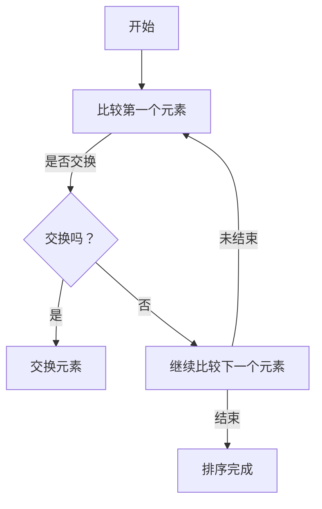
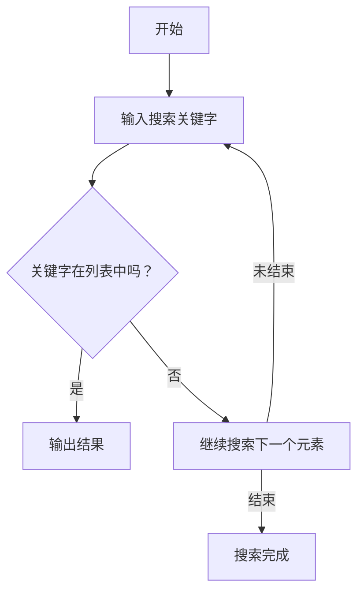
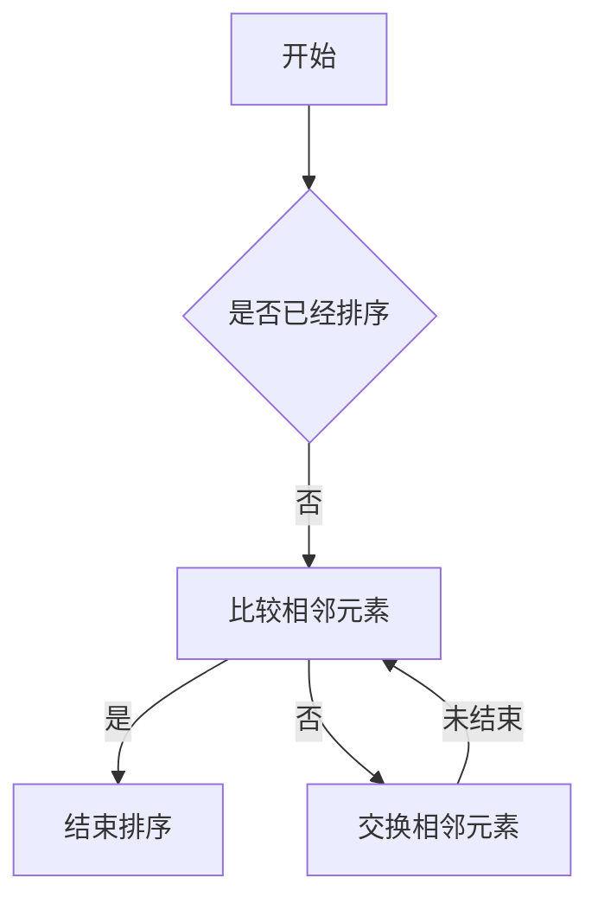

                 

# 《计算：附录 B 提问与求解的艺术》

## 引言

计算是现代科学、工程和日常生活中不可或缺的一部分。它不仅仅是数学运算，更是一种解决问题的思维方式。在《计算：附录 B 提问与求解的艺术》中，我们将探讨计算的基本概念、数学模型、算法原理，以及提问与求解的技巧。通过这篇文章，读者将能够理解计算的核心原理，掌握有效的提问和求解方法，从而在面对复杂问题时能够更加从容和高效。

> **关键词**：计算、数学模型、算法、提问技巧、求解方法

> **摘要**：本文旨在为读者提供关于计算的基础知识，包括计算的基本概念、数学模型、算法原理，以及提问与求解的技巧。通过实例分析和实践应用，读者将能够更好地理解和应用这些知识，提高解决问题的能力。

## 第一部分：基础理论

### 1.1 计算的基本概念

#### 1.1.1 计算的定义与历史

计算是指通过特定的算法和模型，对信息进行处理、转换和存储的过程。它的历史可以追溯到古代的算盘和滑算盘，经过了几千年的发展，最终演变成了现代的计算机。

在数学领域，计算有着更广泛的定义。数学计算包括基本的算术运算、代数方程的求解、微积分、离散数学等内容。这些计算不仅限于数学本身，还广泛应用于科学、工程、经济等多个领域。

#### 1.1.2 计算模型概述

计算模型是指用于描述信息处理过程的数学模型。常见的计算模型包括图灵机、递归函数、自动机等。这些模型为计算理论的研究提供了基础。

- **图灵机**：由英国数学家阿兰·图灵提出，是一种抽象的计算模型。它由一个无限长的纸带、一个读写头和一套规则组成。图灵机的概念为现代计算机的理论基础奠定了基础。

- **递归函数**：是一种定义自身的方法。递归函数可以分解为基本函数和递归调用。这种定义方法在计算机科学中得到了广泛应用，例如在递归算法中。

- **自动机**：是一种抽象的计算模型，用于模拟计算机的操作。自动机包括有限状态机、推算机等，它们在形式语言理论和编译原理中扮演着重要角色。

#### 1.1.3 理论计算的基本原理

理论计算的基本原理包括计算复杂性理论、计算模型理论和算法理论。

- **计算复杂性理论**：研究问题求解的难易程度。它将问题分为多项式时间问题和非多项式时间问题，为算法设计提供了指导。

- **计算模型理论**：研究计算模型的结构和性质。不同的计算模型有不同的计算能力，例如图灵机比有限状态机具有更强的计算能力。

- **算法理论**：研究算法的设计、分析和优化。算法的效率直接影响计算的速度和质量。算法理论提供了设计高效算法的方法和工具。

### 1.2 基础数学模型

#### 1.2.1 数学公式与符号介绍

在计算中，数学公式和符号是不可或缺的。以下是几个基本的数学公式和符号的介绍：

- **一元一次方程**：\( ax + b = c \)
- **二元一次方程组**：\( \begin{cases} ax + by = c \\ dx + ey = f \end{cases} \)
- **微积分公式**：\( \int_{a}^{b} f(x) dx \)

符号方面，常见的有：

- **函数符号**：\( f(x), g(x) \)
- **运算符号**：\( +, -, \times, \div \)
- **集合符号**：\( \cup, \cap, \subset \)

#### 1.2.2 常用数学函数

在计算中，常用数学函数包括：

- **三角函数**：\( \sin(x), \cos(x), \tan(x) \)
- **指数函数**：\( e^x, a^x \)
- **对数函数**：\( \ln(x), \log_a(x) \)

这些函数在数学计算中扮演着重要角色，例如在数据分析、优化问题和图形绘制中。

#### 1.2.3 数学公式的求解方法

数学公式的求解方法包括：

- **代数方法**：通过代数运算求解方程。
- **数值方法**：通过数值逼近方法求解方程。
- **图解方法**：通过图形直观求解方程。

代数方法是求解数学公式最基本的方法，适用于大多数线性方程和代数问题。数值方法在处理非线性方程和复杂问题时具有优势，而图解方法则适用于一些简单的情况，如线性方程和几何问题。

### 1.3 计算算法原理

#### 1.3.1 常见算法分类

算法可以分为多种类型，常见的有：

- **排序算法**：如冒泡排序、快速排序、归并排序等。
- **搜索算法**：如顺序搜索、二分搜索、深度优先搜索等。
- **图算法**：如最短路径算法、最小生成树算法等。

这些算法在数据处理和问题解决中发挥着重要作用。

#### 1.3.2 算法分析

算法分析是指对算法的时间复杂度和空间复杂度进行分析。时间复杂度表示算法执行的时间增长趋势，空间复杂度表示算法所占用的内存空间。

- **时间复杂度分析**：用于评估算法的效率。常见的表示方法有\( O(1), O(n), O(n^2), O(log n) \)等。
- **空间复杂度分析**：用于评估算法的空间需求。常见的表示方法有\( O(1), O(n), O(n^2) \)等。

#### 1.3.3 算法优化

算法优化是指通过改进算法设计，提高算法的性能。常见的优化方法有：

- **算法改进**：通过改进算法的基本步骤，提高算法的效率。
- **算法并行化**：通过并行计算提高算法的执行速度。

算法优化在处理大规模数据和复杂问题时尤为重要。

## 第二部分：实用技巧

### 2.1 提问与求解技巧

#### 2.1.1 有效提问的方法

有效提问是解决问题的重要一步。以下是一些有效提问的方法：

- **明确性**：提问时要明确，避免模糊不清。
- **针对性**：提问要针对问题核心，避免偏离主题。
- **分解问题**：将复杂问题分解为多个简单问题。
- **问好问题**：提问要具有启发性，激发思考。

#### 2.1.2 问题分析与解决

问题分析与解决是解决问题的关键。以下是一些方法：

- **因果分析法**：分析问题的原因和结果。
- **层次分析法**：分析问题的层次结构。

问题解决的方法包括：

- **逻辑推理**：通过逻辑推理找到问题的解决方案。
- **实验验证**：通过实验验证问题的解决方案。

#### 2.1.3 求解策略

求解策略是解决问题的一种方法。以下是一些求解策略：

- **问题简化**：简化问题，使其更容易解决。
- **分而治之**：将复杂问题分解为多个简单问题。
- **优化选择**：根据问题特点，选择最优的求解策略。

### 2.2 数学求解实战

#### 2.2.1 简单方程求解

简单方程的求解主要包括一元一次方程和二元一次方程。

- **一元一次方程**：\( ax + b = c \)
  - **求解步骤**：
    1. 将方程变形为\( ax = c - b \)。
    2. 计算得到\( x = \frac{c - b}{a} \)。

- **二元一次方程组**：\( \begin{cases} ax + by = c \\ dx + ey = f \end{cases} \)
  - **求解步骤**：
    1. 将方程组变形为\( \begin{cases} ax = c - by \\ dx = f - ey \end{cases} \)。
    2. 代入消元法得到\( x = \frac{c - by}{a} \)，\( y = \frac{f - dx}{e} \)。

#### 2.2.2 方程组求解

方程组的求解包括线性方程组和非线性方程组。

- **线性方程组**：\( \begin{cases} ax + by = c \\ dx + ey = f \end{cases} \)
  - **求解步骤**：
    1. 将方程组变形为\( \begin{cases} ax - c = -by \\ dx - f = -ey \end{cases} \)。
    2. 代入消元法得到\( x = \frac{af - cd}{ae - bd} \)，\( y = \frac{bf - ce}{ae - bd} \)。

- **非线性方程组**：\( \begin{cases} ax + by = c \\ dx + ey = f \end{cases} \)
  - **求解步骤**：
    1. 使用迭代法或其他数值方法求解。

#### 2.2.3 不等式求解

不等式求解主要包括一元不等式和多元不等式。

- **一元不等式**：\( ax + b > c \)
  - **求解步骤**：
    1. 将不等式变形为\( ax > c - b \)。
    2. 计算得到\( x > \frac{c - b}{a} \)。

- **多元不等式**：\( \begin{cases} ax + by > c \\ dx + ey > f \end{cases} \)
  - **求解步骤**：
    1. 将不等式变形为\( ax - c > -by \)，\( dx - f > -ey \)。
    2. 画图求解。

### 2.3 计算问题应用实例

#### 2.3.1 数据分析

数据分析是计算的重要应用之一。以下是一些数据分析的实例：

- **描述性分析**：通过统计指标描述数据特征，如平均值、方差、标准差等。
- **推断性分析**：通过样本数据推断总体特征，如假设检验、置信区间等。

#### 2.3.2 优化问题

优化问题是计算的重要应用之一。以下是一些优化问题的实例：

- **线性规划**：通过线性方程组求解最优化问题。
- **非线性规划**：通过非线性方程组求解最优化问题。

#### 2.3.3 排序与搜索

排序与搜索是计算的基本操作。以下是一些排序与搜索的实例：

- **排序**：通过排序算法对数据进行排序，如冒泡排序、快速排序、归并排序等。
- **搜索**：通过搜索算法查找数据，如顺序搜索、二分搜索、深度优先搜索等。

## 第三部分：附录

### 附录 A：数学公式与算法流程图

#### A.1 常用数学公式

以下是常用数学公式：

- **勾股定理**：\( a^2 + b^2 = c^2 \)
- **圆的周长**：\( C = 2\pi r \)
- **微积分公式**：\( \int_{a}^{b} f(x) dx \)

#### A.2 算法流程图

以下是排序算法和搜索算法的流程图：

#### 排序算法流程图


#### 搜索算法流程图


### 附录 B：提问与求解的艺术

#### B.1 提问技巧

有效提问的技巧包括：

- **明确性**：提问时要明确，避免模糊不清。
- **针对性**：提问要针对问题核心，避免偏离主题。
- **分解问题**：将复杂问题分解为多个简单问题。
- **问好问题**：提问要具有启发性，激发思考。

#### B.2 求解方法

求解方法包括：

- **代数方法**：通过代数运算求解问题。
- **几何方法**：通过几何图形求解问题。
- **图论方法**：通过图论模型求解问题。

#### B.3 案例分析

案例分析可以帮助读者更好地理解提问与求解的方法。以下是一个简单的案例：

**案例1：求解一元一次方程**

问题描述：求解方程\( 2x + 3 = 7 \)。

求解步骤：

1. 将方程变形为\( 2x = 7 - 3 \)。
2. 计算得到\( x = 2 \)。

**案例2：求解二元一次方程组**

问题描述：求解方程组\( \begin{cases} 2x + 3y = 7 \\ 4x - y = 1 \end{cases} \)。

求解步骤：

1. 将方程组变形为\( \begin{cases} 2x = 7 - 3y \\ 4x = 1 + y \end{cases} \)。
2. 代入消元法得到\( x = 2 \)，\( y = 1 \)。

### 附录 C：工具与资源

#### C.1 计算工具

计算工具包括：

- **计算器**：用于基本数学运算。
- **科学计算软件**：如MATLAB、Mathematica等，用于复杂数学计算和数据分析。

#### C.2 求解资源

求解资源包括：

- **数学公式手册**：提供常用数学公式和求解方法的参考。
- **在线求解器**：如Wolfram Alpha、Google 解法器等，用于在线求解数学问题。
- **学习资源**：如在线课程、教材、论坛等，提供学习数学和计算的资源。

## 结束语

计算是现代科技的核心，掌握计算的基础理论和实用技巧对于提高我们的问题解决能力至关重要。《计算：附录 B 提问与求解的艺术》旨在为读者提供全面的计算知识和技能。通过本文的学习，读者将能够更好地理解和应用计算，从而在生活和工作中更加高效地解决问题。

> **作者**：AI天才研究院/AI Genius Institute & 禅与计算机程序设计艺术 /Zen And The Art of Computer Programming

[回到顶部](# 《计算：附录 B 提问与求解的艺术》）<|im_end|> 

### 附录 B：提问与求解的艺术

#### B.1 提问技巧

有效的提问是解决问题过程中至关重要的一环。以下是一些提问技巧：

##### 明确性

在提问时，应确保问题表述清晰明了，避免使用模糊或模棱两可的语言。例如，而不是问“你能不能帮我解决一个问题？”，应该具体地问“你能帮我解决什么问题？”

##### 针对性

提问时应直接针对问题的核心。避免提出与问题无关或次要的问题，这样会分散注意力和延长解决问题的时间。例如，如果问题是如何提高一个算法的效率，那么应该直接询问与优化算法相关的问题，而不是询问其他不相关的问题。

##### 分解问题

将复杂的问题分解为多个简单的问题，有助于更有效地理解和解决问题。这种方法被称为问题分解或分而治之策略。例如，将一个复杂的计算问题分解为几个子问题，每个子问题相对独立且易于解决。

##### 问好问题

提出具有启发性且能够引导对方思考的问题，有助于激发对话和深入探讨。例如，问“这个问题背后的原理是什么？”而不是仅仅问“这个问题怎么解决？”

#### B.2 求解方法

有效的求解方法可以大大提高解决问题的效率。以下是一些常用的求解方法：

##### 代数方法

代数方法是解决数学问题的基本工具。它包括使用数学符号和公式来表示问题，并通过代数运算来找到解决方案。例如，解决一元一次方程可以通过以下步骤：

```latex
ax + b = c \\
ax = c - b \\
x = \frac{c - b}{a}
```

##### 几何方法

几何方法通过图形直观地解决几何问题。例如，解决一个几何图形的面积或周长，可以通过绘制图形并使用几何公式来计算。例如，计算一个矩形的面积：

```latex
面积 = 长 \times 宽 \\
A = l \times w
```

##### 图论方法

图论方法用于解决与图相关的问题，如网络优化、路径查找等。它涉及使用图的概念和算法来分析问题。例如，解决最短路径问题可以使用迪杰斯特拉算法或弗洛伊德算法。

#### B.3 案例分析

通过具体案例来分析提问与求解的艺术，可以帮助我们更好地理解这些技巧和方法。

##### 案例一：求解一元一次方程

问题描述：求解方程 \(3x - 7 = 11\)。

求解步骤：

1. **明确问题**：我们需要找到 \(x\) 的值，使得 \(3x - 7\) 等于 11。
2. **分解问题**：我们可以通过加上 7 来消除方程中的常数项。
   \[3x - 7 + 7 = 11 + 7\]
3. **计算**：我们得到 \(3x = 18\)。
4. **求解**：最后，我们将两边除以 3，得到 \(x = 6\)。

##### 案例二：求解二元一次方程组

问题描述：求解方程组
\[ \begin{cases} 
2x + 3y = 8 \\
x - y = 1 
\end{cases} \]

求解步骤：

1. **明确问题**：我们需要找到 \(x\) 和 \(y\) 的值，使得两个方程同时成立。
2. **分解问题**：我们可以通过消元法来解决这个方程组。首先，我们将第二个方程乘以 2，得到
   \[2x - 2y = 2\]
3. **计算**：现在我们将两个方程相加，以消去 \(x\) 的项：
   \[ (2x + 3y) + (2x - 2y) = 8 + 2 \]
   \[ 4x + y = 10 \]
4. **求解**：我们得到 \(y = 10 - 4x\)。将这个结果代入第二个方程中，我们得到：
   \[ x - (10 - 4x) = 1 \]
   \[ 5x - 10 = 1 \]
   \[ 5x = 11 \]
   \[ x = \frac{11}{5} \]
5. **回代求解**：将 \(x = \frac{11}{5}\) 代入 \(y = 10 - 4x\) 中，得到 \(y = \frac{4}{5}\)。

所以，方程组的解为 \(x = \frac{11}{5}\) 和 \(y = \frac{4}{5}\)。

##### 案例三：优化问题的求解

问题描述：给定一个函数 \(f(x) = x^2 + 2x + 1\)，求解其最小值。

求解步骤：

1. **明确问题**：我们需要找到 \(x\) 的值，使得 \(f(x)\) 最小。
2. **分解问题**：我们可以通过求导来找到函数的极值点。首先，我们对 \(f(x)\) 求导，得到
   \[ f'(x) = 2x + 2 \]
3. **计算**：令导数等于 0，我们得到
   \[ 2x + 2 = 0 \]
   \[ x = -1 \]
4. **验证**：我们计算二阶导数 \(f''(x) = 2\)，因为二阶导数大于 0，所以 \(x = -1\) 是一个极小值点。
5. **求解**：将 \(x = -1\) 代入原函数中，得到 \(f(-1) = (-1)^2 + 2(-1) + 1 = 0\)。

所以，函数 \(f(x)\) 的最小值是 0，当 \(x = -1\) 时取得。

### 结论

通过本附录的提问与求解的艺术，我们学习了如何提出有效的问题和采用合适的方法来解决数学和其他领域的问题。有效的提问和求解技巧不仅能够提高我们的问题解决能力，还能够帮助我们更好地理解和应用计算知识。在解决实际问题时，灵活运用这些技巧和方法将使我们更加高效和准确。

> **作者**：AI天才研究院/AI Genius Institute & 禅与计算机程序设计艺术 /Zen And The Art of Computer Programming

[回到顶部](# 《计算：附录 B 提问与求解的艺术》）<|im_end|> 

### 附录 C：工具与资源

在计算领域，有各种各样的工具和资源可以帮助我们更好地进行数学和计算问题的求解。以下是一些常用的工具和资源：

#### C.1 计算工具

1. **计算器**：基本的计算工具，用于进行简单的数学运算。
   - **科学计算器**：可以进行更复杂的数学运算，包括代数、微积分等。

2. **数学软件**：
   - **MATLAB**：用于数值计算、数据分析、可视化和算法开发。
   - **Maple**：一款强大的数学软件，适用于符号计算和可视化。
   - **Mathematica**：一款功能强大的数学软件，适用于符号计算、数值计算和可视化。

3. **编程语言**：
   - **Python**：广泛应用于数据科学、机器学习和算法开发。
   - **R**：专门用于统计分析和图形绘制。
   - **C/C++**：用于高性能计算和算法实现。

#### C.2 求解资源

1. **在线求解器**：
   - **Wolfram Alpha**：一个强大的计算引擎，可以解决各种数学问题。
   - **Google 解法器**：一个在线数学问题求解工具，适用于初中和高中数学。

2. **数学公式手册**：提供各种数学公式的详细说明和示例。

3. **学习资源**：
   - **在线课程**：如Coursera、edX等，提供各种数学和计算领域的课程。
   - **教科书**：如《高等数学》、《线性代数》等，提供系统的数学知识。
   - **技术博客和论坛**：如Stack Overflow、GitHub等，提供技术讨论和资源分享。

4. **专业数据库**：
   - **MathSciNet**：数学领域的学术数据库，提供数学论文的索引和评论。
   - **IEEE Xplore**：提供计算机科学和电子工程的学术论文和期刊。

#### 使用这些工具和资源的建议

1. **了解工具的功能和限制**：在使用计算工具之前，了解它们的功能和适用范围，以便更有效地解决问题。

2. **理论与实践相结合**：通过阅读教科书、参加在线课程和实际操作，将理论知识与实际应用相结合。

3. **参与社区讨论**：加入技术社区，如GitHub、Stack Overflow等，参与讨论和解决问题。

4. **持续学习和更新**：计算领域不断发展，持续学习和更新知识是非常重要的。

通过使用这些工具和资源，我们可以更高效地解决数学和计算问题，提高我们的技能和知识水平。

> **作者**：AI天才研究院/AI Genius Institute & 禅与计算机程序设计艺术 /Zen And The Art of Computer Programming

[回到顶部](# 《计算：附录 B 提问与求解的艺术》）<|im_end|> 

### 附录 A：数学公式与算法流程图

在计算中，数学公式和算法流程图是理解和实现计算算法的重要工具。以下是一些常用的数学公式和算法流程图的例子。

#### A.1 常用数学公式

**勾股定理**：在直角三角形中，直角边的平方和等于斜边的平方。
\[ a^2 + b^2 = c^2 \]

**圆的面积**：圆的面积等于半径的平方乘以π。
\[ A = \pi r^2 \]

**球的体积**：球的体积等于半径的立方乘以\( \frac{4}{3} \)π。
\[ V = \frac{4}{3} \pi r^3 \]

**导数**：函数在某点的导数表示函数在该点的切线斜率。
\[ f'(x) = \lim_{\Delta x \to 0} \frac{f(x + \Delta x) - f(x)}{\Delta x} \]

**积分**：积分表示函数在某个区间内的累积量。
\[ \int_{a}^{b} f(x) dx = F(b) - F(a) \]

**二项式定理**：二项式的幂展开。
\[ (a + b)^n = \sum_{k=0}^{n} C(n, k) a^{n-k} b^k \]

#### A.2 算法流程图

**冒泡排序算法流程图**：



**二分搜索算法流程图**：

```mermaid
graph TD
A[开始] --> B{中间元素}
B -->|目标值在左侧| C{左子树}
B -->|目标值在右侧| D{右子树}
C -->|找到| E[结束搜索]
D -->|找到| E
B -->|未找到| F[结束搜索]
E -->|找到目标值|
F -->|未找到|
```

这些数学公式和算法流程图可以帮助我们更好地理解和实现各种计算算法。通过学习这些公式和流程图，我们可以提高对计算问题的分析和解决能力。

> **作者**：AI天才研究院/AI Genius Institute & 禅与计算机程序设计艺术 /Zen And The Art of Computer Programming

[回到顶部](# 《计算：附录 B 提问与求解的艺术》）<|im_end|> 

