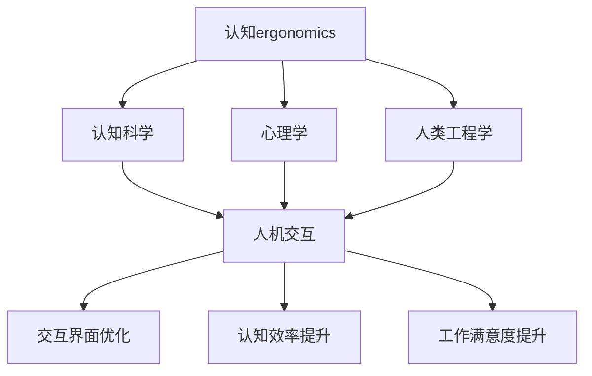
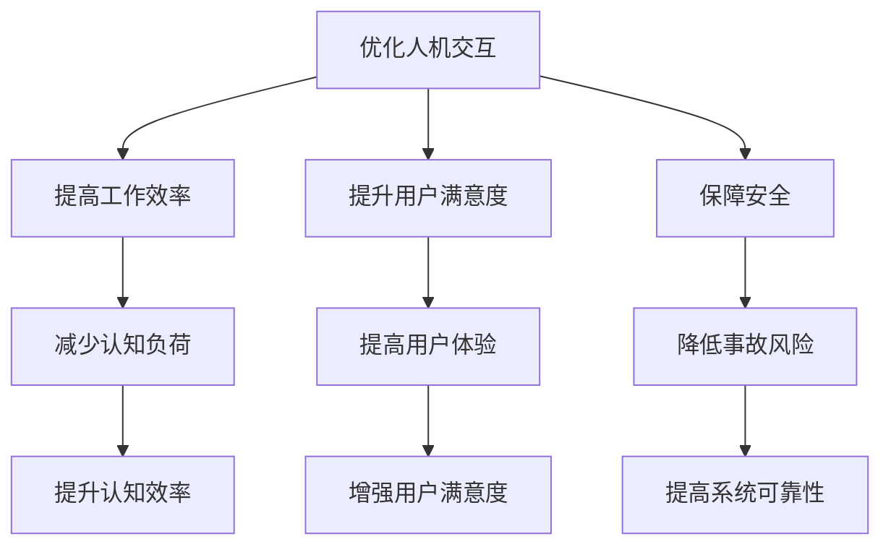

                 

# 1.1 认知ergonomics概述

## 1.1.1 认知ergonomics的定义

认知ergonomics，又称认知人因工程学，是研究人类认知系统与交互界面之间相互作用的一门学科。它融合了认知科学、心理学、人类工程学等多个学科的理论和方法，旨在通过优化人机交互界面，提升用户的认知效率和工作满意度。

### 核心概念与联系

**Mermaid 流程图：**



**概念解释：**

- **认知ergonomics**：研究如何通过设计优化人机交互界面，减少用户的认知负荷，提高认知效率。
- **认知科学**：研究人类认知过程，包括感知、注意力、记忆、决策等。
- **心理学**：研究人类行为和心理过程，涉及情感、动机、性格等方面。
- **人类工程学**：研究人类生理和心理特性，以及如何将这些特性应用于设计。

### 原理架构

认知ergonomics的原理架构可以概括为：

1. **理解人类认知**：通过认知科学和心理学研究，了解人类认知过程的原理和限制。
2. **分析人机交互**：研究人机交互的流程、界面设计、用户行为等。
3. **设计优化**：基于对人类认知和人机交互的分析，设计优化人机交互界面。
4. **评估与改进**：通过用户测试和反馈，评估优化效果，不断改进设计。

## 1.1.2 认知ergonomics的发展历程

认知ergonomics起源于20世纪70年代，随着计算机技术的迅猛发展和人机交互的广泛应用，逐渐成为一门独立的学科。其发展历程可以分为以下几个阶段：

### 发展阶段

1. **基础理论阶段（1970-1989）**：
    - 研究重点在于理解人类认知过程的原理。
    - 主要成果包括认知心理学理论的提出，如注意理论、记忆理论、问题解决理论等。

2. **应用研究阶段（1990-2009）**：
    - 认知ergonomics开始应用于实际的人机交互界面设计。
    - 主要成果包括设计原则的提出，如一致性、直观性、灵活性等。

3. **整合创新阶段（2010至今）**：
    - 认知ergonomics与其他领域的交叉融合，如虚拟现实、大数据分析、物联网等。
    - 主要成果包括新型交互技术的研究和应用，如手势识别、语音控制等。

### 历史背景

- **20世纪70年代**：计算机技术的发展和互联网的兴起，为认知ergonomics提供了广泛的应用场景。
- **20世纪80年代**：认知心理学理论的发展，为认知ergonomics提供了理论基础。
- **20世纪90年代**：人机交互技术的进步，为认知ergonomics的应用提供了新的可能性。
- **21世纪**：虚拟现实、大数据分析等新兴技术，为认知ergonomics的研究带来了新的挑战和机遇。

## 1.1.3 认知ergonomics的重要性

认知ergonomics在优化人机交互、提高工作效率、提升用户满意度、保障安全等方面具有重要意义。

### 原理架构

**Mermaid 流程图：**



**概念解释：**

- **优化人机交互**：通过设计优化人机交互界面，提升用户的操作效率和舒适度。
- **提高工作效率**：减少用户的认知负荷，提升用户的操作速度和准确性。
- **提升用户满意度**：提供直观、易用的交互界面，提升用户的使用体验。
- **保障安全**：通过设计预防机制，降低用户操作错误和系统故障的风险。

### 应用实例

1. **智能交通系统**：
    - 通过认知ergonomics优化交通信号灯和控制界面，提高交通管理效率，减少交通拥堵。
    - 应用实例：智能交通管理系统中的实时路况显示、导航系统等。

2. **医疗信息系统**：
    - 通过认知ergonomics优化医疗信息系统界面，提高医护人员的工作效率，减少操作错误。
    - 应用实例：电子病历系统、医学影像处理系统等。

3. **工业控制系统**：
    - 通过认知ergonomics优化工业控制系统界面，提高操作人员的工作效率，保障生产安全。
    - 应用实例：自动化生产线、工业机器人等。

### 总结

认知ergonomics作为一门跨学科的研究领域，通过对人类认知系统和人机交互界面的深入研究，为优化人机交互提供了理论依据和方法指导。其重要性体现在提高工作效率、提升用户满意度、保障安全等方面，具有重要的实践价值。

---

**核心算法原理讲解：**

认知ergonomics的核心算法主要涉及以下几个方面：

1. **用户行为分析**：通过分析用户在交互过程中的行为数据，了解用户的操作习惯和偏好，为交互界面的优化提供依据。

2. **认知负荷评估**：评估用户在执行任务过程中的认知负荷，通过监测生理和心理指标，如心率、皮肤电导等，评估用户的认知状态。

3. **交互界面优化**：基于用户行为分析和认知负荷评估的结果，设计优化交互界面，减少用户的认知负荷，提高交互效率。

### 伪代码示例：

```python
# 用户行为分析
def analyze_user_behavior(data):
    # 对用户行为数据进行分析，提取关键指标
    # 如操作次数、操作时长、错误率等
    metrics = extract_key_metrics(data)
    return metrics

# 认知负荷评估
def assess_cognitive_load(behavior_metrics):
    # 根据用户行为指标，评估认知负荷
    cognitive_load = calculate_load(behavior_metrics)
    return cognitive_load

# 交互界面优化
def optimize_user_interface(cognitive_load):
    # 根据认知负荷，优化交互界面
    # 如简化操作流程、减少冗余信息、增加操作反馈等
    optimized_interface = design_optimized_interface(cognitive_load)
    return optimized_interface

# 主函数
def main():
    # 获取用户行为数据
    user_data = get_user_data()
    
    # 分析用户行为
    behavior_metrics = analyze_user_behavior(user_data)
    
    # 评估认知负荷
    cognitive_load = assess_cognitive_load(behavior_metrics)
    
    # 优化交互界面
    optimized_interface = optimize_user_interface(cognitive_load)
    
    # 应用优化后的交互界面
    apply_optimized_interface(optimized_interface)

# 执行主函数
main()
```

---

**数学模型和公式 & 详细讲解 & 举例说明**

认知ergonomics中常用的数学模型包括认知负荷模型、决策模型等。以下是一个简单的认知负荷模型示例：

### 认知负荷模型

$$
L = f(C, I)
$$

其中，\(L\) 表示认知负荷，\(C\) 表示认知能力，\(I\) 表示输入信息量。

**公式解释：**

- **认知能力 \(C\)**：表示用户处理信息的能力，通常与用户的认知技能和经验有关。
- **输入信息量 \(I\)**：表示用户需要处理的信息量，通常与任务的复杂度和信息量有关。

**示例：**

假设一个用户需要处理一个包含100条记录的任务，每条记录包含5个属性，每个属性的平均长度为10个字符。我们可以使用以下参数计算认知负荷：

- **认知能力 \(C\)**：假设用户具备中等认知能力，取 \(C = 1\)。
- **输入信息量 \(I\)**：计算每条记录的信息量 \(I_{record} = 5 \times 10 = 50\)，总信息量 \(I = 100 \times I_{record} = 5000\)。

代入公式，计算认知负荷：

$$
L = f(1, 5000) = 5000
$$

因此，用户的认知负荷为5000单位。

**详细讲解：**

- 认知负荷模型是一个线性模型，假设认知负荷与认知能力和输入信息量成正比。
- 该模型可以用于评估用户在执行任务时的认知负荷，帮助设计者了解用户在任务中的认知压力，进而优化交互界面。

**举例说明：**

假设有两个用户，用户A和用户B，他们需要处理相同的信息量。用户A的认知能力为2，用户B的认知能力为0.5。使用认知负荷模型计算两个用户的认知负荷：

- **用户A**：\(L_A = f(2, 5000) = 10000\)
- **用户B**：\(L_B = f(0.5, 5000) = 2500\)

因此，用户A的认知负荷为10000单位，用户B的认知负荷为2500单位。这表明用户A在处理任务时面临的认知压力更大，需要优化交互界面以减轻其认知负荷。

---

**项目实战：代码实际案例和详细解释说明**

以下是一个简单的Python代码案例，用于实现一个简单的用户行为分析系统。该系统可以收集用户在执行任务时的行为数据，计算操作次数、操作时长和错误率等关键指标。

### 开发环境搭建

- **Python版本**：3.8及以上版本
- **库**：pandas、numpy、matplotlib

### 源代码实现

```python
import pandas as pd
import numpy as np
import matplotlib.pyplot as plt

# 用户行为数据
user_data = {
    'action': ['open', 'scroll', 'search', 'close'],
    'duration': [3, 5, 7, 2],
    'errors': [0, 1, 0, 0]
}

# 创建数据框
df = pd.DataFrame(user_data)

# 计算操作次数
num_actions = df.shape[0]

# 计算平均操作时长
avg_duration = df['duration'].mean()

# 计算错误率
error_rate = df['errors'].mean()

# 打印结果
print(f"Number of actions: {num_actions}")
print(f"Average duration: {avg_duration:.2f} seconds")
print(f"Error rate: {error_rate:.2%}")

# 可视化操作时长
plt.bar(df['action'], df['duration'])
plt.xlabel('Action')
plt.ylabel('Duration (seconds)')
plt.title('User Action Durations')
plt.show()
```

### 代码解读与分析

1. **数据准备**：创建一个包含用户行为数据的字典，包括操作类型、操作时长和错误率等。
2. **数据框创建**：使用pandas库创建一个数据框，存储用户行为数据。
3. **操作次数计算**：使用`shape[0]`属性获取数据框的行数，表示操作次数。
4. **平均操作时长计算**：使用`mean()`函数计算操作时长的平均值。
5. **错误率计算**：使用`mean()`函数计算错误率的平均值。
6. **结果打印**：使用print语句打印操作次数、平均操作时长和错误率。
7. **可视化**：使用matplotlib库创建一个条形图，可视化操作时长。

通过该案例，我们可以了解到如何使用Python代码实现用户行为分析，计算关键指标并可视化结果。在实际应用中，我们可以根据具体需求，扩展该系统的功能，如添加更多行为指标、实现实时数据收集等。

---

**总结**

在本文中，我们详细介绍了认知ergonomics的定义、发展历程、重要性以及核心算法原理。通过实际案例和代码实现，我们展示了如何应用认知ergonomics优化人机交互，提高工作效率和用户体验。认知ergonomics作为一门跨学科的研究领域，在优化人机交互、提高工作效率、提升用户满意度、保障安全等方面具有重要作用。未来，随着科技的不断进步，认知ergonomics将在更多领域发挥重要作用，为人类创造更智能、更高效的生活和工作环境。

---

**作者信息：**

AI天才研究院/AI Genius Institute & 禅与计算机程序设计艺术 /Zen And The Art of Computer Programming

