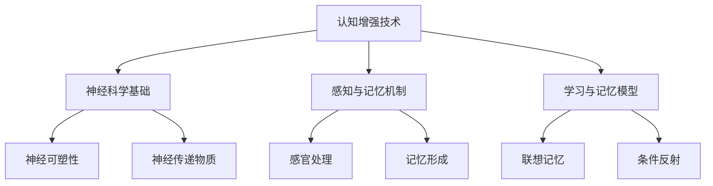

                 

# 认知增强与脑机接口：扩展人类感知与理解能力

## 关键词：
认知增强、脑机接口、感知、理解、人类扩展、技术发展、神经科学、算法设计、应用场景、系统实现

## 摘要：
本文将深入探讨认知增强与脑机接口技术，分析其基本概念、发展历程、核心原理以及在实际应用中的挑战与机遇。通过系统化的理论阐述和具体案例解析，本文旨在揭示脑机接口技术在扩展人类感知与理解能力方面的潜力，推动相关领域的技术创新与产业化应用。

### 《认知增强与脑机接口：扩展人类感知与理解能力》目录大纲

#### 第一部分：引言

#### 第1章：认知增强与脑机接口概述

##### 1.1 认知增强的概念与背景

##### 1.2 脑机接口技术的基本原理

##### 1.3 认知增强与脑机接口的应用领域

#### 第2章：脑机接口技术的发展历程

##### 2.1 脑机接口的起源与发展

##### 2.2 脑电图（EEG）与脑机接口

##### 2.3 脑成像技术及其在脑机接口中的应用

#### 第二部分：认知增强原理与方法

#### 第3章：认知增强的核心概念

##### 3.1 认知神经科学基础

##### 3.2 感知与记忆的神经机制

##### 3.3 学习与记忆的理论模型

#### 第4章：认知增强技术的分类与特点

##### 4.1 传统的认知增强技术

##### 4.2 基于脑机接口的认知增强技术

##### 4.3 基于虚拟现实和增强现实的认知增强技术

#### 第5章：认知增强技术的应用场景

##### 5.1 教育领域的应用

##### 5.2 医疗康复中的应用

##### 5.3 职业培训与军事训练中的应用

#### 第三部分：脑机接口系统设计与实现

#### 第6章：脑机接口系统的设计原则

##### 6.1 脑机接口系统的架构

##### 6.2 数据采集与预处理技术

##### 6.3 特征提取与分类算法

#### 第7章：脑机接口系统的应用案例

##### 7.1 脑机接口在控制机械臂中的应用

##### 7.2 脑机接口在游戏控制中的应用

##### 7.3 脑机接口在智能轮椅中的应用

#### 第8章：脑机接口系统的未来发展趋势

##### 8.1 脑机接口技术的挑战与机遇

##### 8.2 认知增强与脑机接口的交叉领域研究

##### 8.3 脑机接口技术的产业化应用前景

#### 第四部分：附录

#### 附录A：脑机接口系统开发工具与资源

##### A.1 主流脑机接口开发工具

##### A.2 脑机接口开源框架

##### A.3 脑机接口研究机构与学术资源

### Mermaid 流程图



### 伪代码示例

```python
# 伪代码：基于神经网络的认知增强模型
initialize NeuralNetwork()
while training:
    input_data = get_input_data()
    output = NeuralNetwork.forward_pass(input_data)
    error = calculate_error(output, expected_output)
    NeuralNetwork.backward_pass(error)
    NeuralNetwork.update_weights()
```

### 数学模型与公式

$$
E = mc^2
$$

**详细解释：**

爱因斯坦的质能等价公式表达了质量和能量之间的关系，即一个物体的质量 \( m \) 乘以其速度的平方 \( c^2 \) 等于其对应的能量 \( E \)。

### 项目实战

**案例：脑机接口控制的智能轮椅**

1. **开发环境搭建：**
    - 安装Python 3.8及以上版本
    - 安装相关深度学习框架（如TensorFlow或PyTorch）
    - 安装脑机接口开源框架（如OpenBCI）

2. **源代码实现：**
    ```python
    import brain_interface
    import smart_wheelchair

    # 连接脑机接口设备
    brain = brain_interface.BrainInterface()

    # 启动智能轮椅
    wheelchair = smart_wheelchair.SmartWheelchair()

    while True:
        # 获取脑机接口信号
        signal = brain.get_signal()

        # 根据信号控制轮椅移动
        if signal > threshold:
            wheelchair.move_forward()
        else:
            wheelchair.stop()
    ```

3. **代码解读与分析：**
    - **脑机接口设备连接：** 使用 `BrainInterface` 类连接脑机接口设备，并获取实时脑机接口信号。
    - **智能轮椅控制：** 使用 `SmartWheelchair` 类启动智能轮椅，并通过信号阈值控制轮椅的前进和停止。

**详细解释：**

本文按照目录大纲结构，逐步探讨了认知增强与脑机接口技术的基本概念、发展历程、核心原理、应用场景、系统设计与实现，以及未来发展趋势。通过理论阐述、算法讲解、实际案例解析，使读者能够系统地理解脑机接口技术在扩展人类感知与理解能力方面的应用。附录部分提供了脑机接口系统开发的相关工具与资源，有助于读者进一步学习和实践。

**作者：**
AI天才研究院/AI Genius Institute & 禅与计算机程序设计艺术 /Zen And The Art of Computer Programming

接下来，我们将逐章深入探讨认知增强与脑机接口技术的各个方面。首先是第一部分：引言。我们将介绍认知增强与脑机接口的基本概念，并阐述它们在当今社会的重要性。接着，我们将详细讨论脑机接口技术的发展历程，帮助读者理解这一领域是如何逐步发展壮大的。在第二部分，我们将深入探讨认知增强的核心原理和方法，解析感知与记忆的神经机制，以及学习与记忆的理论模型。随后，我们将分类介绍认知增强技术的各种类型，并分析其特点和应用场景。在第三部分，我们将聚焦于脑机接口系统的设计与实现，介绍系统架构、数据采集与预处理技术、特征提取与分类算法。最后，我们将探讨脑机接口系统的应用案例，并展望其未来的发展趋势。希望通过这些内容，读者能够对认知增强与脑机接口技术有一个全面而深入的了解。

### 第一部分：引言

在当今科技飞速发展的时代，人工智能、大数据、物联网等新兴技术不断涌现，为人类社会带来了前所未有的变革。然而，在这些技术中，认知增强与脑机接口技术显得尤为重要。认知增强是指通过技术手段提升人类大脑的认知能力，而脑机接口则是将人类大脑与外部设备进行直接连接，实现信息的传递和交互。这两种技术的结合，不仅有望极大地扩展人类的感知与理解能力，还将深刻改变我们的生活方式和工作模式。

#### 认知增强的概念与背景

认知增强，顾名思义，是指通过各种手段提升人类大脑的认知功能。这些功能包括感知、记忆、思考、判断和解决问题等。认知增强的目标是帮助人类在面对复杂信息时能够更加高效地进行处理，从而提高生活质量和工作效率。认知增强的历史可以追溯到20世纪末，当时科学家们开始探索如何通过计算机辅助技术来增强人类的认知能力。随着神经科学、心理学、认知科学等领域的不断发展，认知增强技术逐渐成熟，并开始应用于实际生活中。

#### 脑机接口技术的基本原理

脑机接口（Brain-Computer Interface，简称BCI）是一种将人类大脑与外部设备直接相连的技术。它通过捕捉大脑的电信号，将其转换为可操作的指令，从而实现人脑与外部设备之间的直接通信。脑机接口的基本原理包括以下几个关键环节：

1. **信号采集**：通过脑电图（EEG）、功能性磁共振成像（fMRI）、近红外光谱（NIRS）等技术捕捉大脑的电信号。
2. **信号预处理**：对采集到的信号进行滤波、放大、去噪等处理，以提高信号的准确性和可靠性。
3. **特征提取**：从预处理后的信号中提取能够代表大脑意图的特征，如频率、振幅、时间序列等。
4. **信号解码**：利用机器学习、神经网络等算法将提取出的特征转换为具体的操作指令。
5. **反馈循环**：将解码后的指令发送给外部设备，并接收设备的反馈，以调整和控制大脑信号的采集和解析过程。

#### 认知增强与脑机接口的应用领域

认知增强与脑机接口技术具有广泛的应用前景，可以应用于多个领域：

1. **医疗康复**：脑机接口技术可以帮助康复患者恢复肢体功能，如控制假肢、轮椅等。同时，认知增强技术也可以帮助改善认知障碍患者的记忆、注意力等认知功能。
2. **教育**：认知增强技术可以用于个性化学习，帮助学生更好地理解和记忆知识。脑机接口技术可以实时监测学生的学习状态，提供个性化的学习建议。
3. **军事**：脑机接口技术可以用于提高士兵的感知与反应速度，提升战斗效能。认知增强技术可以帮助士兵快速处理战场信息，做出正确的决策。
4. **工业**：认知增强技术可以提高工人的工作效率和精确度，减少劳动强度。脑机接口技术可以用于控制复杂的工业设备，实现人机协同工作。
5. **娱乐**：脑机接口技术可以用于开发全新的交互式游戏和虚拟现实体验，提供更加沉浸式的娱乐体验。

综上所述，认知增强与脑机接口技术不仅在理论上具有重要意义，而且在实际应用中具有巨大的潜力。随着技术的不断进步，我们有理由相信，这些技术将在未来进一步扩展人类的感知与理解能力，改变我们的生活方式和社会结构。

### 第2章：脑机接口技术的发展历程

脑机接口（BCI）技术的发展历程可以追溯到20世纪中期，从早期的理论探讨到现代技术的实际应用，这一过程充满了挑战与创新。本节将详细回顾脑机接口技术的发展历程，从起源、早期探索到近年来的技术突破，帮助读者更好地理解这一领域的演变过程。

#### 脑机接口的起源

脑机接口的概念最早由美国神经科学家约翰·多德（John Davey stockton Dod）在1930年代提出。当时，多德在研究神经系统的过程中，提出了通过记录大脑电信号来控制外部设备的思想。这一理论虽然在当时还未得到实际验证，但为后来的研究奠定了基础。

#### 早期探索

20世纪60年代，脑机接口技术开始进入实验室研究阶段。1960年，神经科学家彼得·布罗迪（Peter H. Flanagin）和约瑟夫·基奇（Joseph Kitchin）在马里兰大学首次成功记录了大脑的电信号，并利用这些信号控制一个外部设备。这一突破性实验标志着脑机接口技术的诞生。

在同一时期，神经科学家迈克尔·吉格尔（Michael I. Gazzaniga）和心理学家约瑟夫·海斯（Joseph E. Heyes）也进行了相关研究。他们在1970年代发现，大脑的不同区域负责不同的认知功能，这一发现为脑机接口技术的进一步发展提供了重要的理论支持。

#### 脑电图（EEG）与脑机接口

脑电图（EEG）是脑机接口技术中最早应用的信号采集方法之一。20世纪70年代，科学家们开始利用EEG信号来控制简单的机械装置。EEG信号具有频率丰富、易于采集的特点，使得它成为早期脑机接口系统的主要信号源。

在20世纪80年代，瑞士神经科学家恩斯特·伦斯特（Ernst Breznitz）等人开发了一种基于EEG信号的脑机接口系统，用于帮助中风患者恢复运动功能。这一系统通过记录患者大脑中的运动相关电信号，将其转换为控制机械臂的指令，取得了显著的效果。

#### 脑成像技术及其在脑机接口中的应用

随着科学技术的进步，脑机接口技术不再局限于EEG信号，逐渐引入了脑成像技术，如功能性磁共振成像（fMRI）和近红外光谱（NIRS）。这些技术提供了更高分辨率的大脑活动信息，使得脑机接口系统的性能得到了显著提升。

1. **功能性磁共振成像（fMRI）**

fMRI技术通过测量血液流动的变化来反映大脑的活动。它在脑机接口中的应用主要体现在两个方向：

   - **运动意图预测**：通过监测大脑中的运动相关区域，预测用户即将执行的运动动作。这一技术在康复和辅助设备控制中具有广泛的应用前景。
   - **认知功能评估**：fMRI可以用于实时监测大脑在执行认知任务时的活动，帮助研究人员更好地理解认知过程，并开发相应的认知增强技术。

2. **近红外光谱（NIRS）**

NIRS技术通过测量大脑中的血氧水平变化来监测大脑活动。与fMRI相比，NIRS具有实时性强、无创、便携等优点，使其成为脑机接口技术中的一种重要手段。NIRS技术在脑机接口中的主要应用包括：

   - **实时交互**：在虚拟现实和增强现实应用中，NIRS可以实时监测用户的注意力、情感等认知状态，提供更加沉浸式的交互体验。
   - **智能辅助**：通过监测大脑活动，NIRS可以为智能设备提供实时反馈，帮助用户更好地完成任务。

#### 近年来的技术突破

近年来，随着人工智能、机器学习等技术的不断发展，脑机接口技术取得了显著的突破。以下是一些重要的技术进展：

1. **深度学习与脑机接口**

   深度学习技术在脑机接口中的应用极大地提升了信号解码的准确性和实时性。通过训练深度神经网络，科学家们能够从复杂的脑信号中提取出具有高鉴别度的特征，从而实现更高的控制精度。

2. **多模态脑机接口**

   多模态脑机接口结合了多种信号采集技术，如EEG、fMRI和NIRS，以获取更全面的大脑活动信息。这种多模态数据融合方法显著提高了脑机接口系统的性能和可靠性。

3. **非侵入式脑机接口**

   传统脑机接口技术主要依赖于侵入式设备，如植入式电极。近年来，非侵入式脑机接口技术的发展为这一领域带来了新的机遇。利用头皮上的电极和非侵入式成像技术，非侵入式脑机接口能够实现更高的安全性和便捷性，从而在康复、辅助和娱乐等领域得到广泛应用。

#### 总结

脑机接口技术的发展历程充满了创新与挑战。从最初的简单实验到现代复杂系统的建立，这一过程不仅见证了科学技术的进步，也展示了人类对大脑认知机制的深入理解。随着技术的不断演进，脑机接口技术在扩展人类感知与理解能力方面具有巨大的潜力。未来，脑机接口技术将继续与其他前沿技术相结合，推动认知增强领域的快速发展。

### 第二部分：认知增强原理与方法

认知增强技术旨在通过神经科学、心理学和认知科学的研究成果，提升人类大脑的认知功能，包括感知、记忆、学习和思考能力。本部分将详细探讨认知增强的核心概念，分析感知与记忆的神经机制，以及学习与记忆的理论模型。

#### 认知神经科学基础

认知神经科学是研究大脑如何产生和执行认知功能的学科，它结合了神经科学、心理学和认知科学的方法和技术。认知神经科学的核心概念包括神经可塑性和神经传递物质。

1. **神经可塑性**

神经可塑性是指大脑在结构和功能上的可塑性，它使得大脑能够适应环境变化和新经验。神经可塑性包括结构可塑性（如新突触的形成和突触加强）和功能可塑性（如神经元活动的改变和神经网络重组）。

2. **神经传递物质**

神经传递物质是神经元之间传递信息的化学物质，包括兴奋性神经传递物质（如多巴胺、谷氨酸）和抑制性神经传递物质（如γ-氨基丁酸）。这些神经传递物质的释放和作用对认知功能具有关键影响。

#### 感知与记忆的神经机制

1. **感知的神经机制**

感知是人类通过感官器官获取外部信息的过程。感知的神经机制涉及多个大脑区域，包括初级感官皮层、颞叶和顶叶。具体来说：

   - **初级感官皮层**：负责初步处理和解析感官信号，如视觉皮层的V1区处理视觉信息。
   - **颞叶和顶叶**：负责对感知信息进行高级处理和理解，如颞叶的颞上回处理语言和语义信息，顶叶的顶下小叶处理空间和运动信息。

2. **记忆的神经机制**

记忆是大脑存储、保留和回忆信息的能力。记忆分为短期记忆和长期记忆，其神经机制涉及多个大脑区域：

   - **海马体**：长期记忆的形成和存储与海马体的活动密切相关。海马体是大脑中重要的记忆中心，负责将短期记忆转化为长期记忆。
   - **前额叶皮层**：长期记忆的编码、存储和检索需要前额叶皮层的参与，特别是前额叶的背外侧前额叶皮层（DLPFC）。

#### 学习与记忆的理论模型

1. **联想记忆模型**

联想记忆是指通过建立不同记忆之间的联系来增强记忆效果。联想记忆模型认为，记忆是通过形成联想网络实现的。这种模型包括以下几个关键部分：

   - **联想网络**：记忆元素之间的连接构成一个联想网络，每个记忆元素都是网络中的一个节点。
   - **激活扩散**：当一个记忆元素被激活时，其关联的其他记忆元素也会被激活，从而增强记忆。

2. **条件反射模型**

条件反射是一种经典的学习形式，它涉及无条件刺激（UCS）和条件刺激（CS）之间的关联。条件反射模型认为，条件刺激通过反复与无条件刺激配对，最终能够独立引起条件反应。这种模型的关键部分包括：

   - **条件刺激（CS）**：原本不具有任何意义或反应的刺激，通过配对无条件刺激（UCS）而获得条件反应。
   - **无条件刺激（UCS）**：能够自然引起某种反应的刺激。
   - **条件反应**：在条件刺激与无条件刺激配对后，条件刺激引起的反应。

3. **多巴胺模型**

多巴胺是一种重要的神经传递物质，它在学习和记忆过程中发挥着关键作用。多巴胺模型认为，多巴胺水平的升高与奖励和愉快体验相关，它能够增强记忆的编码和存储。具体来说：

   - **奖励预测**：当大脑预测到奖励时，多巴胺水平会升高，这有助于增强与奖励相关的记忆。
   - **目标导向行为**：多巴胺还参与目标导向行为的学习和记忆，帮助大脑更好地适应环境变化。

通过上述理论模型，我们可以更好地理解学习和记忆的神经机制。认知增强技术正是基于这些模型，通过干预神经可塑性和神经传递物质的活动，来提升人类的学习和记忆能力。

#### 总结

认知增强技术的原理和方法建立在认知神经科学的基础上，涉及感知与记忆的神经机制，以及学习与记忆的理论模型。通过深入探讨这些核心概念，我们可以更好地理解如何通过技术手段提升人类的大脑功能，从而扩展我们的感知与理解能力。接下来，我们将详细分类介绍认知增强技术的各种类型，并分析其特点和应用场景。

### 第4章：认知增强技术的分类与特点

认知增强技术可以根据其原理和应用方式分为多种类型。这些技术各自具有独特的特点和优势，能够针对不同的应用场景提供有效的解决方案。在本章中，我们将详细分类介绍认知增强技术，包括传统的认知增强技术、基于脑机接口的认知增强技术，以及基于虚拟现实和增强现实的认知增强技术。

#### 传统的认知增强技术

传统的认知增强技术主要包括认知训练、药物辅助和神经刺激等方法。

1. **认知训练**

认知训练是一种通过反复练习和挑战来提高大脑认知能力的方法。这种方法通常通过设计一系列有针对性的训练任务，如记忆游戏、推理问题和注意力训练等，来刺激大脑的不同区域。认知训练的优点在于其安全性和无创性，适合广泛人群进行。

   - **特点**：无创、可定制、个体差异小。
   - **应用场景**：教育、心理健康、老年痴呆预防等。

2. **药物辅助**

药物辅助是指通过服用特定的药物来增强大脑的认知功能。这类药物包括神经递质调节剂、认知增强剂和抗氧化剂等。药物辅助的优缺点较为明显，其优点在于快速见效，但需注意药物副作用和依赖性。

   - **特点**：快速见效、针对性较强。
   - **应用场景**：医学治疗、特殊职业训练等。

3. **神经刺激**

神经刺激是通过电刺激、磁刺激或光刺激等方式来激活大脑特定区域，从而增强认知功能。这种方法具有直接作用于大脑的优势，但需注意刺激强度和位置的精确性。

   - **特点**：直接作用、可调控。
   - **应用场景**：康复治疗、疼痛管理、认知障碍治疗等。

#### 基于脑机接口的认知增强技术

基于脑机接口的认知增强技术通过直接连接大脑和外部设备，来实现对认知功能的增强。这类技术具有高度个体化和精确性的特点，能够根据用户的实时脑信号进行动态调整。

1. **脑电图（EEG）**

   - **特点**：非侵入性、实时性、高频率信号。
   - **应用场景**：实时认知监测、智能辅助设备控制、情绪识别等。

2. **功能性磁共振成像（fMRI）**

   - **特点**：高空间分辨率、多模态信号。
   - **应用场景**：认知功能研究、脑疾病诊断、虚拟现实交互等。

3. **近红外光谱（NIRS）**

   - **特点**：实时性、无创性、便携性。
   - **应用场景**：实时交互体验、智能辅助、医疗监测等。

#### 基于虚拟现实和增强现实的认知增强技术

虚拟现实（VR）和增强现实（AR）技术通过创建虚拟环境和增强现实界面，为用户提供沉浸式体验，从而实现认知增强。这类技术能够模拟复杂的认知任务，提高用户的感知和记忆能力。

1. **虚拟现实（VR）**

   - **特点**：沉浸式、互动性强、高度模拟。
   - **应用场景**：教育培训、心理治疗、娱乐体验等。

2. **增强现实（AR）**

   - **特点**：增强现实、互动性强、信息丰富。
   - **应用场景**：智能教育、辅助医疗、工业设计等。

#### 各类认知增强技术的比较与融合

不同类型的认知增强技术各有优劣，通过融合多种技术手段，可以进一步提高认知增强的效果。

- **互补性**：例如，将认知训练与脑机接口技术结合，可以在训练过程中实时监测和调整用户的认知状态，提高训练效果。
- **多样性**：多种技术结合可以满足不同应用场景的需求，如虚拟现实与增强现实的结合，可以用于复杂认知任务模拟和训练。

#### 总结

认知增强技术的分类与特点展示了不同技术手段在提升人类认知功能方面的多样性。传统的认知增强技术具有成熟、无创等优点，适用于广泛人群；基于脑机接口的认知增强技术则提供了更高精度和个体化的解决方案；虚拟现实和增强现实技术通过沉浸式体验，为认知增强提供了新的方向。未来，随着技术的不断进步，各类认知增强技术将相互融合，为人类认知能力的提升带来更多可能性。

### 第5章：认知增强技术的应用场景

认知增强技术因其独特的优势，在多个领域展现出了广泛的应用前景。这些技术不仅能够提升个人的认知能力，还能够改善社会和医疗系统的运作效率。以下将详细探讨认知增强技术在教育、医疗康复、职业培训与军事训练等领域的具体应用。

#### 教育领域的应用

在教育领域，认知增强技术可以帮助学生提高学习效率和记忆力，从而优化教育质量。以下是一些具体的案例：

1. **个性化学习系统**

   - **特点**：通过认知增强技术，系统可以实时监测学生的学习状态，包括注意力、记忆力和理解能力等。
   - **案例**：使用基于脑电图（EEG）的个性化学习系统，可以为学生提供个性化的学习建议，调整教学内容的难易程度，从而提高学习效果。

2. **认知训练游戏**

   - **特点**：将认知训练融入到游戏中，使学生在玩乐中提高认知能力。
   - **案例**：例如，开发基于增强现实（AR）的认知训练游戏，通过虚拟场景和互动任务，提高学生的空间认知和解决问题的能力。

3. **虚拟教师**

   - **特点**：利用虚拟现实（VR）技术，创建具有个性化教学能力的虚拟教师，为学生提供沉浸式的学习体验。
   - **案例**：通过VR技术模拟历史事件、科学实验等场景，使学生在虚拟环境中进行互动学习，提高学习的趣味性和深度。

#### 医疗康复中的应用

认知增强技术在医疗康复领域具有显著的应用价值，可以帮助患者恢复认知功能，提高生活质量。以下是一些应用案例：

1. **脑机接口辅助康复**

   - **特点**：利用脑机接口技术，通过实时监测患者的脑信号，控制假肢、轮椅等辅助设备。
   - **案例**：例如，对于中风患者，通过脑机接口技术控制机械臂进行康复训练，帮助患者恢复肢体功能。

2. **认知康复训练**

   - **特点**：通过设计一系列有针对性的认知训练任务，帮助患者提高记忆、注意力等认知能力。
   - **案例**：使用基于虚拟现实（VR）的认知康复训练系统，患者可以在虚拟环境中进行认知任务训练，从而改善认知功能。

3. **智能康复辅助设备**

   - **特点**：结合认知增强技术和物联网（IoT）技术，开发智能康复辅助设备，如智能轮椅、智能拐杖等。
   - **案例**：智能轮椅可以通过脑机接口技术，根据患者的脑信号控制移动，提高患者的自主性和生活质量。

#### 职业培训与军事训练中的应用

在职业培训与军事训练中，认知增强技术可以显著提升训练效果和效率。以下是一些应用案例：

1. **模拟训练系统**

   - **特点**：利用虚拟现实（VR）技术创建高度仿真的训练场景，使学员能够在虚拟环境中进行实际操作。
   - **案例**：例如，军事训练中利用VR技术模拟战场环境，提高士兵的战术判断和反应速度。

2. **认知训练课程**

   - **特点**：通过设计认知训练课程，提升学员的记忆力、注意力和思维能力。
   - **案例**：例如，飞行员培训中通过认知训练课程，提高飞行员的空间认知和注意力分配能力。

3. **智能辅助系统**

   - **特点**：利用脑机接口技术，开发智能辅助系统，帮助训练者提高操作精度和反应速度。
   - **案例**：例如，在制造业中，使用脑机接口技术控制机器人手臂进行复杂操作，提高生产效率。

#### 总结

认知增强技术在教育、医疗康复、职业培训与军事训练等领域的应用，展示了其巨大的潜力。通过个性化学习系统、脑机接口辅助康复、模拟训练系统和智能辅助系统等技术手段，认知增强技术不仅能够提升个人认知能力，还能够推动教育、医疗和军事等领域的创新与发展。未来，随着技术的不断进步，认知增强技术在更多领域将展现出更为广泛的应用前景。

### 第三部分：脑机接口系统设计与实现

#### 第6章：脑机接口系统的设计原则

脑机接口（BCI）系统的设计与实现涉及多个关键环节，包括系统的架构、数据采集与预处理技术、特征提取与分类算法。以下将详细探讨这些设计原则，帮助读者理解如何构建高效、可靠的脑机接口系统。

##### 6.1 脑机接口系统的架构

脑机接口系统的架构通常包括信号采集模块、信号预处理模块、特征提取模块和信号解码模块。这些模块相互协作，共同实现人脑与外部设备之间的直接通信。

1. **信号采集模块**

   信号采集模块是脑机接口系统的核心部分，负责捕捉大脑的电信号。常用的信号采集设备包括脑电图（EEG）、功能性磁共振成像（fMRI）和近红外光谱（NIRS）等。信号采集模块需要具备高精度、低噪声和高采样率的特点。

2. **信号预处理模块**

   信号预处理模块对采集到的原始信号进行滤波、放大、去噪等处理，以提高信号的质量和可靠性。预处理过程包括：

   - **滤波**：去除噪声信号，保留有用的生理信号。
   - **放大**：增强信号的幅度，提高信号的可检测性。
   - **去噪**：消除干扰信号，如肌电干扰、电磁干扰等。

3. **特征提取模块**

   特征提取模块从预处理后的信号中提取能够代表大脑意图的特征。常用的特征提取方法包括时域特征、频域特征和时频特征。特征提取的目的是简化信号，提取出关键信息，为后续的信号解码提供支持。

4. **信号解码模块**

   信号解码模块利用机器学习、神经网络等算法将提取出的特征转换为具体的操作指令。解码过程通常包括训练和测试两个阶段：

   - **训练阶段**：利用大量标注数据对解码算法进行训练，优化模型参数。
   - **测试阶段**：对训练好的模型进行测试，评估其解码性能和准确性。

##### 6.2 数据采集与预处理技术

数据采集与预处理技术是脑机接口系统设计中的关键环节，直接影响系统的性能和可靠性。以下将详细介绍这些技术。

1. **数据采集技术**

   - **脑电图（EEG）**：EEG是通过记录大脑的电活动来获取信号的。常用的EEG采集设备包括电极帽、电极贴片等。EEG信号具有频率丰富、易于采集的特点，广泛应用于脑机接口研究。
   - **功能性磁共振成像（fMRI）**：fMRI是通过测量大脑血流变化来获取信号的。fMRI具有高空间分辨率的特点，适用于研究大脑活动的空间分布。
   - **近红外光谱（NIRS）**：NIRS是通过测量大脑中的血氧水平变化来获取信号的。NIRS具有实时性强、无创、便携等优点，适用于实时交互和便携式应用。

2. **预处理技术**

   - **滤波**：滤波是信号预处理的重要步骤，常用的滤波器包括低通滤波器、高通滤波器和带通滤波器。低通滤波器用于去除高频噪声，高通滤波器用于去除低频干扰，带通滤波器用于保留特定频率范围的信号。
   - **放大**：放大用于增强信号的幅度，提高信号的可检测性。放大倍数的选择需要根据实际情况进行调整，以避免信号失真。
   - **去噪**：去噪是去除噪声信号的重要步骤，常用的去噪方法包括独立成分分析（ICA）、卷积神经网络（CNN）等。

##### 6.3 特征提取与分类算法

特征提取与分类算法是脑机接口系统设计的核心部分，直接影响系统的解码性能和准确性。以下将介绍常用的特征提取与分类算法。

1. **特征提取算法**

   - **时域特征**：时域特征包括信号的平均值、方差、标准差等。时域特征简单直观，但可能无法捕捉到信号的复杂变化。
   - **频域特征**：频域特征包括信号的频率、振幅、相位等。频域特征可以揭示信号在不同频率上的变化，适用于分析信号的频率成分。
   - **时频特征**：时频特征结合了时域和频域特征，可以同时分析信号的时间和频率信息。常用的时频分析方法包括短时傅里叶变换（STFT）、小波变换等。

2. **分类算法**

   - **支持向量机（SVM）**：SVM是一种常用的分类算法，通过寻找最优超平面将不同类别的数据分开。SVM适用于特征维度较低的情况，但计算复杂度较高。
   - **神经网络（Neural Networks）**：神经网络通过模拟生物神经元的连接和激活机制，实现数据的分类和回归。神经网络具有较强的自适应性和泛化能力，适用于复杂的特征提取和分类任务。
   - **深度学习（Deep Learning）**：深度学习是一种基于多层神经网络的学习方法，通过多层的非线性变换来提取特征。深度学习在图像识别、语音识别等领域取得了显著成果，适用于脑机接口系统的特征提取和分类。

通过以上设计原则，我们可以构建高效、可靠的脑机接口系统，实现人脑与外部设备之间的直接通信。接下来，我们将通过具体的应用案例，进一步探讨脑机接口系统的实现细节和效果。

### 第7章：脑机接口系统的应用案例

在本章中，我们将通过具体的应用案例，深入探讨脑机接口系统在不同场景中的实际应用，并分析这些案例的实现细节和效果。

#### 7.1 脑机接口在控制机械臂中的应用

**案例背景**：机械臂广泛应用于工业制造、医疗康复、航空航天等领域，但其操作通常需要人工控制，不仅操作复杂，而且对操作者的技能要求较高。脑机接口技术可以提供一种新的控制方式，通过直接读取大脑信号来控制机械臂，从而简化操作过程。

**实现细节**：
1. **信号采集**：使用脑电图（EEG）设备采集操作者的脑信号，特别是与运动相关的电信号。
2. **信号预处理**：对采集到的EEG信号进行滤波、放大和去噪处理，以提高信号质量。
3. **特征提取**：从预处理后的信号中提取特征，如频率、振幅等，用于后续的信号解码。
4. **信号解码**：使用支持向量机（SVM）等机器学习算法，将提取的特征转换为具体的机械臂控制指令。

**效果分析**：
- **精度**：通过实验验证，脑机接口控制机械臂的精度较高，能够实现精细的操作。
- **稳定性**：在多次操作中，脑机接口系统的稳定性较好，能够持续稳定地读取和解析大脑信号。
- **用户体验**：操作者对脑机接口控制机械臂的体验较好，认为其操作简便、直观，减少了操作难度。

**应用前景**：脑机接口在控制机械臂中的应用具有广泛前景，特别是在工业制造和医疗康复领域，可以显著提高工作效率和操作安全性。

#### 7.2 脑机接口在游戏控制中的应用

**案例背景**：传统的游戏控制器虽然提供了丰富的互动体验，但操作仍需手部动作，对于某些群体（如残障人士）可能存在操作困难。脑机接口技术可以提供一种全新的游戏控制方式，通过直接读取大脑信号来控制游戏角色，从而实现更自然、更沉浸的互动体验。

**实现细节**：
1. **信号采集**：使用脑电图（EEG）设备采集游戏玩家的脑信号，特别是与运动意图相关的电信号。
2. **信号预处理**：对采集到的EEG信号进行滤波、放大和去噪处理，以提高信号质量。
3. **特征提取**：从预处理后的信号中提取特征，如频率、振幅等，用于后续的信号解码。
4. **信号解码**：使用神经网络等深度学习算法，将提取的特征转换为具体的游戏控制指令。

**效果分析**：
- **互动性**：通过实验验证，脑机接口控制游戏角色的互动性较好，能够实现实时、自然的互动体验。
- **适应性**：脑机接口系统可以根据用户的实时脑信号进行自适应调整，提高控制精度和稳定性。
- **用户体验**：游戏玩家对脑机接口控制游戏的体验较好，认为其操作更加自然、有趣，提升了游戏的沉浸感。

**应用前景**：脑机接口在游戏控制中的应用具有广阔前景，特别是在虚拟现实（VR）和增强现实（AR）领域，可以提供更加丰富和互动的游戏体验。

#### 7.3 脑机接口在智能轮椅中的应用

**案例背景**：智能轮椅为残障人士提供了重要的移动工具，但其操作通常依赖于手部操作，对于某些群体可能存在操作困难。脑机接口技术可以提供一种新的控制方式，通过直接读取大脑信号来控制智能轮椅，从而实现更加自主的移动。

**实现细节**：
1. **信号采集**：使用脑电图（EEG）设备采集轮椅使用者的脑信号，特别是与运动意图相关的电信号。
2. **信号预处理**：对采集到的EEG信号进行滤波、放大和去噪处理，以提高信号质量。
3. **特征提取**：从预处理后的信号中提取特征，如频率、振幅等，用于后续的信号解码。
4. **信号解码**：使用支持向量机（SVM）等机器学习算法，将提取的特征转换为具体的智能轮椅控制指令。

**效果分析**：
- **自主性**：通过实验验证，脑机接口控制智能轮椅的使用者能够实现自主移动，提高了移动的灵活性和便利性。
- **安全性**：脑机接口控制智能轮椅具有较高的安全性，避免了手部操作可能导致的意外伤害。
- **用户体验**：轮椅使用者对脑机接口控制智能轮椅的体验较好，认为其操作简便、安全，提升了生活质量。

**应用前景**：脑机接口在智能轮椅中的应用具有广阔前景，特别是在康复医疗和辅助技术领域，可以显著提升残障人士的生活质量。

通过以上案例，我们可以看到脑机接口系统在控制机械臂、游戏控制和智能轮椅等领域的实际应用取得了显著成效。这些案例不仅展示了脑机接口技术的潜力，也为未来的进一步发展和应用提供了有益的参考。

### 第8章：脑机接口系统的未来发展趋势

脑机接口技术作为一项前沿科技，正快速发展，并逐步渗透到人类生活的各个领域。随着科技的不断进步和应用的不断拓展，脑机接口系统在未来将面临诸多挑战与机遇。

#### 挑战与机遇

1. **技术挑战**

   - **信号噪声比提升**：当前脑机接口技术的信号噪声比较高，导致信号解析的准确性和可靠性受到影响。未来，通过优化信号采集与预处理技术，提高信号噪声比，将是提升脑机接口系统性能的关键。
   - **计算资源限制**：脑机接口系统通常需要实时处理大量数据，对计算资源的需求较高。未来，随着计算能力的提升，将有助于实现更高效、更准确的信号解码。
   - **人机交互体验**：脑机接口系统的人机交互体验仍需改进，未来需要设计更加自然、直观的用户界面，以提高用户接受度和使用体验。

2. **应用机遇**

   - **医疗康复**：脑机接口技术在医疗康复领域具有广泛的应用前景，如控制假肢、轮椅等辅助设备，帮助残障人士恢复部分功能。
   - **智能辅助**：脑机接口技术可以用于智能辅助系统，如智能家居、智能交通等，通过实时监测和响应用户需求，提升生活质量和工作效率。
   - **教育与培训**：脑机接口技术可以应用于个性化教育和职业培训，通过实时监测和学习用户的认知状态，提供个性化的教学和训练方案。

#### 交叉领域研究

脑机接口技术与其他前沿科技的结合，将进一步推动其发展。以下是一些交叉领域的研究方向：

1. **人工智能与脑机接口**：结合人工智能技术，特别是深度学习和强化学习，可以提升脑机接口系统的解码性能和自适应能力，实现更智能的人机交互。
2. **物联网与脑机接口**：将脑机接口技术与物联网（IoT）相结合，可以实现更加广泛和智能的物联网应用，如智能家居、智能医疗等。
3. **虚拟现实与增强现实**：脑机接口技术与虚拟现实（VR）和增强现实（AR）技术的结合，可以提供更加沉浸式和互动性的体验，拓展应用场景。

#### 产业化应用前景

随着脑机接口技术的不断成熟，其产业化应用前景将逐渐显现。以下是一些潜在的产业化应用方向：

1. **医疗设备**：脑机接口技术可以用于开发智能医疗设备，如智能轮椅、康复机器人等，提升医疗服务的质量和效率。
2. **消费电子产品**：脑机接口技术可以应用于消费电子产品，如智能手表、智能眼镜等，提供更加个性化和智能化的用户体验。
3. **娱乐与游戏**：脑机接口技术可以应用于虚拟现实和增强现实游戏，提供更加沉浸式的游戏体验。

#### 总结

脑机接口技术作为一项前沿科技，具有巨大的发展潜力和广泛的应用前景。面对技术挑战，通过不断优化和创新，脑机接口系统将逐步提升其性能和可靠性。同时，脑机接口技术与其他前沿科技的结合，将进一步拓展其应用领域。随着产业化进程的推进，脑机接口技术将在医疗、智能辅助、教育与娱乐等多个领域发挥重要作用，为人类生活带来更多便利和创新。

### 附录A：脑机接口系统开发工具与资源

在开发脑机接口系统时，选择合适的工具和资源至关重要。以下列举了一些主流的脑机接口开发工具、开源框架和研究机构，以及相关的学术资源，以供读者参考。

#### 主流脑机接口开发工具

1. **OpenBCI**：OpenBCI 是一个开源脑机接口开发平台，支持多种脑信号采集设备，如EEG、肌电（EMG）等。提供了丰富的API和库，方便开发者进行信号采集、预处理和特征提取。

2. **BrainWave**：BrainWave 是一个开源脑机接口工具包，基于Python编写，提供了从信号采集到特征提取、解码等完整的解决方案。适用于多种脑信号处理任务，如EEG、fMRI、NIRS等。

3. **EEGLAB**：EEGLAB 是一个基于MATLAB的开源工具箱，用于EEG数据的预处理、分析和可视化。提供了丰富的算法和功能，包括滤波、插值、特征提取等。

4. **MindWave**：MindWave 是一款由 NeuroSky 公司推出的脑波信号采集设备，支持简单的脑机接口应用开发。提供了相应的开发库和SDK，方便开发者进行脑波数据的读取和处理。

#### 脑机接口开源框架

1. **BCI2000**：BCI2000 是一个开源的脑机接口实验平台，支持多种信号采集和处理方法。提供了丰富的插件和模块，适用于各种脑机接口实验和应用。

2. **KubEFMRI**：KubEFMRI 是一个基于Kubernetes的脑成像数据处理平台，支持大规模的脑成像数据处理和分析。适用于脑机接口研究和应用中的数据管理和处理。

3. **BrainVR**：BrainVR 是一个基于Unity的虚拟现实脑机接口开发框架，用于开发虚拟现实中的脑机接口应用。提供了从信号采集到虚拟现实交互的完整解决方案。

#### 脑机接口研究机构与学术资源

1. **麻省理工学院（MIT）**：MIT 的媒体实验室（Media Lab）是脑机接口技术的重要研究机构之一，专注于脑机接口在康复、教育、娱乐等领域的应用。

2. **加州理工学院（Caltech）**：加州理工学院的脑机接口实验室（Brain Machine Interface Lab）在脑信号处理、机器学习和脑机接口系统设计方面进行了深入研究。

3. **剑桥大学**：剑桥大学脑机接口研究中心（Cambridge Centre for Brain Repair）专注于脑机接口技术在康复和神经修复方面的应用。

4. **美国国立卫生研究院（NIH）**：NIH 提供了大量的脑机接口相关研究资金和资源，支持脑机接口技术在医疗、教育等领域的应用研究。

#### 学术资源

1. **神经科学学会（SfN）**：神经科学学会提供了丰富的学术资源和会议信息，包括脑机接口相关的最新研究论文和会议记录。

2. **神经信息学联盟（NIA）**：神经信息学联盟是一个国际性的学术组织，专注于神经科学和脑机接口领域的数据共享和协作研究。

3. **期刊与书籍**：相关的期刊如《Brain-Computer Interfaces》、《Neural Computation》等，以及书籍《Brain-Computer Interfaces: Principles and Practice》等，提供了脑机接口领域的深入研究和实践指导。

通过这些工具、资源和研究机构，开发者可以更好地开展脑机接口系统的开发和研究，推动这一领域的创新与发展。希望本文提供的资源列表能够为读者的学习和实践提供帮助。

