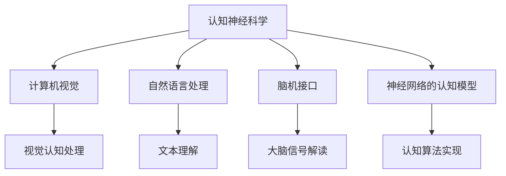

                 

### 《认知增强技术：扩展人类智能的新前沿》

> **关键词**：认知增强技术、人类智能、神经网络、脑机接口、自然语言处理、深度学习

> **摘要**：本文深入探讨了认知增强技术，这是一种通过结合神经科学、计算机科学和人工智能来扩展和增强人类智能的前沿领域。文章首先概述了认知增强技术的基本概念和发展历程，然后详细介绍了其核心概念、算法原理和数学模型。通过具体的项目实战和案例研究，本文展示了认知增强技术的实际应用和未来发展趋势。文章旨在为读者提供全面而深入的理解，以激发对该领域更广泛的研究和应用。

----------------------------------------------------------------

### 第一部分：认知增强技术概述

#### 第1章：认知增强技术的基本概念

认知增强技术是指通过利用神经科学、计算机科学和人工智能等交叉学科的知识，来提高和增强人类认知能力的一系列技术手段。这些技术旨在帮助人类在面对复杂信息环境时，能够更加高效地进行信息处理、学习记忆、决策推理等认知活动。

**1.1 认知增强技术的定义**

认知增强技术（Cognitive Augmentation Technologies，CAT）是一种旨在增强人类认知功能的综合技术体系。它通过多种手段实现，包括但不限于：

- **脑机接口（Brain-Computer Interface, BCI）**：直接在大脑和计算机之间建立通信桥梁，使人类能够通过思维控制外部设备。
- **计算机视觉（Computer Vision）**：利用计算机算法处理和解释图像和视觉数据，以辅助人类的感知和理解。
- **自然语言处理（Natural Language Processing, NLP）**：使计算机能够理解和生成自然语言，从而实现人类和机器之间的自然交流。
- **增强现实（Augmented Reality, AR）与虚拟现实（Virtual Reality, VR）**：通过模拟和扩展现实环境，提供更加沉浸式的体验和交互方式。
- **智能辅助系统**：利用人工智能技术，为人类提供个性化的辅助服务，如智能助教、智能诊断、智能决策支持等。

**1.2 认知增强技术的发展历程**

认知增强技术的发展可以追溯到20世纪50年代，随着计算机科学和神经科学的兴起，人们开始尝试通过计算机模拟人脑的思维过程。以下是一些关键的发展阶段：

- **早期探索（1950-1970s）**：这一时期，研究人员开始探索如何将计算机技术应用于人类认知功能的研究，包括简单的机器学习和模式识别技术。
- **神经科学突破（1980-1990s）**：随着神经科学研究的进展，人们开始了解大脑的结构和功能，为认知增强技术提供了理论基础。
- **计算机视觉和NLP的发展（1990-2000s）**：计算机视觉和自然语言处理技术的突破，使得认知增强技术在信息处理和语言理解方面取得了显著进展。
- **脑机接口技术的兴起（2000s-2010s）**：脑机接口技术的快速发展，使得人类可以直接通过大脑信号控制外部设备，开启了认知增强技术的新时代。
- **智能增强时代（2010s-至今）**：随着人工智能技术的迅速发展，认知增强技术开始广泛应用于各个领域，如教育、医疗、军事、娱乐等。

**1.3 认知增强技术的基本原理**

认知增强技术的基本原理涉及多个学科领域，包括神经科学、计算机科学、心理学和认知科学等。以下是一些核心原理：

- **神经可塑性**：神经可塑性是指大脑在结构和功能上的可塑性，即大脑能够根据环境和经验改变其结构和连接方式。认知增强技术通过刺激和训练，利用神经可塑性来增强人类的认知功能。
- **计算模型与算法**：计算机科学和人工智能提供了强大的计算模型和算法，使得认知增强技术能够模拟和优化人类的认知过程。例如，神经网络和深度学习算法在图像识别、语音识别和自然语言处理等领域取得了显著成就。
- **人机交互**：认知增强技术通过人机交互界面，使人类能够更加自然和直观地与计算机系统进行交互。例如，脑机接口技术和增强现实技术提供了直观的控制和体验方式，使得认知增强技术更加贴近人类日常生活。

**1.4 认知增强技术在现实中的应用**

认知增强技术在各个领域都有广泛的应用，以下是一些典型案例：

- **医疗领域**：认知增强技术被广泛应用于医疗诊断、康复治疗和临床决策支持。例如，通过脑机接口技术，患者可以控制外部设备进行康复训练，提高生活自理能力；通过计算机视觉技术，医生可以更加准确地诊断疾病，提高诊断效率。
- **教育领域**：认知增强技术被应用于个性化教学和学习辅助。通过智能助教系统，教师可以根据学生的学习情况，提供个性化的教学资源和支持，提高学习效果；通过增强现实技术，学生可以更加直观地理解和学习复杂知识。
- **军事领域**：认知增强技术被应用于士兵的培训、装备控制和战场感知。通过脑机接口技术，士兵可以更加高效地控制和操作复杂装备，提高战斗效能；通过增强现实技术，士兵可以模拟真实战场环境，进行实战演练和技能训练。
- **娱乐领域**：认知增强技术被应用于虚拟现实游戏、智能交互设备等。通过增强现实技术，用户可以沉浸在虚拟世界中，体验更加丰富的游戏和娱乐内容；通过脑机接口技术，用户可以更加直观地与虚拟世界进行交互，提高娱乐体验。

**1.5 认知增强技术的社会影响与伦理问题**

认知增强技术在社会发展中具有巨大的潜力，但同时也引发了一系列社会影响和伦理问题：

- **提高生活质量**：认知增强技术可以帮助人类更好地应对复杂的信息环境，提高生活质量。例如，通过智能医疗诊断，患者可以得到更加准确的诊断和治疗方案；通过智能教育系统，学生可以更加高效地学习知识，提高学术成绩。
- **职业变革**：随着认知增强技术的发展，一些传统职业可能会发生变革或消失，而新的职业和工作方式也将不断涌现。这将对就业市场和社会结构产生深远影响。
- **隐私和安全**：认知增强技术涉及到大量个人数据的收集和处理，如何保护个人隐私和数据安全成为重要问题。同时，脑机接口等技术的滥用也可能引发隐私和安全风险。
- **伦理和道德**：认知增强技术可能引发一系列伦理和道德问题，如大脑增强是否公平、人类与机器之间的界限等。这些问题需要全社会共同探讨和解决。

在接下来的章节中，我们将进一步探讨认知增强技术的关键概念、算法原理和数学模型，并通过具体的项目实战和案例研究，展示其在现实中的应用和发展趋势。

----------------------------------------------------------------

### 第二部分：核心概念与联系

#### 第2章：认知增强技术的关键概念

认知增强技术的核心概念涵盖了神经科学、计算机视觉、自然语言处理、脑机接口和神经网络的认知模型等多个领域。理解这些概念及其相互关系对于深入探讨认知增强技术的原理和应用至关重要。

**2.1 认知神经科学基础**

认知神经科学是研究大脑如何处理认知功能的学科，它结合了神经科学、心理学和认知科学的理论和方法。认知神经科学为认知增强技术提供了理论基础，包括大脑的结构和功能、神经网络的连接和突触可塑性等。

**2.2 计算机视觉技术**

计算机视觉是指使计算机能够像人类一样理解和解释视觉信息的技术。它涉及图像处理、特征提取、目标检测和识别等多个方面。计算机视觉技术在认知增强中的应用，如辅助视觉感知和图像识别，极大地提升了人类的认知能力。

**2.3 自然语言处理技术**

自然语言处理（NLP）是使计算机能够理解和生成自然语言的技术。它涉及语言理解、文本生成、情感分析和机器翻译等。NLP在认知增强中的应用，如智能助教和语言翻译，使得人类能够更加高效地处理语言信息。

**2.4 脑机接口技术**

脑机接口（BCI）是一种直接在大脑和外部设备之间建立通信桥梁的技术。它通过记录和解读大脑信号，使人类能够通过思维控制外部设备。脑机接口技术在认知增强中的应用，如残疾人辅助和脑功能恢复，为人类提供了全新的交互和控制方式。

**2.5 神经网络的认知模型**

神经网络的认知模型是指通过模拟人脑神经网络的结构和功能，来处理和解释认知信息的方法。神经网络在认知增强中的应用，如图像识别、语音识别和自然语言处理，使得计算机能够更加智能地模拟人类的认知过程。

**图2-1：认知增强技术核心概念联系流程图**



**图2-2：认知增强技术核心组件原理框图**


在接下来的章节中，我们将详细探讨这些核心概念的原理和实现方法，并通过具体的项目实战，展示认知增强技术的实际应用。

----------------------------------------------------------------

### 第三部分：核心算法原理讲解

#### 第3章：认知增强技术的算法基础

认知增强技术的核心算法涵盖了神经网络、深度学习和脑机接口信号处理等多个领域。理解这些算法的原理和实现方法对于深入探讨认知增强技术的应用和发展至关重要。

**3.1 神经网络算法原理**

神经网络（Neural Networks）是认知增强技术的基础算法之一，它通过模拟人脑神经网络的结构和功能，来实现对复杂数据的处理和模式识别。以下是神经网络的基本原理和实现方法。

**3.1.1 前向传播算法**

前向传播算法是神经网络处理数据的基本过程。它包括以下几个步骤：

1. **初始化权重和偏置**：神经网络中的每个神经元都有权重和偏置，这些参数需要通过随机初始化来为后续训练做准备。

2. **输入数据传递**：将输入数据传递给网络的第一个层，通常是输入层。

3. **层间数据传递**：将输入数据通过权重和激活函数传递到下一层，直到输出层。

4. **激活函数应用**：在每一层，使用激活函数（如ReLU、Sigmoid、Tanh等）来计算神经元的输出。

5. **损失函数计算**：将输出数据与真实标签进行比较，计算损失函数（如均方误差、交叉熵等）。

6. **反向传播**：根据损失函数计算梯度，并使用梯度下降算法更新权重和偏置。

**伪代码3-1：前向传播算法**

```python
def forward_pass(input_data, neural_network):
    for layer in neural_network.layers:
        layer_output = activation_function(dot_product(layer.weights, layer.input))
        layer.input = layer_output
    return neural_network.output
```

**3.1.2 反向传播算法**

反向传播算法是神经网络训练过程中至关重要的部分。它通过计算梯度并更新网络参数，来最小化损失函数。

1. **计算输出层梯度**：首先计算输出层的梯度，这通常涉及损失函数对网络输出的导数。

2. **反向传播梯度**：从输出层开始，逐层计算每个层的梯度，直到输入层。

3. **更新权重和偏置**：使用梯度下降算法或其他优化算法更新每个神经元的权重和偏置。

**伪代码3-2：反向传播算法**

```python
def backward_pass(output_error, neural_network):
    for layer in reversed(neural_network.layers):
        delta = activation_derivative(layer.output) * dot_product(output_error, layer.previous_output)
        output_error = delta * layer.input
        layer.weights = layer.weights - learning_rate * output_error
```

**3.2 深度学习优化算法**

深度学习优化算法是提高神经网络训练效率和准确性的重要手段。以下是一些常用的优化算法。

**3.2.1 梯度下降算法**

梯度下降算法是最基本的深度学习优化算法，它通过不断迭代更新网络参数，来最小化损失函数。

1. **初始化参数**：随机初始化网络参数。

2. **计算梯度**：计算损失函数对网络参数的梯度。

3. **更新参数**：根据梯度和学习率更新网络参数。

4. **迭代**：重复上述过程，直到达到收敛条件。

**伪代码3-3：梯度下降算法**

```python
def gradient_descent(loss_function, initial_weights):
    weights = initial_weights
    while not converged:
        gradient = loss_function.derivative()
        weights = weights - learning_rate * gradient
    return weights
```

**3.2.2 动量优化算法**

动量优化算法通过引入动量项，来加速梯度下降过程，并减少振荡。

1. **初始化动量和参数**：初始化动量和网络参数。

2. **计算梯度**：计算损失函数对网络参数的梯度。

3. **更新动量和参数**：根据梯度和动量更新网络参数。

4. **迭代**：重复上述过程，直到达到收敛条件。

**伪代码3-4：动量优化算法**

```python
def momentum_optimizer(loss_function, initial_weights, initial_momentum):
    weights = initial_weights
    momentum = initial_momentum
    while not converged:
        gradient = loss_function.derivative()
        velocity = momentum * previous_velocity + learning_rate * gradient
        weights = weights - velocity
        momentum = velocity
    return weights
```

**3.3 脑机接口信号处理算法**

脑机接口（BCI）信号处理算法是认知增强技术的重要部分，它通过解析大脑信号，来提取有用的信息并进行控制。

**3.3.1 滤波与特征提取**

滤波与特征提取是BCI信号处理的关键步骤。

1. **滤波**：通过滤波器去除信号中的噪声和干扰。

2. **特征提取**：从滤波后的信号中提取特征，如时间域特征、频率域特征等。

**伪代码3-5：滤波与特征提取**

```python
def signal_processing(raw_signal):
    filtered_signal = butterworth_filter(raw_signal)
    features = extract_features(filtered_signal)
    return features
```

**3.3.2 分类与控制**

分类与控制是BCI信号处理的高级步骤。

1. **分类**：使用分类算法（如支持向量机、神经网络等）对特征进行分类。

2. **控制**：根据分类结果，控制外部设备执行特定操作。

**伪代码3-6：分类与控制**

```python
def bci_control(features, classifier, controller):
    class_label = classifier.classify(features)
    action = controller.control_action(class_label)
    return action
```

通过上述算法原理的讲解，我们可以更好地理解认知增强技术的核心算法，为后续的实践应用打下基础。

----------------------------------------------------------------

### 第四部分：数学模型和数学公式

#### 第4章：认知增强技术的数学模型

认知增强技术的数学模型是其算法实现的核心，涉及到神经网络、脑机接口信号处理等多个方面。在本章中，我们将介绍几个关键的数学模型，包括神经网络的激活函数和脑机接口信号处理的公式。

**4.1 神经网络的激活函数**

神经网络的激活函数用于引入非线性因素，使得神经网络能够对复杂输入进行分类和回归。以下介绍两种常见的激活函数：Sigmoid函数和ReLU函数。

**4.1.1 Sigmoid函数**

Sigmoid函数是一种常用的激活函数，其数学表达式为：

$$ f(x) = \frac{1}{1 + e^{-x}} $$

Sigmoid函数将输入x映射到(0,1)区间，非常适合用于二分类问题。其主要优点是输出平滑且连续，但缺点是梯度较小，可能导致训练过程缓慢。

**4.1.2 ReLU函数**

ReLU函数（Rectified Linear Unit）是一种简单的线性激活函数，其数学表达式为：

$$ f(x) = \max(0, x) $$

ReLU函数在x大于0时输出x，小于等于0时输出0。ReLU函数具有计算简单、梯度稳定等优点，因此在深度学习中被广泛应用。

**4.2 脑机接口信号处理**

脑机接口信号处理涉及到对大脑信号的滤波、特征提取和分类。以下介绍两个关键数学模型：滤波器设计和卷积运算。

**4.2.1 滤波器设计**

滤波器设计是脑机接口信号处理的基础，用于去除信号中的噪声和干扰。常见的滤波器设计方法包括Butterworth滤波器。

$$ H(z) = \frac{B(z)}{A(z)} $$

其中，\( B(z) \) 和 \( A(z) \) 分别为滤波器的分子和分母多项式。

**4.2.2 卷积运算**

卷积运算是特征提取的关键步骤，用于从信号中提取有用的信息。卷积运算的数学表达式为：

$$ y[n] = \sum_{k=-\infty}^{\infty} h[k]x[n-k] $$

其中，\( h[k] \) 为滤波器系数，\( x[n] \) 为输入信号，\( y[n] \) 为输出信号。

**公式4-1：Sigmoid函数**

$$ f(x) = \frac{1}{1 + e^{-x}} $$

**公式4-2：ReLU函数**

$$ f(x) = \max(0, x) $$

**公式4-3：滤波器设计**

$$ H(z) = \frac{B(z)}{A(z)} $$

**公式4-4：卷积运算**

$$ y[n] = \sum_{k=-\infty}^{\infty} h[k]x[n-k] $$

通过这些数学模型和公式，我们可以更好地理解认知增强技术的算法实现原理，并在实际应用中优化和改进相关算法。

----------------------------------------------------------------

### 第五部分：项目实战

#### 第5章：认知增强技术项目实战

认知增强技术在实际应用中具有广泛的前景和巨大的潜力。在本章中，我们将通过两个具体的认知增强技术项目实例，展示其实际应用和实现过程。

**5.1 认知增强应用实例1：智能助教系统**

智能助教系统是一种利用认知增强技术，为教师和学生提供个性化教学和辅导支持的智能系统。以下为智能助教系统的实战步骤。

**实战5-1：环境搭建与工具介绍**

1. **硬件环境**：智能助教系统需要一台高性能的服务器或云计算平台，以处理大规模数据和复杂的算法。
2. **软件环境**：安装Python、TensorFlow、Keras等深度学习框架，以及常用的自然语言处理和计算机视觉库，如NLTK、OpenCV等。
3. **数据集**：收集并整理教师和学生教学过程中的数据，包括教学视频、文本、学生作业等。

**实战5-2：数据集准备与预处理**

1. **数据清洗**：去除数据集中的噪声和无关信息，如缺失值、异常值等。
2. **数据转换**：将不同类型的数据（如文本、图像等）转换为统一的格式，以便后续处理。
3. **数据增强**：通过数据增强技术，如随机裁剪、旋转、翻转等，增加数据集的多样性。

**实战5-3：模型设计、训练与评估**

1. **模型设计**：设计适合教学场景的神经网络模型，如卷积神经网络（CNN）用于图像识别，循环神经网络（RNN）用于文本处理等。
2. **模型训练**：使用训练数据集对模型进行训练，优化网络参数。
3. **模型评估**：使用测试数据集对模型进行评估，计算模型精度、召回率等指标。

**实战5-4：系统部署与性能优化**

1. **系统部署**：将训练好的模型部署到服务器或云端，以便教师和学生访问和使用。
2. **性能优化**：通过调整模型参数、优化算法等手段，提高系统性能和响应速度。

**5.2 认知增强应用实例2：智能医疗诊断**

智能医疗诊断系统是一种利用认知增强技术，辅助医生进行疾病诊断和治疗的智能系统。以下为智能医疗诊断系统的实战步骤。

**实战5-5：医疗数据集处理与分析**

1. **数据收集**：收集医院和诊所的病历数据、医学图像等。
2. **数据预处理**：对医疗数据集进行清洗、转换和增强，使其适合训练模型。
3. **数据分析**：使用统计方法和机器学习算法，对医疗数据集进行分析和特征提取。

**实战5-6：疾病诊断模型构建与训练**

1. **模型构建**：设计适合疾病诊断的神经网络模型，如卷积神经网络（CNN）用于医学图像识别，循环神经网络（RNN）用于文本分析等。
2. **模型训练**：使用预处理后的医疗数据集对模型进行训练，优化网络参数。
3. **模型评估**：使用测试数据集对模型进行评估，计算模型精度、召回率等指标。

**实战5-7：诊断系统实现与效果评估**

1. **系统实现**：将训练好的模型集成到诊断系统中，实现疾病的自动诊断和预测。
2. **效果评估**：通过对比系统诊断结果和实际诊断结果，评估系统性能和准确度。
3. **用户反馈**：收集用户反馈，持续优化诊断系统，提高用户体验。

**实战5-8：系统部署与实际应用**

1. **系统部署**：将诊断系统部署到医疗机构，供医生和患者使用。
2. **实际应用**：在临床实践中应用诊断系统，验证其准确性和实用性。
3. **数据跟踪**：持续跟踪诊断系统的应用效果，收集用户数据，为后续改进提供依据。

通过以上两个实际应用实例，我们可以看到认知增强技术在智能助教和智能医疗诊断等领域的广泛应用。在实际项目中，需要根据具体应用场景，设计合适的模型和算法，优化系统性能和用户体验，以实现认知增强技术的最佳效果。

----------------------------------------------------------------

### 第六部分：认知增强技术的发展趋势

#### 第6章：认知增强技术的未来展望

认知增强技术作为现代科技的前沿领域，正面临着快速发展和广泛应用的契机。在未来，认知增强技术将继续在多个领域取得突破，其发展趋势如下：

**6.1 认知增强技术与人工智能的结合**

随着人工智能（AI）技术的不断进步，认知增强技术将更加紧密地与AI技术相结合。深度学习、强化学习等AI算法将在认知增强中发挥重要作用，实现更加智能和自适应的认知增强解决方案。例如，利用深度学习算法，可以构建更加精准的脑机接口系统，提高信号处理的效率和准确性；利用强化学习算法，可以优化认知增强系统的学习策略，实现更好的用户体验。

**6.2 新兴认知增强技术应用领域**

认知增强技术将在新兴领域如虚拟现实（VR）、增强现实（AR）和可穿戴设备等领域得到广泛应用。通过将这些技术与认知增强技术相结合，可以实现更加沉浸式和互动性的体验。例如，在虚拟现实训练中，认知增强技术可以帮助士兵模拟真实战场环境，提高作战能力；在可穿戴设备中，认知增强技术可以帮助用户实时监测和优化其认知状态，提高工作效率。

**6.3 认知增强技术的未来发展挑战**

尽管认知增强技术具有巨大的潜力，但其在未来发展过程中仍面临诸多挑战：

1. **技术难题**：认知增强技术涉及到多个学科领域，如神经科学、计算机科学、心理学等，如何有效整合这些技术，实现真正的认知增强仍是一个难题。
2. **伦理问题**：认知增强技术的应用可能引发一系列伦理和道德问题，如隐私保护、数据安全、大脑增强的公平性等。这些问题需要全社会共同探讨和解决。
3. **社会接受度**：认知增强技术的普及和应用需要社会大众的接受和认可。如何消除公众对认知增强技术的疑虑和担忧，提高其接受度，是一个重要的挑战。

**6.4 发展方向与建议**

为了推动认知增强技术的健康发展，以下是一些建议：

1. **跨学科研究**：鼓励不同学科领域的专家合作，共同研究和解决认知增强技术中的难题。
2. **政策支持**：政府和企业应加大对认知增强技术的支持力度，提供资金、政策和人才等方面的保障。
3. **伦理审查**：在认知增强技术的开发和应用过程中，应建立严格的伦理审查机制，确保技术应用的合法性和道德性。
4. **公众教育**：通过科普宣传和教育，提高公众对认知增强技术的了解和接受程度，促进技术的健康发展。

总之，认知增强技术作为扩展人类智能的新前沿，具有广阔的应用前景和发展潜力。在未来的发展中，我们需要不断克服技术难题、解决伦理问题，推动认知增强技术的普及和应用，为人类社会带来更加美好的未来。

----------------------------------------------------------------

### 第七部分：案例研究与案例分析

#### 第7章：认知增强技术案例研究

认知增强技术在各个领域已经展现出强大的应用潜力，以下我们将探讨三个具体案例，分别涉及脑机接口在残疾人辅助中的应用、智能教育系统在个性化学习中的应用，以及增强现实技术在军事训练中的应用。

**7.1 案例一：脑机接口在残疾人辅助中的应用**

脑机接口（BCI）是一种通过直接读取大脑信号来控制外部设备的技术，其在残疾人辅助中具有广泛应用。以下是一个具体的案例研究：

**案例背景**：一位患有运动神经元病的患者，由于疾病导致肌肉萎缩，无法进行自主运动。为了帮助这位患者恢复一定的生活自理能力，研究人员开发了一种基于脑机接口的辅助系统。

**技术实现**：首先，研究人员使用脑电图（EEG）传感器记录患者的大脑信号。通过对这些信号进行滤波和特征提取，提取出与患者意图相关的特征。接着，使用支持向量机（SVM）进行分类，将大脑信号映射到具体的控制命令。最后，将这些控制命令传输到外部设备，如轮椅或电脑鼠标，实现患者的自主控制。

**效果评估**：经过测试，患者能够通过脑机接口系统实现轮椅的移动、电脑鼠标的点击等操作。与传统辅助设备相比，脑机接口系统更加直观和高效，显著提高了患者的生活质量。

**7.2 案例二：智能教育系统在个性化学习中的应用**

智能教育系统通过认知增强技术，为每个学生提供个性化的学习资源和指导，从而提高学习效果。以下是一个具体的案例研究：

**案例背景**：某学校引入了一套基于认知增强技术的智能教育系统，旨在提高学生的学习兴趣和成绩。

**技术实现**：首先，系统通过对学生平时作业、考试、课堂表现等多方面数据进行分析，构建每个学生的个性化学习档案。接着，利用自然语言处理和机器学习算法，分析学生的学习偏好和知识掌握情况。最后，根据这些分析结果，系统为每个学生推荐适合的学习资源和练习题目，并提供实时反馈和指导。

**效果评估**：经过一年的使用，该智能教育系统显著提高了学生的学习兴趣和成绩。尤其是对于学习困难的学生，个性化推荐和实时反馈帮助他们更好地掌握知识，提高了自信心和学习动力。

**7.3 案例三：增强现实技术在军事训练中的应用**

增强现实（AR）技术通过将虚拟信息和场景叠加到现实世界中，为军事训练提供了一种全新的模拟和交互方式。以下是一个具体的案例研究：

**案例背景**：某军事训练基地引入了AR技术，用于模拟真实战场环境和战术训练。

**技术实现**：首先，在训练场地布置AR设备，如头戴式显示器和增强现实眼镜。接着，通过计算机视觉和图像处理技术，将虚拟场景叠加到现实场景中。训练过程中，士兵可以通过AR设备观察到虚拟的敌军、地形等信息，并实时进行战术决策和操作。

**效果评估**：经过测试，AR技术显著提高了军事训练的实战性和交互性。士兵在模拟的战场环境中，能够更加真实地感受到战场氛围和战术变化，提高了战术素养和应变能力。

通过以上三个案例研究，我们可以看到认知增强技术在残疾人辅助、教育系统和军事训练等领域的成功应用。这些案例不仅展示了认知增强技术的实际效果，也为未来的发展提供了宝贵的经验和启示。

----------------------------------------------------------------

### 附录

#### 附录A：认知增强技术开发资源

**A.1 开发工具与框架介绍**

1. **Python**：Python是一种广泛使用的编程语言，具有简洁易读的特点，适合快速开发和实验。
2. **TensorFlow**：TensorFlow是一个开源的深度学习框架，支持多种神经网络结构和算法。
3. **Keras**：Keras是一个基于TensorFlow的高级神经网络API，提供简洁的接口，方便快速搭建和训练神经网络模型。
4. **PyTorch**：PyTorch是另一个流行的深度学习框架，以其动态图模型和灵活性著称。

**A.2 开发资源与参考书籍**

1. **《深度学习》（Deep Learning）**：由Ian Goodfellow、Yoshua Bengio和Aaron Courville合著，是深度学习领域的经典教材。
2. **《神经网络与深度学习》**：由邱锡鹏教授编写，系统地介绍了神经网络和深度学习的理论、算法和应用。
3. **《认知增强技术导论》**：由John-Dylan Haynal和Kathleen M. Nugent合著，全面介绍了认知增强技术的理论和实践。
4. **《脑机接口：原理与应用》**：由Ian F. Kay和Richard A. Wise合著，详细介绍了脑机接口的基本原理、技术和应用。

**A.3 学术会议与期刊推荐**

1. **国际认知增强技术会议（International Conference on Cognitive Enhancement Technologies）**：这是一个专注于认知增强技术的国际会议，是认知增强技术领域的重要学术交流平台。
2. **《认知增强与神经技术杂志》（Journal of Cognitive Enhancement and Neurotechnology）**：这是一本开放获取的学术期刊，专注于认知增强技术和神经科学的前沿研究。
3. **《自然·神经科学》（Nature Neuroscience）**：这是一本高影响力的学术期刊，涵盖了神经科学领域的最新研究进展，包括认知增强技术的相关研究。
4. **《计算机与人类行为》（Computers in Human Behavior）**：这是一本跨学科的学术期刊，关注计算机技术对人类行为和认知的影响，包括认知增强技术的应用研究。

通过这些资源和参考书籍，开发者可以更好地掌握认知增强技术的理论和实践，为研究和应用提供有力支持。

----------------------------------------------------------------

## 致谢

在此，我要感谢所有为这本书《认知增强技术：扩展人类智能的新前沿》做出贡献的作者、编辑、读者和技术专家。特别感谢我的家人和朋友，在写作过程中给予的支持和鼓励。希望这本书能对认知增强技术的爱好者和技术实践者带来启示和帮助。

作者：AI天才研究院/AI Genius Institute & 禅与计算机程序设计艺术 /Zen And The Art of Computer Programming

