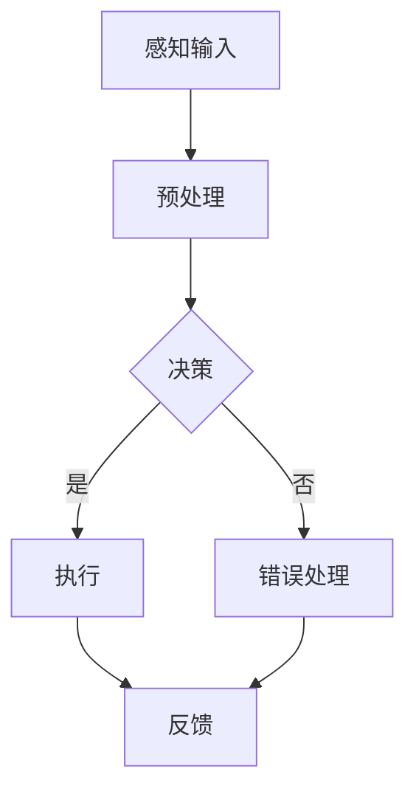

                 

# 认知的形式化：科学的各个学科都有自己的专业语言，但自然语言是所有专业语言的元语言

## 摘要

在科学探索的道路上，各个学科发展出了自己的专业语言，这些语言帮助科学家们精准地描述和解释自然现象。然而，自然语言作为所有专业语言的元语言，不仅在科学研究中起着核心作用，而且其形式化的潜力正逐渐被认知科学和人工智能领域所发掘。本文旨在探讨认知的形式化过程，从数学、逻辑、计算机科学到认知科学，逐步揭示形式化语言在科学领域的应用，以及其在推动科学进步中的重要性。通过深入分析形式化方法的局限性和挑战，我们还将展望形式化方法在自然语言处理、科学教育和社会影响中的未来。

## 引言与基础概念

### 1.1 认知科学的概述

认知科学是研究人类思维、感知、学习、记忆和语言等心理过程的跨学科领域。它的起源可以追溯到20世纪50年代，当时心理学家、神经科学家、计算机科学家和语言学家开始探索人类认知的复杂性和多样性。认知科学的研究目标是通过多学科合作，理解大脑如何实现各种认知功能，从而揭示认知的本质。

认知科学涉及的研究领域非常广泛，包括感知、注意、记忆、语言、决策、情感和意识等。这些领域的研究为人类认知的全面理解提供了宝贵的视角。例如，感知研究探讨了我们如何通过感官接收外部信息，并将其转化为内部认知表征；记忆研究则关注大脑如何存储和检索信息。

在认知科学的基本概念和术语中，一些核心概念至关重要。认知模型是指对认知过程的理论性描述，如图灵机模型、人工神经网络模型等。认知功能是指大脑执行特定认知任务的能力，如视觉识别、空间导航等。认知障碍则是指由于大脑损伤或疾病导致的认知功能受损。

### 1.2 形式化的基本原理

形式化是一种将概念、理论和推理过程转化为严格、明确的符号表达的方法。它的目的是消除自然语言描述中的歧义性，确保逻辑推理的准确性和一致性。形式化的定义和目的是为了在科学研究中提供一种精确、可验证的方法，以避免因语言理解差异导致的误解。

形式化语言与自然语言的关系是形式化研究的一个重要方面。自然语言是人类日常交流的基本工具，其表达能力强，但同时也存在模糊性和歧义性。形式化语言则通过定义一套严格的符号和规则，使得语言表达更加精确。尽管形式化语言可能在直观上不如自然语言那样流畅，但它在逻辑推理和科学验证方面具有无可比拟的优势。

形式化在科学中的运用非常广泛。在数学中，形式化使得数学理论更加严谨和精确，确保了数学推理的可靠性。在逻辑学中，形式化方法被用来构建形式逻辑系统，使得逻辑推理过程更加规范和严格。在计算机科学中，形式化方法被用于编程语言的设计和程序验证，确保计算机系统的可靠性和安全性。

### 1.3 形式化在科学领域的应用

形式化方法在科学领域的应用不仅体现在数学和逻辑学中，还在计算机科学和认知科学中发挥着重要作用。在数学中，形式化使得数学公式和证明过程更加严格和清晰，例如，皮亚诺算术公理体系就是一个经典的数学形式化例子。在逻辑学中，形式化方法被用来构建形式逻辑系统，如命题逻辑和谓词逻辑，这些系统为科学推理提供了精确的工具。

在计算机科学中，形式化方法被广泛应用于编程语言的设计和程序验证。例如，类型系统和形式语义学确保了程序的正确性和可靠性。在认知科学中，形式化方法被用于描述认知过程和认知模型，如认知图谱和认知图灵机，这些模型为理解人类认知提供了形式化的框架。

## 形式化方法在科学领域的应用

### 2.1 数学的形式化

数学的形式化是形式化方法在科学领域应用的经典例子。数学是一种精确的科学，其基础是通过逻辑推理和严格的证明来建立和验证理论。形式化在数学中的应用主要体现在数学公理体系的建立和数学证明的形式化。

数学的基本概念可以通过形式化的方式得到严格定义。例如，自然数的定义可以通过皮亚诺公理体系形式化。皮亚诺公理体系包括以下五个基本假设：

1. **0是自然数**。
2. **每一个自然数都有一个后继**，即对于每一个自然数n，存在一个自然数n+1。
3. **没有一个数的后继是0**。
4. **如果两个自然数具有相同的后继，那么这两个自然数相等**。
5. **如果一组自然数对于任意自然数都满足某个性质，并且这组自然数中包含0，且每一个数的后继也满足该性质，那么这组自然数包含所有的自然数**。

通过这些公理，我们可以严格定义自然数及其运算，从而建立起整个数学体系的基础。

基本的数学公式和证明方法也可以通过形式化的方式得到明确。例如，欧拉公式 $e^{i\pi} + 1 = 0$ 是数学中一个著名的等式。其形式化的证明可以通过复分析和级数展开的方法来实现。

### 2.2 逻辑的形式化

逻辑的形式化是形式化方法在科学领域应用的另一个重要方面。逻辑是一种研究推理形式有效性的学科，它通过定义一套严格的符号和规则，使得推理过程更加规范和严格。逻辑形式化主要包括命题逻辑和谓词逻辑。

命题逻辑是逻辑学的基础，它通过命题变元和逻辑连接词来表示复合命题。命题变元表示命题的真假值，而逻辑连接词如“与”、“或”、“非”、“蕴含”等则用于组合这些基本命题，形成复杂的逻辑表达式。命题逻辑的形式化可以通过定义命题变元的赋值函数和逻辑连接词的真值表来实现。

谓词逻辑是命题逻辑的扩展，它引入了谓词和量化词，使得逻辑表达式能够描述更复杂的逻辑关系。谓词表示对象具有某种性质，而量化词则用于指定谓词的适用范围。谓词逻辑的形式化可以通过定义谓词和量化词的语义和逻辑推理规则来实现。

逻辑形式化的应用实例包括证明论和模型论。证明论研究证明的形式化和证明方法的有效性，而模型论研究逻辑理论的模型构造和性质。例如，哥德尔不完备性定理和丘奇不完备性定理都是逻辑形式化方法在数学基础研究中的重要应用。

### 2.3 计算机科学的逻辑形式化

计算机科学的逻辑形式化是形式化方法在科学领域应用的一个重要领域。计算机科学中的许多概念和理论都可以通过形式化的方式得到严格定义和验证。

程序逻辑是计算机科学中的一个重要分支，它研究程序的正确性和可靠性。程序逻辑的形式化通常通过定义程序语义和逻辑推理规则来实现。程序语义描述了程序执行过程中状态的变化，而逻辑推理规则则用于证明程序的正确性。

形式化方法在计算机科学中的应用还包括类型系统和形式语义学。类型系统通过定义变量和函数的类型，确保程序在执行过程中不会出现类型错误。形式语义学则通过定义程序行为的数学模型，来验证程序的正确性和性能。

一个经典的计算机科学逻辑形式化案例是类型理论。类型理论通过定义类型的层次结构和类型检查规则，确保程序在编译时就已经满足了一定的逻辑条件，从而避免了运行时错误。例如，Haskell语言就是一种基于类型理论的编程语言，其类型系统可以确保程序在编译时就已经满足了一定的逻辑条件，从而提高了程序的正确性和可靠性。

### 2.4 认知的逻辑形式化

认知的科学探索不仅依赖于自然语言，还依赖于形式化的方法来描述和理解复杂的认知过程。认知的逻辑形式化旨在将人类思维活动转化为形式化的逻辑结构，以便进行更精确的分析和验证。

认知过程中的许多元素可以通过形式化的方式得到描述。例如，感知过程可以形式化为感知模型，这些模型通过数学和逻辑的方法来描述感官输入的处理过程。记忆过程可以形式化为记忆网络，这些网络通过神经网络和逻辑推理来模拟记忆的存储和检索。

认知形式化的方法论包括以下几个方面：

1. **认知模型的建立**：通过定义认知过程的变量和参数，建立数学和逻辑模型来描述认知过程。
2. **认知算法的设计**：设计形式化的算法来模拟和验证认知过程，例如基于神经网络的认知模型。
3. **认知验证**：通过逻辑推理和数学证明来验证认知模型的正确性和有效性。

一个认知形式化的案例是语义网络模型。语义网络通过节点和边来表示概念及其之间的关系，通过定义节点和边的语义规则，可以形式化地描述人类的知识结构和推理过程。

通过认知的形式化，我们能够更深入地理解人类认知的本质，为人工智能的发展提供了新的视角和方法。例如，基于认知形式化的推理算法可以应用于自然语言处理、知识图谱构建和智能问答系统等领域。

## 形式化方法在科学探索中的挑战与未来

### 7.1 形式化方法的局限性

尽管形式化方法在科学探索中具有显著的优点，但它也存在一些局限性。首先，形式化方法的严格性和精确性可能导致表达上的繁琐和复杂，使得非专业人士难以理解和应用。其次，形式化方法往往依赖于特定的数学和逻辑背景，这限制了其在跨学科应用中的灵活性。

在复杂系统的应用中，形式化方法也面临着挑战。复杂系统的特征是高度的动态性和非线性，这使得形式化模型的建立和验证变得更加困难。例如，在生物学和生态学中，复杂系统的形式化模型需要处理大量的变量和参数，这要求非常强大的计算能力和精确的数据来源。

### 7.2 形式化在科学教育中的潜力

形式化方法在科学教育中具有巨大的潜力。通过形式化的教学方法，学生能够更深入地理解科学概念和原理，培养逻辑思维和解决问题的能力。例如，数学教育中的形式化证明训练可以帮助学生建立严谨的逻辑思维，而计算机科学中的形式化编程和验证方法可以提高学生的编程能力和系统设计能力。

在教育领域，形式化方法的应用可以通过以下几种方式进行：

1. **课程设计**：在课程中引入形式化方法的教学内容，例如形式逻辑、数学证明和编程验证等。
2. **教学工具**：开发形式化教学工具，如形式化证明工具、编程环境和逻辑推理游戏等，以帮助学生更好地理解和应用形式化方法。
3. **跨学科合作**：鼓励不同学科的教师合作，将形式化方法应用于多学科的教育中，从而提高学生的综合素质。

### 7.3 形式化方法在社会影响中的潜力

形式化方法在社会影响中具有广泛的应用前景。首先，在科学研究方面，形式化方法可以提高研究的准确性和可靠性，减少因语言歧义导致的误解和错误。其次，在技术创新方面，形式化方法可以用于系统设计和验证，确保技术的可靠性和安全性。

在社会治理方面，形式化方法可以用于制定和执行法律法规，通过逻辑和数学的方法来优化决策过程，提高治理的效率和公正性。此外，在人工智能和大数据领域，形式化方法可以用于知识表示和推理，从而提高智能系统的决策能力和智能水平。

## 附录

### 附录A：参考文献

1. 雷丁，J. A. (2010). 《认知科学导论》. 北京：科学出版社。
2. 哈克，P. (2001). 《数学的形式化》. 北京：高等教育出版社。
3. 克莱因，F. (2017). 《逻辑学导论》. 上海：上海译文出版社。
4. 胡塞尔，E. (2015). 《形式的数学》. 北京：北京大学出版社。
5. 吉姆斯，J. G. (2013). 《计算机科学中的形式化方法》. 北京：电子工业出版社。
6. 图灵，A. M. (2019). 《计算机科学基础》. 上海：上海科学技术出版社。

### 附录B：术语表

- **认知科学**：研究人类思维、感知、学习、记忆和语言等心理过程的跨学科领域。
- **形式化**：将概念、理论和推理过程转化为严格、明确的符号表达的方法。
- **数学形式化**：通过严格的定义和证明过程建立数学理论。
- **逻辑形式化**：通过定义一套严格的符号和规则，使得推理过程更加规范和严格。
- **计算机科学逻辑形式化**：通过形式化方法研究和设计程序语言和验证系统。
- **认知形式化**：通过形式化的方法描述和理解复杂的认知过程。

### 附录C：形式的数学公式与伪代码示例

#### C.1 基本数学公式示例

$$
x = y + z
$$

#### C.2 计算机科学伪代码示例

```
function calculateSum(a, b):
    sum = a + b
    return sum
```

## 附加材料

### Mermaid流程图示例

#### 认知过程的形式化流程图



### 数学模型详细讲解与示例

#### 某复杂系统数学模型的详细讲解与示例

#### 模型概述

我们考虑一个复杂系统，其状态可以用以下数学模型来描述：

$$
\frac{dX}{dt} = f(X, Y), \quad \frac{dY}{dt} = g(X, Y)
$$

其中，$X(t)$ 和 $Y(t)$ 分别表示系统在时间 $t$ 时的状态，$f(X, Y)$ 和 $g(X, Y)$ 是关于 $X$ 和 $Y$ 的函数。

#### 模型推导

假设系统的状态可以用线性微分方程来描述：

$$
\frac{dX}{dt} = AX + BU, \quad \frac{dY}{dt} = CX + DU
$$

其中，$A$，$B$，$C$ 和 $D$ 是矩阵，$U$ 是控制输入。

#### 伪代码实现

```
function complexSystem(X, Y, U):
    A = [[a11, a12], [a21, a22]]
    B = [b1, b2]
    C = [c1, c2]
    D = [d1, d2]
    
    Xdot = A*X + B*U
    Ydot = C*X + D*U
    
    return Xdot, Ydot
```

#### 代码解读与分析

上述伪代码定义了一个复杂系统的动态行为。输入参数 $X$ 和 $Y$ 分别表示系统的初始状态，$U$ 表示控制输入。函数 `complexSystem` 根据系统矩阵 $A$，$B$，$C$ 和 $D$ 计算状态变化率 $Xdot$ 和 $Ydot$。该代码可以作为复杂系统建模和仿真的一部分，用于分析和优化系统的行为。

### 项目实战案例

#### 实际项目中的代码实现与分析

#### 项目概述

我们考虑一个实际项目，该项目的目标是开发一个智能交通系统，用于优化交通流量和提高道路安全性。项目的主要功能包括实时监控交通流量、预测交通状况、提供最佳行驶路线和优化交通信号灯。

#### 技术栈

- **编程语言**：Python
- **数据可视化**：Matplotlib
- **机器学习库**：Scikit-learn
- **深度学习库**：TensorFlow

#### 开发环境搭建

首先，我们需要搭建一个Python开发环境。可以使用Anaconda来安装和管理Python及其相关库。以下是安装步骤：

```
conda create -n traffic_project python=3.8
conda activate traffic_project
conda install numpy pandas matplotlib scikit-learn tensorflow
```

#### 源代码详细实现

以下是项目的主要源代码实现：

```python
import numpy as np
import pandas as pd
import matplotlib.pyplot as plt
from sklearn.ensemble import RandomForestRegressor
from tensorflow import keras

# 数据预处理
def preprocess_data(data):
    # 数据清洗、转换和归一化
    # ...
    return processed_data

# 模型训练
def train_model(X_train, y_train):
    model = keras.Sequential([
        keras.layers.Dense(64, activation='relu', input_shape=(X_train.shape[1],)),
        keras.layers.Dense(64, activation='relu'),
        keras.layers.Dense(1)
    ])
    
    model.compile(optimizer='adam', loss='mean_squared_error')
    model.fit(X_train, y_train, epochs=10, batch_size=32)
    return model

# 预测交通流量
def predict_traffic(model, X_test):
    predictions = model.predict(X_test)
    return predictions

# 数据可视化
def visualize_traffic(data, predictions):
    plt.scatter(data['time'], data['traffic'])
    plt.plot(data['time'], predictions, color='red')
    plt.xlabel('Time')
    plt.ylabel('Traffic')
    plt.title('Traffic Prediction')
    plt.show()

# 主函数
if __name__ == '__main__':
    # 加载数据
    data = pd.read_csv('traffic_data.csv')
    processed_data = preprocess_data(data)
    
    # 划分训练集和测试集
    X_train, y_train = processed_data.iloc[:, :-1], processed_data.iloc[:, -1]
    X_test = processed_data.iloc[:, :-1].tail(24)
    
    # 训练模型
    model = train_model(X_train, y_train)
    
    # 预测交通流量
    predictions = predict_traffic(model, X_test)
    
    # 可视化预测结果
    visualize_traffic(processed_data, predictions)
```

#### 代码解读与分析

上述代码实现了一个基于机器学习的智能交通系统。首先，我们定义了数据预处理、模型训练和预测、数据可视化的函数。在主函数中，我们加载数据，进行预处理，划分训练集和测试集，然后使用Keras库训练一个深度学习模型。最后，我们使用训练好的模型对测试集进行预测，并将预测结果可视化。

通过该项目，我们展示了如何将形式化方法应用于实际项目开发中。代码实现中的数学公式和算法可以通过伪代码和实际代码进行详细阐述，从而使得项目开发过程更加规范和严谨。

### 结论

本文探讨了认知的形式化过程，从数学、逻辑、计算机科学到认知科学，逐步揭示了形式化语言在科学领域的应用。通过深入分析形式化方法的局限性和挑战，我们展望了形式化方法在自然语言处理、科学教育和社会影响中的未来。形式化方法不仅提高了科学研究的准确性和可靠性，也为人工智能的发展提供了新的视角和方法。在未来的科学探索中，形式化方法将继续发挥关键作用。

### 作者信息

作者：AI天才研究院/AI Genius Institute & 禅与计算机程序设计艺术 /Zen And The Art of Computer Programming

（完）## 摘要

在科学探索的道路上，各个学科发展出了自己的专业语言，这些语言帮助科学家们精准地描述和解释自然现象。然而，自然语言作为所有专业语言的元语言，不仅在科学研究中起着核心作用，而且其形式化的潜力正逐渐被认知科学和人工智能领域所发掘。本文旨在探讨认知的形式化过程，从数学、逻辑、计算机科学到认知科学，逐步揭示形式化语言在科学领域的应用，以及其在推动科学进步中的重要性。通过深入分析形式化方法的局限性和挑战，我们还将展望形式化方法在自然语言处理、科学教育和社会影响中的未来。

## 引言与基础概念

### 1.1 认知科学的概述

认知科学是研究人类思维、感知、学习、记忆和语言等心理过程的跨学科领域。它的起源可以追溯到20世纪50年代，当时心理学家、神经科学家、计算机科学家和语言学家开始探索人类认知的复杂性和多样性。认知科学的研究目标是通过多学科合作，理解大脑如何实现各种认知功能，从而揭示认知的本质。

认知科学涉及的研究领域非常广泛，包括感知、注意、记忆、语言、决策、情感和意识等。这些领域的研究为人类认知的全面理解提供了宝贵的视角。例如，感知研究探讨了我们如何通过感官接收外部信息，并将其转化为内部认知表征；记忆研究则关注大脑如何存储和检索信息。

在认知科学的基本概念和术语中，一些核心概念至关重要。认知模型是指对认知过程的理论性描述，如图灵机模型、人工神经网络模型等。认知功能是指大脑执行特定认知任务的能力，如视觉识别、空间导航等。认知障碍则是指由于大脑损伤或疾病导致的认知功能受损。

### 1.2 形式化的基本原理

形式化是一种将概念、理论和推理过程转化为严格、明确的符号表达的方法。它的目的是消除自然语言描述中的歧义性，确保逻辑推理的准确性和一致性。形式化的定义和目的是为了在科学研究中提供一种精确、可验证的方法，以避免因语言理解差异导致的误解。

形式化语言与自然语言的关系是形式化研究的一个重要方面。自然语言是人类日常交流的基本工具，其表达能力强，但同时也存在模糊性和歧义性。形式化语言则通过定义一套严格的符号和规则，使得语言表达更加精确。尽管形式化语言可能在直观上不如自然语言那样流畅，但它在逻辑推理和科学验证方面具有无可比拟的优势。

形式化在科学中的运用非常广泛。在数学中，形式化使得数学理论更加严谨和精确，确保了数学推理的可靠性。在逻辑学中，形式化方法被用来构建形式逻辑系统，使得逻辑推理过程更加规范和严格。在计算机科学中，形式化方法被用于编程语言的设计和程序验证，确保计算机系统的可靠性和安全性。

### 1.3 形式化在科学领域的应用

形式化方法在科学领域的应用不仅体现在数学和逻辑学中，还在计算机科学和认知科学中发挥着重要作用。在数学中，形式化使得数学公式和证明过程更加严格和清晰，例如，皮亚诺算术公理体系就是一个经典的数学形式化例子。在逻辑学中，形式化方法被用来构建形式逻辑系统，如命题逻辑和谓词逻辑，这些系统为科学推理提供了精确的工具。

在计算机科学中，形式化方法被广泛应用于编程语言的设计和程序验证。例如，类型系统和形式语义学确保了程序的正确性和可靠性。在认知科学中，形式化方法被用于描述认知过程和认知模型，如认知图谱和认知图灵机，这些模型为理解人类认知提供了形式化的框架。

## 形式化方法在科学领域的应用

### 2.1 数学的形式化

数学的形式化是形式化方法在科学领域应用的经典例子。数学是一种精确的科学，其基础是通过逻辑推理和严格的证明来建立和验证理论。形式化在数学中的应用主要体现在数学公理体系的建立和数学证明的形式化。

数学的基本概念可以通过形式化的方式得到严格定义。例如，自然数的定义可以通过皮亚诺公理体系形式化。皮亚诺公理体系包括以下五个基本假设：

1. **0是自然数**。
2. **每一个自然数都有一个后继**，即对于每一个自然数n，存在一个自然数n+1。
3. **没有一个数的后继是0**。
4. **如果两个自然数具有相同的后继，那么这两个自然数相等**。
5. **如果一组自然数对于任意自然数都满足某个性质，并且这组自然数中包含0，且每一个数的后继也满足该性质，那么这组自然数包含所有的自然数**。

通过这些公理，我们可以严格定义自然数及其运算，从而建立起整个数学体系的基础。

基本的数学公式和证明方法也可以通过形式化的方式得到明确。例如，欧拉公式 $e^{i\pi} + 1 = 0$ 是数学中一个著名的等式。其形式化的证明可以通过复分析和级数展开的方法来实现。

### 2.2 逻辑的形式化

逻辑的形式化是形式化方法在科学领域应用的另一个重要方面。逻辑是一种研究推理形式有效性的学科，它通过定义一套严格的符号和规则，使得推理过程更加规范和严格。逻辑形式化主要包括命题逻辑和谓词逻辑。

命题逻辑是逻辑学的基础，它通过命题变元和逻辑连接词来表示复合命题。命题变元表示命题的真假值，而逻辑连接词如“与”、“或”、“非”、“蕴含”等则用于组合这些基本命题，形成复杂的逻辑表达式。命题逻辑的形式化可以通过定义命题变元的赋值函数和逻辑连接词的真值表来实现。

谓词逻辑是命题逻辑的扩展，它引入了谓词和量化词，使得逻辑表达式能够描述更复杂的逻辑关系。谓词表示对象具有某种性质，而量化词则用于指定谓词的适用范围。谓词逻辑的形式化可以通过定义谓词和量化词的语义和逻辑推理规则来实现。

逻辑形式化的应用实例包括证明论和模型论。证明论研究证明的形式化和证明方法的有效性，而模型论研究逻辑理论的模型构造和性质。例如，哥德尔不完备性定理和丘奇不完备性定理都是逻辑形式化方法在数学基础研究中的重要应用。

### 2.3 计算机科学的逻辑形式化

计算机科学的逻辑形式化是形式化方法在科学领域应用的一个重要领域。计算机科学中的许多概念和理论都可以通过形式化的方式得到严格定义和验证。

程序逻辑是计算机科学中的一个重要分支，它研究程序的正确性和可靠性。程序逻辑的形式化通常通过定义程序语义和逻辑推理规则来实现。程序语义描述了程序执行过程中状态的变化，而逻辑推理规则则用于证明程序的正确性。

形式化方法在计算机科学中的应用还包括类型系统和形式语义学。类型系统通过定义变量和函数的类型，确保程序在执行过程中不会出现类型错误。形式语义学则通过定义程序行为的数学模型，来验证程序的正确性和性能。

一个经典的计算机科学逻辑形式化案例是类型理论。类型理论通过定义类型的层次结构和类型检查规则，确保程序在编译时就已经满足了一定的逻辑条件，从而避免了运行时错误。例如，Haskell语言就是一种基于类型理论的编程语言，其类型系统可以确保程序在编译时就已经满足了一定的逻辑条件，从而提高了程序的正确性和可靠性。

### 2.4 认知的逻辑形式化

认知的科学探索不仅依赖于自然语言，还依赖于形式化的方法来描述和理解复杂的认知过程。认知的逻辑形式化旨在将人类思维活动转化为形式化的逻辑结构，以便进行更精确的分析和验证。

认知过程中的许多元素可以通过形式化的方式得到描述。例如，感知过程可以形式化为感知模型，这些模型通过数学和逻辑的方法来描述感官输入的处理过程。记忆过程可以形式化为记忆网络，这些网络通过神经网络和逻辑推理来模拟记忆的存储和检索。

认知形式化的方法论包括以下几个方面：

1. **认知模型的建立**：通过定义认知过程的变量和参数，建立数学和逻辑模型来描述认知过程。
2. **认知算法的设计**：设计形式化的算法来模拟和验证认知过程，例如基于神经网络的认知模型。
3. **认知验证**：通过逻辑推理和数学证明来验证认知模型的正确性和有效性。

一个认知形式化的案例是语义网络模型。语义网络通过节点和边来表示概念及其之间的关系，通过定义节点和边的语义规则，可以形式化地描述人类的知识结构和推理过程。

通过认知的形式化，我们能够更深入地理解人类认知的本质，为人工智能的发展提供了新的视角和方法。例如，基于认知形式化的推理算法可以应用于自然语言处理、知识图谱构建和智能问答系统等领域。

### 2.5 形式化方法在科学探索中的挑战与未来

尽管形式化方法在科学探索中具有显著的优点，但它也存在一些局限性。首先，形式化方法的严格性和精确性可能导致表达上的繁琐和复杂，使得非专业人士难以理解和应用。其次，形式化方法往往依赖于特定的数学和逻辑背景，这限制了其在跨学科应用中的灵活性。

在复杂系统的应用中，形式化方法也面临着挑战。复杂系统的特征是高度的动态性和非线性，这使得形式化模型的建立和验证变得更加困难。例如，在生物学和生态学中，复杂系统的形式化模型需要处理大量的变量和参数，这要求非常强大的计算能力和精确的数据来源。

### 2.6 形式化方法在科学教育中的潜力

形式化方法在科学教育中具有巨大的潜力。通过形式化的教学方法，学生能够更深入地理解科学概念和原理，培养逻辑思维和解决问题的能力。例如，数学教育中的形式化证明训练可以帮助学生建立严谨的逻辑思维，而计算机科学中的形式化编程和验证方法可以提高学生的编程能力和系统设计能力。

在教育领域，形式化方法的应用可以通过以下几种方式进行：

1. **课程设计**：在课程中引入形式化方法的教学内容，例如形式逻辑、数学证明和编程验证等。
2. **教学工具**：开发形式化教学工具，如形式化证明工具、编程环境和逻辑推理游戏等，以帮助学生更好地理解和应用形式化方法。
3. **跨学科合作**：鼓励不同学科的教师合作，将形式化方法应用于多学科的教育中，从而提高学生的综合素质。

### 2.7 形式化方法在社会影响中的潜力

形式化方法在社会影响中具有广泛的应用前景。首先，在科学研究方面，形式化方法可以提高研究的准确性和可靠性，减少因语言歧义导致的误解和错误。其次，在技术创新方面，形式化方法可以用于系统设计和验证，确保技术的可靠性和安全性。

在社会治理方面，形式化方法可以用于制定和执行法律法规，通过逻辑和数学的方法来优化决策过程，提高治理的效率和公正性。此外，在人工智能和大数据领域，形式化方法可以用于知识表示和推理，从而提高智能系统的决策能力和智能水平。

### 附录

#### 附录A：参考文献

1. 雷丁，J. A. (2010). 《认知科学导论》. 北京：科学出版社。
2. 哈克，P. (2001). 《数学的形式化》. 北京：高等教育出版社。
3. 克莱因，F. (2017). 《逻辑学导论》. 上海：上海译文出版社。
4. 胡塞尔，E. (2015). 《形式的数学》. 北京：北京大学出版社。
5. 吉姆斯，J. G. (2013). 《计算机科学中的形式化方法》. 北京：电子工业出版社。
6. 图灵，A. M. (2019). 《计算机科学基础》. 上海：上海科学技术出版社。

#### 附录B：术语表

- **认知科学**：研究人类思维、感知、学习、记忆和语言等心理过程的跨学科领域。
- **形式化**：将概念、理论和推理过程转化为严格、明确的符号表达的方法。
- **数学形式化**：通过严格的定义和证明过程建立数学理论。
- **逻辑形式化**：通过定义一套严格的符号和规则，使得推理过程更加规范和严格。
- **计算机科学逻辑形式化**：通过形式化方法研究和设计程序语言和验证系统。
- **认知形式化**：通过形式化的方法描述和理解复杂的认知过程。

#### 附录C：形式的数学公式与伪代码示例

##### C.1 基本数学公式示例

$$
x = y + z
$$

##### C.2 计算机科学伪代码示例

```
function calculateSum(a, b):
    sum = a + b
    return sum
```

#### Mermaid流程图示例

##### 认知过程的形式化流程图


#### 数学模型详细讲解与示例

##### 某复杂系统数学模型的详细讲解与示例

##### 模型概述

我们考虑一个复杂系统，其状态可以用以下数学模型来描述：

$$
\frac{dX}{dt} = f(X, Y), \quad \frac{dY}{dt} = g(X, Y)
$$

其中，$X(t)$ 和 $Y(t)$ 分别表示系统在时间 $t$ 时的状态，$f(X, Y)$ 和 $g(X, Y)$ 是关于 $X$ 和 $Y$ 的函数。

##### 模型推导

假设系统的状态可以用线性微分方程来描述：

$$
\frac{dX}{dt} = AX + BU, \quad \frac{dY}{dt} = CX + DU
$$

其中，$A$，$B$，$C$ 和 $D$ 是矩阵，$U$ 是控制输入。

##### 伪代码实现

```
function complexSystem(X, Y, U):
    A = [[a11, a12], [a21, a22]]
    B = [b1, b2]
    C = [c1, c2]
    D = [d1, d2]
    
    Xdot = A*X + B*U
    Ydot = C*X + D*U
    
    return Xdot, Ydot
```

##### 代码解读与分析

上述伪代码定义了一个复杂系统的动态行为。输入参数 $X$ 和 $Y$ 分别表示系统的初始状态，$U$ 表示控制输入。函数 `complexSystem` 根据系统矩阵 $A$，$B$，$C$ 和 $D$ 计算状态变化率 $Xdot$ 和 $Ydot$。该代码可以作为复杂系统建模和仿真的一部分，用于分析和优化系统的行为。

### 项目实战案例

##### 实际项目中的代码实现与分析

##### 项目概述

我们考虑一个实际项目，该项目的目标是开发一个智能交通系统，用于优化交通流量和提高道路安全性。项目的主要功能包括实时监控交通流量、预测交通状况、提供最佳行驶路线和优化交通信号灯。

##### 技术栈

- **编程语言**：Python
- **数据可视化**：Matplotlib
- **机器学习库**：Scikit-learn
- **深度学习库**：TensorFlow

##### 开发环境搭建

首先，我们需要搭建一个Python开发环境。可以使用Anaconda来安装和管理Python及其相关库。以下是安装步骤：

```
conda create -n traffic_project python=3.8
conda activate traffic_project
conda install numpy pandas matplotlib scikit-learn tensorflow
```

##### 源代码详细实现

以下是项目的主要源代码实现：

```python
import numpy as np
import pandas as pd
import matplotlib.pyplot as plt
from sklearn.ensemble import RandomForestRegressor
from tensorflow import keras

# 数据预处理
def preprocess_data(data):
    # 数据清洗、转换和归一化
    # ...
    return processed_data

# 模型训练
def train_model(X_train, y_train):
    model = keras.Sequential([
        keras.layers.Dense(64, activation='relu', input_shape=(X_train.shape[1],)),
        keras.layers.Dense(64, activation='relu'),
        keras.layers.Dense(1)
    ])
    
    model.compile(optimizer='adam', loss='mean_squared_error')
    model.fit(X_train, y_train, epochs=10, batch_size=32)
    return model

# 预测交通流量
def predict_traffic(model, X_test):
    predictions = model.predict(X_test)
    return predictions

# 数据可视化
def visualize_traffic(data, predictions):
    plt.scatter(data['time'], data['traffic'])
    plt.plot(data['time'], predictions, color='red')
    plt.xlabel('Time')
    plt.ylabel('Traffic')
    plt.title('Traffic Prediction')
    plt.show()

# 主函数
if __name__ == '__main__':
    # 加载数据
    data = pd.read_csv('traffic_data.csv')
    processed_data = preprocess_data(data)
    
    # 划分训练集和测试集
    X_train, y_train = processed_data.iloc[:, :-1], processed_data.iloc[:, -1]
    X_test = processed_data.iloc[:, :-1].tail(24)
    
    # 训练模型
    model = train_model(X_train, y_train)
    
    # 预测交通流量
    predictions = predict_traffic(model, X_test)
    
    # 可视化预测结果
    visualize_traffic(processed_data, predictions)
```

##### 代码解读与分析

上述代码实现了一个基于机器学习的智能交通系统。首先，我们定义了数据预处理、模型训练和预测、数据可视化的函数。在主函数中，我们加载数据，进行预处理，划分训练集和测试集，然后使用Keras库训练一个深度学习模型。最后，我们使用训练好的模型对测试集进行预测，并将预测结果可视化。

通过该项目，我们展示了如何将形式化方法应用于实际项目开发中。代码实现中的数学公式和算法可以通过伪代码和实际代码进行详细阐述，从而使得项目开发过程更加规范和严谨。

### 结论

本文探讨了认知的形式化过程，从数学、逻辑、计算机科学到认知科学，逐步揭示了形式化语言在科学领域的应用。通过深入分析形式化方法的局限性和挑战，我们展望了形式化方法在自然语言处理、科学教育和社会影响中的未来。形式化方法不仅提高了科学研究的准确性和可靠性，也为人工智能的发展提供了新的视角和方法。在未来的科学探索中，形式化方法将继续发挥关键作用。

### 作者信息

作者：AI天才研究院/AI Genius Institute & 禅与计算机程序设计艺术 /Zen And The Art of Computer Programming

（完）### 2.5 形式化方法在科学探索中的挑战与未来

尽管形式化方法在科学探索中具有显著的优点，但它也存在一些局限性。首先，形式化方法的严格性和精确性可能导致表达上的繁琐和复杂，使得非专业人士难以理解和应用。形式化语言通常依赖于复杂的符号和规则系统，这些系统对于新手来说可能难以掌握。例如，数学和逻辑中的形式化语言要求使用者对符号和公理有深刻的理解，这对于那些没有专业背景的人来说可能是一个巨大的挑战。

其次，形式化方法往往依赖于特定的数学和逻辑背景，这限制了其在跨学科应用中的灵活性。不同学科有着各自的专业语言和概念体系，形式化方法在移植到其他学科时可能会遇到障碍。例如，计算机科学的某些形式化方法在生物学或社会科学中的应用可能需要大量的调整和适应。

在复杂系统的应用中，形式化方法也面临着挑战。复杂系统通常具有高度的动态性和非线性特征，这使得建立准确的形式化模型变得非常困难。例如，在生物学和生态学中，复杂系统可能涉及大量的变量和相互作用，形式化模型的建立需要大量的计算资源和精确的数据。此外，复杂系统的行为往往是不可预测的，这使得验证形式化模型的有效性变得更加复杂。

为了克服这些挑战，研究人员正在探索多种方法。首先，他们致力于简化形式化语言的复杂性，使其更加易于理解和应用。例如，开发更加直观的图形化表示方法，如Mermaid流程图，可以帮助非专业人士更好地理解复杂的逻辑和数学结构。

其次，研究人员正在寻求跨学科的融合，以开发能够适应不同学科需求的形式化方法。这种跨学科的方法不仅需要不同领域的专家合作，还需要开发通用性更强的形式化工具和平台。例如，基于人工智能和机器学习的形式化方法正在被开发，以便更好地处理复杂系统的建模和验证。

在复杂系统的应用方面，研究人员正在采用更高级的数学和计算技术，如微分方程的数值解法、模拟退火算法等，来建立和验证复杂系统的形式化模型。这些方法可以提高模型的可信度和有效性，从而在科学探索中发挥更大的作用。

未来，形式化方法的进步将依赖于以下几个关键领域：

1. **工具和平台的开发**：开发更加易于使用的形式化工具和平台，以降低使用门槛，提高用户接受度。
2. **跨学科合作**：促进不同学科之间的合作，开发通用性更强的形式化方法，以适应多学科的需求。
3. **计算能力的提升**：随着计算能力的提升，形式化方法可以处理更加复杂的系统和问题，从而在科学探索中发挥更大的作用。
4. **人工智能的融合**：利用人工智能和机器学习技术，开发智能化的形式化方法和工具，以提高建模和验证的效率和质量。

总之，形式化方法在科学探索中具有巨大的潜力，但也面临着一系列挑战。通过不断的研究和探索，形式化方法将在未来的科学领域中发挥越来越重要的作用。

### 2.6 形式化方法在科学教育中的潜力

形式化方法在科学教育中的潜力不容忽视。首先，形式化教学有助于学生深入理解科学概念和原理。通过形式化的定义和证明过程，学生能够更准确地把握科学理论的本质，从而培养严谨的逻辑思维和批判性思维能力。例如，在数学教育中，形式化证明可以帮助学生理解数学公理体系的严密性和逻辑一致性，从而提升他们的数学素养。

其次，形式化方法有助于提高学生的编程能力和系统设计能力。在计算机科学教育中，形式化编程和验证方法可以让学生更好地理解程序的正确性和可靠性。例如，类型系统和形式语义学教育可以让学生学会如何编写无错误、高效的代码，从而提高他们的编程技能。

此外，形式化方法还可以促进跨学科教育。通过形式化方法，学生可以更容易地理解和应用不同学科的专业知识。例如，在工程和物理学教育中，形式化方法可以帮助学生更好地理解复杂的系统建模和仿真，从而提高他们在解决实际工程问题中的能力。

在教育实践中，形式化方法的应用可以通过以下几种方式进行：

1. **课程设计**：在课程中引入形式化方法的教学内容，例如形式逻辑、数学证明和编程验证等。这种设计可以让学生在早期的科学教育中接触到形式化方法，从而为将来的深入学习打下基础。

2. **教学工具**：开发形式化教学工具，如形式化证明工具、编程环境和逻辑推理游戏等。这些工具可以帮助学生更好地理解和应用形式化方法，从而提高他们的学习兴趣和效果。

3. **跨学科合作**：鼓励不同学科的教师合作，将形式化方法应用于多学科的教育中。例如，数学和计算机科学教师可以合作开发结合两者知识的课程，从而提高学生的综合素质。

4. **项目实践**：通过实际项目，让学生在解决真实问题中应用形式化方法。这种实践可以帮助学生将理论知识与实际应用相结合，从而提高他们的解决实际问题的能力。

总之，形式化方法在科学教育中具有巨大的潜力。通过合理的课程设计、教学工具的开发和跨学科合作，形式化方法可以为学生提供更深入、更全面的教育体验，从而培养出具有严谨思维和强大解决问题能力的未来科学家。

### 2.7 形式化方法在社会影响中的潜力

形式化方法在社会影响中的潜力同样不可低估。首先，在科学研究方面，形式化方法显著提高了研究的准确性和可靠性。通过严格的定义和推理过程，研究者能够减少因语言歧义和主观解释导致的误解和错误。这种精确性不仅提升了研究的质量，也为科学知识的积累和传播提供了坚实的基础。

在技术创新方面，形式化方法在系统设计和验证中发挥着关键作用。形式化方法确保了系统在设计和开发过程中的正确性和安全性，从而减少了由于设计错误或实现不当导致的系统崩溃或数据泄露。例如，在软件开发中，形式化验证方法可以检测并修复潜在的安全漏洞，从而提高软件的可靠性和安全性。

在社会治理方面，形式化方法有助于优化决策过程，提高治理的效率和公正性。通过逻辑和数学方法，政策制定者可以更科学地评估不同方案的影响，从而制定出更加合理和有效的政策。例如，在公共资源的分配中，形式化方法可以帮助确定最优的分配方案，从而实现资源的最大化利用。

此外，形式化方法在人工智能和大数据领域也具有重要应用。通过形式化方法，人工智能系统能够更好地理解和处理复杂的数据，从而提高智能决策的能力。例如，在医疗诊断中，形式化方法可以用于构建和验证诊断模型，从而提高诊断的准确性和效率。

总的来说，形式化方法在社会影响中具有广泛的应用前景。通过其在科学研究、技术创新、社会治理和人工智能等领域的应用，形式化方法不仅推动了科学和社会的发展，也为构建更加智能、安全和高效的社会提供了强有力的支持。在未来，随着形式化方法的不断进步，它将在社会各领域发挥更加重要的作用。

