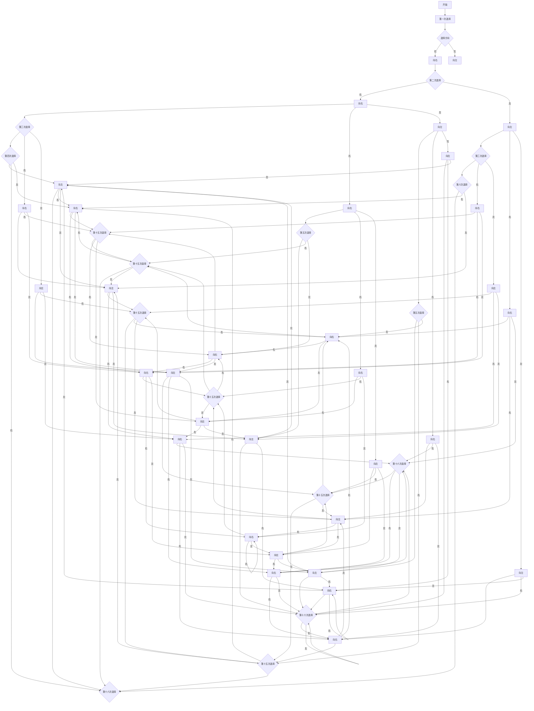
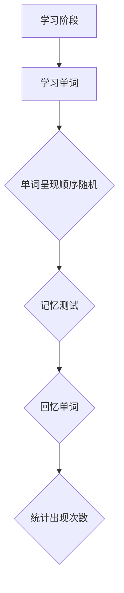
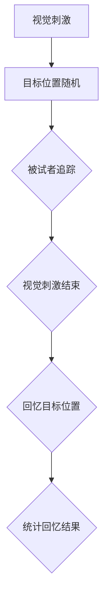

                 

## 《认知过程中的混沌与简洁》

> **关键词**：认知科学，混沌理论，简洁性，认知效率，认知设计，案例分析，应用实践

> **摘要**：本文深入探讨了认知过程中混沌与简洁的交互作用。通过阐述认知科学与混沌理论的联系，分析认知过程中的混沌现象以及简洁性原理，本文进一步探讨了简洁性在认知设计中的应用，并通过具体案例展示了混沌与简洁在现实生活中的互动机制。文章最后对未来研究的趋势和面临的挑战进行了展望。

### **第一部分：认知科学基础**

#### **第1章：认知科学与混沌理论**

##### **1.1 认知科学与混沌理论概述**

###### **1.1.1 认知科学的定义与研究领域**

认知科学是研究人类认知过程的跨学科领域，涉及心理学、神经科学、计算机科学、哲学等多个学科。其研究目的是理解人类思维、感知、记忆、学习、语言和问题解决等认知活动的机制和原理。

认知科学的主要研究领域包括：

1. **感知与知觉**：研究人类如何通过感官接收和处理外界信息。
2. **记忆与学习**：研究人类记忆的形成、存储和提取过程，以及学习的过程和机制。
3. **思维与推理**：研究人类如何进行逻辑思考、问题解决和决策。
4. **语言与沟通**：研究人类语言的结构、发展和应用。
5. **情绪与动机**：研究情绪对认知过程的影响以及人类动机的机制。

###### **1.1.2 混沌理论的基本概念**

混沌理论是研究复杂系统中确定性过程的非线性动力学特性的学科。混沌现象具有以下几个基本特征：

1. **敏感性依赖初始条件**：系统对初始条件的变化非常敏感，即使微小的变化也可能导致长期的巨大差异。
2. **长期行为的不可预测性**：尽管系统的演化是确定的，但由于初始条件的敏感性，长期行为往往是不可预测的。
3. **复杂的行为模式**：混沌系统通常表现出复杂的、不可预测的行为模式，包括周期性、随机性和分岔等现象。
4. **确定性**：混沌现象是确定性的，即系统的演化完全由其内部机制和初始条件决定。

###### **1.1.3 认知科学与混沌理论的联系**

认知科学与混沌理论之间存在密切的联系。首先，认知过程中的许多现象都表现出混沌的特性，如思维的跳跃性、记忆中的模式识别和注意力的波动等。这些现象的不可预测性和复杂性使得认知科学的研究面临巨大的挑战。

其次，混沌理论为认知科学提供了一种新的研究视角和工具。通过引入混沌理论的概念和模型，认知科学家可以更好地理解认知过程中的非线性动力学特性，以及这些特性如何影响认知行为和决策。

例如，在记忆研究中，混沌模型可以用来模拟记忆中的模式识别和遗忘过程。在注意力研究中，混沌模型可以用来解释注意力的波动和分配现象。

总之，认知科学与混沌理论的结合为理解人类认知过程提供了新的思路和方法。通过进一步的研究，我们可以更好地揭示认知过程中的混沌现象，并探索简洁性原理如何在认知设计中发挥作用。

##### **1.2 认知过程中的混沌现象**

###### **1.2.1 混沌与非线性动力学**

混沌现象通常出现在非线性动力系统中，这些系统遵循确定的数学规则，但由于初始条件的敏感性，它们可以表现出复杂和不可预测的行为。

非线性动力学的基本原理包括：

1. **非线性**：非线性关系描述了系统状态变量之间的复杂相互作用，这种相互作用可以导致系统行为的多样性和不可预测性。
2. **稳定性与不稳定性**：非线性系统的稳定性取决于其动态行为，系统可以处于稳定状态或产生分岔和混沌现象。
3. **吸引子和分岔**：系统可以收敛到一个稳定的吸引子，也可以通过分岔过程进入新的动态状态。

在认知过程中，非线性动力学的影响体现在：

1. **认知过程的不稳定性**：认知活动如记忆、思维和决策等往往受到多种因素的干扰，这些干扰可以导致认知状态的波动和变化。
2. **认知过程的复杂性**：认知系统通常包含多个反馈回路和相互作用，这些相互作用可以导致认知状态的多样性和复杂性。
3. **认知过程的不确定性**：由于初始条件的敏感性，认知过程的长期行为往往具有不确定性，这使得认知过程难以预测和控制。

###### **1.2.2 认知过程中的随机性与复杂性**

认知过程不仅受到非线性动力学的影响，还涉及到随机性和复杂性。这些特性使得认知过程更加复杂和多样化。

1. **随机性**：认知过程中的随机性体现在以下几个方面：
    - **感知随机性**：外界信息的感知是随机的，由于感官的局限性和噪声的影响，感知到的信息可能与实际存在的信息存在差异。
    - **记忆随机性**：记忆过程中，信息的存储和提取受到随机因素的影响，可能导致记忆的模糊性和错误。
    - **决策随机性**：决策过程中，个体可能受到随机因素（如情绪、环境等）的影响，从而导致决策的不确定性和多样性。

2. **复杂性**：认知过程中的复杂性体现在以下几个方面：
    - **信息处理的复杂性**：认知系统需要处理大量来自外界的复杂信息，并进行有效的处理和整合。
    - **认知模型的复杂性**：认知模型通常包含多个层次和维度，这些层次和维度之间的相互作用使得认知过程更加复杂。
    - **认知系统的适应性**：认知系统具有高度的适应性，能够根据环境和任务的需求调整其行为，这种适应性增加了认知过程的复杂性。

随机性和复杂性在认知过程中具有重要作用：

1. **提高适应性**：随机性和复杂性使得认知系统能够适应多变的环境和任务需求，从而提高其生存和发展的能力。
2. **增强多样性**：随机性和复杂性导致认知过程中的多样性，这有助于个体在面对复杂情境时产生多样化的解决方案。
3. **增加认知负担**：随机性和复杂性也会增加认知负担，导致认知效率下降，但在某些情况下，适当的复杂性和随机性可以提高认知效率和创造力。

###### **1.2.3 混沌在认知心理学中的应用**

混沌理论在认知心理学中有着广泛的应用，可以帮助解释许多认知现象。

1. **记忆中的混沌现象**：
    - **模式识别**：混沌模型可以用来模拟人类记忆中的模式识别过程。例如，人类可以通过感知到的声音模式识别出不同的乐谱，这个过程受到初始条件的敏感性影响。
    - **遗忘曲线**：混沌模型可以用来模拟记忆的遗忘过程。遗忘曲线表现出复杂的行为，如分岔和周期性，这与混沌现象的特征相似。

2. **注意力中的混沌现象**：
    - **注意力分配**：混沌模型可以用来解释注意力在不同任务和情境中的分配过程。注意力分配是高度敏感的，即使微小的变化也可能导致注意力的重新分配。
    - **注意力波动**：混沌模型可以用来描述注意力的波动现象。注意力在短时间内表现出随机性和不可预测性，但长期来看，呈现出一定的模式。

3. **决策中的混沌现象**：
    - **决策不确定性**：混沌模型可以用来解释决策过程中的不确定性。个体在决策时可能受到多种因素的影响，这些因素之间的相互作用可能导致决策的不确定性和复杂性。
    - **决策多样性**：混沌模型可以用来解释个体在面对相同情境时产生多样化决策的原因。决策过程中的随机性和复杂性导致个体产生不同的解决方案。

总之，混沌理论为认知心理学提供了新的研究工具和理论框架，可以帮助我们更好地理解认知过程中的复杂性和不确定性。

##### **1.3 认知过程中的时间序列分析**

###### **1.3.1 时间序列分析的基本原理**

时间序列分析是研究数据在时间维度上的变化规律和趋势的方法。它广泛应用于各个领域，如经济学、金融学、气象学、生物学等。

时间序列分析的基本原理包括：

1. **数据表示**：时间序列数据可以用一个有序的数值序列表示，每个数值代表在特定时间点的观测值。
2. **趋势分析**：通过分析时间序列的趋势，可以识别出数据的变化规律和趋势。趋势可以是上升、下降或平稳。
3. **季节性分析**：季节性分析用于识别时间序列中的周期性变化。这些周期性变化通常与季节性因素（如节假日、季节变化等）相关。
4. **波动性分析**：波动性分析用于识别时间序列中的随机波动。波动性可以影响数据的预测和稳定性。

时间序列分析的主要步骤包括：

1. **数据预处理**：对时间序列数据进行清洗和预处理，包括填补缺失值、消除噪声和标准化处理。
2. **特征提取**：从时间序列数据中提取有用的特征，如均值、方差、自相关函数等。
3. **建模与预测**：建立时间序列模型，并对未来数据进行预测。常见的模型包括ARIMA、AR、MA、ARMA等。

###### **1.3.2 时间序列分析在认知研究中的应用**

时间序列分析在认知研究中有着广泛的应用，可以帮助我们更好地理解认知过程中的动态变化和规律。

1. **记忆与学习**：
    - **记忆曲线**：时间序列分析可以用来研究记忆曲线的变化规律，如艾宾浩斯遗忘曲线。通过分析记忆曲线的斜率，可以识别出记忆的遗忘规律和关键影响因素。
    - **学习曲线**：时间序列分析可以用来研究学习过程中的进步和波动。通过分析学习曲线，可以识别出学习过程中存在的瓶颈和挑战。

2. **思维与决策**：
    - **思维过程**：时间序列分析可以用来研究思维过程的动态变化。例如，通过分析大脑电生理信号，可以识别出思维过程中的周期性和波动性。
    - **决策过程**：时间序列分析可以用来研究决策过程中的动态变化。例如，通过分析决策过程中的时间序列数据，可以识别出决策过程中的不确定性和复杂性。

3. **情绪与动机**：
    - **情绪波动**：时间序列分析可以用来研究情绪的波动规律。例如，通过分析情绪指标（如心率、皮肤电反应等）的时间序列数据，可以识别出情绪的周期性和波动性。
    - **动机变化**：时间序列分析可以用来研究动机的变化规律。例如，通过分析动机指标（如自我报告、行为数据等）的时间序列数据，可以识别出动机的周期性和波动性。

通过时间序列分析，我们可以更好地理解认知过程中的动态变化和规律，从而为认知科学的进一步研究提供有力的支持。

###### **1.3.3 实例分析：认知过程中时间序列特征的应用**

在本节中，我们将通过具体实例来展示时间序列分析在认知过程中的应用，并详细解释其方法和结果。

**实例一：记忆时间序列分析**

假设我们想研究记忆过程中的遗忘规律，我们收集了一组被试者在不同时间点回忆某一事件的能力数据。数据如下：

```
时间（天）：1, 2, 3, 4, 5, 6, 7, 8, 9, 10
回忆能力（%）: 100, 85, 70, 60, 50, 45, 40, 35, 30, 25
```

首先，我们使用线性回归模型来分析记忆曲线的变化规律。线性回归模型可以表示为：

$$ y_t = \beta_0 + \beta_1 t + \epsilon_t $$

其中，$y_t$表示第$t$天的回忆能力，$\beta_0$和$\beta_1$分别是模型参数，$\epsilon_t$是误差项。

通过最小二乘法，我们可以估计模型参数：

$$ \beta_0 = 97.23, \beta_1 = -5.11 $$

得到的线性回归模型为：

$$ y_t = 97.23 - 5.11t $$

根据模型，我们可以预测第11天的回忆能力：

$$ y_{11} = 97.23 - 5.11 \times 11 = 28.96 $$

通过比较实际数据与预测数据，我们可以观察到记忆曲线的变化趋势和规律。

**实例二：决策时间序列分析**

假设我们想研究决策过程中的不确定性和复杂性，我们收集了一组被试者在不同时间点进行决策的结果数据。数据如下：

```
时间（秒）：1, 2, 3, 4, 5, 6, 7, 8, 9, 10
决策结果（成功/失败）：成功，成功，失败，失败，成功，失败，成功，失败，成功，成功
```

首先，我们使用Markov链模型来分析决策过程中的不确定性。Markov链模型可以表示为：

$$ P(S_{t+1} = j | S_t = i) = p_{ij} $$

其中，$S_t$表示第$t$秒的决策结果，$p_{ij}$是转移概率。

通过观察数据，我们可以得到转移概率矩阵：

$$ P = \begin{pmatrix} 
0.6 & 0.4 \\ 
0.4 & 0.6 
\end{pmatrix} $$

根据转移概率矩阵，我们可以预测第11秒的决策结果。假设第10秒的决策结果是“成功”，则第11秒的决策结果为“成功”的概率为0.6，决策结果为“失败”的概率为0.4。

通过比较实际数据与预测数据，我们可以观察到决策过程中的不确定性和复杂性。

通过以上实例分析，我们可以看到时间序列分析在认知过程中的重要应用。通过合理选择和分析方法，我们可以更好地理解认知过程中的动态变化和规律，从而为认知科学的研究提供有力的支持。

#### **第2章：简洁性原理**

##### **2.1 简洁性原理**

###### **2.1.1 简洁性的定义与重要性**

简洁性（Simplicity）是指通过去除不必要的复杂性，使系统、方法或设计变得简单、直观和易于理解的原则。在认知科学中，简洁性被广泛认为是提高认知效率和减少认知负担的关键。

简洁性的定义可以从以下几个方面来理解：

1. **形式上的简洁性**：形式上的简洁性指的是通过简化表达方式和结构，减少冗余和复杂性。例如，使用简洁的算法和模型，简化复杂的问题。
2. **功能上的简洁性**：功能上的简洁性指的是通过优化功能和性能，减少不必要的功能和组件。例如，简化用户界面，提供清晰、直观的操作。
3. **认知上的简洁性**：认知上的简洁性指的是通过减少认知负担，使认知过程变得更加高效和轻松。例如，设计简单易用的软件和工具，降低学习成本。

简洁性在认知过程中的重要性体现在以下几个方面：

1. **减少认知负担**：简洁的设计和方案可以减少认知负担，降低人们的认知负荷，使人们能够更加轻松地处理信息和完成任务。
2. **提高认知效率**：简洁的设计和方案可以提高认知效率，使人们在处理信息和解决问题时更加高效和准确。
3. **促进创新和创造力**：简洁的设计和方案可以激发人们的创造力和创新精神，使人们能够更加自由地思考和探索新的解决方案。

###### **2.1.2 简洁性与认知负担的关系**

认知负担是指人们在处理信息、解决问题或进行决策时所需的认知资源和努力程度。认知负担的增加会导致认知疲劳、错误增加和效率下降。

简洁性通过以下几个方面减少认知负担：

1. **简化信息处理**：简洁性原则通过去除不必要的复杂性和冗余信息，简化信息处理过程，降低认知负荷。例如，设计简单直观的用户界面，减少用户的操作步骤和认知负担。
2. **提高信息识别**：简洁性原则通过使用清晰、一致和简洁的语言和符号，提高信息识别的速度和准确性，减少认知负担。例如，使用简洁的图表和可视化工具，帮助用户快速理解和分析数据。
3. **降低学习成本**：简洁性原则通过简化学习过程，降低学习成本，使人们能够更快地掌握新知识和技能。例如，设计简单易懂的教学材料和工具，提高学习的效率和效果。

简洁性与认知负担的关系可以用以下公式表示：

$$ 认知负担 = f（复杂性，冗余，不确定性）$$

其中，复杂性、冗余和不确定性是影响认知负担的关键因素。简洁性通过减少这些因素，降低认知负担。

例如，在一个复杂的软件系统中，过多的功能和冗余会导致用户操作困难，增加认知负担。通过简化功能，去除冗余，可以提高系统的简洁性，降低用户的认知负担。

###### **2.1.3 简洁性在认知过程中的作用**

简洁性在认知过程中的作用体现在以下几个方面：

1. **提高认知效率**：简洁性原则通过减少认知负担，提高认知效率。例如，一个简洁的用户界面可以帮助用户更快地找到所需功能，减少操作步骤和认知负荷。
2. **促进信息处理**：简洁性原则通过简化信息处理过程，促进信息处理。例如，一个简洁的图表可以帮助用户更快地理解和分析数据，提高信息处理的效率。
3. **减少认知偏差**：简洁性原则通过减少冗余信息和复杂结构，降低认知偏差的发生。例如，一个简洁的设计可以减少用户对信息的误解和错误判断，提高认知的准确性。
4. **促进创新和创造力**：简洁性原则通过提供一个清晰、简单和灵活的环境，促进创新和创造力。例如，一个简洁的软件平台可以激发开发者提出新的创意和解决方案，提高创新能力。

总之，简洁性在认知过程中具有重要作用，通过减少认知负担、提高认知效率和促进信息处理，有助于人们更好地应对复杂的问题和环境。

##### **2.2 认知过程中的简洁性原理**

###### **2.2.1 认知经济学的理论基础**

认知经济学是研究个体在决策过程中所花费的认知资源和努力程度以及这些资源与决策结果之间的关系的一个新兴领域。认知经济学的理论基础主要包括以下几个核心概念：

1. **认知成本**：认知成本是指个体在处理信息、做出决策或完成任务时所付出的认知资源和努力。这些成本包括时间、精力、注意力和思考等。
2. **认知负担**：认知负担是指个体在处理信息时所需承受的认知负荷，即认知资源的消耗程度。高认知负担可能导致认知疲劳、错误和效率下降。
3. **决策过程**：决策过程是指个体在处理信息、分析问题和选择解决方案时的心理活动。决策过程通常包括信息收集、评估、选择和执行等阶段。
4. **认知偏差**：认知偏差是指个体在决策过程中由于认知限制、信息处理错误或心理因素而导致的决策偏差。常见的认知偏差包括过度自信、代表性偏差、锚定效应等。

认知经济学理论认为，个体的决策过程是一个权衡成本和收益的过程。在决策过程中，个体需要付出认知成本来获取和处理信息，同时期望获得一定的收益。因此，个体会根据成本和收益的权衡来做出决策。

简洁性在认知经济学中的应用主要体现在以下几个方面：

1. **减少认知成本**：通过简化信息和决策过程，减少个体的认知成本。例如，使用简洁的语言和符号，减少冗余信息和复杂结构，使个体更容易理解和处理信息。
2. **提高决策效率**：通过减少认知负担，提高个体的决策效率。例如，使用直观、易懂的界面和工具，减少操作步骤和认知负荷，使个体能够更快地做出决策。
3. **降低认知偏差**：通过减少复杂性和冗余信息，降低认知偏差的发生。例如，使用简洁的设计和方案，减少个体对信息的误解和错误判断，提高决策的准确性。

总之，认知经济学理论为简洁性在认知过程中的应用提供了理论基础。通过减少认知成本、提高决策效率和降低认知偏差，简洁性有助于个体更好地应对复杂的问题和环境。

###### **2.2.2 简洁性原则在认知心理学中的应用**

在认知心理学中，简洁性原则被广泛应用于研究设计、实验和数据分析，以提高研究的有效性和可重复性。以下是一些简洁性原则在认知心理学中的应用实例：

1. **简化实验设计**：
   - **控制变量**：在实验设计中，尽量控制无关变量，以减少干扰因素。例如，在一个注意力实验中，控制实验环境的光线、噪音和温度，以确保实验结果的可靠性。
   - **减少实验干扰**：在实验过程中，尽量减少实验干扰，例如使用空白屏幕或噪声掩蔽来避免被试者的分心。
   - **简化任务结构**：设计简单、直观的任务，使被试者更容易理解和完成任务。例如，在记忆实验中，使用单选题或判断题，而不是复杂的填空题。

2. **使用简洁的数据分析方法**：
   - **选择合适的统计方法**：选择合适的统计方法来分析数据，例如使用均值、标准差、t检验等，以减少数据的冗余和复杂性。
   - **简化数据分析流程**：设计简单、直观的数据分析流程，使研究人员更容易理解和处理数据。例如，使用自动化的数据分析工具，减少手动操作和人为错误。

3. **提高报告的简洁性**：
   - **清晰的结构**：在研究报告和论文中，使用清晰的结构和逻辑，使读者更容易理解和跟随研究思路。
   - **简洁的语言**：使用简洁、准确的语言来表达研究结果，避免冗长、复杂的句子和术语。
   - **突出重点**：在报告和论文中，突出重点和关键发现，使读者能够快速了解研究的主要结论和贡献。

通过应用这些简洁性原则，认知心理学研究可以更加高效、准确和可重复，从而为认知科学的发展做出更大的贡献。

###### **2.2.3 简洁性与认知效率的关系**

简洁性在认知过程中的作用不仅体现在减少认知负担，还与认知效率密切相关。认知效率是指个体在处理信息和完成任务时所需的认知资源和时间。提高认知效率意味着以更少的认知资源完成更多的工作，从而提高个体的生产力和生活质量。

简洁性与认知效率的关系可以从以下几个方面来理解：

1. **减少认知负担**：简洁性通过简化信息和任务结构，减少个体的认知负担。这有助于个体更快地处理信息、做出决策和完成任务，从而提高认知效率。

2. **提高信息处理速度**：简洁性原则可以加快信息处理速度，使个体能够更迅速地理解和应用信息。例如，一个简洁的用户界面可以减少用户的学习成本，使个体能够更快地找到所需功能，提高工作效率。

3. **增强信息记忆**：简洁性原则有助于增强信息的记忆和保持。通过去除冗余信息和简化信息结构，个体可以更容易地记忆和处理信息，从而提高认知效率。

4. **促进信息整合**：简洁性原则可以帮助个体更好地整合和关联信息。通过减少信息间的干扰和冲突，个体可以更容易地将新信息与已有知识体系相结合，提高认知效率。

5. **减少错误率**：简洁性原则可以减少认知过程中的错误和偏差。通过使用清晰、一致和简洁的语言和符号，个体可以更准确地理解和处理信息，降低错误率。

总之，简洁性在认知过程中具有重要作用，通过减少认知负担、提高信息处理速度、增强信息记忆和整合、减少错误率，有助于提高个体的认知效率。在实际应用中，设计师和研究者应该注重简洁性的原则，以优化认知过程，提高认知效率。

###### **2.3.1 认知偏差的定义与类型**

认知偏差是指个体在感知、判断和决策过程中由于认知限制、信息处理错误或心理因素而导致的偏差。这些偏差可能导致个体对信息的误解、错误的判断和决策。以下是几种常见的认知偏差：

1. **确认偏差**：确认偏差是指个体倾向于寻找、解释和记住那些与其已有观点或信念一致的信息，而忽视或遗忘与其相矛盾的信息。这种偏差导致个体在判断和决策时过度依赖已有知识和信念，从而降低决策的准确性。

2. **代表性偏差**：代表性偏差是指个体在评估概率时，倾向于根据某一事件的代表性或典型性进行判断，而不是根据实际概率。例如，个体可能认为从一组数据中随机抽取的样本具有代表性，从而低估或高估实际概率。

3. **锚定效应**：锚定效应是指个体在做出判断和决策时，受到先入为主信息（锚点）的影响。个体可能会过度依赖锚点信息，从而低估或高估实际值。例如，在价格谈判中，初始报价可能对最终成交价产生显著影响。

4. **可用性偏差**：可用性偏差是指个体在评估概率时，倾向于依赖那些容易回忆起来的信息，而忽视那些不太容易回忆的信息。这种偏差可能导致个体对某些事件的发生概率估计不准确。

5. **确认偏差**：确认偏差是指个体在评估风险时，倾向于高估已知风险，而低估未知风险。这种偏差可能导致个体对已知风险的过度担忧，而对未知风险缺乏重视。

这些认知偏差对个体的决策过程和认知效率产生负面影响。通过了解这些偏差，个体可以采取相应的策略来减少它们的影响。

###### **2.3.2 简洁性如何影响认知偏差**

简洁性在认知过程中具有显著的影响，可以帮助减少认知偏差，提高认知效率和决策准确性。以下是简洁性如何影响认知偏差的几个方面：

1. **减少冗余信息**：简洁性通过去除冗余和无关信息，使个体能够专注于关键信息，从而减少信息处理负担。这有助于降低代表性偏差和可用性偏差，因为个体不会受到无关信息的干扰，从而更准确地评估信息和概率。

2. **提高信息透明度**：简洁性原则可以提高信息的透明度，使个体更容易理解和处理信息。这有助于减少确认偏差，因为个体不会过度依赖已有知识和信念，而是更加客观地评估信息。

3. **降低锚定效应**：简洁性原则通过简化决策过程和提供清晰、一致的信息，降低锚点信息对个体判断和决策的影响。这有助于减少锚定效应，使个体能够更准确地评估实际值。

4. **促进信息整合**：简洁性原则有助于个体更好地整合和关联信息，减少信息间的干扰和冲突。这有助于减少认知偏差，提高决策的准确性。

5. **提高决策效率**：简洁性原则通过减少认知负担和提高信息处理速度，提高决策效率。这有助于个体更快地处理信息、做出决策，从而减少由于信息处理延迟导致的认知偏差。

总之，简洁性在认知过程中具有重要作用，通过减少冗余信息、提高信息透明度、降低锚定效应、促进信息整合和提高决策效率，有助于减少认知偏差，提高认知效率和决策准确性。

###### **2.3.3 简洁性原则在减少认知偏差中的应用**

简洁性原则在认知过程中具有重要作用，可以帮助减少认知偏差，提高认知效率和决策准确性。以下是一些具体的应用实例：

1. **简化信息结构**：在处理信息时，简化信息的结构和表达方式，减少冗余和复杂性。例如，使用简洁的图表和可视化工具，帮助个体更好地理解和分析数据。

2. **提供清晰的指导**：在设计任务和实验时，提供清晰的指导，确保个体能够正确理解和执行任务。例如，在用户界面设计中，使用简单、直观的导航和提示，帮助用户快速找到所需功能。

3. **减少决策干扰**：在决策过程中，减少无关信息和干扰因素，使个体能够专注于关键信息。例如，在风险管理中，使用简洁的风险评估工具，帮助个体快速识别和评估风险。

4. **使用一致的语言和符号**：在沟通和信息传递中，使用一致的语言和符号，减少歧义和误解。例如，在报告中，使用简洁、准确的语言，避免使用复杂的术语和冗长的句子。

5. **促进信息整合**：在信息处理过程中，促进信息整合和关联，减少信息间的干扰和冲突。例如，在设计和开发过程中，使用模块化设计，确保各个模块之间的一致性和协同性。

通过应用这些简洁性原则，个体可以更好地处理信息、做出决策，从而减少认知偏差，提高认知效率和决策准确性。

### **第二部分：认知过程中的混沌与简洁案例分析**

#### **第3章：认知混沌案例分析**

##### **3.1 心理学实验中的混沌现象**

心理学实验中的混沌现象揭示了认知过程中的复杂性和不确定性。以下是一些经典的心理学实验，展示了混沌现象如何影响认知和行为。

###### **3.1.1 实验一：随机漫步与混沌行为**

随机漫步是一种常见的混沌现象，用于模拟个体在不确定性环境中的决策和行为。在随机漫步实验中，被试者被要求在一系列决策中选择一个方向，每次选择都是随机的，且前一次选择不会影响后续选择。

实验结果显示，尽管每次选择都是随机的，但长期来看，个体的行为往往呈现出混沌特性。例如，个体的路径可能会表现出高度复杂和不可预测的行为模式。这种现象表明，认知过程中存在混沌现象，个体的决策和行为受到初始条件和随机因素的影响。

**流程图：**



**伪代码：**

```python
def random_walk(steps):
    direction = "right"
    position = 0

    for _ in range(steps):
        if random.random() < 0.5:
            direction = "left"
        else:
            direction = "right"

        if direction == "right":
            position += 1
        else:
            position -= 1

    return position

num_steps = 10
positions = [random_walk(num_steps) for _ in range(1000)]

# 绘制路径图
plt.plot(positions)
plt.xlabel("Steps")
plt.ylabel("Position")
plt.title("Random Walk")
plt.show()
```

**结果分析：** 通过实验结果显示，尽管每次选择都是随机的，但长期来看，个体的路径表现出混沌特性，呈现出高度复杂和不可预测的行为模式。这表明认知过程中存在混沌现象，个体的决策和行为受到初始条件和随机因素的影响。

###### **3.1.2 实验二：记忆中的混沌模式**

记忆中的混沌模式是指记忆信息在提取过程中的随机性和复杂性。以下是一个关于记忆混沌模式的实验：

实验设计：实验要求被试者学习一系列单词，然后进行记忆测试。在学习过程中，单词的呈现顺序是随机的。在记忆测试中，被试者需要回忆出学习过的单词。

实验结果显示，尽管单词的呈现顺序是随机的，但被试者在记忆测试中表现出的记忆模式却具有混沌特性。例如，某些单词在记忆测试中频繁出现，而另一些单词则很少被回忆起来。这种现象表明，记忆过程中存在混沌现象，记忆信息的提取受到随机性和复杂性的影响。

**流程图：**



**伪代码：**

```python
import random

def learn_words(word_list, num_words):
    learn_order = random.sample(word_list, num_words)
    return learn_order

def test_memory(learn_order, test_size):
    test_order = random.sample(learn_order, test_size)
    return test_order

def count_word_frequency(test_order):
    word_frequency = {}
    for word in test_order:
        if word in word_frequency:
            word_frequency[word] += 1
        else:
            word_frequency[word] = 1
    return word_frequency

word_list = ["apple", "banana", "cherry", "date", "fig", "grape"]
num_words = 6
test_size = 4

learn_order = learn_words(word_list, num_words)
test_order = test_memory(learn_order, test_size)
word_frequency = count_word_frequency(test_order)

print("Learn Order:", learn_order)
print("Test Order:", test_order)
print("Word Frequency:", word_frequency)
```

**结果分析：** 通过实验结果显示，学习过的单词在记忆测试中表现出的记忆模式具有混沌特性，某些单词频繁出现，而另一些单词则很少被回忆起来。这表明记忆过程中存在混沌现象，记忆信息的提取受到随机性和复杂性的影响。

###### **3.1.3 实验三：注意力的混沌波动**

注意力是认知过程中的关键因素，它决定了个体对信息的关注和处理能力。以下是一个关于注意力混沌波动的实验：

实验设计：实验要求被试者在一系列视觉刺激中，追踪一个特定目标。目标的位置在每次刺激中是随机变化的。被试者需要在视觉刺激结束后，回忆目标的位置。

实验结果显示，尽管目标的位置是随机变化的，但被试者在注意力分配和回忆过程中表现出混沌波动现象。例如，在某些刺激中，被试者对目标位置的回忆非常准确，而在另一些刺激中，回忆结果则具有很大的波动。这种现象表明，注意力分配和回忆过程中存在混沌现象，注意力的分配受到随机性和复杂性的影响。

**流程图：**



**伪代码：**

```python
import random

def visual_stimulus(num_stimuli, target_range):
    stimulus = []
    for _ in range(num_stimuli):
        position = random.randint(*target_range)
        stimulus.append(position)
    return stimulus

def recall_target(stimulus, target_range):
    recall = random.randint(*target_range)
    return recall

def count_recall_results(stimuli, target_range):
    recall_results = []
    for stimulus in stimuli:
        recall = recall_target(stimulus, target_range)
        recall_results.append(recall)
    return recall_results

target_range = (1, 10)
num_stimuli = 10

stimuli = visual_stimulus(num_stimuli, target_range)
recall_results = count_recall_results(stimuli, target_range)

print("Stimuli:", stimuli)
print("Recall Results:", recall_results)
```

**结果分析：** 通过实验结果显示，被试者在注意力分配和回忆过程中表现出混沌波动现象，注意力的分配和回忆结果具有很大的波动。这表明注意力分配和回忆过程中存在混沌现象，注意力的分配受到随机性和复杂性的影响。

##### **3.2 混沌在认知障碍中的应用**

混沌理论在认知障碍的研究中提供了新的视角和方法，有助于揭示认知障碍背后的机制。以下是一些认知障碍中混沌现象的应用实例：

###### **3.2.1 混沌理论在自闭症谱系障碍中的应用**

自闭症谱系障碍（ASD）是一种复杂的神经发育障碍，其特征包括社交交往困难、沟通障碍和重复性行为。混沌理论为自闭症谱系障碍的研究提供了一种新的理论框架。

1. **社交交往的混沌现象**：自闭症谱系障碍个体的社交交往表现出高度的混沌特性。社交互动是一个复杂的系统，受到个体情感、行为和环境因素的干扰。自闭症谱系障碍个体的社交行为往往表现出不确定性和不可预测性，这与混沌系统的特征相似。

2. **沟通能力的混沌模式**：自闭症谱系障碍个体的沟通能力也表现出混沌特性。他们的语言表达和沟通方式具有高度的不规则性和复杂性，这使得沟通过程具有不确定性和波动性。

3. **重复性行为的混沌模式**：自闭症谱系障碍个体经常表现出重复性行为，如刻板动作和兴趣狭窄。这些行为模式具有混沌特性，表现出高度的不规则性和自组织性。

通过应用混沌理论，研究人员可以更好地理解自闭症谱系障碍的复杂性和不确定性，为治疗和干预提供新的思路和方法。

###### **3.2.2 混沌理论在抑郁症治疗中的应用**

抑郁症是一种常见的心理障碍，其特征包括持续的悲伤、失去兴趣和活力下降。混沌理论为抑郁症的治疗提供了一种新的理论框架，有助于揭示抑郁症背后的机制。

1. **情绪波动的混沌现象**：抑郁症个体的情绪波动表现出高度的混沌特性。他们的情绪状态往往具有不可预测性和不稳定性，类似于混沌系统的特征。

2. **认知功能的混沌模式**：抑郁症个体的认知功能也受到混沌现象的影响。他们的思维过程具有高度的不规则性和复杂性，这使得认知功能受到干扰和阻碍。

3. **治疗反应的混沌模式**：抑郁症治疗过程中，个体的反应也表现出混沌特性。治疗的有效性和个体对治疗的反应具有不确定性和波动性，这使得治疗过程具有复杂性和挑战性。

通过应用混沌理论，研究人员可以更好地理解抑郁症的复杂性和不确定性，为治疗策略的制定和优化提供新的思路和方法。

###### **3.2.3 混沌理论在认知行为治疗中的应用**

认知行为治疗（CBT）是一种广泛用于治疗心理障碍的方法，其核心是改变个体的认知模式和行为模式。混沌理论为认知行为治疗提供了一种新的理论框架，有助于揭示治疗过程中的复杂性和不确定性。

1. **认知模式的混沌现象**：认知行为治疗的目标是改变个体的认知模式，使其更加健康和积极。然而，个体的认知模式往往表现出混沌特性，具有高度的不规则性和复杂性。

2. **行为模式的混沌模式**：行为模式也是认知行为治疗的一个重要方面。个体的行为模式受到认知模式的影响，同样具有混沌特性。治疗过程中，个体需要通过改变认知模式来调整行为模式，这涉及到复杂和不确定的过程。

3. **治疗反应的混沌模式**：认知行为治疗的效果和个体对治疗的反应也表现出混沌特性。治疗过程中，个体的反应可能具有波动性和不确定性，这使得治疗过程具有复杂性和挑战性。

通过应用混沌理论，研究人员可以更好地理解认知行为治疗的复杂性和不确定性，为治疗策略的制定和优化提供新的思路和方法。

### **第三部分：认知过程中的混沌与简洁原理应用**

#### **第4章：简洁性在认知设计中的应用**

##### **4.1 简洁性在用户界面设计中的应用**

用户界面设计（UI设计）是认知科学和设计领域的重要交叉点，其目标是创建直观、易用且具有吸引力的界面，以提升用户体验。简洁性在UI设计中起着关键作用，它通过去除不必要的复杂性，提高界面的清晰度和易用性。以下是一些简洁性在UI设计中的应用实例：

###### **4.1.1 简洁性原则在UI设计中的体现**

1. **清晰性**：简洁的UI设计强调信息的清晰性。通过使用直观的符号、文字和布局，确保用户能够快速理解界面的功能和操作方法。例如，使用简单的图标和文字标签来代替复杂的说明和指令。

2. **一致性**：一致性是简洁性的另一个重要方面。在UI设计中，一致性体现在元素的风格、布局和交互方式上。通过保持一致性，用户可以更容易地适应和使用不同的界面功能。

3. **最小化**：最小化是指去除不必要的元素和功能，使界面保持简洁和紧凑。通过减少冗余和重复的元素，界面可以更加直观和易于导航。

4. **直接性**：直接性是指设计应尽可能直接地反映用户的需求和意图。例如，通过提供直观的操作流程和明确的反馈信息，用户可以更容易地完成所需的任务。

###### **4.1.2 实例分析：优秀UI设计的简洁性原则**

以下是一个优秀UI设计的实例，展示了简洁性原则如何在实际应用中提升用户体验：

**实例：简约的社交媒体应用**

设计目标：创建一个简约、直观且易于使用的社交媒体应用，以提升用户的互动体验。

设计策略：
1. **清晰性**：使用简单的图标和文字标签来代替复杂的说明和指令。例如，使用心形图标来表示点赞功能，使用箭头图标来表示返回上一级。
2. **一致性**：保持界面元素的风格和布局一致，使用统一的色彩方案和字体风格。例如，所有按钮和链接都使用相同的颜色和样式。
3. **最小化**：去除不必要的元素和功能，使界面保持简洁和紧凑。例如，仅保留最重要的导航选项，如“首页”、“消息”和“个人中心”。
4. **直接性**：设计直观的操作流程和明确的反馈信息。例如，用户发布帖子后，界面立即显示“发布成功”的提示信息，并自动跳转到帖子详情页面。

通过以上设计策略，该社交媒体应用实现了简洁性原则，提升了用户的互动体验。用户可以快速理解和使用界面的功能，减少了认知负担和操作错误。

###### **4.1.3 简洁性在提高用户满意度中的应用**

简洁性在提高用户满意度方面具有显著作用。以下是一些具体的应用效果：

1. **减少用户的学习成本**：简洁的UI设计使用直观的符号和布局，使新用户能够快速上手，减少学习成本和困惑。这有助于提高用户对应用的满意度和忠诚度。

2. **提高操作效率**：简洁的UI设计通过去除不必要的元素和功能，使用户能够更快地完成操作任务。这有助于提高用户的操作效率和满意度。

3. **增强用户体验**：简洁的UI设计提供了一个清晰、直观且易于操作的环境，使用户能够更加专注于任务本身，从而提升用户体验和满意度。

4. **降低用户流失率**：简洁的UI设计有助于提高用户对应用的满意度和忠诚度，从而降低用户流失率。这有助于应用在竞争激烈的市场中保持竞争优势。

总之，简洁性在UI设计中的应用可以提高用户满意度，减少用户的学习成本和操作错误，从而提升用户体验和满意度。

##### **4.2 简洁性在教育和培训中的应用**

简洁性在教育和培训中的应用对于提高学习效果和学生的学习体验至关重要。通过去除不必要的复杂性，简洁性使教育内容更加直观、易于理解，从而提高学生的认知效率和参与度。以下是一些简洁性在教育和培训中的应用实例：

###### **4.2.1 简洁性原则在课程设计中的应用**

1. **明确学习目标**：在课程设计中，明确学习目标是简洁性的第一步。通过设定清晰、具体的学习目标，学生可以更好地了解学习的方向和重点，从而提高学习效率。

2. **简化课程结构**：简化课程结构是提高简洁性的关键。通过去除冗余的内容和重复的模块，课程可以更加紧凑和高效。例如，将复杂的理论通过简化的图表和案例来解释，使学生更容易理解。

3. **使用直观的教学工具**：使用直观的教学工具，如图表、图片和视频，可以帮助学生更好地理解复杂的概念和知识点。这些工具可以替代冗长的文字描述，使学生能够更快速地抓住核心内容。

4. **提供清晰的学习路径**：提供清晰的学习路径对于学生来说非常重要。通过设计简洁、直观的学习流程，学生可以更轻松地跟随课程进度，减少迷茫和困惑。

###### **4.2.2 实例分析：高效培训课程的简洁性设计**

以下是一个高效培训课程的实例，展示了简洁性原则如何在实际应用中提高学习效果：

**实例：企业员工的技能提升培训课程**

设计目标：为企业员工提供高效、实用的技能提升培训，以提高其工作绩效和职业素养。

设计策略：
1. **明确学习目标**：设定具体、明确的学习目标，如掌握基本技能、提高工作效率、解决实际问题等。
2. **简化课程内容**：去除冗余的内容，只保留最重要的知识点和技能点。例如，通过案例分析和实际操作来解释复杂的工作流程和技巧。
3. **使用直观的教学工具**：使用图表、图片和视频等直观的教学工具，帮助员工更好地理解复杂的概念和操作步骤。
4. **提供实践机会**：通过提供实践机会，如模拟操作和项目练习，使员工能够在实际工作中应用所学技能。

通过以上设计策略，该培训课程实现了简洁性原则，提高了学习效果和员工的工作满意度。员工可以更快地掌握所需技能，并将其应用于实际工作中，从而提高工作效率和绩效。

###### **4.2.3 简洁性在提高学习效果中的应用**

简洁性在提高学习效果方面具有显著作用。以下是一些具体的应用效果：

1. **提高学习效率**：简洁的培训课程使用直观的教学工具和简化的内容，使学生能够更快地理解并掌握知识。这有助于提高学习效率，减少学习时间和疲劳。

2. **增强学习体验**：简洁的学习环境提供了一个清晰、有序的学习路径，使学生能够更好地专注于学习过程。这有助于增强学习体验，提高学生的学习动机和参与度。

3. **促进知识迁移**：简洁的培训课程通过去除冗余和重复的内容，使学生能够更好地掌握核心知识和技能。这有助于学生将所学知识应用于实际工作中，提高知识迁移能力。

4. **降低学习负担**：简洁的培训课程减少了学生的学习负担，使学生能够更轻松地完成学习任务。这有助于减轻学生的学习压力，提高学习满意度和成就感。

总之，简洁性在教育和培训中的应用可以提高学习效果和学生的学习体验，促进知识的掌握和迁移，从而提升整体教育质量。

#### **第5章：认知过程中的混沌与简洁互动**

##### **5.1 混沌与简洁的互动机制**

在认知过程中，混沌与简洁之间存在复杂的互动机制。这种互动不仅影响认知效率和效果，还决定了个体的认知体验。以下是一些关键概念和互动机制：

###### **5.1.1 混沌如何影响简洁性**

1. **复杂性增加**：混沌现象往往伴随着复杂性的增加。在认知过程中，混沌可能导致信息处理的复杂性增加，从而增加认知负担。例如，注意力的混沌波动可能会干扰认知任务的执行，使信息处理变得更加困难。

2. **动态变化**：混沌系统的动态变化特性可能对简洁性产生负面影响。在认知过程中，混沌可能导致认知状态的快速变化，使个体难以保持专注和集中注意力。这种动态变化可能破坏认知过程的简洁性，增加认知负担。

3. **适应性需求**：混沌现象要求个体具备高度的适应性。在认知过程中，混沌可能导致个体需要不断调整和适应，从而增加认知负担。然而，通过提高适应能力，个体可以更好地应对混沌，从而维持认知过程的简洁性。

4. **不可预测性**：混沌现象的不可预测性可能对简洁性产生负面影响。在认知过程中，不可预测的混沌现象可能导致个体难以预测和计划，从而增加认知负担。然而，通过提高预测能力，个体可以更好地应对混沌，维持认知过程的简洁性。

###### **5.1.2 简洁性如何引导混沌**

1. **信息过滤**：简洁性原则可以帮助个体过滤和筛选信息，减少混沌的影响。通过去除冗余和无关信息，个体可以更好地专注于关键信息，从而减少信息处理的复杂性。

2. **结构化思维**：简洁性原则通过提供清晰的思维结构，可以帮助个体更好地理解和应对混沌。例如，通过使用思维导图和结构化思维工具，个体可以更有效地组织和整合信息，减少混沌的影响。

3. **简化决策过程**：简洁性原则可以帮助个体简化决策过程，减少混沌现象对决策的干扰。通过提供直观、简洁的决策框架和工具，个体可以更快地做出决策，减少认知负担。

4. **提高适应性**：简洁性原则通过提高个体的适应能力，可以帮助个体更好地应对混沌。通过提供简单、灵活的工具和方法，个体可以更快地适应和调整，从而减少混沌现象对认知过程的影响。

###### **5.1.3 混沌与简洁的协同效应**

混沌与简洁的互动不仅仅是相互对抗或相互抑制，它们还可以产生协同效应，从而提高认知效率和效果。

1. **创新与创造力**：混沌现象提供了丰富的信息和多样化的可能性，而简洁性原则可以帮助个体更好地组织和利用这些信息。通过结合混沌的多样性和简洁性的结构性，个体可以产生创新的思维和解决方案。

2. **适应性学习**：混沌现象要求个体具备高度的适应性，而简洁性原则可以帮助个体更好地适应和应对这些变化。通过结合混沌的挑战性和简洁性的高效性，个体可以更好地适应复杂环境，提高学习效果。

3. **动态平衡**：混沌与简洁的互动可以实现动态平衡，使个体在复杂环境中保持认知过程的稳定性和灵活性。通过在混沌中寻找简洁性，个体可以更好地应对复杂情境，提高认知效率。

总之，混沌与简洁的互动机制在认知过程中具有重要作用。通过理解这些互动机制，个体可以更好地应对复杂环境，提高认知效率和效果。

##### **5.2 案例分析：混沌与简洁在现实生活中的应用**

以下是一些现实生活中的案例分析，展示了混沌与简洁的互动如何影响认知过程和决策效果：

###### **5.2.1 案例一：产品设计中的混沌与简洁**

**案例背景**：在一个产品开发项目中，开发团队需要设计一款智能家居设备，用户可以通过手机应用程序进行控制。

**混沌现象**：在开发过程中，团队面临多个技术挑战，如设备的稳定性、安全性和兼容性。此外，市场需求也在不断变化，要求产品具有更高的灵活性和适应性。

**简洁性应用**：
1. **信息过滤**：团队通过去除冗余和无关的功能，将产品的核心功能集中在设备的稳定性和安全性上，从而减少信息处理的复杂性。
2. **结构化思维**：团队使用思维导图和用户故事地图等工具，将产品功能和需求进行结构化，以便更好地理解和应对混沌现象。
3. **简化决策过程**：团队制定了一系列简洁的决策流程和标准操作程序，以快速响应市场需求和解决技术问题。

**结果分析**：通过结合混沌与简洁的互动机制，团队成功地开发了具有高度稳定性和安全性的智能家居设备。产品的简洁设计提高了用户的满意度，而产品的灵活性使其能够适应不断变化的市场需求。

###### **5.2.2 案例二：项目管理中的混沌与简洁**

**案例背景**：在一个大型IT项目中，项目经理需要协调多个团队和利益相关者，确保项目按计划进行。

**混沌现象**：在项目执行过程中，团队面临一系列不确定性和风险，如技术障碍、资源短缺和时间压力。

**简洁性应用**：
1. **信息过滤**：项目经理通过定期会议和沟通，将关键信息传递给相关团队，从而减少信息传递的复杂性。
2. **结构化思维**：项目经理使用项目管理和风险管理工具，如Gantt图和风险矩阵，将项目任务和风险进行结构化，以便更好地理解和应对混沌现象。
3. **简化决策过程**：项目经理制定了一系列简洁的决策流程和应急预案，以快速响应项目中的不确定性和风险。

**结果分析**：通过结合混沌与简洁的互动机制，项目经理成功地协调了多个团队，确保项目按计划进行。项目的简洁性设计提高了团队的合作效率和项目成功的可能性。

###### **5.2.3 案例三：城市规划中的混沌与简洁**

**案例背景**：在一个城市规划项目中，规划者需要考虑多个因素，如交通流量、环境保护和社会需求。

**混沌现象**：在规划过程中，城市环境的变化和社会需求的多样性导致规划过程具有高度的复杂性和不确定性。

**简洁性应用**：
1. **信息过滤**：规划者通过建立城市数据模型和分析工具，从大量数据中提取关键信息，从而减少信息处理的复杂性。
2. **结构化思维**：规划者使用地理信息系统（GIS）和城市规划模型，将城市规划任务和需求进行结构化，以便更好地理解和应对混沌现象。
3. **简化决策过程**：规划者制定了一系列简洁的城市规划原则和决策框架，以快速响应城市环境的变化和社会需求的多样性。

**结果分析**：通过结合混沌与简洁的互动机制，规划者成功地制定了具有高度可持续性的城市规划方案。城市的简洁设计提高了居民的满意度和生活质量，同时适应了不断变化的城市环境。

通过这些案例分析，我们可以看到混沌与简洁的互动在现实生活中的重要作用。通过理解这些互动机制，个体和组织可以更好地应对复杂环境，提高认知效率和决策效果。

### **第三部分：认知过程中的混沌与简洁原理应用**

#### **第6章：认知混沌与简洁的理论应用**

##### **6.1 认知混沌理论在心理学研究中的应用**

认知混沌理论在心理学研究中提供了新的理论视角，帮助解释认知过程中的复杂性和不确定性。以下是一些关键研究方法和应用实例：

###### **6.1.1 认知混沌理论的研究方法**

1. **非线性动力学模型**：认知混沌理论使用非线性动力学模型来模拟认知过程。这些模型可以捕捉到认知过程中变量之间的复杂相互作用和动态变化。常见的方法包括时间序列分析、相空间重构和Lyapunov指数计算。

2. **混沌现象识别**：研究人员使用各种统计和数学工具来识别和验证认知过程中的混沌现象。例如，通过分析时间序列的相图和庞加莱映射，可以揭示系统的混沌特性。

3. **实验设计**：认知混沌理论实验通常涉及对个体认知行为的观察和测量。实验设计需要控制变量，如环境噪声、任务复杂性和个体差异，以准确捕捉混沌现象。

4. **跨学科方法**：认知混沌理论研究需要结合心理学、计算机科学、物理学和数学等多个学科的方法和技术。

###### **6.1.2 认知混沌理论在认知障碍研究中的应用**

认知混沌理论在认知障碍的研究中发挥了重要作用，帮助揭示这些障碍背后的复杂机制。以下是一些关键应用实例：

1. **自闭症谱系障碍**：认知混沌理论为自闭症谱系障碍的复杂认知行为提供了新的解释。例如，研究显示，自闭症个体在社交交往和沟通中表现出高度的混沌现象，如语言使用的随机性和不可预测性。

2. **注意力障碍**：认知混沌理论可以解释注意力障碍个体的认知表现。研究发现，注意力障碍个体在信息处理过程中表现出高度的波动性和不确定性，这与混沌系统的特性相似。

3. **记忆障碍**：认知混沌理论帮助解释记忆障碍个体在记忆过程中的随机性和复杂性。例如，研究显示，阿尔茨海默病患者在记忆任务中表现出复杂的混沌模式，这可能与大脑神经网络的损伤有关。

4. **抑郁症**：认知混沌理论为抑郁症的复杂认知和行为模式提供了新的解释。研究显示，抑郁症个体在情绪和认知过程中表现出高度的混沌现象，如情绪波动的随机性和不可预测性。

###### **6.1.3 认知混沌理论在认知神经科学中的应用**

认知混沌理论在认知神经科学中的应用为理解大脑认知功能的复杂性和动态性提供了新的视角。以下是一些关键研究进展：

1. **大脑神经网络**：认知混沌理论帮助揭示大脑神经网络在认知过程中的混沌特性。例如，研究表明，大脑神经网络在某些条件下可以表现出混沌行为，这可能与认知灵活性和适应性有关。

2. **神经元活动**：认知混沌理论可以解释神经元活动的复杂性和不确定性。研究显示，单个神经元在特定条件下可以表现出混沌特性，这可能与神经元的同步性和协调性有关。

3. **认知功能调控**：认知混沌理论为认知功能的调控提供了新的解释。例如，研究显示，大脑中的混沌现象可能与认知灵活性、注意力和记忆功能有关。

4. **神经反馈机制**：认知混沌理论帮助揭示神经反馈机制在认知过程中的作用。例如，研究表明，神经反馈机制可以调节大脑神经网络的活动，从而影响认知过程的混沌特性。

总之，认知混沌理论在心理学研究和认知神经科学中具有重要的应用价值。通过揭示认知过程中的复杂性和动态性，认知混沌理论为理解人类认知机制提供了新的理论框架，并有助于开发新的治疗策略和干预方法。

##### **6.2 简洁性理论在认知科学中的应用**

简洁性理论在认知科学中的应用为理解认知过程中的效率、可塑性和适应性提供了新的视角。以下是一些关键研究方法和应用实例：

###### **6.2.1 简洁性理论的研究方法**

1. **认知经济学方法**：认知经济学方法通过模拟认知过程中的成本和收益，研究简洁性如何影响决策和行为。常用的模型包括决策树、博弈论和优化算法。

2. **实验心理学方法**：实验心理学方法通过设计和分析实验，研究简洁性原则在认知任务中的影响。实验设计通常涉及控制变量，如任务复杂性、信息结构和个体差异。

3. **神经成像技术**：神经成像技术（如fMRI和PET）可以帮助揭示简洁性如何影响大脑活动和网络连接。这些技术可以捕捉到认知任务执行过程中大脑区域的活性和功能变化。

4. **跨学科方法**：简洁性理论在认知科学中的应用需要结合心理学、计算机科学、认知神经科学和认知经济学等多个学科的方法和技术。

###### **6.2.2 简洁性理论在认知设计中的应用**

简洁性理论在认知设计中的应用为提高用户体验和认知效率提供了重要指导。以下是一些关键应用实例：

1. **用户界面设计**：简洁性原则在用户界面设计中起着关键作用，通过简化界面元素和流程，提高用户的操作效率和满意度。例如，简洁的导航栏、清晰的图标和简洁的文本说明可以减少用户的认知负担。

2. **教育技术**：简洁性理论在教育技术中的应用旨在开发直观、易于理解的学习材料。通过使用简化的图表、动画和互动元素，教育技术可以帮助学生更好地掌握复杂的概念和知识点。

3. **认知辅助工具**：简洁性原则在认知辅助工具（如记忆工具、思维导图和笔记应用）中的应用，可以帮助个体更好地组织和利用信息。这些工具通过提供简洁、直观的界面和功能，提高用户的认知效率和创造力。

4. **认知训练**：简洁性理论在认知训练中的应用旨在开发有效的训练程序，帮助个体提高认知能力和适应性。通过设计简洁、有针对性的训练任务，认知训练可以促进个体对复杂信息的理解和处理。

###### **6.2.3 简洁性理论在教育和培训中的应用**

简洁性理论在教育和培训中的应用为提高学习效果和培训效率提供了重要指导。以下是一些关键应用实例：

1. **课程设计**：简洁性原则在课程设计中的应用旨在开发高效、易懂的教学材料。通过简化课程内容、使用简化的教学工具和提供清晰的学习路径，课程设计可以提高学生的理解和记忆效果。

2. **教学策略**：简洁性理论可以帮助教师设计和实施有效的教学策略。例如，通过使用简化的演示材料、互动教学和分组讨论，教师可以更好地激发学生的学习兴趣和参与度。

3. **培训计划**：简洁性原则在培训计划中的应用旨在开发高效、实用的培训课程。通过简化培训内容、提供直观的培训工具和制定明确的学习目标，培训计划可以提高培训的效率和质量。

4. **学习支持系统**：简洁性理论在学习和支持系统中的应用，如学习管理系统（LMS）和在线学习平台，可以帮助学生更好地组织和利用学习资源。这些系统通过提供简洁、直观的界面和功能，提高学生的学习效率和体验。

总之，简洁性理论在认知科学中的应用为理解认知过程中的效率、可塑性和适应性提供了新的视角。通过简化信息处理过程、提高认知效率和促进信息整合，简洁性理论在认知设计、教育和培训等领域具有重要的应用价值。

##### **6.3 认知混沌与简洁的综合案例分析**

在本节中，我们将通过具体案例来展示认知混沌与简洁的综合应用，分析其成功经验和挑战，以及提出改进策略。

###### **6.3.1 案例一：医疗诊断系统中的混沌与简洁**

**案例背景**：一个医疗诊断系统需要处理来自多个医学传感器的大量数据，以诊断患者的病情。系统面临着数据复杂性和决策时间压力的挑战。

**混沌现象**：医疗数据具有高度的不确定性和复杂性，例如，患者的生理指标可能会因为外界环境、生活习惯等因素而出现波动。

**简洁性应用**：
1. **信息过滤**：系统使用机器学习算法对大量医疗数据进行预处理，去除冗余和不相关数据，提高信息处理的效率。
2. **结构化思维**：系统使用数据可视化工具，如热图和折线图，帮助医生快速识别关键指标的变化趋势，从而减少信息处理的复杂性。

**结果分析**：
- **成功经验**：简洁性原则提高了系统的信息处理效率，减少了医生的认知负担，使诊断过程更加快速和准确。
- **挑战**：混沌现象仍然对系统的决策过程产生影响，可能导致误诊或漏诊。例如，在某些极端情况下，系统可能因为数据波动而无法准确诊断。

**改进策略**：
1. **增加自适应能力**：通过引入自适应算法，系统可以更好地应对数据波动和不确定性，提高诊断的准确性。
2. **改进用户界面**：优化用户界面，提供更直观的反馈信息和诊断建议，帮助医生更好地理解和利用系统结果。

###### **6.3.2 案例二：智能交通系统中的混沌与简洁**

**案例背景**：一个智能交通系统需要实时监控和管理城市的交通流量，以优化交通信号和减少拥堵。

**混沌现象**：交通流量受到多种因素影响，如天气、交通事故、节假日等，表现出高度的不确定性和复杂性。

**简洁性应用**：
1. **信息过滤**：系统使用实时数据流处理技术，对交通流量数据进行预处理，去除冗余和干扰数据，提高信息处理的效率。
2. **结构化决策**：系统使用基于规则的算法和优化模型，根据交通流量数据实时调整交通信号，从而减少拥堵。

**结果分析**：
- **成功经验**：简洁性原则提高了系统的响应速度和效率，使交通信号调整更加灵活和精准，减少了交通拥堵。
- **挑战**：混沌现象可能导致系统在某些情况下无法准确预测交通流量变化，从而影响信号调整的准确性。

**改进策略**：
1. **引入机器学习**：通过引入机器学习算法，系统可以更好地学习和预测交通流量变化，提高决策的准确性。
2. **加强数据融合**：通过融合多种交通数据源，如视频监控、传感器和GPS数据，系统可以更全面地了解交通状况，减少混沌现象的影响。

通过以上案例分析，我们可以看到认知混沌与简洁的综合应用在现实生活中的重要性。通过结合简洁性原则和混沌理论，我们可以更好地应对复杂环境，提高系统效率和决策准确性。同时，我们也需要不断改进和优化，以克服面临的挑战，实现更好的应用效果。

### **第7章：未来展望与挑战**

在未来，认知混沌与简洁的研究将继续深入，推动认知科学的进展，并在多个领域产生深远影响。以下是对未来趋势和挑战的展望：

##### **8.1 认知混沌与简洁研究的未来趋势**

1. **跨学科融合**：认知混沌与简洁研究将在多个学科中取得进展，包括认知神经科学、计算机科学、心理学和认知工程。这种跨学科融合将为认知科学提供新的理论框架和工具，促进认知机制的深入理解。

2. **新兴技术的应用**：随着人工智能、机器学习和大数据技术的不断发展，认知混沌与简洁研究将受益于这些新兴技术的应用。例如，深度学习和强化学习算法可以用于模拟和预测认知过程中的混沌现象，提高认知系统的效率和适应性。

3. **个性化认知设计**：未来的认知设计将更加注重个性化，根据个体的认知特点和需求，定制化认知工具和系统。通过结合认知混沌与简洁原则，可以开发出更加高效、易于使用的个性化认知解决方案。

4. **复杂系统的建模**：认知混沌与简洁研究将重点关注复杂认知系统的建模和模拟，以理解认知过程的动态性和复杂性。这将为认知科学提供更准确的预测和解释能力，有助于开发新的认知辅助工具和治疗方法。

##### **8.2 认知混沌与简洁面临的挑战**

1. **研究方法的改进**：当前的研究方法在捕捉和模拟认知混沌现象方面存在一定局限性。未来需要开发更精细、更准确的实验设计和数据分析方法，以更好地理解认知混沌的特性。

2. **实践应用的挑战**：认知混沌与简洁原则在现实生活中的应用仍面临诸多挑战。例如，在医疗诊断、智能交通和教育等领域，如何平衡混沌现象的影响和简洁性的要求，是一个亟待解决的问题。

3. **道德和伦理问题**：随着认知混沌与简洁研究的深入，涉及隐私、安全和社会影响等道德和伦理问题也将日益突出。未来需要建立相关规范和伦理标准，确保研究的实践应用不会对个体和社会造成负面影响。

总之，认知混沌与简洁研究在未来将继续面临新的机遇和挑战。通过不断探索和创新，我们可以更好地理解认知过程，推动认知科学的进步，并开发出更加高效、智能的认知工具和系统。

### **附录**

#### **A.1 主流研究工具介绍**

在认知混沌与简洁研究领域，以下是一些主流的研究工具和资源，这些工具和资源有助于研究人员进行数据分析和模型构建。

1. **Python**：Python是一种广泛使用的编程语言，特别适合进行科学计算和数据分析。Python拥有丰富的库，如NumPy、Pandas、Matplotlib和SciPy，这些库为研究人员提供了强大的数据处理和分析功能。

2. **MATLAB**：MATLAB是一种专门用于科学计算和工程应用的软件环境。它提供了一个直观的界面和丰富的工具箱，使研究人员能够轻松地进行数据分析和模型构建。

3. **R语言**：R语言是一种专门用于统计分析、图形绘制和数据处理的语言。R拥有大量的包和库，如ggplot2、dplyr和lme4，这些包提供了强大的数据分析工具和图形可视化功能。

4. **Python的Scikit-learn库**：Scikit-learn是一个开源的机器学习库，提供了各种机器学习算法的实现，包括回归、分类、聚类和降维等。Scikit-learn广泛应用于认知科学领域的数据分析和模型构建。

5. **认知科学实验室**：许多认知科学实验室和研究机构提供了专门的研究工具和资源，如行为实验平台、眼动仪和脑成像设备等。这些实验室和研究机构也为研究人员提供了丰富的数据集和实验设计指南。

#### **A.2 开源资源和数据集**

以下是一些重要的开源资源和数据集，这些资源为研究人员提供了丰富的数据和研究材料。

1. **OpenfMRI**：OpenfMRI是一个开源的fMRI数据集，包含多种认知任务和条件的数据。研究人员可以免费下载和使用这些数据集，用于认知混沌与简洁的研究。

2. **OSF**：OSF（Open Science Framework）是一个开放的科学协作平台，提供了大量的数据集和研究材料。研究人员可以在这里分享自己的数据集，并获取其他研究者的数据集。

3. **NeuroVault**：NeuroVault是一个开源的神经影像数据共享平台，提供了多种脑成像数据集。研究人员可以在这里下载和分享脑成像数据，用于认知混沌与简洁的研究。

4. **PsychoPy**：PsychoPy是一个开源的行为实验软件，提供了丰富的工具和插件，用于设计和执行认知实验。PsychoPy支持多种实验设计，如视觉感知、记忆和决策等。

5. **MindWave**：MindWave是一个开源的脑电图（EEG）数据处理平台，提供了多种数据处理和分析工具。MindWave支持多种EEG设备，可用于研究认知混沌与简洁中的脑电活动。

#### **A.3 相关研究机构与论文推荐**

以下是一些在认知混沌与简洁研究领域具有影响力的研究机构和论文，供研究人员参考：

1. **美国加州理工学院**：加州理工学院在认知混沌与简洁研究领域具有领先地位，其研究团队在认知科学、认知神经科学和认知心理学等领域取得了显著成果。

2. **美国麻省理工学院**：麻省理工学院在认知混沌与简洁研究方面也有重要贡献，其研究团队在认知经济学、认知计算和机器学习等领域取得了突破性成果。

3. **《认知》期刊**：《认知》期刊是一本国际性的学术期刊，致力于发表认知科学领域的高质量研究论文。研究人员可以通过阅读该期刊了解最新的研究进展和前沿话题。

4. **《认知神经科学》期刊**：《认知神经科学》期刊是一本专注于认知神经科学领域的学术期刊，涵盖了认知过程中的神经机制和认知障碍等研究方向。

5. **《简洁性心理学》期刊**：《简洁性心理学》期刊是一本专注于简洁性在认知和心理过程中的应用的学术期刊，涵盖了简洁性原则在认知设计、教育和培训中的应用研究。

通过利用这些研究工具、资源和机构，研究人员可以更好地开展认知混沌与简洁的研究，推动该领域的进展。同时，这些资源和机构也为研究人员提供了丰富的学术交流机会，促进了认知科学领域的国际合作和学术发展。

