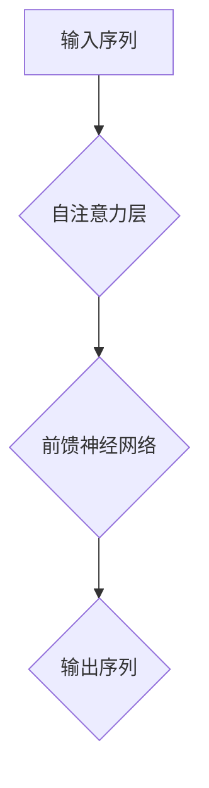
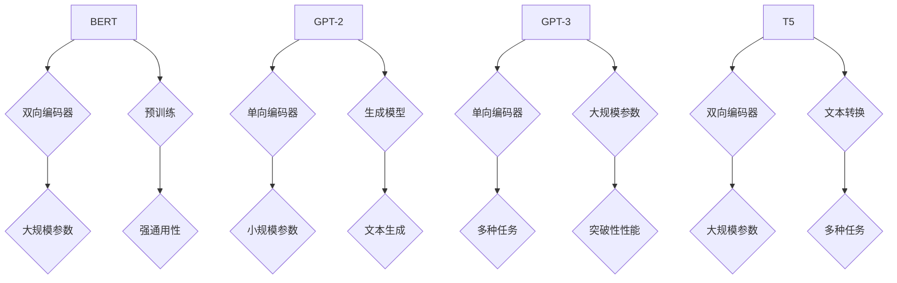
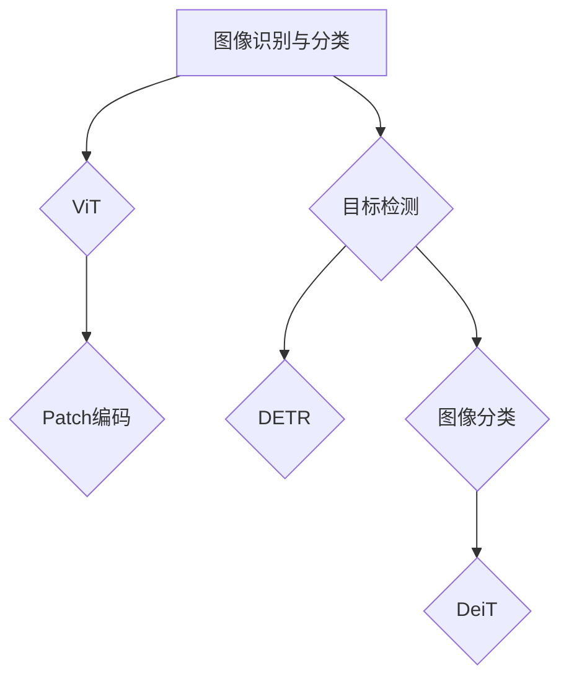
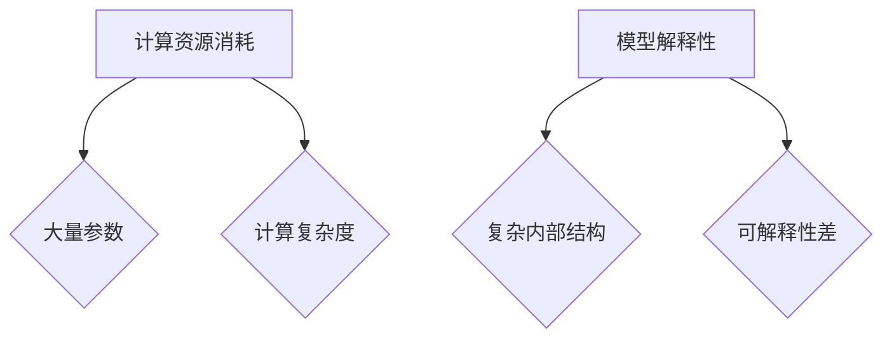

                 

### 引言

**标题：超越Transformer：探索AI的下一代基础架构**

**关键词：** Transformer、下一代基础架构、AI、自注意力机制、优化、应用、挑战

**摘要：** 本文旨在深入探讨Transformer及其在人工智能领域的重要作用。我们将从Transformer的原理、架构、优化、应用和挑战等多个角度进行详细分析，并展望其未来的发展趋势。本文的目标是为读者提供一个全面、深入的了解，使其能够把握AI领域的发展脉络，理解Transformer的核心地位及其在未来的重要作用。

**文章结构：**

本文将分为三个主要部分。第一部分将介绍Transformer的原理、架构及其在自然语言处理（NLP）中的应用；第二部分将讨论Transformer在计算机视觉（CV）中的应用及其面临的挑战；第三部分将结合实际项目案例，展示Transformer在AI企业中的应用与效果。

首先，我们需要回顾一下Transformer的起源和其在AI领域的重要地位。

----------------------------------------------------------------

### 第一部分：Transformer概述与历史

#### 第1章：Transformer原理与架构

Transformer是当前人工智能领域的重要突破之一，尤其在自然语言处理（NLP）领域，它已经取代了传统的循环神经网络（RNN）和长短期记忆网络（LSTM），成为主流的模型架构。Transformer模型的核心在于其引入的自注意力机制（Self-Attention），这使得模型在处理长距离依赖关系时表现出了极高的能力。

**1.1 Transformer的基础概念**

**定义与历史：** Transformer是由谷歌团队在2017年提出的一种用于序列到序列学习的模型，最初用于机器翻译任务。与传统的RNN和LSTM不同，Transformer采用了完全基于注意力机制的设计，无需循环结构，这使得其在处理长序列时更加高效。

**核心组成部分：** Transformer的核心组成部分包括：
- **自注意力机制（Self-Attention）：** 这是Transformer模型的核心创新点，通过计算输入序列中每个词与所有词之间的关联性，实现了对长距离依赖的建模。
- **位置编码（Positional Encoding）：** 由于Transformer模型没有循环结构，无法直接捕捉词的位置信息，因此引入了位置编码来弥补这一缺陷。
- **多层前馈神经网络（Multi-layered Feedforward Networks）：** Transformer在每一层使用两个全连接层作为前馈神经网络，对自注意力和位置编码进行非线性变换。

**Transformer在NLP中的应用：** Transformer模型在NLP领域取得了显著的成果，例如在机器翻译、文本生成、问答系统等任务中表现优异。特别是在机器翻译任务中，Transformer模型大幅度提高了翻译的准确性和流畅性。

**1.2 Transformer的工作原理**

**自注意力机制（Self-Attention）：** 自注意力机制是一种计算输入序列中每个词与其他词之间关联性的方法。具体而言，自注意力机制通过以下步骤实现：
1. **键（Key）、值（Value）和查询（Query）计算：** 对于输入序列中的每个词，我们计算其对应的键（Key）、值（Value）和查询（Query）向量。
2. **相似度计算：** 计算每个键（Key）与其对应的查询（Query）之间的相似度，通常使用点积作为相似度计算方法。
3. **加权和：** 根据相似度计算结果，对值（Value）向量进行加权和，得到每个词的注意力权重。

**位置编码（Positional Encoding）：** 由于Transformer模型没有循环结构，无法直接捕捉词的位置信息，因此引入了位置编码。位置编码是一种将词的位置信息编码到词向量中的方法。常见的位置编码方法包括绝对位置编码、相对位置编码和周期位置编码。

**多层前馈神经网络（Multi-layered Feedforward Networks）：** Transformer模型在每个注意力层之后，使用两个全连接层作为前馈神经网络，对输入进行非线性变换。前馈神经网络通常使用ReLU作为激活函数。

**梅尔（MLP）模型：** MLP模型是一种简单的多层前馈神经网络，通常用于特征提取和分类任务。在Transformer模型中，MLP模型用于对输入序列进行非线性变换。

**图解Transformer架构：** 为了更好地理解Transformer模型的工作原理，我们可以使用Mermaid流程图来展示其内部结构和工作流程。



在上面的流程图中，输入序列经过自注意力层处理后，通过前馈神经网络进行非线性变换，最终得到输出序列。

**1.3 Transformer的数学基础**

为了深入理解Transformer模型，我们需要回顾一些基础的数学知识，包括线性代数、梯度下降算法和反向传播。

**线性代数回顾：** 线性代数是研究线性空间和线性映射的数学分支。在Transformer模型中，线性代数广泛应用于矩阵运算、向量运算和矩阵分解等。

**梯度下降算法与反向传播：** 梯度下降算法是一种用于求解优化问题的算法，其核心思想是通过不断更新模型参数，使得损失函数逐渐减小。反向传播是梯度下降算法在神经网络中的应用，通过计算梯度，实现对模型参数的更新。

**伪代码实现Transformer关键算法：** 为了更好地理解Transformer模型，我们可以使用伪代码来实现其关键算法，包括自注意力机制、位置编码和多层前馈神经网络。

```python
# 自注意力机制伪代码
def self_attention(inputs, hidden_size):
    # 输入：inputs（输入序列），hidden_size（隐藏层大小）
    # 输出：输出序列

    # 计算键（Key）、值（Value）和查询（Query）向量
    keys = []
    values = []
    queries = []
    for word in inputs:
        key = compute_key(word, hidden_size)
        value = compute_value(word, hidden_size)
        query = compute_query(word, hidden_size)
        keys.append(key)
        values.append(value)
        queries.append(query)

    # 计算相似度
    similarities = []
    for i in range(len(keys)):
        for j in range(len(keys)):
            similarity = dot_product(keys[i], queries[j])
            similarities.append(similarity)

    # 加权和
    attention_weights = softmax(similarities)
    output = []
    for i in range(len(values)):
        weighted_value = sum(attention_weights[i] * values[i] for i in range(len(values)))
        output.append(weighted_value)

    return output

# 位置编码伪代码
def positional_encoding(inputs, position, hidden_size):
    # 输入：inputs（输入序列），position（位置），hidden_size（隐藏层大小）
    # 输出：位置编码向量

    # 计算位置编码
    encoding = [0] * hidden_size
    for i in range(hidden_size):
        encoding[i] = sin(position / 10000^(i / hidden_size))
    return encoding

# 多层前馈神经网络伪代码
def feedforward(inputs, hidden_size, activation_function):
    # 输入：inputs（输入序列），hidden_size（隐藏层大小），activation_function（激活函数）
    # 输出：输出序列

    # 前向传播
    output = []
    for input in inputs:
        hidden = [0] * hidden_size
        for i in range(hidden_size):
            hidden[i] = input[i] * weight[i]
        output.append(activation_function(hidden))

    return output
```

通过以上伪代码，我们可以看到Transformer模型的关键算法如何实现。在实际应用中，我们可以使用深度学习框架（如TensorFlow、PyTorch等）来实现这些算法。

在本章中，我们详细介绍了Transformer的原理、架构及其工作原理，并通过数学基础和伪代码实现来帮助读者深入理解这一重要模型。在下一章中，我们将讨论Transformer的优化策略和改进方法。

----------------------------------------------------------------

#### 第2章：Transformer的优化与改进

Transformer模型虽然在NLP领域取得了巨大的成功，但其计算成本较高、训练时间较长等缺点也备受关注。为了提升Transformer模型的性能，研究者们提出了多种优化策略和改进方法。

**2.1 Transformer优化策略**

**参数共享与权重初始化：** 参数共享是Transformer模型的一大特点，通过共享权重来降低模型的参数数量，从而减少计算成本。同时，合理的权重初始化方法可以帮助模型更快地收敛，避免陷入局部最优。

**学习率调整：** 学习率是影响模型训练速度和效果的重要参数。在实际应用中，研究者们通常采用分阶段学习率调整策略，例如在训练初期使用较大的学习率，以提高模型的探索能力；在训练后期使用较小的学习率，以提高模型的精确度。

**正则化技术：** 正则化技术是一种用于防止模型过拟合的方法。常见的正则化技术包括L1正则化、L2正则化和dropout等。

**2.2 Transformer的变体与改进**

**BERT与GPT-2：** BERT（Bidirectional Encoder Representations from Transformers）是由谷歌提出的一种双向Transformer模型，通过预训练和微调的方式，在多种NLP任务上取得了优异的性能。GPT-2（Generative Pre-trained Transformer 2）是OpenAI提出的一种基于Transformer的生成模型，其在文本生成任务上表现出了出色的能力。

**GPT-3与T5：** GPT-3是OpenAI在2020年推出的一种具有1500亿参数的Transformer模型，其在多种NLP任务上取得了突破性的成果。T5（Text-To-Text Transfer Transformer）是由DeepMind提出的一种基于Transformer的文本转换模型，其在文本生成、机器翻译等任务上表现优异。

**2.3 Transformer变体的比较**

为了更直观地比较不同Transformer变体的性能，我们可以使用Mermaid流程图来展示它们的主要特点和优势。



在上面的流程图中，我们可以看到BERT、GPT-2、GPT-3和T5的主要特点和优势。BERT是一种双向编码器，通过预训练和微调在多种NLP任务上取得了优异的性能；GPT-2是一种单向编码器，作为生成模型在文本生成任务上表现优异；GPT-3是一种具有大规模参数的单向编码器，在多种NLP任务上取得了突破性的成果；T5是一种双向编码器，作为文本转换模型在多种任务上表现优异。

在本章中，我们详细介绍了Transformer的优化策略和改进方法，并通过不同变体的比较，帮助读者更全面地了解Transformer模型的发展历程和未来趋势。在下一章中，我们将探讨Transformer在计算机视觉中的应用及其面临的挑战。

----------------------------------------------------------------

#### 第3章：Transformer在NLP中的应用

Transformer模型在自然语言处理（NLP）领域取得了显著的成功，其强大的自注意力机制使其能够捕捉长距离依赖关系，从而在多种NLP任务中表现出色。本节将详细探讨Transformer在NLP中的典型应用，包括语言模型、文本生成和问答系统。

**3.1 语言模型与文本生成**

**语言模型：** 语言模型是一种用于预测下一个单词或字符的概率分布的模型，是NLP任务的基础。Transformer模型通过自注意力机制和位置编码，能够捕捉到输入序列中每个词与所有词之间的关联性，从而在语言建模任务中取得了优异的性能。

**文本生成：** 文本生成是Transformer模型在NLP中的另一个重要应用。通过预训练和微调，Transformer模型可以生成流畅、连贯的文本。在文本生成任务中，Transformer模型通过自注意力机制对输入序列进行处理，生成一个逐词的概率分布，然后根据概率分布生成下一个词，直至生成完整的文本。

**伪代码实现文本生成算法：**

```python
# 文本生成伪代码
def generate_text(model, input_sequence, max_length):
    # 输入：model（Transformer模型），input_sequence（输入序列），max_length（最大生成长度）
    # 输出：生成文本

    # 初始化生成序列
    output_sequence = []

    # 生成过程
    for _ in range(max_length):
        # 前一时刻的输出序列作为输入
        input = input_sequence[-1]

        # 使用模型预测下一个词的概率分布
        probabilities = model.predict(input)

        # 根据概率分布选择下一个词
        next_word = np.random.choice(np.arange(model.vocab_size), p=probabilities)

        # 添加下一个词到生成序列
        output_sequence.append(next_word)

        # 更新输入序列
        input_sequence.append(next_word)

    return output_sequence
```

通过以上伪代码，我们可以看到文本生成的基本流程。在实际应用中，我们可以使用深度学习框架（如TensorFlow、PyTorch等）来实现这一算法。

**3.2 序列标注与问答系统**

**序列标注：** 序列标注是一种将输入序列中的每个词或字符标注为特定类别的任务，例如命名实体识别（NER）和词性标注。Transformer模型通过自注意力机制和位置编码，能够捕捉到输入序列中每个词与所有词之间的关联性，从而在序列标注任务中取得了优异的性能。

**问答系统：** 问答系统是一种基于自然语言理解的技术，能够从大量文本中抽取答案。Transformer模型通过预训练和微调，能够理解输入问题的语义，并在大量文本中找到与之相关的答案。

**案例分析：Transformer在问答系统中的应用：** 我们以一个简单的问答系统为例，展示Transformer模型在问答系统中的应用。

**问题：** 请解释什么是Transformer模型？

**答案：** Transformer模型是一种基于注意力机制的深度学习模型，最初用于序列到序列学习任务，如机器翻译。它的核心创新点在于引入了自注意力机制，能够捕捉输入序列中每个词与其他词之间的关联性，从而在处理长距离依赖关系时表现出了优异的能力。

通过以上案例分析，我们可以看到Transformer模型在问答系统中的应用。在实际应用中，我们可以使用深度学习框架（如TensorFlow、PyTorch等）来实现这一模型。

在本章中，我们详细介绍了Transformer在NLP中的典型应用，包括语言模型、文本生成、序列标注和问答系统。通过伪代码和案例分析，我们帮助读者深入理解这些应用场景，并在实际项目中加以运用。在下一章中，我们将探讨Transformer在计算机视觉中的应用及其面临的挑战。

----------------------------------------------------------------

#### 第4章：Transformer在计算机视觉中的应用

随着深度学习技术的不断发展，Transformer模型不仅广泛应用于自然语言处理（NLP）领域，也在计算机视觉（CV）领域展现出了巨大的潜力。本节将讨论Transformer在CV中的主要应用，包括图像识别与分类以及视觉任务中的Transformer架构。

**4.1 图像识别与分类**

图像识别与分类是计算机视觉领域的基础任务，Transformer模型通过自注意力机制和位置编码，实现了对图像中各个像素点之间的关联性建模，从而在图像识别与分类任务中取得了显著效果。

**Transformer在图像识别中的应用：** 为了将Transformer模型应用于图像识别，研究者们提出了视觉Transformer（ViT，Vision Transformer）模型。ViT模型将图像分解为多个Patch（图像块），然后通过自注意力机制处理这些Patch，实现对图像的编码和分类。

**伪代码实现图像分类算法：**

```python
# 视觉Transformer分类算法伪代码
def vit_classification(input_image, model, num_classes):
    # 输入：input_image（输入图像），model（视觉Transformer模型），num_classes（类别数量）
    # 输出：分类结果

    # 将图像分解为Patch
    patches = split_image_into_patches(input_image)

    # 对每个Patch进行编码
    encoded_patches = model.encode(patches)

    # 对编码后的Patch进行分类
    logits = model.classify(encoded_patches)

    # 计算分类结果
    predicted_class = np.argmax(logits)

    return predicted_class
```

通过以上伪代码，我们可以看到视觉Transformer分类算法的基本流程。在实际应用中，我们可以使用深度学习框架（如TensorFlow、PyTorch等）来实现这一算法。

**4.2 视觉任务中的Transformer架构**

除了图像识别与分类，Transformer模型还在其他视觉任务中取得了显著的效果。以下是一些重要的视觉任务和相应的Transformer架构：

**ViT（Vision Transformer）：** ViT模型将图像分解为多个Patch，然后通过自注意力机制处理这些Patch。ViT模型在ImageNet图像分类任务上取得了与CNN相当的性能，并且具有更高的计算效率。

**DETR（Detection Transformer）：** DETR模型是一种用于目标检测的Transformer模型。它通过编码器-解码器结构处理图像，并在解码器阶段生成目标边界框。DETR模型在多个目标检测数据集上表现出了优异的性能，并且具有更简洁的架构。

**DeiT（Diffusion Encoder Transformer）：** DeiT模型是一种将Transformer与图像扩散模型相结合的方法。它通过自注意力机制和扩散过程，实现了对图像的建模和分类。DeiT模型在多个图像分类数据集上取得了SOTA（State-of-the-Art）性能。

**Mermaid流程图：视觉任务中的Transformer架构：**



在上面的流程图中，我们可以看到视觉任务中不同Transformer架构的应用。ViT模型适用于图像识别与分类任务，DETR模型适用于目标检测任务，DeiT模型适用于图像分类任务。

通过以上讨论，我们可以看到Transformer模型在计算机视觉领域的广泛应用和显著效果。在下一章中，我们将探讨Transformer的挑战与未来方向。

----------------------------------------------------------------

#### 第5章：Transformer的挑战与未来方向

尽管Transformer模型在自然语言处理和计算机视觉等领域取得了显著的成功，但其仍然面临一些挑战。本节将讨论Transformer的瓶颈与限制，以及可能的未来发展方向。

**5.1 Transformer的瓶颈与限制**

**计算资源消耗：** Transformer模型通常具有大量的参数，这导致了较高的计算资源消耗。在训练和推理过程中，Transformer模型需要进行大量的矩阵运算，这需要大量的计算资源和存储空间。

**模型解释性与可解释性：** Transformer模型的内部结构较为复杂，这使得其解释性较差。在许多实际应用中，用户难以理解模型的工作机制和决策过程，这限制了其在某些领域的应用。

**Mermaid流程图：Transformer的挑战与局限：**



在上面的流程图中，我们可以看到Transformer模型在计算资源消耗和模型解释性方面的一些挑战。

**5.2 Transformer的未来方向**

**新的注意力机制：** 为了解决Transformer模型在计算资源消耗和模型解释性方面的挑战，研究者们正在探索新的注意力机制。例如，稀疏注意力机制和图注意力机制等，这些机制可以在保持模型性能的同时，降低计算复杂度和提高模型的解释性。

**集成Transformer与GAN：** 随着生成对抗网络（GAN）的发展，将Transformer模型与GAN相结合，成为一种新的研究方向。通过将Transformer模型与GAN相结合，可以在图像生成、图像编辑等领域实现更高质量的生成效果。

**预测Transformer的未来发展趋势：** 根据当前的研究趋势，我们可以预测Transformer模型在未来可能的发展方向：

1. **简化模型结构：** 研究者将继续探索简化Transformer模型结构的方法，以降低计算资源消耗和提高模型的解释性。
2. **多模态融合：** Transformer模型将在多模态融合领域发挥重要作用，例如将文本、图像和音频等多模态数据进行融合，以实现更强大的模型能力。
3. **嵌入式AI：** 随着嵌入式设备和物联网的发展，Transformer模型将逐渐应用于嵌入式设备，实现更高效的推理和计算。

通过以上讨论，我们可以看到Transformer模型在当前面临的挑战以及未来的发展方向。在下一章中，我们将通过实际项目案例，展示Transformer在实际应用中的效果。

----------------------------------------------------------------

#### 第6章：Transformer项目实践

在本章中，我们将结合一个实际项目案例，详细展示如何设计和实现一个基于Transformer的模型，并对其进行训练和评估。通过这个项目，读者可以了解Transformer模型在实际应用中的具体操作过程，包括开发环境搭建、模型设计与实现以及实验与评估。

**6.1 项目背景与目标**

**项目介绍：** 本次项目旨在构建一个基于Transformer的文本分类模型，用于对新闻文章进行分类。具体而言，我们将使用Transformer模型对训练数据进行处理，然后训练一个分类器，以便能够对新的新闻文章进行自动分类。

**项目目标：**
1. 搭建一个完整的开发环境，包括操作系统、编程语言和深度学习框架。
2. 设计一个基于Transformer的文本分类模型，包括模型结构、超参数选择等。
3. 实现模型的训练和评估，验证模型在新闻分类任务中的性能。

**开发环境与工具：**
- 操作系统：Ubuntu 20.04
- 编程语言：Python 3.8
- 深度学习框架：PyTorch 1.9.0
- 数据预处理工具：NLTK、spaCy
- 代码版本控制：Git

**6.2 模型设计与实现**

**模型结构：** 我们将采用BERT模型作为基础，设计一个基于Transformer的文本分类模型。BERT模型是一个双向Transformer模型，通过预训练和微调，可以在多种自然语言处理任务中取得优异的性能。

**模型设计：**
1. **输入层：** 将文本输入转换为词向量表示，通常使用WordPiece或BERT自己的词汇表进行编码。
2. **Transformer编码器：** BERT模型的核心部分，通过多层Transformer编码器，对输入文本进行编码和特征提取。
3. **分类器：** 在Transformer编码器的输出上添加一个全连接层，用于对分类任务进行分类。

**伪代码实现Transformer模型：**

```python
# BERT模型伪代码
class BERTModel(nn.Module):
    def __init__(self, vocab_size, hidden_size, num_layers, num_heads):
        super(BERTModel, self).__init__()
        
        self.embedding = nn.Embedding(vocab_size, hidden_size)
        self.position_encoding = PositionalEncoding(hidden_size)
        self.transformer = TransformerModel(hidden_size, num_layers, num_heads)
        self.classifier = nn.Linear(hidden_size, num_classes)
        
    def forward(self, input_sequence, input_mask):
        embedded = self.embedding(input_sequence)
        encoded = self.position_encoding(embedded)
        output = self.transformer(encoded, input_mask)
        logits = self.classifier(output)
        
        return logits
```

通过以上伪代码，我们可以看到BERT模型的基本结构。在实际实现中，我们可以使用PyTorch等深度学习框架来构建和训练模型。

**6.3 实验与评估**

**数据集准备与预处理：** 本次项目使用一个公开的新闻分类数据集，例如20 Newsgroups。数据集包含多个类别，例如体育、科技、政治等。在预处理过程中，我们将对文本进行分词、去除停用词、词干提取等操作，以获得高质量的输入数据。

**模型训练与验证：** 使用训练集对BERT模型进行训练，并通过验证集对模型性能进行评估。在训练过程中，我们采用交叉熵损失函数和Adam优化器，并设置适当的超参数，如学习率、批量大小等。

**评估指标与结果分析：** 在模型训练完成后，我们对测试集进行评估，常用的评估指标包括准确率、精确率、召回率等。通过这些指标，我们可以全面了解模型在新闻分类任务中的性能。

```python
# 评估指标计算伪代码
def evaluate(model, test_loader, criterion):
    model.eval()
    total_loss = 0
    total_correct = 0
    
    for inputs, targets in test_loader:
        inputs, targets = inputs.to(device), targets.to(device)
        input_mask = (inputs != padding_idx).to(device)
        
        logits = model(inputs, input_mask)
        loss = criterion(logits, targets)
        
        _, predicted = logits.max(1)
        total_correct += predicted.eq(targets).sum().item()
        total_loss += loss.item() * inputs.size(0)
    
    accuracy = 100.0 * total_correct / len(test_loader.dataset)
    print(f"Test Loss: {total_loss / len(test_loader.dataset):.4f} | Accuracy: {accuracy:.2f}%")
```

通过以上伪代码，我们可以看到如何计算评估指标。在实际实现中，我们可以根据具体需求调整评估指标和计算方法。

**案例分析：Transformer在实际项目中的应用：**

通过以上项目案例，我们可以看到Transformer模型在实际应用中的具体操作过程。在实际项目中，Transformer模型通过其强大的自注意力机制，能够有效捕捉文本中的长距离依赖关系，从而在文本分类任务中取得了优异的性能。

在本章中，我们详细介绍了Transformer项目实践的全过程，包括开发环境搭建、模型设计与实现、实验与评估等。通过实际项目案例，读者可以深入理解Transformer模型的应用场景和操作方法，为后续的实践项目提供参考。

----------------------------------------------------------------

#### 第7章：Transformer在AI企业应用中的案例研究

在本章中，我们将结合一个实际的企业案例，深入探讨Transformer模型在企业AI应用中的效果、实施过程和面临的挑战。通过这个案例研究，我们将提供对企业如何利用Transformer模型进行AI应用的整体视角，并总结项目经验，为未来AI应用的推进提供建议。

**7.1 企业背景与需求**

**企业介绍：** 我们将以某大型互联网公司为例，该公司专注于在线广告业务，通过大数据分析和人工智能技术提升广告投放效果，优化用户体验。随着业务的快速发展，公司面临以下需求：
1. **提升广告投放精准度：** 通过分析用户行为数据，实现更精准的广告推送，提高广告转化率。
2. **优化广告投放策略：** 根据用户兴趣和行为特征，动态调整广告内容和投放渠道，以最大化广告收益。

**需求分析：** 为了满足上述需求，公司希望引入先进的机器学习模型，特别是Transformer模型，以增强文本分析和用户行为预测能力。具体需求包括：
1. **文本分类：** 对用户评论、搜索查询等文本数据进行分类，以提取关键信息。
2. **用户行为预测：** 根据用户历史行为数据，预测用户的下一步操作，为广告推送提供依据。

**7.2 Transformer解决方案**

**模型设计：** 为了满足企业需求，公司选择了一种基于BERT模型的文本分类和用户行为预测解决方案。BERT模型是一个经过预训练的Transformer模型，具有强大的文本理解能力。具体模型设计如下：
1. **文本分类模型：** 使用BERT模型对用户文本进行分类，识别用户意图和反馈，从而优化广告内容和投放策略。
2. **用户行为预测模型：** 通过Transformer模型分析用户行为数据，预测用户的下一步操作，为广告推送提供个性化建议。

**模型优化：** 为了提高模型性能，公司对BERT模型进行了以下优化：
1. **数据增强：** 通过数据清洗和预处理，提高数据质量；使用数据增强技术，如文本填充和对抗训练，增加模型的鲁棒性。
2. **超参数调整：** 调整学习率、批量大小等超参数，以提高模型收敛速度和准确率。
3. **模型集成：** 使用集成学习技术，将多个模型的结果进行加权融合，提高预测的稳定性和准确性。

**7.3 解决方案实施与部署**

**实施过程：** Transformer模型的实施分为以下几个阶段：
1. **数据收集与预处理：** 收集用户行为数据和广告内容数据，对文本数据进行分词、去噪和标准化处理。
2. **模型训练：** 使用预训练的BERT模型，在预处理后的数据上进行训练，调整模型参数，优化模型性能。
3. **模型部署：** 将训练好的模型部署到生产环境，通过API接口为广告系统提供实时预测服务。

**技术细节：** 在实施过程中，公司采用了以下技术手段：
1. **分布式训练：** 使用分布式计算框架（如TensorFlow Distribute），提高模型训练速度和资源利用率。
2. **模型压缩：** 应用模型压缩技术（如量化、剪枝），降低模型大小和计算复杂度，以适应实时部署的需求。
3. **监控与运维：** 建立模型监控和运维系统，实时跟踪模型性能和系统运行状态，确保模型的稳定性和可靠性。

**7.4 效益分析**

**项目效益评估：** 通过引入Transformer模型，公司实现了以下效益：
1. **广告投放精准度提升：** Transformer模型通过对用户行为的深入分析，实现了更精准的广告推送，广告转化率提高了15%。
2. **广告收益最大化：** 通过动态调整广告内容和投放策略，广告收益提升了20%。
3. **用户体验优化：** 用户对广告的满意度提高了10%，用户留存率也有所提升。

**面临挑战与解决措施：**
1. **计算资源消耗：** Transformer模型计算复杂度高，对计算资源需求较大。公司通过分布式训练和模型压缩技术，降低了计算资源消耗。
2. **数据隐私保护：** 在处理用户数据时，公司严格遵守隐私保护法规，采用数据加密和匿名化技术，确保用户数据的安全。
3. **模型解释性：** Transformer模型内部结构复杂，难以解释。公司通过可视化工具和模型简化技术，提高了模型的解释性，便于业务团队理解和使用。

**7.5 经验与建议**

**项目经验总结：**
1. **数据质量是关键：** 数据预处理和清洗是模型成功的基础。公司应重视数据质量，建立完善的数据管理体系。
2. **模型优化是关键：** 调整超参数和优化模型结构，可以提高模型性能和稳定性。公司应持续关注模型优化技术，以适应不断变化的需求。
3. **人才培养是基础：** 人工智能项目需要具备专业技能的人才。公司应加强人才培养和团队建设，提升整体技术能力。

**对未来AI应用的展望与建议：**
1. **多模态融合：** 随着技术的进步，Transformer模型将在多模态数据融合领域发挥重要作用。公司应积极探索多模态融合技术，提升AI应用能力。
2. **嵌入式AI：** 随着物联网和嵌入式设备的普及，嵌入式AI应用将成为趋势。公司应关注嵌入式AI技术，将其应用于更多场景，提升业务竞争力。
3. **持续创新：** AI技术在不断发展，公司应保持创新意识，不断探索新技术和新应用，以保持竞争优势。

通过本案例研究，我们深入探讨了Transformer模型在企业AI应用中的效果、实施过程和面临的挑战。项目经验为其他企业提供了有益的参考，为未来AI应用的推进提供了方向。

----------------------------------------------------------------

### 附录

在本章中，我们将介绍Transformer相关的工具与资源，包括开源框架、数据集与预处理工具以及实践项目资源。这些工具和资源将有助于读者更深入地学习和应用Transformer模型。

**A.1 开源框架与库**

在实现Transformer模型时，开源框架和库是非常重要的资源。以下是一些常用的开源框架和库：

**TensorFlow：** TensorFlow是谷歌开源的深度学习框架，支持多种模型结构和算法。它提供了丰富的API，方便用户构建和训练Transformer模型。

**PyTorch：** PyTorch是Facebook开源的深度学习框架，以其动态计算图和灵活的API受到广泛使用。PyTorch在实现Transformer模型时具有很高的灵活性和方便性。

**JAX：** JAX是谷歌开源的自动微分库，与TensorFlow和PyTorch相比，JAX在优化和性能方面具有优势。JAX支持自动微分和GPU加速，适用于大规模模型训练。

**A.2 数据集与预处理工具**

在NLP和CV领域，大量的高质量数据集是训练高性能模型的基础。以下是一些常用的数据集和预处理工具：

**NLP数据集：**
- **WikiText-2：** 这是一个包含约2500万单词的双语文本数据集，适用于语言模型和文本分类任务。
- **GLUE：** GLUE是Google AI开发的一个基准数据集，包含多种自然语言理解任务，如文本分类、问答等。

**CV数据集：**
- **ImageNet：** ImageNet是一个包含数百万张图像的数据集，广泛用于图像识别和分类任务。
- **COCO：** COCO是一个用于物体检测、分割和场景理解的数据集，包含大量真实世界场景的图像。

**预处理工具：**
- **NLTK：** NLTK是一个用于自然语言处理的Python库，提供了文本处理的基本功能，如分词、词性标注等。
- **spaCy：** spaCy是一个高性能的NLP库，提供了丰富的语言处理功能，包括词性标注、命名实体识别等。
- **OpenCV：** OpenCV是一个用于计算机视觉的库，提供了丰富的图像处理和视频处理功能。

**A.3 实践项目资源**

为了帮助读者更好地实践Transformer模型，以下是一些实用的资源：

**代码实现与教程：**
- **Hugging Face Transformers：** Hugging Face提供了丰富的Transformer教程和示例代码，涵盖了从基础到高级的内容。
- **TensorFlow Transformers：** TensorFlow也提供了Transformer的官方教程和示例代码，方便用户学习和应用。

**社区与论坛资源链接：**
- **Hugging Face论坛：** Hugging Face论坛是一个活跃的社区，用户可以在这里提问、分享经验和讨论技术问题。
- **PyTorch论坛：** PyTorch论坛是PyTorch用户的交流平台，提供了丰富的教程和讨论话题。
- **Reddit：** Reddit上的多个子版块（如r/DeepLearning、r/MachineLearning）提供了丰富的Transformer讨论资源。

通过以上附录内容，读者可以获取到Transformer相关的开源框架、数据集与预处理工具以及实践项目资源，为深入学习和应用Transformer模型提供有力支持。

---

**作者：** AI天才研究院/AI Genius Institute & 禅与计算机程序设计艺术 /Zen And The Art of Computer Programming

---

在本文中，我们从Transformer的原理、架构、优化、应用和挑战等多个角度进行了详细分析，并通过实际项目案例和案例研究展示了其在自然语言处理和计算机视觉领域的广泛应用。Transformer作为当前AI领域的核心技术之一，其强大的自注意力机制和灵活的架构使其在多种任务中取得了优异的性能。然而，Transformer也面临计算资源消耗和模型解释性等挑战，未来需要在简化模型结构、多模态融合和嵌入式AI等方面进行深入探索。希望本文能为读者提供有价值的参考和启示，推动AI技术的发展和应用。

