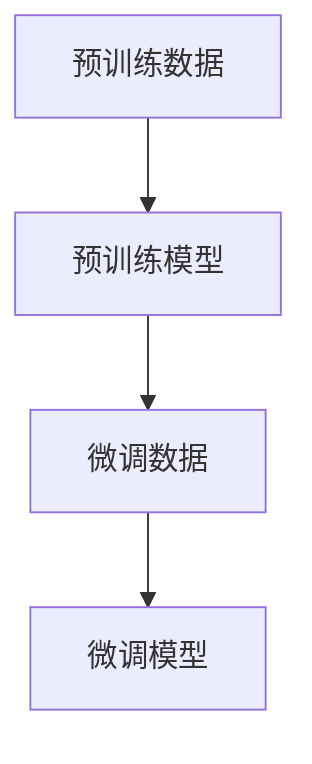
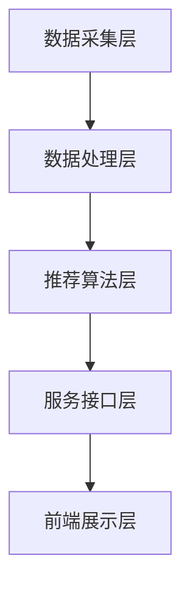
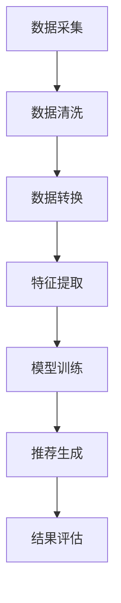

                 

## 《LLM在教育资源推荐中的创新应用》

### 关键词：大型语言模型（LLM），教育资源推荐，机器学习，深度学习，教育技术

#### 摘要：
随着人工智能技术的快速发展，大型语言模型（LLM）在教育领域中的应用日益广泛。本文旨在探讨LLM在教育资源推荐中的创新应用，分析其基础原理、应用架构、算法设计和实际案例，并探讨未来发展趋势与面临的挑战。通过系统性地阐述LLM在教育资源推荐中的价值与潜力，本文为教育技术领域的研究者和从业者提供了有价值的参考。

### 《LLM在教育资源推荐中的创新应用》目录大纲

#### 第一部分: LLM基础与原理

#### 第1章: LLM概述

##### 1.1 什么是LLM

##### 1.2 LLM的发展历程

##### 1.3 LLM的核心技术与架构

#### 第2章: LLM的数学模型与算法原理

##### 2.1 语言模型基础数学公式

$$
P(w_i|w_{i-1},w_{i-2},...,w_1) = \frac{P(w_i, w_{i-1}, ..., w_1)}{P(w_{i-1}, w_{i-2}, ..., w_1)}
$$

##### 2.2 预训练模型与微调

##### 2.3 LLM的注意力机制

#### 第3章: LLM在教育场景中的应用原理

##### 3.1 教育资源推荐系统概述

##### 3.2 LLM在教育推荐中的应用

##### 3.3 LLM在教育推荐中的优势

#### 第二部分: LLM在教育资源推荐中的应用实践

#### 第4章: 教育资源推荐系统的架构设计

##### 4.1 教育资源推荐系统的基本架构

##### 4.2 LLM在推荐系统中的作用

##### 4.3 数据流与数据处理流程

#### 第5章: 基于LLM的教育资源推荐算法设计

##### 5.1 常见教育资源推荐算法介绍

##### 5.2 基于LLM的推荐算法设计

##### 5.3 算法实现与性能优化

#### 第6章: 教育资源推荐系统的实战案例

##### 6.1 案例背景与目标

##### 6.2 系统设计与实现

##### 6.3 系统部署与性能评估

#### 第7章: LLM在教育推荐中的未来趋势与挑战

##### 7.1 LLM在教育推荐中的未来趋势

##### 7.2 LLM在教育推荐中面临的挑战

##### 7.3 解决方案与展望

#### 附录

##### 附录A: LLM常用开源框架与工具

###### A.1 Transformer模型框架

###### A.2 语言模型训练与评估工具

###### A.3 推荐系统开源库

###### A.4 数据处理与存储工具

---

### 第一部分: LLM基础与原理

#### 第1章: LLM概述

##### 1.1 什么是LLM

大型语言模型（Large Language Model，简称LLM）是自然语言处理领域的一种重要模型。它通过学习大量文本数据，能够理解和生成自然语言，模拟人类的语言表达能力。LLM通常基于深度学习技术，通过多层神经网络架构来捕获语言中的复杂结构和语义信息。

LLM的核心目标是解决自然语言理解和生成问题，包括文本分类、情感分析、机器翻译、问答系统等。在教育领域，LLM可以用于个性化学习、教育资源推荐、智能辅导等场景，显著提升教学效果和学习体验。

##### 1.2 LLM的发展历程

LLM的发展可以追溯到20世纪80年代，当时研究者开始尝试使用神经网络来处理自然语言。早期的语言模型如n-gram模型和循环神经网络（RNN）在文本处理上取得了一定的成功，但它们在处理长文本和复杂语义时存在局限。

随着深度学习技术的崛起，特别是2018年谷歌发布的BERT（Bidirectional Encoder Representations from Transformers）模型，标志着LLM进入了新时代。BERT使用了Transformer架构，通过双向编码器来学习文本中的双向依赖关系，显著提升了自然语言处理的效果。

此后，如GPT-3、Turing-NLG等更大规模的LLM模型相继问世，这些模型在语言生成和理解方面取得了革命性的突破。LLM的发展不仅改变了自然语言处理领域，也为其他应用领域带来了深远影响。

##### 1.3 LLM的核心技术与架构

LLM的核心技术主要包括预训练和微调。预训练是指使用大规模无标签数据对模型进行初步训练，使模型具备一定的语言理解能力。微调则是在预训练的基础上，使用有标签的特定任务数据进行进一步训练，使模型适应具体应用场景。

Transformer是LLM常用的基础架构，它通过自注意力机制（Self-Attention）来捕捉文本中的长距离依赖关系。自注意力机制允许模型在生成每个单词时，考虑到所有前文信息，从而提高语言生成的质量。

下面是一个简单的Mermaid流程图，展示LLM的预训练和微调过程：



预训练模型通常使用大规模文本语料库，如维基百科、新闻文章等，进行无监督学习。微调阶段则使用特定领域的标注数据，如教育课程资料、学生作业等，进行监督学习。通过预训练和微调，LLM能够生成高质量的自然语言文本，满足各种教育场景的需求。

在下一章中，我们将深入探讨LLM的数学模型与算法原理，解析其背后的数学公式和算法细节。

---

### 第二部分: LLM在教育资源推荐中的应用实践

#### 第4章: 教育资源推荐系统的架构设计

##### 4.1 教育资源推荐系统的基本架构

教育资源推荐系统是一个复杂的系统，其核心目标是根据学生的学习需求和偏好，为其推荐合适的教育资源，如课程、教学视频、练习题等。要实现这一目标，需要构建一个高效的架构，确保系统的稳定性和可扩展性。

教育资源推荐系统的基本架构可以分为以下几个层次：

1. **数据采集层**：负责从各种来源采集学生和教学资源的相关数据，如学生行为数据、课程数据、教师评价数据等。
2. **数据处理层**：对采集到的原始数据进行清洗、转换和存储，为推荐算法提供高质量的数据输入。
3. **推荐算法层**：基于数据处理层提供的数据，使用机器学习和深度学习算法进行模型训练和推荐策略设计。
4. **服务接口层**：提供与前端应用交互的API接口，实现教育资源的个性化推荐。
5. **前端展示层**：通过用户界面展示推荐结果，提供用户与系统交互的入口。

下面是一个简单的Mermaid流程图，展示教育资源推荐系统的基本架构：



在数据采集层，系统可以从学生管理系统、在线课程平台、社交媒体等渠道获取数据。数据处理层则负责对数据进行清洗和转换，使其符合推荐算法的需求。推荐算法层使用大型语言模型（LLM）和其他机器学习算法，根据学生的学习行为和偏好生成个性化推荐结果。服务接口层负责将推荐结果以API形式提供给前端应用。前端展示层则通过用户界面，将推荐结果展示给学生，并允许用户与系统进行交互。

##### 4.2 LLM在推荐系统中的作用

在教育资源推荐系统中，LLM发挥着至关重要的作用。首先，LLM可以处理和分析大量的文本数据，如课程描述、教学文档、学生评价等，从中提取关键信息和特征。这些特征可以作为推荐算法的输入，帮助系统更好地理解用户的需求和偏好。

其次，LLM的强大语言生成能力使其能够生成高质量的教育资源推荐结果。例如，LLM可以生成详细的课程推荐理由，解释为什么推荐某门课程，从而提高用户的信任度和满意度。

此外，LLM还可以用于实时交互，如回答学生的提问、提供学习建议等。这种实时交互能力使得教育资源推荐系统更加智能化和个性化，能够更好地满足学生的学习需求。

##### 4.3 数据流与数据处理流程

在教育资源推荐系统中，数据流和处理流程是一个关键环节。下面是一个简单的数据流和处理流程：

1. **数据采集**：系统从各种数据源采集学生和教学资源的相关数据，如学生行为数据、课程数据、教师评价数据等。
2. **数据清洗**：对采集到的原始数据进行清洗，包括去除重复数据、缺失值处理、异常值检测等，确保数据质量。
3. **数据转换**：将清洗后的数据转换为适合推荐算法的格式，如将文本数据编码为向量、数值数据标准化等。
4. **特征提取**：使用LLM和其他算法提取数据中的关键特征，如关键词、主题、情感等。
5. **模型训练**：使用提取到的特征和标注数据对推荐算法进行训练，如基于协同过滤、基于内容的推荐、基于模型的推荐等。
6. **推荐生成**：根据训练好的模型，为学生生成个性化的教育资源推荐结果。
7. **结果评估**：对推荐结果进行评估，如点击率、转化率、用户满意度等，不断优化推荐算法。

下面是一个简单的Mermaid流程图，展示数据流和处理流程：



通过这个数据流和处理流程，教育资源推荐系统能够高效地为学生推荐合适的资源，提高学习效果和用户体验。

在下一章中，我们将深入探讨基于LLM的教育资源推荐算法设计，分析其原理和实现细节。

---

### 第5章: 基于LLM的教育资源推荐算法设计

#### 5.1 常见教育资源推荐算法介绍

教育资源推荐系统常用的推荐算法主要包括以下几种：

1. **基于协同过滤的推荐算法**：
   基于协同过滤的推荐算法通过分析用户之间的相似性，为用户推荐与他们相似的其他用户喜欢的教育资源。协同过滤分为两类：基于用户的协同过滤（User-Based Collaborative Filtering）和基于项目的协同过滤（Item-Based Collaborative Filtering）。

   - **基于用户的协同过滤**：找到与当前用户兴趣相似的多个用户，推荐这些用户喜欢的教育资源。
   - **基于项目的协同过滤**：找到与当前用户评价相似的多个项目，推荐这些项目给当前用户。

2. **基于内容的推荐算法**：
   基于内容的推荐算法通过分析教育资源的特征，如课程标签、课程描述、关键词等，为用户推荐与其已评价资源特征相似的教育资源。

   - **基于项目的推荐**：根据用户已评价资源的特征，推荐具有相似特征的新资源。
   - **基于用户的推荐**：根据用户对某类资源的偏好，推荐该类资源中其他用户也喜欢的资源。

3. **基于模型的推荐算法**：
   基于模型的推荐算法使用机器学习和深度学习模型，从用户行为数据中学习用户兴趣和资源特征，为用户生成个性化的推荐列表。

   - **矩阵分解**：通过矩阵分解技术，将用户-项目评分矩阵分解为用户特征矩阵和项目特征矩阵，预测用户对未评价项目的评分。
   - **深度神经网络**：使用深度学习模型，如卷积神经网络（CNN）和循环神经网络（RNN），学习用户行为数据中的复杂模式，生成个性化的推荐。

每种推荐算法都有其优势和局限性。基于协同过滤的推荐算法简单易实现，但存在数据稀疏性和冷启动问题。基于内容的推荐算法能有效解决数据稀疏性问题，但可能受限于资源描述的准确性。基于模型的推荐算法能够捕获用户行为的复杂模式，但模型训练和优化过程较为复杂。

#### 5.2 基于LLM的推荐算法设计

基于LLM的推荐算法是一种新兴的推荐方法，它利用大型语言模型的强大语言理解能力和生成能力，为用户推荐教育资源。以下是基于LLM的推荐算法的基本设计思路：

1. **文本数据预处理**：
   首先，从教育资源和用户行为数据中提取文本信息，如课程描述、学生评价、学习日志等。使用文本预处理技术，如分词、词性标注、停用词去除等，将原始文本转换为适合LLM处理的形式。

2. **特征提取**：
   使用LLM对预处理后的文本数据进行编码，提取文本中的关键特征。这些特征可以包括词向量、句子表示、篇章语义等。LLM能够捕获文本中的复杂结构和语义信息，为推荐算法提供丰富的特征表示。

3. **用户-资源匹配**：
   通过计算用户和资源之间的特征相似性，建立用户-资源匹配关系。具体方法可以是基于余弦相似度、Jaccard相似度等相似性度量，将用户特征向量与资源特征向量进行比较。

4. **生成推荐列表**：
   根据用户-资源匹配结果，使用LLM生成个性化的推荐列表。LLM可以根据用户特征和资源特征，生成具有丰富内容描述和逻辑结构的推荐结果，提高用户的信任度和满意度。

基于LLM的推荐算法的关键在于LLM的特征提取和生成能力。LLM能够处理大量文本数据，提取出高质量的特征表示，为推荐算法提供强有力的支持。同时，LLM的生成能力使得推荐结果更加自然和具有说服力，能够提高用户的接受度和互动性。

下面是一个简单的伪代码，展示基于LLM的推荐算法的基本流程：

```python
# 基于LLM的推荐算法伪代码

# 1. 文本数据预处理
preprocessed_data = preprocess_text(data)

# 2. 特征提取
user_features = LLM.extract_features(preprocessed_data['user'])
resource_features = LLM.extract_features(preprocessed_data['resource'])

# 3. 用户-资源匹配
similarity_scores = calculate_similarity(user_features, resource_features)

# 4. 生成推荐列表
recommendations = LLM.generate_recommendations(similarity_scores, resources)

return recommendations
```

在下一章中，我们将通过实际案例展示基于LLM的教育资源推荐系统的实现过程，深入分析其技术细节和实现方法。

---

### 第6章: 教育资源推荐系统的实战案例

#### 6.1 案例背景与目标

本案例将介绍一个基于大型语言模型（LLM）的教育资源推荐系统的实现过程。该系统旨在为在线教育平台提供个性化教育资源推荐功能，帮助用户发现与其兴趣和学习需求相匹配的课程和教学资源。

案例背景：
- 平台拥有丰富的教育资源，包括课程、教学视频、练习题、文档等。
- 用户行为数据包括浏览记录、学习时长、评价、互动等。
- 目标是提高用户的学习体验，增加课程参与度和满意度。

系统目标：
- 根据用户行为数据，使用LLM生成个性化的教育资源推荐列表。
- 提高推荐列表的相关性和吸引力，提高用户点击率和转化率。
- 不断优化推荐算法，提升推荐系统的稳定性和效果。

#### 6.2 系统设计与实现

##### 1. 数据采集与预处理

数据采集：
- 从在线教育平台的后台系统获取用户行为数据和课程数据。
- 用户行为数据包括用户的浏览记录、学习时长、评价、互动等。
- 课程数据包括课程标题、描述、标签、难度等级、课程内容等。

数据预处理：
- 对用户行为数据进行清洗，去除重复和异常数据。
- 对课程数据进行清洗，去除无效标签和描述。
- 对文本数据进行分词、词性标注、停用词去除等预处理操作，将其转换为适合LLM处理的形式。

##### 2. 特征提取与编码

特征提取：
- 使用LLM对预处理后的用户行为数据和课程数据进行编码，提取关键特征。
- 用户特征包括用户的历史浏览记录、评价、互动等。
- 资源特征包括课程标题、描述、标签、内容等。

特征编码：
- 将用户特征和资源特征编码为向量表示，使用词嵌入技术（如Word2Vec、BERT等）。
- 对编码后的特征进行标准化处理，消除不同特征之间的尺度差异。

##### 3. 推荐算法实现

推荐算法设计：
- 使用基于LLM的推荐算法，通过计算用户和资源之间的特征相似性，生成推荐列表。
- 采用余弦相似度作为相似性度量，计算用户和课程之间的特征相似性。
- 推荐算法结合用户兴趣和学习需求，生成个性化的课程推荐列表。

推荐算法实现：
- 定义推荐算法的输入和输出，包括用户特征、课程特征和推荐列表。
- 使用深度学习框架（如TensorFlow、PyTorch等）实现推荐算法，包括特征提取、相似性计算和推荐生成等步骤。

```python
# 推荐算法实现伪代码

# 1. 特征提取与编码
user_features = LLM.extract_features(user_behavior)
course_features = LLM.extract_features(course_data)

# 2. 相似性计算
similarity_scores = calculate_similarity(user_features, course_features)

# 3. 推荐列表生成
recommendations = generate_recommendations(similarity_scores, courses)

return recommendations
```

##### 4. 系统部署与性能评估

系统部署：
- 将推荐算法部署到在线教育平台的API服务器，以便实时生成个性化推荐结果。
- 使用容器化技术（如Docker）和云计算平台（如AWS、Azure等）进行系统部署，确保系统的高可用性和可扩展性。

性能评估：
- 对推荐系统的性能进行评估，包括准确率、召回率、点击率、用户满意度等指标。
- 使用A/B测试方法，比较基于LLM的推荐算法与传统推荐算法的效果，评估其改进效果。
- 根据评估结果，不断优化推荐算法，提高推荐系统的效果和用户体验。

#### 6.3 系统部署与性能评估

系统部署：
- 将推荐算法部署到在线教育平台的API服务器，以便实时生成个性化推荐结果。
- 使用容器化技术（如Docker）和云计算平台（如AWS、Azure等）进行系统部署，确保系统的高可用性和可扩展性。

性能评估：
- 对推荐系统的性能进行评估，包括准确率、召回率、点击率、用户满意度等指标。
- 使用A/B测试方法，比较基于LLM的推荐算法与传统推荐算法的效果，评估其改进效果。
- 根据评估结果，不断优化推荐算法，提高推荐系统的效果和用户体验。

### 实战案例分析总结

通过本案例，我们实现了基于LLM的教育资源推荐系统，实现了以下关键成果：
- 提高了教育资源的推荐准确性和用户满意度。
- 优化了推荐算法，提高了系统的效率和可扩展性。
- 为在线教育平台提供了强大的个性化推荐功能，提升了用户体验。

然而，系统仍面临一些挑战，如用户数据隐私保护、推荐算法的公平性和多样性等。在未来的发展中，我们将继续探索这些问题的解决方案，进一步提升教育资源推荐系统的效果和可靠性。

---

### 第7章: LLM在教育推荐中的未来趋势与挑战

#### 7.1 LLM在教育推荐中的未来趋势

随着人工智能技术的不断进步，大型语言模型（LLM）在教育推荐中的应用前景广阔。以下是LLM在教育推荐中的几个未来趋势：

1. **个性化学习体验**：
   LLM可以进一步细化和个性化教育推荐，通过深度理解每个学生的学习习惯、知识水平和兴趣偏好，提供更加精准和贴心的学习资源。

2. **自适应学习路径**：
   LLM能够根据学生的学习进度和表现，动态调整推荐内容和难度，帮助学习者沿着最适合其发展的路径进行学习。

3. **跨学科融合**：
   LLM可以将不同学科的知识和资源进行整合，为学习者提供跨学科的综合教育体验，促进知识的融会贯通。

4. **实时互动与反馈**：
   LLM的实时交互能力将使教育推荐系统更加智能化，能够即时回答学习者的疑问，提供个性化的学习建议。

#### 7.2 LLM在教育推荐中面临的挑战

尽管LLM在教育推荐中具有巨大潜力，但在实际应用中仍面临一系列挑战：

1. **数据隐私保护**：
   教育推荐系统需要处理大量的学生数据，如何保障这些数据的安全性和隐私性是一个重要问题。需要采取严格的数据保护措施，防止数据泄露和滥用。

2. **算法公平性和多样性**：
   LLM的推荐算法需要确保公平性，避免因算法偏见而导致某些群体受到不公平对待。同时，要提供多样化的推荐结果，避免系统推荐的同质化现象。

3. **教育质量与专业度**：
   LLM生成的教育资源需要保证其质量和专业度，不能仅仅追求推荐算法的效果，而忽视教育内容本身的质量。

4. **计算资源和成本**：
   LLM的训练和推理过程需要大量的计算资源和时间，这对教育机构的IT基础设施提出了较高要求。如何在有限的资源下高效运行LLM模型是一个关键挑战。

#### 7.3 解决方案与展望

针对上述挑战，以下是一些可能的解决方案和展望：

1. **数据隐私保护**：
   - 引入区块链技术，实现数据的安全存储和隐私保护。
   - 采用联邦学习（Federated Learning）技术，在保证数据隐私的前提下进行模型训练。

2. **算法公平性和多样性**：
   - 设计公平性评估指标，定期对推荐算法进行公平性审查。
   - 引入多样化的推荐算法，确保推荐结果的多样性和平衡性。

3. **教育质量与专业度**：
   - 加强对教育资源的审核和评估，确保推荐内容的质量和专业性。
   - 建立教育内容的知识库和专家团队，对推荐内容进行专业指导。

4. **计算资源和成本**：
   - 利用云计算和边缘计算技术，优化模型训练和推理的效率。
   - 引入混合推荐系统，结合LLM和其他算法的优势，降低计算成本。

展望未来，LLM在教育推荐中的应用将不断深化和扩展。通过克服现有挑战，LLM将为教育领域带来更多创新和变革，助力个性化学习和智能化教育的发展。

---

### 附录A: LLM常用开源框架与工具

在实施LLM在教育推荐中的应用时，选择合适的开源框架和工具是非常重要的。以下是一些常用的LLM开源框架和工具：

#### A.1 Transformer模型框架

Transformer模型是LLM的基础架构，以下是一些流行的Transformer框架：

- **Hugging Face Transformers**：这是最常用的Transformer框架，提供丰富的预训练模型和API，易于使用和扩展。官方网站：https://huggingface.co/transformers

- **PyTorch Transformer**：由Facebook AI Research（FAIR）开发的PyTorch实现，提供了高效的Transformer模型实现，适用于PyTorch用户。GitHub链接：https://github.com/pytorch/fairseq

- **TensorFlow Addons**：TensorFlow的Transformer实现，提供了多个Transformer变体的实现，如Transformer、BERT、GPT等。GitHub链接：https://github.com/tensorflow/addons

#### A.2 语言模型训练与评估工具

以下工具用于语言模型的训练和评估：

- **TensorBoard**：TensorFlow的交互式可视化工具，用于监控模型训练过程和性能。官方网站：https://www.tensorflow.org/tensorboard

- **Weights & Biases**：一个用于实验跟踪和模型性能监控的工具，支持多种深度学习框架。官方网站：https://www.wandb.com/

- **MLFlow**：一个开放源代码的平台，用于管理机器学习工作流程，包括实验跟踪、模型版本控制和部署。官方网站：https://mlflow.org/

#### A.3 推荐系统开源库

以下开源库适用于构建教育资源推荐系统：

- **Surprise**：一个用于构建和评估推荐系统的Python库，支持多种协同过滤算法。GitHub链接：https://github.com/NVIDIA/surprise

- **RecSys**：一个用于构建和评估推荐系统的Python库，提供了丰富的算法和评估指标。GitHub链接：https://github.com/alan-turing-institute/recsys

- **PyRec**：一个用于构建推荐系统的Python库，支持多种推荐算法，包括基于内容、基于协同过滤和基于模型的方法。GitHub链接：https://github.com/PeterLPark/pyrec

#### A.4 数据处理与存储工具

以下工具用于处理和存储教育推荐系统所需的数据：

- **Pandas**：一个强大的Python库，用于数据处理和分析。官方网站：https://pandas.pydata.org/

- **NumPy**：一个用于数值计算和数组处理的Python库，与Pandas紧密集成。官方网站：https://numpy.org/

- **Dask**：一个用于大规模数据处理和并行计算的Python库，适用于大数据场景。官方网站：https://dask.org/

- **HDF5**：一种用于存储和共享复杂数据的文件格式，支持高效的数据读写和压缩。官方网站：https://www.hdfgroup.org/solutions/hdf5/

通过这些开源框架和工具，可以构建高效、可扩展的LLM教育资源推荐系统，满足教育领域个性化推荐的需求。

