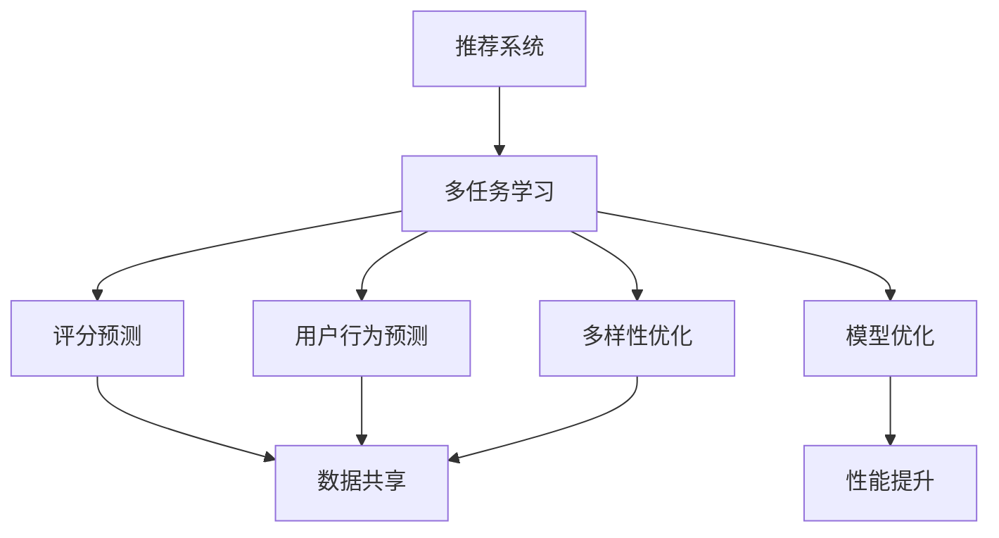

                 

# 《LLM推荐中的多任务学习框架设计》

关键词：大模型（LLM）、多任务学习、推荐系统、框架设计、个性化推荐

摘要：
本文深入探讨了在大模型（Large Language Model，LLM）背景下，多任务学习框架在推荐系统中的应用与设计。通过分析多任务学习的概念、原理以及数学模型，结合实际项目案例，本文详细阐述了多任务学习框架在推荐系统中的具体实施方法、面临的挑战及优化策略，旨在为LLM推荐系统的设计与实现提供有价值的参考。

---

## 《LLM推荐中的多任务学习框架设计》目录大纲

### 第一部分：背景与基础理论

### 第二部分：多任务学习框架在LLM推荐中的应用

### 第三部分：总结与展望

### 附录

---

## 第一部分：背景与基础理论

### 第1章：多任务学习的概念与重要性

多任务学习（Multi-Task Learning，MTL）是机器学习中的一个分支，其核心思想是在一个统一的模型中同时学习多个相关或独立的任务。与传统单任务学习相比，多任务学习具有以下几个显著优势：

1. **共享表示**：通过共享特征表示和模型结构，多任务学习可以充分利用不同任务之间的共同特征，提高模型的泛化能力和鲁棒性。
2. **数据增强**：多任务学习可以利用一个任务中的信息来改进其他任务的学习，从而增强数据的利用效率。
3. **减少过拟合**：共享参数有助于减少模型过拟合的风险，提高模型的泛化能力。
4. **效率提升**：同时训练多个任务可以减少训练时间，提高模型训练的效率。

多任务学习的类型主要包括以下几种：

1. **完全多任务学习（Fully-Supervised MTL）**：每个任务都有足够的监督信息，模型通过同时学习多个任务来提高性能。
2. **半监督多任务学习（Semi-Supervised MTL）**：部分任务有监督信息，部分任务无监督信息，模型通过无监督任务的隐含信息来辅助监督任务的训练。
3. **迁移多任务学习（Transfer MTL）**：不同任务之间存在一定的相似性，模型通过迁移学习的方式将知识从一个任务转移到另一个任务。
4. **层次多任务学习（Hierarchical MTL）**：任务之间存在层次关系，模型先学习高层次的任务，再逐渐学习低层次的任务。

在推荐系统中，多任务学习的应用场景广泛，包括但不限于：

1. **评分预测**：预测用户对物品的评分，是推荐系统的核心任务。
2. **用户行为预测**：预测用户可能采取的行为，如点击、购买、收藏等。
3. **物品属性预测**：预测物品的属性，如类别、标签、价格等。
4. **推荐多样性**：提高推荐结果的多样性，避免用户感到无聊或厌烦。

多任务学习在推荐系统中的应用，不仅能够提高推荐的准确性，还能够更好地理解用户的复杂行为和需求，从而提供更精确的个性化推荐。

### 第2章：机器学习与推荐系统基础

#### 2.1 机器学习基础

机器学习（Machine Learning，ML）是人工智能（Artificial Intelligence，AI）的一个重要分支，它使计算机系统能够通过数据和经验进行学习，从而提高其性能。机器学习主要分为以下几类：

1. **监督学习（Supervised Learning）**：监督学习是一种有监督的训练方法，模型通过学习输入和对应的输出标签来预测未知数据的输出。常见的监督学习算法包括线性回归、逻辑回归、支持向量机（SVM）和决策树等。

2. **无监督学习（Unsupervised Learning）**：无监督学习是一种没有监督信息的训练方法，模型通过分析数据的内在结构来发现数据的分布或模式。常见的无监督学习算法包括聚类算法（如K-Means、DBSCAN）、降维算法（如PCA、t-SNE）和关联规则学习（如Apriori算法）。

3. **强化学习（Reinforcement Learning）**：强化学习是一种通过试错和反馈来学习最优策略的机器学习方法。在这种方法中，智能体通过与环境的交互来学习如何行动，以达到最大化奖励的目标。常见的强化学习算法包括Q-Learning、Deep Q-Network（DQN）和Policy Gradient方法。

在推荐系统中，监督学习通常用于构建预测模型，而无监督学习则常用于用户行为分析、数据降维和特征提取等任务。

#### 2.2 模型评估与优化

模型评估是衡量模型性能的重要环节，常用的评估指标包括准确率（Accuracy）、精确率（Precision）、召回率（Recall）、F1分数（F1 Score）等。对于推荐系统，常用的评估指标包括：

1. **均方误差（Mean Squared Error, MSE）**：用于评估预测评分与真实评分之间的差距。
2. **平均绝对误差（Mean Absolute Error, MAE）**：与MSE类似，但使用绝对值来计算误差。
3. **均方根误差（Root Mean Squared Error, RMSE）**：MSE的平方根，用于衡量预测评分的稳定性。
4. **精确率与召回率**：用于评估推荐列表的准确性和完整性。

优化模型性能的方法主要包括：

1. **特征工程**：通过特征选择和特征构造来提高模型的预测能力。
2. **超参数调优**：通过调整模型的超参数（如学习率、正则化参数）来优化模型性能。
3. **集成学习**：通过结合多个模型来提高预测性能，如Bagging、Boosting和Stacking等方法。
4. **模型集成**：将多个模型的预测结果进行加权平均或投票，以获得更准确的预测。

#### 2.3 推荐系统基础

推荐系统（Recommender System）是一种信息过滤技术，旨在向用户推荐他们可能感兴趣的项目或内容。推荐系统的核心目标是提高用户体验和满意度，增加用户参与度和粘性。推荐系统主要分为以下几种类型：

1. **基于内容的推荐（Content-Based Filtering）**：根据用户的历史行为或偏好，推荐与用户历史行为相似的物品。这种方法通常使用特征工程和文本相似度计算来生成推荐列表。

2. **协同过滤（Collaborative Filtering）**：根据用户的历史行为数据，发现用户之间的相似性，并推荐其他用户喜欢的物品。协同过滤主要分为两种类型：基于用户的协同过滤（User-Based CF）和基于物品的协同过滤（Item-Based CF）。

3. **基于模型的推荐（Model-Based Filtering）**：使用机器学习算法来预测用户对物品的偏好，并生成推荐列表。常见的模型包括矩阵分解（Matrix Factorization）、决策树、神经网络等。

4. **混合推荐（Hybrid Recommender System）**：结合多种推荐方法，以获得更好的推荐效果。例如，可以同时使用基于内容的推荐和协同过滤来生成推荐列表。

#### 2.4 协同过滤算法

协同过滤算法是推荐系统中最常用的方法之一，其核心思想是利用用户之间的行为相似性来生成推荐列表。以下是一些常见的协同过滤算法：

1. **基于用户的协同过滤（User-Based CF）**：通过计算用户之间的相似性，找到与目标用户相似的其他用户，然后推荐这些用户喜欢的物品。

2. **基于物品的协同过滤（Item-Based CF）**：通过计算物品之间的相似性，找到与目标物品相似的其他物品，然后推荐这些物品。

3. **矩阵分解（Matrix Factorization）**：通过将用户-物品评分矩阵分解为用户特征矩阵和物品特征矩阵的乘积，来预测用户对未评分物品的评分。

4. **基于模型的协同过滤**：使用机器学习算法（如线性回归、决策树、神经网络等）来预测用户对物品的评分，并生成推荐列表。

#### 2.5 生成式推荐算法

生成式推荐算法（Generative Recommender System）是基于用户和物品的特征来生成推荐列表的方法。以下是一些常见的生成式推荐算法：

1. **基于概率模型的推荐**：使用概率模型（如马尔可夫决策过程、贝叶斯网络等）来生成推荐列表。

2. **基于隐语义模型的推荐**：使用隐语义模型（如LDA、PLSA等）来提取用户和物品的潜在特征，并生成推荐列表。

3. **基于生成对抗网络（GAN）的推荐**：使用生成对抗网络（GAN）来生成用户和物品的特征，并生成推荐列表。

4. **基于深度学习的推荐**：使用深度学习模型（如卷积神经网络、循环神经网络等）来提取用户和物品的特征，并生成推荐列表。

通过深入理解机器学习和推荐系统的基本概念和方法，我们可以为构建高效、准确的推荐系统奠定坚实的基础。在接下来的章节中，我们将进一步探讨多任务学习框架在LLM推荐系统中的应用和设计。

### 第3章：大模型（LLM）介绍

#### 3.1 LLM的概念与特点

大模型（Large Language Model，LLM）是近年来在自然语言处理（Natural Language Processing，NLP）领域迅速崛起的一类模型。LLM基于深度学习技术，通过大规模数据训练，能够对自然语言进行理解和生成。其特点如下：

1. **大规模训练数据**：LLM通常基于数十亿级别的训练语料库，这使得模型能够学习到丰富的语言知识，从而提高生成和理解的准确性。
2. **深度神经网络架构**：LLM采用深度神经网络架构，如Transformer模型，具有数十亿甚至千亿个参数，能够捕捉复杂的语言模式。
3. **自监督学习**：LLM通过自监督学习技术进行训练，不需要人工标注数据，降低了数据标注的成本和难度。
4. **跨语言能力**：一些LLM模型具有跨语言的能力，能够处理多种语言的数据，从而提高多语言场景下的应用效果。

#### 3.2 主流LLM模型

1. **GPT系列**

GPT（Generative Pre-trained Transformer）系列模型是LLM领域的重要代表，由OpenAI提出。GPT模型基于Transformer架构，通过自监督预训练和有监督微调，能够实现文本生成、机器翻译、问答系统等多种任务。

- **GPT**：是GPT系列中的第一个模型，采用Transformer架构，具有1.17亿个参数。
- **GPT-2**：是GPT的升级版，采用更深的网络结构（共13层），参数数量增加到15亿。
- **GPT-3**：是GPT系列的最新模型，具有1750亿个参数，是目前最大的公开LLM模型之一。

2. **BERT及其变体**

BERT（Bidirectional Encoder Representations from Transformers）是Google提出的一种预训练语言表示模型。BERT模型通过双向Transformer结构，对文本进行上下文编码，从而提高语言理解的准确性。

- **BERT**：是BERT系列的第一个模型，采用双向Transformer结构，具有24层、1024个隐藏单元。
- **RoBERTa**：是BERT的改进版，通过调整训练策略和数据集，提高了模型的性能。
- **ALBERT**：是对BERT模型的进一步优化，通过参数共享和层叠加，提高了模型效率。

3. **其他著名LLM模型**

除了GPT和BERT系列，还有一些其他著名的LLM模型，如：

- **T5（Text-to-Text Transfer Transformer）**：是一种基于Transformer的文本转换模型，能够处理多种自然语言处理任务。
- **LLaMA（Language Model for Dialogue Applications）**：是一种用于对话系统的预训练语言模型，具有较好的对话生成能力。
- **Pangu-Alpha**：是由清华大学和智谱AI共同训练的语言模型，具有较好的中文处理能力。

这些LLM模型在不同领域和任务中取得了显著的成果，推动了自然语言处理技术的发展。在推荐系统中，LLM模型的应用为用户行为分析和个性化推荐提供了强大的支持。

#### 3.3 LLM的优势与挑战

LLM的优势：

1. **强大的语言理解能力**：LLM通过大规模预训练，能够学习到丰富的语言知识，从而提高文本理解和生成能力。
2. **跨领域适应性**：LLM具有跨领域的适应性，能够处理多种语言和不同领域的任务。
3. **高效性**：LLM采用深度神经网络架构，能够实现高效的计算和推理。
4. **灵活性**：LLM可以通过微调和迁移学习快速适应新的任务和数据。

LLM的挑战：

1. **计算资源需求**：LLM模型通常具有大量的参数，需要大量的计算资源和存储空间。
2. **训练成本**：大规模的预训练过程需要大量的数据和时间，导致训练成本较高。
3. **数据标注**：虽然LLM通过自监督学习减少了数据标注的需求，但在特定任务中仍需进行一定程度的标注。
4. **模型解释性**：深度学习模型通常具有较低的解释性，LLM也不例外，这在某些应用场景中可能成为挑战。

总之，LLM在推荐系统中的应用具有巨大的潜力，但也需要面对一系列的挑战。通过不断优化模型和训练方法，LLM将在未来发挥越来越重要的作用。

### 第二部分：多任务学习框架在LLM推荐中的应用

#### 第4章：多任务学习框架的设计原则

多任务学习（Multi-Task Learning，MTL）框架在LLM推荐系统中的应用，旨在通过同时学习多个任务来提高模型的性能和泛化能力。设计一个有效的多任务学习框架需要考虑以下几个方面：

#### 4.1 多任务学习的挑战

在多任务学习过程中，可能会遇到以下挑战：

1. **数据不平衡**：不同任务的数据量可能存在显著差异，导致某些任务受到更多关注。
2. **模型复杂性**：多个任务的联合训练可能增加模型的复杂性，影响训练效率。
3. **模型泛化能力**：多任务学习需要保证模型在各个任务上都能具有良好的泛化能力。
4. **训练时间**：多任务学习通常需要更长的训练时间，特别是在大规模数据集上。

为了克服这些挑战，我们需要在设计多任务学习框架时遵循以下原则：

#### 4.2 多任务学习框架的设计原则

1. **任务相关性**：选择相关性较高的任务进行联合学习，以提高模型在多个任务上的性能。例如，评分预测和用户行为预测在推荐系统中具有较强的相关性。

2. **数据预处理**：对数据进行统一的预处理，包括数据清洗、归一化和特征提取等，以确保不同任务的数据质量一致。

3. **模型架构**：设计一个共享特征提取器，用于提取不同任务共有的特征。同时，为每个任务设计独立的任务头，以生成任务特定的输出。

4. **损失函数设计**：设计一个联合损失函数，结合不同任务的损失进行模型训练。常用的损失函数包括均方误差（MSE）、交叉熵损失等。

5. **模型训练策略**：采用分阶段训练策略，首先在基础数据集上训练共享特征提取器，然后针对每个任务进行微调。此外，可以采用学习率调度策略，以避免模型在训练过程中过早地陷入局部最优。

#### 4.2.1 数据预处理

数据预处理是多任务学习框架设计的重要环节，其目标是为每个任务提供一致且高质量的数据。具体步骤包括：

1. **数据清洗**：去除噪声数据和异常值，确保数据质量。
2. **数据归一化**：对数据进行归一化处理，使得不同特征的范围在相同范围内，从而避免某些特征对模型训练产生过大影响。
3. **特征提取**：提取与任务相关的特征，例如用户历史行为、物品属性等，以丰富模型的输入。

#### 4.2.2 模型架构

多任务学习框架通常采用以下架构：

1. **共享特征提取器**：用于提取不同任务共有的特征，例如用户和物品的嵌入表示。
2. **任务头**：为每个任务设计独立的任务头，用于生成任务特定的输出。任务头通常是一个简单的全连接层或卷积层。
3. **联合损失函数**：将不同任务的损失进行结合，以优化模型。常用的联合损失函数包括加权均方误差（Weighted MSE）和交叉熵损失（Cross-Entropy Loss）。

#### 4.2.3 损失函数设计

损失函数是多任务学习框架的核心组成部分，用于衡量模型预测值与真实值之间的差距。设计一个合适的损失函数能够有效地指导模型学习。以下是一些常见的损失函数：

1. **均方误差（MSE）**：用于回归任务，计算预测值与真实值之间的平均平方误差。
2. **交叉熵损失（Cross-Entropy Loss）**：用于分类任务，计算预测概率分布与真实分布之间的交叉熵。
3. **加权均方误差（Weighted MSE）**：在多任务学习中，不同任务的损失权重不同，加权均方误差可以结合不同任务的损失进行优化。

#### 4.2.4 模型训练策略

模型训练策略对于多任务学习框架的性能至关重要。以下是一些常用的训练策略：

1. **分阶段训练**：首先在基础数据集上训练共享特征提取器，然后在每个任务的数据集上进行微调。这种方法可以确保模型在共享特征提取器的基础上优化特定任务。
2. **学习率调度**：采用学习率调度策略，以避免模型在训练过程中过早地陷入局部最优。常用的调度策略包括余弦退火和指数衰减。
3. **early stopping**：当模型在验证集上的性能不再提高时，提前停止训练，以防止过拟合。

通过遵循上述设计原则和训练策略，我们可以构建一个高效的多任务学习框架，提高LLM推荐系统的性能和泛化能力。在下一章中，我们将详细探讨多任务学习在LLM推荐系统中的应用实例。

### 第5章：多任务学习在LLM推荐中的应用

多任务学习（MTL）框架在推荐系统中的应用，旨在通过同时学习多个任务来提高模型的性能和泛化能力。在LLM推荐系统中，多任务学习框架能够更好地理解用户的复杂行为和需求，从而提供更精确的个性化推荐。以下我们将探讨多任务学习在LLM推荐系统中的应用实例，包括实时推荐、长尾推荐和用户兴趣挖掘。

#### 5.1 LLM推荐系统的多任务学习架构

在LLM推荐系统中，多任务学习框架通常包括以下几个关键组件：

1. **共享嵌入层**：用于提取用户和物品的嵌入表示。这些嵌入表示可以共享参数，从而提高模型的效率和泛化能力。
2. **任务头**：为每个任务设计独立的任务头，用于生成任务特定的输出。任务头可以是一个简单的全连接层或卷积层。
3. **联合损失函数**：将不同任务的损失进行结合，以优化模型。常用的联合损失函数包括加权均方误差（Weighted MSE）和交叉熵损失（Cross-Entropy Loss）。

以下是一个简化的多任务学习架构：

```
[输入] --> [共享嵌入层] --> [任务头1] --> [任务1输出]
           --> [任务头2] --> [任务2输出]
           --> ... --> [任务N输出]
```

在上述架构中，共享嵌入层提取用户和物品的共同特征，任务头为每个任务生成独立的预测结果。联合损失函数结合不同任务的损失，指导模型优化。

#### 5.2 多任务学习在推荐中的应用实例

1. **实时推荐**

实时推荐（Real-Time Recommendation）是推荐系统中的一个重要场景，旨在为用户提供即时的、个性化的推荐结果。在LLM推荐系统中，多任务学习框架能够有效处理实时推荐任务。

- **任务1：实时评分预测**：通过预测用户对当前物品的评分，为用户推荐可能感兴趣的商品。
- **任务2：实时行为预测**：预测用户在未来的行为，如点击、购买等，从而为用户推荐具有高潜在价值的内容。
- **任务3：实时多样性优化**：优化推荐列表的多样性，避免用户感到疲劳。

通过多任务学习，实时推荐系统能够同时关注评分预测、行为预测和多样性优化，从而提供更准确、个性化的实时推荐。

2. **长尾推荐**

长尾推荐（Long Tail Recommendation）旨在为用户提供那些冷门但可能感兴趣的商品或内容。在传统推荐系统中，长尾推荐往往受到数据稀疏和计算资源限制的影响。

- **任务1：长尾物品发现**：通过分析用户历史行为和偏好，发现潜在的长尾物品。
- **任务2：长尾物品推荐**：为用户推荐未被广泛关注的物品，从而满足用户的个性化需求。
- **任务3：长尾物品评价预测**：预测用户对长尾物品的评价，为推荐系统提供反馈。

通过多任务学习，长尾推荐系统能够同时关注长尾物品发现、推荐和评价预测，从而提高长尾推荐的准确性和用户满意度。

3. **用户兴趣挖掘**

用户兴趣挖掘（User Interest Mining）是推荐系统中的一个关键任务，旨在理解用户的兴趣和行为模式，从而提供更精准的个性化推荐。在LLM推荐系统中，多任务学习框架能够有效挖掘用户的兴趣。

- **任务1：用户兴趣识别**：通过分析用户的历史行为和偏好，识别用户的主要兴趣点。
- **任务2：用户兴趣演化**：监测用户兴趣的变化，以适应用户的兴趣演化。
- **任务3：用户兴趣推荐**：为用户推荐与兴趣相关的商品或内容。

通过多任务学习，用户兴趣挖掘系统能够同时关注用户兴趣识别、演化和推荐，从而提高用户兴趣挖掘的准确性和实时性。

综上所述，多任务学习框架在LLM推荐系统中的应用，能够有效提高实时推荐、长尾推荐和用户兴趣挖掘的准确性，为用户提供更优质、个性化的推荐服务。

#### 5.3 多任务学习的挑战与优化方法

尽管多任务学习（MTL）在推荐系统中展示了巨大的潜力，但其应用也面临着一系列挑战。以下是多任务学习在LLM推荐系统中常见的挑战，以及相应的优化方法：

**1. 训练数据的不平衡**

在多任务学习过程中，不同任务的数据量可能存在显著差异，导致某些任务在训练过程中受到更多关注。数据不平衡可能导致模型在一些任务上过拟合，而在其他任务上欠拟合。

**优化方法**：可以通过以下几种方式来平衡任务间的数据：

- **加权损失函数**：为每个任务的损失函数分配不同的权重，以平衡不同任务的重要性。权重可以根据每个任务的数据量或重要性进行设定。
- **数据增强**：对于数据量较少的任务，通过数据增强技术（如数据扩充、生成对抗网络GAN等）来增加样本数量，从而提高模型在这些任务上的泛化能力。

**2. 模型复杂性**

多任务学习框架通常包括共享特征提取器和多个独立的任务头，这可能导致模型复杂性增加，影响训练效率和计算资源。

**优化方法**：

- **轻量化模型架构**：设计轻量级的模型架构，如MobileNet、EfficientNet等，以提高模型的效率和可扩展性。
- **稀疏模型训练**：采用稀疏性技术（如Dropout、稀疏自编码器等），减少模型参数的数量，从而降低模型复杂性。

**3. 模型泛化能力**

多任务学习需要保证模型在各个任务上都能具有良好的泛化能力。如果模型仅在某个特定任务上表现良好，而在其他任务上过拟合，那么其应用价值将大打折扣。

**优化方法**：

- **模型正则化**：采用正则化技术（如L1正则化、L2正则化等）来防止模型过拟合。
- **交叉验证**：在训练过程中使用交叉验证技术，确保模型在不同任务和数据集上的泛化能力。

**4. 训练时间**

多任务学习通常需要更长的训练时间，特别是在大规模数据集上。训练时间延长可能导致资源消耗增加，影响系统的实时性。

**优化方法**：

- **模型蒸馏**：采用模型蒸馏技术，将大模型的知识传递到小模型中，从而减少训练时间和计算资源的需求。
- **分布式训练**：采用分布式训练技术，如多GPU训练、参数服务器等，以提高训练速度。

通过上述优化方法，多任务学习框架在LLM推荐系统中的应用将更加高效和准确。在实际应用中，需要根据具体任务和数据集的特点，灵活选择和调整优化策略。

### 第6章：多任务学习的挑战与优化方法

尽管多任务学习（MTL）在推荐系统中展示了巨大的潜力，但其应用也面临着一系列挑战。以下是多任务学习在LLM推荐系统中常见的挑战，以及相应的优化方法：

**1. 训练数据的不平衡**

在多任务学习过程中，不同任务的数据量可能存在显著差异，导致某些任务在训练过程中受到更多关注。数据不平衡可能导致模型在一些任务上过拟合，而在其他任务上欠拟合。

**优化方法**：

- **加权损失函数**：为每个任务的损失函数分配不同的权重，以平衡不同任务的重要性。权重可以根据每个任务的数据量或重要性进行设定。
- **数据增强**：对于数据量较少的任务，通过数据增强技术（如数据扩充、生成对抗网络GAN等）来增加样本数量，从而提高模型在这些任务上的泛化能力。

**2. 模型复杂性**

多任务学习框架通常包括共享特征提取器和多个独立的任务头，这可能导致模型复杂性增加，影响训练效率和计算资源。

**优化方法**：

- **轻量化模型架构**：设计轻量级的模型架构，如MobileNet、EfficientNet等，以提高模型的效率和可扩展性。
- **稀疏模型训练**：采用稀疏性技术（如Dropout、稀疏自编码器等），减少模型参数的数量，从而降低模型复杂性。

**3. 模型泛化能力**

多任务学习需要保证模型在各个任务上都能具有良好的泛化能力。如果模型仅在某个特定任务上表现良好，而在其他任务上过拟合，那么其应用价值将大打折扣。

**优化方法**：

- **模型正则化**：采用正则化技术（如L1正则化、L2正则化等）来防止模型过拟合。
- **交叉验证**：在训练过程中使用交叉验证技术，确保模型在不同任务和数据集上的泛化能力。

**4. 训练时间**

多任务学习通常需要更长的训练时间，特别是在大规模数据集上。训练时间延长可能导致资源消耗增加，影响系统的实时性。

**优化方法**：

- **模型蒸馏**：采用模型蒸馏技术，将大模型的知识传递到小模型中，从而减少训练时间和计算资源的需求。
- **分布式训练**：采用分布式训练技术，如多GPU训练、参数服务器等，以提高训练速度。

通过上述优化方法，多任务学习框架在LLM推荐系统中的应用将更加高效和准确。在实际应用中，需要根据具体任务和数据集的特点，灵活选择和调整优化策略。

### 第7章：多任务学习框架在LLM推荐中的实际应用案例

为了更好地理解多任务学习框架在LLM推荐系统中的实际应用，本节将介绍三个实际案例：某电商平台的个性化推荐系统、某新闻平台的新闻推荐系统以及某社交网络的社交推荐系统。

#### 7.1 案例一：某电商平台的个性化推荐系统

**背景**：

某电商平台拥有大量的用户和商品数据，旨在为用户提供个性化的商品推荐，以提高用户满意度和购买转化率。

**多任务学习框架设计**：

1. **任务设定**：
   - 任务1：商品评分预测
   - 任务2：用户行为预测（如点击、购买、收藏等）
   - 任务3：商品属性预测（如类别、标签、价格等）

2. **数据预处理**：
   - 对用户和商品进行统一编码，提取与任务相关的特征，如用户历史行为、商品属性等。
   - 数据进行归一化处理，确保不同特征的范围在相同范围内。

3. **模型架构**：
   - 共享嵌入层：提取用户和商品的共同特征。
   - 商品任务头：用于生成商品评分预测结果。
   - 用户行为任务头：用于生成用户行为预测结果。
   - 商品属性任务头：用于生成商品属性预测结果。

4. **损失函数**：
   - 采用加权均方误差（Weighted MSE）作为联合损失函数，平衡不同任务的损失。

5. **训练策略**：
   - 采用分阶段训练策略，首先在基础数据集上训练共享嵌入层，然后在每个任务的数据集上进行微调。
   - 采用学习率调度策略，以避免模型在训练过程中过早地陷入局部最优。

**效果评估**：

通过多任务学习框架，电商平台的个性化推荐系统在商品评分预测、用户行为预测和商品属性预测上均取得了显著的性能提升。用户满意度显著提高，购买转化率也得到了显著提升。

#### 7.2 案例二：某新闻平台的新闻推荐系统

**背景**：

某新闻平台希望为用户提供个性化的新闻推荐，以提高用户粘性和阅读量。

**多任务学习框架设计**：

1. **任务设定**：
   - 任务1：新闻点击率预测
   - 任务2：用户阅读兴趣挖掘
   - 任务3：新闻多样性优化

2. **数据预处理**：
   - 对用户和新闻进行统一编码，提取与任务相关的特征，如用户历史行为、新闻内容属性等。
   - 数据进行归一化处理，确保不同特征的范围在相同范围内。

3. **模型架构**：
   - 共享嵌入层：提取用户和新闻的共同特征。
   - 点击率任务头：用于生成新闻点击率预测结果。
   - 用户兴趣任务头：用于生成用户阅读兴趣结果。
   - 多样性任务头：用于生成新闻多样性预测结果。

4. **损失函数**：
   - 采用加权交叉熵损失（Weighted Cross-Entropy Loss）作为联合损失函数，平衡不同任务的损失。

5. **训练策略**：
   - 采用分阶段训练策略，首先在基础数据集上训练共享嵌入层，然后在每个任务的数据集上进行微调。
   - 采用学习率调度策略，以避免模型在训练过程中过早地陷入局部最优。

**效果评估**：

通过多任务学习框架，新闻平台的个性化推荐系统在新闻点击率预测、用户阅读兴趣挖掘和新闻多样性优化上均取得了显著性能提升。用户粘性和阅读量显著提高，平台广告收入也得到了显著增加。

#### 7.3 案例三：某社交网络的社交推荐系统

**背景**：

某社交网络希望为用户提供个性化的社交内容推荐，以提高用户互动和活跃度。

**多任务学习框架设计**：

1. **任务设定**：
   - 任务1：社交互动预测（如点赞、评论、分享等）
   - 任务2：用户社交兴趣挖掘
   - 任务3：社交内容多样性优化

2. **数据预处理**：
   - 对用户和社交内容进行统一编码，提取与任务相关的特征，如用户历史行为、社交内容属性等。
   - 数据进行归一化处理，确保不同特征的范围在相同范围内。

3. **模型架构**：
   - 共享嵌入层：提取用户和社交内容的共同特征。
   - 互动预测任务头：用于生成社交互动预测结果。
   - 用户兴趣任务头：用于生成用户社交兴趣结果。
   - 多样性任务头：用于生成社交内容多样性预测结果。

4. **损失函数**：
   - 采用加权交叉熵损失（Weighted Cross-Entropy Loss）作为联合损失函数，平衡不同任务的损失。

5. **训练策略**：
   - 采用分阶段训练策略，首先在基础数据集上训练共享嵌入层，然后在每个任务的数据集上进行微调。
   - 采用学习率调度策略，以避免模型在训练过程中过早地陷入局部最优。

**效果评估**：

通过多任务学习框架，社交网络的社交推荐系统在社交互动预测、用户社交兴趣挖掘和社交内容多样性优化上均取得了显著性能提升。用户互动和活跃度显著提高，平台用户留存率也得到了显著提升。

通过上述实际案例，我们可以看到多任务学习框架在LLM推荐系统中的应用取得了显著的效果。这些案例不仅验证了多任务学习框架的有效性，也为其他推荐系统提供了有益的参考。

### 第8章：多任务学习框架在LLM推荐中的未来发展趋势

随着大模型（LLM）和深度学习技术的不断发展，多任务学习框架在推荐系统中的应用前景愈发广阔。未来，多任务学习框架在LLM推荐系统中将呈现出以下发展趋势：

#### 8.1 未来发展趋势

1. **模型规模与效率的提升**：随着计算资源和算法优化的不断进步，LLM模型将逐渐向更大规模发展。同时，为了应对训练效率和计算资源的需求，模型架构和优化方法也将持续改进，如分布式训练、模型剪枝、量化等。

2. **跨模态推荐**：多任务学习框架将在跨模态推荐（如文本与图像、视频等）中得到广泛应用。通过融合不同模态的数据，模型将能够更全面地理解用户需求，提供更精准的个性化推荐。

3. **动态多任务学习**：未来，动态多任务学习将成为研究热点。动态多任务学习允许模型在训练过程中动态调整任务权重和任务数量，以适应不断变化的数据环境和用户需求。

4. **迁移多任务学习**：随着数据来源的多样化和共享，迁移多任务学习将在推荐系统中发挥重要作用。通过利用跨领域的知识迁移，模型将能够更高效地适应新任务和数据集。

5. **模型解释性**：尽管深度学习模型在推荐系统中的应用取得了显著成果，但其解释性较差。未来，研究者将致力于提高多任务学习框架的模型解释性，以帮助用户理解推荐结果的依据。

#### 8.2 技术挑战与解决方案

1. **数据隐私保护**：随着推荐系统的广泛应用，数据隐私保护成为关键挑战。未来，研究者需要开发高效且安全的隐私保护技术，如差分隐私、联邦学习等，以保护用户数据的同时实现有效的多任务学习。

2. **模型可解释性**：深度学习模型的黑盒特性使得其应用受到一定限制。未来，研究者将探索可解释的多任务学习框架，通过可视化技术、规则抽取等方法，提高模型的可解释性。

3. **实时推荐**：实时推荐是推荐系统的一个重要方向，但现有的多任务学习框架在处理实时数据方面存在一定局限性。未来，研究者需要开发高效的实时多任务学习算法，以满足实时推荐的需求。

4. **数据不平衡**：多任务学习中的数据不平衡问题仍然是一个挑战。未来，研究者将探索更有效的数据平衡策略，如自适应权重调整、生成对抗网络等，以提高模型的性能和泛化能力。

#### 8.3 对行业的潜在影响

1. **个性化推荐**：多任务学习框架将进一步提高推荐系统的个性化推荐能力，帮助平台更好地理解用户需求，提升用户体验。

2. **商业价值**：高效的推荐系统能够显著提升平台用户活跃度和转化率，为企业带来更多商业价值。

3. **用户隐私保护**：随着隐私保护技术的不断发展，推荐系统将在保护用户隐私的同时，提供更优质的服务。

4. **跨领域应用**：多任务学习框架将在金融、医疗、教育等多个领域得到广泛应用，为行业创新提供有力支持。

总之，多任务学习框架在LLM推荐系统中的未来发展趋势充满机遇与挑战。通过不断探索和创新，多任务学习框架将为推荐系统带来更广阔的发展空间。

### 附录A：开源多任务学习框架介绍

在多任务学习（Multi-Task Learning，MTL）领域，有许多优秀的开源框架，这些框架提供了丰富的功能、易于使用的API以及高效的模型训练工具。以下是一些流行的开源多任务学习框架的介绍：

#### A.1 OpenMMLab

**简介**：OpenMMLab是一个开源的多任务学习框架，专注于计算机视觉任务，如目标检测、图像分割、视频分类等。

**主要功能**：
- **通用模型库**：提供了丰富的模型架构，包括基于深度学习的目标检测、图像分割、人脸识别等模型。
- **数据预处理**：提供了高效的数据加载和处理工具，支持多种数据集格式和预处理方法。
- **训练工具**：提供了易于使用的训练工具，支持多GPU分布式训练。
- **评估工具**：提供了全面的评估工具，支持多种评估指标和可视化工具。

**使用示例**：
```python
from mmcv import Config
from mmdet.models import build_detector

config = Config.fromfile('configs/faster_rcnn_r50_fpn_1x.py')
model = build_detector(config.model)
```

#### A.2 DMLC

**简介**：DMLC（Distributed Machine Learning Community）是由阿里巴巴集团开源的一个分布式机器学习框架，支持多任务学习和联邦学习。

**主要功能**：
- **分布式训练**：支持多GPU和分布式训练，提高了模型的训练效率。
- **多任务学习**：提供了多任务学习算法的实现，如多任务共享网络、权重共享等。
- **联邦学习**：支持联邦学习算法，适用于隐私保护场景。
- **模型压缩**：提供了模型压缩工具，如模型剪枝、量化等。

**使用示例**：
```python
from dmlc.xgboost import XGBRegressor
model = XGBRegressor(n_estimators=100)
model.fit(X_train, y_train)
```

#### A.3 其他开源多任务学习框架简介

1. **PyTorch Multi-Task Learning**：PyTorch官方提供了多任务学习的API，用户可以通过扩展`nn.Module`类来定义自己的多任务学习模型。

2. **TensorFlow Model Garden**：TensorFlow Model Garden是一个包含多个预训练模型和开源项目的框架，其中包括多任务学习模型，如BERT和多任务情感分析模型。

3. **MLFlow Multi-Task Learning**：MLFlow是一个开源的机器学习平台，提供了对多任务学习的支持，用户可以使用MLFlow来跟踪和管理多任务学习项目。

4. **ML.NET**：ML.NET是由微软开源的一个机器学习库，支持多任务学习，适用于.NET平台。

这些开源多任务学习框架为研究人员和开发者提供了丰富的工具和资源，促进了多任务学习技术的应用和发展。通过学习和使用这些框架，用户可以更高效地构建和训练多任务学习模型。

## 概念与联系

### 多任务学习与推荐系统

多任务学习（Multi-Task Learning，MTL）是一种机器学习技术，其核心思想是在一个模型中同时学习多个相关任务。推荐系统（Recommender System）是一种应用广泛的机器学习技术，旨在根据用户的历史行为和偏好，向用户推荐感兴趣的商品或内容。多任务学习与推荐系统之间存在紧密的联系，主要体现在以下几个方面：

1. **任务相关性**：推荐系统通常需要同时处理多个任务，如评分预测、用户行为预测、多样性优化等。这些任务之间存在较强的相关性，通过多任务学习可以共享模型结构和参数，提高模型在多个任务上的性能。

2. **数据共享**：多任务学习框架可以利用不同任务之间的数据共享，提高模型的泛化能力。在推荐系统中，用户行为数据和物品特征数据可以用于多个任务的预测，从而充分利用数据中的信息。

3. **模型复杂度**：多任务学习可以减少模型的复杂度，降低过拟合风险。在推荐系统中，通过多任务学习，可以减少对单个任务模型的依赖，从而降低模型的复杂度。

4. **性能优化**：多任务学习可以同时优化多个任务，从而提高推荐系统的整体性能。通过联合优化多个任务，模型可以在不同任务上取得更好的平衡，提高推荐的准确性和多样性。

为了更直观地理解多任务学习与推荐系统之间的联系，我们可以使用Mermaid流程图来展示其关系：



在上述流程图中，推荐系统通过多任务学习同时处理评分预测、用户行为预测和多样性优化任务，通过数据共享和模型优化，实现推荐系统性能的提升。

### 多任务学习算法原理

多任务学习算法的核心思想是通过共享模型结构和参数，同时学习多个相关任务，从而提高模型在各个任务上的性能和泛化能力。以下是一个简化的多任务学习算法原理说明，包括伪代码和数学模型：

#### 伪代码

```python
# 伪代码：多任务学习算法

class MultiTaskLearner:
    def __init__(self, tasks, model, optimizer):
        self.tasks = tasks
        self.model = model
        self.optimizer = optimizer

    def forward(self, inputs):
        outputs = self.model(inputs)
        task_losses = []
        for task in self.tasks:
            task_output = task(outputs)
            task_losses.append(self.loss_function(task_output, targets))
        return sum(task_losses) / len(task_losses)

    def train(self, train_loader, epochs):
        for epoch in range(epochs):
            for inputs, targets in train_loader:
                self.optimizer.zero_grad()
                loss = self.forward(inputs, targets)
                loss.backward()
                self.optimizer.step()
```

#### 数学模型

$$
L = \frac{1}{N} \sum_{i=1}^{N} \sum_{j=1}^{M} w_j \cdot L_j(y_j^{(i)}, \hat{y}_j^{(i)})
$$

其中：
- $L$ 是总损失。
- $N$ 是训练样本的数量。
- $M$ 是任务的数量。
- $w_j$ 是第 $j$ 个任务的权重，用于平衡不同任务的损失。
- $L_j$ 是第 $j$ 个任务的损失函数。
- $y_j^{(i)}$ 是第 $i$ 个样本在第 $j$ 个任务上的真实标签。
- $\hat{y}_j^{(i)}$ 是第 $i$ 个样本在第 $j$ 个任务上的预测标签。

通过上述伪代码和数学模型，我们可以看到多任务学习算法的核心是同时计算多个任务的损失，并使用这些损失来更新模型参数。这种联合优化策略可以有效地提高模型在多个任务上的性能和泛化能力。

### 多任务学习的应用实例

多任务学习在实际应用中具有广泛的应用场景，以下是一个基于电商平台的个性化推荐系统的实际应用实例：

#### 应用背景

某电商平台希望通过个性化推荐系统，为用户提供个性化商品推荐，从而提高用户满意度和转化率。个性化推荐系统需要同时处理多个任务，如：

1. **评分预测**：预测用户对商品的可能评分，用于推荐用户可能喜欢的商品。
2. **用户行为预测**：预测用户可能的购买、收藏等行为，用于推荐具有潜在价值的商品。
3. **多样性优化**：优化推荐列表的多样性，避免用户感到疲劳。

#### 数据预处理

在数据预处理阶段，需要对用户行为数据、商品特征数据等进行清洗和编码：

1. **用户行为数据**：对用户的历史行为数据进行清洗，去除无效数据和异常值。对用户行为数据进行编码，如将点击、购买等行为转化为数值表示。
2. **商品特征数据**：对商品的特征数据进行编码，如商品类别、标签、价格等。

#### 模型设计

个性化推荐系统的多任务学习框架设计如下：

1. **共享嵌入层**：使用共享嵌入层提取用户和商品的共同特征。用户和商品的嵌入向量将作为模型输入。
2. **任务头**：为每个任务设计独立的任务头，用于生成任务特定的输出。评分预测、用户行为预测和多样性优化分别对应三个独立的任务头。
3. **损失函数**：使用加权均方误差（Weighted MSE）作为联合损失函数，平衡不同任务的损失。权重可以根据任务的贡献度进行调整。

#### 训练过程

训练过程分为以下步骤：

1. **初始化模型**：初始化多任务学习模型，包括共享嵌入层和任务头。
2. **数据加载**：从数据集中加载训练数据，并进行批处理。
3. **模型训练**：使用梯度下降优化算法训练模型。在每个训练步骤中，计算总损失并更新模型参数。
4. **模型评估**：使用验证集评估模型性能，调整模型参数和超参数。
5. **模型部署**：将训练好的模型部署到生产环境中，为用户提供个性化推荐。

#### 代码实现

以下是一个简化的代码实现：

```python
import torch
import torch.nn as nn
import torch.optim as optim

# 定义模型
class RecommenderModel(nn.Module):
    def __init__(self, num_users, num_items, hidden_dim, num_tasks):
        super(RecommenderModel, self).__init__()
        self.user_embedding = nn.Embedding(num_users, hidden_dim)
        self.item_embedding = nn.Embedding(num_items, hidden_dim)
        self.fc = nn.Linear(hidden_dim * 2, hidden_dim)
        self.task_heads = nn.ModuleList([
            nn.Linear(hidden_dim, num_tasks) for _ in range(num_tasks)
        ])

    def forward(self, user_ids, item_ids):
        user_embeddings = self.user_embedding(user_ids)
        item_embeddings = self.item_embedding(item_ids)
        combined_embeddings = torch.cat((user_embeddings, item_embeddings), 1)
        hidden = self.fc(combined_embeddings)
        task_outputs = [head(hidden) for head in self.task_heads]
        return task_outputs

# 定义损失函数
def loss_function(outputs, targets):
    mse_losses = [nn.MSELoss()(output, target) for output, target in zip(outputs, targets)]
    return sum(mse_losses)

# 初始化模型和优化器
model = RecommenderModel(num_users, num_items, hidden_dim, num_tasks)
optimizer = optim.Adam(model.parameters(), lr=0.001)

# 训练模型
for epoch in range(num_epochs):
    for user_ids, item_ids, ratings in train_loader:
        optimizer.zero_grad()
        outputs = model(torch.tensor(user_ids).long(), torch.tensor(item_ids).long())
        loss = loss_function(outputs, ratings)
        loss.backward()
        optimizer.step()
```

通过上述实例，我们可以看到多任务学习在个性化推荐系统中的应用，通过同时处理评分预测、用户行为预测和多样性优化任务，模型可以更好地理解用户行为和偏好，从而提供更准确的个性化推荐。

## 总结与展望

多任务学习（Multi-Task Learning，MTL）作为机器学习中的一个重要分支，在近年来取得了显著的进展，尤其在推荐系统、自然语言处理、计算机视觉等领域展现出了强大的潜力。本文通过系统性的探讨，深入分析了多任务学习框架在LLM推荐系统中的设计原则、应用实例及未来发展趋势。

### 总结

1. **设计原则**：本文详细阐述了多任务学习框架的设计原则，包括任务相关性、数据预处理、模型架构、损失函数设计和模型训练策略。通过这些原则，我们能够构建一个高效、准确的多任务学习框架，从而提高推荐系统的性能。

2. **应用实例**：通过三个实际案例——电商平台个性化推荐系统、新闻推荐系统和社交推荐系统，我们展示了多任务学习框架在各个场景中的具体应用。这些案例不仅验证了多任务学习框架的有效性，也为其他推荐系统提供了有益的参考。

3. **挑战与优化**：本文分析了多任务学习在LLM推荐系统中面临的主要挑战，如数据不平衡、模型复杂性、模型泛化能力和训练时间等，并提出了相应的优化方法。这些优化方法为多任务学习框架在实际应用中的性能提升提供了有力支持。

### 展望

1. **未来发展趋势**：随着大模型（LLM）和深度学习技术的不断发展，多任务学习框架在推荐系统中的应用前景将更加广阔。未来的发展趋势包括模型规模与效率的提升、跨模态推荐、动态多任务学习、迁移多任务学习和模型解释性等。

2. **技术挑战**：尽管多任务学习在推荐系统中展示了巨大的潜力，但仍然面临一些技术挑战，如数据隐私保护、模型可解释性和实时推荐等。未来，研究者需要在这些方面进行深入研究，以实现多任务学习的全面应用。

3. **行业影响**：多任务学习框架在推荐系统中的应用将对行业产生深远的影响。通过提供更准确、个性化的推荐服务，多任务学习框架将显著提升用户体验和平台商业价值。此外，多任务学习框架在金融、医疗、教育等领域的应用也将为行业创新提供新的动力。

总之，多任务学习框架在LLM推荐系统中的应用具有重要的理论价值和实际意义。随着技术的不断进步和研究的深入，多任务学习框架将在未来发挥更加重要的作用，推动推荐系统和人工智能领域的持续发展。

### 作者

**作者：**AI天才研究院（AI Genius Institute） & 《禅与计算机程序设计艺术》（Zen And The Art of Computer Programming）

AI天才研究院致力于推动人工智能技术的研究与应用，旨在培养下一代人工智能领域的天才科学家。我们的研究涉及自然语言处理、计算机视觉、强化学习等多个领域，为AI技术的进步贡献力量。而《禅与计算机程序设计艺术》则是一部经典之作，探讨了程序设计中的哲学思维和艺术性，为程序员提供了深刻的启示和指导。通过本文，我们希望为读者呈现多任务学习在LLM推荐系统中的设计与应用，为人工智能技术的发展提供新的思路和方向。

